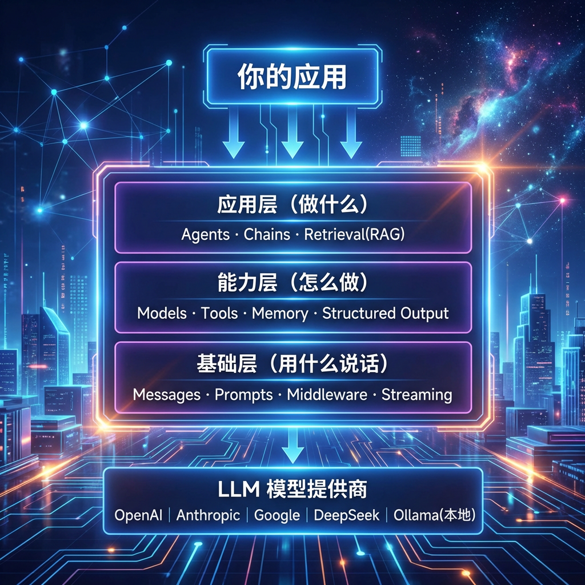
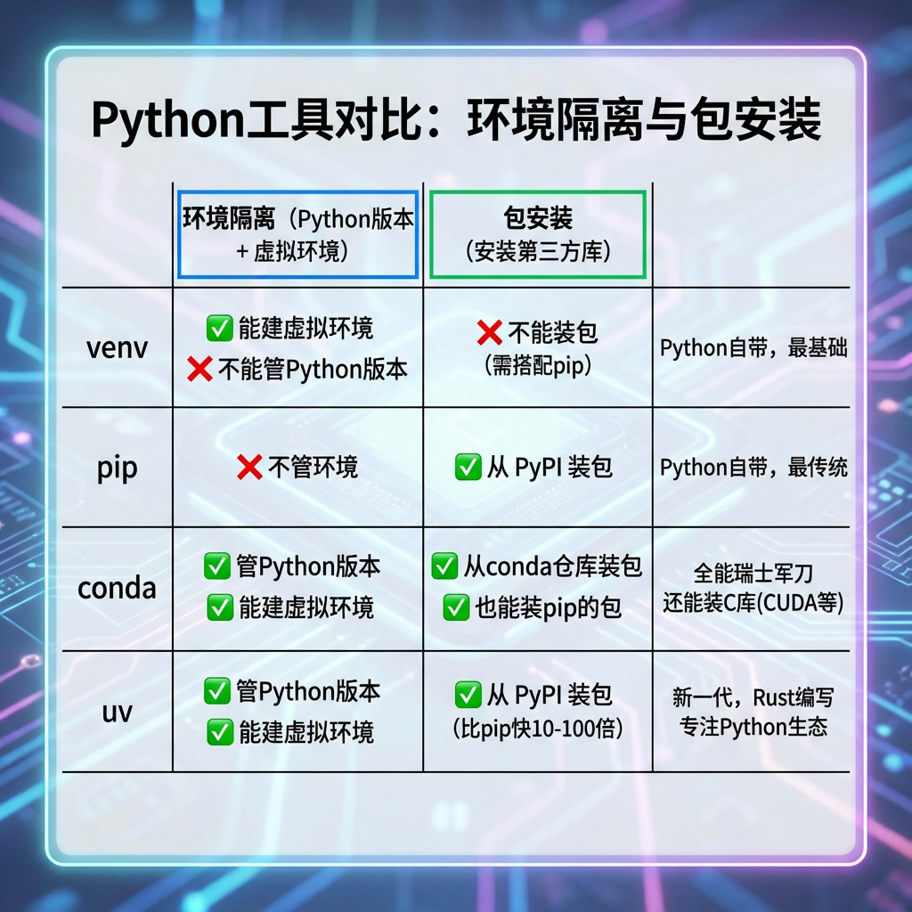

# LangChain概述与环境准备

> 尚硅谷大模型技术之LangChain V1.x

---

## 1、为什么需要 LangChain

### 1.1 开发者面临的现实痛点

在大语言模型（LLM）如 ChatGPT、Claude、DeepSeek 等快速发展的今天，开发者不仅希望能"使用"这些模型，还希望能将它们灵活集成到自己的应用中。但真正动手开发时，会发现事情远没有那么简单：

| 你想实现的功能 | 直接用API你要做的事 |
|--------------|-------------------|
| 保持上下文、记忆历史对话 | 自己管理对话状态、拼接消息列表、控制token上限 |
| 让模型访问私有数据（RAG） | 自己搭建向量数据库、写检索逻辑、处理文档切分 |
| 让模型调用计算器、查天气等工具 | 自己定义函数schema、解析模型返回的JSON、处理异常 |
| 复杂任务分步执行、自主规划 | 自己写循环、状态机、重试逻辑……从零搭建Agent架构 |
| 输出符合特定格式的JSON数据 | 自己写正则或解析器、处理模型输出不规范的情况 |
| 从OpenAI换成Claude或DeepSeek | 改接口、改参数、改解析逻辑……几乎重写一遍 |

每一项单独做都不算太难，但当它们组合在一起时，你会发现自己80%的时间都花在了**重复造轮子**上，而不是业务逻辑本身。

### 1.2 有了API还不够吗？

不使用LangChain，确实可以直接调用模型API完成开发。下面用一个最简单的例子看看区别：

**方式一：直接调用OpenAI API**

```python
import openai

# 需要自己管理对话历史、解析输出、处理工具调用……
response = openai.chat.completions.create(
    model="gpt-4",
    messages=[{"role": "user", "content": "你好"}]
)
print(response.choices[0].message.content)
```

**方式二：使用LangChain**

```python
from langchain_openai import ChatOpenAI

# 统一接口，支持流式、批处理、异步，换模型只改一行
llm = ChatOpenAI(model="gpt-4")
response = llm.invoke("你好")
print(response.content)
```

这只是最简单的调用，差距还不明显。但一旦你需要加上**记忆、工具调用、RAG、结构化输出**，直接用API的代码量会呈指数增长，而LangChain始终保持简洁统一的写法。

### 1.3 LangChain到底帮你省了什么

| 核心价值 | 说明 |
|---------|------|
| **不用重复造轮子** | 对话管理、工具调用、RAG流程……都是现成的标准化组件 |
| **模型随便换** | 统一接口，OpenAI → Anthropic → DeepSeek → 本地模型，改一行配置搞定 |
| **专注业务逻辑** | 底层的消息拼接、参数解析、异常处理，框架帮你做了 |
| **生态极其丰富** | 70+ 模型提供商、100+ 工具集成、50+ 向量数据库集成 |
| **出了Bug好查** | LangSmith 提供可视化调试，每一步调用、每一次工具执行都能追踪 |

> 一句话总结：**LangChain 让你把精力从"怎么调API"转移到"怎么做产品"上。**

---

## 2、什么是 LangChain

### 2.1 定义与背景

带着上面的痛点，我们来认识解决方案——

LangChain 是2022年10月由哈佛大学的 Harrison Chase（哈里森·蔡斯）发起研发的开源框架，用于开发由大语言模型（LLMs）驱动的应用程序。

> **官方定义**：LangChain 是构建由大语言模型驱动的应用程序的最简单方式。只需不到10行代码，即可连接OpenAI、Anthropic、Google等多种模型。LangChain提供了预构建的Agent架构和模型集成，帮助快速将LLM无缝集成到Agent和应用中。

> **历史背景**：LangChain 的发布（2022年10月）比ChatGPT问世（2022年11月）还要早一个月，从这个启动日期也可以看出创始人的眼光，占了先机的它迅速获得广泛关注和支持！目前LangChain已成为大模型应用开发领域最流行的框架之一。

### 2.2 LangChain 能做什么

回顾第1节中的那些痛点，LangChain 对每一项都提供了开箱即用的解决方案：

| 应用场景 | LangChain 怎么帮你 | 典型应用 |
|---------|-------------------|---------|
| **Agent（智能代理）** | 预构建的Agent架构，自主规划步骤并调用工具 | 虚拟助手、自动化工作流 |
| **RAG（检索增强生成）** | 内置 DocumentLoader → TextSplitter → VectorStore → Retriever 全链路 | 企业知识库问答、文档分析 |
| **工具调用** | `@tool` 装饰器一行定义，模型自动识别和调用 | 计算器、天气查询、数据库操作 |
| **问答系统（QA）** | 结合检索和模型，构建基于知识库的智能问答 | 客服机器人、内部知识库 |
| **多Agent系统** | 多个Agent协作，分工完成复杂任务 | 项目管理、复杂决策支持 |

### 2.3 LangChain 生态全景：LangChain vs LangGraph vs Deep Agents

LangChain 并不是一个孤立的库，它背后是一个**三层架构的完整生态**。这三层并非互相竞争，而是从底层到高层、层层构建的关系。官方分别称之为：**Agent 运行时（Runtime）**、**Agent 框架（Framework）**、**Agent 套件（Harness）**。

#### 一句话理解层级关系

```
Deep Agents（套件）  ── 建立在 ──▶  LangChain（框架）  ── 建立在 ──▶  LangGraph（运行时）
    自动驾驶汽车                        汽 车                           发 动 机
  "给目的地就出发"                 "自己组装零件开车"                "自己造引擎、画电路"
```

#### 三者详细对比

| 维度 | **LangGraph**（运行时） | **LangChain**（框架） | **Deep Agents**（套件） |
|------|----------------------|---------------------|----------------------|
| **官方定位** | Agent 运行时 | Agent 框架 | Agent 套件（Harness） |
| **核心理念** | 用"图"精确控制每一步流程 | 提供标准化抽象层，自由组装组件 | 开箱即用，内置最佳实践 |
| **适用场景** | 需要确定性流程 + AI决策的企业级编排 | 自定义Agent、RAG、工具链等通用开发 | 复杂、长时间运行的自主Agent任务 |
| **控制力** | ⭐⭐⭐⭐⭐ 最强，每个节点/边都你说了算 | ⭐⭐⭐ 中等，可自定义但有抽象约束 | ⭐⭐ 较弱，信任LLM自主决策 |
| **上手难度** | 🔴 较高，需理解图结构、状态管理 | 🟡 中等，10行代码即可上手 | 🟢 最低，几行代码跑起来 |
| **内置能力** | 状态持久化、检查点、人机协作、流式传输 | 70+模型提供商、标准化接口、提示词模板 | 规划工具（Todo）、虚拟文件系统、子Agent生成、自动对话压缩 |
| **工作流定义** | 开发者预先定义（确定性） | 开发者通过链和工具组合定义 | LLM在运行时自主决定（自主性） |
| **Token消耗** | 最可控 | 中等 | 较高（规划、压缩等内置功能会额外消耗） |

#### 如何选择？

```
你的需求是什么？
│
├─ "我想快速搞一个能干活的智能体，不想操心架构"
│   └──▶ 用 Deep Agents（几行代码，开箱即用）
│
├─ "我需要自定义提示词、工具链、RAG流程，灵活组装"
│   └──▶ 用 LangChain（核心框架，灵活 + 生态丰富）   ← 本课程重点
│
└─ "我要精确控制每一步、需要审批节点/回滚/人工审核"
    └──▶ 用 LangGraph（企业级编排，控制力最强）
```

#### 代码风格对比

**LangGraph** — 手动定义图结构（控制力最强）：

```python
from langgraph.graph import StateGraph

graph = StateGraph(State)
graph.add_node("research", research_node)
graph.add_node("write", write_node)
graph.add_edge("research", "write")     # 每一步流转都你说了算
app = graph.compile()
```

**LangChain** — 使用框架抽象（灵活 + 标准化）：

```python
from langchain_openai import ChatOpenAI
from langchain.agents import create_agent

llm = ChatOpenAI(model="gpt-4")
agent = create_agent(llm, tools=[search, calculator])
agent.invoke({"messages": [{"role": "user", "content": "..."}]})
```

**Deep Agents** — 开箱即用（最省心）：

```python
from deepagents import create_deep_agent

agent = create_deep_agent(
    model="openai:gpt-4",
    tools=[search],
    system_prompt="You are a research assistant"
)
agent.invoke({"messages": [{"role": "user", "content": "..."}]})
```

> **重要提示**：三者层层构建——Deep Agents 建立在 LangChain 之上，LangChain 又建立在 LangGraph 之上。无需了解 LangGraph 即可使用 LangChain 的基础功能，随着项目复杂度增长，可以随时向下钻一层获得更多控制权。**本课程以 LangChain 为主线展开教学。**

### 2.4 相关资源

- **GitHub地址**：https://github.com/langchain-ai/langchain
- **官网地址**：https://www.langchain.com/
- **官方文档**：https://docs.langchain.com/
- **API 文档**：https://reference.langchain.com/python/langchain/

---

## 3、LangChain 核心架构总览

前两节我们知道了"为什么需要 LangChain"以及"它是什么"。在动手写代码之前，先花两分钟建立一个全局视角——LangChain 内部到底有哪些模块、它们之间是什么关系。

> **注意**：本节只做"地图"，不做"导游"。每个模块的详细用法和代码实战将在后续对应课件中展开。

### 3.1 架构分层图



### 3.2 三层模块速览

#### 基础层 — "用什么说话"

这一层定义了 LangChain 与模型之间的通信协议，是所有上层功能的地基。

| 模块 | 一句话说明 | 后续课件 |
|------|----------|---------|
| **Messages** | 标准化消息格式（SystemMessage、HumanMessage、AIMessage、ToolMessage） | Model I/O |
| **Prompts** | 提示词模板，支持变量插入和复用 | Prompts |
| **Streaming** | 实时流式输出，逐token返回结果 | Model I/O |
| **Middleware** | v1.x 新增，在模型调用前后插入重试、缓存、超时等逻辑 | 高级篇 |

#### 能力层 — "怎么做"

这一层提供了模型之上的核心能力组件，每个组件独立可用，也可自由组合。

| 模块 | 一句话说明 | 后续课件 |
|------|----------|---------|
| **Models** | 统一的模型调用接口，支持 Chat Models、LLMs、Embeddings，所有模型都用 `invoke/batch/stream` | Model I/O |
| **Tools** | 用 `@tool` 装饰器定义函数，让模型具备调用外部API的能力 | Tools |
| **Memory** | 管理对话历史——短期记忆（当前会话）、长期记忆（跨会话）、摘要记忆（压缩token） | Memory |
| **Structured Output** | 用 Pydantic 模型约束输出格式，确保返回标准JSON | Output Parsers |

#### 应用层 — "做什么"

这一层是面向业务场景的顶层模块，组合下面两层的能力来解决实际问题。

| 模块 | 一句话说明 | 后续课件 |
|------|----------|---------|
| **Chains** | 用管道符 `prompt | llm | parser` 把多个组件串成一条流水线 | Chains（LCEL） |
| **Retrieval (RAG)** | DocumentLoader → TextSplitter → VectorStore → Retriever，检索增强生成全链路 | RAG |
| **Agents** | 自主规划执行步骤，循环调用工具直到完成任务（Tool Calling / ReAct） | Agents |

### 3.3 模块间的协作关系

用一个实际场景来理解这些模块如何配合——"基于公司内部文档的智能问答机器人"：

```
用户提问："我们公司的年假政策是什么？"
    │
    ▼
 Prompts        ← 将用户问题嵌入提示词模板
    │
    ▼
 Retrieval      ← 从向量数据库检索相关文档片段
    │
    ▼
 Models         ← 将问题 + 检索结果发送给LLM
    │
    ▼
 Structured     ← 要求模型按指定JSON格式返回
 Output
    │
    ▼
 Memory         ← 将本轮问答存入记忆，支持追问
```

当你需要模型在回答过程中**自主决定是否检索、何时调用工具**时，就把上面这条链交给 **Agent** 来编排——Agent 会根据模型的推理结果动态决定下一步。

> **学习建议**：不需要现在记住每个模块的细节。后续课件会按照 `Model I/O → Prompts → Chains → Memory → Tools → RAG → Agents → LangGraph` 的顺序逐一深入，每个模块都有独立的代码实战。

---

## 4、环境准备

### 4.1 基本要求

本课程需要新建虚拟环境，Python 版本为 **3.10+**。

### 4.2 conda、uv、pip、venv 到底是什么关系？

在正式搭建环境之前，先花一分钟理清这几个工具的关系——很多同学在这里被绕晕。

> 1、 内建的模块 不需要你手动的安装，只要你有python 的sdk 可以。 time /os...
>
> 2、第三方的模块，需要手动的安装（用什么 安装什么...可控） lanchain/langchain-deepseek/langchain-openai/langchain-an...
>
> 3、自己的模块，不需要手动安装，只需要引入就可以。 app.a.py  from app.a import  


开发 Python 项目，你需要解决两个问题：**① 环境隔离**（不同项目用不同的 Python 版本和依赖，互不干扰）和 **② 包安装**（把 numpy、langchain 这些库装进来）。市面上的工具就是围绕这两件事做的，只不过各自覆盖的范围不同：



简单说：**venv + pip** 是 Python 自带的"原始组合"，能用但体验一般；**conda** 是"什么都管的瑞士军刀"，功能全但体积大、速度慢；**uv** 是"新一代替代品"，速度极快、功能覆盖 venv + pip 的全部能力，还能管理 Python 版本。

#### 本课程为什么选 uv 而不是 conda？

| 对比维度 | conda | uv |
|---------|-------|-----|
| 安装包速度 | 较慢（依赖解析复杂） | 极快（Rust 编写，快 10-100 倍） |
| 管理 Python 版本 | ✅ | ✅（`uv python install 3.12`） |
| 虚拟环境 | ✅ | ✅（`uv init` 自动创建） |
| 依赖锁定 | `environment.yml`（不精确） | `uv.lock`（精确锁定，可复现） |
| 包来源 | conda 仓库 + PyPI | PyPI（LangChain 全生态都在这里） |
| 安装非 Python 库（CUDA等） | ✅ 这是 conda 的独特优势 | ❌ 只管 Python 包 |
| 体积 | 较大（Anaconda ~3GB） | 极小（单个二进制文件） |

**结论**：LangChain 的所有包都在 PyPI 上，不需要 conda 仓库。uv 在速度、依赖管理、环境复现上全面优于 conda。**本课程统一使用 uv，不再需要 conda/pip/venv。**

> **什么时候还需要 conda？** 如果你做深度学习项目，需要安装 CUDA、cuDNN 等非 Python 的 C/C++ 库，conda 仍然有价值。但这不在本课程范围内，遇到时再单独处理即可。

### 4.3 LangChain 包结构

在安装之前，先了解一下 LangChain 的包是怎么组织的——它不是一个"大而全"的单一包，而是按职责拆分成多个小包，按需安装：

| 分类 | 包名 | 说明 |
|------|-----|------|
| **核心包** | `langchain` | 核心包（必须安装） |
| | `langchain-core` | 核心抽象和基础类（随 langchain 自动安装） |
| | `langchain-cli` | 命令行工具（可选） |
| **模型集成** | `langchain-openai` | OpenAI 集成（GPT-4 等） |
| | `langchain-anthropic` | Anthropic 集成（Claude 系列） |
| | `langchain-google-genai` | Google Gemini 集成 |
| | `langchain-ollama` | Ollama 本地模型集成 |
| | `langchain-deepseek` | DeepSeek 集成 |
| | `langchain-community` | 社区维护的集成包 |
| **功能扩展** | `langchainhub` | 提示词和链的共享仓库 |
| | `langchain-chroma` | Chroma 向量数据库集成 |
| | `langchain-elasticsearch` | Elasticsearch 集成 |
| | `langchain-redis` | Redis 缓存集成 |

> **原则**：只安装你用到的包。uv 的依赖解析很快，随时 `uv add` 新包即可，不用一次装全。

### 4.4 安装 uv

```bash
# Windows（PowerShell）
powershell -ExecutionPolicy ByPass -c "irm https://astral.sh/uv/install.ps1 | iex"

# macOS / Linux
curl -LsSf https://astral.sh/uv/install.sh | sh
```

安装完成后验证：

```bash
uv --version
```

> 也可以用 `pip install uv` 快速安装，但推荐上面的官方方式（更快、不依赖已有 Python）。

### 4.5 创建项目环境并安装 LangChain

```bash
# 1. 创建项目目录
mkdir langchain-course && cd langchain-course

# 2. 用 uv 初始化项目（自动创建虚拟环境 + pyproject.toml）
uv init

# 3. 指定 Python 版本（推荐 3.12）
uv python pin 3.12

# 4. 安装 LangChain 核心包
uv add langchain

# 5. 按需安装模型提供商集成（选你要用的）
uv add langchain-openai           # OpenAI（GPT-4 等）
uv add langchain-anthropic        # Anthropic（Claude 系列）
uv add langchain-google-genai     # Google Gemini
uv add langchain-deepseek         # DeepSeek
uv add langchain-ollama           # Ollama 本地模型

# 6. 按需安装功能扩展包
uv add langchain-chroma           # Chroma 向量数据库
uv add python-dotenv              # .env 环境变量加载
```

> **为什么用 `uv add` 而不是 `uv pip install`？** `uv add` 会自动将依赖写入 `pyproject.toml` 并生成 `uv.lock` 锁文件，方便团队协作和环境复现。`uv pip install` 也能用，但不会记录依赖关系。

### 4.6 理解项目文件：pyproject.toml 和 uv.lock

执行完上面的命令后，你会发现项目目录里多出了几个文件：

```
langchain-course/
├── .venv/              # 虚拟环境（uv 自动创建）
├── pyproject.toml      # 项目配置 + 依赖清单（你手动管理）
├── uv.lock             # 依赖锁文件（uv 自动生成）
└── main.py             # 入口文件
```

这三个东西各自的角色，用一个比喻来理解：

```
pyproject.toml          uv.lock                 .venv/
  "购物清单"              "收银小票"               "冰箱"
你写的：我要牛奶≥3瓶    uv算的：牛奶3.2瓶        实际安装的包
                        酸奶1.1瓶（牛奶的依赖）
                        糖0.5袋（酸奶的依赖）

  你手动管理              uv 自动生成              uv 自动安装
  ✅ 提交到 git           ✅ 提交到 git            ❌ 不提交（加进 .gitignore）
```

**pyproject.toml — "我需要什么"**

这是项目的配置文件，记录了项目名称、Python 版本要求、以及你手动安装的依赖列表。每次执行 `uv add langchain` 时，uv 就往这个文件的 `dependencies` 里加一条记录：

```toml
[project]
name = "langchain-demo"
version = "0.1.0"
requires-python = ">=3.10"
dependencies = [
    "langchain>=1.2.15",
    "langchain-openai>=1.1.15",
    "langchain-anthropic>=1.4.1",
    "langchain-ollama>=1.1.0",
    "openai>=2.32.0",
    "python-dotenv>=1.1.0",
    "notebook>=7.5.5",
]
```

版本号后面的 `>=1.2.15` 表示"至少要这个版本"，是一个宽松的约束。你不需要手动编辑这个文件，`uv add` / `uv remove` 会自动维护它。

**uv.lock — "我实际装了什么"**

这是 uv 自动生成的锁文件，记录了每个包及其所有间接依赖的**精确版本号**。你永远不需要手动编辑它。

它解决的核心问题是**可复现性**——把 `pyproject.toml` 和 `uv.lock` 发给同事，同事执行一条命令就能得到和你完全一致的环境：

```bash
# 同事拿到你的项目后，一条命令还原环境
uv sync
```

不会再出现"在我电脑上能跑、在你电脑上报错"的问题。

> **常见小坑**：`python-dotenv` 和 `dotenv` 是两个不同的包。代码里 `from dotenv import load_dotenv` 实际依赖的是 **python-dotenv**。如果你不小心装成了 `dotenv`，用以下命令修正：
>
> ```bash
> uv remove dotenv
> uv add python-dotenv
> ```

### 4.7 验证安装

```bash
# 在项目目录下运行
uv run python -c "import langchain; print(langchain.__version__)"
```

或进入 Python 交互环境：

```python
import langchain
print(langchain.__version__)  # 应显示版本号
```

### 4.8 常用大模型服务平台

LangChain 的核心优势之一是**模型无关性**——切换模型只需改一行配置。但前提是你得有一个能用的 API。下面按使用场景整理了主流平台，帮你快速找到适合自己的方案。

#### 海外模型官方平台（需科学上网 + 海外支付）

| 平台 | 地址 | 代表模型 | 说明 |
|------|------|---------|------|
| **OpenAI** | https://platform.openai.com/ | GPT-4o、GPT-4.1、o3 | 最主流的闭源模型，需 Visa/Master 信用卡 |
| **Anthropic** | https://console.anthropic.com/ | Claude Sonnet 4、Claude Opus 4 | 长上下文、代码能力强，需海外信用卡 |
| **Google AI Studio** | https://aistudio.google.com/ | Gemini 2.5 Pro/Flash | 免费额度较多，注册门槛低 |

#### 国内代理/中转平台（国内直连、支付宝付费）

如果你没有海外支付手段，或者网络环境不方便直连，可以使用以下代理平台。它们提供与官方完全兼容的 API 接口，**只需替换 `base_url` 即可**，代码无需任何修改：

| 平台 | 地址 | 可用模型 | 特点 |
|------|------|---------|------|
| **CloseAI** | https://platform.closeai-asia.com/ | OpenAI、Claude、Gemini 全系列 | 亚洲最大的 API 中转平台，企业级稳定性，支持支付宝，100% 官方转发 |
| **OpenRouter** | https://openrouter.ai/ | 350+ 模型（闭源+开源） | 统一接口切换任意模型，美元计费，部分免费模型可用 |

> **本课程推荐**：使用 **CloseAI** 作为代理平台。注册后用支付宝充值即可获取 API Key，`base_url` 设置为 `https://api.closeai-asia.com/v1`，其余代码与直连 OpenAI 完全一致。

#### 国产模型平台（国内直连、部分有免费额度）

| 平台 | 地址 | 代表模型 | 特点 |
|------|------|---------|------|
| **DeepSeek** | https://platform.deepseek.com/ | DeepSeek-V3、DeepSeek-R1 | 性价比极高，推理能力强，兼容 OpenAI 接口格式 |
| **阿里云百炼** | https://bailian.console.aliyun.com/ | 通义千问 Qwen 系列 | 一站式大模型开发平台，企业级服务 |
| **硅基流动** | https://www.siliconflow.cn/ | DeepSeek、Qwen、GLM 等 50+ 开源模型 | 开源模型推理加速平台，新用户送 2000 万 Token，兼容 OpenAI 接口格式 |
| **智谱 AI** | https://open.bigmodel.cn/ | GLM-4、GLM-5 系列 | GLM-4-Flash 永久免费，中文能力强 |

#### 如何选择？

```
你的情况是？
│
├─ 有科学上网 + 海外信用卡
│   └──▶ 直连 OpenAI / Anthropic 官方（延迟最低、最稳定）
│
├─ 国内网络 + 只有支付宝
│   └──▶ CloseAI 代理（本课程推荐方案，改一行 base_url 搞定）
│
├─ 想省钱 / 学习用途
│   └──▶ DeepSeek（超便宜）或 硅基流动（有免费额度）
│
└─ 想用国产模型
    └──▶ 阿里云百炼（Qwen）或 智谱AI（GLM）
```

### 4.9 配置环境变量

使用时只需要注册、充值并创建API-Key，之后即可使用API-Key与BASE_URL来调用平台提供的相应的模型的服务。

#### 通过.env文件配置

适用于实际项目当中：

1. 在项目根目录中创建`.env`文件
2. 添加环境变量（以OPENAI_BASE_URL和OPENAI_API_KEY为例）：

```env
# OpenAI配置（使用CloseAI代理）
OPENAI_API_KEY=sk-your-api-key
OPENAI_BASE_URL=https://api.closeai-asia.com/v1

# Anthropic配置（可选）
ANTHROPIC_API_KEY=sk-ant-your-api-key

# DeepSeek配置（可选）
DEEPSEEK_API_KEY=sk-your-deepseek-key

```

3. 在代码中读取环境变量：

```python
# pip install python-dotenv
from dotenv import load_dotenv
import os

# 加载.env文件
load_dotenv()

# 读取环境变量
api_key = os.getenv("OPENAI_API_KEY")
base_url = os.getenv("OPENAI_BASE_URL")
print(api_key)
```

> **注意**：不要将`.env`放在git管理目录当中，避免数据泄露。建议将`.env`添加到`.gitignore`文件中。

#### 通过Windows全局环境变量配置

适用于学习环境下，经常需要使用到的某些环境变量。

本课程当中，会将部分环境变量，通过Windows做全局配置，避免重复执行`load_dotenv`操作。

**设置步骤**：
1. 右键"此电脑" → "属性" → "高级系统设置"
2. 点击"环境变量"
3. 在"用户变量"中新建：
   - 变量名：`OPENAI_API_KEY`
   - 变量值：你的API密钥

#### 在代码中使用环境变量

```python
import os
from langchain_openai import ChatOpenAI

# 从环境变量读取配置
llm = ChatOpenAI(
    model="gpt-4",
    api_key=os.getenv("OPENAI_API_KEY"),
    base_url=os.getenv("OPENAI_BASE_URL")
)
```

---

## 5、快速上手：第一个LangChain程序

在开始深入学习之前，让我们创建一个简单的Agent来感受LangChain的强大！

### 1. 简单的模型调用

```python
# pip install langchain-openai
import os
from langchain_openai import ChatOpenAI

# 创建模型实例（确保已设置环境变量）
llm = ChatOpenAI(
    model="gpt-4",
    api_key=os.getenv("OPENAI_API_KEY"),
    base_url=os.getenv("OPENAI_BASE_URL", "https://api.openai.com/v1")
)

# 调用模型
response = llm.invoke("你好，请用一句话介绍Python")
print(response.content)
```


## 6、课程预览

接下来我们将深入学习以下内容：

### 第一部分：基础篇

| 章节 | 内容 | 核心概念 |
|------|------|----------|
| **Model I/O** | 如何调用各种大模型 | Models, Messages, Prompts |
| **Output Parsers** | 解析和验证模型输出 | StrOutputParser, JsonOutputParser |
| **Prompts** | 提示词工程 | PromptTemplate, ChatPromptTemplate |

### 第二部分：进阶篇

| 章节 | 内容 | 核心概念 |
|------|------|----------|
| **Chains** | 组合多个组件形成完整流程 | LCEL（LangChain Expression Language） |
| **Memory** | 为对话添加记忆 | ConversationBufferMemory, SummaryMemory |
| **Tools** | 扩展模型能力 | 自定义工具、内置工具 |

### 第三部分：高级篇

| 章节 | 内容 | 核心概念 |
|------|------|----------|
| **RAG** | 检索增强生成 | VectorStore, Retriever, DocumentLoader |
| **Agents** | 构建智能代理 | ReAct, Tool Calling, AgentExecutor |
| **LangGraph** | 复杂工作流编排 | StateGraph, 条件边 |

### 学习路径建议

```
入门 → Model I/O → Prompts → Chains
                    ↓
进阶 → Memory → Tools → RAG
                    ↓
高级 → Agents → LangGraph → 部署
```

### 推荐学习资源

- **官方文档**：https://docs.langchain.com/
- **LangSmith**：https://www.langchain.com/langsmith（调试追踪）
- **GitHub仓库**：https://github.com/langchain-ai/langchain
- **示例库**：https://github.com/langchain-ai/langgraph/tree/main/examples
- **LangChain Academy**：官方教程和课程

---

让我们开始LangChain的学习之旅！
