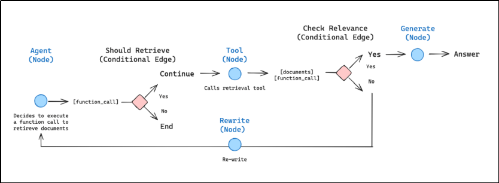
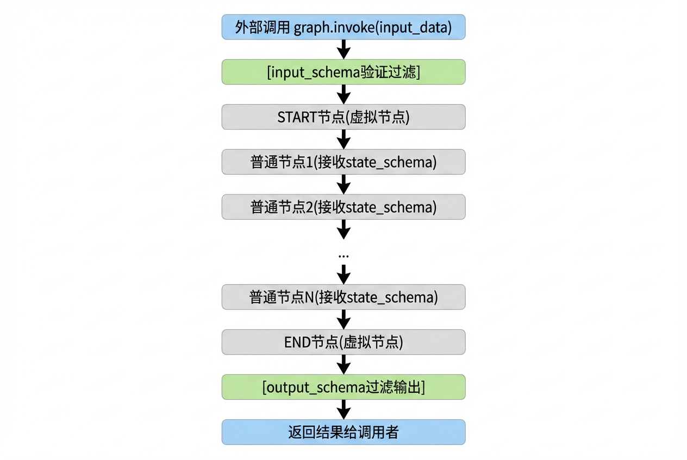
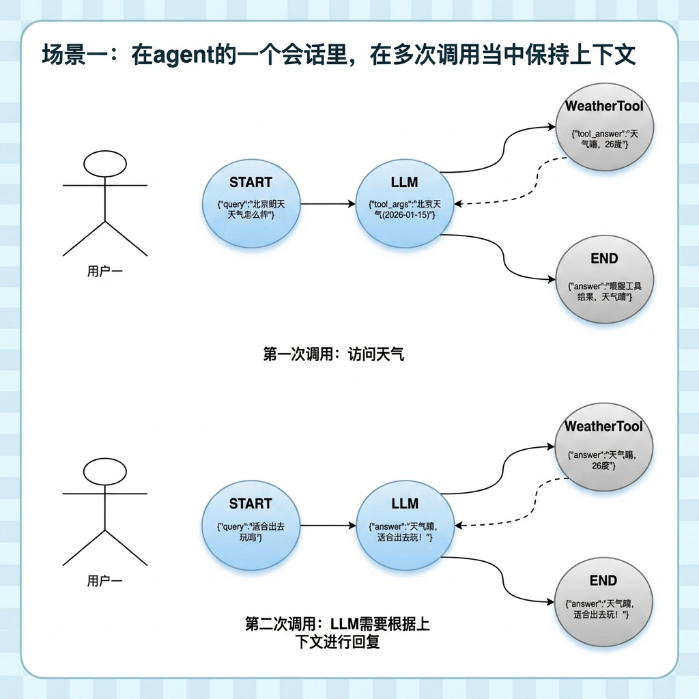
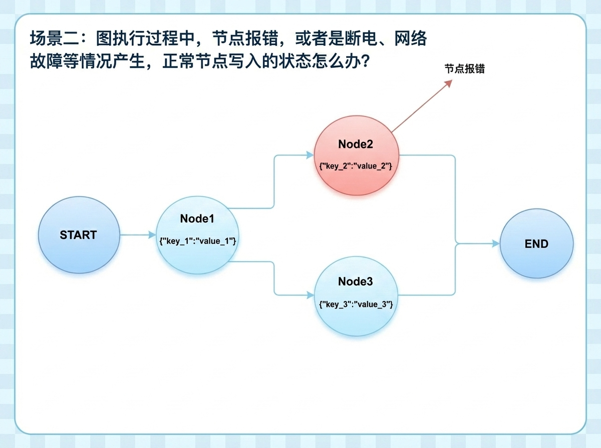
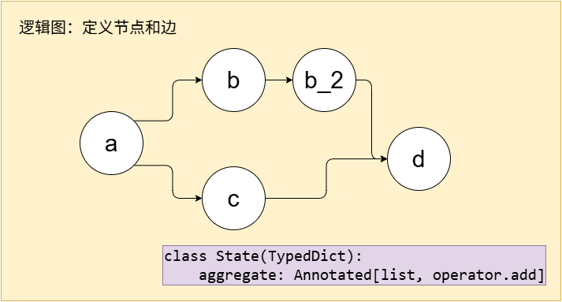
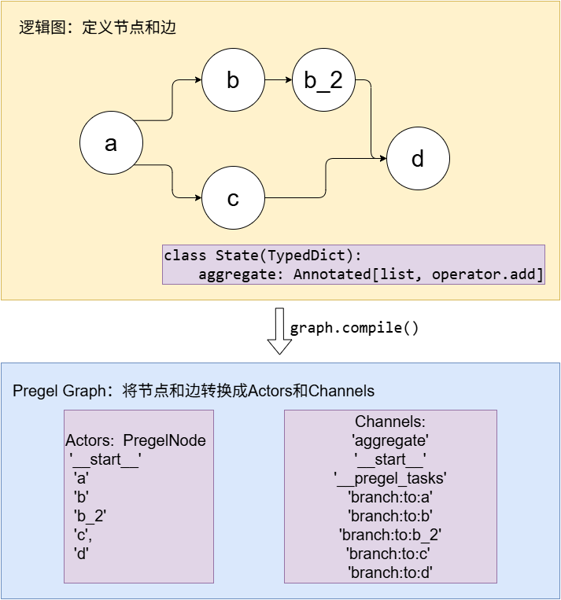
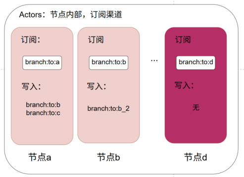
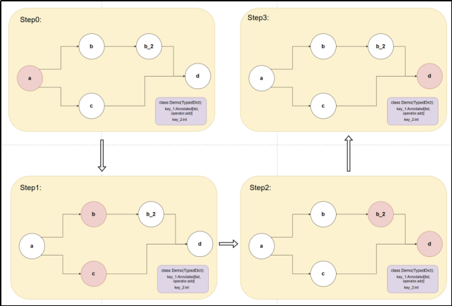
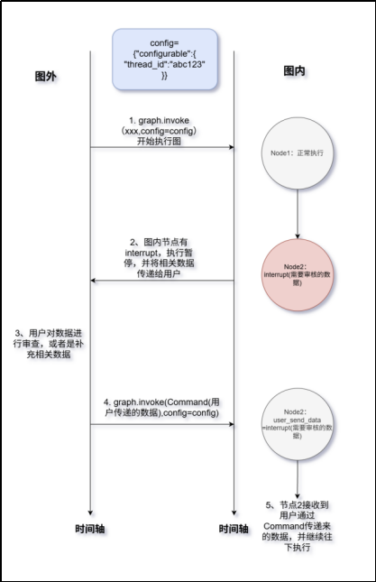
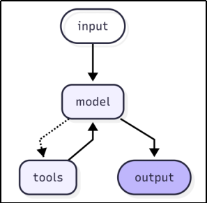

[TOC]


# 第1章 LangGraph概述

## 1.1 什么是 LangGraph

LangGraph 是一个**低级编排框架（Low-level orchestration framework）和运行时环境**，专为构建、管理和部署长期运行、具有状态（Stateful）的智能体（Agents）而设计。

其核心理念是将 Agent 的工作流建模为**图（Graph）**，通过三个核心要素构建应用：

- **节点 (Nodes)**：代表计算单元，可以是 LLM 调用、工具执行或任何自定义逻辑。
- **边 (Edges)**：定义节点之间的转换逻辑，决定执行流程（支持条件分支）。
- **状态 (State)**：在整个图执行过程中共享和传递的数据，支持在多步骤中保持上下文。



**LangGraph 提供了构建生产级智能体应用的核心能力：**

| 核心能力   | 描述                                                         |
| ---------- | ------------------------------------------------------------ |
| 持久化执行 | 构建能够从故障中恢复并长时间运行的智能体，支持断点续传。     |
| 人机协作   | 支持在任何时刻检查和修改智能体状态，实现人工审核（Human-in-the-loop）。 |
| 记忆管理   | 支持短期工作记忆（用于正在进行的推理）和跨会话的长期记忆。   |
| 流式处理   | 专为流式工作流设计，支持实时数据输出。                       |
| 生产级部署 | 提供可扩展的基础设施，专为处理有状态、长期运行的工作流挑战而设计。 |

**官方资源地址：**

- **GitHub 地址**：https://github.com/langchain-ai/langgraph
- **官方文档**：https://docs.langchain.com/oss/python/langgraph/overview

## 1.2 与 LangChain 的区别

LangGraph与LangChain的高级抽象不同，它提供了更细粒度的控制，让开发者能够精确控制智能体的执行流程，适合需要定制化编排的复杂应用场景。

**核心区别概述：**
当 LLM 应用需要「有状态、可循环、可分支的多步骤控制流（像一个可回溯的流程图/状态机）时，LangChain 的链式结构很难优雅完成，而必须使用 LangGraph。

| 特性     | LangGraph                         | LangChain                           |
| -------- | --------------------------------- | ----------------------------------- |
| 抽象级别 | 低级，提供细粒度控制              | 高级，开箱即用（如 Chains, Agents） |
| 状态管理 | 内置状态机和检查点（Checkpoints） | 通常需要自行管理状态                |
| 执行模型 | 基于图的并行/条件执行             | 线性链式执行（Sequential）          |
| 持久化   | 原生支持（Durable Execution）     | 需要额外实现                        |
| 适用场景 | 复杂、有状态的智能体应用开发      | 简单的链式调用、快速原型开发        |

**应用场景差异：**
正是因为上述区别，LangGraph 在以下场景中应用更为广泛：

- **复杂的多智能体系统**（如智能体之间的辩论、协作）。
- **需要长期记忆的应用**（状态在多轮对话中持续存在）。
- **需要人工审核的工作流**（在关键节点暂停等待人工输入）。
- **后台处理任务和实时交互**。
- **需要精细控制的定制化智能体编排**。

# 第2章 快速入门

## 2.1 创建环境

```bash
# conda deactivate #退出conda环境
# conda config --set auto_activate_base false #永久禁用conda环境

uv add langgraph
```

## 2.2 确认环境

```bash
#直接查看文件pyproject.toml的dependencies节点
#或
uv tree
```

## 2.3 简单示例

接下来的例子，以一个基于RAG的问答系统为例，来做一个快速入门展示。

该问答系统需要实现的功能如下：当**接收用户问题**之后，先分别进行**联网搜索**和**基于知识库的检索**，得到结果之后，使用大语言模型进行**总结回答**。

具体代码如下所示：

```python
# 02_get_started/workflow_demo.py


import time
from typing import TypedDict

from langgraph.constants import START, END
from langgraph.graph import StateGraph

"""
目标：通过问题搜索答案
1. 定义图状态
2. 定义节点函数
3. 通过状态创建图实例
4. 添加节点
5. 添加边
6. 编译图
7. 启动工作流
8. 输出结果

问题：大模型中的“幻觉”是什么意思？
"""

# 1. 定义图状态
class MyState(TypedDict):
    query: str  # 用户输入
    rag_result: str  # 权威RAG搜索结果
    web_search_result: str  # 实时网络搜索结果
    final_answer: str  # 最终回复


# 2. 定义节点函数
# 2.1. 定义RAG搜索节点
def rag_search_node(state: MyState):
    # 1 获取用户输入
    print("📚【技术知识库】开始检索学术定义...")
    query = state.get("query")

    # 2 模拟调用RAG搜索
    time.sleep(2)
    rag_result = f"📚【学术定义】{query}：指大语言模型（LLM）生成的内容虽然看似合理且流畅，但实际上与源上下文或现实世界事实不符，甚至完全虚构的现象。"

    # 3 将搜索结果写入到图状态中
    print("📚【技术知识库】检索完成！")
    return {"rag_result": rag_result}


# 2.2. 定义网络搜索节点
def web_search_node(state: MyState):
    # 1 获取用户输入
    print("🌏【实时网络搜索】全网查询最新案例...")
    query = state["query"]

    # 2 模拟调用网络搜索
    time.sleep(2)
    web_search_result = f"🌏【通俗解释】{query}：常被戏称为AI在“一本正经地胡说八道”。比如AI可能会捏造不存在的历史事件、错误的代码库引用或虚假的论文出处。"

    # 3 将搜索结果写入到图状态中
    print("🌏【实时网络搜索】搜索完毕！")
    return {"web_search_result": web_search_result}


# 2.3. 定义最终回复节点
def final_answer_node(state: MyState):
    # 1 从图状态中获取多路搜索结果
    print("🤖【AI助手】正在综合多方信息生成回答...")
    rag_result = state["rag_result"]
    web_search_result = state["web_search_result"]

    # 2 模拟调用大模型
    final_answer = f"""
🤖【AI助手总结】：
{rag_result}
{web_search_result}
需要我教你如何降低模型的幻觉率吗❓
"""
    time.sleep(2)

    # 3 将最终回复写入到图状态中
    print("🤖【AI助手】回答生成结束！")
    return {"final_answer": final_answer}


# 3. 通过状态创建图实例
graph = StateGraph(MyState)

# 4. 添加节点
graph.add_node(rag_search_node)
graph.add_node(web_search_node)
graph.add_node(final_answer_node)

# 5. 添加边
graph.add_edge(START, "rag_search_node")
graph.add_edge(START, "web_search_node")
graph.add_edge("rag_search_node", "final_answer_node")
graph.add_edge("web_search_node", "final_answer_node")
graph.add_edge("final_answer_node", END)

# 6. 编译图
compiled_graph = graph.compile()

# 7. 启动工作流
# 用户输入query首先进入START节点
state = compiled_graph.invoke({"query": "大模型中的“幻觉”是什么意思？"}) # type: ignore[arg-type]

# 8. 输出结果
# 格式化json
# print(json.dumps(state, indent=4, ensure_ascii=False, cls=json.JSONEncoder))
print(state["final_answer"])

# 9. 打印图(uv add grandalf)
compiled_graph.get_graph().print_ascii()
# structure = graph_structure.draw_ascii()
# print(structure)

```

# 第3章 状态：LangGraph 的“大脑记忆”

在 LangGraph 中，**State（状态）** 是贯穿整个应用生命周期的“全局变量”。你可以把它想象成飞机的**黑匣子**或者游戏的**存档文件**。无论流程走到哪个节点（Node），都需要读取这里的信息，并根据处理结果更新它。

## 3.1 定义状态类

### 3.1.1 状态的定义：三种“容器”的选择

在 Python 中，我们通常有三种方式来定义这种数据结构。为了让你更清晰地理解，我们将分两步走：先看**基础语法**，再看它们在 **LangGraph 中的实际应用**。

#### 方式一：TypedDict（推荐方式）

##### 基础概念

`TypedDict` 是 Python 标准库 `typing` 中的工具。它本质上还是一个普通的字典（Dictionary），但它给字典的 Key 加上了类型约束。它轻量、灵活，是 LangGraph 最推荐的定义方式。

##### 基础示例

为了让你一目了然，我们用同一个场景——`定义一个用户信息`，分别用两种方式来实现。

场景 A：使用普通字典 `dict`

```python
# 03_state/01_Dict_user_state_demo.py

# 这样声明，IDE 知道 my_dict 是一个键为字符串，值为任意类型的字典
# user: Dict[str, Any] = {}
# 没有任何类型提示的普通字典
user_state = {
    "name": "Alice",
    "age": 25
}

# 1. 访问数据
print(user_state["name"])
# 2. 潜在风险：拼写错误
# 如果你不小心把 "age" 拼成了 "egg"
# Python 在写代码时不会提醒你，只有运行到这里才会报 KeyError
# print(user_state["egg"])  #运行时崩溃！

# 3. 类型模糊
# 你无法确定 "age" 是整数还是字符串，除非你去查定义它的地方
```

场景 B：使用 `TypedDict`

```python
# 03_state/02_TypedDict_UserState_demo.py
from typing import TypedDict

# 1. 定义结构（像画图纸一样）
class UserState(TypedDict):
    name: str  # 规定 name 必须是字符串
    age: int   # 规定 age 必须是整数

# 2. 实例化时，它就像一个普通字典
user_state: UserState = {
    "name": "Alice",
    "age": 25
}
print(user_state)

# 3. 提前拦截错误
# 当你输入其他键时，IDE会告诉你只能填 "name" 或 "age"
print(user_state["name"])
# 如果你不小心把 "age" 拼成了 "egg"
# 编写代码时IDE就会提示
# print(user_state["egg"])
```

##### 普通字典和 TypedDict 的区别

普通字典是`自由`的，而 TypedDict 是`守规矩`的。它们在代码**运行时**的行为几乎一样，但在**写代码时**（IDE 提示和静态检查）有着天壤之别。

我们可以从以下三个维度来拆解它们的区别：

###### 1. 核心区别概览

| 维度         | 普通字典 (`dict`)                                | TypedDict                                           |
| :----------- | :----------------------------------------------- | :-------------------------------------------------- |
| **本质**     | 一个灵活的键值对容器。                           | 一个**类型提示工具**，本质上还是字典。              |
| **键的限制** | 任意键名，IDE 不知道有哪些键。                   | **固定键名**，IDE 会提示可用的键。                  |
| **值的类型** | 任意类型，或者需要手动指定 `Dict[str, Any]`。    | **严格指定**每个键对应的值类型（如 `str`, `int`）。 |
| **检查时机** | 只有在**运行时**（代码跑起来）写错键名才会报错。 | 在**编写代码时**（静态检查），IDE 就会提示。        |
| **适用场景** | 数据结构不固定、快速脚本、简单存储。             | 大型项目、API 接口定义、LangGraph 状态定义。        |

###### 2. 为什么推荐使用 TypedDict？

在 LangGraph 中，我们定义 `State` 时推荐使用 `TypedDict`，主要有两个深层原因：

- **结构即文档**：LangGraph 的应用通常涉及多个节点（Node）传递数据。使用 `TypedDict`，你一眼就能看出整个图（Graph）在流转过程中到底携带了哪些数据（`query`, `messages`, `results` 等）。这比看一堆散乱的字典操作要清晰得多。
- **防止`键名拼写错误`的灾难**：在复杂的 LangChain 应用中，如果一个节点把 `messages` 拼写成了 `messags`，使用普通字典的话，这个错误可能潜伏很久，直到某个节点读不到数据才崩溃。而使用 `TypedDict`，这种错误在写代码的第一秒就会被发现。

###### 3. 总结

- **普通字典** 就像一个**没有标签的收纳箱**，你可以往里面扔任何东西，但找东西时容易翻乱。
- **TypedDict** 就像一个**带有固定格子的收纳盒**，每个格子贴好了标签（键名），还规定了只能放什么（类型），既整洁又安全。

##### 高级示例

带有`可选字段`的TypedDict

```python
# 03_state/03_TypedDict_AdvancedState_demo.py

from typing import TypedDict, List
from typing_extensions import NotRequired


# 1. 定义结构
class AdvancedState(TypedDict):
    """包含可选字段和复杂类型的TypedDict"""
    # 必需字段
    user_query: str
    conversation_history: List[str]

    # 可选字段 - 使用NotRequired表示该字段可以缺失
    rag_documents: NotRequired[List[dict]]
    search_results: NotRequired[List[dict]]

# 2. 实例化
# 2.1 创建不包含可选字段的状态
simple_state: AdvancedState = {
    "user_query": "请解释LangGraph的状态管理",
    "conversation_history": ["你好，我是AI助手", "我能帮您了解LangGraph"],
}

# 2.1 创建完整的状态
full_state: AdvancedState = {
    "user_query": "请解释LangGraph的状态管理",
    "conversation_history": ["你好，我是AI助手", "我能帮您了解LangGraph"],
    "rag_documents": [
        {"title": "LangGraph文档", "content": "状态管理章节..."},
        {"title": "最佳实践", "content": "TypedDict是推荐方式..."}
    ]
}

print(f"简单状态字段: {list(simple_state.keys())}")
print(f"完整状态字段: {list(full_state.keys())}")
```

#### 方式二：Pydantic BaseModel

##### 基础概念

`Pydantic` 是 Python 中最流行的数据校验库。`BaseModel` 不仅仅定义类型，还会在**运行时**强制检查数据是否符合规范。如果数据不对，它会直接报错。

##### 基础示例

```python
# 03_state/04_Pydantic_UserState_demo.py

from pydantic import BaseModel

# 1. 定义结构
class UserState(BaseModel):
    name: str
    age: int

# 2. 实例化时，必须通过类调用，且会自动校验类型
# user_state = UserState(name="Bob", age=30)
user_state = UserState(name="Bob", age="30") # 注意：即使传入字符串"30"，Pydantic也会自动转为整数

print(user_state)
```

##### 高级示例

```python
# 03_state/05_Pydantic_AgentState_demo.py

from typing import Optional
from pydantic import BaseModel, Field, field_validator
from datetime import datetime


# 1. 定义结构
class AgentState(BaseModel):
    """使用Pydantic BaseModel定义状态"""

    # 必需字段
    user_id: str = Field(description="用户唯一标识")
    query: str = Field(min_length=1, max_length=20, description="用户输入的查询")
    timestamp: datetime = Field(default_factory=datetime.now, description="状态创建时间")

    # 可选字段
    rag_result: Optional[str] = Field(None, description="RAG检索结果")
    web_search_result: Optional[str] = Field(None, description="网络搜索结果")
    final_answer: Optional[str] = Field(None, description="最终回复")

    # 验证器
    @field_validator('query')
    @classmethod
    def validate_query_not_empty(cls, v):
        if not v or not v.strip():
            raise ValueError("查询不能为空")
        return v.strip()


try:
    # 2. 实例化
    state = AgentState(
        user_id="user_123",
        query="请解释LangGraph的状态管理机制",
        rag_result="LangGraph通过StateGraph来管理状态...",
        web_search_result="根据官方文档，状态是LangGraph的核心概念..."
    )

    # 3. 数据访问
    print("Pydantic状态测试:")
    print(f"用户ID: {state.user_id}")
    print(f"查询: {state.query}")
    print(f"时间戳: {state.timestamp}")

    # 4. 转成dict
    state_dict = state.model_dump()
    print(f"序列化后的字典: {state_dict}")

except ValueError as e:
    # 5. 测试验证器
    print(f"验证错误捕获: {e}")

```

#### 方式三：@dataclass

##### 基础概念

`dataclass` 是 Python 3.7 引入的装饰器。它的主要作用是减少样板代码。它会自动帮你生成 `__init__`（初始化方法）、`__repr__`（打印方法）等。

##### 基础示例


```python
# 03_state/06_dataclass_UserState_demo.py

from dataclasses import dataclass

# 0. 使用dataclass装饰器，自动生成__init__()和__repr__()方法
@dataclass
# 1. 创建数据类
@dataclass
class UserState:
    name: str
    age: int

    # def __init__(self, name: str, age: int):
    #     self.name = "Charlie"
    #     self.age = 35
    #
    # def __repr__(self):
    #     return f"UserState(name={self.name}, age={self.age})"

# 2. 实例化
user_state = UserState(name="Charlie", age=35)

# 3. 打印时会直接显示内容，不需要额外写打印函数
print(user_state) # 输出: UserState(name='Charlie', age=35)
```

### 3.1.2 输入输出数据隔离：精确控制数据流边界

在 LangGraph 中，一个强大的功能是能够**精确控制**数据流入和流出图的边界。这就好比给一个工厂设置了专门的**原材料入口**和**成品出口**，确保只有指定的信息能够进入和离开系统。这通过在初始化 `StateGraph` 时，分别指定三个核心参数来实现：`state_schema`（内部状态空间）、`input_schema`（输入接口）和 `output_schema`（输出接口）。

#### 工作原理



#### 代码示例

```python
# 03_state/07_input_output_workflow_demo.py

"""
目标：定义工作流的输入状态和输出状态
"""

import time
from typing import TypedDict
from langgraph.constants import START, END
from langgraph.graph import StateGraph

# 1. 定义图状态
# 1.1 全局状态
class MyState(TypedDict):
    query: str  # 用户输入
    rag_result: str  # 权威RAG搜索结果
    web_search_result: str  # 实时网络搜索结果
    final_answer: str  # 最终回复

# 1.2 输入状态
class InputSchema(TypedDict):
    query: str  # 用户输入

# 1.3 输出状态
class OutputSchema(TypedDict):
    final_answer: str  # 最终回复

其他代码...... 
    
# 3. 通过状态创建图实例
graph = StateGraph(
    state_schema = MyState,
    input_schema = InputSchema,
    output_schema = OutputSchema
)

其他代码...... 

# 7. 启动工作流
state = compiled_graph.invoke(
    {"query": "大模型中的“幻觉”是什么意思？", rag_search_node:"测试是否能被过滤掉"} # type: ignore[arg-type]
)  

# 8. 输出结果
print(state)
```

#### `state_schema`：图的完整内部状态空间

定义了图在运行过程中**内部维护的全部数据结构**。它就像是图的“中央数据库”，包含了所有节点可能需要读取或写入的所有字段。

**特点：**

- **核心要求**：必须指定，不能为空，是图的“全局状态空间”。
- **全面性**：所有节点都可以访问和修改这个 schema 中定义的任何字段。

#### `input_schema`：图的输入数据过滤器

定义了图**允许接收的外部输入数据结构**。它充当了图的“前端门卫”，只允许符合特定结构的数据进入。

**特点：**

- **可选参数**：若不指定，则默认与 `state_schema` 相同。
- **接口契约**：限制了图的输入接口，只有在 `input_schema` 中定义的字段才能被外部传入。
- **子集关系**：必须是 `state_schema` 的子集或与其相等。不能定义 `state_schema` 中不存在的字段。
- **安全性**：防止外部传入无关或恶意数据污染内部状态。

#### `output_schema`：图的输出数据筛选器

定义了图**最终向外暴露的输出数据结构**。它像是图的“后端打包员”，只挑选特定的数据作为最终结果返回。

**特点：**

- **可选参数**：若不指定，则默认与 `state_schema` 相同。
- **接口契约**：限制了图的输出接口，只返回在 `output_schema` 中定义的字段。
- **子集关系**：必须是 `state_schema` 的子集或与其相等。
- **隐私保护**：隐藏图内部处理过程中的中间状态，只暴露必要的最终结果。

#### 实际应用价值

通过这三个 schema 的组合使用，开发者可以实现：

- **接口清晰**：外部调用者只需关心 `input_schema` 和 `output_schema`，无需了解内部复杂的状态流转。
- **数据安全**：防止意外的数据泄露或污染。
- **职责分离**：`state_schema` 关注内部逻辑完整性，`input_schema` 和 `output_schema` 关注与外部世界的交互契约。

### 3.1.3 节点间数据隔离：精细化节点权限管理

在 LangGraph 中，除了可以控制图的输入输出边界外，我们还可以进一步**精细化管理每个节点的权限**，让不同的节点只能访问图状态中特定的子集，从而实现节点间的**数据隔离**。这种机制类似于给每个员工分配一个专属的工作空间，他们只能看到和操作自己职责范围内的信息，而无法接触到其他部门的敏感数据。

#### 核心机制：节点专属状态类型

实现节点间数据隔离的关键在于**为节点函数的参数指定不同于全局 `state_schema` 的状态类型**。

#### 代码示例

```python
# 03_state/08_node_isolation_workflow_demo.py

"""
目标：节点间数据隔离
"""

import time
from typing import TypedDict

from langgraph.constants import START, END
from langgraph.graph import StateGraph

# 1. 定义图状态
# 1.1 全局状态
class MyState(TypedDict):
    query: str  # 用户输入
    rag_result: str  # 权威RAG搜索结果
    web_search_result: str  # 实时网络搜索结果
    final_answer: str  # 最终回复

# 1.2 输入状态
class InputSchema(TypedDict):
    query: str  # 用户输入

# 1.3 输出状态
class OutputSchema(TypedDict):
    final_answer: str  # 最终回复

# 1.4 节点状态（node_state）
class SearchState(TypedDict):
    rag_result: str  # 权威RAG搜索结果
    web_search_result: str  # 实时网络搜索结果
    
其他代码...... 


# 2.3. 定义最终回复节点
def final_answer_node(state: SearchState):
    
其他代码...... 
```

#### `node_state`：节点的私有数据空间

为节点函数参数指定的状态类型，定义了该节点**在执行时所能访问的图状态的一个特定子集**。它相当于为节点创建了一个“沙盒环境”，节点只能读取和操作这个沙盒内的数据。

**特点：**

- **可选设定**：节点可以选择使用 `state_schema`（即全局状态），也可以定义一个更小的专用状态类型。
- **接口契约**：节点只能访问其状态类型中定义的字段，无法直接访问 `state_schema` 中其他未包含的字段。
- **子集关系**：节点状态类型必须是 `state_schema` 的子集或与其相等。不能包含 `state_schema` 中不存在的字段。
- **职责聚焦**：强制节点专注于其业务逻辑所需的核心数据，提高代码的内聚性和可维护性。

这种机制与 `input_schema`/`output_schema` 的设计思想一脉相承，都是通过**明确的类型约束**来实现数据访问的**精确控制**和**边界隔离**。

#### 实际应用价值

- **职责分离**：每个节点只关注自己的核心数据，代码逻辑更清晰。
- **错误预防**：防止节点意外访问或修改不属于其职责范围的数据。
- **模块化设计**：更容易独立测试和维护单个节点，因为它们的依赖关系更加明确。
- **安全性增强**：在敏感数据环境中，可以有效防止数据泄露。

#### 总结

1. **`state_schema` (全局状态)**：定义了整个图在运行时可能涉及的**所有数据字段**。它是图内部的“完整数据仓库”，所有节点的读写操作都围绕这个“仓库”进行。它是最全面的，包含了所有可能用到的数据。
2. **`input_schema` (图输入)**：定义了**外部调用图时**，允许传入的初始数据字段。它是 `state_schema` 的一个子集，充当了图的“入口安检”，确保只有合法的初始数据能进入图的流程。
3. **`output_schema` (图输出)**：定义了**图执行完毕后**，向外部返回的数据字段。它是 `state_schema` 的一个子集，充当了图的“出口海关”，只允许指定的最终结果离开图。
4. **`node_state` (节点状态)**：定义了**某个特定节点内部**，其函数参数能够接收到的 `state_schema` 的一个子集。它为节点创建了一个“局部视图”，节点只需关心自己需要处理的那部分数据，提高了代码的模块化和专注度。

这种设计使得 LangGraph 的状态管理既灵活又安全，既能满足复杂应用的需求，又能有效防止数据混乱和误操作。

### 3.1.4 Reducer函数：状态合并的核心引擎

在 LangGraph 中，每当一个节点执行完毕并返回数据时，系统需要将**节点的输出**（增量状态）与**图的当前全局状态**进行合并，以形成下一个时刻的全局状态。这个合并过程由**Reducer函数**精确控制。

**Reducer函数**是定义在 `state_schema` 中每个键上的一个**合并策略**。它决定了当节点返回某个键的新值时，应该如何与全局状态中该键的现有值进行整合。这种设计赋予了开发者极大的灵活性，可以选择“覆盖”、“追加”或完全自定义的合并逻辑。

Reducer函数主要有以下三种类型：

- **默认覆盖行为**：未指定时的隐式策略，新值完全替换旧值。
- **内置Reducer函数**：LangGraph 提供的标准化合并工具，如 `add_messages`。
- **自定义Reducer函数**：允许开发者实现个性化的合并逻辑。

------

#### 默认行为：覆盖更新（Overwrite）

当在 `state_schema` 中定义一个字段时，**如果没有显式为其指定 reducer**，则该字段会采用**覆盖**（Overwrite）策略。这意味着，每当节点返回该字段的新值时，这个新值会**完全取代**全局状态中对应字段的旧值。

##### 代码示例：覆盖行为演示

在这个例子中，`messages` 和 `search_results` 都采用了覆盖策略，导致早期节点产生的数据被后续节点完全抹去。

```python
# 03_state/09_reducer_default_demo.py

"""
LangGraph Reducer函数演示 - 默认Reducer（覆盖更新）
"""

from typing import List
from langchain_core.messages import BaseMessage, HumanMessage, AIMessage, SystemMessage
from typing_extensions import TypedDict
from langgraph.graph import StateGraph

# 1. 定义图状态 - 所有字段均未指定reducer，故默认为覆盖
class AgentState(TypedDict):
    query: str
    messages: List[BaseMessage]  # 历史消息列表
    search_results: List[str]    # 搜索结果列表

# 2. 节点函数：输入处理
def input_node(state: AgentState):
    query = state["query"]
    new_message = HumanMessage(content=f"用户问题: {query}")

    # 返回新列表，将完全替换掉state["messages"]的旧列表
    return {"messages": [new_message]}

# 3. 节点函数：搜索处理
def search_node(state: AgentState):
    query = state["query"]
    query_result = f"模拟搜索结果：关于'{query}'的相关信息..."
    search_msg = AIMessage(content=f"搜索完成: {query_result}")

    # 返回新列表，将完全替换掉state["search_msg"]和state["query_result"]的旧列表
    return {
        "messages": [search_msg],
        "search_results": [query_result]
    }

# 4. 节点函数：生成最终回复
def response_node(state: AgentState):
    context = state["search_results"] # 此时search_results只包含上一个节点的单条结果
    query = state["query"]
    final_response = f"基于搜索结果，对问题'{query}'的回答是：{context} "
    ai_response = AIMessage(content=final_response)
    return {
        "messages": [ai_response], # 再次覆盖整个messages列表
        "search_results": [f"最终回复已生成"] # 覆盖整个search_results列表
    }

# 5. 构建图
def build_graph():
    workflow = StateGraph(AgentState)

    # 添加节点
    workflow.add_node("input", input_node)
    workflow.add_node("search", search_node)
    workflow.add_node("response", response_node)

    # 设置边
    workflow.add_edge("input", "search")
    workflow.add_edge("search", "response")

    # 设置入口和出口
    workflow.set_entry_point("input")
    workflow.set_finish_point("response")

    return workflow.compile()

# 运行示例
if __name__ == "__main__":
    # 创建图实例
    app = build_graph()

    # 初始状态
    initial_state = {
        "query": "Python编程最佳实践",
        "messages": [SystemMessage(content="你是一个AI助手，正在进行信息检索任务。")],
        "search_results": []
    }

    # 执行
    result = app.invoke(initial_state)

    print("=== 最终状态 ===")
    print(f"查询: {result['query']}")

    print("\n=== 消息历史 ===")
    for i, msg in enumerate(result['messages']):
        print(f"[{i}] {msg.type}: {msg.content}")

    print("\n=== 搜索结果 ===")
    for i, res in enumerate(result['search_results']):
        print(f"[{i}] {res}")
```

#### 内置reducer函数函数：追加更新（Append）

对于列表类型的字段，最常见的需求是**追加**（Append）而不是覆盖。LangGraph 提供了内置的 reducer 函数来轻松实现这一点。

- **`add_messages`**：专为 `List[BaseMessage]` 设计，能够智能地将新消息列表追加到现有消息列表的末尾，非常适合维护对话历史。
- **`operator.add`**：一个通用的追加操作符，适用于任何支持 `+` 操作的类型（如列表、字符串等）。

##### 代码示例：追加行为演示

```python
# 03_state/10_reducer_add_demo.py

"""
LangGraph Reducer函数演示 - Reducer（追加更新）
"""

import operator
from typing import List, Annotated
from langchain_core.messages import BaseMessage, HumanMessage, AIMessage, SystemMessage
from typing_extensions import TypedDict
from langgraph.graph import StateGraph, add_messages

# 1. 定义图状态 - 显式指定reducer
class AgentState(TypedDict):
    query: str
    # 使用 add_messages，新消息会追加到列表末尾
    messages: Annotated[List[BaseMessage], add_messages] # 历史消息列表
    # 使用 operator.add，新结果会追加到列表末尾
    search_results: Annotated[List[str], operator.add]   # 搜索结果列表

# 2. 节点函数：输入处理
def input_node(state: AgentState):
    query = state["query"]
    new_message = HumanMessage(content=f"用户问题: {query}")

    # 新消息会被追加到现有列表后
    return {"messages": [new_message]}

# 3. 节点函数：搜索处理
def search_node(state: AgentState):
    query = state["query"]
    query_result = f"模拟搜索结果：关于'{query}'的相关信息..."
    search_msg = AIMessage(content=f"搜索完成: {query_result}")

    # 消息和结果都会被追加到现有列表后
    return {
        "messages": [search_msg],
        "search_results": [query_result]
    }

# 4. 节点函数：生成最终回复
def response_node(state: AgentState):
    context = state["search_results"] # 此时search_results只包含上一个节点的单条结果
    query = state["query"]
    final_response = f"基于搜索结果，对问题'{query}'的回答是：{context} "
    ai_response = AIMessage(content=final_response)
    return {
        "messages": [ai_response],
        "search_results": [f"最终回复已生成"] 
    }


其他代码...... 
# ... (build_graph, 运行示例代码相同)
```

#### 自定义Reducer函数：个性化合并逻辑

当内置的 reducer 无法满足特定需求时（例如需要合并时进行计算、过滤或格式化），开发者可以编写自定义的 reducer 函数。

**自定义Reducer函数**必须是一个可调用对象（通常是函数），`它接收两个参数`：第一个是**当前全局状态**中该键的值，第二个是**节点返回的该键的新值**。函数的返回值将成为该键在新全局状态中的值。

##### 代码示例：自定义Reducer演示

通过自定义 reducer，我们可以实现高度定制化的状态合并逻辑，使数据流转过程更加智能化和个性化。

```python
# 03_state/11_reducer_custom_demo.py

"""
LangGraph Reducer函数演示 - Reducer（自定义）
"""

from typing import List, Annotated
from langchain_core.messages import BaseMessage, HumanMessage, AIMessage, SystemMessage
from typing_extensions import TypedDict
from langgraph.graph import StateGraph

# 自定义消息 Reducer：为消息添加图标前缀
def custom_add_messages(
    existing_messages: List[BaseMessage], 
    new_messages: List[BaseMessage]
) -> List[BaseMessage]:
    """
    自定义消息追加函数，为不同类型的消息添加图标前缀
    """
    if existing_messages is None:
        existing_messages = []

    icon_map = {
        'system': '🔧 [系统]', 
        'human': '👤 [用户]', 
        'ai': '🤖 [AI]'
    }
    
    processed_messages = []
    for msg in new_messages:
        icon = icon_map.get(msg.type)
        # 根据消息类型创建带有前缀的新消息对象
        if isinstance(msg, SystemMessage):
            processed_messages.append(SystemMessage(content=f"{icon} {msg.content}"))
        elif isinstance(msg, HumanMessage):
            processed_messages.append(HumanMessage(content=f"{icon} {msg.content}"))
        elif isinstance(msg, AIMessage):
            processed_messages.append(AIMessage(content=f"{icon} {msg.content}"))
        else:
            processed_messages.append(msg) # 保持其他类型消息不变

    return existing_messages + processed_messages

# 自定义搜索结果 Reducer：为结果添加序号
def custom_add_search_results(existing_results: List[str], new_results: List[str]) -> List[str]:
    """
    自定义搜索结果追加函数，为每个结果添加序号
    """
    if existing_results is None:
        existing_results = []
        
    # 计算新序号的起始值
    start_index = len(existing_results) + 1
    
    # 处理每个结果
    processed_results = []
    for i, result in enumerate(new_results, start=start_index):
        processed_results.append(f"📌 步骤{i}: {result}")
    
    # 返回更新后的结果列表
    return existing_results + processed_results

# 1. 定义图状态 - 使用自定义reducer
class AgentState(TypedDict):
    # 普通字段：默认行为是“覆盖”
    query: str
    
    # 列表字段：使用 custom_add_messages 或 custom_add_search_results 实现“追加”
    messages: Annotated[List[BaseMessage], custom_add_messages] # 历史消息列表
    search_results: Annotated[List[str], custom_add_search_results] # 搜索结果列表


其他代码...... 
# ... (节点函数代码与追加示例相同，但输出会带有自定义格式)
```

#### 并行执行与状态合并

在 LangGraph 中，当多个节点并发执行（例如，从 `START` 节点同时出发的 `rag_search_node` 和 `web_search_node`），它们可能会同时尝试更新同一个全局状态字段。这时就需要一个明确的规则来决定如何处理这些“竞争”的更新。`Annotated` 就是用来定义这个规则的。

```python
# 03_state/12_reducer_merge_node_state_demo.py
import operator
import time
from typing import TypedDict, List, Annotated

from langgraph.constants import START, END
from langgraph.graph import StateGraph

"""
目标：处理并行节点的状态合并
"""

# 1. 定义图状态
class MyState(TypedDict):
    其他代码...... 
    messages: Annotated[List[str], operator.add] #新增一个messages状态


# 2. 定义节点函数
# 2.1. 定义RAG搜索节点
def rag_search_node(state: MyState):
    其他代码...... 
    return {"rag_result": rag_result, "messages":["abc"]} #修改messages


# 2.2. 定义网络搜索节点
def web_search_node(state: MyState):
    其他代码...... 
    return {"web_search_result": web_search_result, "messages":["xyz"]}  #修改messages


其他代码...... 
```

`rag_search_node` 返回 `{"messages": ["abc"]}`

`web_search_node` 返回 `{"messages": ["xyz"]}`

这两个返回值几乎是同时发生的（逻辑上并行）。

LangGraph 会自动执行类似这样的合并逻辑：

```python
# 假设当前全局状态的 messages 是 []
# 合并来自 rag_search_node 的 ["abc"] 和来自 web_search_node 的 ["xyz"]
# 使用 operator.add 作为 reducer
merged_messages = operator.add(["abc"], ["xyz"]) # 结果是 ["abc", "xyz"]
```

## 3.2 状态的存储

### 3.2.1 实际场景当中的问题

在前面的例子当中，我们看到，每次用户invoke时，LangGraph都会初始化一个空状态，然后将用户传入的初始状态合并进来，再继续往下执行。

这在一些一次性、简单任务过程中，没有什么问题。但是对于一些复杂任务，就会出现一些问题，考虑以下两个场景：

#### 场景一：保持上下文

在agent的一个会话里，需要在多次调用当中保持上下文。在这个场景下，我们定义的状态为messages列表，第一次调用过程中，图会在messages列表当中写入值。而第二次调用，又会初始化一个新的messages列表，导致缺失了第一次调用的上下文。



#### 场景二：断点续传

图执行过程当中报错，不想重复已执行完节点，想要实现断点续传。在这个场景下，第一次调用过程中，图会在Node2节点因某些原因报错，但是我们想要拿到Node1节点所对应的值。并在修复完第二个节点之后，继续往下执行。



### 3.2.2 状态的存储：实现持久化会话与上下文

#### 解决方案

为了解决前面所涉及到的问题，我们需要将前一次调用结束时的最终状态**持久化存储**起来，并在下一次调用时，从中恢复状态。

由于应用可能服务**多用户**或允许**单用户开启多个会话**，存储的状态必须能够**唯一标识和区分**不同的会话。这就像给每个会话分配一个“唯一标识”，存取数据时都要指明“唯一标识”。

#### Checkpointer：状态存储的基石

LangGraph 提供了 **Checkpointer**（检查点）机制来解决状态存储问题。Checkpointer 负责在图执行的每个节点后，**自动快照**（Checkpoint）当前的全局状态。这些快照可以存储在多种介质中，如内存（`InMemorySaver`）、PostgreSQL（`PostgresSaver`）、MongoDB（`MongoSaver`）等。

所有 Checkpointer 的实现都位于 `langgraph.checkpoint` 包中。

#### Thread ID：会话隔离的钥匙

为了区分不同的会话，LangGraph 引入了 **`thread_id`** 的概念。`thread_id` **并非操作系统中的线程**，而是一个纯粹的字符串标识符，用于在 Checkpointer 中隔离不同的状态空间。

- **相同 `thread_id`**：代表同一个会话。调用时传入相同的 `thread_id`，LangGraph 会自动从 Checkpointer 中加载该会话的最新状态，继续在此基础上执行。
- **不同 `thread_id`**：代表不同的会话。每个 `thread_id` 都拥有独立的状态空间，互不干扰。

#### LangChain中的Checkpointer

##### 代码示例：Agent短期记忆

```python
# lm_config.py

"""
定义模型参数配置类
"""

from dataclasses import dataclass
import os


# 定义minerU服务配置
@dataclass
class LLMConfig:
    llm_model: str
    model_provider: str
    base_url: str
    api_key : str

lm_config = LLMConfig(
    llm_model="qwen3.6-flash",
    model_provider="openai",
    base_url=os.getenv("DASHSCOPE_BASE_URL"),
    api_key=os.getenv("DASHSCOPE_API_KEY")
)
```

```python
# 03_state/13_langchain_checkpointer_demo.py

"""
基于LangChain的create_agent实现checkpointer机制
"""

import os
from langchain.agents import create_agent
from langchain.chat_models import init_chat_model
from langchain.tools import tool
from langgraph.checkpoint.memory import InMemorySaver
from lm_config import lm_config

# 1、定义LLM实例
# uv add langchain
# uv add langchain-openai
llm_client = init_chat_model(
    model=lm_config.llm_model,
    model_provider=lm_config.model_provider,
    base_url=lm_config.base_url,
    api_key=lm_config.api_key
)

# 2、定义checkpointer实例
checkpointer = InMemorySaver()

# 3、定义工具
@tool
def weather_tool(city: str, date: str) -> str:
    """查询天气工具"""
    return f'{city}在{date}的天气是晴朗的'

# 4、构建Agent时引入checkpointer
agent = create_agent(
    model=llm_client,
    tools=[weather_tool],
    checkpointer=checkpointer,
)

# 5、用户第一次调用
user_res1 = agent.invoke(
    input={"messages": "北京2026-04-27天气怎么样"},
    config={"configurable": {"thread_id": "user_session1"}}
)
print('第一次调用', user_res1['messages'][-1])

# 6、用户在同一个会话当中，第二次调用
user_res2 = agent.invoke(
    input={"messages": "适合出去玩吗"},
    config={"configurable": {"thread_id": "user_session1"}}
)
print('第二次调用', user_res2['messages'][-1])

```

#### LangGraph中的Checkpointer

要在 LangGraph 中启用状态存储，需要执行以下三个关键步骤：

1. **创建 Checkpointer 实例**：选择合适的存储后端并创建其对象。
2. **编译图时传入 Checkpointer**：将 Checkpointer 实例传递给 `app = graph.compile(checkpointer=...)`。
3. **调用图时传递 `thread_id`**：在 `app.invoke(..., config={"configurable": {"thread_id": "..."}}, ...)` 中指定唯一的 `thread_id`。

##### 代码示例：在 LangGraph 中实现状态存储

```python
# 03_state/14_langgraph_checkpointer_demo.py

"""
LangGraph 状态存储示例：使用 Checkpointer 保持会话上下文
"""
import operator
from typing import TypedDict, List, Annotated

from langgraph.checkpoint.memory import MemorySaver
from langgraph.constants import END, START
from langgraph.graph import StateGraph


# 1. 定义图状态
class AgentState(TypedDict):
    query: str  # 用户问题
    current_context: Annotated[List[str], operator.add]  # 当前上下文摘要（用于演示）


# 2. 定义节点函数
def echo_node(state: AgentState):
    # 获取用户问题
    query = state["query"]

    # 更新上下文摘要（简化模拟）
    new_context = f"最近一次交流: {query}"

    return {
        "current_context": [new_context]
    }


# 3. 构建图
def build_graph():
    workflow = StateGraph(AgentState)
    workflow.add_node("echo", echo_node)
    workflow.add_edge(START, "echo")
    workflow.add_edge("echo", END)  # 直接结束
    return workflow


# 4. 主函数
def demo_langgraph():

    # 1. 创建 Checkpointer 实例
    checkpointer = MemorySaver()  # 选择内存存储

    # 2. 构建图
    graph = build_graph()

    # 3. 编译图时传入 Checkpointer
    app = graph.compile(checkpointer=checkpointer)

    # 4. 用户第一次调用
    print("--- 第一次调用 ---")
    result1 = app.invoke(
        input={"query": "问题1"},
        config={"configurable": {"thread_id": "user_session1"}}
    )
    print("第一次当前上下文:", result1["current_context"])

    # 5. 用户在同一个会话中第二次调用
    print("\n--- 第二次调用 (同一会话) ---")
    # 不需要再次传入初始 messages，会自动从 checkpointer 加载状态
    result2 = app.invoke(
        input={"query": "问题2"},
        config={"configurable": {"thread_id": "user_session1"}}  # 同一个 thread_id
    )
    print("第二次当前上下文:", result2["current_context"])

    # 6. 启动一个新会话
    print("\n--- 第三次调用 (新会话) ---")
    new_thread_id = "user_session2"  # 新的 thread_id
    result3 = app.invoke(
        input={"query": '问题3'},  # 新会话的初始输入
        config={"configurable": {"thread_id": new_thread_id}}  # 新的 thread_id
    )
    print("新会话当前上下文:", result3["current_context"])


if __name__ == "__main__":
    demo_langgraph()
```

### 3.2.3 从状态中恢复执行：实现故障恢复

上一小节中，我们使用 `InMemorySaver` 作为 Checkpointer 的实例，它将状态存储在内存中。这虽然能解决**跨多次调用保持上下文**的问题，但无法应对**进程崩溃或重启**的场景。因为一旦进程退出，内存中的所有状态都会丢失。

在实际生产环境中，为了实现**故障恢复**，我们需要将状态持久化存储到数据库中。这样，即使应用崩溃，重启后也能从数据库中加载之前的状态，继续执行。

#### 故障恢复的核心机制

LangGraph 的故障恢复依赖于两个关键点：

1. **持久化存储**：使用如 SQLite、PostgreSQL 等数据库作为 Checkpointer 的后端，确保状态不会因进程退出而丢失。
2. **从断点恢复**：在故障修复后，通过特定的调用方式，让图从上次中断的地方继续执行，而不是从头开始。

#### 示例：使用 SQLite 实现故障恢复

下面的代码演示了如何配置 SQLite 作为持久化存储，并模拟了一个节点故障的场景。

```python
# 03_state/15_state_recovery_demo.py

"""
LangGraph 状态存储示例：从checkpointer中恢复状态
"""
import os
import sqlite3
from typing import TypedDict

from langgraph.checkpoint.sqlite import SqliteSaver
from langgraph.constants import END
from langgraph.graph import START
from langgraph.graph import StateGraph


# 1. 构建图状态
class MyState(TypedDict):
    key_1: str
    key_2: str
    key_3: str


# 2. 定义节点函数
def node_1(state: MyState) -> MyState:
    print('node_1状态为', state)
    return {"key_1": "value_1"}


def node_2(state: MyState) -> MyState:
    print('node_2状态为', state)
    # raise Exception("模拟node_2节点报错")
    return {"key_2": "value_2"}


def node_3(state: MyState) -> MyState:
    print('node_3状态为', state)
    return {"key_3": "value_3"}


# 3. 构建图
def build_graph():
    workflow = StateGraph(MyState)
    workflow.add_node(node_1)
    workflow.add_node(node_2)
    workflow.add_node(node_3)
    workflow.add_edge(START, "node_1")
    workflow.add_edge("node_1", "node_2")
    workflow.add_edge("node_1", "node_3")
    workflow.add_edge("node_2", END)
    workflow.add_edge("node_3", END)
    return workflow


# 4. 主函数
def demo_langgraph():
    # 1. 构建Connection对象
    # database：指定数据库保存的位置
    # check_same_thread=False 默认True
    # SQLite很"谨慎"，只允许创建它的那个线程使用它
    # 改成 False：允许其他线程也使用这个数据库连接
    # 因为LangGraph可能会在后台用不同的线程操作数据库，如果不改会报错
    os.makedirs("./sqlite_data", exist_ok=True)
    conn = sqlite3.connect(database="./sqlite_data/langgraph_sqlite.db", check_same_thread=False)
    # 2. 通过connection对象构建checkpointer实例
    # uv add langgraph-checkpoint-sqlite
    checkpointer = SqliteSaver(conn)

    # 3. 构建图
    graph = build_graph()

    # 4. 编译图时传入 Checkpointer
    app = graph.compile(checkpointer=checkpointer)

    # 5. 定义config
    config = {"configurable": {"thread_id": "a1"}}

    # 6. 调用时传入config
    result = app.invoke({}, config=config)

    # # 6. 从状态中恢复：传入None
    # result = app.invoke(None, config=config)

    # 7. 打印结果
    print(result)
    # app.get_graph().print_ascii()


if __name__ == "__main__":
    demo_langgraph()

```

#### 恢复执行的步骤

当 `node_2` 节点的故障被修复后（例如，取消注释 `raise Exception` 的代码并修复了导致异常的问题），要让图从断点处恢复执行，只需满足以下两个条件：

1. **`invoke` 时传递 `None` 作为初始参数**：这告诉 LangGraph 不要使用新的输入，而是从 Checkpointer 中加载该 `thread_id` 对应的最新状态。
2. **传入相同的 `thread_id`**：确保 LangGraph 能找到之前中断的那个特定会话的状态。

满足以上两点，图就会从上次中断的节点（即 `node_2`）开始，利用第一次调用时已经保存的历史状态，继续向下执行。

```python
# 先屏蔽掉步骤2的异常
# 6. 从状态中恢复：传入None
result = app.invoke(None, config=config)
```

## 3.3 获取历史状态：深入理解状态快照与 Pregel 算法

在前面章节中，我们学习了如何通过配置 `checkpointer` 来保证多次调用之间的状态连续性，以及如何利用 `checkpointer` 实现故障恢复。然而，要更深入地掌控状态，我们需要了解状态具体的保存时机，以及如何获取和查看完整的历史状态记录。

### 3.3.1 LangGraph底层运行算法

在深入代码实现之前，首先需要理解 LangGraph 底层的运行引擎——**Pregel 算法**。



#### 代码示例

```python
# 03_state/16_pregel_algorithm_demo.py

import operator
from typing import Annotated
from typing_extensions import TypedDict
from langgraph.graph import StateGraph, START, END

# 1. 定义图状态
class State(TypedDict):
    aggregate: Annotated[list, operator.add]

# 2. 定义节点函数
def a(state: State, config):
    print(f'Adding "A" to {state["aggregate"]}')
    return {"aggregate": ["A"]}

def b(state: State, config):
    print(f'Adding "B" to {state["aggregate"]}')
    return {"aggregate": ["B"]}

def c(state: State, config):
    print(f'Adding "C" to {state["aggregate"]}')
    return {"aggregate": ["C"]}

def b_2(state: State, config):
    print(f'Adding "B_2" to {state["aggregate"]}')
    return {"aggregate": ["B_2"]}

def d(state: State, config):
    print(f'Adding "D" to {state["aggregate"]}')
    return {"aggregate": ["D"]}

# 3. 通过状态创建图实例
graph = StateGraph(State)
graph.add_node("a", a)
graph.add_node("b", b)
graph.add_node("b_2", b_2)
graph.add_node("c", c)
graph.add_node("d", d)

# 4. 添加边
graph.add_edge(START, "a")
graph.add_edge("a", "b")
graph.add_edge("a", "c")
graph.add_edge("b", "b_2")
graph.add_edge("b_2", "d")
graph.add_edge("c", "d")
graph.add_edge("d", END)

# 5. 编译图
app = graph.compile()

# 6. 执行图，查看执行结果
output_state = app.invoke({"aggregate": []})
print('执行图后的状态为', output_state, end="\n\n")

# 7. 查看当前图的节点
print('当前图的节点为', app.nodes, end="\n\n")

# 8. 查看当前图的 channels
print('当前图的channels为', app.channels, end="\n\n")

# 9. 查看 a 节点的 trigger（当前节点的订阅）和 writers
print('节点a的triggers为', app.nodes['a'].triggers, end="\n\n")
print('节点a的writers为', app.nodes['a'].writers, end="\n\n")

# 10. 查看 d 节点的 trigger 和 writers
print('当前图的节点d的triggers为', app.nodes['d'].triggers, end="\n\n")
print('当前图的节点d的writers为', app.nodes['d'].writers, end="\n\n")
```

#### 深入理解 Pregel 算法

Pregel 是管理 LangGraph 应用程序运行时（Runtime）行为的核心类。整个图结构从开始到结束的迭代执行过程，实际上都是由 Pregel 控制和管理的。

Pregel 引擎主要由两大核心组件构成：

1. **Actors（节点）**：即我们在前文中定义的 Node。在 LangGraph 内部，它们对应 `PregelNode` 类。每个 Actor 会订阅特定的通道（Channels），从中读取数据或向其中写入数据。
2. **Channels（通道）**：用于 Actors 之间的通信。

LangGraph 中的图并非传统的有向无环图（DAG - **D**irected **A**cyclic **G**raph）。在传统 DAG 中，节点的执行顺序完全由边的连接决定，只有当所有上游节点都执行完毕后，当前节点才会执行。

而在 LangGraph 中，节点的执行是由 **Pregel 超步（SuperStep）** 驱动的。一个超步的执行逻辑分为以下三个过程：

1. **Plan 阶段**：确定在当前步骤中要执行哪些 Actors。例如，在第一步中，选择订阅特殊输入通道的 Actors；在后续步骤中，选择订阅了上一步骤中被更新通道的 Actors。
2. **Execute 阶段**：并行执行所有选定的 Actors，直到所有参与者完成、其中一个失败或达到超时时间。
3. **Update 阶段**：用本步骤中 Actors 写入的值更新 Channels。

由以上三个步骤组成的超步会重复执行，直到没有 Actors 被选中执行，或者达到最大步骤数为止。

#### 执行流程图解

以如下构建的图为例：图中展示了 `graph.compile()` 的内部逻辑：将逻辑图转换成 Pregel 实例，而节点和边分别转换成了 Actors 和 Channels 实例。



对于 Actors 实例而言，每个 Actor 都有其订阅和写入的 Channels。



整个图的执行流程可以分为以下几个 Step（索引从 0 开始）：



**详细执行过程如下：**

- **Step 0**：`__START__` 节点执行，将相关状态写入到 `branch:to:a` 通道中。
- **Step 1**：节点 `a` 执行，将状态写入到 `branch:to:b` 和 `branch:to:c` 通道。
- **Step 2**：节点 `b` 和 `c` 并行执行，将状态分别写入到 `branch:to:b_2` 和 `branch:to:d` 通道。
- **Step 3**：节点 `b_2` 和节点 `d` 执行。注意，`b_2` 节点再次将状态写入到 `branch:to:d` 通道。
- **Step 4**：节点 `d` 再次执行。由于没有新的状态更新，图的执行过程结束。

### 3.3.2 获取图执行的历史状态

理解了 Pregel 和 Step 的概念之后，现在可以深入学习如何获取图执行的历史状态，以及如何解读这些状态中存储的内容。

#### 获取状态的方法

构建好的 `graph` 实例提供了两个核心方法来获取状态：

1. **`get_state()`**：获取**最近一个**时间步（即最新）的状态。
2. **`get_state_history()`**：获取图执行过程中**所有**时间步的历史状态。

这两个方法都需要传入包含 `thread_id` 的配置，以指定要获取哪个会话的状态。`get_state_history()` 返回的是一个迭代器，其中的状态按照时间步**倒序排列**（最新的在前）。

#### 状态快照：StateSnapshot

历史状态由 `StateSnapshot` 实例表示，也就是“状态快照”。它不仅仅包含当前的数据值，还包含了执行上下文信息。

以下是 `StateSnapshot` 包含的关键信息：

| 名称          | 类型                     | 描述                                                         |
| ------------- | ------------------------ | ------------------------------------------------------------ |
| values        | `dict[str, Any]` | `Any` | 当前状态的具体数据信息。                                     |
| next          | `tuple[str, ...]`        | 本超步中每个任务要执行的节点名称。                           |
| config        | `RunnableConfig`         | 用于获取此快照的配置（包含 `thread_id` 和 `checkpoint_id`）。 |
| metadata      | `CheckpointMetadata`     | 与此快照相关联的元数据（如步骤号、创建时间等）。             |
| parent_config | `RunnableConfig`         | 用于获取父快照（如果有的话）的配置，用于回溯上一步。         |
| interrupts    | `tuple[Interrupt, ...]`  | 此超步中发生且有待解决的中断。                               |

**重点关注：**
在状态快照中，除了 `values`（当前状态值）以外，**`next` 字段尤为重要**。它明确指出了接下来需要执行的节点名称。这为从故障中恢复提供了关键信息——我们可以通过状态快照直接知道应该从哪一个节点开始继续往下执行。

#### 代码示例

以下代码演示了如何构建图、执行并获取历史状态快照：

```python
# 03_state/17_state_history_demo.py

import operator
import os
from typing import Annotated
from typing_extensions import TypedDict
from langgraph.graph import StateGraph, START, END
from langgraph.checkpoint.sqlite import SqliteSaver
import sqlite3

# 1. 定义图状态
class State(TypedDict):
    aggregate: Annotated[list, operator.add]

# 2. 定义节点函数
def a(state: State, config):
    print(f'Adding "A" to {state["aggregate"]}')
    return {"aggregate": ["A"]}

def b(state: State, config):
    print(f'Adding "B" to {state["aggregate"]}')
    return {"aggregate": ["B"]}

def c(state: State, config):
    print(f'Adding "C" to {state["aggregate"]}')
    return {"aggregate": ["C"]}

def b_2(state: State, config):
    print(f'Adding "B_2" to {state["aggregate"]}')
    return {"aggregate": ["B_2"]}

def d(state: State, config):
    print(f'Adding "D" to {state["aggregate"]}')
    return {"aggregate": ["D"]}

# 3. 通过状态创建图实例
graph = StateGraph(State)
graph.add_node("a", a)
graph.add_node("b", b)
graph.add_node("b_2", b_2)
graph.add_node("c", c)
graph.add_node("d", d)

# 4. 添加边
graph.add_edge(START, "a")
graph.add_edge("a", "b")
graph.add_edge("a", "c")
graph.add_edge("b", "b_2")
graph.add_edge("b_2", "d")
graph.add_edge("c", "d")
graph.add_edge("d", END)

# 5. 编译图(传入checkpointer)
# 初始化数据库连接和 Checkpointer
os.makedirs("./sqlite_data", exist_ok=True)
conn = sqlite3.connect(database="./sqlite_data/checkpointer.db", check_same_thread=False)
checkpointer = SqliteSaver(conn)

app = graph.compile(checkpointer=checkpointer)

# 6. 执行图
output_state = app.invoke({}, config={'configurable': {'thread_id': '1'}})

# 7. 获取状态
# 获取最终状态
print(output_state)

# 查看历史所有状态
all_states = app.get_state_history(config={'configurable': {'thread_id': '1'}})
all_states_list = list(all_states)

print("历史所有状态如下：\n")
for state in all_states_list:
    print(state, end="\n" + "="*30 + "\n")

print("\n\n最近一次状态如下：\n")
# 3、获取最近一次状态
last_state = app.get_state(config={'configurable': {'thread_id': '1'}})
print(last_state)
```

# 第4章 节点

## 4.1 节点的输入输出

### 4.1.1 节点输入：理解 State、Config 与 Runtime

在 LangGraph 中，节点本质上是 Python 函数。虽然节点函数的第一个参数通常是图的状态（State），但 LangGraph 的运行时系统非常灵活，能够自动注入其他关键参数。

#### 核心参数详解

LangGraph 节点函数通常接受以下三种参数，它们会在运行时被自动注入：

| 参数        | 类型             | 描述                                                         |
| :---------- | :--------------- | :----------------------------------------------------------- |
| **state**   | `State`          | **业务数据**。代表图的当前状态，包含了节点处理所需的核心业务数据。 |
| **config**  | `RunnableConfig` | **配置信息**。包含 `thread_id` 等系统配置，以及用户在调用图时传递的自定义配置（如用户 ID）。 |
| **runtime** | `Runtime`        | **运行时上下文**。包含 `context`（如数据库连接、API 客户端、store、stream_writer）等信息。 |

> **注意**：`config` 和 `runtime` 参数是通过**关键字传参**的方式注入的。这意味着在定义函数时，这两个参数的位置可以互换，只要参数名正确即可。

#### 代码示例：构建智能客服节点

以下示例演示了一个典型的客服节点，它展示了如何同时使用这三种参数：

1. 从 `state` 读取用户问题。
2. 从 `config` 获取用户 ID 以识别身份。
3. 从 `runtime` 获取 LLM 和数据库客户端（依赖注入）来生成回复。

```python
# 04_nodes/01_node_parameters_demo.py

"""
客服系统案例
"""

from typing import TypedDict, List

from langchain_core.runnables import RunnableConfig
from langgraph.graph import StateGraph, START, END
from langgraph.runtime import Runtime


# 1. 模拟大模型客户端
class MockLLM:
    def invoke(self, prompt: str):
        return f"AI生成答案：'{prompt}'"


# 2. 模拟数据库客户端
class MockDatabase:
    def get_user_info(self, user_id: str):
        return {"id": user_id, "role": "vip" if "vip" in user_id else "standard"}

# 3. 定义图状态
class CustomerSupportState(TypedDict):
    query: str  # 用户问题
    response: str  # 客服回复
    log: List[str]  # 处理日志


# 4. 创建节点函数
def node_customer_service(state: CustomerSupportState, config: RunnableConfig, runtime: Runtime) -> dict:

    # 1 【参数1演示】从 state 中读取用户输入
    user_query = state["query"]
    print(f"[State] 用户问题: {user_query}")

    # 2 【参数2演示】从 config 中获取注入的依赖和用户配置
    configurable = config.get("configurable")
    user_id = configurable.get("user_id", "guest") # 如果没有则设置为 guest
    print(f"[config] 开始处理，User ID: {user_id}")

    # 3 【参数3演示】从runtime当中获取context对象
    llm_client = runtime.context['llm_client']
    db_client = runtime.context['db_client']
    # 验证是否存在
    if not llm_client or not db_client:
        return {
            "response": "系统错误: 依赖未注入",
            "log": ["错误: LLM 或 DB 未在 config 中配置"]
        }

    # 使用db对象查看用户角色
    user_info = db_client.get_user_info(user_id)
    user_role = user_info.get("role")
    print(f"[runtime] 从 DB 获取用户角色: {user_role}")

    # 根据用户角色构建不同的 Prompt，并模拟 LLM 调用
    prompt = f"用户({user_role})提问: {user_query}"
    llm_response = llm_client.invoke(prompt)

    return {
        "response": llm_response,
        "log": ["成功：任务结束"]
    }


# 5. 构建图
def build_graph():
    workflow = StateGraph(CustomerSupportState)
    workflow.add_node(node_customer_service)
    workflow.add_edge(START, "node_customer_service")
    workflow.add_edge("node_customer_service", END)
    return workflow.compile()


# 运行示例
if __name__ == "__main__":

    # 创建图实例
    app = build_graph()

    # 初始化状态对象
    initial_state = {"query": "如何升级会员？"}

    # 初始化config对象
    config = {
        "configurable": {
            "user_id": "vip_user_999",
        }
    }

    # 初始化上下文运行环境
    context = {
        "llm_client": MockLLM(),
        "db_client": MockDatabase()
    }

    # 运行
    print("[System] 开始运行图，并注入依赖对象...")
    result = app.invoke(input=initial_state, config=config, context=context)
    print(result)

```

### 4.1.2 节点输出

节点的返回值应该是"增量更新"，而不是完整状态。

LangGraph 会将节点的输出视为增量数据，并自动与全局状态合并。如果节点返回完整状态：

- 对于未配置 reducer 的字段：多个并行节点同时更新时会引发冲突异常
- 对于配置了 reducer 的字段：可能混入不属于该节点的数据，导致状态混乱

#### 错误示例

以下错误示例演示了返回整个状态的问题：

```python
# 04_nodes/02_node_output_wrong_demo.py

from typing import TypedDict

from langgraph.constants import START,END
from langgraph.graph import StateGraph

class MyState(TypedDict):
        query:str
        file_result:str
        web_result:str
        final_answer:str

def query_web(state:MyState)->dict:
    """
    网络搜索，返回搜索结果
    """
    # 1、错误演示：直接return整个state，而非当前节点增量修改的状态
    query = state['query']
    state['web_result'] = f'{query}的网络搜索结果'
    return state

def query_file(state:MyState)->dict:
    """
    文件搜索，返回搜索结果
    """
    query = state['query']
    state['file_result'] = f'{query}的文件搜索结果'
    return state

def answer(state:MyState)->dict:
    """
    返回最终的答案
    """
    web_result = state['web_result']
    file_result = state['file_result']
    final_answer = f'LLM基于{web_result}，{file_result} 的最终结果'
    state['final_answer'] = final_answer
    return state

# 5. 构建图
def build_graph():
    graph = StateGraph(MyState)
    graph.add_node(answer)
    graph.add_node(query_web)
    graph.add_node(query_file)
    graph.add_edge(START,'query_web')
    graph.add_edge(START,'query_file')
    graph.add_edge('query_web','answer')
    graph.add_edge('query_file','answer')
    graph.add_edge('answer',END)
    return graph.compile()

if __name__ == '__main__':
    app = build_graph()
    init_state = {"query":"什么是Langgraph"}
    final_state = app.invoke(init_state)
    print(final_state['final_answer'])
```

#### 技术层面的问题

你的图中有两个节点并行执行：

- query_web
- query_file

它们都返回了整个 state，包括 query 字段。LangGraph 发现两个节点都想更新同一个字段 query，但不知道该用哪个值，所以报错。

#### 用生活化的类比来理解

想象你在餐厅点餐：

```
🍽️ 场景：两个厨师同时给你做菜

厨师A（query_web）说：
  "我要把整桌菜都端上来！"
  return {
    'query': '什么是Langgraph',      # 👈 包含了 query
    'web_result': '网络搜索结果',
    'file_result': None,
    'final_answer': None
  }

厨师B（query_file）说：
  "我也要把整桌菜都端上来！"
  return {
    'query': '什么是Langgraph',      # 👈 也包含了 query
    'web_result': None,
    'file_result': '文件搜索结果',
    'final_answer': None
  }

🤯 服务员懵了：
  "你们两个都要更新 query 字段，我该听谁的？"
```

#### 核心原则

节点只返回需要更新的字段（增量更新）

❌ 错误做法

```python
def query_web(state:MyState)->dict:
    query = state['query']
    state['web_result'] = f'{query}的网络搜索结果'
    return state  # 👈 返回了整个 state，包含所有字段
```

✅ 正确做法

```python
def query_web(state:MyState)->dict:
    query = state['query']
    return {'web_result': f'{query}的网络搜索结果'}  # 👈 只返回要更新的字段
```

修改后的完整代码

```python
# 04_nodes/03_node_output_right_demo.py

from typing import TypedDict
from langgraph.constants import START,END
from langgraph.graph import StateGraph

class MyState(TypedDict):
        query:str
        file_result:str
        web_result:str
        final_answer:str

def query_web(state:MyState)->dict:
    """
    网络搜索，返回搜索结果
    """
    # 1、错误演示：直接return整个state，而非当前节点增量修改的状态
    query = state['query']
    # ✅ 正确做法：只返回当前节点要更新的字段
    return {'web_result': f'{query}的网络搜索结果'}

def query_file(state:MyState)->dict:
    """
    文件搜索，返回搜索结果
    """
    query = state['query']
    # ✅ 正确做法：只返回当前节点要更新的字段
    return {'file_result': f'{query}的文件搜索结果'}

def answer(state:MyState)->dict:
    """
    返回最终的答案
    """
    web_result = state['web_result']
    file_result = state['file_result']
    final_answer = f'LLM基于 {web_result}，{file_result} 的最终结果'
    # ✅ 正确做法：只返回当前节点要更新的字段
    return {'final_answer': final_answer}

# 5. 构建图
def build_graph():
    graph = StateGraph(MyState)
    graph.add_node(answer)
    graph.add_node(query_web)
    graph.add_node(query_file)
    graph.add_edge(START,'query_web')
    graph.add_edge(START,'query_file')
    graph.add_edge('query_web','answer')
    graph.add_edge('query_file','answer')
    graph.add_edge('answer',END)
    return graph.compile()

if __name__ == '__main__':
    app = build_graph()
    init_state = {"query":"什么是Langgraph"}
    final_state = app.invoke(init_state)
    print(final_state['final_answer'])
```

## 4.2 特殊节点

### 4.2.1 START 与 END 节点

在 LangGraph 中，`START` 和 `END` 是两个预定义的特殊节点，用于明确界定图（Graph）的执行边界。它们不仅仅是逻辑上的起点和终点，更是 LangGraph 底层 Pregel 算法中用于管理数据流和状态持久化的关键锚点。

#### 1. 核心定义与功能

- **START 节点**
  - **功能**：代表图的**入口**。它的主要作用是将用户的初始输入（Input）注入到图中，并确定流程应该首先调用哪些节点。
  - **机制**：当图开始执行时，数据首先流经 `START` 节点，随后根据定义的边分发给下游的第一个实际业务节点。
- **END 节点**
  - **功能**：代表图的**出口**或终止状态。
  - **机制**：当执行流到达 `END` 节点时，表示该分支或整个图的计算任务已完成，不再触发后续动作。它用于显式地标记哪些边在执行完成后应当结束流程。

#### 2. 底层实现

从代码层面看，`START` 和 `END` 本质上是被 Python 内部机制优化的字符串常量。LangGraph 使用 `sys.intern` 确保它们在内存中是唯一的对象，从而提高比较效率。

```python
import sys

# END 节点定义
END = sys.intern("__end__")
"""The last (maybe virtual) node in graph-style Pregel."""

# START 节点定义
START = sys.intern("__start__")
"""The first (maybe virtual) node in graph-style Pregel."""
```

### 4.2.2 sys.intern

sys.intern() 的作用是：让相同的字符串共享同一个内存地址，节省内存并加快比较速度。

#### 生活化类比

想象你在图书馆管理书籍：

不使用 intern（正常情况）

```
读者A借书："Python编程" → 图书馆复制一本新书给他
读者B借书："Python编程" → 图书馆又复制一本新书给他
读者C借书："Python编程" → 图书馆再复制一本新书给他

结果：3本一模一样的书，占用3倍空间 📚📚📚
```

使用 intern（优化后）

```
读者A借书："Python编程" → 图书馆创建一本书，记录位置
读者B借书："Python编程" → 图书馆说："这本已经有了，直接用同一本"
读者C借书："Python编程" → 图书馆说："这本已经有了，直接用同一本"

结果：只有1本书，3个人共享引用 📚
```

#### 工作原理

```python
# Python 内部维护了一个"字符串池"（字典）
intern_pool = {
    "hello world": <对象地址1>,
    "python": <对象地址2>,
    # ...
}

# 当你调用 sys.intern("hello world") 时：
# 1. 检查池中是否已有 "hello world"
# 2. 如果有 → 直接返回已有的对象
# 3. 如果没有 → 创建新对象，放入池中，然后返回
```

#### 代码演示

1. 使用 intern 的情况

```python
# 04_nodes/04_intern_demo.py

import sys

# 使用 intern 优化
str1 = sys.intern("hello" + " world")
str2 = sys.intern("hello" + " world")

print(str1 == str2)       # True  - 内容相同
print(str1 is str2)       # True  - 是同一个对象（内存地址相同）
print(id(str1))           # 2584161877936
print(id(str2))           # 2584161877936 （相同的ID）


# 直接赋值常量字符串，Python 编译器会自动优化（常量折叠）
str3 = "hello world"
str4 = "hello world"
print(str3 == str4)       # True  - 内容相同
print(str3 is str4)       # True  - 是同一个对象
print(id(str3))           # 例如: 2584161877936
print(id(str4))           # 例如: 2584161877936 (与上面相同)

```

2.不使用intern的情况

```python
# 04_nodes/05_str_demo.py

# 通过 f-string 动态生成（运行时才确定值）
str1 = "hello world"
name = "world"
str2 = f"hello {name}"

print("\n--- 比较 str1 和 str2 (f-string 动态生成) ---")
print(f"str1: {id(str1)}")
print(f"str2: {id(str2)}")
print(f"内容相同 (==): {str1 == str2}")  # True
print(f"地址相同 (is): {str1 is str2}")  # False
```

## 4.3 节点缓存

LangGraph 支持基于节点输入的缓存机制。通过配置缓存，`当节点接收到与之前相同的输入且缓存未过期时`，系统将直接返回缓存结果，而无需重新执行节点内的计算逻辑。这对于优化耗时操作（如复杂的数学计算、外部 API 调用等）非常有效。

#### 配置步骤

实现节点缓存主要包含两个步骤：

1. **编译图时指定缓存后端**
   LangGraph 提供了多种缓存后端实现，位于 `langgraph.cache` 包中，包括：
   - `InMemoryCache`：内存级缓存。
   - `RedisCache`：Redis 缓存。
   - `SqliteCache`：Sqlite 缓存。
     你需要在调用 `graph.compile()` 时传入相应的缓存实例。
2. **为节点指定缓存策略**
   在 `add_node` 时，通过 `cache_policy` 参数配置 `CachePolicy` 对象。主要属性包括：
   - **`ttl`**：缓存的生存时间（Time To Live），单位为秒。如果未指定，缓存将永不过期。

#### 代码示例

以下示例演示了如何使用 `InMemoryCache` 为一个模拟耗时计算的节点配置 10 秒的缓存。

```python
# 04_nodes/06_node_cache_demo.py

import time

from langgraph.cache.memory import InMemoryCache
from langgraph.constants import START, END
from langgraph.graph import StateGraph
from langgraph.types import CachePolicy
from typing_extensions import TypedDict


# 1. 定义图状态
class State(TypedDict):
    x: int
    result: int


# 2. 节点函数：模拟一些有耗时计算的节点
def expensive_node(state: State) -> dict[str, int]:
    # expensive computation
    print(f"expensive_node 被调用")
    time.sleep(5)
    print(f"expensive_node 计算完成")

    return {"result": state["x"] * 2}


# 3. 构建图
def build_graph():
    graph = StateGraph(State)
    # 添加节点时，为节点配置缓存策略，这里设置为10秒缓存
    graph.add_node("expensive_node", expensive_node, cache_policy=CachePolicy(ttl=10))
    graph.add_edge(START, "expensive_node")
    graph.add_edge("expensive_node", END)
    return graph

# 4. 主函数
def demo_langgraph():

    # 1. 构建图
    graph = build_graph()

    # 3. 图编译时，传入缓存器，此处使用InMemoryCache，也可以使用RedisCache等
    app = graph.compile(cache=InMemoryCache())

    # 3、第一次调用，传入的状态为5
    print(app.invoke({"x": 5}))

    time.sleep(3)

    # 4、第二次调用，传入相同的状态，由于缓存策略，会直接从缓存中返回结果，而不会重新调用节点
    print(app.invoke({"x": 5}))

if __name__ == "__main__":
    demo_langgraph()
```

## 4.4 节点重试

在实际生产环境中，许多节点的操作（如调用外部 API、查询数据库或请求 LLM）往往是不稳定的。为了防止因临时性故障导致整个流程中断，LangGraph 允许我们为节点配置自定义的**重试策略**。

#### 配置重试策略

要为节点添加重试机制，需在 `add_node` 方法中设置 `retry_policy` 参数。该参数接受一个 `RetryPolicy` 对象，用于定义重试的行为。

`RetryPolicy` 的核心属性包括：

| 属性               | 描述                                                         |
| :----------------- | :----------------------------------------------------------- |
| **`max_attempts`** | 定义最大尝试次数（包含首次执行）。                           |
| **`retry_on`**     | 定义触发重试的异常类型。可以是单个异常类、异常元组，或一个返回布尔值的函数。 |

#### 默认重试策略的设计哲学

LangGraph 的默认重试策略遵循一个核心原则：**重试临时性故障，忽略永久性错误**。

这就像打电话：

- **临时故障（会重试）**：如果对方“占线”（如网络超时、API 限流），你会过会儿再打。
- **永久错误（不重试）**：如果对方是“空号”（如代码 Bug、类型错误），你再打多少次也没用。

**默认不重试的异常分类：**

| 异常类型       | 为什么不重试？               | 例子                                    |
| :------------- | :--------------------------- | :-------------------------------------- |
| **编程错误**   | 代码逻辑错误，重试无法修复   | `SyntaxError`, `NameError`, `TypeError` |
| **数据错误**   | 输入数据本身有问题           | `ValueError`, `LookupError`             |
| **系统级错误** | 通常是致命错误，重试无意义   | `ImportError`, `RuntimeError`           |
| **迭代器结束** | 正常的流程控制信号           | `StopIteration`                         |
| **OSError**    | 视情况而定，部分实现可能排除 | `FileNotFoundError`                     |

> **最佳实践**：不要过度依赖默认行为。建议显式指定 `retry_on` 参数，明确告知系统哪些错误是可以重试的（如 `ConnectionError`, `TimeoutError`）。

#### 代码示例

以下代码演示了如何配置一个节点，使其在遇到异常时自动重试，直到成功或达到最大尝试次数。

```python
# 04_nodes/07_node_default_retry_demo.py

from typing import Dict, Any

from langgraph.graph import StateGraph, START, END
from langgraph.types import RetryPolicy
from typing_extensions import TypedDict


# 1. 定义状态
class State(TypedDict):
    result: str


# 2. 模拟不稳定的API调用，使用全局变量跟踪尝试次数
def unstable_node(state: State) -> Dict[str, Any]:
    """
    模拟一个不稳定的API调用，有一定概率失败
    """
    global attempt_counter
    attempt_counter += 1
    print(f"尝试调用API，这是第 {attempt_counter} 次尝试")
    # 模拟前几次尝试失败，最后一次成功
    if attempt_counter < 3:
        raise Exception(f"模拟API调用失败 (尝试 {attempt_counter})")
    else:
        # 第三次尝试成功
        return {
            "result": f"API调用成功，经过 {attempt_counter} 次尝试"
        }


# 3. 构建图
def build_graph():
    graph = StateGraph(State)
    # 添加节点，使用默认重试策略，允许最多5次尝试
    # 注意：默认策略会自动排除编程错误等不可恢复的异常
    graph.add_node(
        "unstable_node",
        unstable_node,
        retry_policy=RetryPolicy(max_attempts=5))
    # 添加边
    graph.add_edge(START, "unstable_node")
    graph.add_edge("unstable_node", END)
    return graph.compile()


# 4. 主函数
def demo_langgraph():
    # 重置全局计数器
    global attempt_counter
    attempt_counter = 0

    app = build_graph()
    try:
        result = app.invoke({"result": ""})
        print(f"最终结果: {result}\n")
    except Exception as e:
        print(f"最终失败: {type(e).__name__}: {e}\n")


# 运行
if __name__ == "__main__":
    demo_langgraph()
```

#### 推荐做法：显式指定重试条件

为了代码的健壮性和可维护性，建议始终显式指定 `retry_on` 参数，仅针对特定的网络或临时错误进行重试：

```python
# 明确指定只重试网络相关错误
retry_policy=RetryPolicy(
    max_attempts=3,
    retry_on=(ConnectionError, TimeoutError)
)


#测试时抛出这两个异常的其中一个
if attempt_counter < 3:
    raise ConnectionError(f"模拟API调用失败 (尝试 {attempt_counter})")
```

## 4.5 流式输出

默认情况下，通过graph.invoke调用图时，仅在整个图的执行过程都结束之后，我们才能够拿到最终的状态，那么如果想要在图的执行过程当中，想要获取到图内部所产生的数据，应该如何实现？

考虑Agent的一个场景：首先，我们希望在LLM输出时，就能够拿到LLM所产生的token，在前端进行展示；其次，如果Agent的流程较长，我们希望能够拿到，当前正在执行的节点或者流程是什么。

由于LangGraph实现了langchain_core当中的Runnable接口，其为我们提供了stream和astream方法，也即流式输出方法，通过流式输出，就能解决前面所说到的问题。

Stream方法提供了多种不同的模式，如下表所示：

| 模式     | 描述                                                         |
| -------- | ------------------------------------------------------------ |
| values   | 每一个执行后，流式输出完整的状态                             |
| updates  | 图执行过程中，每一步执行后流式输出增量更新。如果在同一个步当中产生了多个增量更新，这些增量更新会分别流式输出。 |
| custom   | 流式输出节点内部的自定义数据。                               |
| messages | 在任何调用了LLM的节点当中，流式输出两元组数据：（LLM Token，metadata） |
| debug    | 流式输出所有能输出的信息                                     |
| 混合模式 | 流模式传入列表，在列表当中添加多种不同的模式，可以得到多种流式输出 |

具体代码如下所示：

```python
# 04_nodes/08_stream_demo.py

import time
from typing import TypedDict, Annotated, List
import operator

from langchain.chat_models import init_chat_model
from langchain_core.messages import BaseMessage, HumanMessage
from langgraph.graph import StateGraph, START, END
from langgraph.runtime import Runtime

from lm_config import lm_config

# 初始化 LLM
llm_client = init_chat_model(
    model=lm_config.llm_model,
    model_provider=lm_config.model_provider,
    base_url=lm_config.base_url,
    api_key=lm_config.api_key,
)


# 1. 定义图状态
class State(TypedDict):
    input: str
    messages: Annotated[List[BaseMessage], operator.add]
    current_step: str


# 2. 定义节点
def node_input(state: State):
    """接收用户输入"""
    input = state["input"]
    return {
        "messages": [HumanMessage(content=input)],
        "current_step": "接收用户输入"
    }

# 3. 定义节点
def node_processing(state: State, runtime: Runtime):
    """
    模拟中间处理过程，并使用 writer 输出自定义流式数据
    这对应 stream_mode="custom"
    """
    steps = ["正在分析意图...", "正在检索知识库...", "正在构建Prompt..."]
    writer = runtime.stream_writer

    for i, step in enumerate(steps):
        time.sleep(0.5)  # 模拟耗时操作

        # 使用 writer 发送自定义数据 (不影响图的状态)
        # 这些数据只能通过 stream_mode="custom" 接收到
        writer({
            "step_index": i + 1,
            "description": step,
            "timestamp": time.time()
        })

    return {"current_step": "处理完成"}

# 4. 定义节点
def node_generation(state: State):
    """
    LLM 生成答案
    LangGraph 的 stream_mode="messages" 会自动捕获 LLM 的流式输出
    """
    # 调用 LLM
    response = llm_client.invoke(state["messages"])

    return {
        "messages": [response],
        "current_step": "生成完成"
    }


# 5. 构建图
def build_graph():

    graph = StateGraph(State)
    graph.add_node("input", node_input)
    graph.add_node("process", node_processing)
    graph.add_node("generate", node_generation)

    graph.add_edge(START, "input")
    graph.add_edge("input", "process")
    graph.add_edge("process", "generate")
    graph.add_edge("generate", END)

    return graph.compile()


# 4. 演示不同的流式输出模式
def demo_langgraph():

    initial_state = {input: "我是谁", "messages": [], "current_step": "start"}
    app = build_graph()

    # 1. Mode: values (输出完整状态)
    print(f"\n{'=' * 20} 1. Mode: values {'=' * 20}")
    print("描述: 每执行完一个节点，输出当前的完整 State")
    for event in app.stream(initial_state, stream_mode="values"):
        # print(f"State: keys={list(event.keys())}, step={event.get('current_step')}")
        print(f"State: {event}")

    # 2. Mode: updates (输出增量更新)
    print(f"\n{'=' * 20} 2. Mode: updates {'=' * 20}")
    print("描述: 每执行完一个节点，输出该节点返回的增量数据")
    for event in app.stream(initial_state, stream_mode="updates"):
        print(f"Update: {event}")

    # 3. Mode: custom (输出自定义数据)
    print(f"\n{'=' * 20} 3. Mode: custom {'=' * 20}")
    print("描述: 仅输出节点内部通过 writer() 发送的数据")
    for event in app.stream(initial_state, stream_mode="custom"):
        print(f"Custom Data: {event}")

    # 4. Mode: messages (输出 LLM Token)
    print(f"\n{'=' * 20} 4. Mode: messages {'=' * 20}")
    print("描述: 输出 LLM 生成的消息片段 (Token)")
    for chunk, metadata in app.stream(initial_state, stream_mode="messages"):
        node_name = metadata.get('langgraph_node', 'unknown')
        # 打印 Token 内容，模拟打字机效果
        print(f"[{node_name}] Token: {chunk.content!r}")
        time.sleep(0.1)  # 仅用于演示视觉效果

    # 5. Mode: debug (调试模式)
    print(f"\n{'=' * 20} 5. Mode: debug {'=' * 20}")
    print("描述: 输出所有详细的执行信息")
    count = 0
    for event in app.stream(initial_state, stream_mode="debug"):
        if count < 3:  # 仅演示前几条
            print(f"Debug Event: {event['type']} - {event.get('payload', {}).get('name')}")
        count += 1
    print("... (省略后续 debug 信息)")

    # 6. Mixed Mode (混合模式)
    print(f"\n{'=' * 20} 6. Mixed Mode {'=' * 20}")
    print("描述: 同时获取 updates 和 custom 数据")
    for mode, data in app.stream(initial_state, stream_mode=["updates", "custom"]):
        if mode == "updates":
            print(f"[Updates] 来自节点 {list(data.keys())[0]}")
        elif mode == "custom":
            print(f"[Custom] {data['description']}")


if __name__ == "__main__":
    demo_langgraph()
```

## 4.6 人工审核与中断机制

在 Agent 执行复杂任务时，我们往往不希望它“一黑到底”，而是希望在涉及资金转账、敏感信息发布等关键决策点时，能够暂停执行，等待人类介入审核。

LangGraph 提供了一个强大的原语：`interrupt`。它允许图在执行过程中挂起，将控制权交还给用户，待用户确认或修改数据后，再从暂停点继续执行。

#### 核心原理

如图所示，中断机制的执行流程如下：



1. **图内暂停**：当节点执行到 `interrupt()` 函数时，图会立即暂停执行，并将 `interrupt` 中携带的数据（如待审核的转账信息）抛出。
2. **外部交互**：外部系统（如前端界面）捕获到暂停信号和待审核数据，展示给用户。
3. **用户决策**：用户进行审查、修改或批准。
4. **恢复执行**：用户通过 `graph.invoke(Command(resume=...))` 将决策结果传回图中。
5. **继续运行**：图从暂停的节点继续向下执行。

**关键点**：在使用 `interrupt` 时，图必须配置 **Checkpointer**（如 `InMemorySaver`），以便保存当前状态和暂停位置。

#### 代码示例

以下示例模拟了一个“转账审核”场景。在真正执行转账前，图会暂停并请求用户确认金额和收款人。

```python
# 04_nodes/09_interrupt_demo.py

"""
LangGraph interrupt 演示：转账前的人工审核
"""

from typing import Any
from typing_extensions import TypedDict

from langgraph.checkpoint.memory import InMemorySaver
from langgraph.graph import END, START, StateGraph
from langgraph.types import Command, interrupt


# 1. 定义状态
class TransferState(TypedDict):
    recipient: str
    amount: int
    memo: str
    approved: bool
    final_status: str


# 2. 定义节点
def review_transfer(state: TransferState) -> dict[str, Any]:
    """
    审核节点：生成待审核信息，并调用 interrupt 暂停
    """
    print("\n[Node] review_transfer：生成待执行的转账请求")

    # 准备待审核的数据
    pending_transfer = {
        "recipient": state["recipient"],
        "amount": state["amount"],
        "memo": state["memo"],
    }

    # --- 触发中断 ---
    # 程序会在这里暂停，并将 value 中的数据返回给调用者
    user_review = interrupt(
        {
            "title": "转账审核",
            "pending_transfer": pending_transfer,
            "instruction": "请返回 bool(是否批准) 或 dict(修改字段)",
        }
    )
    # ----------------

    # 处理用户返回的决策
    approved = False
    updated_transfer = dict(pending_transfer)

    if isinstance(user_review, bool):
        approved = user_review
    elif isinstance(user_review, dict):
        approved = bool(user_review.get("approved", True))
        # 更新用户修改的字段
        for k in ("recipient", "amount", "memo"):
            if k in user_review:
                updated_transfer[k] = user_review[k]

    print(f"[Node] review_transfer：用户决策 approved={approved}")

    return {
        "approved": approved,
        "recipient": updated_transfer["recipient"],
        "amount": updated_transfer["amount"],
        "memo": updated_transfer["memo"],
    }


def execute_transfer(state: TransferState) -> dict[str, str]:
    """
    执行节点：根据审核结果执行转账
    """
    if not state["approved"]:
        print("\n[Node] execute_transfer：用户未批准，取消转账")
        return {"final_status": "已取消：用户未批准"}

    print("\n[Node] execute_transfer：模拟执行转账...")
    return {
        "final_status": f"成功转账 {state['amount']} 元给 {state['recipient']}"
    }


# 3. 构建图
def build_graph():
    # 必须传入 checkpointer 才能支持中断
    graph = StateGraph(TransferState)
    graph.add_node("review_transfer", review_transfer)
    graph.add_node("execute_transfer", execute_transfer)

    graph.add_edge(START, "review_transfer")
    graph.add_edge("review_transfer", "execute_transfer")
    graph.add_edge("execute_transfer", END)

    return graph.compile(checkpointer=InMemorySaver())


if __name__ == "__main__":

    app = build_graph()
    config = {"configurable": {"thread_id": "transfer-thread-01"}}

    initial_state = {
        "recipient": "Alice",
        "amount": 100,
        "memo": "午餐AA",
        "approved": False,
        "final_status": "",
    }

    print("=== 第一次调用：触发中断 ===")
    # 第一次调用，图会在 interrupt 处暂停
    result = app.invoke(initial_state, config=config)

    # 获取中断信息
    interrupt_val = result["__interrupt__"][0]
    print(f"系统暂停，等待审核。待审核数据: {interrupt_val.value}")

    print("\n=== 第二次调用：恢复执行 ===")
    # 模拟用户修改了金额并批准
    user_decision = {"approved": True, "amount": 80, "memo": "实付80元"}

    # 使用 Command(resume=...) 将数据传回图中
    final_result = app.invoke(Command(resume=user_decision), config=config)

    print(f"最终结果: {final_result['final_status']}")
```

#### 重要注意事项

1. **幂等性风险**：
   当使用 `Command(resume=...)` 恢复执行时，**包含 `interrupt` 的节点函数会从头开始重新执行**。
   - 如果节点中包含“调用支付接口”、“发送邮件”等副作用操作，恢复执行时可能会导致这些操作被重复执行。
   - **建议**：将 `interrupt` 放在专门用于“审核/确认”的节点中，不要与实际的“执行/写入”操作混在同一个函数内。
2. **必须配置 Checkpointer**：
   如果不传入 `checkpointer`（如 `InMemorySaver`），`interrupt` 将无法工作，因为系统无法保存暂停时的上下文。

# 第5章 边

边主要分为两种关键类型：

- **普通边 (Normal Edges)**：最基础的连接方式，表示从一个节点直接、无条件地连接到下一个节点。
- **条件边 (Conditional Edges)**：更具动态性，它调用一个函数来根据当前状态决定接下来要前往哪个（或哪些）节点。


## 5.1 条件边

条件边的核心是一个**路由函数**。它允许工作流根据当前的 `State` 动态地做出决策，从而实现分支逻辑（类似于编程中的 `if-else` 或 `switch-case`）。

#### 核心机制

1. **路由函数**：接收当前的 `State` 作为输入，根据业务逻辑判断，返回一个代表目标路径的字符串。
2. **路径映射**：将路由函数的返回值映射到实际的节点名称。

#### 代码示例

以下示例演示了一个简单的分支流程：程序首先执行节点 A，然后根据数值的奇偶性，动态决定是执行节点 B（偶数）还是节点 C（奇数）。

```python
# 05_edge/01_condition_edge.py

from typing import Literal
from typing_extensions import TypedDict
from langgraph.graph import StateGraph, START, END


# 1. 定义状态
class GraphState(TypedDict):
    value: int
    step: str


# 2. 定义节点函数
def node_a(state: GraphState) -> dict:
    """节点A：作为决策前的处理节点"""
    print("执行节点A")
    return {"value": state["value"], "step": "A执行完毕"}


def node_b(state: GraphState) -> dict:
    """节点B：处理偶数逻辑"""
    print("执行节点B")
    return {"value": state["value"] * 2, "step": "B执行完毕"}


def node_c(state: GraphState) -> dict:
    """节点C：处理奇数逻辑"""
    print("执行节点C")
    return {"value": state["value"] - 1, "step": "C执行完毕"}


# 3. 定义路由函数
def route_condition(state: GraphState) -> Literal["node_b_alias", "node_c_alias"]:
    """
    根据 value 值决定路由到哪个节点
    注意：这里返回的是别名（Alias），用于在映射表中查找
    """
    if state["value"] % 2 == 0:
        return "node_b_alias"  # 偶数路由到节点B
    else:
        return "node_c_alias"  # 奇数路由到节点C


# 4. 构建图
def build_graph():
   
    # 创建图构建器
    graph = StateGraph(GraphState)

    # 添加节点
    graph.add_node("node_a", node_a)
    graph.add_node("node_b", node_b)
    graph.add_node("node_c", node_c)

    # 添加入口边
    graph.add_edge(START, "node_a")

    # 添加条件边
    # source: 源节点
    # path: 路由函数
    # path_map: 路由映射字典 {路由函数的返回值: 实际节点名称}
    graph.add_conditional_edges(
        "node_a",
        route_condition,
        {
            "node_b_alias": "node_b",
            "node_c_alias": "node_c"
        }
    )

    # 添加结束边
    graph.add_edge("node_b", END)
    graph.add_edge("node_c", END)

    # 编译图
    return  graph.compile()


if __name__ == "__main__":

    app = build_graph()

    # 情况1：输入值为偶数
    print("\n输入值为偶数 (2):")
    result = app.invoke({"value": 2})
    print(f"执行结果: {result}")

    # 情况2：输入值为奇数
    print("\n输入值为奇数 (1):")
    result = app.invoke({"value": 1})
    print(f"执行结果: {result}")

```

## 5.3 可控循环

通过条件边，我们可以构建带有循环结构的图。如图，工具调用和大模型总结生成结果形成了一个闭环，直到满足特定条件才退出。模型在判断是否需要调用工具时，会形成一个“模型 →→ 工具 →→ 模型”的循环。



#### 递归限制

需要注意的是，这种带循环的图结构存在一个隐藏风险：如果终止条件永远无法满足（例如逻辑错误或外部依赖异常），图可能会陷入**无限循环**。

为了防止这种情况，LangGraph 提供了一个强制终止机制——**递归限制**。

- **定义**：设定了图在抛出错误之前允许执行的**超级步骤**数量。
- **配置方式**：在 `graph.invoke` 的 `config` 参数中指定 `recursion_limit`。
- **异常**：当执行步骤超过限制且图仍未自然停止时，LangGraph 会抛出 `GraphRecursionError` 异常。

#### 代码示例

以下示例演示了一个人为设计的循环流程，并展示了当循环次数超过 `recursion_limit` 限制时，系统如何抛出异常。

```python
# 05_edges/03_loop_with_recursion_limit.py

from typing import Literal
from typing_extensions import TypedDict
from langgraph.graph import StateGraph, START, END
from langgraph.errors import GraphRecursionError

# 1. 定义状态
class LoopState(TypedDict):
    count: int        # 当前计数
    result: str       # 结果信息
    max_count: int    # 业务逻辑上的终止阈值

# 2. 定义节点
def node_a(state: LoopState) -> dict:
    """节点A：主处理逻辑，增加计数"""
    print(f"执行节点A，当前计数: {state['count']}")
    return {
        'count': state['count'] + 1,
        'result': f"已处理 {state['count']} 次"
    }

def node_b(state: LoopState) -> dict:
    """节点B：辅助处理"""
    print(f"执行节点B，当前计数: {state['count']}")
    return {
        'result': f"已处理 {state['count']} 次 - 辅助处理"
    }

# 3. 定义条件路由
def route(state: LoopState) -> Literal["b", END]:
    """
    条件路由：
    如果 count >= max_count，则结束；否则去往节点B，形成循环。
    """
    if state['count'] >= state['max_count']:
        print(f"结束循环。")
        return END
    else:
        print(f"继续循环...")
        return "b"

# 4. 构建图
def build_graph():
    graph = StateGraph(LoopState)
    graph.add_node("a", node_a)
    graph.add_node("b", node_b)

    # 构建循环结构: START -> A -> (B -> A) ... -> END
    graph.add_edge(START, "a")
    graph.add_conditional_edges("a", route)
    graph.add_edge("b", "a")

    return graph.compile()


if __name__ == "__main__":
    app = build_graph()

    try:
        # 注意：这里设置业务逻辑需要循环10次才能自然结束
        # 但我们在 config 中将 recursion_limit 设置为 6
        result = app.invoke(
            input={
                'count': 0,
                'result': '',
                'max_count': 10
            },
            config={
                'recursion_limit': 6  # 强制限制：最多只允许运行6个步骤
            }
        )
        print("=== 执行成功 ===")
        print(result)

    except GraphRecursionError as e:
        print(f"\n[系统警告] 捕获到递归错误: {e}")
        print("原因：图执行步数超过了 config 中设定的 recursion_limit。")
```

