---

---

# Flink基础

课程规划

```
flink基础课：6-7天
flink项目课（黑马出行）：10天左右
内容：阿里云、（ApacheFlink了解）

总结：
使用阿里云flink：
  使用起来方便，使用apacheflink的话需要自己搭建部署环境，需要专门招聘运维团队，节省成本
  主流：越来越多的中小型企业上线云计算平台
```

大数据技术发展方向：实时计算（storm->（Jstorm）->sparkstreaming->flink(apacheflink、阿里云flink)）

强调：在flink官方：在95%的业务中，都可以使用sql语言实现业务开发需求

​	flink sql->标准sql语句进行开发（select * from ....）

   DataStream：java、python、scala（不推荐）

   

## 今日内容介绍

* 为什么要学Flink
* 流式计算框架发展历史
* 流式计算
* Flink简介
  * Apache Flink（开源免费）
  * 阿里云Flink（商业版）
* Flink安装部署
  * 阿里云Flink（自动部署）
  * Apache Flink（手动部署）
* 运行模式介绍
  * 阿里云Flink
  * Apache Flink


## 为什么要学Flink

* 比批计算高效（实时计算是未来的发展方向）

* 别人不会的，我会（人无我有）
* Flink的学习和Spark无关
* **薪资待遇非常好，钱景非常广阔**


## 大数据计算框架发展历史

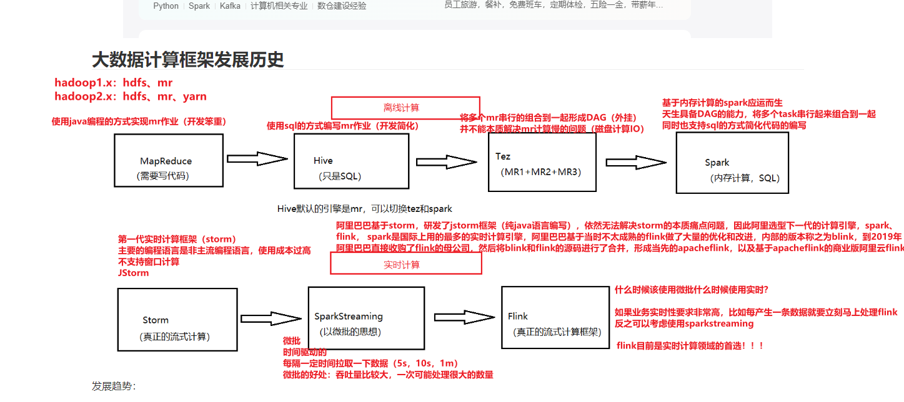


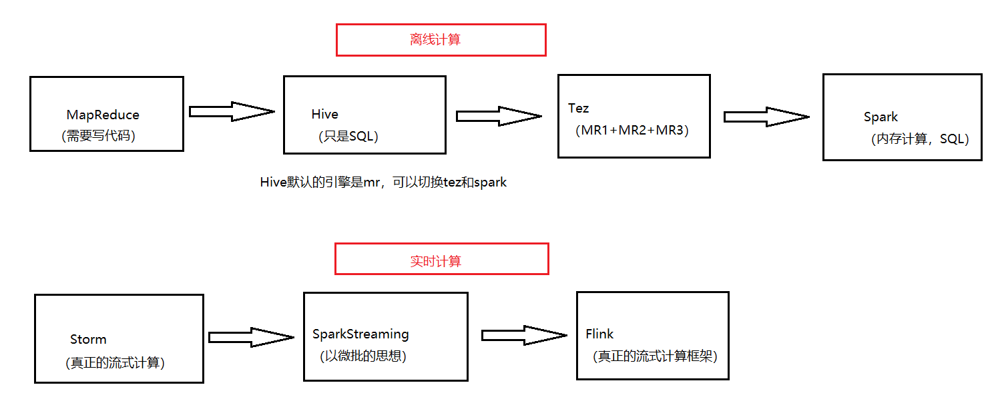

发展趋势：

离线（批量）：MapReduce -> Hive -> Tez  -> Spark

实时（流式）：Storm -> StructuredStreaming  -> Flink


结论：离线开发首选spark，实时计算首选flink

## 流式计算介绍

### 生活中的流式场景

* 股票
* 流水或者水龙头
* 车流
* 行人
* 自动扶梯


### 程序中的流式场景

实时计算道路监控的情况

实时计算道路拥堵的情况

实时计算外卖配置位置信息

实时统计平台/网站成交额

### 流式的特点

实时计算

数据是有开始，但是没有结束，所以说数据是没有边界的

数据是源源不断产生（到来）

数据到来的顺序不确定

数据量可大可小

数据是**一条一条**地计算，把这种计算称之为数据流的计算。

数据流：数据是流动的，流动的数据称之为数据流。数据是实时产生，实时到达，实时计算，实时出结果。

> 小结：
>
> 流式计算中，数据是流动的。先有计算逻辑，再有数据。
>
> 离线计算中，先有数据，再有计算逻辑。

### 终极问题：流式计算和Flink有什么关系

流式计算，是一种计算思想。

Flink是流式计算思想的一种实现而已。

流式计算除了Flink，还有别的实现：Storm、SparkStreaming等。

## Flink简介

### 概述

官网地址：

https://flink.apache.org/

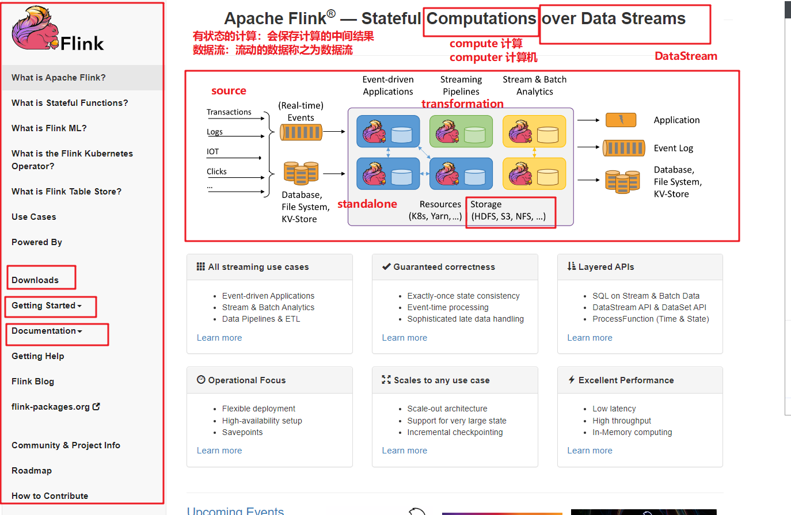

Flink：基于数据流上`有状态`的计算。

数据流：流动的数据。

有状态的计算：状态，就是计算结果，有状态，就是Flink会保存计算的中间结果。

### 历史

2008年起源于欧洲柏林大学的一个研究性项目

2014年4月份，被捐赠给了Apache

2014年12月份，从Apache毕业（孵化成功）

2019年1月份，Flink的母公司被阿里巴巴收购，从此Flink就归于阿里了

目前的Flink最新版为1.18.0

本次课程基于1.15.4

### 特性

- 支持**高吞吐、低延迟、高性能**的流处理
- 支持带有事件时间的**窗口（Window）**操作
- 支持有状态计算的**Exactly-once**语义
- 支持高度灵活的窗口（Window）操作，支持基于**time、count、session，以及data-driven**的窗口操作
- 支持具有**Backpressure**功能的持续流模型
- 支持基于轻量级**Checkpoint**实现的容错
- 一个运行时同时支持**Batch on Streaming**处理和**Streaming**处理
- Flink在JVM内部实现了自己的**内存管理**
- 支持迭代计算
- 支持程序自动优化：避免特定情况下Shuffle、排序等昂贵操作，中间结果有必要进行缓存

### 架构

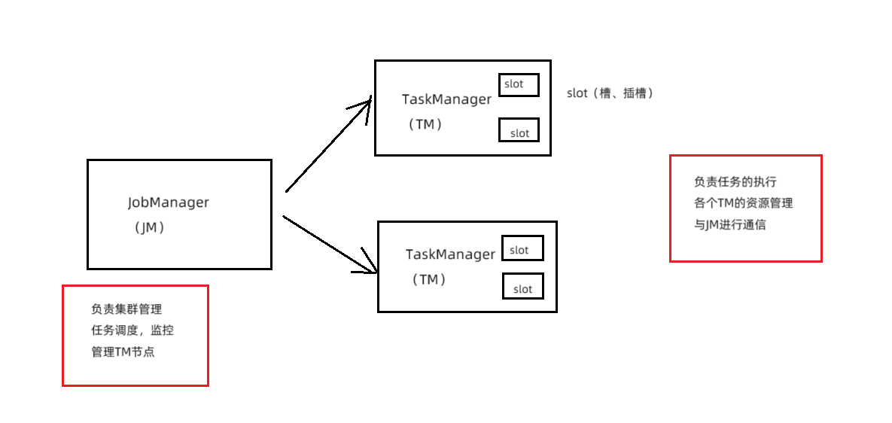

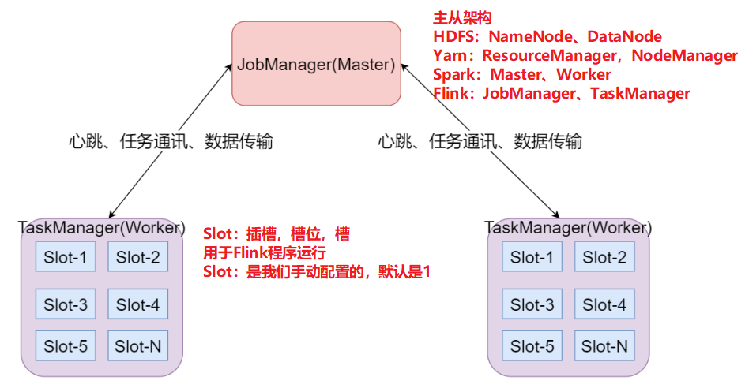

Flink的架构目前需要了解的如下：

JobManager：集群的主节点，负责集群管理等

TaskManager：集群的从节点，负责任务的执行

Slot：槽，或者叫插槽，是从节点的资源单位，Flink任务必须在Slot里运行。Slot的数量是人为设置的，默认是1。

一旦设置后，就无法更改。如果要更改，需要修改配置，然后重启集群。


```
JobManager:相当于校区的办公室，管理所有的教室资源，是静态的概念，客户端将作业递交以后，需要根据具体的并行度和算子之间的依赖关系切割成一个个具体的任务，然后调度到具体的taskManager上去运行。
TaskManage：相当于上课的教室，受办公室管理的，可以有一个或者多个TaskManager，也是静态的（相对，集群启动以后，tm节点的数量是固定的，除非通过命令增加节点）
他会向主节点进行通信汇报心跳。
Solt：是具体的任务运行的地方，类似于教室里面的工位，是物理的（平均分配cpu、网络带宽、内存等等资源），所以slot的数量决定了同一个时间可以运行的任务的最大数量
```


### 模块

~~~shell
#1.Flink核心
DataStream API，流批一体API，需要写Java、Python代码

#2.FlinkSQL（本次课程以sql讲解为主）
主打SQL

#3.图计算
Gelly

#4.机器学习
FlinkML（Alink）

#5.复杂事件处理
FlinkCEP（黑马出行）
~~~

## 阿里云Flink

### 介绍

阿里云实时计算Flink版（Alibaba Cloud Realtime Compute for Apache Flink，Powered by Ververica）是阿里云基于Apache Flink构建的企业级、高性能实时大数据处理系统。

阿里云实时计算Flink版是一套基于Apache Flink构建的⼀站式实时大数据分析平台，提供端到端亚秒级实时数据分析能力，并通过标准**SQL**降低业务开发门槛，助力企业向实时化、智能化大数据计算升级转型。

阿里云实时计算Flink版是一种全托管Serverless的Flink云服务，开箱即用，计费灵活。具备一站式开发运维管理平台，支持作业开发、数据调试、运行与监控、自动调优、智能诊断等全生命周期能力。**100%兼容Apache Flink**，支持开源Flink平滑迁移上云，核心企业级增强Flink引擎**较开源Flink有约两倍性能的提升**。拥有Flink CDC、企业级复杂事件处理（CEP）等企业级增值功能，并内置丰富上下游连接器，助力企业构建高效、稳定和强大的实时数据应用。

### 产品优势

* 全托管Flink服务
  * 开箱即用
  * 开发运维全周期

* 丰富的企业级能力
  * Flink CDC实时入湖入仓
* 性能强劲
* **100%兼容开源**
  * 100% 兼容Apache Flink
  * 支持开源 Flink 平滑迁移上云
* 开放被集成能力强
* 业界认可

阿里云Flink和Apache Flink功能对比：

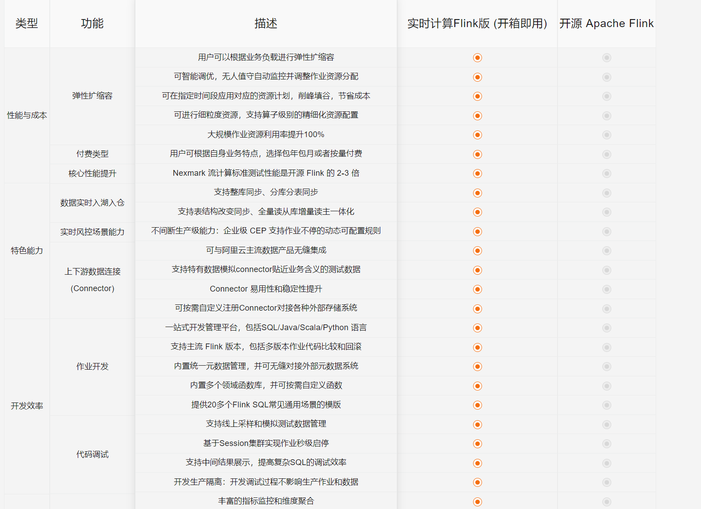

### 资源领取

#### ECS

前提：新账号才可以。（没有注册过的手机账号才可以）

搜索ECS，点击立即领取，选择服务器，版本，大区，即可。

自动开通服务，就能看到服务器的实例运行。


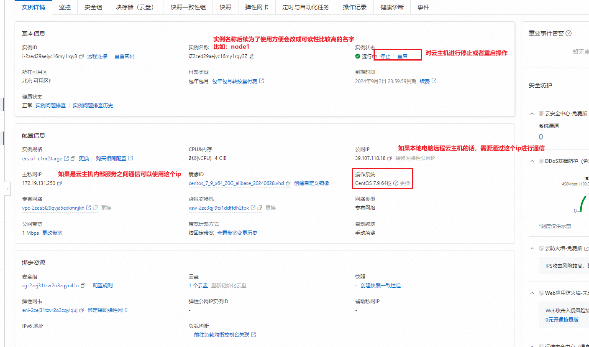


点击控制台，可以看到所有服务资源列表，如果提示需要开通，则应该先开通。


几分钟后，就能看到了。


#### Flink

搜索Flink，找到实时计算Flink版，点击立即试用，看到如下页面：


点击同意授权：


选择付费方式，地域、可用区。

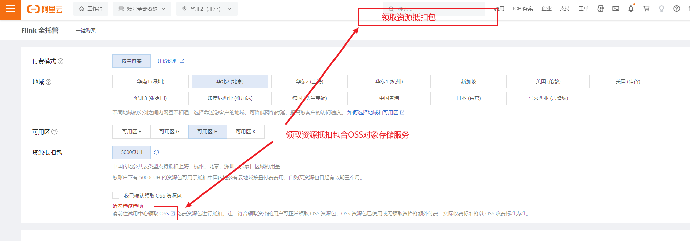

领取资源抵扣包：

直接点击领取即可。

领取OSS：


填写工作空间名称：


创建OSS存储桶（理解为HDFS的目录，把OSS当做HDFS用）


回来领取页面，刷新OSS存储桶，就能看到OSS桶。

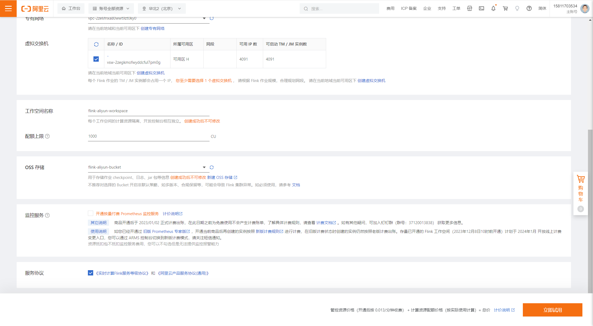

点击立即试用：


看到如下页面，说明服务已经开通：


#### MySQL

搜索MySQL，选择云数据库 RDS MySQL Serverless版本，点击立即试用：

选择的mysql产品为：


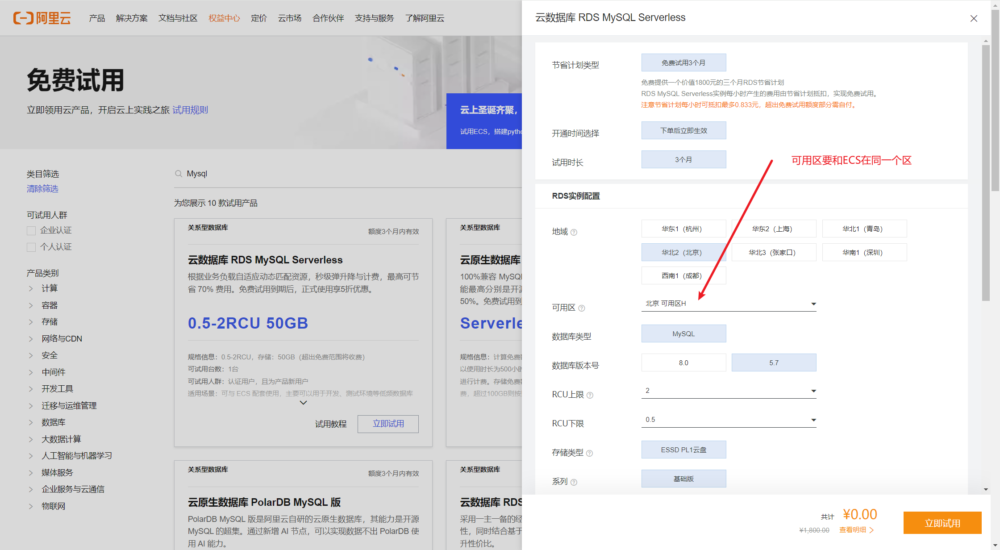

稍等一会儿，能看到服务已经有了：


创建账号：

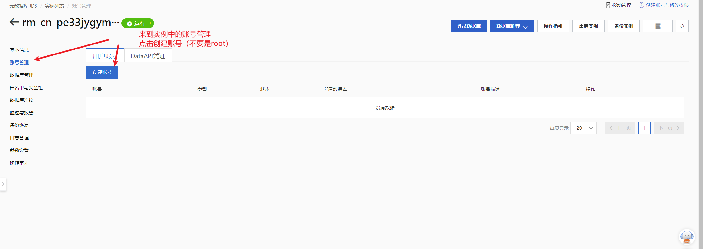


>注意：创建mysql的时候，如果没有可选的“可用区”，则可以创建该资源对应可用区下的虚拟交换机。
>
>账号：itheima
>
>密码：Itheima111

#### Hologres

搜索Hologres，点击立即试用，创建交换机，


创建完后，选择创建好的交换机即可。


点击立即试用即可。

#### 共享流量包

搜索”流量“，选择共享流量包，点击立即试用：


### 基本配置

#### 更改实例和主机名

点击实例->实例ID，点击实例名称，修改名字即可。


点击实例->实例ID，点击主机名，修改名字即可。

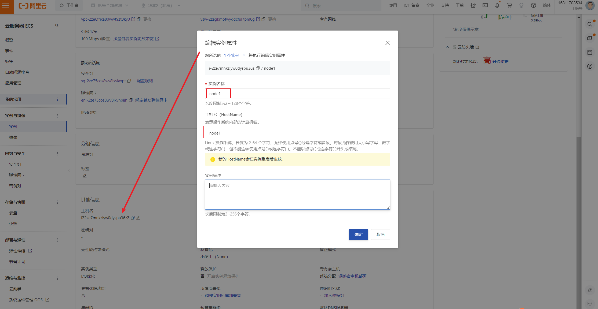

```
注意：修改完主机名和实例名以后需要重启ecs生效。
```


#### 添加安全组

点击安全组->创建安全组，快速创建，把主机网络加进来。

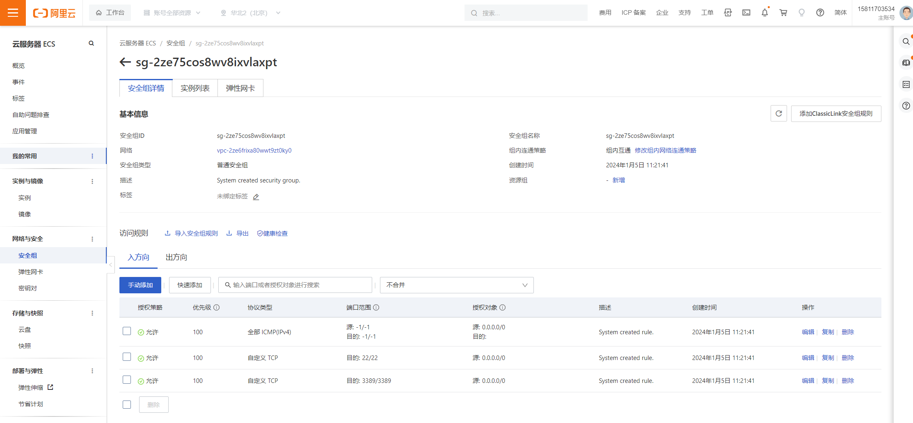

#### 重置实例密码

点击实例->实例ID，点击重置密码，输入新密码即可。

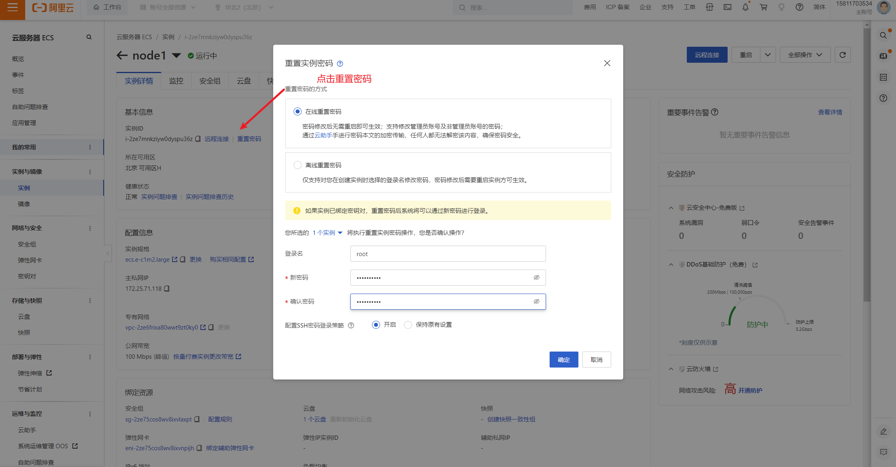

重置密码后，登录服务器，选择私网，输入密码：

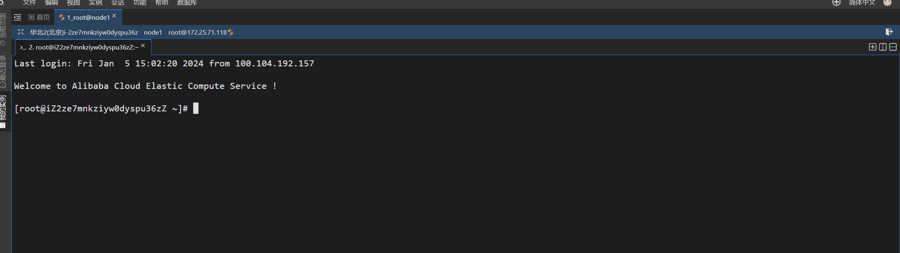

> 注意：如果使用终端工具连接，则请使用公网IP。
>
> 用户名：root
>
> 密码：Itcast123

### 安装服务

#### JDK

~~~shell
#1.创建目录，用于上传JDK
mkdir -p /export/server
mkdir -p /export/software

#2.来到software目录下，上传JDK


#3.解压JDK
tar -xf jdk-8u241-linux-x64.tar.gz  -C /export/server/

#4.配置环境变量
vim /etc/profile
在文件最后添加如下3行配置
#JAVA_HOME
export JAVA_HOME=/export/server/jdk1.8.0_241
export PATH=$PATH:$JAVA_HOME/bin

#5.重新加载profile文件
source /etc/profile

#6.测试JDK是否安装成功
jps
java -version
~~~

截图如下：

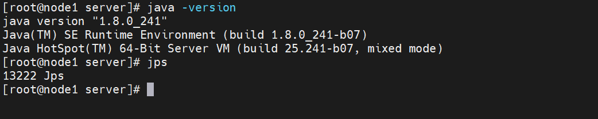


#### Zookeeper

~~~shell
#1.来到software目录下，上传Zookeeper
cd /export/software

#2.解压Zookeeper
tar -xf jdk-8u241-linux-x64.tar.gz  -C /export/server/

#3.回到解压后的目录
cd /export/server

#4.创建软连接
ln -s apache-zookeeper-3.5.10-bin/ zookeeper

#5.进入Zookeeper安装目录
cd zookeeper

#6.配置conf下的zoo.cfg文件
cp conf/zoo_sample.cfg conf/zoo.cfg

#7.编辑zoo.cfg文件
vim conf/zoo.cfg文件，修改dataDir这一行，同时添加server.1这一行，保存退出
dataDir=/export/data/zkdata
server.1=node1:2888:3888

#8.创建zk存储数据的目录
mkdir -p /export/data/zkdata

#9.创建myid文件
echo 1 >/export/data/zkdata/myid

#10.启动zookeeper，测试是否安装成功
bin/zkServer.sh start

#11.校验是否安装成功
bin/zkServer.sh status
~~~

截图如下：

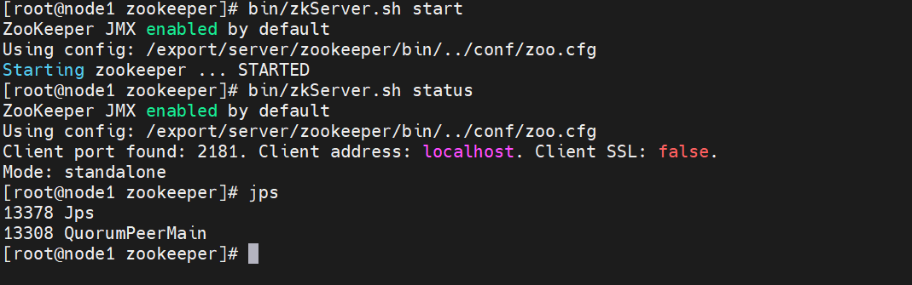


#### kafka

~~~shell
#1.来到software目录下，上传Zookeeper
cd /export/software

#2.解压kafka
tar -xf kafka_2.12-3.5.0.tgz  -C /export/server/

#3.回到解压后的目录
cd /export/server

#4.创建软连接
ln -s kafka_2.12-3.5.0/ kafka

#5.进入kafka安装目录
cd kafka

#6.配置conf下的server.properties文件
vim config/server.properties文件，注意下IP地址要改成ECS的丝网IP
34行，放开注释：listeners=PLAINTEXT://172.25.71.118:9092
62行：log.dirs=/export/data/kafka-logs
125行：zookeeper.connect=172.25.71.118:2181

#7.配置环境变量
#ZK_HOME
export ZOOKEEPER_HOME=/export/server/zookeeper
export PATH=$PATH:$ZOOKEEPER_HOME/bin

#KAFKA_HOME
export KAFKA_HOME=/export/server/kafka
export PATH=$PATH:$KAFKA_HOME/bin

#8.尝试启动kafka
bin/kafka-server-start.sh config/server.properties

#9.正式启动
nohup bin/kafka-server-start.sh config/server.properties > /tmp/kafka.log &
~~~

截图进程如下：

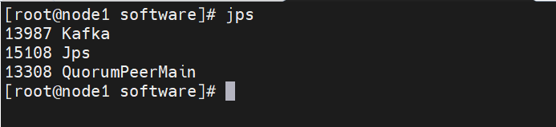


## Flink的安装部署

### 开源安装（使用本地虚拟机环境演示）

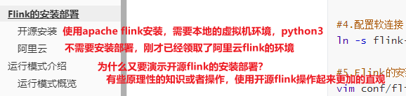

**注意**：这个安装部署属于Flink的``Standalone``模式。

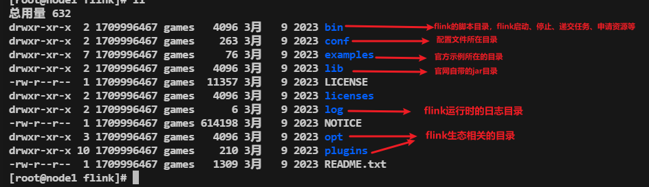

~~~shell
#1.下载链接
archive.apache.org
https://flink.apache.org/downloads.html#flink

#2.上传到Linux
比如，上传到/export/software目录下。

#3.解压
tar -xf flink-1.15.4-bin-scala_2.12.tgz -C /export/server

#4.配置软连接
ln -s flink-1.15.4 flink

#5.Flink的安装配置
vim conf/flink-conf.yaml打开后，配置如下信息：
91行：taskmanager.numberOfTaskSlots: 4
190行，rest.address: node1
203行，rest.bind-address: node1
任选一行，添加如下配置：
classloader.check-leaked-classloader: false

#6.启动
bin/start-cluster.sh

#7.访问Flink
http://node1:8081
没有用户名和密码
~~~

截图如下：

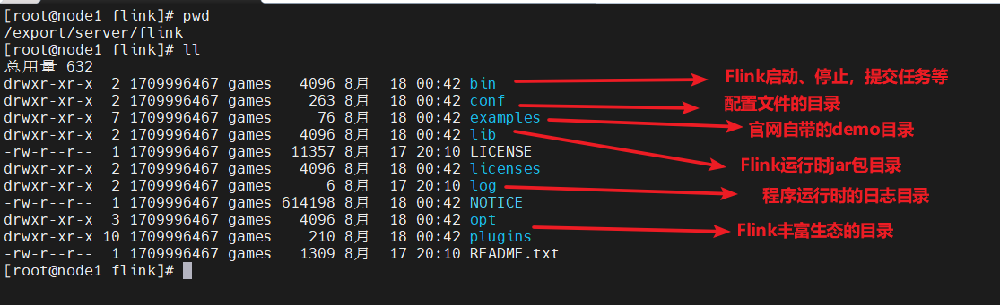

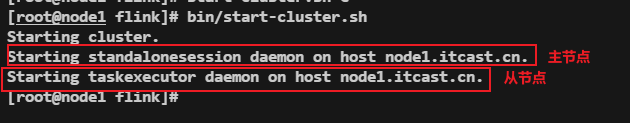

Flink任务运行

~~~shell
#1.Java
#2.1 保证有JDK，再执行如下命令
bin/flink run examples/batch/WordCount.jar

#2.Python
#2.1 保证有Python3.6、3.7或者3.8
python -V
#2.3 安装flink依赖（最好先卸载Spark的环境，或者重装一下anaconda环境，推荐重装Anaconda环境）
python -m pip install apache-flink==1.15.4 -i https://pypi.tuna.tsinghua.edu.cn/simple
#2.4 执行如下命令
bin/flink run -py examples/python/datastream/word_count.py
~~~

Java运行截图：

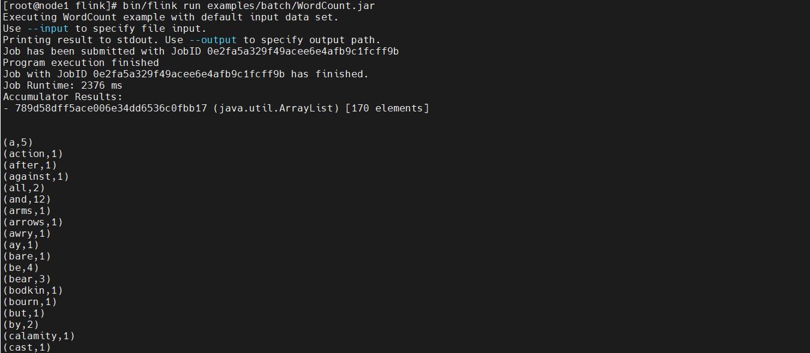

Python运行截图：

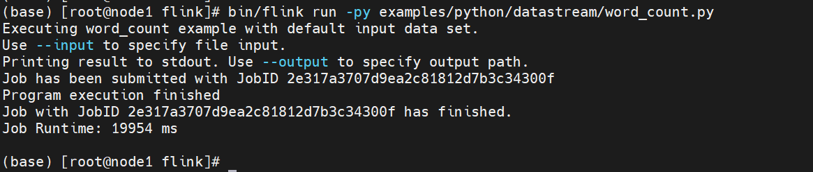


### 阿里云（跳过安装部署，已领取资源）

阿里云的Flink，不需要安装（免安装），开通服务即可使用。


## 运行模式介绍

### 运行模式概览

Flink可以运行在多种模式下：

* Local（本地），不推荐使用，本地开发环境使用

一个进程模拟主节点和从节点。

* Standalone（独立），将主节点和从节点部署到一台虚拟上运行，开发测试的时候使用

主节点和从节点是两个进程，他们是独立的。

* Flink on Yarn（```生产使用```），将flink的作业递交到yarn集群中运行


Spark：cluster、client

Flink On Yarn有三种模式，分别是：

session模式：session，会话，因此也称之为会话模式（```Spark中没有的模式``）。

per-job模式：per，每job，任务，Job分离模式（类似于Client模式）。

application模式：application，应用，也称之为应用模式（类似于Cluster模式）。

小结：

~~~shell
#1.阿里云Flink
per-job模式，生产使用，不能和Spark的Client模式画等号。

#2.开源
推荐使用application模式。
~~~

刚才演示单词计数作业的递交是基于standalone模式部署下的

```
bin/flink run examples/batch/WordCount.jar
```

standalone模式的特点是，手动部署flink集群，然后手动启动flink集群，启动以后jm（jobManager）和Tm是固定不变的，同时slot的数量也不变

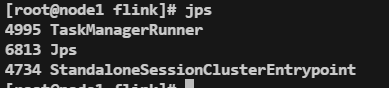


但是这种部署方式不适合在生产环境下部署，只能作为演示测试使用。


因此需要学习在生产环境下如何部署flink，首选将flink部署到yarn集群中运行。

```
bin/stop-cluster.sh 
因此本地虚拟机集群可以不启动flink集群，而是递交作业的时候动态去yarn集群中申请jm和tm
```

Flink on Yarn：将flink部署到yarn集群中，有三种部署模式（session模式、per-job模式、application模式）

flink部署到yarn集群的话，需要与hdfs、yarn集群进行交互，

在flink1.13版本之前，flink默认兼容hadoop，需要下载与hadoop兼容的flink安装包进行部署

但是从flink1.13版本之后，flink将hadoop进行解耦合，安装flink的时候不需要考虑hadoop的版本号，只需要将已经安装hadoop版本的兼容包放到fllink的lib目录即可

因此，flink需要与hadoop进行交互的时候必须要将

```
commons-cli-1.5.0.jar
flink-shaded-hadoop-3-uber-3.1.1.7.2.9.0-173-9.0.jar
```

放到flink安装目录的lib目录下才可以。刚才的演示案例是基于standalone环境的，读取的数据来自于本地的字符串数组，输出的结果直接打印到控制台，因此与hadoop的框架没有任何的关系，所以不需要将以上两个jar上传到flink的lib的目录。


而接下来演示的flink on yarn，是基于hadoop生态的yarn和hdfs，因此必须要将以上两个jar包上传到lib目录，否则提示，找不到类

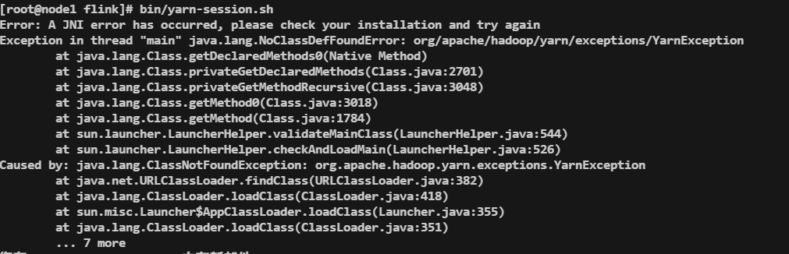

### session模式

#### 介绍

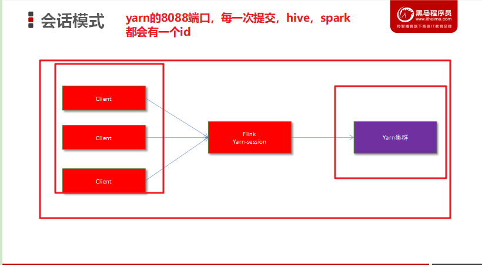

会话模式，就是在Yarn会【动态】初始化一个Flink集群，这个集群会随着会话的存在而存在，会随着会话的停止而消失。

也就是说，如果我们要启动一个session的话，要分为2步：

~~~shell
#1.初始化一个Flink会话集群，这个脚本运行后，会启动Flink集群的JobManager，不会启动TaskManager
运行bin/yarn-session.sh脚本即可初始化一套Flink Session集群。（实际上只是初始化的主节点，JobManager）

#2.再向集群提交任务，这个命令和standalone模式提交命令一样
bin/flink run examples/batch/WordCount.jar	（具体作业递交的时候，才会去初始化从节点，TaskManager，作业运行结束，只会释放从节点的资源）
这个任务可以提交多个，每个任务运行完后，再自己销毁。
~~~

说明

```
基于standalone部署flink（静态的创建flink集群，事前启动flink集群）
     运行java作业的时候只需要部署jdk即可
     运行python作业的时候需要python3.6-3.8之间，在本地虚拟机构建一个python环境


基于yarn部署flink（动态的创建flink集群，不需要事前启动flink集群，而是通过bin/yarn-session.sh）
     运行java作业的时候不需要额外创建运行环境了，因为hadoop是java开发，是基于jdk
     运行python作业的时候，需要在yarn集群中创建一个python环境，才可以运行python作业
```


#### 演示

~~~shell
#1.初始化集群
bin/yarn-session.sh

#2.提交任务
#2.1 Java提交
bin/flink run examples/batch/WordCount.jar

#2.2 Python提交
#拷贝venv.zip文件到Flink安装目录下
cp /export/software/venv.zip /export/server/flink
#提交运行，修改application_id号
bin/flink run -t yarn-session -Dyarn.application.id=application_1722589202035_0001 -pyarch venv.zip -pyexec venv.zip/venv/bin/python3.8 -py examples/python/datastream/word_count.py

#参数解释
-t:						执行模式，这里采用的是yarn-session模式
-Dkey=value				参数的编写方式
-Dyarn.application.id	运行在Yarn集群上的yarn-session的ID
-pyarch：				PyFlink的环境压缩包
-pyexec：				压缩包里的python解释器路径
-py：					python脚本文件
~~~


venv.zip文件的构建过程：

参考网站：https://docs.anaconda.com/miniconda/

```
下载脚本文件：
wget https://ci.apache.org/projects/flink/flink-docs-release-1.12/downloads/setup-pyflink-virtual-env.sh
sh setup-pyflink-virtual-env.sh 1.15.4
source venv/bin/activate  # 激活虚拟环境
```


#### 优缺点

资源消耗比较小

任务运行比较省时，效率较高

由于资源有限，如果任务数据量大，可能会造成集群宕机的情况

#### 应用场景

数据量小、小任务的场景。

开发测试使用，生产不能用。

#### 小结

初始化集群时，只会初始化JobManager进程，不会初始化TaskManager进程。

任务提交时，才会动态启动TaskManager，待任务运行完了后，TaskManager会自动销毁。JobManager仍然运行。

会话结束时，集群销毁。

可以使用`Ctrl+C`取消即可。


### per-job模式

#### 介绍

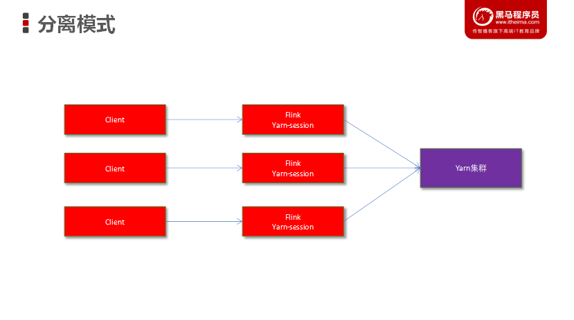

也称Job分离模式，和Spark的client类似。

在提交任务的时候，Yarn会创建一个Flink集群，这个集群是这个任务专属的。待任务运行完之后，集群就会销毁。

所有任务提交都一样。

#### 演示

~~~shell
#Java运行
bin/flink run -m yarn-cluster -yqu default examples/batch/WordCount.jar

#Python运行
bin/flink run -m yarn-cluster -yqu default -pyarch venv.zip -pyexec venv.zip/venv/bin/python3.8 -py examples/python/datastream/word_count.py


#1.参数解释
-m：		指定为yarn-cluster，代表使用yarn模式（还有一种方式的写法，yarn-per-job，目前已经废弃）
-yqu：	指定yarn的队列，如果不指定，默认也是default
-pyarch：把PyFlink模块同任务一起提交给Yarn集群
-pyexec：指我们的压缩包（venv.zip）中的Python解释器路径
-py:	 指脚本路径
~~~


#### 优缺点

资源丰富

单个任务运行在一个集群内，隔离性好，较安全。

资源消耗过多

#### 应用场景

大的任务、数据量大，生产上推荐。

#### 小结

集群会随着任务的提交而创建，随着任务的执行完成而销毁。

每个任务都会创建一套集群。


### application模式

#### 介绍

application模式，也称之为应用模式，这种模式的提出是为了解决Session和Per Job模式下的弊端：`客户端进行在客户端本地启动。`

Application模式，可以任选集群中某一个闲置的节点，启动客户端进行，从而解决上述的弊端。

其他的，和Per-job模式一样。

每个任务都会创建一个集群，待任务运行完了之后，集群再销毁。

#### 演示

~~~shell
#1.Java提交
bin/flink run-application -t yarn-application examples/batch/WordCount.jar --input hdfs://node1:8020/test/input/wordcount.txt --output hdfs://node1:8020/test/output/output1

#2.Python提交
#如果想使用application模式，需要做点准备工作：需要把执行脚本文件和环境放在一个目录下。
cd /export/server/flink
mkdir script
cp venv.zip ./script
cp examples/python/datastream/word_count.py ./script

#2.提交命令
bin/flink run-application -t yarn-application -Dyarn.application.queue=default -Dyarn.ship-files=/export/server/flink/script -pyarch script/venv.zip -pyexec venv.zip/venv/bin/python3.8 -pyclientexec venv.zip/venv/bin/python3.8 -pyfs script/word_count.py -pym word_count 

bin/flink run-application -t yarn-application \
 -Djobmanager.memory.process.size=1024m \
 -Dtaskmanager.memory.process.size=1024m \
 -Dyarn.application.name="Flink Application Cluster" \
 -Dyarn.ship-files=/export/server/flink-1.15.4/script \
 -pyarch script/venv.zip \
 -pyclientexec venv.zip/venv/bin/python3.8 \
 -pyexec venv.zip/venv/bin/python3.8 \
 -pyfs script/word_count.py \
 -pym word_count
~~~

截图如下：

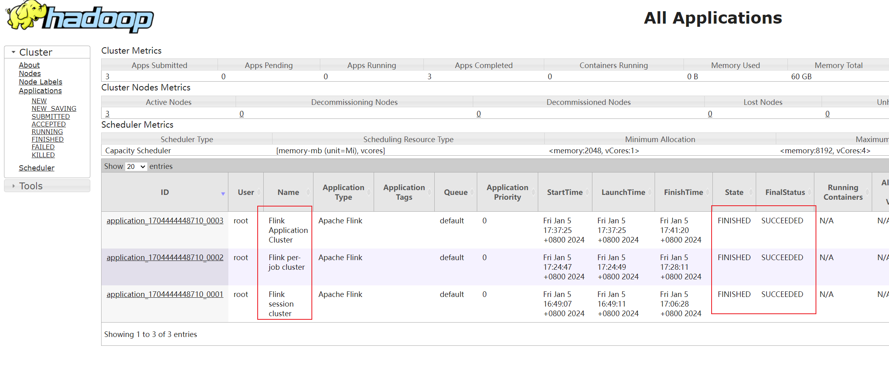

#### 小结

和Per-job运行时一样。区别就是客户端节点会在集群中某一台机器启动。

### 总结

~~~shell
#1.开源
三种模式都支持。（Session、per-job、application）
工作中一般用per-job或者application模式。

#2.阿里云
没有application模式。（per-job、Session）
工作中一般用per-job模式。
~~~

## 作业

~~~shell
#1.领取阿里云的资源，并且开通服务。

#2.安装Apache Flink。（阿里云Flink免安装）
~~~


