# Flink基础

## 今日内容介绍

* Flink入门案例
   * 阿里云Flink
   * Apache Flink
* StreamTableEnvironment对象
   * 编程API模型
   * 方法简介
   * 功能
   * 创建方式
   * Flink中的表
* FlinkSQL客户端
* 数据类型
* 动态表&连续查询
* Flink的时间

## 入门案例

### 需求

使用FlinkSQL完成wordcount案例。

### 分析

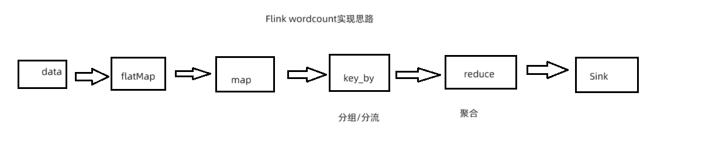


### 流式SQL开发流程

~~~shell
#1.创建Source表
映射数据源部分。要求数据源一定要是结构化的才可以。（使用flinksql开发要求数据源一定是结构化数据，因为sql操作的是表或者视图对象，这个对象一定结构化的，如果使用DataStreamAPI开发的话即可以是结构化数据，也可以是半结构化数据）

#2：处理数据
将读取到的数据进行加工处理的过程，这里面就是使用flink提供的算子进行数据的转换操作，统称为数据处理

#3.创建Sink表
映射输出结果部分。（将处理好的数据存储到指定的位置）
~~~


### 实现

**==注意：无论是阿里云的wordcount还是开源的wordcount，都需要flink-examples-table_2.12-1.15.4.jar包==**

#### 阿里云

由于阿里云主推SQL，且SQL的开发难度低，效率极高，因此我们先体验一下SQL的开发。

1. 安装netcat，运行以下命令：

```
sudo yum install nc
```

​	2.sql开发

~~~sql
--创建一个source_table临时表。
--connector：连接器
CREATE TEMPORARY TABLE source_table (
  word VARCHAR
) WITH (
  'connector' = 'socket',
  'hostname' = '172.21.185.92',
  'port' = '9999',
  'format' = 'csv'
);

--创建一个sink_table临时表。
--print:把结果打印到标准输出
CREATE TEMPORARY TABLE sink_table(
  word VARCHAR,
  cnt BIGINT
) WITH (
  'connector' = 'print',
  'logger' = 'true'
);

--wordcount处理逻辑
INSERT INTO sink_table
SELECT word,count(1) as cnt from source_table group by word;
~~~

截图如下：

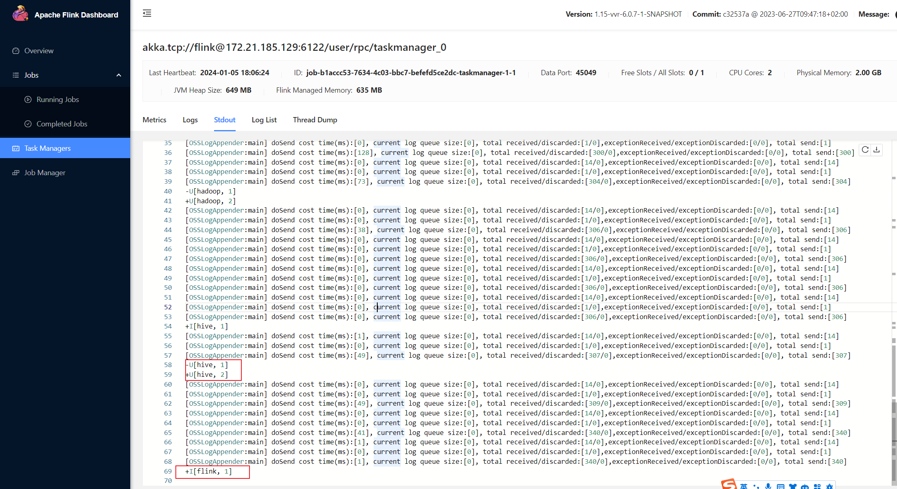


#### 开源

使用自己安装的Flink来完成入门案例。除了开发方式不同，SQL基本上类似。

##### SQLClient工具介绍

~~~shell
bin/sql-client.sh
~~~

专门用于运行FlinkSQL的工具。如果需要正常运行sql-client工具，则要保证Session集群或者Standalone模式集群成功启动。


##### 实现

~~~sql
--1.创建source表
create table source_table (
 word string
 ) with (
 'connector' = 'socket',
 'hostname' = 'node1',
 'port' = '9999',
 'format' = 'csv'
 );


--2.创建sink表
create table sink_table (
 word string,
 counts bigint
 ) with (
 'connector' = 'print'
 );
 
 
 
 --3.执行任务
 insert into sink_table 
 select word,count(*) 
 from source_table 
 group by word
~~~

截图如下：

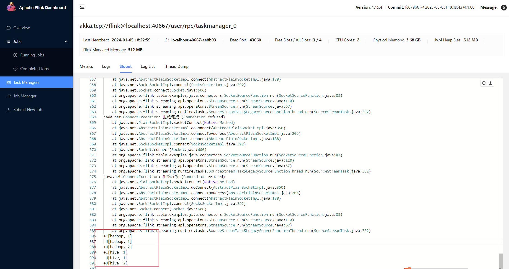

> 注意：
>
> 需要把flink-examples-table_2.12-1.15.4.jar包上传到FLINK_HOME/lib目录下。并且重启Flink集群Standalone或者Session集群才可以。

## TableEnvironment对象介绍

### 编程API模型

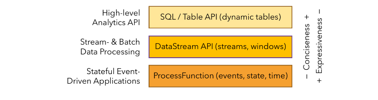

- 高阶API：Sql或者TableAPI（类似于sparksql和dsl的区别），本质上两者是一样的，都是基于TableEnviroment来运行的。但是sql不需要实例化TableEnviroment，TableAPI需要这个对象来实例化上下文，同时可以选择性的指定以流的方式还是以批的方式运行作业，如果不指定则使用默认的（根据数据源支持的方式自动切换流还是批）
  - SQL和Table API是一个层面的。
- 核心API：（java、python、scala等编程语言进行开发），如果业务不能使用sql完成开发，则优先选择这一层的api进行代码的编写，需要构建StreamExecutionEnvironment进行实例化，这一层的开发难度比sql更难，但是比最底层的api更加简单，如（map、flatMap、filter）
- 低阶API：开发成本最高的API，类似于算子的源码层，flink的源码贡献者基于该层开发

### 功能

~~~shell
#1.Catalog管理
Catalog，是FlinkSQL的元数据库。
在MySQL中，数据库中的对象层级关系是：database_name.table_name
在Flink中，数据库中的对象层级关系是：catalog_name.database_name.table_name
FlinkSQL会内置一个默认的元数据库：default_catalog，也会默认内置一个数据库：default_database

#2.Table 管理
FlinkSQL可以创建表。删除等。

#3.VIEW 管理
FlinkSQL可以创建视图等。

#4.UDF管理
Flink可以自定义UDF函数。
~~~

### 创建方式

~~~shell
#1.StreamExecutionEnvironment来创建，推荐使用
StreamExecutionEnvironment env = StreamExecutionEnvironment.getExecutionEnvironment();
StreamTableEnvironment tEnv = StreamTableEnvironment.create(env);

#2.TableEnvironment来创建
EnvironmentSettings settings = EnvironmentSettings.newInstance().inBatchMode().build();
TableEnvironment tEnv = TableEnvironment.create(settings);
~~~

### Flink中的表

Flink中的表分为如下三种：

* 临时表
* 永久表
* 外部表

#### 临时表

临时表，就是在Flink/FlinkSQL中创建的普通的表。临时表只存在当前的会话中。

随着会话的创建而创建，随着会话的销毁而销毁。

`这种表不能保存到catalog中，是无法永久存储`，在开发测试的时候可以使用，生产中不建议使用。

```
create temporary table server_logs(
   id string
 ) with (
   'connector'='datagen'
);
```

default_catalog是默认的，但是数据是保存在内存中的，数据会丢失。


#### 永久表

永久表，顾名思义，表就可以永久存储。

如果需要让表做永久存储，需要额外配置，比如配置：HDFS、Hive等Catalog来保存。

可以在多个会话使用。

永久表用的不多。

```
create table server_logs(
   id string
 ) with (
   'connector'='datagen'
);
```

临时表与永久表的区别：

- 临时表不会存储到catalog中
- 永久表会存储到catalog中，但是数据是否能够永久的存储起来，还需要取决于catalog是否是在内存存储。


#### 外部表

外部表，就是Flink用来连接外部数据源的。

因为Flink是专注于计算，而计算的数据源都是来自于外部，所以我们需要使用Flink来连接外部的数据源。

Flink通过各种各样的Connectors（连接器）来连接外部的数据源。

这是用的最多的情况。

| 临时表                     | 永久表       | 外部表                   |
| -------------------------- | ------------ | ------------------------ |
| 在会话中创建的             | 可以永久存储 | 连接外部数据源           |
| 和外部表结合使用，用的最多 | 基本不用     | 和临时结合使用，用的最多 |

#### 演示

临时表只在当前进程（内存）中。当前会话推出后，进程就被操作系统干掉了，资源就被回收了。因此内存就没有了。

所以表就不见了。

> 扩展：
>
> 进程是程序向操作系统（linux）申请资源的最小单位。
>
> 线程是操作系统调度（Linux、Windows）的最小单位。
>
> 一个进程可以有多个线程，这就是多线程。

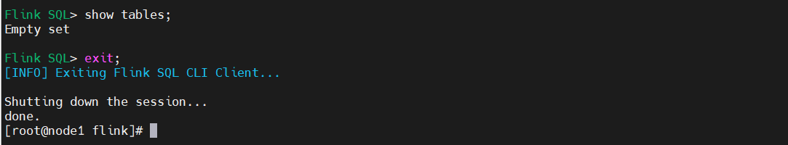

## FlinkSQL客户端

### 介绍

FlinkSQL客户端，是Flink自带的SQL客户端工具。我们可以使用该客户端进行SQL代码编写，任务提交等。

在flink1.18版本及以后，官方不建议使用flinksql-client了，取而代之的是flinksqlgatewey

~~~shell
#1.启动Flink集群
cd /export/server/flink 
bin/start-cluster.sh

#2.进入SQL-Client客户端
bin/sql-client.sh

#3.执行查询
select 'Hello World';
select "Hello World";
select 1;
~~~

截图如下：

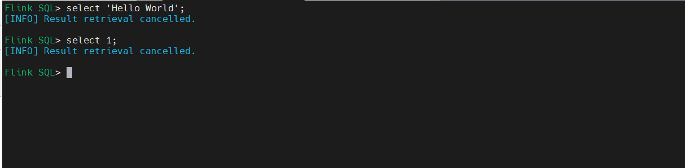

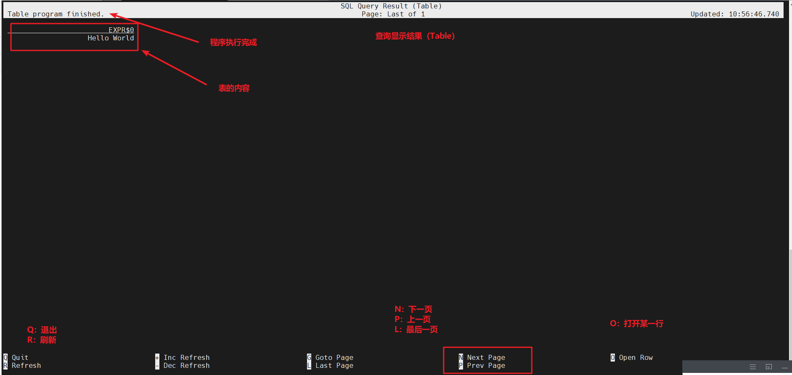

#### 显示模式

FlinkSQL支持三种模式：

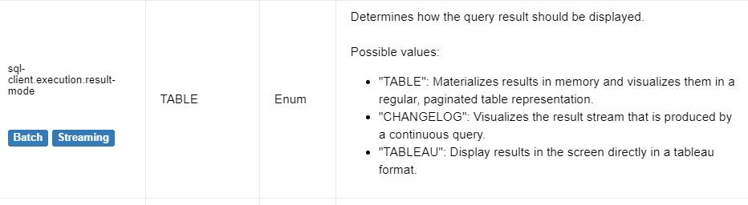

##### table模式

默认的模式。额外开启新页面显示。

~~~shell
#1.设置显示模式
set 'key' = 'value';
set 'sql-client.execution.result-mode' = 'table';

#2.SQL语句
select 'Hello World';
~~~

截图如下：

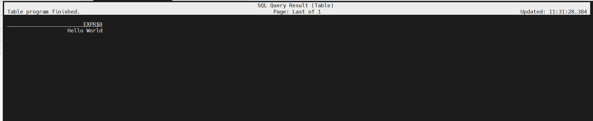

##### changelog模式

变更日志的模式。额外开启新页面显示。

~~~shell
#1.设置显示模式
set 'key' = 'value';
set 'sql-client.execution.result-mode' = 'changelog';

#2.SQL语句
select 'Hello World';
~~~

截图如下：

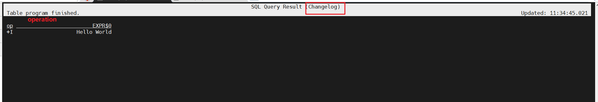

##### tableau模式

和传统关系型数据库类似，在当前页面显示。

~~~shell
#1.设置显示模式
set 'key' = 'value';
set 'sql-client.execution.result-mode' = 'tableau';

#2.SQL语句
select 'Hello World';
~~~

截图如下：

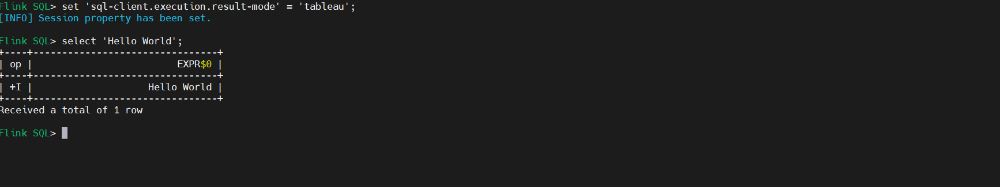


### 案例 - 综合案例

需求：计算每一种商品（sku_id 唯一标识）的售出个数、总销售额、平均销售额、最低价、最高价

数据准备：数据源为商品的销售流水（sku_id：商品，price：销售价格），然后写入到 Kafka 的指定 topic（sku_id：商品，count_result：售出个数、sum_result：总销售额、avg_result：平均销售额、min_result：最低价、max_result：最高价）当中

需要在FlinkSQL 客户端中实现。

前提准备：

~~~shell
#1.启动zookeeper(3个节点都需要启动)
zkServer.sh start
zkServer.sh status

#2.启动Kafka集群(3个节点都需要启动)
cd /export/server/kafka
nohup bin/kafka-server-start.sh config/server.properties > /tmp/kafka.log &
~~~

阿里云案例演示：

~~~sql
create TEMPORARY table source_table (
 sku_id string,
 price bigint
 ) with (
 'connector' = 'datagen',
 'rows-per-second' = '1',
 'fields.sku_id.length' = '2',
 'fields.price.kind' = 'random',
 'fields.price.min' = '1',
 'fields.price.max' = '100000'
 );

CREATE TEMPORARY TABLE sink_table (
 sku_id STRING, 
 count_result BIGINT, 
 sum_result BIGINT, 
 avg_result DOUBLE, 
 min_result BIGINT, 
 max_result BIGINT, 
 PRIMARY KEY (`sku_id`) NOT ENFORCED 
) WITH ( 
   'connector' = 'upsert-kafka', 
   'topic' = 'test', 
   'properties.bootstrap.servers' = '172.19.131.250:9092', 
   'key.format' = 'json', 
   'value.format' = 'json' 
);

insert into sink_table 
select sku_id, 
  count(*) as count_result, 
  sum(price) as sum_result, 
  avg(price) as avg_result, 
  min(price) as min_result, 
  max(price) as max_result 
from source_table 
group by sku_id ;
~~~

开源案例演示：

~~~shell
#1.创建source表
create table source_table (
 sku_id string,
 price bigint
 ) with (
 'connector' = 'datagen',
 'rows-per-second' = '1',
 'fields.sku_id.length' = '2',
 'fields.price.kind' = 'random',
 'fields.price.min' = '1',
 'fields.price.max' = '100000'
 );


#2.创建sink表
CREATE TABLE sink_table (
 sku_id STRING, 
 count_result BIGINT, 
 sum_result BIGINT, 
 avg_result DOUBLE, 
 min_result BIGINT, 
 max_result BIGINT, 
 PRIMARY KEY (`sku_id`) NOT ENFORCED 
) WITH ( 
   'connector' = 'upsert-kafka', 
   'topic' = 'test', 
   'properties.bootstrap.servers' = 'node1.itcast.cn:9092', 
   'key.format' = 'json', 
   'value.format' = 'json' 
);


#3.执行任务（拉起数据任务）
insert into sink_table 
select sku_id, 
  count(*) as count_result, 
  sum(price) as sum_result, 
  avg(price) as avg_result, 
  min(price) as min_result, 
  max(price) as max_result 
from source_table 
group by sku_id ;
~~~

##### 连接器的介绍

* datagen

datagen，这是一个内置的连接器，用于模拟数据源的。在开发中可以配置，使其源源不断产生数据。

可以指定数据源的生成规则。

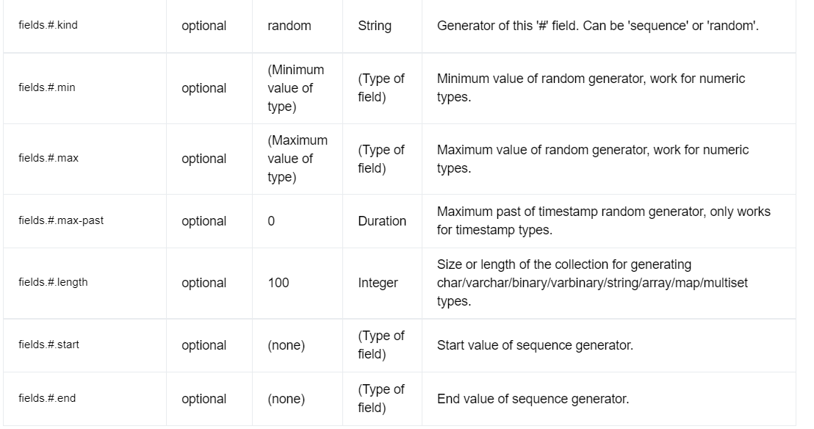

* upsert-kafka

upsert-kafka，可以对kafka的数据进行修改。比kafka连接器功能强大一些。

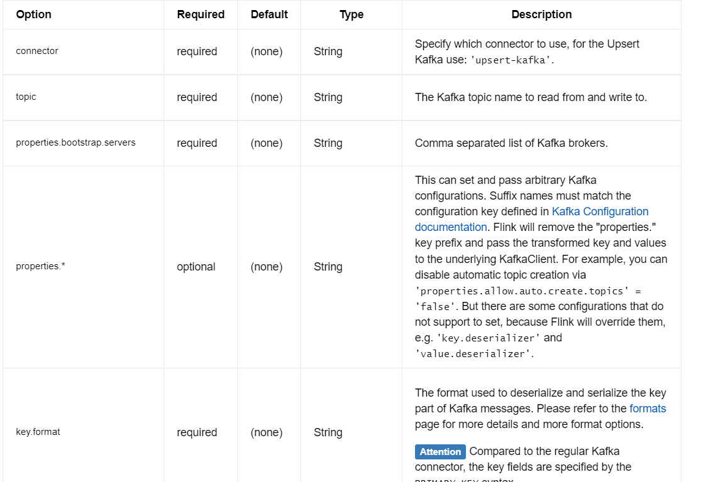

8081截图如下：

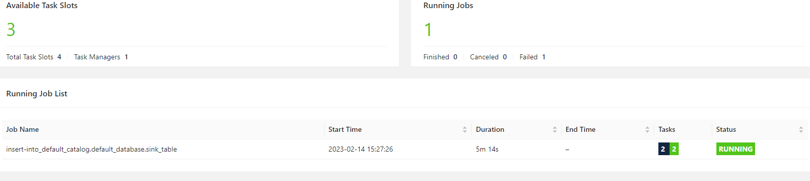

案例执行截图如下：


> 小结：
>
> 该案例需要加载flink-sql-connector-kafka-1.15.2.jar包。


## 数据类型

FlinkSQL数据类型，和之前的MySQL数据库类型类似，从使用数据本身构成来说，分为两种类型：

* 原子数据类型

* 复合数据类型

### 原子数据类型

原子类型大致如下：

~~~shell
#1.字符&字符串类型
string
varchar    --不需要指定字符的长度

#2.二进制类型
binary

#3.数值类型
decimal
int
bigint
smallint

#4.精度类型
float
double

#5.null类型
null

#6.时间&日期类型
date
time
datetime
timestamp
~~~

### 复合数据类型

Flink的复合数据类型如下：

~~~shell
#1.数组类型
array

#2.map类型
map

#3.集合类型
multiset

#4.Row类型
Row
~~~

阿里云案例：

~~~sql
-- 1.创建表
CREATE TABLE json_source (
    id            BIGINT,
    name          STRING,
    `date`        DATE,
    obj           ROW<time1 TIME,str STRING,lg BIGINT>,
    arr           ARRAY<ROW<f1 STRING,f2 INT>>,
    `time`        TIME,
    `timestamp`   TIMESTAMP(3),
    `map`         MAP<STRING,BIGINT>,
    mapinmap      MAP<STRING,MAP<STRING,INT>>,
    proctime as PROCTIME()
 ) WITH (
    'connector' = 'socket',
    'hostname' = '172.19.131.250',        
    'port' = '9999',
    'format' = 'json'
);


--2.执行SQL
select id, name,`date`,obj.str,arr[1].f1,`map`['flink'],mapinmap['inner_map']['key'] from json_source;


-- 3.开启socket，发送数据
{"id":1238123899121,"name":"itcast","date":"1990-10-14","obj":{"time1":"12:12:43","str":"sfasfafs","lg":2324342345},"arr":[{"f1":"f1str11","f2":134},{"f1":"f1str22","f2":555}],"time":"12:12:43","timestamp":"1990-10-14 12:12:43","map":{"flink":123},"mapinmap":{"inner_map":{"key":234}}}
~~~


开源案例：

~~~shell
#1.创建表
CREATE TABLE json_source (
    id            BIGINT,
    name          STRING,
    `date`        DATE,
    obj           ROW<time1 TIME,str STRING,lg BIGINT>,
    arr           ARRAY<ROW<f1 STRING,f2 INT>>,
    `time`        TIME,
    `timestamp`   TIMESTAMP(3),
    `map`         MAP<STRING,BIGINT>,
    mapinmap      MAP<STRING,MAP<STRING,INT>>,
    proctime as PROCTIME()
 ) WITH (
    'connector' = 'socket',
    'hostname' = 'node1',        
    'port' = '9999',
    'format' = 'json'
);


#2.执行SQL
select id, name,`date`,obj.str,arr[1].f1,`map`['flink'],mapinmap['inner_map']['key'] from json_source;


#3.开启socket，发送数据
{"id":1238123899121,"name":"itcast","date":"1990-10-14","obj":{"time1":"12:12:43","str":"sfasfafs","lg":2324342345},"arr":[{"f1":"f1str11","f2":134},{"f1":"f1str22","f2":555}],"time":"12:12:43","timestamp":"1990-10-14 12:12:43","map":{"flink":123},"mapinmap":{"inner_map":{"key":234}}}
~~~

截图如下：

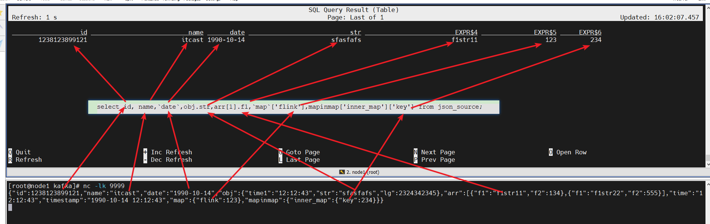

## 动态表和连续查询

FlinkSQL有2个核心概念：动态表和连续查询。

动态表：实时动态变化的表。表数据不是固定不变的。

连续查询：持续不断地查询，从未间断。并不是一次性查询。

### 动态表

| 数据输入                                   | 数据处理       | 数据输出               |
| ------------------------------------------ | -------------- | ---------------------- |
| 静态表，数据是界的，是固定的               | 一次性处理     | 数据是固定的，是有界的 |
| 动态表，数据是源源不断产生的，是动态变化的 | 持续不断地查询 | 是动态变化的，是无界的 |

接下来，我们从数据的输入到数据处理，到数据输出这个流程来介绍FlinkSQL的执行。


### 数据源到表

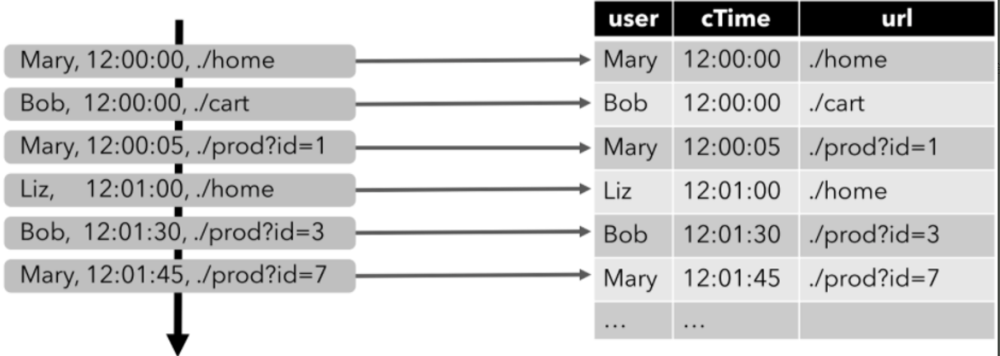

FlinkSQL会将数据源映射成为一张动态表。

后面在项目中，我们称在FlinkSQL创建的表为映射表。

### 动态表到连续查询

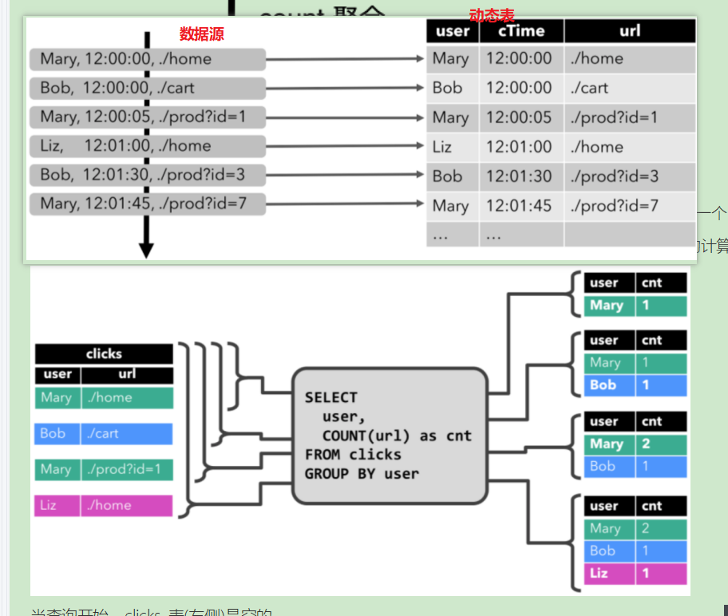

FlinkSQL的查询是持续不断的进行着，这种查询我们称之为连续查询。

会随着数据源源不断地到来，查询的结果会持续不断地更新。

### 连续查询的结果

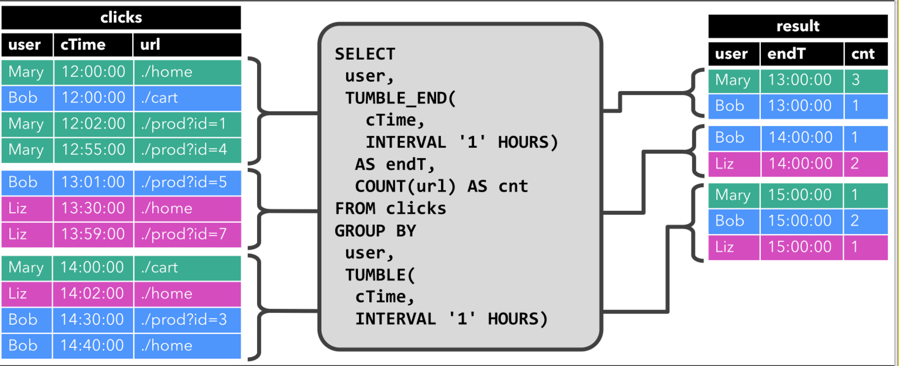

结果会随着持续不断查询而动态变化。

### 结果表转成流

结果表转成流，需要经过Flink的编码。编码有三种：

#### Append-only流

它只支持insert编码操作。比如把数据打入给kafka。就可以使用这种。

#### retract流

撤回流，它支持两种编码操作：

add message：insert

retract message：delete

如果需要更新数据：先retract（delete），再add（insert）。

#### upsert流

upsert message：如果没有数据，则insert，如果有数据，则update

delete message：delete

### 小结

把上述的流程串起来，如下图：


source表是映射的数据源。

查询的SQL就是数据处理。

sink表就是映射到结果中。

## Flink的时间语义

Flink有三个时间语义，分别如下：

* Ingest Time（摄入时间）
* Processing Time（处理时间）
* Event Time（事件时间）

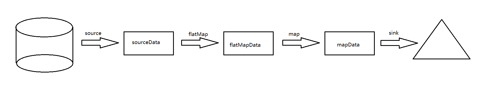

### Ingest Time（摄入时间）

数据进入到Flink程序的时间。如上图中的source算子。

这个时间是Flink赋予的。

这个时间几乎不用。

### Processing Time（处理时间）

数据被Flink处理的时间。比如上图中的map算子。

找个时间是Flink赋予的。

这个时间很少使用。

### Event Time（事件时间）

事件产生时所携带的时间，就是事件时间。

这个时间和Flink没有任何关系。

这个时间是用的最多的。

### Flink时间定义

Flink时间定义只定义处理时间和事件时间。

#### 处理时间（Processing Time）

数据准备：把下面的数据保存为order.csv文件。分别上传到OSS桶的任意目录下和Linux某个路径下。用于下面的案例。

~~~shell
user_001,1621718199,10.1,电脑
user_001,1621718201,14.1,手机
user_002,1621718202,82.5,手机
user_001,1621718205,15.6,电脑
user_004,1621718207,10.2,家电
user_001,1621718208,15.8,电脑
user_005,1621718212,56.1,电脑
user_002,1621718260,40.3,家电
user_001,1621718580,11.5,家居
user_001,1621718860,61.6,家居
~~~


阿里云：

~~~shell
#1.创建表
create table InputTable (
`userid` varchar,
`timestamp` bigint,
`money` double,
`category` varchar,
`pt` AS PROCTIME()
) with (
'connector' = 'filesystem',
'path' = 'oss://itcast-sz-ossbucket01/day02/order.csv',
'format' = 'csv'
);


#2.查询表数据
select userid,`timestamp`, money,category from InputTable;


#3.查看表结构
DESCRIBE InputTable;
~~~

开源案例：

~~~shell
#1.语法
自定义的列名 as PROCTIME()
比如：
pc as proctime()


#2.创建一张表，带有处理时间
create table InputTable (
`userid` varchar,
`timestamp` bigint,
`money` double,
`category` varchar,
`pt` AS PROCTIME()
) with (
'connector' = 'filesystem',
'path' = 'file:///export/data/order.csv',
'format' = 'csv'
);


#3.查看表数据（选做），如果这个报错，但是能看到表结构也行。
select * from InputTable;


#4.查看表结构
desc  InputTable;
~~~

截图如下：

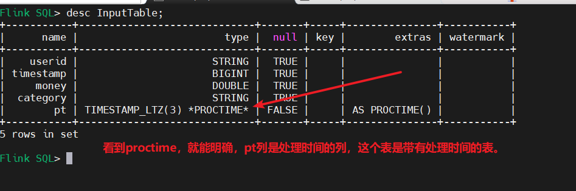

#### 事件时间（Event Time）

阿里云：

~~~shell
#1.创建表
create table InputTable2 (
`userid` varchar,
`timestamp` bigint,
`money` double,
`category` varchar,
rt AS TO_TIMESTAMP(FROM_UNIXTIME(`timestamp`)),
watermark for rt as rt - interval '0' second
) with (
'connector' = 'filesystem',
'path' = 'oss://oss-itheima/test01/order.csv',
'format' = 'csv'
);

#2.查看表数据
select userid,`timestamp`, money,category from InputTable2;

#3.查看表结构
DESCRIBE InputTable2;
~~~

开源案例：

事件时间往往需要与watermark结合使用，因此这里的演示需要用到watermark，事件时间必须要在表的物理列中存在，而处理时间是一个逻辑时间，是处理的数据的时候获取的当前节点的系统时间。事件时间必须要是Timestamp类型或者timestamp_lzt类型才可以，如果事件时间不是这个类型，需要进行转换操作才可以。

~~~shell
#1.语法
watermark for 表中已存在的列名 as 数据乱序时间（延迟时间）
比如：
watermark for rt as rt - interval '0' second
rt的类型必须是：timestamp或者timestamp_ltz类型。
timestamp：不带时区。
timestamp_ltz：带时区，local time 。


#2.创建一张带有事件时间的表
create table InputTable2 (
`userid` varchar,
`timestamp` bigint,
`money` double,
`category` varchar,
rt AS TO_TIMESTAMP(FROM_UNIXTIME(`timestamp`)),
watermark for rt as rt - interval '0' second
) with (
'connector' = 'filesystem',
'path' = 'file:///export/data/order.csv',
'format' = 'csv'
);
~~~

截图如下：

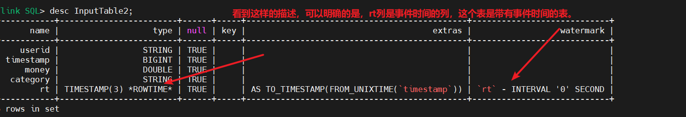

**时间是为窗口服务的。**


### OSS操作

#### 创建vvr-8.0.0版本作业

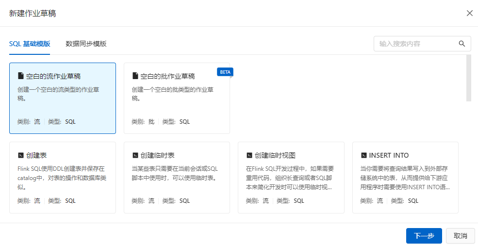

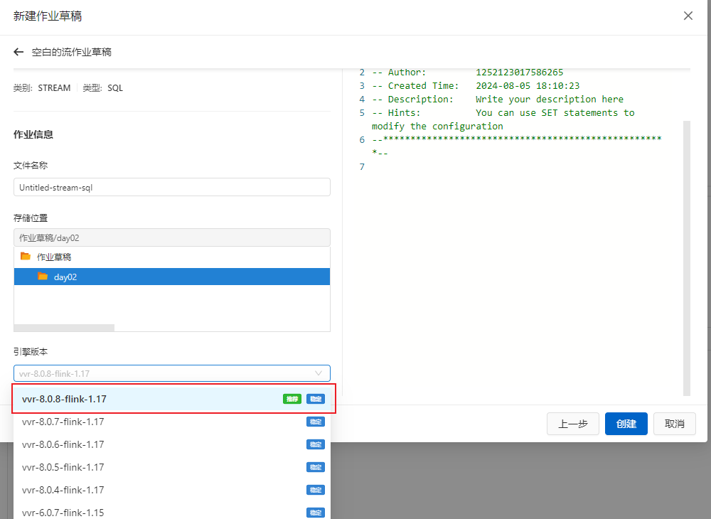

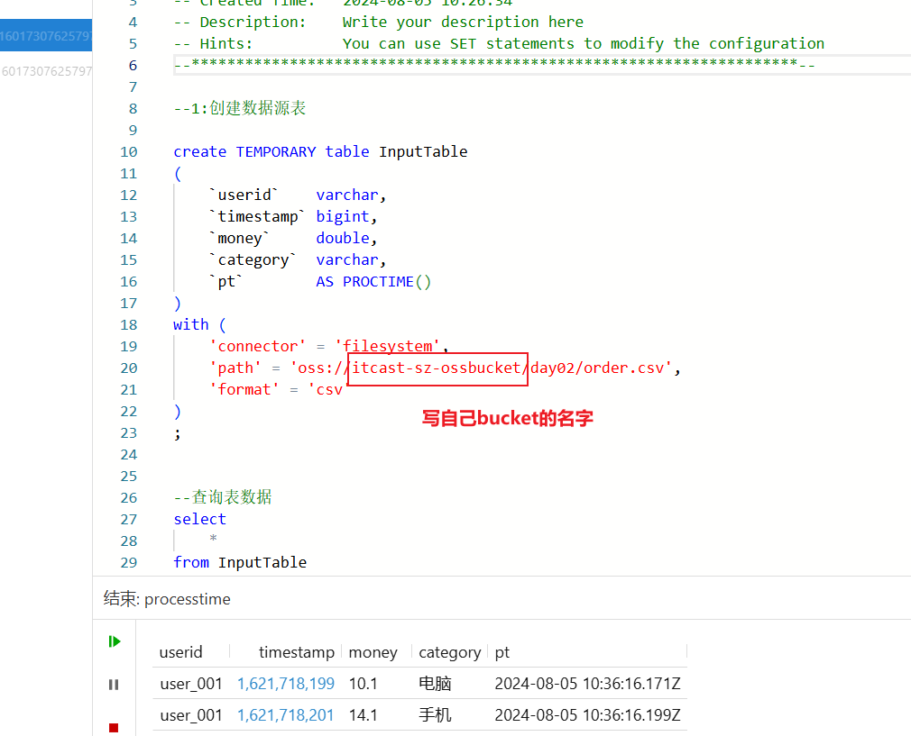

```
说明：仅实时计算引擎VVR 8.0.6及以上版本支持配置Bucket鉴权信息。
```

#### 创建vvr-8.0.0版本的session集群

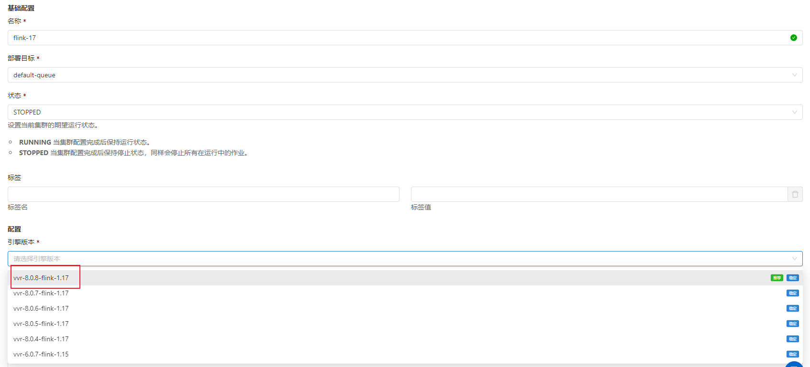

将Bucket鉴权信息填写到其他配置中

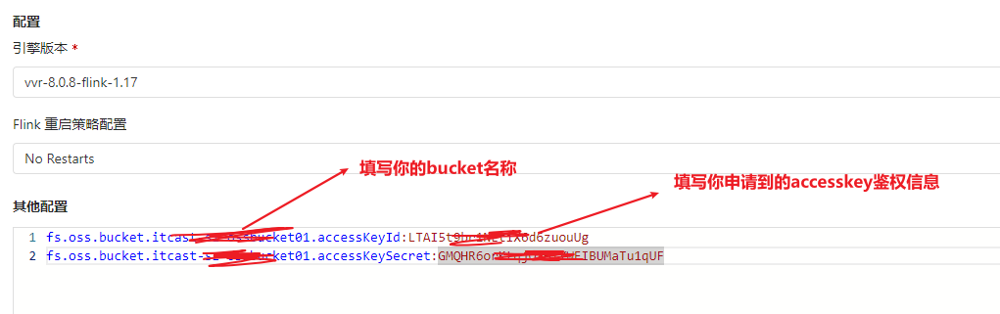

如：


参考网址：https://help.aliyun.com/zh/flink/developer-reference/oss-connector?spm=a2c4g.11174283.0.0.386d2215KAwnPa#8134a05cc8fbf

#### 上传文件


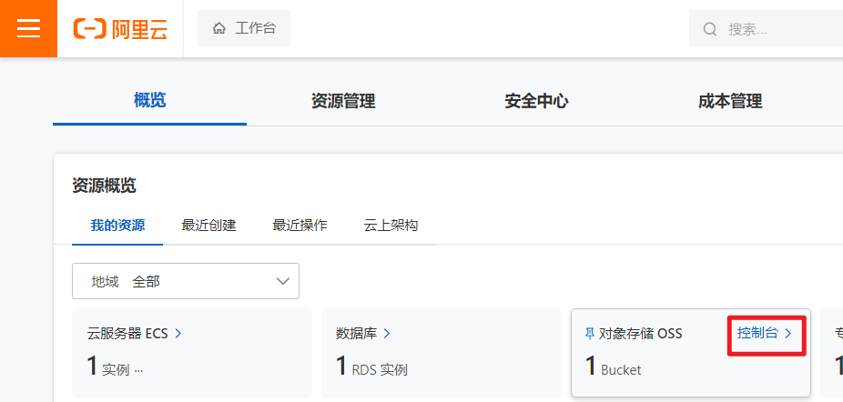

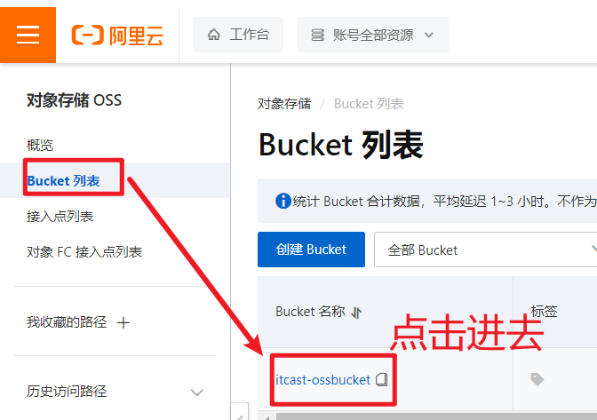

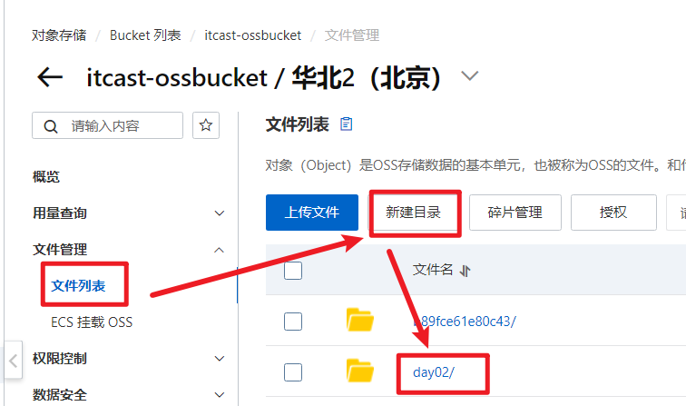


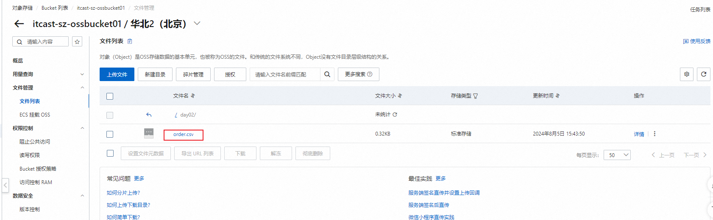

## 窗口

### 为什么要学窗口

需求：假设需要实时统计早上7:30-9:30早高峰的车辆数，你怎么办？

流式程序中，我们一般对流式数据有两种处理方式：

- 全部数据都处理
- 只是处理一部分数据

第一种情况，理论上是可以的，但是实际情况不多。大部分是第二种场景。

第二种场景，有一个隐含的条件：时间。

也就是说，在一定的时间范围内，来进行数据的处理。

流式场景中，我们把在一定的时间范围内，称之为一个窗口。

窗口，就是一个时间范围。是人为划分的。

**结论：窗口是Flink中流转批的桥梁。**

为什么要流转批？

工作中的流式场景，大部分都是在一定的条件（通常是时间）下进行的。我们可以通过时间把流式数据，划分为一个一个的批次进行处理。

Flink：就是通过窗口，来把流转成批进行数据处理的。

### 生活中的窗口

如下图：


```shell
#1.大小
窗口有大小，而且在窗口设定完成之后，大小就是固定的，不会随便更改。

#2.边界
生活中的窗口，由于大小是固定的，因此它是有边界的。一般分为：上下边界、左右边界。

#3.有界
上下左右边界，把一个窗口固定了，因此称之为有界。
```

### 程序中的窗口

程序中的窗口，和生活中的窗口类似。有大小，边界。

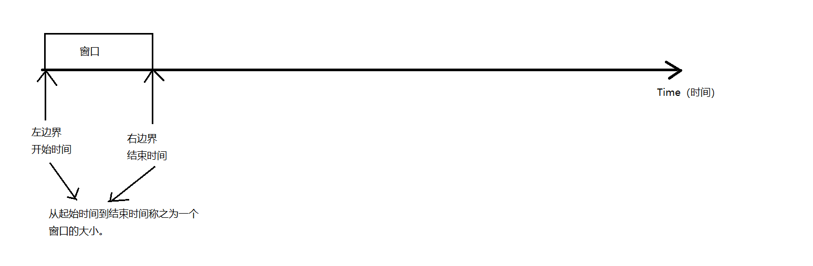

```shell
#1.左边界，起始时间，窗口的开始
我们把窗口的左边界称之为窗口的起始时间，也就是一个窗口的开始。

#2.有边界，结束时间，窗口的结束
我们把窗口的右边界称之为窗口的结束时间，也就是一个窗口的结束。

#3.大小
从窗口的开始到窗口的结束称之为一个窗口的大小。
大小是以时间来界定的。
```

### 时间怎么为窗口服务

由于窗口是有开始和结束的，开始和结束的定义都是依据时间来划分的。

所以说时间是为窗口来服务的。

窗口是人为划分的。

### Flink中的窗口

在Flink中，窗口有如下这些：

- **滚动窗口**（Tumble）
  - 窗口大小是固定的，窗口大小跟滑动距离相等，上一个窗口的结束时间等同于下一个窗口的开始时间，也就意味着数据不会重复计算，也不会丢失
  - 使用场景：数据不需要重复计算的场景，如：计算每分钟的pv、uv
- **滑动窗口**（hop、slide）
  - 窗口的大小是固定的，窗口的滑动距离可以大于窗口的大小，也可以小于窗口的大小，如果大于窗口的大小的话，会丢失数据，反之会重复计算数据，如果滑动距离等于窗口大小，等同于滚动窗口
  - 使用场景：每隔五分钟计算今日的热搜排行（每隔五分钟计算过去一天的数据，日期就是窗口大小，5分钟就是滑动距离）
- **会话窗口**（session）
  - 窗口大小是固定的，但是可以设置会话超时时间，比如浏览网站的时候，一旦两次访问时间间隔超过超时时间会触发前一个窗口的计算
  - 使用场景相对较少
- 聚合窗口（over）
  - over用来为行定义一个窗口，他对一组值进行操作，不需要使用groupby对数据进行分组，能够在同一行中返回基于基础行的列和聚合列。
  - 在FLinkSql中可以使用，dataStreamAPI是没有这个窗口的

