# Flink基础

## 今日内容介绍

* Flink的窗口
  * 滚动窗口（tumble）
  * 滑动窗口（hop）
  * 会话窗口（session）
  * 聚合窗口（over）
* Watermark机制
* Checkpoint机制


## 滚动窗口（Tumble）

### 定义

窗口往前滑动的距离 = 窗口大小

特点：

窗口与窗口之间是紧密排布的。没有任何的数据丢失和重复。

如下图：

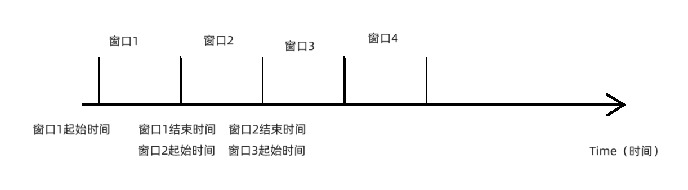


### 语法

~~~shell
#滚动窗口定义语法
tumble(事件时间的列，窗口大小)

#举例
tumble(rt, interval '5' second)
rt：列名
interval '5' second：窗口大小
定义一个大小为5秒的滚动窗口。
~~~

### SQL-入门案例

#### 处理时间演示

~~~shell
#1.建表
CREATE TABLE source_table_tumble0 ( 
 user_id BIGINT, 
 price BIGINT,
 `timestamp` STRING,
 pt AS PROCTIME()
) WITH (
  'connector' = 'socket',
  'hostname' = 'node1',        
  'port' = '9999',
  'format' = 'csv'
);


#2.SQL逻辑
select 
    user_id,
    count(user_id) as pv,
    sum(price) as sum_price
from source_table_tumble0
group by
user_id,
    tumble(pt, interval '10' second);
~~~

截图：

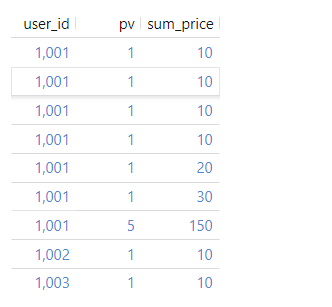

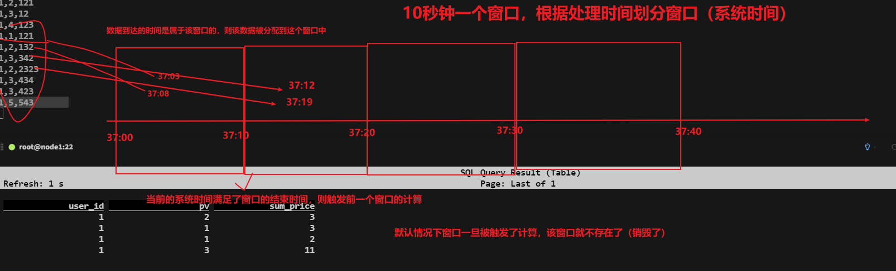

小结：处理时间是跟当前节点的服务器时间有关，与数据本身携带的时间没有任何关系，一旦窗口被划分完毕（当前系统时间划分窗口），那么所有窗口的大小都是相同的，窗口结束时间为下个窗口的开始时间，窗口与窗口之间不会重复数据也不会丢失数据，一旦数据这个窗口范围内的数据到达则会将该数据分配到当前窗口中，当系统时间满足了窗口结束时间以后，会触发该窗口的计算操作，默认情况下一旦窗口触发了计算，则窗口立刻被销毁，同时属于该窗口内的数据也将销毁。

#### 事件时间演示

~~~shell
#1.创建source表
CREATE TABLE source_table_tumble1 ( 
 user_id STRING, 
 price BIGINT,
 `timestamp` bigint,
 row_time AS TO_TIMESTAMP(FROM_UNIXTIME(`timestamp`)),
 watermark for row_time as row_time - interval '0' second
) WITH (
  'connector' = 'socket',
  'hostname' = 'node1',        
  'port' = '9999',
  'format' = 'csv'
);


#2.执行查询语句
select 
user_id,
count(user_id) as pv,
    sum(price) as sum_price,
UNIX_TIMESTAMP(CAST(tumble_start(row_time, interval '5' second) AS STRING)) * 1000  as window_start,
UNIX_TIMESTAMP(CAST(tumble_end(row_time, interval '5' second) AS STRING)) * 1000  as window_end
from source_table_tumble1
group by
    user_id,
    tumble(row_time, interval '5' second);
~~~

截图如下：

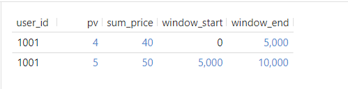

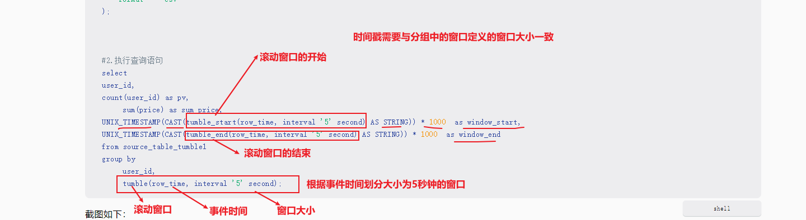

小结：事件时间的滚动窗口，是根据数据本身携带的时间作为触发窗口计算的条件，如果事件时间大于等于窗口结束时间则触发窗口计算，如果事件时间等于窗口结束时间，则数据归属到下一个窗口中。


### 窗口的划分

#### 窗口的起始时间

计算公式：第一条数据的事件时间 - （第一条数据的事件时间 % 窗口大小）

~~~shell
#1.第一条数据
前提：第一条数据的事件时间为1，窗口大小为5

#2.计算窗口的起始时间
第一条数据的事件时间 - （第一条数据的事件时间 % 窗口大小）
= 1 - (1 % 5)
= 1 - 1
= 0

~~~

#### 窗口的结束

计算公式：窗口的结束时间 - 1毫秒

窗口的结束时间 = 起始时间 + 窗口大小

~~~shell
#第一个窗口的结束
窗口的结束时间 - 1毫秒
= 0 + 5 - 1（毫秒）
= 5000 - 1
= 4999

#第二个窗口结束
= 5 + 5 - 1（毫秒）
= 10 -1（毫秒）
= 9999


~~~

#### 窗口的划分

~~~shell
#第一个窗口
[0,5)
[5,10)
[10,15)
...
~~~


### 窗口的触发计算

窗口的触发计算，在窗口的结束时。

什么时候结束，什么时候触发计算。

~~~shell
比如：[0,5)这个窗口
5秒 - 1（毫秒） = 5000毫秒 - 1毫秒 = 4999毫秒

[5,10）窗口，是在9999结束，因此当输入10秒时，窗口就会触发计算。
~~~

小结：窗口的起始时间：第一条数据的事件时间 - （第一条数据的事件时间 % 窗口大小）

​		   窗口的结束时间：窗口的结束时间 - 1毫秒（确定数据的归属）

​			窗口的计算：数据大于等于窗口结束时间触发计算（处理时间的窗口是根据系统时间满足了窗口结束时间触发的，事件时间的窗口是根据数据携带的时间满足了窗口结束时间触发的）

### SQL-扩展案例

~~~shell
#1建表和SQL语句和之前的的一样，我们只是更改数据的事件事件（把事件时间改为当前时间戳）。来看看窗口的划分和执行。
当前时间戳：1704684728
~~~

截图如下：

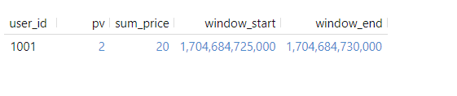

> Tips：
>
> 窗口的划分是由第一条数据的事件时间所决定的。

### SQL-TVF案例

~~~shell
#0.语法
from table(窗口类型(table 源表,descriptor(事件时间的列),窗口大小))
比如：
from table(tumble (table source_table_tumble2,descriptor(row_time),interval '5' second))


#1.创建表
CREATE TABLE source_table_tumble2 ( 
 user_id STRING, 
 price BIGINT,
 `timestamp` bigint,
 row_time AS TO_TIMESTAMP(FROM_UNIXTIME(`timestamp`)),
 watermark for row_time as row_time - interval '0' second
) WITH (
  'connector' = 'socket',
  'hostname' = 'node1',        
  'port' = '9999',
  'format' = 'csv'
);


#2.SQL语句
SELECT 
    user_id, 
    window_start, window_end,
    COUNT(*) AS pv, 
    SUM(price) AS sum_price 
FROM TABLE(
    TUMBLE(
        TABLE source_table_tumble2,
        DESCRIPTOR(row_time), 
        INTERVAL '5' SECOND
    )
) 
group by user_id, window_start, window_end;


#3.SQL说明
window_start, window_end,这两个是内置的关键字
~~~

截图如下：

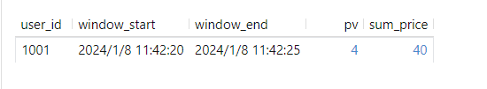

小结：使用内置的window_start、window_end,来直接获取到窗口的开始时间和结束时间，不需要跟之前写法一样需要定义表达式来计算窗口开始和结束时间了。


## 滑动窗口（hop）

### 定义

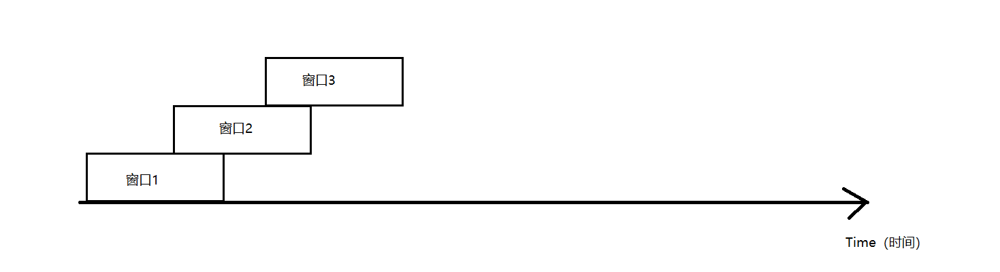

滑动窗口：

滑动距离 != 窗口大小

~~~shell
一旦滑动距离不等于窗口大小，则会有如下几种情况：
（1）滑动距离 < 窗口大小，咋们重点讨论的情况
（2）滑动距离 = 窗口大小，这就是滚动窗口，已经讨论过了
（3）滑动距离 > 窗口大小，这种情况会存在数据丢失，公司中不会允许，也不会用
~~~

这里主要讨论第一种情况。

### SQL-入门案例

~~~sql
--0.语法
hop(事件时间的列,窗口滑动距离,窗口大小)
比如：
hop(row_time, interval '2' SECOND, interval '5' SECOND)
含义：
每个两秒执行一次，窗口大小为5秒。


--1.创建表
CREATE TABLE source_table_hop1 ( 
 user_id STRING, 
 price BIGINT,
 `timestamp` bigint,
 row_time AS TO_TIMESTAMP(FROM_UNIXTIME(`timestamp`)),
 watermark for row_time as row_time - interval '0' second
) WITH (
  'connector' = 'socket',
  'hostname' = 'node1',        
  'port' = '9999',
  'format' = 'csv'
);


--2.查询的SQL
SELECT user_id,
UNIX_TIMESTAMP(CAST(hop_start(row_time, interval '2' SECOND, interval '5' SECOND) AS STRING)) * 1000 as window_start,
UNIX_TIMESTAMP(CAST(hop_end(row_time, interval '2' SECOND, interval '5' SECOND) AS STRING)) * 1000 as window_end, 
    sum(price) as sum_price
FROM source_table_hop1
GROUP BY user_id
    , hop(row_time, interval '2' SECOND, interval '5' SECOND);
~~~

演示如下：

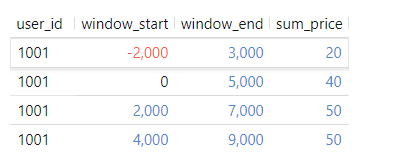

#### 窗口的划分

~~~shell
#1.窗口的起始时间
起始时间 = 第一条数据的事件时间 - （第一条数据的事件时间 % 窗口大小）
= 1 - （1 % 5）
= 1 - 1
= 0

#2.窗口的结束时间
（起始时间 + 窗口大小 -1 毫秒） 
= 0 + 5 - 1（毫秒）
= 4999

#3.窗口的划分
[-2，3)、[0,5)、[2,7)、[4,9)、[6,11)...
窗口的滑动距离 < 窗口大小，所以会造成数据的重复计算。
数据的重复计算 = 每一条数据都要落在每一个它能落入的窗口之内。
第一条数据的事件时间：1
[-6,-1）窗口和[-4,1)这2个窗口就没有了。其余的窗口会保留下来。
~~~

小结：滚动窗口（不论处理时间还是事件时间的窗口）的窗口划分是根据系统时间划分的，滑动窗口（事件时间的窗口）的窗口划分是根据数据携带的时间划分的


### SQL-扩展案例

~~~shell
#1建表和SQL语句和之前的的一样，我们只是更改数据的事件事件（把事件时间改为0）。来看看窗口的划分和执行。
把事件时间改为0。
~~~

截图如下：

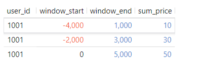


### SQL-TVF案例

~~~sql
--0.语法
from hop(窗口类别(table 表名称, descriptor(事件时间的列), 滑动距离, 窗口大小))
比如：
FROM TABLE(HOP(TABLE source_table_hop2, DESCRIPTOR(row_time), interval '2' SECOND, interval '6' SECOND))
说明：
这里的窗口大小必须是滑动距离的整数倍才可以。

--1.创建表
CREATE TABLE source_table_hop2 ( 
 user_id STRING, 
 price BIGINT,
 `timestamp` bigint,
 row_time AS TO_TIMESTAMP(FROM_UNIXTIME(`timestamp`)),
 watermark for row_time as row_time - interval '0' second
) WITH (
  'connector' = 'socket',
  'hostname' = 'node1',        
  'port' = '9999',
  'format' = 'csv'
);


--2.查询SQL
SELECT 
    user_id,
UNIX_TIMESTAMP(CAST(window_start AS STRING)) * 1000 as window_start,  
UNIX_TIMESTAMP(CAST(window_end AS STRING)) * 1000 as window_end, 
    sum(price) as sum_price
FROM TABLE(HOP(
        TABLE source_table_hop2
        , DESCRIPTOR(row_time)
        , interval '2' SECOND, interval '6' SECOND))
GROUP BY window_start, 
      window_end,
      user_id;
      
     
     
SELECT 
    user_id,
window_start,  
window_end, 
    sum(price) as sum_price
FROM TABLE(HOP(
        TABLE source_table_hop2
        , DESCRIPTOR(row_time)
        , interval '2' SECOND, interval '6' SECOND))
GROUP BY window_start, 
      window_end,
      user_id;
~~~

截图如下：

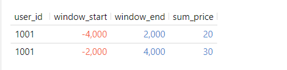

小结：通过使用内置的window_start、window_end函数简化sql语句的编写。


## 会话窗口（session）

### 定义

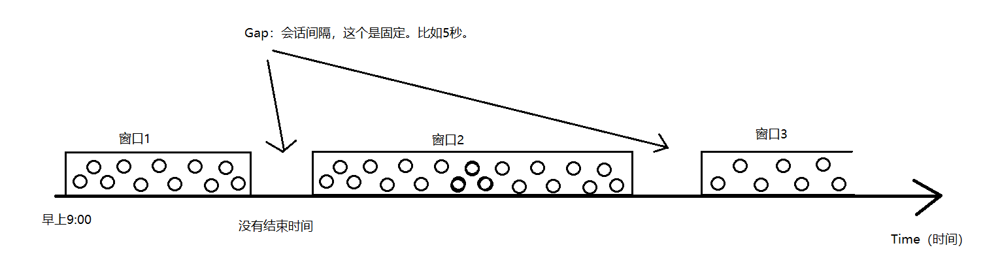

会话窗口：前后两条数据，只有到达的时间间隔没有超过窗口会话间隔，就会落在一个窗口内。这就是一个会话。

会话窗口，没有窗口的大小，换句话说，这个窗口可以无限大。

只有窗口会话间隔。这个间隔是人为指定的，是固定不变的。

### SQL案例

~~~sql
--0.语法
session(事件时间列，会话间隔)
比如：
session (rt,interval '5' second)


--1.创建表
CREATE TABLE source_table_session ( 
 user_id STRING, 
 price BIGINT,
 `timestamp` bigint,
 row_time AS TO_TIMESTAMP(FROM_UNIXTIME(`timestamp`)),
 watermark for row_time as row_time - interval '0' second
) WITH (
  'connector' = 'socket',
  'hostname' = 'node1',        
  'port' = '9999',
  'format' = 'csv'
);


---2.执行SQL
SELECT 
    user_id,
UNIX_TIMESTAMP(CAST(session_start(row_time, interval '5' SECOND) AS STRING)) * 1000 as window_start,
UNIX_TIMESTAMP(CAST(session_end(row_time, interval '5' SECOND) AS STRING)) * 1000 as window_end, 
    sum(price) as sum_price
FROM source_table_session
GROUP BY user_id
      , session(row_time, interval '5' SECOND);
~~~

截图如下：

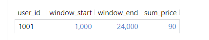

注意：flink1.15版本不支持会话窗口的TVF操作

小结：会话窗口的窗口大小是不固定的，是根据相邻的两条数据的时间间隔是否超过了定义的会话间隔，则会触发前一个窗口的计算。当不满足计算条件的时候，窗口可能会无限大，导致窗口内的数据量可能出现内存溢出的情况，导致flink作业计算不稳定。


## 聚合窗口（over）

Flink的over窗口分为两类：

* 时间聚合
* 行号聚合

### 根据时间聚合

~~~sql
--1.创建表
CREATE TABLE source_table_over_time (
    order_id BIGINT,
    product BIGINT,
    amount BIGINT,
    order_time as cast(CURRENT_TIMESTAMP as TIMESTAMP(3)),
    WATERMARK FOR order_time AS order_time - INTERVAL '0' SECOND
) WITH (
  'connector' = 'datagen',
  'rows-per-second' = '1',
  'fields.order_id.min' = '1',
  'fields.order_id.max' = '2',
  'fields.amount.min' = '1',
  'fields.amount.max' = '10',
  'fields.product.min' = '1',
  'fields.product.max' = '2'
);


--2.执行SQL
SELECT product, order_time, amount,
  SUM(amount) OVER (
    PARTITION BY product
    ORDER BY order_time
    -- 标识统计范围是一个 product 的最近1小时内的数据
    RANGE BETWEEN INTERVAL '5' second PRECEDING AND CURRENT ROW
  ) AS one_hour_prod_amount_sum
FROM source_table_over_time;


--3.和Hive中的over函数写法类似，只是在over里面多了时间的条件
range between 开始时间 and 结束时间
开始时间：一般是历史时间
结束时间：一般是当前
比如：
RANGE BETWEEN INTERVAL '1' HOUR PRECEDING AND CURRENT ROW
含义：统计最近一小时的数据。
~~~

截图如下：

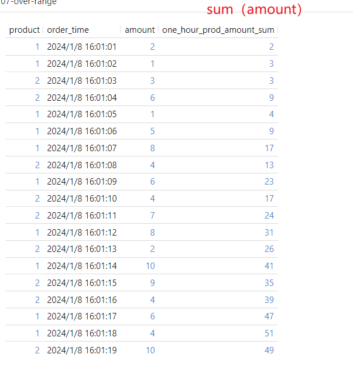

小结：不再使用Groupby进行分组，而是没到达一条数据，计算该条数据与历史一段时间内数据的累加，并输出累加结果。是根据时间进行聚合的。如：计算最近一小时的pv、uv，计算最近一小时的订单销售总金额。


### 根据行号聚合

~~~sql
--1.创建表
CREATE TABLE source_table_over_rows (
    order_id BIGINT,
    product BIGINT,
    amount BIGINT,
    order_time as cast(CURRENT_TIMESTAMP as TIMESTAMP(3)),
    WATERMARK FOR order_time AS order_time - INTERVAL '0' SECOND
) WITH (
  'connector' = 'datagen',
  'rows-per-second' = '1',
  'fields.order_id.min' = '1',
  'fields.order_id.max' = '2',
  'fields.amount.min' = '1',
  'fields.amount.max' = '2',
  'fields.product.min' = '1',
  'fields.product.max' = '2'
);


--2.执行SQL
SELECT product, order_time, amount,
  SUM(amount) OVER (
    PARTITION BY product
    ORDER BY order_time
    -- 标识统计范围是一个 product 的最近 100 行数据
    ROWS BETWEEN 100 PRECEDING AND CURRENT ROW
  ) AS one_hour_prod_amount_sum
FROM source_table_over_rows;


--2.根据行号聚合，和上面的根据时间聚合类似，也和Hive中的over函数类似。只是添加了行号的条件
语法：
rows between 开始行号 and  结束行号
比如：
ROWS BETWEEN 100 PRECEDING AND CURRENT ROW
含义：统计最近100条数据
~~~

截图如下：

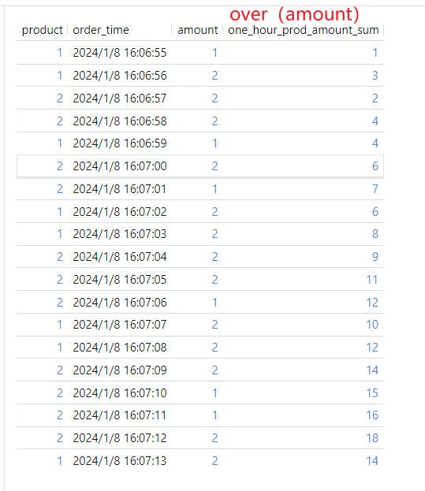

小结：根据行号聚合是相当于每几条数据聚合一次，比如两行数据聚合一次会统计过去的两行+当前行得到结果。


## Watermark机制

### 为什么要学水印机制

现实生活中，可能有如下情况：

车辆进了隧道，信号一般不好，如果这个时候发微信，上传车辆数据等一些操作，可能不会立刻执行完成。

要稍微等一会儿：

（1）要么车辆通过隧道，信号恢复正常。

（2）要么隧道很长，隧道内有信号接收器，可以正常联网

这种情况称之为数据延迟到达。

问题一：这种情况能不能避免？

不能。

问题二：这种情况的数据我要不要？

当然要。

问题三：怎么要？

生活中，这种数据延迟的时间，一般不长。

比如车辆经过隧道，很短时间内能够驶出。高铁火车也是如此。

生活中处理方案：等一会儿。

程序中处理方案：等一会儿。

Flink中把等会儿处理的机制，就称为Watermark机制。


小结：针对于延迟上报或者延迟到达数据进行处理，flink提供了watermark机制主要解决这类问题，在实时业务场景中数据延迟上报是非常常见的场景。所以watermark在工作和面试中使用非常频繁，重点！


### Watermark概述

Watermark，也称为水印，或者水位线，用来处理**一定时间**内乱序（延迟）的数据。

小结：watermark是一种延迟触发窗口计算的机制，本来数据携带的事件时间满足了窗口的结束时间，从而触发计算的，但是考虑到网络问题或者环境问题等，有可能先产生的数据后到达，后产生的数据先到达，导致提前触发了窗口的计算，引起后到达的数据丢失的可能。

但是：水印并不能彻底数据乱序问题导致的数据丢失问题，只能在一定程度上缓解乱序问题导致数据丢失。

### SQL - 演示Watermark为零的情况

Watermark为0，也就是没有延迟，和昨天的窗口中定义的一样。

```sql
--1.创建表
CREATE TABLE source_table_watermark1 ( 
 user_id STRING, 
 price BIGINT,
 `timestamp` bigint,
 row_time AS TO_TIMESTAMP(FROM_UNIXTIME(`timestamp`)),
 watermark for row_time as row_time - interval '0' second
) WITH (
  'connector' = 'socket',
  'hostname' = 'node1', 
  'port' = '9999',
  'format' = 'csv'
);


--2.SQL查询
select 
user_id,
count(*) as pv,
sum(price) as sum_price,
UNIX_TIMESTAMP(CAST(tumble_start(row_time, interval '5' second) AS STRING)) * 1000  as window_start,
UNIX_TIMESTAMP(CAST(tumble_end(row_time, interval '5' second) AS STRING)) * 1000  as window_end
from source_table_watermark1
group by
    user_id,
    tumble(row_time, interval '5' second);
```

截图如下：

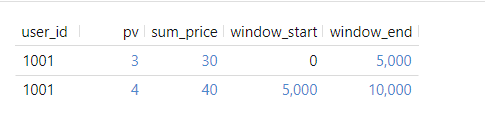

小结：当窗口触发了计算，默认情况下窗口会被同步销毁，一旦销毁了，属于这个窗口的数据将永远丢失，且触发过计算的窗口不会再被重新触发计算。


### SQL - 演示Watermark不为零的情况

```sql
--1.创建表
CREATE TABLE source_table_watermark2 ( 
 user_id STRING, 
 price BIGINT,
 `timestamp` bigint,
 row_time AS TO_TIMESTAMP(FROM_UNIXTIME(`timestamp`)),
 watermark for row_time as row_time - interval '2' second
) WITH (
  'connector' = 'socket',
  'hostname' = 'node1', 
  'port' = '9999',
  'format' = 'csv'
);


--2.说明
 watermark for row_time as row_time - interval '2' second
 interval '2' second的含义：数据允许两秒延迟到达
 

--3.查询SQL
select 
user_id,
count(*) as pv,
sum(price) as sum_price,
UNIX_TIMESTAMP(CAST(tumble_start(row_time, interval '5' second) AS STRING)) * 1000  as window_start,
UNIX_TIMESTAMP(CAST(tumble_end(row_time, interval '5' second) AS STRING)) * 1000  as window_end
from source_table_watermark2
group by
    user_id,
    tumble(row_time, interval '5' second);
```

截图如下：

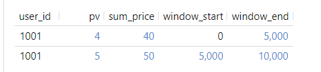

小结：在不设置水印等待时间的话，迟到的数据会被丢弃，为了在一定程度上缓解这个问题，可以设置等待2s，这样的话，数据的到达以后，事件时间不会改变，但是水印时间等于当前窗口最大的事件时间减去等待时间得到水印时间，如果这个水印时间大于等于窗口结束时间的话才会触发窗口计算，反之属于该窗口迟到的数据依然可以进入到属于它的窗口中，从而一定程度解决乱序问题。

### Watermark下的窗口触发计算机制

==如果窗口加上了Watermark，则窗口的触发计算由Watermark的时间来决定。==

计算公式如下：

**Watermark时间 = 事件时间 - 允许延迟的时间（乱序时间）**

#### 延迟时间为零

```shell
#1.比如下面的例子
# 设置Watermark的延迟为0

watermark for row_time as row_time - interval '0' second

Watermark时间 = 事件时间 - 0 
Watermark时间 = 事件时间

上午的演示案例中，Watermark的时间就等价于事件时间。因此上午是用事件时间计算的。
```

#### 延迟时间不为零

Watermark不为零，一般不会小于零，不为负数。

一般是正数。正数表示延迟的时间。比如2秒，也就说，允许2秒的延迟。

```shell
#1.下面的例子
# 设置Watermark的延迟不为0

watermark for row_time as row_time - interval '2' second

Watermark时间 = 事件时间 - 2

#拿刚刚的案例来演算
第一条数据的事件时间为1：
Watermark时间 = 1 - 2 = -1，没有达到窗口的结束时间（5），因此不触发窗口计算
Watermark时间 = 2 - 2 = 0，没有达到窗口的结束时间（5），因此不触发窗口计算
Watermark时间 = 3 - 2 = 1，没有达到窗口的结束时间（5），因此不触发窗口计算
Watermark时间 = 5 - 2 = 3，没有达到窗口的结束时间（5），因此不触发窗口计算
Watermark时间 = 6 - 2 = 4，没有达到窗口的结束时间（5），因此不触发窗口计算
Watermark时间 = 7 - 2 = 5，达到了窗口的结束时间（5），触发窗口计算

```

> 小结：
>
> （1）一旦设置了Watermark后，窗口的触发计算就由Watermark的时间来决定。
>
> （2）Watermark的时间会取事件时间的最大值。不会递减，只能往上递增。

### SQL - 演示Watermark数据丢失情况

这里的创建表的语句和执行的SQL语句和上面的一样。

设置数据的到达时间超过Watermark定义的延迟时间。会出现数据丢失的情况。

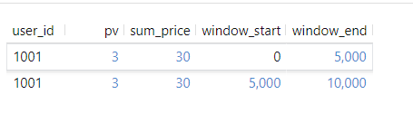

小结：设置了watermark等待时间，但是依然有数据在等待时间内没有到达，触发了窗口计算以后，再次到达的属于该窗口的数据，还是会被丢弃，所以flinksql中的watermark并不能彻底解决乱序数据的问题。datastreamapi编程可以将丢弃的数据通过侧输出的方式收集起来，存储到某个位置上（业务需要）。

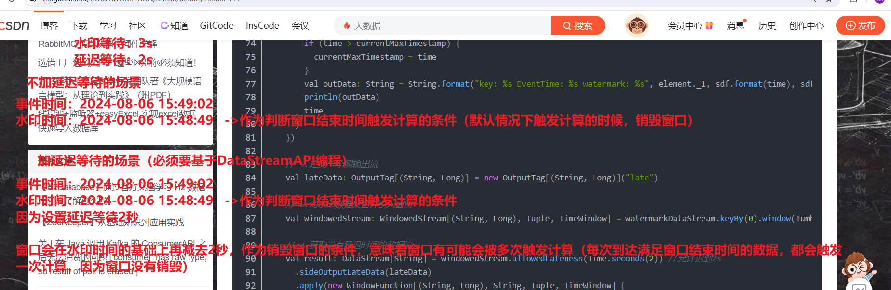

https://blog.csdn.net/CODEROOKIE_RUN/article/details/106062414

## Checkpoint机制

### Checkpoint机制的执行流程

Checkpoint，是Flink用来容错的一种机制。

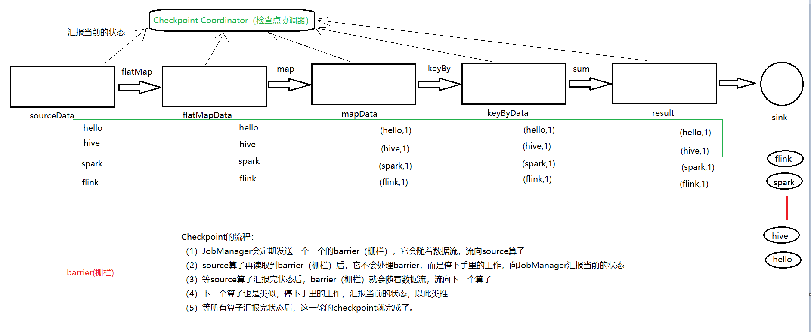

步骤如下：

~~~shell
Checkpoint的流程：
（1）JobManager会定期发送一个一个的barrier（栅栏），它会随着数据流，流向source算子
（2）source算子再读取到barrier（栅栏）后，它不会处理barrier，而是停下手里的工作，向JobManager汇报当前的状态
（3）等source算子汇报完状态后，barrier（栅栏）就会随着数据流，流向下一个算子
（4）下一个算子也是类似，停下手里的工作，汇报当前的状态，以此类推
（5）等所有算子汇报完状态后，这一轮的checkpoint就完成了。
~~~

小结：checkpoint说白了就是将本地的计算结果（内存），定期的持久化到文件系统的过程，这个周期是可以人为设置的，如果设置时间太长会带来两个问题，第一：下游迟迟无法读取到数据，其次当作业遇到问题需要恢复的时候，恢复时间过程（本周期内的数据需要被重新计算），如果设置太短，会影响到flink处理数据性能，因为会频繁进行checkpoint，而在持久化的过程中，线程是阻塞的，因此官方建议设置1-5分钟比较合理。


### Flink怎么实现容错

### 重启策略Restart Strategy

重启策略，能够让Flink程序在挂了之后进行自动重启。

官网链接如下：

https://nightlies.apache.org/flink/flink-docs-release-1.15/docs/ops/state/task_failure_recovery/

Flink有如下的几种重启策略。

* 不重启策略（none）
* 固定延迟重启策略（fixed-delay）
* 失败率重启策略（failure-rate）
* 指数延迟重启策略（exponential-delay）

官网文档如下：

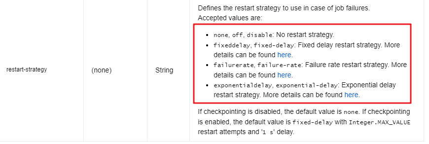

#### 不重启策略

Flink程序不重启，如果遇到异常就挂了。

代码中配置：

~~~java
env.set_restart_strategy(RestartStrategies.no_restart())
~~~

配置文件中的配置：

~~~shell
restart-strategy: none
~~~

#### 固定延迟重启策略

允许Flink程序固定可以重启几次。每次重启的时间间隔是多少。这些参数是自己指定的。

代码中配置：

~~~java
env = StreamExecutionEnvironment.get_execution_environment()
env.set_restart_strategy(RestartStrategies.fixed_delay_restart(
    3,  #重启的次数
    10000  #延迟时间，这里配置的是10000毫秒
))
~~~

配置文件中的配置：

~~~shell
restart-strategy: fixed-delay   #配置固定延迟重启
restart-strategy.fixed-delay.attempts: 3    #重启的次数
restart-strategy.fixed-delay.delay: 10 s    #重启的间隔时间
~~~

#### 失败率重启策略

在一定的时间范围内，允许失败的次数。

代码中配置：

~~~java
env.set_restart_strategy(RestartStrategies.failure_rate_restart(
    3,  #间隔时间内重启的次数
    300000,  #时间间隔
    10000  #延迟时间，这里配置的是10000毫秒
))
~~~

配置文件中配置：

~~~shell
restart-strategy: failure-rate  #配置失败率重启
restart-strategy.failure-rate.max-failures-per-interval: 3   #最大重启的次数
restart-strategy.failure-rate.failure-rate-interval: 5 min   #失败率的时间间隔
restart-strategy.failure-rate.delay: 10 s					 #每次重启的时间间隔
~~~

#### 指数延迟重启策略

Flink程序的重启时间随着指数的增加而呈指数级别递增。

代码中配置：

~~~java
Python暂不支持。
~~~

配置文件中配置：

~~~shell
restart-strategy: exponential-delay			#配置指数延迟重启
restart-strategy.exponential-delay.initial-backoff: 10 s     #重启的初始值
restart-strategy.exponential-delay.max-backoff: 2 min		  #最大从重启时间间隔
restart-strategy.exponential-delay.backoff-multiplier: 2.0    #指数
restart-strategy.exponential-delay.reset-backoff-threshold: 10 min    #重置重启时间
restart-strategy.exponential-delay.jitter-factor: 0.1		  #重启因子，抖动因子
~~~

小结：Flink支持四种重启策略，分别是不重启、固定延迟重启、失败率重启、指数延迟重启，同时flink支持通过代码设置和配置文件设置的方式设置重启策略，需要注意指数延迟重启策略不支持python代码设置，阿里云flink不支持指数延迟重启策略。


### 状态后端State Backend

用来保存Flink中Checkpoint的状态的。

#### 内存状态后端MemoryStateBackend

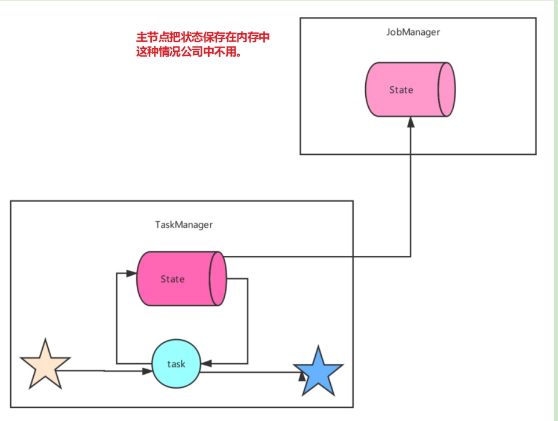

代码中配置：

~~~java
env.set_state_backend(HashMapStateBackend())
env.get_checkpoint_config().set_checkpoint_storage(JobManagerCheckpointStorage())
~~~

配置文件中配置：

~~~shell
state.backend: hashmap
state.checkpoint-storage: jobmanager
~~~

#### 文件系统状态后端FsStateBackend

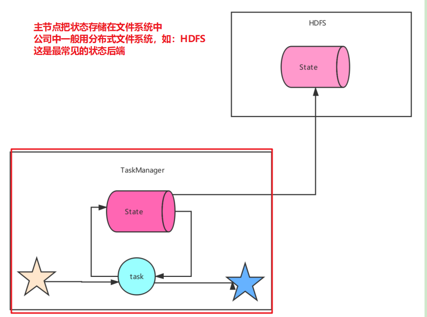

代码中配置：

~~~java
env.set_state_backend(HashMapStateBackend())
env.get_checkpoint_config().set_checkpoint_storage_dir("file:///checkpoint-dir")
~~~

配置文件中的配置：

~~~shell
state.backend: hashmap
state.checkpoints.dir: file:///checkpoint-dir/
state.checkpoint-storage: filesystem
~~~

#### RocksDB数据库状态后端RocksDBStateBackend

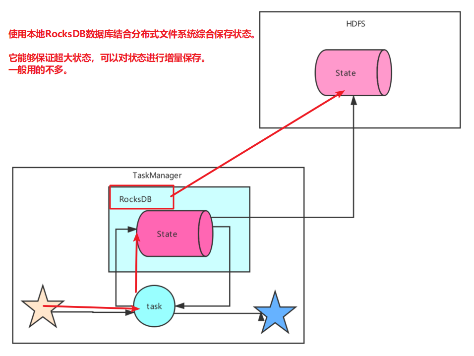

如果需要使用RocksDB数据库的话，必须引入pom依赖。

~~~properties
<dependency>
    <groupId>org.apache.flink</groupId>
    <artifactId>flink-statebackend-rocksdb</artifactId>
    <version>1.15.4</version>
    <scope>provided</scope>
</dependency>
~~~

代码中配置：

~~~java
env.set_state_backend(EmbeddedRocksDBStateBackend())
env.get_checkpoint_config().set_checkpoint_storage_dir("file:///checkpoint-dir")
~~~

配置文件中的配置：

~~~shell
state.backend: rocksdb
state.checkpoints.dir: file:///checkpoint-dir/

state.checkpoint-storage: filesystem
~~~

小结：flink的状态后端支持三种：MemoryStateBackend、FsStateBackend、RocksDBStateBackend，一般情况下开发测试的时候可以使用MemoryStateBackend，保存到内存中，这种方式对内存读写效率比较高，但是缺点是会丢失数据，因此生产上建议将设置为FsStateBackend、RocksDBStateBackend，这两个状态后端都是第三方的分布式文件存储系统，因此都需要第三方的jar才可以使用，FsStateBackend只能做全量检查点存储，而RocksDBStateBackend可以做增量检查点存储，因此RocksDBStateBackend效率略高，但是flink未来版本的规划中正在研发针对于flink适用的状态存储后端。


### 案例

Checkpoint的配置一般都是固定不变的，可以配置在flink-conf.yaml文件中，这样配置完后，对所有任务都生效，入下：

```
# 创建hdfs目录
hdfs dfs -mkdir /checkpoints
```


flink-conf.yaml文件配置：

~~~shell
execution.checkpointing.interval: 5000
#设置有且仅有一次模式 目前支持 EXACTLY_ONCE、AT_LEAST_ONCE        
execution.checkpointing.mode: EXACTLY_ONCE
state.backend: hashmap
#设置checkpoint的存储方式
state.checkpoint-storage: filesystem
#设置checkpoint的存储位置
state.checkpoints.dir: hdfs://node1:8020/checkpoints
#设置savepoint的存储位置
state.savepoints.dir: hdfs://node1:8020/checkpoints
#设置checkpoint的超时时间 即一次checkpoint必须在该时间内完成 不然就丢弃
execution.checkpointing.timeout: 600000
#设置两次checkpoint之间的最小时间间隔
execution.checkpointing.min-pause: 500
#设置并发checkpoint的数目
execution.checkpointing.max-concurrent-checkpoints: 1
#开启checkpoints的外部持久化这里设置了清除job时保留checkpoint，默认值时保留一个 假如要保留3个
state.checkpoints.num-retained: 3
#默认情况下，checkpoint不是持久化的，只用于从故障中恢复作业。当程序被取消时，它们会被删除。但是你可以配置checkpoint被周期性持久化到外部，类似于savepoints。这些外部的checkpoints将它们的元数据输出到外#部持久化存储并且当作业失败时不会自动
#清除。这样，如果你的工作失败了，你就会有一个checkpoint来恢复。
#ExternalizedCheckpointCleanup模式配置当你取消作业时外部checkpoint会产生什么行为:
#RETAIN_ON_CANCELLATION: 当作业被取消时，保留外部的checkpoint。注意，在此情况下，您必须手动清理checkpoint状态。
#DELETE_ON_CANCELLATION: 当作业被取消时，删除外部化的checkpoint。只有当作业失败时，检查点状态才可用。
execution.checkpointing.externalized-checkpoint-retention: RETAIN_ON_CANCELLATION

#第一种：没有重启策略
#restart-strategy: none

#第二种：固定延迟重启策略
# 设置重启策略
restart-strategy: fixed-delay
# 尝试重启次数
restart-strategy.fixed-delay.attempts: 3
# 两次连续重启的间隔时间
restart-strategy.fixed-delay.delay: 1 s

#第三种：失败率重启策略
#restart-strategy: failure-rate
# 两次连续重启的间隔时间
#restart-strategy.failure-rate.delay: 1 s
# # 计算失败率的统计时间跨度
#restart-strategy.failure-rate.failure-rate-interval: 60 s
# # 计算失败率的统计时间内的最大失败次数
#restart-strategy.failure-rate.max-failures-per-interval: 3

#第四种，指数重启策略，由于阿里云创建集群中不支持，因此就没有配置了。
~~~

小结：介绍checkpoint可以设置的配置项有哪些，以及每个配置项的作用。


Python代码：

~~~python
#1.构建流式执行环境
from pyflink.common import Types
from pyflink.datastream import StreamExecutionEnvironment, RuntimeExecutionMode, DataStream
from pyflink.table import DataTypes

env = StreamExecutionEnvironment.get_execution_environment()
env.set_parallelism(1)
# env.set_runtime_mode(RuntimeExecutionMode.STREAMING)
#2.数据source
input_ds = DataStream(env._j_stream_execution_environment.socketTextStream("node1",9999))
#3.数据处理
def map_word(word):
    if word == "laowang":
        raise ValueError("老王来了，程序挂了...")
    else:
        return (word,1)

result_ds = input_ds.flat_map(lambda x:x.split(" "))\
    .map(lambda word:map_word(word),output_type=Types.TUPLE([Types.STRING(),Types.INT()])).\
    key_by(lambda x:x[0])\
    .reduce(lambda x,y:(x[0],x[1] + y[1]))
#4.数据Sink
result_ds.print()
#5.启动流式任务
env.execute()

~~~

测试步骤：

```
# 递交作业
bin/flink run -py scripts/checkpoint_demo.py

# 创建savepoint保存点
bin/flink savepoint 作业id

# 使用savepoint恢复作业
bin/flink run -py scripts/checkpoint_demo.py -s hdfs:///checkpoints/savepoint-585683-2b3431c8278d


# 使用java代码进行
#递交作业
bin/flink run --class cn.itcast.day06.checkpoint.CheckpointConfigDemo scripts/flinkbase-1.0-SNAPSHOT.jar

#生产数据（netcat node1 8888） nc -lk 8888
hadoop
hadoop
spark

#查看当前运行的作业的列表
[root@node1 flink]# bin/flink list
Waiting for response...
------------------ Running/Restarting Jobs -------------------
06.08.2024 19:43:58 : cc1c2f643e22793e00c8ddcb5334a28d : Flink Streaming Job (RUNNING)
--------------------------------------------------------------
No scheduled jobs.

#取消正在运行的指定的作业
[root@node1 flink]# bin/flink cancel -s cc1c2f643e22793e00c8ddcb5334a28d
DEPRECATION WARNING: Cancelling a job with savepoint is deprecated. Use "stop" instead.
Cancelling job cc1c2f643e22793e00c8ddcb5334a28d with CANONICAL savepoint to default savepoint directory.
Cancelled job cc1c2f643e22793e00c8ddcb5334a28d. Savepoint stored in hdfs://node1:8020/checkpoints/savepoint-cc1c2f-6b99ae180c81.

#重新递交作业
bin/flink run --fromSavepoint hdfs://node1:8020/checkpoints/savepoint-cc1c2f-6b99ae180c81 --class cn.itcast.day06.checkpoint.CheckpointConfigDemo scripts/flinkbase-1.0-SNAPSHOT.jar

#继续生产数据
hadoop
spark

#验证结果
控制台查看hadoop输出是否是3次，spark是否是2次
```

小结：Flink程序通过Checkpoint机制、重启策略、状态后端来实现程序和数据的容错。

