# Flink基础

## 今日内容介绍

* FlinkSQL语法（熟悉）
* FlinkSQL能力进阶（熟悉）
* Flink架构（掌握）


## FlinkSQL语法

对应的官网链接：https://nightlies.apache.org/flink/flink-docs-release-1.15/docs/dev/table/sql/overview/

### 建库建表

#### 建库语法

在 Apache Flink 中，创建数据库（schema）的语法与标准 SQL 类似。Flink SQL 支持创建数据库的 DDL 语句。下面是创建数据库的基本语法结构：

```sql
CREATE [TEMPORARY] [IF NOT EXISTS] DATABASE database_name
[COMMENT 'database_comment']
[LOCATION 'location_path']
[WITH (
  'property1' = 'value1',
  'property2' = 'value2',
  ...
  'propertyN' = 'valueN'
)];
```

这里有几个关键部分：

- `TEMPORARY` : 如果使用 TEMPORARY 关键字，创建的是临时数据库，仅在当前会话中可见。
- ```IF NOT EXISTS```:如果使用 IF NOT EXISTS 关键字，则只有当数据库不存在时才会创建。
- ```database_name```:数据库的名称。
- ```COMMENT```:添加关于数据库的注释。
- ```LOCATION``:指定数据库的物理存储位置。
- ```WITH 子句```:定义额外的属性，这些属性取决于使用的存储系统。

以下是一些综合示例：

示例 1：假设我们要创建一个名为 ```description_database``` 的数据库，并为其添加注释。

```sql
CREATE DATABASE description_database 
COMMENT 'This is a sample database for Flink SQL';
```

示例 2：创建具有特定配置的数据库，例如存储位置

```sql
CREATE DATABASE location_database WITH (
    'location' = 'hdfs://node1:8020/user/flink/databases/location_database'
);
```

示例 3：创建具有多个属性配置的数据库

```sql
CREATE DATABASE multiple_properties_database WITH (
    'description' = 'This is a complex database',
    'location' = 'hdfs://node1:8020/user/flink/databases/multiple_properties_database',
    'parallelism' = '16'	-- 定义表的算子在执行时可以并行启动的实例数量。
);
```

**小结**：

Flink sql中创建数据库使用`create database`语句，语法结构是`create database databasename [with('property_name'='property_value', ...)]`。

示例包括简单的创建数据库，比如`create database test`,创建带有描述信息的数据库和创建具有特定配置（如存储位置）的数据库，以及创建具有多个属性配置的数据，可以根据实际的需求选择和修改相应的配置。


#### 建表语法

FlinkSQL建表和MySQL、Hive中语法结构类似。

```sql
CREATE [TEMPORARY] TABLE [IF NOT EXISTS] [catalog_name.][db_name.]table_name
    -- 常规列
    column1 data_type1 [NOT NULL] [DEFAULT default_value1],
    column2 data_type2 [NOT NULL] [DEFAULT default_value2],
    -- 常规列说明：
    -- column1、column2 是列名。
    -- data_type1、data_type2 是数据类型，如 INT、STRING、DOUBLE 等。
    -- [NOT NULL] 表示该列不允许为空值。
    -- [DEFAULT default_value1] 为该列设置默认值。

    -- 元数据列
    `timestamp` TIMESTAMP(3) METADATA FROM 'Timestamp' AS time_column,
    -- 元数据列说明：
    -- `timestamp` 是时间列的名称。
    -- METADATA FROM 'Timestamp' 表示从输入数据的 'Timestamp' 属性获取时间。
    -- AS processing_time_column 为该列指定别名（可选）。

    -- 计算列
    computed_column data_type3 AS expression3,
    -- 计算列说明：
    -- computed_column 是计算列的名称。
    -- data_type3 是计算结果的数据类型。
    -- expression3 是基于其他列的计算表达式。

    -- 定义主键
    PRIMARY KEY (column_name1, column_name2,...) NOT ENFORCED
    -- 主键说明：
    -- PRIMARY KEY 定义主键。
    -- (column_name1, column_name2,...) 列出构成主键的列名。
    -- NOT ENFORCED 表示主键约束不被强制实施。

    WATERMARK FOR `rowtime` AS watermark_expression
    -- 水印说明：
    -- WATERMARK FOR `rowtime` 为事件时间列 `rowtime` 设置水印。
    -- watermark_expression 定义水印策略，例如 `rowtime - INTERVAL '5' SECOND` 表示水印滞后事件时间 5 秒。

	 -- 更多列定义
) 
[COMMENT table_comment]
[ PARTITIONED BY (partition_column1, partition_column2,...) ]
-- 分区说明：
-- PARTITIONED BY 定义表的分区方式。
-- (partition_column1, partition_column2,...) 列出用于分区的列名。
WITH (
    -- 指定数据源或数据接收器的类型，例如 'connector' = 'kafka' 、 'connector' = 'jdbc' 等。
    'connector' = 'connector_type',
    -- 针对不同的连接器，有相应的特定属性，例如对于 Kafka 连接器，可能有 'topic'、'properties.bootstrap.servers' 等属性。
    'connector.property1' = 'property_value1',
    'connector.property2' = 'property_value2',
    -- 指定数据的格式，如 'format' = 'csv' 、 'format' = 'json' 等。
    'format' = 'format_type',
    'format.property3' = 'property_value3',
    'format.property4' = 'property_value4',
    -- 更多格式相关的属性配置
    'sink.rolling-policy.rollover-interval' = 'interval_value',
    'sink.rolling-policy.check-interval' = 'check_interval_value',
    -- 更多滚动策略相关的属性配置
    'options.property5' = 'property_value5',
    -- 其他通用的选项配置
);
```

> 解释：
>
> [可选内容]：可以带上，也可以没有

以下是一些综合示例：

示例 1：包含多种列类型的表

```sql
CREATE TABLE complex_table (
    id INT PRIMARY KEY,
    name STRING,
    `rowtime` TIMESTAMP(3) METADATA FROM 'event_time',
    age INT DEFAULT 18,
    hobbies ARRAY<STRING>,
    grades MAP<STRING, DOUBLE>,
    address STRUCT<street STRING, city STRING>
) WITH (
    'connector' = 'kafka',
    'topic' = 'test',
    'properties.bootstrap.servers' = 'node1.itcast.cn:9092',
    'format' = 'json'
);
```

示例 2：具有计算列和处理时间列的表

```sql
CREATE TABLE transaction_table (
    transaction_id INT,
    amount DOUBLE,
    `proctime` TIMESTAMP(3) METADATA FROM 'processing_time' AS current_time,
    total_amount DOUBLE AS amount * 1.1
) WITH (
    'connector' = 'jdbc',
    'url' = 'jdbc:mysql://localhost:3306/transactions',
    'table-name' = 'transaction_data',
    'driver' = 'com.mysql.jdbc.Driver',
    'username' = 'root',
    'password' = 'password'
);
```

**使用示例:**

需求：读取kafka的数据源，并输出到控制台

模拟数据：

```sh
# 启动生产者命令行
bin/kafka-console-producer.sh --broker-list node1.itcast.cn:9092 --topic test
# 输入数据
user_001,2,10.1
user_001,3,20.0
```

编写sql脚本：

```sql
-- 建表
CREATE TABLE kafka_table (
   userId STRING,
	amount DOUBLE,					 -- 商品商量
   price DOUBLE,					-- 商品价格
	total_price AS (amount * price), -- 订单总金额
	`rowtime` TIMESTAMP(3) METADATA FROM 'timestamp', 
	watermark for `rowtime` as `rowtime` - interval '0' second
) WITH (
   'connector' = 'kafka',
   'topic' = 'test',
   'properties.bootstrap.servers' = 'node1.itcast.cn:9092',
	'properties.group.id' = 'testGroup',
	'scan.startup.mode' = 'earliest-offset',
   'format' = 'csv'
);

-- 查询数据
select * from kafka_table;
```

**小结**：

flink建表语句的结构说明：

- `TEMPOPRAT`：该关键字表示这个表是否是临时表，仅在当前会话中可见。

- `IF NOT EXISTS`：表示表不存在的话才创建

- `catalogName`和`databasename`:指定表所在的目录和数据库名

- `tablename`：表的名称

- `columon`：

  - 常规列
  - 元数据列
  - 计算列

- `watermark`：定义水印表达式，用于事件时间处理

- `PRIMARY KEY`：定义主键列

- `WITH子句`：定义连接器和相关属性

  

#### 建表时的优化建议

- 合理选择数据类型
  - 选择最适合数据特征的数据类型，避免过度使用大的数据类型，以节省存储空间和提高处理效率。例如，如果整数的值范围较小，可以使用 `TINYINT` 或 `SMALLINT` 而不是 `INT` 。
- 定义主键和索引
  - 明确主键可以提高数据的唯一性和查询效率。如果可能，根据查询模式创建适当的索引，但要注意过多的索引可能会影响写入性能。
- 考虑分区策略
  - 如果数据具有明显的分区特征（例如按时间、地域等），可以在建表时进行分区定义，这有助于提高查询和数据处理的并行度。
- 优化元数据列
  - 对于事件时间列（ `rowtime` ），确保从数据源中准确提取时间戳，并根据数据的特点设置合理的水印策略，以避免数据延迟导致的计算错误。
- 连接器和格式配置
  - 根据数据源和数据目的地的特点，优化连接器和格式的相关配置参数。例如，调整 Kafka 连接器的批量大小、缓冲时间等。
- 评估表属性
  - 仔细设置表的属性，如并行度、缓存大小等，以适应集群的资源和数据处理需求。
- 预计算和缓存
  - 如果某些计算结果经常被使用，可以考虑在表定义中通过计算列或预计算的方式进行优化，减少运行时的计算量。
- 测试和监控
  - 在实际使用前，对建表语句进行测试，并在运行过程中监控表的性能指标，根据实际情况进行调整和优化。

### with语法

在 Flink SQL 中，`WITH` 子句（也称为公用表表达式或 CTE）用于定义一个临时的结果集，该结果集可以在后续的查询中被引用，从而使复杂的查询更具可读性和可维护性。和MySQL、Hive的with子句类似。

**特点：**

- 可以将复杂的查询逻辑分解为多个较小的、可管理的部分
- 每个 CTE（公用表表达式）都是一个独立的查询块，具有自己的名称和定义。
- CTE 仅在其所在的查询中可见和可用。

**语法：**

```sql
WITH cte_name1 AS (
    subquery1
),
cte_name2 AS (
    subquery2
)
-- 后续的主查询，引用 CTE
SELECT columns FROM cte_name1, cte_name2 WHERE conditions;
```

#### 使用场景和示例

示例 1：数据预处理和筛选

```sql
WITH preprocessed_data AS (
    SELECT column1, column2 
    FROM source_table 
    WHERE some_condition
)
SELECT * FROM preprocessed_data WHERE column3 > 10;
```

示例 2：分步计算和聚合

```sql
WITH monthly_sales AS (
   SELECT MONTH(sale_date) AS month, SUM(sales_amount) AS total_sales
   FROM sales_table
   GROUP BY MONTH(sale_date)
),
average_monthly_sales AS (
   SELECT AVG(total_sales) AS avg_sales
   FROM monthly_sales
)
SELECT * FROM average_monthly_sales;
```

示例 3：复杂的关联和条件判断

```sql
WITH customers_in_region AS (
   SELECT * FROM customers WHERE region = 'North'
),
orders_in_region AS (
   SELECT * FROM orders WHERE customer_id IN (SELECT customer_id FROM customers_in_region)
)
SELECT c.name, o.order_amount
FROM customers_in_region c
JOIN orders_in_region o ON c.customer_id = o.customer_id;
```

通过合理使用 `WITH` 子句，可以将复杂的查询分解为逻辑上独立的部分，使查询更易于理解和调试。

#### 练习

**需求：计算每个部门的平均工资**

```sql
-- 建表
CREATE TABLE employees (
    employee_id INT,
    department_id INT,
    salary DECIMAL(10, 2)
) WITH (
  'connector' = 'socket',
  'hostname' = 'node1',        
  'port' = '8888',
  'format' = 'csv'
);

-- 使用 WITH 子句计算每个部门的平均工资
WITH department_salaries AS (
    SELECT department_id, AVG(salary) AS average_salary
    FROM employees
    GROUP BY department_id
)
SELECT * FROM department_salaries;

-- 准备数据（nc -lk 8888）
1,1,5000.00
2,1,6000.00
3,2,7000.00
4,2,8000.00
5,2,9000.00
```

**小结：**

flink中的with子句用于定义临时的结果集，具有一下特点：

- 能够分解复杂查询逻辑，使其更加具有结构化和可读性
- 每个CTE是独立的查询块。有自己的名称和定义，且尽在所在查询中可用
- 语法为：`with cte_name as (subquery),cte_name as (subquery)...select columns from cte_name where condtions`；

使用场景：包括数据的预处理和筛选，分布计算和聚合，复杂的关联和条件判断。尤其适合复杂业务逻辑和数据处理的需求场景。

### Join

在 Flink 中，join分为如下几种类型：

- **Regular Join（常规连接）**：这是最常见的连接类型，和MySQL、Hive中一样。
- **Interval Join（区间连接）**：时间区间join。在常规的join基础上，再次加入时间关联的条件。
- **Lookup Join（查找连接）**：通常用于将一个流与一个静态的或缓慢变化的维表进行连接。在这种连接中，流中的元素会根据指定的键在维表中查找匹配的值，并将其关联到流元素上，用于`维表join`。

每种 Join 类型都适用于不同的场景，根据数据特点和业务需求来选择合适的 Join 方式可以提高数据处理的效率和准确性。

#### regular join（常规join）

和`MySQL、Hive中类似`，包含如下连接方式：

- 内连接（INNER JOIN）：仅返回在两个数据集的连接键上有匹配的行。
- 左外连接（LEFT JOIN）：返回左数据集的所有行，以及在右数据集中与左数据集连接键匹配的行。如果在右数据集中没有匹配，则相应的右数据集列值为 `NULL`。
- 右外连接（RIGHT JOIN）：与左外连接相反，返回右数据集的所有行，以及在左数据集中与右数据集连接键匹配的行。
- 全外连接（FULL JOIN）：返回左数据集和右数据集的所有行，如果在另一个数据集中没有匹配，则相应的列值为 `NULL`。

##### inner join

以下是一个使用 Flink SQL 进行内连接的示例：

假设我们有两个表 `show_log_table_regular` 和 `click_log_table_regular` ，都有一个共同的列 `log_id` 。

~~~sql
--创建表
CREATE TABLE show_log_table_regular (
    log_id BIGINT,
    show_params STRING
) WITH (
  'connector' = 'socket',
  'hostname' = 'node1',        
  'port' = '8888',
  'format' = 'csv'
);


--创建表
CREATE TABLE click_log_table_regular (
  log_id BIGINT,
  click_params     STRING
) WITH (
  'connector' = 'socket',
  'hostname' = 'node1',        
  'port' = '9999',
  'format' = 'csv'
);

-- 准备数据（nc -lk 8888）
1,8888_a
2,8888_d
3,8888_e

-- 准备数据（nc -lk 9999）
1,9999_b
2,9999_c
4,9999_f


--SQL查询
SELECT
    show_log_table_regular.log_id as s_id,
    show_log_table_regular.show_params as s_params,
    click_log_table_regular.log_id as c_id,
    click_log_table_regular.click_params as c_params
FROM show_log_table_regular
INNER JOIN click_log_table_regular ON show_log_table_regular.log_id = click_log_table_regular.log_id;
~~~

**小结：**

在flink中，inner join（内连接）是一种常规链接，与hive、mysql操作类似

特点：

- 指定连接键上的字段需要精确匹配

- 结果集仅包含在两个数据集中完全匹配的行，不含任何一侧无法匹配到的行

- 语法结构:`select * from datatableL inner join dataTableR on l.id=b.id`;

- 应用场景：获取两个数据流间精确匹配的场景，如：订单流与商品流关联、订单流与用户流匹配等。

  

##### left join/right join

在 Flink 中，`LEFT JOIN`（左连接）是一种连接操作，用于将左表中的所有行与右表中满足连接条件的行进行匹配，并返回左表中的全部行以及与右表匹配的行。如果右表中没有与左表行匹配的记录，则对应的右表列值将为 `NULL` 。

**LEFT JOIN（左连接）**：

- 以左表为主：左表的所有行都会出现在结果集中。
- 匹配右表：对于左表中的每一行，在右表中寻找匹配的行。
- 处理未匹配：如果在右表中没有找到匹配的行，对应的右表列值将为 `NULL` 。

**语法示例**：

```sql
SELECT *
FROM left_table
LEFT JOIN right_table ON left_table.column = right_table.column;
```

例如，左表 `left_table` 有行 `(1, 'A')` ，右表 `right_table` 中没有匹配的行，结果集将包含 `(1, 'A', NULL, NULL)` 。

**应用场景**：当需要确保左表的数据完整性，即使右表没有对应匹配的数据也要返回左表的全部行时，使用左连接。


**RIGHT JOIN（右连接）**：

- 以右表为主：右表的所有行都会出现在结果集中。
- 匹配左表：对于右表中的每一行，在左表中寻找匹配的行。
- 处理未匹配：如果在左表中没有找到匹配的行，对应的左表列值将为 `NULL` 。

**语法示例**：

```sql
SELECT *
FROM left_table
RIGHT JOIN right_table ON left_table.column = right_table.column;
```

例如，右表 `right_table` 有行 `(1, 'B')` ，左表 `left_table` 中没有匹配的行，结果集将包含 `(NULL, NULL, 1, 'B')` 。

**应用场景**：当需要确保右表的数据完整性，即使左表没有对应匹配的数据也要返回右表的全部行时，使用右连接。

以下是一个使用 Flink SQL 进行左连接的示例：

假设我们有两个表 `show_log_table_regular` 和 `click_log_table_regular` ，都有一个共同的列 `log_id` 。

~~~sql
--创建表
CREATE TABLE show_log_table_regular (
    log_id BIGINT,
    show_params STRING
) WITH (
  'connector' = 'socket',
  'hostname' = 'node1',        
  'port' = '8888',
  'format' = 'csv'
);

--创建表
CREATE TABLE click_log_table_regular (
  log_id BIGINT,
  click_params     STRING
) WITH (
  'connector' = 'socket',
  'hostname' = 'node1',        
  'port' = '9999',
  'format' = 'csv'
);

-- 准备数据（nc -lk 8888）
1,8888_1
3,8888_3 

-- 准备数据（nc -lk 9999）
2,9999_2
3,9999_3 

--数据查询
SELECT
    show_log_table_regular.log_id as s_id,
    show_log_table_regular.show_params as s_params,
    click_log_table_regular.log_id as c_id,
    click_log_table_regular.click_params as c_params
FROM show_log_table_regular 
LEFT JOIN click_log_table_regular ON show_log_table_regular.log_id = click_log_table_regular.log_id;
~~~

**小结：**

- LeftJoin：是以左表为主表，左表的所有行都会出现在数据流中，对于左表的每行数据，在右表中寻找匹配的行，如果匹配上则输出匹配后的结果，匹配不上输出Null填充
- RightJoin：是以右表为主表，右表的所有行都会出现在数据流中，对于右表的每行数据，在左表中寻找匹配的行，如果匹配上则输出匹配后的结果，匹配不上输出Null填充

语法上：两者类似，只是链接的方向不同。

应用场景：Left Join用于确保左表数据完整性时使用，Right Join：用于确保右表数据完整性时使用。

##### full join

在 Flink SQL 中，`FULL JOIN`（全连接）用于返回两个表中所有的行，如果在另一个表中没有匹配的行，则相应的列值为 `NULL` 。

以下是关于 `FULL JOIN` 的一些关键要点：

- 包含所有行：无论两个表中的行是否在连接键上有匹配，都会包含在结果集中。
- 处理缺失匹配：如果左表中的行在右表中没有匹配，右表的列值为 `NULL`；如果右表中的行在左表中没有匹配，左表的列值为 `NULL`。

**语法示例**：

假设我们有两个表 `table1` 和 `table2` ，通过共同的列 `join_column` 进行全连接。

```sql
SELECT *
FROM table1
FULL JOIN table2 ON table1.join_column = table2.join_column;
```

**应用场景**：当需要获取两个表的完整信息，包括不匹配的行时，使用全连接。

以下是一个使用 Flink SQL 进行全连接的示例：

假设我们有两个表 `show_log_table_regular` 和 `click_log_table_regular` ，都有一个共同的列 `log_id` 。

~~~sql
--创建表
CREATE TABLE show_log_table_regular (
    log_id BIGINT,
    show_params STRING
) WITH (
  'connector' = 'socket',
  'hostname' = 'node1',        
  'port' = '8888',
  'format' = 'csv'
);


--创建表
CREATE TABLE click_log_table_regular (
  log_id BIGINT,
  click_params     STRING
) WITH (
  'connector' = 'socket',
  'hostname' = 'node1',        
  'port' = '9999',
  'format' = 'csv'
);

-- 准备数据（nc -lk 8888）
1,8888_1
3,8888_3 

-- 准备数据（nc -lk 9999）
2,9999_2
3,9999_3 

--数据查询
SELECT
show_log_table_regular.log_id as s_id,
show_log_table_regular.show_params as s_params,
click_log_table_regular.log_id as c_id,
click_log_table_regular.click_params as c_params
FROM show_log_table_regular 
FULL JOIN click_log_table_regular ON show_log_table_regular.log_id = click_log_table_regular.log_id;
~~~

**小结**：

在FLinkSql中， Full Join的特点：

- 会返回两个表中所有的行数据
- 对于另外一个表没有匹配上行的情况，相应的列会使用Null填充

语法：select * from leftTable l full join rightTable r on l.id=r.id

使用场景：需要获取两个表的完整信息的时候，包括不匹配行的场景，例如：当一个表有行数据但在另外一个表无匹配时，结果集中对应的列显示NULL

#### Interval join（时间区间join）

在 Flink SQL 中，`Interval Join`（区间连接）是一种用于处理具有时间属性数据的连接方式。

以下是关于 `Interval Join` 的一些关键要点：

- 基于时间区间：它根据时间间隔来匹配两个表中的行。这意味着好比定义一个时间窗口，将在这个窗口内的行进行连接。
- 处理时间戳：通常需要两个表中的行都具有相关的时间戳列来确定时间区间。
- 灵活的区间定义：可以根据具体的业务需求灵活设置时间区间的大小和方向。

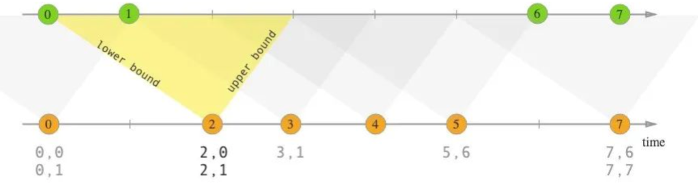

**语法示例**：

假设我们有表 `left_table` 具有列 `left_time` 和其他相关列，表 `right_table` 具有列 `right_time` 和其他相关列。

```sql
SELECT *
FROM left_table
INTERVAL JOIN right_table
ON left_table.left_time BETWEEN right_table.right_time - INTERVAL '5' MINUTE AND right_table.right_time + INTERVAL '5' MINUTE
```

在上述示例中，定义了一个 10 分钟的时间区间（左右各 5 分钟）来进行连接。

**应用场景**：常用于处理事件时间相关的数据，例如将在一定时间范围内相关的事件进行关联。

例如，如果 `left_table` 中的一行的时间戳在 `right_table` 某行时间戳的指定区间内，它们就会被连接起来。

同样有三种join形式：

* inner join
* left/right join
* full join

**小结：**

Flink的区间join用于根据时间范围条件关联两个表的数据

- 分为事件时间戳和基于处理时间的时间区间join
- 基于事件时间的话，依据数据中的事件时间戳确定时间范围来关联
- 基于处理时间的话，依据flink处理数据的时间定义范围进行关联
- 在使用时，需要正确设置时间属性。水印策略及时间特性，保证数据的准确性和性能。


##### inner join

>以 L 作为左流中的数据标识，R 作为右流中的数据标识

流任务中，只有两条流 Join 到（满足 Join on 中的条件：两条流的数据在时间区间 + 满足其他等值条件）才输出，输出 +[L, R]

~~~sql
--1.创建表
CREATE TABLE show_log_table_itv (
    log_id BIGINT,
    show_params STRING,
    `timestamp` bigint,
    row_time AS TO_TIMESTAMP(FROM_UNIXTIME(`timestamp`)),
    watermark for row_time as row_time 
) WITH (
  'connector' = 'socket',
  'hostname' = 'node1',        
  'port' = '8888',
  'format' = 'csv'
);


--2.创建表
CREATE TABLE click_log_table_itv (
  log_id BIGINT,
  click_params     STRING,
  `timestamp` bigint,
  row_time AS TO_TIMESTAMP(FROM_UNIXTIME(`timestamp`)),
  watermark for row_time as row_time 
)
WITH (
  'connector' = 'socket',
  'hostname' = 'node1',        
  'port' = '9999',
  'format' = 'csv'
);


--3.执行SQL
SELECT
    show_log_table_itv.log_id as s_id,
    show_log_table_itv.show_params as s_params,
    click_log_table_itv.log_id as c_id,
    click_log_table_itv.click_params as c_params
FROM show_log_table_itv  
INNER JOIN click_log_table_itv ON show_log_table_itv.log_id = click_log_table_itv.log_id
AND show_log_table_itv.row_time BETWEEN click_log_table_itv.row_time - INTERVAL '10' SECOND AND click_log_table_itv.row_time;


--4.时间范围解释
第一次：
输入的数据：1,8888_1,1    和    1,9999_1,1
log_id都是1，能够关联上。右表1-10，该时间范围条件满足

第二次：
输入的数据：1,8888_2,2    和    1,9999_2,12
log_id都是1，能够关联上。右表12-10，该时间范围条件满足


第三次：
输入的数据：只输入了1,8888_3,3
log_id是1，能够关联上。右表12-10，因此能够关联上
~~~

**小结**：

- 同时满足时间区间和连接键的双重匹配条件
- 结果集进包含既在指定时间区间内，又在连接键上完全匹配的行，具有较高的精确性
- 需要考虑时间区间，通过设定范围确定相关行

场景：应用与需要特定时间范围内精确查找两个表相同连接键相关行的场景，比如处理特定时间窗口内相同标识事件关联


##### left join

>以 L 作为左流中的数据标识，R 作为右流中的数据标识

流任务中，左流数据到达之后，如果没有 Join 到右流的数据，就会等待（放在 State 中等），如果之后右流之后数据到达之后，发现能和刚刚那条左流数据 Join 到，则会输出 +[L, R]。

>注意：常规join的时候，如果右表没有匹配上行，输出NULL进行填充，一旦有匹配上的右表的数据了，则会产生“`回撤流`”, 将NULL值替换为右表关联后的数据。
>
>但是Left Interval Join不会产生回撤流，一旦匹配不上，左表的数据会一直等待不会输出，右表数据到达以后，匹配上才会输出。

Right Interval Join 和 Left Interval Join 执行逻辑一样，只不过左表和右表的执行逻辑完全相反

~~~sql
--1.创建表
CREATE TABLE show_log_table_itv (
    log_id BIGINT,
    show_params STRING,
    `timestamp` bigint,
    row_time AS TO_TIMESTAMP(FROM_UNIXTIME(`timestamp`)),
    watermark for row_time as row_time 
) WITH (
  'connector' = 'socket',
  'hostname' = 'node1',        
  'port' = '8888',
  'format' = 'csv'
);

--2.创建表
CREATE TABLE click_log_table_itv (
  log_id BIGINT,
  click_params     STRING,
  `timestamp` bigint,
  row_time AS TO_TIMESTAMP(FROM_UNIXTIME(`timestamp`)),
  watermark for row_time as row_time 
)
WITH (
  'connector' = 'socket',
  'hostname' = 'node1',        
  'port' = '9999',
  'format' = 'csv'
);


--3.SQL查询
SELECT
    show_log_table_itv.log_id as s_id,
    show_log_table_itv.show_params as s_params,
    click_log_table_itv.log_id as c_id,
    click_log_table_itv.click_params as c_params
FROM show_log_table_itv  
LEFT JOIN click_log_table_itv ON show_log_table_itv.log_id = click_log_table_itv.log_id
AND show_log_table_itv.row_time BETWEEN click_log_table_itv.row_time - INTERVAL '10' SECOND AND click_log_table_itv.row_time;
~~~

**小结**：

在flinksql中，left interval join具有一下特点

- 以左表为核心，左表的所有行都会出现在结果集中（如果右表没有关联上数据，左表一直处于等待状态）
- 基于设定的时间区间在右表中为左表的行寻找匹配
- 结果表包含左表所有行，右表能匹配则返回数据，不能则等待


##### full join

>以 L 作为左流中的数据标识，R 作为右流中的数据标识

流任务中，左流或者右流的数据到达之后，如果没有 Join 到另外一条流的数据，就会等待（左流放在左流对应的 State 中等，右流放在右流对应的 State 中等），如果之后另一条流数据到达之后，发现能和刚刚那条数据 Join 到，则会输出 +[L, R]

~~~sql
--1.创建表
CREATE TABLE show_log_table_itv (
    log_id BIGINT,
    show_params STRING,
    `timestamp` bigint,
    row_time AS TO_TIMESTAMP(FROM_UNIXTIME(`timestamp`)),
    watermark for row_time as row_time 
) WITH (
  'connector' = 'socket',
  'hostname' = 'node1',        
  'port' = '8888',
  'format' = 'csv'
);


--2.创建表
CREATE TABLE click_log_table_itv (
  log_id BIGINT,
  click_params     STRING,
  `timestamp` bigint,
  row_time AS TO_TIMESTAMP(FROM_UNIXTIME(`timestamp`)),
  watermark for row_time as row_time 
)
WITH (
  'connector' = 'socket',
  'hostname' = 'node1',        
  'port' = '9999',
  'format' = 'csv'
);


--3.数据查询
SELECT
    show_log_table_itv.log_id as s_id,
    show_log_table_itv.show_params as s_params,
    click_log_table_itv.log_id as c_id,
    click_log_table_itv.click_params as c_params
FROM show_log_table_itv 
FULL JOIN click_log_table_itv ON show_log_table_itv.log_id = click_log_table_itv.log_id
AND show_log_table_itv.row_time BETWEEN click_log_table_itv.row_time - INTERVAL '10' SECOND AND click_log_table_itv.row_time;
~~~

**小结**：


#### Lookup join（维表join）

在 Flink 中，`Lookup Join`（查找连接）是一种用于将流数据与静态或缓慢变化的维表进行关联的连接方式。

以下是关于 `Lookup Join` 的一些关键要点：

- 流与维表关联：通常将一个实时的数据流与一个相对静态或更新不频繁的维表进行连接。
- 查找操作：在流中的元素到达时，根据指定的键在维表中查找匹配的值，并将其关联到流元素上。
- 维表存储：维表可以存储在内存、外部数据库（如 Mysql、Redis、HBase 等）或其他合适的存储介质中。
- 异步查找：查找过程通常是异步的，以避免阻塞流的处理。
- 缓存与更新：为了提高性能，可能会使用缓存来存储维表的部分数据，并根据需要进行更新。

**应用场景**：常用于实时数据分析中，为流数据补充额外的维度信息，例如为用户行为流数据关联用户的详细信息。

**需求**：把维度数据存储在MySQL中，我们采用FlinkSQL 读取维度表的数据，来进行join操作。

**步骤**：

~~~shell
#1.在MySQL中准备库、维度表和维度数据
#1.1 创建库
create database test01;
use test01;

#1.2 创建表
CREATE TABLE `user_profile` (
  `user_id` varchar(100) NOT NULL,
  `age` varchar(100) DEFAULT NULL,
  `sex` varchar(100) DEFAULT NULL,
  PRIMARY KEY (`user_id`)
) ENGINE=InnoDB DEFAULT CHARSET=utf8;

#1.3 往表中插入数据
INSERT INTO test01.user_profile (user_id,age,sex) VALUES
	 ('a','12-18','男'),
	 ('b','18-24','女'),
	 ('c','18-24','男');


#2.在FlinkSQL中创建维度表映射表
CREATE TABLE mysql_rds_dim (
  `user_id` string, 
  `age` string,
  `sex` string
) WITH (
  'connector' = 'jdbc',
  'table-name'='user_profile',
  'username'='root',
  'password' = '123456',
  'url'='jdbc:mysql://node1:3306/test'
);


#3.在FlinkSQL中创建事实表
CREATE TABLE click_log_table_lookup (
  log_id BIGINT, 
  `timestamp` bigint,
  user_id string,
  proctime AS PROCTIME()
)
WITH (
  'connector' = 'socket',
  'hostname' = 'node1',        
  'port' = '8888',
  'format' = 'csv'
);


#4.拉起数据任务
SELECT 
    s.log_id as log_id,
    s.`timestamp` as `timestamp`,
    s.user_id as user_id,
    s.proctime as proctime,
    u.sex as sex,
    u.age as age
FROM click_log_table_lookup AS s
LEFT JOIN mysql_rds_dim FOR SYSTEM_TIME AS OF s.proctime AS u
ON s.user_id = u.user_id;

# 5.说明
FOR SYSTEM_TIME AS OF s.proctime AS u，这里面除了u 和 s表的时间列，其他都是固定写法
~~~

~~~properties
原因: 开源的Flink中默认不支持jdbc连接器
解决办法: 将【flink-connector-jdbc-1.15.4.jar】和【mysql-connector-java-8.0.27.jar】jar包，上传到flink安装目录的lib目录下，并且重启集群。
~~~

### 集合

#### union&union all

##### union

可以把两个集合合并，但是有去重的功能。

~~~sql
create temporary view t1(s) as values ('c'), ('a'), ('b'), ('b'), ('c');
create temporary view t2(s) as values ('d'), ('e'), ('a'), ('b'), ('b');

SELECT s FROM t1 UNION SELECT s FROM t2;
~~~

##### union all

union all：把两个集合合并，并且不去重。

~~~sql
create temporary view t1(s) as values ('c'), ('a'), ('b'), ('b'), ('c');
create temporary view t2(s) as values ('d'), ('e'), ('a'), ('b'), ('b');
SELECT s FROM t1 UNION ALL SELECT s FROM t2;
~~~


#### intersect&intersect all

##### intersect

intersect：交集。会去重。

~~~sql
create temporary view t1(s) as values ('c'), ('a'), ('b'), ('b'), ('c');
create temporary view t2(s) as values ('d'), ('e'), ('a'), ('b'), ('b');
SELECT s FROM t1 INTERSECT SELECT s FROM t2;
~~~

##### intersect all

intersect all：交集，不去重。

~~~sql
create temporary view t1(s) as values ('c'), ('a'), ('b'), ('b'), ('c');
create temporary view t2(s) as values ('d'), ('e'), ('a'), ('b'), ('b');
SELECT s FROM t1 INTERSECT ALL SELECT s FROM t2;
~~~

#### except& except all

##### except

except：除……之外。差集，但是会去重。

~~~sql
create temporary view t1(s) as values ('c'), ('a'), ('b'), ('b'), ('c');
create temporary view t2(s) as values ('d'), ('e'), ('a'), ('b'), ('b');
SELECT s FROM t1 EXCEPT SELECT s FROM t2;

--解释
t1表有但是t2表没有的。

t1:a,b,b,c,c
t2:a,b,b,d,e
~~~


##### except all

except all：差集，但是不会去重。

~~~sql
create temporary view t1(s) as values ('c'), ('a'), ('b'), ('b'), ('c');
create temporary view t2(s) as values ('d'), ('e'), ('a'), ('b'), ('b');
SELECT s FROM t1 EXCEPT ALL SELECT s FROM t2;
~~~

### order by & limit

order by：排序。

limit：限制结果输出的条数。

这两个语法和MySQL、Hive一样。

~~~sql
--1.order by
select word,count(*) as cnts from source_table group by word order by cnts;


--2.limit
select word,count(*) as  cnts from source_table group by word order by cnts limit 2;
~~~

注意：Flink中排序字段，第一个只能时间字段进行升序排序。第一个字段不能是常规类型的字段进行排序

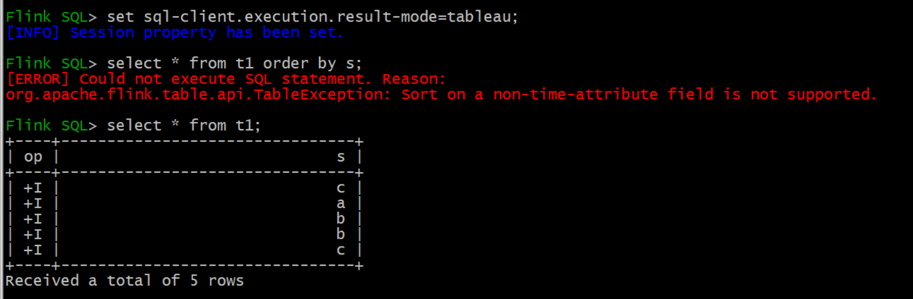

### TopN

通过类似Hive中的开窗进行实现

~~~shell
CREATE TABLE dml_search_topn (
    name STRING NOT NULL,
    search_cnt BIGINT NOT NULL,
    key STRING NOT NULL,
    row_time AS cast(CURRENT_TIMESTAMP as timestamp(3)),
    WATERMARK FOR row_time AS row_time
) WITH (
  'connector' = 'socket',
  'hostname' = 'node1',        
  'port' = '9999',
  'format' = 'csv'
);

-- DML 逻辑
SELECT key, name, search_cnt, row_time as `timestamp`
FROM (
   SELECT key, name, search_cnt, row_time, 
     -- 按照 search_cnt 倒排取前 3 名
     ROW_NUMBER() OVER (ORDER BY search_cnt desc) AS rownum
   FROM dml_search_topn)
WHERE rownum <= 3;
~~~

**小结**：

### explain

explain：查看SQL的执行计划。可以用来SQL调优。

如果SQL跑的慢，在MySQL里，第一时间要看SQL的执行计划。

~~~sql
--1.创建表
CREATE TABLE source_table (
    user_id BIGINT COMMENT '用户 id',
    name STRING COMMENT '用户姓名',
    server_timestamp BIGINT COMMENT '用户访问时间戳',
    proctime AS PROCTIME()
) WITH (
  'connector' = 'datagen',
  'rows-per-second' = '1',
  'fields.name.length' = '1',
  'fields.user_id.min' = '1',
  'fields.user_id.max' = '10',
  'fields.server_timestamp.min' = '1',
  'fields.server_timestamp.max' = '100000'
);


--2.explain查看执行计划
EXPLAIN select user_id,
       name,
       server_timestamp
from (
      SELECT
          user_id,
          name,
          server_timestamp,
          row_number() over(partition by user_id order by proctime) as rn
      FROM source_table
)
where rn = 1;
~~~

### use&show

use：用来切换数据库和元数据库的。

~~~sql
--1.查看元数据库
show catalogs;

--2.切换元数据库
use catalog default_catalog;


--3.查看数据库
show databases;


--4.切换数据库
use default_database;


--5.查看表
show tables;

--6.查看视图
show views;


--7.查看函数
show functions;

--8.查看当前的元数据库
show current catalog;


--9.查看当前数据库
show current database;
~~~

### select&where&distinct（了解）

select：普通的SQL查询。和MySQL、Hive一样。

where：条件过滤。和MySQL、Hive一样。

distinct：去重操作。和MySQL、Hive一样。

### Group聚合（了解）

FlinkSQL支持Group聚合的语法糖，分为四种：

* 常规的group by，和MySQL、Hive一样。
* grouping sets
* rollup
* cube

正常情况下，group by的语法如下：

~~~sql
SELECT COUNT(*) FROM Orders GROUP BY order_id
~~~

#### grouping sets

在 Flink SQL 中，`GROUPING SETS` 用于在一个查询中指定多个分组组合，从而可以一次性得到不同分组方式的聚合结果。

**语法：**

```sql
SELECT column1, column2, aggregate_function(column3)
FROM table_name
GROUP BY GROUPING SETS ((column1), (column2), (column1, column2))
```

其中，`aggregate_function` 是聚合函数，如 `SUM`、`AVG`、`COUNT` 等。`GROUPING SETS` 中的每个括号内的列表示一种分组方式。

**使用示例:**

~~~sql
SELECT supplier_id, rating, COUNT(*) AS total
FROM (VALUES
    ('supplier1', 'product1', 4),
    ('supplier1', 'product2', 3),
    ('supplier2', 'product3', 3),
    ('supplier2', 'product4', 4))
AS Products(supplier_id, product_id, rating)
GROUP BY GROUPING SETS ((supplier_id, rating), (supplier_id), ())
~~~

上述的SQL等价于：

~~~sql
select ... from ... group by (supplier_id, rating)
union all
select ... from ... group by  (supplier_id)
union all
select ... from ... group by  ()
~~~

~~~properties
select supplier_id, rating, COUNT(*) AS total from (VALUES
    ('supplier1', 'product1', 4),
    ('supplier1', 'product2', 3),
    ('supplier2', 'product3', 3),
    ('supplier2', 'product4', 4))
AS Products(supplier_id, product_id, rating) group by (supplier_id, rating)
union all
select supplier_id, 0 as rating, COUNT(*) AS total from (VALUES
    ('supplier1', 'product1', 4),
    ('supplier1', 'product2', 3),
    ('supplier2', 'product3', 3),
    ('supplier2', 'product4', 4))
AS Products(supplier_id, product_id, rating) group by  (supplier_id)
union all
select '' as supplier_id, 0 as rating, COUNT(*) AS total from (VALUES
    ('supplier1', 'product1', 4),
    ('supplier1', 'product2', 3),
    ('supplier2', 'product3', 3),
    ('supplier2', 'product4', 4))
AS Products(supplier_id, product_id, rating);
~~~

#### rollup

在 Flink SQL 中，`ROLLUP` 操作是一种用于生成多维聚合结果的工具。

以下是关于 `ROLLUP` 操作的关键要点：

- 多维聚合：`ROLLUP` 允许在多个维度上进行聚合计算，不仅仅局限于单个维度。
- 分组层次：它会按照指定的列的组合层次自动生成不同级别的分组聚合结果。
- 包含总计：除了各个维度组合的聚合结果，还会包含所有数据的总计结果。
- 结果集结构：结果集会按照分组层次逐步展示，方便直观地比较不同层次的聚合数据。

**语法：**

假设我们有一张表 `sales` ，包含列 `region` 、 `product` 和 `sales_amount` 。

```sql
SELECT region, product, SUM(sales_amount) AS total_sales
FROM sales
GROUP BY ROLLUP (region, product);
```

这将生成包括 `(region, product)` 组合、单独的 `region` 分组、总计的聚合结果，例如，对于上述示例，可能会得到类似 `(华北, 手机, 10000)` 、 `(华北, NULL, 20000)` 、 `(NULL, NULL, 50000)` 这样的结果。

**应用场景**：

适用于需要全面分析数据在不同维度组合和总体上的汇总情况，例如销售数据在不同地区和产品类别的汇总。

**使用示例:**

~~~sql
SELECT supplier_id, rating, COUNT(*)
FROM (VALUES
    ('supplier1', 'product1', 4),
    ('supplier1', 'product2', 3),
    ('supplier2', 'product3', 3),
    ('supplier2', 'product4', 4))
AS Products(supplier_id, product_id, rating)
GROUP BY ROLLUP (supplier_id, rating)
~~~

上述的rollup写法，等价于：

~~~~sql
GROUPING SETS ((supplier_id), (supplier_id，rating), ())
~~~~

#### cube

在 Flink SQL 中，`CUBE` 操作是一种用于生成多维聚合结果的强大方式。

以下是关于 `CUBE` 操作的关键要点：

- 全面的维度组合：`CUBE` 会生成所有可能的维度组合的聚合结果，比 `ROLLUP` 更加全面。
- 灵活的分组：它会创建基于给定列的所有可能的分组组合的聚合。
- 大量结果集：由于生成的组合众多，可能会产生大量的聚合结果。

**语法：**

假设我们有一张表 `sales` ，包含列 `region` 、 `product` 和 `sales_amount` 。

```sql
SELECT region, product, SUM(sales_amount) AS total_sales
FROM sales
GROUP BY CUBE (region, product);
```

这将生成包括 `(region, product)` 、 `(region, NULL)` 、 `(NULL, product)` 和 `(NULL, NULL)` 等各种组合的聚合结果。例如，对于上述示例，可能会得到类似 `(华北, 手机, 10000)` 、 `(华北, NULL, 20000)` 、 `(NULL, 手机, 30000)` 、 `(NULL, NULL, 50000)` 这样的结果。

**应用场景**：适用于需要对数据进行非常详细和全面的多维分析的情况，例如深入研究不同维度组合对业务指标的影响。

**使用示例:**

~~~sql
SELECT supplier_id, rating, product_id, COUNT(*)
FROM (VALUES
    ('supplier1', 'product1', 4),
    ('supplier1', 'product2', 3),
    ('supplier2', 'product3', 3),
    ('supplier2', 'product4', 4))
AS Products(supplier_id, product_id, rating)
GROUP BY CUBE (supplier_id, rating, product_id)
~~~

上述cube的写法，等价于：

~~~sql
GROUP BY GROUPING SETS (
    ( supplier_id, product_id, rating ),
    ( supplier_id, product_id         ),
    ( supplier_id,             rating ),
    ( supplier_id                     ),
    (              product_id, rating ),
    (              product_id         ),
    (                          rating ),
    (                                 )
~~~

小结：FlinkSQL中用的不多，了解即可。

## FlinkSQL能力进阶

这里只是FlinkSQL的调优。

官网地址：https://nightlies.apache.org/flink/flink-docs-release-1.15/docs/dev/table/config/

### 任务参数配置

#### 运行时参数

- 异步维度join

```shell
# 默认值：100
# 值类型：Integer
# 流批任务：流、批任务都支持
# 用处：异步 lookup join 中最大的异步 IO 执行数目
table.exec.async-lookup.buffer-capacity: 100
```

- 开启微批

```properties
# 默认值：false
# 值类型：Boolean
# 流批任务：流任务支持
# 用处：MiniBatch 优化是一种专门针对 unbounded 流任务的优化（即非窗口类应用），其机制是在 `允许的延迟时间间隔内` 以及 `达到最大缓冲记录数` 时触发以减少 `状态访问` 的优化，从而节约处理时间。下面两个参数一个代表 `允许的延迟时间间隔`，另一个代表 `达到最大缓冲记录数`。
table.exec.mini-batch.enabled: false

# 默认值：0 ms
# 值类型：Duration
# 流批任务：流任务支持
# 用处：此参数设置为多少就代表 MiniBatch 机制最大允许的延迟时间。注意这个参数要配合 `table.exec.mini-batch.enabled` 为 true 时使用，而且必须大于 0 ms
table.exec.mini-batch.allow-latency: 0 ms

# 默认值：-1
# 值类型：Long
# 流批任务：流任务支持
# 用处：此参数设置为多少就代表 MiniBatch 机制最大缓冲记录数。注意这个参数要配合 `table.exec.mini-batch.enabled` 为 true 时使用，而且必须大于 0
table.exec.mini-batch.size: -1


注意: 微批处理可以提升程序对数据的吞吐量，但是会导致时效性降低。开启微批处理以后，如果时间和条数都有设置，那么只需要满足其中一个条件就会触发数据计算。
```

- 并行度的设置

```shell
# 默认值：-1
# 值类型：Integer
# 流批任务：流、批任务都支持
# 用处：可以用此参数设置 Flink SQL 中算子的并行度，这个参数的优先级 `高于` StreamExecutionEnvironment 中设置的并行度优先级，如果这个值设置为 -1，则代表没有设置，会默认使用 StreamExecutionEnvironment 设置的并行度
table.exec.resource.default-parallelism: -1
```

- 数据异常时的处理方式

```shell
# 默认值：ERROR
# 值类型：Enum【ERROR, DROP】
# 流批任务：流、批任务都支持
# 用处：表上的 NOT NULL 列约束强制不能将 NULL 值插入表中。Flink 支持 `ERROR`（默认）和 `DROP` 配置。默认情况下，当 NULL 值写入 NOT NULL 列时，Flink 会产生运行时异常。用户可以将行为更改为 `DROP`，直接删除此类记录，而不会引发异常。
table.exec.sink.not-null-enforcer: ERROR
```

- 上游cdc去重

```shell
# 默认值：false
# 值类型：Boolean
# 流批任务：流任务
# 用处：接入了 CDC 的数据源，上游 CDC 如果产生重复的数据，可以使用此参数在 Flink 数据源算子进行去重操作，去重会引入状态开销
table.exec.source.cdc-events-duplicate: false
```

- 设置空闲等待

```shell
# 默认值：0 ms
# 值类型：Duration
# 流批任务：流任务
# 用处：如果此参数设置为 60 s，当 Source 算子在 60 s 内未收到任何元素时，这个 Source 将被标记为临时空闲，此时下游任务就不依赖此 Source 的 Watermark 来推进整体的 Watermark 了。
# 默认值为 0 时，代表未启用检测源空闲。
table.exec.source.idle-timeout: 0 ms
```

- 设置状态有效期

```shell
# 默认值：0 ms
# 值类型：Duration
# 流批任务：流任务
# 用处：指定空闲状态（即未更新的状态）将保留多长时间。尤其是在 unbounded 场景中很有用。默认 0 ms 为不清除空闲状态
table.exec.state.ttl: 0 ms

推荐: 状态的保存时间，需要根据窗口大小、watermark来进行设置。一般为了保险起见，会保存当前窗口的状态数据，以及前1-2个窗口的状态。
```

**上述的参数中，常用的有：开启微批、设置状态有效期**


#### 优化器参数

- 开启两阶段聚合

```shell
#  默认值：AUTO
#  值类型：String
#  流批任务：流、批任务都支持
#  用处：聚合阶段的策略。和 MapReduce 的 Combiner 功能类似，可以在数据 shuffle 前做一些提前的聚合，可以选择以下三种方式
#  TWO_PHASE：强制使用具有 localAggregate 和 globalAggregate 的两阶段聚合。请注意，如果聚合函数不支持优化为两个阶段，Flink 仍将使用单阶段聚合。
#  两阶段优化在计算 count，sum 时很有用，但是在计算 count distinct 时需要注意，key 的稀疏程度，如果 key 不稀疏，那么很可能两阶段优化的效果会适得其反
#  ONE_PHASE：强制使用只有 CompleteGlobalAggregate 的一个阶段聚合。
#  AUTO：聚合阶段没有特殊的执行器。选择 TWO_PHASE 或者 ONE_PHASE 取决于优化器的成本。
#  
#  注意！！！：此优化在窗口聚合中会自动生效，但是在 unbounded agg 中需要与 minibatch 参数相结合使用才会生效
table.optimizer.agg-phase-strategy: AUTO
```

- 开启分桶

```shell
#  默认值：false
#  值类型：Boolean
#  流批任务：流任务
#  用处：避免 group by 计算 count distinct\sum distinct 数据时的 group by 的 key 较少导致的数据倾斜，比如 group by 中一个 key 的 distinct 要去重 500w 数据，而另一个 key 只需要去重 3 个 key，那么就需要先需要按照 distinct 的 key 进行分桶。将此参数设置为 true 之后，下面的 table.optimizer.distinct-agg.split.bucket-num 可以用于决定分桶数是多少
#  后文会介绍具体的案例
table.optimizer.distinct-agg.split.enabled: false

#  默认值：1024
#  值类型：Integer
#  流批任务：流任务
#  用处：避免 group by 计算 count distinct 数据时的 group by 较少导致的数据倾斜。加了此参数之后，会先根据 group by key 结合 hash_code（distinct_key）进行分桶，然后再自动进行合桶。
#  后文会介绍具体的案例
table.optimizer.distinct-agg.split.bucket-num: 1024
```

- 重用执行计划

```shell
#  默认值：true
#  值类型：Boolean
#  流批任务：流任务
#  用处：如果设置为 true，Flink 优化器将会尝试找出重复的自计划并重用。默认为 true 不需要改动
table.optimizer.reuse-sub-plan-enabled: true
```

- source资源重用

```shell
#  默认值：true
#  值类型：Boolean
#  流批任务：流任务
#  用处：如果设置为 true，Flink 优化器会找出重复使用的 table source 并且重用。默认为 true 不需要改动
table.optimizer.reuse-source-enabled: true
```

- 开启谓词下推

```shell
#  默认值：true
#  值类型：Boolean
#  流批任务：流任务
#  用处：如果设置为 true，Flink 优化器将会做谓词下推到 FilterableTableSource 中，将一些过滤条件前置，提升性能。默认为 true 不需要改动
table.optimizer.source.predicate-pushdown-enabled: true
```

运行时参数，用的多的：两阶段聚合、分桶


#### 表参数

- 开启DML异步

```shell
#  默认值：false
#  值类型：Boolean
#  流批任务：流、批任务都支持
#  用处：DML SQL（即执行 insert into 操作）是异步执行还是同步执行。默认为异步（false），即可以同时提交多个 DML SQL 作业，如果设置为 true，则为同步，第二个 DML 将会等待第一个 DML 操作执行结束之后再执行
table.dml-sync: false
```

- 设置方法的最大长度不超过64KB

```shell
#  默认值：64000
#  值类型：Integer
#  流批任务：流、批任务都支持
#  用处：Flink SQL 会通过生产 java 代码来执行具体的 SQL 逻辑，但是 jvm 限制了一个 java 方法的最大长度不能超过 64KB，但是某些场景下 Flink SQL 生产的 java 代码会超过 64KB，这时 jvm 就会直接报错。因此此参数可以用于限制生产的 java 代码的长度来避免超过 64KB，从而避免 jvm 报错。
table.generated-code.max-length: 64000
```

- 本地时区

```shell
#  默认值：default
#  值类型：String
#  流批任务：流、批任务都支持
#  用处：在使用天级别的窗口时，通常会遇到时区问题。举个例子，Flink 开一天的窗口，默认是按照 UTC 零时区进行划分，那么在北京时区划分出来的一天的窗口是第一天的早上 8:00 到第二天的早上 8:00，但是实际场景中想要的效果是第一天的早上 0:00 到第二天的早上 0:00 点。因此可以将此参数设置为 GMT+08:00 来解决这个问题。
table.local-time-zone: default
```

- 编译器

```shell
#  默认值：default
#  值类型：Enum【BLINK、OLD】
#  流批任务：流、批任务都支持
#  用处：Flink SQL planner，默认为 BLINK planner，也可以选择 old planner，但是推荐使用 BLINK planner
table.planner: BLINK
```

- SQL方言

```shell
#  默认值：default
#  值类型：String
#  流批任务：流、批任务都支持
#  用处：Flink 解析一个 SQL 的解析器，目前有 Flink SQL 默认的解析器和 Hive SQL 解析器，其区别在于两种解析器支持的语法会有不同，比如 Hive SQL 解析器支持 between and、rlike 语法，Flink SQL 不支持
table.sql-dialect: default
```


### SQL调优

#### mini-batch聚合

作用：微批处理可以提升程序对数据的吞吐量，但是会导致时效性降低。开启微批处理以后，如果时间和条数都有设置，那么只需要满足其中一个条件就会触发数据计算。


SQL中参数配置如下：

```shell
# 默认值：false
# 值类型：Boolean
# 流批任务：流任务支持
# 用处：MiniBatch 优化是一种专门针对 unbounded 流任务的优化（即非窗口类应用），其机制是在 `允许的延迟时间间隔内` 以及 `达到最大缓冲记录数` 时触发以减少 `状态访问` 的优化，从而节约处理时间。下面两个参数一个代表 `允许的延迟时间间隔`，另一个代表 `达到最大缓冲记录数`。
table.exec.mini-batch.enabled: false

# 默认值：0 ms
# 值类型：Duration
# 流批任务：流任务支持
# 用处：此参数设置为多少就代表 MiniBatch 机制最大允许的延迟时间。注意这个参数要配合 `table.exec.mini-batch.enabled` 为 true 时使用，而且必须大于 0 ms
table.exec.mini-batch.allow-latency: 0 ms

# 默认值：-1
# 值类型：Long
# 流批任务：流任务支持
# 用处：此参数设置为多少就代表 MiniBatch 机制最大缓冲记录数。注意这个参数要配合 `table.exec.mini-batch.enabled` 为 true 时使用，而且必须大于 0
table.exec.mini-batch.size: -1
```


#### 两阶段聚合

作用：1- 提前聚合以后，会减少后续处理的数据量；2-可以在一定程度上避免数据倾斜的问题，但是无法彻底解决


FlinkSQL中的配置：

```properties
#  默认值：AUTO
#  值类型：String
#  流批任务：流、批任务都支持
#  用处：聚合阶段的策略。和 MapReduce 的 Combiner 功能类似，可以在数据 shuffle 前做一些提前的聚合，可以选择以下三种方式
#  TWO_PHASE：强制使用具有 localAggregate 和 globalAggregate 的两阶段聚合。请注意，如果聚合函数不支持优化为两个阶段，Flink 仍将使用单阶段聚合。
#  两阶段优化在计算 count，sum 时很有用，但是在计算 count distinct 时需要注意，key 的稀疏程度，如果 key 不稀疏，那么很可能两阶段优化的效果会适得其反
#  ONE_PHASE：强制使用只有 CompleteGlobalAggregate 的一个阶段聚合。
#  AUTO：聚合阶段没有特殊的执行器。选择 TWO_PHASE 或者 ONE_PHASE 取决于优化器的成本。
table.optimizer.agg-phase-strategy: AUTO


注意: 此优化在窗口中会自动生效。另外需要同时开启mini-batch聚合，也就是mini-batch聚合不依赖两阶段聚合；但是如果想要使用两阶段聚合，那么必须同时开启mini-batch聚合
```


#### 分桶

作用：可以在一定程度上避免数据倾斜的问题，但是无法彻底解决

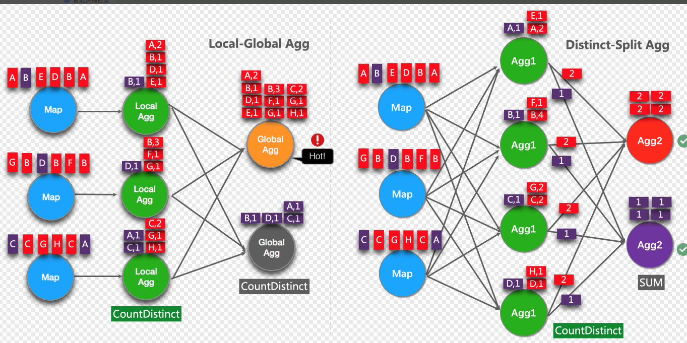

FlinkSQL的配置如下：

```shell
#  默认值：false
#  值类型：Boolean
#  流批任务：流任务
#  用处：避免 group by 计算 count distinct\sum distinct 数据时的 group by 的 key 较少导致的数据倾斜，比如 group by 中一个 key 的 distinct 要去重 500w 数据，而另一个 key 只需要去重 3 个 key，那么就需要先需要按照 distinct 的 key 进行分桶。将此参数设置为 true 之后，下面的 table.optimizer.distinct-agg.split.bucket-num 可以用于决定分桶数是多少
#  后文会介绍具体的案例
table.optimizer.distinct-agg.split.enabled: false

#  默认值：1024
#  值类型：Integer
#  流批任务：流任务
#  用处：避免 group by 计算 count distinct 数据时的 group by 较少导致的数据倾斜。加了此参数之后，会先根据 group by key 结合 hash_code（distinct_key）进行分桶，然后再自动进行合桶。
#  后文会介绍具体的案例
table.optimizer.distinct-agg.split.bucket-num: 1024
```


#### filter去重（了解）

```sql
--普通的写法
SELECT
 day,
 COUNT(DISTINCT user_id) AS total_uv,
 COUNT(DISTINCT CASE WHEN flag IN ('android', 'iphone') THEN user_id ELSE NULL END) AS app_uv,
 COUNT(DISTINCT CASE WHEN flag IN ('wap', 'other') THEN user_id ELSE NULL END) AS web_uv
FROM T
GROUP BY day


--filter优写法
SELECT
 day,
 COUNT(DISTINCT user_id) AS total_uv,
 COUNT(DISTINCT user_id) FILTER (WHERE flag IN ('android', 'iphone')) AS app_uv,
 COUNT(DISTINCT user_id) FILTER (WHERE flag IN ('web', 'other')) AS web_uv
FROM T
GROUP BY day
```

filter子句能够将三个状态合并成一个共享的状态。方便程序的读取等操作。能够提升效率。


### 阿里云Flink调优

Flink支持智能调优和定时调优两种调优模式。

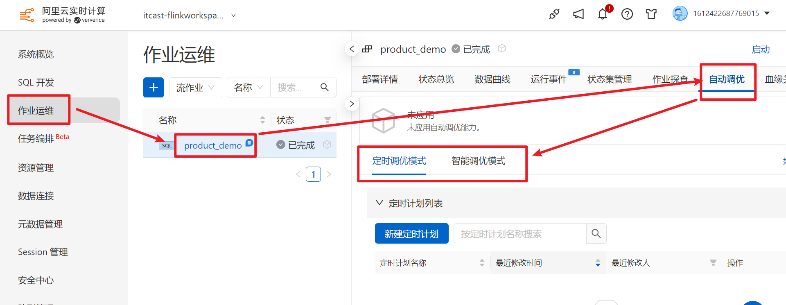

#### 智能调优

简单理解，就是阿里云Flink智能来进行调优。默认会从并发度和内存来进行调优。

- 智能调优会调整作业的并发度来满足作业流量变化所需要的吞吐。

  智能调优会监控消费源头数据的延迟变化情况、TaskManager（TM） CPU实际使用率和各个算子处理数据能力来调整作业的并发度。详情如下：

  - 作业延迟Delay指标正常（不超过60s），不修改当前作业并发。
  - 作业延迟Delay指标超过默认阈值60s，分以下两种情况来调整并发度：
    - 延迟正在下降，不进行并发度调整。
    - 延迟增加并且连续上升3分钟（默认值）， 默认调整作业并发度到当前实际TPS的两倍，但不超过设置最大的资源（默认值为64 CU）。
  - 作业不存在延迟指标。
    - 作业某VERTEX节点连续6分钟实际处理数据时间占比超过80%，调大作业并发度使得SLOT使用率降低到50%，但不超过设置最大的资源（默认为64 CU）。
    - 所有TM的平均利用率连续6分钟超过80%，调高并发度使TM的CPU使用率降低到50%。
  - 所有TM的最大CPU使用率连续24小时低于20%，且VERTEX的实际处理数据时间低于20%时，调低作业的并发度使CPU和VERTEX实际处理的时间占比提高到50%。

- 智能调优也会监控作业的内存使用和Failover情况，来调整作业的内存配置。详情如下：

  - 在JobManager GC频繁或者发生OOM异常时，会调高JM的内存，默认最大调整到16 GiB。
  - 在TM GC频繁或者发生OOM异常、HeartBeatTimeout异常时，会调高TM的内存，默认最大调整到16 GiB。
  - 在TM内存使用率超过95%时，会调大TM的内存。
  - 在TM的实际内存使用率连续24小时低于30%时，降低TM内存的配置，默认最小调整到1.6 GiB。


#### 定时调优

定时调优计划描述了资源和时间点的对应关系，一个定时调优计划中可以包含多组资源和时间点的关系。在使用定时调优计划时，您需要明确知道各个时间段的资源使用情况，根据业务时间区间特征，设置对应的资源。

例如，某业务全天早09：00~19：00是业务高峰，19：00到第二天09：00是业务低峰。此时您可以使用定时调优功能，在高峰时间段使用30 CU，在业务低峰时使用10 CU。

> 说明：1 CU=1核CPU+4 GiB内存+20 GB本地存储（放置日志、系统检查点等信息）

小结：在使用阿里云调优时，可以使用一些开源的参数。


## Flink架构

### 系统架构

官网架构链接：https://nightlies.apache.org/flink/flink-docs-release-1.15/docs/concepts/flink-architecture/

官网的架构图如下：

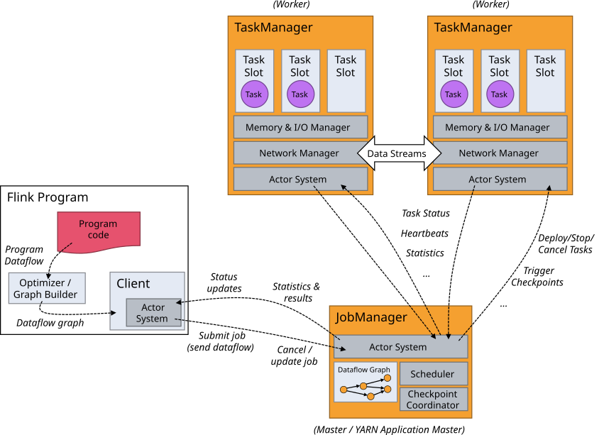

讲义的架构如下：


#### 通信

Spark的通信：在1.6版本及之前，用的是akka通信框架，在1.6之后，用的是netty。

Flink的通信：akka通信框架。

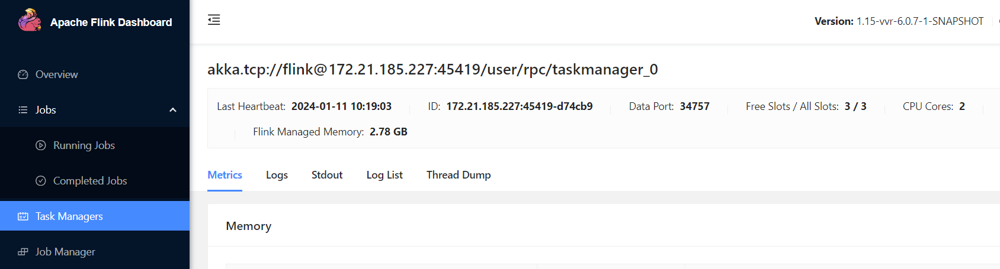


#### JobManager

JobManager：集群的主节点，负责集群的管理工作，管理众多的从节点，负责资源管理和任务分配。

JobManager这个角色有三个子组件：

* ResourceManager：负责Flink集群的资源管理。需要和Yarn中ResourceManager进行区分。
* JobMaster：作业调度器
* Dispatcher：分发器。负责创建并且启动JobMaster，以及将任务转发给到JobMaster


#### TaskManager

TaskManager：集群中的从节点，负责执行任务。负责Slot槽的分配。同时要向JobManager定时汇报心跳、任务的运行状态、监控、管理Slot资源等工作


#### Scheduler

Spark：DAGScheduler和TaskScheduler

​	DAGScheduler：DAG调度器。将Job生成有向无环图和划分Stage阶段，同时确定每个Stage阶段有多少个Task线程。

​	TaskScheduler：Task任务调度器。分配任务。将从DAGScheduler接收到的Task分配给到具体的Executor进行执行


Flink：JobMaster作业调度器，负责任务的调度，这里的调度就是将Flink任务提交到集群中进行运行


#### Checkpoint Coordinator

负责集群的容错，处理Checkpoint


#### Memory & IO Manager

内存和IO管理器，负责该TaskManager节点的内存和IO管理工作。


#### Network Manager

网络管理器，在任务运行的过程中，可能需要从其他节点拉取数据时，需要走网络。也就是TaskManager间会进行数据交换。

~~~properties
TaskManager间进行数据交换的3种场景如下：
场景1: 同一个节点（服务器）的同一个TaskManager内部的不同Slot间
举例: 张三和李四在广州黑马校区的219教室学习
特点: 数据交换的效率最高


场景2: 同一个节点（服务器）的不同的TaskManager进程间的Slot
举例: 张三和李四在广州黑马校区学习，但是张三培训大数据，李四培训Java，他们在2个不同的教室
特点: 数据交换的效率中等


场景3: 不同节点（服务器）上的TaskManager进程间
举例: 张三广州黑马校区学习，但是李四在深圳黑马校区学习
特点: 数据交换的效率最低。并且需要通过网络管理器进行数据交换，也就是需要走网络进行数据交换
~~~


#### Client

只是负责任务的提交。提交成功后，其实可以断开了。在命令提交任务时，可以指定`-d`参数来配置。

如果配置了`-d`，则说明客户端和集群断开了。


### 任务提交流程

#### 抽象提交流程

不管是在什么模式下运行，大体上都是这个流程。

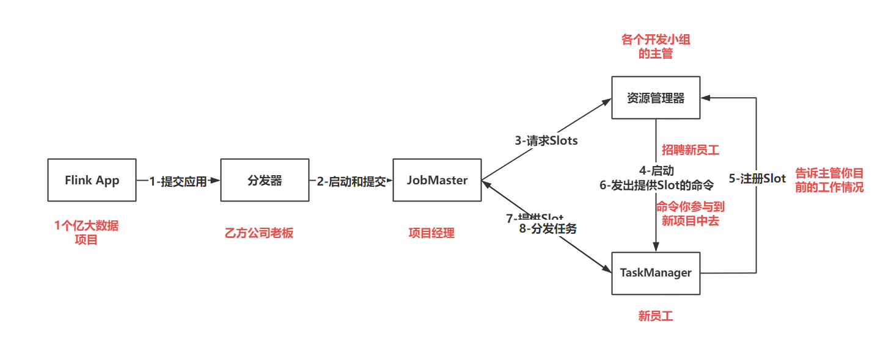


~~~properties
1- 任务提交给到分发器
2- 分发器接收到任务以后，启动JobMaster作业调度器。然后将任务分发给到JobMaster
3- JobMaster收到任务后，它会找到ResourceManager资源管理器，向资源管理器索要Slot资源
4- 资源管理器收到资源申请以后，启动新的TaskManager，新的TaskManager启动以后将自己具有Slot资源告诉资源管理器
5- 资源管理器向TaskManager发出提供Slot资源的命令
6- TaskManager接收到提供Slot的命令后，将Slot资源给到JobMaster
7- JobMaster将任务发送给到具体的TaskManger进行执行
~~~


#### Standalone模式提交流程

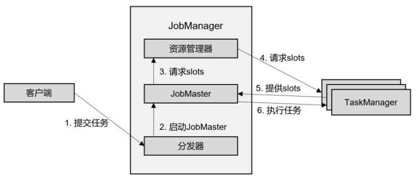

（1）客户端提交任务到Dispacher（分发器）

（2）Dispacher分发器启动JobMaster

（3）JobMaster启动后，它会向JobManager的ResourceManager（资源管理器）请求资源（slot）

（4）JobManager的ResourceManager（资源管理器）向TaskManager请求资源（slot）

（5）TaskManager会向JobMaster提供资源（slot）

（6）JobMaster收到资源后，会向TaskManager提交（分发）任务

（7）TaskManager收到任务后，就在Slot上执行

（8）任务执行完后，释放资源


注意：Standalone模式下，Slot资源用完就没有了，后续如果想继续提交程序，你需要等待其他人运行完成释放资源你才能提交。否则会遇到如下异常：

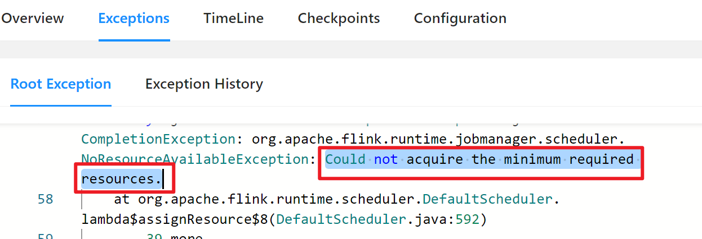


#### Yarn-session模式提交流程

如果需要把任务提交在Yarn-Session下运行，则分为2步：

- 初始化Yarn-session集群
- 提交任务

首先看第一步。


##### 初始化Session集群

（1）请求Yarn的ResourceManager（资源管理器）

（2）Yarn的ResourceManager收到请求后，会启动一个Container（容器），当然这个容器就是ApplicationMaster（AppMaster）

（3）这个AppMaster就是Flink的JobManager，这个JobManager会初始化Dispacher和ResourceManager（资源管理器）

这里还没有初始化TaskManager，因此集群没有slot资源

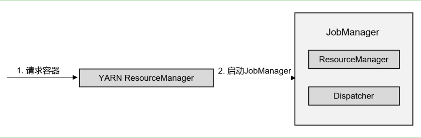


##### 提交任务

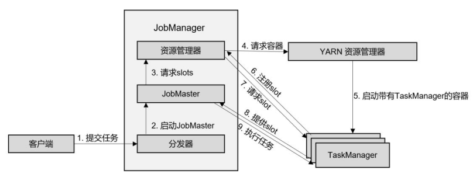

（1）客户端提交任务给JobManager（AppMaster）的分发器（Dispacher）

（2）分发器收到任务后，会启动JobMaster

（3）JobMaster启动后，会向JobManager（AppMaster）请求资源（slot）

（4）JobManager会向Yarn的ResourceManager请求资源

（5）Yarn的ResourceManager收到请求后，会在闲置的节点动态启动Container（TaskManager）

（6）Container启动成功后，会注册给AppMaster（JobManager）的ResourceManager

（7）Container会向AppMaster（JobManager）的JobMaster提供资源（slot）

（8）JobMaster会把任务分发给Container（TaskManager）去执行

（9）待任务执行完后，Container（TaskManager）会被AppMaster（JobManager），最终留下JobManager，这个不会被销毁


#### Yarn-per-job模式提交流程

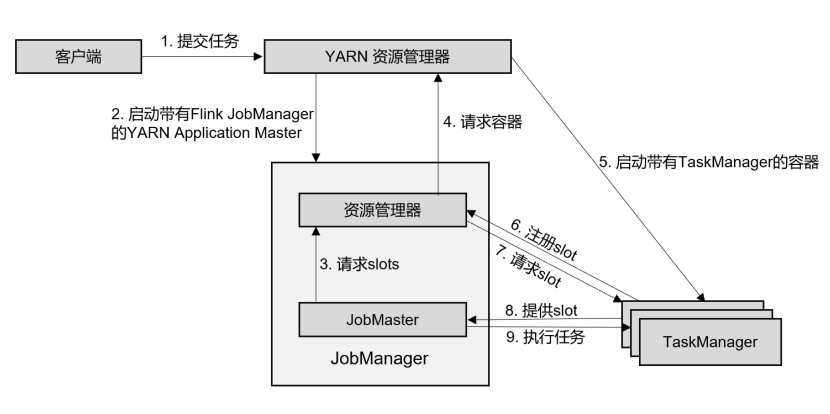

（1）客户端提交任务给Yarn的ResourceManager

（2）Yarn的ResourceManager收到请求后，会启动一个Container（AppMaster），这个AppMaster就是Flink的JobManager

（3）JobManager里有任务调度器和资源管理器，任务调度器就会开始调度任务，向JobManager的资源管理器申请资源

（4）JobManager的资源管理器它会向Yarn的ResourceManager申请资源

（5）Yarn的ResourceManager会动态启动Container（TaskManager），这些Container就是资源

（6）这些Container启动后，会反向注册给AppMaster（JobManager）

（7）这些Container向JobMaster提供资源

（8）JobMaster收到资源后，把任务分发给Container（TaskManager）去执行

（9）任务执行完后，AppMaster（JobManager）会把Container（TaskManager）注销

（10）AppMaster（JobManager）会向Yarn的ResourceManager注销自己


#### Yarn-application模式提交流程

这个模式和Yarn的Per-job模式任务提交类似，只是客户端进程启动的位置不同。

application模式下，客户端进行是在集群的某一个从节点启动的。

Per-job模式下，客户端是在客户端提交的本地启动的。


### 一些重要的概念

#### 程序流程图


#### 一些概念

- 层级关系

Spark：Spark集群 -> Application应用 -> Job作业 -> DAG有向无环图 -> Stage阶段 -> Task任务

Flink：Flink集群 -> Application应用 -> Job作业 -> Task任务 -> SubTasks子任务


- 并行度

运行同时运行的任务数。Flink的并行度的设置如下：

```shell
#1.默认，在配置文件中，优先级最低
在flink-conf.yaml中可配置

#2.任务提交时指定（推荐）
bin/flink run -p 3 xxxx.jar

#3.在全局代码中配置
env.setParallelism(1)

#4.在算子中，优先级最高
...reduce().setParllelism(1)
```

- 算子&算子链

算子：每一个对数据处理的函数

算子链：把**窄依赖**的算子放在一起。算子链能够提升程序的运行效率

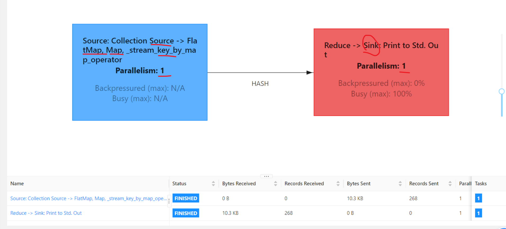

- 宽依赖&窄依赖

Spark

宽依赖：Shuffle Dependency

窄依赖：Narrow Dependency

Flink

宽依赖（重分区）：redistributing dependency

窄依赖（一对一）：one-to-one dependency

- 概念

Job：Flink的程序

Task：Flink的并行度

SubTask：每个任务中的子任务数

- Flink的四张图

```shell
#1.DataFlow Graph（数据流图）
Flink程序开发完以后，就会自动得到一个数据流图

#2.Job Graph（作业图）
Client进程对数据流图进行优化，主要是将算子合为算子链

#3.Execution Graph（执行图）
Client进程将作业图提交给到JobManager，JobManager拿到作业图以后，根据算子的并行度优化得到执行图

#4.Physical Graph（物理图）
JobManager将任务分配给到具体的TaskManager后，TaskManager拿到具体任务后，将执行图优化得到物理图。主要是告诉程序数据从什么地方来，中间的临时数据放在什么地方，最后的结果数据输出到什么地方去
```

- Slot槽&槽共享

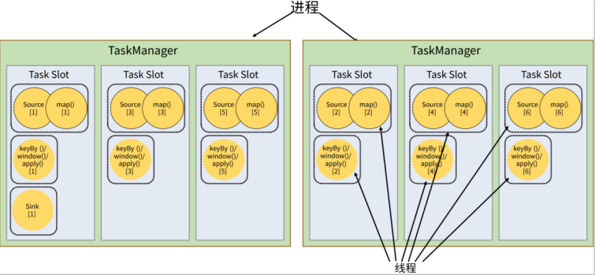

槽：slot，是集群的静态资源，在Standalone模式下，槽是预先配置的，不能更改。如果要改，改完后需要重启集群。

Yarn模式，可以通过启动多个TaskManager来动态初始化多个slot槽。

slot是运行Flink的单位。Flink任务必须运行在slot里。

slot和并行度是有关联的。并行度的数量不能超过可用slot的数量。

槽共享：一个槽可以运行不同Task下的多个SubTask。

`不同的Task下的相同SubTask，尽量在同一个slot上执行，这是为了提升程序的执行效率。这就是槽共享`

`相同的Task下的SubTask，一定不会在同一个slot上执行，这是为了充分利用集群资源，达到并行效果。`

