# Flink基础

## 今日内容介绍

* Flink运行时架构
* Flink代码案例


## Flink运行时架构

### 系统架构

官网架构链接：https://nightlies.apache.org/flink/flink-docs-release-1.15/docs/concepts/flink-architecture/

官网的架构图如下：


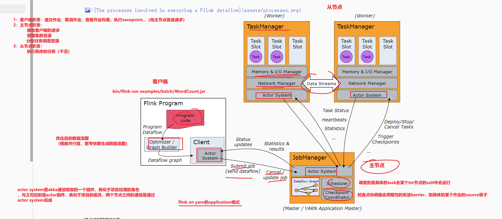

讲义的架构如下：

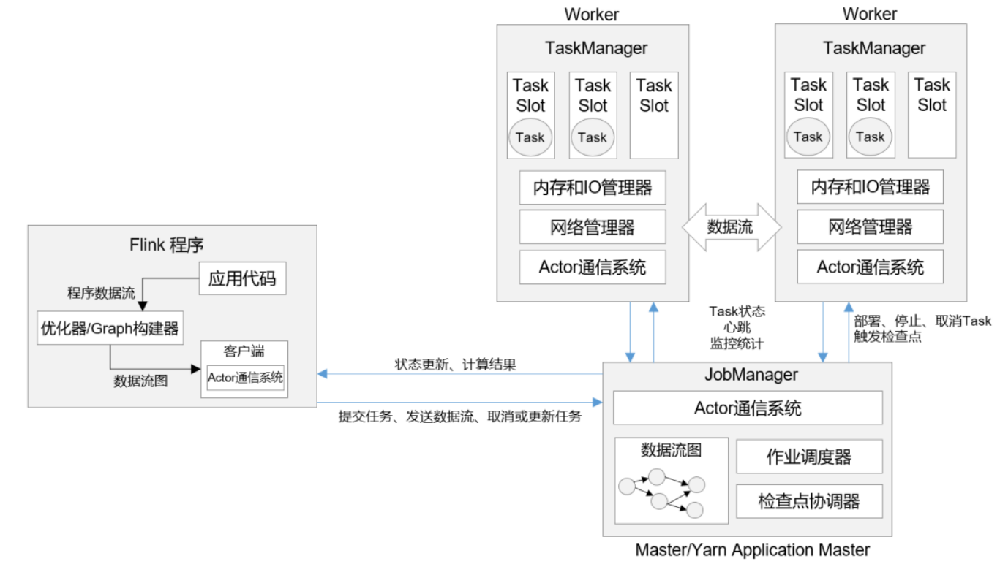

#### 通信

Spark的通信：在1.6版本及之前，用的是akka通信框架，在1.6之后，用的是netty。

Flink的通信：akka通信框架。

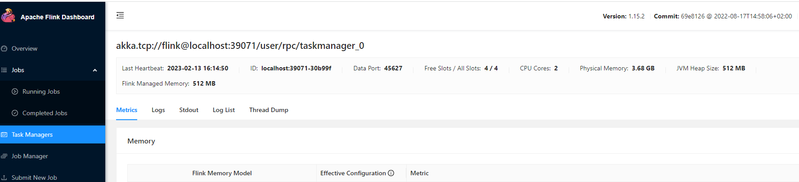

#### JobManager

JobManager：集群的主节点，负责集群的管理工作，从节点的管理，和从节点通信，任务提交，Checkpoint容错等。

JobManager这个角色有三个子组件：

- ResourceManager（负责Flink集群的资源管理器，和Yarn的ResourceManager没关系）
- JobMaster（任务调度，负责任务的调度）
- Dispacher（分发器，负责构建并启动WebUI（Standalone，session））

#### TaskManager

TaskManager：集群的从节点，负责该节点资源的管理，任务的运行，槽的分配，和主节点通信。

#### Scheduler

Spark：StageScheduler（粗粒度调度，逻辑调度）、TaskScheduler（细粒度调度，物理调度）

Flink：任务调度器，负责任务的调度，这里的调度就是把任务提交给集群运行。

#### Checkpoint Coordinator

负责集群的容错，checkpoint等。

#### Memory & IO Manager

内存和IO管理，负责该节点的内存和IO管理。

#### Network Manager

网络管理器。在任务执行过程中，可能需要从其他节点拉取数据时，要走网络管理器。

#### Client

只是负责任务的提交。提交成功后，其实可以断开了。在命令提交任务时，可以指定`-d`参数来配置。

如果配置了`-d`，则说明客户端和集群断开了。


### 任务提交流程

#### 抽象提交流程

不管是在什么模式下运行，大体上都是这个流程。

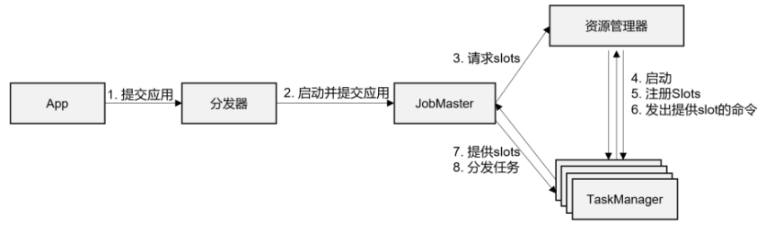

（1）任务提交给JobManager的Dispacher（分发器）

（2）Dispacher（分发器）收到任务后，启动JobMaster（调度器），并且把任务提交给JobMaster

（3）JobMaster收到任务后，它会找JobManager的ResourceManager（资源管理器）要资源

（4）不管采用什么方式，最终JobManager的ResourceManager（资源管理器）会向JobMaster提供资源（slot）

（5）JobMaster收到slot（槽）后，会把任务提交（分发）给TaskManager上运行

（6）TaskManager收到任务后，就会在slot里运行任务，任务运行完后，再根据提交模式销毁相应的进程

#### Standalone模式提交流程


（1）客户端提交任务到Dispacher（分发器）

（2）Dispacher分发器启动JobMaster

（3）JobMaster启动后，它会向JobManager的ResourceManager（资源管理器）请求资源（slot）

（4）JobManager的ResourceManager（资源管理器）向TaskManager请求资源（slot）

（5）TaskManager会向JobMaster提供资源（slot）

（6）JobMaster收到资源后，会向TaskManager提交（分发）任务

（7）TaskManager收到任务后，就在Slot上执行

（8）任务执行完后，释放资源

#### Yarn-session模式提交流程

如果需要把任务提交在Yarn-Session下运行，则分为2步：

- 初始化Yarn-session集群
- 提交任务

首先看第一步。

##### 初始化Session集群

（1）请求Yarn的ResourceManager（资源管理器）

（2）Yarn的ResourceManager收到请求后，会启动一个Container（容器），当然这个容器就是AppMaster

（3）这个AppMaster就是Flink的JobManager，这个JobManager会初始化Dispacher和ResourceManager（资源管理器）

这里还没有初始化TaskManager，因此集群没有slot资源


##### 提交任务


（1）客户端提交任务给JobManager（AppMaster）的分发器（Dispacher）

（2）分发器收到任务后，会启动JobMaster

（3）JobMaster启动后，会向JobManager（AppMaster）请求资源（slot）

（4）JobManager会向Yarn的ResourceManager请求资源

（5）Yarn的ResourceManager收到请求后，会在闲置的节点动态启动Container（TaskManager）

（6）Container启动成功后，会注册给AppMaster（JobManager）的ResourceManager

（7）Container会向AppMaster（JobManager）的JobMaster提供资源（slot）

（8）JobMaster会把任务分发给Container（TaskManager）去执行

（9）待任务执行完后，Container（TaskManager）会被AppMaster（JobManager）释放，最终留下JobManager，这个不会被销毁

#### Yarn-per-job模式提交流程


（1）客户端提交任务给Yarn的ResourceManager

（2）Yarn的ResourceManager收到请求后，会启动一个Container（AppMaster），这个AppMaster就是Flink的JobManager

（3）JobManager里有任务调度器和资源管理器，任务调度器就会开始调度任务，向JobManager的资源管理器申请资源

（4）JobManager的资源管理器它会向Yarn的ResourceManager申请资源

（5）Yarn的ResourceManager会动态启动Container（TaskManager），这些Container就是资源

（6）这些Container启动后，会反向注册给AppMaster（JobManager）

（7）这些Container向JobMaster提供资源

（8）JobMaster收到资源后，把任务分发给Container（TaskManager）去执行

（9）任务执行完后，AppMaster（JobManager）会把Container（TaskManager）注销

（10）AppMaster（JobManager）会向Yarn的ResourceManager注销自己

#### Yarn-application模式提交流程

这个模式和Yarn的Per-job模式任务提交类似，只是客户端进程启动的位置不同。

application模式下，客户端进行是在集群的某一个节点启动的。

Per-job模式下，客户端是在客户端提交的本地启动的。


### 一些重要的概念

#### 程序流程图

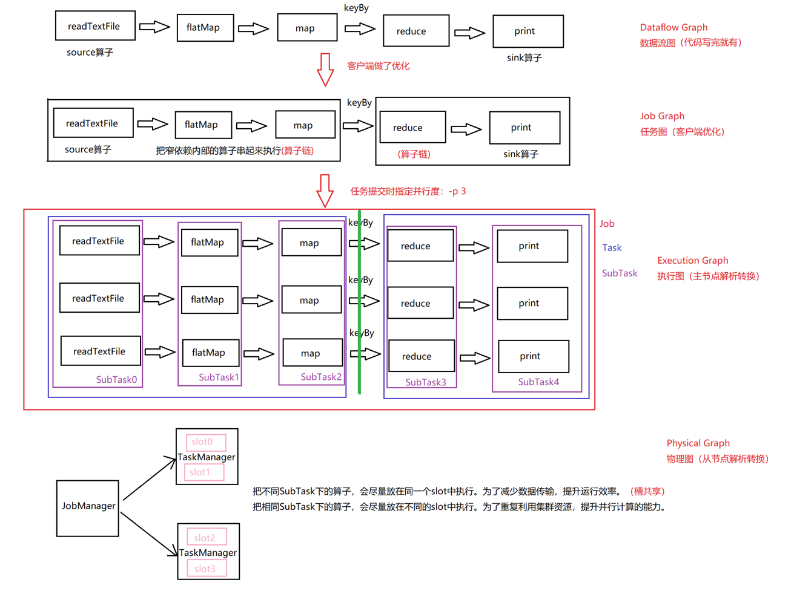

#### 一些概念

- 层级关系

Flink集群 -> Job（作业） ->  Task（任务） -> SubTask（子任务）

- 并行度

运行同时运行的任务数。Flink的并行度的设置如下：

```shell
#1.默认，在配置文件中，优先级最低
在flink-conf.yaml中可配置

#2.任务提交时指定
bin/flink run -p 3 xxxx.jar

#3.在全局代码中配置
env.setParallelism(1)

#4.在算子中，优先级最高
...sum(1).setParllelism(1)
```

- 算子&算子链

算子：每一个对数据处理的函数。

算子链：把窄依赖的算子串在一起执行。

- 宽依赖&窄依赖

Spark

宽依赖：Shuffle Dependency

窄依赖：Narrow Dependency

Flink

宽依赖：redistributing dependency

窄依赖：one-to-one dependency

- 概念

Job：Flink的程序

Task：Flink的并行度

SubTask：每个任务中的子任务数

- Flink的四张图

```shell
#1.DataFlow Graph（数据流图）
这个是程序代码写完就有了。

#2.Job Graph（作业图）
这个是客户端对数据流图的优化

#3.Execution Graph（执行图）
这个是JobManager对任务图的优化

#4.Physical Graph（物理图）
这个是TaskManager对执行图的优化
```

- 槽&槽共享

槽：slot，是集群的静态资源，在Standalone模式下，槽是预先配置的，不能更改。如果要改，改完后需要重启集群。

slot是运行Flink的单位。Flink任务必须运行在slot里。

slot和并行度是有关联的。并行度的数量不能超过slot的数量。

槽共享：一个槽可以运行多个SubTask。

`不同的Task下的相同SubTask，尽量在同一个slot上执行，这是为了提升程序的执行效率。`

`相同的Task下的SubTask，一定不会在同一个slot上执行，这是为了充分利用集群资源，达到并行效果。`


## Flink代码案例

### 需求

~~~shell
使用代码来实现Flink的wordcount案例。
~~~

### 分析

和SQL一样，略。

### 流式程序开发流程

~~~shell
#1.Obtain an execution environment
创建执行环境

#2.Load/create the initial data
加载数据源

#3.Specify transformations on this data
数据处理

#4.Specify where to put the results of your computations
指定目标端

#5.Trigger the program execution
启动流式任务
~~~


### 创建项目

#### 创建Python项目

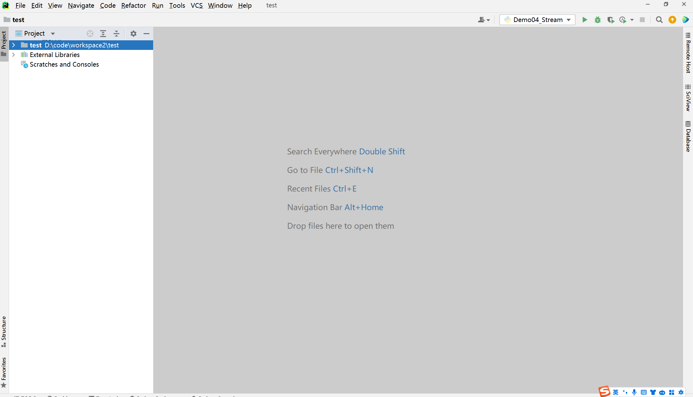

#### 创建Java项目

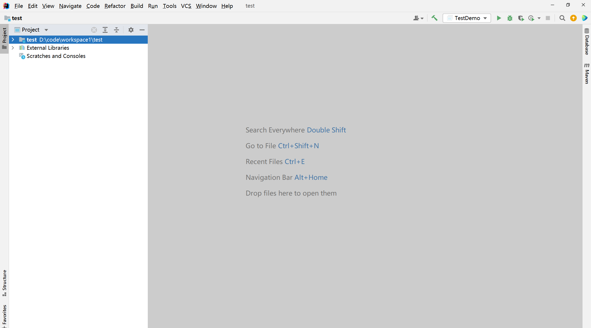

和Flink相关的依赖：

~~~xml
<!-- 指定仓库位置，依次为aliyun、apache和cloudera仓库 -->
    <repositories>
        <repository>
            <id>aliyun</id>
            <url>http://maven.aliyun.com/nexus/content/groups/public/</url>
        </repository>

        <repository>
            <id>apache</id>
            <url>https://repository.apache.org/content/repositories/snapshots/</url>
        </repository>

        <repository>
            <id>cloudera</id>
            <url>https://repository.cloudera.com/artifactory/cloudera-repos/</url>
        </repository>
    </repositories>

    <!--版本信息全局变量-->
    <properties>
        <project.build.sourceEncoding>UTF-8</project.build.sourceEncoding>
        <flink.version>1.15.4</flink.version>
        <flink.connector.jdbc.version>3.1.0-1.17</flink.connector.jdbc.version>
        <hive.version>3.1.2</hive.version>
        <hadoop.version>3.3.0</hadoop.version>
        <mysql.version>8.0.15</mysql.version>
        <log4j.version>2.17.1</log4j.version>
        <lombok.version>1.18.22</lombok.version>
        <kafka.version>3.0.0</kafka.version>
        <parquet-avro>1.12.2</parquet-avro>
        <junit4.version>4.13.2</junit4.version>
        <scala.version>2.12.12</scala.version>
        <!-- sdk -->
        <java.version>8</java.version>
        <scala.version>2.12</scala.version>
        <scala.binary.version>2.12</scala.binary.version>
        <maven.compiler.source>${java.version}</maven.compiler.source>
        <maven.compiler.target>${java.version}</maven.compiler.target>
    </properties>

    <dependencies>
        <dependency>
            <groupId>org.apache.flink</groupId>
            <artifactId>flink-java</artifactId>
            <version>${flink.version}</version>
        </dependency>

        <dependency>
            <groupId>org.apache.flink</groupId>
            <artifactId>flink-streaming-java</artifactId>
            <version>${flink.version}</version>
        </dependency>

        <dependency>
            <groupId>org.apache.flink</groupId>
            <artifactId>flink-table-api-java</artifactId>
            <version>${flink.version}</version>
        </dependency>

        <dependency>
            <groupId>org.apache.flink</groupId>
            <artifactId>flink-table-runtime</artifactId>
            <version>${flink.version}</version>
        </dependency>

        <dependency>
            <groupId>org.apache.flink</groupId>
            <artifactId>flink-table-common</artifactId>
            <version>${flink.version}</version>
        </dependency>

        <!-- flinkSql  用 scala 编程需要的依赖 -->
        <dependency>
            <groupId>org.apache.flink</groupId>
            <artifactId>flink-table-api-scala-bridge_2.12</artifactId>
            <version>${flink.version}</version>
        </dependency>
        <!-- flinkSql  用 java 编程需要的依赖 -->
        <dependency>
            <groupId>org.apache.flink</groupId>
            <artifactId>flink-table-api-java-bridge</artifactId>
            <version>${flink.version}</version>
        </dependency>
        <dependency>
            <groupId>org.apache.flink</groupId>
            <artifactId>flink-table-planner_${scala.binary.version}</artifactId>
            <version>${flink.version}</version>
            <exclusions>
                <exclusion>
                    <artifactId>slf4j-api</artifactId>
                    <groupId>org.slf4j</groupId>
                </exclusion>
            </exclusions>
        </dependency>
        <!-- flinkSql 解析json数据格式需要的依赖 -->
        <dependency>
            <groupId>org.apache.flink</groupId>
            <artifactId>flink-json</artifactId>
            <version>${flink.version}</version>
        </dependency>

        <!-- flinkSql 解析csv数据格式需要的依赖 -->
        <dependency>
            <groupId>org.apache.flink</groupId>
            <artifactId>flink-csv</artifactId>
            <version>${flink.version}</version>
        </dependency>

        <!-- flinkSql 整合hive所需-->
        <!--        <dependency>-->
        <!--            <groupId>org.apache.flink</groupId>-->
        <!--            <artifactId>flink-sql-connector-hive-3.1.2_2.11</artifactId>-->
        <!--            <version>${flink.version}</version>-->
        <!--        </dependency>-->

        <dependency>
            <groupId>org.apache.flink</groupId>
            <artifactId>flink-clients</artifactId>
            <version>${flink.version}</version>
        </dependency>


        <dependency>
            <groupId>org.apache.flink</groupId>
            <artifactId>flink-runtime-web</artifactId>
            <version>${flink.version}</version>
        </dependency>


        <!-- 如果要用scala做开发，则需要添加如下依赖  -->
        <!--        <dependency>-->
        <!--            <groupId>org.scala-lang</groupId>-->
        <!--            <artifactId>scala-library</artifactId>-->
        <!--            <version>${scala.version}</version>-->
        <!--        </dependency>-->


        <dependency>
            <groupId>org.apache.flink</groupId>
            <artifactId>flink-scala_2.12</artifactId>
            <version>${flink.version}</version>
        </dependency>


        <dependency>
            <groupId>org.apache.flink</groupId>
            <artifactId>flink-streaming-scala_2.12</artifactId>
            <version>${flink.version}</version>
        </dependency>
        <!-- 如果要用scala做开发，则需要添加如下依赖  -->


        <dependency>
            <groupId>org.apache.flink</groupId>
            <artifactId>flink-connector-kafka</artifactId>
            <version>${flink.version}</version>
        </dependency>
        <dependency>
            <groupId>org.apache.flink</groupId>
            <artifactId>flink-statebackend-rocksdb</artifactId>
            <version>${flink.version}</version>
        </dependency>

        <!-- 打印日志的jar包 -->
<!--        <dependency>-->
<!--            <groupId>org.slf4j</groupId>-->
<!--            <artifactId>slf4j-log4j12</artifactId>-->
<!--            <version>1.7.30</version>-->
<!--        </dependency>-->
        <dependency>
            <groupId>log4j</groupId>
            <artifactId>log4j</artifactId>
            <version>1.2.16</version>
        </dependency>

        <!-- 应用FileSink功能所需要的依赖 -->
        <dependency>
            <groupId>org.apache.flink</groupId>
            <artifactId>flink-parquet</artifactId>
            <version>${flink.version}</version>
        </dependency>
        <dependency>
            <groupId>org.apache.flink</groupId>
            <artifactId>flink-avro</artifactId>
            <version>${flink.version}</version>
        </dependency>
        <dependency>
            <groupId>org.apache.parquet</groupId>
            <artifactId>parquet-avro</artifactId>
            <version>${parquet-avro}</version>
        </dependency>
        <dependency>
            <groupId>org.apache.hadoop</groupId>
            <artifactId>hadoop-client</artifactId>
            <version>${hadoop.version}</version>
        </dependency>
        <dependency>
            <groupId>org.apache.flink</groupId>
            <artifactId>flink-connector-files</artifactId>
            <version>${flink.version}</version>
        </dependency>
        <!-- 应用StreamFileSink功能所需要的依赖 -->

        <!-- 应用jdbcSink功能所需要的依赖 -->
        <dependency>
            <groupId>org.apache.flink</groupId>
            <artifactId>flink-connector-jdbc</artifactId>
            <version>${flink.connector.jdbc.version}</version>
        </dependency>

        <dependency>
            <groupId>mysql</groupId>
            <artifactId>mysql-connector-java</artifactId>
            <version>8.0.27</version>
        </dependency>

        <!-- flink-cdc-mysql 连接器-->
        <dependency>
            <groupId>com.ververica</groupId>
            <artifactId>flink-connector-mysql-cdc</artifactId>
            <version>2.3.0</version>
        </dependency>

        <!-- 应用redisSink功能所需要的依赖 -->
        <dependency>
            <groupId>org.apache.bahir</groupId>
            <artifactId>flink-connector-redis_2.12</artifactId>
            <version>1.1-SNAPSHOT</version>
        </dependency>

        <dependency>
            <groupId>org.apache.flink</groupId>
            <artifactId>flink-statebackend-rocksdb</artifactId>
            <version>${flink.version}</version>
        </dependency>

        <dependency>
            <groupId>org.apache.flink</groupId>
            <artifactId>flink-cep</artifactId>
            <version>${flink.version}</version>
        </dependency>

        <dependency>
            <groupId>org.roaringbitmap</groupId>
            <artifactId>RoaringBitmap</artifactId>
            <version>0.9.28</version>
        </dependency>

        <!--lombok插件-->
        <dependency>
            <groupId>org.projectlombok</groupId>
            <artifactId>lombok</artifactId>
            <version>${lombok.version}</version>
        </dependency>

        <!-- https://mvnrepository.com/artifact/org.apache.flink/flink-examples-table -->
        <dependency>
            <groupId>org.apache.flink</groupId>
            <artifactId>flink-examples-table_2.12</artifactId>
            <version>${flink.version}</version>
        </dependency>


        <!--第三方工具包-->
        <dependency>
            <groupId>com.alibaba</groupId>
            <artifactId>fastjson</artifactId>
            <version>1.2.79</version>
        </dependency>
        <dependency>
            <groupId>cn.hutool</groupId>
            <artifactId>hutool-all</artifactId>
            <version>5.8.9</version>
        </dependency>
    </dependencies>


    <build>
        <sourceDirectory>src/main/java</sourceDirectory>
        <plugins>
            <!-- 编译插件 -->
            <plugin>
                <groupId>org.apache.maven.plugins</groupId>
                <artifactId>maven-compiler-plugin</artifactId>
                <version>3.5.1</version>
                <configuration>
                    <source>1.8</source>
                    <target>1.8</target>
                    <!--<encoding>${project.build.sourceEncoding}</encoding>-->
                </configuration>
            </plugin>

            <plugin>
                <groupId>org.apache.maven.plugins</groupId>
                <artifactId>maven-surefire-plugin</artifactId>
                <version>2.18.1</version>
                <configuration>
                    <useFile>false</useFile>
                    <disableXmlReport>true</disableXmlReport>
                    <includes>
                        <include>**/*Test.*</include>
                        <include>**/*Suite.*</include>
                    </includes>
                </configuration>
            </plugin>

            <plugin>
                <groupId>org.apache.avro</groupId>
                <artifactId>avro-maven-plugin</artifactId>
                <version>1.8.2</version>
                <executions>
                    <execution>
                        <phase>generate-sources</phase>
                        <goals>
                            <goal>schema</goal>
                        </goals>
                        <configuration>
                            <sourceDirectory>${project.basedir}/src/main/resources/</sourceDirectory>
                            <outputDirectory>${project.basedir}/src/main/java/</outputDirectory>
                        </configuration>
                    </execution>
                </executions>
            </plugin>

            <!-- 打包插件(会包含所有依赖) -->
            <plugin>
                <groupId>org.apache.maven.plugins</groupId>
                <artifactId>maven-shade-plugin</artifactId>
                <version>2.3</version>
                <executions>
                    <execution>
                        <phase>package</phase>
                        <goals>
                            <goal>shade</goal>
                        </goals>
                        <configuration>
                            <filters>
                                <filter>
                                    <artifact>*:*</artifact>
                                    <excludes>
                                        <!--
                                        zip -d learn_spark.jar META-INF/*.RSA META-INF/*.DSA META-INF/*.SF -->
                                        <exclude>META-INF/*.SF</exclude>
                                        <exclude>META-INF/*.DSA</exclude>
                                        <exclude>META-INF/*.RSA</exclude>
                                    </excludes>
                                </filter>
                            </filters>
                            <transformers>
                                <transformer implementation="org.apache.maven.plugins.shade.resource.ManifestResourceTransformer">
                                    <!-- 设置jar包的入口类(可选) -->
                                    <mainClass></mainClass>
                                </transformer>
                            </transformers>
                        </configuration>
                    </execution>
                </executions>
            </plugin>
        </plugins>
    </build>
~~~


### 实现

前提条件：无论是在远程Linux环境还是本地Windows环境。要想成功开发Python版Flink，都需要有Python环境。

~~~shell
#1.保证有Python3.6、3.7或者3.8
python -V

#2.安装flink依赖
python -m pip install apache-flink==1.15.4 -i https://pypi.tuna.tsinghua.edu.cn/simple
~~~

由于Windows平台之前安装过JDK和Python解释器，因此，这里我们采用本地的Windows平台来运行。

故而需要在本地Windows平台上安装flink的依赖。

#### Python版

##### 批案例

~~~python
#1.构建流式执行环境
from pyflink.common import Types
from pyflink.datastream import StreamExecutionEnvironment, RuntimeExecutionMode

env = StreamExecutionEnvironment.get_execution_environment()
env.set_parallelism(1)
#2.数据source
input_ds = env.read_text_file("file:///D:/code/workspace2/test1/data/words.txt")
#3.数据处理
result_ds = input_ds.flat_map(lambda x:x.split(" "))\
    .map(lambda word:(word,1),output_type=Types.TUPLE([Types.STRING(),Types.INT()])).\
    key_by(lambda x:x[0])\
    .reduce(lambda x,y:(x[0],x[1] + y[1]))
#4.数据Sink
result_ds.print()
#5.启动流式任务
env.execute()

~~~


##### 流案例

~~~python
#1.构建流式执行环境
from pyflink.common import Types
from pyflink.datastream import StreamExecutionEnvironment, RuntimeExecutionMode, DataStream
from pyflink.table import DataTypes

env = StreamExecutionEnvironment.get_execution_environment()
env.set_parallelism(1)
# env.set_runtime_mode(RuntimeExecutionMode.STREAMING)
#2.数据source
input_ds = DataStream(env._j_stream_execution_environment.socketTextStream("node1",9999))
#3.数据处理
result_ds = input_ds.flat_map(lambda x:x.split(" "))\
    .map(lambda word:(word,1),output_type=Types.TUPLE([Types.STRING(),Types.INT()])).\
    key_by(lambda x:x[0])\
    .reduce(lambda x,y:(x[0],x[1] + y[1]))
#4.数据Sink
result_ds.print()
#5.启动流式任务
env.execute()
~~~

##### SQL案例

~~~python
from pyflink.datastream import StreamExecutionEnvironment
from pyflink.table import StreamTableEnvironment

#1.流式执行环境
env = StreamExecutionEnvironment.get_execution_environment()
t_env = StreamTableEnvironment.create(env)
env.add_jars("file:///D:/code/workspace2/test1/jars/flink-examples-table_2.12-1.15.4.jar")
#2.source表
t_env.execute_sql("""
create table source_table (
word string
) with (
'connector' = 'socket',
'hostname' = 'node1',
'port' = '9999',
'format' = 'csv'
)
""")

#3.Sink表
t_env.execute_sql("""
create table sink_table (
word string,
cnt bigint
) with (
'connector' = 'print'
) 
""")

#4.数据处理
t_env.execute_sql("""
insert into sink_table 
select word,count(1) from source_table group by word
""").wait()

#5.启动流式任务
env.execute()
~~~


#### Java版

##### 批案例

~~~java
package day01;

import org.apache.flink.api.common.RuntimeExecutionMode;
import org.apache.flink.api.common.functions.FlatMapFunction;
import org.apache.flink.api.common.functions.MapFunction;
import org.apache.flink.api.java.functions.KeySelector;
import org.apache.flink.api.java.tuple.Tuple2;
import org.apache.flink.streaming.api.datastream.DataStreamSource;
import org.apache.flink.streaming.api.datastream.KeyedStream;
import org.apache.flink.streaming.api.datastream.SingleOutputStreamOperator;
import org.apache.flink.streaming.api.environment.StreamExecutionEnvironment;
import org.apache.flink.util.Collector;

/**
 * @author: itcast
 * @date: 2023/2/13 10:15
 * @desc: 需求：从socket中读取单词，进行词频统计。
 */
public class Demo02_WordCountStream {
    public static void main(String[] args) throws Exception {
        //1.构建流式执行环境
        StreamExecutionEnvironment env = StreamExecutionEnvironment.getExecutionEnvironment();
        env.setParallelism(1);
        env.setRuntimeMode(RuntimeExecutionMode.BATCH);

        //2.数据源Source
        //读取Socket数据源
        //socket：hostname+port
        DataStreamSource<String> source = env.socketTextStream("node1", 9999);

        //3.数据处理Transformation
        //3.1 对单词进行扁平化处理
        /**
         * FlatMapFunction两个参数说明：
         * Type of the input elements.输入的元素，这里是很多的单词
         * Type of the returned elements.输出的元素，这里是每一个单词
         */
        SingleOutputStreamOperator<String> flatMapData = source.flatMap(new FlatMapFunction<String, String>() {
            @Override
            public void flatMap(String value, Collector<String> out) throws Exception {
                String[] words = value.split(",");
                for (String word : words) {
                    out.collect(word);
                }
            }
        });
        //3.2对扁平化处理的数据进行map转换操作,转成(单词,1)
        /**
         * MapFunction参数说明：
         * Type of the input elements.输入的参数，这里就是一个一个的单词
         * Type of the returned elements.输出的参数，Tuple2(单词,1)
         */
        SingleOutputStreamOperator<Tuple2<String, Integer>> mapData = flatMapData.map(new MapFunction<String, Tuple2<String, Integer>>() {
            @Override
            public Tuple2<String, Integer> map(String value) throws Exception {
                return Tuple2.of(value, 1);
            }
        });
        //3.2对map转换的数据进行keyBy分组操作
        /**
         * KeySelector的参数说明：
         * Type of objects to extract the key from.输入的元素，这里就是Tuple2<String, Integer>
         *  Type of key.指定用来分组的元素，这里就是String
         */
        KeyedStream<Tuple2<String, Integer>, String> keyByData = mapData.keyBy(new KeySelector<Tuple2<String, Integer>, String>() {
            @Override
            public String getKey(Tuple2<String, Integer> value) throws Exception {
                return value.f0;
            }
        });
        //3.4对分组后的数据进行聚合
        //positionToSum，指定用来求和的参数的位置，这里指定为1即可，也就是把单词出现的次数进行sum
        SingleOutputStreamOperator<Tuple2<String, Integer>> result = keyByData.sum(1);


        //4.数据输出Sink
        result.print();

        //5.启动流式任务
        env.execute("WordCount Stream Demo");
    }
}

~~~


##### 流案例

~~~java
package day01;

import org.apache.flink.api.common.RuntimeExecutionMode;
import org.apache.flink.api.common.functions.FlatMapFunction;
import org.apache.flink.api.common.functions.MapFunction;
import org.apache.flink.api.java.functions.KeySelector;
import org.apache.flink.api.java.tuple.Tuple2;
import org.apache.flink.streaming.api.datastream.DataStreamSource;
import org.apache.flink.streaming.api.datastream.KeyedStream;
import org.apache.flink.streaming.api.datastream.SingleOutputStreamOperator;
import org.apache.flink.streaming.api.environment.StreamExecutionEnvironment;
import org.apache.flink.util.Collector;

/**
 * @author: itcast
 * @date: 2023/2/13 10:15
 * @desc: 需求：从socket中读取单词，进行词频统计。
 */
public class Demo02_WordCountStream {
    public static void main(String[] args) throws Exception {
        //1.构建流式执行环境
        StreamExecutionEnvironment env = StreamExecutionEnvironment.getExecutionEnvironment();
        env.setParallelism(1);
        env.setRuntimeMode(RuntimeExecutionMode.STREAMING);

        //2.数据源Source
        //读取Socket数据源
        //socket：hostname+port
        DataStreamSource<String> source = env.socketTextStream("node1", 9999);

        //3.数据处理Transformation
        //3.1 对单词进行扁平化处理
        /**
         * FlatMapFunction两个参数说明：
         * Type of the input elements.输入的元素，这里是很多的单词
         * Type of the returned elements.输出的元素，这里是每一个单词
         */
        SingleOutputStreamOperator<String> flatMapData = source.flatMap(new FlatMapFunction<String, String>() {
            @Override
            public void flatMap(String value, Collector<String> out) throws Exception {
                String[] words = value.split(",");
                for (String word : words) {
                    out.collect(word);
                }
            }
        });
        //3.2对扁平化处理的数据进行map转换操作,转成(单词,1)
        /**
         * MapFunction参数说明：
         * Type of the input elements.输入的参数，这里就是一个一个的单词
         * Type of the returned elements.输出的参数，Tuple2(单词,1)
         */
        SingleOutputStreamOperator<Tuple2<String, Integer>> mapData = flatMapData.map(new MapFunction<String, Tuple2<String, Integer>>() {
            @Override
            public Tuple2<String, Integer> map(String value) throws Exception {
                return Tuple2.of(value, 1);
            }
        });
        //3.2对map转换的数据进行keyBy分组操作
        /**
         * KeySelector的参数说明：
         * Type of objects to extract the key from.输入的元素，这里就是Tuple2<String, Integer>
         *  Type of key.指定用来分组的元素，这里就是String
         */
        KeyedStream<Tuple2<String, Integer>, String> keyByData = mapData.keyBy(new KeySelector<Tuple2<String, Integer>, String>() {
            @Override
            public String getKey(Tuple2<String, Integer> value) throws Exception {
                return value.f0;
            }
        });
        //3.4对分组后的数据进行聚合
        //positionToSum，指定用来求和的参数的位置，这里指定为1即可，也就是把单词出现的次数进行sum
        SingleOutputStreamOperator<Tuple2<String, Integer>> result = keyByData.sum(1);


        //4.数据输出Sink
        result.print();

        //5.启动流式任务
        env.execute("WordCount Stream Demo");
    }
}

~~~

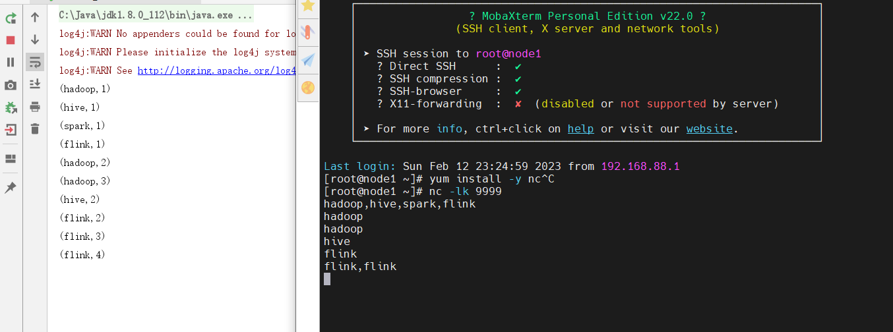


##### Lambda版本

~~~java
package day01;

import org.apache.flink.api.common.typeinfo.Types;
import org.apache.flink.api.java.tuple.Tuple2;
import org.apache.flink.streaming.api.datastream.DataStreamSource;
import org.apache.flink.streaming.api.datastream.SingleOutputStreamOperator;
import org.apache.flink.streaming.api.environment.StreamExecutionEnvironment;
import org.apache.flink.util.Collector;

/**
 * @author: itcast
 * @date: 2023/2/13 11:07
 * @desc: 需求：从socket中读取单词，进行词频统计。使用Lambda表达式来实现。
 */
public class Demo03_WordCountStream_03 {
    public static void main(String[] args) throws Exception {
        //1.构建流式执行环境
        StreamExecutionEnvironment env = StreamExecutionEnvironment.getExecutionEnvironment();
        env.setParallelism(1);

        //2.数据源source
        DataStreamSource<String> source = env.socketTextStream("node1", 9999);

        //3.数据处理transformation
        /**
         * FlatMapFunction参数：
         * Type of the input elements：输入的参数，在这里输入的参数是String
         * Type of the returned elements.输出的参数，在这里输出的参数String
         * Lambda表达式，会针对数据转换处理的算子进行类型擦除（erasure），所以，在转换后，类似是不确定的。因此报错了。
         * 所以，当算子出现类型变化后，我们需要显示指定变化后的结果的类型，需要使用returns函数来指定。
         * 比如：flatMap，map等。
         * keyBy它是分组的函数，sum是求和的函数，这种函数不会对数据进行转换。所以它们不需要指定返回值的类型。
         */
        SingleOutputStreamOperator<Tuple2<String, Integer>> result = source.flatMap((String value, Collector<String> out) -> {
            String[] words = value.split(",");
            for (String word : words) {
                out.collect(word);
            }
        }).returns(Types.STRING).map((String value) -> {
            return Tuple2.of(value, 1);
        }).returns(Types.TUPLE(Types.STRING,Types.INT)).keyBy((Tuple2<String, Integer> value) -> {
            return value.f0;
        }).sum(1);

        //4.数据输出sink
        result.print();

        //5.启动流式任务
        env.execute();

    }
}

~~~

截图如下：

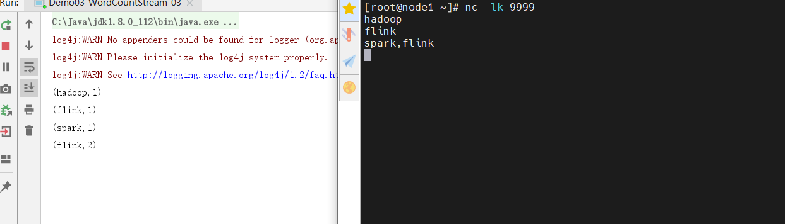

##### Lambda最终版

~~~java
package day01;

import org.apache.flink.api.common.typeinfo.Types;
import org.apache.flink.api.java.tuple.Tuple2;
import org.apache.flink.streaming.api.datastream.DataStreamSource;
import org.apache.flink.streaming.api.datastream.SingleOutputStreamOperator;
import org.apache.flink.streaming.api.environment.StreamExecutionEnvironment;
import org.apache.flink.util.Collector;

import java.util.Arrays;

/**
 * @author: itcast
 * @date: 2023/2/13 11:30
 * @desc: 需求：读取socket数据源，进行词频统计。Lambda最终版。
 */
public class Demo05_WordCountStream_04 {
    public static void main(String[] args) throws Exception {
        //1.构建流式执行环境
        StreamExecutionEnvironment env = StreamExecutionEnvironment.getExecutionEnvironment();
        env.setParallelism(1);

        //2.数据源source
        DataStreamSource<String> source = env.socketTextStream("node1", 9999);

        //3.数据处理transformation
        /**
         * Lambda表达式最终版：
         * （1）对于Lambda表达式中的参数，如果只有一个，则可以删除参数的前面和参数的小括号
         * （2）对于Lambda表达式中的实现体，如果只有一行代码则可以把实现体中的大括号（花括号）删除。代码更简洁了。
         */
        SingleOutputStreamOperator<Tuple2<String, Integer>> result = source.flatMap((String value, Collector<String> out) ->
            Arrays.stream(value.split(",")).forEach(out::collect)
        ).returns(Types.STRING).map(value -> Tuple2.of(value, 1))
                .returns(Types.TUPLE(Types.STRING, Types.INT))
                .keyBy(value -> value.f0).sum(1);

        //4.数据输出sink
        result.print();

        //5.启动流式任务
        env.execute();
    }
}

~~~

截图如下：

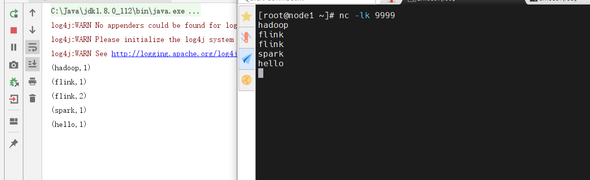


##### SQL

~~~java
package day01;

import org.apache.flink.streaming.api.environment.StreamExecutionEnvironment;
import org.apache.flink.table.api.bridge.java.StreamTableEnvironment;

/**
 * @author: itcast
 * @date: 2023/2/13 14:54
 * @desc: 需求：读取socket单词，进行词频统计。
 * 需要使用SQL来实现。
 */
public class Demo07_WordCountSQL {
    public static void main(String[] args) throws Exception {
        //1.构建流式执行环境
        StreamExecutionEnvironment env = StreamExecutionEnvironment.getExecutionEnvironment();
        StreamTableEnvironment tEnv = StreamTableEnvironment.create(env);
        tEnv.getConfig().set("parallelism.default","1");

        //2.构建source表
        /**
         * 源表的schema
         *      |   word    |
         *      |   hello   |
         *      |   hive    |
         *      |   spark   |
         *      |   flink   |
         */

        tEnv.executeSql("create table source_table (" +
                "word string" +
                ") with (" +
                "'connector' = 'socket'," +
                "'hostname' = 'node1'," +
                "'port' = '9999'," +
                "'format' = 'csv'" +
                ")");


        //3.构建sink表
        /**
         * 目标表的schema：
         *      |   word    |   counts   |
         *      |   hello   |      1     |
         *      |   hive    |      1     |
         *      |   spark   |      1     |
         *      |   flink   |      1     |
         */
        tEnv.executeSql("create table sink_table (" +
                "word string," +
                "counts bigint" +
                ") with (" +
                "'connector' = 'print" +
                "')");


        //4.数据处理transformation
        tEnv.executeSql("insert into sink_table " +
                "select word,count(*) from source_table group by word").await();

        //5.启动流式任务
        env.execute();

    }
}

~~~

截图如下：

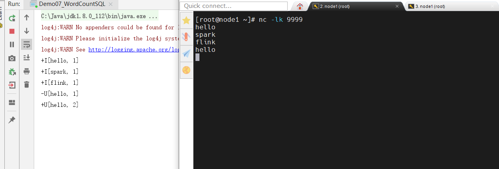

### 提交运行

#### 开源提交

Flink支持两种方式的提交：

* 通过命令行的方式
* 通过WebUI界面

##### 命令行的方式

先由Maven插件打包，打完后target目录下有2个jar包，一个胖包，一个瘦包。

~~~shell
#1.胖包
包括源码编译后的class文件、配置文件、依赖jar包，可以在没有Flink的环境下运行。

#2.瘦包
包括源码编译后的class文件，配置文件。只能在带有Flink的环境下运行。
~~~

由于开源和阿里云都有自身的Flink环境，因此我们只需要使用瘦包即可。

提交命令：

~~~shell
#1.Java提交
bin/flink run -c day01.Demo02_WordCountStream  original-sz35_flinkbase-1.0-SNAPSHOT.jar

#2.Python提交
/export/server/flink/bin/flink run -py Demo04_Stream.py
~~~

运行成功截图如下：

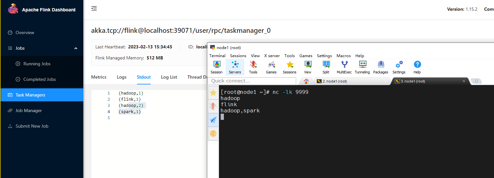

> 小结：
>
> 提交的时候，要注意：
>
> （1）给-c参数。并且类名需要带上包名。
>
> （2）要开启socket

##### 通过WebUI界面

直接通过8081页面的`Submit New Job`菜单操作即可。

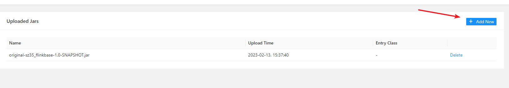

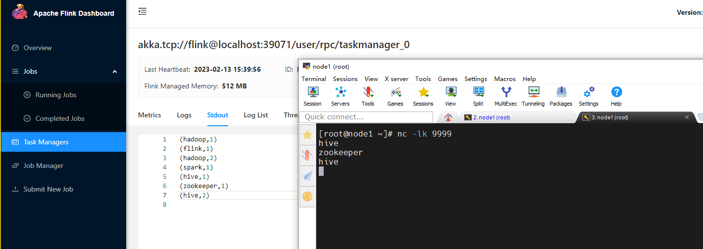

小结：

- java作业可以通过命令行和webui递交

- python的作业只能通过命令行递交

#### 阿里云提交

阿里云支持Python或者Java代码的提交。

##### Java代码提交

首先把Java代码打成一个jar包。然后回到Flink页面点击部署作业即可，如下图：

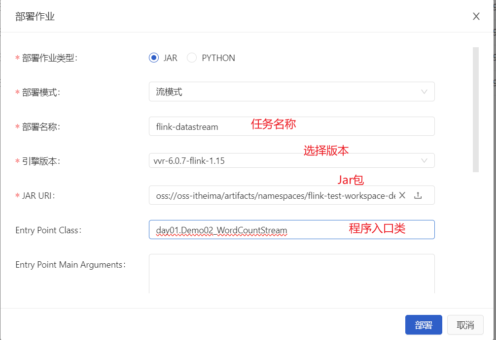

输入完信息后，点击部署。

##### Python代码提交

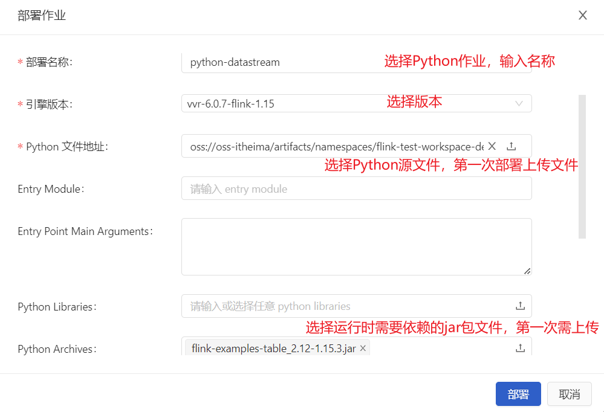

输入完信息后，点击部署。


