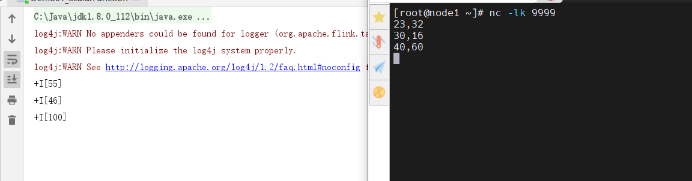
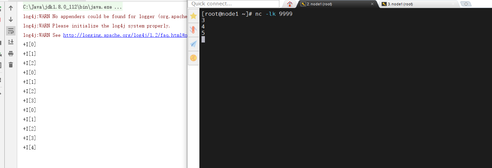
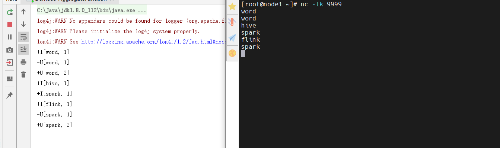
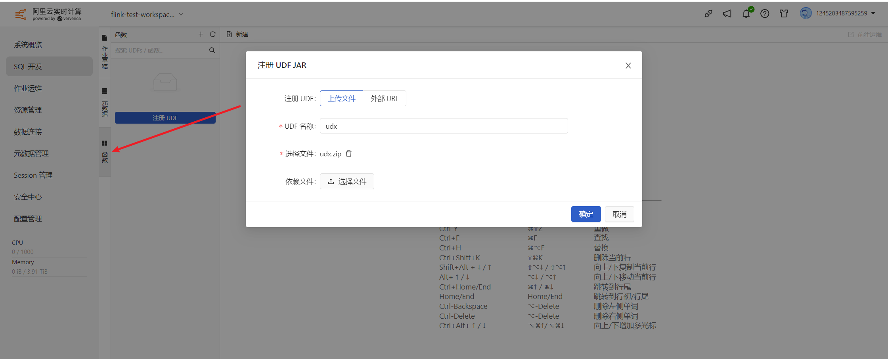
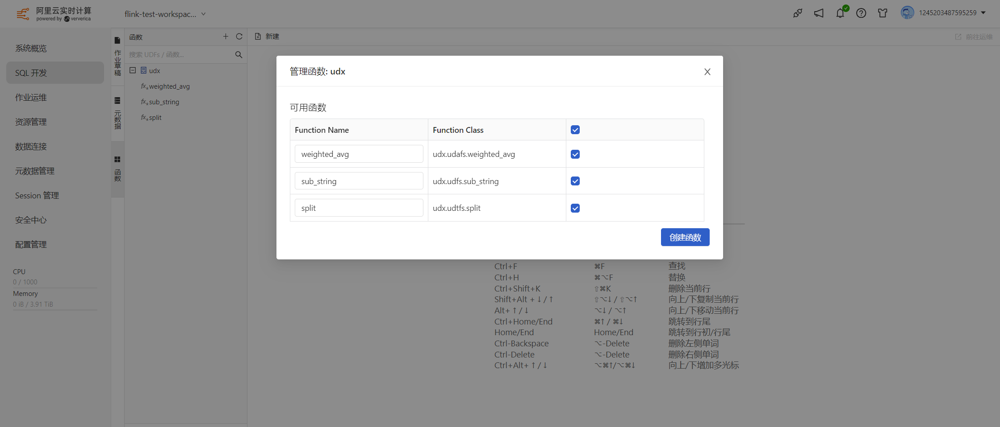
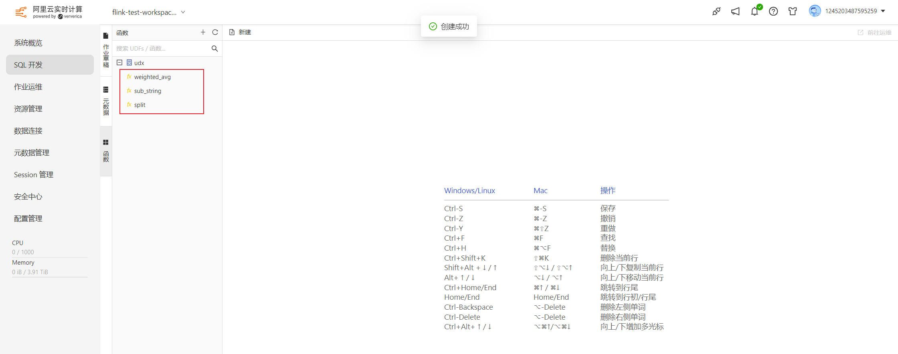
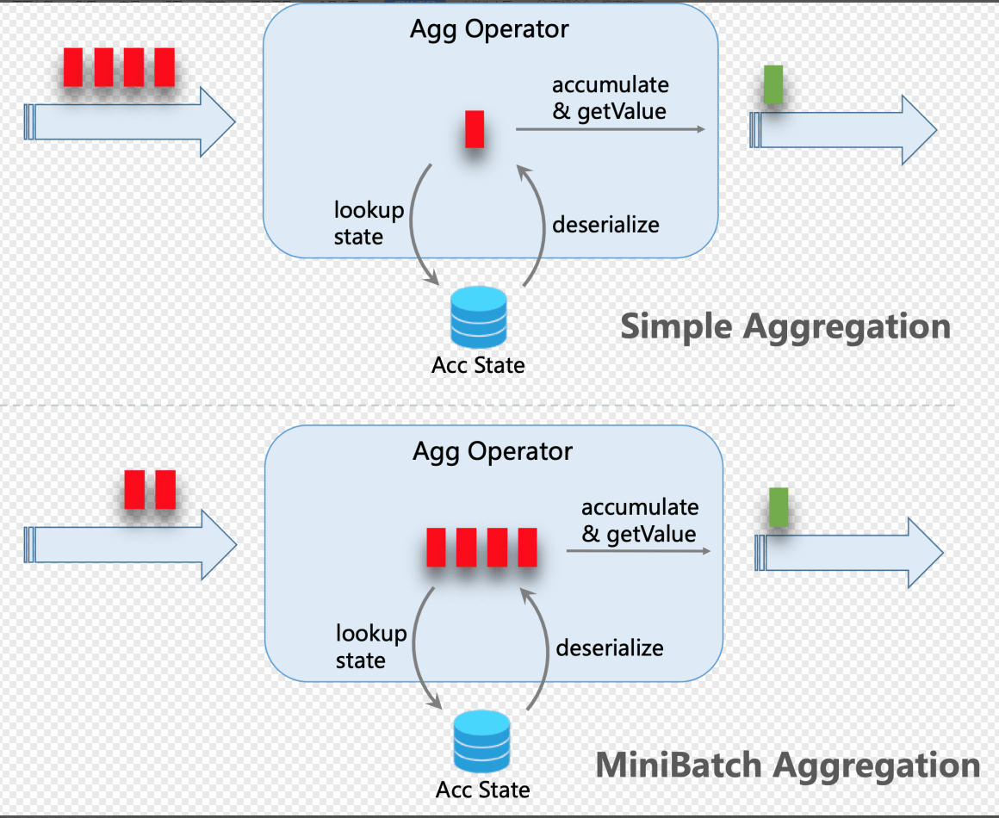
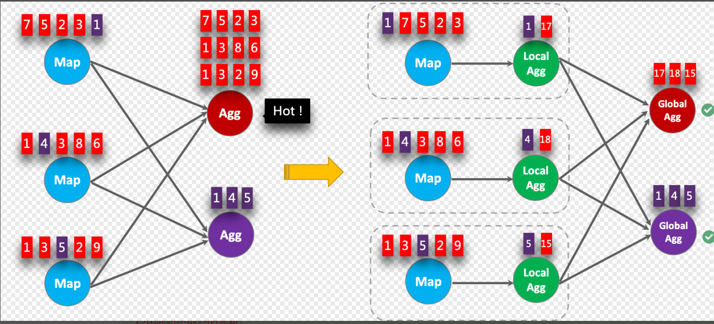
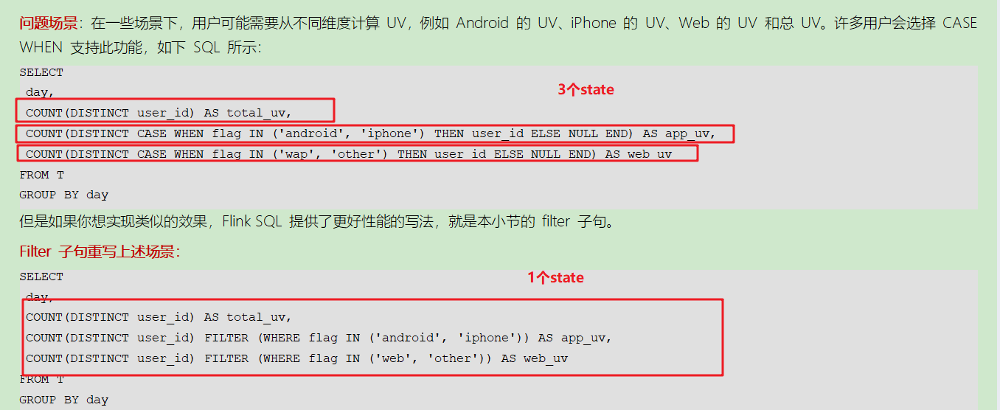

# Flink基础

## 今日课程内容介绍

* UDF（自定义函数）
  * UDSF（标量函数）
  * UDTF（表生成函数）
  * UDAF（聚合函数）
* FlinkSQL进阶
  * 任务参数配置
  * SQL调优
  * 阿里云Flink调优

* 综合案例

## UDF

### 概述

UDF，user defined function，用户自定义函数。

官网如下：

https://nightlies.apache.org/flink/flink-docs-release-1.15/docs/dev/table/functions/udfs/

Flink的UDF函数可以分为如下几种类型：

* Scalar Function（标量函数）
* Table Function（表值函数）
* Aggregate Function（聚合函数）

ScalarFunction：一进一出

TableFunction：一进多出

AggregateFunction：多进一出

### Scalar Function

Scalar Function，就是一进一出的函数。比如map方法。

#### 需求

~~~shell
实现一个类似于两数之和的sum函数，函数名：mySum
优先采用SQL 来实现。
~~~

#### 实现

##### Python版

~~~python
from pyflink.datastream import StreamExecutionEnvironment, DataStream

#1.
from pyflink.table import StreamTableEnvironment, DataTypes
from pyflink.table.udf import udf

env = StreamExecutionEnvironment.get_execution_environment()
t_env = StreamTableEnvironment.create(env)
#2.
env.add_jars("file:///D:/code/workspace2/test/jars/flink-examples-table_2.12-1.15.4.jar")
t_env.execute_sql("""
create table source_table (
    num1 int,
    num2 int
) with (
    'connector' = 'socket',
    'hostname' = 'node1',
    'port' = '9999',
    'format' = 'csv'
)
""")
#3.
t_env.execute_sql("""
create table sink_table (
    num bigint
) with (
    'connector' = 'print'
)
""")
#4.
@udf(result_type=DataTypes.BIGINT())
def mySum(num1,num2):
    return num1 + num2
t_env.create_temporary_system_function("mySum",mySum)
t_env.execute_sql("""
insert into sink_table select mySum(num1,num2) from source_table
""").wait()

#5.
env.execute()
~~~

##### Java版

~~~java
package day07;

import org.apache.flink.streaming.api.environment.StreamExecutionEnvironment;
import org.apache.flink.table.api.bridge.java.StreamTableEnvironment;
import org.apache.flink.table.functions.ScalarFunction;

/**
 * @author: itcast
 * @date: 2023/2/20 11:19
 * @desc: 实现一个类似于两数之和的sum函数，函数名：mySum
 * 优先采用SQL 来实现。
 */
public class Demo01_ScalarFunction {
    public static void main(String[] args) throws Exception {
        //1.构建流式执行环境
        StreamExecutionEnvironment env = StreamExecutionEnvironment.getExecutionEnvironment();
        StreamTableEnvironment tEnv = StreamTableEnvironment.create(env);
        env.setParallelism(1);

        //2.数据源source表,数据源来自于socket
        /**
         * source表的schema如下：
         *      |   num1    |   num2   |
         *      |   23      |   32     |
         *      |   30      |   16     |
         *      |   40      |   60     |
         */
        tEnv.executeSql("create table source (" +
                "num1 int," +
                "num2 int" +
                ") with (" +
                "'connector' = 'socket'," +
                "'hostname' = 'node1'," +
                "'port' = '9999'," +
                "'format' = 'csv'" +
                ")");

        //3.数据输出sink表
        /**
         *      |   num     |
         *      |    55     |
         *      |    46     |
         *      |    100    |
         *
         */
        tEnv.executeSql("create table sink (" +
                "num int" +
                ") with (" +
                "'connector' = 'print'" +
                ")");

        //4.数据处理
        //4.1把函数注册到Flink程序中
        tEnv.createTemporaryFunction("mySum",MyScalarFunction.class);
        tEnv.executeSql("insert into sink select mySum(num1,num2) from source").await();

        //5.启动流式任务
        env.execute();

    }

    /**
     * 自定义的类，必须extend ScalarFunction。
     */
    public static class MyScalarFunction extends ScalarFunction {
        /**
         * ScalarFunction必须实现一个eval方法。eval方法的实现体可以自定义。
         * @param a 第一个参数，这里就是num1
         * @param b 第二个参数，这里就是num2
         * @return 两数之和
         */
        public Integer eval(Integer a, Integer b) {
            return a + b;
        }
    }
}

~~~

截图如下：

### Table Function

Table Function，表值函数，一进多出的函数。类似于Hive中的UDTF。

#### 需求

~~~shell
实现一个类似于flatMap的功能（explode）的功能。数据源来自于socket。函数名：myFlatMap。
~~~

#### 实现

##### Python版

~~~python
from pyflink.datastream import StreamExecutionEnvironment, DataStream

#1.
from pyflink.table import StreamTableEnvironment, DataTypes
from pyflink.table.udf import udf, udtf

env = StreamExecutionEnvironment.get_execution_environment()
t_env = StreamTableEnvironment.create(env)
#2.
env.add_jars("file:///D:/code/workspace2/test/jars/flink-examples-table_2.12-1.15.4.jar")
t_env.execute_sql("""
create table source_table (
    num int
) with (
    'connector' = 'socket',
    'hostname' = 'node1',
    'port' = '9999',
    'format' = 'csv'
)
""")
#3.
t_env.execute_sql("""
create table sink_table (
    num bigint
) with (
    'connector' = 'print'
)
""")

#4.
@udtf(result_types=DataTypes.BIGINT())
def myFlatMap(num):
    return range(num)

t_env.create_temporary_function("myFlatMap",myFlatMap)
t_env.execute_sql("""
insert into sink_table select x from source_table left join lateral table(myFlatMap(num)) as tmp(x) on true
""").wait()

#5.
env.execute()
~~~

##### Java版

~~~java
package day07;

import org.apache.flink.streaming.api.environment.StreamExecutionEnvironment;
import org.apache.flink.table.api.bridge.java.StreamTableEnvironment;
import org.apache.flink.table.functions.TableFunction;

/**
 * @author: itcast
 * @date: 2023/2/20 11:49
 * @desc: 需求：实现一个类似于flatMap的功能（explode）的功能。数据源来自于socket。函数名：myFlatMap。
 */
public class Demo02_TableFunction {
    public static void main(String[] args) throws Exception {
        //1.构建流式执行环境
        StreamExecutionEnvironment env = StreamExecutionEnvironment.getExecutionEnvironment();
        StreamTableEnvironment tEnv = StreamTableEnvironment.create(env);
        tEnv.getConfig().set("parallelism.default","1");

        //2.数据源source表
        /**
         * source的schema：
         *      |   num     |
         *      |    3      |
         *      |    4      |
         *      |    5      |
         */
        tEnv.executeSql("create table source(" +
                "num int" +
                ") with (" +
                "'connector' = 'socket'," +
                "'hostname' = 'node1'," +
                "'port' = '9999'," +
                "'format' = 'csv'" +
                ")");

        //3.数据输出sink表
        /**
         * sink表的schema：
         *      |   num     |
         *      |    0      |
         *      |    1      |
         *      |    2      |
         *      |    0      |
         *      |    1      |
         *      |    2      |
         *      |    3      |
         */
        tEnv.executeSql("create table sink(" +
                "num int" +
                ") with (" +
                "'connector' = 'print'" +
                ")");

        //4.数据处理transformation
        tEnv.createTemporaryFunction("myFlatMap",MyTableFunction.class);
        tEnv.executeSql("insert into sink select t1 from source left join lateral table(myFlatMap(num)) as tmp(t1)  on true").await();

        //5.启动流式任务
        env.execute();

    }

    /**
     * 自定义的类，必须extend TableFunction，才能实现一斤多出的功能
     */
    public static class MyTableFunction extends TableFunction<Integer> {
        /**
         * TableFunction中必须实现的函数
         * @param number 输入的参数
         */
        public void eval(Integer number) {
            for (int i = 0; i < number;i ++) {
                collect(i);
            }
        }
    }
}

~~~

截图如下：

### Aggregate Function

Aggregate Function，聚合函数，是多进一出的函数，类似于Hive的UDAF函数。

#### 需求

~~~shell
需求：实现一个类似于count的函数，数据源为socket，函数名：myCount
~~~

#### 实现

##### Python版

~~~python
from pyflink.common import Row
from pyflink.datastream import StreamExecutionEnvironment

#1.
from pyflink.table import StreamTableEnvironment, AggregateFunction
from pyflink.table.types import DataType, DataTypes
from pyflink.table.udf import ACC, T, udaf

env = StreamExecutionEnvironment.get_execution_environment()
t_env = StreamTableEnvironment.create(env)
t_env.get_config().set("parallelism.default","1")
#2.
env.add_jars("file:///D:/code/workspace2/test/jars/flink-examples-table_2.12-1.15.4.jar")
t_env.execute_sql("""
create table source_table (
    word string
) with (
    'connector' = 'socket',
    'hostname' = 'node1',
    'port' = '9999',
    'format' = 'csv'
)
""")
#3.
t_env.execute_sql("""
create table sink_table (
    word string,
    num bigint
) with (
    'connector' = 'print'
)
""")

#4.
class MyAggregateFunction(AggregateFunction):

    def get_value(self, accumulator: ACC) -> T:
        return accumulator[0]

    def create_accumulator(self) -> ACC:
        return [0]

    def accumulate(self, accumulator: ACC, *args):
        accumulator[0] += 1

    def retract(self, accumulator: ACC, *args):
        accumulator[0] -= 1

    def merge(self, accumulator: ACC, accumulators):
        for other_acc in accumulators:
            accumulator[0] += other_acc[0]

    def get_result_type(self) -> DataType:
        return DataTypes.BIGINT()

    def get_accumulator_type(self) -> DataType:
        return DataTypes.BIGINT()

t_env.create_temporary_function("myCount",MyAggregateFunction())
t_env.execute_sql("""
insert into sink_table select word,myCount() from source_table group by word
""").wait()

#5.
env.execute()
~~~

##### Java版

~~~java
package day07;

import org.apache.flink.streaming.api.environment.StreamExecutionEnvironment;
import org.apache.flink.table.api.bridge.java.StreamTableEnvironment;
import org.apache.flink.table.functions.AggregateFunction;

/**
 * @author: itcast
 * @date: 2023/2/20 14:39
 * @desc: 需求：实现一个类似于count的函数，数据源为socket，函数名：myCount
 */
public class Demo03_AggregateFunction {
    public static void main(String[] args) throws Exception {
        //1.构建流式执行环境
        StreamExecutionEnvironment env = StreamExecutionEnvironment.getExecutionEnvironment();
        StreamTableEnvironment tEnv = StreamTableEnvironment.create(env);
        tEnv.getConfig().set("parallelism.default","1");

        //2.数据源source表
        /**
         *      |   word    |
         *      |   hello   |
         *      |   hive    |
         *      |   spark   |
         */
        tEnv.executeSql("create table source(" +
                "word string" +
                ") with (" +
                "'connector' = 'socket'," +
                "'hostname' = 'node1'," +
                "'port' = '9999'," +
                "'format' = 'csv'" +
                ")");

        //3.数据输出sink表
        /**
         *      |   word    |     cnt     |
         *      |   hello   |      1      |
         *      |   hive    |      1      |
         *      |   spark   |      1      |
         *      |   XXXX    |      N      |
         */
        tEnv.executeSql("create table sink (" +
                "word string," +
                "cnt int" +
                ") with (" +
                "'connector' = 'print'" +
                ")");

        //4.数据处理transformation
        tEnv.createTemporaryFunction("myCount",MyAggregateFunction.class);
        tEnv.executeSql("insert into sink select word,myCount(1) from source group by word").await();

        //5.启动流式任务
        env.execute();

    }

    /**
     * AggregateFunction需要两个泛型：
     * final result type of the aggregation：最终的结果类型，在这里是Integer
     * intermediate result type during the aggregation：在聚合期间的中间结果类型
     */
    public static class MyAggregateFunction extends AggregateFunction<Integer,MyAccumulator> {

        /**
         * 创建累加器
         * @return 返回累加器对象
         */
        @Override
        public MyAccumulator createAccumulator() {
            return new MyAccumulator();
        }

        /**
         * 进行累加计算
         * @param accumulator 累加的中间结果，能够保存计算中的中间结果
         * @param num 新的数据的结果
         */
        public void accumulate(MyAccumulator accumulator, Integer num) {
            accumulator.count = accumulator.count + 1;
        }

        /***
         * 获取程序的计算结果
         * @param accumulator 累加器，结果保存在该累加器中
         * @return 返回最终的结果
         */
        @Override
        public Integer getValue(MyAccumulator accumulator) {
            return accumulator.count;
        }

    }

    /**
     * 自定义的累加器的类，用来实现程序的累加计算
     * 累加器可以根据需求自定义，字段及类型也是如此。
     */
    public static class MyAccumulator {
        //默认的count数量为0
        public Integer count = 0;
    }
}

~~~

截图如下：

> 小结：
>
> 聚合函数需要继承AggregateFunction类，同时至少实现3个方法：
>
> createAccumulator
>
> accumulate
>
> getValue

### 阿里云UDF

#### 创建UDF函数

选择SQL开发 -> 函数选项，上传压缩包，如下图：

点击确定，如下图：

点击创建函数，提示创建成功，如下图：

到此，则函数创建成功。

#### 使用UDF函数

* sub_string函数

~~~shell
#1.创建表
CREATE TABLE function_udf(
  a VARCHAR,
  b INT,
  c INT
) WITH (
  'connector' = 'socket',
  'hostname' = '172.21.185.92',
  'port' = '9999',
  'format' = 'csv'
);

#2.查询SQL
SELECT sub_string(a,2,5) FROM function_udf;

#3.数据输入
123|456,4,2
12|3456,7,1
~~~

* split函数

~~~shell
#1.创建表
同上，略

#2.查询SQL
SELECT a,b,c,d,e
FROM function_udf,lateral table(split(a)) as T(d,e);

#3.数据输入
123|456,4,2
12|3456,7,1
~~~

* weight_avg函数

~~~shell
#1.创建表
同上，略。

#2.查询SQL
SELECT weighted_avg(b,c) FROM function_udf;

#3.数据输入
123|456,4,2
12|3456,7,1
~~~

> 说明：查询结果是以c字段为权重的b字段当前数据和历史数据的均值。

## FlinkSQL能力进阶

这里只是FlinkSQL的调优。

### 任务参数配置

#### 运行时参数

* 异步维度join

~~~shell
# 默认值：100
# 值类型：Integer
# 流批任务：流、批任务都支持
# 用处：异步 lookup join 中最大的异步 IO 执行数目
table.exec.async-lookup.buffer-capacity: 100
~~~

* 开启微批

~~~shell
# 默认值：false
# 值类型：Boolean
# 流批任务：流任务支持
# 用处：MiniBatch 优化是一种专门针对 unbounded 流任务的优化（即非窗口类应用），其机制是在 `允许的延迟时间间隔内` 以及 `达到最大缓冲记录数` 时触发以减少 `状态访问` 的优化，从而节约处理时间。下面两个参数一个代表 `允许的延迟时间间隔`，另一个代表 `达到最大缓冲记录数`。
table.exec.mini-batch.enabled: false

# 默认值：0 ms
# 值类型：Duration
# 流批任务：流任务支持
# 用处：此参数设置为多少就代表 MiniBatch 机制最大允许的延迟时间。注意这个参数要配合 `table.exec.mini-batch.enabled` 为 true 时使用，而且必须大于 0 ms
table.exec.mini-batch.allow-latency: 0 ms

# 默认值：-1
# 值类型：Long
# 流批任务：流任务支持
# 用处：此参数设置为多少就代表 MiniBatch 机制最大缓冲记录数。注意这个参数要配合 `table.exec.mini-batch.enabled` 为 true 时使用，而且必须大于 0
table.exec.mini-batch.size: -1
~~~

* 并行度的设置

~~~shell
# 默认值：-1
# 值类型：Integer
# 流批任务：流、批任务都支持
# 用处：可以用此参数设置 Flink SQL 中算子的并行度，这个参数的优先级 `高于` StreamExecutionEnvironment 中设置的并行度优先级，如果这个值设置为 -1，则代表没有设置，会默认使用 StreamExecutionEnvironment 设置的并行度
table.exec.resource.default-parallelism: -1
~~~

* 数据异常时的处理方式

~~~shell
# 默认值：ERROR
# 值类型：Enum【ERROR, DROP】
# 流批任务：流、批任务都支持
# 用处：表上的 NOT NULL 列约束强制不能将 NULL 值插入表中。Flink 支持 `ERROR`（默认）和 `DROP` 配置。默认情况下，当 NULL 值写入 NOT NULL 列时，Flink 会产生运行时异常。用户可以将行为更改为 `DROP`，直接删除此类记录，而不会引发异常。
table.exec.sink.not-null-enforcer: ERROR
~~~

* 上游cdc去重

~~~shell
# 默认值：false
# 值类型：Boolean
# 流批任务：流任务
# 用处：接入了 CDC 的数据源，上游 CDC 如果产生重复的数据，可以使用此参数在 Flink 数据源算子进行去重操作，去重会引入状态开销
table.exec.source.cdc-events-duplicate: false
~~~

* 设置空闲等待

~~~shell
# 默认值：0 ms
# 值类型：Duration
# 流批任务：流任务
# 用处：如果此参数设置为 60 s，当 Source 算子在 60 s 内未收到任何元素时，这个 Source 将被标记为临时空闲，此时下游任务就不依赖此 Source 的 Watermark 来推进整体的 Watermark 了。
# 默认值为 0 时，代表未启用检测源空闲。
table.exec.source.idle-timeout: 0 ms
~~~

* 设置状态有效期

~~~shell
# 默认值：0 ms
# 值类型：Duration
# 流批任务：流任务
# 用处：指定空闲状态（即未更新的状态）将保留多长时间。尤其是在 unbounded 场景中很有用。默认 0 ms 为不清除空闲状态
table.exec.state.ttl: 0 ms
~~~

上述的参数中，常用的有：`开启微批`和`设置状态有效期`。

#### 优化器参数

* 开启两阶段聚合

~~~shell
#  默认值：AUTO
#  值类型：String
#  流批任务：流、批任务都支持
#  用处：聚合阶段的策略。和 MapReduce 的 Combiner 功能类似，可以在数据 shuffle 前做一些提前的聚合，可以选择以下三种方式
#  TWO_PHASE：强制使用具有 localAggregate 和 globalAggregate 的两阶段聚合。请注意，如果聚合函数不支持优化为两个阶段，Flink 仍将使用单阶段聚合。
#  两阶段优化在计算 count，sum 时很有用，但是在计算 count distinct 时需要注意，key 的稀疏程度，如果 key 不稀疏，那么很可能两阶段优化的效果会适得其反
#  ONE_PHASE：强制使用只有 CompleteGlobalAggregate 的一个阶段聚合。
#  AUTO：聚合阶段没有特殊的执行器。选择 TWO_PHASE 或者 ONE_PHASE 取决于优化器的成本。
#  
#  注意！！！：此优化在窗口聚合中会自动生效，但是在 unbounded agg 中需要与 minibatch 参数相结合使用才会生效
table.optimizer.agg-phase-strategy: AUTO
~~~

* 开启分桶

~~~shell
#  默认值：false
#  值类型：Boolean
#  流批任务：流任务
#  用处：避免 group by 计算 count distinct\sum distinct 数据时的 group by 的 key 较少导致的数据倾斜，比如 group by 中一个 key 的 distinct 要去重 500w 数据，而另一个 key 只需要去重 3 个 key，那么就需要先需要按照 distinct 的 key 进行分桶。将此参数设置为 true 之后，下面的 table.optimizer.distinct-agg.split.bucket-num 可以用于决定分桶数是多少
#  后文会介绍具体的案例
table.optimizer.distinct-agg.split.enabled: false

#  默认值：1024
#  值类型：Integer
#  流批任务：流任务
#  用处：避免 group by 计算 count distinct 数据时的 group by 较少导致的数据倾斜。加了此参数之后，会先根据 group by key 结合 hash_code（distinct_key）进行分桶，然后再自动进行合桶。
#  后文会介绍具体的案例
table.optimizer.distinct-agg.split.bucket-num: 1024
~~~

* 重用执行计划

~~~shell
#  默认值：true
#  值类型：Boolean
#  流批任务：流任务
#  用处：如果设置为 true，Flink 优化器将会尝试找出重复的自计划并重用。默认为 true 不需要改动
table.optimizer.reuse-sub-plan-enabled: true
~~~

* souce资源重用

~~~shell
#  默认值：true
#  值类型：Boolean
#  流批任务：流任务
#  用处：如果设置为 true，Flink 优化器会找出重复使用的 table source 并且重用。默认为 true 不需要改动
table.optimizer.reuse-source-enabled: true
~~~

* 开启谓词下推

~~~shell
#  默认值：true
#  值类型：Boolean
#  流批任务：流任务
#  用处：如果设置为 true，Flink 优化器将会做谓词下推到 FilterableTableSource 中，将一些过滤条件前置，提升性能。默认为 true 不需要改动
table.optimizer.source.predicate-pushdown-enabled: true
~~~

运行时参数，用的多的：`两阶段聚合`和`分桶`。

#### 表参数

* 开启DML同步

~~~shell
#  默认值：false
#  值类型：Boolean
#  流批任务：流、批任务都支持
#  用处：DML SQL（即执行 insert into 操作）是异步执行还是同步执行。默认为异步（false），即可以同时提交多个 DML SQL 作业，如果设置为 true，则为同步，第二个 DML 将会等待第一个 DML 操作执行结束之后再执行
table.dml-sync: false
~~~

* 设置方法的最大长度不超过64KB

~~~shell
#  默认值：64000
#  值类型：Integer
#  流批任务：流、批任务都支持
#  用处：Flink SQL 会通过生产 java 代码来执行具体的 SQL 逻辑，但是 jvm 限制了一个 java 方法的最大长度不能超过 64KB，但是某些场景下 Flink SQL 生产的 java 代码会超过 64KB，这时 jvm 就会直接报错。因此此参数可以用于限制生产的 java 代码的长度来避免超过 64KB，从而避免 jvm 报错。
table.generated-code.max-length: 64000
~~~

* 本地时区

~~~shell
#  默认值：default
#  值类型：String
#  流批任务：流、批任务都支持
#  用处：在使用天级别的窗口时，通常会遇到时区问题。举个例子，Flink 开一天的窗口，默认是按照 UTC 零时区进行划分，那么在北京时区划分出来的一天的窗口是第一天的早上 8:00 到第二天的早上 8:00，但是实际场景中想要的效果是第一天的早上 0:00 到第二天的早上 0:00 点。因此可以将此参数设置为 GMT+08:00 来解决这个问题。
table.local-time-zone: default
~~~

* 编译器

~~~shell
#  默认值：default
#  值类型：Enum【BLINK、OLD】
#  流批任务：流、批任务都支持
#  用处：Flink SQL planner，默认为 BLINK planner，也可以选择 old planner，但是推荐使用 BLINK planner
table.planner: BLINK
~~~

* SQL方言

~~~shell
#  默认值：default
#  值类型：String
#  流批任务：流、批任务都支持
#  用处：Flink 解析一个 SQL 的解析器，目前有 Flink SQL 默认的解析器和 Hive SQL 解析器，其区别在于两种解析器支持的语法会有不同，比如 Hive SQL 解析器支持 between and、rlike 语法，Flink SQL 不支持
table.sql-dialect: default
~~~

### SQL调优

#### mini-batch聚合

SQL中参数配置如下：

~~~shell
# 默认值：false
# 值类型：Boolean
# 流批任务：流任务支持
# 用处：MiniBatch 优化是一种专门针对 unbounded 流任务的优化（即非窗口类应用），其机制是在 `允许的延迟时间间隔内` 以及 `达到最大缓冲记录数` 时触发以减少 `状态访问` 的优化，从而节约处理时间。下面两个参数一个代表 `允许的延迟时间间隔`，另一个代表 `达到最大缓冲记录数`。
table.exec.mini-batch.enabled: false

# 默认值：0 ms
# 值类型：Duration
# 流批任务：流任务支持
# 用处：此参数设置为多少就代表 MiniBatch 机制最大允许的延迟时间。注意这个参数要配合 `table.exec.mini-batch.enabled` 为 true 时使用，而且必须大于 0 ms
table.exec.mini-batch.allow-latency: 0 ms

# 默认值：-1
# 值类型：Long
# 流批任务：流任务支持
# 用处：此参数设置为多少就代表 MiniBatch 机制最大缓冲记录数。注意这个参数要配合 `table.exec.mini-batch.enabled` 为 true 时使用，而且必须大于 0
table.exec.mini-batch.size: -1
~~~

#### 两阶段聚合

FlinkSQL中的配置：

~~~shell
#  默认值：AUTO
#  值类型：String
#  流批任务：流、批任务都支持
#  用处：聚合阶段的策略。和 MapReduce 的 Combiner 功能类似，可以在数据 shuffle 前做一些提前的聚合，可以选择以下三种方式
#  TWO_PHASE：强制使用具有 localAggregate 和 globalAggregate 的两阶段聚合。请注意，如果聚合函数不支持优化为两个阶段，Flink 仍将使用单阶段聚合。
#  两阶段优化在计算 count，sum 时很有用，但是在计算 count distinct 时需要注意，key 的稀疏程度，如果 key 不稀疏，那么很可能两阶段优化的效果会适得其反
#  ONE_PHASE：强制使用只有 CompleteGlobalAggregate 的一个阶段聚合。
#  AUTO：聚合阶段没有特殊的执行器。选择 TWO_PHASE 或者 ONE_PHASE 取决于优化器的成本。
#  
#  注意！！！：此优化在窗口聚合中会自动生效，但是在 unbounded agg 中需要与 minibatch 参数相结合使用才会生效
table.optimizer.agg-phase-strategy: AUTO
~~~

#### 分桶

FlinkSQL的配置如下：

~~~shell
#  默认值：false
#  值类型：Boolean
#  流批任务：流任务
#  用处：避免 group by 计算 count distinct\sum distinct 数据时的 group by 的 key 较少导致的数据倾斜，比如 group by 中一个 key 的 distinct 要去重 500w 数据，而另一个 key 只需要去重 3 个 key，那么就需要先需要按照 distinct 的 key 进行分桶。将此参数设置为 true 之后，下面的 table.optimizer.distinct-agg.split.bucket-num 可以用于决定分桶数是多少
#  后文会介绍具体的案例
table.optimizer.distinct-agg.split.enabled: false

#  默认值：1024
#  值类型：Integer
#  流批任务：流任务
#  用处：避免 group by 计算 count distinct 数据时的 group by 较少导致的数据倾斜。加了此参数之后，会先根据 group by key 结合 hash_code（distinct_key）进行分桶，然后再自动进行合桶。
#  后文会介绍具体的案例
table.optimizer.distinct-agg.split.bucket-num: 1024
~~~

#### filter去重

~~~sql
--普通的写法
SELECT
 day,
 COUNT(DISTINCT user_id) AS total_uv,
 COUNT(DISTINCT CASE WHEN flag IN ('android', 'iphone') THEN user_id ELSE NULL END) AS app_uv,
 COUNT(DISTINCT CASE WHEN flag IN ('wap', 'other') THEN user_id ELSE NULL END) AS web_uv
FROM T
GROUP BY day

--filter优写法
SELECT
 day,
 COUNT(DISTINCT user_id) AS total_uv,
 COUNT(DISTINCT user_id) FILTER (WHERE flag IN ('android', 'iphone')) AS app_uv,
 COUNT(DISTINCT user_id) FILTER (WHERE flag IN ('web', 'other')) AS web_uv
FROM T
GROUP BY day
~~~

filter子句能够将三个状态合并成一个大的状态。方便程序的读取等操作。能够提升效率。

> 小结：
>
> 用的多的计算前2个。

### 阿里云Flink调优

Flink支持智能调优和定时调优两种调优模式。

#### 智能调优

简单理解，就是阿里云Flink智能来进行调优。默认会从并发度和内存来进行调优。

- 智能调优会调整作业的并发度来满足作业流量变化所需要的吞吐。

  智能调优会监控消费源头数据的延迟变化情况、TaskManager（TM） CPU实际使用率和各个算子处理数据能力来调整作业的并发度。详情如下：

  - 作业延迟Delay指标正常（不超过60s），不修改当前作业并发。
  - 作业延迟Delay指标超过默认阈值60s，分以下两种情况来调整并发度：
    - 延迟正在下降，不进行并发度调整。
    - 延迟增加并且连续上升3分钟（默认值）， 默认调整作业并发度到当前实际TPS的两倍，但不超过设置最大的资源（默认值为64 CU）。
  - 作业不存在延迟指标。
    - 作业某VERTEX节点连续6分钟实际处理数据时间占比超过80%，调大作业并发度使得SLOT使用率降低到50%，但不超过设置最大的资源（默认为64 CU）。
    - 所有TM的平均利用率连续6分钟超过80%，调高并发度使TM的CPU使用率降低到50%。
  - 所有TM的最大CPU使用率连续24小时低于20%，且VERTEX的实际处理数据时间低于20%时，调低作业的并发度使CPU和VERTEX实际处理的时间占比提高到50%。

- 智能调优也会监控作业的内存使用和Failover情况，来调整作业的内存配置。详情如下：

  - 在JobManager GC频繁或者发生OOM异常时，会调高JM的内存，默认最大调整到16 GiB。
  - 在TM GC频繁或者发生OOM异常、HeartBeatTimeout异常时，会调高TM的内存，默认最大调整到16 GiB。
  - 在TM内存使用率超过95%时，会调大TM的内存。
  - 在TM的实际内存使用率连续24小时低于30%时，降低TM内存的配置，默认最小调整到1.6 GiB。

#### 定时调优

定时调优计划描述了资源和时间点的对应关系，一个定时调优计划中可以包含多组资源和时间点的关系。在使用定时调优计划时，您需要明确知道各个时间段的资源使用情况，根据业务时间区间特征，设置对应的资源。

例如，某业务全天早09：00~19：00是业务高峰，19：00到第二天09：00是业务低峰。此时您可以使用定时调优功能，在高峰时间段使用30 CU，在业务低峰时使用10 CU。

> 说明：1 CU=1核CPU+4 GiB内存+20 GB本地存储（放置日志、系统检查点等信息）

## 综合案例

### 需求

~~~shell
使用FlinkSQL加载MySQL的数据，并实现实时商品销售数据统计，把结果写入到MySQL中。
~~~

### 分析

### 实现

在MySQL中准备test库和两张数据源表，并导入数据到表中。

~~~sql
--创建库
create database test;

--切换数据库
use test;

-- 源表;
CREATE TABLE `source_table` (
  `id` int unsigned NOT NULL AUTO_INCREMENT,
  `good_id` int DEFAULT NULL,
  `amount` int DEFAULT NULL,
  `record_time` timestamp NULL DEFAULT NULL,
  PRIMARY KEY (`id`)
);

-- 维度表;
CREATE TABLE `dimension_table` (
  `good_id` int unsigned NOT NULL,
  `good_name` varchar(256) DEFAULT NULL,
  `good_price` int DEFAULT NULL,
  PRIMARY KEY (`good_id`)
);

~~~

数据在`insert.txt`文件中。

#### 创建FlinkSQL映射表

~~~shell
#1.创建source映射表
CREATE TABLE mysql_source_table(
    id INT NOT NULL PRIMARY KEY NOT ENFORCED,
    record_time TIMESTAMP(3),
    good_id INT,
    amount INT,
    WATERMARK FOR record_time AS record_time-INTERVAL '5' SECOND
)WITH(
    'connector' = 'mysql',
    'hostname' = 'rm-cn-g4t3jfwyw0001v.rwlb.rds.aliyuncs.com',
    'port' = '3306',
    'username' = 'itheima',
    'password' = 'Itheima666',
    'database-name' = 'test',
    'table-name' = 'source_table'
);

#2.创建dimension映射表
CREATE TABLE dimension_table (
    good_id INT NOT NULL PRIMARY KEY NOT ENFORCED,
    good_name VARCHAR(256),
    good_price INT
)WITH(
    'connector' = 'mysql',
    'hostname' = 'rm-cn-g4t3jfwyw0001v.rwlb.rds.aliyuncs.com',
    'port' = '3306',
    'username' = 'itheima',
    'password' = 'Itheima666',
    'database-name' = 'test',
    'table-name' = 'dimension_table'
);

#MySQL中新增一条数据，看看FlinkSQL中的结果是否有变化
INSERT INTO `source_table` (`id`, `good_id`, `amount`, `record_time`)
VALUE (1001, 1, 19, '2023-06-09 11:59:34');
~~~

#### 处理数据逻辑

~~~shell
SELECT
  good_id,
  tumble_start(record_time, interval '15' seconds) AS record_timestamp,
  sum(amount) AS total_amount
FROM mysql_source_table
GROUP BY tumble(record_time, interval '15' seconds),good_id;
 
 
SELECT
  record_timestamp,
  good_name,
  total_amount * good_price AS revenue
FROM
  (SELECT
     good_id,
     tumble_start(record_time, interval '15' seconds) AS record_timestamp,
     sum(amount) AS total_amount
    FROM mysql_source_table
    GROUP BY tumble(record_time,interval '15'seconds),good_id
  )AS tumbled_table
LEFT JOIN dimension_table ON tumbled_table.good_id = dimension_table.good_id;
~~~

#### 保存结果

~~~shell
#1.MySQL创建结果表;
CREATE TABLE `sink_table` (
  `record_timestamp` timestamp ,
  `good_name` varchar(128),
  `sell_amount` int,
  PRIMARY KEY (`record_timestamp`)
);

#2.FlinkSQL创建MySQL结果表的映射表
CREATE TABLE mysql_sink_table (
    record_timestamp TIMESTAMP(3) NOT NULL PRIMARY KEY NOT ENFORCED,
    good_name VARCHAR(128),
    sell_amount INT
) WITH (
  'connector' = 'jdbc',
  'url' = 'jdbc:mysql://rm-cn-g4t3jfwyw0001v.rwlb.rds.aliyuncs.com:3306/test',
  'table-name' = 'sink_table',
  'username' = 'itheima',
  'password' = 'Itheima666'
);

#3.执行数据任务处理逻辑
INSERT INTO mysql_sink_table 
SELECT 
  record_timestamp, 
  good_name, 
  total_amount * good_price AS revenue 
FROM 
  (SELECT 
      good_id, 
      tumble_start(record_time, interval '15' seconds) AS record_timestamp, 
      sum(amount) AS total_amount 
    FROM mysql_source_table 
    GROUP BY tumble (record_time, interval '15' seconds), good_id) AS tumbled_table 
LEFT JOIN dimension_table ON tumbled_table.good_id = dimension_table.good_id;
~~~

