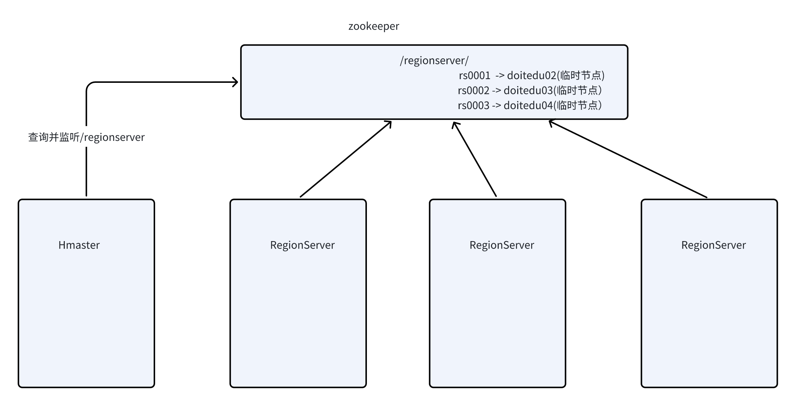
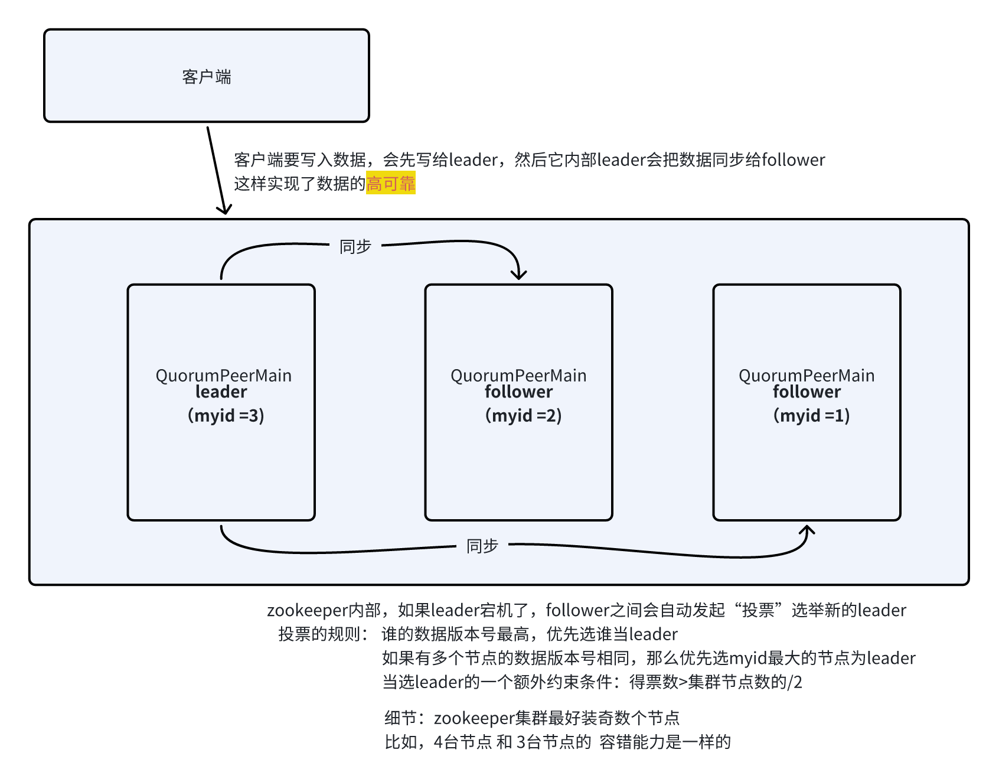

# 1. zookeeper是什么？

ZooKeeper是一个**开源的分布式应用程序的协调服务**

从设计模式角度来理解：zookeeper是一个基于观察者模式设计的分布式服务管理框架，它**负责存储和管理大家都关心的数据**，然后**接受观察者的注册**，一旦这些数据的**状态**发生了变化，Zookeeper就将**负责通知已经在zookeeper上注册的哪些观察者**做出相应的反应。&#x20;

> **什么意思呢？**
>
> **简单来说可以理解为zookeeper = 状态数据读写 + 监听通知机制。 &#x20;**

# 2. 快速理解zookeeper

## 2.1 “状态数据”的增删改查

> zookeeper可以为客户提供“状态数据”的增删改查

zookeeper中数据的结构为：KV

* K的形式类似于一个文件路径  /aa/bb&#x20;

* V是任意的二进制数据


**zookeeper的一个数据（KV）称呼为 znode**，znode之间有父子关系

**znode分为永久的和临时的！**

**znode还可分为有序号和普通的！**


## 2.2 数据监听的功能

客户端可以申请（注册）zookeeper帮助监听数据的变化；

zookeeper就会帮该客户监听；一旦发现被监听的znode发生变化，就会发送事件通知给申请监听的客户端

数据的变化场景有（能够监听的事件有）：

* znode的value发生变化

* znode被删除或被创建

* znode的子节点发生变化


# 3. zookeeper应用场景举例

HDFS中的HA机制：抢注active，以及做failover（失败切换）


HBASE :  master 感知regionserver的上下线




# 4. zookeeper的高可靠和高可用




# 5. 操作演示

## 5.1 安装

下载地址：https://zookeeper.apache.org/

1.上传安装包并解压

2.修改配置文件

```shell
cd /opt/app/zookeeper-3.4.6/conf
# 将 zoo_sample.cfg的文件名修改成zoo.cfg
命令：mv  zoo_sample.cfg   zoo.cfg
# 进入到zoo.cfg中修改配置信息
vi zoo.cfg

修改两个地方：
1.数据存储路径
dataDir=/opt/data/zkdata
2.zk服务地址
# Set to "0" to disable auto purge feature
#autopurge.purgeInterval=1
server.1=doitedu01:2888:3888
server.2=doitedu02:2888:3888
server.3=doitedu03:2888:3888
```

3.在各个节点上，手动创建数据存储目录

```shell
[root@linux01 apps]# mkdir -p /opt/data/zkdata
[root@linux02 apps]# mkdir -p /opt/data/zkdata
[root@linux03 apps]# mkdir -p /opt/data/zkdata
```

4.在各个节点的数据存储目录中，生成一个myid文件，内容为它的id

```shell
[root@linux01~]# echo 1 > /opt/data/zkdata/myid
[root@linux02~]# echo 2 > /opt/data/zkdata/myid
[root@linux03~]# echo 3 > /opt/data/zkdata/myid
注意：在linux02上，myid里面的值就是2，03上面的值就是3，是依次递增的
```

5.分发安装包

```shell
for i in 2 3 
do 
scp -r zookeeper-3.4.6 linux0$i:$PWD
done
```

6.启动zk集群脚本

```shell
#!/bin/bash
for i in 1 2 3 
do
ssh linux0${i} "source /etc/profile;/opt/app/zookeeper-3.4.6/bin/zkServer.sh $1"
done
 
sleep 2
 
if [ $1 == start ]
then
for i in {1..3}
do
ssh doit0${i} "source /etc/profile;/opt/apps/zookeeper-3.4.6/bin/zkServer.sh status "
done
fi
```


***

***

***

# 6. 以下是备用-----------------------------------------

# 7. 他能用来做什么

1. **集群管理、服务器状态感知**

2. **分布式应用配置管理**

3. **统一命名服务**

4. **分布式锁**

> 小总结：
>
> 1. 为客户提供写数据功能  数据不大 状态信息数据 &#x20;
>
> 2. 为客户提供读取据功能
>
> 3. 为用户提监控通知功能  节点数据的变化   节点的子节点个数

# 3.核心概念（面试重点）

## 特点

* zookeeper：一个领导者(leader)，多个跟随者(follower)组成的集群

* 集群中只要有一半以上的节点存活，zookeeper集群就能够正常服务，所以，zk一般安装的都是奇数台服务器

* 全局数据一致：每个server保存一份相同的数据副本，client无论连接哪个server，数据都是一致的

* 更新请求顺序执行，来自同一个client的更新请求按其发送顺序依次执行(FIFO,队列)

* 数据更新原子性，一次数据更新要么成功要么失败(事务)

* 在一定时间范围内，client能读到最新的数据

## **Zookeeper的高度可靠性&#x20;**

是一个分布式的系统,**多个节点**  并且节点中记录的数据是完全一致(一致性) , 当某个zk的节点宕机之后不会影响工作。因为Zookeeper的主节点不存在单点故障！Zookeeper的主节点是可以动态选举出来的！

## **Zookeeper的选举机制(奇数台)**

> 注：
>
> zookeeper的进程在不同的工作模式下，有不同的通信端口（比如选举时，通过端口3888通信；作为leader或者follower接收客户端请求时通过端口2181；leader和follower之间通信用2888）
>
> zk集群安装的时候 会人为的为每台机器分配一个唯一的id

**Leader选举过程（以3个节点的集群为例）：**

* 集群初次启动时的选举流程

1. 第一台机器(id=1)启动，发现没有leader，进入投票模式，投自己，并收到自己投这一票，得1票，不能当选leader（当leader的条件是，集群机器数量**过半的票数**）

2. 第2台机器（id=2）启动，发现没有leader，进入投票模式，投自己（因为自己的id>1 收到的另一台机器的票的id）

3. 第1台机器收到2的票，发现集群中有一个比自己id大的机器上线了，重新投票，投id=2

4. 第2台收到的得票数为2票，过半数，自己当选，切换模式：Leader模式

5. 第1台就发现有Leader存在了，自己切换模式：Follower

6. 第3台启动，发现有Leader，自动进入Follower状态

如果每个节点是同时启动的zk  同时选举自己 ,同时广播  , 同时获取别人的广播,3号机器会当选

* 集群在运行过程中的选举流程

1. 在某个时间点上，id=2机器挂了(leader)，别的机器发现没有leader了，全体进入投票模式

2. 先投自己，票中会携带（自己的id，自己的**数据的版本号**）

3. 大家都投数据版本最新的节点做leader，如果有多个节点数据版本一样，则从中选id最大的那个作为投票目标！

从上述投票机制可以看出：

Zookeeper集群的节点数最好配置为奇数！

Zookeeper集群的节点规模一般在3\~5台就够！

# 4.安装

下载地址：https://zookeeper.apache.org/

1.上传安装包并解压

2.修改配置文件

```shell
cd /opt/app/zookeeper-3.4.6/conf
# 将 zoo_sample.cfg的文件名修改成zoo.cfg
命令：mv  zoo_sample.cfg   zoo.cfg
# 进入到zoo.cfg中修改配置信息
vi zoo.cfg

修改两个地方：
1.数据存储路径
dataDir=/opt/app/zookeeper-3.4.6/zkData
2.zk服务地址
# Set to "0" to disable auto purge feature
#autopurge.purgeInterval=1
server.1=linux01:2888:3888
server.2=linux02:2888:3888
server.3=linux03:2888:3888
```

3.在各个节点上，手动创建数据存储目录

```shell
[root@linux01 apps]# mkdir -p /opt/app/zookeeper-3.4.6/zkData
[root@linux02 apps]# mkdir -p /opt/app/zookeeper-3.4.6/zkData
[root@linux03 apps]# mkdir -p /opt/app/zookeeper-3.4.6/zkData
```

4.在各个节点的数据存储目录中，生成一个myid文件，内容为它的id

```shell
[root@linux01~]# echo 1 > /opt/app/zookeeper-3.4.6/zkData/myid
[root@linux02~]# echo 2 > /opt/app/zookeeper-3.4.6/zkData/myid
[root@linux03~]# echo 3 > /opt/app/zookeeper-3.4.6/zkData/myid
注意：在linux02上，myid里面的值就是2，03上面的值就是3，是依次递增的
```

5.分发安装包

```shell
for i in 2 3 
do 
scp -r zookeeper-3.4.6 linux0$i:$PWD
done
```

6.启动zk集群脚本

```shell
#!/bin/bash
for i in 1 2 3 
do
ssh linux0${i} "source /etc/profile;/opt/app/zookeeper-3.4.6/bin/zkServer.sh $1"
done
 
sleep 2
 
if [ $1 == start ]
then
for i in {1..3}
do
ssh doit0${i} "source /etc/profile;/opt/apps/zookeeper-3.4.6/bin/zkServer.sh status "
done
fi
```

# 5.**zookeeper命令行客户端操作**

客户端启动连接

```shell
bin/zkCli.sh  本地连接
bin/zkCli.sh  -server doit02:2181  连接到指定的服务节点
```

## Help

```shell
[zk: localhost:2181(CONNECTED) 0] help
ZooKeeper -server host:port cmd args
        stat path [watch]                  节点的状态
        set path data [version]            更新数据
        ls path [watch]                    查看指定目录下的节点
        delquota [-n|-b] path
        ls2 path [watch]                   查看指定目录下的节点  详细
        setAcl path acl
        setquota -n|-b val path
        history                            查看执行历史命令
        redo cmdno
        printwatches on|off
        delete path [version]               删除空节点
        sync path
        listquota path
        rmr path                            删除节点(递归)
        get path [watch]                    获取节点的数据
        create [-s] [-e] path data acl      创建节点
        addauth scheme auth
        quit                                退出 客户端
        getAcl path
        close                               退出客户端
        connect host:port
```

## ls：查看某个路径下的key&#x20;

```shell
[zk: localhost:2181(CONNECTED) 5] ls /
[doit, zookeeper]
```

## ls2：查看指定目录下的节点  详细

```shell
[zk: localhost:2181(CONNECTED) 2] ls2 /zookeeper
[quota]
cZxid = 0x0                              该数据节点被创建时的事务id
ctime = Thu Jan 01 08:00:00 CST 1970     该数据节点创建时间
mZxid = 0x0                              该数据节点被修改时最新的事物id
mtime = Thu Jan 01 08:00:00 CST 1970     该数据节点最后修改时间
pZxid = 0x0                              当前节点的父级节点事务ID
cversion = -1                            子节点版本号（子节点修改次数，每修改一次值+1）
dataVersion = 0                          当前节点版本号（可以理解为修改次数，每修改一次值+1）
aclVersion = 0                           当前节点acl版本号（acl节点被修改次数，每修改一次值+1）
ephemeralOwner = 0x0                     临时节点标示，当前节点如果是临时节点，则存储的创建者的会话id（sessionId），如果不是，那么值=0
dataLength = 0                           当前节点数据长度
numChildren = 1                          当前节点子节点个数
```

## Create：创建一个znode  &#x20;

```shell
create /aaa ddd

[zk: localhost:2181(CONNECTED) 1] create /doit niubi 
# 创建完成后当get的时候会有如下信息
[zk: localhost:2181(CONNECTED) 33] get /doit
niubi
cZxid = 0x2000000013                      该数据节点被创建时候的事务id
ctime = Fri May 05 22:25:28 CST 2023      该数据节点被创建的时间
mZxid = 0x2000000013                      该数据节点被修改时候的事务id
mtime = Fri May 05 22:25:28 CST 2023      该数据节点被修改时候的时间
pZxid = 0x2000000013                      该数据节点的父节点事务id
cversion = 0                              子节点的版本号(子节点被修改一次，就会被+1)
dataVersion = 0                           当前节点的版本号
aclVersion = 0                            当前节点的acl版本号
ephemeralOwner = 0x0                      临时节点的标识，如果节点是临时节点，那么就会有一个标识，如果不是临时节点，就是0
dataLength = 5                            当前节点数据的长度
numChildren = 0                           子节点的个数
# 可以看到cversion 子节点的版本号还是0，以及dataVersion数据节点版本也还是0
#由于目前是默认创建的（没有使用-s -e），所以创建的这个节点是非顺序的，没有顺序的，并且是持久化的

#如果想要创建一个临时节点，可以加上 -e 这个参数

[zk: localhost:2181(CONNECTED) 36] create -e /doit/abc aaa
Created /doit/abc
[zk: localhost:2181(CONNECTED) 37] stat /doit             
cZxid = 0x2000000013
ctime = Fri May 05 22:25:28 CST 2023
mZxid = 0x2000000013
mtime = Fri May 05 22:25:28 CST 2023
pZxid = 0x2000000015
cversion = 1
dataVersion = 0
aclVersion = 0
ephemeralOwner = 0x0
dataLength = 5
numChildren = 1
#用stat命令查看的时候会发现 cversion 变成了1

# 在去查看临时节点的时候
[zk: localhost:2181(CONNECTED) 38] stat /doit/abc
cZxid = 0x2000000015
ctime = Fri May 05 22:28:29 CST 2023
mZxid = 0x2000000015
mtime = Fri May 05 22:28:29 CST 2023
pZxid = 0x2000000015
cversion = 0
dataVersion = 0
aclVersion = 0
ephemeralOwner = 0x187ec3969a40000
dataLength = 3
numChildren = 0
#会发现临时节点和持久化节点的ephemeralOwner 是不一样的
#那么应该如何删除临时节点呢？只要断开客户端的链接即可。按住ctrl + c进行退出，然后再查询一下子节点

#创建顺序节点 create -s
[zk: localhost:2181(CONNECTED) 39] create -s /doit/aaa abc
Created /doit/aaa0000000001
[zk: localhost:2181(CONNECTED) 40] create -s /doit/aaa abc
Created /doit/aaa0000000002
[zk: localhost:2181(CONNECTED) 41] create -s /doit/aaa abc
Created /doit/aaa0000000003
[zk: localhost:2181(CONNECTED) 42] create -s /doit/aaa abc
Created /doit/aaa0000000004
[zk: localhost:2181(CONNECTED) 43] create -s /doit/aaa abc
Created /doit/aaa0000000005

#可以看到，用-s创建出来的子节点后面会跟上一个递增的序号
[zk: localhost:2181(CONNECTED) 44] ls /doit
[aaa0000000004, aaa0000000003, abc, aaa0000000005, aaa0000000002, aaa0000000001]
```

## get:查看一个key的value

```shell
[zk: localhost:2181(CONNECTED) 15] get /doit
niubi
cZxid = 0x2000000003
ctime = Fri May 05 22:10:47 CST 2023
mZxid = 0x2000000005
mtime = Fri May 05 22:12:23 CST 2023
pZxid = 0x2000000003
cversion = 0
dataVersion = 2
aclVersion = 0
ephemeralOwner = 0x0
dataLength = 5
numChildren = 0
```

## set:给key的value赋值

```shell
[zk: localhost:2181(CONNECTED) 45] set /doit niubi
cZxid = 0x2000000013
ctime = Fri May 05 22:25:28 CST 2023
mZxid = 0x200000001b
mtime = Fri May 05 22:38:04 CST 2023
pZxid = 0x200000001a
cversion = 6
dataVersion = 1
aclVersion = 0
ephemeralOwner = 0x0
dataLength = 5
numChildren = 6
```

## delete:删除空节点

```shell
delete /doit
 
# 如果这个节点不是空的，delete是删除不了的，只能用rmr删除
 
[zk: localhost:2181(CONNECTED) 24] create /doit aaa
Created /doit
[zk: localhost:2181(CONNECTED) 25] create /doit/abc  aaa
Created /doit/abc
[zk: localhost:2181(CONNECTED) 26] delete /doit
Node not empty: /doit
[zk: localhost:2181(CONNECTED) 27] 
```

## rmr：删除节点(可以递归删除)

```shell
[zk: localhost:2181(CONNECTED) 27] rmr /doit
```

## 事件监听

**zookeeper中对znode的变化描述有3种事件类型：**

1. 节点value变化事件

2. 节点的子节点变化事件

3. 节点被创建、被删除事件

**对应的，客户端向zk注册监听的命令为：**

```shell
get    /abc watch
ls     /abc watch
ls2    /abc watch
stat   /abc watch
```

第一个客户端

```shell
get /doit  watch  获取节点数据的时候监控(监控当前节点数据的变化)
```

克隆一个会话 在客户端修改节点数据的值

```shell
set /doit bbb
```

第一个客户端会出现如下信息:

```shell
WatchedEvent state:SyncConnected type:NodeDataChanged path:/doit
```

第一个客户端

```shell
ls /teache  watch
```

克隆一个会话 创建一个客户端 , 在/teacher节点下创建一个新的节点/删除节点下的子节点

```shell
[zk: localhost:2181(CONNECTED) 2] create /doit/aaa aaa
Created /doit/aaa
```

第一个客户端会出现如下信息:

```shell
WatchedEvent state:SyncConnected type:NodeChildrenChanged path:/doit
```

> 注意：客户端向zk注册的事件监听，只会被通知1次！如果需要持续监听，则需要反复注册

# 6.java客户端

1.添加依赖

```xml
<dependencies>
    <dependency>
        <groupId>org.apache.zookeeper</groupId>
        <artifactId>zookeeper</artifactId>
        <version>3.4.9</version>
    </dependency>
</dependencies>
```

## 获取客户端

```java
package com.doit.day01;

import org.apache.zookeeper.KeeperException;
import org.apache.zookeeper.ZooKeeper;

import java.io.IOException;
import java.util.List;

public class zkCliDemo {
    public static void main(String[] args) throws IOException, InterruptedException, KeeperException {
        String connectionString = "linux01:2181,linux02:2181,linux03:2181" ;
        // 超时时间  单位毫秒
        int sessionTimeOut = 2000 ;
        // 参数三  监听  null
        // alt+enter   导包  异常处理
        // 快速返回值    .var   或者   ctrl+alt+v
        // 获取操作ZK的java客户端对象
        ZooKeeper zooKeeper = new ZooKeeper(connectionString, sessionTimeOut, null);
        /**
         * 获取指定目录下的所有的子节点
         * 参数一  路径   一定以/开始
         * 参数二 是否监控
         */
        List<String> list = zooKeeper.getChildren("/", null);
        // 遍历指定节点下的所有的子节点
        for (String s : list) {
            System.out.println("/节点下的所有的子节点有: /"+s);  // "/"s
        }

        zooKeeper.close();

    }
}

根节点下有哪些子节点：cluster
根节点下有哪些子节点：brokers
根节点下有哪些子节点：zookeeper
根节点下有哪些子节点：admin
根节点下有哪些子节点：isr_change_notification
根节点下有哪些子节点：log_dir_event_notification
根节点下有哪些子节点：controller_epoch
根节点下有哪些子节点：doit
根节点下有哪些子节点：consumers
根节点下有哪些子节点：latest_producer_id_block
根节点下有哪些子节点：config
根节点下有哪些子节点：hbase
```

## 创建子节点

```java
package com.doit.day01;

import org.apache.zookeeper.CreateMode;
import org.apache.zookeeper.ZooDefs;
import org.apache.zookeeper.ZooKeeper;

import java.util.List;

/**
 * 1.获取到zk的对象
 * 2.调用api
 */
public class CreateDemo {
    public static void main(String[] args) throws Exception {

        //创建zk的对象
        ZooKeeper zk = new ZooKeeper("linux01:2181",2000,null);

        //创建一个子目录，返回创建的目录
        /**
         * 参数1：需要创建的节点名称，注意需要写绝对路径
         * 参数2：该节点对应value的值，需要传二进制数组
         * 参数3：该节点的权限，访问控制列表
         * OPEN_ACL_UNSAFE:使用完全开放的ACL，允许客户端对znode进行读/写
         * CREATOR_ALL_ACL：授予节点创建者所有权限。需要注意的是，设置此权限之前，创建者必须已经通了服务器的认证
         * READ_ACL_UNSAFE：仅仅具有读权限
         *参数四  节点的类型
         *  EPHEMERAL临时的   session级别的临时  客户端断开以后 节点会被删除
         *  EPHEMERA _SEQUENTIAL 临时有序
         *  PERSISTENT   永久
         *  PERSISTENT_SEQUENTIAL  永久有序
         */
        String s = zk.create("/teacher1", "xiaotao".getBytes(), ZooDefs.Ids.READ_ACL_UNSAFE, CreateMode.PERSISTENT);

        //打印返回创建的路径
        System.out.println(s);

        //关闭资源
        zk.close();

    }
}
```

## 删除子节点

```java
package com.doit.day01;

import org.apache.zookeeper.ZooKeeper;

public class DeleteDemo {
    public static void main(String[] args) throws Exception {
        //创建zk的对象
        ZooKeeper zk = new ZooKeeper("linux01:2181",2000,null);

        /**
         * 注意只能删除空节点
         * -1代表任何版本，如果是4，那么到这个版本才能删掉，否则就会报错
         * Exception in thread "main" org.apache.zookeeper.KeeperException$BadVersionException:
         * KeeperErrorCode = BadVersion for /teacher
         */
        zk.delete("/teacher",4);
        
        //zk.delete("/teacher",-1);
        
        zk.close();
    }
}
```

## 递归删除节点

```java
package com.doit.day01;

import org.apache.zookeeper.KeeperException;
import org.apache.zookeeper.ZooKeeper;

import java.util.List;

/**
 * 递归删除文件夹
 */
public class RMRDemo {
    public static void main(String[] args) throws Exception {
        //创建zk的对象
        ZooKeeper zk = new ZooKeeper("linux01:2181",2000,null);
        rmr("/teacher",zk);
        zk.close();
    }


    public static void rmr(String path,ZooKeeper zk) throws Exception {
        List<String> children = zk.getChildren(path, null);
        if (children != null && children.size() >0){
            for (String child : children) {
                rmr(path+"/"+child,zk);
                System.out.println("正在删除的子节点是："+path+"/"+child);
            }
        }
        zk.delete(path,-1)
    }
}
```

## 获取节点的数据

```java
package com.doit.day01;

import org.apache.zookeeper.KeeperException;
import org.apache.zookeeper.ZooKeeper;

import java.io.IOException;
import java.util.List;

public class GetDemo {
    public static void main(String[] args) throws IOException, InterruptedException, KeeperException {
        String connectionString = "linux01:2181,linux02:2181,linux03:2181" ;
        // 超时时间  单位毫秒
        int sessionTimeOut = 2000 ;
        // 参数三  监听  null
        // alt+enter   导包  异常处理
        // 快速返回值    .var   或者   ctrl+alt+v
        // 获取操作ZK的java客户端对象
        ZooKeeper zk = new ZooKeeper(connectionString, sessionTimeOut, null);
        byte[] data = zk.getData("/a0000000004", null, null);
        String str = new String(data);
        System.out.println(str);
        zk.close();
    }
}
```

## 修改节点的数据

```java
package com.doit.day01;

import org.apache.zookeeper.KeeperException;
import org.apache.zookeeper.ZooKeeper;
import org.apache.zookeeper.data.Stat;

import java.io.IOException;

public class SetDemo {
    public static void main(String[] args) throws IOException, InterruptedException, KeeperException {
        String connectionString = "linux01:2181,linux02:2181,linux03:2181" ;
        int sessionTimeOut = 2000 ;
        ZooKeeper zk = new ZooKeeper(connectionString, sessionTimeOut, null);
        /**
         * 更新节点的数据
         *  参数一  节点
         *  参数二  value的值
         *  参数三 数据版本
         */
        Stat stat = zk.setData("/a", "abc".getBytes(), -1);
        zk.close();
    }
}
```

## 监控节点中值的变化

```java
package com.doit.day01;

import org.apache.zookeeper.KeeperException;
import org.apache.zookeeper.WatchedEvent;
import org.apache.zookeeper.Watcher;
import org.apache.zookeeper.ZooKeeper;

import java.io.IOException;

/**
 * 监听节点中值的变化
 */

public class WatcherDemo {
    public static void main(String[] args) throws IOException, InterruptedException, KeeperException {

        //创建zk的对象
        ZooKeeper zk = new ZooKeeper("linux01:2181", 2000, new Watcher() {
            @Override
            public void process(WatchedEvent watchedEvent) {
                System.out.println("就单纯的整一个监听器");
            }
        });

        byte[] data = zk.getData("/teacher", new Watcher() {
            @Override
            public void process(WatchedEvent watchedEvent) {
                byte[] data = new byte[0];
                try {
                    data = zk.getData("/teacher", this, null);
                } catch (Exception e) {
                    e.printStackTrace();
                }
                System.out.println(new String(data));
            }
        }, null);

//        System.out.println(new String(data));

        Thread.sleep(Integer.MAX_VALUE);

    }
}
```

## 监听节点中子节点得个数变化

```java
package com.doit.day01;

import com.sun.media.jfxmediaimpl.HostUtils;
import org.apache.zookeeper.KeeperException;
import org.apache.zookeeper.WatchedEvent;
import org.apache.zookeeper.Watcher;
import org.apache.zookeeper.ZooKeeper;

import java.io.IOException;
import java.util.List;

/**
 * 监听节点中值的变化
 */

public class WatcherDemo1 {
    public static void main(String[] args) throws IOException, InterruptedException, KeeperException {

        //创建zk的对象
        ZooKeeper zk = new ZooKeeper("linux01:2181", 2000, new Watcher() {
            @Override
            public void process(WatchedEvent watchedEvent) {
                System.out.println("就单纯的整一个监听器");
            }
        });

        List<String> list = zk.getChildren("/teacher", new Watcher() {
            @Override
            public void process(WatchedEvent watchedEvent) {
                try {
                    List<String> children = zk.getChildren("/teacher", this);
                    for (String child : children) {
                        System.out.println(new String(zk.getData("/teacher/"+child,null,null)));
                    }
                    System.out.println("===========分隔符===============");
                } catch (Exception e) {
                    e.printStackTrace();
                }
            }
        });

        //遍历所有的节点
//        System.out.println(list);

        Thread.sleep(Integer.MAX_VALUE);

    }
}

shell客户端：
[zk: localhost:2181(CONNECTED) 68] create /teacher/a   1
Created /teacher/a
[zk: localhost:2181(CONNECTED) 69] create /teacher/b   2
Created /teacher/b
[zk: localhost:2181(CONNECTED) 70] create /teacher/c   3
Created /teacher/c
[zk: localhost:2181(CONNECTED) 71] 

控制台：
就单纯的整一个监听器
1
===========分隔符===============
1
2
===========分隔符===============
1
2
3
===========分隔符===============
```

# 综合案-服务上下线感知(模拟namenode和datenode)

**模拟namenode**

```java
package com.doit.day01;

import org.apache.zookeeper.KeeperException;
import org.apache.zookeeper.WatchedEvent;
import org.apache.zookeeper.Watcher;
import org.apache.zookeeper.ZooKeeper;

import java.util.ArrayList;
import java.util.List;

public class NameNode {
    ZooKeeper zk = null;

    public void start() throws Exception {
        zk = new ZooKeeper("linux01:2181,linux02:2181,linux03:2181", 2000, new Watcher() {
            @Override
            public void process(WatchedEvent event) {
                System.out.println("namenode上线了........");
            }
        });
    }

    //监听datanode
    public void listDatanode() throws Exception {
        List<String> ls = zk.getChildren("/datanodes", new Watcher() {
            @Override
            public void process(WatchedEvent watchedEvent) {
                try {
                    List<String> children = zk.getChildren("/datanodes", this);
                    ArrayList<String> list = new ArrayList<>();

                    for (String child : children) {
                        byte[] data = zk.getData("/datanodes/" + child, null, null);
                        String host = new String(data);
                        list.add(host);
                    }
                    System.out.println(list);
                } catch (Exception e) {
                    e.printStackTrace();
                }
            }
        });
    }


    public void  service() throws InterruptedException {
        System.out.println("namenode在服务.....");
        Thread.sleep(Integer.MAX_VALUE);
    }


    public static void main(String[] args) throws Exception {
        NameNode nn = new NameNode() ;
        nn.start();
        nn.listDatanode();
        nn.service();
    }
}
```

**模拟datanode端**

```java
package com.doit.day01;

import org.apache.zookeeper.*;

import java.io.IOException;

public class DataNode {

    ZooKeeper zk = null;

    public static void main(String[] args) throws Exception {
        if (args.length == 1){
            DataNode dataNode = new DataNode();
            dataNode.start(args[0]);
            dataNode.register(args[0]);
            dataNode.service(args[0]);
        }
    }

    //感知上线
    public void start(String hostName) throws IOException {
       zk = new ZooKeeper("linux01:2181", 2000, new Watcher() {
            @Override
            public void process(WatchedEvent watchedEvent) {
                System.out.println(hostName + "上线了");
            }
        });
    }

    /**
     * 当datanode启动之后，需要向zk进行注册
     * 在zk的datanodes节点上创建datanode文件夹
     */
    public  void register(String hostname) throws Exception {
        zk.create("/datanodes/"+hostname,hostname.getBytes(), ZooDefs.Ids.OPEN_ACL_UNSAFE, CreateMode.EPHEMERAL_SEQUENTIAL);
    }


    public  void  service(String hostname) throws Exception {
        System.out.println(hostname+"节点开始工作......");
        Thread.sleep(Integer.MAX_VALUE);
    }
}
```
