# 1. 什么redis

### 1.1 redis是一个**内存 nosql&#x20;**&#x6570;据库；

nosql是为了跟mysql、oracle、sqlServer、db2、mariaDb这些关系型数据库进行区分所创造的概念；

nosql数据库的数据存储结构一般是kv形式，而不是“关系表”形式；


### 1.2 redis主要的应用场景

redis号称瑞士军刀，具体怎么用，看你的想象力；

当然，最常用的一种场景是：用作web后端系统的缓存；


在大数据开发中，使用redis的场景很少；

有一个比较典型：就是需要在数据运算过程中去查询一些附加的、维度的信息；就可以考虑把这些维度数据放在redis里，然后在大数据的运算引擎的task中去访问redis获取数据；

利用这种方式，就可以实现“引擎无关”的广义上的map端join；


### 1.3 redis的性能

单节点: Redis能读的速度是110000次/s,写的速度是81000次/s ；

redis也可以装集群，可以把数据hash散列到多个redis服务器实例上；这样就可以线性扩展redis的响应能力；


### 1.4 redis的数据结构

redis有另一个外号： 数据结构服务器；

redis拥有非常丰富的内置的数据结构：

* **字符串结构**    k    v     ： v就是一个字节数组（或曰字符串）

* **list结构 &#x20;**&#x20;   k    v     :   v是一个list，可以装用户的很多元素，而且存储的顺序是按插入的先后有序的；

* **hash结构**    k    v    :   v是一个map，里面装着用户的数据，数据以用户key-value形式组织

* **set结构&#x20;**&#x20;     k   v     :   v是一个set，里面装着用户的数据，而且会自动去重

* **sortedset**     k  v     :   v类似treemap，里面装着用户的数据，数据以用户key-value形式组织，key是元素，value是分数，然后它内部会自动按分数对元素排序

* **bitmap结构** k    v    :   v是一个bitmap；可以添加元素，而且会自动去重；以及bitmap之间的合并、交集

* **geo结构  &#x20;**&#x20;  k    v    :   v是一个存gps坐标的数据结构；存进坐标点，redis就可计算点和点之间的距离等；&#x20;

* **hyperloglog  &#x20;**


# 2. redis的安装

> 在linux服务器上，进入/etc/yum.repos.d 目录，然后把下面附件中3个文件传入该目录覆盖原来的

> [CentOS-Base.repo](files/CentOS-Base.repo)
>
> [CentOS-SCLo-scl.repo](files/CentOS-SCLo-scl.repo)
>
> [CentOS-SCLo-scl-rh.repo](files/CentOS-SCLo-scl-rh.repo)


### 2.1 安装 gcc

```sql
-- 1.安装centos的Extras库,它里面有一些centos的安装包
yum -y install centos-release-scl

-- 2.安装gcc,centos的默认gcc版本是4.8.5，给他升级到最新版本9.几
-- 并且安装devtoolset 用来维护开发环境
yum -y install devtoolset-9-gcc devtoolset-9-gcc-c++ devtoolset-9-binutils

-- 3.激活对应的devtoolset
scl enable devtoolset-9 bash

-- 4.配置环境变量
echo "source /opt/rh/devtoolset-9/enable" >> /etc/profile

-- 5.source下环境变量使环境变量生效
source /etc/profile

-- 6.安装完成之后查看是否安装成功
gcc -v   //查看版本号，如果有版本号出现代表安装成功

```

### 2.2 解压redis源码

```shell
tar -zxf redis-6.0.9.tar.gz
```

### 2.3 编译安装

```shell
[root@doitedu03 ~]# cd redis-6.0.9/
# 编译加上迁出可执行文件
[root@doitedu03 redis-6.0.9]# make install PREFIX=/opt/app/redis6
```

### 2.4 准备reids配置文件

```plain&#x20;text
将原来redis中的redis.conf复制出来，放在后来迁出的redis6文件夹中去
-- 复制的命令
cp /opt/app/redis/redis.conf /opt/app/redis6/

修改复制过来的配置文件
vi redis.conf
修改的第一个地方：
bind 127.0.0.1 -- 原来监听的端口是本机，后面我们要搭建集群，远程连接,本地显然是不合适
bind linux01  -- 改成集群里面的地址

修改的第二个地方: daemonize 后台运行的意思，如果是no，就是前台启动，改成yes，后台启动，方便一点
daemonize no  -- 原来是no
daemonize yes -- 改成yes
```

### 2.5 配置系统环境变量

```plain&#x20;text
vi /etc/profile

# REDIS_HOME
export REDIS_HOME=/opt/app/redis6
export PATH=$PATH:$REDIS_HOME/bin

source /etc/profile
```

### 2.6 启动redis的服务

```shell
-- 进入到redis6的bin目录下执行，其实配置了环境变量，在哪执行都一样
[root@linux01 /]# ./redis-server /opt/app/redis6/redis.conf 

-- 查看redis的服务是否已经启动成功
[root@linux01 /]# netstat -nltp |grep redis
tcp        0      0 192.168.232.3:6379      0.0.0.0:*               LISTEN      6040/redis-server l

```

### 2.7 客户端连接

```shell
# 连接本机的redis服务
[root@linux01 bin]# redis-cli


# -h 连接指定主机的 redis服务
# --raw  中文显示乱码问题
[root@linux01 /]# redis-cli -h linux01  --raw
linux01:6379> ping
PONG
linux01:6379> keys *   # 显示库中所有的key
linux01:6379> keys order*   # 显示库中所有以“order”开头的key
```


# 3. java客户端使用

### 3.1 导入依赖

```xml
<dependency>
    <groupId>redis.clients</groupId>
    <artifactId>jedis</artifactId>
    <version>5.2.0</version>
</dependency>
```


### 3.2 api操作

```sql


```


# 4. 面试问题

```sql
```


***

***

# -------- 以下-备用内容---------------------------------------

**什么是缓存？**

缓存的伪代码：

```java
package com.doit.day01;

import org.apache.commons.lang3.RandomUtils;

import java.sql.*;
import java.util.HashMap;

/**
 * 缓存得目的就是为了减轻数据库得一个压力
 */
public class _01_缓存 {
    static HashMap<Integer,String> map = new HashMap<>();

    public staticd void main(String[] args) throws Exception {
        //获取mysql的连接
        Connection conn = DriverManager.getConnection("jdbc:mysql://localhost:3306/test", "root", "123456");
        for (int i = 0; i < 10000; i++) {
            //我这边再不断的访问数据库
            int id = RandomUtils.nextInt(1,10000);
            String name = getData(conn, id);
        }
    }

    public static String getData(Connection conn,int id) throws SQLException {
        String name = "";
        PreparedStatement pps = conn.prepareStatement("select name from user where id = ?");

        pps.setInt(1,id);
        String mapName = map.get(id);

        if (mapName == null){
            ResultSet resultSet = pps.executeQuery();
            while (resultSet.next()){
                name = resultSet.getString(1);
                map.put(id,name);
            }
        }else {
            return mapName;
        }
        return name;
    }
}
```

# 1.简介&#x20;

Redis是一个开源（BSD许可高性能的内存存储的key-value数据库! 可用作数据库，高速缓存和消息队列代理。它支持字符串、哈希表、列表(List)、集合(Set)、有序集合(Ordered Sets)，位图（bitmap），hyperloglogs，GEO等数据类型。内置复制、Lua脚本、LRU收回、事务以及不同级别磁盘持久化功能，同时通过Redis Sentinel提供高可用，通过Redis Cluster提供自动分区。

## 1.1优点

* 高性能: Redis能读的速度是110000次/s,写的速度是81000次/s 。

* 丰富的数据类型:Redis支持二进制案例的 Strings, Lists, Hashes, Sets 及 Ordered Sets 数据类型操作。

* 原子性: Redis的所有操作都是原子性的，同时Redis还支持对几个操作合并后的原子性执行。

* Redis还支持 publish/subscribe, 通知, key过期等等特性。用的少

* 可以持久化 , 数据淘汰 , 数据的过期时间   -- 可以用作一个数据库，数据比较安全

* 分布式:  高并发  高可靠  扩展&#x20;

## 1.2适用的场景

1. 用来做缓存(ehcache/memcached)——redis的所有数据是放在内存中的（内存数据库）

2. 可以在某些特定应用场景下替代传统数据库解决一些特定需求

   * 社交类的应用（共同好友，使用了某项功能的人数统计） &#x20;

   * session共享、购物车

   * 实时排行榜

3. 可以用于实现简单的队列系统(不常用)

4. 可以用于实现简单的订阅-发布系统

   1. 在离线批计算中，可以用redis作为外部字典库来查询(map端join)

5. 在实时流式计算中，可以用redis作为计算过程中的中间存储，或者作为实时流式计算的最终结果存储器

# **2.Redis的单节点部署**

## 2.1下载源码包

官网：[http://redis.io](http://redis.io/download)

所有版本安装包下载链接：https://download.redis.io/releases/

> 注意：redis官网版本只支持linux/微软开源事业部维护了一个windows版本

1.打开官网,找到右上角的DownLoad按钮点进去

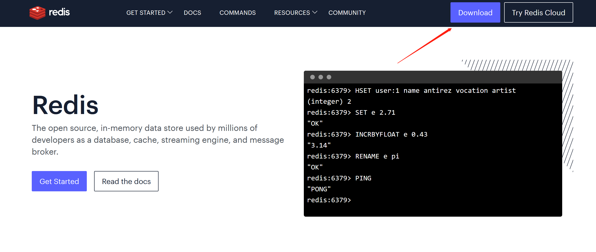

2.向下翻，找到下面的所有Redis的版本点进去

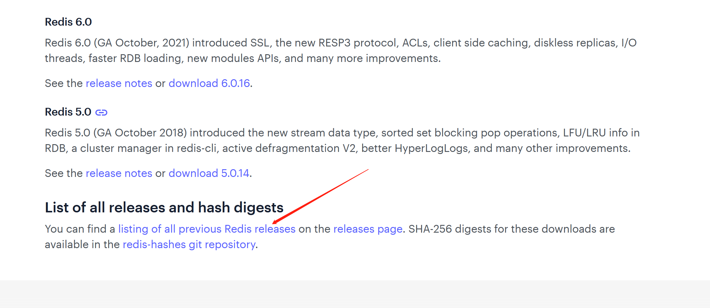

3.来到这个界面后找到相应的自己想要下载的版本点击就可以下载了


> 注意：下载在linux上的安装包都是tar.gz结尾的

## 2.2编译源码

**原因：redis的源码是c语言开发，编译redis源码需要安装gcc**

### 2.2.1安装gcc

```plain&#x20;text
-- 安装centos的Extras库,它里面有一些centos的安装包
1.yum -y install centos-release-scl
-- 安装gcc,centos的默认gcc版本是4.8.5，给他升级到最新版本9.几
-- 并且安装devtoolset 用来维护开发环境
2.yum -y install devtoolset-9-gcc devtoolset-9-gcc-c++ devtoolset-9-binutils
-- 激活对应的devtoolset
3.scl enable devtoolset-9 bash
-- 配置环境变量
4.echo "source /opt/rh/devtoolset-9/enable" >> /etc/profile
-- source下环境变量使环境变量生效
5.source /etc/profile
-- 安装完成之后查看是否安装成功
6.gcc -v   //查看版本号，如果有版本号出现代表安装成功
-- 最下面一行出现这个
gcc -v
```

### 2.2.2解压redis源码

```shell
tar -zxf redis-6.0.9.tar.gz
```

### 2.2.3编译安装

```shell
[root@doitedu03 ~]# cd redis-6.0.9/
# 编译加上迁出可执行文件
[root@doitedu03 redis-6.0.9]#   make install PREFIX=/opt/app/redis
```

### 2.2.4 准备reids的配置文件

```plain&#x20;text
将原来redis中的redis.conf复制出来，放在后来迁出的redis6文件夹中去
-- 复制的命令
cp /源码目录下/redis.conf /opt/app/redis/

修改复制过来的配置文件
vi redis.conf
修改的第一个地方：
bind 127.0.0.1 -- 原来监听的端口是本机，后面我们要搭建集群，远程连接,本地显然是不合适
bind 0.0.0.0  -- 改成集群里面的地址

修改的第二个地方: daemonize 后台运行的意思，如果是no，就是前台启动，改成yes，后台启动，方便一点
daemonize no  -- 原来是no
daemonize yes -- 改成yes
```

### 2.2.5配置系统环境变量

```plain&#x20;text
vi /etc/profile

# REDIS_HOME
export REDIS_HOME=/opt/app/redis6
export PATH=$PATH:$REDIS_HOME/bin

source /etc/profile
```

### 2.2.6 启动redis的服务

```shell
-- 进入到redis6的bin目录下执行，其实配置了环境变量，在哪执行都一样
[root@linux01 /]# ./redis-server /opt/app/redis6/redis.conf 

-- 查看redis的服务是否已经启动成功
[root@linux01 /]# netstat -nltp |grep redis
tcp        0      0 192.168.232.3:6379      0.0.0.0:*               LISTEN      6040/redis-server l

```

### 2.2.7 连接到客户端

```shell
-- 进入到redis6的bin目录下执行，其实配置了环境变量，在哪执行都一样
[root@linux01 bin]# redis-cli
-- 报错了：
Could not connect to Redis at 127.0.0.1:6379: Connection refused

原因是我们之前修改了它监听的主机，将127.0.0.1 修改成了linux01
redis-cli -h linux01 -p 6379

解释：-h 代表的是指定主机名，-p 代表的是端口号，我们没有修改他的端口号，默认就是6379，所以也可以不写


-- 连接测试  你给他一个ping  他给你一个pong 就代表连接成功了  --raw  中文显示乱码问题
[root@linux01 /]# redis-cli -h linux01  --raw
linux01:6379> ping
PONG
linux01:6379> 
```


# **3.Redis数据结构**

## 3.1key

### 3.1.1 keys&#x20;

```shell
KEYS pattern
查找所有符合给定模式 pattern 的 key 。
KEYS *             匹配数据库中所有 key 。
KEYS h?llo         匹配 hello ， hallo 和 hxllo 等。   占一个字符  
KEYS h*llo         匹配 hllo 和 heeeeello 等。
KEYS h[ae]llo      匹配 hello 和 hallo ，但不匹配 hillo 。 

返回值：符合给定模式的 key 列表。
```

示例：

```shell
redis> MSET one 1 two 2 three 3 four 4  # 一次设置 4 个 key
OK

redis> KEYS *o*
1) "four"
2) "two"
3) "one"

redis> KEYS t??
1) "two"

redis> KEYS t[w]*
1) "two"

redis> KEYS *  # 匹配数据库内所有 key
1) "four"
2) "three"
3) "two"
4) "one"
```

### 3.1.2 **DEL**

```shell
DEL key [key ...]
删除给定的一个或多个 key 。
不存在的 key 会被忽略。

返回值：被删除 key 的数量。
```

示例：

```shell
#  删除单个 key
redis> SET name zhangsan
OK

redis> DEL name
(integer) 1

# 删除一个不存在的 key

redis> EXISTS phone
(integer) 0

redis> DEL phone # 失败，没有 key 被删除
(integer) 0


# 同时删除多个 key

redis> SET name "redis"
OK

redis> SET type "key-value store"
OK

redis> SET website "redis.com"
OK

redis> DEL name type website
(integer) 3
```

### 3.1.3 DUMP

```plain&#x20;text
DUMP key
序列化给定 key ，并返回被序列化的值，使用 RESTORE 命令可以将这个值反序列化为 Redis 键。
序列化生成的值有以下几个特点：
它带有 64 位的校验和，用于检测错误， RESTORE 在进行反序列化之前会先检查校验和。
值的编码格式和 RDB 文件保持一致。
RDB 版本会被编码在序列化值当中，如果因为 Redis 的版本不同造成 RDB 格式不兼容，那么 Redis 会拒绝对这个值进行反序列化操作。
序列化的值不包括任何生存时间信息。

返回值：
如果 key 不存在，那么返回 nil 。
否则，返回序列化之后的值。
```

示例：

```shell
linux01:6379> set name hello 
OK

linux01:6379> dump name
"\x00\x05hello\t\x00\xb3\x80\x8e\xba1\xb2C\xbb"

-- 如果序列化的key不存在美酒返回nil
redis> DUMP not-exists-key
(nil)
```

### 3.1.4**RESTORE**

```plain&#x20;text
RESTORE key ttl serialized-value
反序列化给定的序列化值，并将它和给定的 key 关联。
参数 ttl 以毫秒为单位为 key 设置生存时间；如果 ttl 为 0 ，那么不设置生存时间。
RESTORE 在执行反序列化之前会先对序列化值的 RDB 版本和数据校验和进行检查，如果 RDB 版本不相同或者数据不完整的话，那么 RESTORE 会拒绝进行反序列化，并返回一个错误。

返回值：
如果反序列化成功那么返回 OK ，否则返回一个错误
```

示例：

```shell
redis> SET greeting "hello, dumping world!"
OK

redis> DUMP greeting
"\x00\x15hello, dumping world!\x06\x00E\xa0Z\x82\xd8r\xc1\xde"

redis> RESTORE greeting-again 0 "\x00\x15hello, dumping world!\x06\x00E\xa0Z\x82\xd8r\xc1\xde"
OK

redis> GET greeting-again
"hello, dumping world!"

redis> RESTORE fake-message 0 "hello moto moto blah blah"   ; 使用错误的值进行反序列化
(error) ERR DUMP payload version or checksum are wrong
```

### 3.1.5**EXISTS**

```plain&#x20;text
EXISTS key
检查给定 key 是否存在。
返回值：若 key 存在，返回 1 ，否则返回 0 。
```

示例：

```shell
redis> SET db "redis"
OK

redis> EXISTS db
(integer) 1

redis> DEL db
(integer) 1

redis> EXISTS db
(integer) 0
```

### 3.1.6**EXPIRE**

```plain&#x20;text
EXPIRE key seconds
为给定 key 设置生存时间，当 key 过期时(生存时间为 0 )，它会被自动删除。

更新生存时间
可以对一个已经带有生存时间的 key 执行 EXPIRE 命令，新指定的生存时间会取代旧的生存时间。

过期时间的精确度
在 Redis 2.4 版本中，过期时间的延迟在 1 秒钟之内 —— 也即是，就算 key 已经过期，但它还是可能在过期之后一秒钟之内被访问到，而在新的 Redis 2.6 版本中，延迟被降低到 1 毫秒之内。

返回值：
设置成功返回 1 。
当 key 不存在或者不能为 key 设置生存时间时(比如在低于 2.1.3 版本的 Redis 中你尝试更新 key 的生存时间)，返回 0 
```

示例：

```shell
redis> SET cache_page "www.google.com"
OK

redis> EXPIRE cache_page 30  # 设置过期时间为 30 秒
(integer) 1

redis> TTL cache_page    # 查看剩余生存时间
(integer) 23

redis> EXPIRE cache_page 30000   # 更新过期时间
(integer) 1

redis> TTL cache_page
(integer) 29996
```

### 3.1.7**TTL**

```plain&#x20;text
TTL key
以秒为单位，返回给定 key 的剩余生存时间(TTL, time to live)。

返回值：
当 key 不存在时，返回 -2 。
当 key 存在但没有设置剩余生存时间时，返回 -1 。
否则，以秒为单位，返回 key 的剩余生存时间。
```

示例：

```shell
# 不存在的 key

redis> FLUSHDB
OK

redis> TTL key
(integer) -2


# key 存在，但没有设置剩余生存时间

redis> SET key value
OK

redis> TTL key
(integer) -1


# 有剩余生存时间的 key

redis> EXPIRE key 10086
(integer) 1

redis> TTL key
(integer) 10084
```

### 3.1.8**EXPIREAT**

```plain&#x20;text
EXPIREAT key timestamp   以s为单位的时间戳
EXPIREAT 的作用和 EXPIRE 类似，都用于为 key 设置生存时间
不同在于 EXPIREAT 命令接受的时间参数是 UNIX 时间戳(unix timestamp)。
```

示例：

```shell
redis> SET cache www.google.com
OK

redis> EXPIREAT cache 1355292000     # 这个 key 将在 2012.12.12 过期
(integer) 1

redis> TTL cache
(integer) 45081860
```

### 3.1.9**PERSIST**

```plain&#x20;text
PERSIST key
移除给定 key 的生存时间，将这个 key 从『易失的』(带生存时间 key )转换成『持久的』(一个不带生存时间、永不过期的 key )。

返回值：
当生存时间移除成功时，返回 1 .
如果 key 不存在或 key 没有设置生存时间，返回 0 。
```

示例：

```shell
redis> SET mykey "Hello"
OK

redis> EXPIRE mykey 10  # 为 key 设置生存时间
(integer) 1

redis> TTL mykey
(integer) 10

redis> PERSIST mykey    # 移除 key 的生存时间
(integer) 1

redis> TTL mykey
(integer) -1
```

### **3.1.10PEXPIREAT**

```plain&#x20;text
PEXPIREAT key milliseconds-timestamp  设置过期时间  毫秒为单位的时间戳
这个命令和 EXPIREAT 命令类似，但它以毫秒为单位设置 key 的过期 unix 时间戳，而不是像 EXPIREAT 那样，以秒为单位。

返回值：
如果生存时间设置成功，返回 1 。
当 key 不存在或没办法设置生存时间时，返回 0 。(查看 EXPIRE 命令获取更多信息)
```

示例：

```shell
redis> SET mykey "Hello"
OK

redis> PEXPIREAT mykey 1555555555005
(integer) 1

redis> TTL mykey           # TTL 返回秒
(integer) 223157079

redis> PTTL mykey          # PTTL 返回毫秒
(integer) 223157079318
```

### **3.1.11PTTL**

```plain&#x20;text
PTTL key
这个命令类似于 TTL 命令，但它以毫秒为单位返回 key 的剩余生存时间，而不是像 TTL 命令那样，以秒为单位。

返回值：
当 key 不存在时，返回 -2 。
当 key 存在但没有设置剩余生存时间时，返回 -1 。
否则，以毫秒为单位，返回 key 的剩余生存时间。
```

> 在 Redis 2.8 以前，当 key 不存在，或者 key 没有设置剩余生存时间时，命令都返回 -1 。

示例：

```shell
# 不存在的 key

redis> FLUSHDB
OK

redis> PTTL key
(integer) -2


# key 存在，但没有设置剩余生存时间

redis> SET key value
OK

redis> PTTL key
(integer) -1


# 有剩余生存时间的 key

redis> PEXPIRE key 10086
(integer) 1

redis> PTTL key
(integer) 6179
```

### 3.1.12**MIGRATE**

```plain&#x20;text
MIGRATE host port key destination-db timeout [COPY] [REPLACE]
将 key 原子性地从当前实例传送到目标实例的指定数据库上，一旦传送成功， key 保证会出现在目标实例上，而当前实例上的 key 会被删除。
这个命令是一个原子操作，它在执行的时候会阻塞进行迁移的两个实例，直到以下任意结果发生：迁移成功，迁移失败，等到超时。
命令的内部实现是这样的：它在当前实例对给定 key 执行 DUMP 命令 ，将它序列化，然后传送到目标实例，目标实例再使用 RESTORE 对数据进行反序列化，并将反序列化所得的数据添加到数据库中；当前实例就像目标实例的客户端那样，只要看到 RESTORE 命令返回 OK ，它就会调用 DEL 删除自己数据库上的 key 。
timeout 参数以毫秒为格式，指定当前实例和目标实例进行沟通的最大间隔时间。这说明操作并不一定要在 timeout 毫秒内完成，只是说数据传送的时间不能超过这个 timeout 数。

可选项：
COPY ：不移除源实例上的 key 。
REPLACE ：替换目标实例上已存在的 key 。

返回值：迁移成功时返回 OK ，否则返回相应的错误。
```

示例：

先启动两个 Redis 实例，一个使用默认的 6379 端口，一个使用 7777 端口。

```shell
$ ./redis-server --port 7777 &
[2] 3560

...
```

然后用客户端连上 6379 端口的实例，设置一个键，然后将它迁移到 7777 端口的实例上：

```shell
$ ./redis-cli

redis 127.0.0.1:6379> flushdb
OK

redis 127.0.0.1:6379> SET greeting "Hello from 6379 instance"
OK

redis 127.0.0.1:6379> MIGRATE 127.0.0.1 7777 greeting 0 1000
OK

redis 127.0.0.1:6379> EXISTS greeting      # 迁移成功后 key 被删除
(integer) 0
```

使用另一个客户端，查看 7777 端口上的实例：

```shell
$ ./redis-cli -p 7777

redis 127.0.0.1:7777> GET greeting
"Hello from 6379 instance"
```


### 3.1.13**MOVE**

```plain&#x20;text
MOVE key db
将当前数据库的 key 移动到给定的数据库 db 当中。
如果当前数据库(源数据库)和给定数据库(目标数据库)有相同名字的给定 key ，或者 key 不存在于当前数据库，那么 MOVE 没有任何效果。
因此，也可以利用这一特性，将 MOVE 当作锁(locking)原语(primitive)。

返回值：移动成功返回 1 ，失败则返回 0 。
```

示例：

```shell
# key 存在于当前数据库

redis> SELECT 0                             # redis默认使用数据库 0，为了清晰起见，这里再显式指定一次。
OK

redis> SET song "secret base - Zone"
OK

redis> MOVE song 1                          # 将 song 移动到数据库 1
(integer) 1

redis> EXISTS song                          # song 已经被移走
(integer) 0

redis> SELECT 1                             # 使用数据库 1
OK

redis:1> EXISTS song                        # 证实 song 被移到了数据库 1 (注意命令提示符变成了"redis:1"，表明正在使用数据库 1)
(integer) 1


# 当 key 不存在的时候

redis:1> EXISTS fake_key
(integer) 0

redis:1> MOVE fake_key 0                    # 试图从数据库 1 移动一个不存在的 key 到数据库 0，失败
(integer) 0

redis:1> select 0                           # 使用数据库0
OK

redis> EXISTS fake_key                      # 证实 fake_key 不存在
(integer) 0

# 当源数据库和目标数据库有相同的 key 时

redis> SELECT 0                             # 使用数据库0
OK
redis> SET favorite_fruit "banana"
OK

redis> SELECT 1                             # 使用数据库1
OK
redis:1> SET favorite_fruit "apple"
OK

redis:1> SELECT 0                           # 使用数据库0，并试图将 favorite_fruit 移动到数据库 1
OK

redis> MOVE favorite_fruit 1                # 因为两个数据库有相同的 key，MOVE 失败
(integer) 0

redis> GET favorite_fruit                   # 数据库 0 的 favorite_fruit 没变
"banana"

redis> SELECT 1
OK

redis:1> GET favorite_fruit                 # 数据库 1 的 favorite_fruit 也是
"apple"
```

### **3.1.14RANDOMKEY**

```plain&#x20;text
RANDOMKEY
从当前数据库中随机返回(不删除)一个 key 。

返回值：
当数据库不为空时，返回一个 key 。
当数据库为空时，返回 nil 。
```

示例：

```shell
# 数据库不为空

redis> MSET fruit "apple" drink "beer" food "cookies"   # 设置多个 key
OK

redis> RANDOMKEY
"fruit"

redis> RANDOMKEY
"food"

redis> KEYS *    # 查看数据库内所有key，证明 RANDOMKEY 并不删除 key
1) "food"
2) "drink"
3) "fruit"


# 数据库为空

redis> FLUSHDB  # 删除当前数据库所有 key
OK

redis> RANDOMKEY
(nil)
```

### **3.1.15RENAME**

```plain&#x20;text
RENAME key newkey
将 key 改名为 newkey 。
当 key 和 newkey 相同，或者 key 不存在时，返回一个错误。
当 newkey 已经存在时， RENAME 命令将覆盖旧值。

返回值：d
改名成功时提示 OK ，失败时候返回一个错误。
```

示例：

```shell
# key 存在且 newkey 不存在

redis> SET message "hello world"
OK

redis> RENAME message greeting
OK

redis> EXISTS message               # message 不复存在
(integer) 0

redis> EXISTS greeting              # greeting 取而代之
(integer) 1


# 当 key 不存在时，返回错误

redis> RENAME fake_key never_exists
(error) ERR no such key


# newkey 已存在时， RENAME 会覆盖旧 newkey

redis> SET pc "lenovo"
OK

redis> SET personal_computer "dell"
OK

redis> RENAME pc personal_computer
OK

redis> GET pc
(nil)

redis:1> GET personal_computer      # 原来的值 dell 被覆盖了
"lenovo"
```

### 3.1.16**RENAMENX**

```plain&#x20;text
RENAMENX key newkey
当且仅当 newkey 不存在时，将 key 改名为 newkey 。
当 newkey 存在时，返回一个0。

返回值：
修改成功时，返回 1 。
如果 newkey 已经存在，返回 0 。
```

示例：

```shell
# newkey 不存在，改名成功

redis> SET player "MPlyaer"
OK

redis> EXISTS best_player
(integer) 0

redis> RENAMENX player best_player
(integer) 1


# newkey存在时，失败

redis> SET animal "bear"
OK

redis> SET favorite_animal "butterfly"
OK

redis> RENAMENX animal favorite_animal
(integer) 0

redis> get animal
"bear"

redis> get favorite_animal
"butterfly"
```

## 3.2String

### 3.2.1**SET**

```plain&#x20;text
SET key value [EX seconds] [PX milliseconds] [NX|XX]
将字符串值 value 关联到 key 。
如果 key 已经持有其他值， SET 就覆写旧值，无视类型。
对于某个原本带有生存时间（TTL）的键来说， 当 SET 命令成功在这个键上执行时， 这个键原有的 TTL 将被清除。
可选参数
从 Redis 2.6.12 版本开始， SET 命令的行为可以通过一系列参数来修改：
EX second ：设置键的过期时间为 second 秒。 SET key value EX second 效果等同于 SETEX key second value 。
PX millisecond ：设置键的过期时间为 millisecond 毫秒。 SET key value PX millisecond 效果等同于 PSETEX key millisecond value 。
NX ：只在键不存在时，才对键进行设置操作。 SET key value NX 效果等同于 SETNX key value 
XX ：只在键已经存在时，才对键进行设置操作。

返回值：
在 Redis 2.6.12 版本以前， SET 命令总是返回 OK 。
从 Redis 2.6.12 版本开始， SET 在设置操作成功完成时，才返回 OK 。
如果设置了 NX 或者 XX ，但因为条件没达到而造成设置操作未执行，那么命令返回空批量回复（NULL Bulk Reply）。
```

> 因为 [*SET*](http://doc.redisfans.com/string/set.html#set) 命令可以通过参数来实现和 [*SETNX*](http://doc.redisfans.com/string/setnx.html#setnx) 、 [*SETEX*](http://doc.redisfans.com/string/setex.html#setex) 和 [*PSETEX*](http://doc.redisfans.com/string/psetex.html#psetex) 三个命令的效果，所以将来的 Redis 版本可能会废弃并最终移除 [*SETNX*](http://doc.redisfans.com/string/setnx.html#setnx) 、 [*SETEX*](http://doc.redisfans.com/string/setex.html#setex) 和 [*PSETEX*](http://doc.redisfans.com/string/psetex.html#psetex) 这三个命令。

示例：

```shell
# 对不存在的键进行设置

redis 127.0.0.1:6379> SET key "value"
OK

redis 127.0.0.1:6379> GET key
"value"


# 对已存在的键进行设置

redis 127.0.0.1:6379> SET key "new-value"
OK

redis 127.0.0.1:6379> GET key
"new-value"


# 使用 EX 选项

redis 127.0.0.1:6379> SET key-with-expire-time "hello" EX 10086
OK

redis 127.0.0.1:6379> GET key-with-expire-time
"hello"

redis 127.0.0.1:6379> TTL key-with-expire-time
(integer) 10069


# 使用 PX 选项

redis 127.0.0.1:6379> SET key-with-pexpire-time "moto" PX 123321
OK

redis 127.0.0.1:6379> GET key-with-pexpire-time
"moto"

redis 127.0.0.1:6379> PTTL key-with-pexpire-time
(integer) 111939


# 使用 NX 选项

redis 127.0.0.1:6379> SET not-exists-key "value" NX
OK      # 键不存在，设置成功

redis 127.0.0.1:6379> GET not-exists-key
"value"

redis 127.0.0.1:6379> SET not-exists-key "new-value" NX
(nil)   # 键已经存在，设置失败

redis 127.0.0.1:6379> GEt not-exists-key
"value" # 维持原值不变


# 使用 XX 选项

redis 127.0.0.1:6379> EXISTS exists-key
(integer) 0

redis 127.0.0.1:6379> SET exists-key "value" XX
(nil)   # 因为键不存在，设置失败

redis 127.0.0.1:6379> SET exists-key "value"
OK      # 先给键设置一个值

redis 127.0.0.1:6379> SET exists-key "new-value" XX
OK      # 设置新值成功

redis 127.0.0.1:6379> GET exists-key
"new-value"


# NX 或 XX 可以和 EX 或者 PX 组合使用

redis 127.0.0.1:6379> SET key-with-expire-and-NX "hello" EX 10086 NX
OK

redis 127.0.0.1:6379> GET key-with-expire-and-NX
"hello"

redis 127.0.0.1:6379> TTL key-with-expire-and-NX
(integer) 10063

redis 127.0.0.1:6379> SET key-with-pexpire-and-XX "old value"
OK

redis 127.0.0.1:6379> SET key-with-pexpire-and-XX "new value" PX 123321
OK

redis 127.0.0.1:6379> GET key-with-pexpire-and-XX
"new value"

redis 127.0.0.1:6379> PTTL key-with-pexpire-and-XX
(integer) 112999


# EX 和 PX 可以同时出现，但后面给出的选项会覆盖前面给出的选项

redis 127.0.0.1:6379> SET key "value" EX 1000 PX 5000000
OK

redis 127.0.0.1:6379> TTL key
(integer) 4993  # 这是 PX 参数设置的值

redis 127.0.0.1:6379> SET another-key "value" PX 5000000 EX 1000
OK

redis 127.0.0.1:6379> TTL another-key
(integer) 997   # 这是 EX 参数设置的值
```

### 3.2.2GET

```plain&#x20;text
GET key
返回 key 所关联的字符串值。
如果 key 不存在那么返回特殊值 nil 。
假如 key 储存的值不是字符串类型，返回一个错误，因为 GET 只能用于处理字符串值。

返回值：
当 key 不存在时，返回 nil ，否则，返回 key 的值。
如果 key 不是字符串类型，那么返回一个错误。
```

示例：

```shell
# 对不存在的 key 或字符串类型 key 进行 GET

redis> GET db
(nil)

redis> SET db redis
OK

redis> GET db
"redis"


# 对不是字符串类型的 key 进行 GET

redis> DEL db
(integer) 1

redis> LPUSH db redis mongodb mysql
(integer) 3

redis> GET db
(error) ERR Operation against a key holding the wrong kind of value
```

### 3.2.3MSET

```plain&#x20;text
MSET key value [key value ...]
同时设置一个或多个 key-value 对。
如果某个给定 key 已经存在，那么 MSET 会用新值覆盖原来的旧值，如果这不是你所希望的效果，请考虑使用 MSETNX 命令：它只会在所有给定 key 都不存在的情况下进行设置操作。
MSET 是一个原子性(atomic)操作，所有给定 key 都会在同一时间内被设置，某些给定 key 被更新而另一些给定 key 没有改变的情况，不可能发生。
```

示例：

```shell
redis> MSET date "2012.3.30" time "11:00 a.m." weather "sunny"
OK

redis> MGET date time weather
1) "2012.3.30"
2) "11:00 a.m."
3) "sunny"


# MSET 覆盖旧值例子

redis> SET google "google.hk"
OK

redis> MSET google "google.com"
OK

redis> GET google
"google.com"
```

### 3.3.4MGET

```plain&#x20;text
MGET key [key ...]
返回所有(一个或多个)给定 key 的值。
如果给定的 key 里面，有某个 key 不存在，那么这个 key 返回特殊值 nil 。因此，该命令永不失败。

返回值：一个包含所有给定 key 的值的列表。
```

示例：

```shell
edis> SET redis redis.com
OK

redis> SET mongodb mongodb.org
OK

redis> MGET redis mongodb
1) "redis.com"
2) "mongodb.org"

redis> MGET redis mongodb mysql     # 不存在的 mysql 返回 nil
1) "redis.com"
2) "mongodb.org"
3) (nil)
```

### 3.2.5GETSET

```plain&#x20;text
GETSET key value
将给定 key 的值设为 value ，并返回 key 的旧值(old value)。
当 key 存在但不是字符串类型时，返回一个错误。
返回值：
返回给定 key 的旧值。
当 key 没有旧值时，也即是， key 不存在时，返回 nil 。
```

示例：

```shell
redis> GETSET db mongodb    # 没有旧值，返回 nil
(nil)

redis> GET db
"mongodb"

redis> GETSET db redis      # 返回旧值 mongodb
"mongodb"

redis> GET db
"redis"
```

### 3.2.6APPEND&#x20;

```plain&#x20;text
APPEND key value
如果 key 已经存在并且是一个字符串， APPEND 命令将 value 追加到 key 原来的值的末尾。
如果 key 不存在， APPEND 就简单地将给定 key 设为 value ，就像执行 SET key value 一样。

返回值：追加 value 之后， key 中字符串的长度。
```

示例：

```shell
# 对不存在的 key 执行 APPEND

redis> EXISTS myphone               # 确保 myphone 不存在
(integer) 0

redis> APPEND myphone "nokia"       # 对不存在的 key 进行 APPEND ，等同于 SET myphone "nokia"
(integer) 5                         # 字符长度


# 对已存在的字符串进行 APPEND

redis> APPEND myphone " - 1110"     # 长度从 5 个字符增加到 12 个字符
(integer) 12

redis> GET myphone
"nokia - 1110"
```

### 3.2.7**DECR**

```plain&#x20;text
DECR key
将 key 中储存的数字值减一。
如果 key 不存在，那么 key 的值会先被初始化为 0 ，然后再执行 DECR 操作。
如果值包含错误的类型，或字符串类型的值不能表示为数字，那么返回一个错误。
本操作的值限制在 64 位(bit)有符号数字表示之内。
关于递增(increment) / 递减(decrement)操作的更多信息，请参见 INCR 命令。

返回值：执行 DECR 命令之后 key 的值。
```

示例：

```shell
# 对存在的数字值 key 进行 DECR

redis> SET failure_times 10
OK

redis> DECR failure_times
(integer) 9


# 对不存在的 key 值进行 DECR

redis> EXISTS count
(integer) 0

redis> DECR count
(integer) -1


# 对存在但不是数值的 key 进行 DECR

redis> SET company YOUR_CODE_SUCKS.LLC
OK

redis> DECR company
(error) ERR value is not an integer or out of range
```

### 3.2.8**DECRBY**

```plain&#x20;text
DECRBY key decrement
将 key 所储存的值减去减量 decrement 。
如果 key 不存在，那么 key 的值会先被初始化为 0 ，然后再执行 DECRBY 操作。
如果值包含错误的类型，或字符串类型的值不能表示为数字，那么返回一个错误。
本操作的值限制在 64 位(bit)有符号数字表示之内。
关于更多递增(increment) / 递减(decrement)操作的更多信息，请参见 INCR 命令。

返回值：减去 decrement 之后， key 的值。
```

示例：

```shell
# 对已存在的 key 进行 DECRBY

redis> SET count 100
OK

redis> DECRBY count 20
(integer) 80


# 对不存在的 key 进行DECRBY

redis> EXISTS pages    
(integer) 0

redis> DECRBY pages 10
(integer) -10
```

### 3.2.9**INCR**

```plain&#x20;text
INCR key
将 key 中储存的数字值增一。
如果 key 不存在，那么 key 的值会先被初始化为 0 ，然后再执行 INCR 操作。
如果值包含错误的类型，或字符串类型的值不能表示为数字，那么返回一个错误。
本操作的值限制在 64 位(bit)有符号数字表示之内。

返回值：执行 INCR 命令之后 key 的值。
```

示例：

```shell
redis> SET page_view 20
OK

redis> INCR page_view
(integer) 21

redis> GET page_view    # 数字值在 Redis 中以字符串的形式保存
"21"
```

### 3.2.10INCRBY&#x20;

```plain&#x20;text
INCRBY key increment
将 key 所储存的值加上增量 increment 。
如果 key 不存在，那么 key 的值会先被初始化为 0 ，然后再执行 INCRBY 命令。
如果值包含错误的类型，或字符串类型的值不能表示为数字，那么返回一个错误。
本操作的值限制在 64 位(bit)有符号数字表示之内。
关于递增(increment) / 递减(decrement)操作的更多信息，参见 INCR 命令。

返回值：加上 increment 之后， key 的值。
```

示例：

```shell
# key 存在且是数字值

redis> SET rank 50
OK

redis> INCRBY rank 20
(integer) 70

redis> GET rank
"70"


# key 不存在时

redis> EXISTS counter
(integer) 0

redis> INCRBY counter 30
(integer) 30

redis> GET counter
"30"


# key 不是数字值时

redis> SET book "long long ago..."
OK

redis> INCRBY book 200
(error) ERR value is not an integer or out of range

```

### 3.2.11INCRBYFLOAT

```plain&#x20;text
INCRBYFLOAT key increment
为 key 中所储存的值加上浮点数增量 increment 。
如果 key 不存在，那么 INCRBYFLOAT 会先将 key 的值设为 0 ，再执行加法操作。
如果命令执行成功，那么 key 的值会被更新为（执行加法之后的）新值，并且新值会以字符串的形式返回给调用者。
无论是 key 的值，还是增量 increment ，都可以使用像 2.0e7 、 3e5 、 90e-2 那样的指数符号(exponential notation)来表示，但是，执行 INCRBYFLOAT 命令之后的值总是以同样的形式储存，也即是，它们总是由一个数字，一个（可选的）小数点和一个任意位的小数部分组成（比如 3.14 、 69.768 ，诸如此类)，小数部分尾随的 0 会被移除，如果有需要的话，还会将浮点数改为整数（比如 3.0 会被保存成 3 ）。
除此之外，无论加法计算所得的浮点数的实际精度有多长， INCRBYFLOAT 的计算结果也最多只能表示小数点的后十七位。
当以下任意一个条件发生时，返回一个错误：
key 的值不是字符串类型(因为 Redis 中的数字和浮点数都以字符串的形式保存，所以它们都属于字符串类型）
key 当前的值或者给定的增量 increment 不能解释(parse)为双精度浮点数(double precision floating point number）
```

示例：

```shell
# 值和增量都不是指数符号

redis> SET mykey 10.50
OK

redis> INCRBYFLOAT mykey 0.1
"10.6"


# 值和增量都是指数符号

redis> SET mykey 314e-2
OK

redis> GET mykey                # 用 SET 设置的值可以是指数符号
"314e-2"

redis> INCRBYFLOAT mykey 0      # 但执行 INCRBYFLOAT 之后格式会被改成非指数符号
"3.14"


# 可以对整数类型执行

redis> SET mykey 3
OK

redis> INCRBYFLOAT mykey 1.1
"4.1"


# 后跟的 0 会被移除

redis> SET mykey 3.0
OK

redis> GET mykey                                    # SET 设置的值小数部分可以是 0
"3.0"

redis> INCRBYFLOAT mykey 1.000000000000000000000    # 但 INCRBYFLOAT 会将无用的 0 忽略掉，有需要的话，将浮点变为整数
"4"

redis> GET mykey
"4"
```

### 3.2.12GETRANGE

```shell
GETRANGE key start end
返回 key 中字符串值的子字符串，字符串的截取范围由 start 和 end 两个偏移量决定(包括 start 和 end 在内)。
负数偏移量表示从字符串最后开始计数， -1 表示最后一个字符， -2 表示倒数第二个，以此类推。
GETRANGE 通过保证子字符串的值域(range)不超过实际字符串的值域来处理超出范围的值域请求。

返回值：截取得出的子字符串。
```

> 在 <= 2.0 的版本里，GETRANGE 被叫作 SUBSTR。

示例：

```shell
redis> SET greeting "hello, my friend"
OK

redis> GETRANGE greeting 0 4          # 返回索引0-4的字符，包括4。
"hello"

redis> GETRANGE greeting -1 -5        # 不支持回绕操作
""

redis> GETRANGE greeting -3 -1        # 负数索引
"end"

redis> GETRANGE greeting 0 -1         # 从第一个到最后一个
"hello, my friend"

redis> GETRANGE greeting 0 1008611    # 值域范围不超过实际字符串，超过部分自动被符略
"hello, my friend"
```

### 3.2.13**MSETNX**

```shell
MSETNX key value [key value ...]
同时设置一个或多个 key-value 对，当且仅当所有给定 key 都不存在。
即使只有一个给定 key 已存在， MSETNX 也会拒绝执行所有给定 key 的设置操作。
MSETNX 是原子性的，因此它可以用作设置多个不同 key 表示不同字段(field)的唯一性逻辑对象(unique logic object)，所有字段要么全被设置，要么全不被设置。

返回值：
当所有 key 都成功设置，返回 1 。
如果所有给定 key 都设置失败(至少有一个 key 已经存在)，那么返回 0 。
```

示例：

```shell
# 对不存在的 key 进行 MSETNX

redis> MSETNX rmdbs "MySQL" nosql "MongoDB" key-value-store "redis"
(integer) 1

redis> MGET rmdbs nosql key-value-store
1) "MySQL"
2) "MongoDB"
3) "redis"


# MSET 的给定 key 当中有已存在的 key

redis> MSETNX rmdbs "Sqlite" language "python"  # rmdbs 键已经存在，操作失败
(integer) 0

redis> EXISTS language                          # 因为 MSET 是原子性操作，language 没有被设置
(integer) 0

redis> GET rmdbs                                # rmdbs 也没有被修改
"MySQL"
```

### **3.2.14SETEX**

```shell
SETEX key seconds value 
将值 value 关联到 key ，并将 key 的生存时间设为 seconds (以秒为单位)。
如果 key 已经存在， SETEX 命令将覆写旧值。

返回值：
设置成功时返回 OK 。
当 seconds 参数不合法时，返回一个错误。
```

### 3.2.15**PSETEX**

```shell
PSETEX key milliseconds value
这个命令和 SETEX 命令相似，但它以毫秒为单位设置 key 的生存时间，而不是像 SETEX 命令那样，以秒为单位。

返回值：设置成功时返回 OK 。
```

示例：

```shell
redis> PSETEX mykey 1000 "Hello"
OK

redis> PTTL mykey
(integer) 999

redis> GET mykey
"Hello"
```

示例：

```shell
# 在 key 不存在时进行 SETEX

redis> SETEX cache_user_id 60 10086
OK

redis> GET cache_user_id  # 值
"10086"

redis> TTL cache_user_id  # 剩余生存时间
(integer) 49


# key 已经存在时，SETEX 覆盖旧值

redis> SET cd "timeless"
OK

redis> SETEX cd 3000 "goodbye my love"
OK

redis> GET cd
"goodbye my love"

redis> TTL cd
(integer) 2997
```

### **3.2.16SETNX**

```shell
SETNX key value
将 key 的值设为 value ，当且仅当 key 不存在。
若给定的 key 已经存在，则 SETNX 不做任何动作。
SETNX 是『SET if Not eXists』(如果不存在，则 SET)的简写。

返回值：
设置成功，返回 1 。
设置失败，返回 0 。
```

示例：

```shell
redis> EXISTS job                # job 不存在
(integer) 0

redis> SETNX job "programmer"    # job 设置成功
(integer) 1

redis> SETNX job "code-farmer"   # 尝试覆盖 job ，失败
(integer) 0

redis> GET job                   # 没有被覆盖
"programmer"
```

### **3.2.17SETRANGE**

```shell
SETRANGE key offset value
用 value 参数覆写(overwrite)给定 key 所储存的字符串值，从偏移量 offset 开始。
不存在的 key 当作空白字符串处理。
SETRANGE 命令会确保字符串足够长以便将 value 设置在指定的偏移量上，如果给定 key 原来储存的字符串长度比偏移量小(比如字符串只有 5 个字符长，但你设置的 offset 是 10 )，那么原字符和偏移量之间的空白将用零字节(zerobytes, "\x00" )来填充。
注意你能使用的最大偏移量是 2^29-1(536870911) ，因为 Redis 字符串的大小被限制在 512 兆(megabytes)以内。如果你需要使用比这更大的空间，你可以使用多个 key 。

返回值：被 SETRANGE 修改之后，字符串的长度。
```

示例：

```shell
# 对非空字符串进行 SETRANGE

redis> SET greeting "hello world"
OK

redis> SETRANGE greeting 6 "Redis"
(integer) 11

redis> GET greeting
"hello Redis"


# 对空字符串/不存在的 key 进行 SETRANGE

redis> EXISTS empty_string
(integer) 0

redis> SETRANGE empty_string 5 "Redis!"   # 对不存在的 key 使用 SETRANGE
(integer) 11

redis> GET empty_string                   # 空白处被"\x00"填充
"\x00\x00\x00\x00\x00Redis!"
```

### **3.2.18STRLEN**

```shell
STRLEN key
返回 key 所储存的字符串值的长度。
当 key 储存的不是字符串值时，返回一个错误。

返回值：
字符串值的长度。
当 key 不存在时，返回 0 。
```

示例：

```powershell
# 获取字符串的长度

redis> SET mykey "Hello world"
OK

redis> STRLEN mykey
(integer) 11


# 不存在的 key 长度为 0

redis> STRLEN nonexisting
(integer) 0
```

### 练一练：模拟手机验证码

需求：使用redis模拟手机验证码发送，验证码有效期60s，验证验证码输入不能超过3次，超过3次今天就没机会了

验证手机号：

```java
//验证手机号
/**
 * 判断字符串是否符合手机号码格式
 * 移动号段:   134 135 136 137 138 139 147 148 150 151 152 157 158 159  165 172 178 182 183 184 187 188 198
 * 联通号段:   130 131 132 145 146 155 156 166 170 171 175 176 185 186
 * 电信号段:   133 149 153 170 173 174 177 180 181 189  191  199
 * 虚拟运营商: 170
 */
// "[1]"代表下一位为数字可以是几，"[0-9]"代表可以为0-9中的一个，"[5,7,9]"表示可以是5,7,9中的任意一位,[^4]表示除4以外的任何一个,\\d{8}"代表后面是可以是0～9的数字，有8位。
String regex = "^((13[0-9])|(14[5,6,7,9])|(15[^4])|(16[5,6])|(17[0-9])|(18[0-9])|(19[1,8,9]))\\d{8}$";
```

逻辑思考：

1、首先写一个函数随机产生六位验证码，使用random函数

```java
public static String getCode(){
    //1.模拟一个手机验证码出来，6位的随机的数
    Random random = new Random();
    StringBuilder sb = new StringBuilder();
    for (int i = 0; i < 6; i++) {
        int num = random.nextInt(10);
        sb.append(num);
    }
    return sb.toString();
}
```

2、判断验证码是否正确

①通过手机号拼接字符串，获取验证码的key值

②验证验证码是否正确

```java
public static void checkCode(String key){
    Scanner sc = new Scanner(System.in);
    Jedis jedis = new Jedis("linux01", 6379);
    int cnt = 1;
    while (cnt <= 3) {
        String code = sc.next();
        if (code.equals(jedis.get(key))) {
            System.out.println("验证成功");
            return;
        } else {
            if (cnt == 3) {
                System.out.println("您已错误3次，明日再来吧！！");
            } else {
                System.out.println("第" + cnt + "次错误，请重新输入:");
            }
            cnt++;
        }
    }
}
```

3、启动linux中redis服务端，找到redis.conf,启动执行下面命令即可启动

```shell
redis-server /opt/redis-6.2.1/redis.conf
```

4、执行函数

* 输入手机号，并确认是否发送验证码

* 输入验证码，调用验证验证码函数，若正确，直接退出程序，若不正确，三次后退出

```java
public static void main(String[] args) throws InterruptedException {
    //拿到键盘录入的对象
    Scanner sc = new Scanner(System.in);
    System.out.println("请输入你的手机号");
    String next = sc.next();

    Jedis jedis = new Jedis("linux01", 6379);
    String key = "phone:" + next;
    String value = getCode();
    jedis.setex(key, 30, value);
    System.out.println("验证码已通过短信发送。。。。。。，验证码是：" + value);
    checkCode(key);
}
```

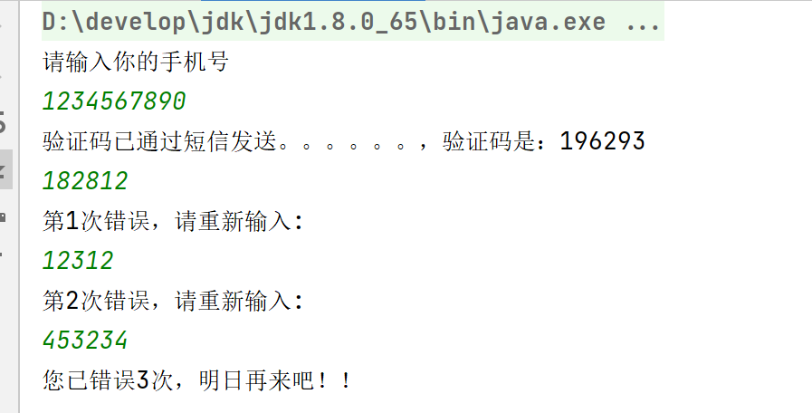

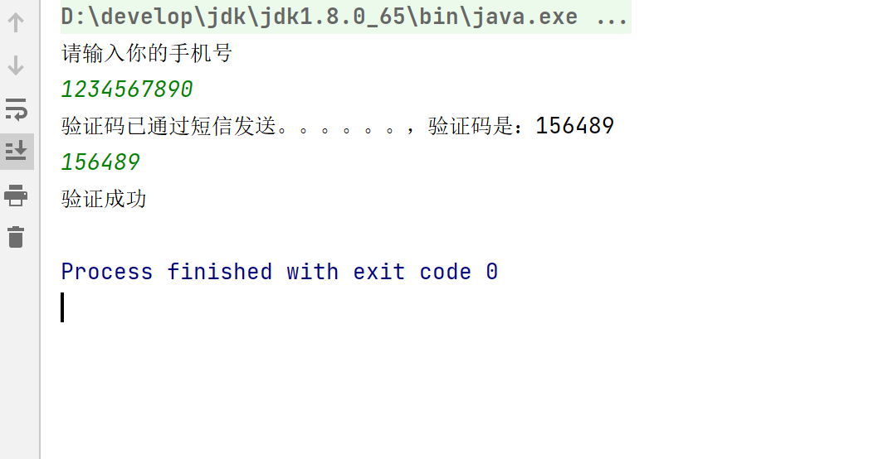

## 课后练习：

使用redis模拟手机验证码发送，规定一个手机号一天只能请求三次验证码，且每次请求的验证码只有两分钟就会过期

## 3.3**List（列表）**

### 3.3.1LPUSH

```plain&#x20;text
LPUSH key value [value ...]
将一个或多个值 value 插入到列表 key 的表头
如果有多个 value 值，那么各个 value 值按从左到右的顺序依次插入到表头： 比如说，对空列表 mylist 执行命令 LPUSH mylist a b c ，列表的值将是 c b a ，这等同于原子性地执行 LPUSH mylist a 、 LPUSH mylist b 和 LPUSH mylist c 三个命令。
如果 key 不存在，一个空列表会被创建并执行 LPUSH 操作。
当 key 存在但不是列表类型时，返回一个错误。

返回值：执行 LPUSH 命令后，列表的长度。
```

> 在Redis 2.4版本以前的 [LPUSH](http://doc.redisfans.com/list/lpush.html#lpush) 命令，都只接受单个 value 值。

示例：

```shell
# 加入单个元素

redis> LPUSH languages python
(integer) 1


# 加入重复元素

redis> LPUSH languages python
(integer) 2

redis> LRANGE languages 0 -1     # 列表允许重复元素
1) "python"
2) "python"


# 加入多个元素

redis> LPUSH mylist a b c
(integer) 3

redis> LRANGE mylist 0 -1
1) "c"
2) "b"
3) "a"
```

### 3.3.2**LPOP**

```shell
LPOP key
移除并返回列表 key 的头元素。

返回值：
列表的头元素。
当 key 不存在时，返回 nil 。
```

示例：

```shell
redis> LLEN course
(integer) 0

redis> RPUSH course algorithm001
(integer) 1

redis> RPUSH course c++101
(integer) 2

redis> LPOP course  # 移除头元素
"algorithm001"
```

### 3.3.3RPUSH

```shell
RPUSH key value [value ...]
将一个或多个值 value 插入到列表 key 的表尾(最右边)。
如果有多个 value 值，那么各个 value 值按从左到右的顺序依次插入到表尾：比如对一个空列表 mylist 执行 RPUSH mylist a b c ，得出的结果列表为 a b c ，等同于执行命令 RPUSH mylist a 、 RPUSH mylist b 、 RPUSH mylist c 。
如果 key 不存在，一个空列表会被创建并执行 RPUSH 操作。
当 key 存在但不是列表类型时，返回一个错误。

返回值：执行 RPUSH 操作后，表的长度。
```

示例：

```shell
# 添加单个元素

redis> RPUSH languages c
(integer) 1


# 添加重复元素

redis> RPUSH languages c
(integer) 2

redis> LRANGE languages 0 -1 # 列表允许重复元素
1) "c"
2) "c"


# 添加多个元素

redis> RPUSH mylist a b c
(integer) 3

redis> LRANGE mylist 0 -1
1) "a"
2) "b"
3) "c"
```

### 3.3.4**RPOP**

```shell
RPOP key
移除并返回列表 key 的尾元素。

返回值：
列表的尾元素。
当 key 不存在时，返回 nil 。
```

示例：

```shell
redis> RPUSH mylist "one"
(integer) 1

redis> RPUSH mylist "two"
(integer) 2

redis> RPUSH mylist "three"
(integer) 3

redis> RPOP mylist           # 返回被弹出的元素
"three"

redis> LRANGE mylist 0 -1    # 列表剩下的元素
1) "one"
2) "two"
```

### 3.3.5**RPUSHX**

```shell
RPUSHX key value
将值 value 插入到列表 key 的表尾，当且仅当 key 存在并且是一个列表。
和 RPUSH 命令相反，当 key 不存在时， RPUSHX 命令什么也不做。

返回值：RPUSHX 命令执行之后，表的长度。
```

示例：

```shell
# key不存在

redis> LLEN greet
(integer) 0

redis> RPUSHX greet "hello"     # 对不存在的 key 进行 RPUSHX，PUSH 失败。
(integer) 0


# key 存在且是一个非空列表

redis> RPUSH greet "hi"         # 先用 RPUSH 插入一个元素
(integer) 1

redis> RPUSHX greet "hello"     # greet 现在是一个列表类型，RPUSHX 操作成功。
(integer) 2

redis> LRANGE greet 0 -1
1) "hi"
2) "hello"
```

### 3.3.6**LPUSHX**

```plain&#x20;text
LPUSHX key value
将值 value 插入到列表 key 的表头，当且仅当 key 存在并且是一个列表。
和 LPUSH 命令相反，当 key 不存在时， LPUSHX 命令什么也不做。

返回值：LPUSHX 命令执行之后，表的长度。
```

示例：

```shell
# 对空列表执行 LPUSHX

redis> LLEN greet                       # greet 是一个空列表
(integer) 0

redis> LPUSHX greet "hello"             # 尝试 LPUSHX，失败，因为列表为空
(integer) 0


# 对非空列表执行 LPUSHX

redis> LPUSH greet "hello"              # 先用 LPUSH 创建一个有一个元素的列表
(integer) 1

redis> LPUSHX greet "good morning"      # 这次 LPUSHX 执行成功
(integer) 2

redis> LRANGE greet 0 -1
1) "good morning"
2) "hello"
```

### 3.3.7BLPOP&#x20;

```shell
BLPOP key [key ...] timeout
BLPOP 是列表的阻塞式(blocking)弹出原语。
它是 LPOP 命令的阻塞版本，当给定列表内没有任何元素可供弹出的时候，连接将被 BLPOP 命令阻塞，直到等待超时或发现可弹出元素为止。
当给定多个 key 参数时，按参数 key 的先后顺序依次检查各个列表，弹出第一个非空列表的头元素。
```

**非阻塞行为**

```shell
当 BLPOP 被调用时，如果给定 key 内至少有一个非空列表，那么弹出遇到的第一个非空列表的头元素，并和被弹出元素所属的列表的名字一起，组成结果返回给调用者。
当存在多个给定 key 时， BLPOP 按给定 key 参数排列的先后顺序，依次检查各个列表。
假设现在有 job 、 command 和 request 三个列表，其中 job 不存在， command 和 request 都持有非空列表。考虑以下命令：
BLPOP job command request 0
BLPOP 保证返回的元素来自 command ，因为它是按”查找 job -> 查找 command -> 查找 request “这样的顺序，第一个找到的非空列表。
```

示例：

```shell
redis> DEL job command request           # 确保key都被删除
(integer) 0

redis> LPUSH command "update system..."  # 为command列表增加一个值
(integer) 1

redis> LPUSH request "visit page"        # 为request列表增加一个值
(integer) 1

redis> BLPOP job command request 0       # job 列表为空，被跳过，紧接着 command 列表的第一个元素被弹出。
1) "command"                             # 弹出元素所属的列表
2) "update system..."                    # 弹出元素所属的值
```

**阻塞行为**

```shell
如果所有给定 key 都不存在或包含空列表，那么 BLPOP 命令将阻塞连接，直到等待超时，或有另一个客户端对给定 key 的任意一个执行 LPUSH 或 RPUSH 命令为止。
超时参数 timeout 接受一个以秒为单位的数字作为值。超时参数设为 0 表示阻塞时间可以无限期延长(block indefinitely) 。
```

示例：

```shell
redis> EXISTS job                # 确保两个 key 都不存在
(integer) 0
redis> EXISTS command
(integer) 0

redis> BLPOP job command 300     # 因为key一开始不存在，所以操作会被阻塞，直到另一客户端对 job 或者 command 列表进行 PUSH 操作。
1) "job"                         # 这里被 push 的是 job
2) "do my home work"             # 被弹出的值
(26.26s)                         # 等待的秒数

redis> BLPOP job command 5       # 等待超时的情况
(nil)
(5.66s)                          # 等待的秒数
```

### 3.3.8**BRPOP**

```powershell
BRPOP key [key ...] timeout
BRPOP 是列表的阻塞式(blocking)弹出原语。
它是 RPOP 命令的阻塞版本，当给定列表内没有任何元素可供弹出的时候，连接将被 BRPOP 命令阻塞，直到等待超时或发现可弹出元素为止。
当给定多个 key 参数时，按参数 key 的先后顺序依次检查各个列表，弹出第一个非空列表的尾部元素。
关于阻塞操作的更多信息，请查看 BLPOP 命令， BRPOP 除了弹出元素的位置和 BLPOP 不同之外，其他表现一致。

返回值：
假如在指定时间内没有任何元素被弹出，则返回一个 nil 和等待时长。
反之，返回一个含有两个元素的列表，第一个元素是被弹出元素所属的 key ，第二个元素是被弹出元素的值。
```

示例：

```shell
redis> LLEN course
(integer) 0

redis> RPUSH course algorithm001
(integer) 1

redis> RPUSH course c++101
(integer) 2

redis> BRPOP course 30
1) "course"             # 弹出元素的 key
2) "c++101"             # 弹出元素的值
```

### **3.3.9RPOPLPUSH**

```powershell
RPOPLPUSH source destination
命令 RPOPLPUSH 在一个原子时间内，执行以下两个动作：
将列表 source 中的最后一个元素(尾元素)弹出，并返回给客户端。
将 source 弹出的元素插入到列表 destination ，作为 destination 列表的的头元素。
举个例子，你有两个列表 source 和 destination ， source 列表有元素 a, b, c ， destination 列表有元素 x, y, z ，执行 RPOPLPUSH source destination 之后， source 列表包含元素 a, b ， destination 列表包含元素 c, x, y, z ，并且元素 c 会被返回给客户端。
如果 source 不存在，值 nil 被返回，并且不执行其他动作。
如果 source 和 destination 相同，则列表中的表尾元素被移动到表头，并返回该元素，可以把这种特殊情况视作列表的旋转(rotation)操作。

返回值：被弹出的元素
```

示例：

```shell
# source 和 destination 不同

redis> LRANGE alpha 0 -1         # 查看所有元素
1) "a"
2) "b"
3) "c"
4) "d"

redis> RPOPLPUSH alpha reciver   # 执行一次 RPOPLPUSH 看看
"d"

redis> LRANGE alpha 0 -1
1) "a"
2) "b"
3) "c"

redis> LRANGE reciver 0 -1
1) "d"

redis> RPOPLPUSH alpha reciver   # 再执行一次，证实 RPOP 和 LPUSH 的位置正确
"c"

redis> LRANGE alpha 0 -1
1) "a"
2) "b"

redis> LRANGE reciver 0 -1
1) "c"
2) "d"


# source 和 destination 相同

redis> LRANGE number 0 -1
1) "1"
2) "2"
3) "3"
4) "4"

redis> RPOPLPUSH number number
"4"

redis> LRANGE number 0 -1           # 4 被旋转到了表头
1) "4"
2) "1"
3) "2"
4) "3"

redis> RPOPLPUSH number number
"3"

redis> LRANGE number 0 -1           # 这次是 3 被旋转到了表头
1) "3"
2) "4"
3) "1"
4) "2"
```

### 3.3.10**BRPOPLPUSH**

```shell
BRPOPLPUSH source destination timeout
BRPOPLPUSH 是 RPOPLPUSH 的阻塞版本，当给定列表 source 不为空时， BRPOPLPUSH 的表现和 RPOPLPUSH 一样。
当列表 source 为空时， BRPOPLPUSH 命令将阻塞连接，直到等待超时，或有另一个客户端对 source 执行 LPUSH 或 RPUSH 命令为止。
超时参数 timeout 接受一个以秒为单位的数字作为值。超时参数设为 0 表示阻塞时间可以无限期延长(block indefinitely) 。
更多相关信息，请参考 RPOPLPUSH 命令。

返回值：
假如在指定时间内没有任何元素被弹出，则返回一个 nil 和等待时长。
反之，返回一个含有两个元素的列表，第一个元素是被弹出元素的值，第二个元素是等待时长。
```

示例：

```shell
# 非空列表

redis> BRPOPLPUSH msg reciver 500
"hello moto"                        # 弹出元素的值
(3.38s)                             # 等待时长

redis> LLEN reciver
(integer) 1

redis> LRANGE reciver 0 0
1) "hello moto"


# 空列表

redis> BRPOPLPUSH msg reciver 1
(nil)
(1.34s)
```

### 3.3.11**LINDEX**

```shell
LINDEX key index
返回列表 key 中，下标为 index 的元素。
下标(index)参数 start 和 stop 都以 0 为底，也就是说，以 0 表示列表的第一个元素，以 1 表示列表的第二个元素，以此类推。
你也可以使用负数下标，以 -1 表示列表的最后一个元素， -2 表示列表的倒数第二个元素，以此类推。
如果 key 不是列表类型，返回一个错误。

返回值:
列表中下标为 index 的元素。
如果 index 参数的值不在列表的区间范围内(out of range)，返回 nil 。
```

示例:

```shell
redis> LPUSH mylist "World"
(integer) 1

redis> LPUSH mylist "Hello"
(integer) 2

redis> LINDEX mylist 0
"Hello"

redis> LINDEX mylist -1
"World"

redis> LINDEX mylist 3        # index不在 mylist 的区间范围内
(nil)
```

### **3.3.12LINSERT**

```shell
LINSERT key BEFORE|AFTER pivot value

LINSERT name1 BEFORE   ww   abc
将值 value 插入到列表 key 当中，位于值 pivot 之前或之后。
当 pivot 不存在于列表 key 时，不执行任何操作。
当 key 不存在时， key 被视为空列表，不执行任何操作。
如果 key 不是列表类型，返回一个错误。

返回值:
如果命令执行成功，返回插入操作完成之后，列表的长度。
如果没有找到 pivot ，返回 -1 。
如果 key 不存在或为空列表，返回 0 。
```

示例：

```shell
redis> RPUSH mylist "Hello"
(integer) 1

redis> RPUSH mylist "World"
(integer) 2

redis> LINSERT mylist BEFORE "World" "There"
(integer) 3

redis> LRANGE mylist 0 -1
1) "Hello"
2) "There"
3) "World"


# 对一个非空列表插入，查找一个不存在的 pivot

redis> LINSERT mylist BEFORE "go" "let's"
(integer) -1                                    # 失败


# 对一个空列表执行 LINSERT 命令

redis> EXISTS fake_list
(integer) 0

redis> LINSERT fake_list BEFORE "nono" "gogogog"
(integer) 0                                      # 失败
```

### **3.3.13LLEN**

```shell
LLEN key
返回列表 key 的长度。
如果 key 不存在，则 key 被解释为一个空列表，返回 0 .
如果 key 不是列表类型，返回一个错误。

返回值：列表 key 的长度。
```

示例:

```shell
# 空列表

redis> LLEN job
(integer) 0


# 非空列表

redis> LPUSH job "cook food"
(integer) 1

redis> LPUSH job "have lunch"
(integer) 2

redis> LLEN job
(integer) 2
```

### 3.3.14**LRANGE**

```shell
LRANGE key start stop
返回列表 key 中指定区间内的元素，区间以偏移量 start 和 stop 指定。
下标(index)参数 start 和 stop 都以 0 为底，也就是说，以 0 表示列表的第一个元素，以 1 表示列表的第二个元素，以此类推。
你也可以使用负数下标，以 -1 表示列表的最后一个元素， -2 表示列表的倒数第二个元素，以此类推。

超出范围的下标
超出范围的下标值不会引起错误。
如果 start 下标比列表的最大下标 end ( LLEN list 减去 1 )还要大，那么 LRANGE 返回一个空列表。
如果 stop 下标比 end 下标还要大，Redis将 stop 的值设置为 end 。

返回值:一个列表，包含指定区间内的元素。
```

示例：

```shell
redis> RPUSH fp-language lisp
(integer) 1

redis> LRANGE fp-language 0 0
1) "lisp"

redis> RPUSH fp-language scheme
(integer) 2

redis> LRANGE fp-language 0 1
1) "lisp"
2) "scheme"
```

### 3.3.15LREM

```plain&#x20;text
LREM key count value
根据参数 count 的值，移除列表中与参数 value 相等的元素。
count 的值可以是以下几种：
count > 0 : 从表头开始向表尾搜索，移除与 value 相等的元素，数量为 count 。
count < 0 : 从表尾开始向表头搜索，移除与 value 相等的元素，数量为 count 的绝对值。
count = 0 : 移除表中所有与 value 相等的值。

返回值：
被移除元素的数量。
因为不存在的 key 被视作空表(empty list)，所以当 key 不存在时， LREM 命令总是返回 0 。
```

示例：

```shell
# 先创建一个表，内容排列是
# morning hello morning helllo morning

redis> LPUSH greet "morning"
(integer) 1
redis> LPUSH greet "hello"
(integer) 2
redis> LPUSH greet "morning"
(integer) 3
redis> LPUSH greet "hello"
(integer) 4
redis> LPUSH greet "morning"
(integer) 5

redis> LRANGE greet 0 4         # 查看所有元素
1) "morning"
2) "hello"
3) "morning"
4) "hello"
5) "morning"

redis> LREM greet 2 morning     # 移除从表头到表尾，最先发现的两个 morning
(integer) 2                     # 两个元素被移除

redis> LLEN greet               # 还剩 3 个元素
(integer) 3

redis> LRANGE greet 0 2
1) "hello"
2) "hello"
3) "morning"

redis> LREM greet -1 morning    # 移除从表尾到表头，第一个 morning
(integer) 1

redis> LLEN greet               # 剩下两个元素
(integer) 2

redis> LRANGE greet 0 1
1) "hello"
2) "hello"

redis> LREM greet 0 hello      # 移除表中所有 hello
(integer) 2                    # 两个 hello 被移除

redis> LLEN greet
(integer) 0
```

### 3.3.16**LSET**

```shell
LSET key index value
将列表 key 下标为 index 的元素的值设置为 value 。
当 index 参数超出范围，或对一个空列表( key 不存在)进行 LSET 时，返回一个错误。

返回值：操作成功返回 ok ，否则返回错误信息。
```

示例：

```shell
# 对空列表(key 不存在)进行 LSET

redis> EXISTS list
(integer) 0

redis> LSET list 0 item
(error) ERR no such key


# 对非空列表进行 LSET

redis> LPUSH job "cook food"
(integer) 1

redis> LRANGE job 0 0
1) "cook food"

redis> LSET job 0 "play game"
OK

redis> LRANGE job  0 0
1) "play game"


# index 超出范围

redis> LLEN list                    # 列表长度为 1
(integer) 1

redis> LSET list 3 'out of range'
(error) ERR index out of range
```

### 3.3.17**LTRIM**

```plain&#x20;text
LTRIM key start stop
对一个列表进行修剪(trim)，就是说，让列表只保留指定区间内的元素，不在指定区间之内的元素都将被删除。
举个例子，执行命令 LTRIM list 0 2 ，表示只保留列表 list 的前三个元素，其余元素全部删除。
下标(index)参数 start 和 stop 都以 0 为底，也就是说，以 0 表示列表的第一个元素，以 1 表示列表的第二个元素，以此类推。
你也可以使用负数下标，以 -1 表示列表的最后一个元素， -2 表示列表的倒数第二个元素，以此类推。
当 key 不是列表类型时，返回一个错误。

返回值:命令执行成功时，返回 ok 。
```

示例：

```shell
# 情况 1： 常见情况， start 和 stop 都在列表的索引范围之内

redis> LRANGE alpha 0 -1       # alpha 是一个包含 5 个字符串的列表
1) "h"
2) "e"
3) "l"
4) "l"
5) "o"

redis> LTRIM alpha 1 -1        # 删除 alpha 列表索引为 0 的元素
OK

redis> LRANGE alpha 0 -1       # "h" 被删除了
1) "e"
2) "l"
3) "l"
4) "o"


# 情况 2： stop 比列表的最大下标还要大


redis> LTRIM alpha 1 10086     # 保留 alpha 列表索引 1 至索引 10086 上的元素
OK

redis> LRANGE alpha 0 -1       # 只有索引 0 上的元素 "e" 被删除了，其他元素还在
1) "l"
2) "l"
3) "o"


# 情况 3： start 和 stop 都比列表的最大下标要大，并且 start < stop

redis> LTRIM alpha 10086 123321
OK

redis> LRANGE alpha 0 -1        # 列表被清空
(empty list or set)


# 情况 4： start 和 stop 都比列表的最大下标要大，并且 start > stop

redis> RPUSH new-alpha "h" "e" "l" "l" "o"     # 重新建立一个新列表
(integer) 5

redis> LRANGE new-alpha 0 -1
1) "h"
2) "e"
3) "l"
4) "l"
5) "o"

redis> LTRIM new-alpha 123321 10086    # 执行 LTRIM
OK

redis> LRANGE new-alpha 0 -1           # 同样被清空
(empty list or set)
```

### 练一练：模拟任务队列

需求：任务调度系统：生产者不断产生任务，放入task-queue排队

消费者不断拿出任务来处理，同时放入一个tmp-queue暂存，如果任务处理成功，则清除tmp-queue，否则，将任务弹回task-queue

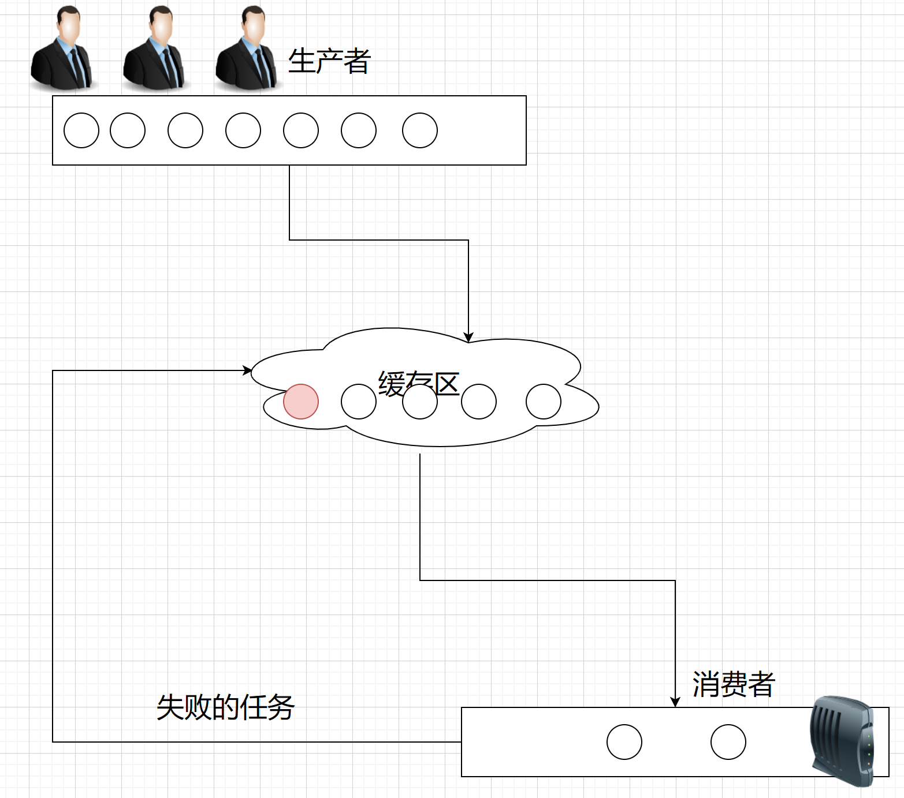

代码示例：

**1/ 生产者**

——模拟产生任务

```java
package com.doitedu;

import com.doitedu.redisUtil.JedisUtil;
import redis.clients.jedis.Jedis;
import java.util.UUID;

public class Producer {
    public static void main(String[] args) throws InterruptedException {
        //生产任务
        Jedis jedis = JedisUtil.getJedis();
        //1.创造一个生产者来生产队列
        while (true) {
            UUID uuid = UUID.randomUUID();
            String task = "task_" + uuid;    
            jedis.lpush("producer", task);
            System.out.println("33期年薪百万的程序员们开始生产优质代码了。。。" + task);
            Thread.sleep(1000);
            if (jedis.llen("producer") >= 10) {
                System.out.println("生产了10个任务了，休息一会");
                Thread.sleep(5000);
            }
        }
    }
}
```

**2/ 消费者**

——模拟处理任务，并且管理暂存队列

```java
package com.doitedu;
import com.doitedu.redisUtil.JedisUtil;
import redis.clients.jedis.Jedis;
import java.util.Random;

/**
 * 需求：任务调度系统,生产者不断产生任务，放入task-queue排队
 * 消费者不断拿出任务来处理，同时放入一个tmp-queue暂存，如果任务处理成功，
 * 则清除tmp-queue，否则，将任务弹回task-queue
 */
public class ConSumer {
    public static void main(String[] args) throws InterruptedException {
        Jedis jedis = JedisUtil.getJedis();
        Random random = new Random();
        while (true) {
            //2.放在缓冲区
            jedis.rpoplpush("producer", "temptask");
            System.out.println("生产的task放入到缓冲区了.....");
            String task = "";
            //3.消费者开始消费来的task任务，如果成功那就打印这个任务执行成功了
            int num = random.nextInt(100);
            task = jedis.rpop("temptask");
            if (num % 4 == 0) {
                jedis.lpush("temptask",task);
                System.out.println(task + ".....任务失败了");
                System.out.println("失败任务放回了缓冲区...." + task);
            } else {
                System.out.println(task + "任务处理完成...");
            }
            Thread.sleep(2000);
        }
    }
}
```

## 3.4hash

### 3.4.1**HSET**

```shell
HSET key field（hashmap 中得key） value
将哈希表 key 中的域 field 的值设为 value 。
如果 key 不存在，一个新的哈希表被创建并进行 HSET 操作。
如果域 field 已经存在于哈希表中，旧值将被覆盖。

返回值：
如果 field 是哈希表中的一个新建域，并且值设置成功，返回 1 。
如果哈希表中域 field 已经存在且旧值已被新值覆盖，返回 0 。
```

示例：

```shell
redis> HSET website google "www.g.cn"       # 设置一个新域
(integer) 1

redis> HSET website google "www.google.com" # 覆盖一个旧域
(integer) 0
```

### 3.4.2**HGET**

```shell
HGET key field
返回哈希表 key 中给定域 field 的值。

返回值：
给定域的值。
当给定域不存在或是给定 key 不存在时，返回 nil 。
```

示例：

```shell
# 域存在

redis> HSET site redis redis.com
(integer) 1

redis> HGET site redis
"redis.com"

# 域不存在

redis> HGET site mysql
(nil)
```

### 3.4.3**HMSET**

```shell
HMSET key field value [field value ...]
同时将多个 field-value (域-值)对设置到哈希表 key 中。
此命令会覆盖哈希表中已存在的域。
如果 key 不存在，一个空哈希表被创建并执行 HMSET 操作

返回值：
如果命令执行成功，返回 OK 。
当 key 不是哈希表(hash)类型时，返回一个错误。
```

示例：

```shell
redis> HMSET website google www.google.com yahoo www.yahoo.com
OK

redis> HGET website google
"www.google.com"

redis> HGET website yahoo
"www.yahoo.com"
```

### 3.4.4**HMGET**

```shell
HMGET key field [field ...]
返回哈希表 key 中，一个或多个给定域的值。
如果给定的域不存在于哈希表，那么返回一个 nil 值。
因为不存在的 key 被当作一个空哈希表来处理，所以对一个不存在的 key 进行 HMGET 操作将返回一个只带有 nil 值的表。

返回值：一个包含多个给定域的关联值的表，表值的排列顺序和给定域参数的请求顺序一样。
```

示例：

```shell
redis> HMSET pet dog "doudou" cat "nounou"    # 一次设置多个域
OK

redis> HMGET pet dog cat fake_pet             # 返回值的顺序和传入参数的顺序一样
1) "doudou"
2) "nounou"
3) (nil)                                      # 不存在的域返回nil值
```

### 3.4.5**HGETALL**

```shell
HGETALL key
返回哈希表 key 中，所有的域和值。
在返回值里，紧跟每个域名(field name)之后是域的值(value)，所以返回值的长度是哈希表大小的两倍。

返回值：
以列表形式返回哈希表的域和域的值。
若 key 不存在，返回空列表。
```

示例：

```shell
redis> HSET people jack "Jack Sparrow"
(integer) 1

redis> HSET people gump "Forrest Gump"
(integer) 1

redis> HGETALL people
1) "jack"          # 域
2) "Jack Sparrow"  # 值
3) "gump"
4) "Forrest Gump"
```

### 3.4.6**HSETNX**

```shell
HSETNX key field value
将哈希表 key 中的域 field 的值设置为 value ，当且仅当域 field 不存在。
若域 field 已经存在，该操作无效。
如果 key 不存在，一个新哈希表被创建并执行 HSETNX 命令。

返回值：
设置成功，返回 1 。
如果给定域已经存在且没有操作被执行，返回 0 。
```

示例：

```shell
redis> HSETNX nosql key-value-store redis
(integer) 1

redis> HSETNX nosql key-value-store redis       # 操作无效，域 key-value-store 已存在
(integer) 0
```

### 3.4.7**HVALS**

```shell
HVALS key
返回哈希表 key 中所有域的值。

返回值：
一个包含哈希表中所有值的表。
当 key 不存在时，返回一个空表。
```

示例：

```shell
# 非空哈希表

redis> HMSET website google www.google.com yahoo www.yahoo.com
OK

redis> HVALS website
1) "www.google.com"
2) "www.yahoo.com"


# 空哈希表/不存在的key

redis> EXISTS not_exists
(integer) 0

redis> HVALS not_exists
(empty list or set)
```

### 3.4.8**HDEL**

```shell
HDEL key field [field ...]
删除哈希表 key 中的一个或多个指定域，不存在的域将被忽略。

返回值:被成功移除的域的数量，不包括被忽略的域。
```

示例：

```shell
# 测试数据

redis> HGETALL abbr
1) "a"
2) "apple"
3) "b"
4) "banana"
5) "c"
6) "cat"
7) "d"
8) "dog"


# 删除单个域

redis> HDEL abbr a
(integer) 1


# 删除不存在的域

redis> HDEL abbr not-exists-field
(integer) 0


# 删除多个域

redis> HDEL abbr b c
(integer) 2

redis> HGETALL abbr
1) "d"
2) "dog"
```

### 3.4.9**HEXISTS**

```shell
HEXISTS key field
查看哈希表 key 中，给定域 field 是否存在。

返回值：
如果哈希表含有给定域，返回 1 。
如果哈希表不含有给定域，或 key 不存在，返回 0 。
```

示例：

```shell
redis> HEXISTS phone myphone
(integer) 0

redis> HSET phone myphone nokia-1110
(integer) 1

redis> HEXISTS phone myphone
(integer) 1
```

### 3.4.10**HKEYS**

```shell
HKEYS key
返回哈希表 key 中的所有域。

返回值：
一个包含哈希表中所有域的表。
当 key 不存在时，返回一个空表。
```

示例：

```shell
# 哈希表非空

redis> HMSET website google www.google.com yahoo www.yahoo.com
OK

redis> HKEYS website
1) "google"
2) "yahoo"


# 空哈希表/key不存在

redis> EXISTS fake_key
(integer) 0

redis> HKEYS fake_key
(empty list or set)
```

### 3.4.11HLEN

```shell
HLEN key
返回哈希表 key 中域的数量。

返回值：
哈希表中域的数量。
当 key 不存在时，返回 0 
```

示例：

```shell
redis> HSET db redis redis.com
(integer) 1

redis> HSET db mysql mysql.com
(integer) 1

redis> HLEN db
(integer) 2

redis> HSET db mongodb mongodb.org
(integer) 1

redis> HLEN db
(integer) 3
```

### 3.4.12**HINCRBY**

```shell
HINCRBY key field increment
为哈希表 key 中的域 field 的值加上增量 increment 。
增量也可以为负数，相当于对给定域进行减法操作。
如果 key 不存在，一个新的哈希表被创建并执行 HINCRBY 命令。
如果域 field 不存在，那么在执行命令前，域的值被初始化为 0 。
对一个储存字符串值的域 field 执行 HINCRBY 命令将造成一个错误。
本操作的值被限制在 64 位(bit)有符号数字表示之内。

返回值：执行 HINCRBY 命令之后，哈希表 key 中域 field 的值。
```

示例：

```shell
# increment 为正数

redis> HEXISTS counter page_view    # 对空域进行设置
(integer) 0

redis> HINCRBY counter page_view 200
(integer) 200

redis> HGET counter page_view
"200"


# increment 为负数

redis> HGET counter page_view
"200"

redis> HINCRBY counter page_view -50
(integer) 150

redis> HGET counter page_view
"150"


# 尝试对字符串值的域执行HINCRBY命令

redis> HSET myhash string hello,world       # 设定一个字符串值
(integer) 1

redis> HGET myhash string
"hello,world"

redis> HINCRBY myhash string 1              # 命令执行失败，错误。
(error) ERR hash value is not an integer

redis> HGET myhash string                   # 原值不变
"hello,world"
```

### 3.4.13**HINCRBYFLOAT**

```shell
HINCRBYFLOAT key field increment
为哈希表 key 中的域 field 加上浮点数增量 increment 。
如果哈希表中没有域 field ，那么 HINCRBYFLOAT 会先将域 field 的值设为 0 ，然后再执行加法操作。
如果键 key 不存在，那么 HINCRBYFLOAT 会先创建一个哈希表，再创建域 field ，最后再执行加法操作。
当以下任意一个条件发生时，返回一个错误：
域 field 的值不是字符串类型(因为 redis 中的数字和浮点数都以字符串的形式保存，所以它们都属于字符串类型）
域 field 当前的值或给定的增量 increment 不能解释(parse)为双精度浮点数(double precision floating point number)
HINCRBYFLOAT 命令的详细功能和 INCRBYFLOAT 命令类似，请查看 INCRBYFLOAT 命令获取更多相关信息。

返回值：执行加法操作之后 field 域的值
```

示例：

```shell
# 值和增量都是普通小数

redis> HSET mykey field 10.50
(integer) 1
redis> HINCRBYFLOAT mykey field 0.1
"10.6"


# 值和增量都是指数符号

redis> HSET mykey field 5.0e3
(integer) 0
redis> HINCRBYFLOAT mykey field 2.0e2
"5200"


# 对不存在的键执行 HINCRBYFLOAT

redis> EXISTS price
(integer) 0
redis> HINCRBYFLOAT price milk 3.5
"3.5"
redis> HGETALL price
1) "milk"
2) "3.5"


# 对不存在的域进行 HINCRBYFLOAT

redis> HGETALL price
1) "milk"
2) "3.5"
redis> HINCRBYFLOAT price coffee 4.5   # 新增 coffee 域
"4.5"
redis> HGETALL price
1) "milk"
2) "3.5"
3) "coffee"
4) "4.5"
```

## 3.5**Set（集合）&#x20;**

### 3.5.1**SADD**

```shell
SADD key member [member ...]
将一个或多个 member 元素加入到集合 key 当中，已经存在于集合的 member 元素将被忽略。
假如 key 不存在，则创建一个只包含 member 元素作成员的集合。
当 key 不是集合类型时，返回一个错误。

返回值:被添加到集合中的新元素的数量，不包括被忽略的元素。
```

示例：

```shell
# 添加单个元素

redis> SADD bbs "discuz.net"
(integer) 1


# 添加重复元素

redis> SADD bbs "discuz.net"
(integer) 0


# 添加多个元素

redis> SADD bbs "tianya.cn" "groups.google.com"
(integer) 2

redis> SMEMBERS bbs
1) "discuz.net"
2) "groups.google.com"
3) "tianya.cn"
```

### 3.5.2**SPOP**

```shell
SPOP key
移除并返回集合中的一个随机元素。
如果只想获取一个随机元素，但不想该元素从集合中被移除的话，可以使用 SRANDMEMBER 命令。
返回值:
被移除的随机元素。
当 key 不存在或 key 是空集时，返回 nil 。
```

示例：

```shell
redis> SMEMBERS db
1) "MySQL"
2) "MongoDB"
3) "Redis"

redis> SPOP db
"Redis"

redis> SMEMBERS db
1) "MySQL"
2) "MongoDB"

redis> SPOP db
"MySQL"

redis> SMEMBERS db
1) "MongoDB"
```

### 3.5.3**SCARD**

```shell
SCARD key
返回集合 key 的基数(集合中元素的数量)。

返回值：
集合的基数。
当 key 不存在时，返回 0 。
```

示例：

```shell
redis> SADD tool pc printer phone
(integer) 3

redis> SCARD tool   # 非空集合
(integer) 3

redis> DEL tool
(integer) 1

redis> SCARD tool   # 空集合
(integer) 0
```

### 3.5.4SDIFF&#x20;

```shell
SDIFF key [key ...]
返回一个集合的全部成员，该集合是所有给定集合之间的差集。
不存在的 key 被视为空集。

返回值:交集成员的列表。
```

示例：

```shell
redis> SMEMBERS peter's_movies
1) "bet man"
2) "start war"
3) "2012"

redis> SMEMBERS joe's_movies
1) "hi, lady"
2) "Fast Five"
3) "2012"

redis> SDIFF peter's_movies joe's_movies
1) "bet man"
2) "start war"
```

### 3.5.5**SDIFFSTORE**

```shell
SDIFFSTORE destination key [key ...]
这个命令的作用和 SDIFF 类似，但它将结果保存到 destination 集合，而不是简单地返回结果集。
如果 destination 集合已经存在，则将其覆盖。
destination 可以是 key 本身。

返回值:结果集中的元素数量。
```

示例：

```shell
redis> SMEMBERS joe's_movies
1) "hi, lady"
2) "Fast Five"
3) "2012"

redis> SMEMBERS peter's_movies
1) "bet man"
2) "start war"
3) "2012"

redis> SDIFFSTORE joe_diff_peter joe's_movies peter's_movies
(integer) 2

redis> SMEMBERS joe_diff_peter
1) "hi, lady"
2) "Fast Five"
```

### 3.5.6**SINTER**

```shell
SINTER key [key ...]
返回一个集合的全部成员，该集合是所有给定集合的交集。
不存在的 key 被视为空集。
当给定集合当中有一个空集时，结果也为空集(根据集合运算定律)。

返回值:交集成员的列表。
```

示例：

```shell
redis> SMEMBERS group_1
1) "LI LEI"
2) "TOM"
3) "JACK"

redis> SMEMBERS group_2
1) "HAN MEIMEI"
2) "JACK"

redis> SINTER group_1 group_2
1) "JACK"
```

### 3.5.7**SINTERSTORE**

```shell
SINTERSTORE destination key [key ...]
这个命令类似于 SINTER 命令，但它将结果保存到 destination 集合，而不是简单地返回结果集。
如果 destination 集合已经存在，则将其覆盖。
destination 可以是 key 本身。
```

示例：

```shell
redis> SMEMBERS songs
1) "good bye joe"
2) "hello,peter"

redis> SMEMBERS my_songs
1) "good bye joe"
2) "falling"

redis> SINTERSTORE song_interset songs my_songs
(integer) 1

redis> SMEMBERS song_interset
1) "good bye joe"
```

### 3.5.8**SISMEMBER &#x20;**

```shell
SISMEMBER key member    类似于exist
判断 member 元素是否集合 key 的成员。

返回值:
如果 member 元素是集合的成员，返回 1 。
如果 member 元素不是集合的成员，或 key 不存在，返回 0 。
```

示例：

```shell
redis> SMEMBERS joe's_movies
1) "hi, lady"
2) "Fast Five"
3) "2012"

redis> SISMEMBER joe's_movies "bet man"
(integer) 0

redis> SISMEMBER joe's_movies "Fast Five"
(integer) 1
```

### 3.5.9**SMEMBERS**

```shell
SMEMBERS key
返回集合 key 中的所有成员。
不存在的 key 被视为空集合。

返回值:集合中的所有成员。2
```

示例：

```shell
# key 不存在或集合为空

redis> EXISTS not_exists_key
(integer) 0

redis> SMEMBERS not_exists_key
(empty list or set)

# 非空集合

redis> SADD language Ruby Python Clojure
(integer) 3

redis> SMEMBERS language
1) "Python"
2) "Ruby"
3) "Clojure"
```

### 3.5.10**SMOVE**

```shell
SMOVE source destination member
将 member 元素从 source 集合移动到 destination 集合。
SMOVE 是原子性操作。
如果 source 集合不存在或不包含指定的 member 元素，则 SMOVE 命令不执行任何操作，仅返回 0 。否则， member 元素从 source 集合中被移除，并添加到 destination 集合中去。
当 destination 集合已经包含 member 元素时， SMOVE 命令只是简单地将 source 集合中的 member 元素删除。
当 source 或 destination 不是集合类型时，返回一个错误。

返回值:
如果 member 元素被成功移除，返回 1 。
如果 member 元素不是 source 集合的成员，并且没有任何操作对 destination 集合执行，那么返回 0 。
```

示例：

```shell
redis> SMEMBERS songs
1) "Billie Jean"
2) "Believe Me"

redis> SMEMBERS my_songs
(empty list or set)

redis> SMOVE songs my_songs "Believe Me"
(integer) 1

redis> SMEMBERS songs
1) "Billie Jean"

redis> SMEMBERS my_songs
1) "Believe Me"
```

### 3.5.11**SRANDMEMBER**

```shell
SRANDMEMBER key [count]
如果命令执行时，只提供了 key 参数，那么返回集合中的一个随机元素。
从 Redis 2.6 版本开始， SRANDMEMBER 命令接受可选的 count 参数：
如果 count 为正数，且小于集合基数，那么命令返回一个包含 count 个元素的数组，数组中的元素各不相同。如果 count 大于等于集合基数，那么返回整个集合。
如果 count 为负数，那么命令返回一个数组，数组中的元素可能会重复出现多次，而数组的长度为 count 的绝对值。
该操作和 SPOP 相似，但 SPOP 将随机元素从集合中移除并返回，而 SRANDMEMBER 则仅仅返回随机元素，而不对集合进行任何改动。
```

示例：

```shell
# 添加元素

redis> SADD fruit apple banana cherry
(integer) 3

# 只给定 key 参数，返回一个随机元素

redis> SRANDMEMBER fruit
"cherry"

redis> SRANDMEMBER fruit
"apple"

# 给定 3 为 count 参数，返回 3 个随机元素
# 每个随机元素都不相同

redis> SRANDMEMBER fruit 3
1) "apple"
2) "banana"
3) "cherry"

# 给定 -3 为 count 参数，返回 3 个随机元素
# 元素可能会重复出现多次

redis> SRANDMEMBER fruit -3
1) "banana"
2) "cherry"
3) "apple"

redis> SRANDMEMBER fruit -3
1) "apple"
2) "apple"
3) "cherry"

# 如果 count 是整数，且大于等于集合基数，那么返回整个集合

redis> SRANDMEMBER fruit 10
1) "apple"
2) "banana"
3) "cherry"

# 如果 count 是负数，且 count 的绝对值大于集合的基数
# 那么返回的数组的长度为 count 的绝对值

redis> SRANDMEMBER fruit -10
1) "banana"
2) "apple"
3) "banana"
4) "cherry"
5) "apple"
6) "apple"
7) "cherry"
8) "apple"
9) "apple"
10) "banana"

# SRANDMEMBER 并不会修改集合内容

redis> SMEMBERS fruit
1) "apple"
2) "cherry"
3) "banana"

# 集合为空时返回 nil 或者空数组

redis> SRANDMEMBER not-exists
(nil)

redis> SRANDMEMBER not-eixsts 10
(empty list or set)
```

### 3.5.12**SREM**

```shell
SREM key member [member ...]
移除集合 key 中的一个或多个 member 元素，不存在的 member 元素会被忽略。
当 key 不是集合类型，返回一个错误。

返回值:被成功移除的元素的数量，不包括被忽略的元素。

```

示例：

```shell
# 测试数据

redis> SMEMBERS languages
1) "c"
2) "lisp"
3) "python"
4) "ruby"


# 移除单个元素

redis> SREM languages ruby
(integer) 1


# 移除不存在元素

redis> SREM languages non-exists-language
(integer) 0


# 移除多个元素

redis> SREM languages lisp python c
(integer) 3

redis> SMEMBERS languages
(empty list or set)
```

### 3.5.13**SUNION**

```shell
SUNION key [key ...]
返回一个集合的全部成员，该集合是所有给定集合的并集。
不存在的 key 被视为空集。

返回值:并集成员的列表。
```

示例：

```shell
redis> SMEMBERS songs
1) "Billie Jean"

redis> SMEMBERS my_songs
1) "Believe Me"

redis> SUNION songs my_songs
1) "Billie Jean"
2) "Believe Me"
```

### 3.5.14**SUNIONSTORE**

```shell
SUNIONSTORE destination key [key ...]
这个命令类似于 SUNION 命令，但它将结果保存到 destination 集合，而不是简单地返回结果集。
如果 destination 已经存在，则将其覆盖。
destination 可以是 key 本身。

返回值:结果集中的元素数量。
```

示例：

```shell
redis> SMEMBERS NoSQL
1) "MongoDB"
2) "Redis"

redis> SMEMBERS SQL
1) "sqlite"
2) "MySQL"

redis> SUNIONSTORE db NoSQL SQL
(integer) 4

redis> SMEMBERS db
1) "MySQL"
2) "sqlite"
3) "MongoDB"
4) "Redis"
```

## 3.6**SortedSet（有序集合）**

### 3.6.1**ZADD**

```shell
ZADD key score member [[score member] [score member] ...]
将一个或多个 member 元素及其 score 值加入到有序集 key 当中。
如果某个 member 已经是有序集的成员，那么更新这个 member 的 score 值，并通过重新插入这个 member 元素，来保证该 member 在正确的位置上。
score 值可以是整数值或双精度浮点数。
如果 key 不存在，则创建一个空的有序集并执行 ZADD 操作。
当 key 存在但不是有序集类型时，返回一个错误。
对有序集的更多介绍请参见 sorted set 。
返回值:被成功添加的新成员的数量，不包括那些被更新的、已经存在的成员。
```

示例：

```shell
# 添加单个元素

redis> ZADD page_rank 10 google.com
(integer) 1

# 添加多个元素

redis> ZADD page_rank 9 baidu.com 8 bing.com
(integer) 2

redis> ZRANGE page_rank 0 -1 WITHSCORES
1) "bing.com"
2) "8"
3) "baidu.com"
4) "9"
5) "google.com"
6) "10"

# 添加已存在元素，且 score 值不变

redis> ZADD page_rank 10 google.com
(integer) 0

redis> ZRANGE page_rank 0 -1 WITHSCORES  # 没有改变
1) "bing.com"
2) "8"
3) "baidu.com"
4) "9"
5) "google.com"
6) "10"


# 添加已存在元素，但是改变 score 值

redis> ZADD page_rank 6 bing.com
(integer) 0

redis> ZRANGE page_rank 0 -1 WITHSCORES  # bing.com 元素的 score 值被改变
1) "bing.com"
2) "6"
3) "baidu.com"
4) "9"
5) "google.com"
6) "10"
```

### 3.6.2**ZCARD**

```shell
ZCARD key
    返回有序集 key 的基数。
    
返回值:
当 key 存在且是有序集类型时，返回有序集的基数。
当 key 不存在时，返回 0 。
```

示例：

```shell
redis > ZADD salary 2000 tom    # 添加一个成员
(integer) 1

redis > ZCARD salary
(integer) 1

redis > ZADD salary 5000 jack   # 再添加一个成员
(integer) 1

redis > ZCARD salary
(integer) 2

redis > EXISTS non_exists_key   # 对不存在的 key 进行 ZCARD 操作
(integer) 0

redis > ZCARD non_exists_key
(integer) 0
```

### 3.6.3**ZCOUNT**

```shell
ZCOUNT key min max   代表的是权重分数的范围
返回有序集 key 中， score 值在 min 和 max 之间(默认包括 score 值等于 min 或 max )的成员的数量。
关于参数 min 和 max 的详细使用方法，请参考 ZRANGEBYSCORE 命令。

返回值:score 值在 min 和 max 之间的成员的数量。
```

示例：

```shell
redis> ZRANGE salary 0 -1 WITHSCORES    # 测试数据
1) "jack"
2) "2000"
3) "peter"
4) "3500"
5) "tom"
6) "5000"

redis> ZCOUNT salary 2000 5000          # 计算薪水在 2000-5000 之间的人数
(integer) 3

redis> ZCOUNT salary 3000 5000          # 计算薪水在 3000-5000 之间的人数
(integer) 2
```

### 3.6.4**ZSCORE**

```shell
ZSCORE key member
返回有序集 key 中，成员 member 的 score 值。
如果 member 元素不是有序集 key 的成员，或 key 不存在，返回 nil 。
```

示例：

```shell
redis> ZRANGE salary 0 -1 WITHSCORES    # 测试数据
1) "tom"
2) "2000"
3) "peter"
4) "3500"
5) "jack"
6) "5000"

redis> ZSCORE salary peter              # 注意返回值是字符串
"3500"
```

### 3.6.5**ZINCRBY**

```shell
ZINCRBY key increment member
为有序集 key 的成员 member 的 score 值加上增量 increment 。
可以通过传递一个负数值 increment ，让 score 减去相应的值，比如 ZINCRBY key -5 member ，就是让 member 的 score 值减去 5 。
当 key 不存在，或 member 不是 key 的成员时， ZINCRBY key increment member 等同于 ZADD key increment member 。
当 key 不是有序集类型时，返回一个错误。
score 值可以是整数值或双精度浮点数。

返回值:member 成员的新 score 值，以字符串形式表示。
```

示例：

```shell
redis> ZSCORE salary tom
"2000"

redis> ZINCRBY salary 2000 tom   # tom 加薪啦！
"4000"
```

### 3.6.6**ZRANGE**

```shell
ZRANGE key start stop [WITHSCORES]    start stop指的是索引位置 -1 代表最后一个
返回有序集 key 中，指定区间内的成员。
其中成员的位置按 score 值递增(从小到大)来排序。
具有相同 score 值的成员按字典序(lexicographical order )来排列。
如果你需要成员按 score 值递减(从大到小)来排列，请使用 ZREVRANGE 命令。
下标参数 start 和 stop 都以 0 为底，也就是说，以 0 表示有序集第一个成员，以 1 表示有序集第二个成员，以此类推。
你也可以使用负数下标，以 -1 表示最后一个成员， -2 表示倒数第二个成员，以此类推。
超出范围的下标并不会引起错误。
比如说，当 start 的值比有序集的最大下标还要大，或是 start > stop 时， ZRANGE 命令只是简单地返回一个空列表。
另一方面，假如 stop 参数的值比有序集的最大下标还要大，那么 Redis 将 stop 当作最大下标来处理。
可以通过使用 WITHSCORES 选项，来让成员和它的 score 值一并返回，返回列表以 value1,score1, ..., valueN,scoreN 的格式表示。
客户端库可能会返回一些更复杂的数据类型，比如数组、元组等。
```

示例：

```shell
redis > ZRANGE salary 0 -1 WITHSCORES             # 显示整个有序集成员
1) "jack"
2) "3500"
3) "tom"
4) "5000"
5) "boss"
6) "10086"

redis > ZRANGE salary 1 2 WITHSCORES              # 显示有序集下标区间 1 至 2 的成员
1) "tom"
2) "5000"
3) "boss"
4) "10086"

redis > ZRANGE salary 0 200000 WITHSCORES         # 测试 end 下标超出最大下标时的情况
1) "jack"
2) "3500"
3) "tom"
4) "5000"
5) "boss"
6) "10086"

redis > ZRANGE salary 200000 3000000 WITHSCORES   # 测试当给定区间不存在于有序集时的情况
(empty list or set)
```

### 3.6.7**ZREVRANGE**

```shell
ZREVRANGE key start stop [WITHSCORES]
返回有序集 key 中，指定区间内的成员。
其中成员的位置按 score 值递减(从大到小)来排列。
具有相同 score 值的成员按字典序的逆序(reverse lexicographical order)排列。
除了成员按 score 值递减的次序排列这一点外， ZREVRANGE 命令的其他方面和 ZRANGE 命令一样。

返回值:指定区间内，带有 score 值(可选)的有序集成员的列表。
```

示例：

```shell
redis> ZRANGE salary 0 -1 WITHSCORES        # 递增排列
1) "peter"
2) "3500"
3) "tom"
4) "4000"
5) "jack"
6) "5000"

redis> ZREVRANGE salary 0 -1 WITHSCORES     # 递减排列
1) "jack"
2) "5000"
3) "tom"
4) "4000"
5) "peter"
6) "3500"
```

### 3.6.8**ZRANK**

```shell
ZRANK key member
返回有序集 key 中成员 member 的排名。其中有序集成员按 score 值递增(从小到大)顺序排列。
排名以 0 为底，也就是说， score 值最小的成员排名为 0 。
使用 ZREVRANK 命令可以获得成员按 score 值递减(从大到小)排列的排名。
```

示例：

```shell
redis> ZRANGE salary 0 -1 WITHSCORES        # 显示所有成员及其 score 值
1) "peter"
2) "3500"
3) "tom"
4) "4000"
5) "jack"
6) "5000"

redis> ZRANK salary tom                     # 显示 tom 的薪水排名，第二
(integer) 1
```

### 3.6.9**ZREVRANK**

```shell
ZREVRANK key member
返回有序集 key 中成员 member 的排名。其中有序集成员按 score 值递减(从大到小)排序。
排名以 0 为底，也就是说， score 值最大的成员排名为 0 。
使用 ZRANK 命令可以获得成员按 score 值递增(从小到大)排列的排名。

返回值:
如果 member 是有序集 key 的成员，返回 member 的排名。
如果 member 不是有序集 key 的成员，返回 nil 。
```

示例：

```shell
redis 127.0.0.1:6379> ZRANGE salary 0 -1 WITHSCORES     # 测试数据
1) "jack"
2) "2000"
3) "peter"
4) "3500"
5) "tom"
6) "5000"

redis> ZREVRANK salary peter     # peter 的工资排第二
(integer) 1

redis> ZREVRANK salary tom       # tom 的工资最高
(integer) 0
```

### 3.6.10**ZRANGEBYSCORE**

```shell
ZRANGEBYSCORE key min max [WITHSCORES] [LIMIT offset count]
返回有序集 key 中，所有 score 值介于 min 和 max 之间(包括等于 min 或 max )的成员。有序集成员按 score 值递增(从小到大)次序排列。(-1不代表最大的，只是代表-1这个值)
具有相同 score 值的成员按字典序(lexicographical order)来排列(该属性是有序集提供的，不需要额外的计算)。
可选的 LIMIT 参数指定返回结果的数量及区间(就像SQL中的 SELECT LIMIT offset, count )，注意当 offset 很大时，定位 offset 的操作可能需要遍历整个有序集，此过程最坏复杂度为 O(N) 时间。
```

示例：

```shell
redis> ZADD salary 2500 jack                        # 测试数据
(integer) 0
redis> ZADD salary 5000 tom
(integer) 0
redis> ZADD salary 12000 peter
(integer) 0

redis> ZRANGEBYSCORE salary -inf +inf               # 显示整个有序集
1) "jack"
2) "tom"
3) "peter"

redis> ZRANGEBYSCORE salary -inf +inf WITHSCORES    # 显示整个有序集及成员的 score 值
1) "jack"
2) "2500"
3) "tom"
4) "5000"
5) "peter"
6) "12000"

redis> ZRANGEBYSCORE salary -inf 5000 WITHSCORES    # 显示工资 <=5000 的所有成员
1) "jack"
2) "2500"
3) "tom"
4) "5000"

redis> ZRANGEBYSCORE salary (5000 400000            # 显示工资大于 5000 小于等于 400000 的成员
1) "peter"
```

### 3.6.11**ZREVRANGEBYSCORE**

```shell
ZREVRANGEBYSCORE key max min [WITHSCORES] [LIMIT offset count]
返回有序集 key 中， score 值介于 max 和 min 之间(默认包括等于 max 或 min )的所有的成员。有序集成员按 score 值递减(从大到小)的次序排列。
具有相同 score 值的成员按字典序的逆序(reverse lexicographical order )排列。
除了成员按 score 值递减的次序排列这一点外， ZREVRANGEBYSCORE 命令的其他方面和 ZRANGEBYSCORE 命令一样。
```

示例：

```shell
redis > ZADD salary 10086 jack
(integer) 1
redis > ZADD salary 5000 tom
(integer) 1
redis > ZADD salary 7500 peter
(integer) 1
redis > ZADD salary 3500 joe
(integer) 1

redis > ZREVRANGEBYSCORE salary +inf -inf   # 逆序排列所有成员
1) "jack"
2) "peter"
3) "tom"
4) "joe"

redis > ZREVRANGEBYSCORE salary 10000 2000  # 逆序排列薪水介于 10000 和 2000 之间的成员
1) "peter"
2) "tom"
3) "joe"
```

### 3.6.12**ZREM**

```shell
ZREM key member [member ...]
移除有序集 key 中的一个或多个成员，不存在的成员将被忽略。
当 key 存在但不是有序集类型时，返回一个错误。
```

示例：

```shell
# 测试数据

redis> ZRANGE page_rank 0 -1 WITHSCORES
1) "bing.com"
2) "8"
3) "baidu.com"
4) "9"
5) "google.com"
6) "10"


# 移除单个元素

redis> ZREM page_rank google.com
(integer) 1

redis> ZRANGE page_rank 0 -1 WITHSCORES
1) "bing.com"
2) "8"
3) "baidu.com"
4) "9"


# 移除多个元素

redis> ZREM page_rank baidu.com bing.com
(integer) 2

redis> ZRANGE page_rank 0 -1 WITHSCORES
(empty list or set)


# 移除不存在元素

redis> ZREM page_rank non-exists-element
(integer) 0
```

### 3.6.13Z REM RANGE  BY RANK

```shell
ZREMRANGEBYRANK key start stop
移除有序集 key 中，指定排名(rank)区间内的所有成员。
区间分别以下标参数 start 和 stop 指出，包含 start 和 stop 在内。
下标参数 start 和 stop 都以 0 为底，也就是说，以 0 表示有序集第一个成员，以 1 表示有序集第二个成员，以此类推。
你也可以使用负数下标，以 -1 表示最后一个成员， -2 表示倒数第二个成员，以此类推。
```

示例：

```shell
redis> ZADD salary 2000 jack
(integer) 1
redis> ZADD salary 5000 tom
(integer) 1
redis> ZADD salary 3500 peter
(integer) 1

redis> ZREMRANGEBYRANK salary 0 1       # 移除下标 0 至 1 区间内的成员
(integer) 2

redis> ZRANGE salary 0 -1 WITHSCORES    # 有序集只剩下一个成员
1) "tom"
2) "5000"
```

### 3.6.14**Z REM RANGE BY SCORE**

```shell
ZREMRANGEBYSCORE key min max   删除一些元素，在权重的范围内
移除有序集 key 中，所有 score 值介于 min 和 max 之间(包括等于 min 或 max )的成员。

返回值:被移除成员的数量。
```

示例：

```shell
redis> ZRANGE salary 0 -1 WITHSCORES          # 显示有序集内所有成员及其 score 值
1) "tom"
2) "2000"
3) "peter"
4) "3500"
5) "jack"
6) "5000"

redis> ZREMRANGEBYSCORE salary 1500 3500      # 移除所有薪水在 1500 到 3500 内的员工
(integer) 2

redis> ZRANGE salary 0 -1 WITHSCORES          # 剩下的有序集成员
1) "jack"
2) "5000"
```

### 3.6.15**ZUNIONSTORE**

```shell
ZUNIONSTORE destination numkeys key [key ...] [WEIGHTS weight [weight ...]] [AGGREGATE SUM|MIN|MAX]
计算给定的一个或多个有序集的并集，其中给定 key 的数量必须以 numkeys 参数指定，并将该并集(结果集)储存到 destination 。
默认情况下，结果集中某个成员的 score 值是所有给定集下该成员 score 值之 和 。
WEIGHTS
使用 WEIGHTS 选项，你可以为 每个 给定有序集 分别 指定一个乘法因子(multiplication factor)，每个给定有序集的所有成员的 score 值在传递给聚合函数(aggregation function)之前都要先乘以该有序集的因子。
如果没有指定 WEIGHTS 选项，乘法因子默认设置为 1 。
AGGREGATE
使用 AGGREGATE 选项，你可以指定并集的结果集的聚合方式。
默认使用的参数 SUM ，可以将所有集合中某个成员的 score 值之 和 作为结果集中该成员的 score 值；使用参数 MIN ，可以将所有集合中某个成员的 最小 score 值作为结果集中该成员的 score 值；而参数 MAX 则是将所有集合中某个成员的 最大 score 值作为结果集中该成员的 score 值。
```

示例：

```shell
redis> ZRANGE programmer 0 -1 WITHSCORES
1) "peter"
2) "2000"
3) "jack"
4) "3500"
5) "tom"
6) "5000"

redis> ZRANGE manager 0 -1 WITHSCORES
1) "herry"
2) "2000"
3) "mary"
4) "3500"
5) "bob"
6) "4000"

redis> ZUNIONSTORE salary 2 programmer manager WEIGHTS 1 3   # 公司决定加薪。。。除了程序员。。。
(integer) 6

redis> ZRANGE salary 0 -1 WITHSCORES
1) "peter"
2) "2000"
3) "jack"
4) "3500"
5) "tom"
6) "5000"
7) "herry"
8) "6000"
9) "mary"
10) "10500"
11) "bob"
12) "12000"
```

### 3.6.16**ZINTERSTORE**

```shell
ZINTERSTORE destination numkeys key [key ...] [WEIGHTS weight [weight ...]] [AGGREGATE SUM|MIN|MAX]
计算给定的一个或多个有序集的交集，其中给定 key 的数量必须以 numkeys 参数指定，并将该交集(结果集)储存到 destination 。
默认情况下，结果集中某个成员的 score 值是所有给定集下该成员 score 值之和.
关于 WEIGHTS 和 AGGREGATE 选项的描述，参见 ZUNIONSTORE 命令。
```

示例：

```shell
redis > ZADD mid_test 70 "Li Lei"
(integer) 1
redis > ZADD mid_test 70 "Han Meimei"
(integer) 1
redis > ZADD mid_test 99.5 "Tom"
(integer) 1

redis > ZADD fin_test 88 "Li Lei"
(integer) 1
redis > ZADD fin_test 75 "Han Meimei"
(integer) 1
redis > ZADD fin_test 99.5 "Tom"
(integer) 1

redis > ZINTERSTORE sum_point 2 mid_test fin_test
(integer) 3

redis > ZRANGE sum_point 0 -1 WITHSCORES     # 显示有序集内所有成员及其 score 值
1) "Han Meimei"
2) "145"
3) "Li Lei"
4) "158"
5) "Tom"
6) "199"
```

### 练一练：模拟lol英雄出场的TOPN

需求：每5s实时的返回每个英雄出场的频次

1.模拟用户选择英雄

```java
package com.jiang.study.redis;
import redis.clients.jedis.Jedis;
import java.util.ArrayList;
import java.util.Random;

public class Text {
    public static void main(String[] args) throws Exception {
        Jedis jedis = new Jedis("linux01", 6379);
        ArrayList<String> heros = new ArrayList<>();
        heros.add("寒冰射手");
        heros.add("瞎子");
        heros.add("齐天大圣");
        heros.add("儿童劫");
        heros.add("托儿所");
        Random random = new Random();
        while (true){
            int i = random.nextInt(heros.size());
            String hero = heros.get(i);
            System.out.println(hero+"：骑着小毛驴出场了.......");
            jedis.zincrby("hero_coming",1,hero);
            Thread.sleep(3000);
        }
    }
}
```

2.展示前三个英雄的频次

```java
package com.doitedu;

import redis.clients.jedis.Jedis;
import redis.clients.jedis.JedisPool;
import redis.clients.jedis.Tuple;

import java.util.Set;

public class redisClint {
    public static void main(String[] args) throws Exception {
//        Jedis jedis = new Jedis("linux01", 6379);
        JedisPool jedisPool = new JedisPool("linux01", 6379);
        Jedis jedis = jedisPool.getResource();

        while (true){
            Set<Tuple> hero_coming = jedis.zrevrangeWithScores("hero_coming", 0, 2);
            for (Tuple tuple : hero_coming) {
                System.out.println(tuple);
            }
            Thread.sleep(2000);
        }
    }
}
```

## **3.7GEO数据结构**

GEO数据类型支持便捷的geo地理位置计算

### 3.7.1geoadd：添加地理位置的坐标。

```shell
将给定的空间元素（纬度、经度、名字）添加到指定的键里面。 这些数据会以有序集合的形式被储存在键里面， 从而使得像 GEORADIUS 和 GEORADIUSBYMEMBER 这样的命令可以在之后通过位置查询取得这些元素。 
```

示例：

```shell
redis> GEOADD Sicily 13.361389 38.115556 "Palermo" 15.087269 37.502669 "Catania"
(integer) 2
redis> GEODIST Sicily Palermo Catania
"166274.15156960039"
redis> GEORADIUS Sicily 15 37 100 km
1) "Catania"
redis> GEORADIUS Sicily 15 37 200 km
1) "Palermo"
2) "Catania"
```

### 3.7.2geopos：获取地理位置的坐标。  &#x20;

```shell
从键里面返回所有给定位置元素的位置（经度和纬度）。
因为 GEOPOS 命令接受可变数量的位置元素作为输入， 所以即使用户只给定了一个位置元素， 命令也会返回数组回复。
```

示例：

```shell
redis> GEOADD Sicily 13.361389 38.115556 "Palermo" 15.087269 37.502669 "Catania"
(integer) 2

redis> GEOPOS Sicily Palermo Catania NonExisting
1) 1) "13.361389338970184"
   2) "38.115556395496299"
2) 1) "15.087267458438873"
   2) "37.50266842333162"
3) (nil) 
```

### 3.7.3geodist：计算两个位置之间的距离。

```shell
返回两个给定位置之间的距离。
如果两个位置之间的其中一个不存在， 那么命令返回空值。
指定单位的参数 unit 必须是以下单位的其中一个：
m 表示单位为米。
km 表示单位为千米。
mi 表示单位为英里。
ft 表示单位为英尺。
如果用户没有显式地指定单位参数， 那么 GEODIST 默认使用米作为单位。
GEODIST 命令在计算距离时会假设地球为完美的球形， 在极限情况下， 这一假设最大会造成 0.5% 的误差。
```

示例：

```shell
redis> GEOADD Sicily 13.361389 38.115556 "Palermo" 15.087269 37.502669 "Catania"
(integer) 2

redis> GEODIST Sicily Palermo Catania
"166274.15156960039"

redis> GEODIST Sicily Palermo Catania km
"166.27415156960038"

redis> GEODIST Sicily Palermo Catania mi
"103.31822459492736"

redis> GEODIST Sicily Foo Bar
(nil)
```

### 3.7.4georadius：根据用户给定的经纬度坐标来获取指定范围内的地理位置集合。

```powershell
以给定的经纬度为中心， 返回键包含的位置元素当中， 与中心的距离不超过给定最大距离的所有位置元素。
范围可以使用以下其中一个单位：
m 表示单位为米。
km 表示单位为千米。
mi 表示单位为英里。
ft 表示单位为英尺。
在给定以下可选项时， 命令会返回额外的信息：
WITHDIST ： 在返回位置元素的同时， 将位置元素与中心之间的距离也一并返回。 距离的单位和用户给定的范围单位保持一致。
WITHCOORD ： 将位置元素的经度和维度也一并返回。
WITHHASH ： 以 52 位有符号整数的形式， 返回位置元素经过原始 geohash 编码的有序集合分值。 这个选项主要用于底层应用或者调试， 实际中的作用并不大。
```

示例：

```shell
redis> GEOADD Sicily 13.361389 38.115556 "Palermo" 15.087269 37.502669 "Catania"
(integer) 2

redis> GEORADIUS Sicily 15 37 200 km WITHDIST
1) 1) "Palermo"
   2) "190.4424"
2) 1) "Catania"
   2) "56.4413"

redis> GEORADIUS Sicily 15 37 200 km WITHCOORD
1) 1) "Palermo"
   2) 1) "13.361389338970184"
      2) "38.115556395496299"
2) 1) "Catania"
   2) 1) "15.087267458438873"
      2) "37.50266842333162"

redis> GEORADIUS Sicily 15 37 200 km WITHDIST WITHCOORD
1) 1) "Palermo"
   2) "190.4424"
   3) 1) "13.361389338970184"
      2) "38.115556395496299"
2) 1) "Catania"
   2) "56.4413"
   3) 1) "15.087267458438873"
      2) "37.50266842333162"
```

### 3.7.5georadiusbymember：根据储存在位置集合里面的某个地点获取指定范围内的地理位置集合。

```shell
这个命令和 GEORADIUS 命令一样， 都可以找出位于指定范围内的元素， 但是 GEORADIUSBYMEMBER 的中心点是由给定的位置元素决定的， 而不是像 GEORADIUS 那样， 使用输入的经度和纬度来决定中心点。
```

示例：

```shell
redis> GEOADD Sicily 13.583333 37.316667 "Agrigento"
(integer) 1

redis> GEOADD Sicily 13.361389 38.115556 "Palermo" 15.087269 37.502669 "Catania"
(integer) 2

redis> GEORADIUSBYMEMBER Sicily Agrigento 100 km
1) "Agrigento"
2) "Palermo"
```

### 3.7.6geohash：返回一个或多个位置对象的 geohash 值。

```shell
返回一个或多个位置元素的 Geohash 表示。
返回值
一个数组， 数组的每个项都是一个 geohash 。 命令返回的 geohash 的位置与用户给定的位置元素的位置一一对应。
```

示例：

```shell
redis> GEOADD Sicily 13.361389 38.115556 "Palermo" 15.087269 37.502669 "Catania"
(integer) 2

redis> GEOHASH Sicily Palermo Catania
1) "sqc8b49rny0"
2) "sqdtr74hyu0"
```

## 6.8**BitMap数据结构**

位图（也称为位数组或位向量）是由比特位（bit)组成的数组。redis 中的位图并不是一种新的数据类型，它实际的底层数据类型是字符串。因为字符串本质上是二进制大对象（BLOB，BinaryLarge OBject )，所以可以将其视做位图。同时，因为位图存储的是布尔信息，所以在某些情况下可以节省大量的内存空间。

```shell
对 key 所储存的字符串值，设置或清除指定偏移量上的位(bit)。
位的设置或清除取决于 value 参数，可以是 0 也可以是 1 。
当 key 不存在时，自动生成一个新的字符串值。
字符串会进行伸展(grown)以确保它可以将 value 保存在指定的偏移量上。当字符串值进行伸展时，空白位置以 0 填充。
```

### **6.8.1SETBIT**

示例：

```shell
redis> SETBIT bit 10086 1
(integer) 0

redis> GETBIT bit 10086
(integer) 1

redis> GETBIT bit 100   # bit 默认被初始化为 0
(integer) 0
```

### 6.8.2**GETBIT**

```shell
对 key 所储存的字符串值，获取指定偏移量上的位(bit)。
当 offset 比字符串值的长度大，或者 key 不存在时，返回 0 。
```

示例：

```shell
# 对不存在的 key 或者不存在的 offset 进行 GETBIT， 返回 0

redis> EXISTS bit
(integer) 0

redis> GETBIT bit 10086
(integer) 0


# 对已存在的 offset 进行 GETBIT

redis> SETBIT bit 10086 1
(integer) 0

redis> GETBIT bit 10086
(integer) 1
```

### 6.8.3**BITCOUNT**

```shell
计算给定字符串中，被设置为 1 的比特位的数量。
一般情况下，给定的整个字符串都会被进行计数，通过指定额外的 start 或 end 参数，可以让计数只在特定的位上进行。
start 和 end 参数的设置和 GETRANGE key start end 命令类似，都可以使用负数值： 比如 -1 表示最后一个字节， -2 表示倒数第二个字节，以此类推。
不存在的 key 被当成是空字符串来处理，因此对一个不存在的 key 进行 BITCOUNT 操作，结果为 0 
返回值
被设置为 1 的位的数量。
```

示例：

```shell
redis> BITCOUNT bits
(integer) 0

redis> SETBIT bits 0 1          # 0001
(integer) 0

redis> BITCOUNT bits
(integer) 1

redis> SETBIT bits 3 1          # 1001
(integer) 0

redis> BITCOUNT bits
(integer) 2
```

### 练一练：bitmap应用案例：多维数据分析（层级聚合）

```powershell
有如下表数据：t_a
province,city,region,uid
江苏省,南通市,通南区,u01
江苏省,南通市,通南区,u01
江苏省,南通市,通南区,u02
江苏省,南通市,通南区,u03
江苏省,南通市,通南区,u03
江苏省,南通市,桶北区,u04
江苏省,南通市,桶北区,u02
江苏省,南通市,桶北区,u05
江苏省,南通市,桶北区,u05
江苏省,苏州市,苏南区,u02
江苏省,苏州市,苏南区,u02
江苏省,苏州市,苏南区,u08
江苏省,苏州市,苏北区,u06
江苏省,苏州市,苏北区,u02
江苏省,苏州市,苏北区,u06
 
 
--求如下维度聚合 
省,市,区,uv数
 
select
province,
city,
region,
bitmap(uid) as uid_bitmap
from t_a
group by province,city,region;
 
江苏省,南通市,通南区,[1,1,1,0,0,0,0,0]
江苏省,南通市,桶北区,[0,1,0,1,1,0,0,0]
江苏省,苏州市,苏南区,[0,1,0,0,0,0,0,1]
江苏省,苏州市,苏北区,[0,1,0,0,0,1,0,0]
 
-- 再求如下维度聚合
省,市,uv数
江苏省,南通市,[1,1,1,1,1,0,0,0]
江苏省,苏州市,[0,1,0,0,0,1,0,1]
 
 
-- 再求如下维度聚合：
省,uv数
江苏省,[1,1,1,1,1,1,0,1]
```

### 6.8.4**BITPOS**

```shell
返回位图中第一个值为 bit 的二进制位的位置。
在默认情况下， 命令将检测整个位图， 但用户也可以通过可选的 start 参数和 end 参数指定要检测的范围。
```

示例：

```shell
127.0.0.1:6379> SETBIT bits 3 1    # 1000
(integer) 0

127.0.0.1:6379> BITPOS bits 0
(integer) 0

127.0.0.1:6379> BITPOS bits 1
(integer) 3
```

### 6.8.5**BITOP**

```shell
对一个或多个保存二进制位的字符串 key 进行位元操作，并将结果保存到 destkey 上。
operation 可以是 AND 、 OR 、 NOT 、 XOR 这四种操作中的任意一种： 
BITOP AND destkey key [key ...] ，对一个或多个 key 求逻辑并，并将结果保存到 destkey 。
BITOP OR destkey key [key ...] ，对一个或多个 key 求逻辑或，并将结果保存到 destkey 。
BITOP XOR destkey key [key ...] ，对一个或多个 key 求逻辑异或，并将结果保存到 destkey 。
BITOP NOT destkey key ，对给定 key 求逻辑非，并将结果保存到 destkey 。 不同的取1 相同取0
除了 NOT 操作之外，其他操作都可以接受一个或多个 key 作为输入。
```

示例:

```shell
redis> SETBIT bits-1 0 1        # bits-1 = 1001
(integer) 0

redis> SETBIT bits-1 3 1
(integer) 0

redis> SETBIT bits-2 0 1        # bits-2 = 1011
(integer) 0

redis> SETBIT bits-2 1 1
(integer) 0

redis> SETBIT bits-2 3 1
(integer) 0

redis> BITOP AND and-result bits-1 bits-2
(integer) 1

redis> GETBIT and-result 0      # and-result = 1001
(integer) 1

redis> GETBIT and-result 1
(integer) 0

redis> GETBIT and-result 2
(integer) 0

redis> GETBIT and-result 3
(integer) 1
```

## 6.9**HyperLogLog数据结构**

## 6.9.1HyperLogLog算法介绍

**基数计数(cardinality counting)&#x20;**&#x901A;常用来统计一个集合中不重复的元素个数，例如统计某个网站的UV，或者用户搜索网站的关键词数量。数据分析、网络监控及数据库优化等领域都会涉及到基数计数的需求。&#x20;

要实现基数计数，最简单的做法是记录集合中所有不重复的元素集合，当新来一个元素，若集合中不包含元素，则将加入，否则不加入，计数值就是的元素数量。这种做法存在两个问题：

1\. 当统计的数据量变大时，相应的存储内存也会线性增长

2\. 当集合变大，判断其是否包含新加入元素的成本变大

在redis 中，如果我们不需要获取数据集的内容，而只是想得到不同值的个数，那么就可以使用HyperLogLog( HLL）数据类型来优化使用集合类型时存在的内存和性能问题。

### 6.9.2用法示例：

```shell
doitedu03:6379> PFADD HN:CS abc
(integer) 1
doitedu03:6379> PFADD HN:CS bbb
(integer) 1
doitedu03:6379> PFADD HN:CS ccc
(integer) 1
doitedu03:6379> PFADD HN:CS bbc
(integer) 1
doitedu03:6379> PFADD HN:CS bbc
(integer) 0
doitedu03:6379> PFCOUNT HN:CS
(integer) 4
 
doitedu03:6379> PFADD HN:ZZ bbb
(integer) 1
doitedu03:6379> PFADD HN:ZZ ccc
(integer) 1
doitedu03:6379> PFADD HN:ZZ ddd
(integer) 1
doitedu03:6379> PFADD HN:ZZ eee
(integer) 1
doitedu03:6379> PFCOUNT HN:ZZ
(integer) 4
 
doitedu03:6379> PFMERGE HN HN:ZZ HN:CS
OK
doitedu03:6379> PFCOUNT HN
(integer) 6
```

### 找规律：

给定N个随机得整数，从右往左数0得个数记录最大的K值，找K和N得关系。  &#x20;

hash算法转换成16位的二进制

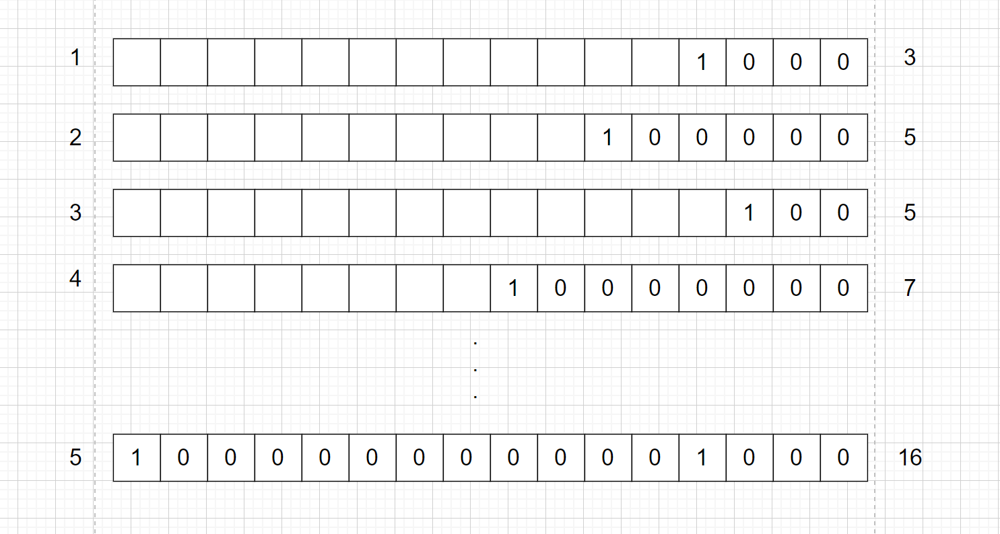

结论：

| N(我一共去了几个数字) | log2(N) | K(最大的0的个数) |
| ------------ | ------- | ---------- |
| 3400         | 11.73   | 11         |
| 3500         | 11.77   | 12         |
| 4000         | 11.97   | 12         |
| 4100         | 12.00   | 14         |
| 9100         | 13.15   | 13         |
| 9200         | 13.17   | 16         |
| 9700         | 13.24   | 12         |
| 9800         | 13.26   | 15         |
| 9900         | 13.27   | 13         |
| 10000        | 13.29   | 13         |

结论：数学结论N ≈ 2^k      N是我一共传进去多少个数   K 是最后我数出来0的个数

如果N介于（2^k,2^k+1），用这种方式估值计算的值都等于2^k，显然误差比较大，所以用加权的方式来降低误差。

加权公式：


### **6.9.3redis中的Hyperloglog**

[redis](https://cloud.tencent.com/product/crs?from=10680)使用16384个分桶来实现HLL结构，使标准误差达到0.8125％。 12k的内存  能过统计2的50次方的数

redis使用的散列函数具有64位输出，这意味着它使用前14位来寻找“桶”，剩下的50位用于计算右边的0的数量。正如我们之前看到的，每个存储子集将存储最大的“连0数”，最大可能为50（因为散列中只有50个剩余位可以是0），每个存储子集需要6位才能能够存储最多50个（二进制为110010）。因此我们得到98304个bit来存储1个HLL结构；如果我们将这些bit转换为byte，我们得到6\*16384/8 = 12288个byte（或12kb）这就是hyperloglog在redis实现占用的空间大小。

### 6.9.4算法原理

**Hyperloglog(HLL)是从Loglog算法派生的概率算法**，用于确定非常大的集合的基数，而不需要存储其所有值。

正如之前所说，常规集合或位图可能非常耗费资源。HLL使用固定大小的结构来解决这个问题，根据实际使用情况，它可以低于16kb。作为低资源需求的代价，基数测量是概率性的，意味着具有小于2％的误差。也就是说：

假设我们有一个1000000个ID的集合，

2％的错误意味着有可能在计算基数时错过1000000个唯一身份用户，为20000

然后，我们可以得到以下两种最坏情况（1000000-20000）= 980.000 || （1000000 + 20000）= 1020000

看起来误差有点多，实际中大多数情况下HLL实现的错误率低于1％。而且由于存在错误率，所以使用HLL表示在其应用场景该误差是可以接受的。

**HyperLogLog基本原理&#x20;**

HLL的严格数学论证在这里不作解释，通俗来说HLL是通过散列中左边连续0的数量来估计给定集合的基数，因为一个好的哈希算法可以确保我们每个可能的散列具有大致相同的出现概率和均匀分布。这允许HLL算法基于具有最左边0的流的散列来估计它已经“看到”的元素的量。例如，假设我有一个哈希函数，给定一个元素它返回数字0-15的二进制表示：

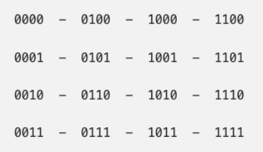

其中二进制共有4位，每位出现0的概率是1/2,所以如果连续出现四个0则元素个数至少有16个，那么我如果得到一个左边有k个0元素则至少有2(k)个元素。

但是如果集合中只有一个元素，且元素每一位都是0怎么办，这时候就需要采用HLL中的分桶平均法了。分桶平均的基本原理是将统计数据划分为m个桶，每个桶分别统计各自的最大连续0个数并能得到各自的基数预估值 ，最终求其调和平均数即可，举个例子我们将集合划分为8个子集，那么需要将哈希值的前3位用于子集寻址，后几位从左边统计连续0的个数。

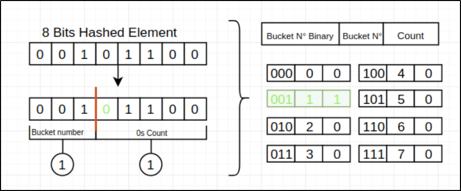

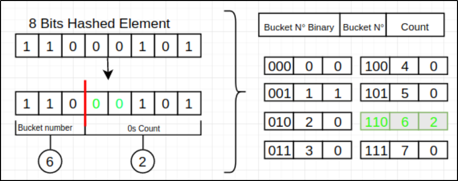

然后对各桶的预估基数求**调和平均值**，作为最终的预估值


**分段偏差修正**

在HLLC的论文中，作者在实现建议部分还给出了在n相对于m较小或较大时的偏差修正方案。具体来说，设E为估计值：

当E <= 5m/2时，使用LC进行估计。

当 5m/2 < E <= 2(32)/30时，使用上面给出的HLC公式进行估计。

当 E > 2(32)/30时，估计公式如为

关于分段偏差修正效果分析也可以在算法原论文中找到。

> 严格的数学证明，需要用到伯努利分布，多重伯努利实验以及似然估计等数学知识；参考
>
> <https://www.cnblogs.com/linguanh/p/10460421.html>
>
> <https://www.yuque.com/abser/aboutme/nfx0a4>
>
> <https://zhuanlan.zhihu.com/p/77289303>
>
> <https://zhuanlan.zhihu.com/p/26614750>  一文搞懂极大似然估计

# 4.其他数据功能

## 4.1**pubsub发布订阅**

Redis 发布订阅(pub/sub)是一种消息通信模式：发送者(pub)发送消息，订阅者(sub)接收消息。

Redis 客户端可以订阅任意数量的频道。

下面示例展示了频道 channel1 ， 以及订阅这个频道的三个客户端 —— client2 、 client5 和 client1 之间的关系：

**发布者**

```shell
192.168.77.51:6379>publish channel1 频道名称
(integer) 1
192.168.77.51:6379> publish channel1 bbb
(integer) 1
192.168.77.51:6379> publish channel1 ccc
(integer) 1
```

**订阅者1：**

```shell
[root@doitedu04 redis6]# bin/redis-cli -h 192.168.77.54 -p 6379 -c
192.168.77.54:6379> subscribe channel1
Reading messages... (press Ctrl-C to quit)
```

**订阅者2：**

```shell
192.168.77.53:6379> subscribe channel1
Reading messages... (press Ctrl-C to quit)
```

对频道的生命周期而言，如果给定的频道之前未曾被订阅过，那么SUBSCRIBE命令会自动创建频道。此外，当频道上没有活跃的订阅者时，频道将会被删除。

PubSub相关的机制均不支持持久化。这意味着，消息、频道和 PubSub的关系均不能保存到磁盘上。如果服务器出于某种原因退出，那么所有的这些对象都将丢失。

此外,在消息投递和处理场景中,如果频道没有订阅者,那么被发到频道上的消息将被丢弃。换句话说，redis并没有保证消息投递可靠性的机制。

总之，虽然redis 中的PubSub功能并不适合重要消息的投递场景，但是有些人可能会由于其简洁的通信方式而在速度方面获益。

## 4.2**pipeline管道操作**

可以一次性的执行多个命令，redis的指令执行是单线程 : \[sadd  set  get  lpush  lrange]  --->  (统一执行)，简而言之就是将一系列的命令一起打包。写个脚本运行

示例：

如果有大量命令需要执行，如：

```shell
get a
set b aaa
set c ddd
set x yyy
get x
incr d
set y uuu
```

如果一条一条去执行，则每次命令执行都要经历网络请求、服务器执行、网络响应！而其中，网络请求、网络响应所耗费的时间是很浪费的；

可以利用pipeline将这一系列命令，一次性发给redis去执行，然后一次性返回结果，极大提高效率；

redis客户端和服务器之间典型的通信过程可以看作:

1. 客户端向服务器发送一个命令。发一个pipeline这个命令

2. 服务器接收该命令并将其放入执行队列（因为redis是单线程的执行模型)。

3. 命令被执行。

4. 服务器将命令执行的结果返回给客户端。

使用redis管道(pipeline)可以加快上述的过程。**redis管道的基本思想是,客户端将多个命令打包在一起，并将它们一次性发送，而不再等待每个单独命令的执行结果;**&#x540C;时，redis管道需要服务器在执行所有的命令后再返回结果。即便是执行多个命令，但由于第1步和第4步只发生一次,时间会大大减少。

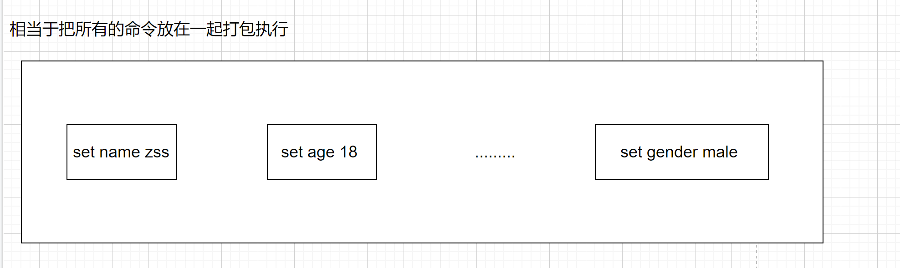

示例：1.准备一个文件，放入一批命令

```shell
[root@doitedu01 ~]# cat pipeline.txt 
set a 111
set b 222
sadd set:x v1 v2
get a
scard myset
```

2.使用redis-cli的--pipe选项，通过管道发送命令:

```shell
[root@doitedu03 redis6]# cat /root/pipeline.txt | bin/redis-cli -h linux01 --pipe

All data transferred. Waiting for the last reply...
Last reply received from server.
 
用于更新数据  , 插入数据的数据操作命令  查询数据  数据不会返回 
```

## **4.3Multi事务操作**

事务是一组原子性的操作 , 在原子中所有的操作要么全部成功 , 要么全部失败 !

原子性

一致性

隔离性

持久性

所谓事务，就是把一系列的操作绑定成一个原子操作，其中一个操作失败，就会让整个操作全部失败（回滚）

&#x20;但是，redis并没有实现严格的事务；不支持失败回滚

### 4.3.1基本操作

示例：

* 开启事务： multi

* 提交事务： exec

```shell
doit01:6379> multi
OK
doit01:6379(TX)> set a 1
QUEUED
doit01:6379(TX)> set b 2
QUEUED
doit01:6379(TX)> set c aaa
QUEUED
doit01:6379(TX)> incr c
QUEUED
doit01:6379(TX)> set d 3
QUEUED
doit01:6379(TX)> set e 4
QUEUED
doit01:6379(TX)> exec
```

> 这个事务控制中，就算有某个步骤执行失败，也不会影响其他步骤的执行！

### **4.3.2watch  + 事务**

监听:  mysql中的数据如果发生变化 (今天更新的数据)  binlog

mysql中有binlog ,默认服务是关闭的, 开启binlog监控服务 , 当mysql中的数据发生变化, 记录在binlog中 , 我们可以监听binlog的变化, 确定数据的变化!

watch是用于监视一个指定的key是否被修改

watch +事务，可以用于在事务开启之前，监视指定key，如果这个key在事务提交前被修改，则事务就会自动取消（discard）

示例：

```shell
doit01:6379> watch b
OK
doit01:6379> multi
OK
doit01:6379(TX)> set a 1
QUEUED
doit01:6379(TX)> set b 20
QUEUED
doit01:6379(TX)> set c 30
QUEUED
doit01:6379(TX)> exec
(nil)

当我在事务没有提交之前，修改了b的值，那么，这个事务就会被自动取消
```

# **5.redis数据持久化**

Redis是基于内存的，如果不想办法将数据保存在硬盘上，一旦Redis重启(退出/故障)，内存的数据将会全部丢失。(业务库中缓存的数据 , 存储的一些重要的标签, 状态数据)

我们肯定不想Redis里头的数据由于某些故障全部丢失(导致所有请求都走MySQL)，即便发生了故障也希望可以将Redis原有的数据恢复过来，这就是持久化的作用。

Redis提供了两种不同的持久化方法来将数据存储到硬盘里边：

* RDB(基于快照)，将某一时刻的内存中的所有数据保存到一个RDB文件中（二进制带压缩）

* AOF(append-only-file)，当Redis服务器执行写命令的时候，将执行的写命令保存到AOF文件中。

## 5.1**RDB(快照持久化)**

RDB持久化可以手动执行，也可以根据服务器配置定期执行。RDB持久化所生成的RDB文件是一个经过压缩的二进制文件，Redis可以通过这个文件还原数据库的数据。

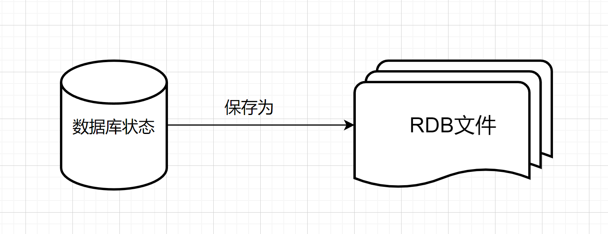

有两个命令可以生成RDB文件：

* SAVE会阻塞Redis服务器进程，服务器不能接收任何请求，直到RDB文件创建完毕为止  会阻塞  同步的

* BGSAVE创建（fork）出一个子进程，由子进程来负责创建RDB文件，服务器进程可以继续接收请求。

Redis服务器在启动的时候，如果发现有RDB文件，就会自动载入RDB文件(不需要人工干预)

服务器在载入RDB文件期间，会处于阻塞状态，直到载入工作完成。

除了手动调用SAVE或者BGSAVE命令生成RDB文件之外，我们可以使用配置的方式来定期执行：

在默认的配置下，如果以下的条件被触发，就会执行BGSAVE命令

示例：

```shell
----------rdb快照------------
save 900 1      前面是时间   后面是操作次数
save 300 10
save 60 10000

stop-writes-on-bgsave-error yes  
当启用了RDB且最后一次后台保存数据失败，Redis是否停止接收数据
rdbcompression yes  
对于存储到磁盘中的快照，可以设置是否进行压缩存储。      
如果是的话，redis会采用LZF算法进行压缩。
如果你不想消耗CPU来进行压缩的话，可以设置为关闭此功能，但是存储在磁盘上的快照会比较大。  
rdbchecksum yes
默认值是yes。在存储快照后，我们还可以让redis使用CRC64算法来进行数据校验，
但是这样做会增加大约10%的性能消耗，如果希望获取到最大的性能提升，可以关闭此功能。  
dbfilename dump.rdb
设置快照的文件名，默认是 dump.rdb  
dir ./
设置快照文件的存放路径，这个配置项一定是个目录，而不能是文件名。
使用上面的 dbfilename 作为保存的文件名。
```

手动触发持久化

```shell
save    他会阻塞  ==》 在保存dump.rdb文件完成之前，不能在客户端做任何的操作
bgsave  后台取保存  ==》 在后台开一个线程，单独的为你保存dump.rdb这个文件
CONFIG GET dir   数据恢复只需要将指定的dump.rdb文件导入到安装目录下即可
```

## **5.2AOF(文件追加)&#x20;**

上面已经介绍了RDB持久化是通过将某一时刻数据库的数据“快照”来实现的，下面我们来看看AOF是怎么实现的。

示例：

```sql
APPEND ONLY MODE
appendonly no   
默认该模式关闭

appendfilename "appendonly.aof"

aof文件名，默认是"appendonly.aof"


# appendfsync always
appendfsync everysec
# appendfsync no
aof持久化策略的配置；

no表示不执行fsync，由操作系统保证数据同步到磁盘，速度最快；
always表示每次写入都执行fsync，以保证数据同步到磁盘； 最多丢一条数据
everysec表示每秒执行一次fsync，可能会导致丢失这1s数据

no-appendfsync-on-rewrite：
在aof重写或者写入rdb文件的时候，会执行大量IO，此时对于everysec和always的aof模式来说，
执行fsync会造成阻塞过长时间，no-appendfsync-on-rewrite字段设置为默认设置为no。
如果对延迟要求很高的应用，这个字段可以设置为yes，否则还是设置为no，
这样对持久化特性来说这是更安全的选择。   
设置为yes表示rewrite期间对新写操作不fsync,暂时存在内存中,等rewrite完成后再写入，
默认为no，建议yes。Linux的默认fsync策略是30秒。可能丢失30秒数据。默认值为no。

auto-aof-rewrite-percentage 100
默认值为100。aof自动重写配置，当目前aof文件大小超过上一次重写的aof文件大小的百分之多少
进行重写，即当aof文件增长到一定大小的时候，Redis能够调用bgrewriteaof对日志文件进行重写。
当前AOF文件大小是上次日志重写得到AOF文件大小的二倍（设置为100）时，自动启动新的日志重写过程。

auto-aof-rewrite-min-size 64mb
设置允许重写的最小aof文件大小，避免了达到约定百分比但尺寸仍然很小的情况还要重写。

aof-load-truncated yes
如果AOF文件结尾损坏，Redis启动时是否仍载入AOF文件
```

AOF是通过保存Redis服务器所执行的写命令来记录数据库的数据的。


```plain&#x20;text
比如说我们对空白的数据库执行以下写命令：
redis> SET meg "hello"
OK

redis> SADD fruits "apple" "banana" "cherry"
(integer) 3

redis> RPUSH numbers 128 256 512
(integer) 3 
 
Redis会产生以下内容的AOF文件
```

## **5.3AOF重写（BGREWRITEAOF命令）**

```shell
数据库经历了如下操作
set a 1
set a 2
set a 3
set a 4
set a 5
set a 6
set a 7
set a 8
那么，aof中的记录也会有上述的8条
然而，数据库中的最终状态仅仅是：  a  -> 8
那么，aof中的大量记录都是冗余无效的，可以执行rewrite操作来精简体积提高效率
==>  rewrite aof
set a 8
可以通过配置让redis自动定期对aof文件进行重写
也可以用命令来触发aof重写：  BGREWRITEAOF
```

## **5.4持久化方式的选择**

RDB和AOF并不互斥，它俩可以同时使用。

* RDB的优点：载入时恢复数据快、文件体积小。

* RDB的缺点：会一定程度上丢失数据(因为系统一旦在定时持久化之前出现宕机现象，此前没有来得及写入磁盘的数据都将丢失。)

* AOF的优点：丢失数据少(默认配置只丢失一秒的数据)。

* AOF的缺点：恢复数据相对较慢，文件体积大

如果Redis服务器同时开启了RDB和AOF持久化，服务器会优先使用AOF文件来还原数据(因为AOF更新频率比RDB更新频率要高，还原的数据更完善)

## **5.5相关参数**

```plain&#x20;text
redis持久化，两种方式
1、rdb快照方式
2、aof日志方式
----------rdb快照------------
save 900 1
save 300 10
save 60 10000

stop-writes-on-bgsave-error yes
rdbcompression yes
rdbchecksum yes
dbfilename dump.rdb
dir /var/rdb/

-----------Aof的配置-----------
appendonly no # 是否打开 aof日志功能

appendfsync always #每一个命令都立即同步到aof，安全速度慢
appendfsync everysec
appendfsync no #写入工作交给操作系统，由操作系统判断缓冲区大小，统一写入到aof  同步频率低，速度快


no-appendfsync-on-rewrite yes #正在导出rdb快照的时候不要写aof
auto-aof-rewrite-percentage 100
auto-aof-rewrite-min-size 64mb 
```

# 6.**缓存**

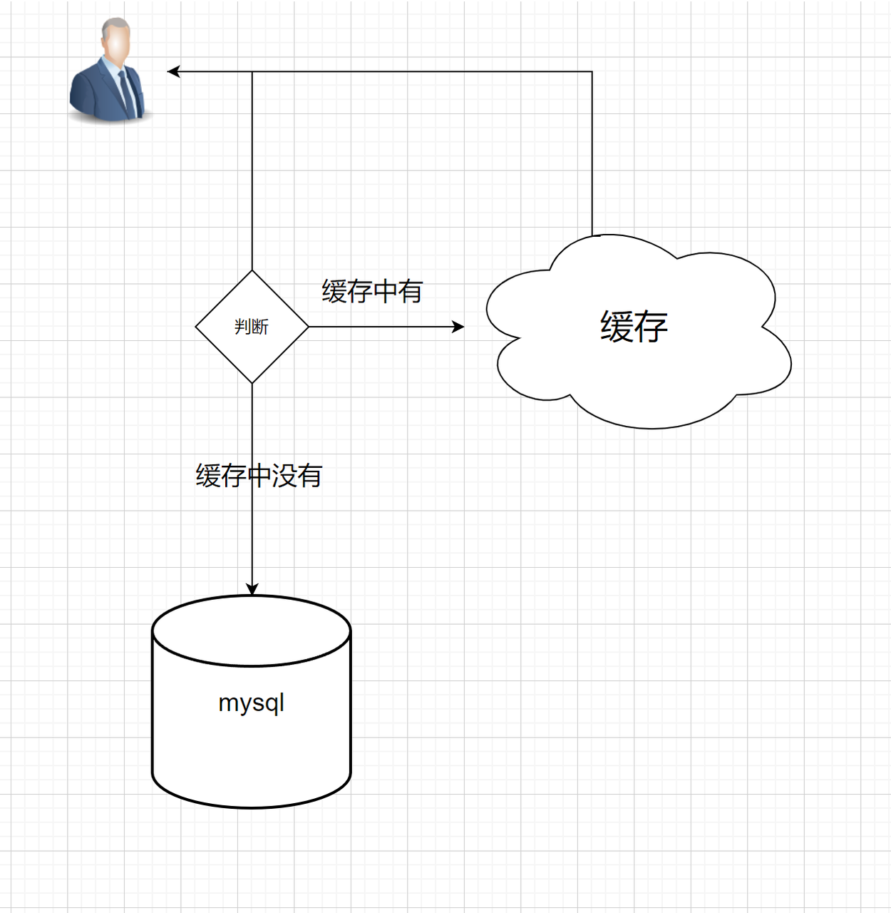

## **6.1缓存更新方式**

这是决定在使用缓存时就该考虑的问题。

* 设置缓存数据的TTL，当缓存数据失效后，如果有系统要请求，则会查询数据库并插入缓存（被动更新） 不友好

* 在各类会往mysql写入数据的系统中，植入更新缓存的逻辑（判断哪些表的数据是热点数据，那么就可以在这些表数据的更新操作逻辑中植入缓存刷新逻辑）

（严重弊端：将缓存更新逻辑与系统的业务逻辑高度耦合）后期维护很麻烦

* 异步更新：开发一个异步任务，定期从mysql数据库中读取“热门表”的数据更新缓存（时效性低）

* 利用canal监听mysql的binlog写入kafka，开发一个更新程序，消费kafka中的binlog信息，并根据“热度方案”进行缓存数据的更新；
  (时效性强！对业务系统的mysql数据库几乎不带来任何压力！跟业务系统完全没有耦合，修改扩展维护都很方便）

## **6.2数据不一致**

第二个问题是数据不一致的问题，可以说只要使用缓存，就要考虑如何面对这个问题。缓存不一致产生的原因一般是主动更新失败，例如更新 DB 后，更新 Redis 因为网络原因请求超时；或者是异步更新失败导致。

解决的办法是，如果服务对耗时不是特别敏感可以增加重试；如果服务对耗时敏感可以通过异步补偿任务来处理失败的更新，或者短期的数据不一致不会影响业务，那么只要下次更新时可以成功，能保证最终一致性就可以。

## **6.3 缓存穿透**

有人、系统，频繁查询数据库中不存在的数据；那么，缓存相当于不存在！

产生这个问题的原因可·能是外部的恶意攻击，例如，对用户信息进行了缓存，但恶意攻击者使用不存在的用户id频繁请求接口，导致查询缓存不命中，然后穿透 DB 查询依然不命中。这时会有大量请求穿透缓存访问到 DB。&#x20;

解决的办法如下：

对不存在的数据，在缓存中保存一个空对象进行标记，防止相同 ID 再次访问 DB。不过有时这个方法并不能很好解决问题，可能导致缓存中存储大量无用数据

使用 BloomFilter 过滤器，BloomFilter 的特点是存在性检测，如果 BloomFilter 中不存在，那么数据一定不存在；如果 BloomFilter 中存在，实际数据也有可能会不存在。非常适合解决这类的问题&#x20;

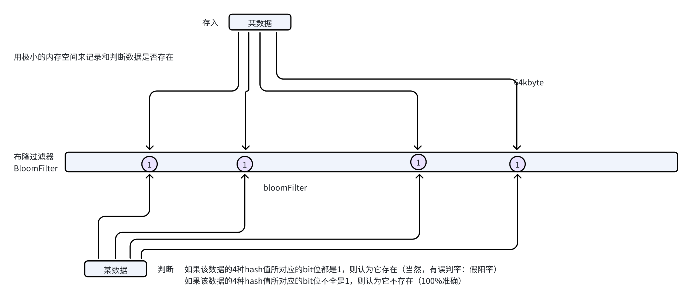


## **6.4 缓存击穿**

就是缓存中的某个热点数据同时失效时，大量针对这个数据的同时请求会穿透到数据源。

解决这个问题有如下办法：

方式一：可以使用互斥锁更新，保证同一个进程中的多个线程针对同一个数据不会并发请求到 DB，减小 DB 压力。但是查询的效率相对会低很多；

方式二：修改程序的查询逻辑：查询到缓存数据则罢了；如果没查到，则sleep一个随机（2-5ms）再查一次缓存；


辅助手段：插入数据到缓存时，失效时间加点随机数来增加时效时间的随机性，避免多个热点key同时失效；


## **6.5 缓存雪崩&#x20;**

缓存雪崩是指缓存中的大量数据在同一时间失效，导致请求大量涌入数据库或其他后端系统，从而引发系统过载或崩溃的现象。

缓存雪崩通常会造成严重的性能问题，甚至可能导致服务不可用。


* 加强缓存系统的可靠性：可以配置主从集群；

* **缓存失效时间随机化**：为缓存的数据设置随机的失效时间，避免大量缓存数据在同一时间失效。

* **双重缓存策略**：使用两级缓存系统，一级缓存失效后，先查询二级缓存，从而减少对数据库的直接压力。

* **预热缓存**：系统启动后，提前加载热点数据到缓存中，减少缓存冷启动时的高并发问题。

**限流降级**：在高并发情况下，对访问频率进行限流，同时设置降级策略，在缓存失效时直接返回默认值或从备用服务获取数据。


# **6.6 缓存淘汰机制**

## **TTL 删除策略**

可以为数据设置TTL（存活时长），时长一到，数据就会被删除

缓存数据TTL的删除策略可分为三种

* 定时删除(对内存友好，对CPU不友好)

到时间点上就把所有过期的键删除了。

* 惰性删除(对CPU极度友好，对内存极度不友好)

每次取键的时候，判断一下该键是否过期了，如果过期了就删除。

* 定期删除(折中)

每隔一段时间去检查及删除过期键，限制删除的执行时长和频率。

Redis的过期数据的删除策略：采用的是惰性删除+定期删除两种策略。所以说，在Redis里边如果过期键到了过期的时间了，未必被立马删除的！

## **LRU（least recently used）淘汰策略**

Redis可以设置内存最大使用量，当内存使用量超出阈值时，会执行数据淘汰策略。

Redis的内存数据淘汰机制有以下几种：

| 策略              | 描述                           |
| --------------- | ---------------------------- |
| volatile-lru    | 从已设置过期时间的数据集中挑选最近最少使用的数据进行淘汰 |
| volatile-ttl    | 从已设置过期的时间数据集中挑选将要过期的数据淘汰     |
| volatile-random | 从已设置过期时间的数据集中任意选择数据淘汰        |
| allkeys-lru     | 从所有数据集中挑选最近最少使用的数据淘汰         |
| allkeys-random  | 从所有数据集中任意选择数据进行淘汰            |
| noeviction      | 禁止驱逐数据                       |
| volatile-lfu    | 从已设置过期时间的数据集中使用LFU策略淘汰       |

> 一般场景：
>
> 使用 Redis 缓存数据时，为了提高缓存命中率，尽量将所有热数据存在缓存中，可以将内存最大使用量设置为热点数据占用的内存量，然后启用allkeys-lru淘汰策略，将最近最少使用的数据淘汰
>
>
>
> LRU概念
>
> LRU（The Least Recently Used，最近最少未使用）是一种常见内存管理算法，最早应用于Linux操作系统，在Redis中也有广泛使用的。
>
> LRU算法有这样一种假设：如果某个数据长期不被使用，在未来被用到的几率也不大；因此缓存容量达到上限时，应在写入新数据之前删除最久未使用的数据值，从而为新数据腾出空间。
>
>
>
> LFU概念
>
> LFU（The Least Frequently Used，最不经常使用）也是一种常见的缓存算法。
>
> 和LRU类似，LFU同样有这样的假设：如果一个数据在最近一段时间很少被访问到，那么可以认为在将来它被访问的可能性也很小。因此，当空间满时，最小频率访问的数据最先被淘汰；当存在两个或者更多个键具有相同的使用频次时，应该淘汰最久未使用的数据。（类比LRU）

