# 1. 什么是hbase

* hbase是一个分布式的 nosql**数据库**； 存储key-value形式的数据；

* 底层存储结构是**列式存储**（不同列族的数据存储在不同的文件中）；

  * hbase的列式存储，对于稀疏表，存储效率更高（如果某字段值为null，不占存储空间）

  * 查询数据时，如果不需要查询整行，而是查询某列，效率比较高；


# 2. 应用场景

早期，hbase是基于google的bigtable论文实现的一个软件

而bigtable是google的一个内部产品，用来存储网页信息的；存储数据量非常惊人（上千亿行，每行上万列），而表中大量字段是空的（稀疏表），所以google专门为此开发了这个bigtable；


后来，hadoop的作者道哥，据此开发了java开源版的bigtable：hbase；

除了做搜索引擎的公司以外，别的公司能用它来干嘛呢？

早期，用它存储日志数据（量大、不重要），相比起存在日志文件里，检索性更好；

当然，也有一些其他的应用场景；


# 3. hbase的存储结构

## 3.1 表数据的**逻辑视图**

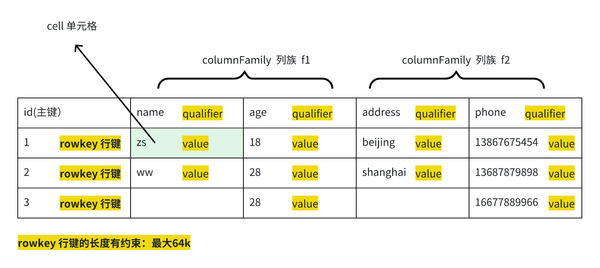


## 3.2 表数据的**物理存储&#x20;**

（表的数据在物理层都是存为KEY-VALUE形式）

> KEY:   rowkey+列族名+qualifier
>
> VALUE:  value


> 表的kv数据，会按不同列族分成不同的目录来存储

* 列族1文件夹：

数据文件：

```xml
1:f1:age -> 18
1:f1:name -> zs     
2:f1:age   -> 28
2:f1:name -> ww
3:f1:age  -> 28
```


* 列族2文件夹：

&#x20;数据文件：

```xml
1:f2:address -> beijing  
1:f2:phone -> 13867675454
2:f2:address -> shanghai
2:f2:phone    -> 13678789898
3:f2:phone ->  16677889966
```


> **在物理存储中，这些KEY-VALUE数据是有序的，排序规则：**

* 先比数据的行键rowkey

* 再比family列族名；

* 再比qualifier（列名）；

比大小时，都是按字节**字典顺序**比（先比第一个字节，再比第二个字节.....）；


## 3.3 **分布式特性**

* hbase的表，是会划分成多个region，放在不同的region server服务器上去管理的；

* 一个region就是该表的行键的一段范围

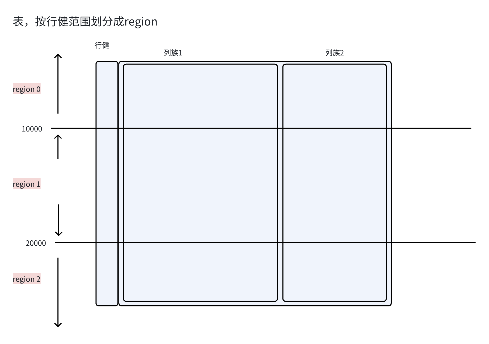

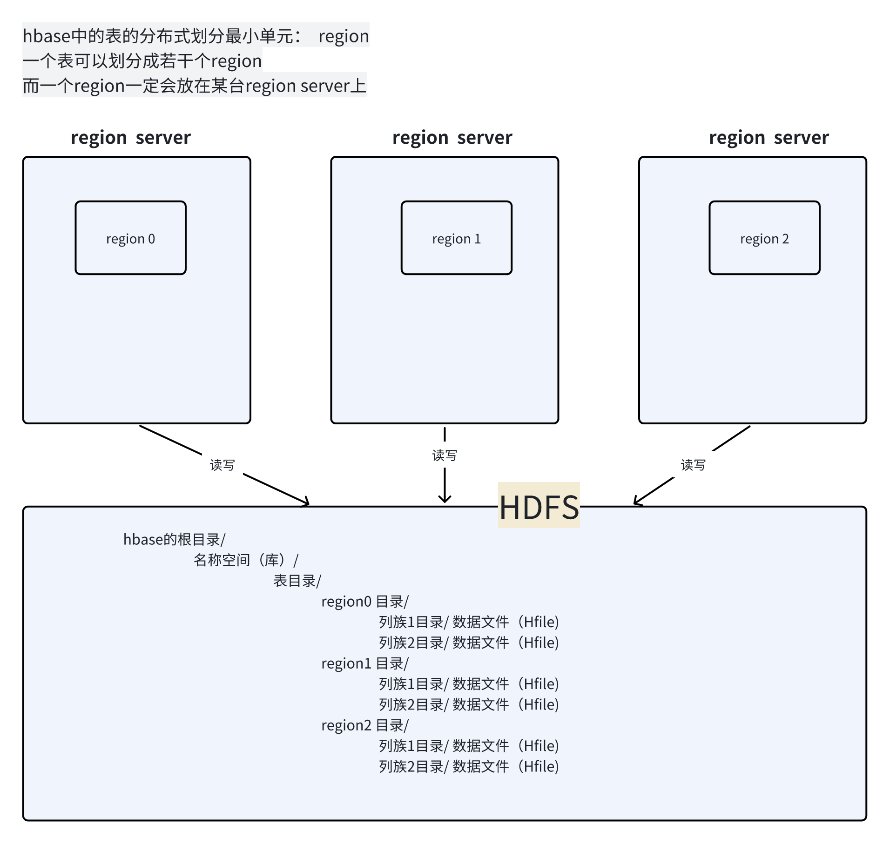


# 4. hbase的软件结构

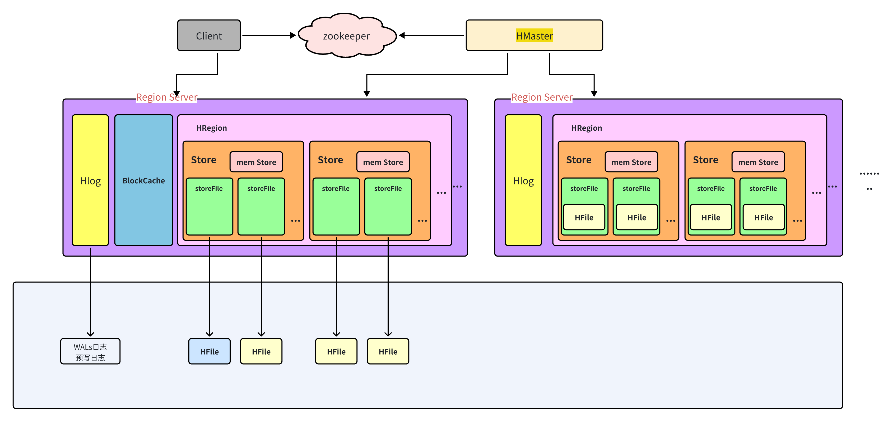

## 4.1 整体架构

* **master**： 负责集群的内部协调，表元数据管理，节点管理，负载均衡，接受的客户端的schema操作请求

* **regionserver**：

  * 负责表数据的管理；

  * 而且是以region为单位进行管理（所谓管理，就是region中的数据的读写）；

* **zookeeper**：hbase为了实现内部的分布式协调机制所依赖的一个外部组件；

* **hdfs**： hbase为了持久化存储表数据文件，所以来的外部文件系统

&#x20;  &#x20;


## 4.2 regionserver内部架构

* **store**：每一个region按照不同的列族，对应不同store

* **store中的数据存储形式：**

  > 每个store中的数据有两种存储形式：&#x20;

  * 内存临时的（memstore）

  * 持久化文件（hfile，hfile的描述在内存对应storeFile）

* **blockCache：**&#x6BCF;个regionserver都有一个regionserver级别读缓存

  * blockcache（以数据块block为单位进行读缓存）

* **hlog：**&#x6BCF;一个regionserver都有一个hlog的组件用来记录预写日志（日志写在hdfs中）--容错用途


# 5. 安装与使用

## 5.1 安装启动

### 5.1.1 修改配置文件

* hbase-env.sh

```xml
export HBASE_MANAGES_ZK=false
```

* hbase-site.xml

```xml
<!-- 部署为分布式模式  -->
<property>
    <name>hbase.cluster.distributed</name>
    <value>true</value>
</property>

<!-- hbase工作时进程所用的临时文件目录 ，可不配 -->
<property>
    <name>hbase.tmp.dir</name>
    <value>/tmp</value>
</property>


<!-- hbase官方建议避免一个bug要加上的 -->
<property>
    <name>hbase.unsafe.stream.capability.enforce</name>
    <value>false</value>
</property>


<!-- hbase在hdfs上的存储根目录-->
<property>
<name>hbase.rootdir</name>
<value>hdfs://doitedu01:8020/hbase</value>
</property>

<!-- hbase依赖的zookeeper集群地址 -->
<property>
<name>hbase.zookeeper.quorum</name>
<value>doitedu01,doitedu02,doitedu03</value>
</property>
```

* regionservers

```xml
doitedu01
doitedu02
doitedu03
```


### 5.1.2 同步安装包到其他节点

```xml
[root@doitedu01 app]# scp -r hbase-2.4.18/ doitedu02:$PWD
[root@doitedu01 app]# scp -r hbase-2.4.18/ doitedu03:$PWD
```


### 5.1.3 启动或停止

> 可以配置一下环境变量  /etc/profile&#x20;

```xml
export HBASE_HOME=/opt/app/hbase-2.4.18
export PATH=$PATH:$HBASE_HOME/bin
```


**在主节点上，执行启动命令**（master也就在这里启动了）

```xml
start-hbase.sh
```

启动之后，可以打开master提供的web信息页面查看集群信息

http://doitedu01:16010/


> hbase自带高可用模式

启动多个master即自动实现了高可用；

```xml
hbase-daemon.sh start master
```


## 5.2 命令行客户端体验

启动命令行客户端

```xml
[root@doitedu01 ~]# hbase shell
Took 0.0030 seconds                                                                                                
hbase:001:0>
```


查看命令的帮助

```xml
hbase:007:0> help "create"
```


建表

```xml
hbase:002:0> create 'stu','f1','f2'

hbase:003:0> list
TABLE                                                                                                              
stu                                                                                                                
t1

# 指定表的分区（region）分界点
hbase:008:0> create 'boys', 'f1', SPLITS => ['10', '20', '30', '40']


# 指定表中特定列族的数据存储最大版本数
hbase> create 'girls', {NAME => 'f1', VERSIONS => 5}, {NAME => 'f2', VERSIONS => 3}

```


插入数据（插入了4对KV，逻辑上分属于2行）

```xml
hbase:015:0> put 'boys','boy001','f1:name','kangkang'
Took 0.0796 seconds                                                                                                              
hbase:016:0> put 'boys','boy001','f1:age','16'
Took 0.0148 seconds                                                                                                              
hbase:017:0> put 'boys','boy002','f1:name','bobo'
Took 0.0119 seconds                                                                                                              
hbase:018:0> put 'boys','boy002','f1:gender','male'
Took 0.0123 seconds 
```


查询数据

```xml
# 根据行健，get单条数据
hbase:019:0> get 'boys','boy001'


# 按行健范围，扫描一批数据
hbase:027:0> scan 'boys', {COLUMNS => ['f1:name', 'f1:age'], LIMIT => 10, STARTROW => 'a', STOPROW => 'boy0020'}
ROW                               COLUMN+CELL                                                                                    
 boy001                           column=f1:age, timestamp=2024-09-29T16:00:07.605, value=16                                     
 boy001                           column=f1:name, timestamp=2024-09-29T15:59:45.132, value=kangkang                              
 boy002                           column=f1:name, timestamp=2024-09-29T16:01:27.899, value=bobo   

```


## 5.3 java客户端体验

添加客户端依赖

```xml
<dependency>
    <groupId>org.apache.hbase</groupId>
    <artifactId>hbase-client</artifactId>
    <version>2.4.18</version>
</dependency>
```


```xml


```


# 6. 面试与原理加强

## 6.1 📛 读写数据流程（重中之重）

### 6.1.1 **meta表**

`hbase:meta` 表存储了所有用户表Region的位置信息：

* Rowkey：`namespace:TableName,StartKey,Timestamp.EncodedName`

* info列族：列族中包含的信息如下

  * info:regioninfo列：regionId,tableName,startKey,endKey,offline,split,replicaId；

  * info:server列：HRegionServer对应的server:port；

  * info:serverstartcode列：HRegionServer的启动时间戳。

  * info:sn：该列对应的 value 由 server 和 serverstartcode 组成

  * info:state：该列对应的 value 表示 Region 状态

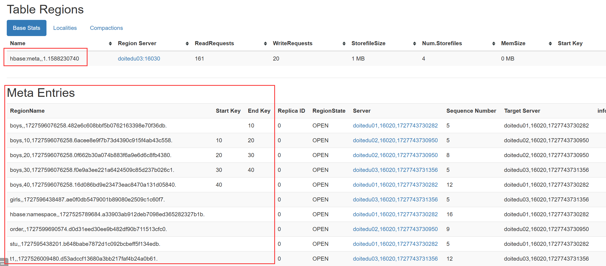


### 6.1.2 写数据流程

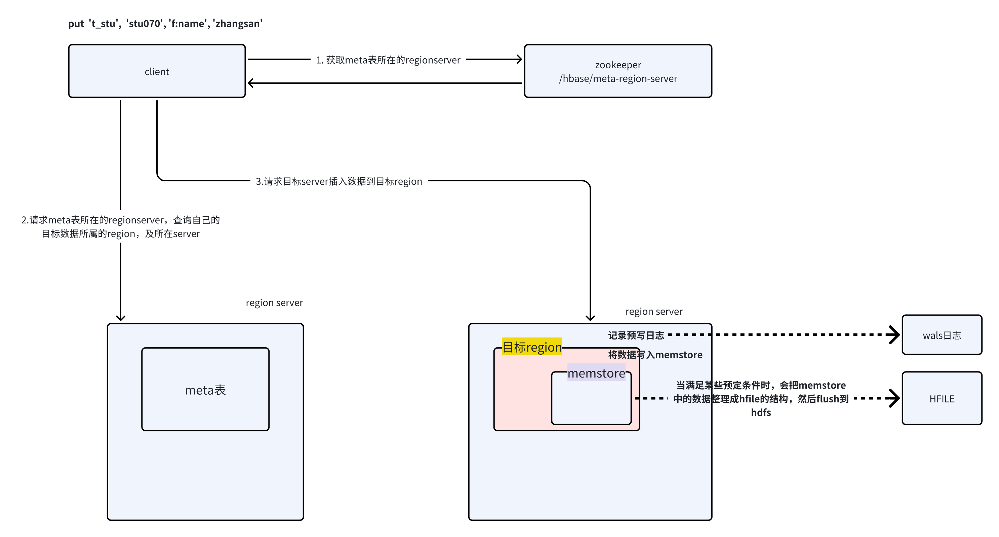


> 数据首先是写入region的store中的memstore
>
> memstore的内存大小默认是regionserver可用内存的0.4
>
> 而当memstore写到128M（`hbase.hregion.memstore.flush.size`）数据量时，会触发flush操作
>
> flush的结果就是生成HFile文件


### 6.1.3 读数据流程

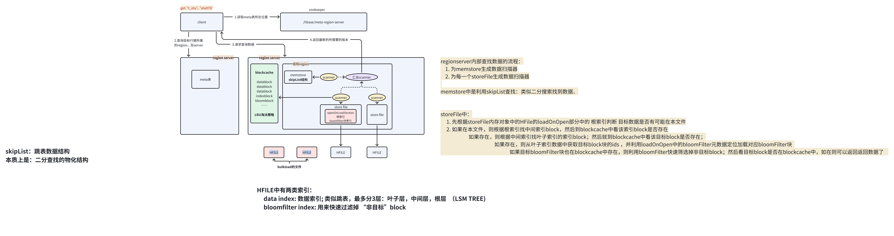

> memstore中的数据，不一定就是最新版
>
> 因为hbase可以通过bulkload方式绕过hbase的服务，直接往表存储目录中导入Hfile


## 6.2 region  自动分裂split机制

### 6.2.1 整体理解

* 自动**region分裂是hbase中的一个内部功能：**

随着一个region中的数据量不断增长，到一定阈值，hbase会自动把一个region拆分成两个region；

并且，此过程会反复进行；


* 也可以通过客户端的运维命令来**手动拆分**指定的region


**细节1：** region拆分时，数据分件该如何拆分？

> 其实，在拆分region时，并不马上拆分文件；
>
> 比如，region1 拆成 region-x 和 region-y 时，region1的数据文件目录保持不变；创建region-x和region-y的空目录，里面放 软连接，指向  region1的数据目录
>
> 然后，*等到系统做 region的 compact 操作时，才会把region1中的数据读出来并分写入两个daughter目录中*


**细节2：**&#x6EE1;足什么条件时会进行region拆分(有多种策略可配）

### 6.2.2 IncreasingToUpperBoundRegionSplitPolicy：0.94版本\~2.0版本默认切分策略

> 总体看和ConstantSizeRegionSplitPolicy思路相同，一个region中最大的store大小大于设置阈值就会触发切分。 但是这个阈值并不像ConstantSizeRegionSplitPolicy是一个固定的值，而是会在一定条件下不断调整，调整规则和region所属表在当前regionserver上的region个数有关系.
>
> region split阈值的计算公式是：
>
> * 设regioncount：是region所属表在当前regionserver上的region的个数
>
> * 阈值 = regioncount^3 \* 128M \* 2，当然阈值并不会无限增长，最大不超过MaxRegionFileSize（10G),当region中最大的store的大小达到该阈值的时候进行region split
>
> 例如：
>
> * 第一次split阈值 = 1^3 \* 256 = 256MB
>
> * 第二次split阈值 = 2^3 \* 256 = 2048MB
>
> * 第三次split阈值 = 3^3 \* 256 = 6912MB
>
> * 第四次split阈值 = 4^3 \* 256 = 16384MB > 10GB，因此取较小的值10GB
>
> * 后面每次split的size都是10GB了
>
> **特点**
>
> * 相比ConstantSizeRegionSplitPolicy，可以自适应大表、小表；
>
> * 在集群规模比较大的情况下，对大表的表现比较优秀
>
> * 对小表不友好，小表可能产生大量的小region，分散在各regionserver上
>
> * 小表达不到多次切分条件，导致每个split都很小，所以分散在各个regionServer上

### 6.2.3 SteppingSplitPolicy：2.0版本默认切分策略

> 相比 IncreasingToUpperBoundRegionSplitPolicy 简单了一些  region切分的阈值依然和待分裂region所属表在当前regionserver上的region个数有关系
>
> * 如果region个数等于1，切分阈值为flush size 128M \* 2
>
> * 否则为MaxRegionFileSize : 10G。
>
> > 这种切分策略对于大集群中的大表、小表会比 IncreasingToUpperBoundRegionSplitPolicy 更加友好，小表不会再产生大量的小region，而是适可而止。
>
>


## 6.3 region的自动compact机制（文件合并）

### 6.3.1 整体理解

一个region的多个store，随着数据插入的量不断增长，memstore中的数据会不断地flush成hfile

而这些flush得到的hfile文件中，存在如下特点：

* 多个文件中可能包含相同key的数据（只是版本不同）

* 文件中包含的key的数据可能是真实有效数据，也有可能是“已删除”的数据

> 删除，插入，都形成kv数据只是操作类型不同


随着时间推移，这些hfile会越来越多；会导致regionserver查找数据的效率越来越低

hbase为此设计了一种自动机制（也可以手动）：满足一定条件时，就会把一个region内的多次flush所生成的hfile进行合并（压实）

**所谓压实：**

* 就是把多个文件中相同key的数据，只保留需要的几个最新版本；

* 把那些已删除的key数据直接丢弃；

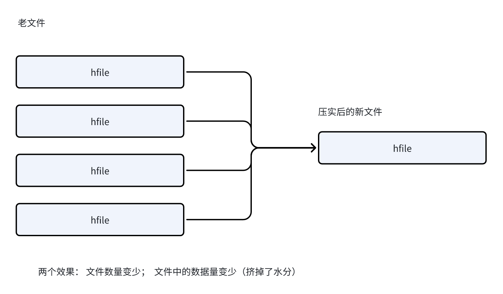


### 6.3.2 关键**细节**

compact需要读取文件（IO）还要生成新的文件（IO），中间还需要耗费内存；

***所以，compact是一个很重量级的操作；***

为了让compact不对过多影响regionserver的正常数据读写工作，

hbase把compact操作分成两种类型：

* **minor compact （小compact）**

> 不彻底的临时性的compact
>
> * 一次compact，并不会合并一个region下的一个store下的所有文件，而是选择若干个文件进行compact
>
> * 合并的结果文件，并没有真正去除“无效数据”（已被删除的，已超TTL的，版本过期的），只打上墓碑标记；


> minor compact的 触发条件 和 文件选择标准

* 在flush时也会检查文件数是否达到一个配置值（默认3），如果达到则执行minor compact；

* 后台还有一个线程周期性检查，是否需要compact；检查周期可配置：

```xml
# CompactionChecker大概是 2hrs 46mins 40sec  执行一次
hbase.server.thread.wakefrequency[默认10000毫秒]) * hbase.server.compactchecker.interval.multiplier[默认1000]
```

```xml
<!--表示至少需要三个满足条件的store file时，minor compaction才会启动-->
<property>
        <name>hbase.hstore.compactionThreshold</name>
        <value>3</value>
</property>

<!--表示一次 minor compaction中最多选取10个store file-->
<property>
        <name>hbase.hstore.compaction.max</name>
        <value>10</value>
</property>

<!--默认值为128m,
表示文件大小小于该值的store file 一定会加入到 minor compaction的 store file中
-->
<property>
        <name>hbase.hstore.compaction.min.size</name>
        <value>134217728</value>
</property>
    
<!--默认值为LONG.MAX_VALUE，表示文件大小大于该值的store file 一定会被minor compaction排除-->
<property>
            <name>hbase.hstore.compaction.max.size</name>
            <value>9223372036854775807</value>
</property>
```


* **major compact （主compact）**

> 彻底的compact
>
> * 一次major compact会把 region下的store下 的 所有文件，compact成一个文件
>
> * 并且在结果文件中，不会再包含“无效数据”


> 触发条件

```xml
<!--默认值为7天进行一次大合并，-->
<property>
        <name>hbase.hregion.majorcompaction</name>
        <value>604800000</value>
</property>
```

major compact 性能消耗非常大，建议生产关闭（设置为0）;

在应用空间时间手动触发。一般是可以手动控制进行合并，防止出现在业务高峰期。


## 6.4 📛 rowkey与热点问题（重中之重）

### 6.4.1 什么是热点问题

数据的大量并发读写，集中在表的某一个region上；这就是所谓热点问题；

当发生热点时： hbase的表分布式性能无法得到充分发挥；客户端的读写响应也会有瓶颈！


热点问题，分为：

* 读热点问题

* 写热点问题


### 6.4.2 什么情况下会产生热点及如何解决

> * **表只有一个region 会产生热点**

> **建表的时候，要做好预分区**
>
> create 't\_xx' , 'f' , SPLITS=>\['g1','g9','k1','k9','u1','u9']


> * **表的rowkey排序结果，与读、写的规律正好吻合**

比如，表的行键是：用户的手机号

* 导致，相同归属地的数据，可能会落在相同的region中

* 如果，上层应用在读数据时，总是会集中读、写取某个归属地的用户数据，这样就会造成集中读写同一个region

**核心点是：&#x20;**&#x20;

数据的存放规律（在region间的分布规律） 与  应用程序对数据的读写规律，吻合！则容易出现热点问题


**解决之道：**

打破数据存放规律和应用读写数据的规律吻合！

不太可能去改应用的读写规律；只能改数据的存储规律；

改数据存储规律的关键点，就是改行键设计；


* **行键设计避免热点的常见措施**

  * **把业务键反转之后作行键**

  > 比如上述场景，手机号反转后就不存在同一归属地数据落在同一region的规律了


```java
final String salt = "$1$abcdefgh";
String phone = "13887876767";

String rowkeySalt = Md5Crypt.md5Crypt(phone.getBytes(),salt).subString(6,6);

// 得到加盐后的rowkey
String rowkey = rowkeySalt+phone;


Put put = new Put(rowkey.getBytes());
put.addColumn("f".getBytes(),"name".getBytes(),"zhangsan".getBytes());
table.put(put);

```


* [ ] 思考案例：

* [ ] 如果业务键是长整数时间戳，且跟应用读写数据规律同频了，如何设计rowkey避免热点

* [ ] 如果业务键是连续的整数的id，且跟应用读写数据规律同频了，如何设计rowkey避免热点


> 思考场景：**如果公司有如下业务场景，请问是否有热点问题**

* hbase的表中，使用**用户id**作rowkey，数据字段是用户的一系列画像标签

* 公司有一个广告推送引擎，每当一个用户打开app的一个页面时，广告推送引擎就会根据这个用户的id，去画像库中查找该用户的画像数据，来进行广告的精准选择；


***

# 7. -以下备用教程---------------------------------------

# 8. 什么是hbase

## 1.1简介

HBase 是一个面向**列式存储**的**分布式数据库**，其设计思想来源于 Google 的 BigTable 论文。

HBase 底层存储基于 HDFS 实现，集群的管理基于 ZooKeeper 实现。

HBase 良好的分布式架构设计为海量数据的快速存储、随机访问提供了可能，基于数据副本机制和分区机制可以轻松实现**在线扩容、缩容和数据容灾，**&#x662F;大数据领域中 Key-Value 数据结构存储最常用的数据库方案

## 1.2.特点&#x20;

1. **易扩展**

Hbase 的扩展性主要体现在两个方面，一个是基于运算能力（RegionServer） 的扩展，通过增加 RegionSever 节点的数量，提升 Hbase 上层的处理能力；另一个是基于存储能力的扩展（HDFS），通过增加 DataNode 节点数量对存储层的进行扩容，提升 HBase 的数据存储能力。

* **海量存储**

HBase 作为一个开源的分布式 Key-Value 数据库，其主要作用是面向 PB 级别数据的实时入库和快速随机访问。这主要源于上述易扩展的特点，使得 HBase 通过扩展来存储海量的数据。

* **列式存储**

Hbase 是根据列族来存储数据的。列族下面可以有非常多的列。列式存储的最大好处就是，其数据在表中是按照某列存储的，这样在查询只需要少数几个字段时，能大大减少读取的数据量。

* **高可靠性**

WAL 机制保证了数据写入时不会因集群异常而导致写入数据丢失，Replication 机制保证了在集群出现严重的问题时，数据不会发生丢失或损坏。而且 Hbase 底层使用 HDFS，HDFS 本身也有备份。

* **稀疏性**

在 HBase 的列族中，可以指定任意多的列，为空的列不占用存储空间，表可以设计得非常稀疏。

* **模块组成**

HBase 可以将数据存储在本地文件系统，也可以存储在 HDFS 文件系统。在生产环境中，HBase 一般运行在HDFS 上，以 HDFS 作为基础的存储设施。HBase 通过 HBase Client 提供的 Java API 来访问 HBase 数据库，以完成数据的写入和读取。HBase 集群主由HMaster、Region Server 和 ZooKeeper 组成。

## 1.3.使用场景

HBase擅长于存储结构简单的海量数据但索引能力有限，而Oracle，mysql等传统关系型数据库(RDBMS)能够提供丰富的查询能力，但却疲于应对TB级别的海量数据存储，HBase对传统的RDBMS并不是取代关系，而是一种补充。

**适合使用   对于关系型数据库的一种补充，而不是替代**

* 数据库中的很多列都包含了很多空字段(稀疏数据)，在 HBase 中的空字段不会像在关系型数据库中占用空间。

* 需要很高的吞吐量，瞬间写入量很大。

* 数据有很多版本需要维护，HBase 利用时间戳来区分不同版本的数据。

* 具有高可扩展性，能动态地扩展整个存储系统。

比如：用户画像(给用户打标签)，搜索引擎应用，存储用户交互数据等

**不适合使用**

1. 需要数据分析,比如报表(rowkey) 对sql支持不好

2. 单表数据不超过千万（数据量小）

## 1.4hbase的架构

HBase 系统遵循 Master/Salve 架构，由三种不同类型的组件组成：

**client**

1. 提供了访问hbase的接口

2. 提供cache缓存提高访问hbase的效率 , 比如region的信息

**Zookeeper**

1. 保证任何时候，集群中只有一个Master；

2. 存储所有 Region 的寻址入口；==》

3. 实时监控 Region Server 的状态，将 Region Server 的上线和下线信息实时通知给 Master；

4. 存储 HBase 的 Schema，包括有哪些 Table，每个 Table 有哪些 Column Family 等信息。

**Master/master**

1. 为 Region Server 分配 Region；

2. 负责 Region Server 的负载均衡 ；

3. 发现失效的 Region Server 并重新分配其上的 Region；

4. 处理 Schema 的更新请求

**RegionServer**

1. Region Server 负责维护 Master 分配给它的 Region ，并处理发送到 Region 上的 IO 请求；

2. Region Server 负责切分在运行过程中变得过大的 Region


# 2.安装

> **因为hbase需要依赖zookeeper和hdfs，所以在安装hbase集群之前需要确保zookeeper和hdfs的环境是ok的哦！！！**

## 2.1时间同步

由于HBase默认的容忍间隔是30s，超过这个阈值，就会报“Master rejected startup because clock is out of sync”异常，所以三台机器的时间 间隔不能超过30s

**解决方案: &#x20;**

1. 手动的设置时间  date  -s  "2023-05-07 00:00:00"

2. 修改属性

```xml
<property>
        <name>hbase.master.maxclockskew</name>
        <value>3600000</value>
        <description>Time difference of regionserver from master</description>
 </property>
```

* 向时间服务器自动同步时间

> 如何时间同步？？
> 首先安装ntpdate  &#x20;
> \[root@linux01 doris]# yum install ntpdate -y
>
> 然后开始三台机器自己同步时间
> \[root@node01 \~]# ntpdate ntp.sjtu.edu.cn
>
> \-- 这样才能永久生效不变，不然reboot后还会恢复到原来的时间
> clock -w 写入BIOS
>
> 美国标准技术院时间服务器：time.nist.gov（192.43.244.18）
> 上海交通大学网络中心NTP服务器地址：ntp.sjtu.edu.cn（202.120.2.101）
> 中国国家授时中心服务器地址：cn.pool.ntp.org（210.72.145.44）

## 2.2下载上传解压

## 2.3hbase配置

1. 在conf目录下找到hbase-env.sh

```shell
命令
cd /opt/app/hbase-2.2.5/conf
vi hbase-env.sh 
修改的地方：

#1.配置java的环境变量，注意需要将前面的注释打开
export JAVA_HOME=/opt/app/jdk1.8

#2.hbase中内嵌了一个zookeeper，默认使用的是内置的zoopkeeper，将等号后面的true改成false
export HBASE_MANAGES_ZK=false
```

* 在 conf目录下找到hbase-site.xml

```xml
命令：
vi hbase-site.xml 
在最下面输入下面的配置文件，黄色部分需要自己修改主机名
<configuration>
<!-- 指定hbase在HDFS上存储的路径 -->
<property>
<name>hbase.rootdir</name>
<value>hdfs://linux01:8020/hbase</value>
</property>
<!-- 指定hbase是分布式的 -->
<property>
<name>hbase.cluster.distributed</name>
<value>true</value>
</property>
<!-- 分布式中一定要配置该参数，否则可能会出现无法启动HMaster的情况 -->
<property>
  <name>hbase.unsafe.stream.capability.enforce</name>
  <value>false</value>
</property>
<!-- 指定zk的地址，多个用“,”分割 -->
<property>
<name>hbase.zookeeper.quorum</name>
<value>linux01:2181,linux02:2181,linux03:2181</value>
</property>
</configuration>
```

* regionservers 配置  启动集群中的Regionserver机器

```shell
命令：
vi regionservers 
输入自己的三台机器域名
linux01
linux02
linux03
```

## 2.4集群分发

```shell
[root@linux01 apps]# pwd
/usr/apps
[root@linux01 apps]# scp -r hbase-2.0.4/ linux02:$PWD
[root@linux01 apps]# scp -r hbase-2.0.4/ linux03:$PWD
在app目录下执行：
for i in 2 3 
do
scp -r hbase-2.2.5/ linux0$i:$PWD
done
```

## 2.5启动

**单节点启动：**

```shell
bin/hbase-daemon.sh start master
bin/hbase-daemon.sh start regionserver
```

> **提示：如果regionserver无法启动，请先检查下集群之间的节点时间是否同步**

**一键启动：**

```shell
bin/start-hbase.sh   
```

## 2.6页面访问

验证启动是否成功

1. jps查看

```shell
[root@linux01 conf]# jps
4305 Jps
2386 QuorumPeerMain
2051 DataNode
3747 HMaster  --查看HMaster有无进程
1898 NameNode
3934 HRegionServer  -- 查看HRegionServer有无进程
```

* 通过"linux01:16010"的方式来访问HBase管理页面,进得去代表启动成功

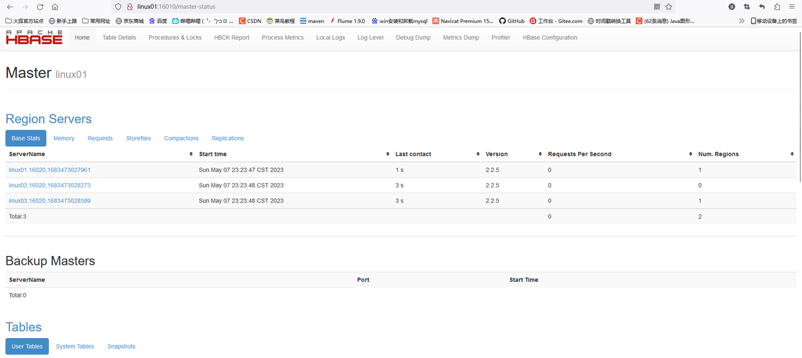

# 3.客户端操作

## **shell客户端**

## 3.1HBase数据模型概念：

> 在hive表或者mysql表中说描述哪一个数据都是说的哪个库里面的哪张表里面的哪一行数据中的哪一列，才能定位到这个数据
>
> 但是在hbase中没有库的概念，说一个数据说的是哪一个名称空间下的那一张表下的哪一个行键的哪一个列族下面的哪一个列对应的是这个数据

**namespace：doit**

**table：user\_info**

| **Rowkey**  | **Column Family1（列族）** |          |         |            | **Column Family2（列族）** |             |         |          |
| ----------- | ---------------------- | -------- | ------- | ---------- | ---------------------- | ----------- | ------- | -------- |
|             | **id**                 | **Name** | **age** | **gender** | **phoneNum**           | **address** | **job** | **code** |
| rowkey\_001 | 1                      | 柳岩       | 18      | 女          | 88888888               | 北京....      | 演员      | 123      |
| rowkey\_002 | 2                      | 唐嫣       | 38      | 女          | 66666666               | 上海....      | 演员      | 213      |
| rowkey\_003 | 3                      | 大郎       | 8       | 男          | 44444444               | 南京....      | 销售      | 312      |
| rowkey\_004 | 4                      | 金莲       | 33      | 女          | 99999999               | 东京....      | 销售      | 321      |
| **...**     |                        |          |         |            |                        |             |         |          |

**namespace:**&#x68;base中没有数据库的概念 , 是使用namespace来达到数据库分类别管理表的作用

**table：**&#x8868;，一个表包含多行数据

**Row Key (行键):**&#x4E00;行数据包含一个**唯一标识**rowkey、多个column以及对应的值。在HBase中，一张表中所有row都按照rowkey的字典序由小到大排序。

**Column Family（列族）:**&#x5728;建表的时候指定，不能够随意的删减，一个列族下面可以有多个列(类似于给列进行分组，相同属性的列是一个组，给这个组取个名字叫列族)

**Column Qualifier (列):**&#x5217;族下面的列，一个列必然是属于某一个列族的行

**Cell:**&#x5355;元格，由（rowkey、column family、qualifier、type、timestamp，value）组成的结构，其中type表示Put/Delete操作类型，timestamp代表这个cell的版本。KV结构存储，其中rowkey、column family、qualifier、type以及timestamp是K，value字段对应KV结构的V。

**Timestamp(时间戳):**&#x65F6;间戳，每个cell在写入HBase的时候都会默认分配一个时间戳作为该cell的版本，用户也可以在写入的时候自带时间戳。HBase支持多版本特性，即同一rowkey、column下可以有多个value存在，这些value使用timestamp作为版本号，版本越大，表示数据越新。

## 3.2进入客户端命令：

```shell
如果配置了环境变量：在任意地方敲 hbase shell ，如果没有配置环境变量，需要在bin目录下./hbase shell
[root@linux01 conf]# hbase shell
SLF4J: Class path contains multiple SLF4J bindings.
SLF4J: Found binding in [jar:file:/opt/app/hadoop-3.1.1/share/hadoop/common/lib/slf4j-log4j12-1.7.25.jar!/org/slf4j/impl/StaticLoggerBinder.class]
SLF4J: Found binding in [jar:file:/opt/app/hbase-2.2.5/lib/client-facing-thirdparty/slf4j-log4j12-1.7.25.jar!/org/slf4j/impl/StaticLoggerBinder.class]
SLF4J: See http://www.slf4j.org/codes.html#multiple_bindings for an explanation.
SLF4J: Actual binding is of type [org.slf4j.impl.Log4jLoggerFactory]
HBase Shell
Use "help" to get list of supported commands.
Use "exit" to quit this interactive shell.
For Reference, please visit: http://hbase.apache.org/2.0/book.html#shell
Version 2.2.5, rf76a601273e834267b55c0cda12474590283fd4c, 2020年 05月 21日 星期四 18:34:40 CST
Took 0.0026 seconds                                                                                                                                         
hbase(main):001:0>    --代表成功进入了hbase的shell客户端
```

## 3.3命令大全

### 3.3.1通用命令       &#x20;

**status: 查看HBase的状态，例如，服务器的数量。**

```shell
hbase(main):001:0> status
1 active master, 0 backup masters, 3 servers, 0 dead, 0.6667 average load
Took 0.3609 seconds  
```

**version: 提供正在使用HBase版本。**

```shell
hbase(main):002:0> version
2.2.5, rf76a601273e834267b55c0cda12474590283fd4c, 2020年 05月 21日 星期四 18:34:40 CST
Took 0.0004 seconds
```

**table\_help: 表引用命令提供帮助。**

```shell
关于表的一些命令参考
如：
To read the data out, you can scan the table:
  hbase> t.scan
which will read all the rows in table 't'.
```

**whoami: 提供有关用户的信息。**

```shell
hbase(main):004:0> whoami
root (auth:SIMPLE)
    groups: root
Took 0.0098 seconds  
```

### 3.3.2命名空间相关命令

**list\_namespace：列出所有的命名空间**

```shell
hbase(main):005:0> list_namespace
NAMESPACE                                                                                                                                                                                              
default                                                                                                                                                                                                
hbase                                                                                                                                                                                                  
2 row(s)
Took 0.0403 seconds  
```

**create\_namespace：创建一个命名空间**

```shell
hbase(main):002:0> create_namespace doit
NameError: undefined local variable or method `doit' for main:Object

hbase(main):003:0> create_namespace 'doit'
Took 0.2648 seconds  

注意哦：名称需要加上引号，不然会报错的
```

**describe\_namespace：描述一个命名空间**

```shell
hbase(main):004:0> describe_namespace 'doit'
DESCRIPTION                                                                                       
{NAME => 'doit'}                                                                                  
Quota is disabled
Took 0.0710 seconds 
```

**drop\_namespace：删除一个命名空间**

```shell
注意 ：只能删除空的命名空间，如果里面有表是删除不了的
hbase(main):005:0> drop_namespace 'doit'
Took 0.2461 seconds  

--命名空间不为空的话  
hbase(main):035:0> drop_namespace 'doit'

ERROR: org.apache.hadoop.hbase.constraint.ConstraintException: Only empty namespaces can be removed. Namespace doit has 1 tables
        at org.apache.hadoop.hbase.master.procedure.DeleteNamespaceProcedure.prepareDelete(DeleteNamespaceProcedure.java:217)
        at org.apache.hadoop.hbase.master.procedure.DeleteNamespaceProcedure.executeFromState(DeleteNamespaceProcedure.java:78)
        at org.apache.hadoop.hbase.master.procedure.DeleteNamespaceProcedure.executeFromState(DeleteNamespaceProcedure.java:45)
        at org.apache.hadoop.hbase.procedure2.StateMachineProcedure.execute(StateMachineProcedure.java:194)
        at org.apache.hadoop.hbase.procedure2.Procedure.doExecute(Procedure.java:962)
        at org.apache.hadoop.hbase.procedure2.ProcedureExecutor.execProcedure(ProcedureExecutor.java:1662)
        at org.apache.hadoop.hbase.procedure2.ProcedureExecutor.executeProcedure(ProcedureExecutor.java:1409)
        at org.apache.hadoop.hbase.procedure2.ProcedureExecutor.access$1100(ProcedureExecutor.java:78)
        at org.apache.hadoop.hbase.procedure2.ProcedureExecutor$WorkerThread.run(ProcedureExecutor.java:1979)

For usage try 'help "drop_namespace"'

Took 0.1448 seconds     
```

**alter\_namespace：修改namespace其中属性**

```shell
hbase(main):038:0> alter_namespace 'doit',{METHOD => 'set', 'PROPERTY_NAME' => 'PROPERTY_VALUE'}
Took 0.2491 seconds  
```

**list\_namespace\_tables**:列出一个命名空间下所有的表

```shell
hbase(main):037:0> list_namespace_tables 'doit'
TABLE                                                                                             
user                                                                                              
1 row(s)
Took 0.0372 seconds                                                                               
=> ["user"]
```

### 3.3.3DDL相关命令

**list:列举出用户创建的所有的表**

```shell
hbase(main):001:0> list
TABLE                                                                                                                       
doit:user                                                                                                                   
1 row(s)
Took 0.3187 seconds                                                                                                         
=> ["doit:user"]
```

**create:建表**

```shell
create ‘xx:t1’,{NAME=>‘f1’,VERSION=>5}
 创建表t1并指明命名空间xx
 {NAME} f1指的是列族
 VERSION 表示版本数
多个列族f1、f2、f3
create ‘t2’,{NAME=>‘f1’},{NAME=>‘f2’},{NAME=>‘f3’}

hbase(main):003:0> create 'doit:student' 'f1','f2','f3'
Created table doit:studentf1
Took 1.2999 seconds                                                                                                  
=> Hbase::Table - doit:studentf1


# 创建表得时候预分region
hbase(main):106:0> create 'doit:test','f1', SPLITS => ['rowkey_010','rowkey_020','rowkey_030','rowkey_040']
Created table doit:test
Took 1.3133 seconds                                                                                            
=> Hbase::Table - doit:test
```

**drop:删除表**

```shell
hbase(main):006:0> drop 'doit:studentf1'

ERROR: Table doit:studentf1 is enabled. Disable it first.

For usage try 'help "drop"'

Took 0.0242 seconds 

注意哦：删除表之前需要禁用表
hbase(main):007:0> disable 'doit:studentf1'
Took 0.7809 seconds                                                                                                  
hbase(main):008:0> drop 'doit:studentf1'
Took 0.2365 seconds                                                                                                  
hbase(main):009:0> 
```

**drop\_all：丢弃在命令中给出匹配“regex”的表**

```shell
hbase(main):023:0> disable_all 'doit:student.*'
doit:student1                                                                                                        
doit:student2                                                                                                        
doit:student3                                                                                                        
doit:studentf1                                                                                                       

Disable the above 4 tables (y/n)?
y
4 tables successfully disabled
Took 4.3497 seconds     
                                                                                             
hbase(main):024:0> drop_all 'doit:student.*'
doit:student1                                                                                                        
doit:student2                                                                                                        
doit:student3                                                                                                        
doit:studentf1                                                                                                       

Drop the above 4 tables (y/n)?
y
4 tables successfully dropped
Took 2.4258 seconds
```

**disable：禁用表**

```shell
删除表之前必须先禁用表
hbase(main):007:0> disable 'doit:studentf1'
Took 0.7809 seconds
```

**disable\_all：禁用在命令中给出匹配“regex”的表**

```shell
hbase(main):023:0> disable_all 'doit:student.*'
doit:student1                                                                                                        
doit:student2                                                                                                        
doit:student3                                                                                                        
doit:studentf1                                                                                                       

Disable the above 4 tables (y/n)?
y
4 tables successfully disabled
Took 4.3497 seconds
```

**enable：启用表**

```shell
删除表之前必须先禁用表
hbase(main):007:0> enable 'doit:student'
Took 0.7809 seconds
```

**enable\_all：启用在命令中给出匹配“regex”的表**

```shell
hbase(main):032:0> enable_all 'doit:student.*'
doit:student                                                                                                         
doit:student1                                                                                                        
doit:student2                                                                                                        
doit:student3                                                                                                        
doit:student4                                                                                                        

Enable the above 5 tables (y/n)?
y
5 tables successfully enabled
Took 5.0114 seconds 
```

**is\_enabled：判断该表是否是启用的表**

```shell
hbase(main):034:0> is_enabled 'doit:student'
true                                                                                                                 
Took 0.0065 seconds                                                                                                  
=> true
```

**is\_disabled：判断该表是否是禁用的表**

```shell
hbase(main):035:0> is_disabled 'doit:student'
false                                                                                                                
Took 0.0046 seconds                                                                                                  
=> 1
```

**describe：描述这张表**

```shell
hbase(main):038:0> describe 'doit:student'
Table doit:student is ENABLED                                                                                                                                             
doit:student                                                                                                                                                              
COLUMN FAMILIES DESCRIPTION                                                                                                                                               
{NAME => 'f1', VERSIONS => '1', EVICT_BLOCKS_ON_CLOSE => 'false', NEW_VERSION_BEHAVIOR => 'false', KEEP_DELETED_CELLS => 'FALSE', CACHE_DATA_ON_WRITE => 'false', DATA_BLO
CK_ENCODING => 'NONE', TTL => 'FOREVER', MIN_VERSIONS => '0', REPLICATION_SCOPE => '0', BLOOMFILTER => 'ROW', CACHE_INDEX_ON_WRITE => 'false', IN_MEMORY => 'false', CACHE
_BLOOMS_ON_WRITE => 'false', PREFETCH_BLOCKS_ON_OPEN => 'false', COMPRESSION => 'NONE', BLOCKCACHE => 'true', BLOCKSIZE => '65536'}                                       

{NAME => 'f2', VERSIONS => '1', EVICT_BLOCKS_ON_CLOSE => 'false', NEW_VERSION_BEHAVIOR => 'false', KEEP_DELETED_CELLS => 'FALSE', CACHE_DATA_ON_WRITE => 'false', DATA_BLO
CK_ENCODING => 'NONE', TTL => 'FOREVER', MIN_VERSIONS => '0', REPLICATION_SCOPE => '0', BLOOMFILTER => 'ROW', CACHE_INDEX_ON_WRITE => 'false', IN_MEMORY => 'false', CACHE
_BLOOMS_ON_WRITE => 'false', PREFETCH_BLOCKS_ON_OPEN => 'false', COMPRESSION => 'NONE', BLOCKCACHE => 'true', BLOCKSIZE => '65536'}                                       

{NAME => 'f3', VERSIONS => '1', EVICT_BLOCKS_ON_CLOSE => 'false', NEW_VERSION_BEHAVIOR => 'false', KEEP_DELETED_CELLS => 'FALSE', CACHE_DATA_ON_WRITE => 'false', DATA_BLO
CK_ENCODING => 'NONE', TTL => 'FOREVER', MIN_VERSIONS => '0', REPLICATION_SCOPE => '0', BLOOMFILTER => 'ROW', CACHE_INDEX_ON_WRITE => 'false', IN_MEMORY => 'false', CACHE
_BLOOMS_ON_WRITE => 'false', PREFETCH_BLOCKS_ON_OPEN => 'false', COMPRESSION => 'NONE', BLOCKCACHE => 'true', BLOCKSIZE => '65536'}                                       

3 row(s)

QUOTAS                                                                                                                                                                    
0 row(s)
Took 0.0349 seconds 

VERSIONS => '1',  -- 版本数量
EVICT_BLOCKS_ON_CLOSE => 'false', 
NEW_VERSION_BEHAVIOR => 'false', 
KEEP_DELETED_CELLS => 'FALSE',  保留删除的单元格
CACHE_DATA_ON_WRITE => 'false', 
DATA_BLOCK_ENCODING => 'NONE', 
TTL => 'FOREVER', -- 过期时间
MIN_VERSIONS => '0', -- 最小版本数
REPLICATION_SCOPE => '0', 
BLOOMFILTER => 'ROW',  --布隆过滤器
CACHE_INDEX_ON_WRITE => 'false', 
IN_MEMORY => 'false', -- 内存中
CACHE_BLOOMS_ON_WRITE => 'false', --布隆过滤器
PREFETCH_BLOCKS_ON_OPEN => 'false', 
COMPRESSION => 'NONE',  -- 压缩格式
BLOCKCACHE => 'true',   -- 块缓存
BLOCKSIZE => '65536'  -- 块大小
```

**alter：修改表里面的属性**

```shell
hbase(main):040:0> alter 'doit:student', NAME => 'cf1', VERSIONS => 5, TTL => 10
Updating all regions with the new schema...
1/1 regions updated.
Done.
Took 2.1406 seconds 

alter ‘t1′, NAME => ‘f1′, KEEP_DELETED_CELLS => true
```

**alter\_async：直接操作不等待，和上面的alter功能一样**

```shell
hbase(main):059:0> alter_async 'doit:student', NAME => 'cf1', VERSIONS => 5, TTL => 10
Took 1.0268 seconds  
```

**alter\_status：获取alter命令的执行状态**

```shell
hbase(main):060:0> alter_status 'doit:student'
1/1 regions updated.
Done.
Took 1.0078 seconds  
```

**list\_regions：列出一个表中所有的region**

```shell
Examples:
hbase> list_regions 'table_name'
hbase> list_regions 'table_name', 'server_name'
hbase> list_regions 'table_name', {SERVER_NAME => 'server_name', LOCALITY_THRESHOLD => 0.8}
hbase> list_regions 'table_name', {SERVER_NAME => 'server_name', LOCALITY_THRESHOLD => 0.8}, ['SERVER_NAME']
hbase> list_regions 'table_name', {}, ['SERVER_NAME', 'start_key']
hbase> list_regions 'table_name', '', ['SERVER_NAME', 'start_key']

hbase(main):045:0> list_regions 'doit:student'
                 SERVER_NAME |                                                   REGION_NAME |  START_KEY |    END_KEY |  SIZE |   REQ |   LOCALITY |
 --------------------------- | ------------------------------------------------------------- | ---------- | ---------- | ----- | ----- | ---------- |
 linux02,16020,1683636566738 | doit:student,,1683642944714.39f7c8772bc476c4d38c663e879d50da. |            |            |     0 |     0 |        0.0 |
 1 rows
Took 0.0145 seconds  
```

**locate\_region：通过表名和row名方式获取region**

```shell
hbase(main):062:0> locate_region 'doit:student', 'key0'
HOST                                            REGION                                                                                                                                     
 linux02:16020                                  {ENCODED => 39f7c8772bc476c4d38c663e879d50da, NAME => 'doit:student,,1683642944714.39f7c8772bc476c4d38c663e879d50da.', STARTKEY => '', ENDK
                                                EY => ''}                                                                                                                                  
1 row(s)
Took 0.0027 seconds 
```

**show\_filters：显示hbase的所有的过滤器**

```shell
hbase(main):058:0> show_filters
DependentColumnFilter                                                                                                                                                                      
KeyOnlyFilter                                                                                                                                                                              
ColumnCountGetFilter                                                                                                                                                                       
SingleColumnValueFilter                                                                                                                                                                    
PrefixFilter                                                                                                                                                                               
SingleColumnValueExcludeFilter                                                                                                                                                             
FirstKeyOnlyFilter                                                                                                                                                                         
ColumnRangeFilter                                                                                                                                                                          
ColumnValueFilter                                                                                                                                                                          
TimestampsFilter                                                                                                                                                                           
FamilyFilter                                                                                                                                                                               
QualifierFilter                                                                                                                                           
ColumnPrefixFilter                                                                                                                                                                         
RowFilter                                                                                                                                                                                  
MultipleColumnPrefixFilter                                                                                                                                                                 
InclusiveStopFilter                                                                                                                                                                        
PageFilter                                                                                                                                                                                 
ValueFilter                                                                                                                                                                                
ColumnPaginationFilter                                                                                                                                                                     
Took 0.0035 seconds
```

### 3.3.4DML相关命令

**put插入/更新数据【某一行的某一列】（如果不存在，就插入，如果存在就更新）**

```shell
hbase(main):007:0> put 'doit:user_info' ,'rowkey_001','f1:name','zss'
Took 0.0096 seconds                                                                                                  
hbase(main):008:0> put 'doit:user_info' ,'rowkey_001','f1:age','1'
Took 0.0039 seconds                                                                                                  
hbase(main):009:0> put 'doit:user_info' ,'rowkey_001','f1:gender','male'
Took 0.0039 seconds                                                                                                  
hbase(main):010:0> put 'doit:user_info' ,'rowkey_001','f2:phone_num','98889'
Took 0.0040 seconds                                                                                                  
hbase(main):011:0> put 'doit:user_info' ,'rowkey_001','f2:gender','98889'

注意：put中需要指定哪个命名空间的那个表，然后rowkey是什么，哪个列族下面的哪个列名，然后值是什么
一个个的插入，不能一下子插入多个列名的值
```

**get：获取一个列族中列这个cell**

```shell
hbase(main):015:0> get 'doit:user_info' ,'rowkey_001','f2:gender'
COLUMN                         CELL                                                                                  
 f2:gender                     timestamp=1683646645379, value=123                                                    
1 row(s)
Took 0.0242 seconds  

hbase(main):016:0> get 'doit:user_info' ,'rowkey_001'
COLUMN                         CELL                                                                                  
 f1:age                        timestamp=1683646450598, value=1                                                      
 f1:gender                     timestamp=1683646458847, value=male                                                   
 f1:name                       timestamp=1683646443469, value=zss                                                    
 f2:gender                     timestamp=1683646645379, value=123                                                    
 f2:phone_num                  timestamp=1683646472508, value=98889                                                  
1 row(s)
Took 0.0129 seconds 

# 如果遇到中文乱码的问题怎么办呢？在最后加上{'FORMATTER'=>'toString'}参数即可
hbase(main):137:0> get 'doit:student','rowkey_001',{'FORMATTER'=>'toString'}
COLUMN                            CELL                                                                                          
 f1:name                          timestamp=1683864047691, value=张三                                                             
1 row(s)
Took 0.0057 seconds 
注意：get是hbase中查询数据最快的方式，但是只能每次返回一个rowkey的数据
```

**scan：扫描表中的所有数据**

```shell
hbase(main):012:0> scan 'doit:user_info'
ROW                            COLUMN+CELL                                                                           
 rowkey_001                    column=f1:age, timestamp=1683646450598, value=1                                       
 rowkey_001                    column=f1:gender, timestamp=1683646458847, value=male                                 
 rowkey_001                    column=f1:name, timestamp=1683646443469, value=zss                                    
 rowkey_001                    column=f2:gender, timestamp=1683646483495, value=98889                                
 rowkey_001                    column=f2:phone_num, timestamp=1683646472508, value=98889                             
1 row(s)
Took 0.1944 seconds  

scan 'tbname',{Filter（过滤器）}
scan 'itcast:t2'
#rowkey前缀过滤器
scan 'itcast:t2', {ROWPREFIXFILTER => '2021'}
scan 'itcast:t2', {ROWPREFIXFILTER => '202101'}
#rowkey范围过滤器
#STARTROW：从某个rowkey开始，包含，闭区间
#STOPROW：到某个rowkey结束，不包含，开区间
scan 'itcast:t2',{STARTROW=>'20210101_000'}
scan 'itcast:t2',{STARTROW=>'20210201_001'}
scan 'itcast:t2',{STARTROW=>'20210101_000',STOPROW=>'20210201_001'}
scan 'itcast:t2',{STARTROW=>'20210201_001',STOPROW=>'20210301_007'}

|- 在Hbase数据检索，==尽量走索引查询：按照Rowkey条件查询==

- 尽量避免走全表扫描

  - 索引查询：有一本新华字典，这本字典可以根据拼音检索，找一个字，先找目录，找字
  - 全表扫描：有一本新华字典，这本字典没有检索目录，找一个字，一页一页找

- ==Hbase所有Rowkey的查询都是前缀匹配==

# 如果遇到中文乱码的问题怎么办呢？在最后加上{'FORMATTER'=>'toString'}参数即可
hbase(main):130:0> scan 'doit:student',{'FORMATTER'=>'toString'}
ROW                               COLUMN+CELL                                                                                   
 rowkey_001                       column=f1:name, timestamp=1683863389259, value=张三                                             
1 row(s)
Took 0.0063 seconds 
```

**incr：一般用于自动计数的，不用记住上一次的值，直接做自增**

```shell
注意哦：因为shell往米面设置的value的值是String类型的
hbase(main):005:0> incr 'doit:student','rowkey002', 'f1:age'
COUNTER VALUE = 1
Took 0.1877 seconds                                                                                            
hbase(main):006:0> incr 'doit:student','rowkey002', 'f1:age'
COUNTER VALUE = 2
Took 0.0127 seconds                                                                                            
hbase(main):007:0> incr 'doit:student','rowkey002', 'f1:age'
COUNTER VALUE = 3
Took 0.0079 seconds                                                                                            
hbase(main):011:0> incr 'doit:student','rowkey002', 'f1:age'
COUNTER VALUE = 4
Took 0.0087 seconds 
```

**count：统计一个表里面有多少行数据**

```shell
hbase(main):031:0> count 'doit:user_info'
1 row(s)
Took 0.0514 seconds                                                                                                  
=> 1
```

**delete删除某一行中列对应的值**

```shell
# 删除某一行中列对应的值
hbase(main):041:0> delete 'doit:student' ,'rowkey_001','f1:id'
Took 0.0152 seconds      
```

**deleteall：删除一行数据**

```shell
# 根据rowkey删除一行数据
hbase(main):042:0> deleteall 'doit:student','rowkey_001'
Took 0.0065 seconds       
```

**append：追加，假如该列不存在添加新列，存在将值追加到最后**

```shell
# 再原有值得基础上追加值
hbase(main):098:0> append 'doit:student','rowkey_001','f1:name','hheda'
CURRENT VALUE = zsshheda
Took 0.0070 seconds  


hbase(main):100:0> get 'doit:student','rowkey_001','f1:name'
COLUMN                       CELL                                                                              
 f1:name                     timestamp=1683861530789, value=zsshheda                                           
1 row(s)
Took 0.0057 seconds     

#注意：如果原来没有这个列，会自动添加一个列，然后将值set进去
hbase(main):101:0> append 'doit:student','rowkey_001','f1:name1','hheda'
CURRENT VALUE = hheda
Took 0.0063 seconds                                                                                            
hbase(main):102:0> get 'doit:student','rowkey_001','f1:name1'
COLUMN                       CELL                                                                              
 f1:name1                    timestamp=1683861631392, value=hheda                                              
1 row(s)
Took 0.0063 seconds 
```

**truncate：清空表里面所有的数据**

```shell
#执行流程
先disable表
然后再drop表
最后重新create表

hbase(main):044:0> truncate 'doit:student'
Truncating 'doit:student' table (it may take a while):
Disabling table...
Truncating table...
Took 2.5457 seconds  
```

**truncate\_preserve:清空表但保留分区(保留region的范围)  他自己完成分裂**

```shell
hbase(main):008:0> truncate_preserve 'doit:test'
Truncating 'doit:test' table (it may take a while):
Disabling table...
Truncating table...
Took 4.1352 seconds                                                                                                                                    
hbase(main):009:0> list_regions 'doit:test'
                 SERVER_NAME |                                                          REGION_NAME |  START_KEY |    END_KEY |  SIZE |   REQ |   LOCALITY |
 --------------------------- | -------------------------------------------------------------------- | ---------- | ---------- | ----- | ----- | ---------- |
 linux03,16020,1684200651855 |           doit:test,,1684205468848.920ae3e043ad95890c4f5693cb663bc5. |            | rowkey_010 |     0 |     0 |        0.0 |
 linux01,16020,1684205091382 | doit:test,rowkey_010,1684205468848.f8a21615be51f42c562a2338b1efa409. | rowkey_010 | rowkey_020 |     0 |     0 |        0.0 |
 linux02,16020,1684200651886 | doit:test,rowkey_020,1684205468848.25d62e8cc2fdaecec87234b8d28f0827. | rowkey_020 | rowkey_030 |     0 |     0 |        0.0 |
 linux03,16020,1684200651855 | doit:test,rowkey_030,1684205468848.2b0468e6643b95159fa6e210fa093e66. | rowkey_030 | rowkey_040 |     0 |     0 |        0.0 |
 linux01,16020,1684205091382 | doit:test,rowkey_040,1684205468848.fb12c09c7c73cfeff0bf79b5dda076cb. | rowkey_040 |            |     0 |     0 |        0.0 |
 5 rows
Took 0.1019 seconds                                                                                                                                       
```

**get\_counter：获取计数器**

```shell
hbase(main):017:0> incr 'doit:student','rowkey_001','f1:name2'
COUNTER VALUE = 1
Took 0.0345 seconds                                                                                                             
hbase(main):018:0> incr 'doit:student','rowkey_001','f1:name2'
COUNTER VALUE = 2
Took 0.0066 seconds                                                                                                             
hbase(main):019:0> incr 'doit:student','rowkey_001','f1:name2'
COUNTER VALUE = 3
Took 0.0059 seconds                                                                                                             
hbase(main):020:0> incr 'doit:student','rowkey_001','f1:name2'
COUNTER VALUE = 4
Took 0.0061 seconds                                                                                                             
hbase(main):021:0> incr 'doit:student','rowkey_001','f1:name2'
COUNTER VALUE = 5
Took 0.0064 seconds                                                                                                             
hbase(main):022:0> incr 'doit:student','rowkey_001','f1:name2'
COUNTER VALUE = 6
Took 0.0062 seconds                                                                                                             
hbase(main):023:0> incr 'doit:student','rowkey_001','f1:name2'
COUNTER VALUE = 7
Took 0.0066 seconds                                                                                                             
hbase(main):024:0> incr 'doit:student','rowkey_001','f1:name2'
COUNTER VALUE = 8
Took 0.0059 seconds                                                                                                             
hbase(main):025:0> incr 'doit:student','rowkey_001','f1:name2'
COUNTER VALUE = 9
Took 0.0063 seconds                                                                                                             
hbase(main):026:0> incr 'doit:student','rowkey_001','f1:name2'
COUNTER VALUE = 10
Took 0.0061 seconds                                                                                                             
hbase(main):027:0> get_counter 'doit:student','rowkey_001','f1:name2'
COUNTER VALUE = 10
Took 0.0040 seconds                                                                                                             
hbase(main):028:0> 
```

**get\_splits：用于获取表所对应的region数个数**

```shell
hbase(main):148:0> get_splits 'doit:test'
Total number of splits = 5
rowkey_010
rowkey_020
rowkey_030
rowkey_040
Took 0.0120 seconds                                                                                                             
=> ["rowkey_010", "rowkey_020", "rowkey_030", "rowkey_040"]
```

> **尖叫总结：实际生产中很少通过hbase shell去操作hbase，更多的是学习测试，问题排查等等才会使用到hbase shell ,hbase总的来说就是写数据，然后查询。 前者是通过API bulkload等形式写数据，后者通过api调用查询。**

## 练习

```shell
创建一个名称空间 叫doit45

在名称空间下创建两张表

一张表叫test：两个列族，列族名分别叫f1和f2
往里面插入3条数据

f1：name，age，gender
f2：city，brithday

rowkey001,zss,male,beijing,2023-01-01
rowkey002,lss,28,male,2023-02-01
rowkey003,www,38,male,gtianjing


一张叫student：两个列族，列族名称分别为base_info,extra_info 表需要做预分区 分界点为('a','g','o')
插入10名学生的信息
唯一标识(补全6位的字符串整数，比如学生id的学号是1，那么可以写成'000001')
base_info(姓名，年龄，性别)
extra_info(城市，期望薪资，毕业时间)
1,liuyan,18,female,beijing,18000,2022-01-01
2,tangyan,28,female,beijing,12000,2022-01-09
3,jinlian,28,female,beijing,13000,2022-02-08
4,dalang,38,male,beijing,15000,2022-01-06
5,ximenqing,58,male,beijing,16000,2022-11-05
6,wangpo,38,female,beijing,28000,2022-03-04
7,wusong,28,male,beijing,13000,2022-01-04
8,songjiang,18,male,beijing,14000,2022-05-04
9,luzhisheng,65,male,beijing,15000,2022-06-03
10,husanniang,38,female,beijing,16000,2023-01-02


数据插入以后查询学生的基本信息：
1.查询学生是5的人姓名
2.查询学生是5的这个人姓名，性别和期望薪资
3.查询学生是3到5的人所在的城市
4.查询学生大于5的所有人的姓名
5.查询学生是5的这个人所在的region和这个region所在的服务器

create 'test:student','base_info','extra_info',SPLITS=>['a','g','o']
hbase shell << EOF
put 'test:student','000001','base_info:name','liuyan'
put 'test:student','000001','base_info:age','18'
put 'test:student','000001','base_info:gender','female'
put 'test:student','000001','extra_info:address','beijing'
put 'test:student','000001','extra_info:salary','18000'
put 'test:student','000001','extra_info:brithday','2022-01-01'
put 'test:student','000002','base_info:name','tangyan'
put 'test:student','000002','base_info:age','28'
put 'test:student','000002','base_info:gender','female'
put 'test:student','000002','extra_info:address','beijing'
put 'test:student','000002','extra_info:salary','12000'
put 'test:student','000002','extra_info:brithday','2022-01-09'
put 'test:student','000003','base_info:name','jinlian'
put 'test:student','000003','base_info:age','28'
put 'test:student','000003','base_info:gender','female'
put 'test:student','000003','extra_info:address','beijing'
put 'test:student','000003','extra_info:salary','13000'
put 'test:student','000003','extra_info:brithday','2022-02-08'
put 'test:student','000004','base_info:name','dalang'
put 'test:student','000004','base_info:age','38'
put 'test:student','000004','base_info:gender','male'
put 'test:student','000004','extra_info:address','beijing'
put 'test:student','000004','extra_info:salary','15000'
put 'test:student','000004','extra_info:brithday','2022-01-01'
put 'test:student','000005','base_info:name','ximenqing'
put 'test:student','000005','base_info:age','58'
put 'test:student','000005','base_info:gender','male'
put 'test:student','000005','extra_info:address','beijing'
put 'test:student','000005','extra_info:salary','16000'
put 'test:student','000005','extra_info:brithday','2022-01-01'
put 'test:student','000006','base_info:name','wangpo'
put 'test:student','000006','base_info:age','38'
put 'test:student','000006','base_info:gender','female'
put 'test:student','000006','extra_info:address','beijing'
put 'test:student','000006','extra_info:salary','28000'
put 'test:student','000006','extra_info:brithday','2022-01-01'
put 'test:student','000007','base_info:name','wusong'
put 'test:student','000007','base_info:age','28'
put 'test:student','000007','base_info:gender','male'
put 'test:student','000007','extra_info:address','beijing'
put 'test:student','000007','extra_info:salary','13000'
put 'test:student','000007','extra_info:brithday','2022-01-01'
put 'test:student','000008','base_info:name','songjiang'
put 'test:student','000008','base_info:age','18'
put 'test:student','000008','base_info:gender','female'
put 'test:student','000008','extra_info:address','beijing'
put 'test:student','000008','extra_info:salary','14000'
put 'test:student','000008','extra_info:brithday','2022-01-01'
put 'test:student','000009','base_info:name','luzhisheng'
put 'test:student','000009','base_info:age','65'
put 'test:student','000009','base_info:gender','male'
put 'test:student','000009','extra_info:address','beijing'
put 'test:student','000009','extra_info:salary','15000'
put 'test:student','000009','extra_info:brithday','2022-01-01'
put 'test:student','000010','base_info:name','husanniang'
put 'test:student','000010','base_info:age','38'
put 'test:student','000010','base_info:gender','female'
put 'test:student','000010','extra_info:address','beijing'
put 'test:student','000010','extra_info:salary','16000'
put 'test:student','000010','extra_info:brithday','2022-01-01'
EOF

数据插入以后查询学生的基本信息：
1.查询学生是5的人姓名
get 'test:student','000005','base_info:name'
2.查询学生是5的这个人姓名，性别和期望薪资
get 'test:student','000005','base_info:name','base_info:gender','extra_info:salary'
3.查询学生是3到5的人，返回对应的城市
需要用两个过滤器

4.查询学生大于5的所有人的姓名
scan 'test:student',{COLUMNS => ['base_info:name'], STARTROW => '000006'}
5.查询学生是5的这个人所在的region和这个region所在的服务器
locate_region 'test:student','000005'
```

## **java客户端**

## **3.4导入maven依赖**

```xml
<dependencies>
    <dependency>
        <groupId>org.apache.zookeeper</groupId>
        <artifactId>zookeeper</artifactId>
        <version>3.4.6</version>
    </dependency>

    <dependency>
        <groupId>org.apache.hbase</groupId>
        <artifactId>hbase-client</artifactId>
        <version>2.0.4</version>
    </dependency>
    
    <dependency>
        <groupId>org.apache.hadoop</groupId>
        <artifactId>hadoop-client</artifactId>
        <version>2.7.7</version>
    </dependency>
    
    <dependency>
        <groupId>org.apache.hadoop</groupId>
        <artifactId>hadoop-common</artifactId>
        <version>2.7.7</version>
    </dependency>
    
    <dependency>
        <groupId>org.apache.hbase</groupId>
        <artifactId>hbase-server</artifactId>
        <version>2.0.4</version>
    </dependency>
    <!-- 使用mr程序操作hbase 数据的导入 -->
    <dependency>
        <groupId>org.apache.hbase</groupId>
        <artifactId>hbase-mapreduce</artifactId>
        <version>2.0.4</version>
    </dependency>

    <dependency>
        <groupId>org.apache.hadoop</groupId>
        <artifactId>hadoop-auth</artifactId>
        <version>3.1.2</version>
    </dependency>

</dependencies>
<build>
    <plugins>
        <plugin>
            <groupId>org.apache.maven.plugins</groupId>
            <artifactId>maven-compiler-plugin</artifactId>
            <version>3.5.1</version>
            <configuration>
                <source>1.8</source>
                <target>1.8</target>
            </configuration>
        </plugin>

        <plugin>
            <groupId>org.apache.maven.plugins</groupId>
            <artifactId>maven-assembly-plugin</artifactId>
            <version>2.6</version>
            <configuration>
                <descriptorRefs>
                    <descriptorRef>jar-with-dependencies</descriptorRef>
                </descriptorRefs>
            </configuration>
            <executions>
                <execution>
                    <id>make-assembly</id>
                    <!-- bind to the packaging phase -->
                    <phase>package</phase>
                    <goals>
                        <goal>single</goal>
                    </goals>
                </execution>
            </executions>
        </plugin>

    </plugins>
</build>
```

### 获取hbase的连接

```java
package cn.doit.day02;

import org.apache.hadoop.conf.Configuration;
import org.apache.hadoop.hbase.HBaseConfiguration;
import org.apache.hadoop.hbase.client.Connection;
import org.apache.hadoop.hbase.client.ConnectionFactory;

import java.io.IOException;

public class HbaseUtils {
    public static Connection getConn() throws IOException {
        Configuration conf = HBaseConfiguration.create();
        conf.set("hbase.zookeeper.quorum","doit01:2181");
        Connection conn = ConnectionFactory.createConnection(conf);
        return conn;
    }
}
```

### **获取到所有的命名空间**

```java
package com.doit.day01;

import org.apache.hadoop.conf.Configuration;
import org.apache.hadoop.hbase.HBaseConfiguration;
import org.apache.hadoop.hbase.NamespaceDescriptor;
import org.apache.hadoop.hbase.client.Admin;
import org.apache.hadoop.hbase.client.Connection;
import org.apache.hadoop.hbase.client.ConnectionFactory;

/**
 * Hbase的java客户端连接hbase的时候，只需要连接zookeeper的集群
 * 就可以找到你Hbase集群的位置
 * 核心的对象：
 * Configuration：HbaseConfiguration.create();
 * Connection:ConnectionFactory.createConnection(conf);
 * Admin：conn.getAdmin();操作Hbase系统DDL，对名称空间等进行操作
 */
public class NameSpaceDemo {
    public static void main(String[] args) throws Exception {
        //获取到hbase的配置文件对象
        Configuration conf = HBaseConfiguration.create();
        //针对配置文件设置zk的集群地址
        conf.set("hbase.zookeeper.quorum","linux01:2181,linux02:2181,linux03:2181");
        //创建hbase的连接对象
        Connection conn = ConnectionFactory.createConnection(conf);

        //获取到操作hbase的对象
        Admin admin = conn.getAdmin();

        //获取到命名空间的描述器
        NamespaceDescriptor[] namespaceDescriptors = admin.listNamespaceDescriptors();

        for (NamespaceDescriptor namespaceDescriptor : namespaceDescriptors) {
            //针对描述器获取到命名空间的名称
            String name = namespaceDescriptor.getName();
            System.out.println(name);
        }

        conn.close();
    }
}
```

### list出所有的表

```java
package com.doit.day01;

import org.apache.hadoop.conf.Configuration;
import org.apache.hadoop.hbase.HBaseConfiguration;
import org.apache.hadoop.hbase.TableName;
import org.apache.hadoop.hbase.client.Admin;
import org.apache.hadoop.hbase.client.Connection;
import org.apache.hadoop.hbase.client.ConnectionFactory;

import java.io.IOException;

/**
 * Hbase的java客户端连接hbase的时候，只需要连接zookeeper的集群
 * 就可以找到你Hbase集群的位置
 * 核心的对象：
 * Configuration：HbaseConfiguration.create();
 * Connection:ConnectionFactory.createConnection(conf);
 * table:conn.getTable(TableName.valueOf("tb_b")); 对表进行操作 DML
 * Admin：conn.getAdmin();操作Hbase系统DDL，对名称空间等进行操作
 */
public class ConnectionDemo {
    public static void main(String[] args) throws Exception {
        //获取到hbase的配置文件对象
        Configuration conf = HBaseConfiguration.create();
        //针对配置文件设置zk的集群地址
        conf.set("hbase.zookeeper.quorum","linux01:2181,linux02:2181,linux03:2181");
        //创建hbase的连接对象
        Connection conn = ConnectionFactory.createConnection(conf);

        //获取到操作hbase的对象
        Admin admin = conn.getAdmin();

        //调用api获取到所有的表
        TableName[] tableNames = admin.listTableNames();

        //获取到哪个命名空间下的所有的表
        TableName[] doits = admin.listTableNamesByNamespace("doit");


        for (TableName tableName : doits) {
            byte[] name = tableName.getName();
            System.out.println(new String(name));
        }

        conn.close();
    }
}
```

### 创建一个命名空间

```java
package com.doit.day01;

import org.apache.hadoop.conf.Configuration;
import org.apache.hadoop.hbase.HBaseConfiguration;
import org.apache.hadoop.hbase.NamespaceDescriptor;
import org.apache.hadoop.hbase.client.Admin;
import org.apache.hadoop.hbase.client.Connection;
import org.apache.hadoop.hbase.client.ConnectionFactory;
import org.apache.hadoop.hbase.protobuf.generated.HBaseProtos;

import java.util.Properties;

/**
 * Hbase的java客户端连接hbase的时候，只需要连接zookeeper的集群
 * 就可以找到你Hbase集群的位置
 * 核心的对象：
 * Configuration：HbaseConfiguration.create();
 * Connection:ConnectionFactory.createConnection(conf);
 * Admin：conn.getAdmin();操作Hbase系统DDL，对名称空间等进行操作
 */
public class CreateNameSpaceDemo {
    public static void main(String[] args) throws Exception {
        //获取到hbase的配置文件对象
        Configuration conf = HBaseConfiguration.create();
        //针对配置文件设置zk的集群地址
        conf.set("hbase.zookeeper.quorum","linux01:2181,linux02:2181,linux03:2181");
        //创建hbase的连接对象
        Connection conn = ConnectionFactory.createConnection(conf);

        //获取到操作hbase的对象
        Admin admin = conn.getAdmin();

        //获取到命名空间描述器的构建器
        NamespaceDescriptor.Builder spaceFromJava = NamespaceDescriptor.create("spaceFromJava");
        //当然还可以给命名空间设置属性
        spaceFromJava.addConfiguration("author","robot_jiang");
        spaceFromJava.addConfiguration("desc","this is my first java namespace...");
        //拿着构建器构建命名空间的描述器
        NamespaceDescriptor build = spaceFromJava.build();
        //创建命名空间
        admin.createNamespace(build);

        conn.close();
    }
}
```

### 创建带有多列族的表

```java
package com.doit.day01;

import org.apache.hadoop.conf.Configuration;
import org.apache.hadoop.hbase.HBaseConfiguration;
import org.apache.hadoop.hbase.NamespaceDescriptor;
import org.apache.hadoop.hbase.TableName;
import org.apache.hadoop.hbase.client.*;
import org.apache.hadoop.hbase.protobuf.generated.TableProtos;

import java.nio.charset.StandardCharsets;
import java.util.ArrayList;
import java.util.Map;
import java.util.Set;

/**
 * Hbase的java客户端连接hbase的时候，只需要连接zookeeper的集群
 * 就可以找到你Hbase集群的位置
 * 核心的对象：
 * Configuration：HbaseConfiguration.create();
 * Connection:ConnectionFactory.createConnection(conf);
 * Admin：conn.getAdmin();操作Hbase系统DDL，对名称空间等进行操作
 */
public class CreateTableDemo {
    public static void main(String[] args) throws Exception {
        //获取到hbase的配置文件对象
        Configuration conf = HBaseConfiguration.create();
        //针对配置文件设置zk的集群地址
        conf.set("hbase.zookeeper.quorum","linux01:2181,linux02:2181,linux03:2181");
        //创建hbase的连接对象
        Connection conn = ConnectionFactory.createConnection(conf);

        Admin admin = conn.getAdmin();

        //获取到操作hbase操作表的对象
        TableDescriptorBuilder java = TableDescriptorBuilder.newBuilder(TableName.valueOf("java"));

        //表添加列族需要集合的方式
        ArrayList<ColumnFamilyDescriptor> list = new ArrayList<>();
        //构建一个列族的构造器
        ColumnFamilyDescriptorBuilder col1 = ColumnFamilyDescriptorBuilder.newBuilder("f1".getBytes(StandardCharsets.UTF_8));
        ColumnFamilyDescriptorBuilder col2 = ColumnFamilyDescriptorBuilder.newBuilder("f2".getBytes(StandardCharsets.UTF_8));
        ColumnFamilyDescriptorBuilder col3 = ColumnFamilyDescriptorBuilder.newBuilder("f3".getBytes(StandardCharsets.UTF_8));
        //构建列族
        ColumnFamilyDescriptor build1 = col1.build();
        ColumnFamilyDescriptor build2 = col2.build();
        ColumnFamilyDescriptor build3 = col3.build();
        //将列族添加到集合中去
        list.add(build1);
        list.add(build2);
        list.add(build3);

        //给表设置列族
        java.setColumnFamilies(list);
        //构建表的描述器
        TableDescriptor build = java.build();
        //创建表
        admin.createTable(build);

        conn.close();
    }
}
```

### 向表中put数据

```java
package com.doit.day01;

import org.apache.hadoop.conf.Configuration;
import org.apache.hadoop.hbase.HBaseConfiguration;
import org.apache.hadoop.hbase.TableName;
import org.apache.hadoop.hbase.client.*;

import java.nio.charset.StandardCharsets;
import java.util.ArrayList;
import java.util.Arrays;

/**
 * 注意：put数据需要指定往哪个命名空间的哪个表的哪个rowKey的哪个列族的哪个列中put数据，put的值是什么
 */
public class PutDataDemo {
    public static void main(String[] args) throws Exception {
        //获取到hbase的配置文件对象
        Configuration conf = HBaseConfiguration.create();
        //针对配置文件设置zk的集群地址
        conf.set("hbase.zookeeper.quorum","linux01:2181,linux02:2181,linux03:2181");
        //创建hbase的连接对象
        Connection conn = ConnectionFactory.createConnection(conf);

        Admin admin = conn.getAdmin();

        //指定往哪一张表中put数据
        Table java = conn.getTable(TableName.valueOf("java"));
        //创建put对象，设置rowKey
        Put put = new Put("rowkey_001".getBytes(StandardCharsets.UTF_8));
        put.addColumn("f1".getBytes(StandardCharsets.UTF_8),"name".getBytes(StandardCharsets.UTF_8),"xiaotao".getBytes(StandardCharsets.UTF_8));
        put.addColumn("f1".getBytes(StandardCharsets.UTF_8),"age".getBytes(StandardCharsets.UTF_8),"42".getBytes(StandardCharsets.UTF_8));

        Put put1 = new Put("rowkey_002".getBytes(StandardCharsets.UTF_8));
        put1.addColumn("f1".getBytes(StandardCharsets.UTF_8),"name".getBytes(StandardCharsets.UTF_8),"xiaotao".getBytes(StandardCharsets.UTF_8));
        put1.addColumn("f1".getBytes(StandardCharsets.UTF_8),"age".getBytes(StandardCharsets.UTF_8),"42".getBytes(StandardCharsets.UTF_8));

        Put put2 = new Put("rowkey_003".getBytes(StandardCharsets.UTF_8));
        put2.addColumn("f1".getBytes(StandardCharsets.UTF_8),"name".getBytes(StandardCharsets.UTF_8),"xiaotao".getBytes(StandardCharsets.UTF_8));
        put2.addColumn("f1".getBytes(StandardCharsets.UTF_8),"age".getBytes(StandardCharsets.UTF_8),"42".getBytes(StandardCharsets.UTF_8));

        java.put(Arrays.asList(put,put1,put2));

        conn.close();
    }
}
```

### 批量buffer导入数据

```java
package cn.doit.day01;

import org.apache.hadoop.conf.Configuration;
import org.apache.hadoop.hbase.HBaseConfiguration;
import org.apache.hadoop.hbase.TableName;
import org.apache.hadoop.hbase.client.BufferedMutator;
import org.apache.hadoop.hbase.client.Connection;
import org.apache.hadoop.hbase.client.ConnectionFactory;
import org.apache.hadoop.hbase.client.Put;

import java.io.IOException;
import java.nio.charset.StandardCharsets;
import java.util.ArrayList;

public class _01_批次写入 {
    public static void main(String[] args) throws IOException {

        Configuration conf = HBaseConfiguration.create();

        Connection conn = ConnectionFactory.createConnection(conf);

        BufferedMutator bufferedMutator = conn.getBufferedMutator(TableName.valueOf("doit:test"));
        ArrayList<Put> puts = new ArrayList<>();
        Put put = new Put(("rowkey001".getBytes(StandardCharsets.UTF_8)));
        put.addColumn("f1".getBytes(StandardCharsets.UTF_8),"name".getBytes(StandardCharsets.UTF_8),"zss".getBytes(StandardCharsets.UTF_8));
        put.addColumn("f1".getBytes(StandardCharsets.UTF_8),"age".getBytes(StandardCharsets.UTF_8),"18".getBytes(StandardCharsets.UTF_8));
        put.addColumn("f2".getBytes(StandardCharsets.UTF_8),"gender".getBytes(StandardCharsets.UTF_8),"male".getBytes(StandardCharsets.UTF_8));

        Put put1 = new Put(("rowkey002".getBytes(StandardCharsets.UTF_8)));
        put1.addColumn("f1".getBytes(StandardCharsets.UTF_8),"name".getBytes(StandardCharsets.UTF_8),"zss".getBytes(StandardCharsets.UTF_8));
        put1.addColumn("f1".getBytes(StandardCharsets.UTF_8),"age".getBytes(StandardCharsets.UTF_8),"18".getBytes(StandardCharsets.UTF_8));
        put1.addColumn("f2".getBytes(StandardCharsets.UTF_8),"gender".getBytes(StandardCharsets.UTF_8),"male".getBytes(StandardCharsets.UTF_8));

        puts.add(put1);
        puts.add(put);
        bufferedMutator.mutate(puts);
        bufferedMutator.flush();

        conn.close();
    }
}
```

### get表中的数据

```java
package com.doit.day01;

import org.apache.hadoop.conf.Configuration;
import org.apache.hadoop.hbase.Cell;
import org.apache.hadoop.hbase.CellUtil;
import org.apache.hadoop.hbase.HBaseConfiguration;
import org.apache.hadoop.hbase.TableName;
import org.apache.hadoop.hbase.client.*;

import java.nio.charset.StandardCharsets;

/**
 * 注意：put数据需要指定往哪个命名空间的哪个表的哪个rowKey的哪个列族的哪个列中put数据，put的值是什么
 */
public class GetDataDemo {
    public static void main(String[] args) throws Exception {
        //获取到hbase的配置文件对象
        Configuration conf = HBaseConfiguration.create();
        //针对配置文件设置zk的集群地址
        conf.set("hbase.zookeeper.quorum","linux01:2181,linux02:2181,linux03:2181");
        //创建hbase的连接对象
        Connection conn = ConnectionFactory.createConnection(conf);

        //指定往哪一张表中put数据
        Table java = conn.getTable(TableName.valueOf("java"));

        Get get = new Get("rowkey_001".getBytes(StandardCharsets.UTF_8));
//        get.addFamily("f1".getBytes(StandardCharsets.UTF_8));
        get.addColumn("f1".getBytes(StandardCharsets.UTF_8),"name".getBytes(StandardCharsets.UTF_8));
        Result result = java.get(get);
        boolean advance = result.advance();
        if(advance){
            Cell current = result.current();
            String family = new String(CellUtil.cloneFamily(current));
            String qualifier = new String(CellUtil.cloneQualifier(current));
            String row = new String(CellUtil.cloneRow(current));
            String value = new String(CellUtil.cloneValue(current));
            System.out.println(row+","+family+","+qualifier+","+value);
        }

        conn.close();
    }
}
```

### scan表中的数据

```java
package com.doit.day01;

import org.apache.hadoop.conf.Configuration;
import org.apache.hadoop.hbase.*;
import org.apache.hadoop.hbase.client.*;

import java.nio.charset.StandardCharsets;
import java.util.Arrays;
import java.util.Iterator;

/**
 * 注意：put数据需要指定往哪个命名空间的哪个表的哪个rowKey的哪个列族的哪个列中put数据，put的值是什么
 */
public class ScanDataDemo {
    public static void main(String[] args) throws Exception {
        //获取到hbase的配置文件对象
        Configuration conf = HBaseConfiguration.create();
        //针对配置文件设置zk的集群地址
        conf.set("hbase.zookeeper.quorum","linux01:2181,linux02:2181,linux03:2181");
        //创建hbase的连接对象
        Connection conn = ConnectionFactory.createConnection(conf);

        //指定往哪一张表中put数据
        Table java = conn.getTable(TableName.valueOf("java"));

        Scan scan = new Scan();
        scan.withStartRow("rowkey_001".getBytes(StandardCharsets.UTF_8));
        scan.withStopRow("rowkey_004".getBytes(StandardCharsets.UTF_8));

        ResultScanner scanner = java.getScanner(scan);
        Iterator<Result> iterator = scanner.iterator();
        while (iterator.hasNext()){
            Result next = iterator.next();
            while (next.advance()){
                Cell current = next.current();
                String family = new String(CellUtil.cloneFamily(current));
                String row = new String(CellUtil.cloneRow(current));
                String qualifier = new String(CellUtil.cloneQualifier(current));
                String value = new String(CellUtil.cloneValue(current));
                System.out.println(row+","+family+","+qualifier+","+value);
            }
        }


        conn.close();
    }
}
```

### 过滤器

```java
package cn.doit.day02;

import org.apache.hadoop.hbase.Cell;
import org.apache.hadoop.hbase.CellUtil;
import org.apache.hadoop.hbase.CompareOperator;
import org.apache.hadoop.hbase.TableName;
import org.apache.hadoop.hbase.client.*;
import org.apache.hadoop.hbase.filter.*;

import java.io.IOException;
import java.nio.charset.StandardCharsets;
import java.util.Iterator;

public class FilterDemo {
    public static void main(String[] args) throws IOException {
        Connection conn = HbaseUtils.getConn();

        Admin admin = conn.getAdmin();

        Table table = conn.getTable(TableName.valueOf("doit:test"));

        Scan scan = new Scan();

        //final CompareOperator op,final ByteArrayComparable familyComparator
        //列族过滤器
        FamilyFilter familyFilter = new FamilyFilter(CompareOperator.EQUAL,new BinaryComparator("f1".getBytes(StandardCharsets.UTF_8)));
        //行过滤器
        RowFilter rowFilter = new RowFilter(CompareOperator.EQUAL, new BinaryComparator("rowkey001".getBytes(StandardCharsets.UTF_8)));
        //列过滤器
        QualifierFilter qualifierFilter = new QualifierFilter(CompareOperator.EQUAL, new BinaryComparator("name".getBytes(StandardCharsets.UTF_8)));
        //值过滤器
        ValueFilter valueFilter = new ValueFilter(CompareOperator.LESS, new BinaryComparator("a".getBytes(StandardCharsets.UTF_8)));
        //都添加到过滤器的集合中，类似于and的关系
        FilterList filterList = new FilterList();
        filterList.addFilter(familyFilter);
        filterList.addFilter(rowFilter);
        filterList.addFilter(qualifierFilter);

        //如果设置两个的话，以最后一个为准
        scan.setFilter(valueFilter);
//        scan.setFilter(familyFilter);

        ResultScanner scanner = table.getScanner(scan);

        Iterator<Result> iterator = scanner.iterator();
        while (iterator.hasNext()){
            Result next = iterator.next();
            while (next.advance()){
                Cell current = next.current();
                System.out.println("行键是："+new String(CellUtil.cloneRow(current)));
                System.out.println("列族是："+new String(CellUtil.cloneFamily(current)));
                System.out.println("列是："+new String(CellUtil.cloneQualifier(current)));
                System.out.println("值是： "+new String(CellUtil.cloneValue(current)));

                System.out.println("============================================");
            }
        }


    }
}
```

### 删除一行数据

```java
package com.doit.day02;

import org.apache.hadoop.conf.Configuration;
import org.apache.hadoop.hbase.HBaseConfiguration;
import org.apache.hadoop.hbase.TableName;
import org.apache.hadoop.hbase.client.*;

import java.io.IOException;
import java.nio.charset.StandardCharsets;

public class _12_删除一行数据 {
    public static void main(String[] args) throws IOException {
        Configuration conf = HBaseConfiguration.create();
        conf.set("hbase.zookeeper.quorum","linux01");

        Connection conn = ConnectionFactory.createConnection(conf);

        Table java = conn.getTable(TableName.valueOf("java"));

        Delete delete = new Delete("rowkey_001".getBytes(StandardCharsets.UTF_8));

        java.delete(delete);

    }
}
```

### 练习：

```java
//造10万条数据

package cn.doit.day02;

import org.apache.commons.lang3.RandomStringUtils;
import org.apache.commons.lang3.RandomUtils;

import java.io.*;
import java.text.SimpleDateFormat;
import java.time.LocalDate;
import java.time.format.DateTimeFormatter;
import java.util.*;

public class BufferedStreamWriterDemo {
    public static void main(String[] args) {
        try {
            // 创建输出文件流对象
            FileOutputStream fos = new FileOutputStream("D://output.txt");
            // 创建缓冲流对象
            BufferedWriter bw = new BufferedWriter(new OutputStreamWriter(fos));
            ArrayList<String> list = new ArrayList<>();
            list.add("父母");
            list.add("子女");
            list.add("爷爷奶奶");
            list.add("夫妻");
            list.add("朋友");
            list.add("大众");

            ArrayList<String> list1 = new ArrayList<>();
            list1.add("平安e生保-百万医疗2023");
            list1.add("平安e生保-长期医疗险");
            list1.add("平安少儿百万全保险");
            list1.add("平安在线问诊医疗险");
            list1.add("平安互联网少儿牙医保");
            list1.add("平安e生保-家庭医疗险");
            list1.add("平安颐享-高端医疗险");
            list1.add("品安抗癌特药险");
            list1.add("平安e生保-慢病医疗2023");
            list1.add("平安e生保-综合意外险");
            list1.add("平安e生保-中老年综合意外险");
            list1.add("平安综合意外险");


            ArrayList<String> list2 = new ArrayList<>();
            list2.add("微信");
            list2.add("支付宝");
            list2.add("现金");
            list2.add("银行卡");
            // 写入10万条数据
            /**
             * -- cdm.dwd_policy_main_d           -- 保单主表
             * policy_no                          -- 保单号
             * app_applicant_user_id              -- 投保人id
             * applicant_name                     -- 投保人姓名
             * applicant_relation                 -- 与被保人关系
             * product_code                       -- 产品代码
             * product_name                       -- 产品名称
             * agent_code                         -- 主招揽业务员代码
             * application_date                   -- 投保日期
             * underwrite_date                    -- 承保日期
             * effective_date                     -- 生效日期
             * maturity_date                      -- 满期日期
             * payment_to_date                    -- 缴至日期
             * modal_standard_premium             -- 期缴标准保费
             * modal_add_premium                  -- 期缴其他加费
             * modal_total_premium                -- 期缴保费合计
             * app_pay_type_code                  -- 支付类型
             * renewal_flag                       -- 续保标识(0:新保,1:续保)
             */
            for (int i = 1; i <= 100000; i++) {
                int app_applicant_user_id = RandomUtils.nextInt(10000, 1000000);
                String applicant_name = RandomStringUtils.randomAlphabetic(5);
                String applicant_relation = list.get(RandomUtils.nextInt(0, list.size()));
                String product_code = RandomStringUtils.randomAlphabetic(8);
                String product_name = list1.get(RandomUtils.nextInt(0, list1.size()));
                String agent_code = RandomStringUtils.randomAlphabetic(5);
                String application_date = getRandomTime();

                String app_pay_type_code = list2.get(RandomUtils.nextInt(0, list2.size()));

                int modal_standard_premium = RandomUtils.nextInt(1000, 10000);
                int modal_add_premium = RandomUtils.nextInt(1000, 2000);


                String res = i+","
                        +app_applicant_user_id +","
                        +applicant_name +","
                        +applicant_relation +","
                        +product_code +","
                        +product_name +","
                        +agent_code +","
                        +application_date +","
                        +addData(application_date, 1) +","
                        +addData(application_date, 2) +","
                        +addData(application_date, 365) +","
                        +addData(application_date, 365) +","
                        +modal_standard_premium +","
                        +modal_add_premium +","
                        +modal_standard_premium+modal_add_premium +","
                        +app_pay_type_code +","
                        +RandomUtils.nextInt(0,2);
                bw.write(res);
                bw.newLine(); // 换行
            }
            // 关闭缓冲流和输出文件流
            bw.close();
            fos.close();
        } catch (Exception e) {
            e.printStackTrace();
        }
    }

    public static String getRandomTime() {
        int  year,  month,  day;
        Random  rand  =  new Random();

        //  generate  random  year  between  1900  and  2020
        year  =  rand.nextInt(23)  +  2000;

        //  generate  random  month  between  1  and  12
        month  =  rand.nextInt(12)  +  1;

        //  generate  random  day  between  1  and  maximum  number  of  days  in  that  month  and  year
        Calendar calendar  =  new GregorianCalendar(year,  month  -  1,  1);
        int  maxDay  =  calendar.getActualMaximum(Calendar.DAY_OF_MONTH);
        day  =  rand.nextInt(maxDay)  +  1;

        //  format  date  to  display  as  string
        SimpleDateFormat  dateformat  =  new  SimpleDateFormat("yyyy-MM-dd");
        Date  date  =  new  GregorianCalendar(year,  month  -  1,  day).getTime();
        String  randomDate  =  dateformat.format(date);

        return  randomDate;
    }

    public static String addData(String currentDate ,int num){
        LocalDate  date  =  LocalDate.parse(currentDate,  DateTimeFormatter.ISO_DATE);
        LocalDate newDate  =  date.plusDays(num);
        String  newDateString  =  newDate.format(DateTimeFormatter.ISO_DATE);
        return newDateString;
    }
}
```

> 造10万条数据，将10万条数据写入到hbase中
>
> &#x20;/\*\*
> &#x20;            \* -- cdm.dwd\_policy\_main\_d           -- 保单主表
> &#x20;            \* policy\_no                                   -- 保单号
> &#x20;            \* app\_applicant\_user\_id                 -- 投保人id
> &#x20;            \* applicant\_name                          -- 投保人姓名
> &#x20;            \* applicant\_relation                       -- 与被保人关系
> &#x20;            \* product\_code                             -- 产品代码
> &#x20;            \* product\_name                            -- 产品名称
> &#x20;            \* agent\_code                                -- 主招揽业务员代码
> &#x20;            \* application\_date                         -- 投保日期
> &#x20;            \* underwrite\_date                         -- 承保日期
> &#x20;            \* effective\_date                            -- 生效日期
> &#x20;            \* maturity\_date                            -- 满期日期
> &#x20;            \* payment\_to\_date                       -- 缴至日期
> &#x20;            \* modal\_standard\_premium           -- 期缴标准保费
> &#x20;            \* modal\_add\_premium                  -- 期缴其他加费
> &#x20;            \* modal\_total\_premium                 -- 期缴保费合计
> &#x20;            \* app\_pay\_type\_code                   -- 支付类型
> &#x20;            \* renewal\_flag                             -- 续保标识(0:新保,1:续保)
> &#x20;            \*/
>
> 1.查找出保单号是8888的保单所有信息
>
> 2.查找出保单号是6666的保单号中投保人的姓名
>
> 3.查找出所有新保中，用微信支付的，2020年之后的所有保单号
>
>

# 4.原理加强

## 4.1数据存储

### **4.1.1行式存储**

传统的行式数据库将一个个**完整的数据行**存储在数据页中

### **4.1.2列式存储**

列式数据库是将**同一个数据列**的各个值存放在一起

> **传统行式数据库的特性如下：**
> &#x20;①数据是按行存储的。
> &#x20;②没有索引的查询使用大量I/O。比如一般的数据库表都会建立索引，通过索引加快查询效率。
> &#x20;③建立索引和物化视图需要花费大量的时间和资源。
> &#x20;④面对查询需求，数据库必须被大量膨胀才能满足需求。
>
> **列式数据库的特性如下：**
> &#x20;①数据按列存储，即每一列单独存放。
> &#x20;②数据即索引。
> &#x20;③只访问查询涉及的列，可以大量降低系统I/O。
> &#x20;④每一列由一个线程来处理，即查询的并发处理性能高。
> &#x20;⑤数据类型一致，数据特征相似，可以高效压缩。比如有增量压缩、前缀压缩算法都是基于列存储的类型定制的，所以可以大幅度提高压缩比，有利于存储和网络输出数据带宽的消耗。

### **4.1.3列族式存储**

列族式存储是一种非关系型数据库存储方式，按列而非行组织数据。它的数据模型是面向列的，即把数据按照列族的方式组织，将属于同一列族的数据存储在一起。每个列族都有一个唯一的标识符，一般通过列族名称来表示。它具有高效的写入和查询性能，能够支持极大规模的数据

* 如果一个表有多个列族, 每个列族下只有一列, 那么就等同于列式存储。

* 如果一个表只有一个列族, 该列族下有多个列, 那么就等同于行式存储.

### **4.1.4hbase的存储路径：**

在conf目录下的hbase-site.xml文件中配置了数据存储的路径在hdfs上

```xml
<property>
<name>hbase.rootdir</name>
<value>hdfs://linux01:8020/hbase</value>
</property>
```

**hdfs上的存储路径：**

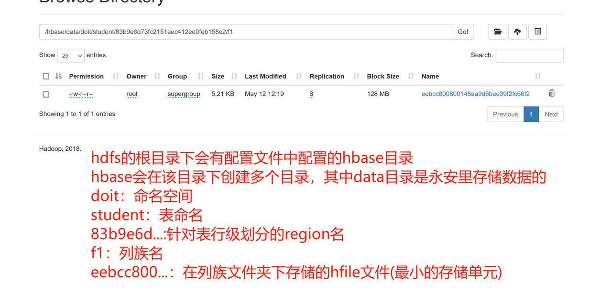

## 4.2region

Region是HBase数据管理的基本单位,region有一点像关系型数据的分区。
Region中存储这用户的真实数据，而为了管理这些数据，HBase使用了RegionSever来管理region。

### 4.2.1region的分配

一个表中可以包含一个或多个Region。

每个Region只能被一个RS（RegionServer）提供服务，RS可以同时服务多个Region，来自不同RS上的Region组合成表格的整体逻辑视图。

regionServer其实是hbase的服务，部署在一台物理服务器上，region有一点像关系型数据的分区，数据存放在region中，当然region下面还有很多结构，确切来说数据存放在memstore和hfile中。我们访问hbase的时候，先去hbase 系统表查找定位这条记录属于哪个region，然后定位到这个region属于哪个服务器，然后就到哪个服务器里面查找对应region中的数据

### 4.2.2region结构

### region的寻址

**根据key-->zk-->meta表位置-->region的位置**

hbase:meta表存储了所有用户HRegion的位置信息：通过scan hbase:meta可以查看

Rowkey：namespace:TableName,StartKey,Timestamp.EncodedName

info列族：这个列族包含三个列，他们分别是：

* info:regioninfo列：regionId,tableName,startKey,endKey,offline,split,replicaId；

* info:server列：HRegionServer对应的server:port；

* info:serverstartcode列：HRegionServer的启动时间戳。

* info:sn：该列对应的 value 由 server 和 serverstartcode 组成

* info:state：该列对应的 value 表示 Region 状态

```shell
其中：
\x08\x00 表示 ENABLED 状态
\x08\x01 表示 DISABLED 状态
```

说明：

（1）客户端先通过ZooKeeper的/hbase/meta-region-server节点查询到哪台RegionServer上有hbase:meta表。&#x20;

（2）客户端连接含有hbase:meta表的RegionServer。hbase:meta 表存储了所有Region的行键范围信息，通过这个表就可以查询出你要存 取的rowkey属于哪个Region的范围里面，以及这个Region又是属于哪个 RegionServer。&#x20;

（3）获取这些信息后，客户端就可以直连其中一台拥有你要存取 的rowkey的RegionServer，并直接对其操作。&#x20;

（4）客户端会把meta信息缓存起来，下次操作就不需要进行以上加载hbase:meta的步骤了。&#x20;

### **4.2.3数据的写入**

### 4.2.4Memstore Flush流程

flus流程分为三个阶段：

1. **prepare阶段：**&#x904D;历当前 Region中所有的 MemStore ，将 MemStore 中当前数据集 CellSkpiListSet 做一个快照 snapshot；然后再新建一个 CellSkipListSet。后期写入的数据都会写入新的 CellSkipListSet 中。prepare 阶段需要加一把 updataLock 对写请求阻塞，结束之后会释放该锁。因为此阶段没有任何费时操作，因此锁持有时间很短

2. **flush阶段：**&#x904D;历所有 MemStore，将 prepare 阶段生成的**snapshot 持久化为临时文件**，临时文件会统一放到目录.tmp下。这个过程因为涉及到磁盘 IO 操作，因此相对耗时

3. **commit阶段：**&#x904D;历所有 MemStore，将flush阶段生成的临时文件移动到指定的 ColumnFamily 目录下，针对 HFile生成对应的 StoreFile 和 Reader，把 StoreFile 添加到 HStore 的 storefiles 列表中，最后再清空 prepare 阶段生成的 snapshot快照

### 4.2.5Compact 合并机制

hbase中的合并机制分为自动合并和手动合并

#### **4.2.5.1自动合并：**

* minor compaction 小合并

* major compacton 大合并

minor compaction（小合并）

将 Store 中多个 HFile 合并为一个相对较大的 HFile, 过程中会选取一些小的、相邻的 StoreFile 将他们合并成一个更大的 StoreFile，对于超过 TTL 的数据、更新的数据、删除的数据仅仅只是做了标记，并没有进行物理删除。一次 minor compaction 过后，storeFile会变得更少并且更大，这种合并的触发频率很高

##### **4.2.5.1.1小合并的触发方式：**

memstore flush会产生HFile文件，文件越来越多就需要compact.每次执行完Flush操作之后，都会对当前Store中的文件数进行判断，一旦文件数大于配置3，就会触发compaction。compaction都是以Store为单位进行的，而在Flush触发条件下，整个Region的所有Store都会执行compact

后台线程周期性检查

检查周期可配置：

hbase.server.thread.wakefrequency/默认10000毫秒)\*hbase.server.compactchecker.interval.multiplier/默认1000

CompactionChecker大概是2hrs 46mins 40sec 执行一次

```xml
<!--表示至少需要三个满足条件的store file时，minor compaction才会启动-->
<property>
        <name>hbase.hstore.compactionThreshold</name>
        <value>3</value>
</property>

<!--表示一次minor compaction中最多选取10个store file-->
<property>
        <name>hbase.hstore.compaction.max</name>
        <value>10</value>
</property>

<!--默认值为128m,
表示文件大小小于该值的store file 一定会加入到minor compaction的store file中
-->
<property>
        <name>hbase.hstore.compaction.min.size</name>
        <value>134217728</value>
</property>
    
    <!--默认值为LONG.MAX_VALUE，表示文件大小大于该值的store file 一定会被minor compaction排除-->
<property>
            <name>hbase.hstore.compaction.max.size</name>
            <value>9223372036854775807</value>
</property>
```

##### 4.2.5.1.2major compaction（大合并）

合并 Store 中所有的 HFile 为一个 HFile，将所有的 StoreFile 合并成为一个 StoreFile，这个过程中还会清理三类无意义数据：被删除的数据、TTL过期数据、版本号超过设定版本号的数据。合并频率比较低，默认7天执行一次，并且性能消耗非常大，建议生产关闭（设置为0），在应用空间时间手动触发。一般是可以手动控制进行合并，防止出现在业务高峰期。

```xml
线程先检查小文件数是否大于配置3，一旦大于就会触发compaction。
大文件周期性合并成Major Compaction
如果不满足，它会接着检查是否满足major compaction条件
如果当前store中hfile的最早更新时间早于某个值mcTime就会触发major compaction 
(默认7天触发一次，可配置手动触发)

<!--默认值为7天进行一次大合并，-->
<property>
        <name>hbase.hregion.majorcompaction</name>
        <value>604800000</value>
</property>
```

#### 4.2.5.2手动合并

一般来讲，手动触发compaction通常是为了执行major compaction，一般有这些情况需要手动触发合并是因为很多业务担心自动maior compaction影响读写性能，因此会选择低峰期手动触发也有可能是用户在执行完alter操作之后希望立刻生效，执行手动触发maiorcompaction:

**造数据**

```shell
truncate 'doit:test'                                 
put 'doit:test','001','f1:name','zss'
put 'doit:test','002','f1:name','zss'
put 'doit:test','003','f1:name','zss'
put 'doit:test','004','f1:name','zss'
flush 'doit:test'                    
put 'doit:test','005','f1:name','zss'
put 'doit:test','006','f1:name','zss'
put 'doit:test','007','f1:name','zss'
put 'doit:test','008','f1:name','zss'
flush 'doit:test'                    
put 'doit:test','009','f1:name','zss'
put 'doit:test','010','f1:name','zss'
put 'doit:test','011','f1:name','zss'
put 'doit:test','012','f1:name','zss'
flush 'doit:test'  
、、、、、、、
put 'doit:test','013','f1:name','zss'
put 'doit:test','014','f1:name','zss'
put 'doit:test','015','f1:name','zss'
put 'doit:test','016','f1:name','zss'
flush 'doit:test'
put 'doit:test','017','f1:name','zss'
put 'doit:test','018','f1:name','zss'
put 'doit:test','019','f1:name','zss'
put 'doit:test','020','f1:name','zss'
flush 'doit:test'
put 'doit:test','021','f1:name','zss'
put 'doit:test','022','f1:name','zss'
put 'doit:test','023','f1:name','zss'
put 'doit:test','024','f1:name','zss'
flush 'doit:test'
put 'doit:test','025','f1:name','zss'
put 'doit:test','026','f1:name','zss'
put 'doit:test','027','f1:name','zss'
put 'doit:test','028','f1:name','zss'
flush 'doit:test'
put 'doit:test','021','f1:name','zss'
put 'doit:test','022','f1:name','zss'
put 'doit:test','023','f1:name','zss'
put 'doit:test','024','f1:name','zss'
flush 'doit:test'
put 'doit:test','021','f1:name','zss'
put 'doit:test','022','f1:name','zss'
put 'doit:test','023','f1:name','zss'
put 'doit:test','024','f1:name','zss'
flush 'doit:test'
put 'doit:test','021','f1:name','zss'
put 'doit:test','022','f1:name','zss'
put 'doit:test','023','f1:name','zss'
put 'doit:test','024','f1:name','zss'
flush 'doit:test'

put 'doit:test','021','f1:name','zss'
put 'doit:test','022','f1:name','zss'
put 'doit:test','023','f1:name','zss'
put 'doit:test','024','f1:name','zss'
flush 'doit:test'

每次flush一下都会在底层生成一个小文件
```

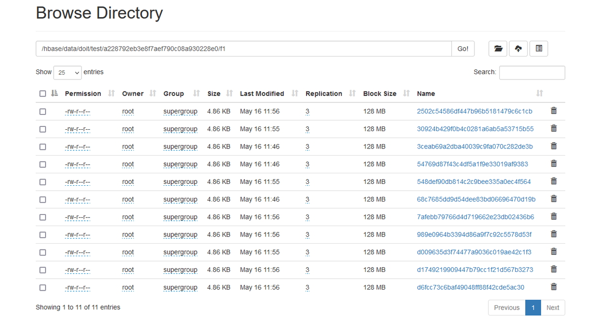

```shell
##使用major_compact命令
major_compact tableName

major_compact 'doit:test'
```

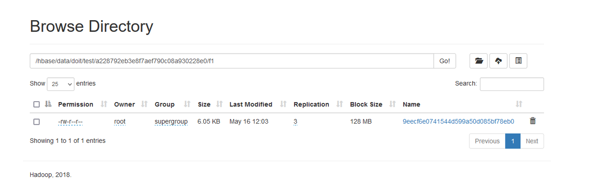

### 4.2.6region的拆分

region中存储的是一张表的数据，当region中的数据条数过多的时候，会直接影响查询效率。当region过大的时候，region会被拆分为两个region，HMaster会将分裂的region分配到不同的regionserver上，这样可以让请求分散到不同的RegionServer上，已达到负载均衡  , 这也是HBase的一个优点&#x20;

#### **4.2.6.1region的拆分策略**

##### 8.1 ConstantSizeRegionSplitPolicy：0.94版本前，HBase region的默认切分策略&#x20;

> 当region中最大的store大小超过某个阈值(hbase.hregion.max.filesize=10G)之后就会触发切分，一个region等分为2个region。
>
> 但是在生产线上这种切分策略却有相当大的弊端（切分策略对于大表和小表没有明显的区分）：
>
> * 阈值(hbase.hregion.max.filesize)设置较大对大表比较友好，但是小表就有可能不会触发分裂，极端情况下可能就1个，形成热点，这对业务来说并不是什么好事。
>
> * 如果设置较小则对小表友好，但一个大表就会在整个集群产生大量的region，这对于集群的管理、资源使用、failover来说都不是一件好事。

##### 8.2 IncreasingToUpperBoundRegionSplitPolicy：0.94版本\~2.0版本默认切分策略

> 总体看和ConstantSizeRegionSplitPolicy思路相同，一个region中最大的store大小大于设置阈值就会触发切分。 但是这个阈值并不像ConstantSizeRegionSplitPolicy是一个固定的值，而是会在一定条件下不断调整，调整规则和region所属表在当前regionserver上的region个数有关系.
>
> region split阈值的计算公式是：
>
> * 设regioncount：是region所属表在当前regionserver上的region的个数
>
> * 阈值 = regioncount^3 \* 128M \* 2，当然阈值并不会无限增长，最大不超过MaxRegionFileSize（10G),当region中最大的store的大小达到该阈值的时候进行region split
>
> 例如：
>
> * 第一次split阈值 = 1^3 \* 256 = 256MB
>
> * 第二次split阈值 = 2^3 \* 256 = 2048MB
>
> * 第三次split阈值 = 3^3 \* 256 = 6912MB
>
> * 第四次split阈值 = 4^3 \* 256 = 16384MB > 10GB，因此取较小的值10GB
>
> * 后面每次split的size都是10GB了
>
> **特点**
>
> * 相比ConstantSizeRegionSplitPolicy，可以自适应大表、小表；
>
> * 在集群规模比较大的情况下，对大表的表现比较优秀
>
> * 对小表不友好，小表可能产生大量的小region，分散在各regionserver上
>
> * 小表达不到多次切分条件，导致每个split都很小，所以分散在各个regionServer上

##### 8.3 SteppingSplitPolicy：2.0版本默认切分策略

> 相比 IncreasingToUpperBoundRegionSplitPolicy 简单了一些  region切分的阈值依然和待分裂region所属表在当前regionserver上的region个数有关系
>
> * 如果region个数等于1，切分阈值为flush size 128M \* 2
>
> * 否则为MaxRegionFileSize : 10G。
>
> > 这种切分策略对于大集群中的大表、小表会比 IncreasingToUpperBoundRegionSplitPolicy 更加友好，小表不会再产生大量的小region，而是适可而止。
>
>

##### 8.4 KeyPrefixRegionSplitPolicy

> 根据rowKey的前缀对数据进行分区，这里是指定rowKey的前多少位作为前缀，比如rowKey都是16位的，指定前5位是前缀，那么前5位相同的rowKey在相同的region中

##### 8.5 DelimitedKeyPrefixRegionSplitPolicy

> 保证相同前缀的数据在同一个region中，例如rowKey的格式为：userid\_eventtype\_eventid，指定的delimiter为 \_ ，则split的的时候会确保userid相同的数据在同一个region中。 按照分隔符进行切分，而KeyPrefixRegionSplitPolicy是按照指定位数切分

##### 8.6 BusyRegionSplitPolicy

> 按照一定的策略判断Region是不是Busy状态，如果是即进行切分
>
> 如果你的系统常常会出现热点Region，而你对性能有很高的追求，那么这种策略可能会比较适合你。它会通过拆分热点Region来缓解热点Region的压力，但是根据热点来拆分Region也会带来很多不确定性因素，因为你也不知道下一个被拆分的Region是哪个

##### 8.7 DisabledRegionSplitPolicy：不启用自动拆分, 需要指定手动拆分

#### 4.2.6.2手动合并拆分region

**手动合并**

```shell
hbase(main):025:0> list_regions 'doit:test'
                 SERVER_NAME |                                                          REGION_NAME |  START_KEY |    END_KEY |  SIZE |   REQ |   LOCALITY |
 --------------------------- | -------------------------------------------------------------------- | ---------- | ---------- | ----- | ----- | ---------- |
 linux03,16020,1684200651855 |           doit:test,,1684205468848.920ae3e043ad95890c4f5693cb663bc5. |            | rowkey_010 |     0 |     0 |        0.0 |
 linux01,16020,1684205091382 | doit:test,rowkey_010,1684207066858.5e04eb75e5510ad65a0f3001de3c7aa0. | rowkey_010 | rowkey_015 |     0 |     0 |        0.0 |
 linux02,16020,1684200651886 | doit:test,rowkey_015,1684207066858.ed1b328ca4c485d4fa429922f6c18f0b. | rowkey_015 | rowkey_020 |     0 |     0 |        0.0 |
 linux02,16020,1684200651886 | doit:test,rowkey_020,1684205468848.25d62e8cc2fdaecec87234b8d28f0827. | rowkey_020 | rowkey_030 |     0 |     0 |        0.0 |
 linux03,16020,1684200651855 | doit:test,rowkey_030,1684205468848.2b0468e6643b95159fa6e210fa093e66. | rowkey_030 | rowkey_040 |     0 |     0 |        0.0 |
 linux01,16020,1684205091382 | doit:test,rowkey_040,1684205468848.fb12c09c7c73cfeff0bf79b5dda076cb. | rowkey_040 |            |     0 |     0 |        0.0 |
 6 rows
Took 0.0299 seconds                                                                                                                                                    
hbase(main):026:0> merge_region 'doit:test,,1684205468848.920ae3e043ad95890c4f5693cb663bc5.','doit:test,rowkey_010,1684207066858.5e04eb75e5510ad65a0f3001de3c7aa0.'
Took 1.2638 seconds                                                                                                                                                    
hbase(main):027:0> list_regions 'doit:test'
                 SERVER_NAME |                                                          REGION_NAME |  START_KEY |    END_KEY |  SIZE |   REQ |   LOCALITY |
 --------------------------- | -------------------------------------------------------------------- | ---------- | ---------- | ----- | ----- | ---------- |
 linux03,16020,1684200651855 |           doit:test,,1684207066859.cdc1226d634c0cf16f58832637f485b6. |            | rowkey_015 |     0 |     0 |        0.0 |
 linux02,16020,1684200651886 | doit:test,rowkey_015,1684207066858.ed1b328ca4c485d4fa429922f6c18f0b. | rowkey_015 | rowkey_020 |     0 |     0 |        0.0 |
 linux02,16020,1684200651886 | doit:test,rowkey_020,1684205468848.25d62e8cc2fdaecec87234b8d28f0827. | rowkey_020 | rowkey_030 |     0 |     0 |        0.0 |
 linux03,16020,1684200651855 | doit:test,rowkey_030,1684205468848.2b0468e6643b95159fa6e210fa093e66. | rowkey_030 | rowkey_040 |     0 |     0 |        0.0 |
 linux01,16020,1684205091382 | doit:test,rowkey_040,1684205468848.fb12c09c7c73cfeff0bf79b5dda076cb. | rowkey_040 |            |     0 |     0 |        0.0 |
 5 rows
Took 0.0271 seconds
```

**手动拆分**

```shell
hbase(main):029:0> list_regions 'doit:test'
                 SERVER_NAME |                                                          REGION_NAME |  START_KEY |    END_KEY |  SIZE |   REQ |   LOCALITY |
 --------------------------- | -------------------------------------------------------------------- | ---------- | ---------- | ----- | ----- | ---------- |
 linux03,16020,1684200651855 |           doit:test,,1684207066860.8ebf4555c58bd0e5fedae5d4efbe4235. |            | rowkey_030 |     0 |     0 |        0.0 |
 linux03,16020,1684200651855 | doit:test,rowkey_030,1684205468848.2b0468e6643b95159fa6e210fa093e66. | rowkey_030 | rowkey_040 |     0 |     0 |        0.0 |
 linux01,16020,1684205091382 | doit:test,rowkey_040,1684205468848.fb12c09c7c73cfeff0bf79b5dda076cb. | rowkey_040 |            |     0 |     0 |        0.0 |
 3 rows
Took 0.0329 seconds                                                                                                                                                    
hbase(main):030:0> split 'doit:test,,1684207066860.8ebf4555c58bd0e5fedae5d4efbe4235.','rowkey_025'
Took 0.1179 seconds                                                                                                                                                    
hbase(main):031:0> list_regions 'doit:test'
                 SERVER_NAME |                                                          REGION_NAME |  START_KEY |    END_KEY |  SIZE |   REQ |   LOCALITY |
 --------------------------- | -------------------------------------------------------------------- | ---------- | ---------- | ----- | ----- | ---------- |
 linux02,16020,1684200651886 |           doit:test,,1684207502853.af0819bd7f6daa9db2a8f994fb41682d. |            | rowkey_025 |     0 |     0 |        0.0 |
 linux02,16020,1684200651886 | doit:test,rowkey_025,1684207502853.80d7feace447978ffe4a54418a20afd0. | rowkey_025 | rowkey_030 |     0 |     0 |        0.0 |
 linux03,16020,1684200651855 | doit:test,rowkey_030,1684205468848.2b0468e6643b95159fa6e210fa093e66. | rowkey_030 | rowkey_040 |     0 |     0 |        0.0 |
 linux01,16020,1684205091382 | doit:test,rowkey_040,1684205468848.fb12c09c7c73cfeff0bf79b5dda076cb. | rowkey_040 |            |     0 |     0 |        0.0 |
 4 rows
Took 0.0179 seconds                                                                                                                                                    
hbase(main):032:0> split 'doit:test,,1684207502853.af0819bd7f6daa9db2a8f994fb41682d.','rowkey_015'
Took 0.1262 seconds                                                                                                                                                    
hbase(main):033:0> list_regions 'doit:test'
                 SERVER_NAME |                                                          REGION_NAME |  START_KEY |    END_KEY |  SIZE |   REQ |   LOCALITY |
 --------------------------- | -------------------------------------------------------------------- | ---------- | ---------- | ----- | ----- | ---------- |
 linux02,16020,1684200651886 |           doit:test,,1684207546572.0f550ec8fa1af0ab9e73032d224d9f00. |            | rowkey_015 |     0 |     0 |        0.0 |
 linux02,16020,1684200651886 | doit:test,rowkey_015,1684207546572.09a2022c54dfef68866ac73e3f78bc70. | rowkey_015 | rowkey_025 |     0 |     0 |        0.0 |
 linux02,16020,1684200651886 | doit:test,rowkey_025,1684207502853.80d7feace447978ffe4a54418a20afd0. | rowkey_025 | rowkey_030 |     0 |     0 |        0.0 |
 linux03,16020,1684200651855 | doit:test,rowkey_030,1684205468848.2b0468e6643b95159fa6e210fa093e66. | rowkey_030 | rowkey_040 |     0 |     0 |        0.0 |
 linux01,16020,1684205091382 | doit:test,rowkey_040,1684205468848.fb12c09c7c73cfeff0bf79b5dda076cb. | rowkey_040 |            |     0 |     0 |        0.0 |
 5 rows
Took 0.0241 seconds  
```

### 4.2.7bulkLoad实现批量导入

bulkloader ： 一个用于批量快速导入数据到hbase的工具/方法

用于**已经存在一批巨量静态数据**的情况！如果不用bulkloader工具，则只能用rpc请求，一条一条地通过rpc提交给regionserver去插入，效率极其低下

#### 4.2.7.1原理

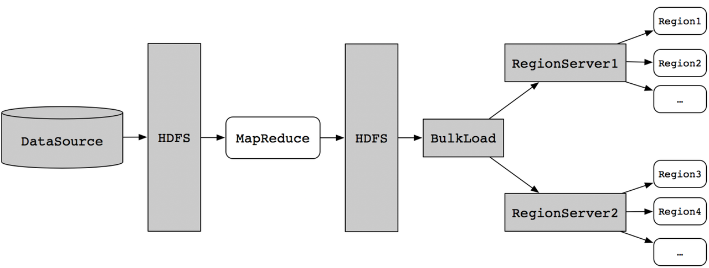

相比较于直接写HBase，BulkLoad主要是绕过了写WAL日志这一步，还有写Memstore和Flush到磁盘，从理论上来分析性能会比Put快！

#### 4.2.7.2BulkLoad实战示例1：importTsv工具

**原理：**

Importtsv是hbase自带的一个 **csv文件--》HFile文件&#x20;**&#x7684;工具，它能将csv文件转成HFile文件，并发送给regionserver。它的本质，是内置的一个将csv文件转成hfile文件的mr程序！

案例演示：

```shell
CSV转HFILE的命令示例如下：
// 001,北戴河,河北省,河北省北戴河昌平区沙河镇赋腾国际创客中心A座4018室
hbase  org.apache.hadoop.hbase.mapreduce.ImportTsv \
-Dimporttsv.separator=, \
-Dimporttsv.columns='HBASE_ROW_KEY,f:city,f:province,x:address'  \
-Dimporttsv.bulk.output=/tsv/output \
user_info \ 
/tsv/input
```


> **ImportTsv命令的参数说明如下：**
>
> -Dimporttsv.skip.bad.lines=false - 若遇到无效行则失败
>
> -Dimporttsv.separator=, - 使用特定分隔符,默认是tab也就是\t
>
> -Dimporttsv.timestamp=currentTimeAsLong - 使用导入时的时间戳
>
> -Dimporttsv.mapper.class=my.Mapper - 使用用户自定义Mapper类替换TsvImporterMapper
>
> -Dmapreduce.job.name=jobName - 对导入使用特定mapreduce作业名
>
> -Dcreate.table=no - 避免创建表，注：如设为为no，目标表必须存在于HBase中
>
> -Dno.strict=true - 忽略HBase表列族检查。默认为false
>
> -Dimporttsv.bulk.output=/user/yarn/output 作业的输出目录

**示例演示：**

```plain&#x20;text
创建一张表：
hbase(main):005:0> create 'test:user_info1','f1','f2'
Created table doit:user_info1
Took 1.4252 seconds                                                                                                
=> Hbase::Table - doit:user_info1
hbase(main):006:0> 

准备文件：
rowkey_001,zss,18,male,chengxuyuan,beijing
rowkey_002,lss,28,male,jinrongdalao,shanghai
rowkey_003,liuyan,18,female,yanyuan,beijing
rowkey_004,tanyang,38,female,yanyuan,shanghai


上传文件至hdfs上
[root@linux01 data]# hdfs dfs -mkdir -p /tsv/input
[root@linux01 data]# hdfs dfs -put hbase.txt /tsv/input/
[root@linux01 data]# 


使用importtsv将测试文件转为hfile
hbase org.apache.hadoop.hbase.mapreduce.ImportTsv \
-Dimporttsv.separator=, \
-Dimporttsv.columns='HBASE_ROW_KEY,f1:name,f1:age,f1:gender,f2:job,f2:address' \
-Dimporttsv.bulk.output=/uu/output \
doit:user_info1 \
/tsv/input
===.hfile文件


将hfile注入hbase ==》文件的迁移
hbase org.apache.hadoop.hbase.mapreduce.LoadIncrementalHFiles /uu/output/  doit:user_info1


查看表中的数据
hbase(main):067:0> scan 'doit:user_info1'
ROW                           COLUMN+CELL                                                                          
 rowkey_001                   column=f1:age, timestamp=1684062601474, value=18                                     
 rowkey_001                   column=f1:gender, timestamp=1684062601474, value=male                                
 rowkey_001                   column=f1:name, timestamp=1684062601474, value=zss                                   
 rowkey_001                   column=f2:address, timestamp=1684062601474, value=beijing                            
 rowkey_001                   column=f2:job, timestamp=1684062601474, value=chengxuyuan                            
 rowkey_002                   column=f1:age, timestamp=1684062601474, value=28                                     
 rowkey_002                   column=f1:gender, timestamp=1684062601474, value=male                                
 rowkey_002                   column=f1:name, timestamp=1684062601474, value=lss                                   
 rowkey_002                   column=f2:address, timestamp=1684062601474, value=shanghai                           
 rowkey_002                   column=f2:job, timestamp=1684062601474, value=jinrongdalao                           
 rowkey_003                   column=f1:age, timestamp=1684062601474, value=18                                     
 rowkey_003                   column=f1:gender, timestamp=1684062601474, value=female                              
 rowkey_003                   column=f1:name, timestamp=1684062601474, value=liuyan                                
 rowkey_003                   column=f2:address, timestamp=1684062601474, value=beijing                            
 rowkey_003                   column=f2:job, timestamp=1684062601474, value=yanyuan                                
 rowkey_004                   column=f1:age, timestamp=1684062601474, value=38                                     
 rowkey_004                   column=f1:gender, timestamp=1684062601474, value=female                              
 rowkey_004                   column=f1:name, timestamp=1684062601474, value=tanyang                               
 rowkey_004                   column=f2:address, timestamp=1684062601474, value=shanghai                           
 rowkey_004                   column=f2:job, timestamp=1684062601474, value=yanyuan                                
4 row(s)
Took 0.0587 seconds          
```

#### 4.2.7.3自己写一个mapreduce程序，用bulkLoad的方式导入

#### mapper程序

```java
package cn.doit.day01;

import org.apache.hadoop.conf.Configuration;
import org.apache.hadoop.fs.Path;
import org.apache.hadoop.hbase.HBaseConfiguration;
import org.apache.hadoop.hbase.KeyValue;
import org.apache.hadoop.hbase.TableName;
import org.apache.hadoop.hbase.client.Connection;
import org.apache.hadoop.hbase.client.ConnectionFactory;
import org.apache.hadoop.hbase.client.RegionLocator;
import org.apache.hadoop.hbase.client.Table;
import org.apache.hadoop.hbase.io.ImmutableBytesWritable;
import org.apache.hadoop.hbase.mapreduce.HFileOutputFormat2;
import org.apache.hadoop.hbase.util.Bytes;
import org.apache.hadoop.io.LongWritable;
import org.apache.hadoop.io.Text;
import org.apache.hadoop.mapreduce.Job;
import org.apache.hadoop.mapreduce.Mapper;
import org.apache.hadoop.mapreduce.lib.input.FileInputFormat;
import org.apache.hadoop.mapreduce.lib.output.FileOutputFormat;

import java.io.IOException;


public class Hfilebuilder{
    public static void main(String[] args) throws Exception {
        System.setProperty("HADOOP_USER_NAME","root");

        Configuration conf = HBaseConfiguration.create();

        Job job = Job.getInstance(conf);

        //给主类的类名
        job.setJarByClass(Test.class);

        //map类的类名
        job.setMapperClass(HFileMapper.class);

        //map程序输出的类型
        job.setMapOutputKeyClass(ImmutableBytesWritable.class);
        job.setMapOutputValueClass(KeyValue.class);

        //设置reducetask的个数
        job.setNumReduceTasks(0);

        //设置hfile文件给哪一张表的具体信息
        Connection conn = ConnectionFactory.createConnection(conf);
        TableName tableName = TableName.valueOf("doit:test");
        Table table = conn.getTable(tableName);
        RegionLocator regionLocator = conn.getRegionLocator(tableName);
        HFileOutputFormat2.configureIncrementalLoad(job,table,regionLocator);

        //输出的类名
        job.setOutputFormatClass(HFileOutputFormat2.class);

        //输入的路径
        FileInputFormat.setInputPaths(job,new Path("data/test.txt"));
        //输出的路径
        FileOutputFormat.setOutputPath(job,new Path("hdfs://doit01:8020/doit_test_hfile/"));

        job.waitForCompletion(true);

    }

    public static class HFileMapper extends Mapper<LongWritable, Text, ImmutableBytesWritable, KeyValue> {
        @Override
        protected void map(LongWritable key, Text value, Mapper<LongWritable, Text, ImmutableBytesWritable, KeyValue>.Context context) throws IOException, InterruptedException {
            String line = value.toString();
            String[] arr = line.split(",");

            //输出的是key和value
            //输出key
            //输出value
            //给几个值，分别是rowkey，列族，列，value的值
            context.write(new ImmutableBytesWritable(Bytes.toBytes(arr[0])), new KeyValue(Bytes.toBytes(arr[0]), Bytes.toBytes("f1"), Bytes.toBytes("age"), Bytes.toBytes(arr[2])));

            context.write(new ImmutableBytesWritable(Bytes.toBytes(arr[0])), new KeyValue(Bytes.toBytes(arr[0]), Bytes.toBytes("f1"), Bytes.toBytes("name"), Bytes.toBytes(arr[1])));

            context.write(new ImmutableBytesWritable(Bytes.toBytes(arr[0])), new KeyValue(Bytes.toBytes(arr[0]), Bytes.toBytes("f2"), Bytes.toBytes("gender"), Bytes.toBytes(arr[3])));

        }
    }
}
```

Load hfile到hbase中

```java
package cn.doit.day01;


import org.apache.hadoop.conf.Configuration;
import org.apache.hadoop.fs.Path;
import org.apache.hadoop.hbase.HBaseConfiguration;
import org.apache.hadoop.hbase.TableName;
import org.apache.hadoop.hbase.client.*;
import org.apache.hadoop.hbase.tool.LoadIncrementalHFiles;

import java.io.IOException;

public class LoadDemo {
    public static void main(String[] args) throws IOException {
        System.setProperty("HADOOP_USER_NAME","root");

        Configuration conf = HBaseConfiguration.create();
        Connection conn = ConnectionFactory.createConnection(conf);
        TableName tableName = TableName.valueOf("doit:test");
        Table table = conn.getTable(tableName);
        Admin admin = conn.getAdmin();
        RegionLocator regionLocator = conn.getRegionLocator(tableName);


        LoadIncrementalHFiles loadIncrementalHFiles = new LoadIncrementalHFiles(conf);
        loadIncrementalHFiles.doBulkLoad(new Path("hdfs://doit01:8020/doit_test_hfile/"),admin,table,regionLocator);


    }
}
```

### 4.3hfile

### 4.3.1逻辑数据组织格式：

* **Scanned block section：**&#x8868;示顺序扫描HFile时（包含所有需要被读取的数据）所有的数据块将会被读取，包括Leaf Index Block和Bloom Block；

* **Non-scanned block section：**&#x48;File顺序扫描的时候该部分数据不会被读取，主要包括Meta Block和Intermediate Level Data Index Blocks两部分；

* **Load-on-open-section：**&#x8FD9;部分数据在HBase的region server启动时，需要加载到内存中。包括FileInfo、Bloom filter block、data block index和meta block index等各种索引的元数据信息；

* **Trailer：**&#x8FD9;部分主要记录了HFile的基本信息、各个部分的偏移值和寻址信息。

* **Data Block：**&#x4E3B;要存储用户的key，value信息

* **Meta Block：**&#x8BB0;录布隆过滤器的信息

* **Root Data Index：**&#x44;ataBlock的根索引以及MetaBlock和Bloom Filter的索引

* **Intermediate Level Index:**&#x44;ataBlock的第二层索引

* **Leaf Level Index：**&#x44;ataBlock的第三层索引，即索引数的叶子节点

* **Fileds for midKey:**&#x8FD9;部分数据是Optional的，保存了一些midKey信息，可以快速地定位到midKey,常常在HFileSplit的时候非常有用

* **MetaIndex:**&#x5373;meta的索引数据，和data index类似，但是meta存放的是BloomFilter的信息

* **FileInfo:**&#x4FDD;存了一些文件的信息，如lastKey,avgKeylen,avgValueLen等等

* **Bloom filter metadata:**&#x662F;布隆过滤器的索引

### **4.3.2物理数据结构图：**

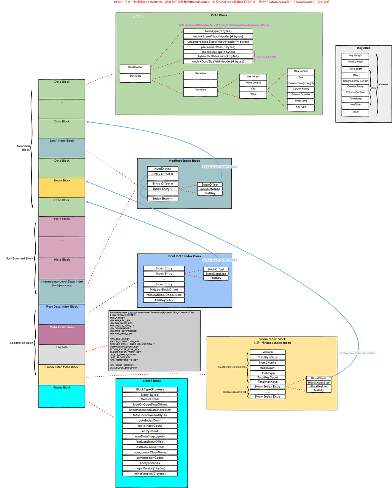

### **4.3.3数据的读取**

1. Client访问zookeeper，获取hbase:meta所在RegionServer的节点信息

2. Client访问hbase:meta所在的RegionServer，获取hbase:meta记录的元数据后先加载到内存中，然后再从内存中根据需要查询的RowKey查询出RowKey所在的Region的相关信息（Region所在RegionServer）

3. Client访问RowKey所在Region对应的RegionServer，发起数据读取请求

4. 读取memstore中的数据，看是否有key对应的value的值

5. 不管memstore中有没有值，都需要去读取Hfile中的数据(再读取Hfile中首先通过索引定位到data block)

6. 判断cache block中中是否已经加载过需要从文件中读取的bloom block和data block，如果加载过了，就直接读取cache block中的数据，如果没有，就读取文件中的block数据

7. 将memstore和Hfile中读取的数据汇总取正确的数据返回给客户端

## 4.4rowkey的设计

### 4.4.1设计的三大原则

1. Rowkey长度原则

Rowkey是一个二进制码流，Rowkey的长度被很多开发者建议设计在10-100个字节，不过建议是越短越好，不要超过16个字节

原因如下：

* 数据的持久化文件HFile中是按照KeyValue存储的，如果Rowkey过长比如100个字节，1000万列数据光Rowkey就要占用100\*1000万=10亿个字节，将近1G数据，这会极大影响Hfile的存储效率；

* MemStore将缓存部分数据到内存，如果Rowkey字段过长内存的有效利用率降低，系统将无法缓存更多的数据，这会降低检索效率，因此Rowkey的字节长度越短越好。

* 目前操作系统一般都是64位系统，内存8字节对齐，空值在16个字节，8字节的整数倍利用操作系统的最佳特性。

- Rowkey散列原则

如果Rowkey是按时间戳的方式递增，因为rowkey是按照字典顺序排序的，这样会出现大量的数据插入到一个reion中，而其他的region相对比较空闲从而造成热点问题，所以尽量不要将开头相同的内容作为rowkey造成热点问题，可以将时间戳反转后在作为rowkey。

* Rowkey唯一原则

必须在设计Rowkey上保证其唯一性。否则前面插入的数据将会被覆盖。

### **4.4.2常见的避免热点的方法以及它们的优缺点**

**加盐**

这里所说的加盐不是密码学中的加盐，而是在rowkey的前面增加随机数，具体就是给rowkey分配一个随机前缀以使得它和之前的rowkey的开头不同。分配的前缀种类数量应该和你想使用数据分散到不同的region的数量一致。加盐之后的rowkey就会根据随机生成的前缀分散到各个region上，以避免热点。

**哈希**

哈希会使同一行永远用一个前缀加盐。哈希也可以使负载分散到整个集群，但是读却是可以预测的。使用确定的哈希可以让客户端重构完整的rowkey，可以使用get操作准确获取某一个行数据

**反转**

第三种防止热点的方法时反转固定长度或者数字格式的rowkey。这样可以使得rowkey中经常改变的部分（最没有意义的部分）放在前面。这样可以有效的随机rowkey，但是牺牲了rowkey的有序性。

比如手机号的反转，时间戳的反转，当一个连续递增的数字类型想要作为rowkey时，可以用一个很大的数去减这个rowkey，反转后再当成rowkey
