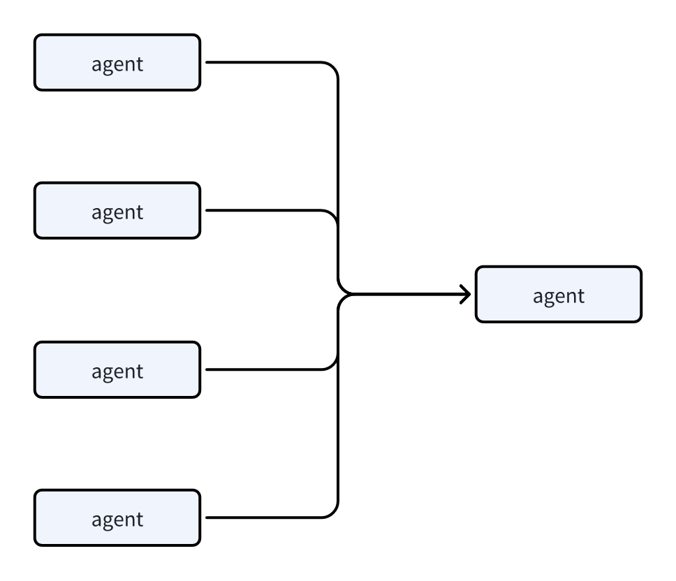
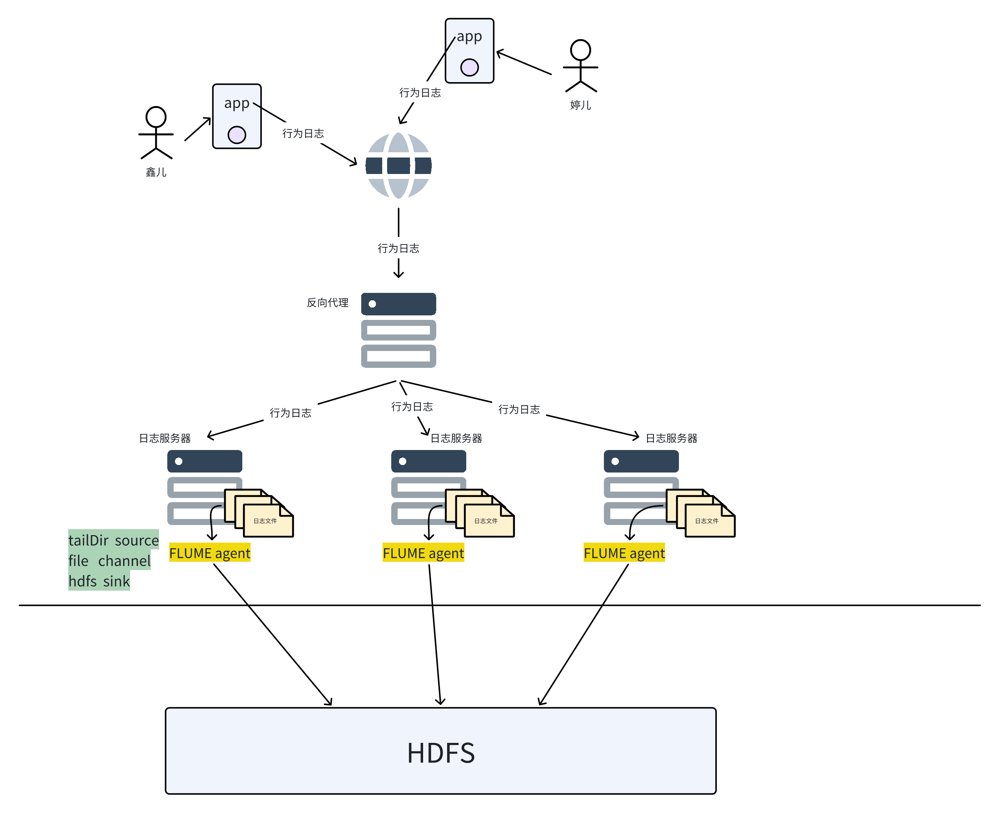

# 1 flume 快速入门

更详细参考文档： [ flume快速入门参考](https://x03se0enz9.feishu.cn/docx/doxcnlyuyRDE5xSMIHczqmY7Keb)&#x20;

***

* **flume是做什么用的？**

数据采集；尤其是日志类数据采集；

* **flume的核心组件**

flume是一个分布式系统；可以组配各种复杂的数据采集传输网络；



**运行实例叫做agent；**

**agent内部有：source、channel、sink 三大核心组件；**

当然，还有一些其他的辅助组件，比如 ：拦截器


* **flume内部数据流转的封装类**

Event；

Event内包含 : **header\<hashmap>&#x20;**&#x548C;**body\<byte\[]>**；

header是用于安插一些kv对，可以用于各种用途；

body是采集到的用户的数据；


* **flume的数据传递语义**

flume的数据传递语义，取决于所选择的 source、channel、sink；

flume最多可以实&#x73B0;**&#x20;at least once&#x20;**&#x8FD9;个级别的传递语义；

意味着它可能会出现重复采集；


* **flume的事务机制**

flume实现 at least once 传递语义，是依赖两个事务来保证： &#x20;


* **flume的使用方式**

安装flume；

根据自己的需求场景，选择合适的 source、sink、channel组件，并编写配置文件；

然后启动flume并指定上述的配置文件即可；

启动完后，flume的运行实例叫做 Agent ；

flume一旦启动，就会实时持续采集数据了，不停！


# 2 项目日志采集系统代码及配置开发

## 2.1 采集方案整体介绍




## 2.2 采集系统配置启动

1. **安装flume到日志文件所在的服务器**

```shell
# 1. 解压；

# 2. 进入flume的安装目录的conf目录，修改 flume-env.sh,添加一个javahome
# If this file is placed at FLUME_CONF_DIR/flume-env.sh, it will be sourced
# during Flume startup.

# Enviroment variables can be set here.

# export JAVA_HOME=/usr/lib/jvm/java-8-oracle
export JAVA_HOME=/opt/apps/jdk


----------------------------------
# 3. 配置环境变量 /etc/profile：
JAVA_HOME
FLUME_HOME
HADOOP_HOME
HBASE_HOME

# 4. 配置完成后
source  /etc/profile
```


* **创建一个采集配置文件**

可以创建在任意目录，比如为师放在了flume安装目录下的/myconf 目录下，名字叫： doit46.conf

```properties
a1.sources = s1
a1.channels = c1
a1.sinks = k1

# 定义source的各种参数
a1.sources.s1.channels = c1
a1.sources.s1.type = TAILDIR
a1.sources.s1.filegroups = g1 g2 
a1.sources.s1.filegroups.g1 = /opt/data/app_log/log_.*
a1.sources.s1.filegroups.g2 = /opt/data/wxapp_log/wx_.*
a1.sources.s1.headers.g1.x = doit47_g_1
a1.sources.s1.headers.g2.x = doit47_g_2
a1.sources.s1.batchSize = 100


# 定义channels
a1.channels.c1.type = file
a1.channels.c1.checkpointDir = /opt/data/flume_ckpt/
a1.channels.c1.useDualCheckpoints = true
a1.channels.c1.backupCheckpointDir = /opt/data/flume_ckpt_backup/

a1.sinks.k1.channel = c1
a1.sinks.k1.type = hdfs
a1.sinks.k1.hdfs.path = hdfs://doitedu:8020/events_log/%Y-%m-%d/
a1.sinks.k1.hdfs.filePrefix = doitedu_event_log_
a1.sinks.k1.hdfs.fileSuffix = .snappy

a1.sinks.k1.hdfs.rollInterval = 300 
a1.sinks.k1.hdfs.rollSize = 134217728
a1.sinks.k1.hdfs.rollCount = 0
a1.sinks.k1.hdfs.idleTimeout = 10
a1.sinks.k1.hdfs.batchSize = 100 
a1.sinks.k1.hdfs.fileType = CompressedStream
a1.sinks.k1.hdfs.codeC = snappy
a1.sinks.k1.hdfs.useLocalTimeStamp = true
```


**添加了拦截器的完整配置**

```properties
a1.sources = s1
a1.channels = c1
a1.sinks = k1

# 定义source的各种参数
a1.sources.s1.channels = c1
a1.sources.s1.type = TAILDIR
a1.sources.s1.filegroups = g1 g2 
a1.sources.s1.filegroups.g1 = /opt/data/app_log/log_.*
a1.sources.s1.filegroups.g2 = /opt/data/wxapp_log/wx_.*
a1.sources.s1.headers.g1.x = doit47_g_1
a1.sources.s1.headers.g2.x = doit47_g_2
a1.sources.s1.batchSize = 100
a1.sources.s1.interceptors = i1
a1.sources.s1.interceptors.i1.type = cn.doitedu.EventTimeInterceptor$MyBuilder
a1.sources.s1.interceptors.i1.time_key = action_time


# 定义channels
a1.channels.c1.type = file
a1.channels.c1.checkpointDir = /opt/data/flume_ckpt/
a1.channels.c1.useDualCheckpoints = true
a1.channels.c1.backupCheckpointDir = /opt/data/flume_ckpt_backup/

a1.sinks.k1.channel = c1
a1.sinks.k1.type = hdfs
a1.sinks.k1.hdfs.path = hdfs://doitedu:8020/events_log/%Y-%m-%d/
a1.sinks.k1.hdfs.filePrefix = doitedu_event_log_
a1.sinks.k1.hdfs.fileSuffix = .snappy

a1.sinks.k1.hdfs.rollInterval = 300 
a1.sinks.k1.hdfs.rollSize = 134217728
a1.sinks.k1.hdfs.rollCount = 0
a1.sinks.k1.hdfs.idleTimeout = 10
a1.sinks.k1.hdfs.batchSize = 100 
a1.sinks.k1.hdfs.fileType = CompressedStream
a1.sinks.k1.hdfs.codeC = snappy
a1.sinks.k1.hdfs.useLocalTimeStamp = false
```


* **启动**

> 切记： 先启动你的hdfs，并确保你的hdfs工作正常（至少不要处于安全模式）；
>
> start-dfs.sh


**模拟行为日志数据文件：**

要往你自己的日志服务器的行为日志目录 /opt/data/user\_action\_log/  下，放一点测试数据文件

比如：user\_action\_log.2024-03-22.log.1

```sql
{"username":"a","session_id":"s10","event_id":"search","action_time":1711036401000,"lat":38.089969323508726,"lng":114.35731900345093,"release_channel":"华为应用市场","device_type":"mi8","properties":{"keyword":"usb 移动固态","search_id":"sc01"}}
{"username":"b","session_id":"s11","event_id":"search","action_time":1711036402000,"lat":38.089969323508726,"lng":114.35731900345093,"release_channel":"华为应用市场","device_type":"mi8","properties":{"keyword":"usb 移动固态","search_id":"sc01"}}
{"username":"c","session_id":"s12","event_id":"search","action_time":1711036403000,"lat":38.089969323508726,"lng":114.35731900345093,"release_channel":"华为应用市场","device_type":"mi8","properties":{"keyword":"usb 移动固态","search_id":"sc01"}}
{"username":"d","session_id":"s13","event_id":"search","action_time":1711036404000,"lat":38.089969323508726,"lng":114.35731900345093,"release_channel":"华为应用市场","device_type":"mi8","properties":{"keyword":"usb 移动固态","search_id":"sc01"}}
{"username":"e","session_id":"s14","event_id":"search","action_time":1711036405000,"lat":38.089969323508726,"lng":114.35731900345093,"release_channel":"华为应用市场","device_type":"mi8","properties":{"keyword":"usb 移动固态","search_id":"sc01"}}
{"username":"f","session_id":"s15","event_id":"search","action_time":1711036406000,"lat":38.089969323508726,"lng":114.35731900345093,"release_channel":"华为应用市场","device_type":"mi8","properties":{"keyword":"usb 移动固态","search_id":"sc01"}}
{"username":"g","session_id":"s16","event_id":"search","action_time":1711036407000,"lat":38.089969323508726,"lng":114.35731900345093,"release_channel":"华为应用市场","device_type":"mi8","properties":{"keyword":"usb 移动固态","search_id":"sc01"}}
{"username":"h","session_id":"s17","event_id":"search","action_time":1711036408000,"lat":38.089969323508726,"lng":114.35731900345093,"release_channel":"华为应用市场","device_type":"mi8","properties":{"keyword":"usb 移动固态","search_id":"sc01"}}
```

或者用一个shell的while循环，反复生成

```shell
while true
do echo 111111111111111111111111 >> /opt/data/app_log/log_2024-04-17.log.1
sleep 0.1
done
```


**然后，启动flume的agent实例**

```sql
[root@doitedu flume-1.9.0]# bin/flume-ng agent -c conf/ -f ./myconf/doit47.conf -n a1 
```


> 如果工作不正常，可以去flume的安装目录下，打开它的日志来破案；


**最后，到hdfs上去观察采集到的数据文件结果**
