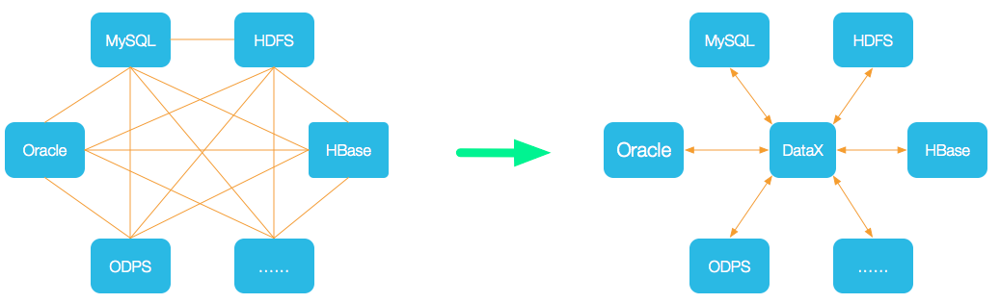

# datax 快速上手

## 1. 简介

DataX 是阿里云 [DataWorks数据集成](https://www.aliyun.com/product/bigdata/ide) 的开源版本，在阿里巴巴集团内被广泛使用的**离线数据同步工具/平台**。DataX 实现了包括 MySQL、Oracle、OceanBase、SqlServer、Postgre、HDFS、Hive、ADS、HBase、TableStore(OTS)、MaxCompute(ODPS)、Hologres、DRDS, databend 等各种异构数据源之间高效的数据同步功能。




## 2. **DataX 框架设计**

DataX本身作为离线数据同步框架，采用core Framework + plugin架构构建。将**数据源读取**和**写入**抽象成为Reader/Writer插件，纳入到整个同步框架中。

* Reader：Reader 为数据采集模块，负责采集数据源的数据，将数据发送给Framework。

* Writer： Writer 为数据写入模块，负责不断向Framework取数据，并将数据写入到目的端。

* Framework：Framework用于连接reader和writer，作为两者的数据传输通道，并处理缓冲，流控，并发，数据转换等核心技术问题。


> **DATAX支持传输速度的控制**


```sql
speeding {
     recordNum:100000,  #每秒传输的记录数
     byteNum: 10240000  #每秒传输的字节数
     channel: 20    # 传输通道数
}
```


## 3. **DataX 核心架构**

DataX  开源版本支持单机多线程模式完成同步作业运行。


### 3.1 **核心模块介绍&#x20;**

1. DataX完成单个数据同步的作业，我们称之为Job，DataX接受到一个Job之后，将启动一个进程来完成整个作业同步过程。DataX Job模块是单个作业的中枢管理节点，承担了数据清理、子任务切分(将单一作业计算转化为多个子Task)、TaskGroup管理等功能。

2. DataXJob启动后，会根据不同的源端切分策略，将Job切分成多个小的Task(子任务)，以便于并发执行。Task便是DataX作业的最小单元，每一个Task都会负责一部分数据的同步工作。

3. 切分多个Task之后，DataX Job会调用Scheduler模块，根据配置的并发数据量，将拆分成的Task重新组合，组装成TaskGroup(任务组)。每一个TaskGroup负责以一定的并发运行分配好的所有Task，默认单个任务组的并发数量为5。

4. 每一个Task都由TaskGroup负责启动，Task启动后，会固定启动Reader—>Channel—>Writer的线程来完成任务同步工作。

5. DataX作业运行起来之后， Job监控并等待多个TaskGroup模块任务完成，等待所有TaskGroup任务完成后Job成功退出。否则，异常退出，进程退出值非0；

### 3.2 **DataX调度流程&#x20;**

举例来说，用户提交了一个DataX作业，并且配置了20个并发，目的是将一个100张分表的mysql数据同步到hive里面。&#x20;

DataX的调度决策思路是：

1. DataXJob根据分库分表切分成了100个Task；

2. 一个TaskGroup默认的并行度为5（就是5个线程）；

3. 根据20个并发，DataX计算共需要分配4个TaskGroup。

4. 4个TaskGroup平分切分好的100个Task，每一个TaskGroup负责25个Task，相当于每5个线程要跑25个task；


## 4. 使用方式

### 4.1 安装

下载地址 [**DataX下载地址**](https://datax-opensource.oss-cn-hangzhou.aliyuncs.com/202308/datax.tar.gz)

解压到linux服务器


### 4.2 编写配置文件

* **配置结构**

```sql
job 
  |-- content
         |--reader
         |--writer
  |--setting
```

* **配置示例**

```json
{
    "job": {
        "content": [
            {
                "reader": {
                    "name": "streamreader", 
                    "parameter": {
                        "column": [], 
                        "sliceRecordCount": ""
                    }
                }, 
                "writer": {
                    "name": "streamwriter", 
                    "parameter": {
                        "encoding": "", 
                        "print": true
                    }
                }
            }
        ], 
        "setting": {
            "speed": {
                "channel": ""
            }
        }
    }
}
```


### 4.3 启动datax

```shell
$ cd {YOUR_DATAX_DIR_BIN}
$ python datax.py ./stream2stream.json 
```

显式的日志如下

```sql
...
2023-12-17 11:20:25.263 [job-0] INFO  JobContainer - 
任务启动时刻                    : 2023-12-17 11:20:15
任务结束时刻                    : 2023-12-17 11:20:25
任务总计耗时                    :                 10s
任务平均流量                    :              205B/s
记录写入速度                    :              5rec/s
读出记录总数                    :                  50
读写失败总数                    :                   0
```

