# 1.**Doris 简介**

## **1.1 Doris 概述**

Apache Doris 由百度大数据部研发（之前叫百度 Palo，2018 年贡献到 Apache 社区后，&#x20;

更名为 Doris ），在百度内部，有超过 200 个产品线在使用，部署机器超过 1000 台，单一&#x20;

业务最大可达到上百 TB。

Apache Doris 是一个现代化的 MPP（Massively Parallel Processing，即大规模并行处理）&#x20;

分析型（OLAP）数据库产品。仅需亚秒级响应时间即可获得查询结果，有效地支持实时数据分析。&#x20;

Apache Doris 的分布式架构非常简洁，易于运维，并且可以支持 10PB 以上的超大数据集。

Apache Doris 可以满足多种数据分析需求，例如固定历史报表，实时数据分析，交互式数据分析和探索式数据分析等。

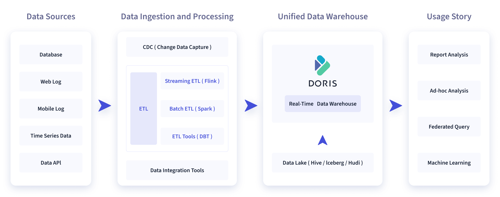

## 1.2OLAP和OLTP

* 联机**事务**处理OLTP(On-Line **Transaction** Processing) &#x20;

  * 公司业务系统使用数据库的场景，针对业务系统数据库有大量随机的增删改查

  * 高并发

  * 速度要快

  * 支持事务

* 联机**分析**处理OLAP(On-Line **Analytical** Processing)

  * 公司的数据分析使用数据库的场景，对已经生成好的数据进行统计分析

  * 一次操作都是针对的整个数据集

  * 只有查这个动作，不会去增删改

  * 查询的响应速度相对慢点也能接受

  * 并发量要求不是太高

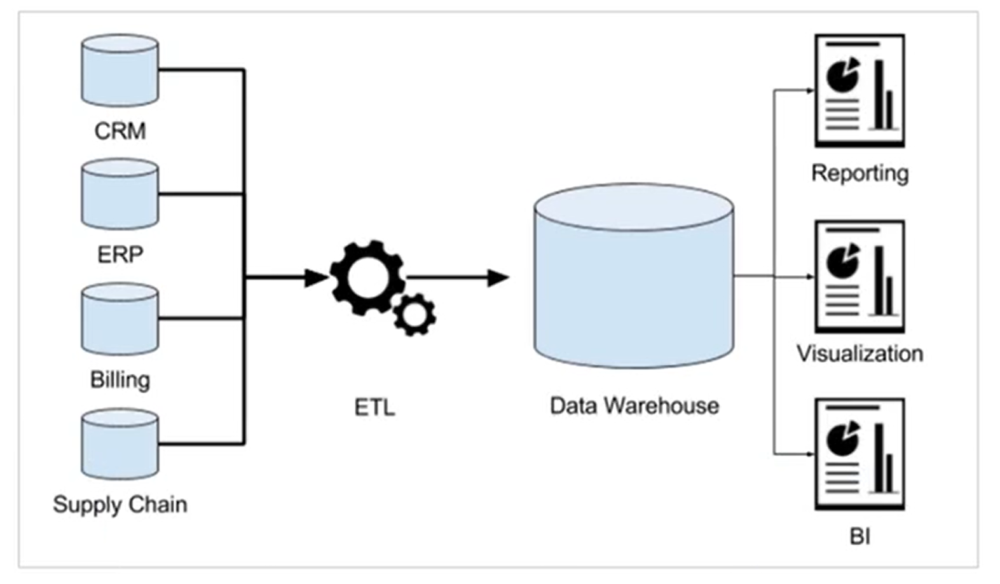

**OLAP和OLTP比较            用户行为日志数据**

|      | OLTP                  | OLAP                       |
| ---- | --------------------- | -------------------------- |
| 数据源  | 仅包含**当前**运行日常**业务数据** | 整合来自多个来源的数据，包括OLTP和外部来源    |
| 目的   | 面向应用,面向业务,支撑事务        | 面向主题，面向分析，支持分析决策           |
| 焦点   | 当下                    | 主要面向过去，面向历史(实时数仓除外)        |
| 任务   | 增删改查                  | 主要是用于读，select查询，写操作很少      |
| 响应时间 | 毫秒                    | 秒，分钟，小时，天，这些取决于数据量和查询的复杂程度 |
| 数据量  | 小数据,MB,GB             | 大数据，TP,PB                  |

**常见的开源OLAP引擎**

| 开源OLAP引擎   | 优点                                                                                        | 缺点                                           | 技术融合成本 | 易用性         | 使用场景 | 运维成本 | 引擎类型    |
| ---------- | ----------------------------------------------------------------------------------------- | -------------------------------------------- | ------ | ----------- | ---- | ---- | ------- |
| ClickHouse | 列式存储单极性彪悍保留明细数据                                                                           | 分布式集群在线扩展支持不佳运维成本极高                          | 高      | 非标协议接口      | 全面   | 高    | 纯列存OLAP |
| Druid      | 实时数据摄入列式存储和位图索引多租户和高并发                                                                    | OLAP性能分场景表现差异大使用门槛高仅支持聚合查询                   | 高      | 非标协议接口      | 局限   | 高    | MOLAP   |
| TiDB       | HTAP混合数据库同时支持明细和聚合查询高度兼容mysql                                                             | 非列式存储OLAP能力不足                                | 低      | SQL标准       | 全面   | 低    | 纯列存OLAP |
| Kylin      | 与计算引擎，可以对数据一次聚合多次查询支持数据规模超大易用性强，支持标准sql性能强，查询数据快                                          | 需要依赖hadoop生态仅支持聚合查·询不支持adhoc查询不支持join和对数据的更新 | 高      | SQL标准       | 局限   | 高    | MOLAP   |
| Doris      | GooleMesa+Apache Impa+ORCFile/Parquet主键更新支持Rollup Table高并发和高通图的Ad-hoc查询支持聚合+明细数据查询无外部系统依赖 | 成熟度不够                                        | 低      | 兼容mysql访问协议 | 全面   | 低    | HOLAP   |

## 1.3使用场景

* 报表分析

  * 实时看板 （Dashboards）

  * 面向企业内部分析师和管理者的报表

  * 面向用户或者客户的高并发报表分析（Customer Facing Analytics）。比如面向网站主的站点分析、面向广告主的广告报表，并发通常要求成千上万的 QPS ，查询延时要求毫秒级响应。著名的电商公司京东在广告报表中使用 Apache Doris ，每天写入 100 亿行数据，查询并发 QPS 上万，99 分位的查询延时 150ms。

* 即席查询（Ad-hoc Query）：面向分析师的自助分析，查询模式不固定，要求较高的吞吐。小米公司基于 Doris 构建了增长分析平台（Growing Analytics，GA），利用用户行为数据对业务进行增长分析，平均查询延时 10s，95 分位的查询延时 30s 以内，每天的 SQL 查询量为数万条。

* 统一数仓构建 ：一个平台满足统一的数据仓库建设需求，简化繁琐的大数据软件栈。海底捞基于 Doris 构建的统一数仓，替换了原来由 Spark、Hive、Hbase、Phoenix 组成的旧架构，架构大大简化。

* 数据湖联邦查询：通过外表的方式联邦分析位于 Hive、Hudi 中的数据，在避免数据拷贝的前提下，查询性能大幅提升

## 1.4优势

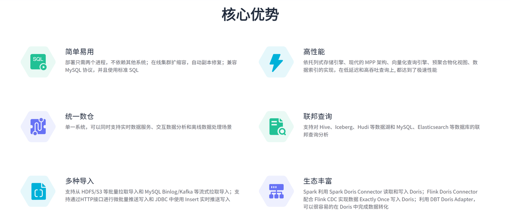

## 1.5架构

Doris 的架构很简洁，只设 FE(Frontend)前端进程、BE(Backend)后端进程两种角色、两个后台的服务进程，不依赖于外部组件，方便部署和运维，FE、BE 都可在线性扩展。&#x20;

1. FE（Frontend）：存储、维护集群元数据；负责接收、解析查询请求，规划查询计划,调度查询执行，返回查询结果。主要有三个角色：&#x20;

   * Leader 和 Follower：主要是用来达到元数据的高可用，保证单节点宕机的情况下,元数据能够实时地在线恢复，而不影响整个服务。&#x20;

   * Observer：用来扩展查询节点，同时起到元数据备份的作用。如果在发现集群压力非常大的情况下，需要去扩展整个查询的能力，那么可以加 observer 的节点。observer 不参与任何的写入，只参与读取。

2. BE（Backend）：负责物理数据的存储和计算；依据 FE 生成的物理计划，分布式地执行查询。数据的可靠性由 BE 保证，BE 会对整个数据存储多副本或者是三副本。副本数可根据需求动态调整。

3. MySQL Client:Doris 借助 MySQL 协议，用户使用任意 MySQL 的 ODBC/JDBC 以及 MySQL 的客户端，都可以直接访问 Doris。&#x20;

4. Broker:一个独立的无状态进程。封装了文件系统接口，提供 Doris 读取远端存储系 统中文件的能力，包括 HDFS，S3，BOS 等。

## 1.6**默认端口**

| **实例名称** | **端口名称&#x20;**           | **默认端口&#x20;** | **通讯方向&#x20;**          | **说明&#x20;**                         |
| -------- | ------------------------ | -------------- | ----------------------- | ------------------------------------ |
| BE       | be\_port                 | 9060           | FE-->BE                 | BE 上 thrift server 的端口,用于接收来自 FE 的请求 |
| BE       | webserver\_port          | 8040           | BE<-->FE                | BE 上的 http server 端口                 |
| BE       | heartbeat\_service\_port | 9050           | FE-->BE                 | BE 上心跳服务端口,用于接收来自 FE 的心跳             |
| BE       | brpc\_prot\*             | 8060           | FE<-->BE,BE<-->BE       | BE 上的 brpc 端口,用于 BE 之间通信             |
| FE       | http\_port               | 8030           | FE<-->FE ,用户<--> FE     | FE 上的 http\_server 端口                |
| FE       | rpc\_port                | 9020           | BE-->FE ,FE<-->FE       | FE 上 thirft server 端口                |
| FE       | query\_port              | 9030           | 用户<--> FE               | FE 上的 mysql server 端口                |
| FE       | edit\_log\_port          | 9010           | FE<-->FE                | FE 上 bdbje 之间通信用的端口                  |
| Broker   | broker\_ipc\_port        | 8000           | FE-->BROKER,BE-->BROKER | Broker 上的 thrift server,用于接收请求       |

# 2.安装

## 2.1安装前准备

* Linux 操作系统版本需求

* 软件需求

* 测试环境硬件配置需求

* 生产环境硬件配置需求

* 操作系统环境要求

### 设置系统参数

> 启动一个程序的时候，打开文件的数量就是句柄数

> 设置文件包含限制一个进程可以拥有的VMA([虚拟内存](https://so.csdn.net/so/search?q=%E8%99%9A%E6%8B%9F%E5%86%85%E5%AD%98\&spm=1001.2101.3001.7020)区域)的数量

### 时钟同步

Doris 的元数据要求时间精度要小于5000ms，所以所有集群所有机器要进行时钟同步，避免因为时钟问题引发的元数据不一致导致服务出现异常。

### 关闭交换分区（swap）

交换分区是linux用来当做虚拟内存用的磁盘分区；

linux可以把一块磁盘分区当做内存来使用（虚拟内存、交换分区）；

Linux使用交换分区会给Doris带来很严重的性能问题，建议在安装之前禁用交换分区；

> **注意事项：**
>
> 1. FE 的磁盘空间主要用于存储元数据，包括日志和 image。通常从几百 MB 到几个GB 不等。&#x20;
>
> 2. BE 的磁盘空间主要用于存放用户数据，总磁盘空间按用户总数据量\* 3（3 副本）计算，然后再预留额外 40%的空间用作后台 compaction 以及一些中间数据的存放。&#x20;
>
> 3. 一台机器上可以部署多个 BE 实例，但是只能部署一个 FE。如果需要 3 副本数 据，那么至少需要 3 台机器各部署一个 BE 实例（而不是 1 台机器部署 3 个 BE 实例）。多 个 FE 所在服务器的时钟必须保持一致（允许最多 5 秒的时钟偏差）&#x20;
>
> 4. 测试环境也可以仅适用一个 BE 进行测试。实际生产环境，BE 实例数量直接决定了整体查询延迟。&#x20;
>
> 5. 所有部署节点关闭 Swap。&#x20;
>
> 6. FE 节点数据至少为 1（1 个 Follower）。当部署 1 个 Follower 和 1 个 Observer 时,可以实现读高可用。当部署 3 个 Follower 时，可以实现读写高可用（HA）。&#x20;
>
> 7. Follower 的数量必须为奇数，Observer 数量随意。&#x20;
>
> 8. 根据以往经验，当集群可用性要求很高时（比如提供在线业务），可以部署 3 个Follower 和 1-3 个 Observer。如果是离线业务，建议部署 1 个 Follower 和 1-3 个 Observer。&#x20;
>
> 9. Broker 是用于访问外部数据源（如 HDFS）的进程。通常，在每台机器上部署一个 broker 实例即可。

## 2.2安装FE

1. 去官网下载源码包，官网地址：https://doris.apache.org

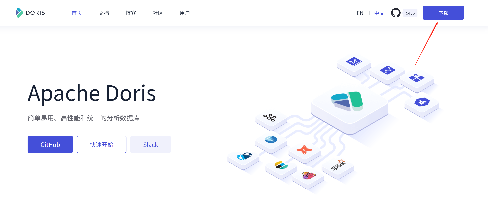

根据自己的配置选择性点击下载

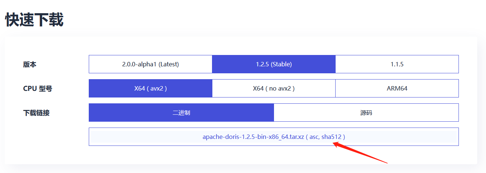

当然你也可以选择历史版本下载

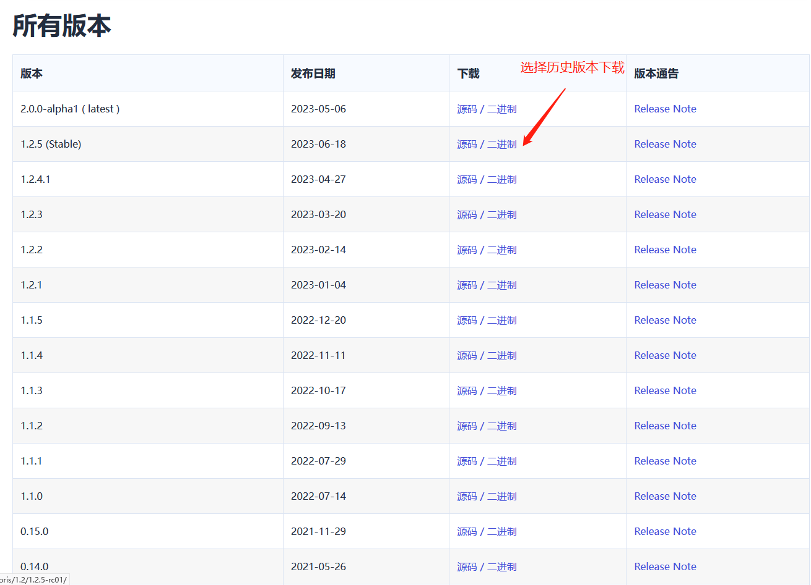

* 上传到linux&#x20;

* 解压&#x20;

* 修改配置文件

* 分发集群

* 启动

> 生产环境强烈建议单独指定目录不要放在 Doris 安装目录下，最好是单独的磁盘（如果有 SSD 最好）。
> 如果机器有多个 ip, 比如内网外网, 虚拟机 docker 等, 需要进行 ip 绑定，才能正确识别。
> JAVA\_OPTS 默认 java 最大堆内存为 4GB，建议生产环境调整至 8G 以上。

## 2.3安装BE

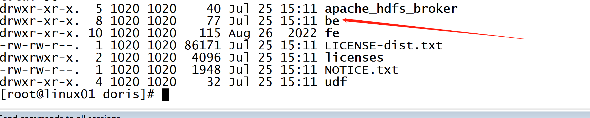

进入到be的conf目录下修改配置文件

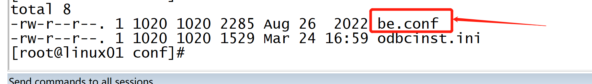

> **注意事项：**
>
> storage\_root\_path 默认在 be/storage 下，需要手动创建该目录。多个路径之间使用英文状&#x20;
>
> 态的分号;分隔（最后一个目录后不要加）。&#x20;
>
> 可以通过路径区别存储目录的介质，HDD 或 SSD。可以添加容量限制在每个路径的末&#x20;
>
> 尾，通过英文状态逗号，隔开，如：&#x20;
>
> storage\_root\_path=/home/disk1/doris.HDD,50;/home/disk2/doris.SSD,10;/home/disk2/doris
>
> 说明：&#x20;
>
> /home/disk1/doris.HDD,50，表示存储限制为 50GB，HDD;&#x20;
>
> /home/disk2/doris.SSD,10，存储限制为 10GB，SSD；&#x20;
>
> /home/disk2/doris，存储限制为磁盘最大容量，默认为 HDD&#x20;
>
>
>
> 关于Centos 添加新硬盘，分区格式化、挂载硬盘文档：
>
> [ Centos 添加新硬盘，分区格式化、挂载硬盘](https://pn7oj6yotr.feishu.cn/docx/Hla3deqvUoWMnWxMWtXc5fvGnBc)&#x20;

**这样就好了嘛？不是哦**

因为FE和BE两个都是单独的个体，所以他俩相互间还不认识，就需要我们通过mysql的客户端将他们建立起联系

**如果没有装mysql的家伙，记得先装mysql**

[ 安装mysql](https://pn7oj6yotr.feishu.cn/docx/Ynb3dS5MhobjvRxcqOwcuAIAnCc)&#x20;

使用 MySQL Client 连接 FE&#x20;

查看 BE 状态&#x20;

添加环境变量

启动BE

## **2.4~~部署 FS\_Broker（可选）~~**

Broker 以插件的形式，独立于 Doris 部署。

如果需要从第三方存储系统导入数据，需要部署相应的 Broker，默认提供了读取 HDFS、百度云 BOS 及 Amazon S3 的 fs\_broker。

fs\_broker 是无状态的，建议每一个 FE 和 BE 节点都部署一个 Broker。

**直接启动就可以啦！！！没想到吧骚年**

启动 Broker&#x20;

使用 mysql-client 连接启动的 FE，执行以下命令：

查看 Broker 状态&#x20;

## 2.5扩容和缩容

### **2.5.1 FE 扩容和缩容**

可以通过将 FE 扩容至 3 个以上节点来实现 FE 的高可用。&#x20;

使用 MySQL 登录客户端后，可以使用 sql 命令查看 FE 状态，目前就一台 FE&#x20;

添加FE的新节点：

FE 分为 Leader，Follower 和 Observer 三种角色。 默认一个集群，只能有一个 Leader,可以有多个 Follower 和 Observer。其中 Leader 和 Follower 组成一个 Paxos 选择组，如果Leader 宕机，则剩下的 Follower 会自动选出新的 Leader，保证写入高可用。Observer 同步 Leader 的数据，但是不参加选举。

如果只部署一个 FE，则 FE 默认就是 Leader。在此基础上，可以添加若干 Follower 和 Observer。

在doitedu02和doitedu03上分别启动FE节点

此时你再去查看FE的状态就发现有3台啦

删除FE节点命令

> 注意：删除 Follower FE 时，确保最终剩余的 Follower（包括 Leader）节点最好为奇数。

### **2.5.2 BE 扩容和缩容&#x20;**

增加 BE 节点&#x20;

DROP 方式删除 BE 节点（不推荐）&#x20;

> 注意：DROP BACKEND 会直接删除该 BE，并且其上的数据将不能再恢复！！！所以我们强烈不推荐使用 DROP BACKEND 这种方式删除 BE 节点。当你使用这个语句时,会有对应的防误操作提示。&#x20;

DECOMMISSION 方式删除 BE 节点（推荐）&#x20;

> 1. 该命令用于安全删除 BE 节点。命令下发后，Doris 会尝试将该 BE 上的数据向其 他 BE 节点迁移，当所有数据都迁移完成后，Doris 会自动删除该节点。&#x20;
>
> 2. 该命令是一个异步操作。执行后，可以通过 SHOW PROC '/backends'; 看到该 BE节点的 isDecommission 状态为 true。表示该节点正在进行下线。&#x20;
>
> 3. 该命令不一定执行成功。比如剩余 BE 存储空间不足以容纳下线 BE 上的数据，或者剩余机器数量不满足最小副本数时，该命令都无法完成，并且 BE 会一直处于isDecommission 为 true 的状态。&#x20;
>
> 4. DECOMMISSION 的进度，可以通过 SHOW PROC '/backends'; 中的 TabletNum 查看，如果正在进行，TabletNum 将不断减少。&#x20;
>
> 5. 该操作可以通过如下命令取消：CANCEL DECOMMISSION BACKEND "be\_host:be\_heartbeat\_service\_port"; 取消0后，该 BE 上的数据将维持当前剩余的数据量。后续 Doris 重新进行负载均衡。&#x20;

**2.5.3 Broker 扩容缩容**

Broker 实例的数量没有硬性要求。通常每台物理机部署一个即可。Broker 的添加和删除可以通过以下命令完成：

Broker 是无状态的进程，可以随意启停。当然，停止后，正在其上运行的作业会失败，重试即可。

# **第 3 章 数据表设计**

## 3.1**字段类型**

| TINYINT                       | 1 字节         | 范围：-2^7 + 1 \~ 2^7 - 1                                                                                                              |
| ----------------------------- | ------------ | ----------------------------------------------------------------------------------------------------------------------------------- |
| SMALLINT                      | 2 字节         | 范围：-2^15 + 1 \~ 2^15 - 1                                                                                                            |
| INT                           | 4 字节         | 范围：-2^31 + 1 \~ 2^31 - 1                                                                                                            |
| BIGINT                        | 8 字节         | 范围：-2^63 + 1 \~ 2^63 - 1                                                                                                            |
| LARGEINT                      | 16 字节        | 范围：-2^127 + 1 \~ 2^127 - 1                                                                                                          |
| FLOAT                         | 4 字节         | 支持科学计数法                                                                                                                             |
| DOUBLE                        | 12 字节        | 支持科学计数法                                                                                                                             |
| DECIMAL\[(precision, scale)]  | 16 字节        | 保证精度的小数类型。默认是DECIMAL(10, 0) ，precision: 1 \~ 27 ，scale: 0 \~ 9，其中整数部分为 1 \~ 18，不支持科学计数法                                             |
| DATE                          | 3 字节         | 范围：0000-01-01 \~ 9999-12-31                                                                                                         |
| DATETIME                      | 8 字节         | 范围：0000-01-01 00:00:00 \~ 9999-12-31 23:59:59                                                                                       |
| CHAR\[(length)]               |              | 定长字符串。长度范围：1 \~ 255。默认为 1                                                                                                           |
| VARCHAR\[(length)]            |              | 变长字符串。长度范围：1 \~ 65533                                                                                                               |
| BOOLEAN                       |              | 与 TINYINT 一样，0 代表 false，1 代表 true                                                                                                   |
| HLL                           | 1\~16385 个字节 | hll 列类型，不需要指定长度和默认值,长度根据数据的聚合程度系统内控制，并且 HLL 列只能通过 配套的hll\_union\_agg、Hll\_cardinality、hll\_hash 进行查询或使用                             |
| BITMAP                        |              | bitmap 列类型，不需要指定长度和默认值。表示整型的集合，元素最大支持到 2^64 - 1                                                                                     |
| STRING                        |              | 变长字符串，0.15 版本支持，最大支持 2147483643 字节（2GB-4），长度还受 be 配置\`string\_type\_soft\_limit\`,  实际能存储的最大长度取两者最小值。只能用在 value 列，不能用在 key列和分区、分桶列  |

## 3.2 表的**基本概念**

### **3.2.1 Row & Column&#x20;**

一张表包括行（Row）和列（Column）；

Row 即用户的一行数据。Column 用于描述一行数据中不同的字段。&#x20;

> **doris中的列分为两类：key列和value列**
>
> key列在doris中有两种作用：
>
> 聚合表模型中，key是聚合和排序的依据
>
> 其他表模型中，key是排序依据

### **3.2.2  分区与分桶**

* **partition（分区）：是在逻辑上将一张表按行(横向)划分**

* **tablet（又叫bucket，分桶）：在物理上对一个分区再按行(横向)划分**

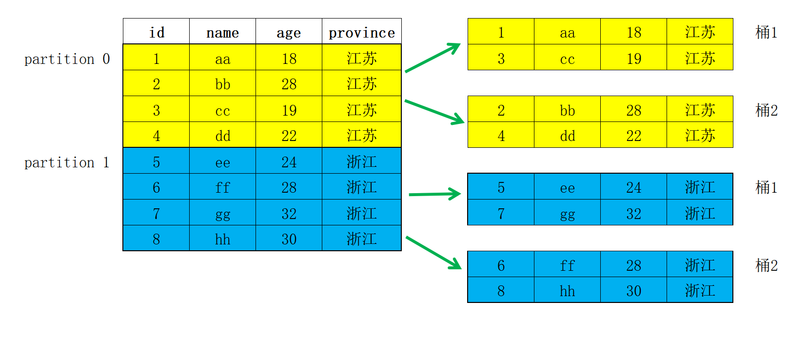

#### 3.2.2.1 **Partition**

* Partition 列可以指定一列或多列，在聚合模型中，分区列必须为 KEY 列。

* 不论分区列是什么类型，在写分区值时，都需要加双引号。

* 分区数量理论上没有上限。

* 当不使用 Partition 建表时，系统会自动生成一个和表名同名的，全值范围的 Partition。该 Partition 对用户不可见，并且不可删改。

* 创建分区时**不可添加范围重叠**的分区。

##### **1）Range 分区**

> range分区创建语法

* 分区列通常为时间列，以方便的管理新旧数据。

* Partition 支持通过 VALUES LESS THAN (...) 仅指定上界，系统会将前一个分区的上界作为该分区的下界，生成一个左闭右开的区间。同时，也支持通过 VALUES \[...) 指定上下界，生成一个左闭右开的区间。

* 通过 VALUES \[...) 同时指定上下界比较容易理解。这里举例说明，当使用 VALUES LESS THAN (...) 语句进行分区的增删操作时，分区范围的变化情况：

如上 expamle\_range\_tbl 得建表语句中可以看到，当建表完成后，会自动生成如下3个分区：

这是他生成得三个分区：

当我们增加一个分区 p201705 VALUES LESS THAN ("2017-06-01")，分区结果如下：

此时我们删除分区 p201703，则分区结果如下：

> **注意到 p201702 和 p201705 的分区范围并没有发生变化，而这两个分区之间，出现了一个空洞：\[2017-03-01, 2017-04-01)。即如果导入的数据范围在这个空洞范围内，是无法导入的。**

继续删除分区 p201702，分区结果如下：

现在增加一个分区 p201702new VALUES LESS THAN ("2017-03-01")，分区结果如下：

现在删除分区 p201701，并添加分区 p201612 VALUES LESS THAN ("2017-01-01")，分区结果如下：

> **综上，分区的删除不会改变已存在分区的范围。删除分区可能出现空洞。通过 VALUES LESS THAN 语句增加分区时，分区的下界紧接上一个分区的上界。**

Range分区除了上述我们看到的单列分区，也支持**多列分区**，示例如下：

在以上示例中，我们指定 date(DATE 类型) 和 id(INT 类型) 作为分区列。以上示例最终得到的分区如下：

> 注意，最后一个分区用户缺失，只指定了 date 列的分区值，所以 id 列的分区值会默认填充 MIN\_VALUE。当用户插入数据时，分区列值会按照顺序依次比较，最终得到对应的分区。举例如下：

##### **2）List 分区&#x20;**

* 分区列支持 BOOLEAN, TINYINT, SMALLINT, INT, BIGINT, LARGEINT, DATE, DATETIME, CHAR, VARCHAR 数据类型，分区值为枚举值。只有当数据为目标分区枚举值其中之一时，才可以命中分区。

* Partition 支持通过 VALUES IN (...) 来指定每个分区包含的枚举值。

* 下面通过示例说明，进行分区的增删操作时，分区的变化。

> List分区创建语法

如上 example\_list\_tbl 示例，当建表完成后，会自动生成如下3个分区：

当我们增加一个分区 p\_uk VALUES IN ("London")，分区结果如下：

当我们删除分区 p\_jp，分区结果如下：

List分区也支持**多列分区**，示例如下

在以上示例中，我们指定 id(INT 类型) 和 city(VARCHAR 类型) 作为分区列。以上示例最终得到的分区如下：

当用户插入数据时，分区列值会按照顺序依次比较，最终得到对应的分区。举例如下：

#### **3.2.2.2 Bucket**

* 如果使用了 Partition，则 DISTRIBUTED ... 语句描述的是数据在**各个分区内**的划分规则。如果不使用 Partition，则描述的是对整个表的数据的划分规则。

* 分桶列可以是多列，但必须&#x4E3A;**&#x20;Key 列**。分桶列可以和 Partition 列相同或不同。

* 分桶列的选择，是在 **查询吞吐** 和 **查询并发** 之间的一种权衡：

  1. 如果选择多个分桶列，则数据分布更均匀。如果一个查询条件不包含所有分桶列的等值条件，那么该查询会触发所有分桶同时扫描，这样**查询的吞吐会增加，单个查询的延迟随之降低**。这个方式适合高吞吐低并发的查询场景。

  2. 如果仅选择一个或少数分桶列，则对应的点查询可以仅触发一个分桶扫描。此时，当多个点查询并发时，这些查询有**较大的概率**分别触发不同的分桶扫描，各个查询之间的IO影响较小（尤其当不同桶分布在不同磁盘上时），所以这种方式适合高并发的点查询场景。

* 分桶的数量理论上没有上限

**关于 Partition 和 Bucket的数量和数据量的建议**

1. 一个表的 Tablet 总数量等于 (Partition num \* Bucket num)。

2. 一个表的 Tablet 数量，在不考虑扩容的情况下，推荐略多于整个集群的磁盘数量。 数量原则

3. 单个 Tablet 的数据量理论上没有上下界，但建议在 1G - 10G 的范围内。如果单个 Tablet 数据量过小，则数据的聚合效果不佳，且元数据管理压力大。如果数据量过大，则不利于副本的迁移、补齐，且会增加 Schema Change 或者 Rollup 操作失败重试的代价（这些操作失败重试的粒度是 Tablet）。分桶应该控制桶内数据量 ，不易过大或者过小

4. 当 Tablet 的数据量原则和数量原则冲突时，建议**优先考虑数据量原则。**

5. 在建表时，每个分区的 Bucket 数量统一指定。但是在动态增加分区时（ADD PARTITION），可以单独指定新分区的 Bucket 数量。可以利用这个功能方便的应对数据缩小或膨胀。

6. 一个 Partition 的 Bucket 数量一旦指定，不可更改。所以在确定 Bucket 数量时，需要预先考虑集群扩容的情况。比如当前只有 3 台 host，每台 host 有 1 块盘。如果 Bucket 的数量只设置为 3 或更小，那么后期即使再增加机器，也不能提高并发度。

> 小例子：
>
> 假设在有10台BE，每台BE一块磁盘的情况下。
>
> 如果一个表总大小为 500MB，则可以考虑4-8个分片。 5个
>
> 5GB：8-16个分片。
>
> 50GB：32个分片。
>
> 500GB：建议分区，每个分区大小在 50GB 左右，每个分区16-32个分片。
>
> 5TB：建议分区，每个分区大小在 500GB 左右，每个分区16-32个分片。

注：表的数据量可以通过 SHOW DATA命令查看，结果除以副本数，即表的数据量。

### 进阶：复合分区与单分区的选择

> 复合分区
>
> * 第一级称为 Partition，即分区。用户可以指定某一维度列作为分区列（当前只支持整型和时间类型的列），并指定每个分区的取值范围。
>
> * 第二级称为 Distribution，即分桶。用户可以指定一个或多个维度列以及桶数对数据进行 HASH 分布。
>
> 以下场景推荐使用复合分区
>
> * 有时间维度或类似带有有序值的维度，可以以这类维度列作为分区列。分区粒度可以根据导入频次、分区数据量等进行评估。地域、时间
>
> * 历史数据删除需求：如有删除历史数据的需求（比如仅保留最近N 天的数据）。使用复合分区，可以通过删除历史分区来达到目的。也可以通过在指定分区内发送 DELETE 语句进行数据删除。2
>
> * 改善数据倾斜问题：每个分区可以单独指定分桶数量。如按天分区，当每天的数据量差异很大时，可以通过指定分区的分桶数，合理划分不同分区的数据,分桶列建议选择区分度大的列。
>
> 用户也可以不使用复合分区，即使用单分区。则数据只做 HASH 分布。

### 小练习：建表指定分区和分桶数

### 3.2.3 **PROPERTIES&#x20;**

在建表语句的最后，可以用 PROPERTIES 关键字来设置一些表的属性参数（参数有很多）

下文挑选了3个比较重要的参数进行示例；

#### **3.2.3.1 分片副本数**

* **replication\_num&#x20;**

每个 Tablet 的副本数量。默认为 3，建议保持默认即可。在建表语句中，所有 Partition中的 Tablet 副本数量统一指定。而在增加新分区时，可以单独指定新分区中 Tablet 的副本数量。&#x20;

**副本数量可以在运行时修改。强烈建议保持奇数。&#x20;**

**最大副本数量取决于集群中独立 IP 的数量（注意不是 BE 数量）**。Doris 中副本分布的原则是，不允许同一个 Tablet 的副本分布在同一台物理机上，而识别物理机即通过 IP。所以，即使在同一台物理机上部署了 3 个或更多 BE 实例，如果这些 BE 的 IP 相同，则依然只能设置副本数为 1。对于一些小，并且更新不频繁的维度表，可以考虑设置更多的副本数。这样在 Join 查询时，可以有更大的概率进行本地数据 Join。&#x20;

#### **3.2.3.2 存储介质 和 热数据冷却时间**

* **storage\_medium**

* **storage\_cooldown\_time      datetime  &#x20;**

建表时，可以统一指定所有 Partition 初始存储的介质及热数据的冷却时间，如：

> 默认初始存储介质可通过 fe 的配置文件 fe.conf 中指定 default\_storage\_medium=xxx,如果没有指定，则默认为 HDD。如果指定为 SSD，则数据**初始**存放在 SSD 上。没设storage\_cooldown\_time，则默认 30 天后，数据会从 SSD **自动**迁移到 HDD上。如果指定了 storage\_cooldown\_time，则在到达 storage\_cooldown\_time 时间后，数据才会迁移。

> 注意，当指定 storage\_medium 时，如果 FE 参数 enable\_strict\_storage\_medium\_check 为False 该参数只是一个“尽力而为”的设置。即使集群内没有设置 SSD 存储介质，也不会报错，而是自动存储在可用的数据目录中。 同样，如果 SSD 介质不可访问、空间不足，都可能导致数据初始直接存储在其他可用介质上。而数据到期迁移到 HDD 时，如果 HDD 介质不 可 访 问 、 空 间 不 足 ， 也 可 能 迁 移 失 败 （ 但 是 会 不 断 尝 试 ） 。 如 果 FE 参 数enable\_strict\_storage\_medium\_check 为 True 则当集群内没有设置 SSD 存储介质时，会报错Failed to find enough host in all backends with storage medium is SSD。&#x20;

### 小练习:建表时加上属性

**需求：创建一个表，并为该表添加如下属性**

* 指定分区中的副本个数为2

* 指定数据初始存储位置是ssd

* 指定冷却时间到2022-12-20 00:00:00&#x20;

## 3.3 数据表模型

**Doris 的数据模型主要分为3类:**

* **Aggregate  聚合模型**

* **Unique       唯一模型**

* **Duplicate    明细模型**

### 3.3.1 Aggregate 模型

是**相同key**的数据进行**自动聚合**的表模型。表中的列按照是否设置了 AggregationType，分为 Key（维度列）和 Value（指标列），没有设置 AggregationType 的称为 Key，设置了 AggregationType 的称为 Value。当我们导入数据时，对于 Key 列相同的行会聚合成一行，而 Value 列会按照设置的AggregationType 进行聚合。AggregationType 目前有以下四种聚合方式：&#x20;

* SUM：求和，多行的 Value 进行累加。

* REPLACE：替代，下一批数据中的 Value 会替换之前导入过的行中的 Value。&#x20;

* REPLACE\_IF\_NOT\_NULL ：当遇到 null 值则不更新。&#x20;

* MAX：保留最大值。&#x20;

* MIN：保留最小值。&#x20;

有如下场景：需要创建一个表，来记录公司每个用户的每一次消费行为信息，有如下字段

而且，公司对这份数据，特别关心一个报表 &#x20;

每一个用户最后一次访问我们页面的时间，用户消费的总金额，用户停留在我们页面上的最大最小时长

每次要看这个报表，都需要在“明细表”上运行一个统计sql

聚合模型

sql示例：

向表中插入部分数据

查看数据的时候发现，数据只剩下6条了，就是因为再key相同的时候，将后面的结果聚合了

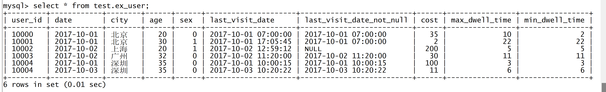

> 想一想：聚合模型有时候不是我们想要的，我就不想让他们聚合，怎么办呢？

### 练一练

我可以这样不？一个人不能同时干两件事情，所以我加一个字段，让这个数据灌入的时间精确到时分秒，确保他组合起来的key都是唯一的，是不是就能搞定了？？

建表语句：

插入部分数据

再去select \* 的时候就不会出现聚合的情况了

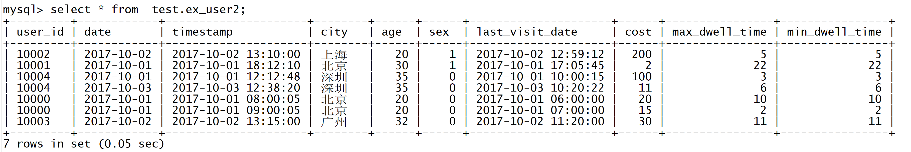

数据的聚合，在 Doris 中有如下三个阶段发生：

1. 每一批次数据导入的 ETL 阶段。该阶段会在每一批次导入的数据内部进行聚合。

2. 底层 BE 进行数据 Compaction 的阶段。BE 会对已导入的不同批次的数据进行进一步的聚合。

3. 数据查询阶段。在数据查询时，对于查询涉及到的数据，会进行对应的聚合。

### **3.3.2 UNIQUE  模型**

是**相同key**的数据进行**自动去重**的表模型。在某些多维分析场景下，用户更关注的是如何保证 Key 的唯一性，即如何获得 Primary  Key 唯一性约束。因此，引入了 Uniq 的数据模型。该模型本质上是聚合模型的一个特例，也是一种简化的表结构表示方式。

建表示例：

插入语句

查询结果后发现，相同的数据就会被替换掉

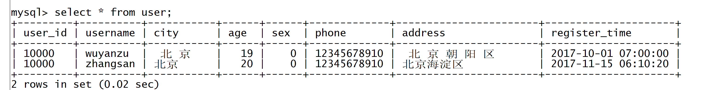

> Uniq 模型完全可以用聚合模型中的 REPLACE 方式替代。其内部的实现方式和数据存储方式也完全一样。

### **3.3.3 Duplicate 模型**

就是存**明细数据的表模型**，既不做聚合也不做去重。在某些多维分析场景下，数据既没有主键，也没有聚合需求。Duplicate 数据模型可以满足这类需求。数据完全按照导入文件中的数据进行存储，不会有任何聚合。即使两行数据完全相同，也都会保留。 而在建表语句中指定的 DUPLICATE KEY，只是用来指明底层数据按照那些列进行排序。&#x20;

建表语句：

插入部分数据

查询结果后发现，插入的数据全部会被保留，即使两条数据一模一样，也会保留，正常可以操作用户行为日志数据这种

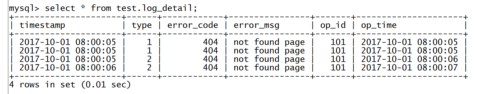

### 3.3.4 数据模型的选择   &#x20;

数据模型在建表时就已经确定，且**无法修改；**&#x6240;以，**选择一个合适的数据模型非常重要**。

* Aggregate 模型可以通过预聚合，极大地降低聚合查询时所需扫描的数据量和查询的计算量，非常适合有固定模式的报表类查询场景。

* Uniq 模型针对需要唯一主键约束的场景，可以保证主键唯一性约束。但是无法利用 ROLLUP 等预聚合带来的查询优势（因为本质是 REPLACE，没有 SUM 这种聚合方式）。&#x20;

* Duplicate 适合任意维度的查询。虽然同样无法利用预聚合的特性，但是不受聚合模型的约束，可以发挥列存模型的优势（只读取相关列，而不需要读取所有 Key 列）&#x20;

### 模型建表练习

业务数据：

## 3.4 索引

索引用于帮助快速过滤或查找数据。

目前 Doris 主要支持两类索引：

* 内建的智能索引：包括前缀索引和 ZoneMap 索引。  doris自己给我们创建的  根据什么创建

* 用户创建的二级索引：包括 Bloom Filter 索引 和 Bitmap倒排索引。

其中 ZoneMap 索引是在列存格式上，对每一列自动维护的索引信息，包括 Min/Max，Null 值个数等等。这种索引对用户透明。

> 针对排序存储和稀疏索引的详细解释：[ 排序存储和稀疏索引](https://pn7oj6yotr.feishu.cn/docx/DXS3dhbzYoPIx4xWUofcVbQhnDe)&#x20;

### 3.4.1 前缀索引

> **doris中，对于前缀索引有如下约束：**
>
> 1. 他的索引键最大长度是36个字节
>
> 2. 当他遇到了varchar数据类型的时候，即使没有超过36个字节，也会自动截断

* 示例1:以下表中我们定义了: user\_id,age,message作为表的key ；

那么，doris为这个表创建前缀索引时，它生成的索引键如下：

* 示例2:以下表中我们定义了：age，user\_name，message作为表的key

那么，doris为这个表创建前缀索引时，它生成的索引键如下：

> 为什么是这个结果呢？
>
> 虽然还没有超过36个字节，但是已经遇到了一个varchar字段，它自动截断，不会再往后面取了

***

当我们的查询条件，是**前缀索引的前缀**时，可以极大的加快查询速度。比如在第一个例子中，我们执行如下查询：

该查询的效率会**远高于**以下查询：

所以在建表时，**正确的选择列顺序，能够极大地提高查询效率**。

### 3.4.2 Bloom Filter 索引

> 小总结：
>
> 1. Bloom Filter 本质上是一种位图结构，用于判断一个值是否存在
>
> 2. 会产生小概率的误判，因为hash算法天生的碰撞
>
> 3. 在doris中是以tablet为粒度创建的，给每一个tablet创建一个布隆过滤器索引

**如何创建BloomFilter索引?**

* 建表的时候指定

* alter修改表的时候指定

**建表示例：**

查看BloomFilter索引

修改/删除BloomFilter索引

**Doris BloomFilter适用场景**

满足以下几个条件时可以考虑对某列建立Bloom Filter 索引：

1. BloomFilter是在无法利用前缀索引的查询场景中，来加快查询速度的。&#x20;

2. 查询会根据该列高频过滤，而且查询条件大多是 in 和 = 过滤。

3. 不同于Bitmap, BloomFilter适用于高基数列。比如UserID。因为如果创建在低基数的列上，比如 “性别” 列，则每个Block几乎都会包含所有取值，导致BloomFilter索引失去意义。字段随机

**Doris BloomFilter使用注意事项**

1. 不支持对Tinyint、Float、Double 类型的列建Bloom Filter索引。

2. Bloom Filter索引只对 in 和 = 过滤查询有加速效果。

### 3.4.3 Bitmap 索引吗     &#x20;

用户可以通过创建bitmap index 加速查询

**创建索引**

在table1 上为siteid 创建bitmap 索引

查看索引

删除索引

> 注意事项
>
> * bitmap 索引仅在单列上创建。
>
> * bitmap 索引能够应用在 Duplicate、Uniq 数据模型的所有列和 Aggregate模型的key列上。
>
> * bitmap 索引支持的数据类型如下:(老版本只支持bitmap类型)
>
>   TINYINT，SMALLINT，INT，BIGINT，CHAR，VARCHAR，DATE，DATETIME，LARGEINT，DECIMAL，BOOL
>
> * bitmap索引仅在 Segment V2 下生效(Segment V2是升级版本的文件格式)。当创建 index 时，表的存储格式将默认转换为 V2 格式

### 小练习：建表，并且指定索引练习

### 测试索引性能

## 3.5 **Rollup表**

ROLLUP 在多维分析中是“上卷”的意思，即将数据按某种指定的粒度**进行进一步聚合**。&#x20;

之前的聚合模型：&#x20;

> 1.求**每个城市**的**每个用户**的**每天**的总销售额
>
> 2.求每个用户、每个城市的总消费额
>
> 3.求每个用户的总消费额

### 3.5.1基本概念

通过建表语句创建出来的表称为 Base 表（Base Table,基表）

在 Base 表之上，我们可以创建任意多个 ROLLUP 表。这些 ROLLUP 的数据是基于 Base 表产生的，并且在物理上是**独立存储**的。&#x20;

**Rollup表的好处：**

1. 和基表共用一个表名，doris会根据具体的查询逻辑选择合适的数据源(合适的表)来计算结果

2. 对于基表中数据的增删改，rollup表会自动更新同步

### 3.5.2 Aggregate 模型中的 ROLLUP

查看下之前建得一张表：

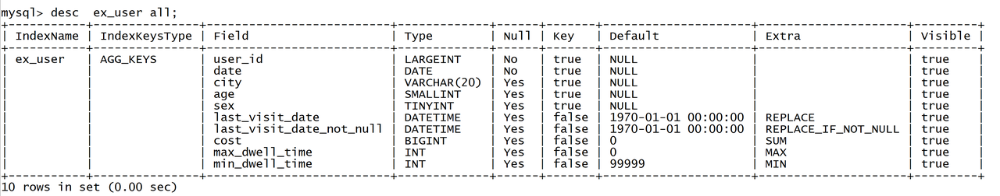

示例1：查看某个用户的总消费

添加一个roll up&#x20;

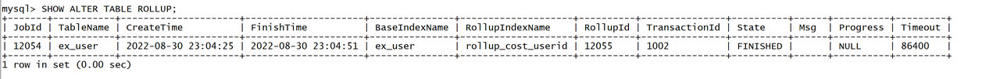

再次查看该表得详细信息后发现，多了一个IndexName为rollup\_cost\_userid（这是我们自己取得roll

Up 名字）

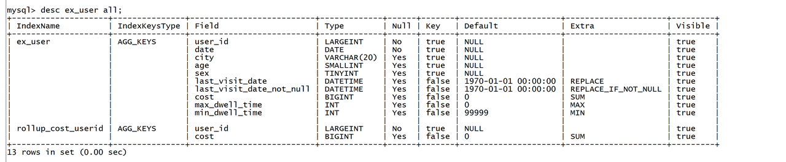

Doris 会自动命中这个 ROLLUP 表，从而只需扫描极少的数据量，即可完成这次聚合查询。

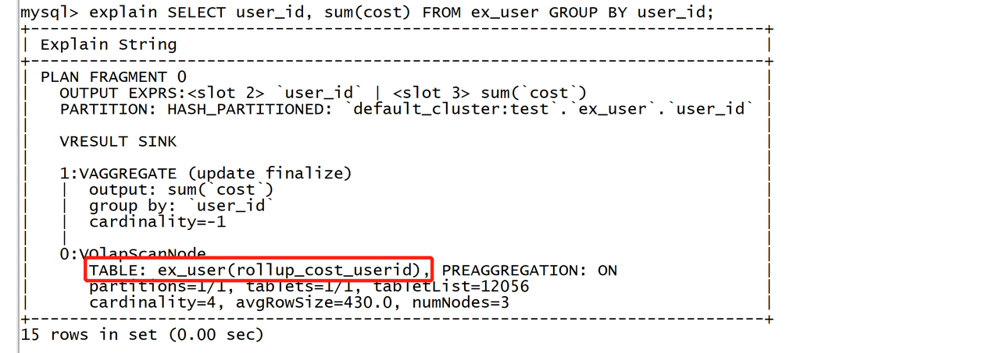

示例 2：获得不同城市，不同年龄段用户的总消费、最长和最短页面驻留时间

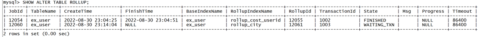

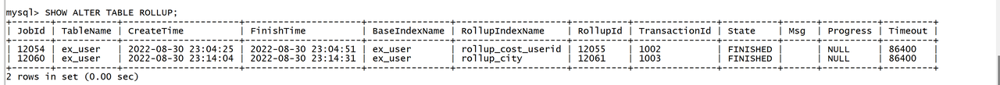

分别执行下面得三条语句，看看有什么不一样的？？

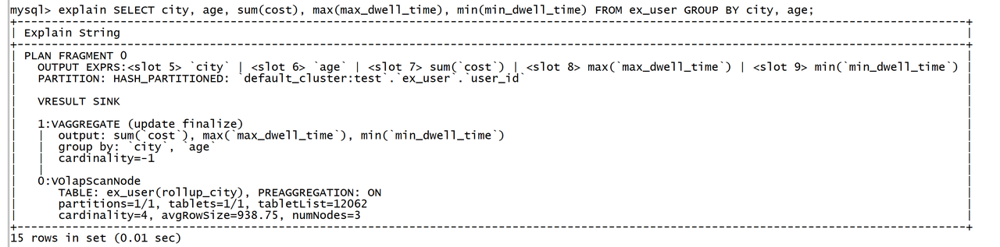

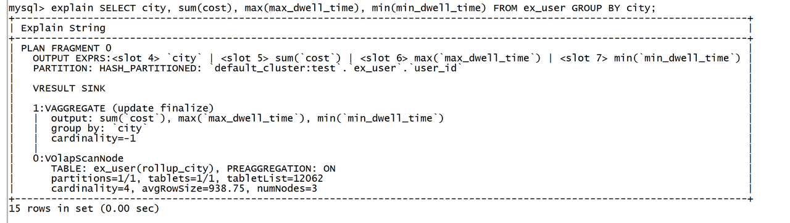

很显然得发现，维度是city，或者age，或者他们组合得时候，都是可以命中这个rollup得，相对来说效率会高很多

### 3.5.3 U**nique 模型中的 ROLLUP &#x20;**

unique模型示例表

插入语句

很显然，里面的数据是这样的

在unique模型中做rollup表，rollup的key必须**延用base表中所有的key，**&#x4E0D;同的是value可以随意指定

所以说，unique模型中建立rollup表没有什么太多的意义

> 试想一下：
>
> 如果不沿用base表中所有的key，只针对上面的user\_id进行rollup，那么他的age值取20还是19呢？好像也就不确定了，毕竟底层的aggregationType 用的是replace，到底谁替换谁就不确定了

### **3.5.4 Duplicate 模型中的 ROLLUP&#x20;**

因为 Duplicate 模型没有聚合的语意。所以该模型中的 ROLLUP，已经失去了“上卷” 这一层含义。而仅仅是作为调整列顺序，以命中前缀索引的作用。下面详细介绍前缀索引，以及如何使用 ROLLUP 改变前缀索引，以获得更好的查询效率。

**ROLLUP 调整前缀索引（新增一套前缀索引）**

因为建表时已经指定了列顺序，所以一个表只有一种前缀索引。这对于使用其他不能命中前缀索引的列作为条件进行的查询来说，效率上可能无法满足需求。因此，我们可以通过创建 ROLLUP 来人为的调整列顺序。

Base 表结构如下：

我们可以在此基础上创建一个 ROLLUP 表：

可以看到，ROLLUP 和 Base 表的列完全一样，只是将 user\_id 和 age 的顺序调换了。那么当我们进行如下查询时：

会优先选择 ROLLUP 表，因为 ROLLUP 的前缀索引匹配度更高。

示例：针对上面的log\_detail这张基表添加两个rollup表

查看表中基表和rollup表&#x20;**&#x20;**

&#x20;示例：看如下sql会命中哪一张表&#x20;

**ROLLUP使用说明**

1. ROLLUP 是附属于 Base 表的,用户可以在 Base 表的基础上，创建或删除 ROLLUP，但是不能在查询中显式的指定查询某 ROLLUP。是否命中 ROLLUP 完全由 Doris 系统自动决定

2. ROLLUP 的数据是独立物理存储的。因此，创建的 ROLLUP 越多，占用的磁盘空间也就越大。同时对导入速度也会有影响，但是不会降低查询效率（只会更好）。

3. ROLLUP 的数据更新与 Base 表是完全同步的。用户无需关心这个问题。

4. 在聚合模型中，ROLLUP 中列的聚合类型，与 Base 表完全相同。在创建 ROLLUP 无需指定，也不能修改。

5. 可以通过 EXPLAIN your\_sql; 命令获得查询执行计划，在执行计划中，查看是否命中 ROLLUP。

6. 可以通过 DESC tbl\_name ALL; 语句显示 Base 表和所有已创建完成的 ROLLUP

## 3.6 物化视图

就是查询结果预先存储起来的特殊的表。物化视图的出现主要是为了满足用户，既能对原始明细数据的任意维度分析，也能快速的对固定维度进行分析查询

### **3.6.1 优势&#x20;**

1. 可以复用预计算的结果来提高查询效率  ==> 空间换时间

2. 自动实时的维护物化视图表中的结果数据，无需额外人工成本(自动维护会有计算资源的开销)

3. 查询时，会自动选择最优物化视图

### **3.6.2 物化视图 VS Rollup**

* 明细模型表下，rollup和物化视图的差别：

物化视图：都可以实现预聚合，新增一套前缀索引

rollup：对于明细模型，新增一套前缀索引

* 聚合模型下，功能一致

### **3.6.3 创建物化视图**

语法：

> 物化视图创建成功后，用户的查询不需要发生任何改变，也就是还是查询的 base 表。Doris 会根据当前查询的语句去自动选择一个最优的物化视图，从物化视图中读取数据并计算。

用户可以通过 EXPLAIN 命令来检查当前查询是否使用了物化视图。

### **3.6.4 案例演示**

创建一个 Base 表：

用户有一张销售记录明细表，存储了每个交易的交易id，销售员，售卖门店，销售时间，以及金额

如果用户需要经常对不同门店的销售量进行统计

第一步：创建一个物化视图

第二步：检查物化视图是否构建完成(物化视图的创建是个异步的过程)

第三步：查询

看是否命中刚才我们建的物化视图

删除物化视图语法

#### **案例一：计算广告的 pv、uv&#x20;**

用户有一张点击广告的明细数据表

需求：针对用户点击计广告明细数据的表，算每天，每个页面，每个渠道的 pv,uv

pv:page view，页面浏览量或点击量

uv:unique view，通过互联网访问、浏览这个网页的自然人

插入数据

创建物化视图

在 Doris 中，count(distinct) 聚合的结果和 bitmap\_union\_count 聚合的结果是完全一致的。而 bitmap\_union\_count 等于 bitmap\_union 的结果求 count，所以如果查询中涉及到count(distinct) 则通过创建带 bitmap\_union 聚合的物化视图方可加快查询。因为本身 user\_id 是一个 INT 类型，所以在 Doris 中需要先将字段通过函数 to\_bitmap 转换为 bitmap 类型然后才可以进行 bitmap\_union 聚合。

查询自动匹配&#x20;

会自动转换成。

这个sql用的是哪张表呢？

当然，我们还可以根据日期和页面的维度再去创建一张物化视图

再去执行上面的sql，显然命中的就是tp\_pv\_uv这个物化视图

总结：

1. 在创建doris的物化视图中，同一个字段不能被使用两次,并且聚合函数后面必须跟字段名称(不能使用count(1)这样的聚合逻辑)

2. doris在选择使用哪一个物化视图表的时候，按照维度上卷的原则，选距离查询维度最接近，并且指标可以复用的物化视图

3. 一张基表可以创建多个物化视图(计算资源占用比较多)

#### **案例二：调整前缀索引**

场景:用户的原始表有（k1, k2, k3）三列。其中 k1, k2 为前缀索引列。这时候如果用户查询条件中包含 where k1=1 and k2=2 就能通过索引加速查询。&#x20;

但是有些情况下，用户的过滤条件无法匹配到前缀索引，比如 where k3=3。则无法通过索引提升查询速度。&#x20;

解决方法：

创建以 k3 作为第一列的物化视图就可以解决这个问题。&#x20;

查询&#x20;

创建物化视图

通过上面语法创建完成后，物化视图中既保留了完整的明细数据，且物化视图的前缀索&#x20;

引为 store\_id 列。&#x20;

3）查看表结构

查询匹配

这时候查询就会直接从刚才创建的sto\_rec\_sell物化视图中读取数据。物化视图对 store\_id是存在前缀索引的，查询效率也会提升。&#x20;

# 4.数据的导入导出

按照使用场景划分

## 4.1使用 Insert 方式同步数据

用户可以通过 MySQL 协议，使用 INSERT 语句进行数据导入。

INSERT 语句的使用方式和 MySQL 等数据库中 INSERT 语句的使用方式类似。 INSERT 语句支持以下两种语法：

> 对于 Doris 来说，一个 INSERT 命令就是一个完整的导入事务。
>
> 因此不论是导入一条数据，还是多条数据，我们都不建议在生产环境使用这种方式进行数据导入。高频次的 INSERT 操作会导致在存储层产生大量的小文件，会严重影响系统性能。
>
> 该方式仅用于线下简单测试或低频少量的操作。

或者可以使用以下方式进行批量的插入操作：

## 4.2导入本地数据

Stream Load 用于将本地文件导入到doris中。Stream Load 是通过 HTTP 协议与 Doris 进行连接交互的。

该方式中涉及 HOST:PORT 都是对应的HTTP 协议端口。

* BE 的 HTTP 协议端口，默认为 8040。

* FE 的 HTTP 协议端口，默认为 8030。  &#x20;

**但须保证客户端所在机器网络能够联通FE, BE 所在机器。**

基本原理：

1. 创建一张表

建表语句：

* 导入数据

执行 curl 命令导入本地文件（**这个命令不是在mysql端执行的哦**）：

* user:passwd 为在 Doris 中创建的用户。初始用户为 admin / root，密码初始状态下为空。

* host:port 为 BE 的 HTTP 协议端口，默认是 8040，可以在 Doris 集群 WEB UI页面查看。

* label: 可以在 Header 中指定 Label 唯一标识这个导入任务。

- 等待导入结果

如果遇到错误了，可以根据他给定的错误的"ErrorURL"去查看错误的细节

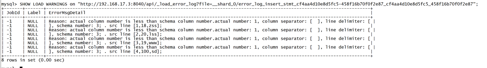

### 4.2.1curl的一些可配置的参数：

1. label: 导入任务的标签，相同标签的数据无法多次导入。（标签默认保留30分钟）

2. column\_separator：用于指定导入文件中的列分隔符，默认为\t。

3. line\_delimiter：用于指定导入文件中的换行符，默认为\n。

4. columns：用于指定文件中的列和table中列的对应关系，默认一一对应

> 例1: 表中有3个列“c1, c2, c3”，源文件中的三个列一次对应的是"c3,c2,c1"; 那么需要指定-H "columns: c3, c2, c1"
>
> &#x20;例2: 表中有3个列“c1, c2, c3", 源文件中前三列依次对应，但是有多余1列；那么需要指定-H "columns: c1, c2, c3, xxx";最后一个列随意指定个名称占位即可
>
> 例3: 表中有3个列“year, month, day"三个列，源文件中只有一个时间列，为”2018-06-01 01:02:03“格式；那么可以指定
>
> -H "columns: col, year = year(col), month=month(col), day=day(col)"完成导入

* where: 用来过滤导入文件中的数据  &#x20;

> 例1: 只导入大于k1列等于20180601的数据，那么可以在导入时候指定-H "where: k1 = 20180601"

* max\_filter\_ratio：最大容忍可过滤（数据不规范等原因）的数据比例。默认零容忍。数据不规范不包括通过 where 条件过滤掉的行。&#x20;

* partitions: 用于指定这次导入所设计的partition。如果用户能够确定数据对应的partition，推荐指定该项。不满足这些分区的数据将被过滤掉。

> 比如指定导入到p1, p2分区，
>
> -H "partitions: p1, p2"

* timeout: 指定导入的超时时间。单位秒。默认是 600 秒。可设置范围为 1 秒 \~ 259200 秒。

* timezone: 指定本次导入所使用的时区。默认为东八区。该参数会影响所有导入涉及的和时区有关的函数结果

* exec\_mem\_limit: 导入内存限制。默认为 2GB。单位为字节。

* format: 指定导入数据格式，默认是csv，支持json格式。

* read\_json\_by\_line: 布尔类型，为true表示支持每行读取一个json对象，默认值为false。

* merge\_type: 数据的合并类型，一共支持三种类型APPEND、DELETE、MERGE 其中，APPEND是默认值，表示这批数据全部需要追加到现有数据中，DELETE 表示删除与这批数据key相同的所有行，MERGE 语义 需要与delete 条件联合使用，表示满足delete 条件的数据按照DELETE 语义处理其余的按照APPEND 语义处理， 示例：-H "merge\_type: MERGE" -H "delete: flag=1"

* delete: 仅在 MERGE下有意义， 表示数据的删除条件 function\_column.sequence\_col: 只适用于UNIQUE\_KEYS,相同key列下，保证value列按照source\_sequence列进行REPLACE, source\_sequence可以是数据源中的列，也可以是表结构中的一列。

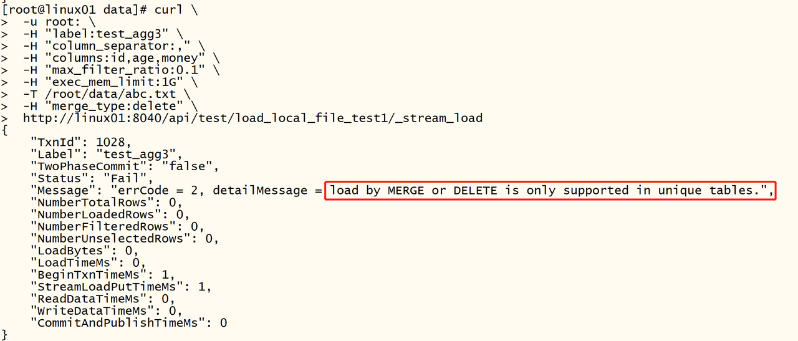

> 导入建议
>
> * Stream Load 只能导入本地文件。
>
> * 建议一个导入请求的数据量控制在 1 - 2 GB 以内。如果有大量本地文件，可以分批并发提交。

## 4.3外部存储数据导入(hdfs)

### **4.3.1 适用场景&#x20;**

* 源数据在 Broker 可以访问的存储系统中，如 HDFS。&#x20;

* 数据量在几十到百 GB 级别。

### **4.3.2 基本原理&#x20;**

1. 创建提交导入的任务

2. FE生成执行计划并将执行计划分发到多个BE节点上(每个BE节点都导入一部分数据)

3. BE收到执行计划后开始执行，从broker上拉取数据到自己的节点上

4. 所有BE都完成后，FE决定是否导入成功，返回结果给客户端

新建一张表

将本地的数据导入到hdfs上面

导入格式：

将hdfs上的数据load到表中

这是一个异步的操作，所以需要去查看下执行的状态

### 4.3.3 参数的说明

1. load\_label：导入任务的唯一 Label

2. \[MERGE|APPEND|DELETE]：数据合并类型。默认为 APPEND，表示本次导入是普通的追加写操作。MERGE 和 DELETE 类型仅适用于 Unique Key 模型表。其中 MERGE 类型需要配合 \[DELETE ON] 语句使用，以标注 Delete Flag 列。而 DELETE 类型则表示本次导入的所有数据皆为删除数据

3. DATA INFILE：被导入文件的路径，可以为多个。

4. NEGTIVE：该关键词用于表示本次导入为一批”负“导入。这种方式**仅针对具有整型 SUM 聚合类型**的聚合数据表。该方式会将导入数据中，SUM 聚合列对应的整型数值取反。主要用于冲抵之前导入错误的数据。

5. PARTITION(p1, p2, ...)：可以指定仅导入表的某些分区。不再分区范围内的数据将被忽略。

6. COLUMNS TERMINATED BY：指定列分隔符

7. FORMAT AS：指定要导入文件的类型，支持 CSV、PARQUET 和 ORC 格式。默认为 CSV。

8. &#x20;column list：用于指定原始文件中的列顺序。

9. COLUMNS FROM PATH AS：指定从导入文件路径中抽取的列。

10. PRECEDING FILTER：前置过滤条件。数据首先根据 column list 和 COLUMNS FROM PATH AS 按顺序拼接成原始数据行。然后按照前置过滤条件进行过滤。

11. SET (column\_mapping)：指定列的转换函数。

12. WHERE predicate：根据条件对导入的数据进行过滤。

13. DELETE ON expr：需配合 MEREGE 导入模式一起使用，仅针对 Unique Key 模型的表。用于指定导入数据中表示 Delete Flag 的列和计算关系。

14. load\_properties:指定导入的相关参数。目前支持以下参数：

    * timeout:导入超时时间。默认为 4 小时。单位秒。

    * max\_filter\_ratio:最大容忍可过滤（数据不规范等原因）的数据比例。默认零容忍。取值范围为0到1。

    * exec\_mem\_limit:导入内存限制。默认为 2GB。单位为字节。

    * strict\_mode:是否对数据进行严格限制。默认为 false。

    * timezone:指定某些受时区影响的函数的时区，如 strftime/alignment\_timestamp/from\_unixtime 等等，具体请查阅 时区 文档。如果不指定，则使用 "Asia/Shanghai" 时区

### 4.3.4 导入命令的进阶参数示例

从 HDFS 导入数据，使用通配符匹配两批两批文件。分别导入到两个表中

导入数据，并提取文件路径中的分区字段

对待导入数据进行过滤。

### 4.3.5 取消导入任务

当 Broker load 作业状态不为 CANCELLED 或 FINISHED 时，可以被用户手动取消。&#x20;

取消时需要指定待取消导入任务的 Label 。取消导入命令语法可执行 HELP CANCEL LOAD 查看。

## 4.4通过外部表同步数据

Doris 可以创建外部表。创建完成后，可以通过 SELECT 语句直接查询外部表的数据，也可以通过 INSERT INTO SELECT 的方式导入外部表的数据。

Doris 外部表目前支持的数据源包括：MySQL，Oracle，Hive，PostgreSQL，SQLServer，Iceberg，ElasticSearch

### 4.4.1 整体语法

> 参数说明：&#x20;
>
> 1. 外表列&#x20;
>
>    * 列名要与 Hive 表一一对应&#x20;
>
>    * 列的顺序需要与 Hive 表一致&#x20;
>
>    * 必须包含 Hive 表中的全部列&#x20;
>
>    * Hive 表分区列无需指定，与普通列一样定义即可。&#x20;
>
> 2. ENGINE 需要指定为 HIVE&#x20;
>
> 3. PROPERTIES 属性：&#x20;
>
>    * hive.metastore.uris：Hive Metastore 服务地址&#x20;
>
>    * database：挂载 Hive 对应的数据库名&#x20;
>
>    * table：挂载 Hive 对应的表名&#x20;

### **4.4.2 使用示例**

完成在 Doris 中建立 Hive 外表后，除了无法使用 Doris 中的数据模型(rollup、预聚合、物化视图等)外，与普通的 Doris OLAP 表并无区别

* **在Hive 中创建一个测试用表：**

* **Doris 中创建外部表**

* **直接查询外部表**

> 外部表创建好后，就可以直接在doris中对这个外部表进行查询了

> 直接查询外部表，无法利用到doris自身的各种查询优化机制！

* **将数据从外部表导入内部表**

> **数据从外部表导入内部表后，就可以利用doris自身的查询优势了！**
>
> 假设要导入的目标内部表为： doris\_user\_info  (需要提前创建好哦！！)

> **注意：&#x20;**
>
> Hive 表 Schema 变更不会自动同步，需要在 Doris 中重建 Hive 外表。&#x20;
>
> 当前 Hive 的存储格式仅支持 Text，Parquet 和 ORC 类型

## 4.5 Binlog Load&#x20;

Binlog Load提供了一种使Doris**增量**同步用户在Mysql数据库中对数据更新操作的CDC(Change Data Capture)功能。

### 4.5.1 适用场景

* INSERT/UPDATE/DELETE支持

* 过滤Query

* 暂不兼容DDL语句

### 4.5.2 基本原理

当前版本设计中，Binlog Load需要依赖canal作为中间媒介，让canal伪造成一个从节点去获取Mysql主节点上的Binlog并解析，再由Doris去获取Canal上解析好的数据，主要涉及Mysql端、Canal端以及Doris端，总体数据流向如下：

如上图，用户向FE提交一个数据同步作业。

1. FE会为每个数据同步作业启动一个canal client，来向canal server端订阅并获取数据。

2. client中的receiver将负责通过Get命令接收数据，每获取到一个数据batch，都会由consumer根据对应表分发到不同的channel，每个channel都会为此数据batch产生一个发送数据的子任务Task。

3. 在FE上，一个Task是channel向BE发送数据的子任务，里面包含分发到当前channel的同一个batch的数据。

4. channel控制着单个表事务的开始、提交、终止。一个事务周期内，一般会从consumer获取到多个batch的数据，因此会产生多个向BE发送数据的子任务Task，在提交事务成功前，这些Task不会实际生效。

5. 满足一定条件时（比如超过一定时间、达到提交最大数据大小），consumer将会阻塞并通知各个channel提交事务。

6. 当且仅当所有channel都提交成功，才会通过Ack命令通知canal并继续获取并消费数据。

7. 如果有任意channel提交失败，将会重新从上一次消费成功的位置获取数据并再次提交（已提交成功的channel不会再次提交以保证幂等性）。

8. 整个数据同步作业中，FE通过以上流程不断的从canal获取数据并提交到BE，来完成数据同步。

### 4.5.3 配置Mysql端

在Mysql Cluster模式的主从同步中，二进制日志文件(Binlog)记录了主节点上的所有数据变化，数据在Cluster的多个节点间同步、备份都要通过Binlog日志进行，从而提高集群的可用性。架构通常由一个主节点(负责写)和一个或多个从节点(负责读)构成,所有在主节点上发生的数据变更将会复制给从节点。

> **注意：目前必须要使用Mysql 5.7及以上的版本才能支持Binlog Load功能。**

1. 打开mysql的二进制binlog日志功能，则需要编辑my.cnf配置文件设置一下。

my.cnf怎么找？

* 重启 MySQL 使配置生效

* 创建用户并授权

* 准备测试表&#x20;

### **4.5.4 配置 Canal 端**

Canal 是属于阿里巴巴 otter 项目下的一个子项目，主要用途是基于 MySQL 数据库增量日志解析，提供增量数据订阅和消费，用于解决跨机房同步的业务场景，建议使用 canal 1.1.5及以上版本。&#x20;

下载地址：https://github.com/alibaba/canal/releases

上传并解压 canal deployer压缩包

在 conf 文件夹下新建目录并重命名&#x20;

一个 canal 服务中可以有多个 instance，conf/下的每一个目录即是一个实例，每个实例下面都有独立的配置文件

修改 conf/canal.properties 的配置

修改 instance 配置文件

启动

> 注意：canal client 和 canal instance 是一一对应的，Binlog Load 已限制多个数据同步作&#x20;
>
> 业不能连接到同一个 destination。

### **4.5.5 配置目标表**

**Doris 创建与 Mysql 对应的目标表**

基本语法：

参数说明：

* job\_name：是数据同步作业在当前数据库内的唯一标识

* channel\_desc ：用来定义任务下的数据通道，可表示 MySQL 源表到 doris 目标表的映射关系。在设置此项时，如果存在多个映射关系，必须满足 MySQL 源表应该与 doris 目标表是一一对应关系，其他的任何映射关系（如一对多关系），检查语法时都被视为不合法。

* column\_mapping：主要指MySQL源表和doris目标表的列之间的映射关系，如果不指定，FE 会默认源表和目标表的列按顺序一一对应。但是我们依然建议显式的指定列的映射关系，这样当目标表的结构发生变化（比如增加一个 nullable 的列），数据同步作业依然可以进行。否则，当发生上述变动后，因为列映射关系不再一一对应，导入将报错。&#x20;

* binlog\_desc：定义了对接远端 Binlog 地址的一些必要信息，目前可支持的对接类型只有 canal 方式，所有的配置项前都需要加上 canal 前缀。

  * canal.server.ip: canal server 的地址&#x20;

  * canal.server.port: canal server 的端口&#x20;

  * canal.destination: 前文提到的 instance 的字符串标识&#x20;

  * canal.batchSize: 每批从 canal server 处获取的 batch 大小的最大值，默认 8192&#x20;

  * canal.username: instance 的用户名&#x20;

  * canal.password: instance 的密码&#x20;

  * canal.debug: 设置为 true 时，会将 batch 和每一行数据的详细信息都打印出来，会影响性能。&#x20;

示例：

查看作业状态

返回结果集的参数意义如下：

State：作业当前所处的阶段。作业状态之间的转换如下图所示：&#x20;

作业提交之后状态为PENDING，由FE调度执行启动canal client后状态变成RUNNING，用户可以通过 STOP/PAUSE/RESUME 三个命令来控制作业的停止，暂停和恢复，操作后作业状态分别为CANCELLED/PAUSED/RUNNING。

作业的最终阶段只有一个CANCELLED，当作业状态变为CANCELLED后，将无法再次恢复。当作业发生了错误时，若错误是不可恢复的，状态会变成CANCELLED，否则会变成PAUSED。

Channel：作业所有源表到目标表的映射关系。
Status：当前binlog的消费位置(若设置了GTID模式，会显示GTID)，以及doris端执行时间相比mysql端的延迟时间。
JobConfig：对接的远端服务器信息，如canal server的地址与连接instance的destination

**控制作业：**&#x7528;户可以通过 STOP/PAUSE/RESUME 三个命令来控制作业的停止，暂停和恢复

## 4.6导出数据

数据导出（Export）是 Doris 提供的一种将数据导出的功能。该功能可以将用户指定的表或分区的数据，以文本的格式，通过 Broker 进程导出到远端存储上，如 HDFS / 对象存储（支持S3协议） 等。

### 4.6.1 原理

1. 用户提交一个 Export 作业到 FE。

2. FE 的 Export 调度器会通过两阶段来执行一个 Export 作业：

3. PENDING：FE 生成 ExportPendingTask，向 BE 发送 snapshot 命令，对所有涉及到的 Tablet 做一个快照。并生成多个查询计划。

4. EXPORTING：FE 生成 ExportExportingTask，开始执行查询计划。

### 4.6.2 查询计划拆分

Export 作业会生成多个查询计划，每个查询计划负责扫描一部分 Tablet。每个查询计划扫描的 Tablet 个数由 FE 配置参数 export\_tablet\_num\_per\_task 指定，默认为 5。即假设一共 100 个 Tablet，则会生成 20 个查询计划。用户也可以在提交作业时，通过作业属性 tablet\_num\_per\_task 指定这个数值。

一个作业的多个查询计划顺序执行

### 4.6.3 查询计划执行

一个查询计划扫描多个分片，将读取的数据以行的形式组织，每 1024 行为一个 batch，调用 Broker 写入到远端存储上。

查询计划遇到错误会整体自动重试 3 次。如果一个查询计划重试 3 次依然失败，则整个作业失败。

Doris 会首先在指定的远端存储的路径中，建立一个名为 \_\_doris\_export\_tmp\_12345 的临时目录（其中 12345 为作业 id）。导出的数据首先会写入这个临时目录。每个查询计划会生成一个文件，文件名示例：

其中 c69fcf2b6db5420f-a96b94c1ff8bccef 为查询计划的 query id。1561453713822 为文件生成的时间戳。当所有数据都导出后，Doris 会将这些文件 rename 到用户指定的路径中

示例：导出到hdfs

1. label：本次导出作业的标识。后续可以使用这个标识查看作业状态。

2. column\_separator：列分隔符。默认为 \t。支持不可见字符，比如 '\x07'。

3. columns：要导出的列，使用英文状态逗号隔开，如果不填这个参数默认是导出表的所有列。

4. line\_delimiter：行分隔符。默认为 \n。支持不可见字符，比如 '\x07'。

5. exec\_mem\_limit： 表示 Export 作业中，一个查询计划在单个 BE 上的内存使用限制。默认 2GB。单位字节。

6. timeout：作业超时时间。默认 2小时。单位秒。

7. tablet\_num\_per\_task：每个查询计划分配的最大分片数。默认为 5。

### 4.6.4 查看导出状态

* JobId：作业的唯一 ID

* State：作业状态：

  * PENDING：作业待调度

  * EXPORTING：数据导出中

  * FINISHED：作业成功

  * CANCELLED：作业失败

* Progress：作业进度。该进度以查询计划为单位。假设一共 10 个查询计划，当前已完成 3 个，则进度为 30%。

* TaskInfo：以 Json 格式展示的作业信息：

  * db：数据库名

  * tbl：表名

  * partitions：指定导出的分区。`*` 表示所有分区。

  * exec mem limit：查询计划内存使用限制。单位字节。

  * column separator：导出文件的列分隔符。

  * line delimiter：导出文件的行分隔符。

  * tablet num：涉及的总 Tablet 数量。

  * broker：使用的 broker 的名称。

  * coord num：查询计划的个数。

* Path：远端存储上的导出路径。

* CreateTime/StartTime/FinishTime：作业的创建时间、开始调度时间和结束时间。

* Timeout：作业超时时间。单位是秒。该时间从 CreateTime 开始计算。

* ErrorMsg：如果作业出现错误，这里会显示错误原因。

> **注意事项&#x20;**
>
> 1. 不建议一次性导出大量数据。一个 Export 作业建议的导出数据量最大在几十 GB。过大的导出会导致更多的垃圾文件和更高的重试成本。&#x20;
>
> 2. 如果表数据量过大，建议按照分区导出。&#x20;
>
> 3. 在 Export 作业运行过程中，如果 FE 发生重启或切主，则 Export 作业会失败，需要用户重新提交。&#x20;
>
> 4. 如果 Export 作业运行失败，在远端存储中产生的 \_\_doris\_export\_tmp\_xxx 临时目录，以及已经生成的文件不会被删除，需要用户手动删除。&#x20;
>
> 5. 如果 Export 作业运行成功，在远端存储中产生的 \_\_doris\_export\_tmp\_xxx 目录，根据远端存储的文件系统语义，可能会保留，也可能会被清除。比如在百度对象存储（BOS）中，通过 rename 操作将一个目录中的最后一个文件移走后，该目录也会被删除。如果该目录没有被清除，用户可以手动清除
>
> 6. 当 Export 运行完成后（成功或失败），FE 发生重启或切主，则 SHOW EXPORT展示的作业的部分信息会丢失，无法查看。&#x20;
>
> 7. Export 作业只会导出 Base 表的数据，不会导出 Rollup Index 的数据。&#x20;
>
> 8. Export 作业会扫描数据，占用 IO 资源，可能会影响系统的查询延迟&#x20;

## **4.7 查询结果导出&#x20;**

SELECT INTO OUTFILE 语句可以将查询结果导出到文件中。目前支持通过 Broker进程, 通过 S3 协议, 或直接通过 HDFS 协议，导出到远端存储，如 HDFS，S3，BOS，COS （腾讯云）上。

**语法：**

file\_path:指向文件存储的路径以及文件前缀。如 hdfs://path/to/my\_file\_.最终的文件名将由 my\_file\_，文件序号以及文件格式后缀组成。其中文件序号由 0 开始，数量为文件被分割的数量

\[format\_as]：指定导出格式。默认为 CSV

\[properties]：指定相关属性。目前支持通过 Broker 进程，hdfs协议等

Broker 相关属性需加前缀 broker.

HDFS 相关属性需加前缀 hdfs. 其中hdfs.fs.defaultFS 用于填写 namenode地址和端口,属于必填项。

其他属性：

* column\_separator：列分隔符，仅对 CSV 格式适用。默认为 \t。&#x20;

* line\_delimiter：行分隔符，仅对 CSV 格式适用。默认为 \n。&#x20;

* max\_file\_size：单个文件的最大大小。默认为 1GB。取值范围在 5MB 到 2GB 之间。超过这个大小的文件将会被切分。

* schema：PARQUET 文件 schema 信息。仅对 PARQUET 格式适用。导出文件格式为 PARQUET 时，必须指定 schema。

示例1：使用 broker 方式，将简单查询结果导出&#x20;

示例2：使用 HDFS 方式导出&#x20;

# **5.doris的查询语法**

## 5.0 查询语法整体结构

## 5.1 doris内置函数

### 5.1.1条件函数

#### 5.1.1.1 if函数

语法示例：

示例：

#### 5.1.1.2 ifnull,nvl,coalesce,nullif函数

语法示例：

示例：

#### 5.1.1.3 case

语法示例：

示例：

### 5.1.2聚合函数

#### 5.1.2.1 min,max,sum,avg,count

#### 5.1.2.2 min\_by和max\_by

语法示例：

练习：

#### 5.1.2.3 group\_concat

> 求：每一个人有考试成绩的所有科目
>
> select
> name，
> group\_concat(subject,',')  as all\_subject
> from score
> group by name

语法示例：&#x20;

示例：

#### 5.1.2.4 collect\_list，collect\_set (1.2版本上线)

语法示例：

### 5.1.3日期函数

#### 5.1.3.1 获取当前时间

> **curdate,current\_date，now，curtime,current\_time，current\_timestamp**

示例：

#### 5.1.3.2last\_day(1.2版本上线)

语法：

#### 5.1.3.3from\_unixtime

语法：

示例：

#### 5.1.2.4unix\_timestamp

语法：

示例：

#### 5.1.3.5to\_date

语法：

示例：

#### 5.1.3.6extract

语法：

示例：

#### 5.1.3.7date\_add，date\_sub,datediff

语法：

示例：

#### 5.1.3.8date\_format

语法：

示例：

### 5.1.4 字符串函数

#### 5.1.4.1 length，lower，upper，reverse

示例：

#### 5.1.4.2 lpad，rpad

语法：

示例：

#### 5.1.4.3 concat，concat\_ws

语法：

#### 5.1.4.4 substr

语法：

#### 5.1.4.5 ends\_with，starts\_with

语法：

示例：

#### 5.1.4.6 trim，ltrim，rtrim

语法：

#### 5.1.4.7 null\_or\_empty，not\_null\_or\_empty

#### 5.1.4.8 replace

#### 5.1.4.9 split\_part

#### 5.1.4.10 money\_format

### 5.1.5数学函数

#### 5.1.5.1ceil和floor

#### 5.1.5.2round

#### 5.1.5.3truncate

#### 5.1.5.4abs

#### 5.1.5.5pow

#### 5.1.5.6greatest和 least

#### 小练习：

### 5.1.6数组函数（1.2版本正式添加）

> Only supported in vectorized engine &#x20;
>
> **仅支持向量化引擎中使用**

#### 5.1.6.1array()

#### 5.1.6.2最大值最小值等

array\_min，array\_max，array\_avg，array\_sum，array\_size

#### 5.1.6.3array\_remove

#### 5.1.6.4array\_sort

#### 5.1.6.5array\_contains

#### 5.1.6.6array\_except

#### 5.1.6.7array\_intersect&#x20;

#### 5.1.6.8array\_union

#### 5.1.6.9array\_distinct

### 5.1.7JSON函数

建表，导入测试数据

#### 5.1.7.1get\_json\_double，get\_json\_int，get\_json\_string

#### 5.1.7.2json\_object

### 5.1.8窗口函数

doris中的窗口函数和hive中的窗口函数的用法一样

#### 5.1.8.1ROW\_NUMBER()，DENSE\_RANK()，RANK()&#x20;

小练习：

sql：

#### 5.1.8.2 min，max，sum，avg，count

#### 5.1.8.3LEAD() ，LAG()

#### 5.1.8.4窗口函数综合练习

##### 1.打地鼠案例

逻辑分析：

##### 2.连续购买案例

逻辑分析：

##### 3.分组topn案例

逻辑分析：

##### 4.经典案例：遇到标志划分组

逻辑分析：

## 5.2综合案例之漏斗转化分析

业务目标、到达路径，路径步骤、步骤人数，步骤之间的相对转换率和绝对转换率

每一种业务都有他的核心任务和流程，而流程的每一个步骤，都可能有用户流失。
所以如果把每一个步骤及其对应的数据（如UV）拼接起来，就会形成一个上大下小的漏斗形态，这就是**漏斗模型**。

漏斗模型示例：

> 不同的业务场景有不同的业务路径 : 有先后顺序, 事件可以出现多次&#x20;
>
> 注册转化漏斗 :  启动APP  --> APP注册页面--->注册结果 -->提交订单-->支付成功
>
> 搜购转化漏斗 :  搜索商品--> 点击商品--->加入购物车-->提交订单-->支付成功
>
> 秒杀活动选购转化漏斗: 点击秒杀活动-->参加活动--->参与秒杀-->秒杀成功--->成功支付

电商的购买转化漏斗模型图：

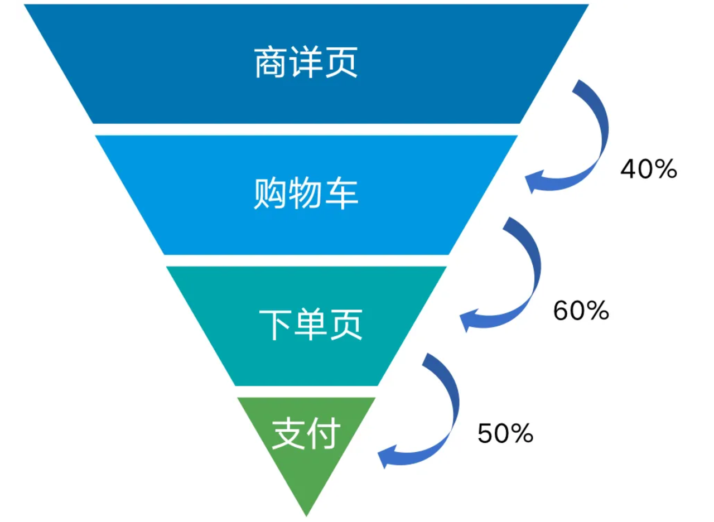

> **处理步骤 :&#x20;**
>
> **明确漏斗名称：购买转化漏斗**
>
> **起始事件：浏览了商品的详情页**
>
> **目标事件：支付**
>
> **业务流程事件链路：详情页->购物车->下单页->支付**
>
> **\[事件之间有没有时间间隔要求 , 链路中相邻的两个事件是否可以有其他事件]**

逻辑分析：

## 5.3漏斗模型分析函数window\_funnel

封装、要素(时间范围，事件的排序时间依据，漏斗模型的事件链)

# 6.doris进阶

## 6.1修改表

### 6.1.1修改表名

示例：

1. 将名为 table1 的表修改为 table2

2. 将表 example\_table 中名为 rollup1 的 rollup index 修改为 rollup2&#x20;

3. 将表 example\_table 中名为 p1 的 partition 修改为 p2&#x20;

### 6.1.2表结构的变更

用户可以通过 Schema Change 操作来修改已存在表的 Schema。目前 Doris 支持以下几种修改:

* 增加、删除列

* 修改列类型

* 调整列顺序

* 增加、修改 Bloom Filter index

* 增加、删除 bitmap index

#### 6.1.2.1原理介绍

执行 Schema Change 的基本过程，是通过原 Index 的数据，生成一份新 Schema 的 Index 的数据。其中主要需要进行两部分数据转换：

一是已存在的历史数据的转换；

二是在 Schema Change 执行过程中，新到达的导入数据的转换。

#### 6.1.2.2创建作业

Schema Change 的创建是一个异步过程，作业提交成功后，用户需要通过 SHOW ALTER TABLE COLUMN 命令来查看作业进度。

语法：

&#x20;schema change 的 alter\_clause 支持如下几种修改方式：&#x20;

1. 向指定 index 的指定位置添加一列&#x20;

&#x20;注意：

* 聚合模型如果增加 value 列，需要指定 agg\_type

* 非聚合模型（如 DUPLICATE KEY）如果增加key列，需要指定KEY关键字

* 不能在 rollup index 中增加 base index 中已经存在的列（如有需要，可以重新创建一个 rollup index）

示例：

* &#x20;向指定 index 添加多列

* &#x20;从指定 index 中删除一列&#x20;

注意：

* 不能删除分区列

* 如果是从 base index 中删除列，则如果 rollup index 中包含该列，也会被删除

- &#x20;修改指定 index 的列类型以及列位置&#x20;

注意：

* 聚合模型如果修改 value 列，需要指定 agg\_type

* 非聚合类型如果修改key列，需要指定KEY关键字

* 分区列和分桶列不能做任何修改

- &#x20;对指定 index 的列进行重新排序&#x20;

注意：

* index 中的所有列都要写出来

* value 列在 key 列之后

示例：

1. 向 example\_rollup\_index 的 col1 后添加一个key列 new\_col(非聚合模型)

2. 向example\_rollup\_index的col1后添加一个value列new\_col(非聚合模型)

3. 向example\_rollup\_index的col1后添加一个key列new\_col(聚合模型)

4. 向example\_rollup\_index的col1后添加一个value列new\_col SUM聚合类型(聚合模型)

5. 向 example\_rollup\_index 添加多列(聚合模型)

6. 从 example\_rollup\_index 删除一列

7. 修改 base index 的 key 列 col1 的类型为 BIGINT，并移动到 col2 列后面。

> 注意：无论是修改 key 列还是 value 列都需要声明完整的 column 信息

* 修改 base index 的 val1 列最大长度。原 val1 为 (val1 VARCHAR(32) REPLACE DEFAULT "abc")

* 重新排序 example\_rollup\_index 中的列（设原列顺序为：k1,k2,k3,v1,v2）

* 同时执行两种操作

#### 6.1.2.3查看作业

SHOW ALTER TABLE COLUMN 可以查看当前正在执行或已经完成的 Schema Change 作业。当一次 Schema Change 作业涉及到多个 Index 时，该命令会显示多行，每行对应一个 Index

#### 6.1.2.4参数说明

* JobId：每个 Schema Change 作业的唯一 ID。

* TableName：Schema Change 对应的基表的表名。

* CreateTime：作业创建时间。

* FinishedTime：作业结束时间。如未结束，则显示 "N/A"。

* IndexName： 本次修改所涉及的某一个 Index 的名称。

* IndexId：新的 Index 的唯一 ID。

* OriginIndexId：旧的 Index 的唯一 ID。

* SchemaVersion：以 M:N 的格式展示。其中 M 表示本次 Schema Change 变更的版本，N 表示对应的 Hash 值。每次 Schema Change，版本都会递增。

* TransactionId：转换历史数据的分水岭 transaction ID。

* State：作业所在阶段。

  * PENDING：作业在队列中等待被调度。

  * WAITING\_TXN：等待分水岭 transaction ID 之前的导入任务完成。

  * RUNNING：历史数据转换中。

  * FINISHED：作业成功。

  * CANCELLED：作业失败。

* Msg：如果作业失败，这里会显示失败信息。

* Progress：作业进度。只有在 RUNNING 状态才会显示进度。进度是以 M/N 的形式显示。其中 N 为 Schema Change 涉及的总副本数。M 为已完成历史数据转换的副本数。

* Timeout：作业超时时间。单位秒。

#### 6.1.2.5取消作业

在作业状态不为 FINISHED 或 CANCELLED 的情况下,可以通过以下命令取消Schema Change作业：

> **注意事项**
>
> * 一张表在同一时间只能有一个 Schema Change 作业在运行。
>
> * Schema Change 操作不阻塞导入和查询操作。
>
> * 分区列和分桶列不能修改。
>
> * 如果 Schema 中有 REPLACE 方式聚合的 value 列，则不允许删除 Key 列。
>
> * 如果删除 Key 列，Doris 无法决定 REPLACE 列的取值。
>
> * Unique 数据模型表的所有非 Key 列都是 REPLACE 聚合方式。
>
> * 在新增聚合类型为 SUM 或者 REPLACE 的 value 列时，该列的默认值对历史数据没有含义。
>
> * 因为历史数据已经失去明细信息，所以默认值的取值并不能实际反映聚合后的取值。
>
> * 当修改列类型时，除 Type 以外的字段都需要按原列上的信息补全。
>
> * 如修改列 k1 INT SUM NULL DEFAULT "1" 类型为 BIGINT，则需执行命令如下：
>
> * ALTER TABLE tbl1 MODIFY COLUMN k1 BIGINT SUM NULL DEFAULT "1";
>
> * 注意，除新的列类型外，如聚合方式，Nullable 属性，以及默认值都要按照原信息补全。
>
> * 不支持修改列名称、聚合类型、Nullable 属性、默认值以及列注释。

### 6.1.3 **partition的增减**

1. 增加分区, 使用默认分桶方式：现有分区 \[MIN, 2013-01-01)，增加分区 \[2013-01-01, 2014-01-01)

2. 增加分区，使用新的分桶数

3. 增加分区，使用新的副本数&#x20;

4. 修改分区副本数&#x20;

5. 批量修改指定分区

6. 批量修改所有分区&#x20;

7. 删除分区&#x20;

8. 增加一个指定上下界的分区&#x20;

### 6.1.4 **rollup的增减**

1. 创建 index: example\_rollup\_index，基于 base index（k1,k2,k3,v1,v2）。列式存储。&#x20;

2. 创建 index: example\_rollup\_index2，基于 example\_rollup\_index（k1,k3,v1,v2）

3. 创建 index: example\_rollup\_index3, 基于base index (k1,k2,k3,v1), 自定义rollup超时时间一小时

4. 删除 index: example\_rollup\_index2

## 6.2动态分区和临时分区

### 6.2.1动态分区  &#x20;

旨在对表级别的分区实现生命周期管理(TTL)，减少用户的使用负担。

目前实现了动态添加分区及动态删除分区的功能。只支持 Range 分区。

#### 6.2.1.1原理

在某些使用场景下，用户会将表按照天进行分区划分，每天定时执行例行任务，这时需要使用方手动管理分区，否则可能由于使用方没有创建分区导致数据导入失败，这给使用方带来了额外的维护成本。通过动态分区功能，用户可以在建表时设定动态分区的规则。FE 会启动一个后台线程，根据用户指定的规则创建或删除分区。用户也可以在运行时对现有规则进行变更。

#### 6.2.1.2使用方式

动态分区的规则可以在建表时指定，或者在运行时进行修改。当前仅支持对单分区列的分区表设定动态分区规则

建表时指定：

运行时修改：

#### 6.2.1.3动态分区规则参数

1. dynamic\_partition.enable：是否开启动态分区特性。默认是true

2. dynamic\_partition.time\_unit：动态分区调度的单位。可指定为 HOUR、DAY、WEEK、MONTH。分别表示按小时、按天、按星期、按月进行分区创建或删除。

3. dynamic\_partition.time\_zone：动态分区的时区，如果不填写，则默认为当前机器的系统的时区

4. dynamic\_partition.start：动态分区的起始偏移，为负数。以当天（星期/月）为基准，分区范围在此**偏移之前的分区将会被删除**。如果不填写，则默认为 -2147483648，即**不删除历史分区**。

5. dynamic\_partition.end：动态分区的结束偏移，为正数。根据 time\_unit 属性的不同，以当天（星期/月）为基准，提前创建对应范围的分区。

6. dynamic\_partition.prefix：动态创建的分区名前缀。

7. dynamic\_partition.buckets：动态创建的分区所对应的分桶数量

8. dynamic\_partition.replication\_num：动态创建的分区所对应的副本数量，如果不填写，则默认为该表创建时指定的副本数量

9. dynamic\_partition.start\_day\_of\_week：当 time\_unit 为 WEEK 时，该参数用于指定每周的起始点。取值为 1 到 7。其中 1 表示周一，7 表示周日。默认为 1，即表示每周以周一为起始点。

10. dynamic\_partition.start\_day\_of\_month：当 time\_unit 为 MONTH 时，该参数用于指定每月的起始日期。取值为 1 到 28。其中 1 表示每月1号，28 表示每月28号。默认为 1，即表示每月以1号位起始点。暂不支持以29、30、31号为起始日，以避免因闰年或闰月带来的歧义

11. dynamic\_partition.create\_history\_partition：为 true 时代表可以创建历史分区，默认是false

12. dynamic\_partition.history\_partition\_num：当 create\_history\_partition 为 true 时，该参数用于指定创建历史分区数量。默认值为 -1， 即未设置。

13. dynamic\_partition.hot\_partition\_num：指定最新的多少个分区为热分区。对于热分区，系统会自动设置其 storage\_medium 参数为SSD，并且设置 storage\_cooldown\_time 。hot\_partition\_num：设置**往前 n 天和未来所有分区为热分区，并自动设置冷却时间**

我们举例说明

> 举例：
>
> 假设今天是 2021-05-20，按天分区，动态分区的属性设置为：
>
> create\_history\_partition = true，
>
> history\_partition\_num  = 5，
>
> hot\_partition\_num=2,
>
> end=3,&#x20;
>
> start=-3。
>
> **则系统会自动创建以下分区，并且设置 storage\_medium 和 storage\_cooldown\_time 参数**：
>
> p20210517：\["2021-05-17", "2021-05-18") storage\_medium=HDD storage\_cooldown\_time=9999-12-31 23:59:59
> p20210518：\["2021-05-18", "2021-05-19") storage\_medium=HDD storage\_cooldown\_time=9999-12-31 23:59:59
> p20210519：\["2021-05-19", "2021-05-20") storage\_medium=SSD storage\_cooldown\_time=2021-05-21 00:00:00
> p20210520：\["2021-05-20", "2021-05-21") storage\_medium=SSD storage\_cooldown\_time=2021-05-22 00:00:00
> p20210521：\["2021-05-21", "2021-05-22") storage\_medium=SSD storage\_cooldown\_time=2021-05-23 00:00:00
> p20210522：\["2021-05-22", "2021-05-23") storage\_medium=SSD storage\_cooldown\_time=2021-05-24 00:00:00
> p20210523：\["2021-05-23", "2021-05-24") storage\_medium=SSD storage\_cooldown\_time=2021-05-25 00:00:00

* dynamic\_partition.reserved\_history\_periods：需要保留的历史分区的时间范围。

> 类似于开后门儿，其他的都删了，就留我指定的几个分区
>
> time\_unit="DAY/WEEK/MONTH", end=3, start=-3,&#x20;
>
> reserved\_history\_periods="\[2020-06-01,2020-06-20],\[2020-10-31,2020-11-15]"。
>
> 则系统会自动保留：
>
> \["2020-06-01","2020-06-20"],
>
> \["2020-10-31","2020-11-15"]

历史分区创建示例：

> 假设今天是 2021-05-20，按天分区，动态分区的属性设置为：
>
> create\_history\_partition=true,
>
> end=3,&#x20;
>
> start=-3,
>
> dynamic\_partition.create\_history\_partition：true
>
> \-- 可以创建（保留）多少个历史分区
>
> history\_partition\_num=1，则系统会自动创建以下分区：
>
> 2021-05-19
>
> 2021-05-20
>
> 2021-05-21
>
> 2021-05-22
>
> 2021-05-23
>
>
>
>
>
> history\_partition\_num=5，其余属性与 1 中保持一致，则系统会自动创建以下分区：
>
> 2021-05-17
>
> 2021-05-18
>
> 2021-05-19
>
> 2021-05-20
>
> 2021-05-21
>
> 2021-05-22
>
> 2021-05-23
>
>
>
>
>
> history\_partition\_num=-1 即不设置历史分区数量，其余属性与 1 中保持一直，则系统会自动创建以下分区：
>
> 2021-05-17
>
> 2021-05-18
>
> 2021-05-19
>
> 2021-05-20
>
> 2021-05-21
>
> 2021-05-22
>
> 2021-05-23
>
>
>
>

示例：

表 tbl1 分区列 k1 类型为 DATE，创建一个动态分区规则。按天分区，只保留最近7天的分区，并且预先创建未来3天的分区。

假设当前日期为 2020-05-29。则根据以上规则，tbl1 会产生以下分区：

#### 6.2.1.4修改动态分区属性

某些属性的修改可能会产生冲突。假设之前分区粒度为 DAY，并且已经创建了如下分区：

如果此时将分区粒度改为 MONTH，则系统会尝试创建范围为 \["2020-05-01", "2020-06-01") 的分区，而该分区的分区范围和已有分区冲突，所以无法创建。而范围为 \["2020-06-01", "2020-07-01") 的分区可以正常创建。因此，2020-05-22 到 2020-05-30 时间段的分区，需要自行填补。

#### 6.2.1.5查看动态分区表调度情况

通过以下命令可以进一步查看当前数据库下，所有动态分区表的调度情况：

* LastUpdateTime: 最后一次修改动态分区属性的时间

* LastSchedulerTime: 最后一次执行动态分区调度的时间

* State: 最后一次执行动态分区调度的状态

* LastCreatePartitionMsg: 最后一次执行动态添加分区调度的错误信息

* LastDropPartitionMsg: 最后一次执行动态删除分区调度的错误信息

### 6.2.2临时分区

#### 6.2.2.1规则

* 临时分区的分区列和正式分区相同，且不可修改。

* 一张表所有临时分区之间的分区范围不可重叠，但临时分区的范围和正式分区范围可以重叠。

* 临时分区的分区名称不能和正式分区以及其他临时分区重复。

#### 6.2.2.2操作

临时分区支持添加、删除、替换操作。

##### 6.2.2.2.1添加临时分区

可以通过 ALTER TABLE ADD TEMPORARY PARTITION 语句对一个表添加临时分区：

添加操作的一些说明：

* 临时分区的添加和正式分区的添加操作相似。临时分区的分区范围独立于正式分区。

* 临时分区可以独立指定一些属性。包括分桶数、副本数、是否是内存表、存储介质等信息。

##### 6.2.2.2.2删除临时分区

可以通过 ALTER TABLE DROP TEMPORARY PARTITION 语句删除一个表的临时分区：

删除操作的一些说明：

* 删除临时分区，不影响正式分区的数据。

##### 6.2.2.2.3替换分区

可以通过 ALTER TABLE REPLACE PARTITION 语句将一个表的正式分区替换为临时分区。

* strict\_range：默认为 true。

  * 对于 Range 分区，当该参数为 true 时，表示要被替换的所有正式分区的范围并集需要和替换的临时分区的范围并集完全相同。当置为 false 时，只需要保证替换后，新的正式分区间的范围不重叠即可。

  * 对于 List 分区，该参数恒为 true。要被替换的所有正式分区的枚举值必须和替换的临时分区枚举值完全相同。

* use\_temp\_partition\_name：默认为 false。当该参数为 false，并且待替换的分区和替换分区的个数相同时，则替换后的正式分区名称维持不变。如果为 true，则替换后，正式分区的名称为替换分区的名称。

示例：

**替换操作的一些说明：**

* 分区替换成功后，被替换的分区将被删除且不可恢复。

#### 6.2.2.3数据的导入和查询

##### 6.2.2.3.1导入临时分区

根据导入方式的不同，指定导入临时分区的语法稍有差别。这里通过示例进行简单说明

查询结果用insert导入

##### 6.2.2.3.2查看数据

## 6.3 doris中join的优化原理

### **6.3.1 Shuffle Join（Partitioned Join）**

和mr中的shuffle过程是一样的,针对每个节点上的数据进行shuffle，相同数据分发到下游的节点上的join方式叫shuffle join

订单明细表：

商品表：

Sql示例：

适用场景：不管数据量，不管是大表join大表还是大表join小表都可以用

优点：通用

缺点：需要shuffle内存和网络开销比较大，效率不高

### 6.3.2 Broadcast Join

当一个**大表join小表**的时候，将**小表广播到每一个大表所在的每一个节点上**(以hash表的形式放在内存中)这样的方式叫做Broadcast Join，类似于mr里面的一个map端join

订单明细表：

商品表：

* 显式使用 Broadcast Join：

他一般用在什么场景下：左表join右表，要求左表的数据量相对来说比较大，右表数据量比较小

优点：避免了shuffle，提高了运算效率

缺点：有限制，必须右表数据量比较小

### **6.3.3 Bucket Shuffle Join &#x20;**

利用建表时候**分桶的特性**，当join的时候，**join的条件和左表的分桶字段一样的时候**，将右表按照**左表分桶的规则**进行shuffle操作，**使右表中需要join的数据落在左表中需要join数据的BE节点上**的join方式叫做Bucket Shuffle Join。

**使用**

从 0.14 版本开始默认为 true，**新版本可以不用设置这个参数了！**

订单明细表：

商品表：

通过 explain 查看 join 类型

> **注意事项&#x20;**
>
> 1. Bucket Shuffle Join 只生效&#x4E8E;**&#x20;Join 条件为等值**的场景
>
> 2. Bucket Shuffle Join 要求左表的分桶列的类型与右表等值 join 列的类型需要保持一致，否则无法进行对应的规划。&#x20;
>
> 3. Bucket Shuffle Join 只作用于 Doris 原生的 OLAP 表，对于 ODBC，MySQL，ES 等外表，当其作为左表时是无法规划生效的。&#x20;
>
> 4. Bucket Shuffle Join只能保证左表为单分区时生效。所以在 SQL 执行之中，需要尽量使用 where 条件使分区裁剪的策略能够生效。&#x20;

### **6.3.4 Colocation Join**

中文意思叫位置协同分组join，指需要join的两份数据都在**同一个BE节点**上，这样在join的时候，直接**本地**join计算即可，**不需要进行shuffle**。

#### 6.3.4.1 名词解释

* Colocation Group（位置协同组CG）：在同一个 CG内的 Table 有着相同的 Colocation Group Schema，并且有着相同的数据**分片分布**(满足三个条&#x4EF6;**)**。&#x20;

* Colocation Group Schema（CGS）：用于描述一个 CG 中的 Table，和 Colocation 相关的通用 Schema 信息。包括分桶列类型，分桶数以及分区的副本数等。

#### 6.3.4.2 使用限制

1. 建表时两张表的**分桶列的类型和数量需要完全一致**，并且**桶数一致**，才能保证多张表的数据分片能够一一对应的进行分布控制。&#x20;

2. 同一个 CG 内所有表的**所有分区（Partition）的副本数必须一致**。如果不一致，可能出现某一个Tablet 的某一个副本，在同一个 BE 上没有其他的表分片的副本对应

3. 同一个 CG 内的表，分区的个数、范围以及分区列的类型不要求一致。

#### 6.3.4.4 使用案例

建两张表，分桶列都为 int 类型，且桶的个数都是 5 个。副本数都为默认副本数。

编写查询语句，并查看执行计划

查看 Group&#x20;

当 Group 中最后一张表彻底删除后（彻底删除是指从回收站中删除。通常，一张表通过DROP TABLE 命令删除后，会在回收站默认停留一天的时间后，再删除），该 Group 也会被自动删除。&#x20;

修改表 Colocate Group 属性

> 如果被修改的表原来有group，那么会直接将原来的group删除后创建新的group
>
> 如果原来没有组，就直接创建

删除表的 Colocation 属性

> 当对一个具有 Colocation 属性的表进行增加分区（ADD PARTITION）、修改副本数时,Doris 会检查修改是否会违反 Colocation Group Schema，如果违反则会拒绝。

### **6.3.5 Runtime Filter**

Runtime Filter会在有join动作的 sql运行时，创建一个HashJoinNode和一个ScanNode来**对join的数据进行过滤优化**，使得join的时候**数据量变少**，从而提高效率。

**使用&#x20;**

指定 RuntimeFilter 类型&#x20;

参数解释：

* runtime\_filter\_type: 包括Bloom Filter、MinMax Filter、IN predicate、**IN Or Bloom Filter**

  * Bloom Filter: 针对右表中的join字段的所有数据标注在一个布隆过滤器中，从而判断左表中需要join的数据在还是不在

  * MinMax Filter: 获取到右表表中数据的最大值和最小值，看左表中查看，将超出这个最大值最小值范围的数据过滤掉

  * IN predicate: 将右表中需要join字段所有数据构建一个IN predicate，再去左表表中过滤无意义数据

* runtime\_filter\_wait\_time\_ms: 左表的ScanNode等待每个Runtime Filter的时间，默认1000ms

* runtime\_filters\_max\_num: 每个查询可应用的Runtime Filter中Bloom Filter的最大数量，默认10

* runtime\_bloom\_filter\_min\_size: Runtime Filter中Bloom Filter的最小长度，默认1M

* runtime\_bloom\_filter\_max\_size: Runtime Filter中Bloom Filter的最大长度，默认16M

* runtime\_bloom\_filter\_size: Runtime Filter中Bloom Filter的默认长度，默认2M

* runtime\_filter\_max\_in\_num: 如果join右表数据行数大于这个值，我们将不生成IN predicate，默认102400

**示例实操：**

建表

查看执行计划&#x20;

# **7 监控和报警（扩展了解）**

Doris **可以**使用 Prometheus 和 Grafana 进行监控和采集，官网下载最新版即可。&#x20;

> Prometheus 官网下载：https://prometheus.io/download/
>
> Grafana 官网下载：https://grafana.com/grafana/download&#x20;

Doris 的监控数据通过 FE 和 BE 的 http 接口向外暴露。监控数据以 key-value 的文本形式对外展现。每个 key 还可能有不同的 Label 加以区分。当用户搭建好 Doris 后，可以在浏览器，通过以下接口访问监控数据.&#x20;

Frontend: fe\_host:fe\_http\_port/metrics，如 http://doitedu01:8030/metrics&#x20;

Backend: be\_host:be\_web\_server\_port/metrics，如 http://doitedu01:8040/metrics&#x20;

整个监控架构如下图

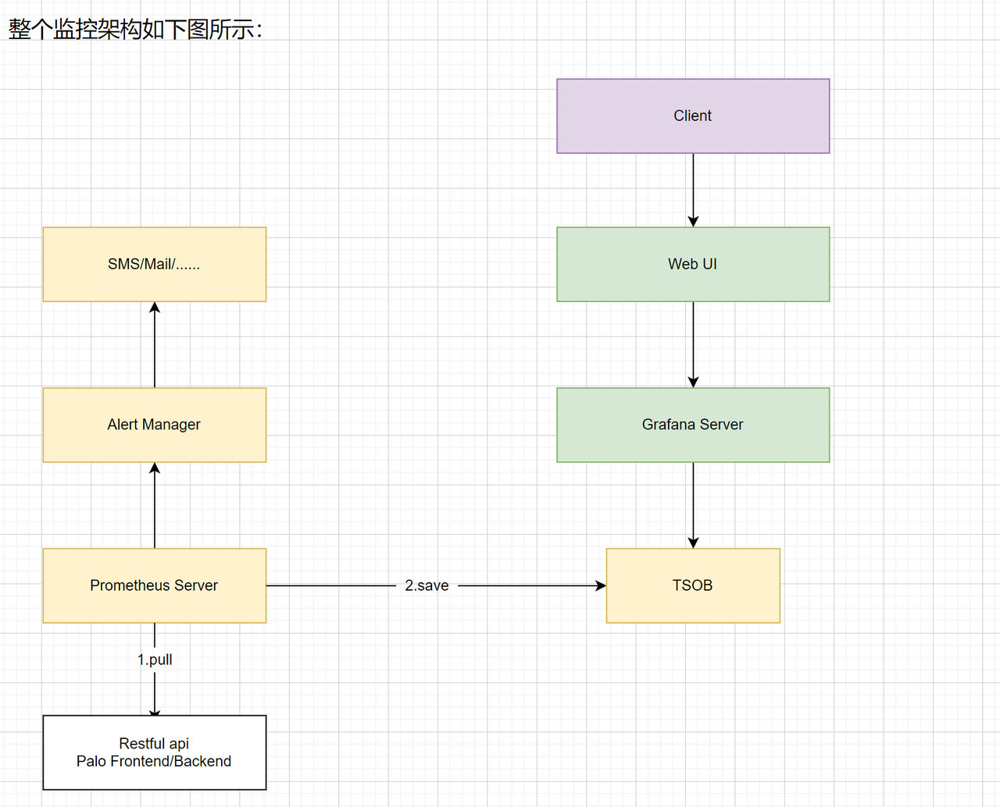

## 7.1 prometheus

* 上传 prometheus-2.26.0.linux-amd64.tar.gz，并进行解压

* 配置 promethues.yml&#x20;

配置两个 targets 分别配置 FE 和 BE,并且定义 labels 和 groups 指定组。如果有多个集群则再加 -job\_name 标签,进行相同配置

* 启动 prometheus&#x20;

该命令将后台运行 Prometheus，并指定其 web 端口为 8181。启动后，即开始采集数据，并将数据存放在 data 目录中。&#x20;

* 通过浏览器访问 prometheus

点击导航栏中，Status -> Targets，可以看到所有分组 Job 的监控主机节点。正常情况下，所有节点都应为 UP，表示数据采集正常。点击某一个 Endpoint，即可看到当前的监控数值。&#x20;

* 停止 prometheus,直接 kill -9 即可

## 7.2 grafana

* 上传 grafana-7.5.2.linux-amd64.tar.gz，并进行解压

* 配置 conf/defaults.ini&#x20;

* 启动 granafa&#x20;

* 通过浏览器访问http://doitedu01:8182，配置数据源 Prometheus   账号密码都是 admin &#x20;

点击进入面板

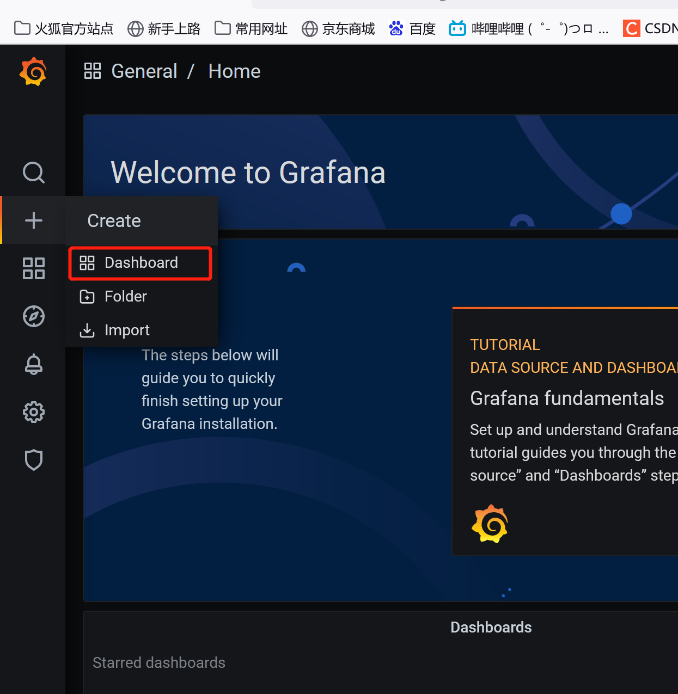

进入到这个页面：

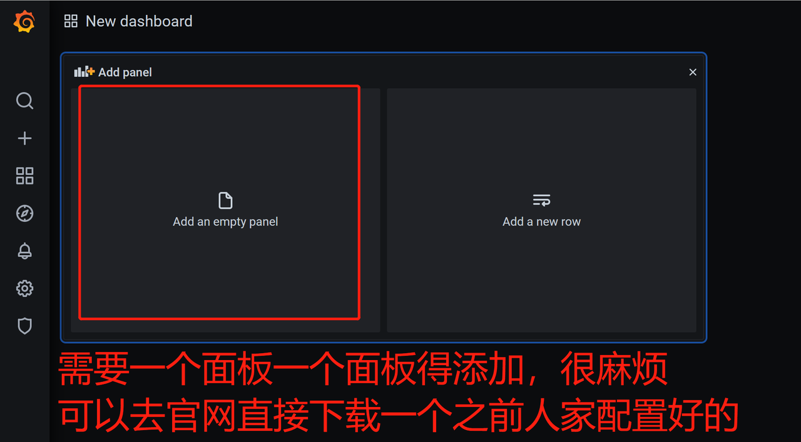

官网地址：https://grafana.com

添加数据源：在齿轮那边

添加普罗米修斯：

* 添加 dashboard&#x20;

模板下载地址：https://grafana.com/grafana/dashboards/9734/revisions&#x20;

上传准备好的 doris-overview\_rev4.json

找到manager

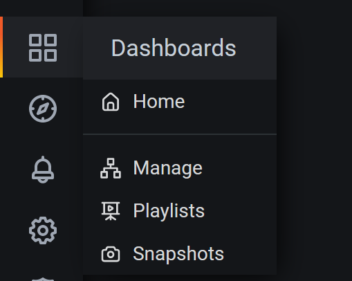

导入下载得doris模板

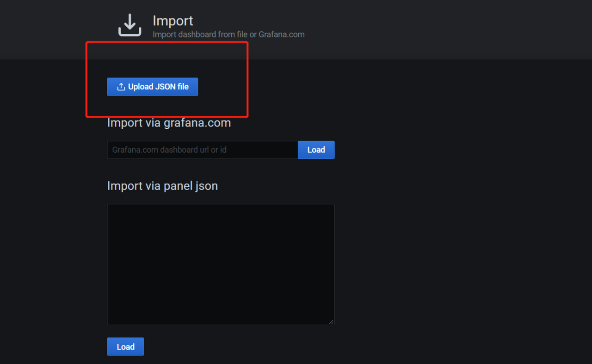

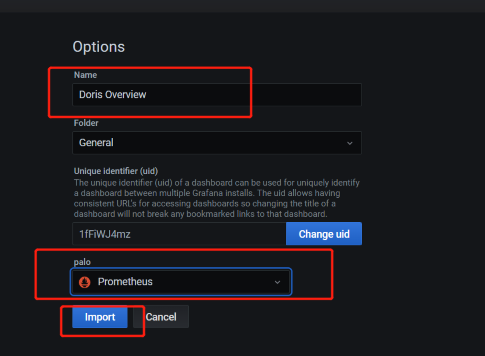

至此就已经完成，能够看到所有得指标页面了

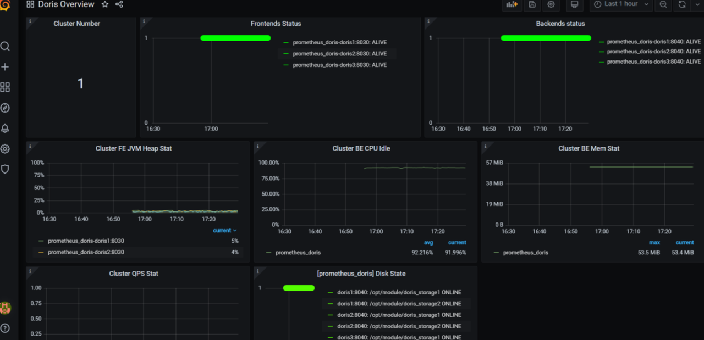

# 8.集成其他系统 (后续学习)

doris可以与hive、kafka、hudi、flink等各种大数据组件进行整合

这部分知识，待我们掌握了相关组件后再来学习

# **9.备份和恢复(扩展了解)**

Doris 支持将当前数据以文件的形式，通过 broker 备份到远端存储系统中。之后可以通过恢复命令，从远端存储系统中将数据恢复到任意 Doris 集群。通过这个功能，Doris支持将数据定期的进行快照备份。也可以通过这个功能，在不同集群间进行数据迁移

## **9.1简要原理说明**

### **9.1.1备份（Backup）&#x20;**

备份操作是将指定表或分区的数据，直接以 Doris 存储的文件的形式，上传到远端仓库中进行存储。当用户提交 Backup 请求后，系统内部会做如下操作：&#x20;

1. **快照及快照上传&#x20;**

快照阶段会对指定的表或分区数据文件进行快照。之后，备份都是对快照进行操作。在快照之后，对表进行的更改、导入等操作都不再影响备份的结果。快照只是对当前数据文件产生一个硬链，耗时很少。快照完成后，会开始对这些快照文件进行逐一上传。快照上传由各个 Backend 并发完成。&#x20;

* **元数据准备及上传&#x20;**

数据文件快照上传完成后，Frontend 会首先将对应元数据写成本地文件，然后通过broker 将本地元数据文件上传到远端仓库。完成最终备份作业。&#x20;

### **9.1.2 恢复（Restore）&#x20;**

恢复操作需要指定一个远端仓库中已存在的备份数据，然后将这个备份的内容恢复到本地集群中。当用户提交 Restore 请求后，系统内部会做如下操作：&#x20;

1. **在本地创建对应的元数据&#x20;**

这一步首先会在本地集群中，创建恢复对应的表分区等结构。创建完成后，该表可见，但是不可访问。&#x20;

* **本地 snapshot&#x20;**

这一步是将上一步创建的表做一个快照。这其实是一个空快照（因为刚创建的表是没有数据的），其目的主要是在 Backend 上产生对应的快照目录，用于之后接收从远端仓库下载的快照文件。&#x20;

* **下载快照&#x20;**

远端仓库中的快照文件，会被下载到对应的上一步生成的快照目录中。这一步由各个Backend 并发完成。&#x20;

* **生效快照&#x20;**

快照下载完成后，我们要将各个快照映射为当前本地表的元数据。然后重新加载这些快照，使之生效，完成最终的恢复作业。&#x20;

> **重点说明&#x20;**
>
> * 备份恢复相关的操作目前只允许拥有 ADMIN 权限的用户执行。&#x20;
>
> * 一个 Database 内，只允许有一个正在执行的备份或恢复作业。&#x20;
>
> * 备份和恢复都支持最小分区（Partition）级别的操作，当表的数据量很大时，建议按分区分别执行，以降低失败重试的代价。&#x20;

## 9.2备份&#x20;

### **9.2.1 创建一个远端仓库路径&#x20;**

### **9.2.2执行备份**

示例：&#x20;

### **9.2.3 查看备份任务**

### **&#x20;9.2.4查看远端仓库镜像&#x20;**

语法：&#x20;

示例一：查看仓库 hdfs\_test\_backup 中已有的备份：&#x20;

示例二：仅查看仓库 hdfs\_test\_backup 中名称为 event\_info\_log\_snapshot的备份：

### **9.2.5取消备份&#x20;**

取消一个正在执行的备份作业语法：&#x20;

## **9.3恢复&#x20;**

将之前通过 BACKUP 命令备份的数据，恢复到指定数据库下。该命令为异步操作。提交成功后，需通过 SHOW RESTORE 命令查看进度。&#x20;

* 仅支持恢复 OLAP 类型的表&#x20;

* 支持一次恢复多张表，这个需要和你对应的备份里的表一致

> 说明：&#x20;
>
> 1. 同一数据库下只能有一个正在执行的 BACKUP 或 RESTORE 任务。&#x20;
>
> 2. ON 子句中标识需要恢复的表和分区。如果不指定分区，则默认恢复该表的所有分区。所指定的表和分区必须已存在于仓库备份中&#x20;
>
> 3. 可以通过 AS 语句将仓库中备份的表名恢复为新的表。但新表名不能已存在于数据库中。分区名称不能修改。&#x20;
>
> 4. 可以将仓库中备份的表恢复替换数据库中已有的同名表，但须保证两张表的表结构完全一致。表结构包括：表名、列、分区、Rollup 等等。&#x20;
>
> 5. 可以指定恢复表的部分分区，系统会检查分区 Range 或者 List 是否能够匹配。&#x20;
>
> 6. PROPERTIES 目前支持以下属性： &#x20;
>
>    1. "backup\_timestamp" = "2018-05-04-16-45-08"：指定了恢复对应备份的哪个时间版本,必填。该信息可以通过 SHOW SNAPSHOT ON 仓库名称; 语句获得。 &#x20;
>
>    2. "replication\_num" = "3"：指定恢复的表或分区的副本数。默认为 3。若恢复已存在的表或分区，则副本数必须和已存在表或分区的副本数相同。同时，必须有足够的host 容纳多个副本。 &#x20;
>
>    3. "timeout" = "3600"：任务超时时间，默认为一天。单位秒。 &#x20;

### **9.3.2使用示例**

#### **示例一&#x20;**

从 example\_repo 中恢复备份 snapshot\_1 中的表 backup\_tbl 到数据库 example\_db1，时间版本为 "2021-05-04-16-45-08"。恢复为 1 个副本：

### **9.3.3查看恢复任务&#x20;**

可以通过下面的语句查看数据恢复的情况&#x20;

### **9.3.4取消恢复**

下面的语句用于取消一个正在执行数据恢复的作业

当取消处于 COMMIT 或之后阶段的恢复左右时，可能导致被恢复的表无法访问。此时只能通过再次执行恢复作业进行数据恢复&#x20;

示例：取消 example\_db 下的 RESTORE 任务。&#x20;

### **9.3.5删除远端仓库&#x20;**

该语句用于删除一个已创建的仓库。仅 root 或 superuser 用户可以删除仓库。这里的用户是指 Doris 的用户 语法：&#x20;

> **说明：&#x20;**
>
> 删除仓库，仅仅是删除该仓库在 Doris 中的映射，不会删除实际的仓库数据。删除后，可以再次通过指定相同的 broker 和 LOCATION 映射到该仓库。&#x20;

#
