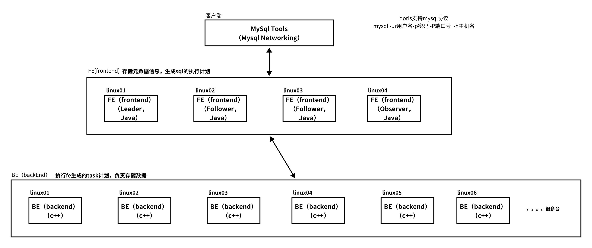
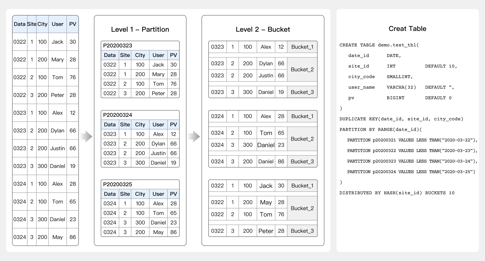
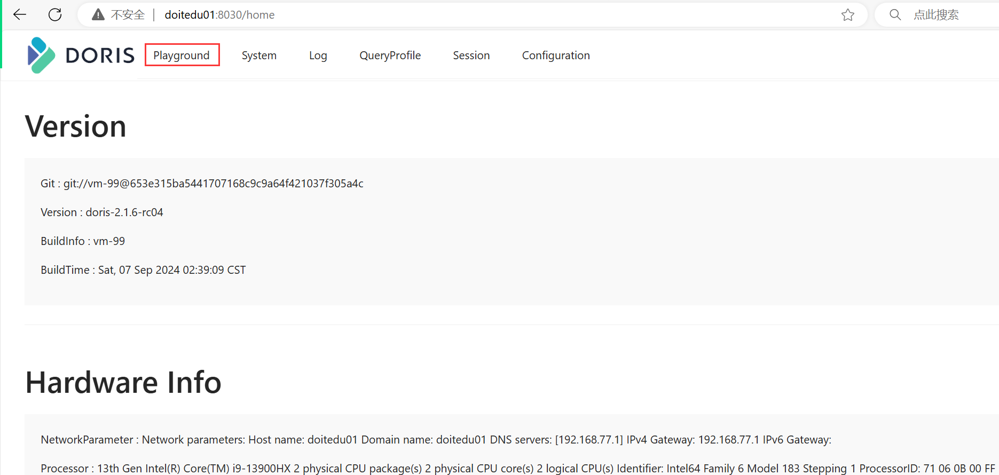
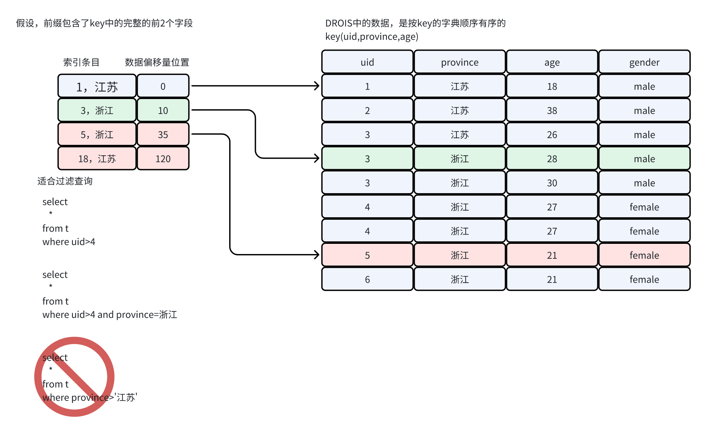
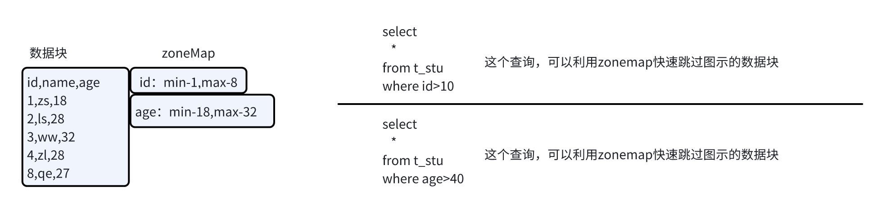
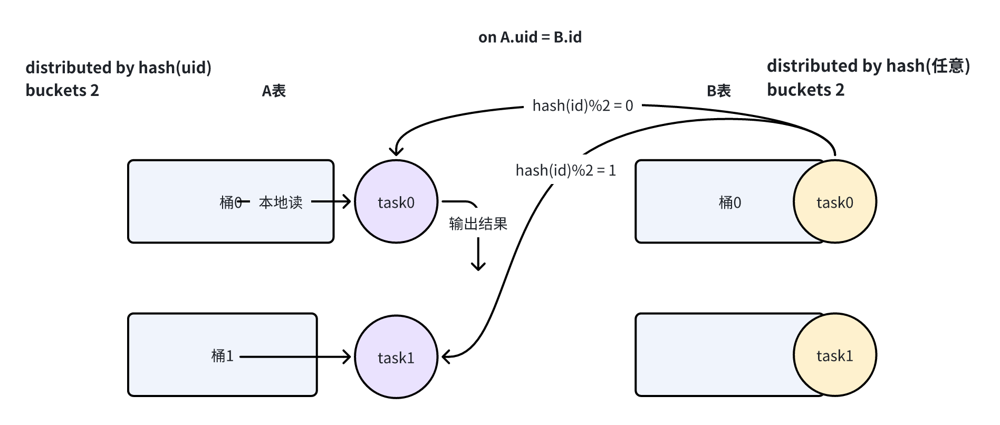
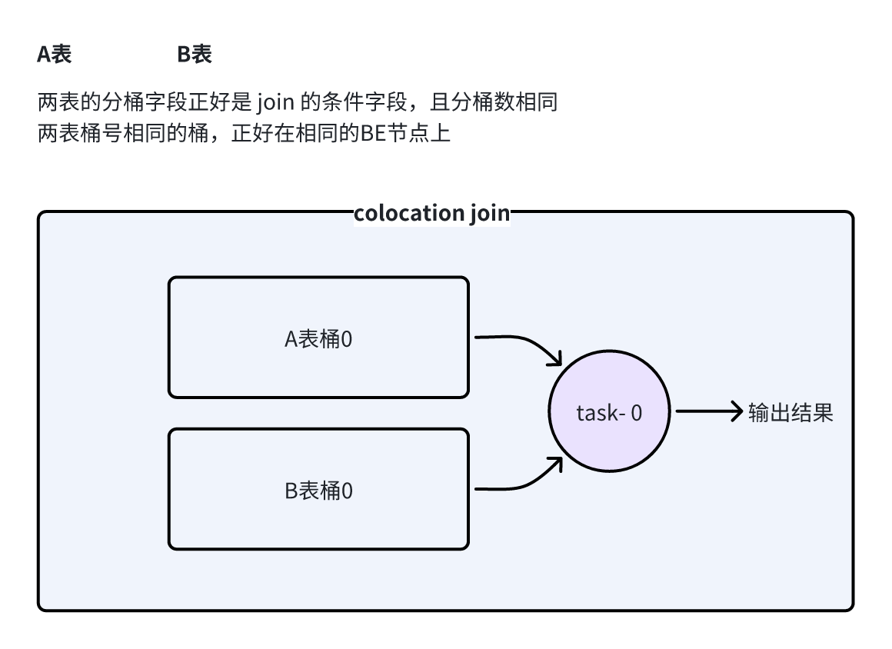

# 1. doris是什么

> 最早由百度开发，名为palo
>
> 后贡献给apache，并更名为doris
>
> 再后，衍生出了两个商业（收费）版本：starRocks 和 selectDB


* doris是一个MPP(大规模并行处理\[分布式])数据库

* 支持sql查询

* 主要用于 OLAP（联机数据分析）场景 （主要用于数据仓库,用BI系统连接上之后分析数据）,不适用OLTP场景

* 性能优越，TB级别数据的查询响应速度可到亚秒级

* 目前很多公司开始引入doris来搭建数仓

> 科普知识中说的“联机事务处理“ \[联机业务处理]，叫做OLTP


# 2. doris整体架构

## 2.1 软件架构

* Doris 的架构很简洁，只设 FE(Frontend)前端进程、BE(Backend)后端进程两种后台服务进程

* 不依赖于外部组件，方便部署和运维

* FE、BE 都可在线扩展 （不停机扩展、热扩展）


1. FE（Frontend）

> 存储、维护集群元数据；
>
> 负责接收、解析查询请求，生成查询计划,调度查询task，收集并返回查询结果。
>
> FE节点可配置高可用：Leader 和 Follower ；（如有需要，还可以配置Observer节点，不参与leader选举）

* BE（Backend）

> 负责物理数据的存储管理、计算任务的执行；
>
> 依据 FE 生成的物理计划，分布式地执行查询，并因查询而读写数据；
>
> 数据的可靠性由 BE 保证，BE 会对整个数据存储多副本或者是三副本。副本数可根据需求动态调整。

* 客户端

> Doris 借助 MySQL 协议，用户使用任意 MySQL 的 ODBC/JDBC 以及 MySQL 的客户端，都可以直接访问 Doris。&#x20;

* Broker&#x20;

> 一个独立的无状态进程。封装了文件系统接口，提供 Doris 读取远端存储系 统中文件的能力，包括 HDFS，S3，BOS 等。
>
>




## 2.2 存储架构



doris的表，

* 可以按指定字段（分区字段）划分为分区；

* 分区内又可以根据指定字段（分桶字段）划分为分桶；

* 每个分桶，在底层数据存储中会再划分为若干个tablet，（为分布式存储、迁移的最小单元）；

每个桶（或tablet）的数据存储在各BE节点的本地磁盘上，有自己特定的文件格式（从parquet等借鉴演化而来）；

每个桶的数据都可以有多个副本；


# 3. 集群安装

## 3.1 linux系统环境配置 （所有节点均需配置）

```bash
一、调大文件操作限制 （每台机器）
[root@doitedu01 doris]# vi /etc/security/limits.conf 
# 在文件最后添加下面几行信息(注意* 也要复制进去)
* soft nofile 655360
* hard nofile 655360
* soft nproc 655360
* hard nproc 655360

临时生效，免重启 （每台机器）
ulimit -n 655360 

# ---------****----------------****--------

二、虚拟内存区域数量限制（每台机器）
[root@doitedu01 doris]# vim /etc/sysctl.conf
# 在文件最后一行添加
vm.max_map_count=2000000

临时生效，免重启 （每台机器）
sysctl -w vm.max_map_count=2000000
sysctl -p

# ---------****----------------****--------


三、时钟同步 （每台机器）
[root@doitedu01 doris]# yum install ntpdate -y
[root@doitedu01 doris]# ntpdate ntp.sjtu.edu.cn

# ---------****----------------****--------

四、关闭交换分区（每台机器）
[root@doitedu01 app]# swapoff -a
# 改配置文件 /etc/fstab 
# 找到如下行，注释掉
#/dev/mapper/centos-swap swap                    swap    defaults        0 0
```


## 3.2 doris安装配置

## 3.3 FE配置

```bash
vi /opt/app/doris/fe/conf/fe.conf 
#配置文件中指定元数据路径： 注意这个文件夹要自己创建
meta_dir = /opt/data/doris/doris-meta

#修改绑定 ip（每台机器修改成自己的 ip） 
priority_networks = 192.168.77.0/24 
```


* 创建目录 （FE所在机器需要）

```java
mkdir -p /opt/data/doris/doris-meta
```


* 启动FE

```bash
[root@doitedu01 doirs]# bin/start_fe.sh --daemon
```


## 3.4 BE配置

```shell
vi be.conf  

#配置文件中指定数据存放路径： 
storage_root_path = /opt/data/doris/be/storage

#修改绑定 ip（每台机器修改成自己的 ip） 
priority_networks = 192.168.77.0/24 
```


* 创建数据目录（每台机器都要）

```shell
mkdir -p /opt/data/doris/be/storage
```


* 启动BE

```bash
bin/start_be.sh --daemon 
```


## 3.5 配置环境变量

```bash
#doris_fe
export DORIS_FE_HOME=/opt/app/doris1.1.4/fe
export PATH=$PATH:$DORIS_FE_HOME/bin

#doris_be
export DORIS_BE_HOME=/opt/app/doris1.1.4/be
export PATH=$PATH:$DORIS_BE_HOME/bin
```


## 3.6 注册BE到FE

* 首先，使用mysql命令行客户端，连接doris

```bash
[root@doitedu01 fe]# mysql -h doitedu01 -P 9030 -uroot -p

# 直接回车，没有密码
```


* 设置连接密码

```shell
mysql>set password = password('123456');
```


* 然后，用如下命令，来添加BE节点

```bash
mysql> ALTER SYSTEM ADD BACKEND "doitedu01:9050"; 
mysql> ALTER SYSTEM ADD BACKEND "doitedu02:9050"; 
mysql> ALTER SYSTEM ADD BACKEND "doitedu03:9050"; 
```


## 3.7 查看FE的web控制台

http://doitedu01:8030/




## 3.8 **默认端口**

| **实例名称** | **端口名称&#x20;**           | **默认端口&#x20;** | **通讯方向&#x20;**          | **说明&#x20;**                         |
| -------- | ------------------------ | -------------- | ----------------------- | ------------------------------------ |
| BE       | be\_port                 | 9060           | FE-->BE                 | BE 上 thrift server 的端口,用于接收来自 FE 的请求 |
| BE       | webserver\_port          | 8040           | BE<-->FE                | BE 上的 http server 端口                 |
| BE       | heartbeat\_service\_port | 9050           | FE-->BE                 | BE 上心跳服务端口,用于接收来自 FE 的心跳             |
| BE       | brpc\_prot\*             | 8060           | FE<-->BE,BE<-->BE       | BE 上的 brpc 端口,用于 BE 之间通信             |
| FE       | http\_port               | 8030           | FE<-->FE ,用户<--> FE     | FE 上的 http\_server 端口                |
| FE       | rpc\_port                | 9020           | BE-->FE ,FE<-->FE       | FE 上 thirft server 端口                |
| FE       | query\_port              | 9030           | 用户<--> FE               | FE 上的 mysql server 端口                |
| FE       | edit\_log\_port          | 9010           | FE<-->FE                | FE 上 bdbje 之间通信用的端口                  |
| Broker   | broker\_ipc\_port        | 8000           | FE-->BROKER,BE-->BROKER | Broker 上的 thrift server,用于接收请求       |


# 4. 表定义

## 4.1 表模型 （重中之重）

### 4.1.1 duplicate 模型 （明细表模型）

默认的表模型；

可以定义主键，但并不会约束主键唯一；

> duplicate模型中的主键定义，只是为了存储排序和创建前缀索引


### 4.1.2 aggregate 模型 （聚合表模型）

主键（KEY） 相同时新旧记录进行VALUE字段的聚合，目前支持的聚合方式：

* SUM：求和，多行的 Value 进行累加。

* MAX：保留最大值。

* MIN：保留最小值。


* REPLACE：替代，下一批数据中的 Value 会替换之前导入过的行中的 Value。

* REPLACE\_IF\_NOT\_NULL：非空值替换。和 REPLACE 的区别在于对于 null 值，不做替换。


* HLL\_UNION：HLL 类型的列的聚合方式，通过 HyperLogLog 算法聚合。

* BITMAP\_UNION：BIMTAP 类型的列的聚合方式，进行位图的并集聚合。


### 4.1.3 unique 模型 （去重表模型、唯一表模型）

主键（KEY） 相同时，替换成新记录；

类似于aggregate模型中的聚合方式：replace


## 4.2 分区定义

> *insert into table xx partition(dt='20241007') select .... &#x20;*
>
> *HIVE中插入数据会自动创建目标分区*
>
>
>
> 默认情况下，doris中的表分区，需要在插入数据前，就定义好 对应的分区
>
> doris 2.0开始，新增了“自动创建分区”的功能

### 4.2.1 范围分区

* 左闭右开

```sql
PARTITION BY RANGE(`date`)
(
    PARTITION p201701 VALUES [("2017-01-01"),  ("2017-02-01")),
    PARTITION p201702 VALUES [("2017-02-01"), ("2017-03-01")),
    PARTITION p201703 VALUES [("2017-03-01"), ("2017-04-01"))
)
```

* 只定义上限

```sql
PARTITION BY RANGE(`date`)
(
    PARTITION `p201701` VALUES LESS THAN ("2017-02-01"),
    PARTITION `p201702` VALUES LESS THAN ("2017-03-01"),
    PARTITION `p201703` VALUES LESS THAN ("2017-04-01"),
    PARTITION `p2018` VALUES [("2018-01-01"), ("2019-01-01"))
)
```


> 查看分区： show partitions from t\_some;
>
> 修改分区：ALTER TABLE t\_some ADD  PARTITION p201704 VALUES LESS THAN("2020-05-01") DISTRIBUTED BY HASH(\`user\_id\`) BUCKETS 5;


### 4.2.2 LIST 分区（枚举值分区）

* 单字段分区

```sql
PARTITION BY LIST(city)
(
    PARTITION `p_cn` VALUES IN ("Beijing", "Shanghai", "Hong Kong"),
    PARTITION `p_usa` VALUES IN ("New York", "San Francisco"),
    PARTITION `p_jp` VALUES IN ("Tokyo")
)
```

* 多字段分区

```sql
PARTITION BY LIST(id, city)
(
    PARTITION p1_city VALUES IN (("1", "Beijing"), ("1", "Shanghai")),
    PARTITION p2_city VALUES IN (("2", "Beijing"), ("2", "Shanghai")),
    PARTITION p3_city VALUES IN (("3", "Beijing"), ("3", "Shanghai"))
)
```


## 4.3 分区的创建方式

### 4.3.1 手动创建分区

* 建表时就定义

* 建表后用  alter table xxx add partition p202407 values\['2024-07-01','2024-08-01')


### 4.3.2 动态创建分区

> 有两个功能：1是可以自动清除过期的历史分区；2是可以提前预创建新分区

```sql
CREATE TABLE tbl1
(
    k1 DATE,
    ...
)
PARTITION BY RANGE(k1)
(
)
DISTRIBUTED BY HASH(k1) BUCKETS 2
PROPERTIES
(
    "dynamic_partition.enable" = "true",
    "dynamic_partition.time_unit" = "DAY",
    "dynamic_partition.start" = "-7",
    "dynamic_partition.end" = "3",
    "dynamic_partition.prefix" = "p",
    "dynamic_partition.buckets" = "32"
);
```


### 4.3.3 自动分区

> 2.0 新功能
>
> 类似于hive，分区不需要提前创建，在插入数据时，如果需要用到一个新的分区时，自动创建对应分区
>
>
>
> *insert into table xx partition(dt) select   id,name,dt from .... &#x20;*
>
> *（hive中这样的语法叫做：动态分区 dynamic partition)*


```sql
CREATE TABLE `DAILY_TRADE_VALUE`
(
    `TRADE_DATE`              datev2 NOT NULL COMMENT '交易日期',
    `TRADE_ID`                varchar(40) NOT NULL COMMENT '交易编号',
    ......
)
UNIQUE KEY(`TRADE_DATE`, `TRADE_ID`)
AUTO PARTITION BY RANGE (date_trunc(`TRADE_DATE`, 'day'))
(
)
DISTRIBUTED BY HASH(`TRADE_DATE`) BUCKETS 10
PROPERTIES (
  "replication_num" = "1"
);
```

> 插入数据时，不需要对应的分区已存在，doris会根据数据的分区字段的值，自动判断是否需要创建一个新的分区；


## 4.4 分桶定义

```sql
PARTITION BY ...
DISTRIBUTED BY HASH(`TRADE_DATE`) BUCKETS 10
```


## 4.5 建表DDL示例

### 4.5.1 明细表（duplica）模型

```sql
CREATE TABLE IF NOT EXISTS example_tbl_duplicate
(
    `timestamp` DATETIME NOT NULL COMMENT "日志时间",
    `type` INT NOT NULL COMMENT "日志类型",
    `error_code` INT COMMENT "错误码",
    `error_msg` VARCHAR(1024) COMMENT "错误详细信息",
    `op_id` BIGINT COMMENT "负责人id",
    `op_time` DATETIME COMMENT "处理时间"
)
DUPLICATE 
KEY(`timestamp`, `type`, `error_code`)
PARTITION BY LIST(error_code)
(
    PARTITION p_A VALUES IN (100,101,102),
    PARTITION p_B VALUES IN (200,201,202)
)
DISTRIBUTED BY HASH(`type`) BUCKETS 1
PROPERTIES (
);

MySQL > desc example_tbl_duplicate; 
+------------+---------------+------+-------+---------+-------+
| Field      | Type          | Null | Key   | Default | Extra |
+------------+---------------+------+-------+---------+-------+
| timestamp  | DATETIME      | No   | true  | NULL    | NONE  |
| type       | INT           | No   | true  | NULL    | NONE  |
| error_code | INT           | Yes  | true  | NULL    | NONE  |
| error_msg  | VARCHAR(1024) | Yes  | false | NULL    | NONE  |
| op_id      | BIGINT        | Yes  | false | NULL    | NONE  |
| op_time    | DATETIME      | Yes  | false | NULL    | NONE  |
+------------+---------------+------+-------+---------+-------+
6 rows in set (0.01 sec)
```

> 可以通过参数配置，创建无排序表
>
> "enable\_duplicate\_without\_keys\_by\_default" = "true"


### 4.5.2 UNIQUE表模型

```sql
CREATE TABLE IF NOT EXISTS example_tbl_unique_merge_on_write
(
    `user_id` LARGEINT NOT NULL COMMENT "用户id",
    `username` VARCHAR(50) NOT NULL COMMENT "用户昵称",
    `city` VARCHAR(20) COMMENT "用户所在城市",
    `age` SMALLINT COMMENT "用户年龄",
    `sex` TINYINT COMMENT "用户性别",
    `phone` LARGEINT COMMENT "用户电话",
    `address` VARCHAR(500) COMMENT "用户地址",
    `register_time` DATETIME COMMENT "用户注册时间"
)
UNIQUE KEY(`user_id`, `username`)
DISTRIBUTED BY HASH(`user_id`) BUCKETS 1
PROPERTIES (
"enable_unique_key_merge_on_write" = "true"
);
```

> 从2.1开始，unique模型的默认合并模式为“MOW” （写时合并）


### 4.5.3 aggregate表模型

```sql
CREATE TABLE IF NOT EXISTS example_tbl_agg1
(
    `user_id` LARGEINT NOT NULL COMMENT "用户id",
    `date` DATE NOT NULL COMMENT "数据灌入日期时间",
    `city` VARCHAR(20) COMMENT "用户所在城市",
    `age` SMALLINT COMMENT "用户年龄",
    `sex` TINYINT COMMENT "用户性别",
    `last_visit_date` DATETIME REPLACE DEFAULT "1970-01-01 00:00:00" COMMENT "用户最后一次访问时间",
    `cost` BIGINT SUM DEFAULT "0" COMMENT "用户总消费",
    `max_dwell_time` INT MAX DEFAULT "0" COMMENT "用户最大停留时间",
    `min_dwell_time` INT MIN DEFAULT "99999" COMMENT "用户最小停留时间"
)
AGGREGATE KEY(`user_id`, `date`, `city`, `age`, `sex`)
DISTRIBUTED BY HASH(`user_id`) BUCKETS 1
PROPERTIES (

);
```

插入数据

```sql
insert into example_tbl_agg1 values
(10000,"2017-10-01","北京",20,0,"2017-10-01 06:00:00",20,10,10),
(10000,"2017-10-01","北京",20,0,"2017-10-01 07:00:00",15,2,2),
(10001,"2017-10-01","北京",30,1,"2017-10-01 17:05:45",2,22,22),
(10002,"2017-10-02","上海",20,1,"2017-10-02 12:59:12",200,5,5),
(10003,"2017-10-02","广州",32,0,"2017-10-02 11:20:00",30,11,11),
(10004,"2017-10-01","深圳",35,0,"2017-10-01 10:00:15",100,3,3),
(10004,"2017-10-03","深圳",35,0,"2017-10-03 10:20:22",11,6,6);
```

再插入数据

```sql
insert into example_tbl_agg1 values
(10004,"2017-10-03","深圳",35,0,"2017-10-03 11:22:00",44,19,19),
(10005,"2017-10-03","长沙",29,1,"2017-10-03 18:11:02",3,1,1);
```


> 聚合的发生时机

数据的聚合，在 Doris 中有如下三个阶段发生：

1. 每一批次数据导入的 ETL 阶段。该阶段会在每一批次导入的数据内部进行聚合。

2. 底层 BE 进行数据 Compaction 的阶段。该阶段，BE 会对已导入的不同批次的数据进行进一步的聚合。

3. 数据查询阶段。在数据查询时，对于查询涉及到的数据，会进行对应的聚合。

对于用户而言，用户只能查询到聚合后的数据


# 5. 数据导入

## 5.1 导入方式快速浏览

Doris 的导入主要涉及数据源、数据格式、导入方式、错误数据处理、数据转换、事务多个方面。您可以在如下表格中快速浏览各导入方式适合的场景和支持的文件格式。


## 5.2 列映射、衍生列和过滤

在导入过程中，Doris 支持对源数据进行一些变换，具体有：映射、转换、前置过滤和后置过滤。

* 映射：把源数据中的 A 列导入到目标表中的 B 列。

* 变换：以源数据中的列为参数，通过一个表达式计算出目标列中的值，表达式中支持自定义函数。

* 前置过滤：过滤源数据中的行，只导入符合过滤条件的行。

* 后置过滤：过滤结果中的行，只导入符合过滤条件的行。

*官方文档：&#x20;*


## 5.3 StreamLoad导入示例

官网文档：

### 导入CSV

* 做了列重新映射

```shell
curl --location-trusted -u root:123456   \
    -H "Expect:100-continue"  \
    -H "line_delimiter:\n"    \
    -H "column_separator:," \
    -H "skip_lines:1"   \
    -H "columns: k1, k2, k3,k4,k5,k6, long_ip_start= k3, long_ip_end = k4,country=k5,province=k6,ip_start=k1,ip_end=k2"  \
    -T ip_china.csv    \
    -XPUT http://doitedu01:8030/api/doit50/ip_china/_stream_load
    
# 标色的地方，   库名/表名    
```

* 默认映射

```shell
curl --location-trusted -u root:123456   \
    -H "Expect:100-continue"  \
    -H "line_delimiter:\n"    \
    -H "column_separator:," \
    -H "skip_lines:1"   \
    -H "columns:logtime,account_id,ip"  \
    -T login_data.csv    \
    -XPUT http://doitedu01:8030/api/doit50/login_data/_stream_load 
```


### 导入 JSON 数据

1. 创建导入数据

2. 创建 JSON 文件 streamload\_example.json。具体内容如下

```sql
[
{"userid":1,"username":"Emily","userage":25},
{"userid":2,"username":"Benjamin","userage":35},
{"userid":3,"username":"Olivia","userage":28},
{"userid":4,"username":"Alexander","userage":60},
{"userid":5,"username":"Ava","userage":17},
{"userid":6,"username":"William","userage":69},
{"userid":7,"username":"Sophia","userage":32},
{"userid":8,"username":"James","userage":64},
{"userid":9,"username":"Emma","userage":37},
{"userid":10,"username":"Liam","userage":64}
]
```

1. 创建导入 Doris 表

2. 在 Doris 中创建被导入的表，具体语法如下

```sql
CREATE TABLE testdb.test_streamload(
    user_id            BIGINT       NOT NULL COMMENT "用户 ID",
    name               VARCHAR(20)           COMMENT "用户姓名",
    age                INT                   COMMENT "用户年龄"
)
DUPLICATE KEY(user_id)
DISTRIBUTED BY HASH(user_id) BUCKETS 10;
```

1. 启用导入作业

2. 通过 `curl` 命令可以提交 Stream Load 导入作业。

```shell
curl --location-trusted -u <doris_user>:<doris_password> \
    -H "label:124" \
    -H "Expect:100-continue" \
    -H "format:json" -H "strip_outer_array:true" \
    -H "jsonpaths:[\"$.userid\", \"$.username\", \"$.userage\"]" \
    -H "columns:user_id,name,age" \
    -T streamload_example.json \
    -XPUT http://<fe_ip>:<fe_http_port>/api/testdb/test_streamload/_stream_load
```

> 若 JSON 文件内容不是 JSON Array，而是每行一个 JSON 对象，添加 Header
>
> &#x20;`-H "strip_outer_array:false"`
>
> &#x20;`-H "read_json_by_line:true"`


* 查看导入作业

```sql
mysql> show stream load from testdb;
```


## 5.4 routine load导入示例

Routine Load 支持从 Kafka 中消费 CSV 及 JSON 格式的数据。

**导入CSV数据**

* 建表

```sql
create table person(
    id int,
    name string,
    age int
)
duplicate 
key(id)
distributed by hash(age) buckets 3;
```

* 创建导入作业

```sql
CREATE ROUTINE LOAD doit50.person_kfk_csv ON person
COLUMNS TERMINATED BY ",",
COLUMNS(id, name, age)
FROM KAFKA(
    "kafka_broker_list" = "doitedu01:9092",
    "kafka_topic" = "person",
    "property.kafka_default_offsets" = "OFFSET_BEGINNING"
);
```


### **导入 JSON 数据1**

1. 导入样本数据

在 Kafka 中，有以下样本数据

```sql
kafka-console-consumer.sh --bootstrap-server localhost:9092 --topic test-routine-load-json --from-beginning
{"user_id":1,"name":"Emily","age":25}
{"user_id":2,"name":"Benjamin","age":35}
{"user_id":3,"name":"Olivia","age":28}
{"user_id":4,"name":"Alexander","age":60}
{"user_id":5,"name":"Ava","age":17}
{"user_id":6,"name":"William","age":69}
{"user_id":7,"name":"Sophia","age":32}
{"user_id":8,"name":"James","age":64}
{"user_id":9,"name":"Emma","age":37}
{"user_id":10,"name":"Liam","age":64}
```

2. 创建需要导入的表

在 Doris 中，创建被导入的表，具体语法如下

```sql
CREATE TABLE testdb.test_streamload(
    user_id            BIGINT       NOT NULL COMMENT "用户 ID",
    name               VARCHAR(20)           COMMENT "用户姓名",
    age                INT                   COMMENT "用户年龄"
)
DUPLICATE KEY(user_id)
DISTRIBUTED BY HASH(user_id) BUCKETS 10;
```

3. 创建 Routine Load 导入作业

在 Doris 中，使用 CREATE ROUTINE LOAD 命令，创建导入作业

```sql
CREATE ROUTINE LOAD testdb.example_routine_load_json ON test_routineload_tbl
COLUMNS(user_id,name,age)
PROPERTIES(
    "format"="json",
    "jsonpaths"="[\"$.user_id\",\"$.name\",\"$.age\"]"
)
FROM KAFKA(
    "kafka_broker_list" = "192.168.88.62:9092",
    "kafka_topic" = "test-routine-load-json",
    "property.kafka_default_offsets" = "OFFSET_BEGINNING"
);
```


* 查看导入状态

```sql
mysql> SHOW ROUTINE LOAD FOR testdb.example_routine_load\G
```


* 查看导入运行作业

可以通过 [SHOW ROUTINE LOAD TASK](https://doris.apache.org/zh-CN/docs/sql-manual/sql-statements/Show-Statements/SHOW-ROUTINE-LOAD-TASK) 命令查看导入子任务情况。SHOW ROUTINE LOAD TASK 描述了当前作业下的子任务信息，如子任务状态，下发 BE id 等信息。

```sql
mysql> SHOW ROUTINE LOAD TASK WHERE jobname = 'example_routine_load_csv';
```


* 暂停与恢复作业

```sql
PAUSE ROUTINE LOAD FOR testdb.example_routine_load_csv;

RESUME ROUTINE LOAD FOR testdb.example_routine_load_csv;

STOP ROUTINE LOAD FOR testdb.example_routine_load_csv;
```


### 导入json数据2

```sql
{ "id" : 1, "name" : "Benjamin", "age":18, "info":{"salary": 100, "height": 200,"c":66}}
{ "id" : 2, "name" : "Emily", "age":20, "info":{"salary": 300, "height": 400}}
{ "id" : 3, "name" : "Alexander", "age":22, "info":{"salary": 500, "height": 600}}
```

```sql
create table json_load_tbl(
    id int,
    name varchar(40),
    age int,
    info map<string,int>,
    salary int,
    height int
)
duplicate 
key(id)
distributed by hash(name) buckets 3;

```


```sql
CREATE ROUTINE LOAD doit50.json_load_01 ON json_load_tbl
COLUMNS(id,name,age,info,salary,height)
PROPERTIES(
    "format"="json",
    "jsonpaths"="[\"$.id\",\"$.name\",\"$.age\" ,\"$.info\" ,\"$.info.salary\",\"$.info.height\"]"
)
FROM KAFKA(
    "kafka_broker_list" = "doitedu01:9092",
    "kafka_topic" = "json-test",
    "property.kafka_default_offsets" = "OFFSET_BEGINNING"
);

```


> 补充，jsonPath

```sql
{ "id" : 2, "name" : "Emily", "age":20, "info":{"salary": 300, "height": 400,"nums":[1,0,3],"boys":[{"id":1,"name":"tom"},{}]}}

# jsonpath  json路径
$.info.boys[0].name
```


# 6. 查询

按标准语法进行查询即可；

有特别需求，或者报错时，可以去官方文档查找相关内容；


# 7. 物化视图

普通的视图只是一端逻辑的封装命名，可以让复杂的sql变得简明

普通的视图中并没有存储数据


物化视图：就是会把查询的结果真实地物理地存储起来；| 相当于一个表


## 7.1 同步物化视图

> 物化视图的数据会真实保存
>
> 并且，同步物化视图的核心特点是： 基表发生数据变化时，物化视图的数据会同步更新

### 7.1.1 测试准备

```sql
1,1728370331000,event_01,江苏省,南京市,鼓楼区,mi10,小米应用
1,1728370332000,event_02,江苏省,南京市,鼓楼区,mi10,小米应用
1,1728370333000,event_03,江苏省,南京市,鼓楼区,mi10,小米应用
1,1728370334000,event_05,江苏省,南京市,鼓楼区,mi10,小米应用
1,1728370335000,event_04,江苏省,南京市,鼓楼区,mi10,小米应用
1,1728370336000,event_02,江苏省,南京市,鼓楼区,mi10,小米应用
1,1728370337000,event_01,江苏省,南京市,鼓楼区,mi10,小米应用
5,1728370331000,event_01,江苏省,南京市,鼓楼区,huawei-10,小米应用
5,1728370332000,event_02,江苏省,南京市,鼓楼区,huawei-10,小米应用
5,1728370333000,event_03,江苏省,南京市,鼓楼区,huawei-10,小米应用
5,1728370334000,event_05,江苏省,南京市,下关区,huawei-10,小米应用
5,1728370335000,event_04,江苏省,南京市,下关区,huawei-10,小米应用
5,1728370336000,event_02,江苏省,南京市,下关区,huawei-10,小米应用
5,1728370337000,event_01,江苏省,南京市,下关区,huawei-10,小米应用
2,1728370331000,event_01,江苏省,南京市,下关区,huawei-10,小米应用
2,1728370332000,event_02,江苏省,南京市,下关区,huawei-10,小米应用
2,1728370333000,event_03,江苏省,南京市,下关区,huawei-10,小米应用
2,1728370334000,event_05,江苏省,南京市,下关区,huawei-10,小米应用
2,1728370335000,event_04,江苏省,南京市,下关区,huawei-10,小米应用
2,1728370336000,event_02,江苏省,南京市,下关区,huawei-10,小米应用
2,1728370337000,event_01,江苏省,南京市,下关区,huawei-10,小米应用
3,1728370331000,event_02,江苏省,苏州市,工业区,huawei-10,豌豆荚
3,1728370332000,event_02,江苏省,苏州市,工业区,huawei-10,豌豆荚
3,1728370333000,event_01,江苏省,苏州市,工业区,huawei-10,豌豆荚
3,1728370334000,event_01,江苏省,苏州市,工业区,huawei-10,豌豆荚
3,1728370335000,event_03,江苏省,苏州市,工业区,huawei-10,豌豆荚
3,1728370336000,event_05,江苏省,苏州市,工业区,huawei-10,豌豆荚
3,1728370337000,event_04,江苏省,苏州市,工业区,huawei-10,豌豆荚
4,1728370331000,event_01,江苏省,苏州市,虎丘区,mi10,豌豆荚
4,1728370332000,event_01,江苏省,苏州市,虎丘区,mi10,豌豆荚
4,1728370333000,event_03,江苏省,苏州市,虎丘区,mi10,豌豆荚
4,1728370334000,event_03,江苏省,苏州市,虎丘区,mi10,豌豆荚
4,1728370335000,event_02,江苏省,苏州市,虎丘区,mi10,豌豆荚
4,1728370336000,event_05,江苏省,苏州市,虎丘区,mi10,豌豆荚
4,1728370337000,event_04,江苏省,苏州市,虎丘区,mi10,豌豆荚
```


\-- 第二批导入，用来检验物化视图是否会随着基表的变化而更新

```sql
5,1728370333000,event_03,江苏省,苏州市,虎丘区,mi10,豌豆荚
5,1728370334000,event_03,江苏省,苏州市,虎丘区,mi10,豌豆荚
5,1728370335000,event_02,江苏省,苏州市,虎丘区,mi10,豌豆荚
6,1728370336000,event_05,江苏省,苏州市,虎丘区,mi10,豌豆荚
6,1728370337000,event_04,江苏省,苏州市,虎丘区,mi10,豌豆荚
4,1728370337000,event_02,江苏省,苏州市,虎丘区,mi10,豌豆荚
4,1728370337000,event_04,江苏省,苏州市,虎丘区,mi10,豌豆荚
```


\-- 基表：明细表，建表

```sql
drop table if exists events;
CREATE TABLE events 
(
    uid int,
    event_time bigint,
    event_id varchar(20),
    province varchar(10),
    city varchar(10),
    region varchar(10),
    device_type varchar(10),
    release_channel varchar(20),
    dt datetime not null
)
DUPLICATE 
key(uid,event_time)
AUTO PARTITION BY RANGE (date_trunc(dt,'day'))
(
)
DISTRIBUTED BY HASH(EVENT_ID) BUCKETS 3
;
```


* 导入数据

```sql
curl --location-trusted -u root:123456   \
    -H "Expect:100-continue"  \
    -H "line_delimiter:\n"    \
    -H "column_separator:," \
    -H "columns: uid,event_time,event_id,province,city,region,device_type,release_channel,dt=from_unixtime(event_time/1000)"  \
    -T events.csv    \
    -XPUT http://doitedu01:8030/api/doit50/events/_stream_load
```

&#x20;  &#x20;

&#x20;  &#x20;

### 7.1.2 **BI分析需求-1**

> 经常有如下相对固定的维度组合分析，

* 各省市区的 用户总数,事件总次数

* 各省的 用户总数,事件总次数

* 各省市的 用户总数,事件总次数


> 为此创建一个物化视图来为查询分析加速

```sql
CREATE materialized view event_pcr_mv as 
SELECT
    province,
    city,
    region,
    bitmap_union(to_bitmap(uid)) as uv_bm,  -- 去重计数类的指标不要算出具体值，而用bitmap来存储
    count(1) as event_cnt
FROM events
GROUP BY province,city,region
```


> 使用物化视图（直接基于 基表 查询即可）

> 各省市的 用户总数,事件总次数

```sql
EXPLAIN   -- 会看到该查询的计划，会从物化视图读数据
SELECT  province,city,count(distinct uid) as uv,count(1) as event_cnt 
FROM events 
group by province,city
```


```sql
EXPLAIN  -- 会看到该查询的计划，不会从物化视图读数据
SELECT  province,device_type,count(distinct uid) as uv,count(1) as event_cnt 
FROM events 
group by province,device_type
```


###

### 7.1.3 **BI分析需求-2**

\--  各手机型号的用户总数,事件总次数

\--  各应用市场的用户总数,事件总次数

\--  各手机型号、应用市场的用户总数,事件总次数

```sql

--  TODO  自行练习

```


## 7.2 异步物化视图（2.0以后才有的）

> 物化视图的数据会真实保存
>
> 并且，同步物化视图的核心特点是： 基表发生数据变化时，物化视图的数据不会更新，而是异步更新
>
> 异步更新的策略可以在创建物化视图时指定：定时，手动，自动触发
>
>


> 注意
>
> 异步物化视图，在使用时，可以直查
>
> 也可以查基表（doris会进行透明改写来尽量引用物化视图数据提高效率），可以通过打印执行计划来判断是否透明改写成功


### 7.2.1 手动刷新版

* 创建一个手动刷新的物化视图

```sql
CREATE MATERIALIZED VIEW mv1 
        BUILD DEFERRED REFRESH AUTO ON MANUAL
        partition by(l_shipdate)
        DISTRIBUTED BY RANDOM BUCKETS 2
        PROPERTIES ('replication_num' = '1') 
        AS 
        select l_shipdate, o_orderdate, l_partkey, l_suppkey, sum(o_totalprice) as sum_total
            from lineitem
            left join orders on lineitem.l_orderkey = orders.o_orderkey and l_shipdate = o_orderdate
            group by
            l_shipdate,
            o_orderdate,
            l_partkey,
            l_suppkey;
```

刷新的命令

```sql
# 刷新指定分区
REFRESH MATERIALIZED VIEW mv1 partitions(p_20231017_20231018);

# 刷新全表
REFRESH MATERIALIZED VIEW mv1 COMPLETE；

# doris自己计算需要刷新哪些分区
REFRESH MATERIALIZED VIEW mv1 AUTO；
```


### 7.2.2 定时调度版

* 测试数据

```sql
1,1728370331000,event_01,江苏省,南京市,鼓楼区,mi10,小米应用,2024-10-08
1,1728370332000,event_02,江苏省,南京市,鼓楼区,mi10,小米应用,2024-10-08
1,1728370333000,event_03,江苏省,南京市,鼓楼区,mi10,小米应用,2024-10-08
1,1728370334000,event_05,江苏省,南京市,鼓楼区,mi10,小米应用,2024-10-08
1,1728370335000,event_04,江苏省,南京市,鼓楼区,mi10,小米应用,2024-10-08
1,1728370336000,event_02,江苏省,南京市,鼓楼区,mi10,小米应用,2024-10-08
1,1728370337000,event_01,江苏省,南京市,鼓楼区,mi10,小米应用,2024-10-08
5,1728370331000,event_01,江苏省,南京市,鼓楼区,huawei-10,小米应用,2024-10-08
5,1728370332000,event_02,江苏省,南京市,鼓楼区,huawei-10,小米应用,2024-10-08
5,1728370333000,event_03,江苏省,南京市,鼓楼区,huawei-10,小米应用,2024-10-08
5,1728370334000,event_05,江苏省,南京市,下关区,huawei-10,小米应用,2024-10-08
5,1728370335000,event_04,江苏省,南京市,下关区,huawei-10,小米应用,2024-10-08
5,1728370336000,event_02,江苏省,南京市,下关区,huawei-10,小米应用,2024-10-08
5,1728370337000,event_01,江苏省,南京市,下关区,huawei-10,小米应用,2024-10-08
2,1728370331000,event_01,江苏省,南京市,下关区,huawei-10,小米应用,2024-10-08
2,1728370332000,event_02,江苏省,南京市,下关区,huawei-10,小米应用,2024-10-08
2,1728370333000,event_03,江苏省,南京市,下关区,huawei-10,小米应用,2024-10-08
2,1728370334000,event_05,江苏省,南京市,下关区,huawei-10,小米应用,2024-10-08
2,1728370335000,event_04,江苏省,南京市,下关区,huawei-10,小米应用,2024-10-08
2,1728370336000,event_02,江苏省,南京市,下关区,huawei-10,小米应用,2024-10-08
2,1728370337000,event_01,江苏省,南京市,下关区,huawei-10,小米应用,2024-10-08
3,1728370331000,event_02,江苏省,苏州市,工业区,huawei-10,豌豆荚,2024-10-08
3,1728370332000,event_02,江苏省,苏州市,工业区,huawei-10,豌豆荚,2024-10-08
3,1728370333000,event_01,江苏省,苏州市,工业区,huawei-10,豌豆荚,2024-10-08
3,1728370334000,event_01,江苏省,苏州市,工业区,huawei-10,豌豆荚,2024-10-08
3,1728370335000,event_03,江苏省,苏州市,工业区,huawei-10,豌豆荚,2024-10-08
3,1728370336000,event_05,江苏省,苏州市,工业区,huawei-10,豌豆荚,2024-10-08
3,1728370337000,event_04,江苏省,苏州市,工业区,huawei-10,豌豆荚,2024-10-08
4,1728370331000,event_01,江苏省,苏州市,虎丘区,mi10,豌豆荚,2024-10-08
4,1728370332000,event_01,江苏省,苏州市,虎丘区,mi10,豌豆荚,2024-10-08
4,1728370333000,event_03,江苏省,苏州市,虎丘区,mi10,豌豆荚,2024-10-08
4,1728370334000,event_03,江苏省,苏州市,虎丘区,mi10,豌豆荚,2024-10-08
4,1728370335000,event_02,江苏省,苏州市,虎丘区,mi10,豌豆荚,2024-10-08
4,1728370336000,event_05,江苏省,苏州市,虎丘区,mi10,豌豆荚,2024-10-08
4,1728370337000,event_04,江苏省,苏州市,虎丘区,mi10,豌豆荚,2024-10-08
```

* 基表创建

```sql
-- 基表：明细表，建表
DROP TABLE IF EXISTS events_2;
CREATE TABLE events_2
(
    uid int,
    event_time bigint,
    event_id varchar(20),
    province varchar(10),
    city varchar(10),
    region varchar(10),
    device_type varchar(10),
    release_channel varchar(20),
    dt date not null
)
DUPLICATE 
key(uid,event_time)
PARTITION BY RANGE (dt)
(
)
DISTRIBUTED BY HASH(EVENT_ID) BUCKETS 3
PROPERTIES(
    "dynamic_partition.enable" = "true",
    "dynamic_partition.time_unit" = "DAY",
    "dynamic_partition.start" = "-7",
    "dynamic_partition.end" = "3",
    "dynamic_partition.prefix" = "p",
    "dynamic_partition.buckets" = "32"
)
;
```

* 导入数据

```shell
curl --location-trusted -u root:123456   \
    -H "Expect:100-continue"  \
    -H "line_delimiter:\n"    \
    -H "column_separator:," \
    -H "columns: uid,event_time,event_id,province,city,region,device_type,release_channel,dt"  \
    -T e2.csv    \
    -XPUT http://doitedu01:8030/api/doit50/events_2/_stream_load
    
```


* 创建一个定时调度刷新的物化视图

```sql
CREATE MATERIALIZED VIEW events_async_schedule_mv
REFRESH AUTO ON SCHEDULE EVERY 1 minute
partition by(dt)
DISTRIBUTED BY RANDOM BUCKETS 2
PROPERTIES ('replication_num' = '1') 
AS 
SELECT  dt,province,device_type,bitmap_union(to_bitmap(uid)) as user_bm,count(1) as event_cnt
FROM events_2
GROUP BY dt,province,device_type
;  
```


* 查询刷新任务状态

```sql
 select * from tasks("type"="mv") \G;
```


* 直查物化视图

```shell


```


### 7.2.3 自动触发版的异步物化视图

> 所谓自动触发，就是基表有数据变更的提交，就会自动触发相关物化视图的刷新作业

```sql
CREATE MATERIALIZED VIEW mv1
REFRESH ON COMMIT
partition by(`xxx`)
AS
select ... from t1;
```


# 8. 索引

> doris中有哪些种类的索引


## 8.1 前缀索引（主索引）




## 8.2 bloomFilter索引

利用bloomFilter数据结构，来优化底层读数据的效率：

利用bloomFilter来判断目标数据是否存在于某个dataBlock中，如果判断为不存在，则不需要读取该block；

```sql
select
    uid,
    device_id,
    gender,
    age,
    ....
from doit50.t_user
where uid in (1,3,10,16,32,48)  -- 布隆过滤器的作用特别明显
where gender='male'
-- where id > 10  布隆过滤器索引的作用几乎消失
```

要想在上述场景中利用布隆过滤器索引 ，需要对表创建uid字段的布隆过滤器索引

```sql
ALTER TABLE doit50.t_user SET ("bloom_filter_columns" = "uid,device_id","gender");
```

> BloomFilter适用于高基数列。比如UserID。因为如果创建在低基数的列上;


## 8.3 bitmap索引

#### 核心概念

> bitmap索引的作用机制，与bloomFilter的作用机制类似
>
> 都是为了判断一个数据块中是否有目标数据，如果没有就跳过；
>
>
>
> 理论上的bitmap结构只能记录整数或长整数
>
> 但是doris中可以针对任意类型的字段创建bitmap索引（它内部会对那些非数字类型的字段维护一个字典）


适用于如下查询场景

```sql
select
    *
from t_user
where uid = 6  
where uid in (1,3,5,7,9)
```

> 且目标字段的基数不适合太低（没作用），也不是太高（占过大的存储空间）


#### 创建语法

```sql
CREATE INDEX [IF NOT EXISTS] uid_bm_idx ON doit50.t_user(uid) USING BITMAP;
```


## 8.4  ZoneMap 索引

其中 ZoneMap 索引是在列存格式上，对每一列自动维护的索引信息，包括 Min/Max，Null 值个数等等。这种索引对用户透明。


机制：利用这些统计信息，在查询时快速跳过一些数据块；




# 9. Join与优化

## 9.1 四种 Shuffle 方式对比

> N：参与 Join 计算的 Instance 个数
>
> T(关系) : 关系的 Tuple 数目
>
> 上面这 4 种方式灵活度是从高到低的，它对这个数据分布的要求是越来越严格，但 Join 计算的性能也是越来越好的。


## 9.2 含义和机制

### 9.2.1 shuffle join： 最普通最通用的join方式


### 9.2.2 broadcast join

小表数据会全量广播给读大表的每一个task

doris底层会判断是否满足broadcast的条件，如满足，会自动生成broadcast方式的物理执行计划

```sql
select   /*+ BROADCAST(small_t) */ 
   big_t.*
   ,small_t.*
from  big_t  join  small_t
on big_t.id=small_t.id
```


### 9.2.3 bucket shuffle join

比如A join B  ON A.uid = B.id 场景中：

> 半本地化（会shuffle其中一个表）

启用条件：

* join 条件包含左表所有分桶字段

* join条件中左表的分桶字段  和 右表的 join条件字段，必须类型相同



```sql
set enable_bucket_shuffle_join = true;
```


### 9.2.4 Colocation Join  （协同位置 join）

> 完全本地化的join，全程无shuffle




**使用方式：**

* 建表时，就需要让参与join的两个表，设置为相同的协同位置**组**

* 然后，以后往这两个表创建分区、分桶时，就会让这两个表的相同桶号的桶，放置在相同的BE上

```sql
CREATE TABLE A (k1 int, v1 int)
DUPLICATE
DISTRIBUTED BY HASH(k1)
BUCKETS 8
PROPERTIES(
    "colocate_with" = "group1"
);


CREATE TABLE B (k1 int, name varchar(20))
DUPLICATE
DISTRIBUTED BY HASH(k1)
BUCKETS 8
PROPERTIES(
    "colocate_with" = "group1"
);

```


# 练习-完美世界-sql面试

## 需求

```shell
用户活跃数据
请进行批处理
Q1: 将附件中 ip_china.csv 文件加载为 Hive 内部表，保持格式与 csv header一致
Q2: 将附件中 login_data.csv 文件加载为 Hive 外部表，保持格式与csv header一致，需要按日分区
Q3: 通过Q1，Q2加载的数据，将用户登陆表中的ip转化为对应的国家地区并落表（避免笛卡尔积）
Q4: 请输出每个分区下，每个province的去重登陆人数。输出结构为 pt，province，cnt_login
Q5: 请输出总量数据下，存在登陆数据的各个province中，登陆时间最早的前3人及对应的登陆时间，若不满3人，需要留空。
输出结构为 province，account_id_1, login_time_1, account_id_2, login_time_2, account_id_3, login_time_3

```

* ip\_china

```shell
curl --location-trusted -u root:123456   \
    -H "Expect:100-continue"  \
    -H "line_delimiter:\n"    \
    -H "column_separator:," \
    -H "skip_lines:1"   \
    -H "columns: k1, k2, k3,k4,k5,k6, long_ip_start= k3, long_ip_end = k4,country=k5,province=k6,ip_start=k1,ip_end=k2"  \
    -T ip_china.csv    \
    -XPUT http://doitedu01:8030/api/doit50/ip_china/_stream_load
    
# 标色的地方，   库名/表名    
```

* login\_data

```shell
curl --location-trusted -u root:123456   \
    -H "Expect:100-continue"  \
    -H "line_delimiter:\n"    \
    -H "column_separator:," \
    -H "skip_lines:1"   \
    -H "columns:logtime,account_id,ip"  \
    -T login_data.csv    \
    -XPUT http://doitedu01:8030/api/doit50/login_data/_stream_load 
```


## 将用户登陆表中的ip转化为对应的国家地区

* 创建目标表

```sql
create table if not exists login_detail
(
    logtime datetime not null,
    account_id int,
    ip varchar(20),
    country varchar(10),
    province varchar(10)
)
duplicate 
key(logtime,account_id)
auto partition by range ( date_trunc(logtime, 'day'))
(
)
distributed by hash(ip) buckets 2;
```

* 查询

```sql
insert into login_detail
select
a.*,
b.country,
b.province
from login_data a join ip_china b on ipv4_string_to_num(a.ip) between b.long_ip_start and b.long_ip_end
;
```


## 各个province中，登陆时间最早的前3人

```sql
select
    province,
    split_by_string(xx[1],',')[1] as account_id_1,
    split_by_string(xx[1],',')[2] as logtime_1,
    split_by_string(xx[2],',')[1] as account_id_2,
    split_by_string(xx[2],',')[2] as logtime_2,
    split_by_string(xx[3],',')[1] as account_id_3,
    split_by_string(xx[3],',')[2] as logtime_3
from 
(
    select
    province,
    collect_list(concat_ws(',',account_id,logtime)) as xx
    from (
        select
            province,
            account_id,
            logtime,
            rn
        from (
            select
                account_id,
                province,
                logtime,
                row_number() over(partition by province order by logtime) as rn 
            from 
                (
                     select  account_id,logtime,province
                     from (
                     select account_id,logtime,province,
                            row_number() over(partition by account_id order by logtime) as rn
                     from login_detail 
                     ) o1 
                     where rn=1
                 ) o2
            ) o3 
        where rn<=3
    ) o4

    group by province 
) o5
```


## 需求变种

上面的各省前3名，要求得到竖表结果，并且如果一个省不够3名，则留NULL行


```sql
create view view_tmp as 
select
    province,
    account_id,
    logtime,
    rn
from (
    select
        account_id,
        province,
        logtime,
        row_number() over(partition by province order by logtime) as rn 
    from 
        (
             select  account_id,logtime,province
             from (
             select account_id,logtime,province,
                    row_number() over(partition by account_id order by logtime) as rn
             from login_detail 
             ) o1 
             where rn=1
         ) o2
    ) o3 
where rn<=3;
```

```sql
| 贵州      |    1 |     231615 | 2019-07-15 00:00:01 |
| 贵州      |    2 |     226157 | 2019-07-15 00:00:05 |
| 贵州      |    3 |     225242 | 2019-07-15 00:00:09 |
| 宁夏      |    1 |     225877 | 2019-07-15 00:00:00 |
| 宁夏      |    2 |     221733 | 2019-07-15 00:00:02 |
| 宁夏      |    3 |     221697 | 2019-07-15 00:00:37 |
| 西藏      |    1 |     224897 | 2019-07-15 00:00:28 |
```


```sql
select  
   a.province,
   a.rn,
   view_tmp.account_id,
   view_tmp.logtime
from (
    select
        province,
        rn
    from (
        select province,array(1,2,3) as arr
        from login_detail
        group by province 
    ) o 
    lateral view explode (arr) tmp as rn
) a 
left join view_tmp on a.province = view_tmp.province and a.rn=view_tmp.rn   
```

```sql
| 贵州      |    1 |     231615 | 2019-07-15 00:00:01 |
| 贵州      |    2 |     226157 | 2019-07-15 00:00:05 |
| 贵州      |    3 |     225242 | 2019-07-15 00:00:09 |
| 宁夏      |    1 |     225877 | 2019-07-15 00:00:00 |
| 宁夏      |    2 |     221733 | 2019-07-15 00:00:02 |
| 宁夏      |    3 |     221697 | 2019-07-15 00:00:37 |
| 西藏      |    1 |     224897 | 2019-07-15 00:00:28 |
| 西藏      |    2 |       NULL | NULL                |
| 西藏      |    3 |       NULL | NULL                |
+-----------+------+------------+---------------------+
```
