# 1. 基本概念

## 1.1 什么是kafka

Kafka 最初是由 LinkedIn 即领英公司基于 Scala 和 Java 语言开发的分布式**消息发布-订阅系统**，现已捐献给Apache 软件基金会。其具有高吞吐、低延迟的特性，许多大数据实时流式处理系统比如 Storm、Spark、Flink等都能很好地与之集成。

总的来讲，Kafka 通常具有 3 重角色：

一句话概括：Kafka 是一个分布式的基于发布/订阅模式的消息中间件，在业界主要应用于大数据**实时流式计算**领域，起**缓冲**和**削峰填谷**的作用。

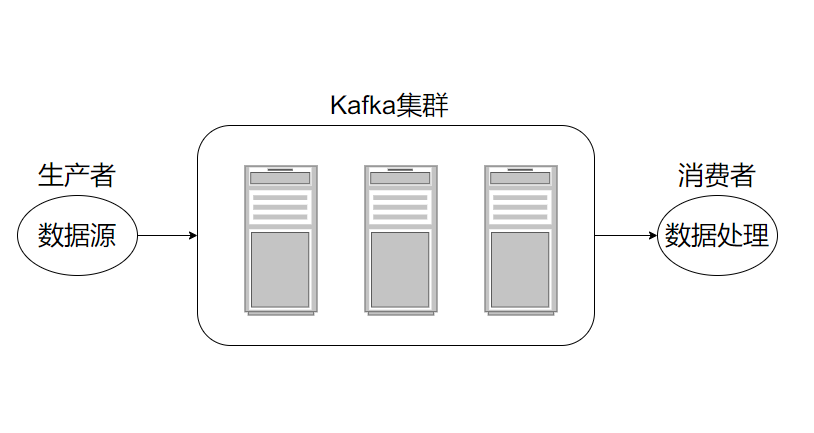

## 1.2 kafka的特点

* **高吞吐量、低延迟：**&#x6B;afka每秒可以处理几十万条消息，它的延迟最低只有几毫秒，每个topic可以分多个partition, 由多个consumer group 对partition进行consume操作。

* **可扩展性：**&#x6B;afka集群支持热扩展

* **持久性、可靠性：**&#x6D88;息被持久化到本地磁盘，并且**支持数据备份**防止数据丢失

* **容错性：允许集群中有节点失败**（若副本数量为n,则允许n-1个节点失败）

* **高并发：**&#x652F;持数千个客户端同时读写

Kafka在各种应用场景中，起到的作用可以归纳为这么几个术语：**削峰填谷，解耦！**

**在大数据流式计算领域中，kafka主要作为计算系统的前置缓存和输出结果缓存；**

# 2. 安装部署

## 2.1 安装zookeeper集群

* **上传安装包**

* **移动到指定文件夹**

&#x20;mv zookeeper-3.4.6.tar.gz  /opt/apps/

***

tar -zxvf zookeeper-3.4.6.tar.gz

***

（1）进入配置文件目录

cd /opt/apps/zookeeper-3.4.6/conf

***

（2）修改配置文件名称

mv  zoo\_sample.cfg   zoo.cfg

***

（3）编辑配置文件

vi zoo.cfg
dataDir=/opt/apps/data/zkdata
server.1=doitedu01:2888:3888
server.2=doitedu02:2888:3888
server.3=doitedu03:2888:3888

***

mkdir -p /opt/apps/data/zkdata

***

echo 1 > /opt/apps/data/zkdata/myid
echo 2 > /opt/apps/data/zkdata/myid
echo 3 > /opt/apps/data/zkdata/myid

***

\# 使用for循环分发
for i in {2..3};&#x20;
do scp -r zookeeper-3.4.6 linux0$i:$PWD;  
done  &#x20;

***

vi /etc/profile
\#ZOOKEEPER\_HOME
export ZOOKEEPER\_HOME=/opt/apps/zookeeper-3.4.6
export PATH=$PATH:$ZOOKEEPER\_HOME/bin&#x20;
​
source /etc/profile
\# 注意：还需要分发环境变量

***

bin/zkServer.sh start   # zk服务启动
bin/zkServer.sh status  # zk查看服务状态
bin/zkServer.sh stop    # zk停止服务

***

1. 启动脚本

\#!/bin/bash
for i in 1 2 3&#x20;
do
ssh linux0${i} "source /etc/profile;/opt/apps/zookeeper-3.4.6/bin/zkServer.sh start"
done

***

2. 停止脚本

\#!/bin/bash
for i in 1 2 3
do
ssh linux0${i} "source /etc/profile;/opt/apps/zookeeper-3.4.6/bin/zkServer.sh stop"
done

***

tar -zxvf kafka\_2.11-2.2.2.tgz tar  -C /opt/apps/

***

1. 进入配置文件目录

\[root@doit01 apps]# cd kafka\_2.12-2.3.1/config

***

2. 编辑配置文件

vi server.properties

***

\#为依次增长的：0、1、2、3、4，集群中唯一 id
broker.id=0  
​
\#数据存储的⽬录&#x20;
log.dirs=/opt/data/kafkadata

***

\#底层存储的数据（日志）留存时长（默认7天）
log.retention.hours=168

***

\#底层存储的数据（日志）留存量（默认1G）&#x20;
log.retention.bytes=1073741824​

***

\#指定zk集群地址
zookeeper.connect=doitedu01:2181,doitedu02:2181,doitedu03:2181

***

for  i  in {2..3}&#x20;
do&#x20;
scp  -r  kafka\_2.11-2.2.2  linux0$i:$PWD&#x20;
done

***

安装包分发后，记得修改config/server.properties中的 配置参数： broker.id

vi /etc/profile
export KAFKA\_HOME=/opt/apps/kafka\_2.11-2.2.2
export PATH=$PATH:$KAFKA\_HOME/bin&#x20;
​
source /etc/profile
\# 注意：还需要分发环境变量

***

bin/kafka-server-start.sh -daemon /opt/apps/kafka\_2.11-2.2.2/config/server.properties  &#x20;
​
\# 停止集群
bin/kafka-server-stop.sh

***

一键启停脚本：

\#!/bin/bash

for h in doit01 doit02 doit03

do

echo "${1}ing $h ..."

if \[ $1 = start ];then

ssh $h "source /etc/profile;/opt/apps/kafka\_2.12-2.3.1/bin/kafka-server-start.sh -daemon /opt/apps/kafka\_2.12-2.3.1/config/server.properties"

fi

if \[ $1 = stop ];then

ssh $h "source /etc/profile;/opt/apps/kafka\_2.12-2.3.1/bin/kafka-server-stop.sh"

fi

done

创建topic

\[root@doit01 kafka]# bin/kafka-topics.sh --create --topic doit27-1 --partitions 2 --replication-factor 3  --zookeeper doit01:2181,doit02:2181,doit03:2181

命令行生产者

\[root@doit01 kafka]# bin/kafka-console-producer.sh --broker-list doit01:9092

命令行消费者

\[root@doit03 kafka\_2.12-2.3.1]# bin/kafka-console-consumer.sh --bootstrap-server doit01:9092 --topic doit27-1 --from-beginning

# 3. Kafka运维监控

## 3.1 前言

kafka自身并没有集成监控管理系统，因此对kafka的监控管理比较不便，好在有大量的第三方监控管理系统来使用，常见的有：

安装包下载地址： [Download - EFAK (kafka-eagle.org)](http://download.kafka-eagle.org/)

官方文档地址：<https://docs.kafka-eagle.org/>

### 3.1.1 上传，解压

### 3.1.2 配置环境变量：JAVA\_HOME 和KE\_HOME

vi /etc/profile
export JAVA\_HOME=/opt/apps/jdk1.8.3\_9u19
export PATH=$PATH:$JAVA\_HOME/bin
**export KE\_HOME=/opt/apps/efak-web-2.1.0**
export PATH=$PATH:$KE\_HOME/bin

***

### 3.1.3 配置KafkaEagle

cd ${KE\_HOME}/conf
vi system-config.properties

***

修改如下内容：

\######################################
\# multi zookeeper & kafka cluster list
\# Settings prefixed with 'kafka.eagle.' will be deprecated, use 'efak.' instead
\######################################
efak.zk.cluster.alias=cluster1
cluster1.zk.list=doit01:2181,doit02:2181,doit03:2181
​
\######################################
\# broker size online list
\######################################
cluster1.efak.broker.size=3
​
\######################################
\# kafka sqlite jdbc driver address
\######################################
efak.driver=org.sqlite.JDBC
efak.url=jdbc:sqlite:/opt/data/kafka-eagle/db/ke.db
efak.username=root
efak.password=www.kafka-eagle.org
​
\######################################
\# kafka mysql jdbc driver address
\######################################
\#efak.driver=com.mysql.cj.jdbc.Driver
\#efak.url=jdbc:mysql://127.0.0.1:3306/ke?useUnicode=true\&characterEncoding=UTF-8\&zeroDateTimeBehavior=convertToNull
\#efak.username=root
\#efak.password=123456

***

如上，数据库选择的是sqlite，需要手动创建所配置的db文件存放目录：/opt/data/kafka-eagle/db/

如果，数据库选择的是mysql，则要放一个mysql的jdbc驱动jar包到kafka-eagle的lib目录中

### 3.1.4 配置kafka服务端的JMX端口【选配】

在kafka的启动脚本：  kafka-server-start.sh 中添加如下命令：

if \[ "x$KAFKA\_HEAP\_OPTS" = "x" ]; then
&#x20;   export JMX\_PORT="9999"
&#x20;   export KAFKA\_HEAP\_OPTS="-Xmx1G -Xms1G"

***

改完后，将文件同步给所有节点

然后重启kafka集群

### 3.1.5 启动KafkaEagle

cd ${KE\_HOME}/bin
chmod +x ke.sh
./ke.sh start

***

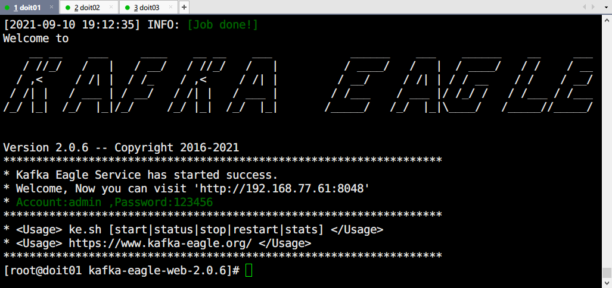

### 3.1.6 访问web界面

http://doit01:8048/ke

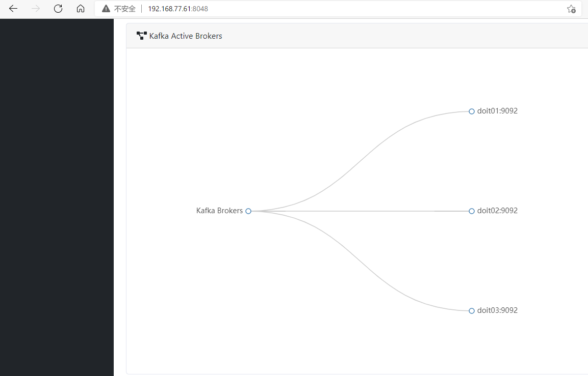

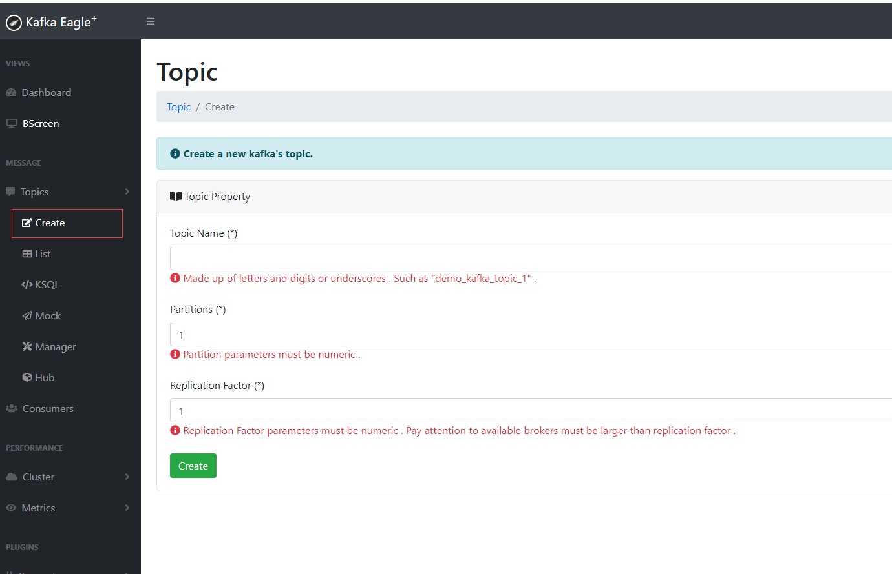

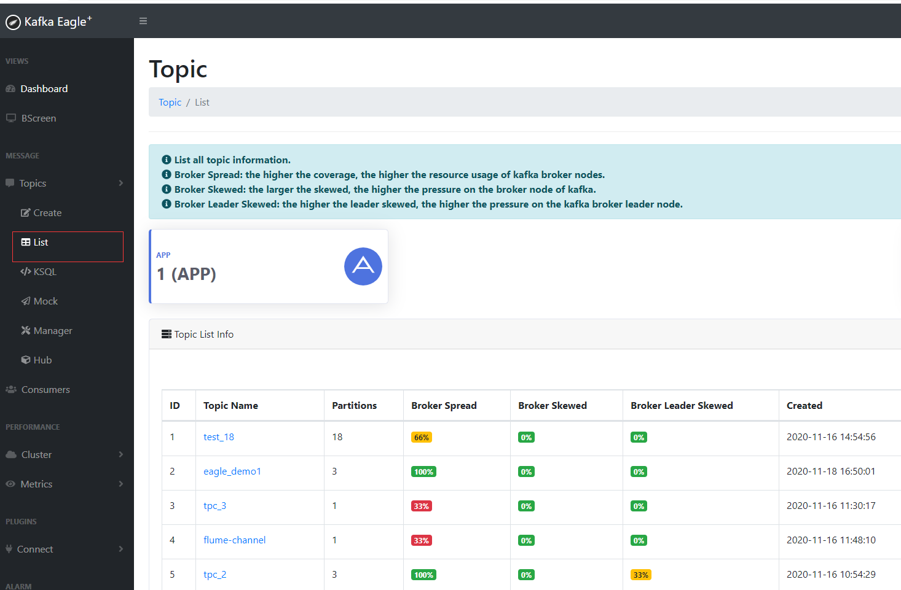

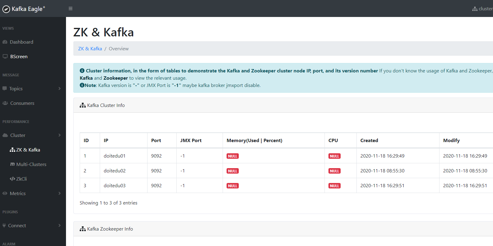

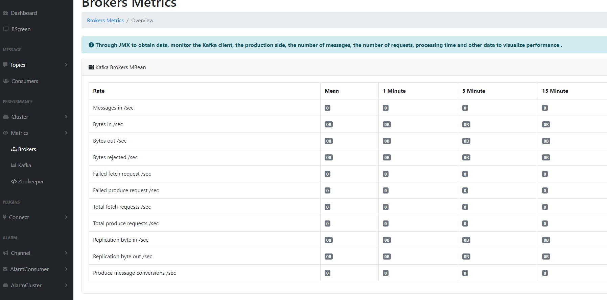

***

# 4. 命令行工具

## 4.1 概述

Kafka 中提供了许多命令行工具（位于$KAFKA HOME/bin 目录下）用于管理集群的变更。

| kafka-console-consumer.sh           | 用于消费消息      |
| ----------------------------------- | ----------- |
| kafka-console-producer.sh           | 用于生产消息      |
| kafka-topics.sh                     | 用于管理主题      |
| kafka-server-stop.sh                | 用于关闭Kafka服务 |
| kafka-server-start.sh               | 用于启动Kafka服务 |
| kafka-configs.sh                    | 用于配置管理      |
| kafka-consumer-perf-test.sh         | 用于测试消费性能    |
| kafka-producer-perf-test.sh         | 用于测试生产性能    |
| kafka-dump-log.sh                   | 用于查看数据日志内容  |
| kafka-preferred-replica-election.sh | 用于优先副本的选举   |
| kafka-reassign-partitions.sh        | 用于分区重分配     |

## 4.2 topic管理操作：kafka-topics

### 4.2.1 查看topic列表

bin/kafka-topics.sh --list --zookeeper doit01:2181

***

（1）查看topic详细信息

bin/kafka-topics.sh --zookeeper doitedu01:2181 --describe --topic topic-doit29

***

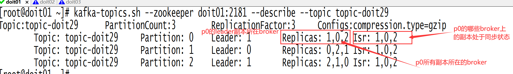

从上面的结果中，可以看出，topic的分区数量，以及每个分区的副本数量，以及每个副本所在的broker节点，以及每个分区的leader副本所在broker节点，以及每个分区的ISR副本列表；

**ISR：** in  sync  replicas  同步副本（当然也包含leader自身 replica.lag.time.max.ms =10000（默认值））

**OSR：**&#x6F;ut  of  sync replicas 失去同步的副本（该副本上次请求leader同步数据距现在的时间间隔超出配置阈值）

./kafka-topics.sh --zookeeper doitedu01:2181 --create --replication-factor 3 --partitions 3  --topic test

***

参数解释：

\--replication-factor  副本数量
\--partitions 分区数量&#x20;
\--topic topic名称

***

本方式，副本的存储位置是系统自动决定的；

bin/kafka-topics.sh --create --topic tpc-1  --zookeeper doitedu01:2181 --replica-assignment 0:1:3,1:2:6

***

该topic，将有如下partition：

partition0 ，所在节点： broker0、broker1、broker3

partition1 ，所在节点： broker1、broker2、broker6

bin/kafka-topics.sh --zookeeper doitedu01:2181 --delete --topic test

***

删除topic，server.properties中需要一个参数处于启用状态： delete.topic.enable = true

使用 kafka-topics .sh 脚本删除主题的行为本质上只是在 ZooKeeper 中的 /admin/delete\_topics 路径下建一个与待删除主题同名的节点，以标记该主题为待删除的状态。然后由 Kafka控制器异步完成。

kafka-topics.sh --zookeeper doit01:2181 --alter --topic doitedu-tpc2 --partitions 3

***

Kafka只支持增加分区，不支持减少分区

原因是：减少分区，代价太大（数据的转移，日志段拼接合并）

如果真的需要实现此功能，则完全可以重新创建一个分区数较小的主题，然后将现有主题中的消息按照既定的逻辑复制过去；

通过管理命令，可以为已创建的topic增加、修改、删除topic level参数

kafka-topics.sh   --alter  --topic tpc2 --config compression.type=gzip --zookeeper doit01:2181
\# --config compression.type=gzip  修改或添加参数配置
\# --add-config compression.type=gzip  添加参数配置
\# --delete-config compression.type  删除配置参数

***

topic配置参数文档地址： https://kafka.apache.org/documentation/#topicconfigs

bin/kafka-console-producer.sh --broker-list doitedu01:9092 --topic test

***

\>hello word

\>kafka

\>nihao

消费者在消费的时候，需要指定要订阅的主题，还可以指定消费的起始偏移量

起始偏移量的指定策略有3中：

kafka的topic中的消息，是有序号的（序号叫消息偏移量），而且消息的偏移量是在各个partition中独立维护的，在各个分区内，都是从0开始递增编号！

1. 消费消息

bin/kafka-console-consumer.sh --bootstrap-server  doitedu01:9092  --from-beginning --topic test

***

2. 指定要消费的分区，和要消费的起始offset

bin/kafka-console-consumer.sh --bootstrap-server doitedu01:9092,doitedu02:9092,doitedu03:9092 --topic doit14 --offset 2 --partition 0

***

3. 消费组

   * 消费组是kafka为了提高消费并行度的一种机制！

   * 在kafka的底层逻辑中，任何一个消费者都有自己所属的组

   * 组和组之间，没有任何关系，大家都可以消费到目标topic的所有数据

   * 但是组内的各个消费者，就只能读到自己所分配到的partitions

   * KAFKA中的消费组，可以动态增减消费者
     而且消费组中的消费者数量发生任意变动，都会重新分配分区消费任务

**如何让多个消费者组成一个组： 就是让这些消费者的groupId相同即可！**

kafka的消费者，可以记录自己所消费到的消息偏移量，记录的这个偏移量就叫（消费位移）；

记录这个消费到的位置，作用就在于消费者重启后可以接续上一次消费到位置来继续往后面消费；

消费位移，是组内共享的！！！

bin/kafka-console-consumer.sh --bootstrap-server  doitedu01:9092  --topic \_\_consumer\_offsets --formatter "kafka.coordinator.group.GroupMetadataManager\\$OffsetsMessageFormatter"

***

通过指定formatter工具类，来对\_\_consumer\_offsets主题中的数据进行解析；

\[d30,abcx,0]::OffsetAndMetadata(offset=12, leaderEpoch=Optional\[0], metadata=, commitTimestamp=1650073883478, expireTimestamp=None)

\[d30,abcx,1]::OffsetAndMetadata(offset=12, leaderEpoch=Optional\[0], metadata=, commitTimestamp=1650073883478, expireTimestamp=None)

\[d30,abcx,2]::OffsetAndMetadata(offset=11, leaderEpoch=Optional\[0], metadata=, commitTimestamp=1650073886522, expireTimestamp=None)

\[d30,abcx,0]::OffsetAndMetadata(offset=12, leaderEpoch=Optional\[0], metadata=, commitTimestamp=1650073886522, expireTimestamp=None)

\[d30,abcx,1]::OffsetAndMetadata(offset=12, leaderEpoch=Optional\[0], metadata=, commitTimestamp=1650073886522, expireTimestamp=None)

如果需要获取某个特定 consumer-group的消费偏移量信息，则需要计算该消费组的偏移量记录所在分区： Math.abs(groupID.hashCode()) % numPartitions

\_\_consumer\_offsets的分区数为：50

kafka-configs.sh 脚本是专门用来进行动态参数配置操作的，这里的操作是运行状态修改原有的配置，如此可以达到动态变更的目的；

**动态配置的参数，会被存储在zookeeper上，因而是持久生效的**

可用参数的查阅地址： https://kafka.apache.org/documentation/#configuration

kafka-configs.sh 脚本包含：变更alter、查看describe 这两种指令类型；

kafka-configs. sh 支持主题、 broker 、用户和客户端这4个类型的配置。

kafka-configs.sh 脚本使用 entity-type 参数来指定操作配置的类型，并且使 entity-name参数来指定操作配置的名称。

比如查看topic的配置可以按如下方式执行：

bin/kafka-configs.sh --zookeeper doit01:2181  --describe  --entity-type topics  --entity-name tpc\_2

***

比如查看broker的动态配置可以按如下方式执行：

bin/kafka-configs.sh  --describe --entity-type brokers --entity-name 0 --zookeeper doit01:2181

***

**entity-type和entity-name的对应关系**

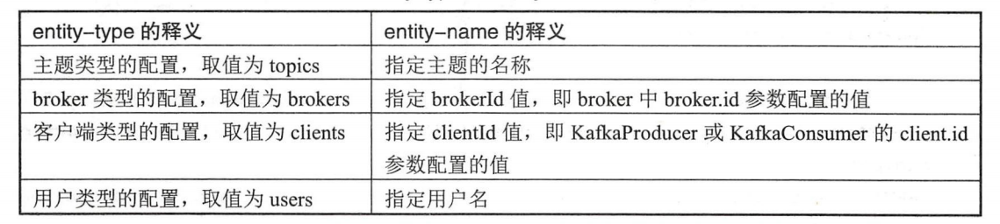

&#x20; 示例：添加topic级别参数

bin/kafka-configs.sh --zookeeper doit:2181 --alter --entity-type topics --entity-name tpc22  --add-config cleanup.policy=compact,max.message.bytes=10000

***

使用 kafka-configs.sh 脚本来变更（ alter ）配置时，会在 ZooKeeper 中创建一个命名形式为：

/config/\<entity-type>/\<entity name >的节点，并将变更的配置写入这个节点

&#x20; 示例：添加broker参数

kafka-configs.sh  --entity-type brokers --entity-name 0 --alter --add-config log.flush.interval.ms=1000 --bootstrap-server doit01:9092,doit02:9092,doit03:9092

***

### 4.2.2 动态配置topic参数

通过管理命令，可以为已创建的topic增加、修改、删除topic level参数

kafka-topics.sh  --topic doitedu-tpc2 --alter  --config compression.type=gzip --zookeeper doit01:2181

如果利用 kafka-configs.sh 脚本来对topic、producer、consumer、broker等进行参数动态

bin/kafka-configs.sh --zookeeper doitedu01:2181 --entity-type topics --entity-name tpc\_1 --alter --add-config compression.type=gzip

***

bin/kafka-configs.sh --zookeeper doitedu01:2181 --entity-type topics --entity-name tpc\_1 --alter --delete-config compression.type

***

***

# 5. API开发：producer生产者

## 5.1 生产者api示例

一个正常的生产逻辑需要具备以下几个步骤

（1）配置生产者参数及创建相应的生产者实例

（2）构建待发送的消息

（3）发送消息

（4）关闭生产者实例

首先，引入maven依赖

\<dependency>
&#x20;   \<groupId>org.apache.kafka\</groupId>
&#x20;   \<artifactId>kafka-clients\</artifactId>
&#x20;   \<version>2.3.1\</version>
\</dependency>

***

采用默认分区方式将消息散列的发送到各个分区当中

import org.apache.kafka.clients.producer.KafkaProducer;
import org.apache.kafka.clients.producer.Producer;
import org.apache.kafka.clients.producer.ProducerRecord;
​
import java.util.Properties;
​
public class MyProducer {
&#x20;   public static void main(String\[] args) throws InterruptedException {
&#x20;       Properties props = new Properties();
&#x20;       //设置kafka集群的地址
&#x20;       props.put("bootstrap.servers", "doitedu01:9092,doitedu02:9092,doitedu03:9092");
&#x20;       //ack模式，取值有0，1，-1（all）  ， all是最慢但最安全的
&#x20;       props.put("acks", "all");
&#x20;       //失败重试次数（有可能会造成数据的乱序）
&#x20;       props.put("retries", 3);
&#x20;       //数据发送的批次大小
&#x20;       props.put("batch.size", 10);
&#x20;       //一次数据发送请求所能发送的最大数据量
&#x20;       props.put("max.request.size",1024);
&#x20;       //消息在缓冲区保留的时间，超过设置的值就会被提交到服务端
&#x20;       props.put("linger.ms", 10000);
&#x20;       //整个Producer用到总内存的大小，如果缓冲区满了会提交数据到服务端
&#x20;       //buffer.memory要大于batch.size，否则会报申请内存不足的错误
&#x20;       props.put("buffer.memory", 10240);
&#x20;       //序列化器
&#x20;       props.put("key.serializer", "org.apache.kafka.common.serialization.StringSerializer");
&#x20;       props.put("value.serializer", "org.apache.kafka.common.serialization.StringSerializer");
&#x20;       Producer\<String, String> producer = new KafkaProducer<>(props);
&#x20;       for (int i = 0; i < 100; i++)
&#x20;           producer.send(new ProducerRecord\<String, String>("test", Integer.toString(i), "dd:"+i));
&#x20;       //Thread.sleep(1000000);
&#x20;       producer.close();
&#x20;   }
}

***

消息对象ProducerRecord，除了包含业务数据外，还包含了多个属性：

public class ProducerRecord\<K, V> {
&#x20;   private final String topic;
&#x20;   private final Integer partition;
&#x20;   private final Headers headers;
&#x20;   private final K key;
&#x20;   private final V value;
&#x20;   private final Long timestamp;

***

Ack应答机制参数配置

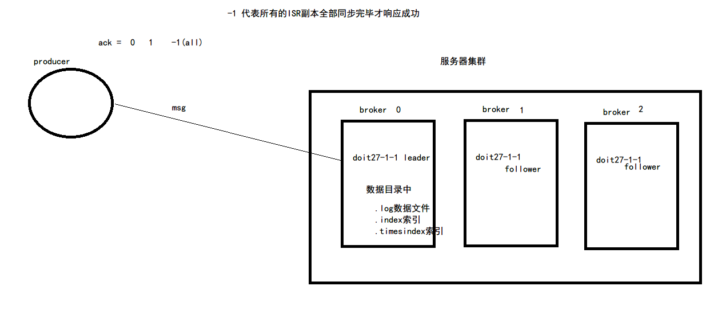

0 ： 生产者发出消息后不等待服务端的确认

1 ： 生产者发出消息后要求服务端的分区leader确保数据存储成功后发送一个确认信息

-1： 生产者发出消息后要求服务端的分区的ISR副本全部同步成功后发送一个确认信息

生产者的ack=all，也不能完全保证数据发送的100%可靠性

为什么？因为，如果服务端目标partition的同步副本只有leader自己了，此时，它收到数据就会给生产者反馈成功！

可以修改服务端的一个参数（分区最小ISR数\[min.insync.replicas]>=2），来避免此问题；

Kafka 生产者客户端 KakaProducer 中有3个参数是必填的。

**bootstrap.servers  /  key.serializer  /  value.serializer**

为了防止参数名字符串书写错误，可以使用如下方式进行设置：

pro.setProperty(ProducerConfig.KEY\_SERIALIZER\_CLASS\_CONFIG, StringSerializer.class.getName());
pro.setProperty(ProducerConfig.VALUE\_SERIALIZER\_CLASS\_CONFIG,StringSerializer.class.getName());

***

创建生产者实例和构建消息之后 就可以开始发送消息了。**发送消息主要有3种模式：**

发后即忘，它只管往 Kafka发送，并不关心消息是否正确到达。

在大多数情况下，这种发送方式没有问题；

不过在某些时候（比如发生不可重试异常时）会造成消息的丢失。

这种发送方式的性能最高，可靠性最差。

Future\<RecordMetadata> send = producer.send(rcd);

***

try {
&#x20;   producer.send(rcd).get();
} catch (Exception e) {
&#x20;   e.printStackTrace();
}

***

0.8.x前，有一个参数 producer.type=sycn|asycn 来决定生产者的发送模式；

现已失效（新版中，producer在底层只有异步）

回调函数会在producer收到ack时调用，为异步调用，该方法有两个参数，分别是RecordMetadata和Exception，如果Exception为null，说明消息发送成功，如果Exception不为null，说明消息发送失败。

注意：消息发送失败会自动重试，不需要我们在回调函数中手动重试。

代码示例

import org.apache.kafka.clients.producer.\*;
import java.util.Properties;
public class MyProducer {
&#x20;   public static void main(String\[] args) throws InterruptedException {
&#x20;       Properties props = new Properties();
&#x20;       // Kafka服务端的主机名和端口号
&#x20;       props.put("bootstrap.servers", "doitedu01:9092,doitedu02:9092,doitedu03:9092");
&#x20;       // 等待所有副本节点的应答
&#x20;       props.put("acks", "all");
&#x20;       // 消息发送最大尝试次数
&#x20;       props.put("retries", 0);
&#x20;       // 一批消息处理大小
&#x20;       props.put("batch.size", 16384);
&#x20;       // 增加服务端请求延时
&#x20;       props.put("linger.ms", 1);
&#x20;       // 发送缓存区内存大小
&#x20;       props.put("buffer.memory", 33554432);
&#x20;       // key序列化
&#x20;       props.put("key.serializer", "org.apache.kafka.common.serialization.StringSerializer");
&#x20;       // value序列化
&#x20;       props.put("value.serializer", "org.apache.kafka.common.serialization.StringSerializer");
&#x20;       KafkaProducer\<String, String> kafkaProducer = new KafkaProducer<>(props);
&#x20;       for (int i = 0; i < 50; i++) {
&#x20;           kafkaProducer.send(new ProducerRecord\<String, String>("test", "hello" + i), new Callback() {
&#x20;               @Override
&#x20;               public void onCompletion(RecordMetadata metadata, Exception exception) {
&#x20;                   if (metadata != null) {
&#x20;                       System.out.println(metadata.partition()+ "-"+ metadata.offset());
&#x20;                   }
&#x20;               }
&#x20;           });
&#x20;       }
&#x20;       kafkaProducer.close();
&#x20;   }
}

***

# 6. API开发：consumer消费者

## 6.1 消费者Api示例

一个正常的消费逻辑需要具备以下几个步骤：

（1）配置消费者客户端参数及创建相应的消费者实例；

（2）订阅主题topic；

（3）**拉取**消息并消费；

（4）定期向\_\_consumer\_offsets主题提交消费位移offset；

（5）关闭消费者实例。

import org.apache.kafka.clients.consumer.\*;
import java.util.Arrays;
import java.util.Properties;
​
public class MyConsumer {
&#x20;   public static void main(String\[] args) {
&#x20;       Properties props = new Properties();
&#x20;       // 定义kakfa 服务的地址，不需要将所有broker指定上
&#x20;       props.put("bootstrap.servers", "doitedu01:9092");
&#x20;       // 制定consumer group
&#x20;       props.put("group.id", "g1");
&#x20;       // 是否自动提交offset
&#x20;       props.put("enable.auto.commit", "true");
&#x20;       // 自动提交offset的时间间隔
&#x20;       props.put("auto.commit.interval.ms", "1000");
&#x20;       // key的反序列化类
&#x20;       props.put("key.deserializer", "org.apache.kafka.common.serialization.StringDeserializer");
&#x20;       // value的反序列化类
&#x20;       props.put("value.deserializer", "org.apache.kafka.common.serialization.StringDeserializer");
&#x20;       // 如果没有消费偏移量记录，则自动重设为起始offset：latest, earliest, none
&#x20;       props.put("auto.offset.reset","earliest");
&#x20;       // 定义consumer
&#x20;       KafkaConsumer\<String, String> consumer = new KafkaConsumer<>(props);
&#x20;       // 消费者订阅的topic, 可同时订阅多个
&#x20;       consumer.subscribe(Arrays.asList("first", "test","test1"));
&#x20;       while (true) {
&#x20;           // 读取数据，读取超时时间为100ms
&#x20;           ConsumerRecords\<String, String> records = consumer.poll(100);
&#x20;           for (ConsumerRecord\<String, String> record : records)
&#x20;               System.out.printf("offset = %d, key = %s, value = %s%n", record.offset(), record.key(), record.value());
&#x20;       }
&#x20;   }
}

***

也可以使用如下形式：

Properties props = new Properties();
props.put(ConsumerConfig.KEY\_DESERIALIZER\_CLASS\_CONFIG,StringDeserializer.class.getName());
props.put(ConsumerConfig.VALUE\_DESERIALIZER\_CLASS\_CONFIG,StringDeserializer.class.getName());
props.put(ConsumerConfig.BOOTSTRAP\_SERVERS\_CONFIG,brokerList);
props.put(ConsumerConfig.GROUP\_ID\_CONFIG,groupid);
props.put(ConsumerConfig.CLIENT\_ID\_CONFIG,clientid);

***

subscribe有如下重载方法：

public void subscribe(Collection\<String> topics,ConsumerRebalanceListener listener)&#x20;

public void subscribe(Collection\<String> topics)&#x20;

public void subscribe(Pattern pattern, ConsumerRebalanceListener listener)&#x20;

public void subscribe(Pattern pattern)

consumer.subscribe(Arrays.asList(topicl ));

consumer subscribe(Arrays.asList(topic2))

如果消费者采用的是正则表达式的方式（subscribe(Pattern)）订阅， 在之后的过程中，如果

有人又创建了新的主题，并且主题名字与正表达式相匹配，那么这个消费者就可以消费到

新添加的主题中的消息。如果应用程序需要消费多个主题，并且可以处理不同的类型，那么这

种订阅方式就很有效。

正则表达式的方式订阅的示例如下

consumer.subscribe(Pattern.compile ("topic.\*" ));

利用正则表达式订阅主题，可实现动态订阅；

消费者不仅可以通过 KafkaConsumer.subscribe() 方法订阅主题，还可直接订阅某些主题的指定分区；

在 KafkaConsumer 中提供了 assign() 方法来实现这些功能，此方法的具体定义如下：

public void assign(Collection\<TopicPartition> partitions)&#x20;

这个方法只接受参数partitions，用来指定需要订阅的分区集合。示例如下：

consumer.assign(Arrays.asList(new TopicPartition ("tpc\_1" , 0),new TopicPartition(“tpc\_2”,1))) ;

在多个消费者的情况下可以根据分区分配策略来自动分配各个消费者与分区的关系。当消费组的消费者增加或减少时，分区分配关系会自动调整，以实现消费负载均衡及故障自动转移。&#x20;

其实这一点从assign()方法参数可以看出端倪，两种类型subscribe()都有ConsumerRebalanceListener类型参数的方法，而assign()方法却没有。

既然有订阅，那么就有取消订阅；

可以使用KafkaConsumer中的unsubscribe()方法采取消主题的订阅，这个方法既可以取消通过 subscribe( Collection）方式实现的订阅；

也可以取消通过subscribe(Pattem）方式实现的订阅，还可以取消通过assign( Collection）方式实现的订阅。示例码如下：

consumer.unsubscribe();

如果将subscribe(Collection )或assign(Collection）集合参数设置为空集合，作用与unsubscribe（）方法相同，如下示例中三行代码的效果相同：

consumer.unsubscribe();
consumer.subscribe(new ArrayList\<String>()) ;
consumer.assign(new ArrayList\<TopicPartition>());

Kafka中的消费是基于**拉取模式**的。

消息的消费一般有两种模式：推送模式和拉取模式。推模式是服务端主动将消息推送给消费者，而拉模式是消费者主动向服务端发起请求来拉取消息。

Kafka 中的消息消费是一个不断轮询的过程，消费者所要做的就是重复地调用 poll( ) 方法， poll( )方法返回的是所订阅的主题（分区）上的一组消息。

对于poll ( ) 方法而言，如果某些分区中没有可供消费的消息，那么此分区对应的消息拉取的结果就为空，如果订阅的所有分区中都没有可供消费的消息，那么poll( )方法返回为空的消息集；

poll ( ) 方法具体定义如下：

public ConsumerRecords\<K, V> poll(final Duration timeout)

超时时间参数timeout ，用来控制 poll( ) 方法的阻塞时间，在消费者的缓冲区里没有可用数据时会发生阻塞。如果消费者程序只用来单纯拉取并消费数据，则为了提高吞吐率，可以把timeout设置为Long.MAX\_VALUE；

消费者消费到的每条消息的类型为ConsumerRecord

public class ConsumerRecord\<K, V> {
&#x20;   public static final long *NO\_TIMESTAMP&#x20;*= RecordBatch.*NO\_TIMESTAMP*;
&#x20;   public static final int *NULL\_SIZE&#x20;*= -1;
&#x20;   public static final int *NULL\_CHECKSUM&#x20;*= -1;

&#x20;   private final String topic;
&#x20;   private final int partition;
&#x20;   private final long offset;
&#x20;   private final long timestamp;
&#x20;   private final TimestampType timestampType;
&#x20;   private final int serializedKeySize;
&#x20;   private final int serializedValueSize;
&#x20;   private final Headers headers;
&#x20;   private final K key;
&#x20;   private final V value;

&#x20;   private volatile Long checksum;

topic partition 这两个字段分别代表消息所属主题的名称和所在分区的编号。

offset 表示消息在所属分区的偏移量。&#x20;

timestamp 表示时间戳，与此对应的timestampType 表示时间戳的类型。&#x20;

timestampType 有两种类型 CreateTime 和LogAppendTime ，分别代表消息创建的时间戳和消息追加到日志的时间戳。

headers 表示消息的头部内容。&#x20;

key value 分别表示消息的键和消息的值，一般业务应用要读取的就是value ；

serializedKeySize、serializedValueSize分别表示key、value 经过序列化之后的大小，如果 key 为空，则 serializedKeySize 值为 -1，同样，如果value为空，则serializedValueSize 的值也会为 -1；

checksum 是CRC32的校验值。

示例代码片段

/\*\*
&#x20;\* 订阅与消费方式2
&#x20;\*/
TopicPartition tp1 = new TopicPartition("x", 0);
TopicPartition tp2 = new TopicPartition("y", 0);
TopicPartition tp3 = new TopicPartition("z", 0);
List\<TopicPartition> tps = Arrays.asList(tp1, tp2, tp3);
consumer.assign(tps);
​
while (true) {
&#x20;   ConsumerRecords\<String, String> records = consumer.poll(Duration.ofMillis(1000));
&#x20;   for (TopicPartition tp : tps) {
&#x20;       List\<ConsumerRecord\<String, String>> rList = records.records(tp);
&#x20;       for (ConsumerRecord\<String, String> r : rList) {
&#x20;           r.topic();
&#x20;           r.partition();
&#x20;           r.offset();
&#x20;           r.value();
&#x20;           //do something to process record.
&#x20;       }
&#x20;   }
}

***

有些时候，我们需要一种更细粒度的掌控，可以让我们从特定的位移处开始拉取消息，而 KafkaConsumer 中的 seek（） 方法正好提供了这个功能，让我们可以追前消费或回溯消费。&#x20;

seek（）方法的具体定义如下：

public void seek(TopicPartiton partition,long offset)

代码示例：

public class ConsumerDemo3指定偏移量消费 {
&#x20;   public static void main(String\[] args) {
​
&#x20;       Properties props = new Properties();
&#x20;       props.setProperty(ConsumerConfig.GROUP\_ID\_CONFIG,"g002");
&#x20;       props.setProperty(ConsumerConfig.BOOTSTRAP\_SERVERS\_CONFIG,"doit01:9092");
&#x20;       props.setProperty(ConsumerConfig.KEY\_DESERIALIZER\_CLASS\_CONFIG, StringDeserializer.class.getName());
&#x20;       props.setProperty(ConsumerConfig.VALUE\_DESERIALIZER\_CLASS\_CONFIG,StringDeserializer.class.getName());
&#x20;       props.setProperty(ConsumerConfig.AUTO\_OFFSET\_RESET\_CONFIG,"latest");
&#x20;       // 是否自动提交消费位移
&#x20;       props.setProperty(ConsumerConfig.ENABLE\_AUTO\_COMMIT\_CONFIG,"true");
​
&#x20;       // 限制一次poll拉取到的数据量的最大值
&#x20;       props.setProperty(ConsumerConfig.FETCH\_MAX\_BYTES\_CONFIG,"10240000");
​
&#x20;       KafkaConsumer\<String, String> consumer = new KafkaConsumer<>(props);
​
&#x20;       // assign方式订阅doit27-1的两个分区
&#x20;       TopicPartition tp0 = new TopicPartition("doit27-1", 0);
&#x20;       TopicPartition tp1 = new TopicPartition("doit27-1", 1);
&#x20;       consumer.assign(Arrays.asList(tp0,tp1));
​
&#x20;       // 指定分区0，从offset：800开始消费    ；  分区1，从offset：650开始消费
&#x20;       consumer.seek(tp0,200);
&#x20;       consumer.seek(tp1,250);
​
&#x20;       // 开始拉取消息
&#x20;       while(true){
&#x20;           ConsumerRecords\<String, String> poll = consumer.poll(Duration.ofMillis(3000));
&#x20;           for (ConsumerRecord\<String, String> rec : poll) {
&#x20;               System.out.println(rec.partition()+","+rec.key()+","+rec.value()+","+rec.offset());
&#x20;           }
&#x20;       }
&#x20;   }
}

***

Kafka中默认的消费位移的提交方式是自动提交，这个由消费者客户端参数enable.auto.commit 配置，默认值为 true 。当然这个默认的自动提交不是每消费一条消息就提交一次，而是定期提交，这个定期的周期时间由客户端参数 auto.commit.interval.ms配置，默认值为5秒，此参数生效的前提是 enable. auto.commit 参数为 true。

在默认的方式下，消费者每隔5秒会将拉取到的每个分区中最大的消息位移进行提交。自动位移提交的动作是在 poll() 方法的逻辑里完成的，在每次真正向服务端发起拉取请求之前会检查是否可以进行位移提交，如果可以，那么就会提交上一次轮询的位移。

Kafka 消费的编程逻辑中位移提交是一大难点，自动提交消费位移的方式非常简便，它免去了复杂的位移提交逻辑，让编码更简洁。但随之而来的是**重复消费**和**消息丢失**的问题。

假设刚刚提交完一次消费位移，然后拉取一批消息进行消费，在下一次自动提交消费位移之前，消费者崩溃了，那么又得从上一次位移提交的地方重新开始消费，这样便发生了重复消费的现象（对于再均衡的情况同样适用）。我们可以通过减小位移提交的时间间隔来减小重复消息的窗口大小，但这样并不能避免重复消费的发送，而且也会使位移提交更加频繁。

按照一般思维逻辑而言，自动提交是延时提交，重复消费可以理解，那么消息丢失又是在什么情形下会发生的呢？我们来看下图中的情形：

拉取线程不断地拉取消息并存入本地缓存，比如在BlockingQueue 中;另一个处理线程从缓存中读取消息并进行相应的逻辑处理。设目前进行到了第 y+l 次拉取，以及第m次位移提交的时候，也就是 x+6 之前的位移己经确认提交了，处理线程却还正在处理x+3的消息；此时如果处理线程发生了异常，待其恢复之后会从第m次位移提交处，也就是 x+6 的位置开始拉取消息，那么 x+3至x+6 之间的消息就没有得到相应的处理，这样便发生消息丢失的现象。

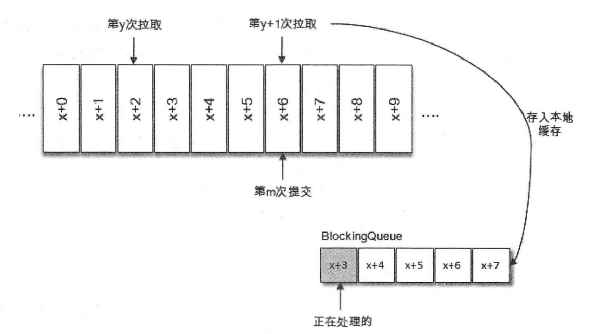

## 6.2 手动提交消费者偏移量（调用kafka api）

自动位移提交的方式在正常情况下不会发生消息丢失或重复消费的现象，但是在编程的世界里异常无可避免；同时，自动位移提交也无法做到精确的位移管理。在 Kafka中还提供了手动位移提交的方式，这样可以使得开发人员对消费位移的管理控制更加灵活。

很多时候并不是说拉取到消息就算消费完成，而是需要将消息写入数据库、写入本地缓存，或者是更加复杂的业务处理。在这些场景下，所有的业务处理完成才能认为消息被成功消费；

手动的提交方式可以让开发人员根据程序的逻辑在合适的时机进行位移提交。开启手动提交功能的前提是消费者客户端参数 enable.auto.commit 配置为false ，示例如下：

props.put(ConsumerConf.ENABLE\_AUTO\_COMMIT\_CONFIG, false);&#x20;

***

手动提交可以细分为同步提交和异步提交，对应于 KafkaConsumer 中的 commitSync()和

commitAsync()两种类型的方法。

commitSync()方法的定义如下：

/\*\*
&#x20;\* 手动提交offset
&#x20;\*/
while (true) {
&#x20;   ConsumerRecords\<String, String> records = consumer.poll(Duration.ofMillis(1000));
&#x20;   for (ConsumerRecord\<String, String> r : records) {
&#x20;       //do something to process record.
&#x20;   }
&#x20;   consumer.commitSync();
}

***

对于采用 commitSync()的无参方法，它提交消费位移的频率和拉取批次消息、处理批次消息的频率是一样的，如果想寻求更细粒度的、更精准的提交，那么就需要使用commitSync()的另一个有参方法，具体定义如下：

public void commitSync(final Map\<TopicPartition，OffsetAndMetadata> offsets)

***

示例代码如下：

while (true) {
&#x20;   ConsumerRecords\<String, String> records = consumer.poll(Duration.ofMillis(1000));
&#x20;   for (ConsumerRecord\<String, String> r : records) {
&#x20;       long offset = r.offset();
&#x20;       //do something to process record.
​
&#x20;       TopicPartition topicPartition = new TopicPartition(r.topic(), r.partition());
&#x20;       consumer.commitSync(Collections.singletonMap(topicPartition,new OffsetAndMetadata(offset+1)));
&#x20;   }
}

***

提交的偏移量  =  消费完的record的偏移量  +  1

因为，\_\_consumer\_offsets中记录的消费偏移量，代表的是，消费者下一次要读取的位置！！！

异步提交的方式（ commitAsync（））在执行的时候消费者线程不会被阻塞；可能在提交消费位移的结果还未返回之前就开始了新一次的拉取。异步提交可以让消费者的性能得到一定的增强。 commitAsync方法有一个不同的重载方法，具体定义如下

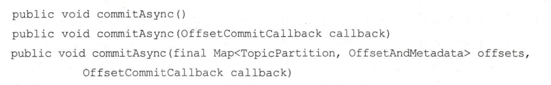

示例代码

/\*\*
&#x20;\* 异步提交offset
&#x20;\*/
while (true) {
&#x20;   ConsumerRecords\<String, String> records = consumer.poll(Duration.ofMillis(1000));
&#x20;   for (ConsumerRecord\<String, String> r : records) {
&#x20;       long offset = r.offset();
​
&#x20;       //do something to process record.
&#x20;       TopicPartition topicPartition = new TopicPartition(r.topic(), r.partition());
&#x20;       consumer.commitSync(Collections.singletonMap(topicPartition,new OffsetAndMetadata(offset+1)));
&#x20;       consumer.commitAsync(Collections.singletonMap(topicPartition, new OffsetAndMetadata(offset + 1)), new OffsetCommitCallback() {
&#x20;    @Override
&#x20;    public void onComplete(Map\<TopicPartition, OffsetAndMetadata> map, Exception e) {
&#x20;               if(e == null ){
&#x20;                   System.out.println(map);
&#x20;               }else{
&#x20;                   System.out.println("error commit offset");
&#x20;               }
&#x20;           }
&#x20;       });
&#x20;   }
}

***

可能会发生**漏处理**的现象（数据丢失）

反过来说，这种方式实现了： **at most once**的数据处理（传递）语义

可能会发生**重复处理**的现象（数据重复）

反过来说，这种方式实现了： **at least once**的数据处理（传递）语义

当然，数据处理（传递）的理想语义是： exactly once（精确一次）

Kafka也能做到exactly once（基于kafka的事务机制）

consumer的消费位移提交方式：

&#x20; 全自动 &#x20;

&#x20; 半自动 &#x20;

&#x20; 全手动 &#x20;

一次拉取的最小字节数

一次拉取的最大数据量

拉取时的最大等待时长

每个分区一次拉取的最大数据量

一次拉取的最大条数

网络连接的最大闲置时长

一次请求等待响应的最大超时时间

consumer等待请求响应的最长时间

元数据在限定时间内没有进行更新，则会被强制更新

尝试重新连接指定主机之前的退避时间

尝试重新拉取数据的重试间隔

隔离级别！ 决定消费者能读到什么样的数据

read\_uncommitted：可以消费到LSO（LastStableOffset）位置；

read\_committed：可以消费到HW（High Watermark）位置

超过时限没有发起poll操作，则消费组认为该消费者已离开消费组

开启消费位移的自动提交

auto.commit.interval.ms=5000

自动提交消费位移的时间间隔

# 7. API开发：topic管理

如果希望将管理类的功能集成到公司内部的系统中，打造集管理、监控、运维、告警为一体的生态平台，那么就需要以程序调用 API 方式去实现。

工具类KafkaAdminClient可以用来**管理broker、配置和ACL （Access Control List），管理topic**

构造一个KafkaAdminClient

AdminClient adminClient = KafkaAdminClient.create(props);

***

ListTopicsResult listTopicsResult = adminClient.listTopics();
Set\<String> topics = listTopicsResult.names().get();
System.out.println(topics);

***

DescribeTopicsResult describeTopicsResult = adminClient.describeTopics(Arrays.asList("tpc\_4", "tpc\_3"));
Map\<String, TopicDescription> res = describeTopicsResult.all().get();
Set\<String> ksets = res.keySet();
for (String k : ksets) {
&#x20;   System.out.println(res.get(k));
}

***

// 参数配置
Properties props = new Properties();
props.put(AdminClientConfig.BOOTSTRAP\_SERVERS\_CONFIG,"doit01:9092,doit02:9092,doit03:9092");
props.put(AdminClientConfig.REQUEST\_TIMEOUT\_MS\_CONFIG,3000);
​
// 创建 admin client 对象
AdminClient adminClient = KafkaAdminClient.create(props);​
// 由服务端controller自行分配分区及副本所在broker
NewTopic tpc\_3 = new NewTopic("tpc\_3", 2, (short) 1);​
// 手动指定分区及副本的broker分配
HashMap\<Integer, List\<Integer>> replicaAssignments = new HashMap<>();
// 分区0，分配到broker0，broker1
replicaAssignments.put(0,Arrays.asList(0,1));
// 分区1，分配到broker0,broker2
replicaAssignments.put(1,Arrays.asList(0,1));
​
NewTopic tpc\_4 = new NewTopic("tpc\_4", replicaAssignments);
CreateTopicsResult result = adminClient.createTopics(Arrays.asList(tpc\_3,tpc\_4));
​
// 从future中等待服务端返回
try {
&#x20;   result.all().get();
} catch (Exception e) {
&#x20;   e.printStackTrace();
}
adminClient.close();

***

代码示例：

DeleteTopicsResult deleteTopicsResult = adminClient.deleteTopics(Arrays.asList("tpc\_1", "tpc\_1"));
Map\<String, KafkaFuture\<Void>> values = deleteTopicsResult.values();
System.out.println(values);

***

除了进行topic管理外，KafkaAdminClient也可进行诸如动态参数管理，分区管理等各类管理操作；

# 8. kafka系统的架&#x6784;**（**&#x57FA;础重&#x70B9;**）**

自我推导设计：

一台 kafka服务器就是一个broker。一个kafka集群由多个 broker 组成。

消息生产者，就是向kafka broker发消息的客户端。

consumer ：消费者，从kafka broker 取消息的客户端。

consumer group：消费组，单个或多个consumer可以组成一个消费组；

消费组是用来实现消息的广播（发给所有的 consumer）和单播（发给任意一个 consumer）的手段；

消费者可以对消费到的消息位置（消息偏移量）进行记录；

老版本是记录在zookeeper中；新版本是记录在kafka中一个内置的topic中（\_\_consumer\_offsets)

Kafka中存储数据的逻辑分类；你可以理解为数据库中“表”的概念；

比如，将app端日志、微信小程序端日志、业务库订单表数据分别放入不同的topic

topic中数据的具体管理单元；（你可以理解为hbase中表的“region"概念）

\- 每个partition由一个kafka broker服务器管理；

\- 每个topic 可以划分为多个partition，分布到多个broker上管理；

\- 每个partition都可以有多个副本；

分区对于 kafka 集群的好处是：实现topic数据的负载均衡。提高写入、读出的并发度，提高吞吐量。

每个topic的每个partition都可以配置多个副本（replica），以提高数据的可靠性；

每个partition的所有副本中，必有一个leader副本，其他的就是follower副本（observer副本）；follower定期找leader同步最新的数据；对外提供服务只有leader；

partition replica中的一个角色，在一个partition的多个副本中，会存在一个副本角色为leader；

producer和consumer只能跟leader交互（**读写数据**）。

partition replica中的一个角色，它通过心跳通信不断从leader中拉取、复制数据（**只负责备份**）。

如果leader所在节点宕机，follower中会选举出新的leader；

partition 中每条消息都会被分配一个递增id（offset）；通过offset可以快速定位到消息的存储位置；

kafka 只保证按一个partition中的消息的顺序，不保证一个 topic的整体（多个partition 间）的顺序。

**ISR概念：**（同步副本）。每个分区的leader会维护一个ISR列表，ISR列表里面就是follower副本的Borker编号，只有跟得上Leader的 follower副本才能加入到 ISR里面，这个是通过replica.lag.time.max.ms =10000（默认值）参数配置的，只有ISR里的成员才有被选为 leader 的可能。

**踢出ISR和重新加入ISR的条件：**

***

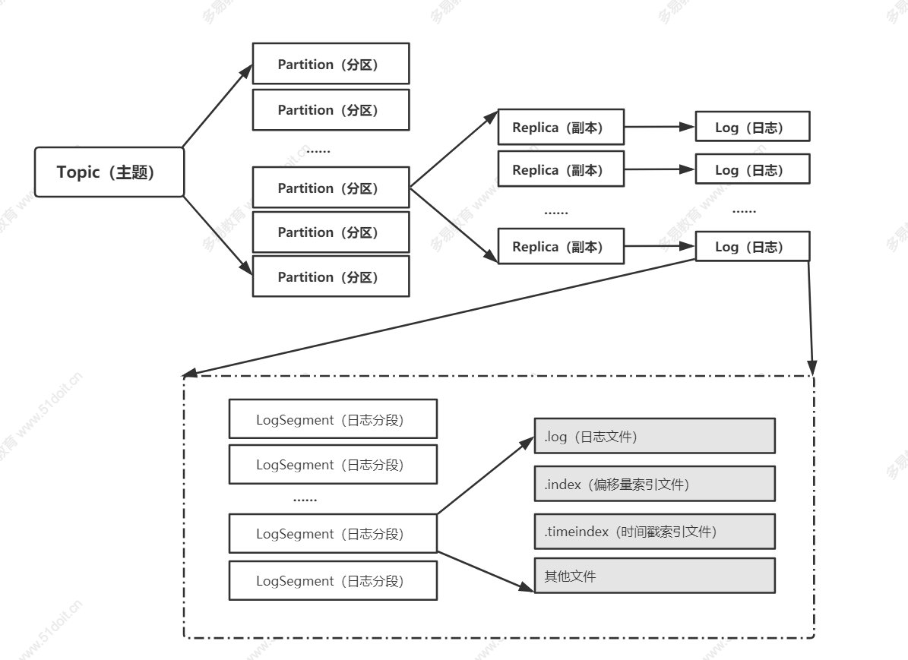

## 8.1 物理存储目录结构

* 存储目录 名称规范：  **topic名称-分区号**&#x20;

注：“t1"即为一个topic的名称；

而“t1-0 / t1-1"则表明这个目录是t1这个topic的哪个partition；

生产者生产的消息会不断追加到log文件末尾，为防止log文件过大导致数据定位效率低下，Kafka采取了分片和索引机制 ；

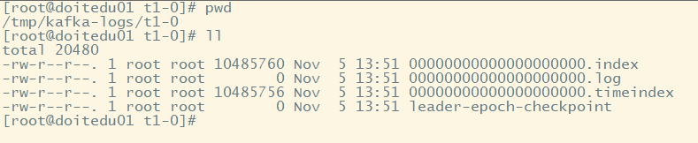

index和log文件以当前segment的第一条消息的offset命名。

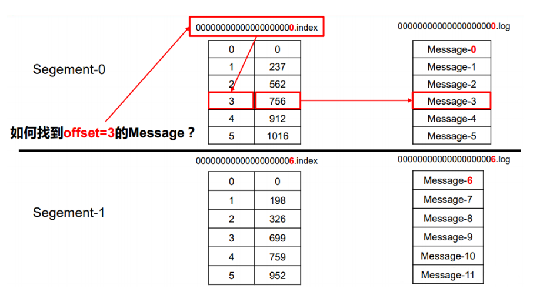

index索引文件中的数据为：  消息offset -> log文件中该消息的物理偏移量位置；

Kafka 中的索引文件以**稀疏索引**（ sparse index ）的方式构造消息的索引，它并不保证每个消息在索引文件中都有对应的索引；每当写入一定量（由 broker 端参数 log.index.interval.bytes 指定，默认值为 4096 ，即 4KB ）的消息时，偏移量索引文件和时间戳索引文件分别增加一个偏移量索引项和时间戳索引项，增大或减小 log.index.interval.bytes的值，对应地可以缩小或增加索引项的密度；

查询指定偏移量时，使用二分查找法来快速定位偏移量的位置。

## 8.2 消息message存储结构

在客户端编程代码中，消息的封装类有两种：ProducerRecord、ConsumerRecord；

简单来说，kafka中的每个massage由一对**key-value**构成；

Kafka中的message格式经历了3个版本的变化了：v0 、 v1 、 v2

各个字段的含义介绍如下：

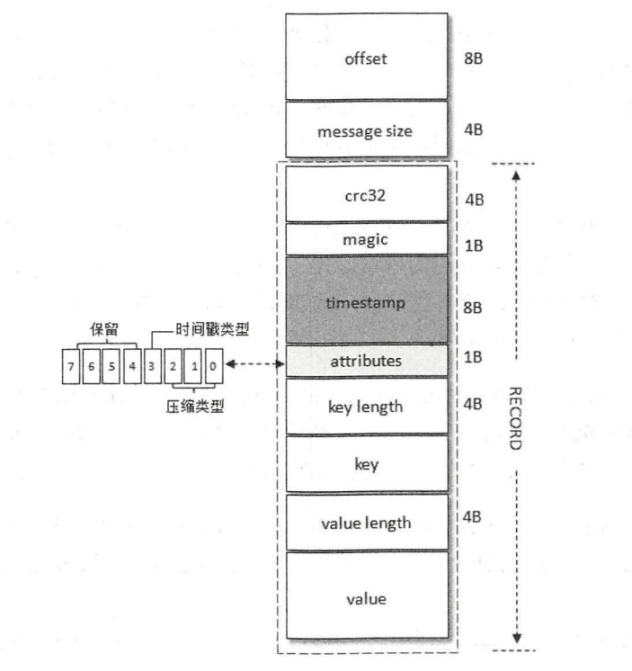

***

# 9. kafka关键原理加强

## 9.1 日志分段切分条件

日志分段文件切分包含以下4个条件，满足其一即可：

（1）当前日志分段文件的大小超过了broker端参数 log.segment.bytes 配置的值。

log.segment.bytes参数的默认值为 1073741824，即1GB

（2）当前日志分段中消息的最小时间戳与当前系统的时间戳的差值大于log.roll.ms或log.roll.hours参数配置的值。如果同时配置了log.roll.ms和log.roll.hours 参数，那么 log.roll.ms 的优先级高

默认情况下，只配置了log.roll.hours参数，其值为168,即7天。

（3）偏移量索引文件或时间戳索引文件的大小达到 broker 端参数 log.index.size.max.bytes 配置的值。log.index.size .max.bytes的默认值为 10485760，即10MB

（4）追加的消息的偏移量与当前日志分段的起始偏移量之间的差值大于Integer.MAX\_VALUE,&#x20;

即要追加的消息的偏移量不能转变为相对偏移量（offset - baseOffset > Integer.MAX\_VALUE）。

**Controller简单来说，就是kafka集群的状态管理者**

在Kafka集群中会有一个或者多个broker，**其中有一个broker会被选举为控制器（Kafka Controller）**，它负责维护整个集群中所有分区和副本的状态及分区leader的选举。

当某个分区的leader副本出现故障时，由控制器负责为该分区选举新的leader副本。当检测到某个分区的ISR集合发生变化时，由控制器负责通知所有broker更新其元数据信息。当使用kafka-topics.sh脚本为某个topic增加分区数量时，同样还是由控制器负责分区的重新分配。

Kafka中的控制器选举的工作依赖于Zookeeper，成功竞选为控制器的broker会在Zookeeper中创&#x5EFA;**/controller**这个临时（EPHEMERAL）节点，此临时节点的内容参考如下：

{"version":1,"brokerid":0,"timestamp":"1529210278988"}

其中version在目前版本中固定为1，brokerid表示成为控制器的broker的id编号，timestamp表示竞选成为控制器时的时间戳。

**在任意时刻，集群中有且仅有一个控制器。**&#x6BCF;个broker启动的时候会去尝试去读取zookeeper上&#x7684;**/controller**节点的brokerid的值，如果读取到brokerid的值不为-1，则表示已经有其它broker节点成功竞选为控制器，所以当前broker就会放弃竞选；如果Zookeeper中不存在/controller这个节点，或者这个节点中的数据异常，那么就会尝试去创建/controller这个节点，当前broker去创建节点的时候，也有可能其他broker同时去尝试创建这个节点，只有创建成功的那个broker才会成为控制器，而创建失败的broker则表示竞选失败。每个broker都会在内存中保存当前控制器的brokerid值，这个值可以标识为activeControllerId。

**controller竞选机制：简单说，先来先上！**

### 9.1.1 controller的职责

* 监听partition相关变化

对Zookeeper中的/admin/reassign\_partitions节点注册PartitionReassignmentListener，用来处理分区重分配的动作。

对Zookeeper中的/isr\_change\_notification节点注册IsrChangeNotificetionListener，用来处理ISR集合变更的动作。

对Zookeeper中的/admin/preferred-replica-election节点添加PreferredReplicaElectionListener，用来处理优先副本选举。

对Zookeeper中的/brokers/topics节点添加TopicChangeListener，用来处理topic增减的变化；

对Zookeeper中的/admin/delete\_topics节点添加TopicDeletionListener，用来处理删除topic的动作。

对Zookeeper中的/brokers/ids/节点添加BrokerChangeListener，用来处理broker增减的变化。

从Zookeeper中读取获取当前所有与topic、partition以及broker有关的信息并进行相应的管理。对各topic所对应的Zookeeper中的/brokers/topics/\[topic]节点添加PartitionModificationsListener，用来监听topic中的分区分配变化。并将最新信息同步给其他所有broker。

### 9.1.2 分区的负载分布

客户端请求创建一个topic时，每一个分区副本在broker上的分配，是由集群controller来决定；

其分布策略源码如下：

private def assignReplicasToBrokersRackUnaware(nPartitions: Int,
&#x20;                                              replicationFactor: Int,
&#x20;                                              brokerList: Seq\[Int],
&#x20;                                              fixedStartIndex: Int,
&#x20;                                              startPartitionId: Int): Map\[Int, Seq\[Int]] = {
&#x20; val ret = mutable.Map\[Int, Seq\[Int]]\()
&#x20; val brokerArray = brokerList.toArray
&#x20; val startIndex = if (fixedStartIndex >= 0) fixedStartIndex else rand.nextInt(brokerArray.length)
&#x20; var currentPartitionId = math.max(0, startPartitionId)
&#x20; var nextReplicaShift = if (fixedStartIndex >= 0) fixedStartIndex else rand.nextInt(brokerArray.length)
&#x20; for (\_ <- 0 until nPartitions) {
&#x20;   if (currentPartitionId > 0 && (currentPartitionId % brokerArray.length == 0))
&#x20;     nextReplicaShift += 1
&#x20;   val firstReplicaIndex = (currentPartitionId + startIndex) % brokerArray.length
&#x20;   val replicaBuffer = mutable.ArrayBuffer(brokerArray(firstReplicaIndex))
&#x20;   for (j <- 0 until replicationFactor - 1)
&#x20;     replicaBuffer += brokerArray(replicaIndex(firstReplicaIndex, nextReplicaShift, j, brokerArray.length))
&#x20;   ret.put(currentPartitionId, replicaBuffer)
&#x20;   currentPartitionId += 1
&#x20; }
&#x20; ret
}

***

private def replicaIndex(firstReplicaIndex: Int, secondReplicaShift: Int, replicaIndex: Int, nBrokers: Int): Int = {
&#x20; val shift = 1 + (secondReplicaShift + replicaIndex) % (nBrokers - 1)
&#x20; (firstReplicaIndex + shift) % nBrokers
}

***

分区 leader 副本的选举由控制器controller负责具体实施。

当创建分区（创建主题或增加分区都有创建分区的动作）或Leader下线（此时分区需要选举一个新的leader上线来对外提供服务）的时候都需要执行 leader 的选举动作。

选举策略：**按照 AR集合中副本的顺序查找第一个存活的副本，并且这个副本在 ISR 集合中；**

一个分区的AR集合在partition分配的时候就被指定，并且只要不发生重分配的情况，集合内部副本的顺序是保持不变的，而分区的 ISR 集合中副本的顺序可能会改变；

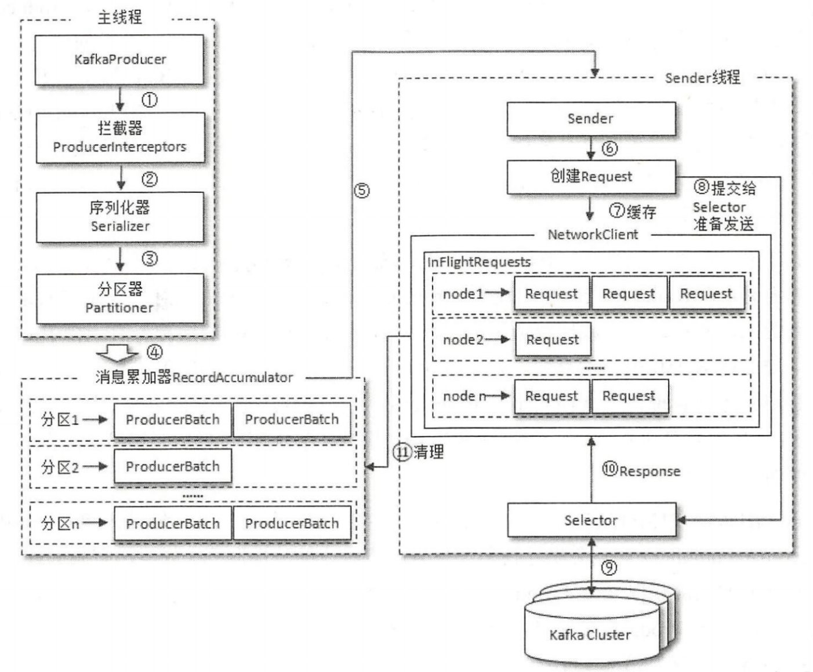

一个生产者客户端由两个线程协调运行，这两个线程分别为**主线程**和 **Sender** 线程 。

在主线程中由kafkaProducer创建消息，然后通过可能的拦截器、序列化器和分区器的作用之后缓存到消息累加器（RecordAccumulator, 也称为消息收集器）中。&#x20;

**Sender&#x20;**&#x7EBF;程负责从RecordAccumulator 获取消息并将其发送到 Kafka 中；

RecordAccumulator主要用来缓存消息以便Sender 线程可以批量发送，进而减少网络传输的资源消耗以提升性能。RecordAccumulator缓存的大小可以通过生产者客户端参数buffer.memory 配置，默认值为 33554432B ，即32M。如果生产者发送消息的速度超过发送到服务器的速度，则会导致生产者空间不足，这个时候 KafkaProducer.send（）方法调用要么被阻塞，要么抛出异常，这个取决于参数 max.block.ms 的配置，此参数的默认值为 60000,即60秒。

主线程中发送过来的消息都会被迫加到 RecordAccumulator 的某个双端队列（ Deque ）中，

RecordAccumulator内部为每个分区都维护了一个双端队列，即Deque\<ProducerBatch>。

消息写入缓存时，追加到双端队列的尾部;

Sender读取消息时，从双端队列的头部读取。注意：ProducerBatch 是指一个消息批次；

与此同时，会将较小的 ProducerBatch 凑成一个较大 ProducerBatch ，也可以减少网络请求的次数以提升整体的吞吐量。

ProducerBatch 大小和 batch.size 参数也有着密切的关系。当一条消息（ProducerRecord ) 流入 RecordAccumulator 时，会先寻找与消息分区所对应的双端队列（如果没有则新建），再从这个双端队列的尾部获取一个ProducerBatch （如果没有则新建），查看 ProducerBatch中是否还可以写入这个ProducerRecord，如果可以写入，如果不可以则需要创建一个新的Producer Batch。在新建 ProducerBatch时评估这条消息的大小是否超过 batch.size 参数大小，如果不超过，那么就以 batch.size 参数的大小来创建 ProducerBatch。

如果生产者客户端需要向很多分区发送消息， 则可以将buffer.memory参数适当调大以增加整体的吞吐量。

**Sender从 RecordAccumulator 获取缓存的消息之后，会进一步将<分区,Deque\<Producer Batch>>的形式转变成\<Node,List< ProducerBatch>的形式，**&#x5176;中Node表示Kafka集群broker节点。对于网络连接来说，生产者客户端是与具体broker节点建立的连接，也就是向具体的broker节点发送消息，而并不关心消息属于哪一个分区；而对于KafkaProducer的应用逻辑而言，我们只关注向哪个分区中发送哪些消息，所以在这里需要做一个应用逻辑层面到网络I/O层面的转换。

在转换成\<Node, List\<ProducerBatch>>的形式之后， Sender会进一步封装成\<Node,Request> 的形式，这样就可以将 Request 请求发往各个Node了，这里的Request是Kafka各种协议请求；

请求在从sender线程发往Kafka之前还会保存到InFlightRequests中，InFlightRequests保存对象的具体形式为 Map\<Nodeld, Deque\<request>>，它的主要作用是缓存了已经发出去但还没有收到服务端响应的请求（Nodeld 是一个 String 类型，表示节点的 id 编号）。与此同时，InFlightRequests 还提供了许多管理类的方法，并且通过配置参数还可以限制每个连接（也就是客户端与 Node之间的连接）最多缓存的请求数。这个配置参数为 max.in.flight.request.per. connection ，默认值为5，即每个连接最多只能缓存5个未响应的请求，超过该数值之后就不能再向这个连接发送更多的请求了，除非有缓存的请求收到了响应（ Response ）。通过比较 Deque\<Request> 的size与这个参数的大小来判断对应的 Node中是否己经堆积了很多未响应的消息，如果真是如此，那么说明这个 Node 节点负载较大或网络连接有问题，再继续发送请求会增大请求超时的可能。

### 9.1.3 Producer往Broker发送消息应答机制

kafka 在 producer 里面提供了**消息确认机制**。我们可以通过配置来决定消息发送到对应分区的几个副本才算消息发送成功。可以在构造producer 时通过acks参数指定（在 0.8.2.X 前是通过 request.required.acks 参数设置的）。这个参数支持以下三种值：

**根据实际的应用场景，我们设置不同的 acks，以此保证数据的可靠性。**

| acks   | 含义                                                                                             |
| ------ | ---------------------------------------------------------------------------------------------- |
| 0      | Producer往集群发送数据不需要等到集群的确认信息，不确保消息发送成功。安全性最低但是效率最高。                                             |
| 1      | Producer往集群发送数据只要 leader成功写入消息就可以发送下一条，只确保Leader 接收成功。                                         |
| -1或all | Producer往集群发送数据需要所有的ISR Follower 都完成从 Leader 的同步才会发送下一条，确保 Leader发送成功和所有的副本都成功接收。安全性最高，但是效率最低。 |

生产者将acks设置为all，是否就一定不会丢数据呢？

否！如果在某个时刻ISR列表只剩leader自己了，那么就算acks=all，收到这条数据还是只有一个节点；

可以配合另外一个参数缓解此情况： 最小同步副本数>=2

BROKER端参数：  min.insync.replicas（默认1）

### 9.1.4 重要的生产者参数

* **acks**

acks是控制kafka服务端向生产者**应答消息写入成功的条件**；

生产者根据得到的确认信息，来判断消息发送是否成功；

这个参数用来限制生产者客户端能发送的消息的最大值，默认值为 1048576B ，即 lMB

一般情况下，这个默认值就可以满足大多数的应用场景了。

这个参数还涉及一些其它参数的联动，比如 broker 端（topic级别参数）的 message.max.bytes 参数（默认1000012），如果配置错误可能会引起一些不必要的异常；比如将 broker 端的 message.max.bytes 参数配置为10 ，而 max.request.size参数配置为20，那么当发送一条大小为 15B 的消息时，生产者客户端就会报出异常；

retries参数用来配置生产者重试的次数，默认值为0，即在发生异常的时候不进行任何重试动作。

消息在从生产者发出到成功写入服务器之前可能发生一些临时性的异常，比如网络抖动、 leader 副本的选举等，这种异常往往是可以自行恢复的，生产者可以通过配置 retries大于0的值，以此通过内部重试来恢复而不是一味地将异常抛给生产者的应用程序。如果重试达到设定的次数，那么生产者就会放弃重试并返回异常。

重试还和另一个参数 retry.backoff.ms 有关，这个参数的默认值为100，它用来设定两次重试之间的时间间隔，避免无效的频繁重试。

如果将 retries参数配置为非零值，并且 max .in.flight.requests.per.connection 参数配置为大于1的值，那**可能会出现错序的现象：如果批次1消息写入失败，而批次2消息写入成功，那么生产者会重试发送批次1的消息，此时如果批次1的消息写入成功，那么这两个批次的消息就出现了错序。**

对于某些应用来说，顺序性非常重要 ，比如MySQL binlog的传输，如果出现错误就会造成非常严重的后果；

一般而言，在需要保证消息顺序的场合建议把参数max.in.flight.requests.per.connection 配置为1 ，而不是把retries配置为0，不过这样也会影响整体的吞吐。

这个参数用来指定消息的压缩方式，默认值为“none "，即默认情况下，消息不会被压缩。

该参数还可以配置为 "gzip"，"snappy" 和 "lz4"。

对消息进行压缩可以极大地减少网络传输、降低网络I/O，从而提高整体的性能 。

消息压缩是一种以时间换空间的优化方式，如果对时延有一定的要求，则不推荐对消息进行压缩；

每个Batch要存放batch.size大小的数据后，才可以发送出去。比如说batch.size默认值是16KB，那么里面凑够16KB的数据才会发送。

理论上来说，提升batch.size的大小，可以允许更多的数据缓冲在recordAccumulator里面，那么一次Request发送出去的数据量就更多了，这样吞吐量可能会有所提升。

但是batch.size也不能过大，要是数据老是缓冲在Batch里迟迟不发送出去，那么发送消息的延迟就会很高。

一般可以尝试把这个参数调节大些，利用生产环境发消息负载测试一下。

这个参数用来指定生产者发送 ProducerBatch 之前等待更多消息（ ProducerRecord ）加入

ProducerBatch 时间，默认值为0。

生产者客户端会在ProducerBatch填满或等待时间超过linger.ms 值时发送出去。

**增大这个参数的值会增加消息的延迟，但是同时能提升一定的吞吐量。&#x20;**

* **enable.idempotence&#x20;**

是否开启幂等性功能，详见后续原理加强；

**幂等性，就是一个操作重复做，也不会影响最终的结果！**

int a = 1;

a++;  // 非幂等操作 &#x20;

val map = new HashMap()

map.put(“a”,1);  // 幂等操作 &#x20;

在kafka中，同一条消息，生产者如果多次重试发送，在服务器中的结果如果还是只有一条，这就是具备幂等性；否则，就不具备幂等性！

用来指定分区器，默认：org.apache.kafka.internals.DefaultPartitioner&#x20;

默认分区器的分区规则： &#x20;

自定义partitioner需要实现org.apache.kafka.clients.producer.Partitioner接口

***

消费者组的意义何在？

为了提高数据处理的并行度！

会触发rebalance的事件可能是如下任意一种：

* 有新的消费者加入消费组。

  * 有消费者宕机下线，消费者并不一定需要真正下线，例如遇到长时间的 GC 、网络延迟导致消费者长时间未向GroupCoordinator发送心跳等情况时，GroupCoordinator 会认为消费者己下线。

  * 有消费者主动退出消费组（发送LeaveGroupRequest 请求）：比如客户端调用了unsubscrible()方法取消对某些主题的订阅。

  * 消费组所对应的 GroupCoorinator节点发生了变更。

  * 消费组内所订阅的任一主题或者主题的分区数量发生变化。

**将分区的消费权从一个消费者移到另一个消费者称为再均衡（rebalance）**，如何rebalance也涉及到分区分配策略。

kafka有两种的分区分配策略：**range（默认）** 和 **round robin（新版本中又新增了另外2种）**

我们可以通过partition.assignment.strategy参数选择 range 或 roundrobin。

partition.assignment.strategy参数默认的值是range。

partition.assignment.strategy=org.apache.kafka.clients.consumer.RoundRobinAssignor

partition.assignment.strategy=org.apache.kafka.clients.consumer.RangeAssignor

这个参数属于“消费者”参数！

### 9.1.5 Range Strategy

* 先将消费者按照client.id字典排序，然后按topic逐个处理；

* 针对一个topic，将其partition总数/消费者数得到 商n和 余数m，则每个consumer至少分到n个分区，且前m个consumer每人多分一个分区；

举例说明2：假设有TOPIC\_A有5个分区，由3个consumer（C1,C2,C3）来消费；

5/3得到商1，余2，则每个消费者至少分1个分区，前两个消费者各多1个分区

C1: 2个分区，C2:2个分区,C3:1个分区

接下来，就按照“区间”进行分配：

C1:   TOPIC\_A-0  TOPIC\_A-1 &#x20;

C2 :   TOPIC\_A-2  TOPIC\_A\_3

C2:   TOPIC\_A-4

举例说明2：假设TOPIC\_A有5个分区，TOPIC\_B有3个分区，由2个consumer（C1,C2）来消费

5/2得到商2，余1，则C1有3个分区，C2有2个分区，得到结果

C1: TOPIC\_A-0   TOPIC\_A-1  TOPIC\_A-2

C2: TOPIC\_A-3   TOPIC\_A-4

3/2得到商1，余1，则C1有2个分区，C2有1个分区，得到结果

C1: TOPIC\_B-0  TOPIC\_B-1

C2: TOPIC\_B-2

C1: TOPIC\_A-0   TOPIC\_A-1  TOPIC\_A-2   TOPIC\_B-0  TOPIC\_B-1

C2: TOPIC\_A-3   TOPIC\_A-4  TOPIC\_B-2

### 9.1.6 Round-Robin Strategy

* 将所有主题分区组成TopicAndPartition列表，并对TopicAndPartition列表按照其hashCode 排序

* 然后，以轮询的方式分配给各消费者

以上述“例2”来举例：

TOPIC\_A-0  TOPIC\_B-0  TOPIC\_A-1  TOPIC\_A-2   TOPIC\_B-1 TOPIC\_A-3  TOPIC\_A-4  TOPIC\_B-2

C1:  TOPIC\_A-0  TOPIC\_A-1  TOPIC\_B-1  TOPIC\_A-4

C2:  TOPIC\_B-0  TOPIC\_A-2  TOPIC\_A-3  TOPIC\_B-2

### 9.1.7 Sticky Strategy

对应的类叫做： org.apache.kafka.clients.consumer.StickyAssignor

sticky策略的特点：

再均衡的过程中，还是会让各消费者先取消自身的分区，然后再重新分配（只不过是分配过程中会尽量让原来属于谁的分区依然分配给谁）

### 9.1.8 Cooperative Sticky Strategy

对应的类叫做： org.apache.kafka.clients.consumer.ConsumerPartitionAssignor

sticky策略的特点：

消费组在消费数据的时候，有两个角色进行组内的各事务的协调；

角色1： Group Coordinator （组协调器） 位于服务端（就是某个broker）

角色2： Group Leader （组长） 位于消费端（就是消费组中的某个消费者）

### 9.1.9 GroupCoordinator介绍

每个消费组在服务端对应一个GroupCoordinator其进行管理，GroupCoordinator是Kafka服务端中用于管理消费组的组件。

消费者客户端中由ConsumerCoordinator组件负责与GroupCoordinator行交互；

ConsumerCoordinator和**GroupCoordinator最重要的职责就是负责执行消费者rebalance操作**

### 9.1.10 再均衡流程

&#x20; eager协议的再均衡过程整体流程如下图：

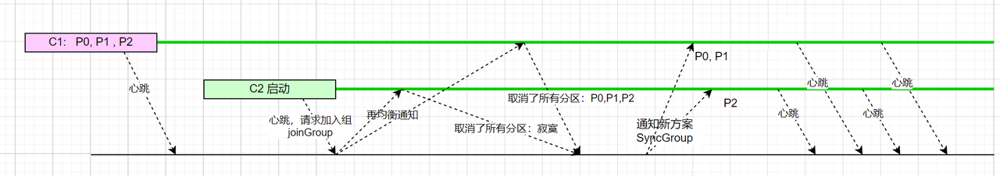

特点：再均衡发生时，所有消费者都会停止工作，等待新方案的同步

&#x20; Cooperative协议的再均衡过程整体流程如下图：

特点：cooperative把原来eager协议的一次性全局再均衡，化解成了多次的小均衡，并最终达到全局均衡的收敛状态

### 9.1.11 eager协议再均衡步骤细节

#### 阶段1：定位 Group Coordinator

coordinator在我们组记偏移量的\_\_consumer\_offsets分区的leader所在broker上

查找Group Coordinator的方式：

Utils.abc(groupId.hashCode) % groupMetadataTopicPartitionCount

groupMetadataTopicPartitionCount为\_\_consumer\_offsets的分区总数，这个可以通过broker端参数offset.topic.num.partitions来配置，默认值是50；

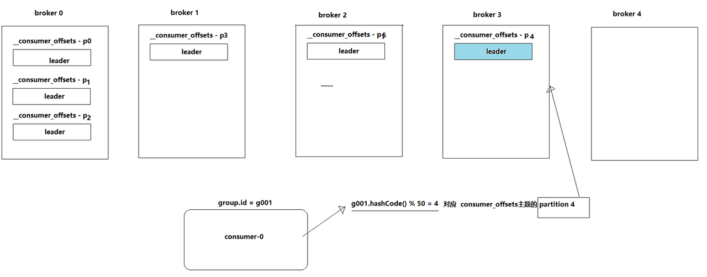

#### 阶段2：加入组Join The Group

* 此阶段的重要操作之1：**选举消费组的leader**

private val members = new mutable.HashMap\[String, MemberMetadata]&#x20;

var leaderid = members.keys.head

**消费组leader的选举，策略就是：随机！**

最终选举的分配策略基本上可以看作被各个消费者支持的最多的策略，具体的选举过程如下：

（1）收集各个消费者支持的所有分配策略，组成候选集candidates

（2）每个消费者从候选集candidates找出第一个自身支持的策略，为这个策略投上一票。

（3）计算候选集中各个策略的选票数，选票数最多的策略即为当前消费组的分配策略。

其实，此逻辑并不需要consumer来执行，而是由Group Coordinator来执行

#### 阶段3：组信息同步SYNC Group

此阶段，主要是由消费组leader将分区分配方案，通过Group Coordinator来转发给组中各消费者

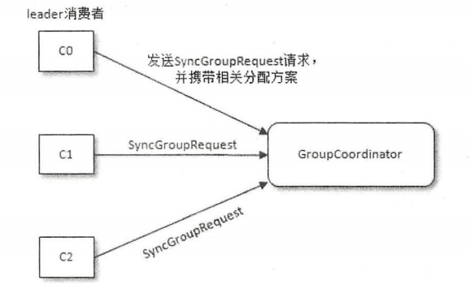

#### 阶段4：心跳联系HEART BEAT

进入这个阶段之后，消费组中的所有消费者就会处于正常工作状态。

各消费者在消费数据的同时，保持与Group Coordinator的心跳通信；

消费者的心跳间隔时间由参数 heartbeat.interval.ms指定，默认值为 3000 ，即这个参数必须比 session.timeout.ms 参数设定的值要小；一般情况下 heartbeat.interval.ms的配置值不能超过 session.timeout.ms 配置值的1/3 。这个参数可以调整得更低，以控制正常重新平衡的预期时间；

如果一个消费者发生崩溃，并停止读取消息，那么GroupCoordinator 会等待一小段时间确认这个消费者死亡之后才会触发再均衡。在这一小段时间内，死掉的消费者并不会读取分区里的消息。

这个一小段时间由 session.timeout. ms 参数控制，该参数的配置值必须在broker端参数 group.min.session.timeout. ms （默认值为 6000 ，即6秒）和 group.max.session. timeout. ms （默认值为 300000 ，即5分钟）允许的范围内。

### 9.1.12 再均衡监听器

如果想控制消费者在发生再均衡时执行一些特定的工作，可以通过订阅主题时注册“再均衡监听器”来实现；

场景举例：在发生再均衡时，处理消费位移

如果A消费者消费掉的一批消息还没来得及提交offset，而它所负责的分区在rebalance中转移给了B消费者，则有可能发生数据的重复消费处理。此情形下，可以通过再均衡监听器做一定程度的补救；

代码示例

/\*\*
&#x20;\* 再均衡处理
&#x20;\*/
consumer.subscribe(Collections.singletonList("tpc\_5"), new ConsumerRebalanceListener() {
&#x20;   // 被取消旧分区后被调用
&#x20;   @Override
&#x20;   public void onPartitionsRevoked(Collection\<TopicPartition> collection) {
&#x20;       // store the current offset to db
&#x20;   }
​
&#x20;   // 分配到新的分区后被调用
&#x20;   @Override
&#x20;   public void onPartitionsAssigned(Collection\<TopicPartition> collection) {
&#x20;       // fetch the current offset from db
&#x20;   }
});

***

CAP理论作为分布式系统的基础理论,它描述的是一个分布式系统在以下三个特性中：

最多满足其中的两个特性。也就是下图所描述的。分布式系统要么满足CA，要么CP，要么AP。无法同时满足CAP。

分区容错性：指的分布式系统中的某个节点或者网络分区出现了故障的时候，整个系统仍然能对外提供满足一致性和可用性的服务。也就是说部分故障不影响整体使用。

事实上我们在设计分布式系统是都会考虑到bug,硬件，网络等各种原因造成的故障，所以即使部分节点或者网络出现故障，我们要求整个系统还是要继续使用的

(不继续使用,相当于只有一个分区,那么也就没有后续的一致性和可用性了)

 

可用性：一直可以正常的做读写操作。简单而言就是客户端一直可以正常访问并得到系统的正常响应。用户角度来看就是不会出现系统操作失败或者访问超时等问题。

 

一致性：在分布式系统完成某写操作后任何读操作，都应该获取到该写操作写入的那个最新的值。相当于要求分布式系统中的各节点时时刻刻保持数据的一致性。

Kafka 作为一个商业级消息中间件，数据可靠性和可用性是优先考虑的重点，兼顾数据一致性；

### 9.1.13 分区副本机制

**kafka 从 0.8.0 版本开始引入了分区副本**；**引入了数据冗余**

用CAP理论来说，就是通过副本及副本leader动态选举机制提高了kafka的 **分区容错性**和**可用性**

但从而也带来了数据一致性的巨大困难！

### 9.1.14 分区副本的数据一致性困难

kafka让分区多副本同步的基本手段是： follower副本定期向leader请求数据同步！

既然是定期同步，则leader和follower之间必然存在各种数据不一致的情景！

**&#x20; 问题1：分区副本间动态不一致**

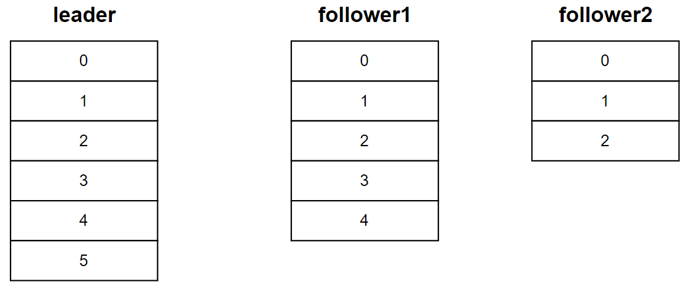

**&#x20; 问题2：消费者所见不一致**

如果此时leader宕机，follower1或follower2被选为新的leader，则leader换届前后，消费者所能读取到的数据发生了不一致；

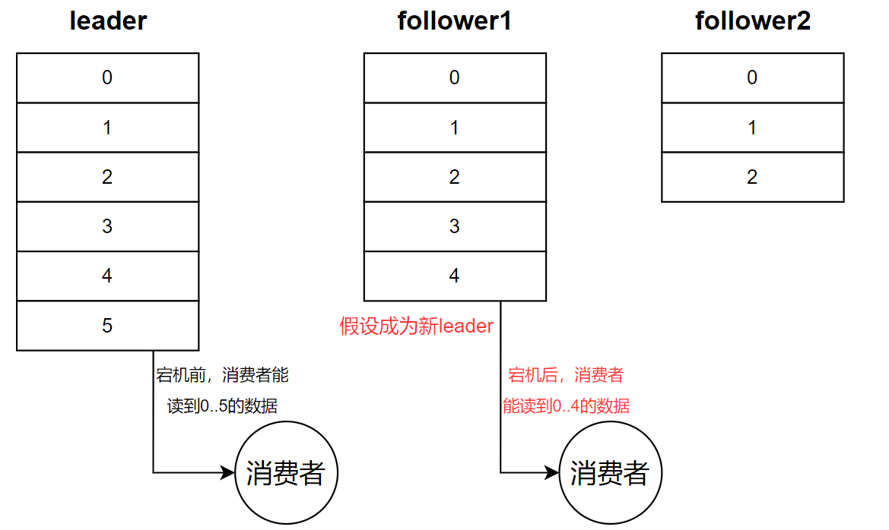

**&#x20; 问题3：分区副本间最终不一致**

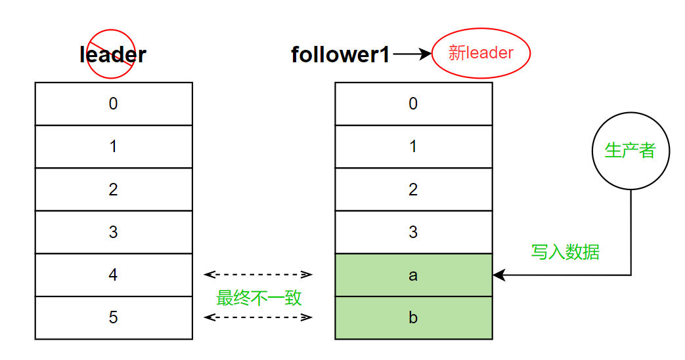

### 9.1.15 一致性问题解决方案（HW）

动态过程中的副本数据不一致，是很难解决的；

kafka先尝试着解决上述“消费者所见不一致”及“副本间数据最终不一致”的问题；

**&#x20; 解决方案的核心思想**

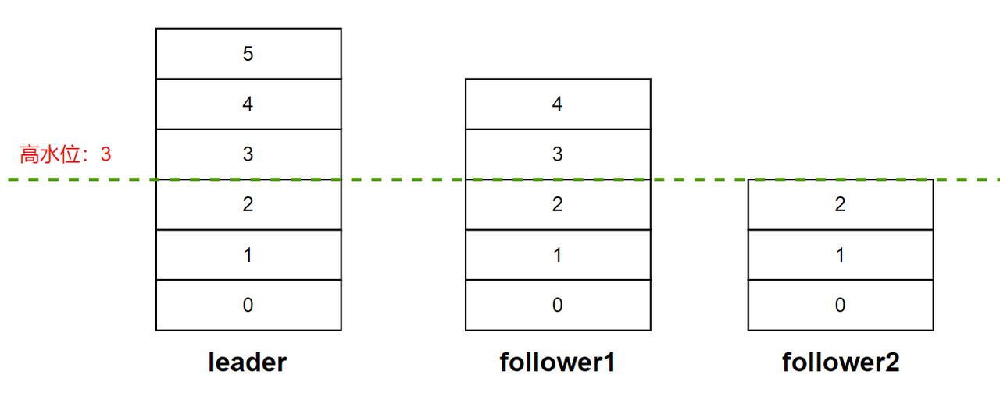

（如上图所示：offset\<hw:3 的message，是所有副本都已经备份好的数据）

**&#x20; 解决“消费者所见不一致” （消费者只允许看到HW以下的message）**

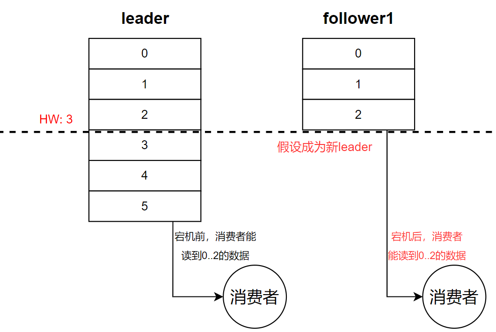

**&#x20; 解决“分区副本数据最终不一致” （follower数据按HW截断）**

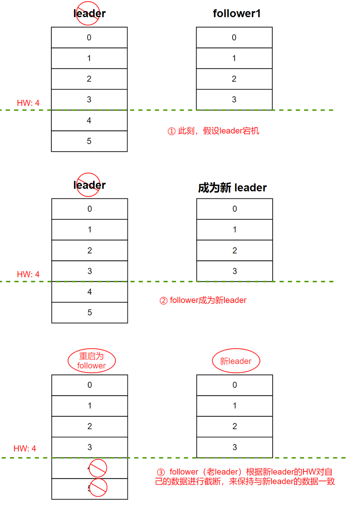

### 9.1.16 HW方案的天生缺陷

如前所述，看似HW解决了“分区数据最终不一致”的问题，以及“消费者所见不一致”的问题，但其实，这里面存在一个巨大的隐患，导致：

产生如上结果的根源是：HW高水位线的更新，与数据同步的进度，存在迟滞！

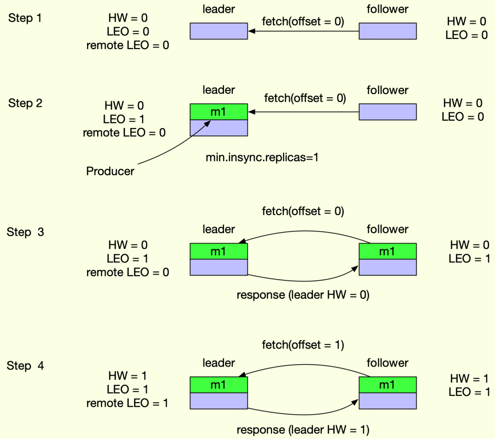

Step 1：leader 和 follower 副本处于初始化值，follower 副本发送 fetch 请求，由于 leader 副本没有数据，因此不会进行同步操作；

Step 2：生产者发送了消息 m1 到分区 leader 副本，写入该条消息后 leader 更新 LEO = 1；

Step 3：follower 发送 fetch 请求，携带当前最新的 offset = 0，leader 处理 fetch 请求时，更新 remote LEO = 0，对比 LEO 值最小为 0，所以 HW = 0，leader 副本响应消息数据及 leader HW = 0 给 follower，follower 写入消息后，更新 LEO 值，同时对比 leader HW 值，取最小的作为新的 HW 值，此时 follower HW = 0，这也意味着，follower HW 是不会超过 leader HW 值的。

Step 4：follower 发送第二轮 fetch 请求，携带当前最新的 offset = 1，leader 处理 fetch 请求时，更新 remote LEO = 1，对比 LEO 值最小为 1，所以 HW = 1，此时 leader 没有新的消息数据，所以直接返回 leader HW = 1 给 follower，follower 对比当前最新的 LEO 值 与 leader HW 值，取最小的作为新的 HW 值，此时 follower HW = 1。

从以上步骤可看出，leader 中保存的 **remote LEO 值的更新（也即HW的更新）总是需要额外一轮 fetch RPC 请求才能完成**，这意味着在 leader 切换过程中，会存在数据丢失以及数据不一致的问题！

### 9.1.17 HW会产生数据丢失和副本最终不一致问题

**&#x20; 数据丢失的问题（即使produce设置acks=all，依然会发生）**

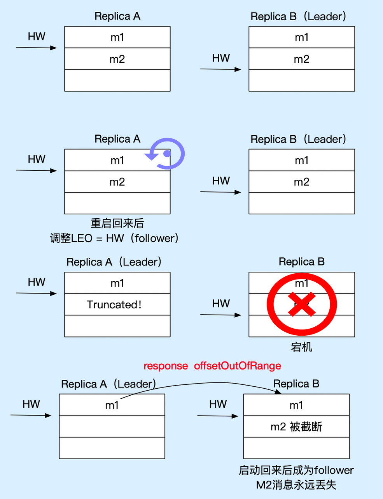

*注意回顾：leader 中的 HW 值是在 follower 下一轮 fetch RPC 请求中完成更新的*

如上图所示：

**&#x20; 副本间数据最终不一致的问题（即使produce设置acks=all，依然会发生）**

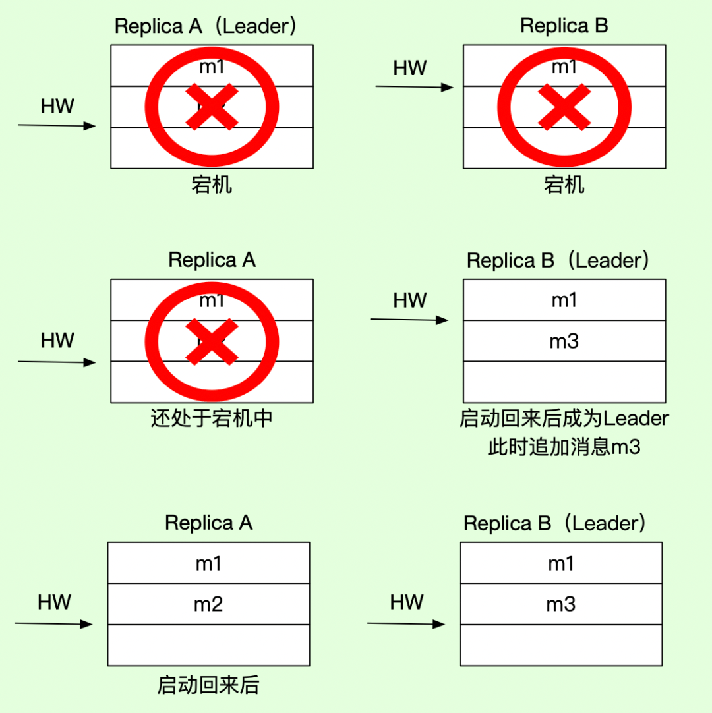

如上图所示：

*只要新一届leader在老leader重启上线前，接收了新的数据，就可能发生上图中的场景，根源也在于HW的更新落后于数据同步进度*

### 9.1.18 Leader-Epoch机制的引入

为了解决 HW 更新时机是异步延迟的，而 HW 又是决定日志是否备份成功的标志，从而造成数据丢失和数据不一致的现象，Kafka 引入了 leader epoch 机制；

在每个副本日志目录下都创建一个 leader-epoch-checkpoint 文件，用于保存 leader 的 epoch 信息；

**&#x20; leader-epoch的含义**

如下，leader epoch 长这样：

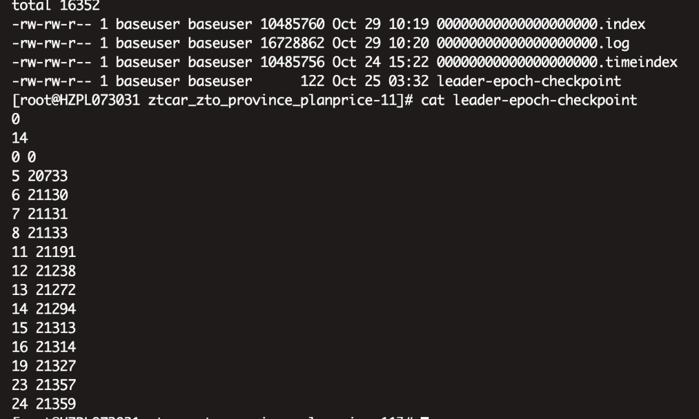

它的格式为 (epoch offset)，epoch指的是 leader 版本，它是一个单调递增的一个正整数值，每次 leader 变更，epoch 版本都会 +1，offset 是每一代 leader 写入的第一条消息的位移值，比如：

(0,0)

(1,300)

以上第2个版本是从位移300开始写入消息，意味着第一个版本写入了 0-299 的消息。

**&#x20; leader epoch 具体的工作机制**

会首先更新leader epoch 以及LEO ，并添加到 leader-epoch-checkpoint 文件中；

发送LeaderEpochRequest请求给leader副本，该请求包括了follower中最新的epoch 版本；

leader返回给follower的响应中包含了一个LastOffset，如果 follower last epoch = leader last epoch（纪元相同），则 LastOffset = leader LEO，否则取follower last epoch 中最小的 leader epoch 的 start offset 值；&#x20;

举个例子：假设 follower last epoch = 1，此时 leader 有 (1, 20) (2, 80) (3, 120)，则 LastOffset = 80；

follower 拿到 LastOffset 之后，会对比当前 LEO 值是否大于 LastOffset，如果当前 LEO 大于 LastOffset，则从 LastOffset 截断日志；

follower 开始发送 fetch 请求给 leader 保持消息同步。

**&#x20; leader epoch 如何解决HW的备份缺陷**

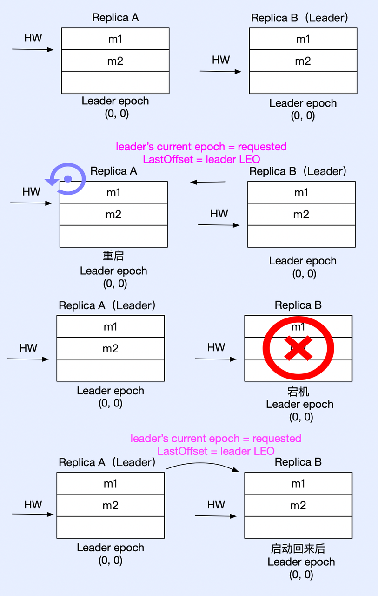

如上图所示：

A 重启之后，发送 LeaderEpochRequest 请求给 B，由于 B 还没追加消息，此时 epoch = request epoch = 0，因此返回 LastOffset = leader LEO = 2 给 A

A 拿到 LastOffset 之后，发现等于当前 LEO 值，故不用进行日志截断。就在这时 B 宕机了，A 成为 leader，在 B 启动回来后，会重复 A 的动作，同样不需要进行日志截断，数据没有丢失。

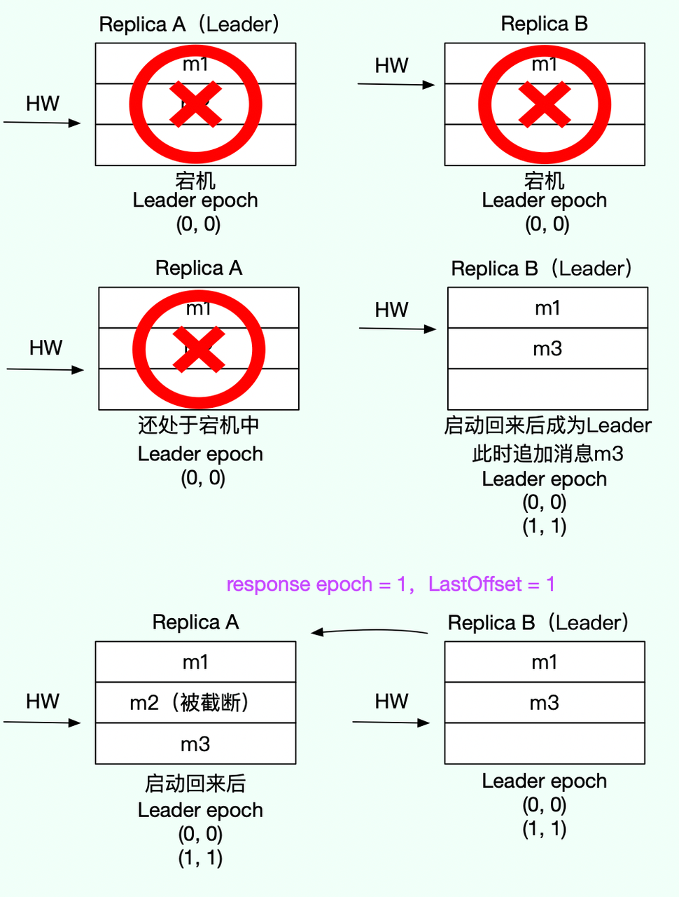

如上图所示:

### 9.1.19 LEO/HW/LSO等相关术语速查

LEO:（last end offset）**就是该副本中消息的最大偏移量的值+1** ；

**HW:（high watermark）各副本中LEO的最小值。这个值规定了消费者仅能消费HW之前的数据；**

LW：（low watermark）一个副本的log中，最小的消息偏移量；

LSO：（last stable offset） 最后一个稳定的offset；对未完成的事务而言，LSO 的值等于事务中第一条消息的位置(firstUnstableOffset)，对已完成的事务而言，它的值同 HW 相同；

**LEO与HW 与数据一致性密切相关；**

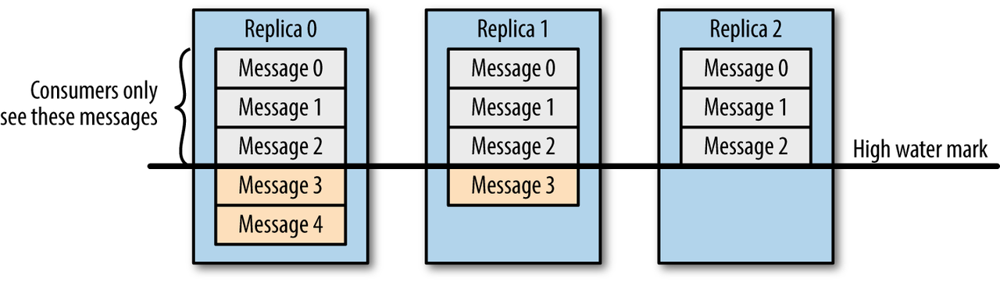

如图，各副本中最小的LEO是3，所以HW是3，所以，消费者此刻最多能读到Msg2;

***

### 9.1.20 不清洁选举\[了解]

不清洁选举，是指允许“非ISR副本”可以被选举为leader；非ISR副本被选举为leader，将极大增加数据丢失及数据不一致的可能性！由参数 unclean.leader.election.enable=false（默认） 控制；

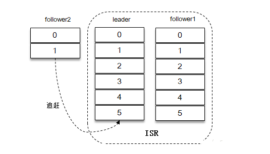

* 此刻，所有ISR副本宕机：

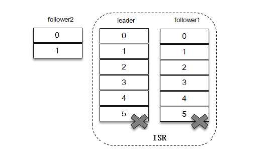

* Follower2成为新的leader，并接收数据

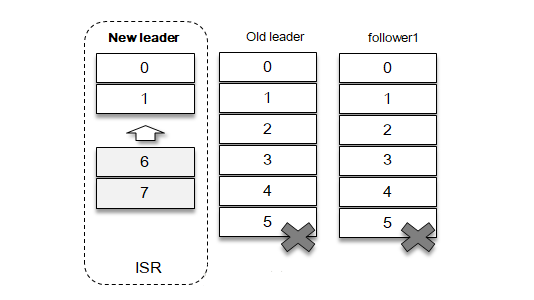

* 之前宕机副本重启，按照最新leader的最新leo进行截断，产生数据丢失及不一致

***

Kafka 0.11.0.0 版本开始引入了**幂等性**与**事务**这两个特性，以此来实现 EOS ( exactly once&#x20;

semantics ，精确一次处理语义）

生产者在进行发送失败后的重试时（retries），有可能会重复写入消息，而**使用 Kafka幂等性功能之后就可以避免这种情况**。

开启幂等性功能，只需要显式地将生产者参数 enable.idempotence设置为 true （默认值为 false）：

props.put("enable.idempotence",true);

在开启幂等性功能时，如下几个参数必须正确配置：

如有违反，则会抛出ConfigException异常；

### 9.1.21 kafka幂等性实现机制

1）每一个producer在初始化时会生成一个producer\_id，并为每个目标分区维护一&#x4E2A;**“消息序列号”**；

2）producer每发送一条消息，会将\<producer\_id,分区>对应的“序列号”加1

3）broker端会为每一对{producer\_id,分区}维护一个序列号，对于每收到的一条消息，会判断服务端的SN\_OLD和接收到的消息中的SN\_NEW进行对比：

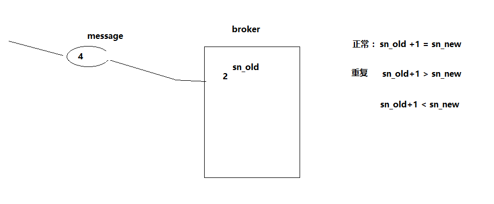

producer.send(“aaa”)   消息aaa就拥有了一个唯一的序列号

如果这条消息发送失败，producer内部自动重试（retry），此时序列号不变；

producer.send(“bbb”)   消息bbb拥有一个新的序列号

注意：kafka只保证producer单个会话中的单个分区幂等；

主要原理： 开始事务-->发送一个ControlBatch消息（事务开始）

&#x20;          提交事务-->发送一个ControlBatch消息（事务提交）

&#x20;          放弃事务-->发送一个ControlBatch消息（事务终止）

Properties props = new Properties();
props.setProperty(ProducerConfig.BOOTSTRAP\_SERVERS\_CONFIG,"doit01:9092");
props.setProperty(ProducerConfig.KEY\_SERIALIZER\_CLASS\_CONFIG, StringSerializer.class.getName());
props.setProperty(ProducerConfig.VALUE\_SERIALIZER\_CLASS\_CONFIG, StringSerializer.class.getName());
​
// acks
props.setProperty(ProducerConfig.ACKS\_CONFIG,"-1");
// 生产者的重试次数
props.setProperty(ProducerConfig.RETRIES\_CONFIG,"3");
// 飞行中的请求缓存最大数量
props.setProperty(ProducerConfig.MAX\_IN\_FLIGHT\_REQUESTS\_PER\_CONNECTION,"3");
// 开启幂等性
props.setProperty(ProducerConfig.ENABLE\_IDEMPOTENCE\_CONFIG,"true");
// 设置事务id
props.setProperty(ProducerConfig.TRANSACTIONAL\_ID\_CONFIG,"trans\_001");

***

// 初始化事务
producer.initTransaction( )
// 开启事务    
producer.beginTransaction( )
**try{**    
// 干活
​
// 提交事务
producer.commitTransaction( )

***

}catch (Exception e){
// 异常回滚（放弃事务）
producer.abortTransaction( )

***

}

***

消费者api是会拉取到尚未提交事务的数据的；只不过可以选择是否让用户看到！

是否让用户看到未提交事务的数据，可以通过消费者参数来配置：

isolation.level=read\_uncommitted（默认值）

isolation.level=read\_committed

用户的程序，要从kafka读取源数据，数据处理的结果又要写入kafka

kafka能实现端到端的事务控制（比起上面的“基础”事务，多了一个功能，通过producer可以将consumer的消费偏移量绑定到事务上提交）

producer.sendOffsetsToTransaction(offsets,consumer\_id)

***

### 9.1.22 事务api示例

为了实现事务，应用程序必须提供唯一**transactional.id**，并且开启生产者的**幂等性**

properties.put ("transactional.id","transactionid00001");

properties.put ("enable.idempotence",true);

kafka生产者中提供的关于事务的方法如下：

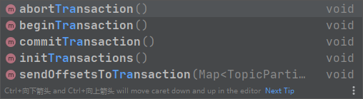

**“消费kafka-处理-生产结果到kafka”典型场景下的代码结构示例：**

package cn.doitedu.kafka.transaction;
​
import org.apache.kafka.clients.consumer.\*;
import org.apache.kafka.clients.producer.KafkaProducer;
import org.apache.kafka.clients.producer.ProducerConfig;
import org.apache.kafka.clients.producer.ProducerRecord;
import org.apache.kafka.common.TopicPartition;
import org.apache.kafka.common.serialization.StringDeserializer;
import org.apache.kafka.common.serialization.StringSerializer;
​
import java.time.Duration;
import java.util.\*;
​
/\*\*\*
&#x20;\* @author hunter.d
&#x20;\* @qq 657270652
&#x20;\* @wx haitao-duan
&#x20;\* @date 2020/11/15
&#x20;\*\*/
public class TransactionDemo {
&#x20;   public static void main(String\[] args) {
​
&#x20;       Properties props\_p = new Properties();
&#x20;       props\_p.setProperty(ProducerConfig.BOOTSTRAP\_SERVERS\_CONFIG,"doitedu01:9092,doitedu02:9092");
&#x20;       props\_p.setProperty(ProducerConfig.KEY\_SERIALIZER\_CLASS\_CONFIG, StringSerializer.class.getName());
&#x20;       props\_p.setProperty(ProducerConfig.VALUE\_SERIALIZER\_CLASS\_CONFIG,StringSerializer.class.getName());
&#x20;       props\_p.setProperty(ProducerConfig.TRANSACTIONAL\_ID\_CONFIG,"tran\_id\_001");

&#x20;       Properties props\_c = new Properties();
&#x20;       props\_c.put(ConsumerConfig.KEY\_DESERIALIZER\_CLASS\_CONFIG, StringDeserializer.class.getName());
&#x20;       props\_c.put(ConsumerConfig.VALUE\_DESERIALIZER\_CLASS\_CONFIG, StringDeserializer.class.getName());
&#x20;       props\_c.put(ConsumerConfig.BOOTSTRAP\_SERVERS\_CONFIG, "doitedu01:9092,doitedu02:9092");
&#x20;       props\_c.put(ConsumerConfig.GROUP\_ID\_CONFIG, "groupid01");
&#x20;       props\_c.put(ConsumerConfig.CLIENT\_ID\_CONFIG, "clientid");
&#x20;       props\_c.put(ConsumerConfig.AUTO\_OFFSET\_RESET\_CONFIG,"earliest");
​
&#x20;       // 构造生产者和消费者
&#x20;       KafkaProducer\<String, String> p = new KafkaProducer\<String, String>(props\_p);
&#x20;       KafkaConsumer\<String, String> c = new KafkaConsumer\<String, String>(props\_c);
&#x20;       c.subscribe(Collections.singletonList("tpc\_5"));
​
&#x20;       // 初始化事务
&#x20;       p.initTransactions();
​
&#x20;       // consumer-transform-produce 模型业务流程
&#x20;       while(true){
&#x20;           // 拉取消息
&#x20;           ConsumerRecords\<String, String> records = c.poll(Duration.ofMillis(1000L));
&#x20;           if(!records.isEmpty()){
&#x20;               // 准备一个hashmap来记录："分区-消费位移" 键值对
&#x20;               HashMap\<TopicPartition, OffsetAndMetadata> offsetsMap = new HashMap<>();
&#x20;               // 开启事务
&#x20;               p.beginTransaction();
&#x20;               try {
&#x20;                   // 获取本批消息中所有的分区
&#x20;                   Set\<TopicPartition> partitions = records.partitions();
&#x20;                   // 遍历每个分区
&#x20;                   for (TopicPartition partition : partitions) {
&#x20;                       // 获取该分区的消息
&#x20;                       List\<ConsumerRecord\<String, String>> partitionRecords = records.records(partition);
&#x20;                       // 遍历每条消息
&#x20;                       for (ConsumerRecord\<String, String> record : partitionRecords) {
&#x20;                           // 执行数据的业务处理逻辑
&#x20;                           ProducerRecord\<String, String> outRecord = new ProducerRecord<>("tpc\_sink", record.key(), record.value().toUpperCase());
&#x20;                           // 将处理结果写入kafka
&#x20;                           p.send(outRecord);
&#x20;                       }
​
&#x20;                       // 将处理完的本分区对应的消费位移记录到 hashmap中
&#x20;                       long offset = partitionRecords.get(partitionRecords.size() - 1).offset();
&#x20;                       offsetsMap.put(partition,new OffsetAndMetadata(offset+1));
&#x20;                   }
​
&#x20;                   // 向事务管理器提交消费位移
&#x20;                   p.sendOffsetsToTransaction(offsetsMap,"groupid");
&#x20;                   // 提交事务
&#x20;                   p.commitTransaction();
&#x20;               }catch (Exception e){
&#x20;                   // 终止事务
&#x20;                   p.abortTransaction();
​
&#x20;               }
&#x20;           }
&#x20;       }
&#x20;   }
}
​

***

### 9.1.23 事务实战案例

在实际数据处理中，consume-transform-produce是一种常见且典型的场景；

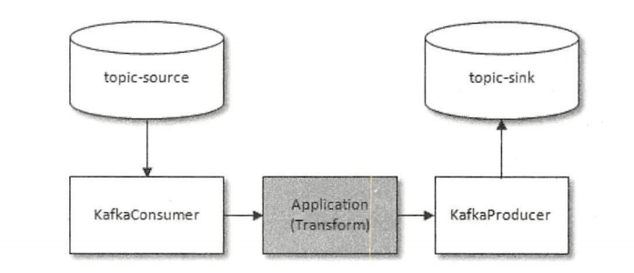

在此场景中，我们往往需要实现，从“读取source数据，至业务处理，至处理结果写入kafka”的整个流程，具备原子性：

**要么全流程成功，要么全部失败！**

（处理且输出结果成功，才提交消费端偏移量；处理或输出结果失败，则消费偏移量也不会提交）

要实现上述的需求，可以利用Kafka中的**事务机制**：

它可以使应用程序将**消费消息**、**生产消息**、**提交消费位移**当作原子操作来处理，即使该生产或消费会跨多个topic分区；

在消费端有一个参数isolation.level，与事务有着莫大的关联，这个参数的默认值为“read\_uncommitted”，意思是说消费端应用可以看到（消费到）未提交的事务，当然对于已提交的事务也是可见的。这个参数还可以设置为“read\_committed”，表示消费端应用不可以看到尚未提交的事务内的消息。

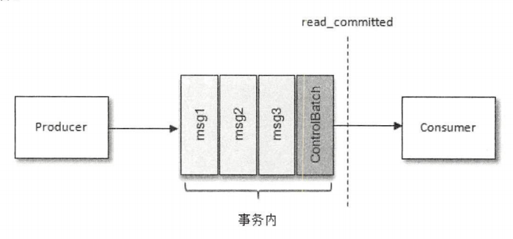

控制消息（ControlBatch：COMMIT/ABORT）表征事务是被提交还是被放弃

Kafka本身提供用于生产者性能测试的kafka-producer-perf-test.sh 和用于消费者性能测试的 kafka-consumer-perf-test. sh，主要参数如下：

经验：如何把kafka服务器的性能利用到最高，一般是让一台机器承载（ cpu线程数\*2\~3 ）个分区

测试环境： 节点3个，cpu 2核2线程，内存8G ，每条消息1k

测试结果：  topic在12个分区时，写入、读取的效率都是达到**最高**

写入： 75MB/s  ，7.5万条/s

读出： 310MB/s ，31万条/s

当分区数>12  或者 <12 时，效率都比=12时要低！

### 9.1.24 生产者性能测试

tpc\_3： 分区数3，副本数1

\[root@doitedu01 kafka\_2.11-2.0.0]# **bin/kafka-producer-perf-test.sh** --topic tpc\_3 --num-records 100000 --record-size 1024 --throughput -1 --producer-props bootstrap.servers=doitedu01:9092 acks=1

100000 records sent, 26068.821689 records/sec (25.46 MB/sec), 926.82 ms avg latency, 1331.00 ms max latency, 924 ms 50th, 1272 ms 95th, 1305 ms 99th, 1318 ms 99.9th.

tpc\_4： 分区数4，副本数2

\[root@doitedu01 kafka\_2.11-2.0.0]# bin/kafka-producer-perf-test.sh --topic tpc\_4 --num-records 100000 --record-size 1024 --throughput -1 --producer-props bootstrap.servers=doitedu01:9092 acks=1

100000 records sent, 25886.616619 records/sec (25.28 MB/sec), 962.06 ms avg latency, 1647.00 ms max latency, 857 ms 50th, 1545 ms 95th, 1622 ms 99th, 1645 ms 99.9th.

tpc\_5：分区数5，副本数1

\[root@doitedu01 kafka\_2.11-2.0.0]# bin/kafka-producer-perf-test.sh --topic tpc\_5 --num-records 100000 --record-size 1024 --throughput -1  --producer-props bootstrap.servers=doitedu01:9092 acks=1

100000 records sent, 28785.261946 records/sec (28.11 MB/sec), 789.29 ms avg latency, 1572.00 ms max latency, 665 ms 50th, 1502 ms 95th, 1549 ms 99th, 1564 ms 99.9th.

tpc\_6：分区数6，副本数1

\[root@doitedu01 kafka\_2.11-2.0.0]# bin/kafka-producer-perf-test.sh --topic tpc\_6 --num-records 100000 --record-size 1024 --throughput -1 --producer-props bootstrap.servers=doitedu01:9092 acks=1

100000 records sent, 42662.116041 records/sec (41.66 MB/sec), 508.68 ms avg latency, 1041.00 ms max latency, 451 ms 50th, 945 ms 95th, 1014 ms 99th, 1033 ms 99.9th.

tpc\_12：分区数12

\[root@doitedu01 kafka\_2.11-2.0.0]# bin/kafka-producer-perf-test.sh --topic tpc\_12 --num-records 100000 --record-size 1024 --throughput -1 --producer-props bootstrap.servers=doitedu01:9092 acks=1

100000 records sent, 56561.085973 records/sec (55.24 MB/sec), 371.42 ms avg latency, 1103.00 ms max latency, 314 ms 50th, 988 ms 95th, 1091 ms 99th, 1093 ms 99.9th.

脚本还包含了许多其他的参数，比如 from latest group、print-metrics、threads等，篇幅及时间限制，同学们可以自行了解这些参数的使用细节。

例如，加上参数： --print-metrics，则会打印更多信息

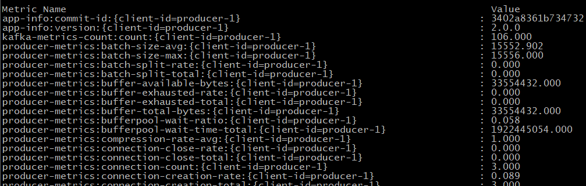

### 9.1.25 消费者性能测试

\[root@doitedu01 kafka\_2.11-2.0.0]# **bin/kafka-consumer-perf-test.sh** --topic tpc\_3 --messages 100000 --broker-list doitedu01:9092 --consumer.config x.properties

**结果数据个字段含义：**

start.time, end.time, data.consumed.in.MB, MB.sec, data.consumed.in.nMsg, nMsg.sec, rebalance.time.ms, fetch.time.ms, fetch.MB.sec, fetch.nMsg.sec

2020-11-14 15:43:42:422, 2020-11-14 15:43:43:347, 98.1377, 106.0948, 100493, 108641.0811, 13, 912, 107.6071, 110189.6930

结果中包含了多项信息，分别对应起始运行时间（start. time）、结束运行时 end.time）、消息总量（data.consumed.in.MB ，单位为 MB ），按字节大小计算的消费吞吐量（单位为 MB ）、消费的消息总数（ data. consumed.in nMsg ）、按消息个数计算的吞吐量（nMsg.sec）、再平衡的时间（ rebalance time.ms 单位为MB/s）、拉取消息的持续时间（fetch.time.ms，单位为ms）、每秒拉取消息的字节大小（fetch.MB.sec 单位 MB/s）、每秒拉取消息的个数( fetch.nM.sec）。其中 fetch.time.ms= end.time - start.time - rebalance.time.ms

### 9.1.26 分区数与吞吐量实际测试

Kafka只允许单个分区中的消息被一个消费者线程消费，一个消费组的消费并行度完全依赖于所消费的分区数；

如此看来，如果一个主题中的分区数越多，理论上所能达到的吞吐量就越大，那么事实真的如预想的一样吗？

我们以一个3台普通阿里云主机组成的3节点kafka集群进行测试，每台主机的内存大小为8GB，磁盘为40GB，4核CPU 16线程 ，主频2600MHZ，JVM版本为1.8.0\_112，Linux系统版本为2.6.32-504.23.4.el6.x86\_64。

创建分区数为1、20、50、100、200、500、1000的主题，对应的主题名称分别为 topic-1 topic 20 topic-50 topic-100 topic-200 topic-500 topic-1000 ，所有主题的副本因子都设置为1。

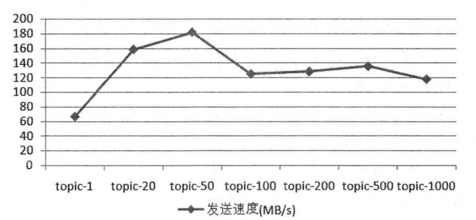

&#x20;

* 消费者，测试结果与上图趋势类同

如何选择合适的分区数？从某种意恩来说，考验的是决策者的实战经验，更透彻地说，是Kafka本身、业务应用、硬件资源、环境配置等多方面的考量而做出的选择。在设定完分区数，或者更确切地说是创建主题之后，还要对其追踪、监控、调优以求更好地利用它 。

一般情况下，根据预估的吞吐量及是否与 key 相关的规则来设定分区数即可，后期可以通过增加分区数、增加 broker 或分区重分配等手段来进行改进。

### 9.1.27 分区数设置的经验参考

如果一定要给一个准则，则建议将分区数设定为集群中broker的倍数，即假定集群中有3个broker 节点，可以设定分区数为3/6/9等，至于倍数的选定可以参考预估的吞吐量。

或者根据机器配置的cpu线程数和磁盘性能来设置最大效率的分区数：= CPU线程数 \* 1.5\~2倍

不过，如果集群中的broker节点数有很多，比如大几十或上百、上千，那么这种准则也不太适用。

**还有一个可供参考的分区数设置算法：**

**每一个分区的写入速度，大约40M/s**

**每一个分区的读取速度，大约60M/s**

**假如，数据源产生数据的速度是（峰值）800M/s  ，那么为了保证写入速度，该topic应该设置20个分区（副本因子为3）**

**&#x20; Kafka速度快的原因：**

扩展阅读：零拷贝    &#x20;

**所谓的零拷贝是指将数据直接从磁盘文件复制到网卡设备中，而不需要经由应用程序之手；**

零拷贝大大提高了应用程序的性能，减少了内核和用户模式之间的上下文切换；对于Linux系统而言，零拷贝技术依赖于底层的 sendfile( )方法实现；对应于Java 语言，FileChannal.transferTo( )方法的底层实现就是 sendfile( )方法；

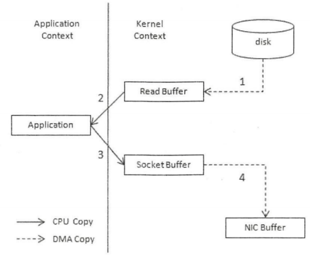

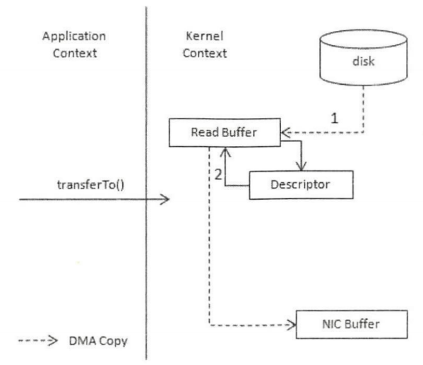

零拷贝技术通过DMA (Direct Memory Access）技术将文件内容复制到内核模式下的 Read Buffer。不过没有数据被复制到 Socke Buffer，只有包含数据的位置和长度的信息的文件描述符被加到 Socket Buffer； DMA引擎直接将数据从内核模式read buffer中传递到网卡设备。

这里数据只经历了2次复制就从磁盘中传送出去了，并且上下文切换也变成了2次。

零拷贝是针对内核模式而言的，数据在内核模式下实现了零拷贝；

# 10. Kafka整合

Kafka和flume的整合有3种方式：

1. 把kafka当做source的数据源

2. 把kafka当做channel

3) 把kafka作为sink的目标存储

   ## 10.1 Kafka+Flume

   ### 10.1.1 Flume从kafka中读取数据

a1.sources = r1
a1.channels = c1
a1.sinks = k1
​
a1.sources.r1.type = org.apache.flume.source.kafka.KafkaSource
a1.sources.r1.channels = c1
a1.sources.r1.kafka.bootstrap.servers = doitedu01:9092,doitedu02:9092,doitedu03:9092
a1.sources.r1.kafka.consumer.group.id = g00001
a1.sources.r1.kafka.topics = tpc\_2
a1.sources.r1.batchSize = 1000
a1.sources.r1.kafka.consumer.auto.offset.reset = earliest
​
​
a1.channels.c1.type = memory
a1.channels.c1.capacity = 1000000
a1.channels.c1.transactionCapacity = 2000
​
​
a1.sinks.k1.channel = c1
a1.sinks.k1.type = org.apache.flume.sink.kafka.KafkaSink
a1.sinks.k1.kafka.bootstrap.servers = doitedu01:9092,doitedu02:9092,doitedu03:9092
a1.sinks.k1.kafka.topic = tpc\_3
a1.sinks.k1.flumeBatchSize = 1000
a1.sinks.k1.kafka.producer.acks = -1
a1.sinks.k1.allowTopicOverride = false
a1.sinks.k1.kafka.producer.linger.ms = 1000

***

### 10.1.2 Flume把kafka作为channel

* Exec Source + kafka channel

a1.sources = r1
a1.channels = c1
​
a1.sources.r1.channels = c1
a1.sources.r1.type = exec
a1.sources.r1.command = tail -F /root/abc.log
​
a1.channels.c1.type = org.apache.flume.channel.kafka.KafkaChannel
a1.channels.c1.kafka.topic = flume-channel
a1.channels.c1.kafka.bootstrap.servers = doitedu01:9092,doitedu02:9092,doitedu03:9092

***

a1.channels = c1
a1.sinks = k1
​
a1.channels.c1.type = org.apache.flume.channel.kafka.KafkaChannel
a1.channels.c1.kafka.topic = flume-channel
a1.channels.c1.kafka.bootstrap.servers = doitedu01:9092,doitedu02:9092,doitedu03:9092
​
a1.sinks.k1.channel = c1
a1.sinks.k1.type = hdfs
a1.sinks.k1.hdfs.path = hdfs://doitedu01:8020/logdata/%Y-%m-%d/%H/
a1.sinks.k1.hdfs.filePrefix = logdata\_
a1.sinks.k1.hdfs.fileSuffix = .log
a1.sinks.k1.hdfs.rollInterval = 0
a1.sinks.k1.hdfs.rollSize = 268435456
a1.sinks.k1.hdfs.rollCount = 0
a1.sinks.k1.hdfs.batchSize = 1000
a1.sinks.k1.hdfs.codeC = gzip
a1.sinks.k1.hdfs.fileType = CompressedStream

***

### 10.1.3 Flume把数据写入kafka

a1.sources = r1
a1.channels = c1
a1.sinks = k1
​
a1.sources.r1.type = org.apache.flume.source.kafka.KafkaSource
a1.sources.r1.channels = c1
a1.sources.r1.kafka.bootstrap.servers = doitedu01:9092,doitedu02:9092,doitedu03:9092
a1.sources.r1.kafka.consumer.group.id = g00001
a1.sources.r1.kafka.topics = tpc\_2
a1.sources.r1.batchSize = 1000
a1.sources.r1.kafka.consumer.auto.offset.reset = earliest
​
a1.channels.c1.type = memory
a1.channels.c1.capacity = 1000000
a1.channels.c1.transactionCapacity = 2000
​
a1.sinks.k1.channel = c1
a1.sinks.k1.type = org.apache.flume.sink.kafka.KafkaSink
a1.sinks.k1.kafka.bootstrap.servers = doitedu01:9092,doitedu02:9092,doitedu03:9092
a1.sinks.k1.kafka.topic = tpc\_3
a1.sinks.k1.flumeBatchSize = 1000
a1.sinks.k1.kafka.producer.acks = -1
a1.sinks.k1.allowTopicOverride = false
a1.sinks.k1.kafka.producer.linger.ms = 1000

***

以workCount示意：

object WordCount {
​
&#x20; def main(args: Array\[String]): Unit = {
​
&#x20;   val sparkConf = new SparkConf()
&#x20;     .setAppName("spark streaming整合kafka")
&#x20;     .setMaster("local\[\*]")
​
&#x20;   val ssc = new StreamingContext(sparkConf, Seconds(1))
​
&#x20;   val kafkaParams = Map\[String, Object]\(
&#x20;     "bootstrap.servers" -> "doit01:9092,doit02:9092",
&#x20;     "key.deserializer" -> classOf\[StringDeserializer],
&#x20;     "value.deserializer" -> classOf\[StringDeserializer],
&#x20;     "group.id" -> "use\_a\_separate\_group\_id\_for\_each\_stream",
&#x20;     "auto.offset.reset" -> "earliest",
&#x20;     "enable.auto.commit" -> (false: java.lang.Boolean)
&#x20;   )
​
&#x20;   val topics = Array("test")
&#x20;   // 获取数据
&#x20;   val stream: InputDStream\[ConsumerRecord\[String, String]] = KafkaUtils.createDirectStream\[String, String]\(
&#x20;     ssc,
&#x20;     LocationStrategies.PreferConsistent, // 如果计算节点和Broker是同一台节点可以使用PreferBrokers
&#x20;     ConsumerStrategies.Subscribe\[String, String]\(topics, kafkaParams)
&#x20;   )
​
&#x20;   stream.foreachRDD(rdd => {
&#x20;     val words: RDD\[Array\[String]] = rdd.map(\_.value()).map(line => line.split(" "))
&#x20;     val wordAndOne: RDD\[(String, Int)] = words.flatMap(arr => arr.map(word => (word, 1)))
&#x20;     val wordCountResult = wordAndOne.reduceByKey(\_ + \_)
&#x20;     wordCountResult.foreach(println)
&#x20;   })
&#x20;   ssc.start()
&#x20;   ssc.awaitTermination()
&#x20; }
}

***

***

# 11. kafka面试题集

## 11.1 kafka 都有哪些特点？

* 高吞吐量、低延迟：kafka每秒可以处理几十万条消息，它的延迟最低只有几毫秒，每个topic可以分多个partition, consumer group 对partition进行consume操作。

* 可扩展性：kafka集群支持热扩展

* 持久性、可靠性：消息被持久化到本地磁盘，并且支持数据副本防止数据丢失

* 容错性：允许集群中节点失败（若副本数量为n,则允许n-1个节点失败）

* 高并发：支持数千个客户端同时读写

见第二章

分区对于kafka集群的好处是：实现负载均衡。

分区对于消费者和生产者来说，可以提高并行度，提高效率。

kafka中的每个 partition 中的消息在写入时都是有序的（不断追加），而且单独一个 partition只能由一个消费者去消费，可以在里面保证消息的顺序性。

但是分区之间的消息是不保证有序的。

多副本存储

Producer发送数据时可配置ack=all

一致性指的是不论在什么情况下，Consumer都能读到一致的数据。

HW 高水位线

LEO等

ISR是由leader维护，follower从leader同步数据有一些延迟（具体可以参见 图文了解 Kafka 的副本复制机制），超过相应的阈值会把 follower 剔除出 ISR, 存入OSR（Out-of-Sync Replicas ）列表，新加入的follower也会先存放在OSR中。AR=ISR+OSR。

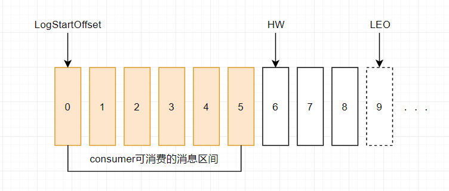

副本数>1

ack=all

min.insync.replicas >= 2

数据传输的语义通常有以下三种级别：

可以，通过assign的方式指定要消费的topic及分区

可以，通过seek指定偏移量后再开始消费

kafka最初考虑的问题是，customer应该从brokes拉取消息还是brokers将消息推送到consumer，也就是pull还是push。在这方面，Kafka遵循了一种大部分消息系统共同的传统的设计：producer将消息推送到broker，consumer从broker拉取消息。

*一些消息系统比如Scribe和Apache Flume采用了push模式，将消息推送到下游的consumer。这样做有好处也有坏处：由broker决定消息推送的速率，对于不同消费速率的consumer就不太好处理了。消息系统都致力于让consumer以最大的速率最快速的消费消息，但不幸的是，push模式下，当broker推送的速率远大于consumer消费的速率时，consumer恐怕就要崩溃了。最终Kafka还是选取了传统的pull模式。*
pull模式的另外一个好处是consumer可以自主决定是否批量的从broker拉取数据。push模式必须在不知道下游consumer消费能力和消费策略的情况下决定是立即推送每条消息还是缓存之后批量推送。如果为了避免consumer崩溃而采用较低的推送速率，将可能导致一次只推送较少的消息而造成浪费。Pull模式下，consumer就可以根据自己的消费能力去决定这些策略。
pull有个缺点是，如果broker没有可供消费的消息，将导致consumer不断在循环中轮询，直到新消息到达。为了避免这点，Kafka有个参数可以让consumer阻塞直到新消息到达(当然也可以阻塞直到消息的数量达到某个特定的量这样就可以批量拉取）

&#x20;  crc  attributes  mgic  timestamp  keylength   key  valuelength value

&#x20; &#x20;

参见《2.1.2》

Kafka把topic中一个parition大文件分成多个小文件段，通过多个小文件段，就容易定期清除或删除已经消费完文件，减少磁盘占用。

通过索引信息可以快速定位message和确定response的最大大小。

通过index元数据全部映射到memory，可以避免segment file的IO磁盘操作。

通过索引文件稀疏存储，可以大幅降低index文件元数据占用空间大小

如果我们有5个 Broker，5个分区，假设第1个分区放在第四个 Broker 上，那么第2个分区将会放在第五个 Broker 上；第3个分区将会放在第一个 Broker 上；第4个分区将会放在第二个 Broker 上，依次类推；

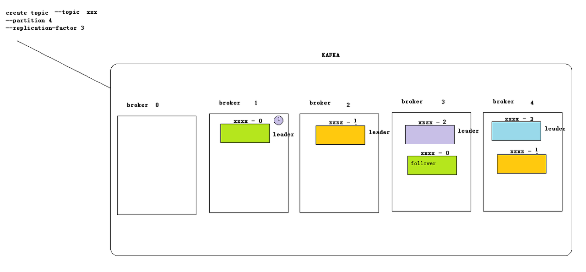

## 11.2 kafka的分区分布策略是怎样的？

分区分布的计算策略如下

**kafka允许对topic动态增加分区，但不支持减少分区**

Kafka 分区数据不支持减少是由很多原因的，比如减少的分区其数据放到哪里去？是删除，还是保留？删除的话，那么这些没消费的消息不就丢了。如果保留这些消息如何放到其他分区里面？追加到其他分区后面的话那么就破坏了 Kafka 单个分区的有序性。如果要保证删除分区数据插入到其他分区保证有序性，那么实现起来逻辑就会非常复杂。

**log.dirs**参数，其值是 kafka 数据的存放目录；

**这个参数可以配置多个目录**，目录之间使用逗号分隔，通常这些目录是分布在不同的磁盘上用于提高读写性能。

如果log.dirs参数只配置了一个目录，那么分配到各个 broker 上的分区肯定只能在这个目录下创建文件夹用于存放数据。

但是如果log.dirs参数配置了多个目录，那么 kafka 会在哪个文件夹中创建分区目录呢？答案是：Kafka 会在含有分区目录最少的文件夹中创建新的分区目录，分区目录名为 Topic名+分区ID。

注意，是分区文件夹总数最少的目录，而不是磁盘使用量最少的目录！也就是说，如果你给 log.dirs 参数新增了一个新的磁盘，新的分区目录肯定是先在这个新的磁盘上创建直到这个新的磁盘目录拥有的分区目录不是最少为止。

每个消费者从属于消费组。消费者通过一个参数：group.id 来指定所属的组；

可以把多个消费者的group.id设置成同一个值，那么这几个消费者就属于同一个组；

比如，让c-1，c-2,c-3的group.id=“g1",那么c-1,c-2,c-3这3个消费者都属于g1消费组；

一个消费者，在本质上究竟如何定义：一个消费者可以是一个线程，也可以是一个进程，本质上就是一个consumer对象实例！

**消费者组的意义：**（可以让多个消费者组成一个组，并共同协作来消费数据，提高消费并行度）一个消费组中的各消费者，在消费一个topic的数据时，互相不重复！如果topic的某分区被组中的一个消费消费，那么，其他消费者就不会再消费这个分区了；

具体关系如下：

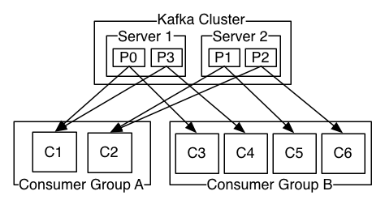

## 11.3 谈一谈 kafka 的消费者组分区分配再均衡

在Kafka中，当有新消费者加入或者订阅的topic数发生变化时，会触发rebalance(再均衡：在同一个消费者组当中，分区的所有权从一个消费者转移到另外一个消费者)机制，Rebalance顾名思义就是重新均衡消费者消费。

Rebalance的过程如下：

对于rebalance来说，group coordinator起着至关重要的作用

Range策略

Round-Robin策略

kafka是分布式消息系统，需要处理海量的消息，kafka的设计是把所有的消息都写入速度低容量大的硬盘，以此来换取更强的存储能力，但实际上，使用硬盘并没有带来过多的性能损失。kafka主要使用了以下几个方式实现了超高的吞吐率：

kafka manager

kafka-offset-monitor ：主要做消费者偏移量的监控

kafka-eagle：功能很强大！（现已改名为：EFAK —— eagle for apache kafka）

