# 1. kafka是什么

kafka是一个分布式消息缓存 中间件；

> 此处的“消息”这个词，来自于一种历史悠久的工具：消息队列（activeMQ，rocksMQ，rabbitMQ等）
>
> 所谓“消息队列”是一种存储系统，它有一个关键特点：
>
> &#x20;      存储的数据，以“队列”结构来存储（有序，先进先出）
>
> &#x20;      数据是一条一条的，在这类型工具中把一条数据称之为一个“消息”
>
> “消息队列”这种工具在应用开发中非常广泛

而kafka中，由于分布式架构所致，它无法保证数据严格按照队列的要求有序；


# 2. kafka用来做什么

如果是应用开发，需要用到消息队列的场景，通常不会使用kafka；而是使用传统的消息队列中间件；

***kafka主要用在大数据的数据开发中，尤其是实时流式计算场景中；***

> **主要作用是：**

1. **解耦：  数据源的数据生产  和  数据的计算；**

2. **缓冲：  削峰填谷！**

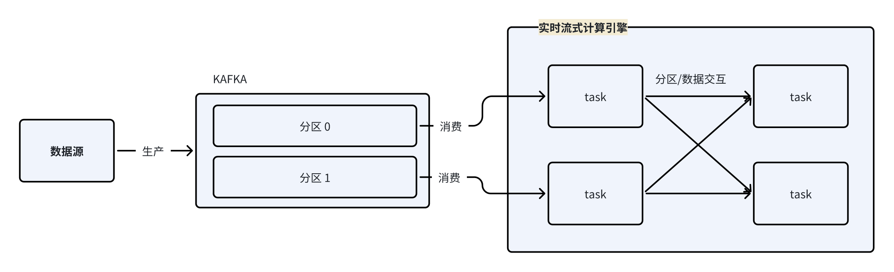

> 为什么kafka可用在上述场景

这是由kafka的特性，和实时流式计算的要求所决定；

* 实时流式计算在读、写数据的时候，就要求存储系统的数据 结构简单、有序连续；而且读写速度要快；

* 而kafka正好满足这些要求；


# 3. kafka的存储和软件架构

## 3.1 软件整体架构

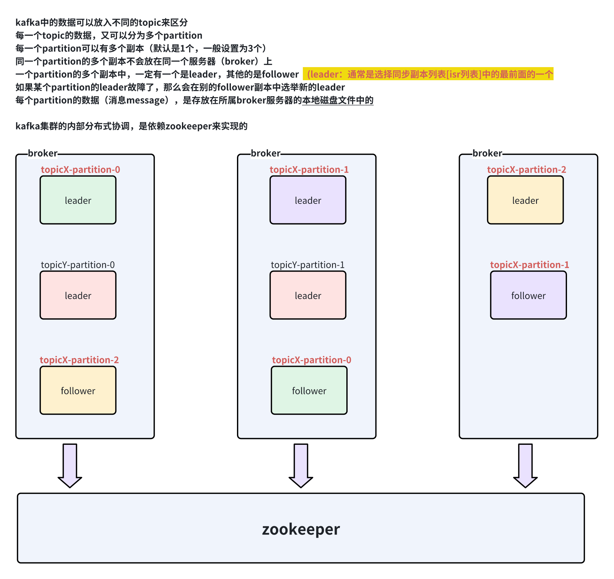


## 3.2 物理存储结构

* 存储目录   **topic名称-分区号**&#x20;

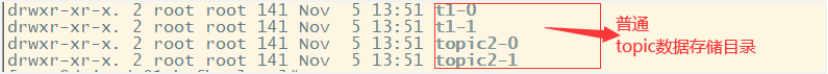

> 注：t1为topic的名称；而 t1-0 / t1-1 是t1的两个分区数据目录


* 消息偏移量

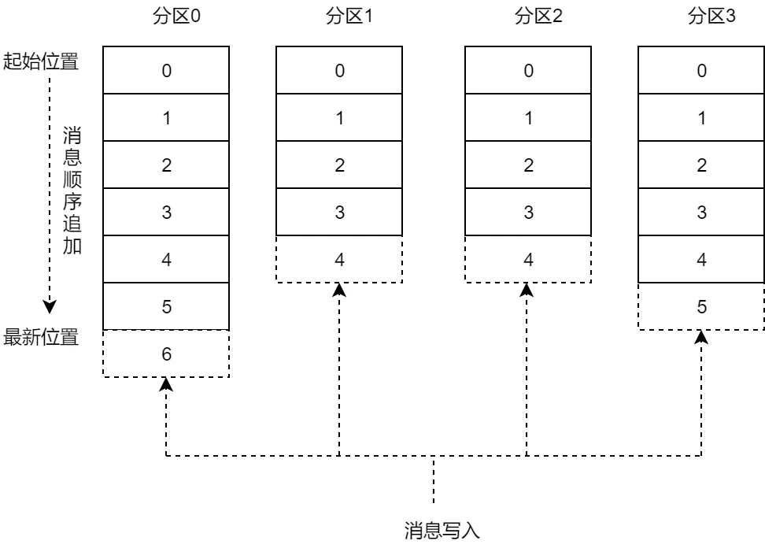


* 数据文件&#x20;

生产者生产的消息会不断追加到log文件末尾，为防止log文件过大导致数据定位效率低下，Kafka采取了分片和索引机制 ；

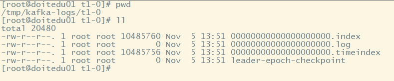

index和log文件以当前segment的第一条消息的offset命名。

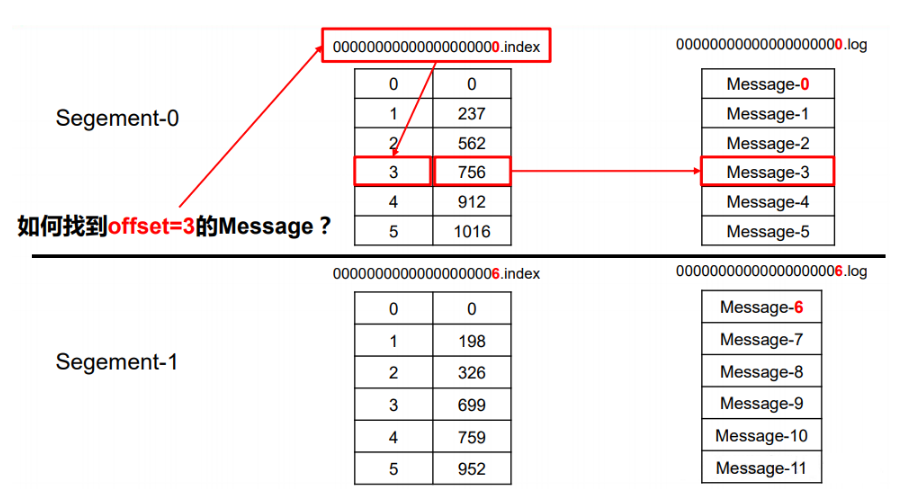

index索引文件中的数据为：  消息offset -> log文件中该消息的物理偏移量位置；


Kafka 中的索引文件以**稀疏索引**（ sparse index ）的方式构造消息的索引，它并不保证每个消息在索引文件中都有对应的索引；每当写入一定量（由 broker 端参数 log.index.interval.bytes 指定，默认值为 4096 ，即 4KB ）的消息时，偏移量索引文件和时间戳索引文件分别增加一个偏移量索引项和时间戳索引项，增大或减小 log.index.interval.bytes的值，对应地可以缩小或增加索引项的密度；

查询指定偏移量时，使用二分查找法来快速定位偏移量的位置。


# 4. 安装部署

1. **上传安装包**

2. **解压**

```plain&#x20;text
tar -zxvf kafka_2.11-2.2.2.tgz tar  -C /opt/apps/
```

* **修改配置文件**

```plain&#x20;text
（1）进入配置文件目录
[root@linux01 apps]# cd kafka_2.12-2.3.1/config
（2）编辑配置文件
vi server.properties
#为依次增长的：0、1、2、3、4，集群中唯一 id
broker.id=0   
#数据存储的⽬录 
log.dirs=/opt/data/kafkadata
#底层存储的数据（日志）留存时长（默认7天）
log.retention.hours=168
#底层存储的数据（日志）留存量（默认1G） 
log.retention.bytes=1073741824
#指定zk集群地址
zookeeper.connect=linux01:2181,linux02:2181,linux03:2181
```

* **分发安装包**

```plain&#x20;text
for  i  in {2..3} 
do 
scp  -r  kafka_2.11-2.2.2  linux0$i:$PWD 
done
```

> 安装包分发后，记得修改config/server.properties中的 配置参数： broker.id

* **环境变量**

```plain&#x20;text
vi /etc/profile
export KAFKA_HOME=/opt/apps/kafka_2.11-2.2.2
export PATH=$PATH:$KAFKA_HOME/bin 

source /etc/profile
# 注意：还需要分发环境变量
```

* **启停集群（在各个节点上启动）**

```plain&#x20;text
bin/kafka-server-start.sh -daemon /opt/apps/kafka_2.11-2.2.2/config/server.properties   

# 停止集群
bin/kafka-server-stop.sh
```

* **一键启停脚本：**

```plain&#x20;text
#!/bin/bash

case $1 in
"start"){
        for i in linux01 linux02 linux03
        do
        echo ---------- kafka $i 启动 ------------
                ssh $i "source /etc/profile;  /opt/app/kafka2.4.1/bin/kafka-server-start.sh -daemon /opt/app/kafka2.4.1/config/server.properties"
        done
};;
"stop"){
        for i in linux01 linux02 linux03
        do
        echo ---------- kafka $i 停止 ------------
                ssh $i "source /etc/profile;  /opt/app/kafka2.4.1/bin/kafka-server-stop.sh "
        done
};;
esac
```

更精简版本：

```shell
#!/bin/bash
export KAFKA_HOME=/opt/app/kafka-2.8.2
for host in doitedu01 doitedu02 doitedu03
do

echo "${1}ing $host .............."
ssh $host "source /etc/profile;${KAFKA_HOME}/bin/kafka-server-${1}.sh -daemon ${KAFKA_HOME}/config/server.properties"

done
```


# 5. 使用操作

## 5.1 命令行客户端简单体验

创建topic

```shell
[root@doitedu01 kafka-2.8.2]# bin/kafka-topics.sh \
--create  \
--topic user-actions \
--partitions 2 \
--replication-factor 2 -\
-zookeeper doitedu01:2181
```


列出所有topic

```shell
[root@doitedu01 kafka-2.8.2]# bin/kafka-topics.sh --list --zookeeper doitedu01:2181
```


生产数据

```shell
[root@doitedu01 kafka-2.8.2]# bin/kafka-console-producer.sh \
--topic user-actions \
--bootstrap-server doitedu01:9092
```


消费数据

```shell
[root@doitedu01 kafka-2.8.2]# bin/kafka-console-consumer.sh \
--bootstrap-server doitedu01:9092 \
--topic user-actions \
--from-beginning
```


## 5.2 java客户端使用

### 5.2.1 生产者

#### 基本示例

```java
package top.doe.kafka.demos;

import com.alibaba.fastjson.JSONObject;
import org.apache.commons.lang3.RandomStringUtils;
import org.apache.commons.lang3.RandomUtils;
import org.apache.kafka.clients.producer.KafkaProducer;
import org.apache.kafka.clients.producer.ProducerRecord;
import org.apache.kafka.common.serialization.StringSerializer;

import java.util.Properties;

public class ProducerDemo1 {
    public static void main(String[] args) throws InterruptedException {

        Properties props = new Properties();
        //指定kafka集群的地址
        props.setProperty("bootstrap.servers", "doitedu01:9092,doitedu02:9092,doitedu03:9092");
        //指定key的序列化方式
        props.setProperty("key.serializer", StringSerializer.class.getName());
        //指定value的序列化方式
        props.setProperty("value.serializer", StringSerializer.class.getName());
        //ack模式，取值有0，1，-1（all），all是最慢但最安全的  服务器应答生产者成功的策略
        props.put("acks", "all");
        //这是kafka发送数据失败的重试次数，这个可能会造成发送数据的乱序问题
        props.setProperty("retries", "3");
        //数据发送批次的大小 单位是字节
        props.setProperty("batch.size", "1024");
        //一次数据发送请求所能发送的最大数据量
        props.setProperty("max.request.size", "102400");
        //消息在缓冲区保留的时间，超过设置的值就会被提交到服务端
        props.put("linger.ms", 1000);
        //整个Producer用到总内存的大小，如果缓冲区满了会提交数据到服务端
        //buffer.memory要大于batch.size，否则会报申请内存不足的错误
        props.put("buffer.memory", 2048);


        // 构造生产者客户端对象
        KafkaProducer<String, String> producer = new KafkaProducer<>(props);


        String[] devices = {"mi8","oppo6","mate-x","phone-16","mi10","serial-T"};


        for(int i=0;i<1000;i++) {
            // 业务逻辑,在产生数据
            JSONObject dataObj = new JSONObject();

            String uid = RandomStringUtils.randomNumeric(5);
            dataObj.put("uid", uid);
            dataObj.put("event_id", RandomStringUtils.randomAlphabetic(4).toUpperCase());
            dataObj.put("action_time", System.currentTimeMillis());
            dataObj.put("device_type", devices[RandomUtils.nextInt(0, devices.length)]);

            // 把业务逻辑产生的数据，写入kafka
            // 先把业务数据，封装成kafka的生产者record对象

            int partitionId = Integer.parseInt(uid) % 3;
            // 根据我们自己的需求，来进行数据的分区；如果不指定数据的分区，则producer会随机选择一个分区
            ProducerRecord<String, String> record = new ProducerRecord<>("stu",partitionId, uid, dataObj.toJSONString());

            // 然后发送
            producer.send(record);

            Thread.sleep(100);
        }

        // 收尾，把最后一批攒在缓存中的数据刷出去
        producer.flush();
        producer.close();


    }
}
```


#### 关键细节

* 生产者发送数据是可以按照批次发送（可以配置批次大小，攒批次的时长，缓存的大小）

* 生产者发送数据时可以指定“确认模式”\[ack模式,ack级别] ，ack有3种级别：&#x20;

  * 0（None)  ： 生产者不需要集群端的确认，就认为数据发送成功

  * 1 (leader) ： 生产者需要集群端的分区leader存好数据再确认，得到确认才认为数据发送成功

  * -1(all）：     生产者需要集群端的分区所有同步副本都存好数据再反馈确认，得到确认才认为数据发送成功

* 生产者发送数据时可以给每条数据都指定目标分区（默认是随机）

* 生产者发送数据如果失败（没有得到确认等），它可以自动重试

* 生产者发送数据可以保证幂等性

* 生产者发送数据可以开启事务（伪事务，事务如果失败，数据也无法真正回滚，但数据的消费者可以选择只读commited）


### 5.2.2 消费者

#### 基本示例

```java
package top.doe.kafka.demos;


import org.apache.kafka.clients.consumer.ConsumerConfig;
import org.apache.kafka.clients.consumer.ConsumerRecord;
import org.apache.kafka.clients.consumer.ConsumerRecords;
import org.apache.kafka.clients.consumer.KafkaConsumer;
import org.apache.kafka.common.TopicPartition;
import org.apache.kafka.common.header.Header;
import org.apache.kafka.common.header.Headers;
import org.apache.kafka.common.record.TimestampType;
import org.apache.kafka.common.serialization.StringDeserializer;

import java.io.IOException;
import java.time.Duration;
import java.util.*;

public class ConsumerDemo1 {
    public static void main(String[] args) throws IOException {

        Properties props = new Properties();
        // 加载properties配置文件，并自动解析
        props.load(ConsumerDemo1.class.getClassLoader().getResourceAsStream("consumer.properties"));

        // 构造消费者客户端
        KafkaConsumer<String, String> consumer = new KafkaConsumer<>(props);

        // 订阅主题 topic;  各主题的各分区如何在组中分配，是自动均衡分配的
        //consumer.subscribe(Collections.singletonList("stu"));


        //  手动分配主题分区给消费者
        TopicPartition tp0 = new TopicPartition("stu", 0);
        TopicPartition tp1 = new TopicPartition("stu", 1);
        TopicPartition tp2 = new TopicPartition("stu", 2);
        //  手动分配主题分区给消费者
        consumer.assign(Arrays.asList(tp0,tp1,tp2));
        // 手动指定各分区的消费起始位移
        consumer.seek(tp0,255);
        consumer.seek(tp1,240);
        consumer.seek(tp2,245);


        // 拉取数据
        while (true) {

            // 这里所拉取的数据，可能包含多个主题、多个分区的数据
            ConsumerRecords<String, String> records = consumer.poll(Duration.ofMillis(1000));

            // 从拉取到的数据中，获取指定topic指定partition的数据
            //TopicPartition tp0 = new TopicPartition("stu", 0);
            //List<ConsumerRecord<String, String>> tp0Records = records.records(tp0);

            // 从拉取到的数据中，获取指定topic的数据
            //Iterable<ConsumerRecord<String, String>> rc = records.records("stu");

            // 把本次拉取的所有数据转成一个迭代器
            Iterator<ConsumerRecord<String, String>> iter = records.iterator();

            while(iter.hasNext()){
                // 迭代到一条数据
                ConsumerRecord<String, String> record = iter.next();

                // 获取数据的header
                Headers headers = record.headers();
                Iterator<Header> headerIter = headers.iterator();
                while(headerIter.hasNext()){
                    Header header = headerIter.next();
                    String key = header.key();
                    byte[] valueBytes = header.value();
                    System.out.println("本条数据的header: " + key + "->" + new String(valueBytes));
                }


                // 获取数据的key和value
                String recordKey = record.key();
                String recordValue = record.value();
                System.out.println(String.format("本条数据的key: %s , value: %s",recordKey,recordValue));


                // 获取数据所属的topic
                String topic = record.topic();
                System.out.println(String.format("本条数据所属的topic: %s",topic));


                // 获取数据所属的partition
                int partition = record.partition();
                System.out.println(String.format("本条数据所属的partition: %d",partition));

                // 获取本条数据的offset
                long offset = record.offset();
                System.out.println(String.format("本条数据的offset: %d",offset));

                // 获取本条数据所属的leader纪元
                Optional<Integer> epoch = record.leaderEpoch();
                System.out.println("当前的leader epoch: " + epoch);

                // 获取本条数据的时间戳
                // 默认是 CREATE_TIME
                // kafka中的数据的时间戳，有3种类型： NO_TIMESTAMP_TYPE,CREATE_TIME,LOG_APPEND_TIME
                long timestamp = record.timestamp();
                System.out.println(String.format("本条数据的timestamp: %d",timestamp));
                TimestampType timestampType = record.timestampType();
                System.out.println("本条数据的timestamp类型为：" + timestampType);


                System.out.println("--------------------------------------------");

            }
        }

    }
}
```


#### 关键细节

* 一个消费者可以同时消费多个topic、多个分区


* **消费者可以从指定的分区的指定的位置（offset、timestamp）开始消费**

  * 从分区的开头开始：earliest

  * 从分区的最新开始：latest

  * 从分区的指定offset开始

  * 从分区的指定的timestamp开始


* **消费者组（消费组）**

> 消费组是为了提高消费端并行度的自动均衡的概念
>
> kafka的消费者可以通过一个消费组id标识，组织成“组”
>
> 同一个消费组的消费者，在消费topic数据时，会分工：同一个partition只会分配组中的一个消费者来消费
>
> 这个分工是自动均衡的&#x20;
>
> 在运行时，消费组中新增或减少消费者，都会引起组内的动态再均衡


> 如果用subscribe()订阅主题，起始位置是从本消费组之前所记录的消费位移开始往下读；
>
> 如果此前没有该组的偏移量记录，则按参数  "auto.offset.reset" 所指定的位置读（比如earliest、latest）

```java
consumer.subscribe(Arrays.asList("stu-a","stu-b"));
```

> 这种方式下，同一个消费组中的消费者，分配所订阅主题的分区，是自动分配的；


> 如果用assign()订阅主题分区，则可以手动指定各分区的读取起始offset；

```java
//  构造topicPartition对象来描述各主题分区
TopicPartition tp0 = new TopicPartition("stu", 0);
TopicPartition tp1 = new TopicPartition("stu", 1);
TopicPartition tp2 = new TopicPartition("stu", 2);

//  手动分配主题分区给消费者
consumer.assign(Arrays.asList(tp0,tp1,tp2));

// 手动指定各分区的消费起始位移
consumer.seek(tp0,255);
consumer.seek(tp1,240);
consumer.seek(tp2,245);
```

> 在这种方式下，哪个消费者消费哪个分区，全是手动显式指定的
>
> 手动分配分区的方式下，消费组的自动均衡机制就失效


* **消费位移的自动提交机制**

kafka中的每一条消息，都有一个偏移量offset

消费者通常都是要持续消费的，为了在故障重启后还能从故障前的位置接着消费，所以需要定期地记录消费到的位置（消费位移）

kafka的消费者客户端，拥有自动记录消费位移的功能；

自动提交消费位移的功能：&#x20;


* **消费位移的提交存在的问题**

场景1：如果拉了一批数据，还没有计算，先更新了消费位移；

> 故障重启后，可能会漏处理数据（数据丢失）


场景2：如果拉了一批数据，计算成功，再更新消费位移；

> 故障重启后，可能会重复处理数据（数据重复）


> 如果使用kafka消费者的自动提交消费位移机制，则上述的两种漏洞都有可能发生


* 消费组再均衡测试

如果用subscribe() 订阅主题，则各主题的各分区，在组内是自动均衡分配的；

而且，如果在运行过程中，组内增加了新的消费者，或减少了之前的消费者，都会触发组内的再均衡流程，重新分配目标分区；


# 6. 原理加强（面试重点）

## 6.1 kafka的数据可靠性是如何保证的

* 首先，kafka系统内部通过**分区的副本机制**来实现数据可靠性保证；

> 每个partition都可以有多个副本，所以当leader宕机或损坏，别的机器上还有副本数据且副本还可以成为新的leader对外服务；


* 然后，用生产者（producer）往kafka写数据时，可以配置**高级别的ack（确认级别、确认机制）**&#x6765;保障数据可靠性

> ack：0  ,生产者不等待服务端的确认即认为发送成功（可能会发生数据丢失）
>
> ack:  1  ,服务端会在leader持久化存好这条数据后再给确认；（可靠性比0高，但也不是完全可靠）
>
> ack:  -1(all) ， 服务端会在leader及所有”同步副本inSync“都存好这条数据后再由leader给确认；（某种意义上说就不会丢失了，但最好还要配一个参数：最小 "同步副本数 min.insync.replicas >= 2 "）


> 同步副本：
>
> 一个partition有一个leader和多个follower
>
> 这些follower会周期性地找leader同步数据
>
> 如果一个follower隔了很长时间没去找leader同步数据，或者数据与leader之间差距太多，则会被判定为非同步副本
>
> * replica.lag.time.max.ms = 10秒
>
> * replica.lag.max.messages = 4000条


## 6.2 kafka的数据一致性保障机制

### 6.2.1 分布式系统的CAP理论

CAP理论作为分布式系统的基础理论,它描述的是一个分布式系统在以下三个特性中：

* 一致性（Consistency）： 分区的各副本之间数据要保持一致

* 可用性（Availability） ： 一个分区（或一个节点）宕机，不会影响系统的整体可用

* 分区容错性（Partition tolerance） ： 一个分区宕机，（分区数据不会丢失）（分区任务可重启）

分布式系统要么满足CA，要么CP，要么AP；无法同时满足CAP。


* 分区容错性：指的分布式系统中的某个节点或者网络分区出现了故障的时候，整个系统仍然能对外提供满足一致性和可用性的服务。也就是说部分故障不影响整体使用。

 

* 可用性：一直可以正常的做读写操作。简单而言就是客户端一直可以正常访问并得到系统的正常响应。用户角度来看就是不会出现系统操作失败或者访问超时等问题。

 

* 一致性：在分布式系统完成某写操作后任何读操作，都应该获取到该写操作写入的那个最新的值。相当于要求分布式系统中的各节点时时刻刻保持数据的一致性。

Kafka 作为一个商业级消息中间件，**分区容错性**和**可用性**是优先考虑的重点（一个节点挂了，不会造成数据丢失也不会造成服务不可用），兼顾数据一致性；

> 既然要保证分区容错性和可用性，就必然给一个分区附带多个副本；这样就意味着数据在多个副本间很难实现一致；


### 6.2.2 分区副本的数据一致性困难

kafka让分区多副本同步的基本手段是： follower副本定期向leader请求数据同步！

既然是定期同步，则leader和follower之间必然存在各种数据不一致的情景！

**&#x20; 问题1：分区副本间动态不一致**

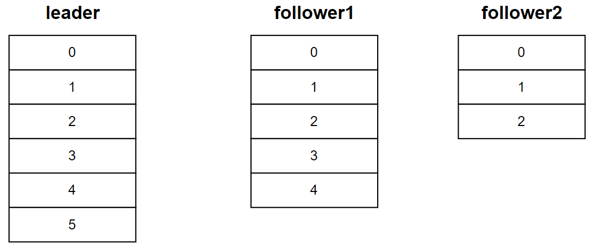


**&#x20; 问题2：消费者所见不一致**

如果此时leader宕机，follower1或follower2被选为新的leader，则leader换届前后，消费者所能读取到的数据发生了不一致；

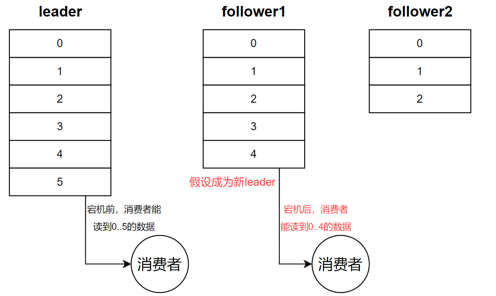


**&#x20; 问题3：分区副本间最终不一致**

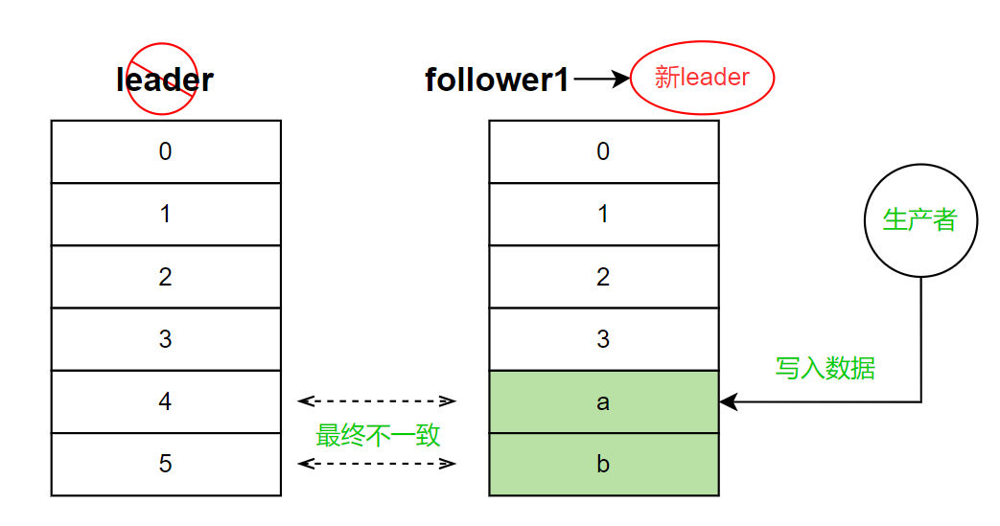


### 6.2.3 一致性问题解决方案（HW）

动态过程中的副本数据不一致，是很难解决的；

***kafka先尝试着解决上述 “消费者所见不一致” 及 “副本间数据最终不一致” 的问题；***

**核心思想：**

* kafka认为成功同步给了所有副本的数据才是安全的；

* 由于同步的进度在各副本间不一致，上面的所谓“安全”的，就应该取所有副本中最小的LEO作为安全线；

* 这个安全线，就叫做HW

* 消费者只允许读到HW以下的数据；


#### **HW的维护和更新机制**

##### 正常维护

* leader中记录着所有副本的leo；

* 副本向leader发起数据请求时，都会携带自己当前的leo；那么leader就会更新它的leo，并尝试更新HW

* 生产者向leader发送数据时，leader也会检查是否需要更新HW（因为有可能同步副本只有1个，如果只保留上面的检查机制就会永远更新不了HW了）


##### 异常维护

由于HW是leader维护并存储的，那么leader宕机后，各副本间就不知道宕机前的HW；

此时，各副本会选举出新的leader（同步副本列表中的第一个）

新leader诞生之后，会查询其他存活副本的LEO，然后取最小值作为新的HW；


```java
--1---初始状态---------------
doitedu01:leader： [0,1,2,3,4,5,6,7,8]  此刻的高水位是4  （1,0)
doitedu02:follow1: [0,1,2,3,4,5]
doitedu03:follow2: [0,1,2,3,4]


--2--LEADER宕机-------follow1成为新leader----
doitedu01:leader： [0,1,2,3,4,5,6,7,8]  高水位是4
doitedu02:leader:  [0,1,2,3,4, 5 ]  计算出最新的高水位4,截断超出的部分
doitedu03:follow2: [0,1,2,3,4]


--3--生产者写入了新数据----
doitedu01:follower： [0,1,2,3,4,5,6,7,8] 
doitedu02:leader:    [0,1,2,3,4,a,b,c,d]
doitedu03:follow2:   [0,1,2,3,4,a,b]

--4--doitedu01修复重启了，成为了新的follower----
doitedu01:follower： [0,1,2,3,4,5,6,7,8]  向leader新的HW，结果是 HW:e > 8 ，不需要截断数据，开始同步
doitedu02:leader:    [0,1,2,3,4,a,b,c,d,e,f,g]
doitedu03:follow2:   [0,1,2,3,4,a,b,c,d,e]

--5--doitedu01同步一批数据后的状态 : 这就是漏洞之一，产生了最终不一致的现象  ---
doitedu01:follower： [0,1,2,3,4,5,6,7,8,e,f]  
doitedu02:leader:    [0,1,2,3,4,a,b,c,d,e,f,g]
doitedu03:follow2:   [0,1,2,3,4,a,b,c,d,e,f]
```


### 6.2.4 一致性问题补充方案（epoch机制）

***epoch机制的主要作用是解决HW的最终不一致问题***

在光有HW的机制下，在leader宕机，新leader产生的场景下

如果有某个数据又长，但是上线又晚的副本，上线后，就会发生有一段数据没有被正确截断；

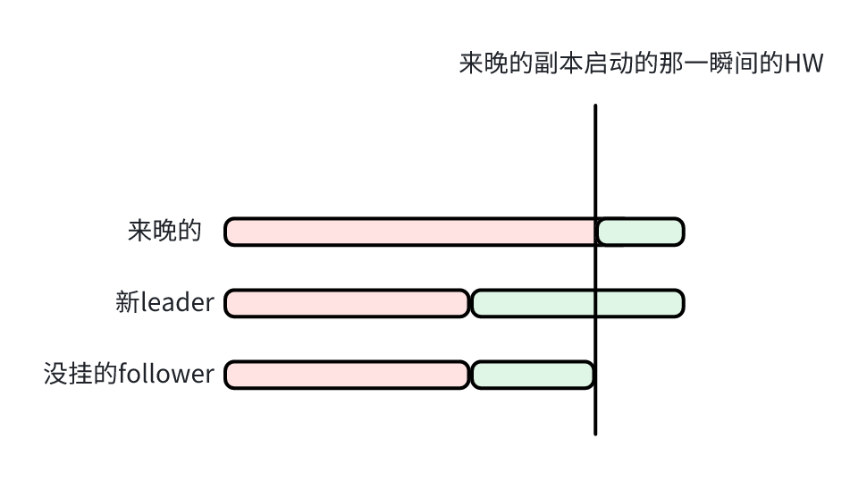

kafka为了解决上述问题，引入了epoch机制；

epoch就是代表leader的代（纪元）

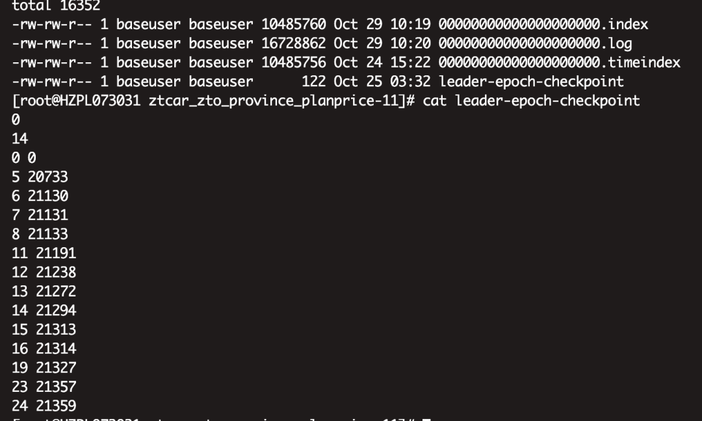


**核心机制**

* 一个副本竞选为leader后，就会生成的新的epoch（=原来的epoch+1），并且会把这个信息记录在磁盘文件中：（新的epoch，新纪元数据写入的位置）；

* follower第一次向新leader同步数据前，会先请求新leader的epoch信息；得到信息后，判断自己的日志数据是否跟新leader的纪元一致，如果不一致，会截断  “新纪元的数据的起始位置以上的” ；

```java
--1---初始状态---------------
doitedu01:leader： [0,1,2,3,4,5,6,7,8]  此刻的高水位是4  纪元信息：（1,0)
doitedu02:follow1: [0,1,2,3,4,5]   纪元信息：（1,0)
doitedu03:follow2: [0,1,2,3,4]     纪元信息：（1,0)

--2--leader宕机了,选举新leader ------------
doitedu01:leader： [0,1,2,3,4,5,6,7,8]  此刻的高水位是4  纪元信息：（1,0)
doitedu02:follow1: [0,1,2,3,4,5]   纪元信息：（1,0)
doitedu03:leader:  [0,1,2,3,4]     纪元信息：（2,5)
  
--2--新leader开启新纪元 ------------
doitedu01:leader： [0,1,2,3,4,5,6,7,8]  此刻的高水位是4  纪元信息：（1,0)

doitedu02:follow1: [0,1,2,3,4,5]   老纪元信息：（1,0)，请求新纪元信息(2,5) ，自己的LEO是5，那么需要阶段偏移量5这条数据
doitedu02:follow1: [0,1,2,3,4,a,b,c]   结果就是,纪元信息（2,5)，数据是01234abc

doitedu03:leader:  [0,1,2,3,4,a,b,c]     纪元信息：（2,5)


--3--晚到的来了  ------------
doitedu01:leader： [0,1,2,3,4,5,6,7,8]  请求leader获取纪元信息(2,5),发现自己的老数据leo>=新纪元数据起始位置,截断
doitedu01:leader： [0,1,2,3,4,a,b,c]  纪元信息（2,5)，数据是01234abc

doitedu02:follow1: [0,1,2,3,4,a,b,c]    纪元信息（2,5)，数据是01234abc

doitedu03:leader:  [0,1,2,3,4,a,b,c]     纪元信息：（2,5)

```


### 6.2.5 LEO/HW/LSO等相关术语速查

LEO:（last end offset）**就是该副本中消息的最大偏移量的值+1** ；

**HW:（high watermark）各副本中LEO的最小值。这个值规定了消费者仅能消费HW之前的数据；**

LW：（low watermark）一个副本的log中，最小的消息偏移量；

LSO：（last stable offset） 最后一个稳定的offset；对未完成的事务而言，LSO 的值等于事务中第一条消息的位置(firstUnstableOffset)，对已完成的事务而言，它的值同 HW 相同；

**LEO与HW 与数据一致性密切相关；**


如图，各副本中最小的LEO是3，所以HW是3，所以，消费者此刻最多能读到Msg2;

***


## 6.3 幂等性

### 6.3.1 幂等性的含义

通常是说，同一个动作反复执行多次，产生的结果不变

最常见的场景是，同一条数据写入目标存储系统，写1次或写多次，数据存储中的结果不变；


### 6.3.2 kafka中的幂等性

**📛 问题背景**

kafka的生产者，写一条数据到服务端时，如果写失败（有可能只是没有得到ack而已），会自动重试；

也就是：同一条数据，可能会被写多次；（此处的“多次”，是生产者自发的重试多次；不是用户的逻辑）

这里会产生问题：

一条数据，被生产者发出去后，没有得到确认，有可能并不是真的失败，而是服务端拿到数据了，但是由于某种原因没有成功收到确认信息；这样会导致同一条数据可能被服务端保存了多条；


为了解决这个问题，kafka引入了幂等性机制： 即使生产者把同一条数据发送了多次，服务端也只保留一次；


**📛 幂等性机制的核心原理：**

每一个生产者，都会拥有一个自己的生产者id；

*生产者每发送一条数据，都会带上一个自增的编号！*

broker端会为这个生产者维护记录它发过来的数据的最新编号；而且，每收到一条数据会进行判断：

> broker端的记录的上一条编号（OLD)  和  当前收到的数据编号(NEW) 进行对比 =>
>
> * OLD+1（期待的） = NEW  一切正常
>
> * OLD+1（期待的）  > NEW  新数据编号，小于服务端期待的编号，说明本条数据是重复的，直接丢弃
>
> * OLD+1（期待的）  < NEW  新数据编号，大于服务端期待的编号，说明数据要么有乱序、要么有丢失，则抛出严重异常


**📛 幂等性的开启**

> 开启幂等性功能，只需要显式地将生产者参数 enable.idempotence设置为 true （默认值为 false）：
>
> props.pu&#x74;**("enable.idempotence",true);**

在开启幂等性功能时，如下几个参数必须正确配置：

* retries > 0&#x20;

* max.in.flight.requests.per.connection<=5

* acks = -1

如有违反，则会抛出ConfigException异常；

> 注意：kafka只保证producer单个会话中的单个分区幂等；


## 6.4 kafka的事务机制

### 6.4.1 事务机制的原理

kafka中的事务机制，主要是生产者写数据的场景；

> 生产者把若干条数据绑定在一个事务中要么都写入成功，要么就回滚；

*kafka确实可以支持这样的事务需求；*


**主要原理：&#x20;**&#x20;开始事务 --> 发送一个ControlBatch消息（事务开始）

&#x20;                 提交事务--> 发送一个ControlBatch消息（事务提交）

&#x20;                 放弃事务--> 发送一个ControlBatch消息（事务终止）

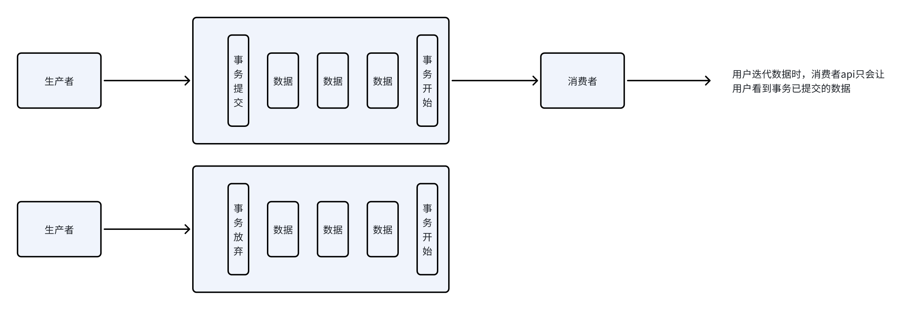

**消费者api是会拉取到尚未提交事务的数据的；只不过可以选择是否让用户看到！**

是否让用户看到未提交事务的数据，可以通过消费者参数来配置：

* isolation.level=read\_uncommitted（默认值）

* isolation.level=read\_committed


### 6.4.2 使用事务的代码

* 开启事务的必须配置参数

```java
Properties props = new Properties();
props.setProperty(ProducerConfig.BOOTSTRAP_SERVERS_CONFIG,"doit01:9092");
props.setProperty(ProducerConfig.KEY_SERIALIZER_CLASS_CONFIG, StringSerializer.class.getName());
props.setProperty(ProducerConfig.VALUE_SERIALIZER_CLASS_CONFIG, StringSerializer.class.getName());

// acks
props.setProperty(ProducerConfig.ACKS_CONFIG,"-1");
// 生产者的重试次数
props.setProperty(ProducerConfig.RETRIES_CONFIG,"3");
// 飞行中的请求缓存最大数量
props.setProperty(ProducerConfig.MAX_IN_FLIGHT_REQUESTS_PER_CONNECTION,"3");

// 开启幂等性
props.setProperty(ProducerConfig.ENABLE_IDEMPOTENCE_CONFIG,"true");

// 设置事务id
props.setProperty(ProducerConfig.TRANSACTIONAL_ID_CONFIG,"trans_001");
```

**事务控制的代码模板**

```java
try{
    // 初始化事务
    producer.initTransaction( )
    
    // 开启事务    
    producer.beginTransaction( )
        
    // 发送事务中的数据
    producer.send(producerRecord1);
    producer.send(producerRecord2);
    producer.send(producerRecord3);
    producer.send(producerRecord4);
    producer.send(producerRecord5);
    
    // 提交事务
    producer.commitTransaction( )
} catch(Exception e){
    // 异常回滚（放弃事务）-
    producer.abortTransaction( )
}
```


# 7. 高频面试题

## 7.1 **kafka 都有哪些特点？**

* 高吞吐量，低延迟

* 可以热扩展

* 并发度高

* 具有容错性(挂的只剩1台也能正常跑)

* 可靠性高


## 7.2 **kafka为什么快**

#### 根本原因

kafka的数据组织格式：日志的形&#x5F0F;***（顺序读写）***

虽然kafka的数据是放在本地磁盘，但是本地磁盘文件的顺序读写与内存的随机读写已经相差不大


#### **充分利用分布式特性来提高吞吐量和并行度**

一个topic可以分为多个partition，各个partition可以放置在多个服务器上提供读写服务


#### 底层IO利用了零拷贝

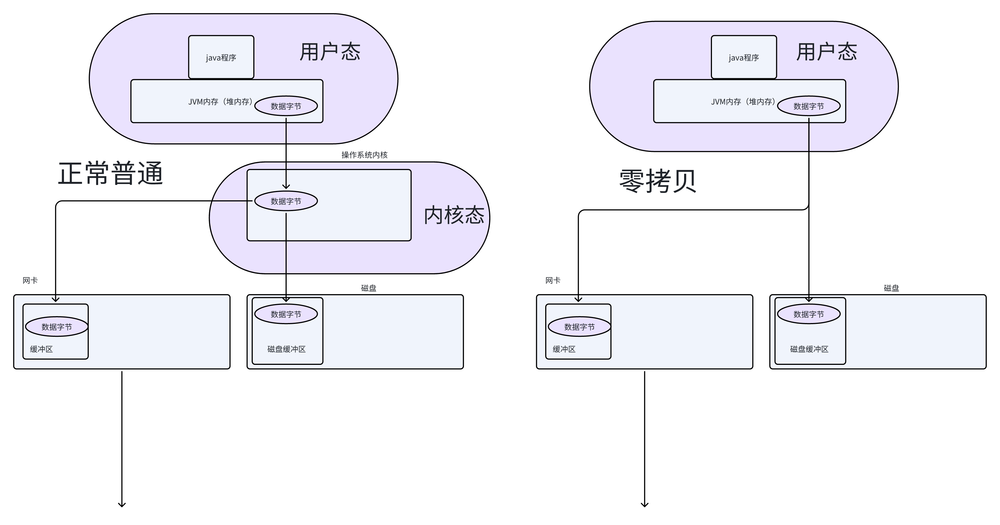


## 7.3 **你们项目中用kafka来做什么**

## 7.4 **kafka 的设计架构你知道吗？**

* kafka是一个分布式**消息缓存**中间件

* 集群中的**角色**大概有：  broker，消费者客户端，生产者客户端，依赖zookeeper做集群协调

* 消费者可以组成**消费组**，来共同协作消费目标数据；

* **存储结构：**&#x6570;据划分成topic，每个topic可以分为多个partition，每个partition可以有多个副本；

* **副本**中有一个是leader，其他是follower； leader负责数据读写，follower主要是数据备份；而且在leader宕机后，follower可以竞选出新的leader对外服务；

* **底层存储**：partition的数据存在broker服务器的本地磁盘上；而且数据是以顺序追加的形式写文件的；

* **数据文件中的内容**：一条一条的message，message分为key和value，然后还有header，有metadata（元数据），还有timestamp；

* 数据文件之外，还有附带的**索引文件**： 偏移量索引；时间戳索引；


## 7.5 **kafka 分区的目的？**

分区对于kafka集群的好处是：实现负载均衡。

分区对于消费者和生产者来说，可以提高读写并行度


## 7.6 **kafka 是如何做到消息的有序性？**

kafka中的每个 partition 中的消息在写入时都是顺序追加；

kafka的消息有序性，只体现在分区内部；分区之间的消息是不保证有序的。


## 7.7 **kafka 的高可靠性是怎么实现的？**

副本机制

生产者写数据到broker时配置高级别的ack（比如，-1）

最小"同步副本"数配置>=2


## 7.8 **请谈一谈kafka数据一致性原理**

* 高水位线机制，保障 数据所见性一致（leader宕机前后，消费者看见的数据是一致的）

* epoch机制， 保障  副本间数据最终一致&#x20;


## 7.9 **kafka 在什么情况下会出现消息丢失？**

* topic的副本如果只有1个，那么一旦这个副本所在broker服务器宕机，则有可能丢失；

* producer往kafka写入数据时，如果确认机制参数acks !=all，也可能会造成数据丢失；


## 7.10 **数据传输的语义有几种？**

数据传输的语义通常有以下三种级别：

设置消费者里面有enable.auto.commit = true/false

* 最多一次（at-most-once）: 消息不会重复，但有可能丢失；

* 最少一次 (at-least-once)：数据不会丢失，但有可能重复；

* 精确一次（Exactly-once）: 不丢也不重


## 7.11 kafka的生产者写数据到服务端能实现哪种数据传输语义？

取决于配置

* 最多一次：ack=0

* 最少一次：retries > 0

* 精确一次：开启重试，开启ack=-1，开启幂等性；


## 7.12 **kafka 消费者是否可以指定分区进行消费？**

可以；

consumer.assign()； // 手动分配


## 7.13 **kafka 消费者是否从指定offset开始消费？**

可以，通过seek指定偏移量后再开始消费


## 7.14 **客户端操作kafka消息是采用poll模式，还是push模式？**

采用poll模式（拉取）

这样更好根据消费者的计算能力来控制消费的速度和主动性；


## 7.15 **kafka的消息格式有了解吗？（了解）**

简单来说，kafka中的每个massage由一对key-value构成；

Kafka中的message格式经历了3个版本的变化了：v0 、 v1 、 v2  &#x20;

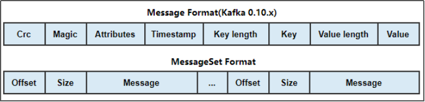

各个字段的含义介绍如下：

* crc：占用4个字节，主要用于校验消息的内容；

* magic：这个占用1个字节，主要用于标识日志格式版本号，此版本的magic值为1 &#x20;

* attributes：占用1个字节，这里面存储了消息压缩使用的编码以及Timestamp类型。目前Kafka 支持 gzip、snappy 以及 lz4（0.8.2引入） 三种压缩格式；\[0,1,2]三位bit表示压缩类型。\[3]位表示时间戳类型（0，create time；1，append time），\[4,5,6,7]位保留；

* key length：占用4个字节。主要标识 Key的内容的长度；

* key：占用 N个字节，存储的是 key 的具体内容；

* value length：占用4个字节。主要标识 value 的内容的长度；

* value：value即是消息的真实内容，在 Kafka 中这个也叫做payload。


## 7.16 **kafka 的数据文件存储设计特点**

Kafka把topic中一个parition的数据分成多个小文件段；

```java
-rw-r--r--. 1 root root    56 Oct  4 18:01 00000000000000000000.index  // offset索引

// 数据文件段，名字代表文件中第一条消息的offset
-rw-r--r--. 1 root root 31529 Oct  2 10:48 00000000000000000000.log  
-rw-r--r--. 1 root root 31529 Oct  2 10:48 00000000000000010000.log
-rw-r--r--. 1 root root 31529 Oct  2 10:48 00000000000000042000.log

-rw-r--r--. 1 root root    96 Oct  4 18:01 00000000000000000000.timeindex  // timestamp索引

-rw-r--r--. 1 root root    10 Oct  2 17:59 00000000000000000245.snapshot
-rw-r--r--. 1 root root     8 Oct  4 08:47 leader-epoch-checkpoint
-rw-r--r--. 1 root root    43 Oct  4 08:47 partition.metadata
```

通过多个小文件段，就容易定期清除或删除已经过期的文件，减少磁盘占用；  默认存储时间7天

**通过索引信息**（offset索引，timestamp索引）可以快速定位数据文件中的message；

***索引是稀疏索引***

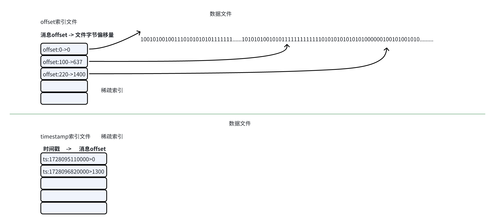


## 7.17 **kafka的分区 分布策略 是怎样的？**

> 一个topic创建时有多个分区，那这些分区及副本是怎样放置在哪些broker节点上

分区分布的计算策略如下

* 副本因子不能大于 Broker 的个数；

* **第一个分区**（编号为0）的第一个副本放置位置是随机从 brokerList 选择的；

* **其他分区**的第一个副本放置位置相对于第0个分区依次往后移。也就是如果我们有5个 Broker，5个分区，假设第1个分区放在第四个 Broker 上，那么第2个分区将会放在第五个 Broker 上；第3个分区将会放在第一个 Broker 上；第4个分区将会放在第二个 Broker 上，依次类推；

* **剩余副本**相对于第1个副本放置位置是由一个随机数nextReplicaShift 决定；&#x20;


> 首先，把各分区的leader副本安排位置：选一个随机broker，从这里开始依次顺序放置各分区leader
>
> 然后，安排各分区的follower副本：相对于它的leader偏一个随机数，依次顺延放各个follower


## 7.18 **kafka的topic的分区数可以增加或减少吗？为什么？**

**kafka允许对topic动态增加分区，但不支持减少分区**

因为减少分区，必然需要迁移数据，而迁移数据必然会破坏分区数据有序性；


## 7.19 **kafka新建的分区会在哪创建存储目录**

&#x7531;**`log.dirs`**`参数`决定的


## 7.20 **消费者和消费者组有什么关系？**

* 消费者属于某个消费组

* 消费组包含一个或多个消费者


消费组，可以把多个消费者绑在一起共同消费同一份目标数据（多个topic多个partition）；互相不重复；

而且，消费组可以实现在组内进行分区分配的动态均衡；

有新消费者加入组，会触发再均衡；

有消费者下线，会触发再均衡；


## 7.21 **kafka 监控插件都有哪些？**

* kafka manager

* kafka-offset-monitor ：主要做消费者偏移量的监控

* kafka-eagle：功能很强大！（现已改名为：EFAK —— eagle for apache kafka）

https://www.kafka-eagle.org/


***

# 备用内容------------------------------------------------------

# **1.基本概念**

## **1.1什么是kafka&#x20;**

Kafka 最初是由 LinkedIn 即领英公司基于 Scala 和 Java 语言开发的分布式**消息发布-订阅系统**，现已捐献给Apache 软件基金会。其具有高吞吐、低延迟的特性，许多大数据实时流式处理系统比如 Storm、Spark、Flink等都能很好地与之集成。

总的来讲，Kafka 通常具有 3 重角色：

* **存储系统：**&#x901A;常消息队列会把消息持久化到磁盘，防止消息丢失，保证消息可靠性。Kafka 的消息持久化机制和多副本机制使其能够作为通用数据存储系统来使用。

* **消息系统：**&#x4B;afka 和传统的消息队列比如 RabbitMQ、RocketMQ、ActiveMQ 类似，支持流量削峰、服务解耦、异步通信等核心功能。

* **流处理平台：**&#x4B;afka 不仅能够与大多数流式计算框架完美整合，并且自身也提供了一个完整的流式处理库，即 Kafka Streaming。Kafka Streaming 提供了类似 Flink 中的窗口、聚合、变换、连接等功能。

  **一句话概括：Kafka 是一个分布式的基于发布/订阅模式的消息中间件，在业界主要应用于大数据实时流式计算领域，起解耦合和削峰填谷的作用。&#x20;**

## **1.2kafka的特点**

* **高吞吐量、低延迟：**&#x6B;afka每秒可以处理几十万条消息，它的延迟最低只有几毫秒，每个topic可以分多个partition, 由多个consumer group 对partition进行consume操作。

* **可扩展性：**&#x6B;afka集群支持热扩展

* **持久性、可靠性：**&#x6D88;息被持久化到本地磁盘，并且**支持数据备份**防止数据丢失

* **容错性：允许集群中有节点失败**（若副本数量为n,则允许n-1个节点失败）

* **高并发：**&#x652F;持数千个客户端同时读写

Kafka在各种应用场景中，起到的作用可以归纳为这么几个术语：**削峰填谷，解耦！**

**在大数据流式计算领域中，kafka主要作为计算系统的前置缓存和输出结果缓存；**

## 2.1安装zookeeper集群

1. **上传安装包**

2. **移动到指定文件夹**

```plain&#x20;text
 mv zookeeper-3.4.6.tar.gz  /opt/apps/
```

* **解压**

```plain&#x20;text
tar -zxvf zookeeper-3.4.6.tar.gz
```

* **修改配置文件**

```plain&#x20;text
（1）进入到conf目录下
cd /opt/apps/zookeeper-3.4.6/conf
（2）修改配置文件名称
mv  zoo_sample.cfg   zoo.cfg
（3）编辑配置文件
vi zoo.cfg
dataDir=/opt/apps/data/zkdata
server.1=linux01:2888:3888
server.2=linux01:2888:3888
server.3=linux01:2888:3888
```

* **创建数据目录**

```plain&#x20;text
mkdir -p /opt/apps/data/zkdata
```

* **在各个节点的数据存储目录中，生成一个myid文件，内容为它的id**

```plain&#x20;text
echo 1 > /opt/apps/data/zkdata/myid
echo 2 > /opt/apps/data/zkdata/myid
echo 3 > /opt/apps/data/zkdata/myid
```

* **分发安装包**

```plain&#x20;text
# 使用for循环分发
for i in {2..3}; 
do scp -r zookeeper-3.4.6 linux0$i:$PWD;  
done 
```

* **配置环境变量**

```plain&#x20;text
vi /etc/profile
#ZOOKEEPER_HOME
export ZOOKEEPER_HOME=/opt/apps/zookeeper-3.4.6
export PATH=$PATH:$ZOOKEEPER_HOME/bin 

source /etc/profile
# 注意：还需要分发环境变量
```

* **启停集群**

```plain&#x20;text
bin/zkServer.sh start   # zk服务启动
bin/zkServer.sh status  # zk查看服务状态
bin/zkServer.sh stop    # zk停止服务
```

* **一键启停脚本**

（1）启动脚本

```plain&#x20;text
#!/bin/bash
for i in 1 2 3 
do
ssh linux0${i} "source /etc/profile;/opt/apps/zookeeper-3.4.6/bin/zkServer.sh start"
done
```

（2）停止脚本

```plain&#x20;text
#!/bin/bash
for i in 1 2 3
do
ssh linux0${i} "source /etc/profile;/opt/apps/zookeeper-3.4.6/bin/zkServer.sh stop"
done
```

## 2.2安装kafka集群

1. **上传安装包**

2. **解压**

```plain&#x20;text
tar -zxvf kafka_2.11-2.2.2.tgz tar  -C /opt/apps/
```

* **修改配置文件**

```plain&#x20;text
（1）进入配置文件目录
[root@linux01 apps]# cd kafka_2.12-2.3.1/config
（2）编辑配置文件
vi server.properties
#为依次增长的：0、1、2、3、4，集群中唯一 id
broker.id=0   
#数据存储的⽬录 
log.dirs=/opt/data/kafkadata
#底层存储的数据（日志）留存时长（默认7天）
log.retention.hours=168
#底层存储的数据（日志）留存量（默认1G） 
log.retention.bytes=1073741824
#指定zk集群地址
zookeeper.connect=linux01:2181,linux02:2181,linux03:2181
```

* **分发安装包**

```plain&#x20;text
for  i  in {2..3} 
do 
scp  -r  kafka_2.11-2.2.2  linux0$i:$PWD 
done
```

> 安装包分发后，记得修改config/server.properties中的 配置参数： broker.id

* **环境变量**

```plain&#x20;text
vi /etc/profile
export KAFKA_HOME=/opt/apps/kafka_2.11-2.2.2
export PATH=$PATH:$KAFKA_HOME/bin 

source /etc/profile
# 注意：还需要分发环境变量
```

* **启停集群（在各个节点上启动）**

```plain&#x20;text
bin/kafka-server-start.sh -daemon /opt/apps/kafka_2.11-2.2.2/config/server.properties   

# 停止集群
bin/kafka-server-stop.sh
```

* **一键启停脚本：**

```plain&#x20;text
#!/bin/bash

case $1 in
"start"){
        for i in linux01 linux02 linux03
        do
        echo ---------- kafka $i 启动 ------------
                ssh $i "source /etc/profile;  /opt/app/kafka2.4.1/bin/kafka-server-start.sh -daemon /opt/app/kafka2.4.1/config/server.properties"
        done
};;
"stop"){
        for i in linux01 linux02 linux03
        do
        echo ---------- kafka $i 停止 ------------
                ssh $i "source /etc/profile;  /opt/app/kafka2.4.1/bin/kafka-server-stop.sh "
        done
};;
esac
```

## 2.3**Kafka运维监控：Kafka-Eagle（了解）**

kafka自身并没有集成监控管理系统，因此对kafka的监控管理比较不便，好在有大量的第三方监控管理系统来使用，常见的有：

* Kafka Eagle

* KafkaOffsetMonitor

* Kafka Manager（雅虎开源的Kafka集群管理器）

* Kafka Web Console

* 还有JMX接口自开发监控管理系统


**2.3.1Kafka-Eagle安装**

安装包下载地址： http://download.kafka-eagle.org/

官方文档地址：<https://docs.kafka-eagle.org/>

1. **上传，解压**

2. **配置环境变量：JAVA\_HOME 和KE\_HOME**

```plain&#x20;text
vi /etc/profile

-- 之前配过了就不用再配了
export JAVA_HOME=/opt/apps/jdk1.8.3_9u19
export PATH=$PATH:$JAVA_HOME/bin

export KE_HOME=/opt/apps/efak-web-2.1.0
export PATH=$PATH:$KE_HOME/bin
```

* **配置KafkaEagle**

```plain&#x20;text
cd ${KE_HOME}/conf
vi system-config.properties

修改如下内容：
######################################
# multi zookeeper & kafka cluster list
# Settings prefixed with 'kafka.eagle.' will be deprecated, use 'efak.' instead
######################################
efak.zk.cluster.alias=cluster1
cluster1.zk.list=linux01:2181,linux02:2181,linux03:2181

######################################
# broker size online list
######################################
cluster1.efak.broker.size=3

######################################
# kafka sqlite jdbc driver address
######################################
efak.driver=org.sqlite.JDBC
efak.url=jdbc:sqlite:/opt/data/kafka-eagle/db/ke.db
efak.username=root
efak.password=www.kafka-eagle.org

######################################
# kafka mysql jdbc driver address
######################################
#efak.driver=com.mysql.cj.jdbc.Driver
#efak.url=jdbc:mysql://linux01:3306/ke?useUnicode=true&characterEncoding=UTF-8&zeroDateTimeBehavior=convertToNull
#efak.username=root
#efak.password=123456
```

> 如上，数据库选择的是sqlite，需要手动创建所配置的db文件存放目录：/opt/data/kafka-eagle/db/
>
> 如果使用MySQL 提前在mysql中创建指定的数据库
>
> mysql> CREATE DATABASE IF NOT EXISTS ke DEFAULT CHARSET utf8 COLLATE utf8\_general\_ci;

* **配置kafka服务端的JMX端口【选配】**

```plain&#x20;text
在kafka的启动脚本：  kafka-server-start.sh 中添加如下命令：
if [ "x$KAFKA_HEAP_OPTS" = "x" ]; then
    export JMX_PORT="9999"
    export KAFKA_HEAP_OPTS="-Xmx1G -Xms1G"
fi
    
   这个加在文件的最后面
 
改完后，将文件同步给所有节点
然后重启kafka集群
```

* 配置KE\_HOME 环境变量

* **启动KafkaEagle**

```plain&#x20;text
cd ${KE_HOME}/bin
chmod +x ke.sh
./ke.sh start
```

* **访问web界面**

http://192.168.232.3:8048

账号密码：Account:admin ,Password:123456

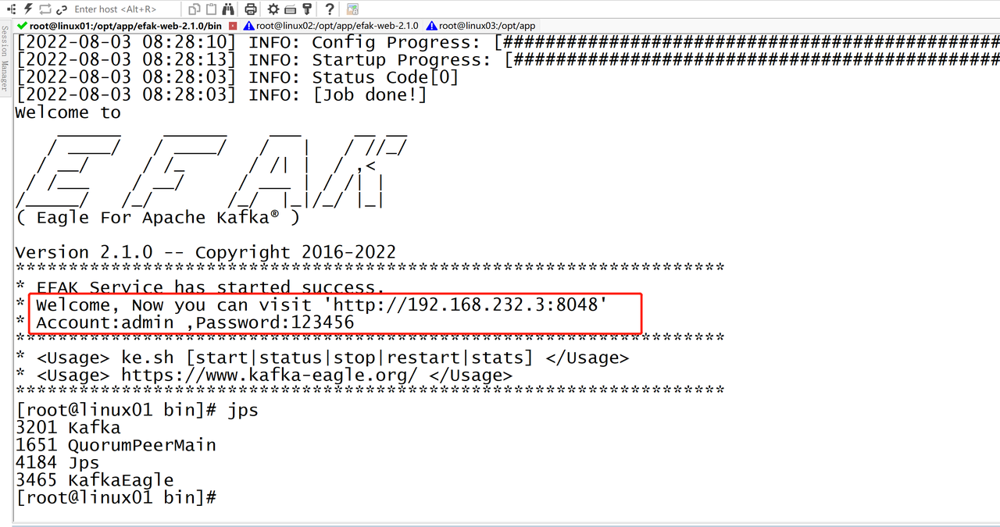

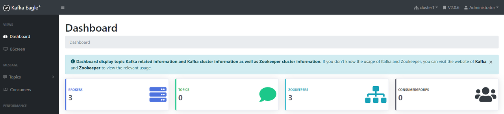

# 3.基本操作

## **3.1概述**

Kafka 中提供了许多命令行工具（位于$KAFKA HOME/bin 目录下）用于管理集群的变更。

| **kafka-console-consumer.sh**       | **用于消费消息**            |
| ----------------------------------- | --------------------- |
| **kafka-console-producer.sh**       | **用于生产消息**            |
| **kafka-topics.sh**                 | **用于管理主题**            |
| kafka-server-stop.sh                | 用于关闭Kafka服务           |
| kafka-server-start.sh               | 用于启动Kafka服务           |
| kafka-configs.sh                    | 用于配置管理                |
| kafka-consumer-perf-test.sh         | 用于测试消费性能              |
| kafka-producer-perf-test.sh         | 用于测试生产性能              |
| kafka-dump-log.sh                   | 用于查看数据日志内容            |
| kafka-preferred-replica-election.sh | 用于优先副本的选举             |
| kafka-reassign-partitions.sh        | 用于分区重分.000000000000 配 |

## 3.2**topic管理操作：kafka-topics**

### 3.2.1**查看topic列表**

```shell
kafka-topics.sh --bootstrap-server linux01:9092,linux02:9092,linux03:9092 --list
```

```shell
[root@linux01 bin]# ./kafka-topics.sh --list --zookeeper linux01:2181
__consumer_offsets
gmall2022_db_c
gmall_event_bak
gmall_start_bak
test001
topic_log
```

### **3.2.2查看topic状态信息**

```shell
[root@linux01 bin]# ./kafka-topics.sh --describe --zookeeper linux01:2181  --topic test
Topic: test     PartitionCount: 3       ReplicationFactor: 3    Configs: 
        Topic: test     Partition: 0    Leader: 2       Replicas: 2,0,1 Isr: 2,0,1
        Topic: test     Partition: 1    Leader: 0       Replicas: 0,1,2 Isr: 0,1,2
        Topic: test     Partition: 2    Leader: 1       Replicas: 1,2,0 Isr: 1,2,0
```

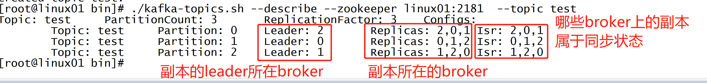

> 从上面的结果中可以看出
>
> topic的分区数量，以及每个分区的副本数量，以及每个副本所在的broker节点，以及每个分区的leader副本所在broker节点，以及每个分区的ISR副本列表；
>
> **ISR：** in  sync  replica ,同步副同步本（当然也包含leader自身，replica.lag.time.max.ms =30000）
>
> **OSR：**&#x6F;ut  of  sync replicas 失去同步的副本（该副本上次请求leader同步数据距现在的时间间隔超出配置阈值）

* ISR同步副本列表

ISR概念：（同步副本）。每个分区的leader会维护一个ISR列表，ISR列表里面就是follower副本的Borker编号，只有跟得上Leader的 follower副本才能加入到 ISR里面，这个是通过replica.lag.time.max.ms =30000（默认值）参数配置的，只有ISR里的成员才有被选为 leader 的可能。

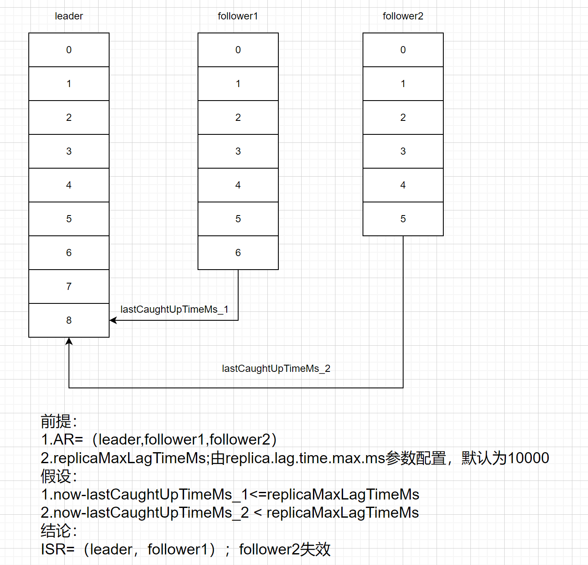

**踢出ISR和重新加入ISR的条件：**

* 踢出ISR的条件：  由replica.lag.time.max.ms =30000决定，如上图；

* 重新加入ISR的条件： OSR副本的LEO（log end offset）追上leader的LEO；

### **3.2.3创建topic**

> \--bootstrap-server  --zookeeper一样的效果 ，新版本建议使用 --bootstrap-server&#x20;

```shell
kafka-topics.sh   --bootstrap-server  linux01:9092,linux02:9092,linux03:9092    --create --topic test01  --partitions 3  --replication-factor  3
```

> 参数解释：
>
> \--replication-factor  副本数量
> \--partitions 分区数量&#x20;
> \--topic topic名称
>
> 本方式，副本的存储位置是系统自动决定的；

手动指定分配方案：分区数，副本数，存储位置

```typescript
kafka-topics.sh --create --topic tpc-1  --zookeeper linux01:2181 --replica-assignment 0:1:3,1:2:6

该topic，将有如下partition：(2个分区 3个副本)
partition0 ，所在节点： broker0、broker1、broker3
partition1 ，所在节点： broker1、broker2、broker6

[root@linux01 logs]# kafka-topics.sh --describe --topic tpc-1 --zookeeper linux01:2181
Topic: tpc-1    PartitionCount: 2       ReplicationFactor: 3    Configs: 
        Topic: tpc-1    Partition: 0    Leader: 0       Replicas: 0,1,3 Isr: 0,1
        Topic: tpc-1    Partition: 1    Leader: 1       Replicas: 1,2,6 Isr: 1,2
```

### 3.2.4**删除topic**

```typescript
bin/kafka-topics.sh --zookeeper linux01:2181 --delete --topic test
删除topic，server.properties中需要一个参数处于启用状态： delete.topic.enable = true(默认是true)
```

> 使用 kafka-topics .sh 脚本删除主题的行为本质上只是在 ZooKeeper 中的 /admin/delete\_topics 路径下建一个与待删除主题同名的节点，以标记该主题为待删除的状态。然后由 Kafka控制器异步完成。

### **3.2.5增加分区数**

```shell
kafka-topics.sh --zookeeper doit01:2181 --alter --topic doitedu-tpc2 --partitions 3
```

> Kafka只支持增加分区，不支持减少分区
>
> 原因是：减少分区，代价太大（数据的转移，日志段拼接合并）
>
> 如果真的需要实现此功能，则完全可以重新创建一个分区数较小的主题，然后将现有主题中的消息按照既定的逻辑复制过去；

### **3.2.6动态配置topic参数（不常用)**

通过管理命令，可以为已创建的topic增加、修改、删除topic level参数

* 添加/修改  指定topic的配置参数：

```shell
kafka-topics.sh  --zookeeper linux01:2181  --alter  --topic tpc2 --config compression.type=gzip 
# --config compression.type=gzip  修改或添加参数配置
# --add-config compression.type=gzip  添加参数配置
# --delete-config compression.type  删除配置参数
```

topic配置参数文档地址： https://kafka.apache.org/documentation/#topicconfigs

## 3.3**生产者：kafka-console-producer**

```shell
[root@linux01 logs]# kafka-console-producer.sh --broker-list linux01:9092 --topic test01                   
>a
>b     
>c
>hello 
>hi
>hadoop
>hive
```

### 顺序轮询（老版本）

顺序分配，消息是均匀的分配给每个 partition，即每个分区存储一次消息，轮询策略是 Kafka Producer 提供的默认策略，如果你不使用指定的轮询策略的话，Kafka 默认会使用顺序轮训策略的方式。

### 随机分配

实现随机分配的代码只需要两行，如下

```java
List<PartitionInfo> partitions = cluster.partitionsForTopic(topic);
return ThreadLocalRandom.current().nextInt(partitions.size()); 
```

## **3.4消费者：kafka-console-consumer**

消费者在消费的时候，需要指定要订阅的主题，还可以指定消费的起始偏移量

起始偏移量的指定策略有3中：

* earliest 起始点 &#x20;

* latest   最新

* 指定的offset（ 分区号：偏移量）  ==》 必须的告诉他是哪个topic 的哪个分区的哪个offset

* 从之前所记录的偏移量开始消费

> 在命令行中，可以指定从什么地方开始消费
>
> 1. 加上参数 --from-beginning 指定从最前面开始消费
>
> 2. 如果不加--from-beginning  就需要分情况讨论了，如果之前记录过消费的位置，那么就从之前消费的位置开始消费，如果说之前没有记录过之前消费的偏移量，那么就从最新的位置开始消费

kafka的topic中的消息，是有序号的（序号叫消息偏移量），而且消息的偏移量是在各个partition中独立维护的，在各个分区内，都是从0开始递增编号！

(1)消费消息

```shell
[root@linux01 logs]# kafka-console-consumer.sh --bootstrap-server linux01:9092 --topic test01 --from-beginning
hive
hello 
hadoop
```

```plain&#x20;text
-- 指定从最前面开始消费
[root@linux01 bin]# kafka-console-consumer.sh --bootstrap-server linux01:9092 --topic doitedu01 --from-beginning
hadoop
list
hello
kafka
--不指定他消费的位置的时候，就是从最新的地方开始消费
[root@linux01 bin]# kafka-console-consumer.sh --bootstrap-server linux01:9092 --topic doitedu01 
```

(2)指定要消费的分区，和要消费的起始offset

```shell
-- 从指定的offset(需要指定偏移量和分区号)
[root@linux01 bin]# kafka-console-consumer.sh --bootstrap-server linux01:9092 --topic doitedu01 --offset 2 --partition 0
yy
abc
3333
2222
```

(3)消费组

* 消费组是kafka为了提高消费并行度的一种机制！

* 在kafka的底层逻辑中，任何一个消费者都有自己所属的组（如果没有指定，系统会自己给你分配一个组id）

* 组和组之间，没有任何关系，大家都可以消费到目标topic的所有数据

* 但是组内的各个消费者，就只能读到自己所分配到的partitions

* KAFKA中的消费组，可以动态增减消费者,而且消费组中的消费者数量发生任意变动，都会重新分配分区消费任务(消费者组在均衡策略) &#x20;

> **如何让多个消费者组成一个组： 就是让这些消费者的groupId相同即可！**

## **3.5消费位移的记录**

kafka的消费者，可以记录自己所消费到的消息偏移量，记录的这个偏移量就叫（消费位移）；

记录这个消费到的位置，作用就在于消费者重启后可以接续上一次消费到位置来继续往后面消费；

消费位移，是组内共享的！！！消费位置记录在一个内置的topic中 ，默认是5s提交一次位移更新。

参数：**[auto.commit.interval.ms](https://kafka.apache.org/documentation/#consumerconfigs_auto.commit.interval.ms) 默认是5s记录一次**

```shell
--  可以使用特定的工具类 解析内置记录偏移量的topic
kafka-console-consumer.sh --bootstrap-server  linux01:9092 --from-beginning --topic __consumer_offsets --formatter "kafka.coordinator.group.GroupMetadataManager\$OffsetsMessageFormatter"
```

通过指定formatter工具类，来对\_\_consumer\_offsets主题中的数据进行解析；

```shell
[g01,doitedu01,0]::OffsetAndMetadata(offset=14, leaderEpoch=Optional[0], metadata=, commitTimestamp=1659889851318, expireTimestamp=None)
[g01,doitedu01,2]::OffsetAndMetadata(offset=17, leaderEpoch=Optional[0], metadata=, commitTimestamp=1659889856319, expireTimestamp=None)
[g01,doitedu01,1]::OffsetAndMetadata(offset=13, leaderEpoch=Optional[0], metadata=, commitTimestamp=1659889856319, expireTimestamp=None)
[g01,doitedu01,0]::OffsetAndMetadata(offset=14, leaderEpoch=Optional[0], metadata=, commitTimestamp=1659889856319, expireTimestamp=None)
```

如果需要获取某个特定 consumer-group的消费偏移量信息，则需要计算该消费组的偏移量记录所在分区： Math.abs(groupID.hashCode()) % numPartitions(50)  根据组id的hash取值%50 确定具体是将这个组具体每个分区消费到了哪里

\_\_consumer\_offsets的分区数为：50

## **3.6配置管理 kafka-config**

kafka-configs.sh 脚本是专门用来进行动态参数配置操作的，这里的操作是运行状态修改原有的配置，如此可以达到动态变更的目的；一般情况下不会进行动态修改 。&#x20;

> **动态配置的参数，会被存储在zookeeper上，因而是持久生效的**

可用参数的查阅地址： https://kafka.apache.org/documentation/#configuration

kafka-configs.sh 脚本包含：变更alter、查看describe 这两种指令类型；

kafka-configs. sh 支持主题、 broker 、用户和客户端这4个类型的配置。

kafka-configs.sh 脚本使用 entity-type 参数来指定操作配置的类型，并且使 entity-name参数来指定操作配置的名称。

比如查看topic的配置可以按如下方式执行：

```shell
kafka-configs.sh --zookeeper linux01:2181  --describe  --entity-type topics  --entity-name doitedu01
```

比如查看broker的动态配置可以按如下方式执行：

```shell
kafka-configs.sh  --describe --entity-type brokers --entity-name 0 --zookeeper linux01:2181
```

**entity-type和entity-name的对应关系**

&#x20; 示例：添加topic级别参数

```shell
kafka-configs.sh --zookeeper linux01:2181 --alter --entity-type topics --entity-name doitedu01  --add-config cleanup.policy=compact,max.message.bytes=10000
```

示例：添加broker参数

```shell
kafka-configs.sh  --entity-type brokers --entity-name 0 --alter --add-config log.flush.interval.ms=1000 --bootstrap-server linux01:9092,linux02:9092,linux03:9092
```

**动态配置topic参数**

通过管理命令，可以为已创建的topic增加、修改、删除topic level参数

添加/修改  指定topic的配置参数：

```shell
kafka-topics.sh  --topic doitedu01 --alter  --config compression.type=gzip --zookeeper linux01:2181  
```

如果利用 kafka-configs.sh 脚本来对topic、producer、consumer、broker等进行参数动态

添加、修改配置参数

```shell
kafka-configs.sh --zookeeper linux01:2181 --entity-type topics --entity-name doitedu01 --alter --add-config compression.type=gzip  
```

删除配置参数

```shell
kafka-configs.sh --zookeeper linux01:2181 --entity-type topics --entity-name doitedu01 --alter --delete-config compression.type  
```

# **4.API开发**

## 准备： 创建项目 ， 添加依赖

```xml
 <properties>
        <maven.compiler.source>8</maven.compiler.source>
        <maven.compiler.target>8</maven.compiler.target>
    </properties>

    <dependencies>
        <dependency>
            <groupId>org.apache.kafka</groupId>
            <artifactId>kafka-clients</artifactId>
            <version>2.3.1</version>
        </dependency>
    </dependencies>


    <!-- 依赖下载国内镜像库 -->
    <repositories>
        <repository>
            <id>nexus-aliyun</id>
            <name>Nexus aliyun</name>
            <layout>default</layout>
            <url>http://maven.aliyun.com/nexus/content/groups/public</url>
            <snapshots>
                <enabled>false</enabled>
                <updatePolicy>never</updatePolicy>
            </snapshots>
            <releases>
                <enabled>true</enabled>
                <updatePolicy>never</updatePolicy>
            </releases>
        </repository>
    </repositories>

    <!-- maven插件下载国内镜像库 -->
    <pluginRepositories>
        <pluginRepository>
            <id>ali-plugin</id>
            <url>http://maven.aliyun.com/nexus/content/groups/public/</url>
            <snapshots>
                <enabled>false</enabled>
                <updatePolicy>never</updatePolicy>
            </snapshots>
            <releases>
                <enabled>true</enabled>
                <updatePolicy>never</updatePolicy>
            </releases>
        </pluginRepository>
    </pluginRepositories>


    <build>
        <plugins>

            <!-- 指定编译java的插件 -->
            <plugin>
                <groupId>org.apache.maven.plugins</groupId>
                <artifactId>maven-compiler-plugin</artifactId>
                <version>3.5.1</version>
                <configuration>
                    <source>1.8</source>
                    <target>1.8</target>
                </configuration>
            </plugin>

            <!-- 指定编译scala的插件 -->
            <plugin>
                <groupId>net.alchim31.maven</groupId>
                <artifactId>scala-maven-plugin</artifactId>
                <version>3.2.2</version>
                <executions>
                    <execution>
                        <goals>
                            <goal>compile</goal>
                            <goal>testCompile</goal>
                        </goals>
                        <configuration>
                            <args>
                                <arg>-dependencyfile</arg>
                                <arg>${project.build.directory}/.scala_dependencies</arg>
                            </args>
                        </configuration>
                    </execution>
                </executions>
            </plugin>


            <!--  把依赖jar中的用到的类，提取到自己的jar中 -->
            <plugin>
                <groupId>org.apache.maven.plugins</groupId>
                <artifactId>maven-assembly-plugin</artifactId>
                <version>2.6</version>
                <configuration>
                    <archive>
                        <manifest>
                            <mainClass></mainClass>
                        </manifest>
                    </archive>
                    <descriptorRefs>
                        <descriptorRef>jar-with-dependencies</descriptorRef>
                    </descriptorRefs>
                </configuration>
                <!--下面是为了使用 mvn package命令，如果不加则使用mvn assembly-->
                <executions>
                    <execution>
                        <id>make-assemble</id>
                        <phase>package</phase>
                        <goals>
                            <goal>single</goal>
                        </goals>
                    </execution>
                </executions>
            </plugin>

        </plugins>

    </build>

```

## 4.3**topic管理**

如果希望将管理类的功能集成到公司内部的系统中，打造集管理、监控、运维、告警为一体的生态平台，那么就需要以程序调用 API 方式去实现。

工具类KafkaAdminClient可以用来**管理broker、配置和ACL （Access Control List），管理topic**

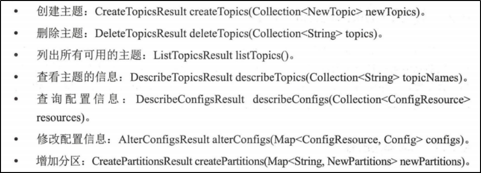

构造一个KafkaAdminClient

```java
AdminClient adminClient = KafkaAdminClient.create(props);
```

### **4.3.1列出主题**

```java
ListTopicsResult listTopicsResult = adminClient.listTopics();
Set<String> topics = listTopicsResult.names().get();
System.out.println(topics);
```

### 4.3.2**查看主题信息**

```java
DescribeTopicsResult describeTopicsResult = adminClient.describeTopics(Arrays.asList("tpc_4", "tpc_3"));
Map<String, TopicDescription> res = describeTopicsResult.all().get();
Set<String> ksets = res.keySet();
for (String k : ksets) {
    System.out.println(res.get(k));
}
```

### 4.3.2**创建主题**

```java
// 参数配置
Properties props = new Properties();
props.put(AdminClientConfig.BOOTSTRAP_SERVERS_CONFIG,"doit01:9092,doit02:9092,doit03:9092");
props.put(AdminClientConfig.REQUEST_TIMEOUT_MS_CONFIG,3000);

// 创建 admin client 对象
AdminClient adminClient = KafkaAdminClient.create(props);
// 由服务端controller自行分配分区及副本所在broker
NewTopic tpc_3 = new NewTopic("tpc_3", 2, (short) 1);
// 手动指定分区及副本的broker分配
HashMap<Integer, List<Integer>> replicaAssignments = new HashMap<>();
// 分区0，分配到broker0，broker1
replicaAssignments.put(0,Arrays.asList(0,1));
// 分区1，分配到broker0,broker2
replicaAssignments.put(1,Arrays.asList(0,1));

NewTopic tpc_4 = new NewTopic("tpc_4", replicaAssignments);
CreateTopicsResult result = adminClient.createTopics(Arrays.asList(tpc_3,tpc_4));

// 从future中等待服务端返回
try {
    result.all().get();
} catch (Exception e) {
    e.printStackTrace();
}
adminClient.close();
```

### **4.3.3删除主题**

```java
DeleteTopicsResult deleteTopicsResult = adminClient.deleteTopics(Arrays.asList("tpc_1", "tpc_1"));
Map<String, KafkaFuture<Void>> values = deleteTopicsResult.values();
System.out.println(values);
```

汇总代码示例：

```java
package com.doit.ApisDemo;

import org.apache.kafka.clients.admin.*;
import org.apache.kafka.common.KafkaFuture;
import org.apache.kafka.common.TopicPartitionInfo;

import java.util.*;
import java.util.concurrent.ExecutionException;

public class AdminDemo {
    public static void main(String[] args)  {
        Properties props = new Properties();
        props.setProperty(AdminClientConfig.BOOTSTRAP_SERVERS_CONFIG,"linux01:9092");
        props.setProperty(AdminClientConfig.REQUEST_TIMEOUT_MS_CONFIG,"3000");
        //创建kafkaAdmin对象
        AdminClient adminClient = KafkaAdminClient.create(props);

//列出所有主题
        ListTopicsResult listTopicsResult = adminClient.listTopics();
        System.out.println(listTopicsResult.names().get());

//创建topic
        NewTopic topic1 = new NewTopic("idea_topic_1", 2, (short) 2);
        NewTopic topic2 = new NewTopic("idea_topic_2", 3, (short) 3);
        
        
//创建topic  指定分区数和副本数
        CreateTopicsResult res1 = adminClient.createTopics(Arrays.asList(topic1, topic2));
        try {
            res1.all().get();
        } catch (InterruptedException e) {
            System.out.println("有异常了："+e);
        } catch (ExecutionException e) {
            System.out.println("有异常了："+e);        }


//创建topic 手动指定分区和副本分别在哪个broker上
        HashMap<Integer, List<Integer>> replicaAssignments = new HashMap<>();
        //需要传一个key value key 代表的是broker value代表的是副本分别在哪些broker 上
        replicaAssignments.put(0,Arrays.asList(0,1));
        replicaAssignments.put(1,Arrays.asList(1,2));

        //创建一个新的topic信息
        NewTopic idea_topic_3 = new NewTopic("idea_topic_3", replicaAssignments);
        //创建topic
        CreateTopicsResult res2 = adminClient.createTopics(Arrays.asList(idea_topic_3));
        try {
            res2.all().get();
        } catch (InterruptedException e) {
            System.out.println("有异常了："+e);        } catch (ExecutionException e) {
            System.out.println("有异常了："+e);        }


//描述主题
       DescribeTopicsResult res = adminClient.describeTopics(Arrays.asList("idea_topic_3"));
        //获取到主题的所有信息
        Map<String, TopicDescription> map = res.all().get();
        Set<Map.Entry<String, TopicDescription>> entries = map.entrySet();
        for (Map.Entry<String, TopicDescription> entry : entries) {
            String topicName = entry.getKey();
            TopicDescription des = entry.getValue();
            //分区的详细信息，leader在哪，副本在哪，分区具体是什么情况，isr副本是什么情况
            List<TopicPartitionInfo> partitions = des.partitions();
            //主题的名称
            String name = des.name();
            System.out.println(topicName+","+name+","+partitions);
        }


//删除主图
        DeleteTopicsResult deleteTopicsResult = adminClient.deleteTopics(Arrays.asList("idea_topic_1", "idea_topic_2"));
        try {
            deleteTopicsResult.all().get();
        } catch (InterruptedException e) {
            System.out.println("有异常了："+e);
        } catch (ExecutionException e) {
            System.out.println("有异常了："+e);
        }
    }
}
```

## 4.1**生产者api示例**

一个正常的生产逻辑需要具备以下几个步骤

1. 配置生产者参数及创建相应的生产者实例

2. 构建待发送的消息

3. 发送消息

4. 关闭生产者实例

采用默认分区方式将消息散列的发送到各个分区当中

```java
package com.doitedu;

import org.apache.kafka.clients.producer.KafkaProducer;
import org.apache.kafka.clients.producer.ProducerRecord;

import java.util.Properties;

public class KafkaProducerDemo {
    public static void main(String[] args) throws InterruptedException {
        /**
         * 1.构建一个kafka的客户端
         * 2.创建一些待发送的消息，构建成kafka所需要的格式
         * 3.调用kafka的api去发送消息
         * 4.关闭kafka生产实例
         */
        //1.创建kafka的对象，配置一些kafka的配置文件
        //它里面有一个泛型k,v
        //要发送数据的key
        //要发送的数据value
        //他有一个隐含之意，就是kafka发送的消息，是一个key，value类型的数据，但是不是必须得，其实只需要发送value的值就可以了
        Properties pros = new Properties();
        //指定kafka集群的地址
        pros.setProperty("bootstrap.servers", "linux01:9092,linux02:9092,linux03:9092");
        //指定key的序列化方式
        pros.setProperty("key.serializer", "org.apache.kafka.common.serialization.StringSerializer");
        //指定value的序列化方式
        pros.setProperty("value.serializer", "org.apache.kafka.common.serialization.StringSerializer");
        //ack模式，取值有0，1，-1（all），all是最慢但最安全的  服务器应答生产者成功的策略
        pros.put("acks", "all");
        //这是kafka发送数据失败的重试次数，这个可能会造成发送数据的乱序问题
        pros.setProperty("retries", "3");
        //数据发送批次的大小 单位是字节
        pros.setProperty("batch.size", "10000");
        //一次数据发送请求所能发送的最大数据量
        pros.setProperty("max.request.size", "102400");
        //消息在缓冲区保留的时间，超过设置的值就会被提交到服务端
        pros.put("linger.ms", 10000);
        //整个Producer用到总内存的大小，如果缓冲区满了会提交数据到服务端
        //buffer.memory要大于batch.size，否则会报申请内存不足的错误
        pros.put("buffer.memory", 10240);

        KafkaProducer<String, String> kafkaProducer = new KafkaProducer<>(pros);
        for (int i = 0; i < 1000; i++) {
            //key value  0 --> doit32+-->+0
            //key value  1 --> doit32+-->+1
            //key value  2 --> doit32+-->+2
            //2.创建一些待发送的消息，构建成kafka所需要的格式
            ProducerRecord<String, String> record = new ProducerRecord<>("test01", i + "", "doit32-->" + i);
            //3.调用kafka的api去发送消息
            kafkaProducer.send(record);
            Thread.sleep(100);
        }
        kafkaProducer.flush();
        kafkaProducer.close();
    }
}
```

对于properties配置的第二种写法，相对来说不会出错，简单举例：

```java
public static void main(String[] args) {
    Properties pros = new Properties();
    pros.setProperty(ProducerConfig.BOOTSTRAP_SERVERS_CONFIG, "linux01:9092,linux02:9092,linux03:9092");
    pros.setProperty(ProducerConfig.KEY_SERIALIZER_CLASS_CONFIG, StringSerializer.class.getName());
    pros.setProperty(ProducerConfig.VALUE_SERIALIZER_CLASS_CONFIG, StringSerializer.class.getName());
}
```

> 小问题：
>
> **1.kafka的生产者可以持续不断的向topic中发送数据不？**
>
> 可以
>
> **2.kafak的生产者有哪些必须配置的参数：**
>
> &#x20;*//指定kafka集群的地址*
> pros.setProperty("bootstrap.servers", "linux01:9092,linux02:9092,linux03:9092");
> *//指定key的序列化方式*
> pros.setProperty("key.serializer","org.apache.kafka.common.serialization.StringSerializer");
> *//指定value的序列化方式*
> pros.setProperty("value.serializer","org.apache.kafka.common.serialization.StringSerializer");
>
> **3.kafka生产者发送数据的时候，可以用jdk的序列化器来将数据进行序列化不？**
>
> 不可以，kafka有指定的序列化接口 org.apache.kafka.common.serialization.Serializer
>
> **4.构造一个kafka的生产者后，是不是就已经确定了，我的数据是需要发送到哪一个topic里面不？**
>
> 不是哦，咱们构造生产者对象的时候不需要指定topic，是在构造发送数据对象的时候才指定的

## 4.2**消费者Api示例**

一个正常的消费逻辑需要具备以下几个步骤：

1. 配置消费者客户端参数及创建相应的消费者实例；

2. 订阅主题topic；

3. **拉取**消息并消费；

4. 定期向\_\_consumer\_offsets主题提交消费位移offset；

5. 关闭消费者实例

```java
package com.doitedu;

import org.apache.kafka.clients.consumer.ConsumerConfig;
import org.apache.kafka.clients.consumer.ConsumerRecord;
import org.apache.kafka.clients.consumer.ConsumerRecords;
import org.apache.kafka.clients.consumer.KafkaConsumer;
import org.apache.kafka.common.header.Header;
import org.apache.kafka.common.header.Headers;
import org.apache.kafka.common.record.TimestampType;
import org.apache.kafka.common.serialization.StringDeserializer;

import java.time.Duration;
import java.util.Arrays;
import java.util.Iterator;
import java.util.Optional;
import java.util.Properties;

public class ConsumerDemo {
    public static void main(String[] args) {
        //1.创建kafka的消费者对象，附带着把配置文件搞定
        Properties props = new Properties();
        props.setProperty(ConsumerConfig.BOOTSTRAP_SERVERS_CONFIG,"linux01:9092,linux02:9092,linux03:9092");
        props.setProperty(ConsumerConfig.KEY_DESERIALIZER_CLASS_CONFIG, StringDeserializer.class.getName());
        props.setProperty(ConsumerConfig.VALUE_DESERIALIZER_CLASS_CONFIG, StringDeserializer.class.getName());
        // 定义kakfa 服务的地址，不需要将所有broker指定上
       // props.put("bootstrap.servers", "linux01:9092,linux02:9092,linux03:9092");
        // 制定consumer group
        props.put("group.id", "g3");
        // 是否自动提交offset  __consumer_offset   有多少分区  50 
        props.put("enable.auto.commit", "true");
        // 自动提交offset的时间间隔   -- 这玩意设置的大小怎么控制
        props.put("auto.commit.interval.ms", "5000");  //50000   1000
        // key的反序列化类
        props.put("key.deserializer", "org.apache.kafka.common.serialization.StringDeserializer");
        // value的反序列化类
        props.put("value.deserializer", "org.apache.kafka.common.serialization.StringDeserializer");
        // 如果没有消费偏移量记录，则自动重设为起始offset：latest, earliest, none
        props.put("auto.offset.reset","earliest");
        KafkaConsumer<String, String> consumer = new KafkaConsumer<>(props);

        //2.订阅主题(确定需要消费哪一个或者多个主题)
        consumer.subscribe(Arrays.asList("test02"));
        //3.开始从topic中获取数据
        while (true){
            ConsumerRecords<String, String> records = consumer.poll(Duration.ofMillis(Integer.MAX_VALUE));
            for (ConsumerRecord<String, String> record : records) {
                //这是数据所属的哪一个topic
                String topic = record.topic();
                //该条数据的偏移量
                long offset = record.offset();
                //这条数据是哪一个分区的
                int partition = record.partition();
                //这条数据记录的时间戳,但是这个时间戳有两个类型
                long timestamp = record.timestamp();
                //上面时间戳的类型，这个类型有两个，一个是CreateTime(这条数据创建的时间), LogAppendTime(这条数据往日志里面追加的时间)
                TimestampType timestampType = record.timestampType();
                //这个数据key的值
                String key = record.key();
                //这条数据value的值
                String value = record.value();
                //分区leader的纪元
                Optional<Integer> integer = record.leaderEpoch();
                //key的长度
                int keySize = record.serializedKeySize();
                //value的长度
                int valueSize = record.serializedValueSize();
                //数据的头部信息
                Headers headers = record.headers();
//            for (Header header : headers) {
//                String hKey = header.key();
//                byte[] hValue = header.value();
//                String valueString = new String(hValue);
//                System.out.println("header的key值 = " + hKey + "header的value的值 = "+ valueString);
//            }
                System.out.printf("topic = %s ,offset = %d, partition = %d, timestampType = %s ,timestamp = %d , key = %s , value = %s ,leader的纪元 = %d , key序列化的长度 = %d ,value 序列化的长度 = %d \r\n" ,
                        topic,offset,partition,timestampType + "",timestamp,key,value,integer.get(),keySize,valueSize);
            }
        }

        //4.关闭消费者对象
//        consumer.close();
    }
}
```

### **4.2.1subscribe订阅主题**

subscribe有如下重载方法：

```java
public void subscribe(Collection<String> topics,ConsumerRebalanceListener listener) 
public void subscribe(Collection<String> topics) 
public void subscribe(Pattern pattern, ConsumerRebalanceListener listener) 
public void subscribe(Pattern pattern)
```

1. 指定集合方式订阅主题

```java
consumer.subscribe(Arrays.asList(topicl ));
```

* 正则方式订阅主题

如果消费者采用的是正则表达式的方式（subscribe(Pattern)）订阅， 在之后的过程中，如果有人又创建了新的主题，并且主题名字与正表达式相匹配，那么这个消费者就可以消费到新添加的主题中的消息。如果应用程序需要消费多个主题，并且可以处理不同的类型，那么这种订阅方式就很有效。

正则表达式的方式订阅的示例

```java
consumer.subscribe(Pattern.compile ("topic.*" ));
```

> 利用正则表达式订阅主题，可实现动态订阅

### **4.2.2assign订阅主题**

消费者不仅可以通过 KafkaConsumer.subscribe() 方法订阅主题，还可直接订阅某些主题的指定分区；

&#x20;在 KafkaConsumer 中提供了 assign() 方法来实现这些功能，此方法的具体定义如下：

```java
package com.doitedu;

import org.apache.kafka.clients.consumer.ConsumerConfig;
import org.apache.kafka.clients.consumer.ConsumerRecord;
import org.apache.kafka.clients.consumer.ConsumerRecords;
import org.apache.kafka.clients.consumer.KafkaConsumer;
import org.apache.kafka.common.TopicPartition;
import org.apache.kafka.common.header.Headers;
import org.apache.kafka.common.record.TimestampType;
import org.apache.kafka.common.serialization.StringDeserializer;

import java.time.Duration;
import java.util.Arrays;
import java.util.Optional;
import java.util.Properties;

public class ConsumerDemo1 {
    public static void main(String[] args) {
        //1.创建kafka的消费者对象，附带着把配置文件搞定
        Properties props = new Properties();
        props.setProperty(ConsumerConfig.BOOTSTRAP_SERVERS_CONFIG,"linux01:9092,linux02:9092,linux03:9092");
        props.setProperty(ConsumerConfig.KEY_DESERIALIZER_CLASS_CONFIG, StringDeserializer.class.getName());
        props.setProperty(ConsumerConfig.VALUE_DESERIALIZER_CLASS_CONFIG, StringDeserializer.class.getName());
        props.setProperty(ConsumerConfig.GROUP_ID_CONFIG,"doit01");

        KafkaConsumer<String, String> consumer = new KafkaConsumer<>(props);

        //2.订阅主题(确定需要消费哪一个或者多个主题)
//        consumer.subscribe(Arrays.asList("test03"));

//        consumer.poll(Duration.ofMillis(Integer.MAX_VALUE));
//        //我现在想手动指定，我需要从哪边开始消费
//        //如果用subscribe去订阅主题的时候，他内部会给这个消费者组来一个自动再均衡
//        consumer.seek(new TopicPartition("test03",0),2);
        TopicPartition tp01 = new TopicPartition("test03", 0);

        //他就是手动去订阅主题和partition，有了这个就不需要再去订阅subscribe主题了，手动指定以后，他的内部就不会再来自动均衡了
        consumer.assign(Arrays.asList(tp01)); // 手动订阅指定主题的指定分区的指定位置
        consumer.seek(new TopicPartition("test03",0),2);

        //3.开始从topic中获取数据
        while (true){
            ConsumerRecords<String, String> records = consumer.poll(Duration.ofMillis(Integer.MAX_VALUE));
            for (ConsumerRecord<String, String> record : records) {
                //这是数据所属的哪一个topic
                String topic = record.topic();
                //该条数据的偏移量
                long offset = record.offset();
                //这条数据是哪一个分区的
                int partition = record.partition();
                //这条数据记录的时间戳,但是这个时间戳有两个类型
                long timestamp = record.timestamp();
                //上面时间戳的类型，这个类型有两个，一个是CreateTime(这条数据创建的时间), LogAppendTime(这条数据往日志里面追加的时间)
                TimestampType timestampType = record.timestampType();
                //这个数据key的值
                String key = record.key();
                //这条数据value的值
                String value = record.value();

                //分区leader的纪元
                Optional<Integer> integer = record.leaderEpoch();
                //key的长度
                int keySize = record.serializedKeySize();
                //value的长度
                int valueSize = record.serializedValueSize();
                //数据的头部信息
                Headers headers = record.headers();
//            for (Header header : headers) {
//                String hKey = header.key();
//                byte[] hValue = header.value();
//                String valueString = new String(hValue);
//                System.out.println("header的key值 = " + hKey + "header的value的值 = "+ valueString);
//            }
                System.out.printf("topic = %s ,offset = %d, partition = %d, timestampType = %s ,timestamp = %d , key = %s , value = %s ,leader的纪元 = %d , key序列化的长度 = %d ,value 序列化的长度 = %d \r\n" ,
                        topic,offset,partition,timestampType + "",timestamp,key,value,integer.get(),keySize,valueSize);
            }
        }

        //4.关闭消费者对象
//        consumer.close();
    }
}
```

这个方法只接受参数partitions，用来指定需要订阅的分区集合。示例如下：&#x20;

```java
consumer.assign(Arrays.asList(new TopicPartition ("tpc_1" , 0),new TopicPartition(“tpc_2”,1))) ;
```

### **4.2.3subscribe与assign的区别**

* 通过subscribe()方法订阅主题具有消费者自动再均衡功能 ；

在多个消费者的情况下可以根据分区分配策略来自动分配各个消费者与分区的关系。当消费组的消费者增加或减少时，分区分配关系会自动调整，以实现消费负载均衡及故障自动转移。&#x20;

* assign() 方法订阅分区时，是不具备消费者自动均衡的功能的；

其实这一点从assign方法参数可以看出端倪，两种类型subscribe()都有ConsumerRebalanceListener类型参数的方法，而assign()方法却没有。

### 4.2.4**取消订阅**

既然有订阅，那么就有取消订阅；

可以使用KafkaConsumer中的unsubscribe()方法采取消主题的订阅，这个方法既可以取消通过 subscribe( Collection）方式实现的订阅；

也可以取消通过subscribe(Pattem）方式实现的订阅，还可以取消通过assign( Collection）方式实现的订阅。示例码如下：

```java
consumer.unsubscribe();
```

如果将subscribe(Collection )或assign(Collection）集合参数设置为空集合，作用与unsubscribe（）方法相同，如下示例中三行代码的效果相同：

```java
consumer.unsubscribe();
consumer.subscribe(new ArrayList<String>()) ;
consumer.assign(new ArrayList<TopicPartition>());
```

### **4.2.5消息的消费模式**

Kafka中的消费是基于拉取模式的。

> 消息的消费一般有两种模式：推送模式和拉取模式。推模式是服务端主动将消息推送给消费者，而拉模式是消费者主动向服务端发起请求来拉取消息。

```java
public class ConsumerRecord<K, V> {
    public static final long NO_TIMESTAMP = RecordBatch.NO_TIMESTAMP;
    public static final int NULL_SIZE = -1;
    public static final int NULL_CHECKSUM = -1;

    private final String topic;
    private final int partition;
    private final long offset;
    private final long timestamp;
    private final TimestampType timestampType;
    private final int serializedKeySize;
    private final int serializedValueSize;
    private final Headers headers;
    private final K key;
    private final V value;

    private volatile Long checksum;
```

* topic partition 这两个属性分别代表消息所属主题的名称和所在分区的编号。

* offset 表示消息在所属分区的偏移量。&#x20;

* timestamp 表示时间戳，与此对应的timestampType 表示时间戳的类型。&#x20;

* timestampType 有两种类型 CreateTime 和LogAppendTime ，分别代表消息创建的时间戳和消息追加到日志的时间戳。

* headers 表示消息的头部内容。&#x20;

* key value 分别表示消息的键和消息的值，一般业务应用要读取的就是value ；

* serializedKeySize、serializedValueSize分别表示key、value 经过序列化之后的大小，如果 key 为空，则 serializedKeySize 值为 -1，同样，如果value为空，则serializedValueSize 的值也会为 -1；

* checksum 是CRC32的校验值。

示例代码片段

```java
/**
 * 订阅与消费方式2
 */
TopicPartition tp1 = new TopicPartition("x", 0);
TopicPartition tp2 = new TopicPartition("y", 0);
TopicPartition tp3 = new TopicPartition("z", 0);
List<TopicPartition> tps = Arrays.asList(tp1, tp2, tp3);
consumer.assign(tps);
​
while (true) {
    ConsumerRecords<String, String> records = consumer.poll(Duration.ofMillis(1000));
    for (TopicPartition tp : tps) {
        List<ConsumerRecord<String, String>> rList = records.records(tp);
        for (ConsumerRecord<String, String> r : rList) {
            r.topic();
            r.partition();
            r.offset();
            r.value();
            //do something to process record.
        }
    }
}
```

### **4.2.6指定位移消费**

有些时候，我们需要一种更细粒度的掌控，可以让我们从特定的位移处开始拉取消息，而 KafkaConsumer 中的seek()方法正好提供了这个功能，让我们可以追前消费或回溯消费。&#x20;

seek()方法的具体定义如下：

```java
seek都是和assign这个方法一起用 指定消费位置
public void seek(TopicPartiton partition,long offset)
```

代码示例：

```java
public class ConsumerDemo3指定偏移量消费 {
    public static void main(String[] args) {

        Properties props = new Properties();
        props.setProperty(ConsumerConfig.GROUP_ID_CONFIG,"g002");
        props.setProperty(ConsumerConfig.BOOTSTRAP_SERVERS_CONFIG,"doit01:9092");
        props.setProperty(ConsumerConfig.KEY_DESERIALIZER_CLASS_CONFIG, StringDeserializer.class.getName());
        props.setProperty(ConsumerConfig.VALUE_DESERIALIZER_CLASS_CONFIG,StringDeserializer.class.getName());
        props.setProperty(ConsumerConfig.AUTO_OFFSET_RESET_CONFIG,"latest");
        // 是否自动提交消费位移
        props.setProperty(ConsumerConfig.ENABLE_AUTO_COMMIT_CONFIG,"true");

        // 限制一次poll拉取到的数据量的最大值
        props.setProperty(ConsumerConfig.FETCH_MAX_BYTES_CONFIG,"10240000");
         KafkaConsumer<String, String> consumer = new KafkaConsumer<>(props);

        // assign方式订阅doit27-1的两个分区
        TopicPartition tp0 = new TopicPartition("doit27-1", 0);
        TopicPartition tp1 = new TopicPartition("doit27-1", 1);
        
        consumer.assign(Arrays.asList(tp0,tp1));
        // 指定分区0，从offset：800开始消费    ；  分区1，从offset：650开始消费
        consumer.seek(tp0,200);
        consumer.seek(tp1,250);

        // 开始拉取消息
        while(true){
            ConsumerRecords<String, String> poll = consumer.poll(Duration.ofMillis(3000));
            for (ConsumerRecord<String, String> rec : poll) {
                System.out.println(rec.partition()+","+rec.key()+","+rec.value()+","+rec.offset());
            }
        }
    }
}
```

### **4.2.7自动提交消费者偏移量**

Kafka中默认的消费位移的提交方式是自动提交，这个由消费者客户端参数enable.auto.commit 配置，默认值为 true 。当然这个默认的自动提交不是每消费一条消息就提交一次，而是定期提交，这个定期的周期时间由客户端参数 auto.commit.interval.ms配置，默认值为5秒，此参数生效的前提是 enable. auto.commit 参数为 true。

在默认的方式下，消费者每隔5秒会将拉取到的每个分区中最大的消息位移进行提交。自动位移提交的动作是在 poll() 方法的逻辑里完成的，在每次真正向服务端发起拉取请求之前会检查是否可以进行位移提交，如果可以，那么就会提交上一次轮询的位移。

Kafka 消费的编程逻辑中位移提交是一大难点，自动提交消费位移的方式非常简便，它免去了复杂的位移提交逻辑，让编码更简洁。**但随之而来的是重复消费和消息丢失的问题**。

* 重复消费

假设刚刚提交完一次消费位移，然后拉取一批消息进行消费，在下一次自动提交消费位移之前，消费者崩溃了，那么又得从上一次位移提交的地方重新开始消费，这样便发生了重复消费的现象（对于再均衡的情况同样适用）。我们可以通过减小位移提交的时间间隔来减小重复消息的窗口大小，但这样并不能避免重复消费的发送，而且也会使位移提交更加频繁。

* 丢失消息

按照一般思维逻辑而言，自动提交是延时提交，重复消费可以理解，那么消息丢失又是在什么情形下会发生的呢？我们来看下图中的情形：

拉取线程不断地拉取消息并存入本地缓存，比如在BlockingQueue 中，另一个处理线程从缓存中读取消息并进行相应的逻辑处理。设目前进行到了第 y+l 次拉取，以及第m次位移提交的时候，也就是 x+6 之前的位移己经确认提交了，处理线程却还正在处理**x+3**的消息；此时如果处理线程发生了异常，待其恢复之后会从第m次位移提交处，也就&#x662F;**&#x20;x+6** 的位置开始拉取消息，那么 x+3至x+6 之间的消息就没有得到相应的处理，这样便发生消息丢失的现象。

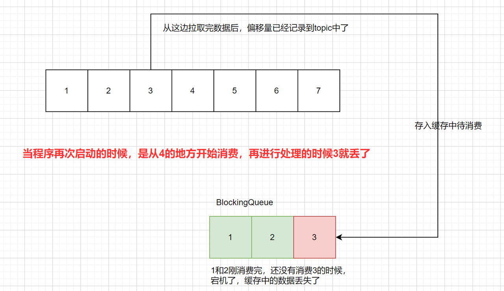

### **4.2.8手动提交消费者偏移量（调用kafka api）**

自动位移提交的方式在正常情况下不会发生消息丢失或重复消费的现象，但是在编程的世界里异常无可避免；同时，自动位移提交也无法做到精确的位移管理。在 Kafka中还提供了手动位移提交的方式，这样可以使得开发人员对消费位移的管理控制更加灵活。

很多时候并不是说拉取到消息就算消费完成，而是需要将消息写入数据库、写入本地缓存，或者是更加复杂的业务处理。在这些场景下，所有的业务处理完成才能认为消息被成功消费；

手动的提交方式可以让开发人员根据程序的逻辑在合适的时机进行位移提交。开启手动提交功能的前提是消费者客户端参数 enable.auto.commit 配置为false ，示例如下：

```java
props.put(ConsumerConf.ENABLE_AUTO_COMMIT_CONFIG, false); 
```

手动提交可以细分为同步提交和异步提交，对应于 KafkaConsumer 中的 commitSync()和

commitAsync()两种类型的方法。

commitSync()方法的定义如下：

```java
/**
 * 手动提交offset
 */
while (true) {
    ConsumerRecords<String, String> records = consumer.poll(Duration.ofMillis(1000));
    for (ConsumerRecord<String, String> r : records) {
        //do something to process record.
    }
    consumer.commitSync();
}
```

对于采用 commitSync()的无参方法，它提交消费位移的频率和拉取批次消息、处理批次消息的频率是一样的，如果想寻求更细粒度的、更精准的提交，那么就需要使用commitSync()的另一个有参方法，具体定义如下：

```java
public void commitSync(final Map<TopicPartition，OffsetAndMetadata> offsets)
```

示例代码如下：

```java
while (true) {
    ConsumerRecords<String, String> records = consumer.poll(Duration.ofMillis(1000));
    for (ConsumerRecord<String, String> r : records) {
        long offset = r.offset();
        //do something to process record.

        TopicPartition topicPartition = new TopicPartition(r.topic(), r.partition());
        consumer.commitSync(Collections.singletonMap(topicPartition,new OffsetAndMetadata(offset+1)));
    }
}
```

> 提交的偏移量  =  消费完的record的偏移量  +  1
>
> 因为，\_\_consumer\_offsets中记录的消费偏移量，代表的是，消费者下一次要读取的位置！！！

* **异步提交方式**

异步提交的方式（ commitAsync（））在执行的时候消费者线程不会被阻塞；可能在提交消费位移的结果还未返回之前就开始了新一次的拉取。异步提交可以让消费者的性能得到一定的增强。 commitAsync方法有一个不同的重载方法，具体定义如下


```java
/**
 * 异步提交offset
 */
while (true) {
    ConsumerRecords<String, String> records = consumer.poll(Duration.ofMillis(1000));
    for (ConsumerRecord<String, String> r : records) {
        long offset = r.offset();

        //do something to process record.
        TopicPartition topicPartition = new TopicPartition(r.topic(), r.partition());
        consumer.commitSync(Collections.singletonMap(topicPartition,new OffsetAndMetadata(offset+1)));
        consumer.commitAsync(Collections.singletonMap(topicPartition, new OffsetAndMetadata(offset + 1)), new OffsetCommitCallback() {
     @Override
     public void onComplete(Map<TopicPartition, OffsetAndMetadata> map, Exception e) {
                if(e == null ){
                    System.out.println(map);
                }else{
                    System.out.println("error commit offset");
                }
            }
        });
    }
}
```

### **4.2.9手动提交位移（时机的选择）**

* 数据处理完成之前先提交偏移量

可能会发生**漏处理**的现象（数据丢失）反过来说，这种方式实现了： **at most once**的数据处理（传递）语义

* 数据处理完成之后再提交偏移量

可能会发生**重复处理**的现象（数据重复）反过来说，这种方式实现了： **at least once**的数据处理（传递）语义当然，数据处理（传递）的理想语义是： exactly once（精确一次）Kafka也能做到exactly once（基于kafka的事务机制）

代码示例：

```java
package com.doitedu;

import org.apache.kafka.clients.consumer.*;
import org.apache.kafka.common.TopicPartition;
import org.apache.kafka.common.serialization.StringDeserializer;

import java.sql.*;
import java.time.Duration;
import java.util.Arrays;
import java.util.Collection;
import java.util.Properties;

public class CommitOffsetByMyself {
    public static void main(String[] args) throws SQLException {

        //获取mysql的连接对象
        Connection connection = DriverManager.getConnection("jdbc:mysql://localhost:3306/football", "root", "123456");
        connection.setAutoCommit(false);
        PreparedStatement pps = connection.prepareStatement("insert into user values (?,?,?)");
        PreparedStatement pps_offset = connection.prepareStatement("insert into offset values (?,?) on duplicate key update offset = ?");

        Properties props = new Properties();
        props.setProperty(ConsumerConfig.BOOTSTRAP_SERVERS_CONFIG, "linux01:9092,linux02:9092,linux03:9092");
        props.setProperty(ConsumerConfig.KEY_DESERIALIZER_CLASS_CONFIG, StringDeserializer.class.getName());
        props.setProperty(ConsumerConfig.VALUE_DESERIALIZER_CLASS_CONFIG, StringDeserializer.class.getName());
        //设置手动提交偏移量参数，需要将自动提交给关掉
        props.setProperty(ConsumerConfig.ENABLE_AUTO_COMMIT_CONFIG, "false");
        //设置从哪里开始消费
//        props.setProperty(ConsumerConfig.AUTO_OFFSET_RESET_CONFIG, "latest");
        //设置组id
        props.setProperty(ConsumerConfig.GROUP_ID_CONFIG, "group001");

        KafkaConsumer<String, String> consumer = new KafkaConsumer<String, String>(props);
        //订阅主题
        consumer.subscribe(Arrays.asList("kafka2mysql"), new ConsumerRebalanceListener() {
            @Override
            public void onPartitionsRevoked(Collection<TopicPartition> collection) {

            }

            @Override
            public void onPartitionsAssigned(Collection<TopicPartition> collection) {
                for (TopicPartition topicPartition : collection) {
                    try {
                        PreparedStatement get_offset = connection.prepareStatement("select offset from offset where topic_partition = ?");
                        String topic = topicPartition.topic();
                        int partition = topicPartition.partition();
                        get_offset.setString(1, topic + "_" + partition);
                        ResultSet resultSet = get_offset.executeQuery();
                        if (resultSet.next()){
                            int offset = resultSet.getInt(1);
                            System.out.println("发生了再均衡，被分配了分区消费权，并且查到了目标分区的偏移量"+partition+" , "+offset);
                            //拿到了offset后就可以定位消费了
                            consumer.seek(new TopicPartition(topic, partition), offset);
                        }
                    } catch (SQLException e) {
                        e.printStackTrace();
                    }
                }
            }
        });

        //拉去数据后写入到mysql
        while (true) {
            try {
                ConsumerRecords<String, String> records = consumer.poll(Duration.ofMillis(Integer.MAX_VALUE));
                for (ConsumerRecord<String, String> record : records) {
                    String data = record.value();
                    String[] arr = data.split(",");
                    String id = arr[0];
                    String name = arr[1];
                    String age = arr[2];

                    pps.setInt(1, Integer.parseInt(id));
                    pps.setString(2, name);
                    pps.setInt(3, Integer.parseInt(age));
                    pps.execute();

                    //埋个异常，看看是不是真的是这样
//                    if (Integer.parseInt(id) == 5) {
//                        throw new SQLException();
//                    }

                    long offset = record.offset();
                    int partition = record.partition();
                    String topic = record.topic();
                    pps_offset.setString(1, topic + "_" + partition);
                    pps_offset.setInt(2, (int) offset + 1);
                    pps_offset.setInt(3, (int) offset + 1);
                    pps_offset.execute();
                    //提交jdbc事务
                    connection.commit();
                }
            } catch (Exception e) {
                connection.rollback();
            }
        }
    }
}
```

### **4.2.10消费者提交偏移量方式的总结**

consumer的消费位移提交方式：

* 全自动 &#x20;

  1. auto.offset.commit = true&#x20;

  2. 定时提交到consumer\_offsets

* 半自动 &#x20;

  1. auto.offset.commit = false;  &#x20;

  2. 然后手动触发提交 consumer.commitSync()；&#x20;

  3. 提交到consumer\_offsets

* 全手动 &#x20;

  1. auto.offset.commit = false;  &#x20;

  2. 写自己的代码去把消费位移保存到你自己的地方mysql/zk/redis/

  3. 提交到自己所涉及的存储；初始化时也需要自己去从自定义存储中查询到消费位移

### **4.2.11一些相对重要参数（了解）**

```java
fetch.min.bytes=1B   // 一次拉取的最小字节数

fetch.max.bytes=50M  //一次拉取的最大数据量
 
fetch.max.wait.ms=500ms  //拉取时的最大等待时长
 
max.partition.fetch.bytes = 1MB  //每个分区一次拉取的最大数据量
 
max.poll.records=500 //一次拉取的最大条数
 
connections.max.idle.ms=540000ms //网络连接的最大闲置时长
 
request.timeout.ms=30000ms  //一次请求等待响应的最大超时时间
 
metadata.max.age.ms=300000ms  //元数据在限定时间内没有进行更新，则会被强制更新
 
reconnect.backoff.ms=50ms  //尝试重新连接指定主机之前的退避时间  ==》 TODO
 
retry.backoff.ms=100ms  //尝试重新拉取数据的重试间隔
 
 //事务的时候会出现这个   读未提交  读已提交 
isolation.level=read_uncommitted  //隔离级别！ 决定消费者能读到什么样的数据

read_uncommitted：  //可以消费到LSO（LastStableOffset）位置；
read_committed：  //可以消费到HW（High Watermark）位置
 
max.poll.interval.ms  //超过时限没有发起poll操作，则消费组认为该消费者已离开消费组
 
enable.auto.commit=true  //开启消费位移的自动提交

auto.offset.reset = latest
 
auto.commit.interval.ms=5000  //自动提交消费位移的时间间隔
```

## 4.2.12练一练

> 需求：写一个生产者，不断的去生产用户行为数据，写入到kafka的一个topic中
>
> 生产的数据格式：  造数据
>
> {"guid":1,"eventId":"pageview","timestamp":1637868346789}  isNew = 1
>
> {"guid":1,"eventId":"addcard","timestamp":1637868347625}   isNew = 0
>
> {"guid":2,"eventId":"collect","timestamp":16378683463219}
>
> {"guid":3,"eventId":"paid","timestamp":16378683467829}
>
> ......
>
> 再写一个消费者，不断的从kafka中消费上面的用户行为数据，做一个统计
>
> 1.每5s输出一次当前来了多少用户(去重)  uv &#x20;
>
> 2.将每条数据添加一个字段来标识，如果这个用户的id是第一次出现，那么就标注1，否则就是0

依赖:

```xml
<dependencies>
    <dependency>
        <groupId>org.apache.kafka</groupId>
        <artifactId>kafka-clients</artifactId>
        <version>${kafka.version}</version>
    </dependency>

    <dependency>
        <groupId>com.alibaba</groupId>
        <artifactId>fastjson</artifactId>
        <version>1.2.75</version>
    </dependency>

    <dependency>
        <groupId>org.apache.commons</groupId>
        <artifactId>commons-lang3</artifactId>
        <version>3.8.1</version>
    </dependency>


    <dependency>
        <groupId>org.projectlombok</groupId>
        <artifactId>lombok</artifactId>
        <version>1.18.22</version>
    </dependency>

    <!-- https://mvnrepository.com/artifact/org.roaringbitmap/RoaringBitmap -->
    <dependency>
        <groupId>org.roaringbitmap</groupId>
        <artifactId>RoaringBitmap</artifactId>
        <version>0.9.0</version>
    </dependency>

    <!-- https://mvnrepository.com/artifact/com.google.guava/guava -->
    <dependency>
        <groupId>com.google.guava</groupId>
        <artifactId>guava</artifactId>
        <version>31.1-jre</version>
    </dependency>

    <dependency>
        <groupId>mysql</groupId>
        <artifactId>mysql-connector-java</artifactId>
        <version>8.0.28</version>
    </dependency>
```

生产者代码示例：

```java
package com.doitedu;

import com.alibaba.fastjson.JSON;
import lombok.AllArgsConstructor;
import lombok.Getter;
import lombok.NoArgsConstructor;
import lombok.Setter;
import org.apache.commons.lang3.RandomStringUtils;
import org.apache.commons.lang3.RandomUtils;
import org.apache.kafka.clients.producer.KafkaProducer;
import org.apache.kafka.clients.producer.ProducerConfig;
import org.apache.kafka.clients.producer.ProducerRecord;
import org.apache.kafka.common.serialization.StringSerializer;

import java.util.Properties;

/**
 * 验证数据：
 * 创建topic
 * kafka-topics.sh --create --topic event-log --zookeeper linux01:2181 --partitions 3 --replication-factor 3
 * 搞个消费者消费数据
 * kafka-console-consumer.sh  --bootstrap-server linux01:9092 --topic event-log
 * {"eventId":"zTUAbXcWbn","guid":7170,"timeStamp":1659944455262}
 * {"eventId":"KSzaaNmczb","guid":9743,"timeStamp":1659944455823}
 * {"eventId":"FNUERLlCNu","guid":7922,"timeStamp":1659944456295}
 * {"eventId":"VmXVJHlpOF","guid":2505,"timeStamp":1659944458267}
 * {"eventId":"pMIHwLzSIE","guid":7668,"timeStamp":1659944460088}
 * {"eventId":"ZvGYIvmKTx","guid":3636,"timeStamp":1659944460461}
 * {"eventId":"jBanTDSlCO","guid":3468,"timeStamp":1659944460787}
 * {"eventId":"vXregpYeHu","guid":1107,"timeStamp":1659944462525}
 * {"eventId":"PComosCafr","guid":7765,"timeStamp":1659944463640}
 * {"eventId":"xCHFOYIJlb","guid":3443,"timeStamp":1659944464697}
 * {"eventId":"xDToApWwFo","guid":5034,"timeStamp":1659944465953}
 */
public class Exercise_kafka编程练习 {
    public static void main(String[] args) throws InterruptedException {
        MyData myData = new MyData();
        myData.genData();
    }
}

class MyData{
    KafkaProducer<String, String> producer = null;
    public MyData(){
        Properties props = new Properties();
        props.setProperty(ProducerConfig.BOOTSTRAP_SERVERS_CONFIG,"linux01:9092,linux02:9092,linux03:9092");
        props.setProperty(ProducerConfig.KEY_SERIALIZER_CLASS_CONFIG, StringSerializer.class.getName());
        props.setProperty(ProducerConfig.VALUE_SERIALIZER_CLASS_CONFIG, StringSerializer.class.getName());
        producer = new KafkaProducer<String, String>(props);
    }
    
    public void genData() throws InterruptedException {
        UserEvent userEvent = new UserEvent();
        while (true){
            //造数据
            userEvent.setGuid(RandomUtils.nextInt(0,10000));
            userEvent.setEventId(RandomStringUtils.randomAlphabetic(10));
            userEvent.setTimeStamp(System.currentTimeMillis());
            String json = JSON.toJSONString(userEvent);
            //数据造完了就往kafka中写
            ProducerRecord<String, String> stringProducerRecord = new ProducerRecord<>("event-log", json);
            Thread.sleep(RandomUtils.nextInt(200,1000));
            producer.send(stringProducerRecord);
        }
    }
}
/*
{"guid":1,"eventId":"pageview","timestamp":1637868346789}
{"guid":1,"eventId":"addcard","timestamp":1637868347625}
{"guid":2,"eventId":"collect","timestamp":16378683463219}
 */
@NoArgsConstructor
@AllArgsConstructor
@Getter
@Setter
class UserEvent{
    private Integer guid;
    private String eventId;
    private long timeStamp;
}
```

消费者代码示例：用hashset来实现：

```java
package com.doitedu;

import com.alibaba.fastjson.JSON;
import org.apache.kafka.clients.consumer.ConsumerConfig;
import org.apache.kafka.clients.consumer.ConsumerRecord;
import org.apache.kafka.clients.consumer.ConsumerRecords;
import org.apache.kafka.clients.consumer.KafkaConsumer;
import org.apache.kafka.common.serialization.StringDeserializer;

import java.time.Duration;
import java.util.*;

/**
 * 分两步走：
 * 第一步：一个消费者不断的去消费数据
 * 第二步：5分钟计算一次，返回用户数这个结果
 */
public class Exercise_consumerDemo {
    public static void main(String[] args) {
        HashSet<Integer> set = new HashSet<>();
        new Thread(new ConsumerThread(set)).start();
        //定时的任务调度
        Timer timer = new Timer();
        //调度，第一个参数，你给我一个任务，
        //第二个参数代表过多久之后我开始执行任务
        //第三个参数代表每隔多久执行一次
        timer.schedule(new ConsumerTask(set),5000,10000);

    }
}

class ConsumerThread implements Runnable {
    HashSet<Integer> set = null;
    KafkaConsumer<String, String> consumer = null;

    public ConsumerThread(HashSet<Integer> set) {
        this.set = set;
        Properties props = new Properties();
        props.setProperty(ConsumerConfig.BOOTSTRAP_SERVERS_CONFIG, "linux01:9092");
        props.setProperty(ConsumerConfig.KEY_DESERIALIZER_CLASS_CONFIG, StringDeserializer.class.getName());
        props.setProperty(ConsumerConfig.VALUE_DESERIALIZER_CLASS_CONFIG, StringDeserializer.class.getName());
        props.setProperty(ConsumerConfig.GROUP_ID_CONFIG, "test001");

        consumer = new KafkaConsumer<String, String>(props);
        consumer.subscribe(Arrays.asList("event-log"));
    }
    /**
     * 重写run方法的话，我需要在里面实现什么逻辑？
     * 消费者消费数据，拿到数据以后，只需要获取到用户id
     * 将用户id写到hashset集合里面
     */
    @Override
    public void run() {
        while (true) {
            ConsumerRecords<String, String> records = consumer.poll(Duration.ofMillis(Integer.MAX_VALUE));
            for (ConsumerRecord<String, String> record : records) {
                String json = record.value();
                UserEvent userEvent = JSON.parseObject(json, UserEvent.class);
                Integer guid = userEvent.getGuid();
                set.add(guid);
            }
        }
    }
}

class ConsumerTask extends TimerTask {
    HashSet<Integer> set = null;

    public ConsumerTask(HashSet<Integer> set) {
        this.set = set;
    }
    /**
     * 这里面就是返回的一个用户数
     */
    @Override
    public void run() {
        int userCount = set.size();
        System.out.println(System.currentTimeMillis() + ",截至到当前为止的一个用户数为："+userCount);
    }
}
```

用hashset来实现很显然会出问题，如果数据量一直往上增长，会出现oom的问题，而且占用资源越来越多，影响电脑性能！！！

方案二：将HashSet改成bitMap来计数，就很完美，大逻辑不变，小逻辑就是将HashMap改成bitMap

```java
package com.doitedu;

import com.alibaba.fastjson.JSON;
import org.apache.kafka.clients.consumer.ConsumerConfig;
import org.apache.kafka.clients.consumer.ConsumerRecord;
import org.apache.kafka.clients.consumer.ConsumerRecords;
import org.apache.kafka.clients.consumer.KafkaConsumer;
import org.apache.kafka.common.serialization.StringDeserializer;
import org.roaringbitmap.RoaringBitmap;

import java.time.Duration;
import java.util.*;

/**
 * 分两步走：
 * 第一步：一个消费者不断的去消费数据
 * 第二步：5分钟计算一次，返回用户数这个结果
 */
public class BitMap_consumerDemo {
    public static void main(String[] args) {
        //原来我用的是Hashset来记录，现在我用RoaringBitmap来记录
        RoaringBitmap bitMap = RoaringBitmap.bitmapOf();

        new Thread(new BitMapConsumerThread(bitMap)).start();
        //定时的任务调度
        Timer timer = new Timer();
        timer.schedule(new BitMapConsumerTask(bitMap),1000,5000);

    }
}

class BitMapConsumerThread implements Runnable {
    RoaringBitmap bitMap = null;
    KafkaConsumer<String, String> consumer = null;

    public BitMapConsumerThread(RoaringBitmap bitMap) {
        this.bitMap = bitMap;
        Properties props = new Properties();
        props.setProperty(ConsumerConfig.BOOTSTRAP_SERVERS_CONFIG, "linux01:9092");
        props.setProperty(ConsumerConfig.KEY_DESERIALIZER_CLASS_CONFIG, StringDeserializer.class.getName());
        props.setProperty(ConsumerConfig.VALUE_DESERIALIZER_CLASS_CONFIG, StringDeserializer.class.getName());
        props.setProperty(ConsumerConfig.GROUP_ID_CONFIG, "test001");

        consumer = new KafkaConsumer<String, String>(props);
        consumer.subscribe(Arrays.asList("event-log"));
    }
    /**
     * 重写run方法的话，我需要在里面实现什么逻辑？
     * 消费者消费数据，拿到数据以后，只需要获取到用户id
     * 将用户id写到hashset集合里面
     */
    @Override
    public void run() {
        while (true) {
            ConsumerRecords<String, String> records = consumer.poll(Duration.ofMillis(Integer.MAX_VALUE));
            for (ConsumerRecord<String, String> record : records) {
                String json = record.value();
                UserEvent userEvent = JSON.parseObject(json, UserEvent.class);
                Integer guid = userEvent.getGuid();
                bitMap.add(guid);
            }
        }
    }
}


class BitMapConsumerTask extends TimerTask {
    RoaringBitmap bitMap = null;

    public BitMapConsumerTask(RoaringBitmap bitMap) {
        this.bitMap = bitMap;
    }
    /**
     * 这里面就是返回的一个用户数
     */
    @Override
    public void run() {
        int userCount = bitMap.getCardinality();
        System.out.println(System.currentTimeMillis() + ",截至到当前为止的一个用户数为："+userCount);
    }
}
```

需求二：判断来没来过的问题，可以用bitmap来搞，当然还可以用布隆过滤器来搞

```java
package com.doitedu;

import com.alibaba.fastjson.JSON;
import com.google.common.hash.BloomFilter;
import com.google.common.hash.Funnels;
import org.apache.kafka.clients.consumer.ConsumerConfig;
import org.apache.kafka.clients.consumer.ConsumerRecord;
import org.apache.kafka.clients.consumer.ConsumerRecords;
import org.apache.kafka.clients.consumer.KafkaConsumer;
import org.apache.kafka.common.serialization.StringDeserializer;

import java.time.Duration;
import java.util.Arrays;
import java.util.Properties;
import java.util.Timer;
import java.util.TimerTask;

/**
 * 用布隆过滤器来判定是否重复，当然，bitMap也是可以操作的
 */
public class BloomFilter_consumerDemo {
    public static void main(String[] args) {

        BloomFilter<Long> longBloomFilter = BloomFilter.create(Funnels.longFunnel(), 100000);

        new Thread(new BloomFilterConsumerThread(longBloomFilter)).start();
    }
}

class BloomFilterConsumerThread implements Runnable {
    BloomFilter<Long> longBloomFilter = null;
    KafkaConsumer<String, String> consumer = null;

    public BloomFilterConsumerThread(BloomFilter<Long> longBloomFilter) {
        this.longBloomFilter = longBloomFilter;
        Properties props = new Properties();
        props.setProperty(ConsumerConfig.BOOTSTRAP_SERVERS_CONFIG, "linux01:9092");
        props.setProperty(ConsumerConfig.KEY_DESERIALIZER_CLASS_CONFIG, StringDeserializer.class.getName());
        props.setProperty(ConsumerConfig.VALUE_DESERIALIZER_CLASS_CONFIG, StringDeserializer.class.getName());
        props.setProperty(ConsumerConfig.GROUP_ID_CONFIG, "test001");
        consumer = new KafkaConsumer<String, String>(props);
        consumer.subscribe(Arrays.asList("event-log"));
    }

    /**
     * 重写run方法的话，我需要在里面实现什么逻辑？
     * 消费者消费数据，拿到数据以后，只需要获取到用户id
     * 将用户id写到hashset集合里面
     */
    @Override
    public void run() {
        while (true) {
            ConsumerRecords<String, String> records = consumer.poll(Duration.ofMillis(Integer.MAX_VALUE));
            for (ConsumerRecord<String, String> record : records) {
                String json = record.value();
                UserEvent userEvent = JSON.parseObject(json, UserEvent.class);
                Integer guid = userEvent.getGuid();
                boolean flag = longBloomFilter.mightContain((long) guid);
                if (flag) {
                    userEvent.setIsNew(0);
                } else {
                    userEvent.setIsNew(1);
                }
                //判断完成以后，得把他加进去
                longBloomFilter.put((long) guid);
                System.out.println(JSON.toJSONString(userEvent));
            }
        }
    }
}
```

# 5.**kafka系统的架构(基础重点)**

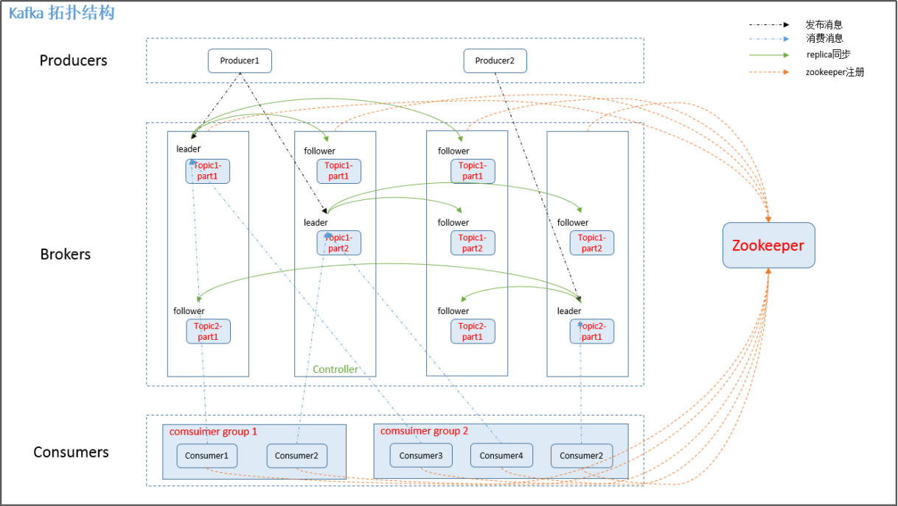

## **5.1主题topic和分区partition**

* topic

Kafka中存储数据的逻辑分类；**你可以理解为数据库中“表”的概念；**

比如，将app端日志、微信小程序端日志、业务库订单表数据分别放入不同的topic

* partition分区（提升kafka吞吐量）

topic中数据的具体管理单元；**（你可以理解为hbase中表的“region"概念）**

\- 每个partition由一个kafka broker服务器管理；

\- 每个topic 可以划分为多个partition，分布到多个broker上管理；

\- 每个partition都可以有多个副本；保证数据安全

> 分区对于 kafka 集群的好处是：实现topic数据的负载均衡。提高写入、读出的并发度，提高吞吐量。

* 分区副本replica

每个topic的**每个partition都可以配置多个副本（replica），以提高数据的可靠性**；

每个partition的所有副本中，必有一个leader副本，其他的就是follower副本（observer副本）；**follower定期找leader同步最新的数据；对外提供服务只有leader；**

* 分区follower &#x20;

partition replica中的一个角色，它通过心跳通信不断从leader中拉取、复制数据（**只负责备份**）。

如果leader所在节点宕机，follower中会选举出新的leader；

* 消息偏移量offset

partition内部每条消息都会被分配一个递增id（offset）；通过offset可以快速定位到消息的存储位置；

kafka 只保证按一个partition中的消息的顺序，不保证一个 topic的整体（多个partition 间）的顺序。

我们在说到偏移量的时候，是哪一个topic的哪一个分区的哪一个，偏移量他的数据只能追加，不能被修改

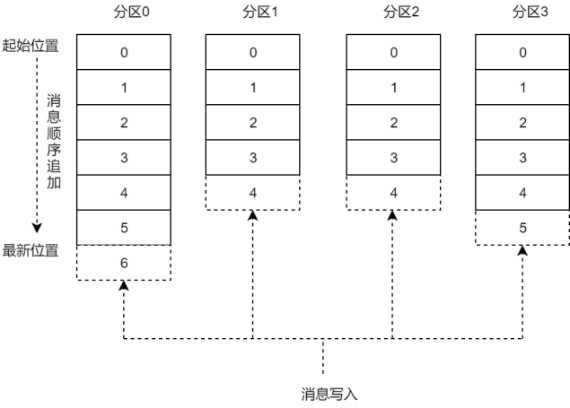

自我推导设计：

* kafka是用来存数据的；

* 现实世界数据有分类，所以存储系统也应有数据分类管理功能，如mysql的表；kafka有topic；

* 如一个topic的数据全部交给一台server存储和管理，则读写吞吐量有限；

* 所以，一个topic的数据应该可以分成多个部分（partition）分别交给多台server存储和管理；

* 如一台server宕机，这台server负责的partition将不可用，所以，一个partition应有多个副本；

* 一个partition有多个副本，则副本间的数据一致性难以保证，因此要有一个leader统领读写；

* 一个leader万一挂掉，则该partition又不可用，因此还要有leader的动态选举机制；

* 集群有哪些topic，topic有哪几个分区，server在线情况，等等元信息和状态信息需要在集群内部及客户端之间共享，则引入了zookeeper；

* 客户端在读取数据时，往往需要知道自己所读取到的位置，因而要引入消息偏移量维护机制；

broker服务器：一台 kafka服务器就是一个broker。一个kafka集群由多个 broker 组成。

生产者producer：消息生产者，就是向kafka broker发消息的客户端。

消费者consumer

* consumer ：消费者，从kafka broker 取消息的客户端。

* consumer group：消费组，单个或多个consumer可以组成一个消费组；

消费组是用来实现消息的广播（发给所有的 consumer）和单播（发给任意一个 consumer）的手段；

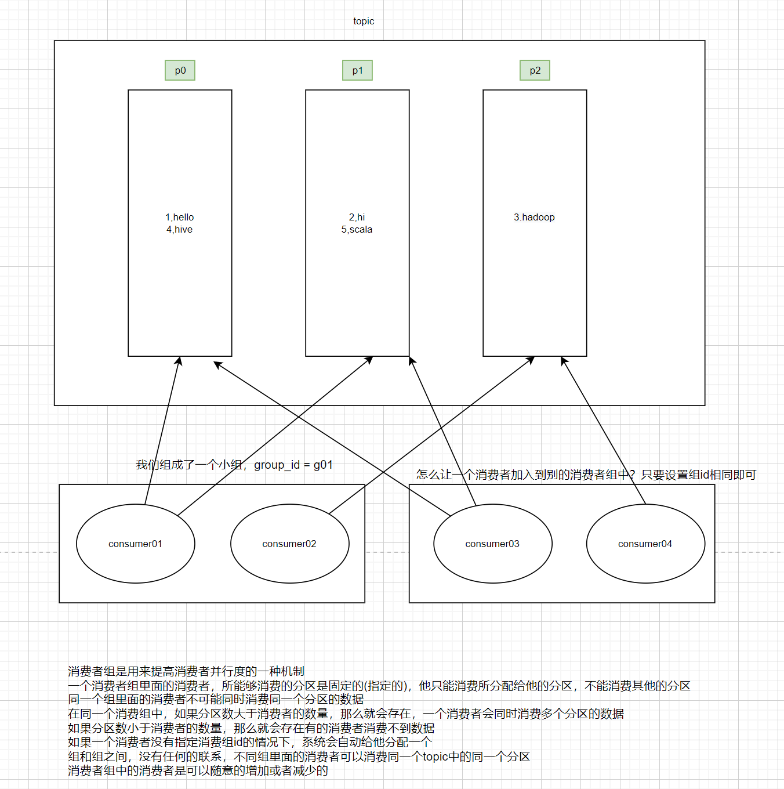

> 消费者可以对消费到的消息位置（消息偏移量）进行记录；
>
> 老版本是记录在zookeeper中；新版本是记录在kafka中一个内置的topic中（\_\_consumer\_offsets)

## 5.2**kafka的数据存储结构**

### 5.2.1**kafka的整体存储结构**

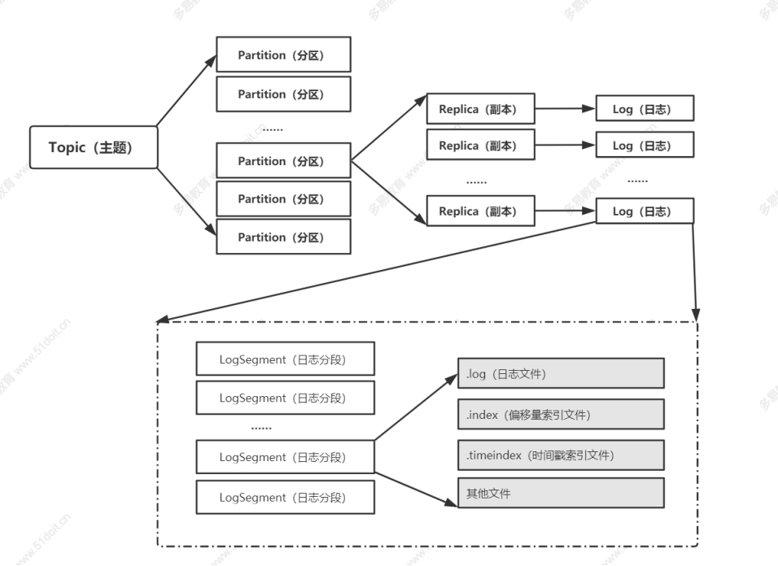

物理存储目录结构         \_\_consumer\_offset   ·

存储目录 名称规范：  **topic名称-分区号**


> 注：“t1"即为一个topic的名称；
>
> 而“t1-0 / t1-1"则表明这个目录是t1这个topic的哪个partition；

* 数据文件 名称规范：

生产者生产的消息会不断追加到log文件末尾，为防止log文件过大导致数据定位效率低下，Kafka采取了**分片和索引机制&#x20;**

1. 每个partition的数据将分为多个segment存储

2. 每个segment对应两个文件：“.index"文件和“.log"文件。

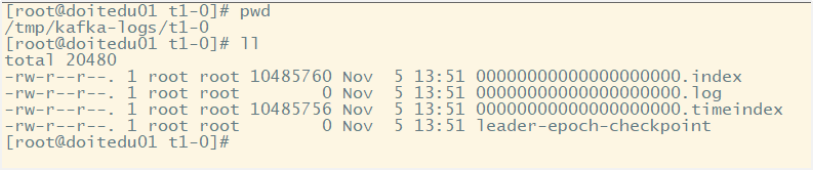

index和log文件以当前segment的第一条消息的offset命名。

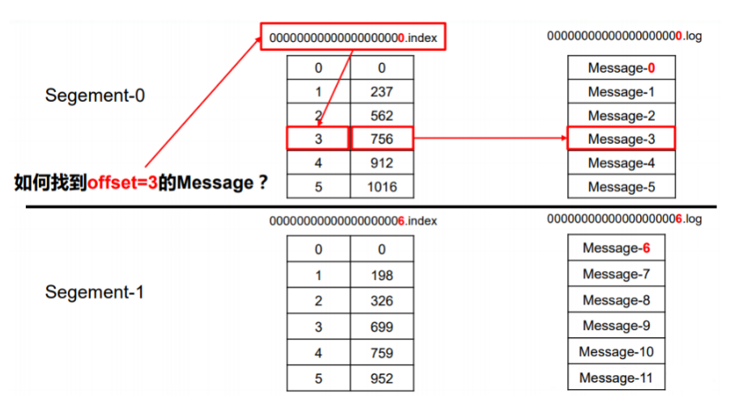


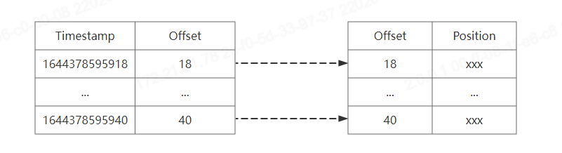

index索引文件中的数据为：  消息offset -> log文件中该消息的物理偏移量位置；

Kafka 中的索引文件以稀疏索引（ sparse index ）的方式构造消息的索引，它并不保证每个消息在索引文件中都有对应的索引；每当写入一定量（由 broker 端参数 log.index.interval.bytes 指定，默认值为 4096 ，即 4KB ）的消息时，偏移量索引文件和时间戳索引文件分别增加一个偏移量索引项和时间戳索引项，增大或减小 log.index.interval.bytes的值，对应地可以缩小或增加索引项的密度；

查询指定偏移量时，使用二分查找法来快速定位偏移量的位置。

### &#x20;5.2.2**消息message存储结构&#x20;**

在客户端编程代码中，消息的封装类有两种：ProducerRecord、ConsumerRecord；

简单来说，kafka中的每个massage由一对key-value构成；

Kafka中的message格式经历了3个版本的变化了：v0 、 v1 、 v2  &#x20;


各个字段的含义介绍如下：

* crc：占用4个字节，主要用于校验消息的内容；

* magic：这个占用1个字节，主要用于标识日志格式版本号，此版本的magic值为1 &#x20;

* attributes：占用1个字节，这里面存储了消息压缩使用的编码以及Timestamp类型。目前Kafka 支持 gzip、snappy 以及 lz4（0.8.2引入） 三种压缩格式；\[0,1,2]三位bit表示压缩类型。\[3]位表示时间戳类型（0，create time；1，append time），\[4,5,6,7]位保留；

* key length：占用4个字节。主要标识 Key的内容的长度；

* key：占用 N个字节，存储的是 key 的具体内容；

* value length：占用4个字节。主要标识 value 的内容的长度；

* value：value即是消息的真实内容，在 Kafka 中这个也叫做payload。

# **6.kafka关键原理加强**

## **6.1日志分段切分条件**

日志分段文件切分包含以下4个条件，满足其一即可：

1. 当前日志分段文件的大小超过了broker端参数 log.segment.bytes 配置的值。

log.segment.bytes参数的默认值为 1073741824，即1GB &#x20;

* 当前日志分段中消息的最小时间戳与当前系统的时间戳的差值大于log.roll.ms或log.roll.hours参数配置的值。如果同时配置了log.roll.ms和log.roll.hours 参数，那么 log.roll.ms 的优先级高，默认情况下，只配置了log.roll.hours参数，其值为168,即7天。 &#x20;

* 偏移量索引文件或时间戳索引文件的大小达到 broker 端参数 log.index.size.max.bytes 配置的值。

log.index.size .max.bytes的默认值为 10485760，即10MB

* 追加的消息的偏移量与当前日志分段的起始偏移量之间的差值大于Integer.MAX\_VALUE, 即要追加的消息的偏移量不能转变为相对偏移量（offset - baseOffset > Integer.MAX\_VALUE）。

## 6.2什么是Controller

Controller作为Kafka集群中的核心组件，它的主要作用是在 Apache ZooKeeper 的帮助下管理和协调整个 Kafka 集群。

Controller与Zookeeper进行交互，获取与更新集群中的元数据信息。其他broker并不直接与zookeeper进行通信，而是与 Controller 进行通信并同步Controller中的元数据信息。

Kafka集群中每个节点都可以充当Controller节点，但集群中同时只能有一个Controller节点。

> **Controller简单来说，就是kafka集群的状态管理者**
>
> **controller竞选机制：简单说，先来先上！**
>
> Broker 在启动时，会尝试去 ZooKeeper 中创建 /controller 节点。Kafka 当前选举控制器的规则是：第一个成功创建 /controller 节点的 Broker 会被指定为控制器。

在Kafka集群中会有一个或者多个broker，其中有一个broker会被选举为控制器（Kafka Controller），**它负责维护整个集群中所有分区和副本的状态及分区leader的选举。&#x20;**

当某个分区的leader副本出现故障时，由控制器负责为该分区选举新的leader副本。当检测到某个分区的ISR集合发生变化时，由控制器负责通知所有broker更新其元数据信息。当使用kafka-topics.sh脚本为某个topic增加分区数量时，同样还是由控制器负责分区的重新分配。

Kafka中的控制器选举的工作依赖于Zookeeper，成功竞选为控制器的broker会在Zookeeper中创建/controller这个临时（EPHEMERAL）节点，此临时节点的内容参考如下：

{"version":1,"brokerid":0,"timestamp":"1529210278988"}

其中version在目前版本中固定为1，brokerid表示成为控制器的broker的id编号，timestamp表示竞选成为控制器时的时间戳。

在任意时刻，集群中有且仅有一个控制器。每个broker启动的时候会去尝试去读取zookeeper上的/controller节点的brokerid的值，如果读取到brokerid的值不为-1，则表示已经有其它broker节点成功竞选为控制器，所以当前broker就会放弃竞选；如果Zookeeper中不存在/controller这个节点，或者这个节点中的数据异常，那么就会尝试去创建/controller这个节点，当前broker去创建节点的时候，也有可能其他broker同时去尝试创建这个节点，只有创建成功的那个broker才会成为控制器，而创建失败的broker则表示竞选失败。每个broker都会在内存中保存当前控制器的brokerid值，这个值可以标识为activeControllerId。

### **6.2.1controller的职责**

* 监听partition相关变化

```typescript
对Zookeeper中的/admin/reassign_partitions节点注册PartitionReassignmentListener，用来处理分区重分配的动作。
对Zookeeper中的/isr_change_notification节点注册IsrChangeNotificetionListener，用来处理ISR集合变更的动作。
对Zookeeper中的/admin/preferred-replica-election节点添加PreferredReplicaElectionListener，用来处理优先副本选举。
```

* 监听topic增减变化

```plain&#x20;text
对Zookeeper中的/brokers/topics节点添加TopicChangeListener，用来处理topic增减的变化；
对Zookeeper中的/admin/delete_topics节点添加TopicDeletionListener，用来处理删除topic的动作。
```

* 监听broker相关的变化

```plain&#x20;text
对Zookeeper中的/brokers/ids/节点添加BrokerChangeListener，用来处理broker增减的变化。
```

* 更新集群的元数据信息

```plain&#x20;text
从Zookeeper中读取获取当前所有与topic、partition以及broker有关的信息并进行相应的管理。对各topic所对应的Zookeeper中的/brokers/topics/[topic]节点添加PartitionModificationsListener，用来监听topic中的分区分配变化。并将最新信息同步给其他所有broker。
```

* 启动并管理分区状态机和副本状态机。

* 如果参数auto.leader.rebalance.enable设置为true，则还会开启一个名为“auto-leader-rebalance-task”的定时任务来负责维护分区的leader副本的均衡。

### 6.2.2**分区的负载分布**

客户端请求创建一个topic时，每一个分区副本在broker上的分配，是由集群controller来决定；

结论：里面会创建出来两个随机数

第一个随机数确定0号分区leader的位置，往后1号分区2号分区的leader依次往后顺延1

第二个随机数确定每个分区的第一个副本的位置 在leader所在机器上往后顺延（随机数+1）台机器，

该台机器就是第一个副本的位置，剩余副本依次往后顺延1

> 举例：
>
> broker\_id = 0\~19 一共20台机器
>
> 分区数20,副本数10
>
> 第一个随机数：19
>
> 第二个随机数：0
>
> (0,ArrayBuffer(19, 0, 1, 2, 3, 4, 5, 6, 7, 8))
>
> (1,ArrayBuffer(0, 1, 2, 3, 4, 5, 6, 7, 8, 9))
>
> (2,ArrayBuffer(1, 2, 3, 4, 5, 6, 7, 8, 9, 10))
>
> (3,ArrayBuffer(2, 3, 4, 5, 6, 7, 8, 9, 10, 11))
>
> (4,ArrayBuffer(3, 4, 5, 6, 7, 8, 9, 10, 11, 12))
>
> (5,ArrayBuffer(4, 5, 6, 7, 8, 9, 10, 11, 12, 13))
>
> (6,ArrayBuffer(5, 6, 7, 8, 9, 10, 11, 12, 13, 14))
>
> (7,ArrayBuffer(6, 7, 8, 9, 10, 11, 12, 13, 14, 15))
>
> (8,ArrayBuffer(7, 8, 9, 10, 11, 12, 13, 14, 15, 16))
>
> (9,ArrayBuffer(8, 9, 10, 11, 12, 13, 14, 15, 16, 17))
>
> (10,ArrayBuffer(9, 10, 11, 12, 13, 14, 15, 16, 17, 18))
>
> (11,ArrayBuffer(10, 11, 12, 13, 14, 15, 16, 17, 18, 19))
>
> (12,ArrayBuffer(11, 12, 13, 14, 15, 16, 17, 18, 19, 0))
>
> (13,ArrayBuffer(12, 13, 14, 15, 16, 17, 18, 19, 0, 1))
>
> (14,ArrayBuffer(13, 14, 15, 16, 17, 18, 19, 0, 1, 2))
>
> (15,ArrayBuffer(14, 15, 16, 17, 18, 19, 0, 1, 2, 3))
>
> (16,ArrayBuffer(15, 16, 17, 18, 19, 0, 1, 2, 3, 4))
>
> (17,ArrayBuffer(16, 17, 18, 19, 0, 1, 2, 3, 4, 5))
>
> (18,ArrayBuffer(17, 18, 19, 0, 1, 2, 3, 4, 5, 6))
>
> (19,ArrayBuffer(18, 19, 0, 1, 2, 3, 4, 5, 6, 7))

其分布策略源码如下： &#x20;

```java
private def assignReplicasToBrokersRackUnaware(
nPartitions: Int, //分区的个数   10
replicationFactor: Int,  //副本的个数  5 
brokerList: Seq[Int],//broker的集合    8   0~7
fixedStartIndex: Int//默认值是-1  固定开始的索引位置
startPartitionId: Int): Map[Int, Seq[Int]] //默认值是-1 分区开始的位置
= {
  val ret = mutable.Map[Int, Seq[Int]]()
  val brokerArray = brokerList.toArray
  val startIndex = if (fixedStartIndex >= 0) {
      fixedStartIndex
  }else {
          rand.nextInt(brokerArray.length)
  }
  var currentPartitionId = math.max(0, startPartitionId) 
  var nextReplicaShift = if (fixedStartIndex >= 0) {
          fixedStartIndex 
  }else {
          rand.nextInt(brokerArray.length)
  }
  for (_ <- 0 until nPartitions) {
    if (currentPartitionId > 0 && (currentPartitionId % brokerArray.length == 0)){
      nextReplicaShift += 1
        }

    val firstReplicaIndex = (currentPartitionId + startIndex) % brokerArray.length 
    val replicaBuffer = mutable.ArrayBuffer(brokerArray(firstReplicaIndex))
    for (j <- 0 until replicationFactor - 1) {                          
      replicaBuffer += brokerArray(replicaIndex(firstReplicaIndex, nextReplicaShift, j, brokerArray.length))
    }
    ret.put(currentPartitionId, replicaBuffer)
    currentPartitionId += 1
  }
  ret
}
                   
private def replicaIndex(firstReplicaIndex: Int, secondReplicaShift: Int, replicaIndex: Int, nBrokers: Int): Int = {
  val shift = 1 + (secondReplicaShift + replicaIndex) % (nBrokers - 1)
  (firstReplicaIndex + shift) % nBrokers
}
```

* **副本因子不能大于 Broker 的个数；**

**报错：Replication factor: 4 larger than available brokers: 3.**

* partition\_0的第1个副本（leader副本）放置位置是随机从 brokerList 选择的；

* 其他分区的第1个副本（leader）放置位置相对于paritition\_0分区依次往后移（也就是如果我们有5个 Broker，5个分区，假设partition0分区放在broker4上，那么partition1将会放在broker5上；patition2将会放在broker1上；partition3在broker2，依次类）；  &#x20;

* 各分区剩余的副本相对于分区前一个副本偏移随机数nextReplicaShift+1，然后后面的副本依次加1

### **6.2.3分区Leader的选举机制**

**分区 leader 副本的选举由控制器controller负责具体实施。**

当创建分区（创建主题或增加分区都有创建分区的动作）或Leader下线（此时分区需要选举一个新的leader上线来对外提供服务）的时候都需要执行 leader 的选举动作。

选举策略：**按照 ISR集合中副本的顺序查找第一个存活的副本，并且这个副本在 ISR 集合中**

> 一个分区的AR集合在partition分配的时候就被指定，并且只要不发生重分配的情况，集合内部副本的顺序是保持不变的，而分区的 ISR 集合中副本的顺序可能会改变；

## 6.3**生产者原理解析**

生产者工作流程图：


一个生产者客户端由两个线程协调运行，这两个线程分别为**主线程**和 **Sender** 线程 。

在主线程中由kafkaProducer创建消息，然后通过可能的拦截器、序列化器和分区器的作用之后缓存到消息累加器（RecordAccumulator, 也称为消息收集器）中。&#x20;

**Sender&#x20;**&#x7EBF;程负责从RecordAccumulator 获取消息并将其发送到 Kafka 中；

RecordAccumulator主要用来缓存消息以便Sender 线程可以批量发送，进而减少网络传输的资源消耗以提升性能。RecordAccumulator缓存的大小可以通过生产者客户端参数buffer.memory 配置，默认值为 33554432B ，即32M。如果生产者发送消息的速度超过发送到服务器的速度，则会导致生产者空间不足，这个时候 KafkaProducer.send（）方法调用要么被阻塞，要么抛出异常，这个取决于参数 max.block.ms 的配置，此参数的默认值为 60000,即60秒。

主线程中发送过来的消息都会被迫加到 RecordAccumulator 的某个双端队列（ Deque ）中，

RecordAccumulator内部为每个分区都维护了一个双端队列，即Deque\<ProducerBatch>。

消息写入缓存时，追加到双端队列的尾部;

Sender读取消息时，从双端队列的头部读取。注意：ProducerBatch 是指一个消息批次；

与此同时，会将较小的 ProducerBatch 凑成一个较大 ProducerBatch ，也可以减少网络请求的次数以提升整体的吞吐量。

ProducerBatch 大小和 batch.size 参数也有着密切的关系。当一条消息（ProducerRecord ) 流入 RecordAccumulator 时，会先寻找与消息分区所对应的双端队列（如果没有则新建），再从这个双端队列的尾部获取一个ProducerBatch （如果没有则新建），查看 ProducerBatch中是否还可以写入这个ProducerRecord，如果可以写入就直接写入，如果不可以则需要创建一个新的Producer Batch。在新建 ProducerBatch时评估这条消息的大小是否超过 batch.size 参数大小，如果不超过，那么就以 batch.size 参数的大小来创建 ProducerBatch。

> 如果生产者客户端需要向很多分区发送消息， 则可以将buffer.memory参数适当调大以增加整体的吞吐量。

Sender从 RecordAccumulator 获取缓存的消息之后，会进一步将<分区,Deque\<Producer Batch>>的形式转变成\<Node,List< ProducerBatch>的形式，其中Node表示Kafka集群broker节点。对于网络连接来说，生产者客户端是与具体broker节点建立的连接，也就是向具体的broker节点发送消息，而并不关心消息属于哪一个分区；而对于KafkaProducer的应用逻辑而言，我们只关注向哪个分区中发送哪些消息，所以在这里需要做一个应用逻辑层面到网络I/O层面的转换。

在转换成\<Node, List\<ProducerBatch>>的形式之后， Sender会进一步封装成\<Node,Request> 的形式，这样就可以将 Request 请求发往各个Node了，这里的Request是Kafka各种协议请求；

请求在从sender线程发往Kafka之前还会保存到InFlightRequests中，InFlightRequests保存对象的具体形式为 Map\<Nodeld, Deque\<request>>，它的主要作用是缓存了已经发出去但还没有收到服务端响应的请求（Nodeld 是一个 String 类型，表示节点的 id 编号）。与此同时，InFlightRequests 还提供了许多管理类的方法，并且通过配置参数还可以限制每个连接（也就是客户端与 Node之间的连接）最多缓存的请求数。这个配置参数为 max.in.flight.request.per. connection ，默认值为5，即每个连接最多只能缓存5个未响应的请求，超过该数值之后就不能再向这个连接发送更多的请求了，除非有缓存的请求收到了响应（ Response ）。通过比较 Deque\<Request> 的size与这个参数的大小来判断对应的 Node中是否己经堆积了很多未响应的消息，如果真是如此，那么说明这个 Node 节点负载较大或网络连接有问题，再继续发送请求会增大请求超时的可能。

### **6.3.1Producer往Broker发送消息应答机制**

kafka 在 producer 里面提供了消息确认机制。我们可以通过配置来决定消息发送到对应分区的几个副本才算消息发送成功。可以在构造producer 时通过acks参数指定（在 0.8.2.X 前是通过 request.required.acks 参数设置的）。这个参数支持以下三种值：

* acks = 0：意味着如果生产者能够通过网络把消息发送出去，那么就认为消息已成功写入 kafka 。在这种情况下还是有可能发生错误，比如发送的对象不能被序列化或者网卡发生故障，但如果是分区离线或整个集群长时间不可用，那就不会收到任何错误。在 acks=0 模式下的运行速度是非常快的（这就是为什么很多基准测试都是基于这个模式），你可以得到惊人的吞吐量和带宽利用率，不过如果选择了这种模式，大概率会丢失一些消息。

* acks = 1：意味着leader 在收到消息并把它写入到分区数据文件（不一定同步到磁盘上）时会返回确认或错误响应。在这个模式下，如果发生正常的 leader 选举，生产者会在选举时收到一个 LeaderNotAvailableException 异常，如果生产者能恰当地处理这个错误，它会重试发送悄息，最终消息会安全到达新的 leader 那里。不过在这个模式下仍然有可能丢失数据，比如消息已经成功写入 leader，但在消息被复制到 follower 副本之前 leader发生崩溃。

* acks = all（这个和 request.required.acks = -1 含义一样）：意味着 leader 在返回确认或错误响应之前，会等待所有同步副本都收到悄息。如果和 min.insync.replicas 参数结合起来，就可以决定在返回确认前至少有多少个副本能够收到悄息，生产者会一直重试直到消息被成功提交。不过这也是最慢的做法，因为生产者在继续发送其他消息之前需要等待所有副本都收到当前的消息。

> **根据实际的应用场景，我们设置不同的 acks，以此保证数据的可靠性。**

| acks   | 含义                                                                                             |
| ------ | ---------------------------------------------------------------------------------------------- |
| 0      | Producer往集群发送数据不需要等到集群的确认信息，不确保消息发送成功。安全性最低但是效率最高。                                             |
| 1      | Producer往集群发送数据只要 leader成功写入消息就可以发送下一条，只确保Leader 接收成功。                                         |
| -1或all | Producer往集群发送数据需要所有的ISR Follower 都完成从 Leader 的同步才会发送下一条，确保 Leader发送成功和所有的副本都成功接收。安全性最高，但是效率最低。 |

生产者将acks设置为all，是否就一定不会丢数据呢？

否！如果在某个时刻ISR列表只剩leader自己了，那么就算acks=all，收到这条数据还是只有一个点；

可以配合另外一个参数缓解此情况： 最小同步副本数>=2

> BROKER端参数：  min.insync.replicas（默认1）
>
> 生产者的ack=all，也不能完全保证数据发送的100%可靠性
>
> 为什么？因为，如果服务端目标partition的同步副本只有leader自己了，此时，它收到数据就会给生产者反馈成功！
>
> 可以修改服务端的一个参数（分区最小ISR数\[min.insync.replicas]>=2），来避免此问题；


**6.3.2其他的生产者参数**

* **acks**

acks是控制kafka服务端向生产者**应答消息写入成功的条件**；生产者根据得到的确认信息，来判断消息发送是否成功；

* **max.request.size**

这个参数用来限制生产者客户端能发送的消息的最大值，默认值为 1048576B ，即 1MB

一般情况下，这个默认值就可以满足大多数的应用场景了。

&#x20;这个参数还涉及一些其它参数的联动，比如 broker 端（topic级别参数）的 message.max.bytes参数（默认1000012），如果配置错误可能会引起一些不必要的异常；比如将 broker 端的 message.max.bytes 参数配置为10B ，而 max.request.size参数配置为20B，那么当发送一条大小为 15B 的消息时，生产者客户端就会报出异常；

* **retries和retry.backoff.ms**

retries参数用来配置生产者重试的次数，默认值为0，即在发生异常的时候进行任何重试动作。

消息在从生产者发出到成功写入服务器之前可能发生一些临时性的异常，比如网络抖动、 leader 副本的选举等，这种异常往往是可以自行恢复的，生产者可以通过配置 retries大于0的值，以此通过内部重试来恢复而不是一味地将异常抛给生产者的应用程序。如果重试达到设定的次数，那么生产者就会放弃重试并返回异常。重试还和另一个参数 retry.backoff.ms 有关，这个参数的默认值为100，它用来设定两次重试之间的时间间隔，避免无效的频繁重试    。如果将 retries参数配置为非零值，并且 max .in.flight.requests.per.connection 参数配置为大于1的值，那**可能会出现错序的现象：如果批次1消息写入失败，而批次2消息写入成功，那么生产者会重试发送批次1的消息，此时如果批次1的消息写入成功，那么这两个批次的消息就出现了错序。**

对于某些应用来说，顺序性非常重要 ，比如MySQL binlog的传输，如果出现错误就会造成非常严重的后果；一般而言，在需要保证消息顺序的场合建议把参数max.in.flight.requests.per.connection 配置为1 ，而不是把retries配置为0，不过这样也会影响整体的吞吐。

* **compression.type**

这个参数用来指定消息的压缩方式，默认值为“none"，即默认情况下，消息不会被压缩。该参数还可以配置为 "gzip"，"snappy" 和 "lz4"。对消息进行压缩可以极大地减少网络传输、降低网络I/O，从而提高整体的性能 。消息压缩是一种以时间换空间的优化方式，如果对时延有一定的要求，则不推荐对消息进行压缩；

* **batch.size**

每个Batch要存放batch.size大小的数据后，才可以发送出去。比如说batch.size默认值是16KB，那么里面凑够16KB的数据才会发送。理论上来说，提升batch.size的大小，可以允许更多的数据缓冲在recordAccumulator里面，那么一次Request发送出去的数据量就更多了，这样吞吐量可能会有所提升。但是batch.size也不能过大，要是数据老是缓冲在Batch里迟迟不发送出去，那么发送消息的延迟就会很高。一般可以尝试把这个参数调节大些，利用生产环境发消息负载测试一下。

* **linger.ms**

这个参数用来指定生产者发送 ProducerBatch 之前等待更多消息（ ProducerRecord ）加入

ProducerBatch 时间，默认值为0。生产者客户端会在ProducerBatch填满或等待时间超过linger.ms 值时发送出去。

> **增大这个参数的值会增加消息的延迟，但是同时能提升一定的吞吐量。&#x20;**


* **enable.idempotence   幂等性&#x20;**

是否开启幂等性功能，详见后续原理加强；

**幂等性，就是一个操作重复做，也不会影响最终的结果！**

int a = 1;

a++;  // 非幂等操作 &#x20;

val map = new HashMap()

map.put(“a”,1);  // 幂等操作 &#x20;

在kafka中，同一条消息，生产者如果多次重试发送，在服务器中的结果如果还是只有一条，这就是具备幂等性；否则，就不具备幂等性！

* **partitioner.class**

用来指定分区器，默认：org.apache.kafka.internals.DefaultPartitioner&#x20;

> 默认分区器的分区规则： &#x20;
>
> * 如果数据中有key，则按key的murmur hash值 % topic分区总数得到目标分区
>
> * 如果数据只有value，则在各个分区间轮询（老版本，新版本是new出来的一个随机数）

自定义partitioner需要实现org.apache.kafka.clients.producer.Partitioner接口

### 练一练：如何实现精准一次性消费

将kafka中的数据读出来，写入到mysql中

```java
package com.doit.day01;

import org.apache.kafka.clients.consumer.*;
import org.apache.kafka.common.TopicPartition;
import org.apache.kafka.common.serialization.StringDeserializer;
import java.sql.*;
import java.time.Duration;
import java.util.Arrays;
import java.util.Collection;
import java.util.Properties;

public class KafkaToMysql {
    public static void main(String[] args) throws Exception {
        Properties props = new Properties();
        props.setProperty(ConsumerConfig.BOOTSTRAP_SERVERS_CONFIG,"linux01:9092");
        props.setProperty(ConsumerConfig.KEY_DESERIALIZER_CLASS_CONFIG, StringDeserializer.class.getName());
        props.setProperty(ConsumerConfig.VALUE_DESERIALIZER_CLASS_CONFIG, StringDeserializer.class.getName());
        props.setProperty(ConsumerConfig.GROUP_ID_CONFIG,"doit03");
        props.setProperty(ConsumerConfig.ENABLE_AUTO_COMMIT_CONFIG,"false");
        props.setProperty(ConsumerConfig.AUTO_OFFSET_RESET_CONFIG,"earliest");
        KafkaConsumer<String, String> consumer = new KafkaConsumer<String, String>(props);
        Connection conn = DriverManager.getConnection("jdbc:mysql://localhost:3306/test", "root", "123456");
        conn.setAutoCommit(false);

        PreparedStatement pps = conn.prepareStatement("insert into user_info  values(?,?,?)");
        PreparedStatement pps_off = conn.prepareStatement("insert into  t_offset values(?,?) on DUPLICATE key UPDATE offset = ?");
        PreparedStatement off = conn.prepareStatement("select offset from t_offset where topic_partition = ?");

//        consumer.subscribe(Arrays.asList("k2m1"));
        consumer.subscribe(Arrays.asList("k2m1"), new ConsumerRebalanceListener() {
            @Override
            public void onPartitionsRevoked(Collection<TopicPartition> partitions) {
            }
            @Override
            public void onPartitionsAssigned(Collection<TopicPartition> partitions) {
                try    {
                for (TopicPartition partition : partitions) {
                    int partition1 = partition.partition();
                    String topic = partition.topic();

                        off.setString(1,topic+"_"+partition1);
                        ResultSet resultSet = off.executeQuery();
                        while (resultSet.next()){
                            long offset = resultSet.getLong(1);
                            System.out.println("发生了消费者再均衡了，分区啥的都重新分配了,新的方案是："+topic+","+partition1);
                            consumer.seek(new TopicPartition(topic,partition1),offset);
                        }
                    }

                }catch (SQLException e) {
                    e.printStackTrace();
                }
            }
        });

        while (true){
            ConsumerRecords<String, String> records = consumer.poll(Duration.ofMinutes(Integer.MAX_VALUE));
            for (ConsumerRecord<String, String> record : records) {
                try {
                    String value = record.value();
                    String[] arr = value.split(",");
                    pps.setInt(1,Integer.parseInt(arr[0]));
                    pps.setString(2,arr[1]);
                    pps.setString(3,arr[2]);
                    pps.execute();

                    String topic = record.topic();
                    int partition = record.partition();
                    long offset = record.offset();
                    pps_off.setString(1,topic+"_"+partition);
                    pps_off.setLong(2,offset+1);
                    pps_off.setLong(3,offset+1);

//                    if (arr[0].equals("4")){
//                        throw new Exception("自己造了个一场抛一下");
//                    }
                    pps_off.execute();

                    //提交事务
                    conn.commit();
                } catch (Exception e) {
                    e.printStackTrace();
                    //有异常了我就回滚事务
                    conn.rollback();
                }
            }
        }
    }
}
```

## **6.4消费者组再均衡分区分配策略**

会触发rebalance（消费者）的事件可能是如下任意一种：

* 有新的消费者加入消费组。

* 有消费者宕机下线，消费者并不一定需要真正下线，例如遇到长时间的 GC 、网络延迟导致消费者长时间未向GroupCoordinator发送心跳等情况时，GroupCoordinator 会认为消费者己下线。

* 有消费者主动退出消费组（发送LeaveGroupRequest 请求）：比如客户端调用了unsubscrible()方法取消对某些主题的订阅。

* 消费组所对应的 GroupCoorinator节点发生了变更。

* 消费组内所订阅的任一主题或者主题的分区数量发生变化。

将分区的消费权从一个消费者移到另一个消费者称为再均衡（rebalance），如何rebalance也涉及到分区分配策略。

kafka有两种的分区分配策略：range（默认） 和 roundrobin（新版本中又新增了另外2种）

> 我们可以通过partition.assignment.strategy参数选择 range 或 roundrobin。
>
> partition.assignment.strategy参数默认的值是range。
>
> partition.assignment.strategy=org.apache.kafka.clients.consumer.RoundRobinAssignor
>
> partition.assignment.strategy=org.apache.kafka.clients.consumer.RangeAssignor

### **6.4.1Range Strategy**

* 先将消费者按照client.id字典排序，然后按topic**逐个**处理；

* 针对一个topic，将其partition总数/消费者数得到商n和 余数m，则每个consumer至少分到n个分区，且前m个consumer每人多分一个分区；

> 举例说明1：假设有TOPIC\_A有5个分区，由3个consumer（C1,C2,C3）来消费；5/3得到商1，余2，则每个消费者至少分1个分区，前两个消费者各多1个分区C1: 2个分区，C2:2个分区,C3:1个分区
>
> 接下来，就按照“区间”进行分配：
>
> TOPIC\_A-0  TOPIC\_A-1   TOPIC\_A-2  TOPIC\_A\_3   TOPIC\_A-4
>
> C1:   TOPIC\_A-0  TOPIC\_A-1 &#x20;
>
> C2 :   TOPIC\_A-2  TOPIC\_A\_3
>
> C3:   TOPIC\_A-4

> 举例说明2：假设TOPIC\_A有5个分区，TOPIC\_B有3个分区，由2个consumer（C1,C2）来消费
>
> * 先分配TOPIC\_A：
>
> 5/2得到商2，余1，则C1有3个分区，C2有2个分区，得到结果
>
> C1: TOPIC\_A-0   TOPIC\_A-1  TOPIC\_A-2
>
> C2: TOPIC\_A-3   TOPIC\_A-4
>
> * 再分配TOPIC\_B
>
> 3/2得到商1，余1，则C1有2个分区，C2有1个分区，得到结果
>
> C1: TOPIC\_B-0  TOPIC\_B-1
>
> C2: TOPIC\_B-2
>
> * 最终分配结果：
>
> C1: TOPIC\_A-0   TOPIC\_A-1  TOPIC\_A-2   TOPIC\_B-0  TOPIC\_B-1
>
> C2: TOPIC\_A-3   TOPIC\_A-4  TOPIC\_B-2

### **6.4.2Round-Robin Strategy**

* 将所有主题分区组成TopicAndPartition列表，并对TopicAndPartition列表按照其hashCode 排序

* 然后，以轮询的方式分配给各消费者

> 以上述“例2”来举例：
>
> * 先对TopicPartition的hashCode排序，假如排序结果如下：
>
> TOPIC\_A-0  TOPIC\_B-0  TOPIC\_A-1  TOPIC\_A-2   TOPIC\_B-1 TOPIC\_A-3  TOPIC\_A-4  TOPIC\_B-2
>
> * 然后按轮询方式分配
>
> C1:  TOPIC\_A-0  TOPIC\_A-1  TOPIC\_B-1 &#x20;
>
> C2:  TOPIC\_B-0  TOPIC\_A-2  TOPIC\_A-3 &#x20;
>
> C3 TOPIC\_A-4

### **6.4.3Sticky Strategy**

对应的类叫做： org.apache.kafka.clients.consumer.StickyAssignor

sticky策略的特点：

* 要去达成最大化的均衡

* 尽可能保留各消费者原来分配的分区

再均衡的过程中，还是会让各消费者先取消自身的分区，然后再重新分配（只不过是分配过程中会尽量让原来属于谁的分区依然分配给谁）

### **6.4.4Cooperative Sticky Strategy**

对应的类叫做： org.apache.kafka.clients.consumer.ConsumerPartitionAssignor

sticky策略的特点：

* 逻辑与sticky策略一致

* 支持cooperative再均衡机制（再均衡的过程中，不会让所有消费者取消掉所有分区然后再进行重分配）

## **6.5消费者组再均衡流程**

消费组在消费数据的时候，有两个角色进行组内的各事务的协调；

角色1： Group Coordinator （组协调器） 位于服务端（就是某个broker）

**组协调器的定位：**

```plain&#x20;text
coordinator在我们组记偏移量的__consumer_offsets分区的leader所在broker上
查找Group Coordinator的方式：
先根据消费组groupid的hashcode值计算它应该所在__consumer_offsets 中的分区编号；   分区数
Utils.abs(groupId.hashCode) % groupMetadataTopicPartitionCount
groupMetadataTopicPartitionCount为__consumer_offsets的分区总数，这个可以通过broker端参数offset.topic.num.partitions来配置，默认值是50；
找到对应的分区号后，再寻找此分区leader副本所在broker节点，则此节点即为自己的Grouping Coordinator；
```

角色2： Group Leader （组长） 位于消费端（就是消费组中的某个消费者）

> **组长的定位：随机选的哦！！！**

### 6.5.1**GroupCoordinator介绍**

每个消费组在服务端对应一个GroupCoordinator其进行管理，GroupCoordinator是Kafka服务端中用于管理消费组的组件。

消费者客户端中由ConsumerCoordinator组件负责与GroupCoordinator行交互；

ConsumerCoordinator和GroupCoordinator最重要的职责就是负责执行消费者rebalance操作

### **6.5.2再均衡流程**

eager协议的再均衡过程整体流程如下图：

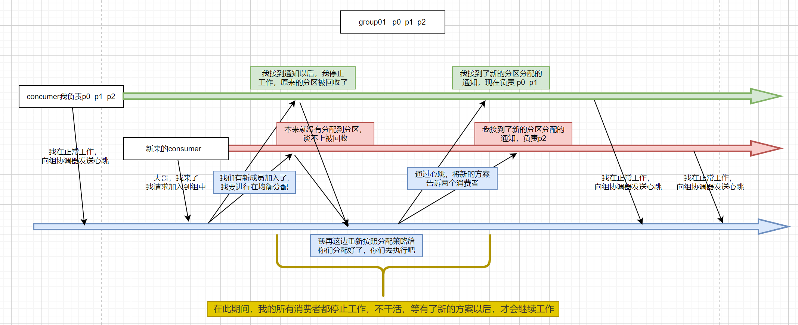


> 特点：再均衡发生时，所有消费者都会停止工作，等待新方案的同步

Cooperative协议的再均衡过程整体流程如下图：

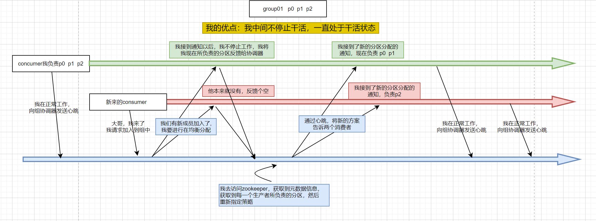

> 特点：cooperative把原来eager协议的一次性全局再均衡，化解成了多次的小均衡，并最终达到全局均衡的收敛状态

### 6.5.3**再均衡监听器**

如果想控制消费者在发生再均衡时执行一些特定的工作，可以通过订阅主题时注册“再均衡监听器”来实现；

场景举例：在发生再均衡时，处理消费位移

如果A消费者消费掉的一批消息还没来得及提交offset，而它所负责的分区在rebalance中转移给了B消费者，则有可能发生数据的重复消费处理。此情形下，可以通过再均衡监听器做一定程度的补救；

代码示例：

```java
package com.doitedu;

import org.apache.kafka.clients.consumer.*;
import org.apache.kafka.common.TopicPartition;
import org.apache.kafka.common.header.Headers;
import org.apache.kafka.common.record.TimestampType;
import org.apache.kafka.common.serialization.StringDeserializer;

import java.time.Duration;
import java.util.Arrays;
import java.util.Collection;
import java.util.Optional;
import java.util.Properties;


/**
 * 消费组再均衡观察
 */

public class ConsumerDemo2 {
    public static void main(String[] args) {
        //1.创建kafka的消费者对象，附带着把配置文件搞定
        Properties props = new Properties();
        props.setProperty(ConsumerConfig.BOOTSTRAP_SERVERS_CONFIG,"linux01:9092,linux02:9092,linux03:9092");
        props.setProperty(ConsumerConfig.KEY_DESERIALIZER_CLASS_CONFIG, StringDeserializer.class.getName());
        props.setProperty(ConsumerConfig.VALUE_DESERIALIZER_CLASS_CONFIG, StringDeserializer.class.getName());
        props.setProperty(ConsumerConfig.GROUP_ID_CONFIG,"g01");
        KafkaConsumer<String, String> consumer = new KafkaConsumer<>(props);

        //2.订阅主题(确定需要消费哪一个或者多个主题)
        //我现在想看看如果我的消费者组里面，多了一个消费者或者少了一个消费者，他有没有给我做再均衡
        consumer.subscribe(Arrays.asList("reb-1", "reb-2"), new ConsumerRebalanceListener() {
            /**
             * 这个方法是将原来的分配情况全部取消，或者说把所有的分区全部回收了
             * 这个全部取消很恶心，原来的消费者消费的好好的，他一下子就给他全部停掉了
             * @param collection
             */
            @Override
            public void onPartitionsRevoked(Collection<TopicPartition> collection) {
                System.out.println("我原来的均衡情况是："+collection + "我已经被回收了！！");
            }
            /**
             * 这个方法是当上面的分配情况全部取消以后，调用这个方法，来再次分配，这是在均衡分配后的情况
             * @param collection
             */
            @Override
            public void onPartitionsAssigned(Collection<TopicPartition> collection) {
                System.out.println("我是重新分配后的结果："+collection);
            }
        });

        while (true){
            consumer.poll(Duration.ofMillis(Integer.MAX_VALUE));
        }


    }
}
```

## 6.6**kafka系统的CAP保证**

CAP理论作为分布式系统的基础理论,它描述的是一个分布式系统在以下三个特性中：

* 一致性（Consistency）

* 可用性（Availability)&#x20;

* 分区容错性（Partition tolerance）

最多满足其中的两个特性。也就是下图所描述的。分布式系统要么满足CA，要么CP，要么AP。无法同时满足CAP。

**分区容错性**：指的分布式系统中的某个节点或者网络分区出现了故障的时候，整个系统仍然能对外提供满足一致性和可用性的服务。也就是说部分故障不影响整体使用。事实上我们在设计分布式系统时都会考虑到bug,硬件，网络等各种原因造成的故障，所以即使部分节点或者网络出现故障，我们要求整个系统还是要继续使用的(不继续使用,相当于只有一个分区,那么也就没有后续的一致性和可用性了)

**可用性：**&#x4E00;直可以正常的做读写操作。简单而言就是客户端一直可以正常访问并得到系统的正常响应。用户角度来看就是不会出现系统操作失败或者访问超时等问题。

**一致性**：在分布式系统完成某写操作后任何读操作，都应该获取到该写操作写入的那个最新的值。相当于要求分布式系统中的各节点时时刻刻保持数据的一致性。

> Kafka 作为一个商业级消息中间件，数据可靠性和可用性是优先考虑的重点，兼顾数据一致性；
>
> 参考文档：https://www.cnblogs.com/lilpig/p/16840963.html

### **6.6.1分区副本机制**

**kafka 从 0.8.0 版本开始引入了分区副本**；**引入了数据冗余**

用CAP理论来说，就是通过副本及副本leader动态选举机制提高了kafka的 **分区容错性**和**可用性**

但从而也带来了数据一致性的巨大困难！

**6.6.2分区副本的数据一致性困难**

kafka让分区多副本同步的基本手段是： follower副本定期向leader请求数据同步！

既然是定期同步，则leader和follower之间必然存在各种数据不一致的情景！

* **问题1：分区副本间动态不一致**

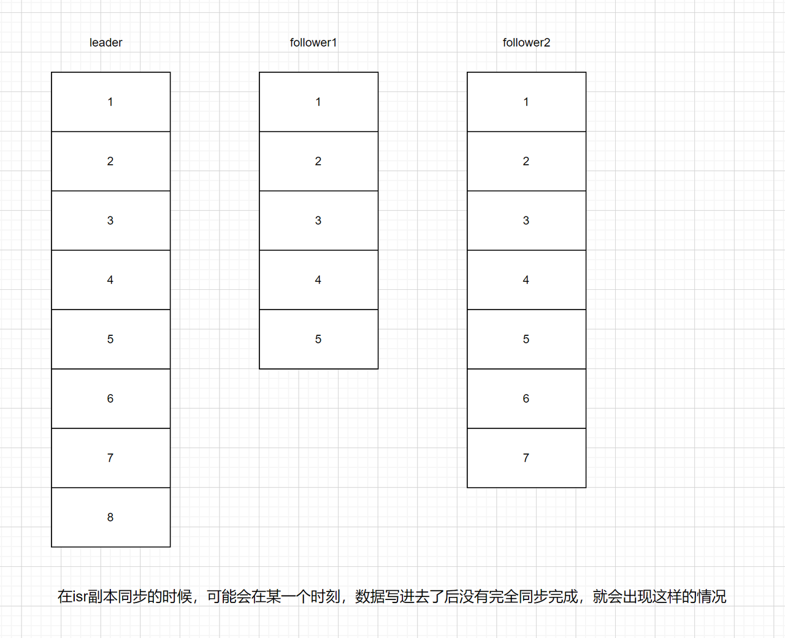

* **问题2：消费者所见不一致**

如果此时leader宕机，follower1或follower2被选为新的leader，则leader换届前后，消费者所能读取到的数据发生了不一致；

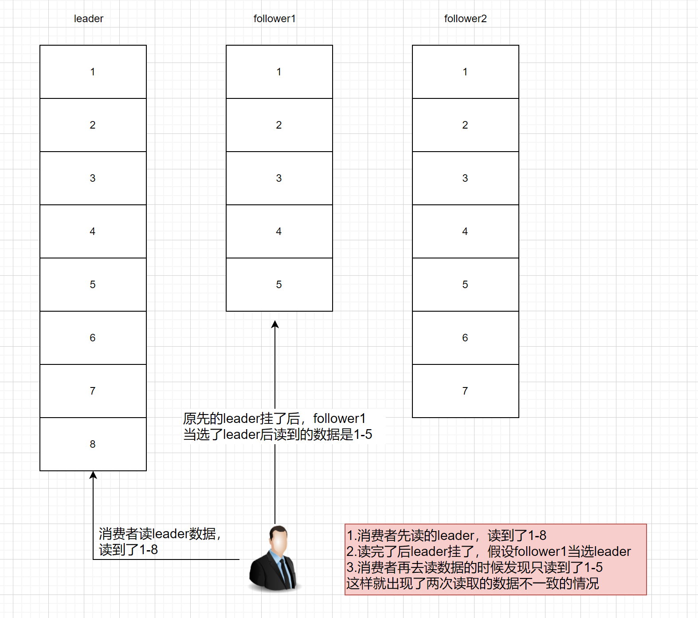

* **问题3：分区副本间最终不一致**

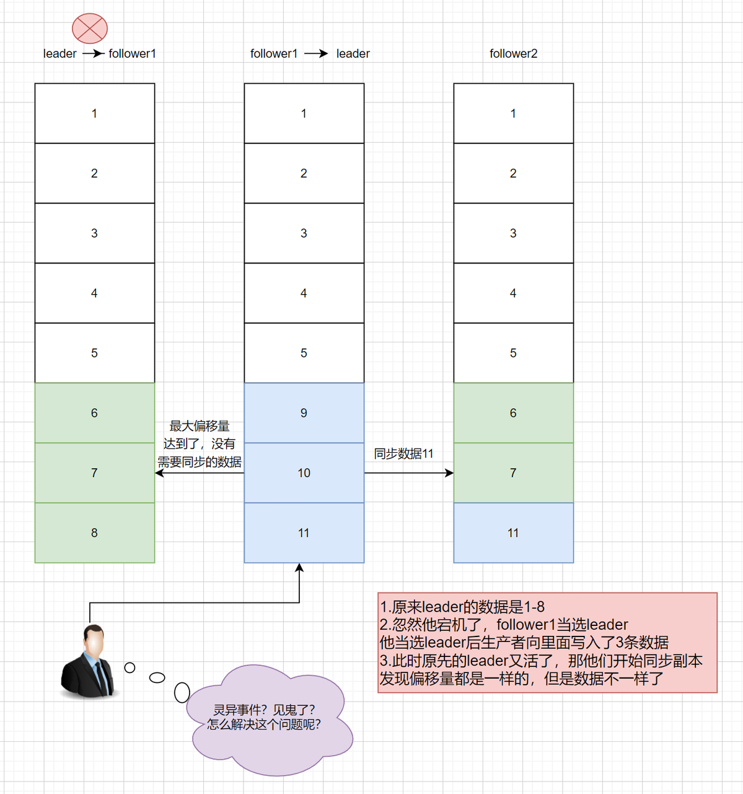

### **6.6.2一致性问题解决方案（HW）  high watermark  高水位线**

动态过程中的副本数据不一致，是很难解决的；

kafka先尝试着解决上述“消费者所见不一致”及“副本间数据最终不一致”的问题；

> 解决方案的核心思想
>
> * 在动态不一致的过程中，维护一条步进式的“临时一致线”(既所谓的High Watermark)；高水位线
>
> * 高水位线HW = ISR副本中最小LEO(副本的最大消息偏移量+1)；&#x20;
>
> * 底层逻辑就是：offset\<HW的message，是各副本间一致的且安全的！

* **解决“消费者所见不一致” （消费者只允许看到HW以下的message）**

* **解决“分区副本数据最终不一致” （follower数据按HW截断）**

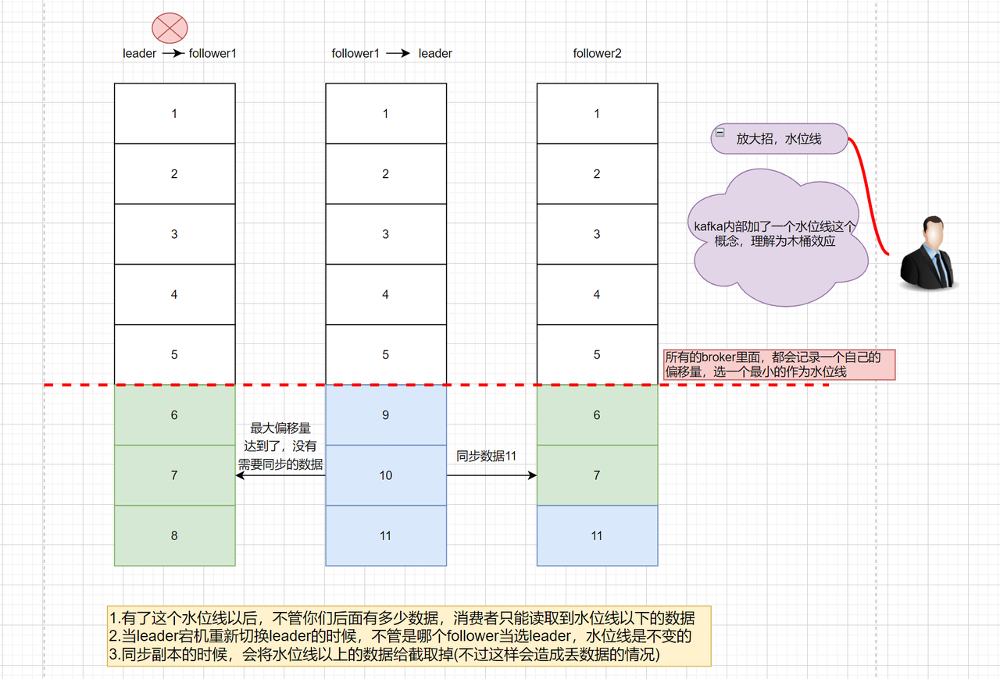

### **6.6.3HW方案的天生缺陷**

如前所述，看似HW解决了“分区数据最终不一致”的问题，以及“消费者所见不一致”的问题，但其实，这里面存在一个巨大的隐患，导致：

* “分区数据最终不一致”的问题依然存在

* producer设置acks=all后，依然有可能丢失数据的问题

> 产生如上结果的根源是：HW高水位线的更新，与数据同步的进度，存在迟滞！

**第一次fetch请求**，分leader端和follower端：

leader端：

1. 读取底层log数据。

2. 根据fetch带过来的offset=0的数据（就是follower的LEO，因为follower还没有写入数据，因此LEO=0），更新remote LEO为0。

3. 一轮结束后尝试更新HW，做min(leader LEO,remote LEO)的计算，结果为0。

4. 把读取到的三条log数据，加上leader HW=0，一起发给follower副本。

follower端：

1. 写入数据到log文件，更新自己的LEO=3。

2. 更新HW，做min(leader HW,follower LEO)的计算，由于leader HW=0，因此更新后HW=0。

可以看出，第一次fetch请求后，leader和follower都成功写入了三条消息，但是HW都依然是0，对消费者来说都是不可见的，还需要第二次fetch请求。

**第二次fetch请求**，分leader端和follower端：

leader端：

1. 读取底层log数据。

2. 根据fetch带过来的offset=3的数据（上一次请求写入了数据，因此LEO=3），更新remote LEO为3。

3. 尝试更新HW，做min(leader LEO,remote LEO)的计算，结果为3。

4. 把读取到的log数据（其实没有数据），加上leader HW=3，一起发给follower副本。

follower端：

1. 写入数据到log文件，没有数据可以写，LEO依然是3。

2. 更新HW，做min(leader HW,follower LEO)的计算，由于leader HW=3，因此更新后HW=3。

这个时候，才完成数据的写入，并且分区HW（分区HW指的就是leader副本的HW）更新为3，代表消费者可以消费offset=0,1,2的三条消息了，上面的过程就是kafka处理消息写入和备份的全流程。

> 从以上步骤可看出，leader 中保存的 remote LEO 值的更新（也即HW的更新）总是需要额外一轮 fetch RPC 请求才 能完成，这意味着在 leader 切换过程中，会存在数据丢失以及数据不一致的问题！

### **6.6.4HW会产生数据丢失和副本最终不一致问题**

> **数据丢失的问题（即使produce设置acks=all，依然会发生）**

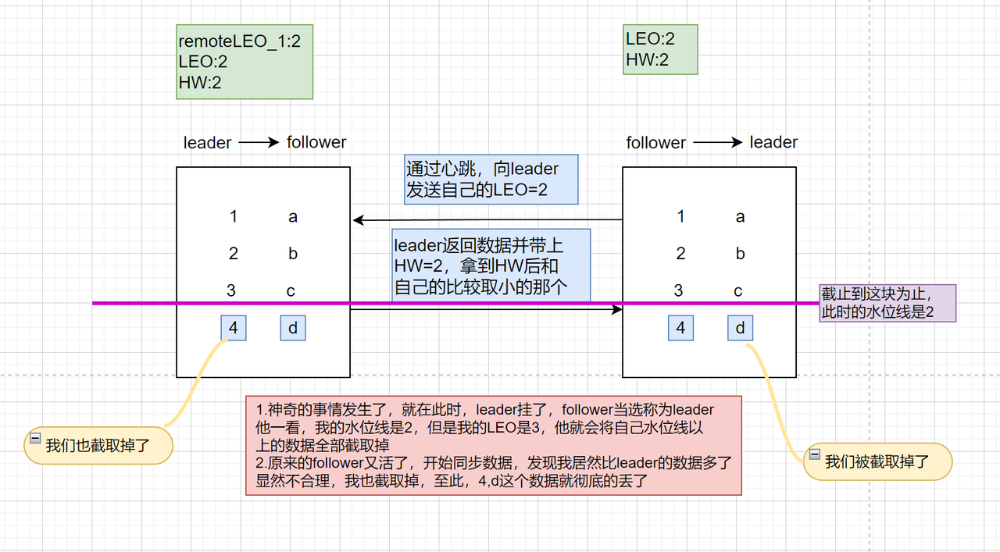

如上图所示：

* 状态起始：最新消息c已同步，但是水位线还没开始同步

* &#x20;在此时leader崩溃（即 follower 没能通过下一轮请求来更新 HW 值）

* follower成为了leader，会自动将 LEO 值调整到之前的 HW 值，即会进行日志截断

* 然后，原来的leader重启上线，会向新的leader发送请求请求，收到 fetch 响应后，拿到 HW 值，并更新本地 HW 值，发现我也要截取，悲剧发生了，数据丢了

> **副本间数据最终不一致的问题（即使produce设置acks=all，依然会发生）**


如上图所示：

* 状态起始：最新消息c已同步，但是水位线还没开始同步

* &#x20;在此时leader崩溃（即 follower 没能通过下一轮请求来更新 HW 值）

* follower成为了leader，会自动将 LEO 值调整到之前的 HW 值，即会进行日志截断

* 在截断日志之后，也就是这个d被截断了之后，我又加了一条数据是e

* 然后，原来的leader重启上线，会向新的leader发送请求请求，收到 fetch 响应后，拿到 HW 值，并更新本地 HW 值，发现我的数据和leader的数据一样，好的，我就不用截取了，我更新HW就好了，就这样，一个新的悲剧又发生了，数据不一致了

> *只要新一届leader在老leader重启上线前，接收了新的数据，就可能发生上图中的场景，根源也在于HW的更新落后于数据同步进度*

### **6.6.5Leader-Epoch机制的引入&#x20;**

为了解决 HW 更新时机是异步延迟的，而 HW 又是决定日志是否备份成功的标志，从而造成数据丢失和数据不一致的现象，Kafka 引入了 leader epoch 机制；

在每个副本日志目录下都创建一个 leader-epoch-checkpoint 文件，用于保存 leader 的 epoch 信息；

**leader-epoch的含义**

如下，leader epoch 长这样：

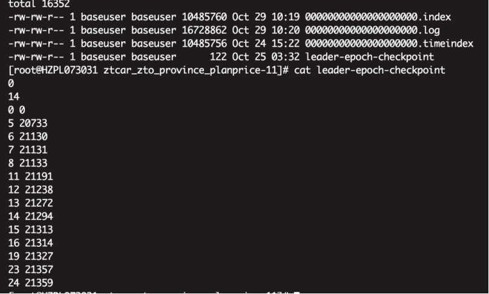

它的格式为 (epoch offset)，epoch指的是 leader 版本，它是一个单调递增的一个正整数值，每次 leader 变更，epoch 版本都会 +1，offset 是每一代 leader 写入的第一条消息的位移值，比如：

(0,0)

(1,300)

以上第2个版本是从位移300开始写入消息，意味着第一个版本写入了 0-299 的消息。

**leader epoch 具体的工作机制**

* 当副本成为 leader 时：

这时，如果此时生产者有新消息发送过来，会首先更新leader epoch 以及LEO ，并添加到 leader-epoch-checkpoint 文件中；

* 当副本变成 follower 时：

发送LeaderEpochRequest请求给leader副本，该请求包括了follower中最新的epoch 版本；

leader返回给follower的响应中包含了一个LastOffset，如果 follower last epoch = leader last epoch（纪元相同），则 LastOffset = leader LEO，否则取follower last epoch 中最小的 leader epoch 的 start offset 值；&#x20;

> 举个例子：假设 follower last epoch = 1，此时 leader 有 (1, 20) (2, 80) (3, 120)，则 LastOffset = 80；

follwer 拿到 LastOffset 之后，会对比当前 LEO 值是否大于 LastOffset，如果当前 LEO 大于 LastOffset，则从 LastOffset 截断日志；

follower 开始发送 fetch 请求给 leader 保持消息同步。

**leader epoch 如何解决HW的备份缺陷**

* **解决数据丢失和数据不一致的问题**

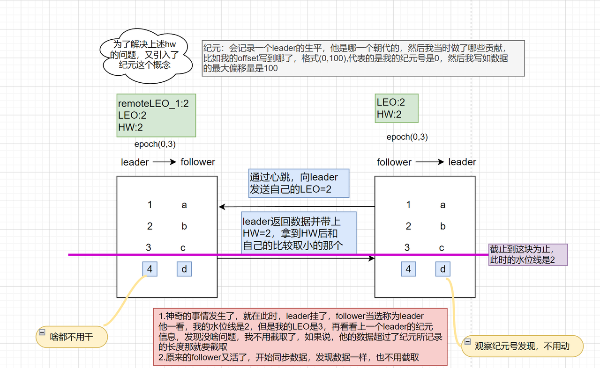

如上图所示：

follower当选leader后，收到纪元消息，发现 LastOffset等于当前 LEO 值，故不用进行日志截断。

follower重启后同步消息，发现自己也不用截取，数据一致，齐活儿

当然，如果说后来增加消息以后，也不需要截取，直接同步数据就行(当ack=-1)

### **6.6.6LEO/HW/LSO等相关术语速查**

LEO:（last end offset）就是该副本中消息的最大偏移量的值+1 ；

**HW:（high watermark）各副本中LEO的最小值。这个值规定了消费者仅能消费HW之前的数据；**

LW：（low watermark）一个副本的log中，最小的消息偏移量；  应该是和log里面的偏移量有关系

LSO：（last stable offset） 最后一个稳定的offset；对未完成的事务而言，LSO 的值等于事务中第一条消息的位置(firstUnstableOffset)，对已完成的事务而言，它的值同 HW 相同；

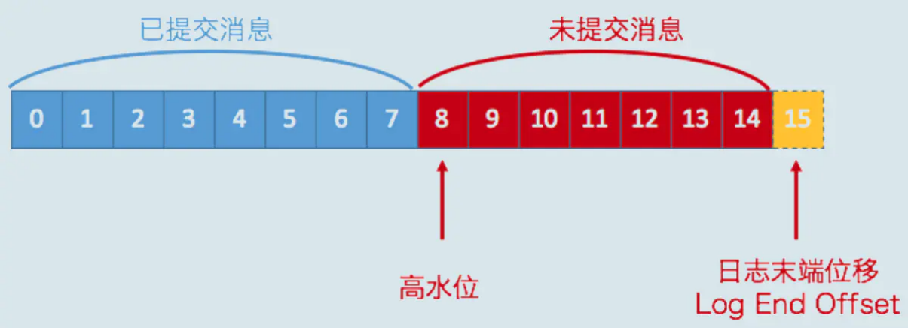

**LEO与HW 与数据一致性密切相关；**

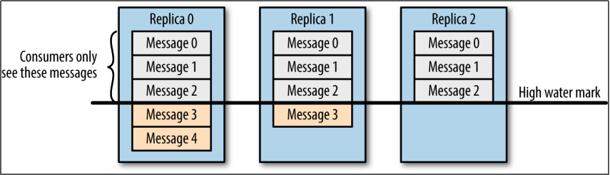

如图，各副本中最小的LEO是3，所以HW是3，所以，消费者此刻最多能读到Msg2;

### **6.6.7不清洁选举\[了解]**

不清洁选举，是指允许“非ISR副本”可以被选举为leader；非ISR副本被选举为leader，将极大增加数据丢失及数据不一致的可能性！由参数 unclean.leader.election.enable=false（默认） 控制；

* 初始状态： follower2严重落后于leader，并且不属于ISR副本

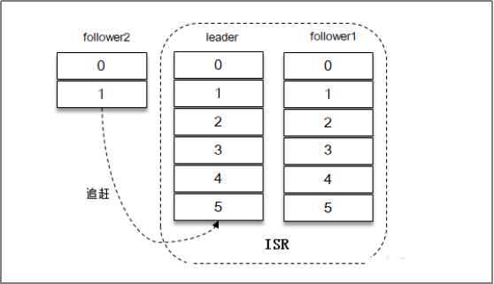

* 此刻，所有ISR副本宕机：

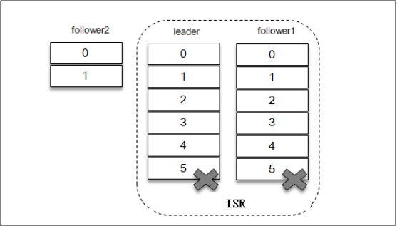

* Follower2成为新的leader，并接收数据

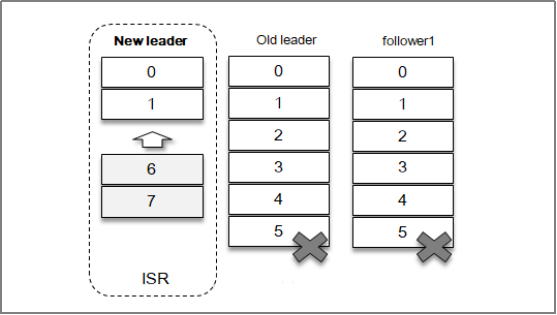

* 之前宕机副本重启，按照最新leader的最新leo进行截断，产生数据丢失及不一致

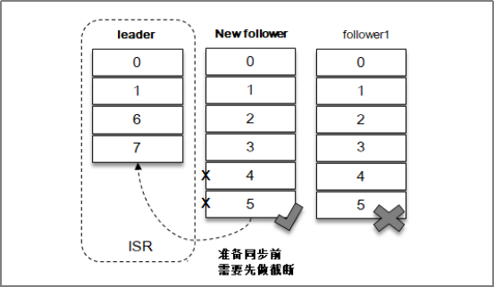

## 6.7.**幂等性&#x20;**

### **6.7.1幂等性要点**

Kafka 0.11.0.0 版本开始引入了**幂等性**与事务这两个特性，以此来实现 EOS ( exactly once&#x20;

semantics ，精确一次处理语义）

生产者在进行发送失败后的重试时（retries），有可能会重复写入消息，而使用 Kafka幂等性功能之后就可以避免这种情况。

> 开启幂等性功能，只需要显式地将生产者参数 enable.idempotence设置为 true （默认值为 false）：
>
> props.put("enable.idempotence",true);

在开启幂等性功能时，如下几个参数必须正确配置：

* retries > 0&#x20;

* max.in.flight.requests.per.connection<=5

* acks = -1

如有违反，则会抛出ConfigException异常；

### **6.7.2kafka幂等性实现机制**

1）每一个producer在初始化时会生成一个producer\_id，并为每个目标分区维护一&#x4E2A;**“消息序列号”**；

2）producer每发送一条消息，会将\<producer\_id,分区>对应的“序列号”加1

3）broker端会为每一对{producer\_id,分区}维护一个序列号，对于每收到的一条消息，会判断服务端的SN\_OLD和接收到的消息中的SN\_NEW进行对比：

* 如果SN\_OLD + 1 == SN\_NEW，正常；

* 如果SN\_NEW\<SN\_OLD+1，说明是重复写入的数据，直接丢弃

* 如果SN\_NEW>SN\_OLD+1，说明中间有数据尚未写入，或者是发生了乱序，或者是数据丢失，将抛出严重异常：OutOfOrderSequenceException

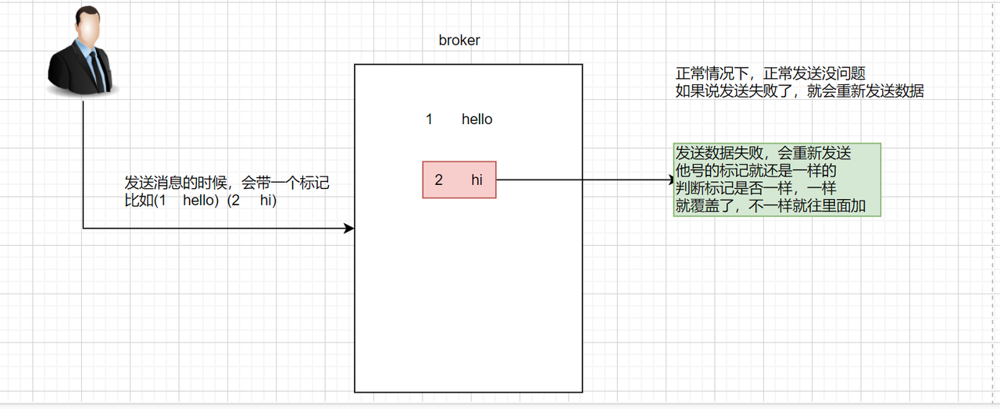

producer.send(“aaa”)   消息aaa就拥有了一个唯一的序列号

如果这条消息发送失败，producer内部自动重试（retry），此时序列号不变；

producer.send(“bbb”)   消息bbb拥有一个新的序列号

> 注意：kafka只保证producer单个会话中的单个分区幂等；

## **6.8.kafka事务(伪事务)&#x20;**

### **6.8.1事务要点知识**

* Kafka的事务控制原理

主要原理：  开始事务-->发送一个ControlBatch消息（事务开始）

&#x20;                 提交事务-->发送一个ControlBatch消息（事务提交）

&#x20;                 放弃事务-->发送一个ControlBatch消息（事务终止）

* 开启事务的必须配置参数（我不支持数据得回滚，但是我能做到，一荣俱荣，一损俱损）

```java
Properties props = new Properties();
props.setProperty(ProducerConfig.BOOTSTRAP_SERVERS_CONFIG,"doit01:9092");
props.setProperty(ProducerConfig.KEY_SERIALIZER_CLASS_CONFIG, StringSerializer.class.getName());
props.setProperty(ProducerConfig.VALUE_SERIALIZER_CLASS_CONFIG, StringSerializer.class.getName());
// acks
props.setProperty(ProducerConfig.ACKS_CONFIG,"-1");
// 生产者的重试次数
props.setProperty(ProducerConfig.RETRIES_CONFIG,"3");
// 飞行中的请求缓存最大数量
props.setProperty(ProducerConfig.MAX_IN_FLIGHT_REQUESTS_PER_CONNECTION,"3");
// 开启幂等性
props.setProperty(ProducerConfig.ENABLE_IDEMPOTENCE_CONFIG,"true");
// 设置事务id
props.setProperty(ProducerConfig.TRANSACTIONAL_ID_CONFIG,"trans_001");
```

**事务控制的代码模板**

```java
// 初始化事务
producer.initTransaction( )

// 开启事务    
producer.beginTransaction( )
    
// 干活

// 提交事务
producer.commitTransaction( )


// 异常回滚（放弃事务） catch里面
producer.abortTransaction( )
```

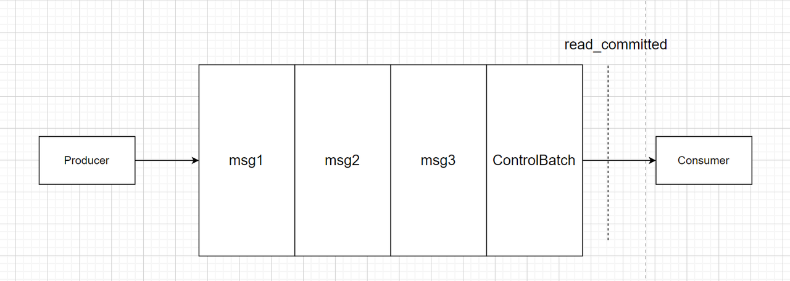

消费者api是会拉取到尚未提交事务的数据的；只不过可以选择是否让用户看到！

是否让用户看到未提交事务的数据，可以通过消费者参数来配置：

isolation.level=read\_uncommitted（默认值）

isolation.level=read\_committed

* kafka还有一&#x4E2A;**“高级”事务控制**，只针对一种场景：

用户的程序，要从kafka读取源数据，数据处理的结果又要写入kafka

kafka能实现端到端的事务控制（比起上面的“基础”事务，多了一个功能，通过producer可以将consumer的消费偏移量绑定到事务上提交）

```java
producer.sendOffsetsToTransaction(offsets,consumer_id)
```

### **6.8.2事务api示例**

为了实现事务，应用程序必须提供唯一**transactional.id**，并且开启生产者的**幂等性**

```java
properties.put ("transactional.id","transactionid00001");
properties.put ("enable.idempotence",true);
```

kafka生产者中提供的关于事务的方法如下：

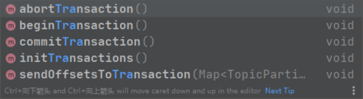

**“消费kafka-处理-生产结果到kafka”典型场景下的代码结构示例：**

```java
package com.doit.day04;

import org.apache.kafka.clients.consumer.ConsumerConfig;
import org.apache.kafka.clients.consumer.ConsumerRecord;
import org.apache.kafka.clients.consumer.ConsumerRecords;
import org.apache.kafka.clients.consumer.KafkaConsumer;
import org.apache.kafka.clients.producer.KafkaProducer;
import org.apache.kafka.clients.producer.ProducerConfig;
import org.apache.kafka.clients.producer.ProducerRecord;
import org.apache.kafka.common.errors.ProducerFencedException;
import org.apache.kafka.common.serialization.StringDeserializer;
import org.apache.kafka.common.serialization.StringSerializer;

import java.time.Duration;
import java.util.Arrays;
import java.util.Properties;

public class Exercise_kafka2kafka {
    public static void main(String[] args) {

        Properties props = new Properties();
        //消费者的
        props.setProperty(ConsumerConfig.BOOTSTRAP_SERVERS_CONFIG,"linux01:9092");
        props.setProperty(ConsumerConfig.KEY_DESERIALIZER_CLASS_CONFIG, StringDeserializer.class.getName());
        props.setProperty(ConsumerConfig.VALUE_DESERIALIZER_CLASS_CONFIG, StringDeserializer.class.getName());
        props.setProperty(ConsumerConfig.GROUP_ID_CONFIG, "shouwei");
        //自动提交偏移量
        props.setProperty(ConsumerConfig.ENABLE_AUTO_COMMIT_CONFIG,"false");
        props.setProperty(ConsumerConfig.AUTO_OFFSET_RESET_CONFIG,"earliest");

        //写生产者的一些属性
        props.setProperty(ProducerConfig.BOOTSTRAP_SERVERS_CONFIG,"linux01:9092");
        props.setProperty(ProducerConfig.KEY_SERIALIZER_CLASS_CONFIG, StringSerializer.class.getName());
        props.setProperty(ProducerConfig.VALUE_SERIALIZER_CLASS_CONFIG, StringSerializer.class.getName());

        //设置ack 开启幂等性必须设置的三个参数
        props.setProperty(ProducerConfig.ACKS_CONFIG,"-1");
        props.setProperty(ProducerConfig.RETRIES_CONFIG,"3");
        props.setProperty(ProducerConfig.MAX_IN_FLIGHT_REQUESTS_PER_CONNECTION,"3");
        //开启幂等性
        props.setProperty(ProducerConfig.ENABLE_IDEMPOTENCE_CONFIG,"true");
        //开启事务
        props.setProperty(ProducerConfig.TRANSACTIONAL_ID_CONFIG,"doit40");

        //消费数据
        KafkaConsumer<String, String> consumer = new KafkaConsumer<String, String>(props);
        KafkaProducer<String, String> producer = new KafkaProducer<>(props);
        //初始化事务
        producer.initTransactions();
        //订阅主题
        consumer.subscribe(Arrays.asList("eventlog"));
        while (true){
            //拉取数据
            ConsumerRecords<String, String> poll = consumer.poll(Duration.ofMillis(Integer.MAX_VALUE));
            try {
                //开启事务
                producer.beginTransaction();
                for (ConsumerRecord<String, String> record : poll) {
                    String value = record.value();
                    //将value的值写入到另外一个topic中
                    producer.send(new ProducerRecord<String,String>("k2k",value));
                }
                producer.flush();
                //提交偏移量
                consumer.commitAsync();
                //提交事务
                producer.commitTransaction();

            } catch (ProducerFencedException e) {
                //放弃事务
                producer.abortTransaction();
            }
        }
    }
}
```

### 6.8.3事务实战案例

在实际数据处理中，consume-transform-produce是一种常见且典型的场景；

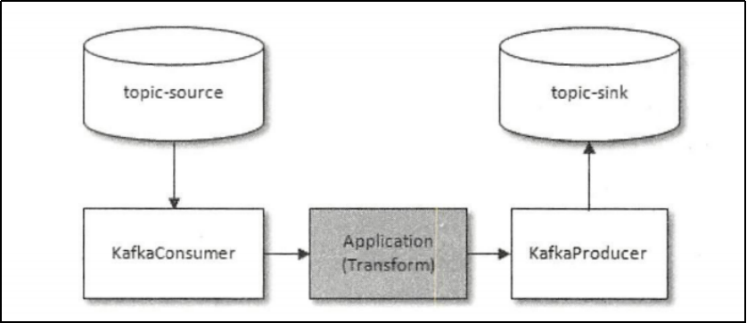

在此场景中，我们往往需要实现，从“读取source数据，至业务处理，至处理结果写入kafka”的整个流程，具备原子性：

> **要么全流程成功，要么全部失败！**

（处理且输出结果成功，才提交消费端偏移量；处理或输出结果失败，则消费偏移量也不会提交）

要实现上述的需求，可以利用Kafka中的**事务机制**：

它可以使应用程序将**消费消息**、**生产消息**、**提交消费位移**当作原子操作来处理，即使该生产或消费会跨多个topic分区；

在消费端有一个参数isolation.level，与事务有着莫大的关联，这个参数的默认值为“read\_uncommitted”，意思是说消费端应用可以看到（消费到）未提交的事务，当然对于已提交的事务也是可见的。这个参数还可以设置为“read\_committed”，表示消费端应用不可以看到尚未提交的事务内的消息。

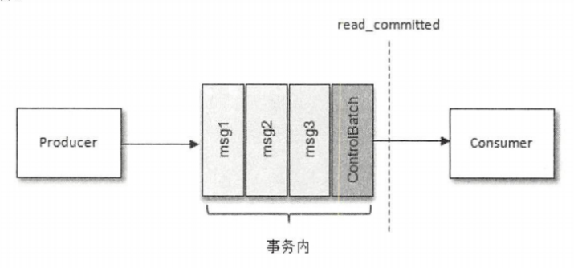

> 控制消息（ControlBatch：COMMIT/ABORT）表征事务是被提交还是被放弃

## **6.9分区数与吞吐量**

Kafka本身提供用于生产者性能测试的kafka-producer-perf-test.sh 和用于消费者性能测试的 kafka-consumer-perf-test. sh，主要参数如下：

* topic 用来指定生产者发送消息的目标主题；&#x20;

* num-records 用来指定发送消息的总条数&#x20;

* record-size 用来设置每条消息的字节数；&#x20;

* producer-props 参数用来指定生产者的配置，可同时指定多组配置，各组配置之间以空格分隔与 producer-props 参数对应的还有一个 producer-config参数，它用来指定生产者的配置文件；&#x20;

* throughput 用来进行限流控制，当设定的值小于0时不限流，当设定的值大于0时，当发送的吞吐量大于该值时就会被阻塞一段时间。

> 经验：如何把kafka服务器的性能利用到最高，一般是让一台机器承载（ cpu线程数\*2\~3 ）个分区
>
> 测试环境： 节点3个，cpu 2核2线程，内存8G ，每条消息1k
>
> 测试结果：  topic在12个分区时，写入、读取的效率都是达到**最高**
>
> 写入： 75MB/s  ，7.5万条/s
>
> 读出： 310MB/s ，31万条/s
>
> 当分区数>12  或者 <12 时，效率都比=12时要低！

## **6.10性能测试**

### **6.10.1生产者性能测试**

**tpc\_3： 分区数3，副本数1**

```shell
[root@doitedu01 kafka_2.11-2.0.0]# bin/kafka-producer-perf-test.sh --topic tpc_3 --num-records 100000 --record-size 1024 --throughput -1 --producer-props bootstrap.servers=linux01:9092 acks=1
```

100000 records sent, 26723.677178 records/sec (26.10 MB/sec), 818.30 ms avg latency, 1689.00 ms max latency, 595 ms 50th, 1580 ms 95th, 1649 ms 99th, 1687 ms 99.9th.

**tpc\_4： 分区数4，副本数2**

```shell
[root@doitedu01 kafka_2.11-2.0.0]# bin/kafka-producer-perf-test.sh --topic tpc_4 --num-records 100000 --record-size 1024 --throughput -1 --producer-props bootstrap.servers=linux01:9092 acks=1
```

100000 records sent, 25886.616619 records/sec (25.28 MB/sec), 962.06 ms avg latency, 1647.00 ms max latency, 857 ms 50th, 1545 ms 95th, 1622 ms 99th, 1645 ms 99.9th.

**tpc\_5：分区数5，副本数1**

```shell
[root@doitedu01 kafka_2.11-2.0.0]# bin/kafka-producer-perf-test.sh --topic tpc_5 --num-records 100000 --record-size 1024 --throughput -1  --producer-props bootstrap.servers=doitedu01:9092 acks=1
```

100000 records sent, 28785.261946 records/sec (28.11 MB/sec), 789.29 ms avg latency, 1572.00 ms max latency, 665 ms 50th, 1502 ms 95th, 1549 ms 99th, 1564 ms 99.9th.

**tpc\_6：分区数6，副本数1**

```shell
[root@doitedu01 kafka_2.11-2.0.0]# bin/kafka-producer-perf-test.sh --topic tpc_6 --num-records 100000 --record-size 1024 --throughput -1 --producer-props bootstrap.servers=doitedu01:9092 acks=1
```

100000 records sent, 42662.116041 records/sec (41.66 MB/sec), 508.68 ms avg latency, 1041.00 ms max latency, 451 ms 50th, 945 ms 95th, 1014 ms 99th, 1033 ms 99.9th.

**tpc\_12：分区数12**

```shell
[root@doitedu01 kafka_2.11-2.0.0]# bin/kafka-producer-perf-test.sh --topic tpc_12 --num-records 100000 --record-size 1024 --throughput -1 --producer-props bootstrap.servers=doitedu01:9092 acks=1
```

100000 records sent, 56561.085973 records/sec (55.24 MB/sec), 371.42 ms avg latency, 1103.00 ms max latency, 314 ms 50th, 988 ms 95th, 1091 ms 99th, 1093 ms 99.9th.

> 脚本还包含了许多其他的参数，比如 from latest group、print-metrics、threads等，篇幅及时间限制，同学们可以自行了解这些参数的使用细节。
>
> 例如，加上参数： --print-metrics，则会打印更多信息

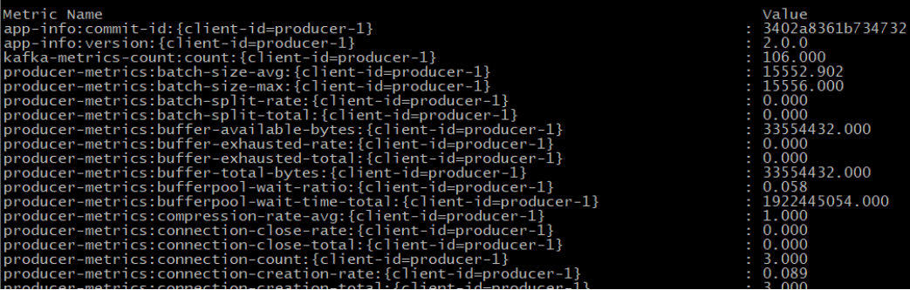

### 6.10.2**消费者性能测试**

```shell
[root@doitedu01 kafka_2.11-2.0.0]# bin/kafka-consumer-perf-test.sh --topic tpc_3 --messages 100000 --broker-list doitedu01:9092 --consumer.config x.properties
```

**结果数据个字段含义：**

start.time, end.time, data.consumed.in.MB, MB.sec, data.consumed.in.nMsg, nMsg.sec, rebalance.time.ms, fetch.time.ms, fetch.MB.sec, fetch.nMsg.sec

2020-11-14 15:43:42:422, 2020-11-14 15:43:43:347, 98.1377, 106.0948, 100493, 108641.0811, 13, 912, 107.6071, 110189.6930

> 结果中包含了多项信息，分别对应起始运行时间（start. time）、结束运行时 end.time）、消息总量（data.consumed.in.MB ，单位为 MB ），按字节大小计算的消费吞吐量（单位为 MB ）、消费的消息总数（ data. consumed.in nMsg ）、按消息个数计算的吞吐量（nMsg.sec）、再平衡的时间（ rebalance time.ms 单位为MB/s）、拉取消息的持续时间（fetch.time.ms，单位为ms）、每秒拉取消息的字节大小（fetch.MB.sec 单位 MB/s）、每秒拉取消息的个数( fetch.nM.sec）。其中 fetch.time.ms= end.time - start.time - rebalance.time.ms

### 6.10.3分区数与吞吐量实际测试

Kafka只允许单个分区中的消息被一个消费者线程消费，一个消费组的消费并行度完全依赖于所消费的分区数；

如此看来，如果一个主题中的分区数越多，理论上所能达到的吞吐量就越大，那么事实真的如预想的一样吗？

> 我们以一个3台普通阿里云主机组成的3节点kafka集群进行测试，每台主机的内存大小为8GB，磁盘为40GB，4核CPU 16线程 ，主频2600MHZ，JVM版本为1.8.0\_112，Linux系统版本为2.6.32-504.23.4.el6.x86\_64。
>
> 创建分区数为1、20、50、100、200、500、1000的主题，对应的主题名称分别为 topic-1 topic 20 topic-50 topic-100 topic-200 topic-500 topic-1000 ，所有主题的副本因子都设置为1。

* 生产者，测试结果如下

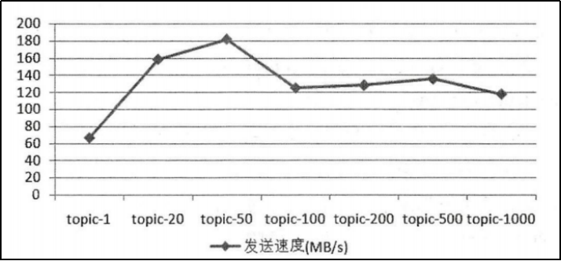

* 消费者，测试结果与上图趋势类同

如何选择合适的分区数？从某种意恩来说，考验的是决策者的实战经验，更透彻地说，是Kafka本身、业务应用、硬件资源、环境配置等多方面的考量而做出的选择。在设定完分区数，或者更确切地说是创建主题之后，还要对其追踪、监控、调优以求更好地利用它 。

一般情况下，根据预估的吞吐量及是否与 key 相关的规则来设定分区数即可，后期可以通过增加分区数、增加 broker 或分区重分配等手段来进行改进。


### **6.10.4分区数设置的经验参考**

如果一定要给一个准则，则建议将分区数设定为集群中broker的倍数，即假定集群中有3个broker 节点，可以设定分区数为3/6/9等，至于倍数的选定可以参考预估的吞吐量。

或者根据机器配置的cpu线程数和磁盘性能来设置最大效率的分区数：= CPU线程数 \* 1.5\~2倍

不过，如果集群中的broker节点数有很多，比如大几十或上百、上千，那么这种准则也不太适用。

还有一个可供参考的分区数设置算法：

每一个分区的写入速度，大约40M/s

每一个分区的读取速度，大约60M/s

假如，数据源产生数据的速度是（峰值）800M/s  ，那么为了保证写入速度，该topic应该设置20个分区（副本因子为3）


## **6.11Kafka速度快的原因（了解）**

**Kafka速度快的原因：**

* 消息顺序追加（磁盘顺序读写比内存的随机读写还快）

* 使用Zero-Copy （零拷贝）技术来进一步提升性能；

扩展阅读：零拷贝    &#x20;

**所谓的零拷贝是指将数据直接从磁盘文件复制到网卡设备中，而不需要经由应用程序之手；**

零拷贝大大提高了应用程序的性能，减少了内核和用户模式之间的上下文切换；对于Linux系统而言，零拷贝技术依赖于底层的 sendfile( )方法实现；对应于Java 语言，FileChannal.transferTo( )方法的底层实现就是 sendfile( )方法；

* **非零拷贝示意图**

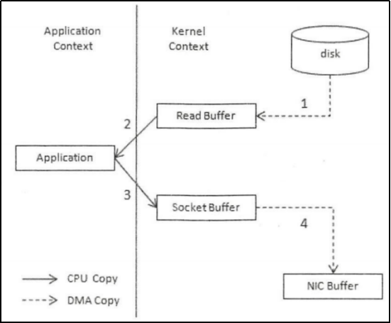

* **零拷贝示意图**

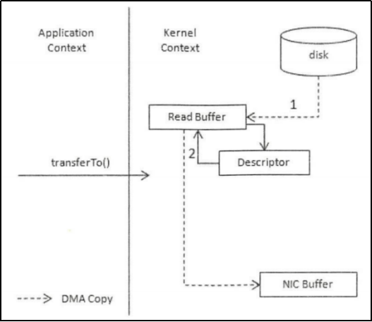

零拷贝技术通过DMA (Direct Memory Access）技术将文件内容复制到内核模式下的 Read Buffer。不过没有数据被复制到 Socke Buffer，只有包含数据的位置和长度的信息的文件描述符被加到 Socket Buffer； DMA引擎直接将数据从内核模式read buffer中传递到网卡设备。

这里数据只经历了2次复制就从磁盘中传送出去了，并且上下文切换也变成了2次。

零拷贝是针对内核模式而言的，数据在内核模式下实现了零拷贝；

# 7.kafka面试题

## 7.22 **kafka 都有哪些特点？**

高吞吐量，低延迟

可以热扩展

并发度高

具有容错性(挂的只剩1台也能正常跑)

可靠性高


## 7.23 **请简述你在哪些场景下会选择 kafka？  kafka的一些应用**

* 日志收集：一个公司可以用kafka可以收集各种服务的log，通过kafka以统一接口服务的方式开放给各种consumer，例如hadoop、HBase、Solr等。

* 消息系统：解耦和生产者和消费者、缓存消息等。

* 用户行为跟踪：kafka经常被用来记录web用户或者app用户的各种活动，如浏览网页、搜索、点击等活动，这些活动信息被各个服务器发布到kafka的topic中，然后订阅者通过订阅这些topic来做实时的监控分析，或者装载到hadoop、数据仓库中做离线分析和挖掘。

* 运营指标：kafka也经常用来记录运营监控数据。包括收集各种分布式应用的数据，生产各种操作的集中反馈，比如报警和报告。

* 作为流式处理的数据源：比如spark streaming和 Flink

## 7.24 **kafka 的设计架构你知道吗？**


## 7.25 **kafka 分区的目的？**

分区对于kafka集群的好处是：实现负载均衡。

分区对于消费者和生产者来说，可以提高并行度，提高效率。--------提高消费者的并行度---》消费者组


## 7.26 **kafka 是如何做到消息的有序性？**

kafka中的每个 partition 中的消息在写入时都是有序的（不断追加），而且单独一个 partition只能由一个消费者去消费，可以在里面保证消息的顺序性。但是分区之间的消息是不保证有序的。


## 7.27 **kafka 的高可靠性是怎么实现的？**

数据的存储==》有副本机制，生产者还有幂等性，保证数据不丢失，ack = -1&#x20;


## 7.28 **请谈一谈kafka数据一致性原理**

一致性指的是不论在什么情况下，Consumer都能读到一致的数据。

HW 高水位线   在0.11版本之前，只用了高水位线来保证，但是这个里面其实是会出现一些问题的，比如数据丢失，即使是ack等于-1的情况下，也可能会丢数据

LEO等

在0.11版本之后，新加了一个角色叫leader的纪元号，根据高水位线和纪元号来处理，再配上ack=-1的时候，基本上就不会丢数据了。。。。


## 7.29 **kafka 在什么情况下会出现消息丢失？**

* topic的副本如果只有1个，那么一旦这个副本所在broker服务器宕机，则有可能丢失；

* producer往kafka写入数据时，如果确认机制参数acks !=all，也可能会造成数据丢失；

* 不清洁选举机制如果开启，也可能造成数据丢失（不清洁选举就是说在所有ISR副本全部宕机的情况下，可以让OSR副本成为Leader，而OSR中的数据显然不全；那么，就算之前的Leader重新上线了，也会被进行日志截断）


## 7.30 **怎么尽可能保证 kafka 的可靠性**

副本数>1

ack=all

min.insync.replicas >= 2    最小的同步副本数


## 7.31 **数据传输的语义有几种？**

数据传输的语义通常有以下三种级别：

设置消费者里面有enable.auto.commit = true/false

* 最多一次: 消息不会被重复发送，最多被传输一次，但也有可能一次不传输

先提交偏移量，在处理业务逻辑

* 最少一次: 消息不会被漏发送，最少被传输一次，但也有可能被重复传输

* 精确一次（Exactly once）: 不会漏传输也不会重复传输

## 7.32 **kafka 消费者是否可以指定分区的消息进行消费？**


## 7.33 **kafka 消费者是否从指定偏移量开始消费？**

可以，通过seek指定偏移量后再开始消费


## 7.34 **客户端操作kafka消息是采用poll模式，还是push模式？**

kafka最初考虑的问题是，customer应该从brokes拉取消息还是brokers将消息推送到consumer，也就是pull还是push。在这方面，Kafka遵循了一种大部分消息系统共同的传统的设计：producer将消息推送到broker，consumer从broker拉取消息。

一些消息系统比如Scribe和Apache Flume采用了push模式，将消息推送到下游的consumer。这样做有好处也有坏处：由broker决定消息推送的速率，对于不同消费速率的consumer就不太好处理了。消息系统都致力于让consumer以最大的速率最快速的消费消息，但不幸的是，push模式下，当broker推送的速率远大于consumer消费的速率时，consumer恐怕就要崩溃了。最终Kafka还是选取了传统的pull模式。
pull模式的另外一个好处是consumer可以自主决定是否批量的从broker拉取数据。push模式必须在不知道下游consumer消费能力和消费策略的情况下决定是立即推送每条消息还是缓存之后批量推送。如果为了避免consumer崩溃而采用较低的推送速率，将可能导致一次只推送较少的消息而造成浪费。Pull模式下，consumer就可以根据自己的消费能力去决定这些策略。
pull有个缺点是，如果broker没有可供消费的消息，将导致consumer不断在循环中轮询，直到新消息到达。为了避免这点，Kafka有个参数可以让consumer阻塞直到新消息到达(当然也可以阻塞直到消息的数量达到某个特定的量这样就可以批量拉取）

## 7.35 **kafka的消息格式有了解吗？**

## 7.36 **kafka 高效文件存储设计特点**

Kafka把topic中一个parition大文件分成多个小文件段，通过多个小文件段，就容易定期清除或删除已经消费完文件，减少磁盘占用。  默认存储时间7天

通过索引信息可以快速定位message。


## 7.37 **kafka的分区分布策略是怎样的？**

分区分布的计算策略如下

* 副本因子不能大于 Broker 的个数；

* **第一个分区**（编号为0）的第一个副本放置位置是随机从 brokerList 选择的；

* **其他分区**的第一个副本放置位置相对于第0个分区依次往后移。也就是如果我们有5个 Broker，5个分区，假设第1个分区放在第四个 Broker 上，那么第2个分区将会放在第五个 Broker 上；第3个分区将会放在第一个 Broker 上；第4个分区将会放在第二个 Broker 上，依次类推；

* **剩余副本**相对于第1个副本放置位置是由一个随机数nextReplicaShift 决定；&#x20;

## 7.38 **kafka分区数可以增加或减少吗？为什么？**

**kafka允许对topic动态增加分区，但不支持减少分区**

Kafka 分区数据不支持减少是由很多原因的，比如减少的分区其数据放到哪里去？是删除，还是保留？删除的话，那么这些没消费的消息不就丢了。如果保留这些消息如何放到其他分区里面？追加到其他分区后面的话那么就破坏了 Kafka 单个分区的有序性。如果要保证删除分区数据插入到其他分区保证有序性，那么实现起来逻辑就会非常复杂。

## 7.39 **kafka新建的分区会在哪创建存储目录**

**log.dirs**参数，其值是 kafka 数据的存放目录；

**这个参数可以配置多个目录**，目录之间使用逗号分隔，通常这些目录是分布在不同的磁盘上用于提高读写性能。

如果log.dirs参数只配置了一个目录，那么分配到各个 broker 上的分区肯定只能在这个目录下创建文件夹用于存放数据。

但是如果log.dirs参数配置了多个目录，那么 kafka 会在哪个文件夹中创建分区目录呢？答案是：Kafka 会在含有分区目录最少的文件夹中创建新的分区目录，分区目录名为 Topic名+分区ID。

注意，是分区文件夹总数最少的目录，而不是磁盘使用量最少的目录！也就是说，如果你给 log.dirs 参数新增了一个新的磁盘，新的分区目录肯定是先在这个新的磁盘上创建直到这个新的磁盘目录拥有的分区目录不是最少为止。

## 7.40 **消费者和消费者组有什么关系？**

每个消费者从属于消费组。消费者通过一个参数：group.id 来指定所属的组；

可以把多个消费者的group.id设置成同一个值，那么这几个消费者就属于同一个组；

比如，让c-1，c-2,c-3的group.id=“g1",那么c-1,c-2,c-3这3个消费者都属于g1消费组；

一个消费者，在本质上究竟如何定义：一个消费者可以是一个线程，也可以是一个进程，本质上就是一个consumer对象实例！

**消费者组的意义：**（可以让多个消费者组成一个组，并共同协作来消费数据，提高消费并行度）一个消费组中的各消费者，在消费一个topic的数据时，互相不重复！如果topic的某分区被组中的一个消费消费，那么，其他消费者就不会再消费这个分区了；

具体关系如下：

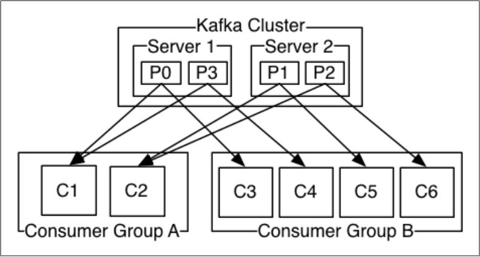

##

## 7.41 **kafka监控插件都有哪些？**

kafka manager

kafka-offset-monitor ：主要做消费者偏移量的监控

kafka-eagle：功能很强大！（现已改名为：EFAK —— eagle for apache kafka）

&#x20;

&#x20;

