# 1. 快速认识flink

Apache Flink是一个分布式**实时流式**计算引擎(框架)；用于无界流和有界数据流(批)的有**状态**计算。

Flink被设计成可以在所有常见的集群环境中运行 , 基于内存的分布式计算引擎  ,适用于任何数据规模的(实时)计算场景。


> 流式计算的特点：由于数据是实时持续流入没有终结，只能每逢数据到达就进行计算，并输出"当时"的计算结果（因而计算结果也不会是一次性的最终结果，而是源源不断的无界的结果流）；


**流计算和批计算的特点**

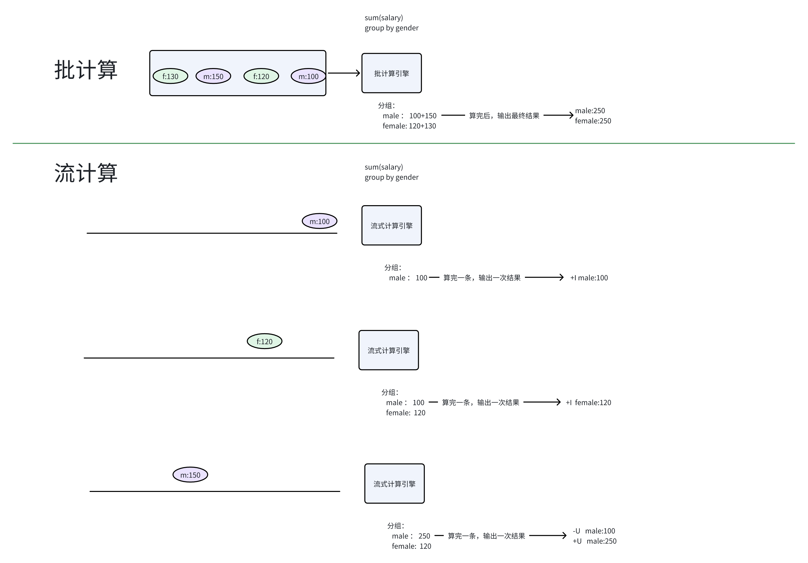


> **flink是一个  流批一体  的计算引擎**
>
> 当然，如果真的需要做纯粹的批计算，企业中一般会选择 spark
>
> 选择flink主要用它的流计算功能


# 2. Flink编程基础

## 2.1 添加依赖

```xml
<properties>
    <maven.compiler.source>8</maven.compiler.source>
    <maven.compiler.target>8</maven.compiler.target>
    <flink.version>1.16.1</flink.version>
    <project.build.sourceEncoding>UTF-8</project.build.sourceEncoding>
</properties>

  <dependencies>
        <dependency>
            <groupId>org.apache.flink</groupId>
            <artifactId>flink-java</artifactId>
            <version>${flink.version}</version>
        </dependency>
        <dependency>
            <groupId>org.apache.flink</groupId>
            <artifactId>flink-streaming-java</artifactId>
            <version>${flink.version}</version>
        </dependency>
        
        <!--flink本地运行时 提供的web功能-->
        <dependency>
            <groupId>org.apache.flink</groupId>
            <artifactId>flink-runtime-web</artifactId>
            <version>${flink.version}</version>
        </dependency>

        <dependency>
            <groupId>org.apache.flink</groupId>
            <artifactId>flink-table-api-java</artifactId>
            <version>${flink.version}</version>
        </dependency>

        <dependency>
            <groupId>org.apache.flink</groupId>
            <artifactId>flink-table-common</artifactId>
            <version>${flink.version}</version>
        </dependency>

        <dependency>
            <groupId>org.apache.commons</groupId>
            <artifactId>commons-compress</artifactId>
            <version>1.21</version>
        </dependency>
        <dependency>
            <groupId>org.apache.flink</groupId>
            <artifactId>flink-table-planner_2.12</artifactId>
            <version>${flink.version}</version>
        </dependency>
        <!-- flinksql本地运行需要的依赖 -->
        <dependency>
            <groupId>org.apache.flink</groupId>
            <artifactId>flink-clients</artifactId>
            <version>${flink.version}</version>
        </dependency>
        <!--状态后端管理器-->
        <dependency>
            <groupId>org.apache.flink</groupId>
            <artifactId>flink-statebackend-rocksdb</artifactId>
            <version>${flink.version}</version>
        </dependency>

        <dependency>
            <groupId>org.projectlombok</groupId>
            <artifactId>lombok</artifactId>
            <version>1.18.26</version>
        </dependency>

        <dependency>
            <groupId>org.apache.flink</groupId>
            <artifactId>flink-csv</artifactId>
            <version>${flink.version}</version>
        </dependency>

        <dependency>
            <groupId>org.apache.flink</groupId>
            <artifactId>flink-parquet</artifactId>
            <version>${flink.version}</version>
        </dependency>
        <dependency>
            <groupId>org.apache.parquet</groupId>
            <artifactId>parquet-avro</artifactId>
            <version>1.11.1</version>
        </dependency>

        <dependency>
            <groupId>org.apache.flink</groupId>
            <artifactId>flink-avro</artifactId>
            <version>${flink.version}</version>
        </dependency>
        <dependency>
            <groupId>org.apache.flink</groupId>
            <artifactId>flink-json</artifactId>
            <version>${flink.version}</version>
        </dependency>

        <dependency>
            <groupId>org.apache.flink</groupId>
            <artifactId>flink-connector-kafka</artifactId>
            <version>${flink.version}</version>
        </dependency>

        <dependency>
            <groupId>org.apache.flink</groupId>
            <artifactId>flink-connector-files</artifactId>
            <version>${flink.version}</version>
        </dependency>
        <dependency>
            <groupId>org.apache.flink</groupId>
            <artifactId>flink-connector-hbase-2.2</artifactId>
            <version>${flink.version}</version>
        </dependency>
        <dependency>
            <groupId>org.apache.doris</groupId>
            <artifactId>flink-doris-connector-1.16</artifactId>
            <version>1.3.0</version>
        </dependency>
        <dependency>
            <groupId>org.apache.flink</groupId>
            <artifactId>flink-connector-jdbc</artifactId>
            <version>${flink.version}</version>
        </dependency>
        <dependency>
            <groupId>com.ververica</groupId>
            <artifactId>flink-connector-mysql-cdc</artifactId>
            <version>2.3.0</version>
        </dependency>
        <dependency>
            <groupId>mysql</groupId>
            <artifactId>mysql-connector-java</artifactId>
            <version>8.0.30</version>
        </dependency>
        <dependency>
            <groupId>redis.clients</groupId>
            <artifactId>jedis</artifactId>
            <version>4.3.1</version>
        </dependency>
        <dependency>
            <groupId>org.apache.flink</groupId>
            <artifactId>flink-connector-hive_2.12</artifactId>
            <version>1.16.1</version>
        </dependency>
        <dependency>
            <groupId>org.apache.hive</groupId>
            <artifactId>hive-exec</artifactId>
            <version>3.1.0</version>
            <exclusions>
                <exclusion>
                    <artifactId>hadoop-hdfs</artifactId>
                    <groupId>org.apache.hadoop</groupId>
                </exclusion>
            </exclusions>
        </dependency>
        <!--hadoop -->
        <dependency>
            <groupId>org.apache.hadoop</groupId>
            <artifactId>hadoop-common</artifactId>
            <version>3.1.0</version>
        </dependency>

        <dependency>
            <groupId>org.apache.hadoop</groupId>
            <artifactId>hadoop-client</artifactId>
            <version>3.1.0</version>
        </dependency>

        <dependency>
            <groupId>org.apache.hadoop</groupId>
            <artifactId>hadoop-hdfs</artifactId>
            <version>3.1.0</version>
        </dependency>

        <!-- 打印日志的jar包 -->
        <dependency>
            <groupId>org.slf4j</groupId>
            <artifactId>slf4j-log4j12</artifactId>
            <version>1.7.30</version>
        </dependency>

        <dependency>
            <groupId>log4j</groupId>
            <artifactId>log4j</artifactId>
            <version>1.2.16</version>
        </dependency>
        <dependency>
            <groupId>com.alibaba</groupId>
            <artifactId>fastjson</artifactId>
            <version>1.2.83</version>
        </dependency>
        <dependency>
            <groupId>org.apache.flink</groupId>
            <artifactId>flink-cep</artifactId>
            <version>${flink.version}</version>
        </dependency>

        <dependency>
            <groupId>org.apache.flink</groupId>
            <artifactId>flink-sql-gateway-api</artifactId>
            <version>${flink.version}</version>
        </dependency>
    </dependencies>
```

## 2.2 添加日志配置文件

在项目的src/main/resource下，放置如下配置文件

&#x20;

&#x20;


## 2.3 测试准备

在一台linux服务器上，安装一个socket工具软件： nc

然后启动nc，就可以从控制台往nc服务中发送字符串数据

```sql
# 安装nc
[root@doitedu01 ~]# yum install -y nc

# 启动nc服务，从控制台输入数据给nc服务
[root@doitedu01 ~]# nc -lk 9898
hello world spark
hello java

```


## 2.4 flink程序开发基本模板

**无论简单与复杂，flink程序都由如下几个部分组成**

* 获取一个编程、执行入口环境env

* 通过数据源组件source算子，加载、创建datastream

* 对datastream调用各种处理算子表达计算逻辑

* 通过sink算子指定计算结果的输出方式

* 在env.execute()上触发程序提交运行


## 2.3 入门示例程序（1）

加载网络数据流 , 累计统计单词出现的次数

```java
package com.doit.day01;


import org.apache.flink.api.common.functions.FlatMapFunction;
import org.apache.flink.api.java.functions.KeySelector;
import org.apache.flink.api.java.tuple.Tuple2;
import org.apache.flink.streaming.api.datastream.DataStreamSource;
import org.apache.flink.streaming.api.datastream.KeyedStream;
import org.apache.flink.streaming.api.datastream.SingleOutputStreamOperator;
import org.apache.flink.streaming.api.environment.StreamExecutionEnvironment;
import org.apache.flink.util.Collector;

/**
 * @Date: 2023/6/23
 * @Author: Hang.Nian.YY
 * @WX: 17710299606
 * @Tips: 学大数据 ,到多易教育
 * @DOC: https://blog.csdn.net/qq_37933018?spm=1000.2115.3001.5343
 * @Description:
 * flink可以流式处理数据
 *    源源不断地接收网络流数据  , 统计数据中每个单词出现的次数
 *    实时打印结果在控制台
 */
public class StreamWordCount {
    public static void main(String[] args) throws Exception {
        // 1 获取flink的编程环境
        //  可以做到  流批一体的处理方案
        StreamExecutionEnvironment see = StreamExecutionEnvironment.getExecutionEnvironment();
        // 2 获取网络数据流    DataStream  (Source)
        // 使用 socket网络流 客户端发送数据   接收数据   在linux上使用  nc -lk 端口号
        // socketTextStream 可以接收指定机器 指定端口发过来的数据
        // 源源不断地接收到数据  一行一行
        DataStreamSource<String> ds = see.socketTextStream("doitedu01", 8899);
        // 3 处理数据   统计单词出现的次数   (Transformation)
        // 3.1  将数据组装成 单词,1  二元组  Tuple2
        SingleOutputStreamOperator<Tuple2<String, Integer>> wrodOne = ds.flatMap(new FlatMapFunction<String, Tuple2<String, Integer>>() {
            // 参数1   一行数据  参数2  收集结果
            @Override
            public void flatMap(String line, Collector<Tuple2<String, Integer>> out) throws Exception {
                String[] words = line.split("\\s+");
                for (String word : words) {
                    // 以后 在使用某个对象的时候 先不new 优先调用一下有没有静态方法
                    Tuple2<String, Integer> tp = Tuple2.of(word, 1);
                    out.collect(tp);
                }
            } // 泛型1   输入的数据类型  泛型2  输出的结果
        });
        // 3.2 按照单词分组
        KeyedStream<Tuple2<String, Integer>, String> keyed = wrodOne.keyBy(new KeySelector<Tuple2<String, Integer>, String>() {
            @Override
            public String getKey(Tuple2<String, Integer> value) throws Exception {
                return value.f0;
            }
        });
        // 3.3 统计单词个数
        SingleOutputStreamOperator<Tuple2<String, Integer>> res = keyed.sum("f1");
        // 4 将结果打印在控制台    (sink)
        res.print() ;
        // 5 出发程序执行
        see.execute("流式单词统计") ;

    }
}
```


## 2.5 入门示例程序（2）

对如下数据，实时统计每类订单的总金额

```sql
{"order_id":1,"order_amt":38.8,"order_type":"团购"}
{"order_id":2,"order_amt":38.2,"order_type":"普通"}
{"order_id":3,"order_amt":40.0,"order_type":"普通"}
{"order_id":4,"order_amt":25.8,"order_type":"秒杀"}
{"order_id":5,"order_amt":52.4,"order_type":"团购"}
{"order_id":6,"order_amt":24.0,"order_type":"秒杀"}
```

代码实现

```java
package top.doe.flink.demos;

import com.alibaba.fastjson.JSON;
import lombok.AllArgsConstructor;
import lombok.Data;
import lombok.NoArgsConstructor;
import org.apache.flink.api.common.functions.MapFunction;
import org.apache.flink.streaming.api.datastream.DataStreamSource;
import org.apache.flink.streaming.api.datastream.KeyedStream;
import org.apache.flink.streaming.api.datastream.SingleOutputStreamOperator;
import org.apache.flink.streaming.api.environment.StreamExecutionEnvironment;

/**
 * @Author: 深似海
 * @Site: <a href="www.51doit.com">多易教育</a>
 * @QQ: 657270652
 * @Date: 2024/10/10
 * @Desc: 学大数据，上多易教育
 *
 *  从控制台向nc服务输入数据：
 *     {"order_id":1,"order_amt":38.8,"order_type":"团购"}
 *     {"order_id":2,"order_amt":38.2,"order_type":"普通"}
 *     {"order_id":3,"order_amt":40.0,"order_type":"普通"}
 *     {"order_id":4,"order_amt":25.8,"order_type":"秒杀"}
 *     {"order_id":5,"order_amt":52.4,"order_type":"团购"}
 *     {"order_id":6,"order_amt":24.0,"order_type":"秒杀"}
 *
 *  用 flink实时统计：当前的每种类型的订单总金额
 *
 **/
public class Demo2_SocketOrderAmt {

    public static void main(String[] args) throws Exception {

        StreamExecutionEnvironment env = StreamExecutionEnvironment.getExecutionEnvironment();
        env.setParallelism(1);

        DataStreamSource<String> stream = env.socketTextStream("doitedu01", 9898);

        // 解析json
        SingleOutputStreamOperator<Order> orderStream = stream.map(new MapFunction<String, Order>() {
            @Override
            public Order map(String json) throws Exception {
                return JSON.parseObject(json, Order.class);
            }
        });


        // keyBy分组
        KeyedStream<Order, String> keyedStream = orderStream.keyBy(od -> od.order_type);


        // 聚合sum (注意：sum是一个非生产级别的算子，很死，很怪：输入的类型 和 聚合的结果类型是一样的；
        // 每次变化的是目标聚合字段，而别的字段会使用组中的第一条的值
        SingleOutputStreamOperator<Order> resultStream = keyedStream.sum("order_amt");
        //resultStream.print();

        // max算子：输入的类型 和 聚合的结果类型是一致；
        // 每次变化的是目标聚合字段，而别的字段会使用组中的第一条的值
        /**
         * select
         *    order_id,
         *    receive_address,
         *    order_type,
         *    max(order_amt) as max_amt
         * from t
         * group by order_type
         */
        SingleOutputStreamOperator<Order> maxResult = keyedStream.max("order_amt");
        //maxResult.print();

        // max算子：输入的类型 和 聚合的结果类型是一致；
        // 只要最大值发生变化，那么结果就是最大值的这条数据
        /**
         * with tmp as (
         *     select
         *        order_id,
         *        receive_address,
         *        order_type,
         *        order_amt,
         *        row_number() over(partition by order_type order by order_amt desc ) as rn
         *     from t
         * )
         * select order_id,receive_address,order_type,order_amt from tmp where rn=1
         */
        SingleOutputStreamOperator<Order> maxByResult = keyedStream.maxBy("order_amt");
        maxByResult.print();


        SingleOutputStreamOperator<Order> minResult = keyedStream.min("order_amt");
        SingleOutputStreamOperator<Order> minByResult = keyedStream.minBy("order_amt");


        // 提交job
        env.execute();


    }


    @Data
    @NoArgsConstructor
    @AllArgsConstructor
    public static class Order {
        private int order_id;
        private double order_amt;
        private String order_type;

    }


}
```


# 3. flink常用 source 算子

## 3.1 source算子概述

source是用来获取外部数据的算子，按照获取数据的方式，可以分为：


* 从并行度的角度，source又可以分为单并行的source和并行的source。

  * 非并行source：并行度只能为1，即只有一个运行时实例，在读取大量数据时效率比较低，通常是用来做一些实验或测试，例如Socket Source；

  * 并行Source：并行度可以是1到多个，在计算资源足够的前提下，并行度越大，效率越高。例如Kafka Source；


* **flink中的source现在有两代架构**

  * legacy架构 ： 继承SourceFunction来实现

  * 新架构：   实现Source接口 （现在flink中的各种内置的source，以及一些著名存储所提供的第三方source，都已经基于新架构进行了重写）


## 3.2 基于socket的单并行Sourc&#x65;**(单并行)**

非并行的Source，通过socket通信来获取数据得到数据流；

*该方法还有多个重载的方法，如：*

*socketTextStream(String hostname, int port, String delimiter, long maxRetry)*

*可以指定行分隔符和最大重新连接次数。*

```java
package com.doit.day02;


import org.apache.flink.configuration.Configuration;
import org.apache.flink.streaming.api.datastream.DataStreamSource;
import org.apache.flink.streaming.api.environment.StreamExecutionEnvironment;

/**
 * @Date: 2023/6/24
 * @Author: Hang.Nian.YY
 * @WX: 17710299606
 * @Tips: 学大数据 ,到多易教育
 * @DOC: https://blog.csdn.net/qq_37933018?spm=1000.2115.3001.5343
 * @Description:
 *        加载数据流(source)
 */
public class E03Source_Socket {
    public static void main(String[] args) throws Exception {
        // 获取编程环境
        Configuration conf = new Configuration();
        conf.setInteger("rest.port" , 8888);
        StreamExecutionEnvironment see = StreamExecutionEnvironment.createLocalEnvironmentWithWebUI(conf);
        /**
         * 获取数据流 : 获取数据流以后  一定要处理
         *   1 网络流  socket  测试使用
         *        -  单并行的数据流  但并行source
         */
        DataStreamSource<String> ds1 = see.socketTextStream("doitedu01", 8899);
        int parallelism = ds1.getParallelism();
        System.out.println("网络数据流的并行度是 :  "+  parallelism);
        // 多并行输出数据到控制台 可以通过 方法设置并行度
        ds1.print().setParallelism(12) ; // 每获取一条数据 打印一次
        see.execute("source") ;
    }
}
```

> 提示：socketSource是一个非并行source，如果使用socketTextStream读取数据，在启动Flink程序之前，必须先启动一个Socket服务，为了方便，Mac或Linux用户可以在命令行终端输入nc -lk 8888启动一个Socket服务并在命令行中向该Socket服务发送数据。


## 3.3 基于元素或集合的Source

**&#x20; fromElements(单并行)**

非并行的Source，可以将一到多个数据作为可变参数传入到该方法中，返回DataStreamSource。

```java
// 获取编程环境
Configuration conf = new Configuration();
conf.setInteger("rest.port" , 8888);
StreamExecutionEnvironment see = StreamExecutionEnvironment.createLocalEnvironmentWithWebUI(conf);
/**
 * 加载元素  测试
 *   单并行
 */
DataStreamSource<Integer> ds1 = env.fromElements(1, 2, 3, 4, 5, 6);
DataStreamSource<String> ds2 = env.fromElements("java" , "scala" , "sql" , "hive");
DataStreamSource<LogBean> ds3 = env.fromElements(
        LogBean.of(1L, "s001", "e001", 10000L),
        LogBean.of(2L, "s002", "e001", 20000L),
        LogBean.of(3L, "s003", "e001", 30000L)
);
```


**&#x20; fromCollection(单并行)**

非并行的Source，可以将一个Collection作为参数传入到该方法中，返回一个DataStreamSource。

```java
/**
 * 集合转换成   DataStream
 *  单并行的  不能修改并行度
 */
List<Integer> numbers = Arrays.asList(1, 2, 3, 4);
List<LogBean> logs = Arrays.asList( LogBean.of(1L, "s001", "e001", 10000L),
        LogBean.of(2L, "s002", "e001", 20000L),
        LogBean.of(3L, "s003", "e001", 30000L));
DataStreamSource<Integer> ds4 = see.fromCollection(numbers);
DataStreamSource<LogBean> ds5 = see.fromCollection(logs);
```

**&#x20; fromParallelCollection(多并行)**

fromParallelCollection(SplittableIterator, Class) 方法是一个并行的Source（并行度可以使用env的setParallelism来设置），该方法需要传入两个参数，第一个是继承SplittableIterator的实现类的迭代器，第二个是迭代器中数据的类型。

```java
/**
 * 集合转换成   并行的  DataStream
 *   1   fromParallelCollection
 *   2   fromSequence
 *   默认所有的可用资源
 */
DataStreamSource<Long> ds6 = see.fromParallelCollection(new NumberSequenceIterator(1, 10), Long.class);

DataStreamSource<Long> ds7 = see.fromSequence(1, 8);
System.out.println(ds7.getParallelism());
ds7.print() ;
```

> 并行的Source（并行度也可以通过调用该方法后，再调用setParallelism来设置）通过指定的起始值和结束值来生成数据序列流；
>
> 非并行的source后续的不能使用 setParallelism(N)修改并行度

## 3.4 基于文件的Source

```java
public static void main(String[] args) throws Exception {
    Configuration conf = new Configuration();
    conf.setInteger("rest.port", 8888);
    StreamExecutionEnvironment see = StreamExecutionEnvironment.createLocalEnvironmentWithWebUI(conf);
    /**
     * 读取文件
     */
   /* DataStreamSource<String> ds = see.readTextFile("data/logs/");
    System.out.println(ds.getParallelism());
    ds.print() ;*/

    Path path = new Path("data/logs");
    TextLineInputFormat inputFormat = new TextLineInputFormat();
    FileSource<String> fileSource = FileSource.forRecordStreamFormat(inputFormat, path).build();
    /**
     * 参数一   数据源对象
     * 参数二  水位线  处理事件时间数据时出现乱序数据后的时间推进标准
     * 参数三  名字
     */
    DataStreamSource<String> ds = env.fromSource(fileSource, WatermarkStrategy.noWatermarks(), "file-source");
    System.out.println(ds.getParallelism());
    ds.print() ;
    see.execute("file  source") ;
}
```

## 3.5 基于Kafka的Source （最常用）

在实际生产环境中，为了保证flink可以高效地读取数据源中的数据，通常是跟一些分布式消息中件结合使用，例如Apache Kafka。Kafka的特点是分布式、多副本、高可用、高吞吐、可以记录偏移量等。Flink和Kafka整合可以高效的读取数据，并且可以**保证Exactly Once**（精确一次性语义）。

添加依赖 : 在项目搭建的时候已经添加过 ,不需要再次添加&#x20;

```xml
<dependency>
    <groupId>org.apache.flink</groupId>
    <artifactId>flink-connector-kafka</artifactId>
    <version>${flink.version}</version>
</dependency>
```

示例代码:&#x20;

```java
public static void main(String[] args) throws Exception {
    Configuration conf = new Configuration();
    conf.setInteger("rest.port", 8888);
    StreamExecutionEnvironment see = StreamExecutionEnvironment.createLocalEnvironmentWithWebUI(conf);

    KafkaSource<String> source = KafkaSource
            .<String>builder()
            .setBootstrapServers("doitedu01:9092 , doitedu02:9092,doitedu03:9092")
            .setTopics("log-01")
            .setGroupId("g1")
            .setStartingOffsets(OffsetsInitializer.earliest())
            .setValueOnlyDeserializer(new SimpleStringSchema())
            .build();
    DataStreamSource<String> ds = env.fromSource(source, WatermarkStrategy.noWatermarks(), "kafka");
    ds.print();
    see.execute("source 测试");
}
```


## 3.6 自定义 Source

Flink的DataStream API可以让开发者根据实际需要，灵活的自定义Source，本质上就是定义一个类，实现SourceFunction或继承RichParallelSourceFunction，实现run方法和cancel方法。

&#x20;  可以实现   SourceFunction  或者 RichSourceFunction , 这两者都是非并行的source算子

&#x20;  也可继承   ParallelSourceFunction  或者 RichParallelSourceFunction , 这两者都是可并行的source算子

> 带 Rich的，都拥有 open() ,close() ,getRuntimeContext() 方法
>
> 带 Parallel的，都可多实例并行执行source

```java
/**
 * 单并行
 */
static class MySource implements SourceFunction<LogBean> {
    boolean flag = true;

    @Override
    public void run(SourceContext<LogBean> ctx) throws Exception {
        while (flag) {
            ctx.collect(LogBean.of("1001", "seesion01", "click", "ts01"));
            Thread.sleep(1000);
        }

    }

    @Override
    public void cancel() {
        flag = false;
    }
}

/**
 * 多并行
 * 且有生命周期方法
 */
static class MySourceParallel extends RichParallelSourceFunction<LogBean> {
    @Override
    public void open(Configuration parameters) throws Exception {
        super.open(parameters);
    }

    @Override
    public void close() throws Exception {
        super.close();
    }

    @Override
    public void run(SourceContext<LogBean> ctx) throws Exception {

    }

    @Override
    public void cancel() {

    }
}
```

##

## 3.7 cdc source （最常用）

cdc :  capture data change (变更数据捕获）


### 3.7.1 mysq-cdc-connector 基本原理

cdc连接器，是通过伪装成一个mysql的slave节点，来获取master上的数据操作日志：binlog；

从而实现实时持续获取mysql中的数据变更：增删改查；

当然，mysql的数据操作日志中，是包含了操作的目标数据行内容及其他元数据信息的；

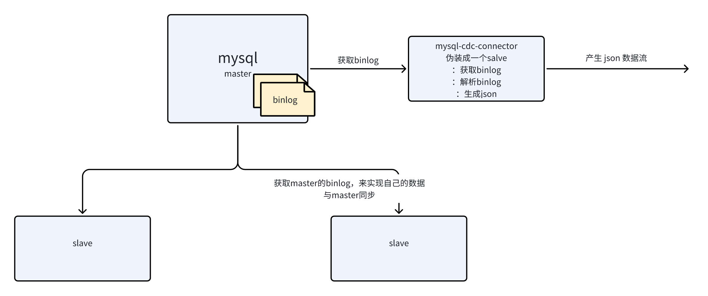


### 3.7.2 mysql开启binlog配置

配置文件：  /etc/my.cnf

```java
[mysqld]
# 开启二进制日志
log-bin=mysql-bin

# 设置服务器ID（每个 MySQL 实例必须有唯一的 server-id）
server-id=1

# (可选) 限制 binlog 文件的大小（默认为1GB）
max_binlog_size=100M

# (可选) 设置 binlog 保留天数，0表示不自动删除
expire_logs_days=7

# (可选) 日志格式，可以是 ROW、STATEMENT 或 MIXED，推荐 ROW
binlog_format=ROW

# (可选) 确保主键自增列的 binlog 顺序一致
binlog_order_commits=1

# (可选) 忽略不需要记录的数据库
binlog-ignore-db=information_schema
binlog-ignore-db=performance_schema

```

重启mysql服务

```java
systemctl restart mysqld
```

检查binlog是否开启成功

```java

mysql> show variables like 'log_bin';
+---------------+-------+
| Variable_name | Value |
+---------------+-------+
| log_bin       | ON    |
+---------------+-------+
1 row in set (0.00 sec)
```


### 3.7.3 添加依赖

```xml
<dependency>
    <groupId>com.ververica</groupId>
    <artifactId>flink-connector-mysql-cdc</artifactId>
    <version>2.3.0</version>
</dependency>
```


### 3.7.4 api使用示例

> ！！！注意，被监控的目标表，要求有主键的定义！！！

```java
package top.doe.flink.demos;

import com.ververica.cdc.connectors.mysql.source.MySqlSource;
import com.ververica.cdc.debezium.JsonDebeziumDeserializationSchema;
import org.apache.flink.api.common.eventtime.WatermarkStrategy;
import org.apache.flink.streaming.api.datastream.DataStreamSource;
import org.apache.flink.streaming.api.environment.StreamExecutionEnvironment;

/**
 * @Author: 深似海
 * @Site: <a href="www.51doit.com">多易教育</a>
 * @QQ: 657270652
 * @Date: 2024/10/11
 * @Desc: 学大数据，上多易教育
 *    mysql cdc  source 示例
 **/
public class Demo9_MySqlCdcSource {

    public static void main(String[] args) throws Exception {

        StreamExecutionEnvironment env = StreamExecutionEnvironment.getExecutionEnvironment();
        env.setParallelism(2);
        // 开启checkpoint
        env.enableCheckpointing(1000);  // 快照周期
        env.getCheckpointConfig().setCheckpointStorage("file:///d:/devworks/doit50_hadoop/ckpt");  // 设置快照的存储路径

        // 创建mysql cdc source 对象
        MySqlSource<String> source = MySqlSource.<String>builder()
                .username("root")
                .password("ABC123.abc123")
                .hostname("doitedu01")
                .port(3306)
                .databaseList("doit50")
                .tableList("doit50.t_person")
                .deserializer(new JsonDebeziumDeserializationSchema())
                .build();

        DataStreamSource<String> stream = env.fromSource(source, WatermarkStrategy.noWatermarks(), "mysql-cdc");

        stream.print();


        env.execute();

    }

}


```


# 4. flink常用算子

## 4.1 map **映射**

> 输入一条，经过变化，输出一条；

```java
public static void main(String[] args) throws Exception {
    Configuration conf = new Configuration();
    conf.setInteger("rest.port", 8888);
    StreamExecutionEnvironment see = StreamExecutionEnvironment.createLocalEnvironmentWithWebUI(conf);

    // source
    DataStreamSource<String> ds = see.socketTextStream("doitedu01", 8899);

    SingleOutputStreamOperator<LogBean> res = ds.map(new MapFunction<String, LogBean>() {
        @Override
        public LogBean map(String value) throws Exception {
            LogBean logBean = null;
            try {
                String[] arr = value.split(",");
                logBean = LogBean.of(Long.parseLong(arr[0]), arr[1], arr[2], Long.parseLong(arr[3]));
            } catch (Exception e) {
                logBean = new LogBean();
            }
            return logBean;
        }
    });
    res.getParallelism();
    res.print() ;
    see.execute("map") ;
}

// SingleOutputStreamOperator<String> ds2 = ds.map(String::toUpperCase);
//  SingleOutputStreamOperator<String> ds3 = ds2.map(String::toLowerCase).setParallelism(16);
```

## 4.2 flatMap 压平映射

Takes one element and produces zero, one, or **more** **elements**. A flatmap function that splits sentences to words:

```java
public static void main(String[] args) throws Exception {
    Configuration conf = new Configuration();
    conf.setInteger("rest.port", 8888);
    StreamExecutionEnvironment see = StreamExecutionEnvironment.createLocalEnvironmentWithWebUI(conf);
    see.setParallelism(1) ; //  设置全局并行度为1
    DataStreamSource<String> lines = see.fromElements("学 大数据 到 多易 教育", "找 行哥", "不吃亏");
    SingleOutputStreamOperator<String> res = lines.flatMap(new FlatMapFunction<String, String>() {
        // 每条数据执行一次这个方法
        @Override
        public void flatMap(String value, Collector<String> out) throws Exception {
            String[] words = value.split("\\s+");
            for (String word : words) {
                out.collect(word);
            }
        }
    });
    res.print() ;

    see.execute() ;

}
```

## 4.3 filter 过滤

针对每个摄入的数据进行条件判断 .符合条件的数据返回

Evaluates a boolean function for each element and retains those for which the function returns true. A filter that filters out zero values:

```java
    public static void main(String[] args) throws Exception {
        Configuration conf = new Configuration();
        conf.setInteger("rest.port", 8888);
        StreamExecutionEnvironment see = StreamExecutionEnvironment.createLocalEnvironmentWithWebUI(conf);
        see.setParallelism(1) ; //  设置全局并行度为1
        DataStreamSource<Integer> ds = see.fromElements(1, 2, 3, 4, 5, 6, 7, 8, 9, 10);
       /* SingleOutputStreamOperator<Integer> res = ds.filter(new FilterFunction<Integer>() {
            @Override
            public boolean filter(Integer value) throws Exception {
                // 处理每条数据  将满足条件的数据返回
                return value > 5 && value%2==0;
            }
        });
       */
        SingleOutputStreamOperator<Integer> res = ds.filter(e -> e > 5 && e % 2 == 0);
        res.print();
        see.execute() ;

    }
```


## 4.4 process 算子

process是一个灵活的算子，它没有任何固定的运算模式；

它把数据交给用户后，一切计算逻辑由用户安排；


> process算子中的ProcessFunction是RichRunction，因此可以利用RichFunction的功能，比如：

> * 调用getRuntimeContext() 来获取 运行时上下文runtimeContext
>
> * 调用timerService() 来获取 flink框架所提供的 “时间服务“
>
> * 拥有生命周期方法： open()  和  close()


**process算子有两种使用场景：**

* **在keyedStream上调用（***算子的函数中拥有key上下文***）：**

```java
keyedStream.process(new KeyedProcessFunction<String, CdcBean, String>() {

    @Override
    public void processElement(CdcBean cdcBean, Context ctx, Collector<String> out) throws Exception {
         // 可以通过ctx获得当前数据所属的 key
         ctx.getCurrentKey()
    }
 }
```


* **在nonKeyedStream上调用**

```java
beanStream.process(new ProcessFunction<CdcBean, String>() {
    @Override
    public void processElement(CdcBean value, ProcessFunction<CdcBean, String>.Context ctx, Collector<String> out) throws Exception {
    
         //     不存在如下的方法
         // ctx.getCurrentKey()
    
    }
});
```


## *附： 普通function 和 RichFunction的比较*

在各类需要传入Function的算子中，基本上都可以接收两种Function：

* 普通Function

* RichFunction


其中，RichFunction会多出**open()  和 close()&#x20;**&#x20;，以&#x53CA;**&#x20;getRuntimeContext()&#x20;**&#x8FD9;几个从AbstractRichFunciton所继承来的方法；

这样，我们可以在自定义的XXRichFunction中，利用或重写这些方法，来实现更多的功能；

比如，在open中，我们可以安排一些初始化逻辑，在close方法中，可以安排一些释放资源的逻辑；

而用getRuntimeContext()，则可以利用返回的runtimeContext来获取状态、注册定时器等；


api使用示例如下：

```java


```


# 5. 简单聚合算子

在KeyedStream类型的流上，可以调用如下简单聚合算子

```java
keyedStream.sum("字段名")

// 取指定字段的最大值，其他字段则使用第一条的值
keyedStream.max("字段名")

// 取指定字段的最大值所在的数据行
keyedStream.maxBy("字段名")


// 取指定字段的最小值，其他字段则使用第一条的值
keyedStream.min("字段名")

// 取指定字段的最小值所在的数据行
keyedStream.minBy("字段名")


// 自定义聚合逻辑
// 要求 输入数据类型、累加器类型 和 输出结果类型，都一致
keyedStream.reduce(ReduceFunction)
```


# 6. 常用 sink 算子

## 5.1 Kafka sink

> 将流数据，写入kafka

```java

// 构造一个kafkaSink对象
KafkaSink<String> sink = KafkaSink.<String>builder()
        .setBootstrapServers("doitedu01:9092,doitedu02:9092,doitedu03:9092")
        .setRecordSerializer(KafkaRecordSerializationSchema.builder()
                .setTopic("res-nb")
                .setValueSerializationSchema(new SimpleStringSchema())
                .build()
        )
        .setDeliveryGuarantee(DeliveryGuarantee.EXACTLY_ONCE)
        .build();


// 输出 sink
resultStream.map(od->JSON.toJSONString(od)).sinkTo(sink);
```


## 6.2 Jdbc sink

> 将流数据，用jdbc的方式，写入外部数据库（如 mysql、oracle、db2、sqlServer 等支持jdbc的数据库）


### 6.1 at-least-once 的jdbcSinkFunction

```java

SinkFunction<String> sink = JdbcSink.<String>sink(
        "insert into user_action_count (user_id, event_id, event_cnt) values (?, ?, ? ) on duplicate key update event_cnt = ? ",
        (statement, json) -> {
            JSONObject jsonObject = JSON.parseObject(json);

            statement.setLong(1, jsonObject.getIntValue("user_id"));
            statement.setString(2, jsonObject.getString("event_id"));
            statement.setLong(3, jsonObject.getLongValue("event_cnt"));
            statement.setLong(4, jsonObject.getLongValue("event_cnt"));
        },
        JdbcExecutionOptions.builder()
                .withBatchSize(1000)
                .withBatchIntervalMs(200)
                .withMaxRetries(5)
                .build(),
        new JdbcConnectionOptions.JdbcConnectionOptionsBuilder()
                .withUrl("jdbc:mysql://doitedu:3306/doit46")
                //.withDriverName("com.mysql.driver.Con")
                .withUsername("root")
                .withPassword("root")
                .build()
);

```


### 6.2 精确一次的jdbcSink：SinkFunction

```java

JdbcSink.<String>exactlyOnceSink(
        "insert into user_action_count (user_id, event_id, event_cnt) values (?, ?, ? ) on duplicate key update event_cnt = ? ",
        (statement, json) -> {
            JSONObject jsonObject = JSON.parseObject(json);

            statement.setLong(1, jsonObject.getIntValue("user_id"));
            statement.setString(2, jsonObject.getString("event_id"));
            statement.setLong(3, jsonObject.getLongValue("event_cnt"));
            statement.setLong(4, jsonObject.getLongValue("event_cnt"));
        },
        JdbcExecutionOptions.builder()
                .withBatchSize(1000)
                .withBatchIntervalMs(200)
                .withMaxRetries(5)
                .build(),
        JdbcExactlyOnceOptions.builder()
                .withTransactionPerConnection(false)
                .build(),
        new SerializableSupplier<XADataSource>() {
            @Override
            public XADataSource get() {
                MysqlXADataSource xaDataSource = new MysqlXADataSource();
                xaDataSource.setUrl("jdbc:mysql://doit01:3306/abc");
                xaDataSource.setUser("root");
                xaDataSource.setPassword("ABC123.abc123");
                return xaDataSource;
            }
        }
);
```

> **实现精确一次的核心要点：两阶段提交的逻辑**
>
> * 上一次checkpoint结束后，初始化和开启一次新的事务；
>
> * 在本次checkpoint周期中不断往目标存储系统输出数据；
>
> * 待checkpoint到达，则在做快照的过程中，预提交(prepare)本次事务（mysql没有这个动作）；
>
> * 等到本次checkpoint全部完成（会收到checkpoint coordinator)时，则提交(commit)本次事务；


# 7. flink状态基本使用

## 7.1 状态概述

在我们开发的计算逻辑中，免不了要在程序中记录一些中间数据；

比如做累加时，需要记住此前已经累加的结果；


而这些中间数据，在此处，就成为状态数据；

这些状态数据，如果直接在程序中用一些内存变量或者内存集合来记录，则job重启后就会丢失；

因此，flink为用户开发了一整套完善的状态管理机制，为用户提供状态读写、状态快照，持久化，一致性等开箱即用的特性；

用户在开发应用时，就可以把上述的中间状态数据，托管到flink的状态管理系统中，即可获得上述这些特性；


## 7.2 keyed state（键控状态）的使用

### 7.2.1 概述

Keyed state必须在具备key上下文的环境中使用（比如，在KeyedStream上调用的算子中使用）

在算子的每一个并行实例中，**每一个数据的key，都绑定了一个独立的状态存储容器**！

在使用状态时（读、写），状态管理器会根据当前的key来**自动切换**目标容器；

> 可以按如下图示来简单理解

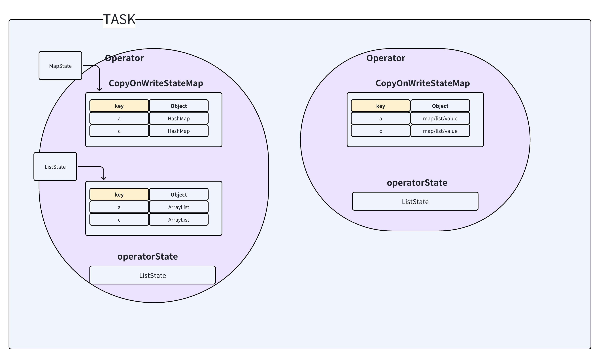

> 你获取一个MapState时，其实你的每一个数据key都对应着一个HashMap
>
> 你获取一个ListState时，其实你的每一个数据key都对应着一个ArrayList


Keyed state有多种类型，提供了多种不同的数据结构，如：

* **ValueState  （存放单个值）**

* **ListState （存放多个值）**

* **MapState （存放kv对）**

* **ReduceState （带有聚合功能）**

* **AggregateState （带有聚合功能）**


### 7.2.2 **api使用示例**

```java


```


## 7.3 operator state（算子状态） 的使用

> 算子状态主要用于  source 算子
>
> 比如，kafka source，用来记录消费位移！

### 7.3.1 概述

在运行时，每一个算子的并行实例，只拥有一个状态实例（状态容器），它不会跟每个key绑定

所以，operator state在使用时**不要求**拥有key上下文；（source 算子最适合用operator state来记录消费位移等信息）


**operator状态提供的数据结构：**

* ListState

* UnionListState


> **UnionListState 和普通 ListState的区别：**

* UnionListState的快照存储数据，在系统重启后，list数据的重分配模式为： 广播模式； 在每个subtask上都拥有一份完整的数据；

* ListState的快照存储数据，系统重启后，list数据的重分配模式为： round-robin 轮询平均分配；


### 7.3.2 **api使用示例**

**Operator state 的获取，不是通过runtimeContext来获取**

而是要让我们的function 实现接口： CheckpointedFunction

```java

package cn.doitedu;

import beans.UserAction;
import com.alibaba.fastjson.JSON;
import org.apache.flink.api.common.functions.MapFunction;
import org.apache.flink.api.common.functions.RichMapFunction;
import org.apache.flink.api.common.state.ListState;
import org.apache.flink.api.common.state.ListStateDescriptor;
import org.apache.flink.api.common.state.ValueState;
import org.apache.flink.api.common.state.ValueStateDescriptor;
import org.apache.flink.configuration.Configuration;
import org.apache.flink.runtime.state.FunctionInitializationContext;
import org.apache.flink.runtime.state.FunctionSnapshotContext;
import org.apache.flink.streaming.api.checkpoint.CheckpointedFunction;
import org.apache.flink.streaming.api.datastream.DataStreamSource;
import org.apache.flink.streaming.api.datastream.SingleOutputStreamOperator;
import org.apache.flink.streaming.api.environment.StreamExecutionEnvironment;

import java.util.ArrayList;
import java.util.List;

public class _15_OperatorState_Demo {

    public static void main(String[] args) throws Exception {

        StreamExecutionEnvironment env = StreamExecutionEnvironment.getExecutionEnvironment();
        env.setParallelism(1);
        // 开启checkpoint
        env.enableCheckpointing(5000);
        // 指定checkpoint生成的状态快照数据文件存放在哪里
        env.getCheckpointConfig().setCheckpointStorage("file:///d:/ckpt");

        DataStreamSource<String> stream = env.socketTextStream("doitedu", 8899);

        SingleOutputStreamOperator<UserAction> beans = stream.map(json -> JSON.parseObject(json, UserAction.class));

        beans.map(new MyMapper()).print();

        env.execute();

    }

}

class MyMapper extends RichMapFunction<UserAction,Integer> implements CheckpointedFunction{

    ListState<UserAction> listState;
    List<UserAction> actionList = new ArrayList<>();


    @Override
    public Integer map(UserAction userAction) throws Exception {
        actionList.add(userAction);
        return actionList.size();
    }

    /**
     * 对 flink底层做状态快照时，会调用本方法
     */
    @Override
    public void snapshotState(FunctionSnapshotContext context) throws Exception {

        System.out.println("snapshotState 调用了");

        // 在系统要做快照之前，我们赶紧把自己内存中存储的数据，添加到状态中
        listState.addAll(actionList);
    }

    /**
     * job重启，flink状态恢复后，会调用本方法
     */
    @Override
    public void initializeState(FunctionInitializationContext context) throws Exception {
        System.out.println("initializeState 调用了  ");

        // 获取一个operator state
        listState = context.getOperatorStateStore().getListState(new ListStateDescriptor<UserAction>("user_actions", UserAction.class));

        // 从状态中将数据恢复到我们自己的arrayList中
        for (UserAction userAction : listState.get()) {
            actionList.add(userAction);
        }

    }
}


```


## 7.4 状态 TTL （time to live)

flink中的状态管理机制，实现了对状态数据的TTL管理功能（即对状态数据的存活时间管理功能）

**TTL是对状态容器中的每条数据生效；**

api使用示例

```java

// 创建一个TTL配置参数对象
StateTtlConfig ttlConfig = new StateTtlConfig
        .Builder(Time.seconds(5))
        .neverReturnExpired()  // 永远不要让用户看见已过期的数据
        //.updateTtlOnReadAndWrite()  // 只要listState中某条数据被读过或写过，就更新它的TTL，从0开始计时
        //.updateTtlOnCreateAndWrite()  // 只要listState中某条数据被创建或写过，就更新它的TTL，从0开始计时
        .cleanupFullSnapshot()  // 在做全量快照的时候，不要把过期数据放入快照中
        //.disableCleanupInBackground() // 禁用task运行过程中的后台自动清除过期数据线程（清除不会彻底，但一般不要禁用）
        //.cleanupInRocksdbCompactFilter(1000) // 如果状态数据使用rocksdb来存储，则当rocksdb做compaction时清理过期状态数据
        .build();

// 创建state定义对象
ListStateDescriptor<String> desc = new ListStateDescriptor<>("seq", String.class);
// 为state定义开启TTL，并传入TT了参数
desc.enableTimeToLive(ttlConfig);


// 利用state描述，获取listState
listState = runtimeContext.getListState(desc);
```


## 7.5 状态后端

**状态后端的基本概念**

所谓状态后端，就是状态数据的存储管理具体实现，包含状态数据的本地读写、快照远端存储功能；

flink的状态后端是可插拔替换的，它对上层屏蔽了底层的差异，因为在更换状态后端时，用户的代码不需要做任何更改；


**可用的状态后端类型（flink-1.13版以后）**

* **`HashMapStateBackend `**  (内存)默认状态数据存储在此

* **`EmbeddedRocksDBStateBackend`**  \[嵌入式数据库]

> *HashMapStateBackend和EmBeddedRocksDBStateBackend所生成的**快照文件也统一了格式**，因而在job重新部署或者版本升级时，可以任意替换statebackend&#x20;*


**&#x20;&#x20;**&#x5982;需使用 rocksdb-backend，需要引入依赖

```xml
<dependency>
    <groupId>org.apache.flink</groupId>
    <artifactId>flink-statebackend-rocksdb</artifactId>
    <version>${flink.version}</version>
</dependency>
```

***

**&#x20; 状态后端的配置代码**

```java
StreamExecutionEnvironment env = StreamExecutionEnvironment.getExecutionEnvironment();
env.setStateBackend(...);
# The backend that will be used to store operator state checkpoints
state.backend: hashmap
# Directory for storing checkpoints
state.checkpoints.dir: hdfs://doitedu:8020/flink/checkpoints
```


### 7.5.1 HashMapStateBackend 状态后端

**HashMapStateBackend：**

* 状态数据是以java对象形式存储在heap内存中；

* 内存空间不够时，也会溢出一部分数据到本地磁盘文件；

* 可以支撑大规模的状态数据；（只不过在状态数据规模超出内存空间时，读写效率就会明显降低）

> hashmapStateBackend存储 keyed state的内存数据结构

使&#x7528;**&#x20;CopyOnWriteStateMap数据结构&#x20;**&#x6765;存储用户的状态数据；

内部的数据组织形式为： `namespace +  key  -> state `

> 注意，此数据结构类，名为Map，实非Map，它其实是一个数组+单向链表的数据结构


> hashmapStateBackend存储 operator State 的内存数据结构

它底层直接用一个**Map集合**来存储用户的状态数据：`状态名称 -> List`


### 7.5.2 EmBeddedRocksDbStateBackend状态后端

* 状态数据是交给rocksdb来管理；(内置)

* Rocksdb中的数据是以序列化的kv字节进行存储；

* Rockdb中的数据，有内存缓存的部分，也有磁盘文件的部分；

* Rockdb的磁盘文件数据读写速度相对还是比较快的，所以在支持超大规模状态数据时，数据的读写效率不会有太大的降低


> **rockdbStateBackend 支持 “增量快照”**
>
> env.setStateBackend(new EmbeddedRocksDBStateBackend(true))  // 此处的true就表示启用 增量快照
>
>
>
> **hashmapStateBackend不支持“增量快照”，只支持“全量快照”**


**注意：上述2种状态后端，在生成checkpoint快照文件时，生成的文件格式是完全一致的；**

**所以，用户的flink程序在更改状态后端后，重启时依然可以加载和恢复此前的快照文件数据；**

#

# 8. 高阶算子

## 8.1 window窗口算子

> 计算每5分钟的订单成交总额

### 8.1.1 窗口分类

windows算子，就是把数据流中的数据划分成一个一个的窗口，然后进行计算；

**flink中窗口有两种大类型：**

* Count Window: 以数据条数来划分窗口；比如每 10 条 划分到一个窗口；

* Time Window：以时间来划分窗口；比如每10分钟划分一个窗口；


**TimeWindow中还有一些子类：**

* **滚动窗口：**&#x76F8;邻两个窗口没有重叠；

> 滚动计数窗口

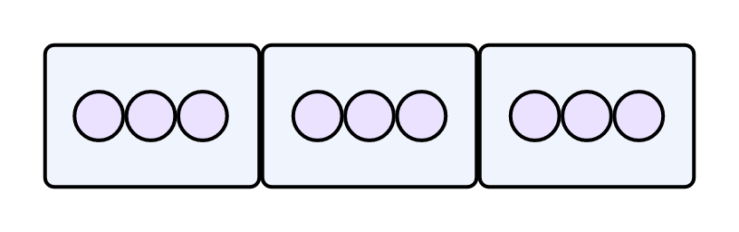


> 比如：每5分钟一个窗口； \[10:00-10:05), \[10:05-10:10)
>
> 滚动时间窗口

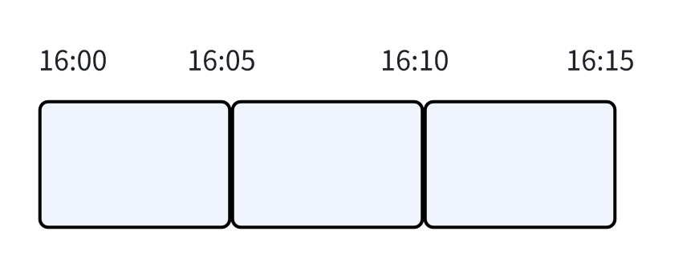


* **滑动窗口：相邻**两个窗口之间有数据重叠；&#x20;

> 比如：窗口长度为5分钟，滑动步长为2分钟；
>
> \[10:00-10:05),  \[10:02,10:07)


* **会话窗口：**&#x9047;到相邻两条数据的 时间间隔 超出会话Gap，则划分窗口


**从另外一个角度来划分：**

* 全局窗口 （全局窗口计算的算子，在运行&#x65F6;**，只会有一个并行度**）

* keyed窗口

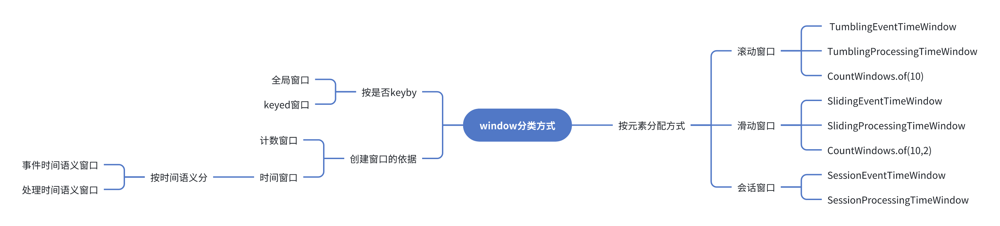


### 8.1.2 窗口api模板

#### 8.1.2.1 keyed窗口

> keyedStream上调用window算子，所开辟的window就是keyed window

```java
stream
       .keyBy(...)               <-  keyed versus non-keyed windows
       .window(...)              <-  required: "assigner"
      [.trigger(...)]            <-  optional: "trigger" (else default trigger)
      [.evictor(...)]            <-  optional: "evictor" (else no evictor)
      [.allowedLateness(...)]    <-  optional: "lateness" (else zero)  允许迟到数据的重新触发
      [.sideOutputLateData(...)] <-  optional: "output tag" (else no side output for late data)
       .reduce/aggregate/apply()/process      <-  required: "function"
      [.getSideOutput(...)]      <-  optional: "output tag"
```

```java

// keyed滚动事件时间窗口
OutputTag<Bean> sideTag = new OutputTag<>("late-data:", TypeInformation.of(Bean.class));

SingleOutputStreamOperator<String> resultStream =
        keyedStream.window(TumblingEventTimeWindows.of(Time.seconds(5)))
                .allowedLateness(Time.seconds(2)) // 允许迟到2秒,迟到的数据会导致窗口重新触发并输出新的结果
                .sideOutputLateData(sideTag)  // 真正迟到的数据，放入一个支流（侧输出流、侧流输出）
                .process(new ProcessWindowFunction<Bean, String, String, TimeWindow>() {
                    @Override
                    public void process(String key, ProcessWindowFunction<Bean, String, String, TimeWindow>.Context context, Iterable<Bean> elements, Collector<String> out) throws Exception {

                        StringBuilder sb = new StringBuilder();
                        sb.append(context.window().getStart())
                                .append("->")
                                .append(context.window().getEnd())
                                .append("_")
                                .append("cur_key:")
                                .append(key)
                                .append("\t");

                        for (Bean element : elements) {
                            sb.append(element.ch);
                        }

                        out.collect(sb.toString());
                    }
                });


// 窗口运算的结果流中，可以获取指定标签的侧流
SideOutputDataStream<Bean> sideOutput = resultStream.getSideOutput(sideTag);
sideOutput.print("late-data:");


resultStream.print("main-out:");
```


#### 8.1.2.2  global 窗口

```java
stream
       .windowAll(...)           <-  required: "assigner"
      [.trigger(...)]            <-  optional: "trigger" (else default trigger)
      [.evictor(...)]            <-  optional: "evictor" (else no evictor)
      [.allowedLateness(...)]    <-  optional: "lateness" (else zero)
      [.sideOutputLateData(...)] <-  optional: "output tag" (else no side output for late data)
       .reduce/aggregate/apply() <-  required: "function"
      [.getSideOutput(...)]      <-  optional: "output tag"
```


### 8.1.3 窗口聚合算子

开窗之后，必须调用如下算子，才能形成计算逻辑任务；


**全量算子**

> 特点：算子的Function中，在窗口触发时，会拿到窗口的全量数据来进行计算

* **process**\[ProcessFunction(context, **elements&#x20;**) ]

* **apply**


**滚动聚合算子(增量）**

> 特点：flink底层会来一条数据就聚合一下，到窗口触发时，输出结果

* aggregate

* reduce

* min、max

* minby、maxby

* sum


## 8.2 多流操作算子

### 8.2.1 connect

`stream1.connect(stream2)`

一次调用，只能是2个流连接；参与连接的流可以是不同的类型，处理后的结果是同一种类型；

后续调用的算子传入的 Function，都是CoFunction，里面都有两个数据处理的方法

> 意义：两个流的数据处理逻辑，放在一起，可以共享信息

比如，CoMapFunction

```java

CoMapFunction {
    状态
    返回统一类型  map1(流1的数据）
    返回统一类型  map2(流2的数据）
}
```

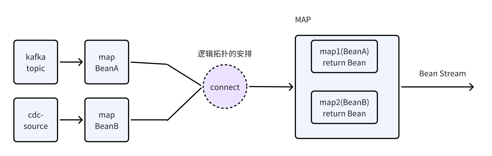

```java
    tpStream.connect(stream2)
            .map(new RichCoMapFunction<Tuple3<String, String, String>, String, Person>() {

                // 如果需要在两个流的数据处理过程中，使用到一些共享信息，则可以在这里定义成员变量，或者用状态
                @Override
                public void open(Configuration parameters) throws Exception {

                }

                @Override
                public Person map1(Tuple3<String, String, String> tp3) throws Exception {
                    return new Person(Integer.parseInt(tp3.f0), tp3.f1, tp3.f2.equals("male") ? 1 : 0);
                }

                @Override
                public Person map2(String json) throws Exception {
                    return JSON.parseObject(json,Person.class);
                }
            });
}
```


### 8.2.2 union

`stream1.union(stream2,.....)`

要求：参与合并的流可以是多个流，必须是相同类型的；

后续调用的算子传入的 Function，就是普通的单流 Function了

```java
比如： MapFunction

返回类型  map(各个输入流的数据）
```

```java
DataStream<Person> unioned = perStream1.union(perStream2);

SingleOutputStreamOperator<String> mapped = unioned.map(new MapFunction<Person, String>() {
    @Override
    public String map(Person value) throws Exception {
        return JSON.toJSONString(value);
    }
});
```


### 8.2.3 窗口join

**api模板**

```java
stream
  .join(otherStream)    
  .where(<KeySelector>)    // 左流的关联key
  .equalTo(<KeySelector>)   // 右流的关联key
  .window(<WindowAssigner>)    // 开窗
  .apply(<JoinFunction>);   // 为能关联的数据生成结果
```


### 8.2.4 窗口cogroup

```java
DataStream<String> resultStream = personStream.coGroup(scoreStream)
        .where(p -> p.id)
        .equalTo(s -> s.uid)
        .window(TumblingProcessingTimeWindows.of(Time.minutes(1)))
        .apply(new CoGroupFunction<Person, Score, String>() {
            // 一次给一组（包含左右两流的数据）来调用
            @Override
            public void coGroup(Iterable<Person> first, Iterable<Score> second, Collector<String> out) throws Exception {
                for (Person person : first) {
                    for (Score score : second) {
                        JSONObject jsonObject = new JSONObject();
                        jsonObject.put("student_id", person.id);
                        jsonObject.put("student_name", person.name);
                        jsonObject.put("student_gender", person.gender);
                        jsonObject.put("student_score", score.score);

                        out.collect(jsonObject.toJSONString());

                    }
                }
            }
        });
```


### 8.2.5 自实现"非窗口"join练习

flink自带的join算子，是约束在一个一个的窗口中关联

而这种窗口关联，每次窗口触发时，才执行关联逻辑；此时，窗口中的数据已经确定，所有输出的结果也是确定；


**需求要点**

但我们自己开发的join逻辑，不限定在窗口中；

而是，不论左、右两表的数据到达时间差有多少，我们都要关联出结果；

这样，我们的结果是动态变化的；

* 比如左表右a，右表没有；我们就输出：             a,null

* 后续，右表的a也来了，我们还得输出正确结果： a, a  ，同时还要向下游传达信息，撤回：  a, null这一条

所以，在这样的join场景中，我们输出的结果应该是一个  ：变更日志流 ： changelog stream


**逻辑设计**


**代码实现**

```java


```


# 9. 其他算子&#x20;

> 分区算子：用于指定上游task的各并行subtask与下游task的subtask之间如何传输数据；


## 9.1 keyBy

DataStream → KeyedStream ；

逻辑上将流划分为不相交的分区(一条记录仅且只分到一个组中)；

具有相同key的所有记录都分配给下游同一个subTask；


## 9.2 其他分区算子

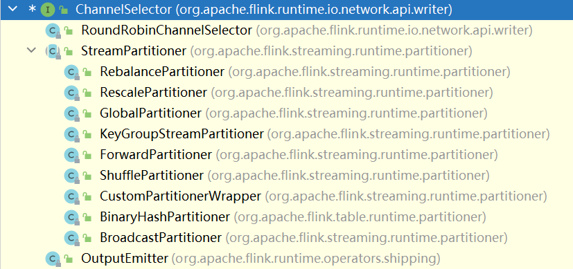


**&#x20; 设置数据传输策略时，不需要显式指定partitioner，而是调用封装好的算子即可**：

| ds.global()                | 上游所有Subtask的数据都发往下游Task的第一个Subtask                                                                  |
| -------------------------- | --------------------------------------------------------------------------------------------------- |
| ds.broadcast().map         | 上游每个sbt的所有数据都会发往下游每个SubTask                                                                         |
| ds.forward()               |  上下游数据是一对一分发                                                                                        |
| ds.shuffle()               |  上游数据随机发送到下游                                                                                        |
| ds.rebalance()             |  轮循发送数据                                                                                             |
| ds.rescale()               |  局部轮询发送数据（如上游0,1->下游0，上游2,3->下游1） 意义所在：flink会把上下游同一个"轮询组"的subTask，尽量部署在同一个taskmanager上运行，这样可以减少网络传输 |
| ds.hash()                  | hashcode 模除下游并行度                                                                                    |
| ds.partitionCustom(自定义分区器) | 自定义数据分发规则                                                                                           |


## 9.3 侧输出流算子

```java
DataStream<Integer> input = ...;

final OutputTag<String> outputTag = new OutputTag<String>("side-output"){};

SingleOutputStreamOperator<Integer> mainDataStream = input
  .process(new ProcessFunction<Integer, Integer>() {

      @Override
      public void processElement(
          Integer value,
          Context ctx,
          Collector<Integer> out) throws Exception {
        // emit data to regular output
        out.collect(value);

        // emit data to side output
        ctx.output(outputTag, "sideout-" + String.valueOf(value));
      }
    });
```


## 9.4 广播算子

```java
public class Demo36_BroadcastDemo {
    public static void main(String[] args) throws Exception {

        StreamExecutionEnvironment env = StreamExecutionEnvironment.getExecutionEnvironment();
        env.setParallelism(2);


        // 构建一个kafkaSource对象
        KafkaSource<String> source = KafkaSource.<String>builder()
                .setStartingOffsets(OffsetsInitializer.committedOffsets(OffsetResetStrategy.LATEST))
                .setGroupId("g001")
                .setClientIdPrefix("flink-c-")
                .setValueOnlyDeserializer(new SimpleStringSchema())
                .setBootstrapServers("doitedu01:9092,doitedu02:9092,doitedu03:9092")
                .setTopics("od")
                .build();


        // 用env使用该source获取流
        DataStreamSource<String> stream = env.fromSource(source, WatermarkStrategy.noWatermarks(), "随便");

        stream.broadcast().map(s->s).setParallelism(3).print().setParallelism(3);

        env.execute();
    }
}
```


# 10. checkpoint及容错机制（重中之重）

## 10.1 checkpoint的一致性快照算法

Flink 的 checkpoint机制是Flink可靠性的基石，它能够保证在某个算子出现异常时，将整个应用流图的状态恢复到故障之前的某一状态，从而保证应用流图状态的一致性。

Flink的checkpoint机制基于“Chandy-Lamport algorithm”算法；

> **算法的要点**
>
> 通过checkpointBarrier，将无界数据流划分成一段一段的有界流；被相同数据段影响过的状态快照，就是一致性快照

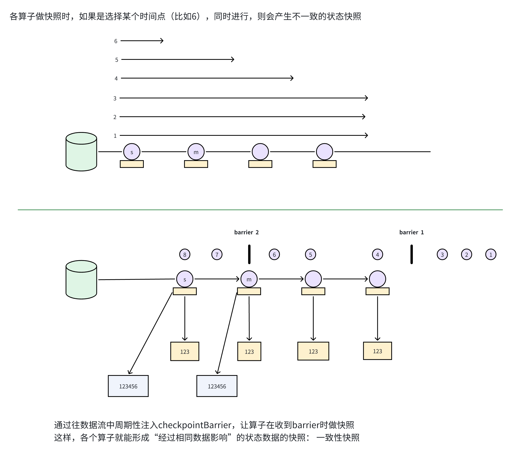

> 解决方案核心点：&#x20;
>
> **同一次checkpoint的快照中，上下游所有算子的状态快照，应该是经历过同一批数据影响；**


## 10.2 flink的checkpoint 工作流程

1. 在应用启动时，Flink的 JobManager 会为该应用创建一个CheckpointCoordinator，该协调器负责checkpoint协调。

2. CheckpointCoordinator 会周期性向每个source task发送一个新的checkpoint请求，当source task 收到请求后后，会**将自己的状态数据进行快照**（比如offset信息），接着生成一个checkpoin&#x74;**&#x20;barrier&#x20;**，广播至所有下游任务。

3. 当下游task收到检查点barrier 时，生成当前状态的快照，并将barrie 传递给下游任务。下游任务同样会进行同样的操作；

4. 最终所有任务的检查点都生成后，JobManager会标记此次检查点任务为完成；

5. 当应用出现故障时，它可以通过这些检查点进行恢复

> 注意：上述的流程，只是整体的大步骤；
>
> 具体细节，还要看checkpoint的模式（下文有讲述）

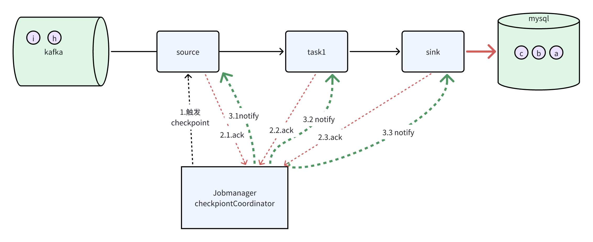


## 10.3 checkpoint 模式

### 10.3.1 **Exactly Once （精确一次处理）**

#### 10.3.1.1 **对齐模式 aligned checkpoint**

* 一个task对接上游多个并行度，就会从多个来源收到barrier

* 某一个channel先到达一个barrier，则这个channel会先阻塞（不处理了），对收到的数据进行缓存；

* 直到所有channel的barrier都到了，再做快照；（快照中的状态数据一定只收到了barrier之前的数据所影响）

**弊端：** 有比较严重数据处理的**阻塞**； 如果某一个channel比较慢，就会导致阻塞时间长；整个数据链条的数据处理以及checkpoint的流转都受到严重的阻塞影响；如果在数据倾斜严重时，对齐模式的负面效果更明显，很容易出现checkpoint超时！；

**优点：**&#x903B;辑清晰，严格实现了**一致性快照算法**的思想（ck3的快照，一定是只受过ck3之前的数据所影响）；


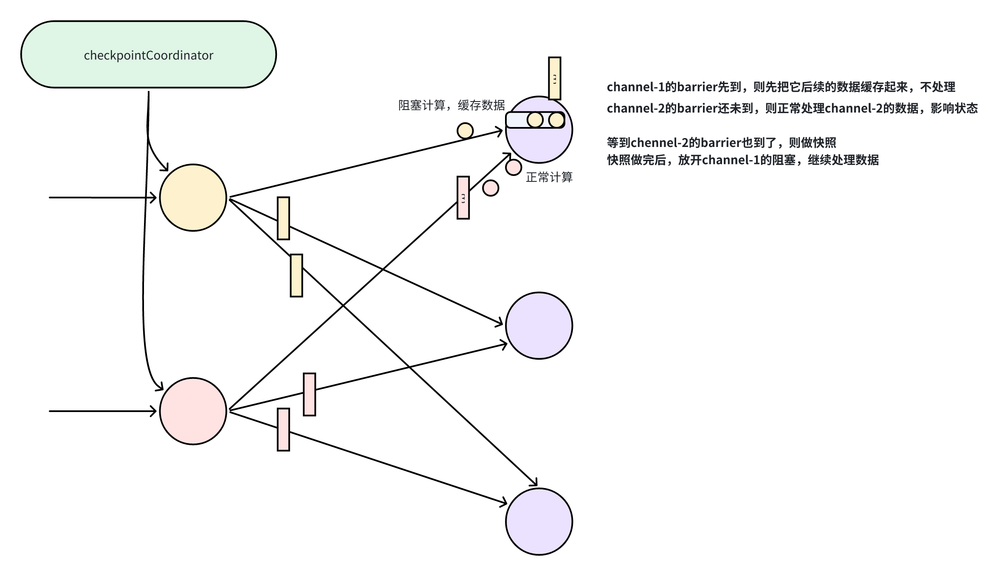


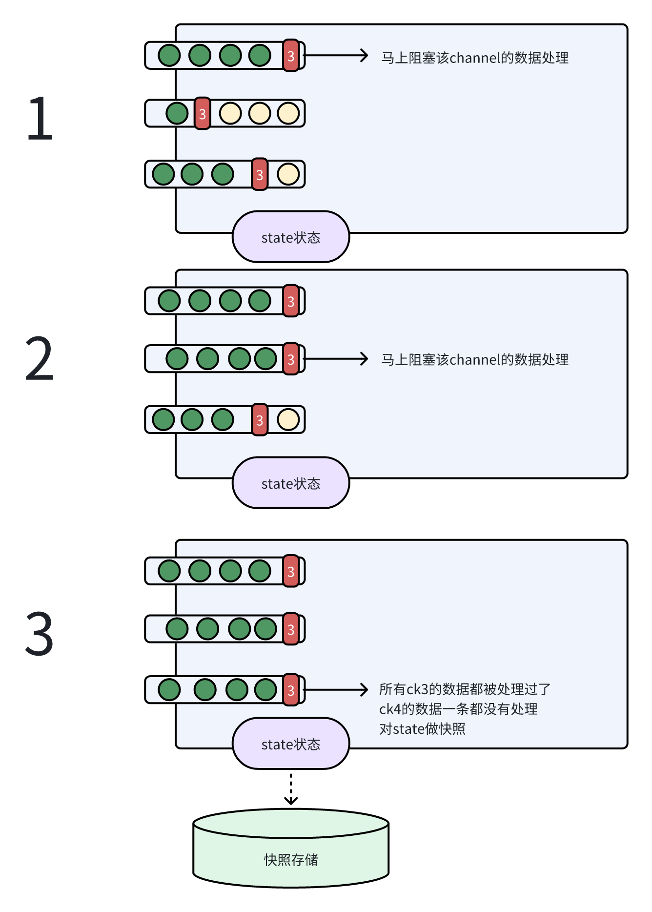


&#x20;&#x20;

#### 10.3.1.2 **非对齐模式 unaligned checkpoint**

* 一个task对接上游多个并行度，就会从多个来源收到barrier

* **\[同步阶段]&#x20;**&#x67D0;一个channel先到达一个barrier，短暂阻塞不再接收数据，在阻塞的这一瞬间，标记输入和输出缓存中数据，并对state此刻的数据进行标记；

* 把barrier插队到输出缓存队列的队首，以让barrier快速及时往下游传递；

* 马上放开阻塞，继续接收数据正常处理

* **\[异步阶段]&#x20;**&#x7528;一个异步任务，把标记好的输入、输出缓存的数据以及state的数据，生成快照持久化存储


**核心点**：**快照数据中不光有state的数据，还有输入、输出缓存中的数据；**

> 非对齐模式下的checkpoint流程中也有一点阻塞（同步标记阶段会阻塞一瞬间，标记完成迅速放开阻塞）
>
> 输出快照数据到HDFS的过程是异步进行；


**优点：**&#x963B;塞时长非常短暂（只是一个数据标记的过程）；barrier的传递非常及时；

**弊端：**&#x5FEB;照的数据量比较大，**不仅包含state，还包含输入、输出缓存的数据**；重启后恢复的过程会相对拉长；

这是flink的新特性，成熟度略差，可能存在一些尚未发现的bug；

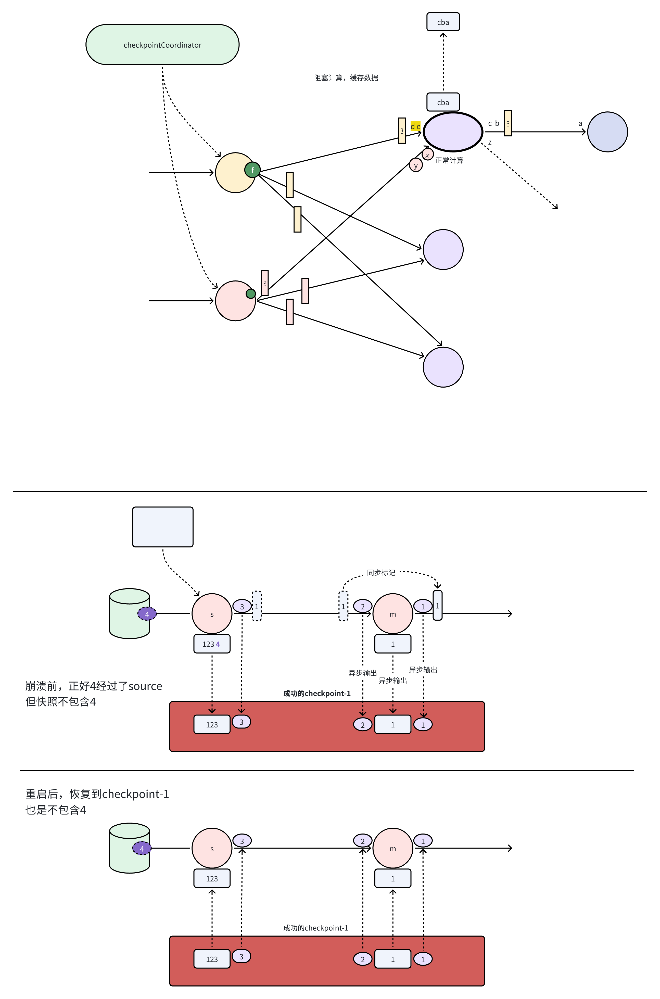

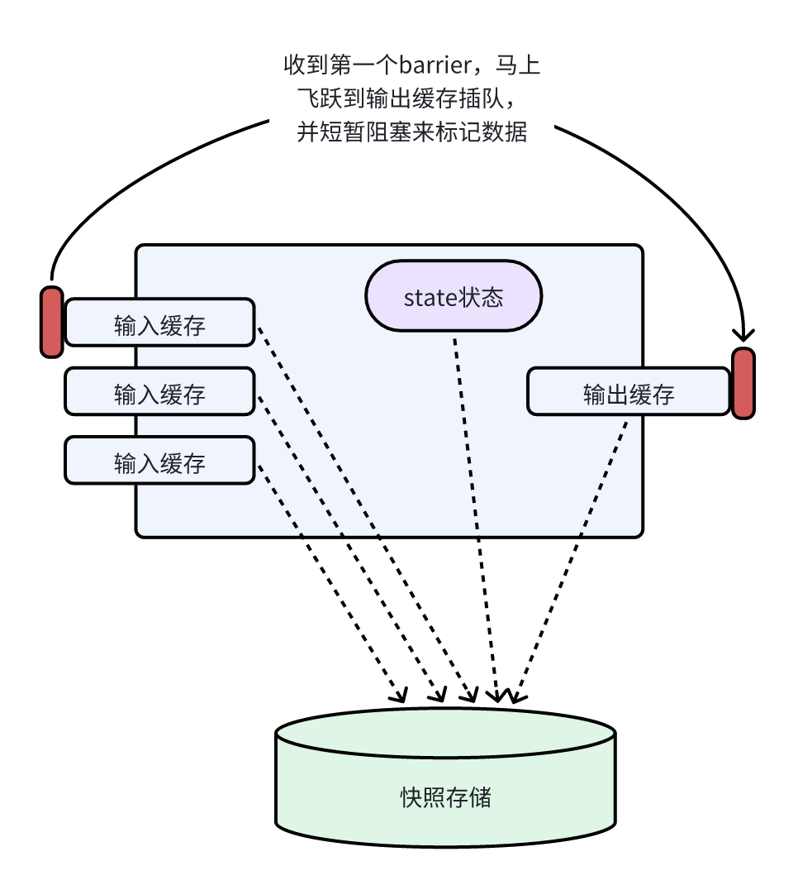


### 10.3.2 **At Least Once （最少一次，有可能重复处理）**

* 一个task对接上游多个并行度，就会从多个来源收到barrier

* 某一个channel先到达一个barrier，不管不顾继续处理数据，只是对barrier到达计数+1；

* 当最后一个barrier到达时，对state生成快照；\[这个快照里面，有ck3的所有数据的影响，还可能包含了一部分ck4的数据影响]

* 在故障恢复后，可能存在一些数据的重复计算；（因为某算子的快照有**ck3**和**少量ck4**数据的影响，而source那边的偏移量肯定恢复到了ck3的位置，这样ck4的数据还会重发）

**优点：**&#x5FEB;，轻；

**弊端：计算结果的准确性无法保证 (有可能存在数据的重复处理）**

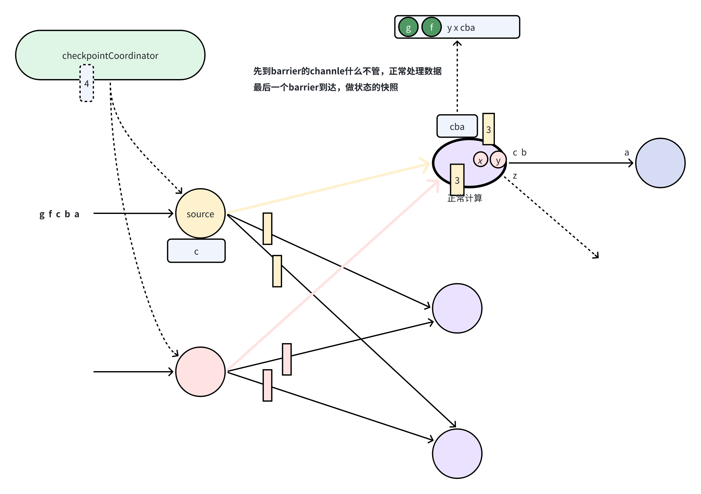


## 10.4 端到端 精确一次exactly once

> **数据传递语义： 端到端的exactly once**

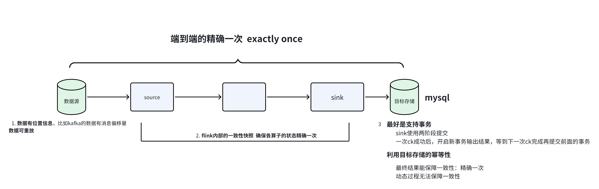

> 思考，如下几种组合，是否能实现端到端exactly once
>
>
>
> 组合1（可以）：
>
> * 数据源：mysql-binlog \[ source: cdc-source]
>
> * 目标存储： mysql表  \[ sink : jdbc-exactly-once-sink ]
>
>
>
> 组合2（可以）：
>
> * 数据源：mysql-binlog \[ source: cdc-source]
>
> * 目标存储： kafka topic  \[ sink : kafka-sink ]
>
>
>
> 组合3（可以）：
>
> * 数据源：kafka \[ source: kafka-source ]
>
> * 目标存储： kafka topic  \[ sink : kafka-sink ]
>
>
>
> 组合4（可以）：
>
> * 数据源：kafka \[ source: kafka-source ]
>
> * 目标存储：redis  \[ sink : redis-sink ]


## 10.5 failover restart 失败自动重启恢复策略

### 10.5.1 失败重启策略

flink在job失败时，有自动重启机制: pipeline中的某个task失败，会导致整个pipeline自动重启；


**自动重启有如下可选策略：**

* **固定延时**重启策略   （默认）

* **故障率**重启策略&#x20;

* **指数惩罚**重启策略

* 不重启策略-

```java

// 设置失败重启策略
env.setRestartStrategy(RestartStrategies.noRestart());  // 失败后不自动重启

// 固定延时重启策略： 参数1：最多重启次数   参数2：重启的延迟时长
// 这是默认的重启策略
env.setRestartStrategy(RestartStrategies.fixedDelayRestart(3,2000));

// 指数惩罚重启策略：参数1：初始惩罚延迟时长， 参数2：最大惩罚延迟时长， 参数3：惩罚延迟时长的倍数  参数4：平稳运行重置重发的时长阈值  参数5：惩罚时长的微调比例
env.setRestartStrategy(RestartStrategies.exponentialDelayRestart(Time.seconds(1),Time.seconds(10),2,Time.minutes(10),0.01));

// 故障率重启策略： 在指定观察时间窗口内的故障率不能超过阈值；如果超过则让job直接失败
// 参数1:指定时长内的最大故障次数
// 参数2:上面的“指定时长”
// 参数3: 重启的延迟时长
env.setRestartStrategy(RestartStrategies.failureRateRestart(3,Time.minutes(10),Time.seconds(1)));

// 回退到集群配置文件中所配置的重启策略
env.setRestartStrategy(RestartStrategies.fallBackRestart());
```


### 10.5.2 快照恢复

* 如果job是故障自动重启的，则会自动加载最近一次成功的checkpoint快照


* 如果是手动重启，则需要**指定**需要恢复的checkpoint快照数据或savepoint快照数据

```java
Configuration configuration = new Configuration();
// 指定savepoint目录，会让系统在启动时就去加载快照来恢复状态
configuration.setString("execution.savepoint.path","file:///D:/ckpt/306f4816b3782db939e2a1298f2f37f5/chk-28");
StreamExecutionEnvironment env = StreamExecutionEnvironment.getExecutionEnvironment(configuration);
env.setParallelism(1);
```


## 10.6 关于savepoint

* savepoint叫做：保存点

* checkpoint叫做：快照点


区别：

* checkpoint是系统自动触发的：jobmanager端的模块checkpointCoordinator周期性自动触发

* savepoint是用户用命令手动触发的；


在系统恢复的时候

* 自动重启恢复，则会自动选择最近一次成功的checkpoint

* 手动重启恢复，可以选择某次保留的checkpoint快照，也可以选择某次手动触发的savepoint快照


# 11. flink中的时间语义

**flink中的时间语义有3种：**

* **处理时间语义**： processing time  （参考的是task在处理这条数据时的机器时间）

* **事件时间语义**： event time  （参考的时间是数据中的业务时间）

* ~~注入时间语义： injection time  （代表数据注入系统时的时间，已不再使用）~~


## 11.1 事件时间语义概述

想象一个场景，我们要用时间窗口的方式去统计订单金额：

* \[15:00,  15:05)  的订单金额

* \[15:05,  15:10)  的订单金额

假如有一个订单，用户**是在15:04分创建**的，但是到达我们的计算算子的时间是15:06分

那，我们很有可能会把这个订单划分到 窗口  \[15:05,  15:10)  去，而这似乎有一些不妥当；


为了应对这种：“按照数据中的时间来进行窗口划分”等问题，flink中设计了一种额外的时间参考、推进机制；

* **事件时间语义 Event Time**

**Event Time语义中，时间的推进完全由流入flink系统的数据来驱动 ,**

数据中的**事件时间**推进到哪，flink就认为自己的时间推进到了哪；


> 与Event Time语义对应的是： **Processing Time 语义**
>
> 只不过Processing Time语义很简单，就是各算子直接取自己机器上的时间作为时间依据即可


## 11.2 **事件时间语义中的乱序问题**

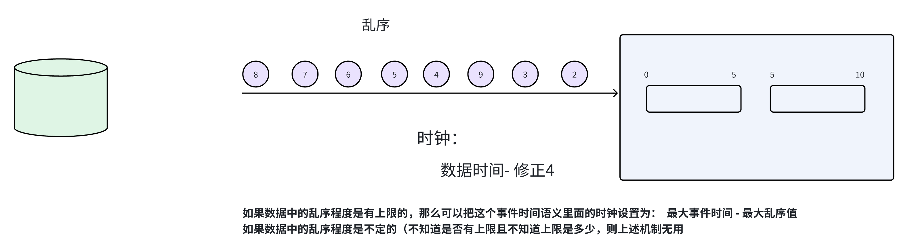


## 11.3 **事件时间语义中的时间推进(watermark)**

* 时间（watermark）由专门的算子：TimestampsAndWatermarksOperator 生成；

* 该算子不断地从输入数据流中抽取数据的事件时间，来更新watermark，并广播给下游

* 而下游收到多个上游channel数据流中的watermark后，不断更新自己记录的各channel的watermark最大值，并从中选择最小值作为自己的当前时间，并广播给下游

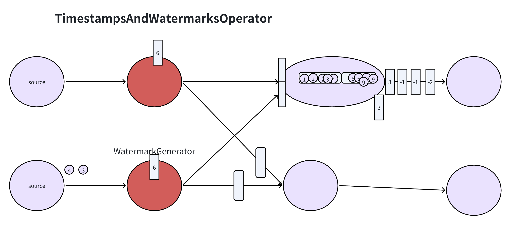


> TimestampsAndWatermarksOperator 算子的工作原理

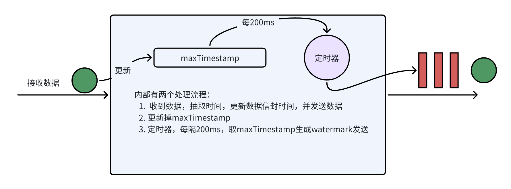

如上图所示： **watermark算子内部，有3个主要流程**

1. 接收数据，抽取数据中用户的时间戳，更新数据StreamRecord的timestamp，并把数据发送出去；

2. 利用抽取到的时间戳，更新自身所持有的一个变量：maxTimeStamp；

3. 内部有一个定时器调度，会每隔200ms，获取maxTimeStamp值，生成最新的watermark广播给下游；


## 10.4 watermark的合并及idle机制

* 一个source subTask中的多个reader，会做watermark合并（取最小的）

* 一个下游算子的subtask，会接收到上游算子每个subTask的watermark，这个下游subTask也会进行watermark合并（取最小的）


> 如果一个watermark来源（比如source内的一个reader，或一个下游算子的多个上游channel），出现了idle状态（即很长时间没有数据来推进watermark），则会导致后续的合并watermark逻辑出现无法推进的情况
>
>
>
> 可以通过在watermarkStrategy策略中，配置idleness timeout，让watermark合并机制忽略idle来源

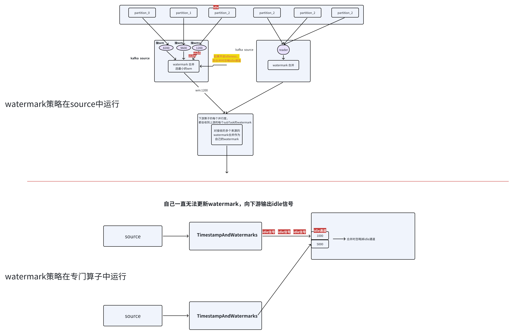


## 11.4 时间相关api

### 11.4.1 利用TimestampAndWatermarksOperator生成watermark

```java
// 安插一个生成watermark的算子
SingleOutputStreamOperator<Od> wmStream =
        odStream.assignTimestampsAndWatermarks(
                WatermarkStrategy
                        .<Od>forBoundedOutOfOrderness(Duration.ofSeconds(2))    // 选择策略：处理有界乱序的策略： 事件时间-乱序时长
                        .withTimestampAssigner(new SerializableTimestampAssigner<Od>() {  // 抽取数据中的时间的逻辑
                            @Override
                            public long extractTimestamp(Od od, long recordTimestamp) {
                                return od.createTime;
                            }
                        })
        );
```


### 11.4.2 直接在source上生成watermark

```java
WatermarkStrategy<String> strategy = WatermarkStrategy.<String>forBoundedOutOfOrderness(Duration.ofMillis(0))
        .withTimestampAssigner(new SerializableTimestampAssigner<String>() {
            @Override
            public long extractTimestamp(String element, long recordTimestamp) {
                return JSON.parseObject(element).getLongValue("timestamp");
            }
        });

DataStreamSource<String> stream = env.fromSource(source, strategy, "ss");
```


### 11.4.3 配置idle参数

```java
WatermarkStrategy<String> strategy =
        WatermarkStrategy.<String>forBoundedOutOfOrderness(Duration.ofMillis(0))
                .withTimestampAssigner(new SerializableTimestampAssigner<String>() {
                    @Override
                    public long extractTimestamp(String element, long recordTimestamp) {
                        return JSON.parseObject(element).getLongValue("timestamp");
                    }
                })
                // idle策略：如果抽取器在指定时间内一直抽不到时间戳（就是没数据进来），则往后面发idle信号
                .withIdleness(Duration.ofMillis(5000));
```


### 11.4.4 定时器使用

需求举例： 一个用户下单后，15分钟内如果没有支付，给他发送一个催支付信息

> 定时器是跟key绑定的
>
> 每个key只能拥有一个相同时刻的定时器，多次注册同一个时间点的定时器，等价于不断覆盖注册

```java
package top.doe.flink.demos;

import com.alibaba.fastjson.JSON;
import lombok.AllArgsConstructor;
import lombok.Data;
import lombok.NoArgsConstructor;
import org.apache.flink.api.common.eventtime.SerializableTimestampAssigner;
import org.apache.flink.api.common.eventtime.WatermarkStrategy;
import org.apache.flink.api.common.state.ValueState;
import org.apache.flink.api.common.state.ValueStateDescriptor;
import org.apache.flink.configuration.Configuration;
import org.apache.flink.streaming.api.datastream.DataStreamSource;
import org.apache.flink.streaming.api.datastream.KeyedStream;
import org.apache.flink.streaming.api.datastream.SingleOutputStreamOperator;
import org.apache.flink.streaming.api.environment.StreamExecutionEnvironment;
import org.apache.flink.streaming.api.functions.KeyedProcessFunction;
import org.apache.flink.util.Collector;

import java.io.Serializable;
import java.time.Duration;
import java.util.HashMap;
import java.util.Timer;

/**
 * @Author: 深似海
 * @Site: <a href="www.51doit.com">多易教育</a>
 * @QQ: 657270652
 * @Date: 2024/10/16
 * @Desc: 学大数据，上多易教育
 *  下单后，15分没支付，则发送催支付信息
 **/
public class Demo22_Flink_TimerDemo {

    public static void main(String[] args) throws Exception {

        StreamExecutionEnvironment env = StreamExecutionEnvironment.getExecutionEnvironment();
        env.setParallelism(1);

        env.enableCheckpointing(5000);
        env.getCheckpointConfig().setCheckpointStorage("file:///d:/ckpt");


        // {"uid":3,"event_type":"submit_order","timestamp":1000,"properties":{"oid":1}}
        // {"uid":3,"event_type":"pay_order","timestamp":2000,"properties":{"oid":1}}
        // {"uid":3,"event_type":"add_cart","timestamp":3000,"properties":{"item_id":3,"num":2}}
        // {"uid":3,"event_type":"search","timestamp":4000,"properties":{"keyword":"咖啡"}}
        DataStreamSource<String> stream = env.socketTextStream("doitedu01", 9999);
        SingleOutputStreamOperator<Event> eventStream = stream.map(s -> JSON.parseObject(s, Event.class));


        // 生成事件时间watermark
        SingleOutputStreamOperator<Event> wmStream = eventStream.assignTimestampsAndWatermarks(
                WatermarkStrategy.<Event>forBoundedOutOfOrderness(Duration.ZERO)
                        .withTimestampAssigner(new SerializableTimestampAssigner<Event>() {
                            @Override
                            public long extractTimestamp(Event element, long recordTimestamp) {
                                return element.timestamp;
                            }
                        })
        );

        // 过滤，只留下订单相关事件： submit_order,  pay_order
        SingleOutputStreamOperator<Event> filtered = wmStream.filter(e -> e.event_type.equals("submit_order") || e.event_type.equals("pay_order"));


        // keyBy : 相同订单号的数据，要发到的相同的task并行度
        KeyedStream<Event, Integer> keyedStream = filtered.keyBy(e -> (int) e.properties.get("oid"));


        // 逻辑处理:
        SingleOutputStreamOperator<String> resultStream = keyedStream.process(new KeyedProcessFunction<Integer, Event, String>() {
            ValueState<Long> timerState;

            @Override
            public void open(Configuration parameters) throws Exception {

                timerState = getRuntimeContext().getState(new ValueStateDescriptor<Long>("timer_state", Long.class));
            }

            @Override
            public void processElement(Event event, KeyedProcessFunction<Integer, Event, String>.Context ctx, Collector<String> out) throws Exception {

                if (event.event_type.equals("submit_order")) {
                    // 注册定时器 : 触发时间 =  此刻+15分
                    long timerTime = System.currentTimeMillis() + 1 * 30 * 1000;
                    ctx.timerService().registerProcessingTimeTimer(timerTime);

                    // 并且把定时器的唯一标识：定时时间，放入状态存储
                    timerState.update(timerTime);

                } else {
                    // 判断，是否要取消之前注册的定时器
                    if (timerState.value() != null && System.currentTimeMillis() - timerState.value() < 0) {
                        ctx.timerService().deleteProcessingTimeTimer(timerState.value());
                    }
                }
            }


            // 定时器触发时，系统回调该方法
            @Override
            public void onTimer(long timestamp, KeyedProcessFunction<Integer, Event, String>.OnTimerContext ctx, Collector<String> out) throws Exception {

                Integer oid = ctx.getCurrentKey();
                out.collect("订单id:" + oid + ",请速支付");
            }
        });

        resultStream.print();


        env.execute();


    }


    @Data
    @NoArgsConstructor
    @AllArgsConstructor
    public static  class Event implements Serializable{
        private int uid;
        private String event_type;
        private long timestamp;
        private HashMap<String,Object> properties;
    }

}
```


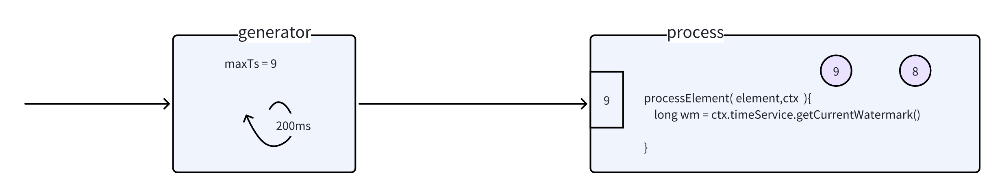


# 12. flink 的分布式运行部署

* 一个flink程序（客户端程序），可以提交多个作业（job）

```java
env.fromSource(s1).map().filter().keyBy().process().sinkTo();
env.execute();  // job -1

env.fromSource(s2).flatMap().filter().window().process().sinkTo();
env.execute(); // job -2

```

* 每一个job中有一个或多个pipeline

```java
env.fromSource(s1).map().filter().keyBy().process().sinkTo();   // Pipeline - 1 
env.fromSource(s2).flatMap().filter().window().process().sinkTo();  // pipeline - 2
env.execute();
```


* 一个pipeline中，有多个task ； 每个task的每一个并行实例称之为一个 subTask；

* 一个task包含 一个  或  多个算子（算子链）


## 11.1 分布式运行时架构

用户编程时，用api算子所组成的**计算链条(pipeline)**，会形成运行时的flink job

job中的task，需要在flink集群中运行；


flink 集群，主要由 jobmanager（进程），taskmanager（进程）组成；


**jobmanager上，有如下主要功能模块：**

* **webMonitor&#x20;**&#x20;一个web服务器，用于对外提供http访问接口

* **dispatcher：&#x20;**&#x8D1F;责处理submitJob、listJob、cancelJob等相关请求；

* **resource manager** 负责一个或多个job分布式集群的槽位资源调度（如申请资源，分配资源等）；


* **job master &#x20;**&#x4E3B;要负责job内部的管理协调（一个job对应一个jobMaster）；

  * **scheduler&#x20;**&#x4E3B;要负责把JobGraph转成ExecutionGraph ，然后开始task的调度（向resourcemanager申请槽位，槽位分配完成后，将task的subTask发送到目标TaskManager的槽位上执行）

  * **checkpointCoordinator ：&#x20;**&#x8D1F;责checkpoint触发及协调


**taskmanager上，主要有如下主要模块：**

* slot槽位管理器（用于管理taskmanager上的运算资源：slot槽位）

* TaskExecutor（用于执行task并行实例-subTask）

  * subTask在taskExecutor中以线程的形式来执行

> task对应着pipieline中的一个或多个算子

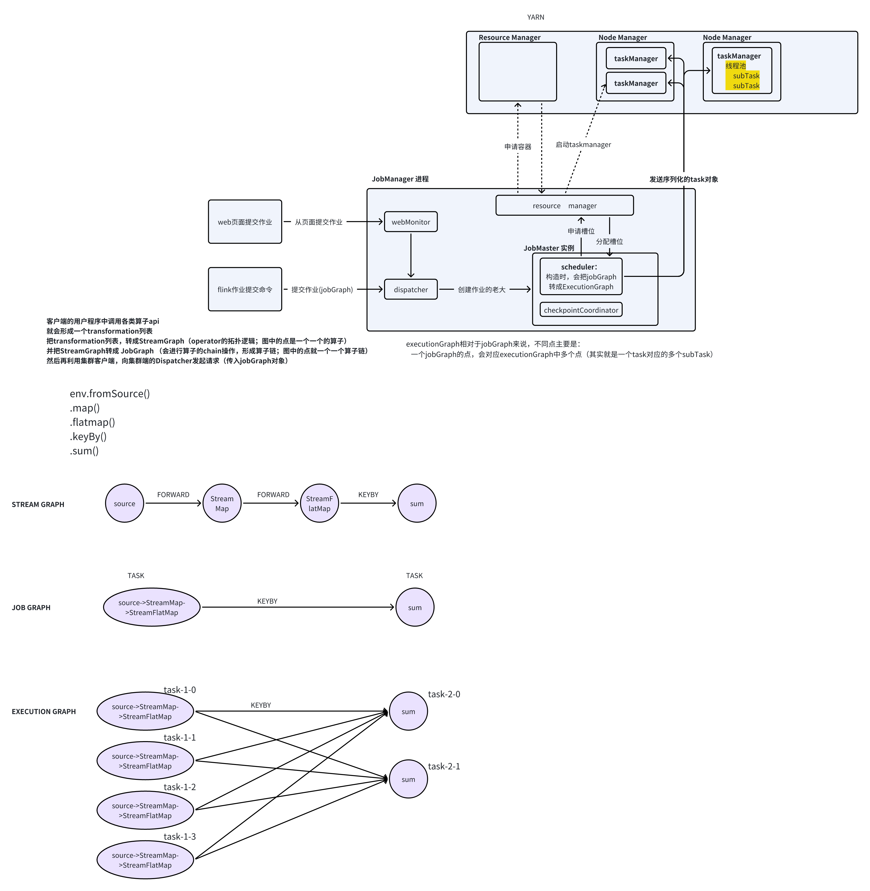

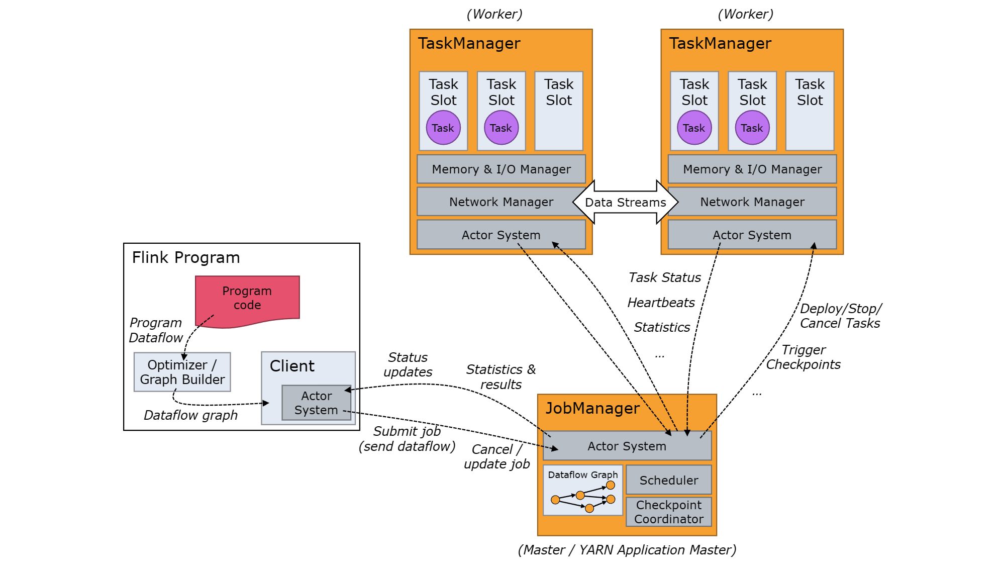

官方参考说明：&#x20;


## 11.2 算子链和并行度和槽位共享组

### 11.2.3 核心概念

用户编程时所调用的api算子，并不一定直接对应到运行时的task（或subTask）

为了优化运行效率，flink可以将多个算子组装成算子链，对应一个task来运行

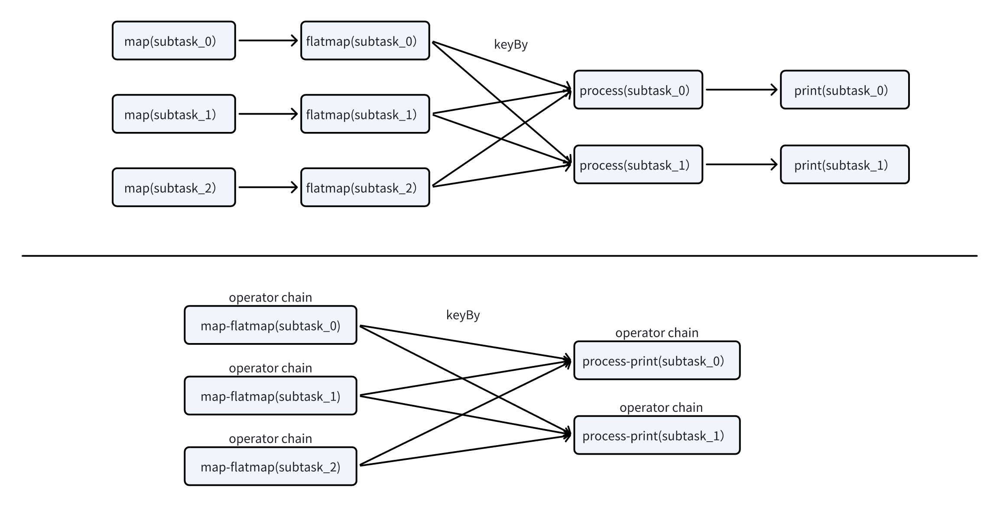

这主要有以下原因：减少数据网络传输 / 减少序列化反序列化过程


> 前后**算子，能否chain在一起，放在一个Task中，取决于如下3个条件：**
>
> 3个条件都满足，才能合并为一个算子链（就是一个task）；否则不能合并成一个task；

### 11.2.4 相关api

```java
map().disableChaining()
# map这个算子既不能跟上游算子chain，也不能跟下游算子chain

map().startNewChain()
# 从这个map算子开始，开启一个新链；意味着它跟上游肯定会断开


```


### 11.2.5 关于槽位共享组

* 不同task，它们的并行实例可以共享槽位运行；

* 同一个task的不同并行实例，一定不能共享槽位；


> 一个pipeline所占用的槽位数结论
>
> 各槽位共享组中的，task最大并行度，之和


**案例1**

```java
env.setParallelism(2);  // 默认并行度是 2 

map.slotSharingGroup("g1")
.filter.slotSharingGroup("g1")
.flatmap.slotSharingGroup("g2")
.filter.slotSharingGroup("g1")
.print.slotSharingGroup("g1")
```


问1： 算子链会如何划分？ &#x20;

* map\_1 和  filter\_1  会chain在一起，  形成 TASK\_A ，槽位共享组 g1

* flatmap是一个单独的chain，  形成 TASK\_B，槽位共享组 g2

* filter 和 print 会chain在一起，  形成 TASK\_C  ，槽位共享组 g1


也就是说，上面 流水线，一共划分了3个task


问2：假如每个task的并行度都是2，而taskmanager上有8个槽位，这些task的所有并行实例在槽位中如何部署

槽位1： TASK\_A\_0  ,  TASK\_C\_0

槽位2： TASK\_A\_1 ,  TASK\_C\_1

槽位3： TASK\_B\_0

槽位4： TASK\_B\_1

……


**案例2**

```java
map.setParallelism(3).disableChain().slotSharingGroup("g1")   // TASK -A
.map.setParallelism(3).slotSharingGroup("g1")                   // B
.filter.setParallelism(2).disableChain().slotSharingGroup("g2")  // C
.flatmap.setParallelism(2).slotSharingGroup("g2")               // D
.filter.setParallelism(2).disableChain().slotSharingGroup("g1")    // E
```


问1： 算子链会如何划分？ &#x20;

* 每个算子都是一个独立的task，共有5个task


问2：taskmanager上有8个槽位，这些task的所有并行实例在槽位中如何部署

槽位1：A-0  B-0   E-0

槽位2：A-1  B-1   E-1

槽位3：A-2  B-2

槽位4：C-0  D-0

槽位5：C-1  D-1


**案例3**

```java
map.setParallelism(3).slotSharingGroup("g1")
.filter.setParallelism(3).slotSharingGroup("g1")
.flatmap.disableChain().setParallelism(3).slotSharingGroup("g2")
.filter.setParallelism(2).slotSharingGroup("g2")
```

问1： 算子链会如何划分？ 形成哪几个task

* map和第1个filter，会chain，形成一个 TASK\_A ，槽位共享组 g1 ,并行度3

* flatmap单独是一个 TASK\_B  ，槽位共享组 g2 ,并行度3

* 第2个filter单独是一个 TASK\_C ，槽位共享组 g2 ,并行度2


问2：假如taskmanager上有8个槽位，这些task的所有并行实例在槽位中如何部署

槽位1：  TASK\_A\_0 ，

槽位2：  TASK\_A\_1 ，

槽位3：  TASK\_A\_2 ，

槽位4：  TASK\_B\_0 ， TASK\_C\_0&#x20;

槽位5：  TASK\_B\_1 ， TASK\_C\_1&#x20;

槽位6：  TASK\_B\_2 ，&#x20;


> **结论：**

**同一个槽位共享组中的task实例所占的总槽位数，取决于组中最大的算子并行度**

槽位共享组，加上算子链，这两个机制，主要的目的是：&#x20;

1. 提高资源的利用率  &#x20;

2. 让用户可以灵活安排资源分配 （比如可让一些运算负载小的task共享槽位，让运算负载大的task单独运行）


## 11.3 StandAlone -Session 集群

本质上就是一个native方式的**session-mode**

session集群的特点：多个job可以共享一个集群；而且集群中的job是可以在运行时反复提交、取消、停止等；

**session集群适用的场景**：大量的运行时长不太长的规模小的job


### 11.3.1 Standalone 集群部署、启动&#x20;

* 上传解压、修改配置

\[root@doitedu01 conf]# vi masters&#x20;

```java
doitedu01:8081
```

\[root@doitedu01 conf]# vi workers&#x20;

```java
doitedu01
doitedu02
doitedu03
```


\[root@doitedu01 conf]# vi flink-conf.yaml

```yaml
# jobmanager地址
jobmanager.rpc.address: doitedu01
jobmanager.rpc.port: 6123
jobmanager.bind-host: 0.0.0.0
# jobmananger内存
jobmanager.memory.process.size: 1600m

# taskmananger地址
taskmanager.bind-host: 0.0.0.0
taskmanager.host: doitedu01    #每台taskmanager要修改成自己的主机名
# taskmananger内存
taskmanager.memory.process.size: 1728m
# taskmananger槽位数
taskmanager.numberOfTaskSlots: 4

# job默认并行度
parallelism.default: 4

# job默认的checkpoint和savepoint路径
state.checkpoints.dir: hdfs://doitedu:8020/ckpt
state.savepoints.dir: hdfs://doitedu:8020/svpt

# jobmananger提供的web控制台的地址和端口
rest.port: 8081
rest.address: doitedu01  # 与jobmanager一致
rest.bind-address: 0.0.0.0

# history服务器相关配置（fs.dir路径需要提前创建好）
jobmanager.archive.fs.dir: hdfs://doitedu01:8020/completed-jobs/
historyserver.web.address: doitedu01
historyserver.web.port: 8082
historyserver.archive.fs.dir: hdfs://doitedu01:8020/completed-jobs/
```

* 分发安装包到其他机器，用 scp

```java
scp -r ./flink-1.16.2 doitedu02:$PWD
scp -r ./flink-1.16.2 doitedu03:$PWD

记得每台机器，分别修改flink-conf.yaml中的  taskmanager的 host名
```


* 配置系统环境变量 &#x20;

```java
vi  /etc/profile

export  FLINK_HOME=/opt/apps/flink-1.16.2
export  HADOOP_CONF_DIR=$HADOOP_HOME/etc/hadoop
export  PATH=$PATH:$FLINKE_HOME/bin
export  HADOOP_CLASSPATH=`hadoop classpath`   # 此处 `不是单引号；是esc下面那个符号"反引号”，“飘”
```

修改完成后，执行如下命令让环境变量生效

```shell
source  /etc/profile
```

* 启动standalone集群

```shell
在jobmanager所在的机器的flink安装目录下
bin/start-cluster.sh 
```

* 访问jobmanangerweb控制台 &#x20;

[http://doitedu01:8081](http://doitedu01.com)

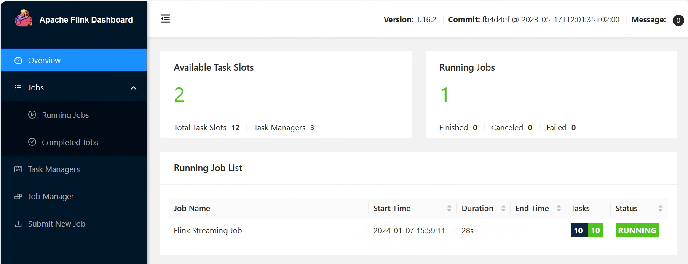

### 11.3.2 job提交与管理

测试用的jar包 ：

[wc.jar](files/wc.jar)

里面有两个用于测试的作业（job）：

```java
作业1入口类：  cn.doitedu.WordCountKfk
需要传递main方法参数： kafka消费组id，kafka客户端id前缀，要读取的topic名称


作业2入口类：  cn.doitedu.WordCount
需要找台机器开启一个socket端口:  nc -lk 9999
需要给入口类传递main方法参数：  socket端口所在的主机名
```

#### 11.3.2.1 通过页面管理job

> **提交job&#x20;**

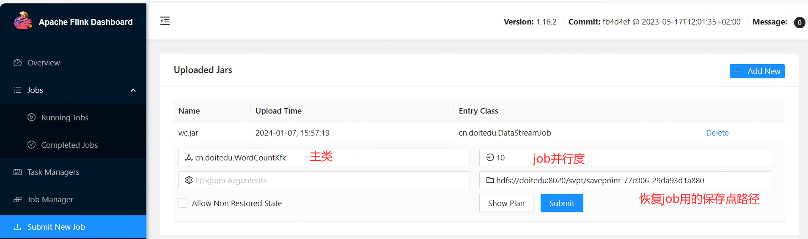


> **取消job**

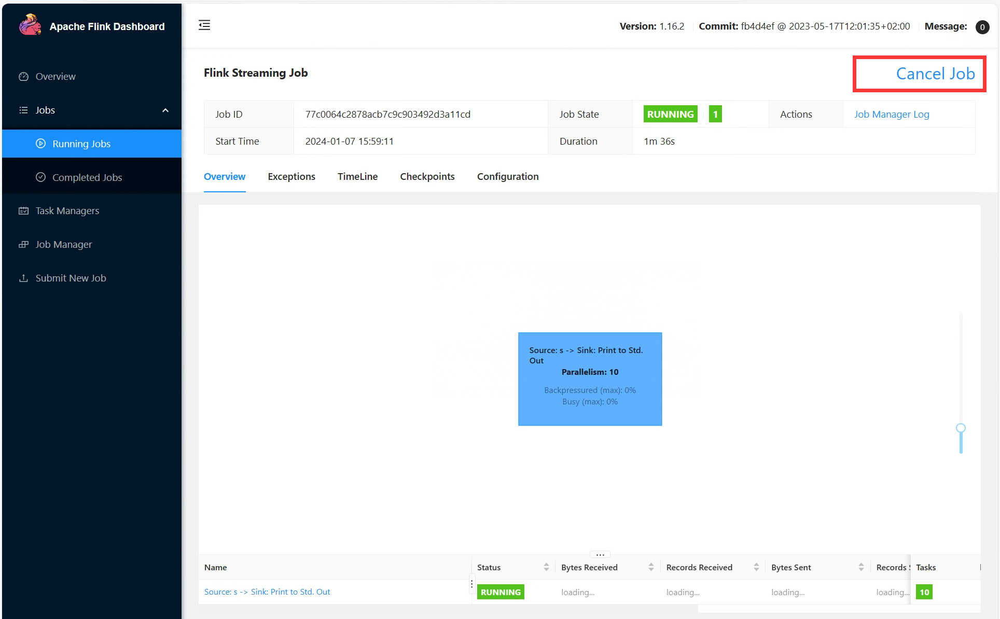


#### 11.3.2.2 通过命令管理job

> **查看集群中的job**

```bash
[root@doitedu flink-1.16.2]# flink list -a 
Waiting for response...
------------------ Running/Restarting Jobs -------------------
07.01.2024 16:18:08 : 4f7fc878af8c43e3014dc1d0723e8548 : Flink Streaming Job (RUNNING)
--------------------------------------------------------------
No scheduled jobs.
---------------------- Terminated Jobs -----------------------
07.01.2024 15:59:11 : 77c0064c2878acb7c9c903492d3a11cd : Flink Streaming Job (FINISHED)
07.01.2024 16:09:27 : 4506ff7e8389076710e153908f1493d7 : Flink Streaming Job (FINISHED)
07.01.2024 16:12:34 : e8024b50d877e73c85f02a858ff7bc38 : Flink Streaming Job (CANCELED)
--------------------------------------------------------------
```


> **提交job**

```bash
flink run \
-d \
-t remote \
-p 2  \
-c cn.doitedu.WordCountKfk \
-s hdfs://doitedu:8020/svpt/savepoint-77c006-29da93d1a880 \
/root/wc.jar

# 参数解释
-d  沉默提交  程序提交后  提交客户端退出   1>/dev/null  2>&1  &
-t  job运行模式，有local，remote，yarn-session，yarn-per-job，yarn-application等
-p  job的默认并行度
-c  入口主类的全类名
-s  用于恢复job状态的savepoint路径

```


> **触发savepoint**

```java
flink savepoint 5ee2d14004d0b00523ad96cfa129d069 hdfs://doitedu:8020/doit44


# 说明  flink savepoint jobId 保存路径
```


> **停止job**

语法: flink stop \[OPTIONS] \<Job ID>

```bash
[root@doitedu flink-1.16.2] flink stop -d -t remote -p hdfs://doitedu:8020/svpt 77c0064c2878acb7c9c903492d3a11cd
# Suspending job "77c0064c2878acb7c9c903492d3a11cd" with a CANONICAL savepoint.
# Savepoint completed. Path: hdfs://doitedu:8020/svpt/savepoint-77c006-29da93d1a880


# 参数解释
# -d 在stop作业之前发送一个 MAX_WATERMARK，来触发那些尚未触发的窗口（最后一个窗口）
# -t 可不用指定；指job的运行模式，有local，remote，yarn-session，yarn-per-job等
# -p 指定savepoint的存储路径，如不指定，则使用配置文件中的路径

# 除了stop命令，也可用cancel命令来取消job
[root@doitedu flink-1.16.2] flink -s hdfs://doitedu:8020/svpt cancel e8024b50d877e73c85f02a858ff7bc38
# cancel可以不指定-s，这样就不会触发savepoint
```


## 11.4 Flink On Yarn 模式

> Flink on yarn，就是把flink的集群（jobmanager，taskmanager）搬到yarn上运行
>
> 一个这样集群实例，就是yarn上的一个application
>
>
>
> 类似的这种模式，常用的还有 flink  on  k8s
>
> kubernates（是一个用docker来做容器的资源管理平台）
>
>

### 11.4.1 Flink on Yarn 概述

YARN是一个通用的资源调度框架，特点是：

* 可以运行多种编程模型，例如MR、Storm、Spark、Flink等

* 性能稳定，运维经验丰富

* 灵活的资源分配和资源隔离 \[自动配置资源]

* 每提交一个application都会有一个专门的ApplicationMater（JobManager）


#### Flink on yarn 模式又分为3种子模式

> **Yarn Session Mode.**

* 多个job共享同一个集群\<jobmanager/taskmanager>；

* job退出集群也不会退出；

* 集群中**的taskmanager个数是动态的**（可以根据提交的job动态增加，也可以因为job完成而动态释放）

* 用户作业的入口类的main方法在提交job的client端运行；

（需要频繁提交大量小规模job的场景比较适用；因为每次提交一个新job的时候，不需要去向yarn注册应用）


> **Application Mode \[cluster]**

每个job独享一个集群，job退出集群则退出(回收)；

用户类的main方法在集群上运行；

适用于：大job长时间运行


> ~~**Per-Job Mode（1.15版本标记为已过期）**~~

每个job独享一个集群，job退出集群则退出；

每个job都有自己的

用户类的main方法在client端运行；

（大job，运行时长很长，比较合适；因为每起一个job，都要去向yarn申请容器启动jm,tm，比较耗时）


> 上述3种模式的区别点在:
>
> * 集群的生命周期和资源的隔离保证
>
> * 用户类的main方法是运行在client端，还是在集群端


### 11.4.2 **yarn session 模式**

> &#x31;**，**&#x6240;有**作业共享集群资源（JM,TM）**，隔离性差，JM 负载瓶颈，用户入口类main 方法在作业提交的客户端（CliFrontend程序）执行。
>
> 2，**Session模式需要yarn-session.sh先启动session集群**，**然后再 flink run 提交作业；session集群的槽位资源（taskManager）是根据job上下线而动态申请、回收的；**
>
> 3，适合执行时间短，上下线频繁的小规模任务(比如对秒杀活动数据的实时分析)；


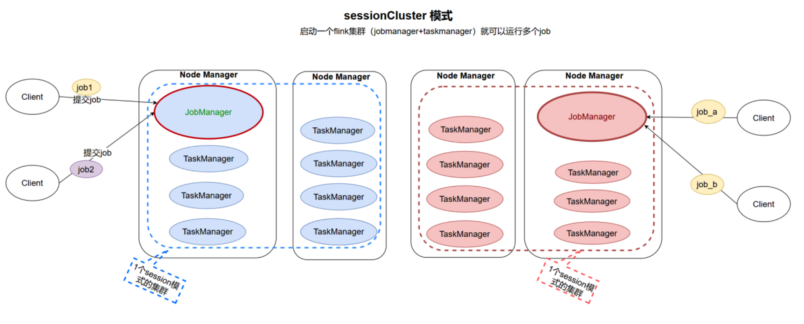

> **启动session集群**

> 要提前启动好hdfs、yarn
>
> 而且，可以顺便把 历史记录服务器 启动起来
>
> \[root@doitedu apps]# mapred --daemon start historyserver


提交session集群到yarn的命令：

```shell
[root@doitedu flink-1.16.2]# yarn-session.sh -d \
-jm 1600  \
-tm 2000   \
-s 2  \
-m yarn-cluster \
-nm doit50_youxiu \
-qu default \


# 参数说明
# jm  jobmananger的内存大小MB
# tm  taskmananger的内存大小MB
# -m  jobmananger地址（可不用指定），在yarn模式下，指定为yarn-cluster即可
# -nm 自定义session集群的名称
# -qu 提交到yarn的指定队列
# -s  每个taskmananger的槽位数
```

启动完成后，在控制台会有如下较重要信息提示：

```shell
JobManager Web Interface: http://doitedu3:8081 
In order to stop Flink gracefully, use the following command:
$ echo "stop" | ./bin/yarn-session.sh -id application_1704602948356_0003
If this should not be possible, then you can also kill Flink via YARN's web interface or via:
$ yarn application -kill application_1704602948356_0003
Note that killing Flink might not clean up all job artifacts and temporary files. 
```

启动好的集群，可在yarn的web控制台查看到一个运行中的yarn-application，其名称为启动时指定的自定义名称

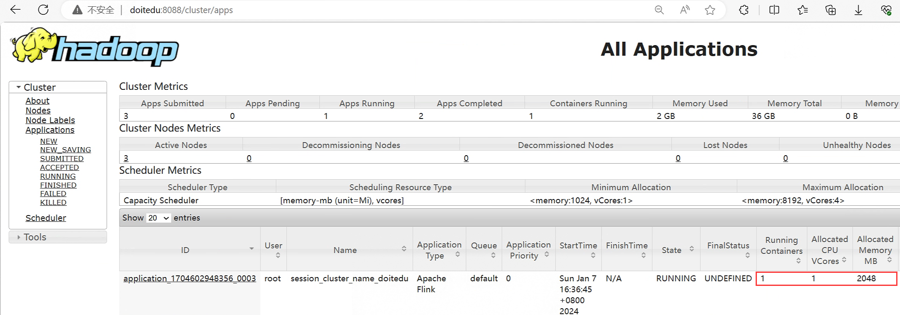

> 可以发现，该session集群，在启动之初，只申请了1个容器来运行jobmananger
>
> 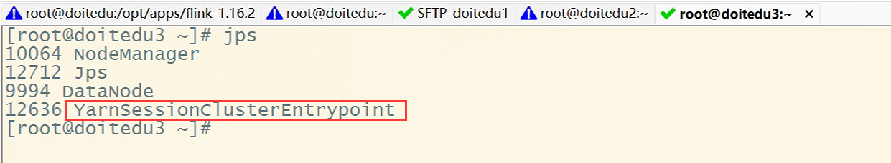

通过点击该yarn-application的ApplicationMaster，可以进入flink yarn-session集群的jobmananger页面

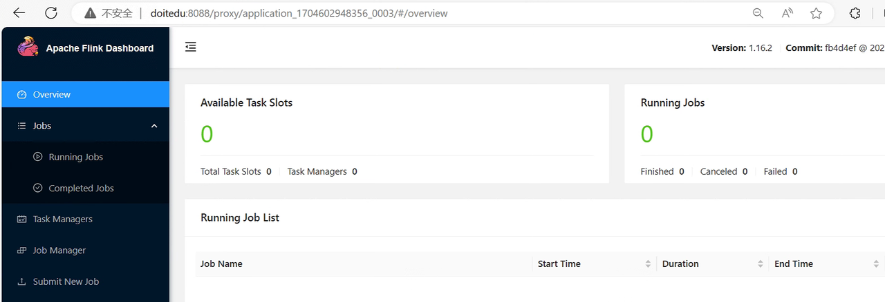


> **向已存在的yarn  session集群提交job**

* 对于已存在的session集群，可以直接通过jobmanager的web控制台提交job

* 也可以通过命令来提交job

```shell
flink run \
-d \
-p 3  \
-m yarn-cluster \
-yid application_1704602948356_0004 \
-c cn.doitedu.WordCountKfk \
-s hdfs://doitedu:8020/svpt/savepoint-77c006-29da93d1a880 \
/root/wc.jar  

# 参数说明
# yid 目标session集群所对应的yarn application_id
# -s 表示从哪个保存点来恢复启动job
```

提交job后，可以发现，目标session集群的资源在yarn中增加了分配

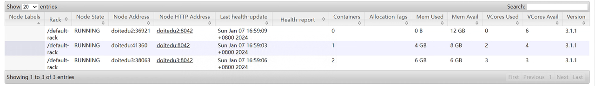

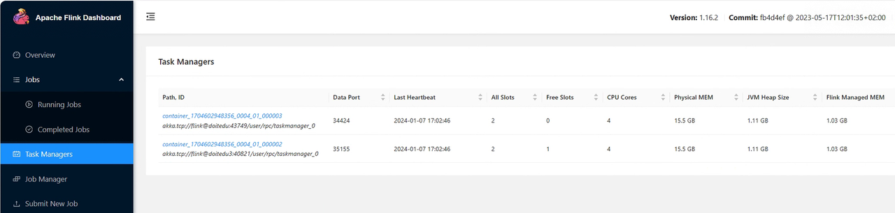


> 停止job

```shell
# 指定jobid和savepoint路径，停止
[root@doitedu flink-1.16.2]# flink stop -p hdfs://doitedu:8080/svpt 59d3285632390982a646e7d13626d812
# 命令中的 “59d3285632390982a646e7d13626d812”，是要停止的目标job的job_id


# 如果配置文件中已经配置了默认的savepoint路径，可以直接停止
[root@doitedu flink-1.16.2]# flink stop 59d3285632390982a646e7d13626d812
```

job停止后，可以释放的taskmanager会被释放回收


> **停止session集群**

在启动session集群时，命令控制台上就有停止session集群的命令提示：

```shell
# 优雅停止命令
echo "stop" | yarn-session.sh -id application_1704602948356_0003

# 暴力停止命令（直接通过yarn杀掉session集群对应的application）
yarn application -kill application_1704602948356_0003
```


### 11.4.3 **yarn application 模式**

> 最大特点是： **一个集群只运行一个job；** job退出（完成）时集群也跟随退出
>
>
>
> 启动集群和提交作业，是在一个命令中完成；
>
> 适用于运行时间长，所需资源多且相对固定的job；


#### 启动集群并提交作业

> 启动集群同时提交job

```shell
flink run-application \
-t yarn-application \
-c top.doe.flink.demos.Demo31_KafkaSinkDemo \
-p 6 \
-s hdfs://doitedu01:8020/doit50-youxiu/savepoint-1a8739-e804b762f1e2 \
-Dtaskmanager.memory.process.size=3000mb \
-Djobmanager.memory.process.size=1600mb \
-Dtaskmanager.numberOfTaskSlots=2  \
-Dclassloader.resolve-order=parent-first \
/root/demos.jar od res-nb2
```

> 特点：启动集群的同时，就已经提交了作业（所以集群和job作业是绑定在一起的）


> **如果提交作业时出现如下异常**

```java
Caused by: java.lang.LinkageError: loader constraint violation: when resolving interface method "org.apache.flink.connector.kafka.
```

可在作业提交命令中添加如下参数

```java
-Dclassloader.resolve-order=parent-first  （默认是： child-first）
```


#### 其他操作命令

> 停止、取消 job

```shell
# 查看当前运行的JOB  只有一个
flink list -t  yarn-application -Dyarn.application.id=application_1704619908668_0006

# 取消任务  集群资源被回收 
flink stop -t yarn-application \
-Dyarn.application.id=application_1704619908668_0006 7fec77cf066d1fc1f5dd1c1e71ad416d
```


#### yarn application模式的工作流程


### ~~**11.4.4 yarn perJob模式提交（flink-1.15版本已过期deprecated）**~~

> Yarn-Per-Job 模式：每个作业独占一个集群，隔离性好，JM(JobManager) 负载均衡，
>
> 与 application模式的区别： 用户程序入口类的main方法在客户端执行。


> 提交job

```shell
flink run -d \
-c cn.doitedu.WordCountKfk   \
-t yarn-per-job  \
-p 3 \
-Dtaskmanager.memory.process.size=3000mb \
-Djobmanager.memory.process.size=1600mb \
-Dtaskmanager.numberOfTaskSlots=2 \
/root/wc.jar 
```

> 查看app下运行的job&#x20;

```java
flink list -t yarn-per-job -Dyarn.application.id=application_1688314261146_0005
```

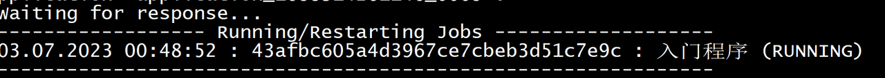

> 取消JOB

```java
flink stop -yid application_1704602948356_0005 8254ac89b477915e753f10b7e773ce37
```

##


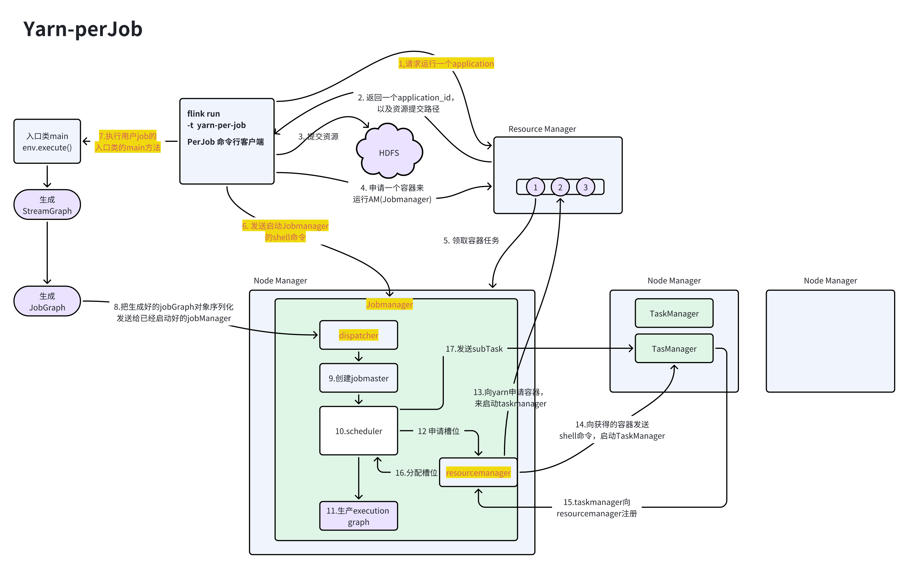


### 增补：perJob和application模式的区别

* **yarn-perJob模式**： 用户作业的入口类的main方法，是在提交作业的客户端上执行的（会在客户端先生成好StreamGraph和JobGraph，然后发给集群中的jobmanager里面的dispatcher）

* **yarn-application模式**：**客户端**只负责向yarn提交jar包，并申请容器启动flink集群，不运行用户作业的入口类；

> 而YarnApplicationClusterEntryPoint（JobManager的启动类）启动后，会从jar包中获取用户的作业入口类，并执行它的main()方法，来得到JobGraph，然后交给dispatcher模块


> 两者的核心区别：用户job入口类main方法在哪里执行！一个在客户端；一个在jobmanager！
>
> job入口类main方法在哪执行，要点就是：StreamGraph和JobGraph在哪里生成！


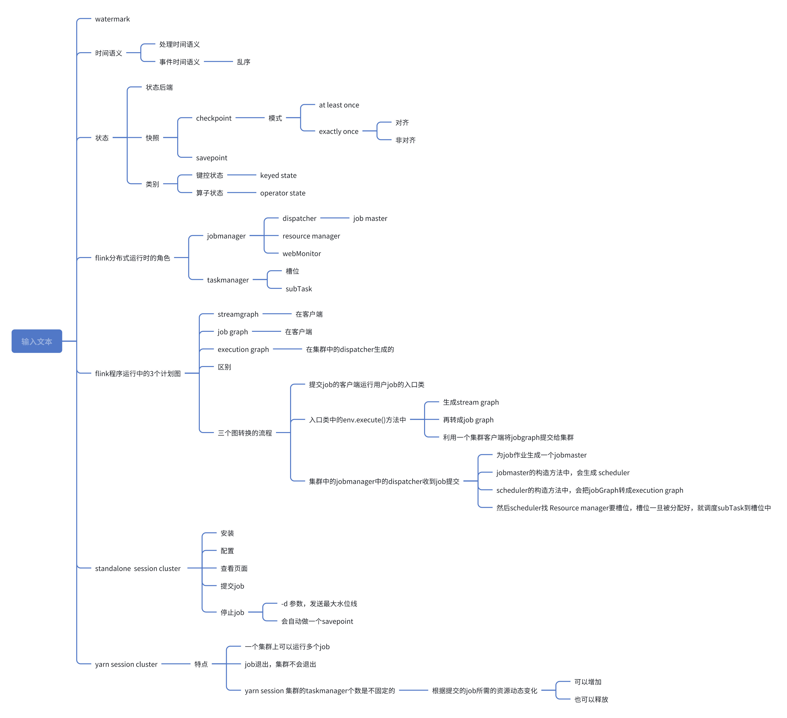


# 综合练习

## 练习1 - 大屏指标看板-订单日清日结（数仓需求）

* 订单日结看板

> 1: 订单总数、总额 、应付总额 （当日新订单，累计到此刻）
>
> 2: 待支付订单数、订单额  （当日新订单，累计到此刻）
>
> 3: 已支付订单数、订单额  （当日支付，累计到此刻）
>
> 4: 已发货订单数、订单额  （当日发货，累计到此刻）
>
> 5: 已完成订单数、订单额  （当日完成，累计到此刻）


### 15.3.1 订单表及测试数据

#### 订单主表

```sql
CREATE TABLE `oms_order` (
  `id` bigint(20) NOT NULL AUTO_INCREMENT COMMENT '订单id',
  `member_id` bigint(20) NOT NULL  COMMENT '用户id',
  `coupon_id` bigint(20) DEFAULT NULL COMMENT '优惠券id',
  `order_sn` varchar(64) DEFAULT NULL COMMENT '订单编号',
  `create_time` datetime DEFAULT NULL COMMENT '提交时间',
  `member_username` varchar(64) DEFAULT NULL COMMENT '用户帐号',
  `total_amount` decimal(10,2) DEFAULT NULL COMMENT '订单总金额',
  `pay_amount` decimal(10,2) DEFAULT NULL COMMENT '应付金额（实际支付金额）',
  `freight_amount` decimal(10,2) DEFAULT NULL COMMENT '运费金额',
  `promotion_amount` decimal(10,2) DEFAULT NULL COMMENT '促销优化金额（促销价、满减、阶梯价）',
  `integration_amount` decimal(10,2) DEFAULT NULL COMMENT '积分抵扣金额',
  `coupon_amount` decimal(10,2) DEFAULT NULL COMMENT '优惠券抵扣金额',
  `discount_amount` decimal(10,2) DEFAULT NULL COMMENT '管理员后台调整订单使用的折扣金额',
  `pay_type` int(1) DEFAULT NULL COMMENT '支付方式：0->未支付；1->支付宝；2->微信',
  `source_type` int(1) DEFAULT NULL COMMENT '订单来源：0->PC订单；1->app订单',
  `status` int(1) DEFAULT NULL COMMENT '订单状态：0->待付款；1->待发货；2->已发货；3->已完成；4->已关闭；5->无效订单',
  `order_type` int(1) DEFAULT NULL COMMENT '订单类型：0->正常订单；1->秒杀订单',
  `delivery_company` varchar(64) DEFAULT NULL COMMENT '物流公司(配送方式)',
  `delivery_sn` varchar(64) DEFAULT NULL COMMENT '物流单号',
  `auto_confirm_day` int(11) DEFAULT NULL COMMENT '自动确认时间（天）',
  `integration` int(11) DEFAULT NULL COMMENT '可以获得的积分',
  `growth` int(11) DEFAULT NULL COMMENT '可以活动的成长值',
  `promotion_info` varchar(100) DEFAULT NULL COMMENT '活动信息',
  `bill_type` int(1) DEFAULT NULL COMMENT '发票类型：0->不开发票；1->电子发票；2->纸质发票',
  `bill_header` varchar(200) DEFAULT NULL COMMENT '发票抬头',
  `bill_content` varchar(200) DEFAULT NULL COMMENT '发票内容',
  `bill_receiver_phone` varchar(32) DEFAULT NULL COMMENT '收票人电话',
  `bill_receiver_email` varchar(64) DEFAULT NULL COMMENT '收票人邮箱',
  `receiver_name` varchar(100) NOT NULL COMMENT '收货人姓名',
  `receiver_phone` varchar(32) NOT NULL COMMENT '收货人电话',
  `receiver_post_code` varchar(32) DEFAULT NULL COMMENT '收货人邮编',
  `receiver_province` varchar(32) DEFAULT NULL COMMENT '省份/直辖市',
  `receiver_city` varchar(32) DEFAULT NULL COMMENT '城市',
  `receiver_region` varchar(32) DEFAULT NULL COMMENT '区',
  `receiver_detail_address` varchar(200) DEFAULT NULL COMMENT '详细地址',
  `note` varchar(500) DEFAULT NULL COMMENT '订单备注',
  `confirm_status` int(1) DEFAULT NULL COMMENT '确认收货状态：0->未确认；1->已确认',
  `delete_status` int(1) NOT NULL DEFAULT '0' COMMENT '删除状态：0->未删除；1->已删除',
  `use_integration` int(11) DEFAULT NULL COMMENT '下单时使用的积分',
  `payment_time` datetime DEFAULT NULL COMMENT '支付时间',
  `delivery_time` datetime DEFAULT NULL COMMENT '发货时间',
  `receive_time` datetime DEFAULT NULL COMMENT '确认收货时间',
  `comment_time` datetime DEFAULT NULL COMMENT '评价时间',
  `modify_time` datetime DEFAULT NULL COMMENT '修改时间',
  PRIMARY KEY (`id`)
) ENGINE=InnoDB AUTO_INCREMENT=30 DEFAULT CHARSET=utf8 COMMENT='订单表';
```


#### 测试表及数据

> 测试表： 裁剪掉大量字段，只保留本需求所关心的字段，以降低无谓的劳动量

* **订单主表(简化测试表）**

[oms\_order.sql](files/oms_order.sql)


* **测试数据**

```sql

INSERT INTO `oms_order` VALUES ('1', '3', '140', '120', '2023-06-10 21:00:25', '2023-06-11 12:00:25', '2023-06-11 21:00:56', '2023-06-12 10:00:56', 'a', '2023-06-12 10:00:56');

INSERT INTO `oms_order` VALUES ('2', '2', '140', '120', '2023-06-11 08:00:16', '2023-06-12 08:40:16', '2023-06-12 16:00:16', null, 'a', '2023-06-12 10:01:10');

-- 订单3及所带的item明细
INSERT INTO `oms_order` VALUES ('3', '1', '140', '120', '2023-06-12 10:01:20', null, null, null, 'a', '2023-06-12 10:01:20');

-- 订单4及所带的item明细
INSERT INTO `oms_order` VALUES ('4', '1', '140', '120', '2023-06-12 10:02:10', null, null, null, 'a', '2023-06-12 10:02:10');

-- 订单5及所带的item明细
INSERT INTO `oms_order` VALUES ('5', '1', '140', '120', '2023-06-12 10:03:10', null, null, null, 'a', '2023-06-12 10:03:10');


INSERT INTO `oms_order` VALUES ('6', '1', '140', '120', '2023-06-12 10:04:10', null, null, null, 'a', '2023-06-12 10:04:10');

```


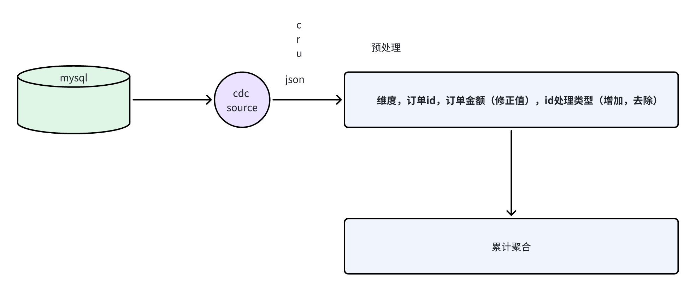


## 练习2 - 动态规则引擎  （事件驱动型的应用）

有如下用户行为事件

```java
{"uid":1,"event_id":"幸运之轮","properites":{"n1":100,"n2":80,"n3":60}}
{"uid":1,"event_id":"添加购物车","properites":{"item_id":"item_001","quantity":3}
{"uid":1,"event_id":"幸运之轮","properites":{"n1":100,"n2":80,"n3":60}}
{"uid":4,"event_id":"幸运之轮","properites":{"n1":100,"n2":80,"n3":60}}
{"uid":5,"event_id":"幸运之轮","properites":{"n1":100,"n2":80,"n3":60}}
```

需要对这些事件中的“幸运之轮“中的数字进行运算，但运算规则不要写死，而是在系统运行时可以随时

* 动态注入新规则

* 动态修改已运行规则

* 动态下线已运行规则

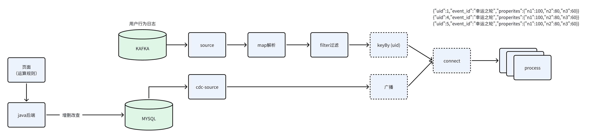


