# 1. 快速上手

## 1.1 基本套路

flink sql 是基于flink core之上，开发的一个上层库（工具）；

flink sql 主要针对结构化数据，简化了通过api编2程的繁琐度；

> flinkApi开发数据处理程序，基本套路：
>
> 构造source连接数据源得到stream，然后stream上应用各种算子得到处理结果stream，然后构造sink连接目标数据源，然后将处理结果stream，通过构造好的sink写出

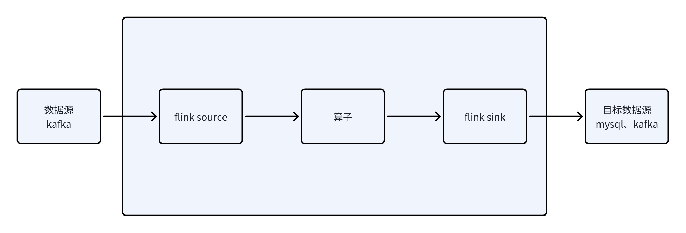


* **用flinksql来开发数据统计程序时，基本套路如下**

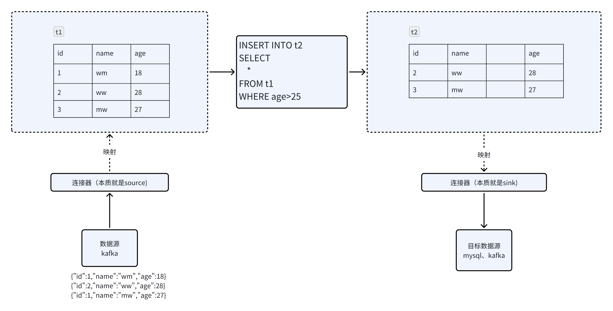

* 将数据源，通过connector（连接器）映射成一张“二维表”（就是关系型数据库中常见的“表”），如 `table_1`

* 将输出目标存储，也通过connector（连接器）映射成一张“二维表”，如 `table_2`

* 然后再编写sql来实现：读取源表，运算处理后，写入目标表；类似于:

```sql
INSERT INTO table_2 
SELECT 
... 
FROM table_1
```


## 1.2 所需依赖

```xml
<!-- flinkSql 需要的依赖 -->
<dependency>
    <groupId>org.apache.flink</groupId>
    <artifactId>flink-table-planner_2.12</artifactId>
    <version>${flink.version}</version>
</dependency>


<!-- 按需导入连接器依赖，如kafka连接器 -->
<dependency>
    <groupId>org.apache.flink</groupId>
    <artifactId>flink-connector-kafka</artifactId>
    <version>${flink.version}</version>
</dependency>
```


## 1.3 编程示例

### 1.3.1 需求及测试数据

从kafka的源topic(tpc-a)中读取数据，过滤出所有的“来访页为/x的页面浏览事件”，并将结果写入kafka的结果topic

```sql
{"uid":1,"event_id":"page_load","properties":{"url":"/a","ref":"/x"},"action_time":1704719574000}
{"uid":1,"event_id":"add_cart","properties":{"url":"/a","item_id":"p01"},"action_time":1704719574000}
{"uid":1,"event_id":"page_load","properties":{"url":"/b","ref":"/a"},"action_time":1704719574000}
{"uid":2,"event_id":"page_load","properties":{"url":"/a","ref":"/x"},"action_time":1704719574000}
{"uid":2,"event_id":"video_play","properties":{"url":"/a","video_id":"v01"},"action_time":1704719574000}
{"uid":2,"event_id":"page_load","properties":{"url":"/b","ref":"/x"},"action_time":1704719574000}
{"uid":1,"event_id":"page_load","properties":{"url":"/c","ref":"/x"},"action_time":1704719574000}
{"uid":1,"event_id":"item_share","properties":{"url":"/a","item_id":"p03"},"action_time":1704719574000}

```

```java
练习需求1: 实时统计每一个页面的访问次数（pv）
/a , 3
/b , 4


练习需求2：实时统计每个页面的访问人数（uv）
```


### 1.3.2 编程方式1：sql方式

```java
package cn.doitedu.demo;

import org.apache.flink.streaming.api.CheckpointingMode;
import org.apache.flink.streaming.api.environment.StreamExecutionEnvironment;
import org.apache.flink.table.api.bridge.java.StreamTableEnvironment;

public class Demo1 {
    public static void main(String[] args) {

        // 构造stream api 编程的环境
        StreamExecutionEnvironment env = StreamExecutionEnvironment.getExecutionEnvironment();
        env.enableCheckpointing(5000, CheckpointingMode.EXACTLY_ONCE);
        env.getCheckpointConfig().setCheckpointStorage("file:///d:/ckpt");

        // 构造 sql 编程环境
        StreamTableEnvironment tenv = StreamTableEnvironment.create(env);


        // 将要读取的数据源，用连接器映射成一张flink的逻辑表
        tenv.executeSql(
                "CREATE TABLE my_source_table (\n" +
                "  uid BIGINT,                   \n" +
                "  event_id STRING,              \n" +
                "  properties MAP<STRING,STRING>,\n" +
                "  action_time BIGINT            \n" +
                ") WITH (                        \n" +
                "  'connector' = 'kafka',                    \n" +
                "  'topic' = 'ss-1',                         \n" +
                "  'properties.bootstrap.servers' = 'doitedu:9092',\n" +
                "  'properties.group.id' = 'doit44_g1',\n" +
                "  'scan.startup.mode' = 'latest-offset',\n" +
                "  'value.format' = 'json',\n" +
                "  'value.fields-include' = 'EXCEPT_KEY' \n" +
                ")");

        // 将要写出的目标存储，映射成一张flink的逻辑表
        tenv.executeSql("CREATE TABLE my_target_table (\n" +
                "  uid BIGINT,\n" +
                "  event_id STRING,\n" +
                "  properties MAP<STRING,STRING>,\n" +
                "  action_time BIGINT\n" +
                ") WITH (\n" +
                "  'connector' = 'kafka',\n" +
                "  'topic' = 'ss-2',\n" +
                "  'properties.bootstrap.servers' = 'doitedu:9092',\n" +
                "  'properties.group.id' = 'doit44_g1',\n" +
                "  'scan.startup.mode' = 'latest-offset',\n" +
                "  'value.format' = 'json',\n" +
                "  'value.fields-include' = 'EXCEPT_KEY' \n" +
                ")");


        // 开发一个数据运算的sql： insert into 目标逻辑表  select .....  from 源逻辑表
        tenv.executeSql(
                        "insert into  my_target_table \n"+
                        " select                      \n"+
                        "   uid,                      \n"+
                        "   event_id,                 \n"+
                        "   properties,               \n"+
                        "   action_time               \n"+
                        " from my_source_table        \n"+
                        " where event_id='page_load'  \n"+
                        " and properties['ref']='/x'  \n"
        );
    }
}
```


### 1.3.3 编程方式2：table api 方式

```java
package cn.doitedu.demo;

import org.apache.flink.streaming.api.CheckpointingMode;
import org.apache.flink.streaming.api.environment.StreamExecutionEnvironment;
import org.apache.flink.table.api.*;
import org.apache.flink.table.api.bridge.java.StreamTableEnvironment;

import static org.apache.flink.table.api.Expressions.$;

public class Demo1_TableApi {
    public static void main(String[] args) {

        // 构造编程环境
        StreamExecutionEnvironment env = StreamExecutionEnvironment.getExecutionEnvironment();
        env.enableCheckpointing(2000, CheckpointingMode.EXACTLY_ONCE);
        env.getCheckpointConfig().setCheckpointStorage("file:///d:/ckpt");

        StreamTableEnvironment tenv = StreamTableEnvironment.create(env);


        // 建表，映射数据源（kafka中的ss-1）
        TableDescriptor tableDescriptor = TableDescriptor
                .forConnector("kafka")   // 指定连接器
                .option("topic", "ss-1")  // 指定连接器的参数
                .option("properties.bootstrap.servers", "doitedu:9092")
                .option("properties.group.id", "doit44_g2")
                .option("scan.startup.mode", "latest-offset")
                .option("value.format", "json")
                .option("value.fields-include", "EXCEPT_KEY")
                .schema(Schema.newBuilder()  // 指定表结构schema
                        .column("uid", DataTypes.BIGINT())
                        .column("event_id", DataTypes.STRING())
                        .column("properties", DataTypes.MAP(DataTypes.STRING(), DataTypes.STRING()))
                        .column("action_time", DataTypes.BIGINT())
                        .build()
                )
                .build();

        Table sourceTable = tenv.from(tableDescriptor);

        // 按照需求，进行数据运算： 过滤出所有的来访页为 /x 的页面浏览事件
        TableResult tableResult = sourceTable
                .where(
                        $("event_id").isEqual("page_load")  // event_id = 'page_load'
                                .and($("properties").at("ref").isEqual("/x")   // properties['ref']='/x'
                                ))
                .select($("uid"), $("event_id"), $("properties"), $("action_time"))
                .execute();

        tableResult.print();

    }
}
```


# 2. DDL（data define language）语法关键特性

## 2.1 CREATE  TABLE 语法结构

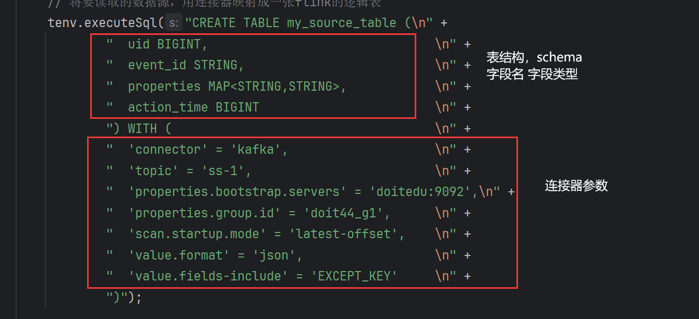


## 2.2 连接器

### 2.2.1 连接器的本质

连接器的本质就是stream api中的： **source + sink**

* 从表中select（读）数据，则连接器充当source

* 向表中insert（写）数据，则连接器充当sink


### 2.2.2 连接器的参数

不同连接器，参数不同；

但是不管哪种连接器，它的参数都分为“必选”参数和“可选”参数；

连接器的参数可以在提供连接器的官方文档中查询

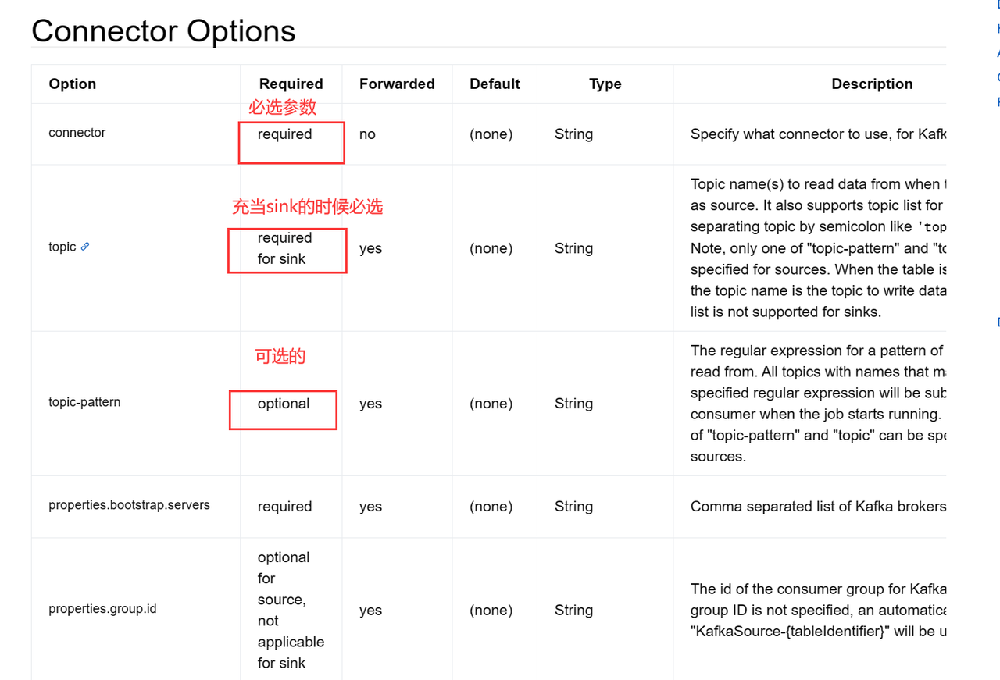


### 2.2.3 数据类型映射

物理数据，有可能是在mysql中，也有可能是在hbase中，也有可能是在kafka中

在各种物理存储中的数据，可能拥有各种各样的类型；

**物理数据中的“类型”，不一定存在于flinksql中；**

比如，mysql中有datetime类型，而flinksql中就不存在这种类型；

因此：建表的时候，物理数据的类型，如何映射到flinksql的逻辑表中的类型？

* **大部分时候，这种映射关系可以凭直觉；**

> 比如：物理表mysql中的一个字段类型为varchar，映射到flinksql的逻辑表中，类型用 string

* **小部分时候，对于一些非常用的类型，该如何映射呢？**

> 看连接器的官方文档即可（里面有数据类型映射表）

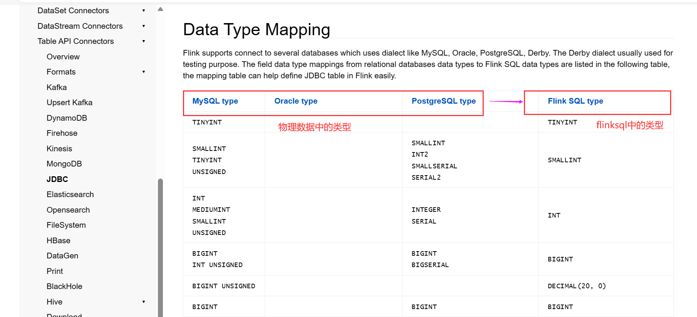


##


***

## 2.3 schema

在flinksql的建表schema中，**定义的字段，有3大类型**：

### 2.3.1 **物理字段 &#x20;**

对应物理数据中真实存在的数据字段；

> 如物理数据是这样的json字符串:&#x20;

```java
{"uid":1,"event_id":"page_load","properties":{"k1":"v1","k2":"v2"},"action_time":1000}
```

> 在flinksql的映射表中就可以定义如下物理字段：

```sql
create table t_1 (
    uid bigint,
    event_id string,
    properties map<string,string>,
    action_time bigint
)
```


### 2.3.2 **逻辑表达式字段**

对物理字段施加一个表达式，所得到的字段定义；

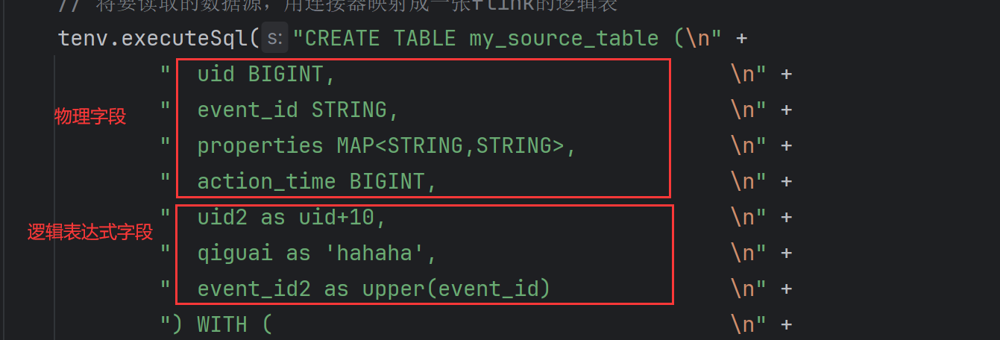


### 2.3.3 **连接器元数据字段**

连接器，除了提供真实的物理数据之外，它还额外提供了一些元数据

> 比如，从kafka中读取到一条json（物理数据），连接器除了提供这条json数据之外，还会提供这条数据所属的partition，offset，数据在kafka中timestamp等等信息；

我们在用kafka连接器建表时，就可以把连接器所提供的上述“元数据”也定义为表的字段；

这样我们在查询该表时，不光可以得到我们要的物理数据，还能直接查询到元信息；

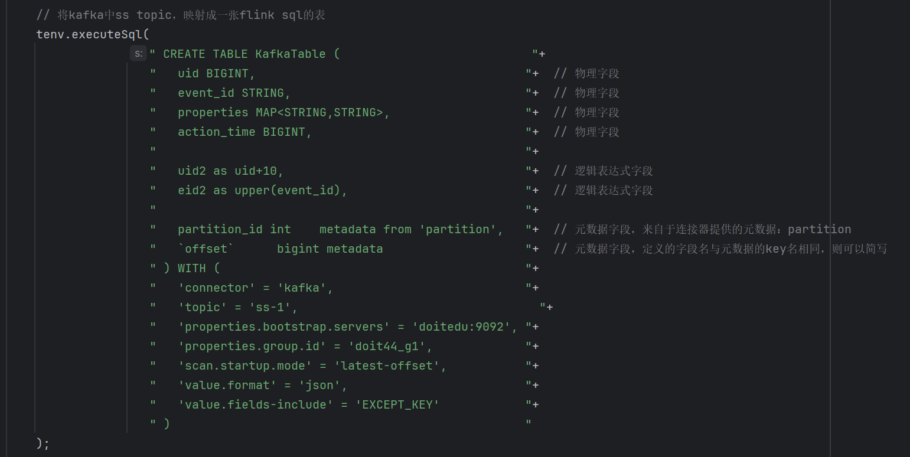

***

## 2.4 时间语义与watermark

在sql中，也需要时间语义；

比如，我们做时间窗口统计，会有如下语法：

```sql
TUMBLE(TABLE a, DESCRIPTOR(rt), INTERVAL '5' MINUTE)
--这就需要a表中，有一个代表时间语义的 “时间字段” : rt
```

* 定义： **processing time**语义的“时间字段”

```sql
pt as proctime()
```

* 定义：**event time&#x20;**&#x8BED;义的“时间字段”

```sql
watermark for 字段 as 字段 - interval '1' second

-- 要求，这个目标字段必须是一个timestamp(3) 或 timestamp_ltz(3) 类型
-- 如果我们的物理字段中没有该类型的时间字段，比如只有一个长整数的时间字段： action_time
-- 我们可以变通一下，先定义一个表达式字段，然后在该表达式字段上定义watermark

rt as to_timestamp_ltz(action_time,3),
watermark form rt as rt - interval '1' second

```

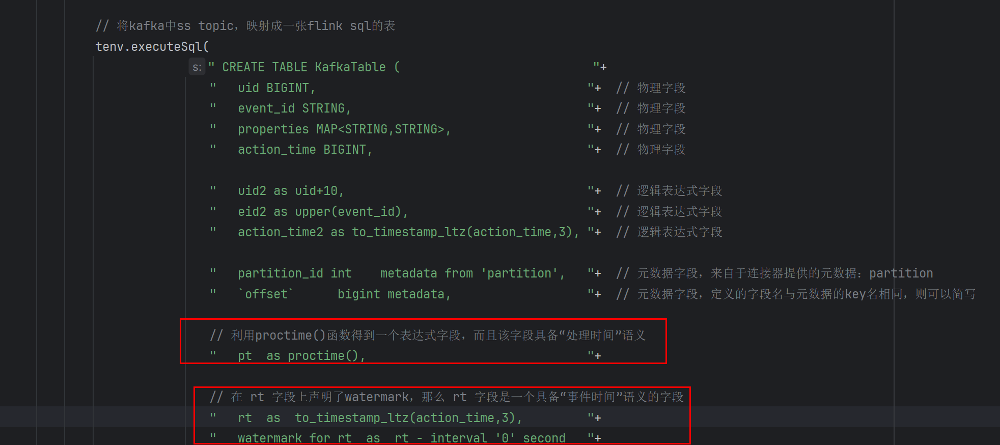

```sql
上面的pt字段： 它的类型为： TIMESTAMP_LTZ(3) *PROCTIME*
上面的rt字段： 它的类型为： TIMESTAMP_LTZ(3) *ROWTIME*
```


# 3. 常用连接器

## 3.1 kafka connector

kafka连接器，是用来连接kafka的；

通过连接器，可以查询数据，也可以写出数据；

**注意：kafka连接器，不支持changelog流！只支持appendOnly流！**

```java
<dependency>
  <groupId>org.apache.flink</groupId>
  <artifactId>flink-connector-kafka</artifactId>
  <version>${FLINK.VERSION}</version>
</dependency>

```

## 3.2 **upsert-kafka connector**

kafka本身并不能支持数据的更新、删除等操作；

但upsert kafka 连接器，**能支持changelog流的**写入和读出，原因是它往kafka中写入这种changelog流数据时做了一些标记，然后在读取的时候根据标记又能还原出 changelog流；


**注意点： upsert kafka连接器建表时，必须定义主键；**


**写代码示例**

```java
// 创建源表
tenv.executeSql("create table tpc_1 (\n" +
        "    id int,\n" +
        "    name string,\n" +
        "    gender string,\n" +
        "    score double\n" +
        ") with (\n" +
        "    'connector' = 'kafka',            \n" +
        "    'topic' = 'topic-1',              \n" +
        "    'properties.bootstrap.servers' = 'doitedu01:9092',\n" +
        "    'properties.group.id' = 'g001',       \n" +
        "    'scan.startup.mode' = 'latest-offset',\n" +
        "    'value.format' = 'json',              \n" +
        "    'value.fields-include' = 'EXCEPT_KEY' \n" +
        ")");

// 创建目标表
tenv.executeSql("create table tpc_3 (            \n" +
        "    gender string                       \n" +
        "    ,score_amt double                   \n" +
        "    ,primary key(gender) NOT ENFORCED   \n" +
        ") with (                    \n" +
        "    'connector' = 'upsert-kafka',       \n" +
        "    'topic' = 'topic-3',              \n" +
        "    'properties.bootstrap.servers' = 'doitedu01:9092',\n" +
        "    'key.format' = 'json',       \n" +
        "    'value.format' = 'json',       \n" +
        "    'value.fields-include' = 'EXCEPT_KEY'\n" +
        ");\n");


// 执行查询sql
tenv.executeSql(
        "insert into tpc_3 \n" +
        "SELECT gender, sum(score) as score_amt\n" +
        "FROM tpc_1\n" +
        "GROUP BY gender");
```

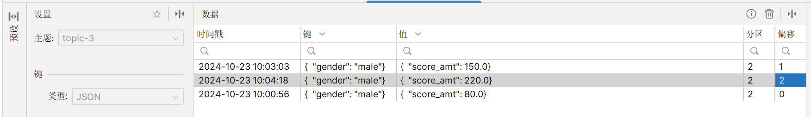

读代码示例

```java
tenv.executeSql("create table tpc_3 (            \n" +
        "    gender string                       \n" +
        "    ,score_amt double                   \n" +
        "    ,primary key(gender) NOT ENFORCED   \n" +
        ") with (                                \n" +
        "    'connector' = 'upsert-kafka',       \n" +
        "    'topic' = 'topic-3',                \n" +
        "    'properties.bootstrap.servers' = 'doitedu01:9092',\n" +
        "    'key.format' = 'json',         \n" +
        "    'value.format' = 'json',       \n" +
        "    'value.fields-include' = 'EXCEPT_KEY'\n" +
        ");   \n");


// 执行查询sql
tenv.executeSql(
        "select * from tpc_3").print();
```

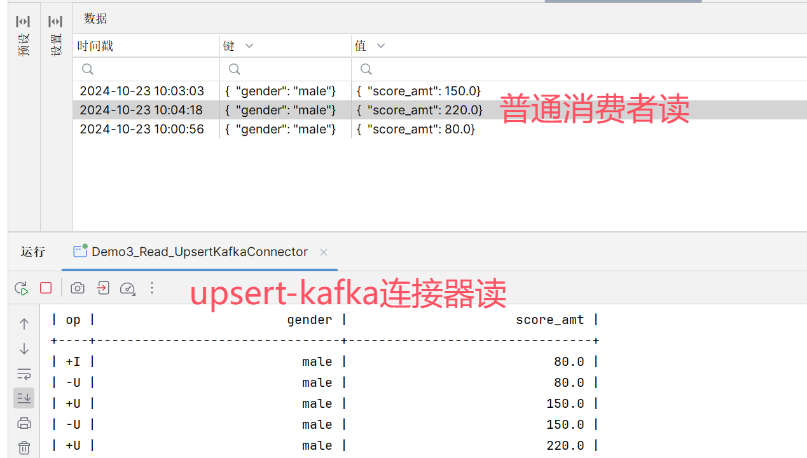


## 3.3 jdbc connector

**功能、特性：&#x20;**

* 用来连接mysql、postgresql、oracle等关系型数据库的；

* 可以利用连接器来读取数据，也可以利用连接器来写出数据；

> 读数据的时候，**它是一次性读取快照**，并不会持续跟踪mysql数据库表中的数据变化；

* 而且，**写出数据的时候，是支持changelog流的(记得声明更新用的主键）**；


**添加依赖**

```xml
<dependency>
  <groupId>org.apache.flink</groupId>
  <artifactId>flink-connector-jdbc</artifactId>
  <version>${FLINK.VERSION}</version>
</dependency>

<!-- jdbc的连接驱动 -->
<dependency>
   <groupId>mysql</groupId>
   <artifactId>mysql-connector-java</artifactId>
   <version>8.0.21</version>
</dependency>
```


**代码示例：写**

```java
// 创建数据源映射表
tenv.executeSql("CREATE TABLE t1                  (\n" +
        "  uid BIGINT,                               \n" +
        "  event_id STRING,                          \n" +
        "  properties MAP<STRING,STRING>,            \n" +
        "  action_time BIGINT,                       \n" +

        "  rt as to_timestamp_ltz(action_time,3),    \n" +
        "  watermark for rt as rt                    \n" +
        ") WITH (                                    \n" +
        "  'connector' = 'kafka',                    \n" +
        "  'topic' = 'ss-1',                         \n" +
        "  'properties.bootstrap.servers' = 'doitedu:9092',\n" +
        "  'properties.group.id' = 'doit44_g1',      \n" +
        "  'scan.startup.mode' = 'latest-offset',    \n" +
        "  'value.format' = 'json',                  \n" +
        "  'value.fields-include' = 'EXCEPT_KEY'     \n" +
        ")");


// 创建目标数据源映射表，映射mysql中的表
tenv.executeSql("CREATE TABLE t2                 ( \n" +
        "  url STRING,                               \n" +
        "  pv  BIGINT,                               \n" +
        "  primary key(url) not enforced             \n" +
        ") WITH (                                    \n" +
        "   'connector' = 'jdbc',                    \n" +
        "   'url' = 'jdbc:mysql://doitedu:3306/flinktest',\n" +
        "   'table-name' = 'jdbc_test',                   \n" +
        "   'username' = 'root',                      \n" +
        "   'password' = 'root'                       \n" +
        ");");

// 普通groupby聚合
tenv.executeSql(
        "INSERT INTO t2             \n" +
         "SELECT                      \n" +
        "    properties['url'] as url,\n" +
        "    count(1) as pv           \n" +
        "FROM t1                      \n" +
        "GROUP BY                     \n" +
        "    properties['url'] ").print();
```


**代码示例：读**

```java
// 创建目标数据源映射表，映射mysql中的表
tenv.executeSql("CREATE TABLE t2                 ( \n" +
        "  id int,                                     \n" +
        "  name  string,                               \n" +
        "  gender  string,                              \n" +
        "  score  double,                              \n" +
        "  primary key(id) not enforced               \n" +
        ") WITH (                                    \n" +
        "   'connector' = 'jdbc',                    \n" +
        "   'url' = 'jdbc:mysql://doitedu:3306/flinktest',\n" +
        "   'table-name' = 'flink_score',                   \n" +
        "   'username' = 'root',                      \n" +
        "   'password' = 'root'                       \n" +
        ");");

tenv.executeSql("select * from t2").print();
```


## 3.4 mysql-cdc 连接器

### 3.4.1 cdc功能概述

> cdc:  capture data change

cdc连接器，可以**持续跟踪mysql中的库、表，并实时捕获表中的数据变更**（新增、更新、删除）

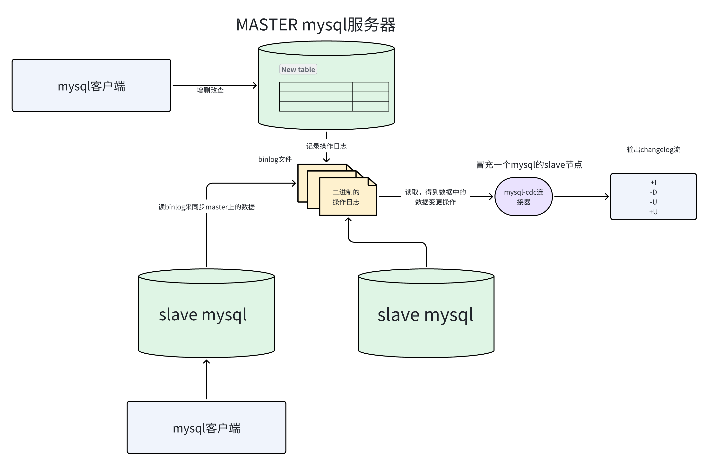


### 3.4.2 使用方法

#### 3.4.2.1 配置mysql数据库开启binlog

```shell
[root@doitedu ~]# vi /etc/my.cnf

server-id=1
log_bin=/var/lib/mysql/mysql-bin.log
expire_logs_days=7
binlog_format=ROW
max_binlog_size=100M
binlog_cache_size=16M
max_binlog_cache_size=256M
relay_log_recovery=1
sync_binlog=1
innodb_flush_log_at_trx_commit=1

```

修改完成后，要重启mysql

```bash
[root@doitedu ~]# systemctl restart mysqld.service
```

重启后，可以在mysql的客户端查询是否生效

```xml
mysql> show variables like 'log_%';
+----------------------------------------+--------------------------------+
| Variable_name                          | Value                          |
+----------------------------------------+--------------------------------+
| log_bin                                | ON                             |
| log_bin_basename                       | /var/lib/mysql/mysql-bin       |
| log_bin_index                          | /var/lib/mysql/mysql-bin.index |
```


#### 3.4.2.2 cdc连接器建表使用

添加依赖

```xml
<!-- https://mvnrepository.com/artifact/com.ververica/flink-connector-mysql-cdc -->
<dependency>
    <groupId>com.ververica</groupId>
    <artifactId>flink-connector-mysql-cdc</artifactId>
    <version>3.0.1</version>
</dependency>

```


建表使用

```java
package cn.doitedu.demo;

import org.apache.flink.streaming.api.CheckpointingMode;
import org.apache.flink.streaming.api.environment.StreamExecutionEnvironment;
import org.apache.flink.table.api.bridge.java.StreamTableEnvironment;

public class MysqlCdc连接器使用 {
    public static void main(String[] args) {

        // 构造stream api 编程的环境
        StreamExecutionEnvironment env = StreamExecutionEnvironment.getExecutionEnvironment();
        env.enableCheckpointing(5000, CheckpointingMode.EXACTLY_ONCE);
        env.getCheckpointConfig().setCheckpointStorage("file:///d:/ckpt");
        env.setParallelism(1);

        // 构造 sql 编程环境
        StreamTableEnvironment tenv = StreamTableEnvironment.create(env);


        // 创建一个mysql-cdc连接器表

        tenv.executeSql("CREATE TABLE score_mysql (\n" +
                "     id INT,                     \n" +
                "     name string,                \n" +
                "     gender STRING,              \n" +
                "     score double,               \n" +
                "     PRIMARY KEY(id) NOT ENFORCED\n" +
                "     ) WITH (                   \n" +
                "     'connector' = 'mysql-cdc', \n" +
                "     'hostname' = 'doitedu',    \n" +
                "     'port' = '3306',           \n" +
                "     'username' = 'root',       \n" +
                "     'password' = 'root',       \n" +
                "     'database-name' = 'flinktest',\n" +
                "     'table-name' = 'flink_score')");

        tenv.executeSql("select * from score_mysql").print();
    }
}
```

读出来的数据结果如下：

```xml
| +I |          12 |                            ppp |                         female |                          666.0 |
| -U |          12 |                            ppp |                         female |                          666.0 |
| +U |          12 |                            ppp |                         female |                          888.0 |
| -D |          12 |                            ppp |                         female |                          888.0 |
```


## 3.5 doris connector

> doris连接器，既可以用于读数据，也可用于写数据，且支持写出changelog流
>
> * 连接器往duplicate表模型中写出changelog流时，结果是保留+I  +U的明细
>
> * 连接器往unique表模型中写出changelog流时，可以完整支持changelog中的update/delete语义


### 示例1：unique表模型-支持changelog的更新语义

* **doris物理表创建**

```java
create table status_amt(
    status int,
    amt decimal(10,2)
)
unique
key(status)
distributed by hash(status) buckets 2
properties(
"replication_allocation" = "tag.location.default: 1"
);
```


* **flinksql代码**

```java
// 建表，映射 mysql-cdc
tenv.executeSql(
                " create table order_cdc(              "+
                "     oid int primary key not enforced,"+
                "     uid int,                         "+
                "     amt decimal(10,2),               "+
                "     create_time timestamp(3),        "+
                "     status int                       "+
                " ) with (                             "+
                "     'connector' = 'mysql-cdc',       "+
                "     'hostname' = 'doitedu01',        "+
                "     'port' = '3306',                 "+
                "     'username' = 'root',             "+
                "     'password' = 'ABC123.abc123',    "+
                "     'database-name' = 'doit50',      "+
                "     'table-name' = 't_order'         "+
                " )                                    "
);


// 建表，映射 doris
tenv.executeSql(
                " create table status_amt_doris(                  "+
                "   status int primary key not enforced,          "+
                "   amt decimal(10,2)                             "+
                " ) with (                                        "+
                "     'connector' = 'doris',                      "+
                "     'fenodes' = 'doitedu01:8030',               "+
                "     'table.identifier' = 'doit50.status_amt',   "+
                "     'username' = 'root',                        "+
                "     'password' = '123456',                      "+
                "     'sink.label-prefix' = 'doris_label'         "+
                " )                                               "
);


// 计算
tenv.executeSql(
                " INSERT INTO status_amt_doris   "+
                " SELECT status,SUM(amt) AS amt  "+
                " FROM order_cdc                 "+
                " GROUP BY status                "
);
```


### 示例2：聚合表模型-自动聚合

> 如果结果流是一个changelog流，那么写入doris时，+U/-U/-D 都会变成 普通数据插入进去（自然就聚合了）
>
> 所以，适用于appendOnly流插入doris做自动聚合；

* **doris物理表**

```java
create table order_ana(
    province varchar(20),
    city varchar(20),
    region varchar(20),
    status int,
    order_cnt bigint  SUM ,
    order_amt decimal(10,2)  SUM,
    user_bm   bitmap  BITMAP_UNION
)
aggregate
key(province,city,region,status)
DISTRIBUTED BY HASH(province) BUCKETS 2
properties(
"replication_allocation" = "tag.location.default: 1"
);
```


* **flinksql代码&#x20;**

> 把具有update语义的changelog流输出到doris聚合表，会把所有语义数据都当成普通数据插入到表中聚合
>
> 因此，使用聚合表模型时，flinksql的结果流最好是appendOnly流

```java
// 建表，映射mysql-cdc
tenv.executeSql(
        "create table order_cdc(             \n" +
        "    oid int,                        \n" +
        "    uid int,                        \n" +
        "    order_amt decimal(10,2),          \n" +
        "    status int ,                     \n" +
        "    province string ,                 \n" +
        "    city     string ,                 \n" +
        "    region   string ,                 \n" +
        "    primary key (oid) not enforced    \n" +
        ") with (                            \n" +
        "    'connector' = 'mysql-cdc',      \n" +
        "    'hostname' = 'doitedu01',       \n" +
        "    'port' = '3306',                \n" +
        "    'username' = 'root',            \n" +
        "    'password' = 'ABC123.abc123',   \n" +
        "    'database-name' = 'doit50',     \n" +
        "    'table-name' = 'order_2'        \n" +
        ")                                   ");

// 建表，映射doris物理表
tenv.executeSql(
        "create table order_ana(                       \n" +
        "    province varchar(20),                     \n" +
        "    city varchar(20),                         \n" +
        "    region varchar(20),                       \n" +
        "    status int,                               \n" +
        "    order_cnt bigint,                         \n" +
        "    order_amt decimal(10,2),                  \n" +
        "    user_id   int                             \n" +
        ") with (                                      \n" +
        "    'connector' = 'doris',                    \n" +
        "    'fenodes' = 'doitedu01:8030',             \n" +
        "    'table.identifier' = 'doit50.order_ana',  \n" +
        "    'username' = 'root',                      \n" +
        "    'password' = '123456',                    \n" +
        "    'sink.label-prefix' = 'doris_label_0'  ,  \n" +
        "    'sink.properties.columns' = 'province,city,region,status,order_cnt,order_amt,user_id,user_bm=to_bitmap(user_id)'\n" +
        ")");


// 执行查询sql
tenv.executeSql("insert into order_ana  \n" +
        "select province,city,region,status, 1 as order_cnt, order_amt,uid as user_id  \n" +
        "from order_cdc");
```


## 3.6 hbase connector

> 项目中用到的时候讲


# 4. 查询sql关键特性

## 4.1 普通 select where 等语法

**按hive语法直觉写！**


## 4.2 普通 group By  聚合查询

我们执行了一个这样的简单的groupBy聚合sql

```sql
SELECT
    properties['url'] as url,
    count(1) as pv
FROM t1
GROUP BY 
    properties['url'] 
```

然后，我们输入一条数据 :  a页面的浏览事件；

它就会马上输出一条结果：

```sql
+----+--------------------------------+----------------------+
| op |                            url |                   pv |
+----+--------------------------------+----------------------+
| +I |                             /a |                    1 |
```

然后，我们又输入一条数据：a页面的浏览事件；

它又会输出如下结果：

```sql
| -U |                             /a |                    1 |
| +U |                             /a |                    2 |
```

> -U代表，之前输出过的一条数据
>
> +U代表，之前那条数据要更新成现在的样子


> 之所以会出现上述现象
>
> 是因为：
>
> flinksql统计的表，其实都是动态表，数据本质上是一个流，是逐条逐条流入的；
>
> 所以flinksql无法像hive一样，看到数据集的全部；
>
> 所以它只能持续读到数据，**持续计算，持续输出结果**；
>
> 这样一来，它输出的结果，就必须被持续地“撤回、更新”；
>
>
>
> 这种包含  -U  +U  -D 操作类型的数据流，在flink的概念中，叫做： **changelog流&#x20;**
>
> * groupBy聚合完的结果流，就是一个changelog流；
>
> * join得到的结果，也是一个changelog流；
>
>
>
>
>
> 而时间窗口类的聚合计算，输出的结果流就不是changelog流；
>
> 为什么？ 因为窗口聚合，计算是发生在窗口触发的时间点，而在此刻，窗口中的数据已经确定了；输出的结果自然是一次性的结果；
>
> 这种不会存在-U +U -D的结果流（只有+I），叫&#x505A;**&#x20; appendOnly流**
>
>


## 3.3 window 时间窗口 聚合查询

> 比如，统计每5分钟的订单总额；（滚动窗口）
>
> 比如，统计最近5分钟的订单数，每分钟更新一次；（滑动窗口）
>
> 比如，统计，每天，从0点累计到当前的订单总额，每分钟更新一次；（累计窗口）


### 4.2.1 测试数据

> 有如下用户行为记录数据

```json
{"uid":1,"event_id":"page_load","properties":{"url":"/a","ref":"/x"},"action_time":1704719574000}
{"uid":1,"event_id":"add_cart","properties":{"url":"/a","item_id":"p01"},"action_time":1704719575000}
{"uid":1,"event_id":"page_load","properties":{"url":"/b","ref":"/a"},"action_time":1704719576000}
{"uid":2,"event_id":"page_load","properties":{"url":"/a","ref":"/x"},"action_time":1704719577000}
{"uid":2,"event_id":"video_play","properties":{"url":"/a","video_id":"v01"},"action_time":1704719578000}
{"uid":2,"event_id":"page_load","properties":{"url":"/b","ref":"/x"},"action_time":1704719579000}

{"uid":1,"event_id":"page_load","properties":{"url":"/c","ref":"/x"},"action_time":1704720581000}

```


### 4.2.2 TUMBLE （滚动时间窗口）

> TVF（Table valued function 表值函数）语法

```sql
SELECT ....
FROM TABLE(
    TUMBLE(TABLE t1,DESCRIPTOR(rt),INTERVAL '5' MINUTE)
)
GROUP BY window_start,window_end
```


> 需求示例：统计每5分钟的uv (user visit)  和  pv（page view)

```java
package cn.doitedu.demo;

import org.apache.flink.streaming.api.CheckpointingMode;
import org.apache.flink.streaming.api.environment.StreamExecutionEnvironment;
import org.apache.flink.table.api.bridge.java.StreamTableEnvironment;

public class 滚动时间窗口 {
    public static void main(String[] args) {

        // 构造stream api 编程的环境
        StreamExecutionEnvironment env = StreamExecutionEnvironment.getExecutionEnvironment();
        env.enableCheckpointing(5000, CheckpointingMode.EXACTLY_ONCE);
        env.getCheckpointConfig().setCheckpointStorage("file:///d:/ckpt");
        env.setParallelism(1);

        // 构造 sql 编程环境
        StreamTableEnvironment tenv = StreamTableEnvironment.create(env);


        // 创建数据源映射表
        tenv.executeSql("CREATE TABLE t1                  (  \n" +
                "  uid BIGINT,                               \n" +
                "  event_id STRING,                          \n" +
                "  properties MAP<STRING,STRING>,            \n" +
                "  action_time BIGINT,                       \n" +

                "  rt as to_timestamp_ltz(action_time,3),    \n" +
                "  watermark for rt as rt                    \n" +
                ") WITH (                                    \n" +
                "  'connector' = 'kafka',                    \n" +
                "  'topic' = 'ss-1',                         \n" +
                "  'properties.bootstrap.servers' = 'doitedu:9092',\n" +
                "  'properties.group.id' = 'doit44_g1',      \n" +
                "  'scan.startup.mode' = 'latest-offset',    \n" +
                "  'value.format' = 'json',                  \n" +
                "  'value.fields-include' = 'EXCEPT_KEY'     \n" +
                ")");


        // 执行查询sql
        tenv.executeSql(
                     " SELECT                                                   "+
                        "   window_start,                                       "+
                        "   window_end,                                         "+
                        "   count(distinct uid) as uv,                          "+
                      //"   count(if(event_id='page_load',1,null)) as pv        "+  // 报错：不能直接使用null
                      //"   sum(if(event_id='page_load',1,0)) as pv             "+  // 可以
                        "   count(1) filter(where event_id='page_load') as pv   "+  // 可以
                      //"   sum(1) filter(where event_id='page_load') as pv   "+    // 可以
                        " FROM TABLE(                                           "+
                        "   TUMBLE(TABLE t1,DESCRIPTOR(rt),INTERVAL '1' MINUTE) "+
                        " )                                                     "+
                        " GROUP BY                                              "+
                        "     window_start,                                     "+
                        "     window_end                                        "
        );

    }
}
```

> 马上练习：统计每5分钟，每个页面的uv和pv

```sql
SELECT                                                
   window_start,                                      
   window_end,   
   properties['url'] as url,   
   count(distinct uid) as uv,                               
   count(1) filter(where event_id='page_load') as pv    
 FROM TABLE(                                          
   TUMBLE(TABLE t1,DESCRIPTOR(rt),INTERVAL '5' MINUTE)
 )                                                    
 GROUP BY                                             
     window_start,                                    
     window_end,
     properties['url']        
```


### 4.2.3 过期窗口聚合语法

**GroupByWindow**，可以支持消费changelog流并正确处理update/delete语义

它的处理规则如下图所示：

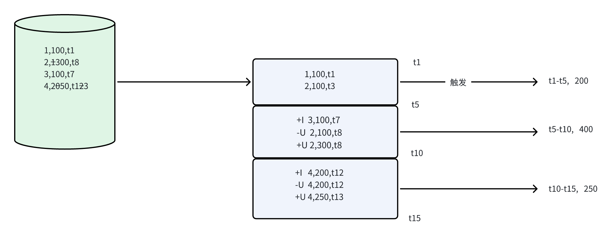

语法示例：

```sql
select                                                    
    tumble_start(rt,interval '5' minute) as window_start, 
    tumble_end(rt,interval '5' minute) as window_end,     
                                                          
    sum(amt) as amt,                                      
    count(distinct uid) as u_cnt                          
                                                          
from order_cdc                                            
group by tumble(rt,interval '5' minute)  
```


### 4.2.4 HOP（滑动窗口）

> TVF 语法

```sql
TABLE(
    HOP(TABLE t1,DESCRIPTOR(rt),INTERVAL '1' MINUTE,INTERVAL '5' MINUTE)    
)
-- 对 t1 用rt开滑动窗口，窗口长度为5分钟，滑动步长为1分钟
```

> 统计最近5分钟的，每个页面的uv和pv，每分钟更新一次

```java
package cn.doitedu.demo;

import org.apache.flink.streaming.api.CheckpointingMode;
import org.apache.flink.streaming.api.environment.StreamExecutionEnvironment;
import org.apache.flink.table.api.bridge.java.StreamTableEnvironment;

public class 滑动时间窗口 {

    public static void main(String[] args) {

        // 构造stream api 编程的环境
        StreamExecutionEnvironment env = StreamExecutionEnvironment.getExecutionEnvironment();
        env.enableCheckpointing(5000, CheckpointingMode.EXACTLY_ONCE);
        env.getCheckpointConfig().setCheckpointStorage("file:///d:/ckpt");
        env.setParallelism(1);

        // 构造 sql 编程环境
        StreamTableEnvironment tenv = StreamTableEnvironment.create(env);


        // 创建数据源映射表
        tenv.executeSql("CREATE TABLE t1                  (\n" +
                "  uid BIGINT,                               \n" +
                "  event_id STRING,                          \n" +
                "  properties MAP<STRING,STRING>,            \n" +
                "  action_time BIGINT,                       \n" +

                "  rt as to_timestamp_ltz(action_time,3),    \n" +
                "  watermark for rt as rt                    \n" +
                ") WITH (                                    \n" +
                "  'connector' = 'kafka',                    \n" +
                "  'topic' = 'ss-1',                         \n" +
                "  'properties.bootstrap.servers' = 'doitedu:9092',\n" +
                "  'properties.group.id' = 'doit44_g1',      \n" +
                "  'scan.startup.mode' = 'latest-offset',    \n" +
                "  'value.format' = 'json',                  \n" +
                "  'value.fields-include' = 'EXCEPT_KEY'     \n" +
                ")");

        // 最近5分钟每个页面的pv，uv，要求每1分钟更新一次
        tenv.executeSql(
                "SELECT\n" +
                "    window_start,\n" +
                "    window_end,\n" +
                "    properties['url'] as url,\n" +
                "    count(distinct uid) as uv,\n" +
                "    count(1) filter(where event_id='page_load') as pv\n" +
                "FROM TABLE(\n" +
                "    HOP(TABLE t1,DESCRIPTOR(rt),INTERVAL '1' MINUTE,INTERVAL '5' MINUTE)\n" +
                ")        \n" +
                "GROUP BY \n" +
                "    window_start,\n" +
                "    window_end,\n" +
                "    properties['url']").print();
    }

}
```


### 4.2.5 CUMULATE（累计窗口）

> TVF 窗口语法

```sql
FROM TABLE(
    CUMULATE(TABLE t1,DESCRIPTOR(rt),interval '1' minute,interval '24' hour)
)

-- 触发周期： 1分钟
-- 窗口最大长度： 24 小时
```


> 统计当天从0点累积到当前的pv、uv，每分钟更新一次
>
> 统计每个页面当天从0点累积到当前的pv、uv，每分钟更新一次


```java
package cn.doitedu.demo;

import org.apache.flink.streaming.api.CheckpointingMode;
import org.apache.flink.streaming.api.environment.StreamExecutionEnvironment;
import org.apache.flink.table.api.bridge.java.StreamTableEnvironment;

public class 累计窗口 {
    public static void main(String[] args) {


        // 构造stream api 编程的环境
        StreamExecutionEnvironment env = StreamExecutionEnvironment.getExecutionEnvironment();
        env.enableCheckpointing(5000, CheckpointingMode.EXACTLY_ONCE);
        env.getCheckpointConfig().setCheckpointStorage("file:///d:/ckpt");
        env.setParallelism(1);

        // 构造 sql 编程环境
        StreamTableEnvironment tenv = StreamTableEnvironment.create(env);


        // 创建数据源映射表
        tenv.executeSql("CREATE TABLE t1                  (\n" +
                "  uid BIGINT,                               \n" +
                "  event_id STRING,                          \n" +
                "  properties MAP<STRING,STRING>,            \n" +
                "  action_time BIGINT,                       \n" +

                "  rt as to_timestamp_ltz(action_time,3),    \n" +
                "  watermark for rt as rt                    \n" +
                ") WITH (                                    \n" +
                "  'connector' = 'kafka',                    \n" +
                "  'topic' = 'ss-1',                         \n" +
                "  'properties.bootstrap.servers' = 'doitedu:9092',\n" +
                "  'properties.group.id' = 'doit44_g1',      \n" +
                "  'scan.startup.mode' = 'latest-offset',    \n" +
                "  'value.format' = 'json',                  \n" +
                "  'value.fields-include' = 'EXCEPT_KEY'     \n" +
                ")");


        // 每天0点累加到当前的pv、uv，每1分钟更新一次
        tenv.executeSql(
                "SELECT\n" +
                "    window_start,\n" +
                "    window_end,\n" +
                "    count(distinct uid) as uv,\n" +
                "    count(1) filter(where event_id='page_load') as pv\n" +
                "FROM TABLE(\n" +
                "    CUMULATE(TABLE t1,DESCRIPTOR(rt),INTERVAL '1' MINUTE,INTERVAL '24' HOUR)\n" +
                ")    \n" +
                "GROUP BY \n" +
                "    window_start,\n" +
                "    window_end").print();

    }
}
```


## 4.3 分组 topn 查询

### 4.3.1 普通分组 topn

> 实时统计，每个页面访问次数最多的前2个用户

```java
package cn.doitedu.demo;

import org.apache.flink.streaming.api.CheckpointingMode;
import org.apache.flink.streaming.api.environment.StreamExecutionEnvironment;
import org.apache.flink.table.api.bridge.java.StreamTableEnvironment;

public class 分组topn计算 {

    public static void main(String[] args) {

        // 构造stream api 编程的环境
        StreamExecutionEnvironment env = StreamExecutionEnvironment.getExecutionEnvironment();
        env.enableCheckpointing(5000, CheckpointingMode.EXACTLY_ONCE);
        env.getCheckpointConfig().setCheckpointStorage("file:///d:/ckpt");
        env.setParallelism(1);

        // 构造 sql 编程环境
        StreamTableEnvironment tenv = StreamTableEnvironment.create(env);


        // 创建数据源映射表
        tenv.executeSql("CREATE TABLE t1                  (\n" +
                "  uid BIGINT,                               \n" +
                "  event_id STRING,                          \n" +
                "  properties MAP<STRING,STRING>,            \n" +
                "  action_time BIGINT                        \n" +
                ") WITH (                                    \n" +
                "  'connector' = 'kafka',                    \n" +
                "  'topic' = 'ss-1',                         \n" +
                "  'properties.bootstrap.servers' = 'doitedu:9092',\n" +
                "  'properties.group.id' = 'doit44_g1',      \n" +
                "  'scan.startup.mode' = 'latest-offset',    \n" +
                "  'value.format' = 'json',                  \n" +
                "  'value.fields-include' = 'EXCEPT_KEY'     \n" +
                ")");


        // 实时统计，每个页面上访问次数最多的前2个用户
        tenv.executeSql(
                "SELECT\n" +
                "    url,\n" +
                "    uid,\n" +
                "    pv,\n" +
                "    rn\n" +
                "FROM (\n" +
                "    SELECT\n" +
                "        url,\n" +
                "        uid,\n" +
                "        pv,\n" +
                "        row_number() over(partition by url order by pv desc) as rn \n" +
                "    FROM \n" +
                "    (\n" +
                "        SELECT\n" +
                "            properties['url'] as url,\n" +
                "            uid,\n" +
                "            count(1) as pv \n" +
                "        FROM t1 \n" +
                "        group by \n" +
                "            properties['url'],\n" +
                "            uid\n" +
                "    ) o1     \n" +
                ") o2    \n" +
                "WHERE rn<=2 ").print();
    }
}
```

> **输出的是一个changelog流结果**


### 3.4.2 窗口分组 topn

> 统计，每5分钟里面，每个页面访问次数最多的前2个用户

```sql
with tmp1 as (
    SELECT
        window_start,
            window_end,
            properties['url'] as url,
            uid,
            count(1) as pv 
    FROM TABLE(
        TUMBLE(TABLE t1,DESCRIPTOR(rt),INTERVAL '5' MINUTE)
    )
    GROUP BY 
        window_start,
            window_end,
            properties['url'],
            uid
),        
tmp2 as (
    SELECT
            window_start,
            window_end,
            url,
            uid,
            pv,
            row_number() over(partition by window_start,window_end,url order by pv desc ) as rn 
    FROM tmp1 
)

SELECT * FROM tmp2 WHERE rn<=2
```

> **输出的是一个appendonly流**


## 4.4 join 关联查询

### 4.4.1 需求准备

#### 测试数据

* 数据源1： kafka topic: ss-1

> 记录用户的面部识别事件

```java
{"uid":1,"event_id":"face_recg","action_time":10000}
{"uid":2,"event_id":"face_recg","action_time":11000}
{"uid":2,"event_id":"face_recg","action_time":12000}
{"uid":3,"event_id":"face_recg","action_time":13000}
{"uid":4,"event_id":"face_recg","action_time":16000}
```


* 数据源2:   kafka topic: ss-2

> 记录用户的面部识别结果状态

```java
{"uid":1,"face_status":1,"ts":11000}
{"uid":2,"face_status":0,"ts":12000}
{"uid":3,"face_status":1,"ts":15000}
{"uid":4,"face_status":1,"ts":18000}
```


#### 建表语句

```java
tenv.executeSql("CREATE TABLE t1                  (\n" +
        "  uid BIGINT                                 \n" +
        "  ,event_id STRING                           \n" +
        "  ,action_time BIGINT                        \n" +
        "  ,rt1 as to_timestamp_ltz(action_time,3)    \n" +
        "  ,watermark for rt1 as rt1                  \n" +
        ") WITH (                                    \n" +
        "  'connector' = 'kafka',                    \n" +
        "  'topic' = 'ss-1',                         \n" +
        "  'properties.bootstrap.servers' = 'doitedu:9092',\n" +
        "  'properties.group.id' = 'doit44_g1',      \n" +
        "  'scan.startup.mode' = 'latest-offset',    \n" +
        "  'value.format' = 'json',                  \n" +
        "  'value.fields-include' = 'EXCEPT_KEY'     \n" +
        ")");

tenv.executeSql("CREATE TABLE t2                  (\n" +
        "  uid BIGINT                                \n" +
        "  ,face_status int                           \n" +
        "  ,ts bigint                                 \n" +
        "  ,rt2 as to_timestamp_ltz(ts,3)             \n" +
        "  ,watermark for rt2 as rt2                  \n" +
        ") WITH (                                    \n" +
        "  'connector' = 'kafka',                    \n" +
        "  'topic' = 'ss-2',                         \n" +
        "  'properties.bootstrap.servers' = 'doitedu:9092',\n" +
        "  'properties.group.id' = 'doit44_g2',      \n" +
        "  'scan.startup.mode' = 'latest-offset',    \n" +
        "  'value.format' = 'json',                  \n" +
        "  'value.fields-include' = 'EXCEPT_KEY'     \n" +
        ")");
```


### 4.4.2  双流join

#### 常规(regular) join （ inner / left / right / full ）

> 常规join中，底层的实现原理是，左右两流的数据都会存储在join算子的状态中
>
> 所以，如果两流的数据量特别大，要注意控制状态的TTL
>
> 当然，能否控制TTL，取决于左右两流能关联上的数据达到时间差有上限

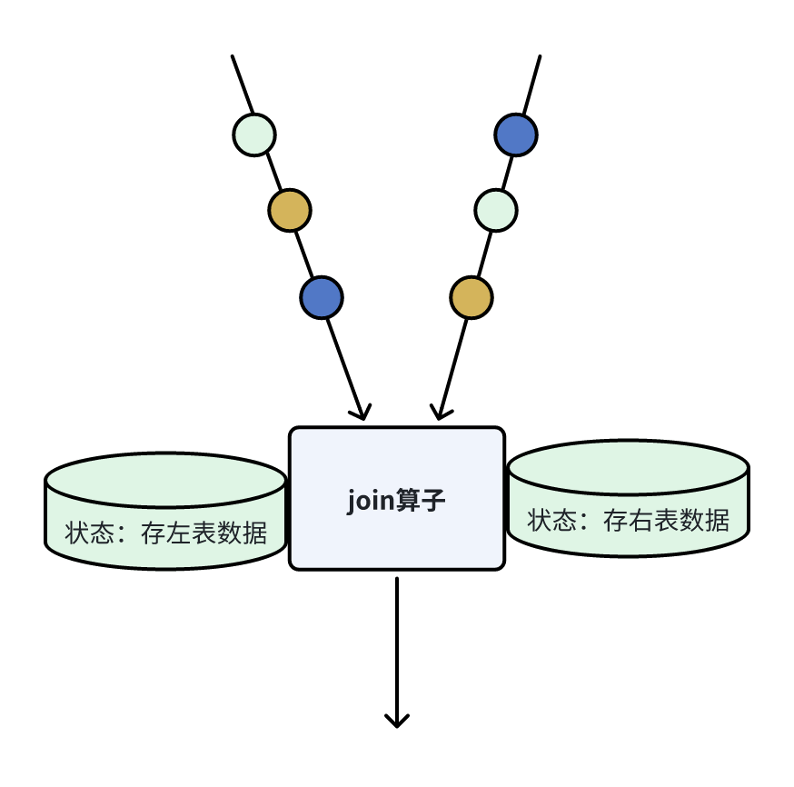

> 因为双流join需要把两个流的数据缓存在状态中，对状态压力很大
>
> 如果两表符合关联条件的数据，到达的时间差固定且不大，就可以用双流join来实现数据关联，但要给状态加一个TTL控制：`table.exec.state.ttl `

```java
// inner join
tenv.executeSql("select * from t1 join t2 on t1.uid=t2.uid").print();  

// left join
tenv.executeSql("select * from t1 left join t2 on t1.uid=t2.uid").print();

// right join
tenv.executeSql("select * from t1 right join t2 on t1.uid=t2.uid").print();

// full join
tenv.executeSql("select * from t1 full join t2 on t1.uid=t2.uid").print();
```


#### window join

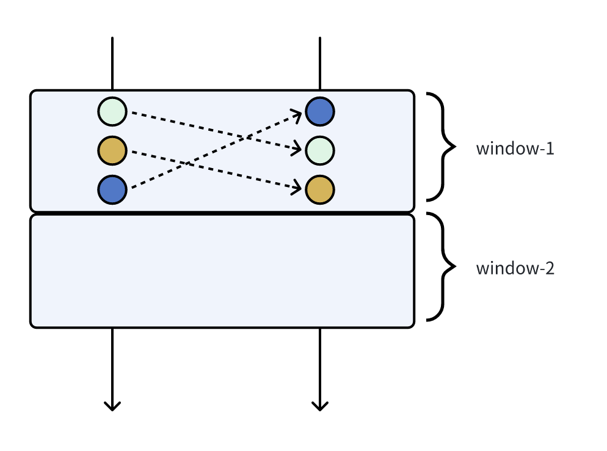

> 按照10s滚动窗口，将用户的面部识别事件记录和他的识别结果记录关联起来

**测试数据**

```sql
-- ss-1:
{"uid":1,"event_id":"face_recg","action_time":11000}
{"uid":2,"event_id":"face_recg","action_time":12000}
{"uid":2,"event_id":"face_recg","action_time":13000}
{"uid":3,"event_id":"face_recg","action_time":14000}
{"uid":4,"event_id":"face_recg","action_time":21000}

-- ss-2:
{"uid":1,"face_status":1,"ts":12000}
{"uid":2,"face_status":0,"ts":13000}
{"uid":3,"face_status":1,"ts":15000}
{"uid":4,"face_status":1,"ts":18000}
{"uid":5,"face_status":1,"ts":21000}
```

**sql代码**

```sql
with tmp1 as (
    select
        window_start,
        window_end,
        uid,
        event_id,
        action_time
    from table(
        tumble(table t1,descriptor(rt1),interval '10' second)
    )
),
tmp2 as (
    select
        window_start,
        window_end,
        uid,
        face_status,
        ts as face_time
    from table(
        tumble(table t2,descriptor(rt2),interval '10' second)
    )
)

select
    tmp1.window_start
    ,tmp1.window_end
    ,tmp1.uid
    ,tmp1.event_id
    ,tmp1.action_time
    
    ,tmp2.uid
    ,tmp2.face_status
    ,tmp2.face_time
from tmp1 join tmp2 
on tmp1.window_start = tmp2.window_start
and tmp1.window_end = tmp2.window_end
and tmp1.uid = tmp2.uid
```

> 输出的是“确定结果流”，即 appendonly流


#### interval join （间隔、范围关联）

> 左表数据可以关联到右表指定时间范围内的数据


> 将面部识别行为  和  前10s及后10s的 识别结果 进行关联

**sql代码**

```sql
select

t1.window_start
,t1.window_end
,t1.uid
,t1.event_id
,t1.action_time
,t2.uid
,t2.face_status
,t2.face_time


from t1 join t2
on t1.uid = t2.uid 
and t1.rt1 between t2.rt2 - interval '10' second 
and t2.rt2 + interval '10' second


from t1 join t2
on t1.uid = t2.uid 
and rt1 >= rt2 - interval '10' second 
and rt1 <= rt2 + interval '10' second


```

> 测试数据

```sql
-- ss-1
{"uid":1,"event_id":"face_recg","action_time":15000}

-- ss-2
{"uid":1,"face_status":1,"ts":3000}
{"uid":1,"face_status":1,"ts":4000}
{"uid":1,"face_status":1,"ts":5000}
{"uid":1,"face_status":1,"ts":6000}
{"uid":1,"face_status":1,"ts":8000}
{"uid":1,"face_status":1,"ts":25000}
{"uid":1,"face_status":1,"ts":26000}
```


#### temporal join（时态join/或 版本join）

##### 基本含义

> \>> 关联 version表 的最新版本数据
>
> 左表数据  关联 截止到这条数据的时间为止的右表最新版数据

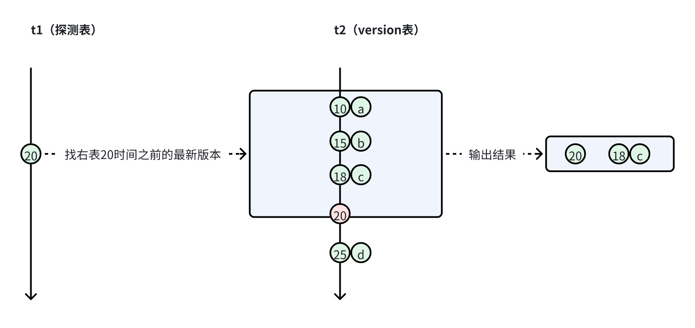

> 所谓version表，是必须是一个有主键的changelog流(update语义)表


##### **sql代码案例**

**代码的需求背景就是： 将用户的面部识别结果，关联到结果产生前的最后一次 “面部识别行为记录”**

> > 把“用户行为记录”作为“版本表 version table ”，放入mysql中

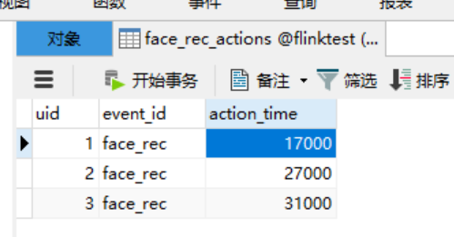


```sql
CREATE TABLE `face_rec_actions` (
  `uid` bigint(20) NOT NULL,
  `event_id` varchar(255) DEFAULT NULL,
  `action_time` bigint(20) DEFAULT NULL,
  PRIMARY KEY (`uid`)
) ENGINE=InnoDB DEFAULT CHARSET=utf8;
```

> 用cdc连接器，读取出来的结果如下： 是一个不断变更的changelog流
>
> ```json
> +----+----------------------+--------------------------------+----------------------+-------------------------+
> | op |                  uid |                       event_id |          action_time |                     rt1 |
> +----+----------------------+--------------------------------+----------------------+-------------------------+
> | +I |                    1 |                       face_rec |                13000 | 1970-01-01 08:00:13.000 |
> | -U |                    1 |                       face_rec |                13000 | 1970-01-01 08:00:13.000 |
> | +U |                    1 |                       face_rec |                14000 | 1970-01-01 08:00:14.000 |
> | -U |                    1 |                       face_rec |                14000 | 1970-01-01 08:00:14.000 |
> | +U |                    1 |                       face_rec |                16000 | 1970-01-01 08:00:16.000 |
> ```

> 把用户面部识别结果记录表，作为“探测表 prob table”（左表），放在kafka中

```sql
{"uid":1,"face_res":1,"ts":26000}
{"uid":2,"face_res":0,"ts":27000}
```


> 代码实现

```java
package cn.doitedu.demo;

import org.apache.flink.streaming.api.CheckpointingMode;
import org.apache.flink.streaming.api.environment.StreamExecutionEnvironment;
import org.apache.flink.table.api.bridge.java.StreamTableEnvironment;

public class Temporal时态关联 {
    public static void main(String[] args) {
        StreamExecutionEnvironment env = StreamExecutionEnvironment.getExecutionEnvironment();
        env.enableCheckpointing(2000, CheckpointingMode.EXACTLY_ONCE);
        env.getCheckpointConfig().setCheckpointStorage("file:///d:/ckpt");
        env.setParallelism(1);

        StreamTableEnvironment tenv = StreamTableEnvironment.create(env);


        // 建表，映射mysql中的 “人脸识别行为记录表”
        // 此案例中，是充当  “版本表”
        tenv.executeSql(
                "create table face_action(\n" +
                "    uid bigint,\n" +
                "    event_id string,\n" +
                "    action_time bigint,\n" +
                "    rt1 as to_timestamp_ltz(action_time,3),\n" +
                "    watermark for rt1 as rt1 ,\n" +
                "    primary key (uid) not enforced\n" +
                ") WITH (                   \n" +
                "'connector' = 'mysql-cdc', \n" +
                "'hostname' = 'doitedu',    \n" +
                "'port' = '3306',           \n" +
                "'username' = 'root',       \n" +
                "'password' = 'root',       \n" +
                "'database-name' = 'flinktest',\n" +
                "'table-name' = 'face_rec_actions'\n" +
                ")");

        // 建表，映射kafka中的ss-2 ： 人脸识别操作的结果流
        tenv.executeSql("CREATE TABLE face_result        (\n" +
                "  uid BIGINT                                \n" +
                "  ,face_status int                           \n" +
                "  ,ts bigint                                 \n" +
                "  ,rt2 as to_timestamp_ltz(ts,3)             \n" +
                "  ,watermark for rt2 as rt2                  \n" +
                ") WITH (                                    \n" +
                "  'connector' = 'kafka',                    \n" +
                "  'topic' = 'a-2',                         \n" +
                "  'properties.bootstrap.servers' = 'doitedu:9092',\n" +
                "  'properties.group.id' = 'doit44_g2',      \n" +
                "  'scan.startup.mode' = 'latest-offset',    \n" +
                "  'value.format' = 'json',                  \n" +
                "  'value.fields-include' = 'EXCEPT_KEY'     \n" +
                ")");


 tenv.executeSql("select\n" +
        "    face_action.uid,\n" +
        "    face_action.event_id,\n" +
        "    face_action.action_time,\n" +
        "    face_result.uid,\n" +
        "    face_result.face_status,\n" +
        "    face_result.ts\n" +
        "\n" +
        "from face_result \n" +  // 探测（prob)表
        "join face_action " + // 版本表
        "for system_time as of face_result.rt2 \n" +  // 指定探测表的 时间语义字段 
        "on face_result.uid = face_action.uid").print();
    }
}
```

> 测试数据

```sql
-- 将此前放在kafka中的ss-2数据，改为放在mysql中；
-- 因此，先在mysql中建表
CREATE TABLE `face_rec_actions` (
  `uid` bigint(20) NOT NULL,
  `event_id` varchar(255) DEFAULT NULL,
  `action_time` bigint(11) DEFAULT NULL,
  PRIMARY KEY (`uid`)
) ENGINE=InnoDB DEFAULT CHARSET=utf8;

-- mysql : face_record ，在mysql中持续更新记录来表示用户在反复尝试人脸识别
{"uid":1,"event_id":"face_recg","action_time":1000}

-- kafka : ss-2
{"uid":1,"face_status":1,"ts":2000}
```


### 4.4.3 lookup join

#### 基本原理

参与join的两个表，其中主表是一个流表（就是用一个连接器源源不断持续读过来的数据流）

另一个表（查找表），它不会被当成一个流表来用，而是一个外部的静态的存储系统；

当主表流中到达一条数据，lookup join算子，就会临时去外部存储中查询它的关联信息；

**所以，lookup join算子，不需要**像双流join那样缓存流的数据到状态；

> **主要应用场景： 维表关联；**

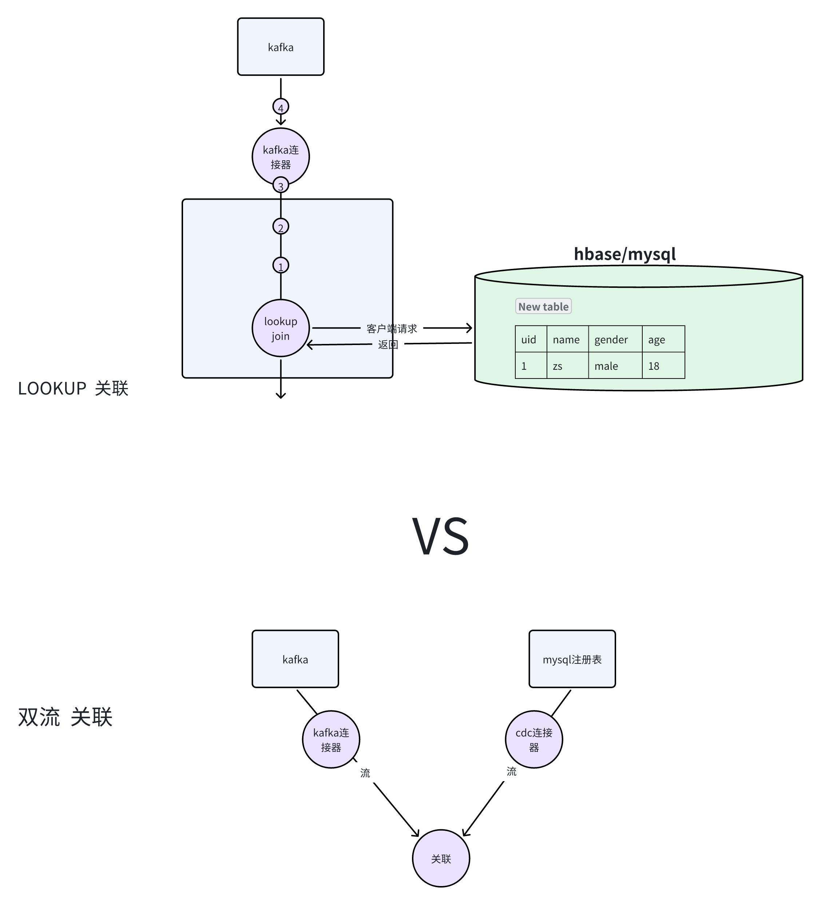


#### 使用示例

**需求：**&#x5C06;用户行为事件数据  关联  用户的注册信息&#x20;

* 用户行为事件，在kafka中

```sql
{"uid":1,"event_id":"page_load","properties":{"url":"/a","ref":"/x"},"action_time":1704719574000}
{"uid":1,"event_id":"add_cart","properties":{"url":"/a","item_id":"p01"},"action_time":1704719574000}
{"uid":1,"event_id":"page_load","properties":{"url":"/b","ref":"/a"},"action_time":1704719574000}
{"uid":2,"event_id":"page_load","properties":{"url":"/a","ref":"/x"},"action_time":1704719574000}
{"uid":2,"event_id":"video_play","properties":{"url":"/a","video_id":"v01"},"action_time":1704719574000}
{"uid":2,"event_id":"page_load","properties":{"url":"/b","ref":"/x"},"action_time":1704719574000}
{"uid":1,"event_id":"page_load","properties":{"url":"/c","ref":"/x"},"action_time":1704719574000}
{"uid":3,"event_id":"item_share","properties":{"url":"/a","item_id":"p03"},"action_time":1704719574000}

```

* 用户注册信息，在mysql数据库中

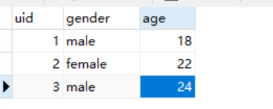


**代码示例**

> Lookup join的等值条件，要求非常严格： 要求两表的关联条件字段类型必须完全一致

```java
package cn.doitedu.demo;

import org.apache.flink.streaming.api.CheckpointingMode;
import org.apache.flink.streaming.api.environment.StreamExecutionEnvironment;
import org.apache.flink.table.api.bridge.java.StreamTableEnvironment;

public class Lookup关联 {

    public static void main(String[] args) {
        StreamExecutionEnvironment env = StreamExecutionEnvironment.getExecutionEnvironment();
        env.enableCheckpointing(2000, CheckpointingMode.EXACTLY_ONCE);
        env.getCheckpointConfig().setCheckpointStorage("file:///d:/ckpt");
        env.setParallelism(1);

        StreamTableEnvironment tenv = StreamTableEnvironment.create(env);


        // 创建连接器表，映射kafka中的ss-1 : 行为日志
        tenv.executeSql("CREATE TABLE user_events          (\n" +
                "  uid int                                \n" +
                "  ,event_id string                           \n" +
                "  ,action_time bigint                        \n" +
                "  ,properties map<string,string>             \n" +
                "  ,pt as proctime()                          \n" +
                ") WITH (                                    \n" +
                "  'connector' = 'kafka',                    \n" +
                "  'topic' = 'a-1',                         \n" +
                "  'properties.bootstrap.servers' = 'doitedu:9092',\n" +
                "  'properties.group.id' = 'doit44_g2',      \n" +
                "  'scan.startup.mode' = 'latest-offset',    \n" +
                "  'value.format' = 'json',                  \n" +
                "  'value.fields-include' = 'EXCEPT_KEY'     \n" +
                ")");


        // 创建jdbc连接器表，映射mysql中的 user_info：用户注册信息表
        tenv.executeSql("CREATE TABLE user_info_mysql       ( \n" +
                "  uid int,                                     \n" +
                "  gender  string,                              \n" +
                "  age  int                                    \n" +
                //"  primary key(uid) not enforced                \n" +
                ") WITH (                                       \n" +
                "   'connector' = 'jdbc',                       \n" +
                "   'url' = 'jdbc:mysql://doitedu:3306/flinktest',\n" +
                "   'table-name' = 'user_info',                   \n" +
                "   'username' = 'root',                      \n" +
                "   'password' = 'root'                       \n" +
                ");");


        // 写一个lookup关联的sql
        tenv.executeSql(
                "select\n" +
                "    a.uid,\n" +
                "    a.event_id,\n" +
                "    a.action_time,\n" +
                "    a.properties,\n" +
                "    b.gender,\n" +
                "    b.age    \n" +
                "from user_events  a  \n" +
                "join user_info_mysql FOR SYSTEM_TIME AS OF a.pt as b  \n" +
                "on a.uid = b.uid").print();

    }
}
```


> 马上练：
>
> 将用户行为日志，关联mysql中的用户注册信息表
>
> 然后统计，每5分钟，各种性别、各页面的uv和pv数


# 5. 内置函数与自定义函数

## 5.1 常用内置函数

> 官方文档

```plain&#x20;text
# 日历时间转绝对时间，然后绝对时间转回日历时间，需要保持一致的时区，否则结果会差N个小时
to_timestamp_ltz(绝对时间,3) 得到日历时间
unix_timestamp('2024-01-20 10:30:25.000 +0800','yyyy-MM-dd HH:mm:ss.SSS +X') 得到绝对时间（unix时间）
```

* 布尔运算函数 : and , or , not&#x20;

* 字符串函数 : substring(), concat() ,trim(),ltrim(),rtrim(),regexp\_extract(),正则匹配,

* 时间函数:to\_date(字符串日期),    to\_timestamp\_ltz(长整数) ,  year(日期) , month(日期), day(日期) ,timestamp\_add(HOUR，时间点，delta )

* 数学函数：abs(数字), sqrt(数字), sin(), cos() , rand(种子) ,rand\_int(上限,种子)

* 条件函数：IF(布尔值,trueValue,falseValue) ， case  when&#x20;

* 聚合函数：sum,  avg,  min,  max&#x20;

* 窗口分析函数：row\_number() over(partition by  ... order by ....)  /  rank() over()  / dense\_rank() over() /ntile( )   over( )


## 5.2 自定义scalar函数

> 官方文档：

> 开发示例：
>
> 将传入的姓名：欧阳娜娜，转换成  欧\*\*娜

```java
// 定义函数实现
public MyUdf extends ScalarFunction{

    public String eval(String name){
   

    }
}

// 注册函数
tenv.createTemporaryFunction("函数名称",MyUdf.class);

```


> 开发示例：&#x20;
>
> 给定任意一个长整数类型时间戳，根据要求返回按1分钟、5分钟、10分钟、30分钟、1小时取整的结果；
>
> 结果要求如下格式："2024-01-10 12:30:40.000"

```java
public static class TimeTruncFunction extends ScalarFunction {

    // 1704719879001
    public String eval(Long action_time, Long intervalMinute) {

        long tmp = intervalMinute * 60 * 1000;
        long truncated = (action_time / tmp) * tmp;

        return DateFormatUtils.format(truncated, "yyyy-MM-dd HH:mm:ss");
    }

}
```


## 5.3 自定义Aggregate函数

> 求平均值案例

```java
public static class AvgAccumulator{
    public int count;
    public double scoreSum;

    public AvgAccumulator(int count, double scoreSum) {
        this.count = count;
        this.scoreSum = scoreSum;
    }

    public AvgAccumulator() {
    }
}


public static class MyAvgFunction extends AggregateFunction<Double,AvgAccumulator>  {

    /**
     * 获取最终结果
     */
    @Override
    public Double getValue(AvgAccumulator accumulator) {
        return accumulator.scoreSum/accumulator.count;
    }

    /**
     * 创建中间聚合数据结构
     */
    @Override
    public AvgAccumulator createAccumulator() {
        return new AvgAccumulator(0,0d);
    }

    /**
     * 单步聚合逻辑
     */
    public void accumulate(AvgAccumulator acc, Double score) {
       acc.count = acc.count+1;
       acc.scoreSum = acc.scoreSum+score;

    }

    /**
     * 当输入数据有-u/+u,就会调用该方法，来对之前的聚合结果做修正
     */
    public void retract(AvgAccumulator acc, Double score) {
       acc.count = acc.count-1;
       acc.scoreSum = acc.scoreSum - score;
    }


    /**
     * 多个局部聚合中间数据结构，合并成一个中间数据结构
     */
    public void merge(AvgAccumulator accumulator, Iterable<AvgAccumulator> it) {

        for (AvgAccumulator acc : it) {
            accumulator.scoreSum += acc.scoreSum;
            accumulator.count += acc.count;
        }

    }

    /**
     * 重置中间数据结构
     */
    public void resetAccumulator(AvgAccumulator acc) {
        acc.count = 0;
        acc.scoreSum = 0;
    }
}
```


# 6. 其他奇奇怪怪的知识

## 6.1 流与表互转

### 6.1.1 流转表

* 流转成表时，需要目标表结构（schema）

* 目标表结构，flink其实可以自动推断

* 当然，我们可以显式指定自定义的表结构

* 自定义表结构时，可以定义除物理字段之外的其他信息（比如 表达式字段，比如 watermark，比如primary key）

> 自动推断表结构


```java

// 把流转成表对象，如果流中的数据类型是javaBean，那么在转表时底层会自动推断出表结构
Table table = tenv.fromDataStream(mappedStream);   // 得到 table api的表对象，后续可以写table api来查询计算
// tenv.fromChangelogStream(mappedStream);   // 这个方法的特点是，把一个changelog流转成 表对象

// 把流转成带名字的“表”（视图），后续可以写sql来查询计算
tenv.createTemporaryView("table_tmp",mappedStream);  // 自动推断表结构 schema
tenv.executeSql("desc table_tmp").print();  // 可以从打印结果中，看到底层已经进行了表结构的自动推断


```

> 手动指定表结构

```java
// 手动指定表结构
tenv.createTemporaryView("table_tmp2",mappedStream,
        Schema.newBuilder()
                .column("id","int not null")  // 类型可以用字符串表达
                .column("name","string not null")
                .column("age",DataTypes.BIGINT())  // 类型也可以用api来表达
                .column("ts",DataTypes.BIGINT())
                .columnByExpression("name_2","upper(name)")
                .columnByExpression("rt","to_timestamp_ltz(ts,3)")
                .watermark("rt","rt - interval '0' second ")
                .primaryKey("id","name")
                .build()
);

tenv.executeSql("desc table_tmp2").print();
```


### 6.1.2 表转流

* appendOnly表，转成appendOnly流

  * 转流时，可以指定目标java类型（Person），得到的流就是指定类型的流（Person）

  * 转流时，如果不指定目标java类型（Person），得到的流就是指Row类型的流；


* changelog表，转成changelog流

  * 只能转成row类型的流

  * *row里面可以取到原来表中的各个字段之外，还能取到row的RowKind:*

    * INSERT("+I",0)

    * UPDATE\_BEFORE("-U",1)

    * UPDATE\_AFTER("+U",2)

    * DELETE("-D",3)


> *一、 appendOnly 表转流*

```java
/**
 * 一、 appendOnly 表转流
 */
Table table = tenv.from("score_kfk");  // 先把 带名字的表，转成  表对象

// 表转流时，指定目标java类型，就自动转成目标类型的流
DataStream<MyBean> dataStream1 = tenv.toDataStream(table, MyBean.class);


// 表转流时，如果不指定目标类型，则得到Row类型的流
DataStream<Row> dataStream2 = tenv.toDataStream(table);
dataStream2.map(new MapFunction<Row, String>() {
    @Override
    public String map(Row row) throws Exception {
        // 从row中获取字段数据
        int user_id = row.getFieldAs("user_id");
        String course = row.getFieldAs("course");

        return null;
    }
});
```

> *二、changelog 表转流*

```java
// 比如，如下查询就会得到一个  changelog 的表： sum_res
tenv.executeSql(
        "create temporary view sum_res as " +
        "select course,sum(score) as score_sum from score_kfk group by course");

// changelog表转流
Table t2 = tenv.from("sum_res");
DataStream<Row> changelogStream = tenv.toChangelogStream(t2);

changelogStream.process(new ProcessFunction<Row, String>() {
    @Override
    public void processElement(Row row, ProcessFunction<Row, String>.Context ctx, Collector<String> out) throws Exception {

        String course = row.getFieldAs("course");
        long score_sum = row.getFieldAs("score_sum");

        // 取本行的 操作类型： -U/+U/+I/-D
        RowKind rowKind = row.getKind();

        if(rowKind.shortString().equals("+I")){
            // TODO
        }

        if(rowKind == RowKind.UPDATE_BEFORE){  // 等价： rowKind.shortString().equals("-U")
            // TODO
        }
    }
});
```


## 6.2 catalog与元数据

flinksql中既然有表的存在，那么就一定有表的元数据管理；

flinksql中有自己的内置元数据管理模块：CatalogManager

> **在CatalogManager中，可以管理多个具体的Catalog**
>
> **其中，GenericInMemoryCatalog是flinksql内默认的基于内存的catalog**

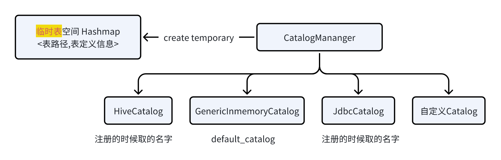


### 6.2.1 GenericInMemoryCatalog

默认使用的就是 GenericInMemoryCatalog；

在flinksql中直接执行  create database db,那么 db 库的信息就存于 GenericInMemoryCatalog 中

在flinksql中直接执行  create table xx，那么xx表的元信息就存于 GenericInMemoryCatalog的default库中；

flink的job一旦结束，那么该job中创建的位于 GenericInMemoryCatalog中的库、表信息就不复存在；


### 6.2.2 HiveCatalog

#### 功能

* 可以将flinksql中创建的表的元数据，持久化保存在hive metastore中；

> 这样就不需要在各个job中反复执行同一个表的建表语句；

* 可以直接访问到hive自身的表元数据；


#### pom添加依赖

```xml
<dependency>
    <groupId>org.apache.flink</groupId>
    <artifactId>flink-connector-hive_2.12</artifactId>
    <version>1.16.1</version>
</dependency>

<!-- 依赖的hive -->
<dependency>
    <groupId>org.apache.hive</groupId>
    <artifactId>hive-exec</artifactId>
    <version>3.1.0</version>
    <exclusions>
        <exclusion>
            <artifactId>hadoop-hdfs</artifactId>
            <groupId>org.apache.hadoop</groupId>
        </exclusion>

        <exclusion>
            <groupId>org.apache.logging.log4j</groupId>
            <artifactId>log4j-slf4j-impl</artifactId>
        </exclusion>
        <exclusion>
            <groupId>org.slf4j</groupId>
            <artifactId>slf4j-log4j12</artifactId>
        </exclusion>
    </exclusions>
</dependency>

<!--依赖的hadoop -->
<dependency>
    <groupId>org.apache.hadoop</groupId>
    <artifactId>hadoop-common</artifactId>
    <version>3.1.0</version>
    <exclusions>
        <exclusion>
            <groupId>org.slf4j</groupId>
            <artifactId>slf4j-log4j12</artifactId>
        </exclusion>
        <exclusion>
            <groupId>org.slf4j</groupId>
            <artifactId>slf4j-log4j12</artifactId>
        </exclusion>
    </exclusions>
</dependency>

<dependency>
    <groupId>org.apache.hadoop</groupId>
    <artifactId>hadoop-client</artifactId>
    <version>3.1.0</version>
</dependency>

<dependency>
    <groupId>org.apache.hadoop</groupId>
    <artifactId>hadoop-hdfs</artifactId>
    <version>3.1.0</version>
</dependency>
```


#### 代码示例

```java
package cn.doitedu.flinksql.demos;

import org.apache.flink.streaming.api.environment.StreamExecutionEnvironment;
import org.apache.flink.table.api.DataTypes;
import org.apache.flink.table.api.Schema;
import org.apache.flink.table.api.TableDescriptor;
import org.apache.flink.table.api.bridge.java.StreamTableEnvironment;
import org.apache.flink.table.catalog.hive.HiveCatalog;

public class Demo5_CatalogDemo {

    public static void main(String[] args) {

        StreamExecutionEnvironment env = StreamExecutionEnvironment.getExecutionEnvironment();

        // 环境创建之初，底层会自动初始化一个 元数据空间实现对象（default_catalog => GenericInMemoryCatalog）
        StreamTableEnvironment tenv = StreamTableEnvironment.create(env);

        // 创建了一个hive元数据空间的实现对象
        HiveCatalog hiveCatalog = new HiveCatalog("hive", "default", "D:\\devworks\\IdeaProjects\\doit30_flink\\conf\\hiveconf");
        // 将hive元数据空间对象注册到 环境中
        tenv.registerCatalog("mycatalog",hiveCatalog);

        tenv.executeSql(
                "create table `mycatalog`.`default`.`t_kafka`    "
                        + " (                                                   "
                        + "   id int,                                           "
                        + "   name string,                                      "
                        + "   age int,                                          "
                        + "   gender string                                     "
                        + " )                                                   "
                        + " WITH (                                              "
                        + "  'connector' = 'kafka',                             "
                        + "  'topic' = 'doit30-3',                              "
                        + "  'properties.bootstrap.servers' = 'doitedu:9092',   "
                        + "  'properties.group.id' = 'g1',                      "
                        + "  'scan.startup.mode' = 'earliest-offset',           "
                        + "  'format' = 'json',                                 "
                        + "  'json.fail-on-missing-field' = 'false',            "
                        + "  'json.ignore-parse-errors' = 'true'                "
                        + " )                                                   "
        );

        tenv.executeSql(
                "create temporary table `t_kafka2`    "
                        + " (                                                   "
                        + "   id int,                                           "
                        + "   name string,                                      "
                        + "   age int,                                          "
                        + "   gender string                                     "
                        + " )                                                   "
                        + " WITH (                                              "
                        + "  'connector' = 'kafka',                             "
                        + "  'topic' = 'doit30-3',                              "
                        + "  'properties.bootstrap.servers' = 'doitedu:9092',   "
                        + "  'properties.group.id' = 'g1',                      "
                        + "  'scan.startup.mode' = 'earliest-offset',           "
                        + "  'format' = 'json',                                 "
                        + "  'json.fail-on-missing-field' = 'false',            "
                        + "  'json.ignore-parse-errors' = 'true'                "
                        + " )                                                   "
        );


        tenv.executeSql("create  view if not exists `mycatalog`.`default`.`t_kafka_view` as select id,name,age from `mycatalog`.`default`.`t_kafka`");


        // 列出当前会话中所有的catalog
        tenv.listCatalogs();

        // 列出 default_catalog中的库和表
        tenv.executeSql("show catalogs").print();
        tenv.executeSql("use catalog default_catalog");
        tenv.executeSql("show databases").print();
        tenv.executeSql("use default_database");
        tenv.executeSql("show tables").print();

        System.out.println("----------------------");

        // 列出 mycatalog中的库和表
        tenv.executeSql("use catalog mycatalog");
        tenv.executeSql("show databases").print();
        tenv.executeSql("use  `default`");
        tenv.executeSql("show tables").print();

        System.out.println("----------------------");

        // 列出临时表
        tenv.listTemporaryTables();
    }
}
```


### 6.2.3 JdbcCatalog

#### 功能

让flinksql可以直接访问mysql中的表；


#### pom添加依赖

```xml
<dependency>
    <groupId>org.apache.flink</groupId>
    <artifactId>flink-connector-jdbc</artifactId>
    <version>1.16.1</version>
</dependency>

<dependency>
    <groupId>mysql</groupId>
    <artifactId>mysql-connector-java</artifactId>
    <version>8.0.33</version>
</dependency>

<!-- 如果报commons-compress相关的冲突问题，则添加如下依赖 -->
<dependency>
    <groupId>org.apache.commons</groupId>
    <artifactId>commons-compress</artifactId>
    <version>1.21</version>
</dependency>
```


#### 代码示例

```java
String name            = "my_catalog";
String defaultDatabase = "flinktest";
String username        = "root";
String password        = "root";
String baseUrl         = "jdbc:mysql://doitedu:3306/";

JdbcCatalog catalog = new JdbcCatalog(HiveCatalogTest.class.getClassLoader(),name, defaultDatabase, username, password, baseUrl);
tenv.registerCatalog("my_catalog", catalog);

tenv.useCatalog("my_catalog");
tenv.executeSql("show tables").print();

tenv.executeSql("select * from flink_score").print();
```


### 6.2.4 temporary与permanent表的区别

> 看源码，一眼明白

```java
public final class CatalogManager implements CatalogRegistry, AutoCloseable {
    private static final Logger LOG = LoggerFactory.getLogger(CatalogManager.class);

    // A map between names and catalogs.
    private final Map<String, Catalog> catalogs;

    // Those tables take precedence over corresponding permanent tables, thus they shadow
    // tables coming from catalogs.
    private final Map<ObjectIdentifier, CatalogBaseTable> temporaryTables;
```

* 永久表上保存在指定的catalog中的；

* temporary表的元数据，不是保存在一个具体的catalog中，而是保存在一个内存hashmap中；程序一结束，表定义信息就不复存在了；


## 6.3 sqlClient工具

sql-client是flink安装包中自带的一个命令行工具，用于快捷方便地进行sql操作

### 6.3.1 启动命令

注意： 首先要启动一个flink session集群 (standalone ，on yarn)

**命令核心参数：**

* -f :  指定初始化sql脚本文件

* -l : 指定要添加的外部jar包所在的文件夹（来加载文件夹中所有的依赖jar）

* -j : 指定一个jar包文件路径来加载这个jar包依赖

* -s : 指定要连接的flink session集群


### 6.3.2 使用示例

* 启动standalone集群：

```sql
$FLINK_HOME/bin/start-cluster.sh
```

* 添加依赖jar包

```java
示例中需要用到 kafka连接器，因此，需要把kafka连接器的jar包，放到flink安装目录的lib中
```

* 启动sql-client：

```sql
[root@doitedu flink-1.16.2]# bin/sql-client.sh -l ./lib/
```

* 执行sql

```sql
CREATE TABLE t1 (
  uid BIGINT,                   
  event_id STRING,              
  properties MAP<STRING,STRING>,
  action_time BIGINT            
) WITH (                        
  'connector' = 'kafka',
  'topic' = 'ss-1',     
  'properties.bootstrap.servers' = 'doitedu:9092',
  'properties.group.id' = 'doit44_g1',  
  'scan.startup.mode' = 'latest-offset',
  'value.format' = 'json',              
  'value.fields-include' = 'EXCEPT_KEY' 
);
```


## 6.4 flinksql中的配置参数

官方文档：&#x20;

> 关于时区

```java
tenv.getConfig().set("table.local-time-zone","Asia/Shanghai");
tenv.executeSql(
 "select to_timestamp_ltz(28800000,3) as ltz,
 unix_timestamp('1970-01-01 08:00:00.000 +0000','yyyy-MM-dd HH:mm:ss.SSS X') as notz")
 .print();
 
 
 +----+-------------------------+----------------------+
| op |                     ltz |                 notz |
+----+-------------------------+----------------------+
| +I | 1970-01-01 16:00:00.000 |                28800 |
+----+-------------------------+----------------------+
```


# 7. **flink sql 原理必知必会**

flink sql是架构于flink core之上，用sql语言方便快捷地进行结构化数据处理的上层库；

（非常类似sparksql和sparkcore的关系）

和sparkSql一样，flinkSql提供了如下两种编程方式

* Table  API 编程

* 纯  SQL编程

## 7.1 **整体架构和工作流程**

> **flink-core中的job执行流程**

* 用户调用api算子，底层生成Transformation链（子transformation会引用父transformation）

* 当执行env.execute()的时候，这些 transformation 会转换成 `StreamGraph`对象

> Graph是一种数据结构：图；
>
> 图是由 点、边组成；&#x20;
>
> StreamGraph中的StreamNode就是点，
>
> 一个点代表一个Operator（算子），
>
> 一个边就是两个点之间的连接关系（源头上哪个点，目的地是哪个点）

* StreamGraph生成之后，会进而生成 JobGraph对象

> JobGraph也是一种图，也是由点、边组成；
>
> JobGraph中点，是用JobVetex类来封装，里面封装了：这个点所代表“算子链”，并行度，这个点该交给哪种类型的StreamTask执行，运算所需的资源等；


* 接下来，客户端就会把JobGraph序列化，发送到集群的jobmanager上的`Dispatcher`模块

* `Dispatcher` 就会为这个Job创建`Jobmaster`，而jobmaster的构造中创建 `Scheduler`，而 Scheduler的构造中会把 JobGraph转成 `ExecutionGraph`；

> ExecutionGraph与前JobGraph的主要区别是：
>
> JobGraph中，一个算子链（或单个算子），就是一个点，代表一个Task；
>
> 而ExecutionGraph中，每一个算子链（`JobVetex`）都会有对应并行度的多个`ExecutionVertex`（每一个 ExecutionVertex代表一个算子链的一个并行度：subTask）；

* scheduler进而把ExecutionGraph中的subTask提交到TaskManager的槽位中执行；


> **Flink-sql 中的job执行流程**

* 将源数据流（数据集），绑定元数据（schema）后，注册成catalog中的表（table、view）；

* 然后通过table Api或者 table sql 来表达计算逻辑；


1. 由table-planner组件利用`apache calcite`进行语法解析，得到**语法树；**

2. **对语法树绑定元数据并校验**得到**逻辑执行计划**，并进行**RBO\[rule based optimize]优化；**

3. 再把优化之后的逻辑执行计划，经过**CBO\[cost based optimize]**&#x4F18;化，转成 **物理执行计划 （FlinkPhysicalNode，携带了转成ExecNode的方法）**

4. 物理计划再转成**Exec计划（节点类型 ExecNode ,携带了生成计算逻辑代码的方法）**

5. 经过代码生成，就得到transformation代码；

6. 后面就是flinkcore的逻辑：transformation转成StreamGraph并进而转成JobGraph后提交到flink集群执行


```java
select
 a.id,
 a.name,
 b.*
from 
(
  select
    id,name
  from (
    select 
      id,name,age,job
     from t1
     where gender='male' 
  )   
  where age>id+10+5
) a  
join  
(
  select 
      id,term,salary
  from t2
  where term in ('doit45','doit46','doit47')
) b
on a.id = b.id  and a.id is not null
```


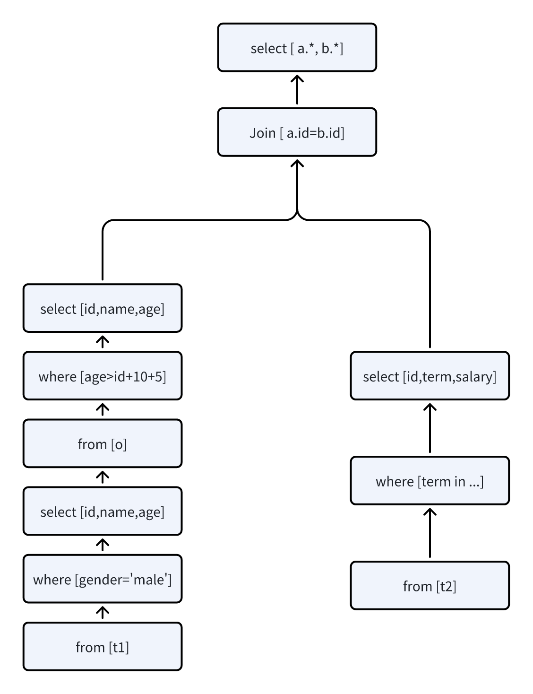


```java
## 语法树的某节点： WhereNode ['age>10']

## 逻辑执行计划的对应节点: FilterNode[ operateField='age', operateType='>',operateValue=10]

## 物理执行计划中的对应节点： FilterOperator (物理执行计划树中的Node封装了各种代码模板）
  [operateField='age', operateType='>',operateValue=10]
  [process(context,out,element){
       operateField field = element.getField( $operateField )
       if( field  $operateType $operateValue  ){
           out.collect(field);
        }
  }]
  
## 代码生成  ：
process(context,out,element){
       operateField field = element.getField( 'age' )
       if( age  > 10 ){
           out.collect(field);
        }
}
```

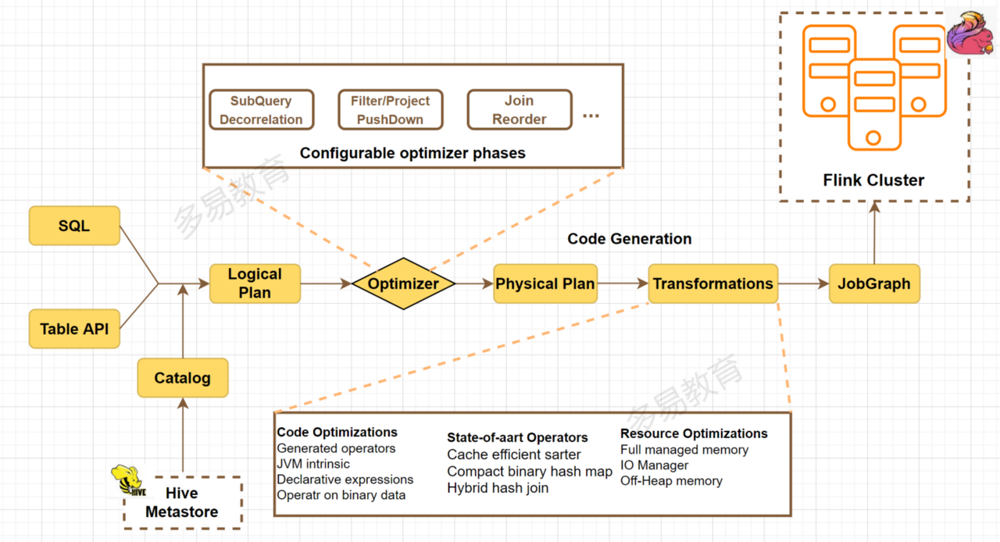


## 7.2 关于执行计划的优化

FlinkSQL中有两个优化器，分别是：RBO（基于规则的优化器）和 CBO（基于代价（成本）的优化器）

* **RBO（基于规则的优化器）**

遍历一系列规则（RelOptRule），只要满足条件就对原来的计划节点（表达式）进行转换或调整位置，生成最终的执行计划。常见的规则包括：

下面是RBO优化示意图举例：

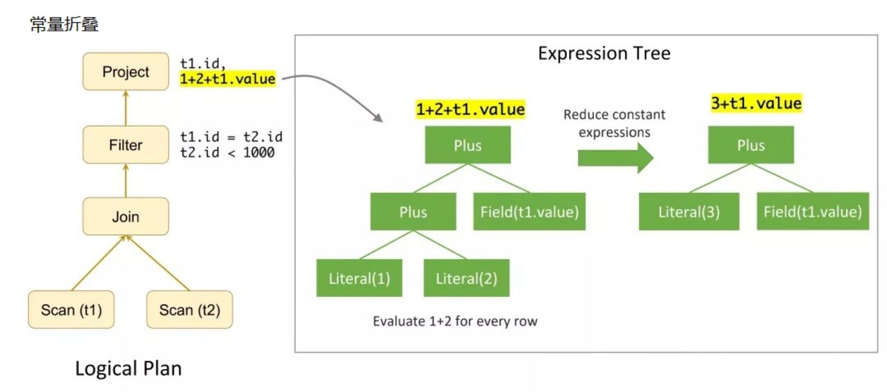


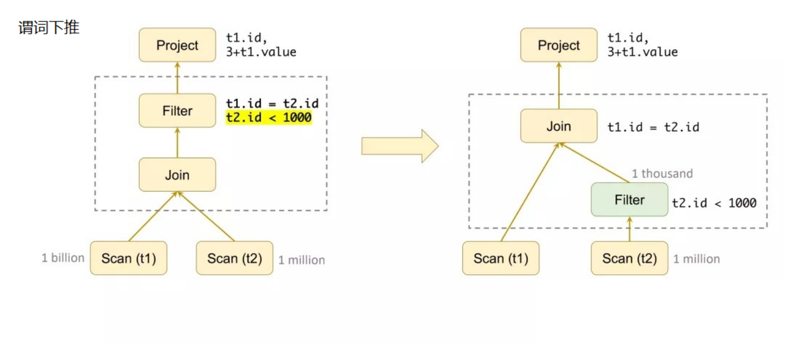


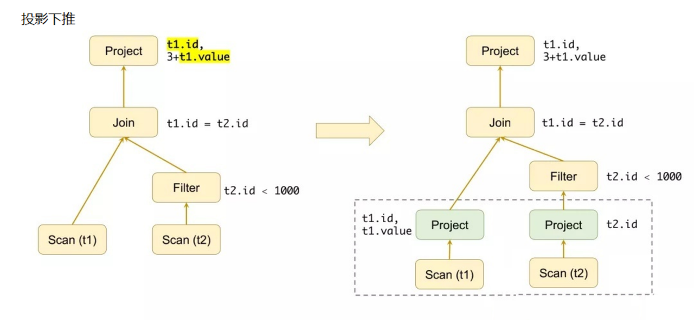


* **CBO（基于代价的优化器）**

会保留原有表达式，基于统计信息和代价模型，尝试探索生成等价关系表达式，最终取代价最小的执行计划。CBO的实现有两种模型，Volcano模型和Cascades模型

这两种模型思想很是相似，不同点在于Cascades模型一边遍历SQL逻辑树，一边优化，从而进一步裁剪掉一些执行计划。

下面是CBO优化示意图举例，根据代价cost选择批处理join有方式(sortmergejoin，hashjoin，boradcasthashjoin)。比如前文中的例子，在filter下推之后，在t2.id<1000的情况下，由1 百万数据量变为了1 千条，计算cost之后，使用broadcasthashjoin最合适。

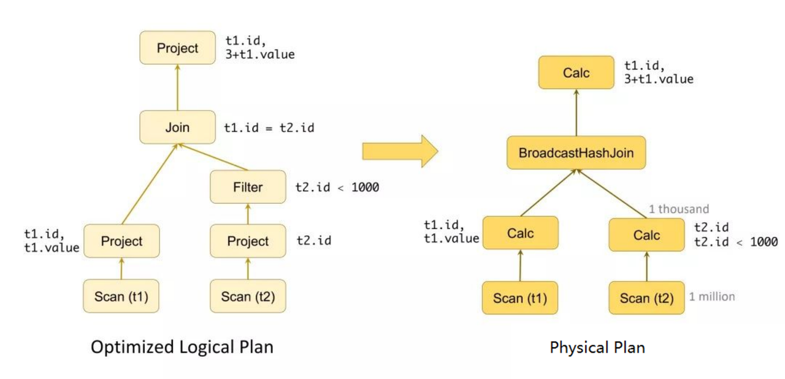

