# 1 大数据简介

* 非技术圈： 时代之光，未来之势

* 技术圈内：针对大规模数据情境下出现的一系列技术、工具、工具套件

* 应用行业：

  * 互联网（电商，媒体，社交，知识……）

  * AI

  * 制造业

  * 农业

  * 电信业

  * 金融业（保险、银行、证券、风投）

  * 交通

  * 政务

  * ……

* 应用领域：各类数据处理；最多的是数仓；


# 2 hadoop简介

hadoop是一个大数据的分布式软件套件（ 或曰：hadoop生态 ）；

其核心组件包含：

* **HDFS**（hadoop distributed file system）：分布式文件系统

* **MAPREDUCE&#x20;**：分布式运算引擎

* **YARN**（ yet another resource negotiator）：分布式资源调度平台

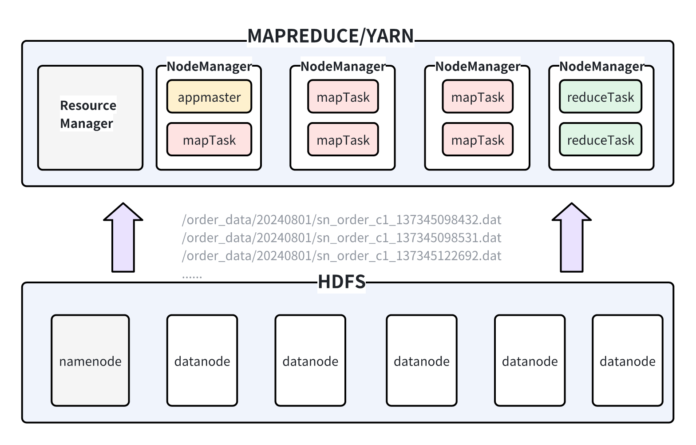


# 3 分布式运算系统的理解

## 3.1 **什么是数据运算**

**数据：**&#x5404;种信息；如用户的订单记录、登录记录、app操作行为记录，银行的转账记录、存款记录、取款记录，仓库的出仓入仓记录，外卖的快递送餐记录，保单的审批流转记录，保单的赔付记录……

**数据怎么来的：&#x20;**&#x20;通常，上述数据，都是在业务系统的业务过程中产生的；

**数据存储的形式：** 内存对象；文件；数据库表；

**数据运算典型3步曲：**&#x8BFB;数据=>运算=>输出结果


比如，有以下json数据，需要计算每个用户的添加购物车行为的次数

```shell
{"release_channel":"360应用市场","device_type":"mi6","session_id":"s01","lat":38.089969323508726,"lng":114.35731900345093,"username":"tiger","eventId":"add_cart","eventTime":1670583693000,"properties":{"url":"/content/article/2354.html?a=3","itemId":"item002"}}
{"release_channel":"360应用市场","device_type":"mi6","session_id":"s02","lat":38.089969323508726,"lng":114.35731900345093,"username":"aewen","eventId":"add_cart","eventTime":1670583694000,"properties":{"url":"/content/article/2354.html?a=3","itemId":"item002"}}
{"release_channel":"360应用市场","device_type":"mi6","session_id":"s02","lat":38.089969323508726,"lng":114.35731900345093,"username":"aewen","eventId":"add_cart","eventTime":1670583696000,"properties":{"url":"/content/article/2356.html?a=3","itemId":"item003"}}
{"release_channel":"360应用市场","device_type":"mi7","session_id":"s03","lat":37.82511891440681,"lng":113.14161086395431,"username":"lion","eventId":"add_cart","eventTime":1670583703000,"properties":{"url":"/mall/2354.html?a=3","itemId":"item002"}}
{"release_channel":"华为应用市场","device_type":"mi7","session_id":"s04","lat":37.82511891440681,"lng":113.14161086396432,"username":"lisi","eventId":"share","eventTime":1670583704000,"properties":{"url":"/mall/promotion/2354.html?a=3","itemId":"item002","share_method":2}}
{"release_channel":"华为应用市场","device_type":"mi8","session_id":"s05","lat":37.82511891440681,"lng":113.14161086396432,"username":"wangwu","eventId":"search","eventTime":1670583943000,"properties":{"url":"/mall/search/2354.html?a=3","keyword":"咖啡"}}

```


## 3.2 **什么是分布式运算**

假如上述案例的数据量很大，比如几百G？几百T？几百P ？

用上面写的java程序解决上述需求，会怎么样？

那该怎么办？用分布式程序来做

变成分布式程序后，虽然还是这个计算需求，但是程序的复杂度呈指数级上升：

* 要考虑任务分片的问题

* 要考虑分布在不同机器上的运算任务程序都能高效、并行读取输入数据的问题

* 要考虑分布式计算可能得到局部结果的问题（得变成两阶段处理）

* 要考虑两阶段之间的数据分发传输问题

* 要考虑并行实例间的工作协调问题

* 要考虑任务怎么提交到集群启动大量分布式运算任务实例的问题

* 作业内的各种程序角色启动流程组织问题

* 要考虑各运算实例状态监控问题

* 要考虑一个作业内各运算task实例的运行资源分配，以及多个作业之间如何分配运算资源的问题

* ……


> 哪怕3.1节中所提的非常简单的一个需求
>
> 一旦变成分布式计算，则整个开发复杂度和难度呈指数级上升


## 3.3 hadoop所提供的解决方案

1. hadoop开发了HDFS分布式文件系统

> 来为各种分布式运算程序实例可以从任意节点来高效、并行读写数据；
>
> 且开箱即用，安装完即可使用


* hadoop开发了mapreduce分布式计算引擎

> 封装了分布式作业提交、运行还有各种作业的角色（mrappmaster、maptask、reducetask）等底层公共功能；
>
> 用户只要编写自己作业的数据计算逻辑，即可获得一个完备的分布式运算作业程序；


* hadoop开发了yarn分布式资源调度系统

> 能统一管理集群所有节点的运算资源
>
> 为用户提交的作业进行合理的资源分配调度
>
> 为用户启动作业中的各种分布式程序实例


# 4 java开发实操小技能补充

## 4.1 简单**java项目打包**

如果对父工程下的所有子工程打包，则在父工程的maven上执行package命令

如果对某个子工程打包，则在目标子工程的maven上执行package命令


## 4.2 **java程序启动命令**

启动java程序的命令是：**java**

启动java程序时需要 ：

* 指定类路径（就是程序运行所需要用到的所有jar包）

* 指定入口程序类名

* 传递入口程序所需的参数

```shell
java   -cp  xx.jar;yy.jar  主类名  main方法参数
```


## 4.3 **有依赖jar的java项目如何运行**

**方式一：瘦jar**

```shell
项目的主jar包，和依赖的所有其他jar包，都要传到服务器
然后在java -cp 命令中指定所有要用到的jar包

通常我们会这么做：
把jar包放在软件安装目录的lib文件夹中
然后写一个启动脚本
脚本中去找到lib内的所有jar文件，并把这些文件的路径拼接成classpath
然后再拼接完整的命令来执行：
     java -cp x.jar:y.jar:z.jar  主类 参数
```

而要想把项目的所有依赖jar收集到 lib 文件夹中，可以借助maven的打包插件，配置示例如下：

```xml
<build>
    <plugins>
        <!--  普通的打包插件，允许指定jar包的主类  -->
        <plugin>
            <groupId>org.apache.maven.plugins</groupId>
            <artifactId>maven-jar-plugin</artifactId>
            <version>3.2.2</version>
            <configuration>
                <archive>
                    <manifest>
                        <mainClass>com.example.MainClass</mainClass> <!-- 替换为你的主类 -->
                    </manifest>
                </archive>
            </configuration>
        </plugin>
        <!--  拷贝依赖jar包到指定目录的插件  -->
        <plugin>
            <groupId>org.apache.maven.plugins</groupId>
            <artifactId>maven-dependency-plugin</artifactId>
            <version>3.1.2</version>
            <executions>
                <execution>
                    <id>copy-dependencies</id>
                    <phase>package</phase>
                    <goals>
                        <goal>copy-dependencies</goal>
                    </goals>
                    <configuration>
                        <outputDirectory>${project.build.directory}/lib</outputDirectory>
                        <includeScope>runtime</includeScope>
                    </configuration>
                </execution>
            </executions>
        </plugin>
    </plugins>
</build>
```

上述的 插件最终形成的打包结果如下：

```xml
target/ 
│ 
├── your-artifact-id-version.jar 
└── lib/     
    ├── dependency1.jar     
    ├── dependency2.jar     
    └── ...
```


最后，在运行程序时，可以使用脚本来把lib下的所有jar包添加到classpath中

```shell
#!/bin/bash

# 拼接类路径
CLASSPATH=$(find ./lib/ -name "*.jar" | paste -sd ":" -)

# 拼接系统的启动命令
java -cp $CLASSPATH top.doe.HelloWorld $1
```


**方式二：&#x20;**

直接把所有依赖的jar包中的类，复制到自己的项目jar包中

```shell
这个工作，利用maven的打包插件就可以完成
```

maven-assembly-plugin配置示例（不需要专门编写src/assembly/assembly.xml配置文件）

```xml
<build>
    <plugins>
        <plugin>
            <groupId>org.apache.maven.plugins</groupId>
            <artifactId>maven-assembly-plugin</artifactId>
            <version>3.4.2</version>
            <configuration>
                <descriptorRefs>
                    <descriptorRef>jar-with-dependencies</descriptorRef>
                </descriptorRefs>
                <archive>
                    <manifest>
                        <mainClass>top.doe.HelloWorld</mainClass> <!-- 替换为你的主类 -->
                    </manifest>
                </archive>
            </configuration>
            <executions>
                <execution>
                    <id>make-assembly</id> <!-- 自定义 ID -->
                    <phase>package</phase> <!-- 在 package 阶段运行 -->
                    <goals>
                        <goal>single</goal>
                    </goals>
                </execution>
            </executions>
        </plugin>
    </plugins>
</build>
```

这种方式的弊端：jar包太大，冗余度大；

> 真实的运行环境中，可能已经拥有你这个程序所依赖的jar包了；


* **将程序放入后台执行**

```shell
语法：
   命令   &
   命令   1>/path 2>/path &
   nohup 命令   1>/path 2>/path &
==> nohup 是表示让进程忽略 系统发出的hup信号；
   
举例：
nohup java -cp demo.jar top.doe.HelloWorld 100 1>/root/my_system/std.log 2>/root/my_system/err.log &
解释：
    * 启动java程序  top.doe.HelloWorld
    * 并放在后台运行  
    * 并把程序的标准输出，重定向到文件 /root/my_system/std.log
    * 并把程序的错误输出，重定向到文件 /root/my_system/err.log
如果程序的这些输出信息不需要保留的话，可以将标准、错误输出重定向到一个特殊文件 /dev/null
nohup java -cp demo.jar top.doe.HelloWorld 100 1>/dev/null 2>&1 &


```


# 5 动手开发一个简单的分布式运算系统

> 小试牛刀： 如果用分布式的方式来实现上述需求，这个程序该怎么写

实现一个完备的分布式运算系统，非常复杂！！

我们通过一个高度简化版本的开发，来理解复杂的分布式系统中的“**底层单元原理”**，有利于理解**上层“组合原理”**

* 客户端程序

* 计算任务逻辑类

* 资源调度服务端

* 逻辑执行类Task


## 5.1 **mapreduce框架开发**

* 开发一个yarnchild来作为mapreduce的计算任务的执行进程（执行具体的处理任务，跟mrappmaster交互）

* yarnchild启动的时候，根据接收的参数，来决定实例化一个MapTask或ReduceTask

* 然后MapTask的主要职责就是负责从指定的外部数据读数据，交给  Mapper接口的用户实现类来处理

* MapTask拿到Mapper实现所处理的结果后，进行输出；

* 还要给用户提供一个提交运行作业的工具类（负责把根据用户提供的信息，把用户作业提交到yarn上去运行或在本地单机运行）

```shell
YarnChild进程类
MapTask任务类
Mapper接口

ReduceTask任务类
Reducer接口

Job工具类
```

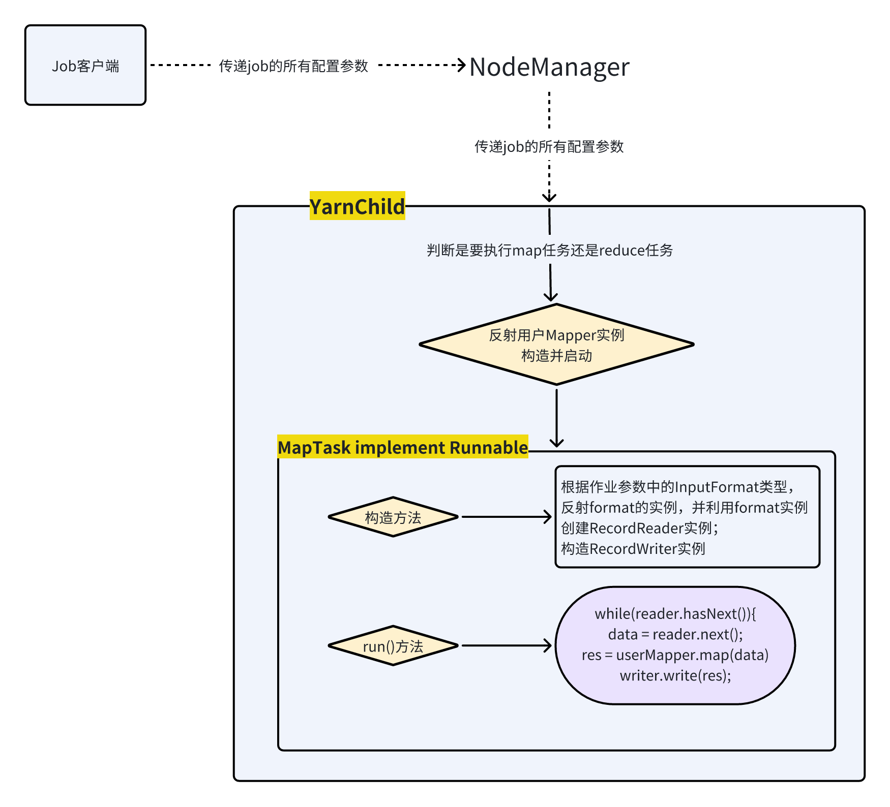


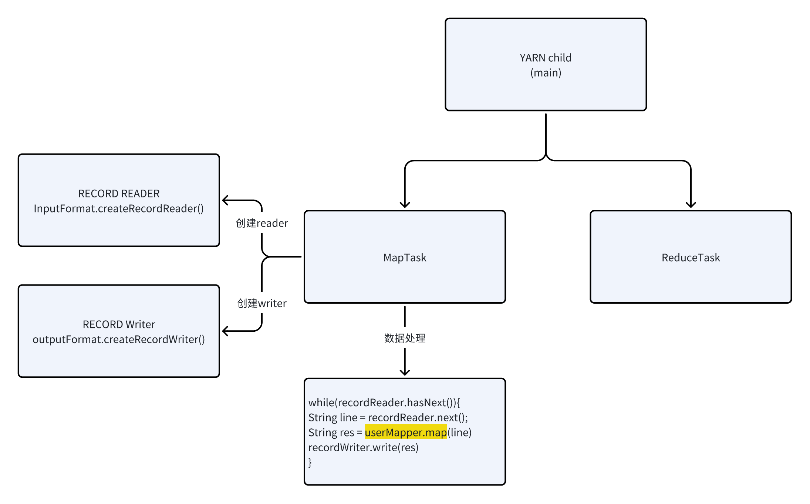


## 5.2 **yarn开发**

开发一个ResourceManager服务程序

> 职责：接收nodemanager的注册，掌控全局资源
>
> 接收客户端的资源请求，提供资源，为作业生成JobId


开发一个Nodemanager服务程序

> 职责：接收用户提交的运行程序的请求，根据用户所需的资源配置，帮用户把程序在资源容器中运行起来

```shell
ResourceManager
    |-- 接收注册并处理的Runnable类 RegisterNodeManagerRunnable
    |-- 响应NM注册的信息封装类 RegisterResponse
    |-- 接收“提交作业请求”并处理的Runnable类 SubmitApplicationRunnable

NodeManager
    |-- NM注册的信息封装类  NodeManagerInfo


```


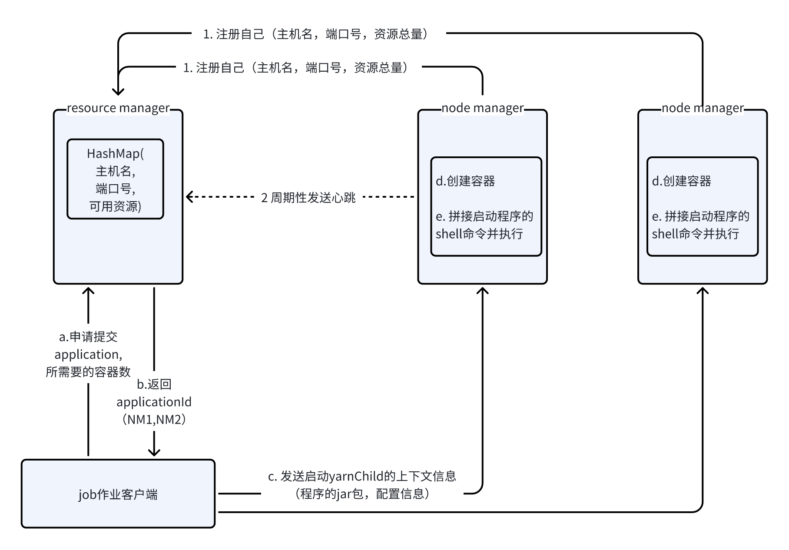


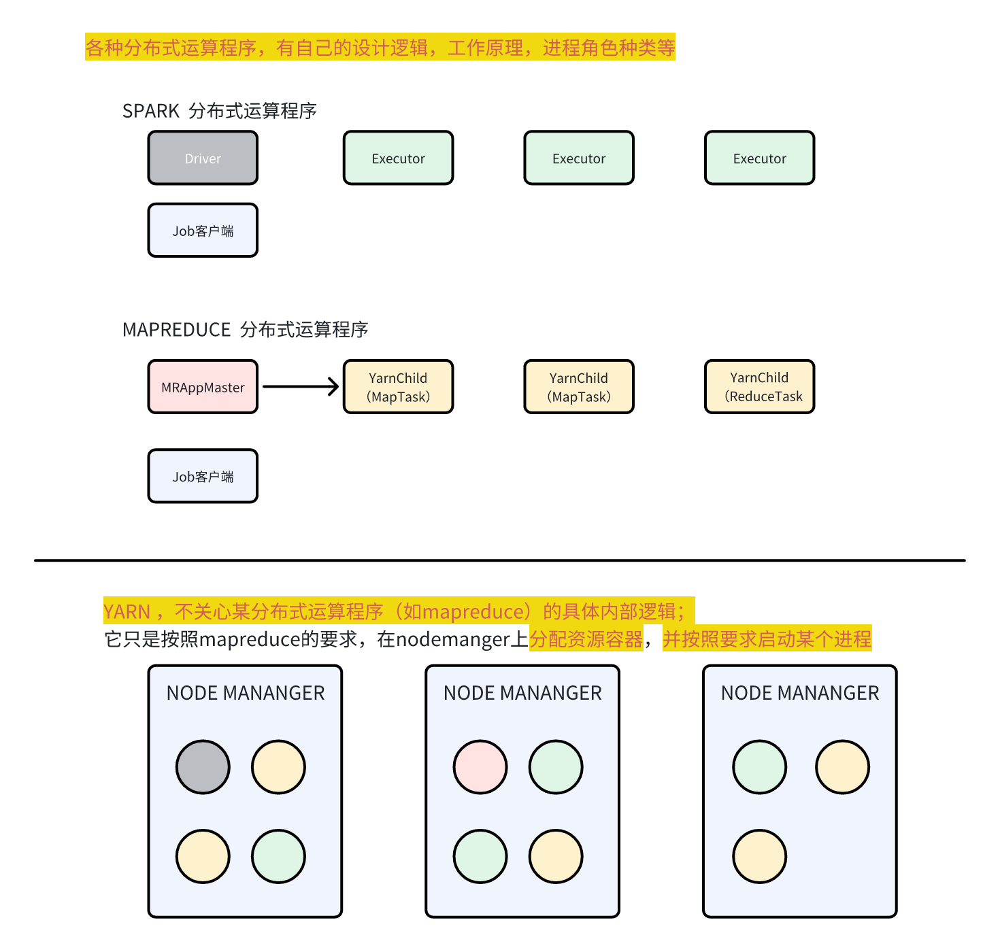


**linux中的cgroup资源限制机制**

```shell
yum install libcgroup libcgroup-tools -y
cgexec --help

mkdir /sys/fs/cgroup/cpu/hitao
mkdir /sys/fs/cgroup/memory/hitao

echo 50000 > /sys/fs/cgroup/cpu/hitao/cpu.cfs_quota_us
echo 268435456 > /sys/fs/cgroup/memory/hitao/memory.limit_in_bytes

cgexec -g cpu,memory:hitao java -cp cg.jar top.doe.CgTask
```


## 5.3 **用户job开发**

* 导入mapduce的依赖

* 实现自己的Mapper接口的实现类

* 实现自己的Reducer接口的实现类

* 利用mapreduce的job工具来提交运行作业；

```shell
XXMapper
XXReducer
main方法类：  利用job工具提交作业
```


# 6 hadoop集群安装

## 6.1 服务器准备

> 初学阶段，准备3台linux服务器
>
> 上道之后，有1台即可


### 6.1.1 **准备一台模板机**

**编辑设备硬件，保留图中所示即可**


### 6.1.2 克隆

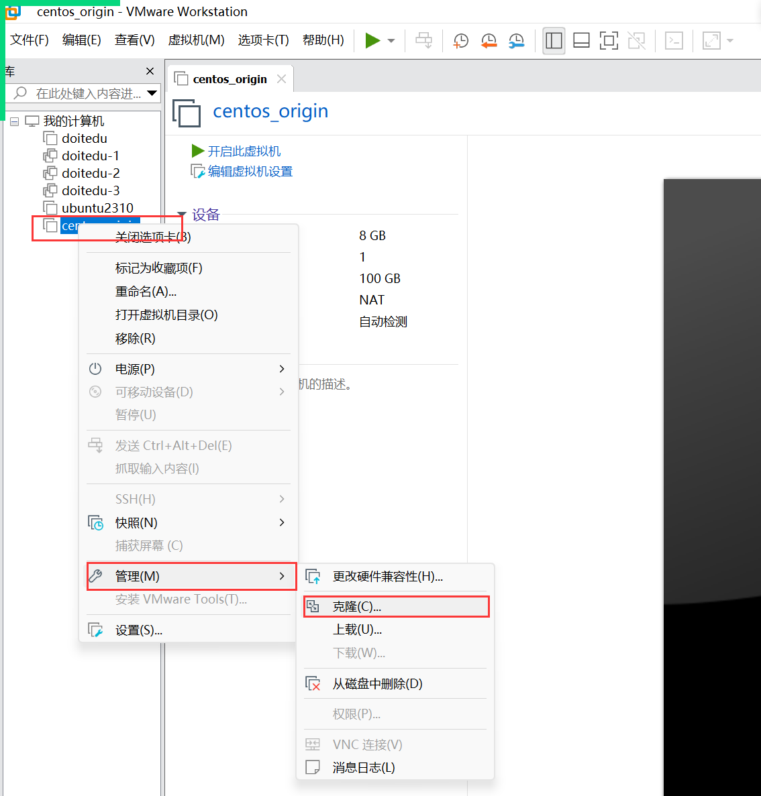


### 6.1.3 **设置虚拟网络的网关**

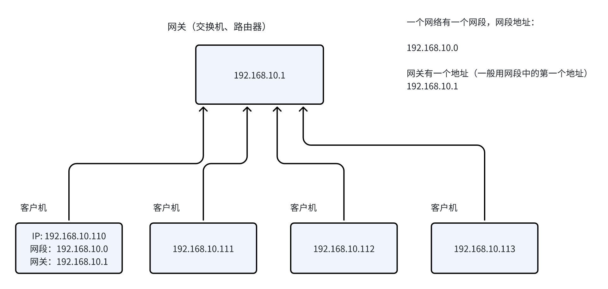


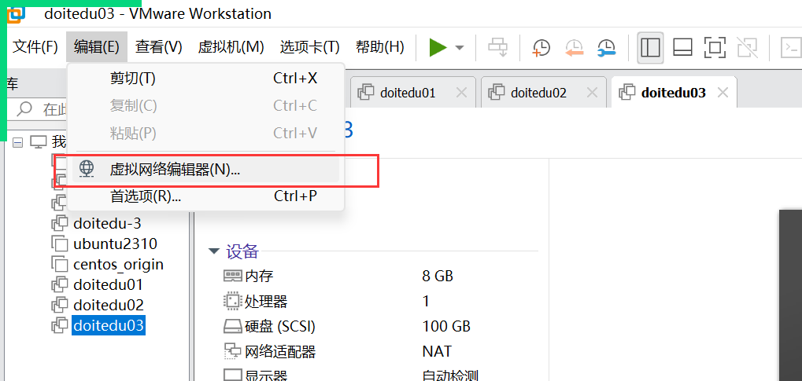


* **设置虚拟网络的网段**

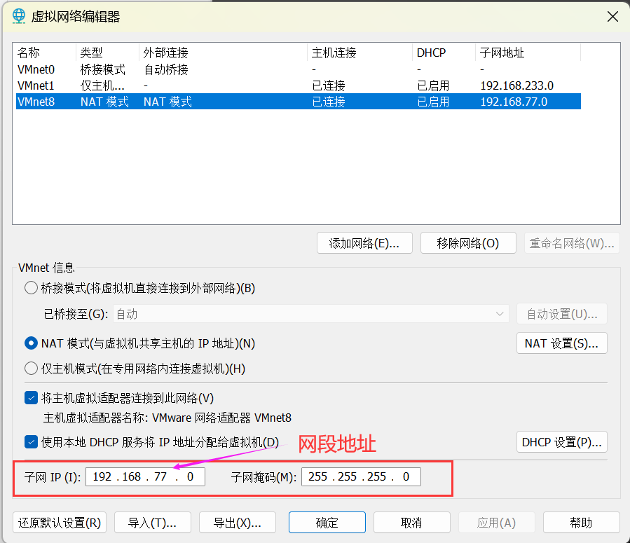

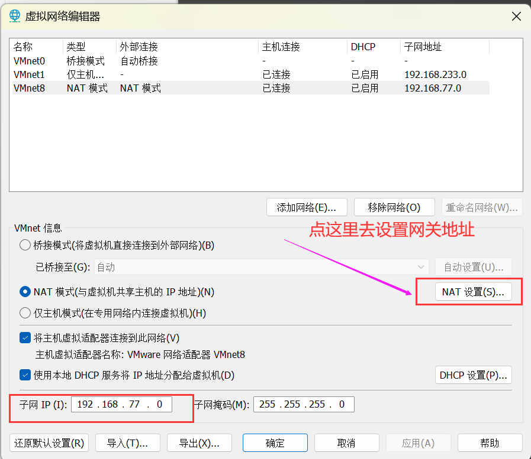

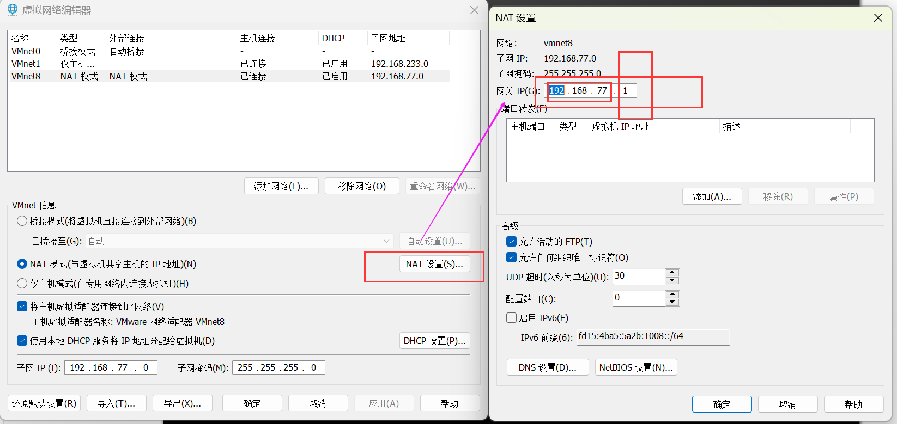


###

### 6.1.4 配置linux的ip

在vmware里面，进入linux操作界面

```bash
vi  /etc/sysconfig/network-scripts/ifcfg-ens33


ONBOOT="yes"
IPADDR="192.168.77.61"
GATEWAY="192.168.77.1"
DNS1="192.168.77.1"
```

### 6.1.5 配置linux的主机名

```bash
vi /etc/hostname
doitedu01
```

### 6.1.6 配置域名映射

```bash
vi /etc/hosts

192.168.77.61    doitedu01
192.168.77.62    doitedu02
192.168.77.63    doitedu03
```


### 6.1.7 设置windows的ip配置


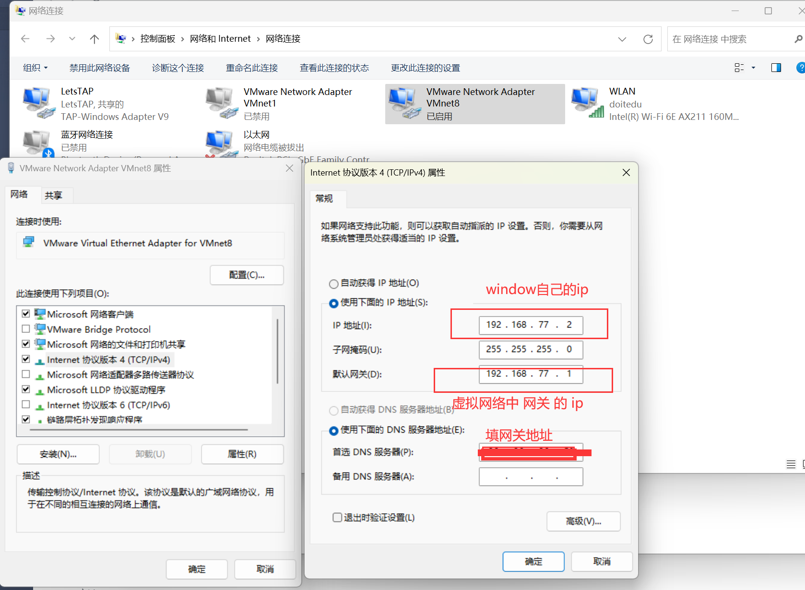


### 6.1.8 配置windows的内部域名映射

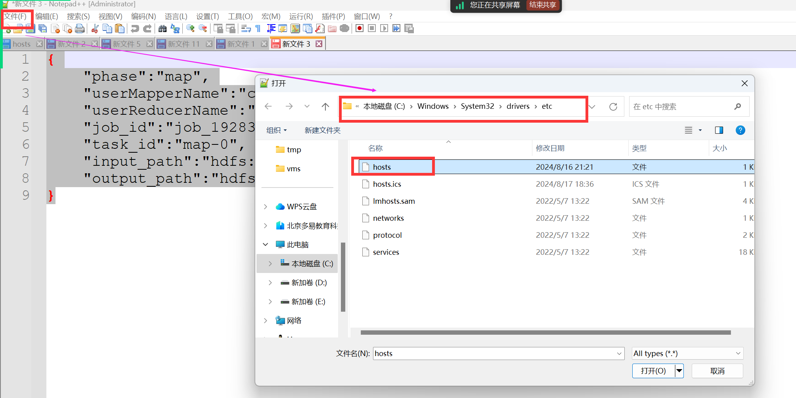


### 6.1.9 **关闭防火墙**

> 在所有服务器上相同进行

```shell
systemctl stop firewalld

systemctl disable firewalld

```


### 6.1.10 **创建hdfs用户**

> 在所有服务器上相同进行

```shell
# 增加用户
useradd hdfs

# 设置密码（注意：输入密码时不回显）
passwd hdfs  
```


### 6.1.11 **免密SSH登录配置**

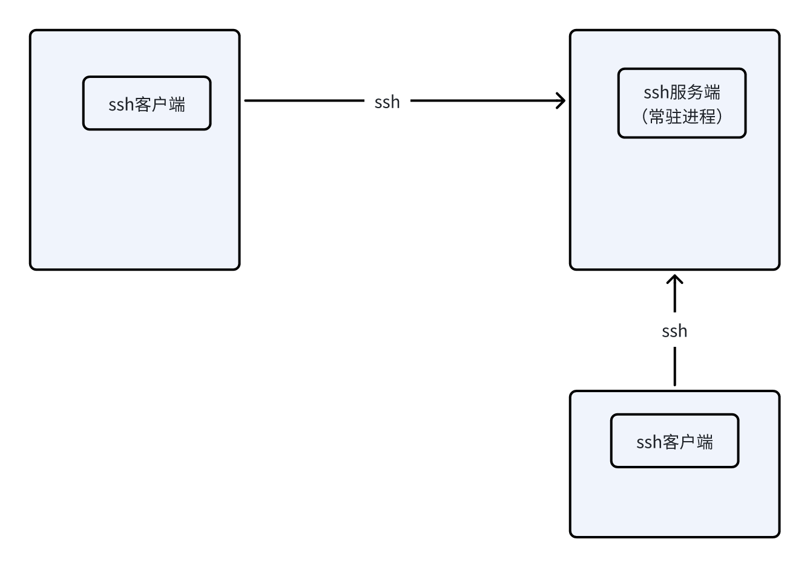


🎈只需要在第一台上配置

* **为root用户配置免密SSH**，到doitedu01上执行如下命令

```shell
# 输入命令后，看提示，一路回车到成功结束
ssh-keygen


# 输入执行如下命令拷贝SSH密钥到目标机器
# 命令执行后注意看提示，按提示： 输yes ，输密码 等
ssh-copy-id doitedu01
ssh-copy-id doitedu02
ssh-copy-id doitedu03
```


* **为hdfs用户配置免密SSH**，到doitedu01上执行如下命令

```shell
# 先切换到hdfs用户 
su - hdfs 

# 生成hdfs用户的密钥
ssh-keygen 


# 然后执行如下命令拷贝SSH密钥到目标机器
ssh-copy-id doitedu01
ssh-copy-id doitedu02
ssh-copy-id doitedu03
```


### 6.1.12 用shell终端去连接登录linux服务器


> 装上hadoop集群后，不要再暴力关电脑，也不要把虚拟机休眠
>
> 正确的步骤是：
>
> 1. 先把linux系统关闭：  shutdown now&#x20;
>
> 2. 再把vmware虚拟机软件关闭
>
> 3. 再关windows


## 6.2 jdk安装

1. 上传jdk压缩包到第一台服务器

2. 在服务器上创建目录： `  mkdir  /opt/app   `

3. 解压jdk安装包到上述目录：  `  tar  -zxf   jdk1.8.0_191.tar.gz  -C  /opt/app/  ` &#x20;

4. 配置系统环境变量：

```shell
# 用vi编辑器打开  /etc/profile
vi /etc/profile

# 在文件最后添加如下内容
export JAVA_HOME=/opt/app/jdk1.8.0_191
export PATH=$PATH:$JAVA_HOME/bin

```

* 检验jdk安装是否成功

```shell
# 先加载系统环境变量
source  /etc/profile

# 然后测试java命令
java -version
```

* 将jdk安装目录，远程同步给其他服务器

```shell
scp -r /opt/app/jdk1.8.0_191  doitedu02:/opt/app/
scp -r /opt/app/jdk1.8.0_191  doitedu03:/opt/app/
```

* 将 /etc/profile 配置文件同步给其他服务器

```shell
scp -r /etc/profile  doitedu02:/etc/
scp -r /etc/profile  doitedu03:/etc/
```


## 6.3 hadoop 安装

1. 上传hadoop压缩包到第一台服务器

2. 解压安装包到/opt/app下 ：   `  tar  -zxf  hadoop-3.1.4.tar.gz  -C  /opt/app/  `&#x20;


* 从hadoop的解压目录中删掉它自带的html文档目录（因为它没用）

&#x20;`rm -rf /opt/app/hadoop-3.1.4/share/doc/`


* **修改配置文件** (📌配置文件都在 $HADOOP\_HOME/etc/hadoop 目录下）

- **core-site.xml**

```xml
<configuration>

    <!-- hadoop的默认文件系统配置，doitedu01是你的hdfs里面的主节点namenode所在的机器  -->
    <property>
        <name>fs.defaultFS</name>
        <value>hdfs://doitedu01:8020/</value>
    </property>

    <!-- 从web页面去访问hdfs时，所用的默认的用户身份  -->
    <property>
        <name>hadoop.http.staticuser.user</name>
        <value>root</value>
    </property>

    <!-- 是否要进行hdfs访问权限的检查  -->
    <property>
        <name>dfs.permissions.enabled</name>
        <value>false</value>
    </property>

    <!-- 以下配置都跟访问权限有关，照着复制粘贴即可  -->
    <property>
        <name>hadoop.proxyuser.root.hosts</name>
        <value>*</value>
    </property>

    <property>
        <name>hadoop.proxyuser.root.groups</name>
        <value>*</value>
    </property>

    <property>
        <name>hadoop.proxyuser.root.users</name>
        <value>hdfs,impala,hive,hbase,yarn</value>
    </property>


</configuration>
```

* **hdfs-site.mxl**

```xml
<configuration>

<property>
<name>dfs.permissions.enabled</name>
<value>false</value>
</property>


<!-- hdfs中存储文件的副本数(（默认是3） -->
<property>
<name>dfs.replication</name>
<value>2</value>
</property>


<!-- hdfs中的datanode在本地磁盘存储数据的路径配置 -->
<property>
<name>dfs.datanode.data.dir</name>
<value>/opt/data/hdpdata/datanode</value>
</property>


<!-- hdfs中的namenode在本地磁盘存储数据的路径配置 -->
<property>
<name>dfs.namenode.name.dir</name>
<value>/opt/data/hdpdata/name</value>
</property>


<!-- hdfs中的secondary namenode在本地磁盘存储数据的路径配置 -->
<property>
<name>dfs.namenode.checkpoint.dir</name>
<value>/opt/data/hdpdata/secname/</value>
</property>


<!-- hdfs中的namenode对外进行rpc通信的端口 -->
<property>
<name>dfs.namenode.rpc-address</name>
<value>doitedu01:8020</value>
</property>

<!-- hdfs中的namenode对外进行http通信的端口 -->
<property>
<name>dfs.namenode.http-address</name>
<value>doitedu01:9870</value>
</property>


<property>
  <name>dfs.namenode.secondary.http-address</name>
  <value>doitedu01:9868</value>
</property>


</configuration>
```

* **yarn-site.xml**

```xml
<configuration>

    <property>
        <name>yarn.resourcemanager.hostname</name>
        <value>doitedu01</value>
    </property>

    <property>
        <name>yarn.nodemanager.aux-services</name>
        <value>mapreduce_shuffle</value>
    </property>

    <property>
        <name>yarn.nodemanager.vmem-check-enabled</name>
        <value>false</value>
    </property>

   <!-- 配置一台nodemanager的可用资源总量 ： 内存 -->
    <property>
        <name>yarn.nodemanager.resource.memory-mb</name>
        <value>8192</value>
    </property>


   <!-- 配置一台nodemanager的可用资源总量 ： cpu -->
    <property>
        <name>yarn.nodemanager.resource.cpu-vcores</name>
        <value>8</value>
    </property>
    
    <property>
        <name>yarn.scheduler.minimum-allocation-mb</name>
        <value>1024</value>
    </property>
    
    <property>
        <name>yarn.scheduler.maximum-allocation-mb</name>
        <value>4096</value>
    </property>

    <property>
        <name>yarn.scheduler.minimum-allocation-vcores</name>
        <value>1</value>
    </property>

    <property>
        <name>yarn.scheduler.maximum-allocation-vcores</name>
        <value>4</value>
    </property>

    <property>
        <name>yarn.cluster.max-application-priority</name>
        <value>10</value>
    </property>
    
</configuration>
```

* **mapred-site.xml**

```xml
<configuration>

<property>
    <name>mapreduce.framework.name</name>
    <value>yarn</value>
</property>

<property>
    <name>yarn.app.mapreduce.am.env</name>
    <value>HADOOP_MAPRED_HOME=/opt/app/hadoop-3.1.4</value>
</property>

<property>
    <name>mapreduce.map.env</name>
    <value>HADOOP_MAPRED_HOME=/opt/app/hadoop-3.1.4</value>
</property>

<property>
    <name>mapreduce.reduce.env</name>
    <value>HADOOP_MAPRED_HOME=/opt/app/hadoop-3.1.4</value>
</property>

<!--
<property>
    <name>mapreduce.reduce.java.opts</name>
    <value>-Xmx3072m</value>
</property>
-->

<property>
    <name>mapreduce.jobhistory.address</name>
    <value>doitedu01:10020</value>
</property>


<property>
    <name>mapreduce.jobhistory.webapp.address</name>
    <value>doitedu01:19888</value>
</property>


</configuration>
```

* hadoop-env.sh

```shell
# 在文件末尾添加
export JAVA_HOME=/opt/app/jdk1.8.0_191
```


* workers配置

```bash
doitedu01
doitedu02
doitedu03
```


* 配置系统环境变量

```shell
vi  /etc/profile

# 添加如下内容后保存（路径啥的根据你自己的情况来替换）
export HADOOP_HOME=/opt/app/hadoop-3.1.4
export PATH=$PATH:$HADOOP_HOME/bin:$HADOOP_HOME/sbin
```

记得修改完系统环境配置后，要执行加载才能生效：

```shell
source /etc/profile
```


* 分发安装包

```bash
scp -r hadoop-3.1.4 doitedu02:/opt/app
scp -r hadoop-3.1.4 doitedu03:/opt/app
```


* 创建hadoop各进程角色要访问的数据目录

```bash
# 每台机器都建
mkdir -p /opt/data/hdpdata/
```


* 初始化（格式化）namenode

```shell
# 在第一台服务器（也就是namenode所在地）
hadoop namenode -format

# 注意看命令执行的控制台输出，是否有错误等
```


* 修改hadoop相关的文件夹的权限

```bash
# 每台机器，修改hadoop安装目录的权限
chmod -R 777 hadoop-3.1.4/
chmod -R 777 /opt/data/hdpdata


```


* 启动HDFS集群

> 不要用root去启动，而用hdfs用户去启动
>
>

```shell
# 在第一台服务器（也就是namenode所在地）
# 先切换到hdfs用户
su - hdfs

# 然后，再
start-dfs.sh
```

* 启动YARN集群

```bash
# 在第一台服务器（也就是namenode所在地）
# 先切换到hdfs用户
su - hdfs

# 然后，再
start-yarn.sh 
```


# 附：一键安装脚本

## 一键安装压缩包

[dist.tar.gz](files/dist.tar.gz)


## 前提准备

1. 准备N台linux服务器,配置好网络（每台服务器的ip地址，主机名，hosts映射）

2. 每节点，创建hdfs用户

3. 为root和hdfs用户配置好从“主节点”到“集群所有机器”的SSH免密登录

4. 每节点关闭防火墙

5. 安装好jdk并配置好环境变量


## 使用方法

1. 将附件中的压缩文件下载，下载后上传到第一台linux服务器上

2. 在linux服务器上解压附件中的压缩包，并进入解压后的目录（dist）

3. 上传一个hadoop的安装包到dist目录

4. 运行一键安装脚本 &#x20;

```shell
 source  install.sh
```

* 安装完成后，可以直接使用hdfs用户启动集群


> 一键安装脚本的代码如下，供参考学习shell脚本编程

```shell
#!/bin/bash

rm -rf /opt/app/hadoop-3.1.4
rm -rf /opt/data/hdpdata
echo "此前的安装目录和数据目录已经删除....."
sleep 2

allhosts=()

echo -n "请输入要安装namenode/resourcemanager的主机名:"
read namenode

echo -n "请输入要安装secondary namenode的主机名:"
read secondarynamenode

allhosts+=("$namenode")
allhosts+=("$secondarynamenode")


hosts=()
while true; do
    # 输出提示信息
    echo -n "请输入要安装datanode主机名 (enter ok to exit):"

    # 读取用户输入的数据
    read input

    # 判断输入是否为2
    if [ "$input" == "ok" ]; then
        echo "Exiting..."
        break
    fi
    
    hosts+=("$input")
    allhosts+=("$input")
    
done


self=$(hostname)

# 主机去重
unique_hosts=($(echo "${allhosts[@]}" | tr ' ' '\n' | sort | uniq))

# 检查环境
for host in "${unique_hosts[@]}"; do
    jdk=$(ssh $host "source /etc/profile;java -version 2>&1" | grep "java version" | wc -l)
    if [ $jdk -ne 1 ]; then 
       echo "从 $self 到 $host 上的免密登录或者jdk环境没有配置好，请检查后重来"
       exit 1
    fi
    
done

echo "所有主机的ssh免密和jdk环境检查通过"


# 本机安装

mkdir -p /opt/app
tar -zxf hadoop-3.1.4.tar.gz -C /opt/app

echo "解压完成" 

rm -rf tmp
mkdir tmp
cp -f conf/* tmp/

sed -i "s/NAMENODE/${namenode}/g" tmp/core-site.xml
sed -i "s/NAMENODE/${namenode}/g" tmp/hdfs-site.xml
sed -i "s/SECONDARY/${secondarynamenode}/g" tmp/hdfs-site.xml
sed -i "s/RESOURCE/${namenode}/g" tmp/yarn-site.xml
sed -i "s/HISTORY/${namenode}/g" tmp/mapred-site.xml
echo "export JAVA_HOME=$JAVA_HOME" >> tmp/hadoop-env.sh


for dn in "${hosts[@]}";do
    echo $dn >> tmp/workers
done


echo "配置文件修改完成"

cp -f tmp/* /opt/app/hadoop-3.1.4/etc/hadoop/


sed -i '/export HADOOP_HOME/d' /etc/profile
echo "export HADOOP_HOME=/opt/app/hadoop-3.1.4" >> /etc/profile
echo 'export PATH=$PATH:$HADOOP_HOME/sbin:$HADOOP_HOME/bin' >> /etc/profile

source /etc/profile
echo "本机配置完成"


echo "格式化......"
hadoop namenode -format 

chown -R hdfs:hdfs /opt/app/hadoop-3.1.4/
chmod -R 777 /opt/app/hadoop-3.1.4/


chown -R hdfs:hdfs /opt/data/hdpdata
chmod -R 777 /opt/data/hdpdata


echo "分发安装包...."

# 删除不需要的文档目录
rm -rf /opt/app/hadoop-3.1.4/share/doc


flag=0
for host in "${hosts[@]}"; do
    let flag++
    if [ $flag -eq 1 ]; then
        # 跳过第一台服务器 
        continue
    fi
    scp -r /opt/app/hadoop-3.1.4 $host:/opt/app/
    ssh $host "chown -R hdfs:hdfs /opt/app/hadoop-3.1.4/"
    ssh $host "chmod -R 777 /opt/app/hadoop-3.1.4/"
    ssh $host "rm -rf  /opt/data/hdpdata"
    ssh $host "mkdir -p /opt/data/hdpdata/data"
    ssh $host "chown -R hdfs:hdfs /opt/data/hdpdata/data"
    ssh $host "chmod -R 777 /opt/data/hdpdata/data"    
done

```

