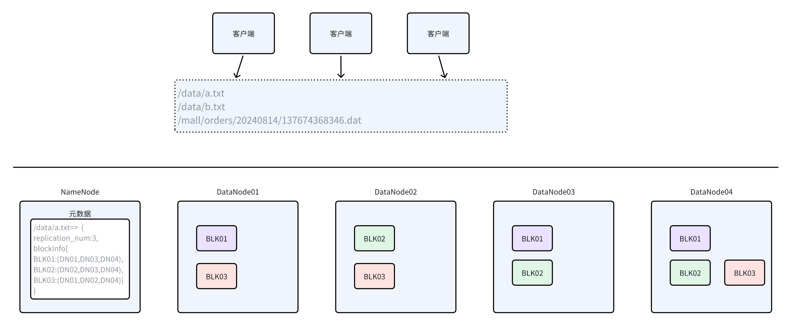
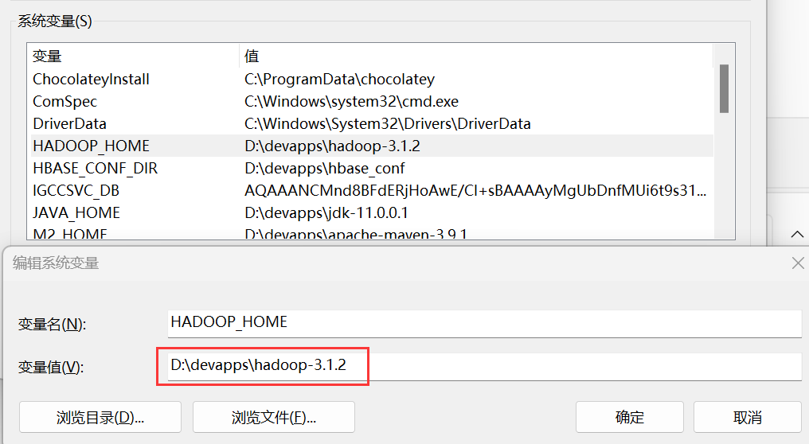
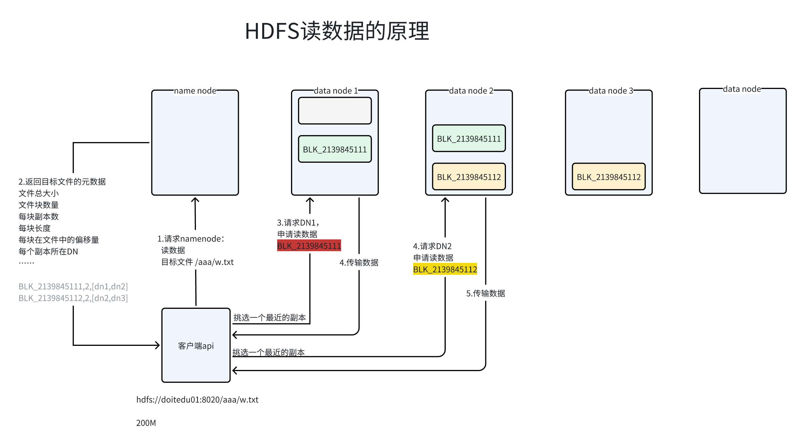
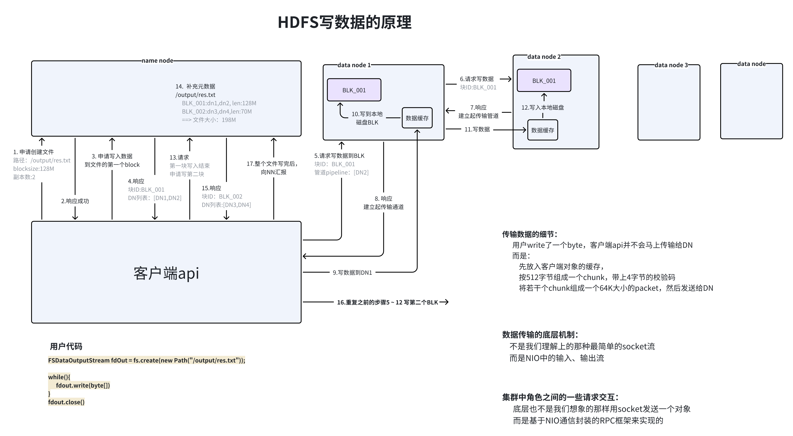
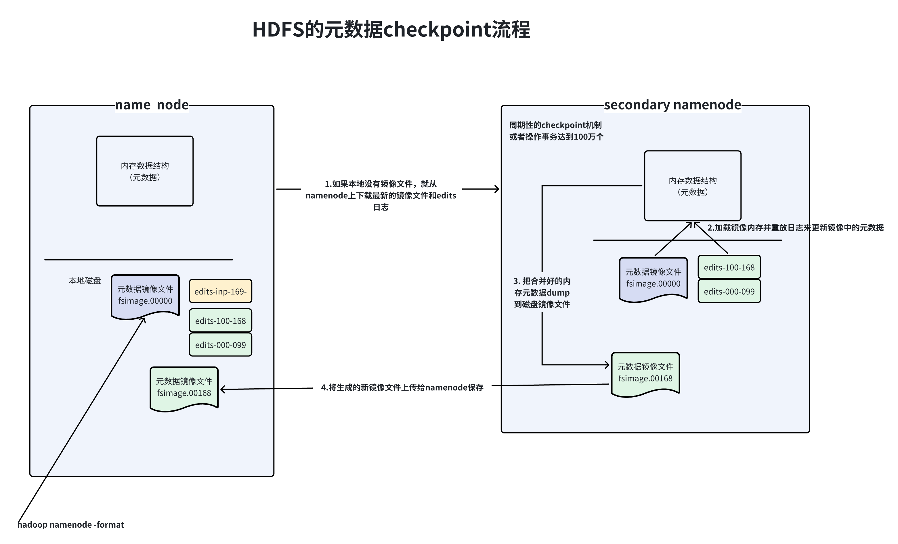
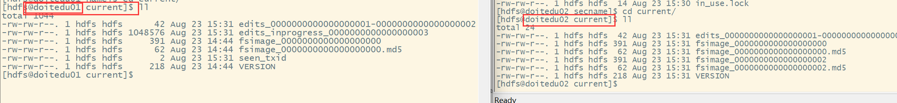
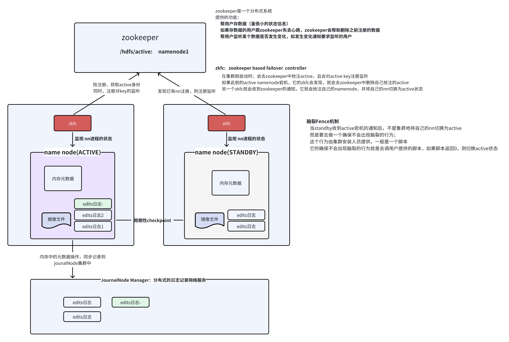

# 1. 架构及概念

> **HDFS：hadoop distributed file system （hadoop分布式文件系统）**

* 首先，它是一个文件系统（就是可以提供文件读写、文件管理操作等功能及元数据管理的系统）

* 其次，它是一个网络文件系统，访问者可从任意网络联通的地方访问到该文件系统

> 任意客户端所访问的都是“同一个”文件系统（也就是可以读写到相同的文件）

* 再次，它一个分布式文件系统（文件会被分成很多个文件块，分散存储在集群的多个节点上）

* 最后，用户不需要了解HDFSD底层的物理存储细节，既能成功读、写文件

```bash
本地文件系统 和 分布式文件系统的 关键区别：
    本地文件系统 是一个 真实的 物理的文件系统
    分布式文件系统  是一套分布式软件系统提供的类似文件系统的功能
```


## 1.2 HDFS整体架构及关键特性

### 整体架构示意图



### 概述

* 文件在HDFS底层，通常是被分块存储的

* 文件的每一个分块，称之为BLOCK（文件块）

* 每个BLOCK，物理上存储在某个datanode节点的本地磁盘目录中

* 每个文件在HDFS可以存储多个副本（也就是文件的每个BLOCK都可以存储多个副本）

* 默认情况下，文件的副本数为3

* 默认情况下，文件按128M大小分块存储；不足128M的部分，也作为一块

> 如：一个文件总共200M，则会被分为两个BLOCK


### 集群的节点角色（服务进程）及其职责

* **Namenode**

负责管理整个文件系统的元数据；

负责集群的负载均衡及其他集群管理任务；

负责响应客户端请求；


* **Datanode**

负责存储文件的block块；

负责接受客户端对block块的读写请求；

负责定期向namenode汇报自身所持有的block信息；


* **Secondary namenode**

充当namenode的元数据的备份角色；

为namenode的元数据镜像文件和操作日志做定期合并更新；


### hdfs的关键特性

* 文件按blocksize，划分成多个block后分布式存储在各datanode上

* 每个block都按replication\_number存储多个副本


* hdfs不适合存储大量小文件

* hdfs不支持对文件的随机写入，只支持追加写入

* hdfs不支持对同一个文件的多客户端并行写入

* hdfs支持对同一个文件的多客户端并行读取

* hdfs擅长一次写入、多次读取的场景

* hdfs不擅长低延迟（如毫秒级）文件读、写场景

* hdfs适合大吞吐率场景下的文件读写，即一次读、写大量数据(GB、TB、PB级)


# 2. 命令行客户端操作

```bash
Usage: hadoop fs [generic options]
        #把一个本地文件的内容，追加到hdfs的某个指定文件
        [-appendToFile <localsrc> ... <dst>]
        
        #打开展示一个文本文件的内容
        [-cat [-ignoreCrc] <src> ...]
        
        #计算一个文件的校验和
        [-checksum <src> ...]
        
        #修改文件的所属组
        [-chgrp [-R] GROUP PATH...]
        
        #修改文件的权限
        [-chmod [-R] <MODE[,MODE]... | OCTALMODE> PATH...]
        
        #修改文件的所属者和所属组
        [-chown [-R] [OWNER][:[GROUP]] PATH...]
        
        #从客户端本地拷贝一个文件到hdfs
        [-copyFromLocal [-f] [-p] [-l] [-d] [-t <thread count>] <localsrc> ... <dst>]
        
        #从hdfs拷贝一个文件到本地
        [-copyToLocal [-f] [-p] [-ignoreCrc] [-crc] <src> ... <localdst>]
        
        #统计一个文件夹下的文件数量
        [-count [-q] [-h] [-v] [-t [<storage type>]] [-u] [-x] [-e] <path> ...]
        
        #从hdfs拷到hdfs
        [-cp [-f] [-p | -p[topax]] [-d] <src> ... <dst>]
        
        #创建快照
        #创建之前需要对目标文件夹开启快照功能： hdfs dfsadmin -allowSnapshot 目标文件夹
        [-createSnapshot <snapshotDir> [<snapshotName>]]
        #删除快照
        [-deleteSnapshot <snapshotDir> <snapshotName>]
        #重命名快照
        [-renameSnapshot <snapshotDir> <oldName> <newName>]        
        
        #查看文件系统的空间使用情况
        [-df [-h] [<path> ...]]
        
        #查看某个目录下的所有文件的总大小
        [-du [-s] [-h] [-v] [-x] <path> ...]
        
        #清空垃圾回收站
        [-expunge [-immediate]]
        
        # 查找文件：按正则表达式查
        [-find <path> ... <expression> ...]
        
        # 类似与copyToLocal  ： 从hdfs拷贝到本地
        [-get [-f] [-p] [-ignoreCrc] [-crc] <src> ... <localdst>]
         # 类似与copyFromLocal  ： 从本地拷贝到hdfs
        [-put [-f] [-p] [-l] [-d] <localsrc> ... <dst>]
        
        # 细粒度设计权限：为某个用户设置
        # 跟chmod的区别:  chmod是对所有者，对所属组，对other
        [-getfacl [-R] <path>]
        [-setfacl [-R] [{-b|-k} {-m|-x <acl_spec>} <path>]|[--set <acl_spec> <path>]]

        # 为文件设置定义的属性（自定义元数据） 
        # hdfs dfs -setfattr -n user.importance -v 'level_a' /yyy.txt
        [-setfattr {-n name [-v value] | -x name} <path>]                
        [-getfattr [-R] {-n name | -d} [-e en] <path>]

        # hdfs dfs -getmerge /some/*  ./mg.txt
        [-getmerge [-nl] [-skip-empty-file] <src> <localdst>]
        
        # hdfs dfs -head /some/1.txt
        [-head <file>]
        # 列出指定目录信息
        [-ls [-C] [-d] [-h] [-q] [-R] [-t] [-S] [-r] [-u] [-e] [<path> ...]]
        
        # 创建文件夹
        [-mkdir [-p] <path> ...]
        
        # 从本地剪切，粘贴到hdfs
        [-moveFromLocal <localsrc> ... <dst>]
        
        # 从hdfs剪切，粘贴到本地
        [-moveToLocal <src> <localdst>]
       
        # 在hdfs内部移动、重命名文件或文件夹
        [-mv <src> ... <dst>]

        # 删除文件或文件
        [-rm [-f] [-r|-R] [-skipTrash] [-safely] <src> ...]
        # 删除空文件夹
        [-rmdir [--ignore-fail-on-non-empty] <dir> ...]
        # 设置指定文件或"文件夹内的所有文件" 副本数
        [-setrep [-R] [-w] <rep> <path> ...]
        # 查看文件信息  
        [-stat [format] <path> ...]
        # 查看文件的尾部 
        [-tail [-f] [-s <sleep interval>] <file>]
        
        # 检查文件的是否符合某种判断
        [-test -[defsz] <path>]
        
        # 打开文件浏览内容，类似 -cat  
        # 跟 -cat 有区别： -text 可以直接查看 gz压缩格式的文件
        [-text [-ignoreCrc] <src> ...]
        
        # 创建一个空文件，如果文件已存在不会失败，但会更新这个文件的最后访问时间
        [-touch [-a] [-m] [-t TIMESTAMP ] [-c] <path> ...]
        
        # 创建一个空文件,如果文件已存在则执行失败
        [-touchz <path> ...]
        
        # 截断文件，保留指定的长度
        [-truncate [-w] <length> <path> ...]
        
        
        [-usage [cmd ...]]
        [-help [cmd ...]]        
        
```


> HDFS开启垃圾回收站功能
> 在core-site.xml中添加如下配置：

```xml
<property>
    <name>fs.trash.interval</name>
    <value>1440</value> <!-- 分钟，每天清空一次垃圾回收站 -->
</property>
```


* 创建文件夹

```bash
hdfs dfs -mkdir -p /wordcount/input
```


* 从客户端本地上传一个文件到HDFS

```bash
hdfs dfs -copyFromLocal ./a.txt /wordcount/input/
```


* 从hdfs拷贝一个文件到本地

```bash
[hdfs@doitedu01 ~]$ hdfs dfs -copyToLocal /wordcount/input/a.txt ./
```


* 删除文件或文件夹

```bash
[hdfs@doitedu01 ~]$ hdfs dfs -rm -r /wordcount/input
```


* 重命名或移动

```bash
[hdfs@doitedu01 ~]$ hdfs dfs -mv /aaaa/cccc/y.txt /wordcount/yyy.txt
```


* 打开文本文件

```bash
[hdfs@doitedu01 ~]$ hdfs dfs -cat /wordcount/yyy.txt
```


* 查找文件

```xml
[hdfs@doitedu01 hadoop]$ hdfs dfs -find / -name "*.txt"
```


# 3. window平台运行测试所需配置

> **window平台练习hadoop的各种api，需要对window本地做一些配置**

1. 把附件下载解压到window的某个目录并解压

[hadoop-3.1.2.zip](files/hadoop-3.1.2.zip)


* 添加环境变量，HADOOP\_HOME




* 添加环境变量，PATH


# 4. 客户端api编程

* 创建客户端对象

```java
Configuration conf = new Configuration();
conf.set("fs.defaultFS","hdfs://doitedu01:8020/");

FileSystem fs = FileSystem.get(conf)
```

* 然后，调用客户端对象所提供的方法

```java
fs.mkdirs(new Path("/mall_data/order_data/20240823"));

// 得到文件的IO输入流
FSDataInputStream in = fs.open(new path("/mall_data/order_data/20240823/log_137235987345.data"));

// 得到文件的IO输出流
FSDataOutputStream out =  fs.create(new Path("/aaa/a.txt"),true);
```


#


# 5. 核心原理机制（流程）

## 5.1 hdfs读数据流程




## 6.2 hdfs写数据流程




## 5.3 HDFS的元数据checkpoint流程





**存在2个缺陷：**


# 6. 高可用模式

## 6.1 概念补充

单节点故障

数据一致性

CAP理论


## 6.2 HDFS的高可用架构(HA: high availability）



> * hdfs的HA模式中，一个集群拥有多个namenode（通常是2个节点）
>
> * 这些namenode节点中，只会有一个处于active状态，并由它对外服务
>
> * 在HA模式中，通过一个组件zkfc（失败切换控制器），借助zookeeper来实现主、备namenode之间失败切换
>
> * 在HA模式中，active namenode会把操作日志记录在一个分布式日志服务系统中
>
> * 当active故障，某个standby被切换成active时，它可以去分布式日志服务器系统读取最新的操作日志来更新自己的元数据，实现与宕机的active的元数据保持一致；


**在高可用模式下，HDFS的地址客户端请求地址就不好确定了，它是这样解决的&#x20;**

1. 集群配置中，会把多个namenode组成一个名称服务nameservices

2. 客户端在指定地址的时候，就通过名称服务的名字来指定了，如

```java
conf.set("fs.defaultFS","hdfs://mycluster/")
```

```java
<property>
<name>dfs.nameservices</name>
<value>mycluster</value>
</property>

<property>
<name>dfs.ha.namenodes.mycluster</name>
<value>nn1,nn2,nn3</value>
</property>


<property>
  <name>dfs.namenode.rpc-address.mycluster.nn1</name>
  <value>doitedu01:8020</value>
</property>
<property>
  <name>dfs.namenode.rpc-address.mycluster.nn2</name>
  <value>doitedu02:8020</value>
</property>
<property>
  <name>dfs.namenode.rpc-address.mycluster.nn3</name>
  <value>doitedu03:8020</value>
</property>

<property>
  <name>dfs.namenode.http-address.mycluster.nn1</name>
  <value>doitedu01:9870</value>
</property>
<property>
  <name>dfs.namenode.http-address.mycluster.nn2</name>
  <value>doitedu02:9870</value>
</property>
<property>
  <name>dfs.namenode.http-address.mycluster.nn3</name>
  <value>doitedu03:9870</value>
</property>
```


# 7. 常见面试题

* hdfs写操作

* 读写流程

* Hadoop三副本机制，讲一下以及怎么存放的

* 副本机制

> 一个文件块，会有多个副本（默认是3个）
>
> 一个文件块的多个副本，会分别存在不同的datanode上
>
> 一个文件块究竟选择哪些dsatanode来存放副本，是由namenode决定的
>
> namenode在挑选datanode时，有一个基本原则：尽量分散存储（选1个本机架的，然后选2个别的机架的）


* hdfs原理

* hdfs的进程有哪些 分别起到什么作用


* hdfs怎么查看文件是否存在

```java
hdfs dfs -test -z /aa/bb/c.txt
或
hdfs dfs -ls /aa/bb/c.txt
```


* hdfs删除命令

```java
hdfs dfs -rm -r  /aa/bb
```


