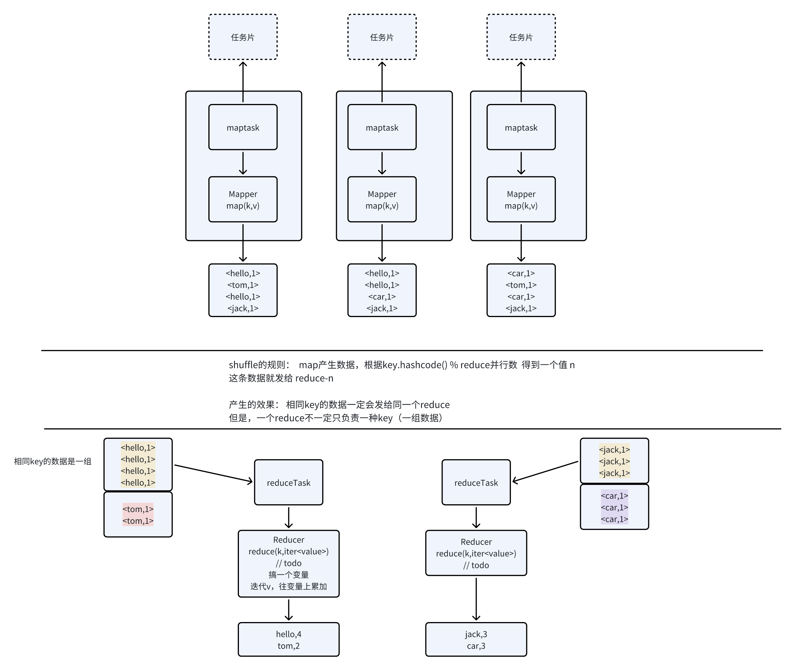
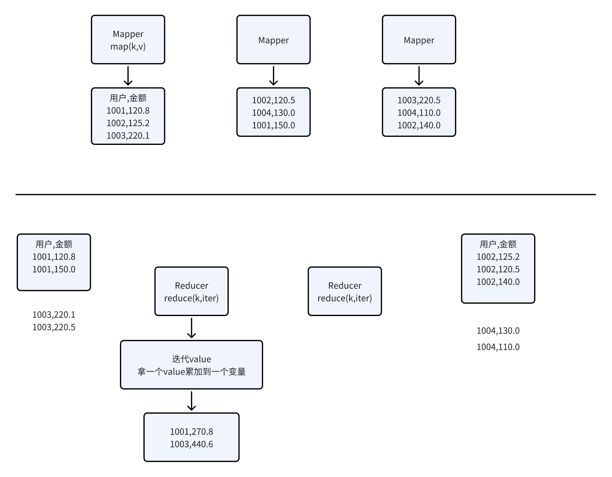
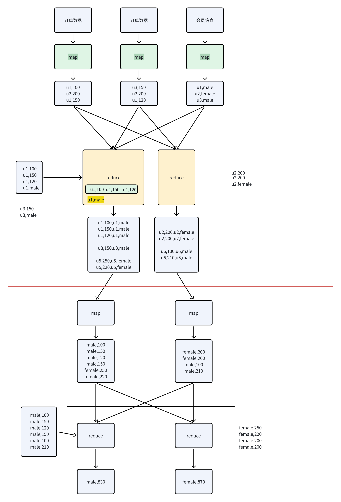
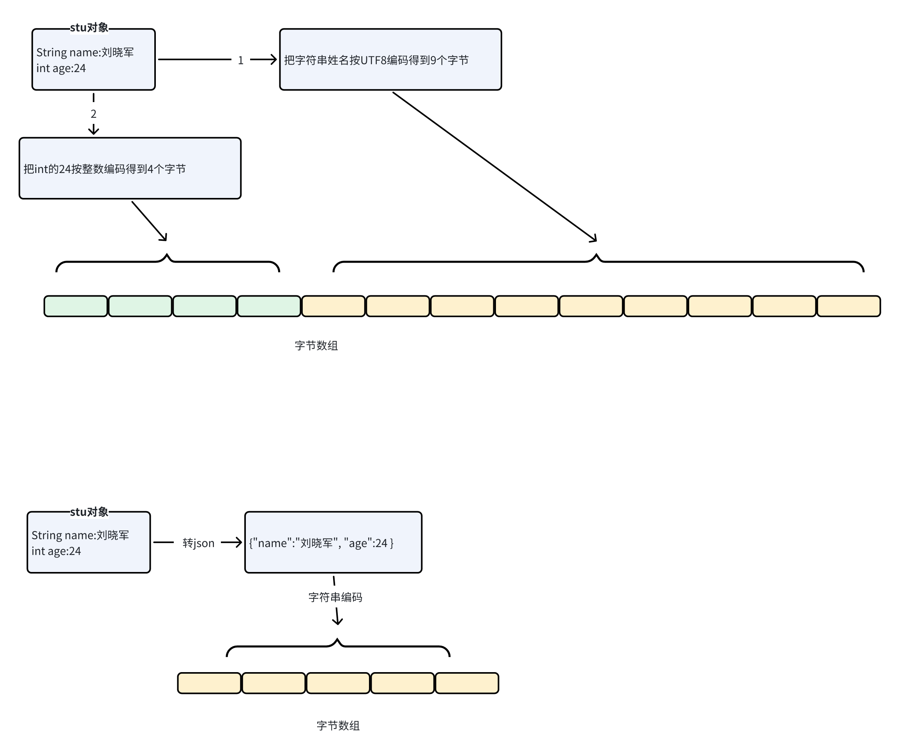
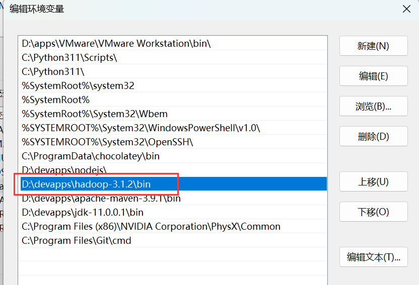
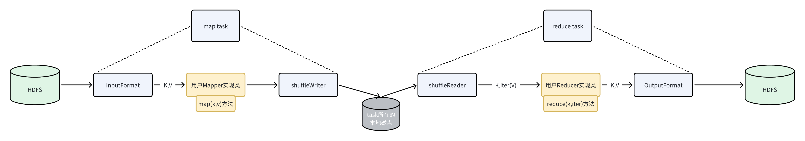
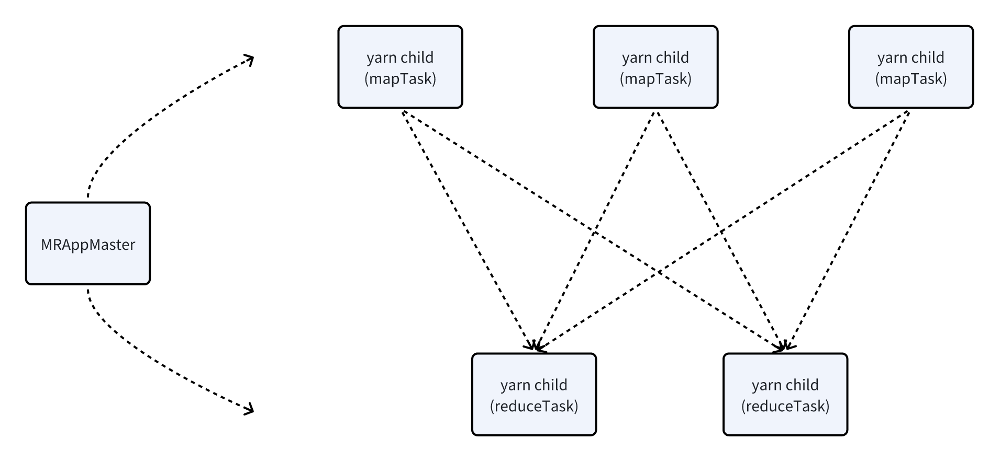
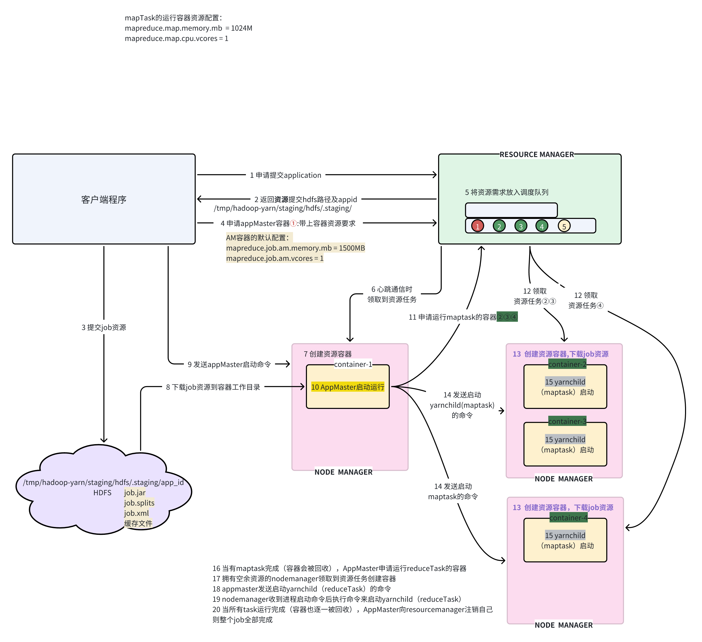
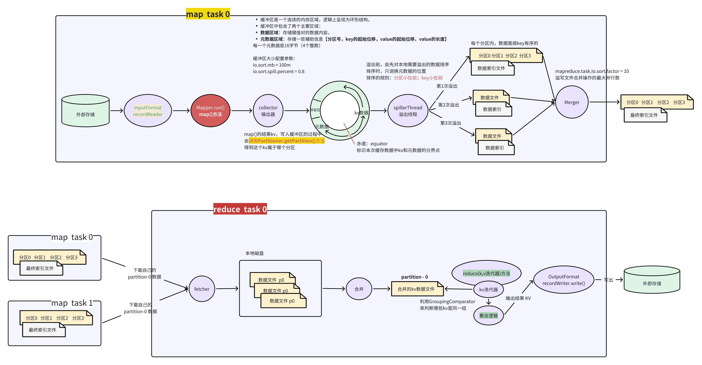
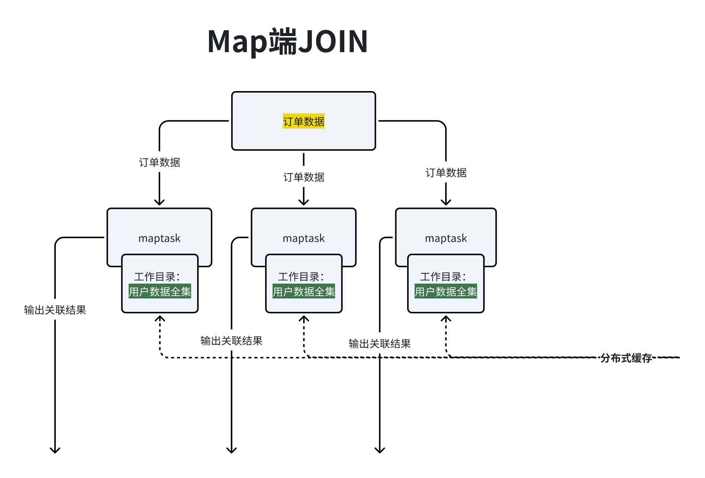

# 1. 架构及概念

> **mapreduce：hadoop中的分布式运算引擎（框架）**

## 1.1 基本原理理解

### 回想上章的内容

设想一个对海量数据进行处理的场景：

有10个T的数据，以文件的方式存储着，现在需要读取这些数据进行各种复杂运算

***

如果写一个运算程序，放在一个单机上运行，会怎么样？

如果写一个分布式运算程序，让程序有很多个并行的task对数据进行处理，会面临哪些问题？

该如何解决这些问题？


## 1.2 map reduce 算法模型

### 整体模型

* mapreduce模型中，总是把一个分布式运算过程分成两个阶段：map阶段、reduce阶段

* 两个阶段的任务实例 在集群的多个节点上并行运行

* 两个阶段之间，需要进行数据 exchange（也称**shuffle**）


> 在hadoop的具体mapreduce框架实现中，还有一些特点

* map阶段的task实例，接收的数据是key、value形式

> 这个key、value是框架内的maptask中的recordReader读来的

* map阶段的task实例，输出的数据是key、value形式

```java
XMapper extends Mapper{

    public void setup();  // 启动初始化 ：执行一次
    public void map(key,  value,  output<key, value>);   // 数据处理 ： 反复执行
    public void cleanup();  // 收尾清理： 执行一次
}
```


* reduce阶段的task实例，接收的数据是 （ key，value组 ）形式

* reduce阶段的task实例，输出的数据是（key，value）形式

```java
XReducer extends Reducer{

    public void setup();  // 初始化
    public void reduce(key,  iterable<value>,  output<key, value>);  // 数据处理
    public void cleanup();  // 收尾
    
}
```


* job提交器主类

```java
public class MyJobMain{

    public static void main(String[] args){
    
       Job job =  Job.getInstance(new configuration());
       
       // 设置job的各种参数，如jar包路径，MapperClass、ReducerClass、Map输出KV类型……
       
       
       // 提交job
       //job.submit();
       job.waitForCompletion();
       
    
    }

}
```


### 案例理解

#### 案例1

有如下数据：

```shell
Hello, how can I register for the Duoyi Education training program?
If I can join the Duoyi Education training program, I can quickly become a winner in life.
....
```


> 用mapreduce的算法模型，计算出每个单词的出现次数



* map阶段：

```shell
一次收到一行数据
    切分单词，得到单词的数组
    遍历单词数组，输出每一个单词：<单词,1>

```

* reduce阶段：

```shell
一次收到相同单词的一组kv
    迭代这一组v，把v累加到一个变量上
    这组数据迭代完成时，变量的值就是本组单词的个数
```


#### 案例2

有如下数据：

```shell
{"order_id":"o1","member_id":1001,"amount":120.8,"receive_address":"北京","date":"2024-08-1"}
{"order_id":"o2","member_id":1002,"amount":125.2,"receive_address":"北京","date":"2024-08-1"}
{"order_id":"o3","member_id":1003,"amount":220.1,"receive_address":"上海","date":"2024-08-1"}
{"order_id":"o4","member_id":1002,"amount":320.6,"receive_address":"北京","date":"2024-08-1"}
{"order_id":"o5","member_id":1001,"amount":180.8,"receive_address":"北京","date":"2024-08-2"}
{"order_id":"o6","member_id":1003,"amount":160.0,"receive_address":"上海","date":"2024-08-2"}
{"order_id":"o7","member_id":1004,"amount":140.0,"receive_address":"上海","date":"2024-08-2"}
```



1. **用mapreduce的算法模型，计算出每个用户的订单总额**

* map阶段：

```shell


```

* reduce阶段：

```shell


```

***


* **用mapreduce的算法模型，计算出每个收货城市的订单总额及订单总数**

- map阶段：

```shell


```

* reduce阶段：

```shell


```


#### 案例3

有如下两类数据

* 订单数据

```json
{"order_id":"o1","member_id":1001,"amount":120.8,"receive_address":"beijing","date":"2024-08-1"}
{"order_id":"o2","member_id":1002,"amount":125.2,"receive_address":"beijing","date":"2024-08-1"}

{"order_id":"o3","member_id":1003,"amount":220.1,"receive_address":"shanghai","date":"2024-08-1"}

{"order_id":"o4","member_id":1002,"amount":320.6,"receive_address":"beijing","date":"2024-08-1"}
{"order_id":"o5","member_id":1001,"amount":180.8,"receive_address":"beijing","date":"2024-08-2"}

{"order_id":"o6","member_id":1003,"amount":160.0,"receive_address":"shanghai","date":"2024-08-2"}
{"order_id":"o7","member_id":1004,"amount":140.0,"receive_address":"shanghai","date":"2024-08-2"}
```

* 会员信息数据

```json
{"id":1001,"member_level":2,"gender":"male"}
{"id":1002,"member_level":3,"gender":"male"}
{"id":1003,"member_level":3,"gender":"female"}
{"id":1004,"member_level":2,"gender":"female"}
```


> 求各性别的订单总额和订单总数
>
> sql

```sql

select
    gender,
    sum(amount) as amt
from  
(
    select
        t1.amount,
        t2.gender
    from t1 join t2 on t1.member_id = t2.id 
) tmp

group by gender
```


***

```sql
select
    t2.gender,
    sum(t1.amount) as amt,
    count(1) as cnt
from t1 join t2 on t1.member_id = t2.id
group by t2.gender


```




1. **用mapreduce的算法模型，计算出各性别用户的订单总数和订单总额**

* map阶段：

```shell


```

* reduce阶段：

```shell


```

***


* **用mapreduce的算法模型，计算出各会员等级的订单总数和订单总额**

- map阶段：

```shell


```

* reduce阶段：

```shell


```


#### 案例4

```json

{"user_id":1,"event_id":"add_cart","properties":{"item_id":101,"price":10.8},"timestamp":1724468062000}
{"user_id":1,"event_id":"add_cart","properties":{"item_id":101,"price":20.8},"timestamp":1724468064000}
{"user_id":1,"event_id":"video_play","properties":{"vidoe_id":"v02","page_url":"/videos/health"},"timestamp":1724468062000}
```

需求：

> 今天每5分钟，发生的添加购车事件的次数，以及添加购物的商品的总价和平均价格

Map

```json
提取加购事件中的  时间，变成 "2024-08-12 11:10:00 - 11:15:00" 作为key
price作为value
```

Reduce

```json
累加price
```


# 2. 序列化

## 2.1 序列化的本质




## 2.2 自定义序列化机制举例

```java
package top.doe.serde;

import lombok.AllArgsConstructor;
import lombok.Data;
import lombok.NoArgsConstructor;
import org.junit.Test;

import java.io.*;

public class CustomSerde {

    @Test
    public  void testSer() throws IOException {
        Student st1 = new Student("张三", 18, 1000.0f, true, 80.0);
        // 序列化,并写入文件
        FileOutputStream fos = new FileOutputStream("st.obj");
        DataOutputStream dout = new DataOutputStream(fos);

        dout.writeUTF(st1.getName()); // dout会先写2个字节表达字符串的长度信息，然后把字符串按utf编码生成字节数组
        dout.writeFloat(st1.getSalary());
        dout.writeBoolean(st1.isMarried());
        dout.writeInt(st1.getAge());
        dout.writeDouble(st1.getWeight());
        dout.close();
    }


    @Test
    public  void testSer2() throws IOException {
        Student st1 = new Student("张三", 18, 1000.0f, true, 80.0);
        // 序列化,并写入文件
        FileOutputStream fos = new FileOutputStream("d:/st2.obj");
        ObjectOutputStream oo = new ObjectOutputStream(fos);
        oo.writeObject(st1);
        oo.close();
    }


    @Test

    public  void testDe() throws IOException {
        FileInputStream in = new FileInputStream("st.obj");
        DataInputStream din = new DataInputStream(in);

        String name = din.readUTF();  // din会先读2字节得到utf字符串的长度，再按长度读字节，解码成一个字符串返回
        float salary = din.readFloat();
        boolean married = din.readBoolean();
        int age = din.readInt();
        double weight = din.readDouble();

        din.close();

        System.out.println(name);
        System.out.println(salary);
        System.out.println(married);
        System.out.println(age);
        System.out.println(weight);

    }


    @Data
    @NoArgsConstructor
    @AllArgsConstructor
    public static class Student implements Serializable{
        private String name;
        private int age;
        private float salary;
        private boolean married;
        private double weight;

    }
}
```


## 2.3 jdk中的ObjectOutputStream序列化工具

ObjectOutputStream产生的序列化结果，包含的信息很完整：

对象的字段数据值产生的字节

对象所属的类的结构信息产生的字节：全类名，继承的父类全名，字段名，字段类型等信息


> hadoop为什么直接使用ObjectOutputStream来做序列化
>
> 因为： 在一个mapreduce job中，map、reduce 输入输出的类型都是固定的
>
> 所以，没必要在数据的序列化结果中带上类型等信息（完全是冗余的、不必要的）
>
> 只要通过“参数” 告诉mapTask或者reduceTask这些输入、输出类型即可；


> 为什么用ObjectOutputStream序列化对象时，要求对象所属的类必须实现 Serializable接口

```java
Serializable接口 是 一个  标记接口
 
之所以  ObjectOutputStream  要求被序列化的类型实现这个标记接口，主要是考虑到“安全性”

在现实中，有些对象“不应该、不合适”被序列化；
比如：一个连接某服务器的客户端对象，就不适合被序列化

```


## 2.4 hadoop中的序列化

在mapreduce中，作为map、reduce输出的Key/Value类型，都必须实现Writable接口

如果作为map输出的Key类型，必须实现WritableComparable接口；


# 3. window平台运行测试所需配置

> **window平台练习hadoop的各种api，需要对window本地做一些配置**

1. 把附件下载解压到window的某个目录并解压


* 添加环境变量，HADOOP\_HOME


* 添加环境变量，PATH




# 4. mapreduce编程

> **Mapreduce作业程序开发要点**



* 利用mapreduce开发数据处理作业（程序），并不需要关注分布式运算的底层逻辑；

* 只要实现mapreduce两个逻辑阶段的数据处理逻辑即可（即上图中黄色框的内容）；


具体来说，一个mapreduce作业开发中的要点如下：

* **Mapper的实现类**，用来执行mapreduce中map阶段的逻辑

* **Reducer的实现类**，用来执行mapreduce中reduce阶段的逻辑

> map或reduce方法，输入输出的数据都是key-value结构
>
> map或reduce方法，都要定义自身的输入输出 key-value 数据泛型
>
> map或reduce方法，输入输出的数据类型，都要求实现hadoop中定义的序列化接口Writable；如果是key，则要实现WritableComparable接口

* **提交作业的主类**（主要是作业的各种配置定义）


## 2.1 入门案例1（wordcount）


### **Mapper**

```java
package top.doe.mapreduce.demos.demo1;


import org.apache.hadoop.io.IntWritable;
import org.apache.hadoop.io.LongWritable;
import org.apache.hadoop.io.Text;
import org.apache.hadoop.mapreduce.Mapper;

import java.io.IOException;

public class Demo1Mapper extends Mapper<LongWritable, Text, Text, IntWritable> {


    @Override
    protected void map(LongWritable key, Text value, Mapper<LongWritable, Text, Text, IntWritable>.Context context) throws IOException, InterruptedException {
        // key: 一行数据的起始偏移量
        // value: 一行数据的内容   "hello ,tom ,are you ok,how are you today?"
        // 输出:  <hello,1> <tom,1> , <are,1>  ......
        String line = value.toString();
        String[] words = line.split("[\\?.,\\s]+");

        for (String word : words) {
            context.write(new Text(word), new IntWritable(1));
        }
    }
}
```


### **Reducer**

```java
package top.doe.mapreduce.demos.demo1;

import org.apache.hadoop.io.IntWritable;
import org.apache.hadoop.io.Text;
import org.apache.hadoop.mapreduce.Reducer;

import java.io.IOException;

public class Demo1Reducer extends Reducer<Text, IntWritable, Text, IntWritable> {

    @Override
    protected void reduce(Text key, Iterable<IntWritable> values, Reducer<Text, IntWritable, Text, IntWritable>.Context context) throws IOException, InterruptedException {

        //  <hello,1> <hello,1> <hello,1> <hello,1>
        // key:=> hello
        // values =>: 1, 1, 1, 1

        int sum = 0;
        for (IntWritable value : values) {
            sum += value.get();
        }

        context.write(key,new IntWritable(sum));

    }
}
```


### **Job提交客户端程序**

```java
package top.doe.mapreduce.demos.demo1;

import org.apache.hadoop.conf.Configuration;
import org.apache.hadoop.fs.Path;
import org.apache.hadoop.io.IntWritable;
import org.apache.hadoop.io.Text;
import org.apache.hadoop.mapreduce.Job;
import org.apache.hadoop.mapreduce.lib.input.TextInputFormat;
import org.apache.hadoop.mapreduce.lib.output.TextOutputFormat;

import java.io.IOException;

public class Demo1 {
    public static void main(String[] args) throws IOException, InterruptedException, ClassNotFoundException {

        Configuration conf = new Configuration();
/*
        conf.set("fs.defaultFS", "hdfs://doitedu01:8020/");
        conf.set("mapreduce.framework.name","yarn");
        conf.set("yarn.resourcemanager.hostname","doitedu01");
*/

        // job对象： mapreduce框架提供的作业提交器
        Job job = Job.getInstance(conf);

        // 设置作业的jar
        job.setJarByClass(Demo1.class);
        //job.setJar("/root/abc/xxx.jar");

        job.setMapperClass(Demo1Mapper.class);
        job.setReducerClass(Demo1Reducer.class);

        // map输出的是：单词,1
        job.setMapOutputKeyClass(Text.class);
        job.setMapOutputValueClass(IntWritable.class);

        job.setOutputKeyClass(Text.class);
        job.setOutputValueClass(IntWritable.class);

        // 设置输入格式
        job.setInputFormatClass(TextInputFormat.class);
        TextInputFormat.addInputPath(job, new Path("/wordcount/input/"));

        // 设置输出格式
        job.setOutputFormatClass(TextOutputFormat.class);
        TextOutputFormat.setOutputPath(job,new Path("/wordcount/output"));

        // 设置reduceTask的并行度
        job.setNumReduceTasks(2);


        // 提交后直接退出
        // job.submit();

        // 提交作业，并等待作业完成
        System.exit(job.waitForCompletion(true)? 0 :1);


    }
}
```


### 提交运行

1\. 将项目打成jar包
2\. 将jar包传到集群的某台服务器上
3\. 用命令来提交

```shell
[hdfs@doitedu01 ~]$ hadoop jar topn.jar top.doe.mapreduce.demos.demo2.OrderJob

语法：hadoop  jar  你的作业jar包   你的作业主类
```


## 2.2 入门案例2

输入数据

```java
{"order_id":"o1","member_id":1001,"amount":120.8,"receive_address":"北京","date":"2024-08-1"}
{"order_id":"o2","member_id":1002,"amount":125.2,"receive_address":"北京","date":"2024-08-1"}
{"order_id":"o3","member_id":1003,"amount":220.1,"receive_address":"上海","date":"2024-08-1"}
{"order_id":"o4","member_id":1002,"amount":320.6,"receive_address":"北京","date":"2024-08-1"}
{"order_id":"o5","member_id":1001,"amount":180.8,"receive_address":"北京","date":"2024-08-2"}
{"order_id":"o6","member_id":1003,"amount":160.0,"receive_address":"上海","date":"2024-08-2"}
{"order_id":"o7","member_id":1004,"amount":140.0,"receive_address":"上海","date":"2024-08-2"}
{"order_id":"o5","member_id":1001,"amount":380.8,"receive_address":"北京","date":"2024-08-2"}
{"order_id":"o5","member_id":1001,"amount":160.8,"receive_address":"北京","date":"2024-08-2"}


```

**每个用户金额最大的3笔订单（并在结果中，将订单金额换算成分）**


Mapper

```java


```


Reducer

```java


```


## 2.3 入门案例3

有如下数据

```json
{"page_url":"/aa/bb/cc","member_level_id":1,"user_id":3,"username":"windy","session_id":"s10","event_id":"app_launch","action_time":1699953331000,"lat":38.089969323508726,"lng":114.35731900345093,"release_channel":"华为应用市场","device_type":"mi8","properties":{},"register_phone":"18061581848","user_status":1,"register_time":"2018-08-03 16:46:38","register_gender":1,"register_birthday":"2002-03-06","register_province":"上海","register_city":"上海","register_job":"程序员","register_source_type":1,"province":"河北省","gps_city":"石家庄市","gps_region":"鹿泉区","page_type":"文章页","page_service":"内容服务"}
{"page_url":"/aa/bb/cc","member_level_id":1,"user_id":3,"username":"windy","session_id":"s10","event_id":"video_play","action_time":1699953332000,"lat":38.089969323508726,"lng":114.35731900345093,"release_channel":"华为应用市场","device_type":"mi8","properties":{"url":"page006","video_id":1,"play_id":"play0001"},"register_phone":"18061581848","user_status":1,"register_time":"2018-08-03 16:46:38","register_gender":1,"register_birthday":"2002-03-06","register_province":"上海","register_city":"上海","register_job":"程序员","register_source_type":1,"province":"河北省","gps_city":"石家庄市","gps_region":"鹿泉区","page_type":"文章页","page_service":"内容服务"}
{"page_url":"/aa/bb/cc","member_level_id":1,"user_id":3,"username":"windy","session_id":"s10","event_id":"video_hb","action_time":1699953333000,"lat":38.089969323508726,"lng":114.35731900345093,"release_channel":"华为应用市场","device_type":"mi8","properties":{"url":"page006","video_id":1,"play_id":"play0001"},"register_phone":"18061581848","user_status":1,"register_time":"2018-08-03 16:46:38","register_gender":1,"register_birthday":"2002-03-06","register_province":"上海","register_city":"上海","register_job":"程序员","register_source_type":1,"province":"河北省","gps_city":"石家庄市","gps_region":"鹿泉区","page_type":"文章页","page_service":"内容服务"}
{"page_url":"/aa/bb/cc","member_level_id":1,"user_id":3,"username":"windy","session_id":"s10","event_id":"video_hb","action_time":1699953334000,"lat":38.089969323508726,"lng":114.35731900345093,"release_channel":"华为应用市场","device_type":"mi8","properties":{"url":"page006","video_id":1,"play_id":"play0001"},"register_phone":"18061581848","user_status":1,"register_time":"2018-08-03 16:46:38","register_gender":1,"register_birthday":"2002-03-06","register_province":"上海","register_city":"上海","register_job":"程序员","register_source_type":1,"province":"河北省","gps_city":"石家庄市","gps_region":"鹿泉区","page_type":"文章页","page_service":"内容服务"}
{"page_url":"/aa/bb/cc","member_level_id":1,"user_id":3,"username":"windy","session_id":"s10","event_id":"video_hb","action_time":1699953335000,"lat":38.089969323508726,"lng":114.35731900345093,"release_channel":"华为应用市场","device_type":"mi8","properties":{"url":"page006","video_id":1,"play_id":"play0001"},"register_phone":"18061581848","user_status":1,"register_time":"2018-08-03 16:46:38","register_gender":1,"register_birthday":"2002-03-06","register_province":"上海","register_city":"上海","register_job":"程序员","register_source_type":1,"province":"河北省","gps_city":"石家庄市","gps_region":"鹿泉区","page_type":"文章页","page_service":"内容服务"}
{"page_url":"/aa/bb/cc","member_level_id":1,"user_id":3,"username":"windy","session_id":"s10","event_id":"video_pause","action_time":1699953336000,"lat":38.089969323508726,"lng":114.35731900345093,"release_channel":"华为应用市场","device_type":"mi8","properties":{"url":"page006","video_id":1,"play_id":"play0001"},"register_phone":"18061581848","user_status":1,"register_time":"2018-08-03 16:46:38","register_gender":1,"register_birthday":"2002-03-06","register_province":"上海","register_city":"上海","register_job":"程序员","register_source_type":1,"province":"河北省","gps_city":"石家庄市","gps_region":"鹿泉区","page_type":"文章页","page_service":"内容服务"}
{"page_url":"/aa/bb/cc","member_level_id":1,"user_id":3,"username":"windy","session_id":"s10","event_id":"video_resume","action_time":1699953338000,"lat":38.089969323508726,"lng":114.35731900345093,"release_channel":"华为应用市场","device_type":"mi8","properties":{"url":"page006","video_id":1,"play_id":"play0001"},"register_phone":"18061581848","user_status":1,"register_time":"2018-08-03 16:46:38","register_gender":1,"register_birthday":"2002-03-06","register_province":"上海","register_city":"上海","register_job":"程序员","register_source_type":1,"province":"河北省","gps_city":"石家庄市","gps_region":"鹿泉区","page_type":"文章页","page_service":"内容服务"}
{"page_url":"/aa/bb/cc","member_level_id":1,"user_id":3,"username":"windy","session_id":"s10","event_id":"video_hb","action_time":1699953338100,"lat":38.089969323508726,"lng":114.35731900345093,"release_channel":"华为应用市场","device_type":"mi8","properties":{"url":"page006","video_id":1,"play_id":"play0001"},"register_phone":"18061581848","user_status":1,"register_time":"2018-08-03 16:46:38","register_gender":1,"register_birthday":"2002-03-06","register_province":"上海","register_city":"上海","register_job":"程序员","register_source_type":1,"province":"河北省","gps_city":"石家庄市","gps_region":"鹿泉区","page_type":"文章页","page_service":"内容服务"}
{"page_url":"/aa/bb/cc","member_level_id":1,"user_id":3,"username":"windy","session_id":"s10","event_id":"video_hb","action_time":1699953338200,"lat":38.089969323508726,"lng":114.35731900345093,"release_channel":"华为应用市场","device_type":"mi8","properties":{"url":"page006","video_id":1,"play_id":"play0001"},"register_phone":"18061581848","user_status":1,"register_time":"2018-08-03 16:46:38","register_gender":1,"register_birthday":"2002-03-06","register_province":"上海","register_city":"上海","register_job":"程序员","register_source_type":1,"province":"河北省","gps_city":"石家庄市","gps_region":"鹿泉区","page_type":"文章页","page_service":"内容服务"}
{"page_url":"/aa/bb/cc","member_level_id":1,"user_id":3,"username":"windy","session_id":"s10","event_id":"video_hb","action_time":1699953338300,"lat":38.089969323508726,"lng":114.35731900345093,"release_channel":"华为应用市场","device_type":"mi8","properties":{"url":"page006","video_id":1,"play_id":"play0001"},"register_phone":"18061581848","user_status":1,"register_time":"2018-08-03 16:46:38","register_gender":1,"register_birthday":"2002-03-06","register_province":"上海","register_city":"上海","register_job":"程序员","register_source_type":1,"province":"河北省","gps_city":"石家庄市","gps_region":"鹿泉区","page_type":"文章页","page_service":"内容服务"}
{"page_url":"/aa/bb/cc","member_level_id":1,"user_id":3,"username":"windy","session_id":"s11","event_id":"video_stop","action_time":1699953388300,"lat":38.089969323508726,"lng":114.35731900345093,"release_channel":"华为应用市场","device_type":"mi8","properties":{"url":"page006","video_id":1,"play_id":"play0001"},"register_phone":"18061581848","user_status":1,"register_time":"2018-08-03 16:46:38","register_gender":1,"register_birthday":"2002-03-06","register_province":"上海","register_city":"上海","register_job":"程序员","register_source_type":1,"province":"河北省","gps_city":"石家庄市","gps_region":"鹿泉区","page_type":"文章页","page_service":"内容服务"}

```

需求：

* **统计每个用户每次视频播放的，时长**

```json
```


## 2.3 进阶案例

mapreduce中，map任务的结果，shuffle给reduce任务的过程中，会对数据进行排序

排序是针对key进行的，不管value

比如，有（用户Id，用户的某订单）发送到reduce后

* 相同用户id的数据会排列在一起

* 用户id越大的越靠后

```json
(1,od1)
(1,od3)
(1,od2)
(3,od1)
(3,od2)
(3,od4)
(5,od2)
(5,od3)
(5,od4)
```

> 正是因为有这个排序机制，所以我们在mapreduce中用作key的类型，必须实现  WritableComparable


### 🔝 案例背景

```json
{"order_id":"o1","member_id":1001,"amount":120.8,"receive_address":"北京","date":"2024-08-1"}
{"order_id":"o2","member_id":1002,"amount":125.2,"receive_address":"北京","date":"2024-08-1"}
{"order_id":"o3","member_id":1003,"amount":220.1,"receive_address":"上海","date":"2024-08-1"}
{"order_id":"o4","member_id":1002,"amount":320.6,"receive_address":"北京","date":"2024-08-1"}
{"order_id":"o5","member_id":1001,"amount":180.8,"receive_address":"北京","date":"2024-08-2"}
{"order_id":"o6","member_id":1003,"amount":160.0,"receive_address":"上海","date":"2024-08-2"}
{"order_id":"o7","member_id":1004,"amount":140.0,"receive_address":"上海","date":"2024-08-2"}
{"order_id":"o5","member_id":1001,"amount":380.8,"receive_address":"北京","date":"2024-08-2"}
{"order_id":"o5","member_id":1001,"amount":160.8,"receive_address":"北京","date":"2024-08-2"}

```

**统计：每个用户金额最高的前2笔订单**

之前的做法：&#x20;

现在的做法：

之前的做法中有一个效率低下的点：reduce需要把收到的数据组存到内存中、排序

&#x20;如果能够利用mapreduce自身内置的排序机制，把数据的顺序排成我们业务逻辑中需要的顺序

```json
(1,od[1,200])
(1,od[1,150])
(1,od[1,120])
(3,od[500])
(3,od[400])
(3,od[300])
(3,od[100])
(5,od[150])
(5,od[120])
(5,od[100])
可惜，mapreduce内部的排序机制只针对key，我们可以考虑直接把订单对象作为map输出的key
od[1,200]
od[1,150]
od[1,120]
可是，一旦把订单对象作为map输出的key
则就算两个订单的用户id相同，也会产生如下两个谬误：
1. 相同用户的订单对象的hashcode不同，导致可能会发给不同的reduce
2. reduce计算拿到了相同用户的订单，它也不会认为他们是同一组

这就需要用到两个高阶组件：
1.  自定义partitioner （分区器） ： 我们这个自定义分区器根据订单对象的用户id来分区
2.  自定义GroupingComparator（分组比较器）：我们比订单对象中的用户id即可，只要用户相同即返回相同

```

### 🔝 API要点

背景案例，实现相对高效率的  分组topn（每种性别的金额最大的topn个订单）

**老做法：**

* map阶段提取分组条件字段（性别）作为key，别的数据（订单）作为value，发给reduce

* reduce中会拿到key相同的一组数据（也就是我们想要的分组），在分组中，对数据排序，取前N个输出


**用了高阶api后的做法：**

* 把**数据对象（订单对象）**&#x76F4;接作为**key（实现WritableComparable接口）**，并设计好compareTo的逻辑（比大小的逻辑、排序的规则）：先比性别，然后比订单金额

* 一旦把自定义类型的对象作为key，那么分区可能达不到我们要的效果，此时需要**自定义Partitioner**（按照订单中的性别来分区）

* 数据到达reduce之后，虽然数据的顺序满足我们的要求，但是reduce的分组比较器，会认为每一个订单对象key都是独立的一组；此时，需要**自定义GroupingComparator**（逻辑是：只要订单对象中的“性别”相同，则认为两个对象相同）


# 5. 提交job到yarn上运行

1. 启动yarn集群

2. 上传mr 作业的jar包到linux服务器

3. 使用如下命令提交作业

```shell
yarn jar /home/hdfs/yarn.jar top.doe.MyMr 参数1 参数2 ......
```

* 到yarn的web控制台观察运行情况

* 到hdfs检查输出结果


# 6. 核心原理机制（流程）

## 4.1  mapreduce运行时架构（runtime）

### 整体架构示意图



### 进程角色及其职责

* MRAppMaster

* Yarn Child

  * Map Task

  * Reduce Task


## 4.2 mapreduce on yarn 启动运行生命流程



1. 用户application主类启动，调用yarn 客户端api中的yarnRunner来提交application

2. YarnRunner向ResourceManager申请一个Application

3. RM将该应用程序的资源路径返回给YarnRunner

4. yarnRunner将application运行所需资源提交到HDFS上

5. 程序资源提交完毕后，申请运行ApplictionMaster

6. RM将用户的请求初始化成一个“资源容器需求”放入调度器队列进行调度

7. 其中一个NodeManager领取到“资源容器需求”

8. 该NodeManager创建容器Container，下载application所需资源到容器的本地工作目录

9. yarnRunner获得容器已创建的通知，创建appMaster的启动上下文信息并发送给nodemanager

10. nodemanager收到后启动appMaster

11. Appmaster向RM 申请运行task的资源

12. RM继续为资源申请生成“资源容器需求”，并放入调度器队列进行调度

13. 当有可用资源时，领取到“资源容器需求”的nodemanger会创建容器，下载application运行所需资源

14. MrAppMaster收到容器已分配通知后，会创建它的task进程的启动上下文信息并发送给nodemanager

15. nodemanager收到启动命令后即启动task进程

16. 当application的所有task运行完毕后，appMaster向RM注销自己


## 4.3 mapreduce内部的原理流程（核心：shuffle流程）

### 4.3.1 核心流程




### 4.3.2 关键细节要点

**shuffle过程中，maptask端的细节要点**

* map方法所输出的数据去哪了？ context.write(k,v)

> 被写入了MapOutputBuffer的 kvBuffer字节数组中去了 &#x20;
>
> 写入的过程中，会调用Partitioner得到kv数据所属的分区

```java
NewOutputCollector.collect( k,  v) {
     MapOutputBuffer.collect(k,v, partitioner.getPartition(k,v,partitions)) // 在这里调用了分区计算
}


 MapOutputBuffer.collect(k,v,p){
        serialize(k)  // 写key 到  kvBuffer
        serialize(v)  // 写value到kvBuffer
        kvMeta.put(p);
        kvMeta.put(kStart);
        kvMeta.put(valueStart);
        kvMeta.put(valueLength);
}
```


* 什么时候溢出，溢出多少次

> 当缓存空间的剩余空间（按软限制计算，保留比例）bufferRemaining<=0 ,触发溢出
>
> 可能有1次（flush），也可能有多次


* 溢出文件写到哪里了，溢出文件是哪种文件格式

> maptask的工作目录中（本地磁盘文件）  spill0.out  spill1.out  spill2.out
>
> 文件格式是hadoop专门设计的：`  SequenceFile[SEQ!Key类型名!V类型名!kvkvkvkvkvkvkvkvkv....]   `


* 什么时候对溢出文件合并，合并会进行多少次

> 当maptask的任务片数据全部处理完成，且缓存中最后一批数据溢出完成，触发合并
>
> 合并会进行0次，或1次，或多次
>
> * 0次：如果溢出文件只有1个，则该文件就已经是合并文件了，不需要合并了
>
> * 1次：如果溢出文件数量小于 mapreduce.task.io.sort.factor(默认值是10），则一次性合并
>
> * 多次：如果溢出文件数量超过了上面的参数值，则要进行多轮合并
>
>


* maptask端的局部聚合（Combiner）什么时候调？会调几次？

> 在做溢出文件合并的时候调用；
>
> 如果溢出文件数<3个（参数默认值），就不调用了
>
> &#x20;
>
> 因为合并就有可能发生多次，所以Combiner的调用也可能有多次


* 排序在什么时候发生，怎么排的？

> 溢出触发时，会先排序，直接在kvBuffer字节数组中排（用的算法是快速排序法）；
>
> 这个排序只要调用元数据的位置即可，kv数据不动
>
> &#x20;
>
> 多个溢出文件进行合并时，也会排序，只不过这个排序是归并排序，不涉及数据顺序的调换，而是逐一写出小的kv数据到合并大文件即可；


# 7. 零碎知识点（面试常问点）

## 7.1 运行时task并行度问题

### 7.1.1 maptask并行度选择思想

> maptask并行度的思考，多少并行度才算合适：

1. 每一个maptask在运行时处理数据所耗费的时间和每一个maptask在启动时所耗费的时间

2. 尽量减少启动耗费在整个maptask生命周期中的占比

3. 同时，要考虑集群的可用资源规模：

   1. 如果规模足够大，那就用默认的128M一个并行度得了

   2. 如果规模不够大，那就尽量权衡上面的第2点


> 在默认情况下，mapreduce作业maptask并行度是由job客户端**调用InputFormat对象去自动探测计算的**

> **FileInputFormat**.**getSplits**()方法中的计算并行度及任务片的逻辑：
>
> 比如：/wordcount/input/a.txt(200M)    b.txt(50M)    c.txt(5M)
>
> 划分出来的切片有：
>
> split-0:   /wordcount/input/a.txt  ,  起始:0  ，长度128M
>
> &#x20;     split-1:   /wordcount/input/a.txt  ,  起始:128M, 长度72M
>
> &#x20;     split-2:   /wordcount/input/b.txt  ,  起始:0  ,   长度50M
>
> &#x20;     split-3:   /wordcount/input/c.txt  ,  其实:0  ,    长度5M
>
> 有个小细节，如果文件剩余的长度 <   splitSize \*1.1 倍， 那么这个剩余的长度就作为一个任务片


> 如果按照上述的默认机制，计算出来的maptask并行度过大、或者过小
>
> 可以调整**splitSize**参数，来调整并行度
>
> splitSize大小，有好几个影响因素，内部的计算逻辑：
>
> **Math.*max*(minSize, Math.*min*(maxSize, blockSize));**
>
> 其中，minSize，是我们配置的 ，mapreduce.input.fileinputformat.split.minsize ，如果没配，就是1
>
> 其中，maxSize，是我们配置的，mapreduce.input.fileinputformat.split.maxsize， 如果没配，是无穷
>
> 其中，blockSize，是文件在hdfs中的block大小，默认一般都是128M
>
>
>
> 结论：什么都不配置的情境下，splitSize的默认值就是HDFS文件的 blockSize（128M）
>
> &#x20;        要把splitSize调大（>128M)，把 .split.minsize  调到超过128M
>
> &#x20;        要把splitSize调小(<128M), 把 .split.maxsize 调到<128M


### 7.1.2 reducetask并行度决定机制

> 作业的开发人员自行设置的
>
> 在代码中设置：    job.setNumbReduceTasks(3) ;  // 默认是 1 个
>
> 用参数来设置：    mapreduce.job.reduces； // 可以配置在提交作业的机器mapred-site.xml中；也可以在代码中设置


## 7.3 小文件问题

### 7.3.1 基本含义

```java
在分布式计算中
大量小文件往往对应着大量的map task并行度
而每个task并行度处理的数据量又很小；
导致这些task实例的数据处理时长占生命周期时长的比例太低；
也就让整个作业的整体效率大幅下降；


在hdfs中
大量小文件会占用大量的元数据空间，效率低
```


### 7.3.2 解决方案

#### ⛔ 避免产生大量小文件来处理

什么情况下会产生大量小文件呢？

* 数据采集生成最原始的数据文件


* 分布式作业产生的结果文件

> 作业①运算后的结果是大量小文件
>
> 读作业①结果的作业②，就面临大量小文件问题

分析：  一个作业产生产生出大量小文件，通常是因为分布式作业的输出阶段的reduce task并行度太大；

解决： 减少输出阶段（mapreduce中 reduce）的task的并行度


#### ⛔ 已存在大量小文件且无可挽回

利&#x7528;**`CombineTextInputformat`**&#x4F5C;为inputFormat

这个CombineTextInputformat，它里面的getSplits()方法的逻辑与FileInputFormat的getSplits()不一样

CombineTextInputformat中，它的任务片划分机制是：

**可以把若干个小文件组成一个任务片，对应一个maptask；**

**这样就可以大大降低小文件带来的并行度过高的问题；**

```java
job.setInputFormatClass(CombineTextInputFormat.class);
CombineTextInputFormat.addInputPath(job, new Path("/wordcount/input/"));
```


相关配置参数：

> 生成小文件组合任务片的时候，有一些逻辑规则：&#x20;
>
> 优先在一个datanode节点上的文件中合并；
>
> 如果剩余的一些小文件合并不到目标大小，再优先从同一个机架里面挑选别的小文件来合

```shell
# 任务片的最大值（上限）
mapreduce.input.fileinputformat.split.maxsize

# 每个节点上合并起来的任务片最小值
mapreduce.input.fileinputformat.split.minsize.per.node

# 每个机架上合并起来的任务片最小值
mapreduce.input.fileinputformat.split.minsize.per.rack
```


#### ⛔ 思考得更深入一点

> 面对一个问题，要具体问题具体分析
>
> 拿着一个教条去套用的，都是 低level&#x20;

如果一个拥有大量小文件的数据，需要被后续的几十、上百个job来读取、计算

则，长痛不如短痛，还不如先运行一个“合并job\[利用combineTextInputFormat读数据]”，job的reduce task调小；把这些小文件合并成大文件


## 7.2 数据倾斜问题

### 7.2.1 数据倾斜的含义

> 因为输入数据按照某种规律分布不均匀，并且造成了作业中各task（reduce task）要处理的数据量出现显著差异；个别（少数）几个task要处理的数据量是其他task要处理的数据量的几十甚至上百倍；
>
> 这会导致作业的整体的执行时间变长，甚至因为某个task的负载过大导致任务执行到一半失败；
>
> &#x20;
>
> 数据倾斜，通常发生在需要shuffle的作业场景中！！！


### 7.2.2 如何知晓作业发生了数据倾斜

* 提交作业的客户端命令行有打印：`map完成100%，reduce完成99%` 然后一直是99%

* 或者在yarn的job信息页上可以看到：比如有98个reduceTask已完成，还有2个在运行，而且好久都不完成


### 7.2.3 什么场景中容易发生数据倾斜

> **有shuffle的场景**都容易发生，比如：
>
> * 分组聚合的场景
>
> * 做关联的场景


### 7.2.4 分组聚合场景中数据倾斜优化手段

#### ✔️ 利用combiner在maptask端局部预聚合


**🔜  核心含义**

mapreduce框架中，允许在mapTask端就对map()方法返回的数据进行一次**局部聚合**，再发给reduce

> 加上了局部聚合之后的整体计算逻辑，一定要满足：交换律和结合律！！！
>
> 不然可能得到错误结果
>
>
>
> combiner的输出结果类型，和Mapper.map()方法输出的结果类型得一致；
>
> 不然: job.setMapOutputKey/ValueClass()就冲突了

比如：

```plain&#x20;text
做wordcount时，我们的一个maptask会输出大量的  <单词,1> 给reduce
如果某个或某几个单词，特别多，就会数据倾斜（某个或某几个reduceTask要处理的数据量远超其他reduceTask)


我们利用combiner机制的话，
maptask就不是直接输出map方法所返回的<单词,1> ，而是先做一次按相同单词计算个数的聚合，输出<单词,N> 给reduce

```


> 其实，maptask端的combiner局部聚合机制，不光可以用来优化数据倾斜
>
> 其实它是有百利而无一害的通用优化手段，因为有了局部聚合，就可能成百上千倍地减少发送给reduce的数据量


**🔜   代码**

```java
1. 写一个  XXCombiner  extends Reducer

2. 然后，在job里面设置：
job.setCombinerClass(XXCombiner.class);

如果你的 XXCombiner类 的逻辑跟你的 XXReducer类 的逻辑一样，
那么可以直接用你的 XXReducer类作为 Combiner类来使用
```


#### ✔️ 利用两阶段聚合

> 把一个聚合需求拆成两个作业
>
> 第一个作业先做更细粒度的聚合
>
> 第二个作业基于第一个作业的结果，做更粗粒度的聚合


举例： 求各省的订单总数和订单总额

```java
o1,u1,江苏省,扬州市,280.0
o2,u1,江苏省,扬州市,240.0
o1,u1,江苏省,扬州市,280.0
o2,u1,江苏省,扬州市,240.0
o3,u2,江苏省,苏州市,250.0
o4,u3,江苏省,苏州市,220.0
o3,u2,江苏省,苏州市,250.0
o4,u3,江苏省,苏州市,220.0
o5,u3,江苏省,无锡市,260.0
o6,u4,江苏省,无锡市,290.0
o5,u3,江苏省,无锡市,260.0
o6,u4,江苏省,无锡市,290.0
o5,u3,江苏省,无锡市,260.0
o6,u4,江苏省,无锡市,290.0
o5,u3,浙江省,温州市,260.0
o6,u4,浙江省,温州市,290.0
o5,u3,浙江省,杭州市,260.0
o6,u4,浙江省,杭州市,290.0
o5,u3,安徽省,合肥市,260.0
o6,u4,安徽省,合肥市,290.0
o5,u3,安徽省,芜湖市,260.0
o6,u4,安徽省,芜湖市,290.0
```

这个数据，如果直接按省聚合，那么江苏省的数据很多，都会给到一个reduceTask，倾斜！


可以分成两个阶段来求；

* 第一个阶段，降低聚合的粒度到“省、市”的级别，这样分发的时候，就均匀了，并且聚合出来结果，相较原始数据已经极大降低了；

**\[正确的做法是，在目标分组字段之外，再加一个 随机数 % reduce个数 的字段]**


* 第二个阶段，提高聚合的粒度到“省”的级别，这个阶段的job，输入的数据量已经很小了，而且倾斜程度也极大降低了；


```java
代码示例，见课程项目工程
```


### 7.2.5 关联（join）场景中的数据倾斜

#### **✔️ 大小表 \[ map端Join ]**

* mapjoin时 ，可以把小表作为分布式缓存文件，提交到各maptask的工作目录中

* 那么作业的maptask就不需要去读小表，而只要读大表

* 读到大表的数据，就从自己的缓存数据中匹配小表数据，既可以得到关联结果

* 不需要reduce阶段，也就不需要shuffle，也就不存在数据倾斜

> mapJoin 只适合大小表关联的场景
>
> 而且小表的数量最好是100M量级以内




```java
job.addCacheFile(小表数据文件)
```

* 如何用mapreduce实现reduce端join

```json
作业的maptask两个表的数据都读
map阶段提取出关联条件字段作为key，发给reduce
reduce中就能拿到关联条件相等的两表的数据在同一组中，然后拼接两表数据即可
```


* 如何用mapreduce实现map端join

```json
map端join只适合用于大小表关联的场景，小表的数据量最好在100M级以内
我们可以把小表数据文件作为mapreduce分布式缓存文件与job资源一同提交到运行时的容器工作目录中
  job.addDistributedCacheFile(new URI("小表数据文件路径"))
然后作业的maptask只读取大表数据作为作业的输入
在我们的mapper的setup方法中，先把小表数据从工作目录读取加载到内存
然后mapper的map方法中，收到一条大表的数据，就从内存中去匹配小表数据并拼接，输出即可

不需要reduce阶段
```


***


#### ✔️ 大表和大表关联

##### 🔝 数据膨胀法

此表数量：500G

此表数据量：480G

***

将左表的数据加一个有范围\[1，reduce任务数]的随机数;

将右表的每一条数据膨胀成 \[reduce任务数] 倍；

然后关联条件改成：省+随机数


##### 🔝 倾斜剥离法

> 两表都很大
>
> 左表的一个key都可能有很多条数据；右表的一个key数据量有限（往往是一条）


* 对左表抽样，统计出哪些key是倾斜的

* 将倾斜key的数据和别的数据分离成两类数据；

* 然后，对倾斜key数据做map端join； 对别的类数据做正常join；


##### 🔝 NULL值倾斜处理

> 两表都很大
>
> 两表都存在大量null的key

* 如果inner join，则先把两表中的key值为null的数据全部丢弃，然后再关联

* 如果left outer join ，则先把左表中key为null的数据全部过滤出来输出，作为结果一部分；其他数据正常关联

* 如果right outer join，则先把右表中key为null的数据全部过滤出来输出，作为结果一部分；其他数据正常关联

* 如果full outer join，左右两表中key为null的数据全部过滤出来输出，各自都是结果一部分；其他数据正常关联


## 7.5 运行时信息

map()和reduce()方法中，都有一个入参： context

而从context中可以获取到task运行时的很多上下文信息，如：

* 所属的taskId

* 所属的JobId

* reduce任务并行度

* 所负责的任务片等


## 7.6 map端join

```shell
具体，见 数据倾斜章节： 《 7.2.5 》
```


# 8. 常见面试题

小文件问题

数据倾斜问题

shuffle流程机制原理

mr运行时架构

MR on yarn的启动运行流程

场景编程设计


#


