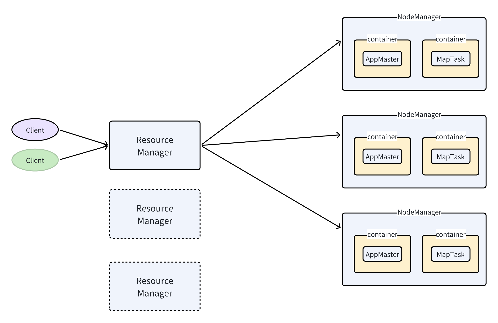
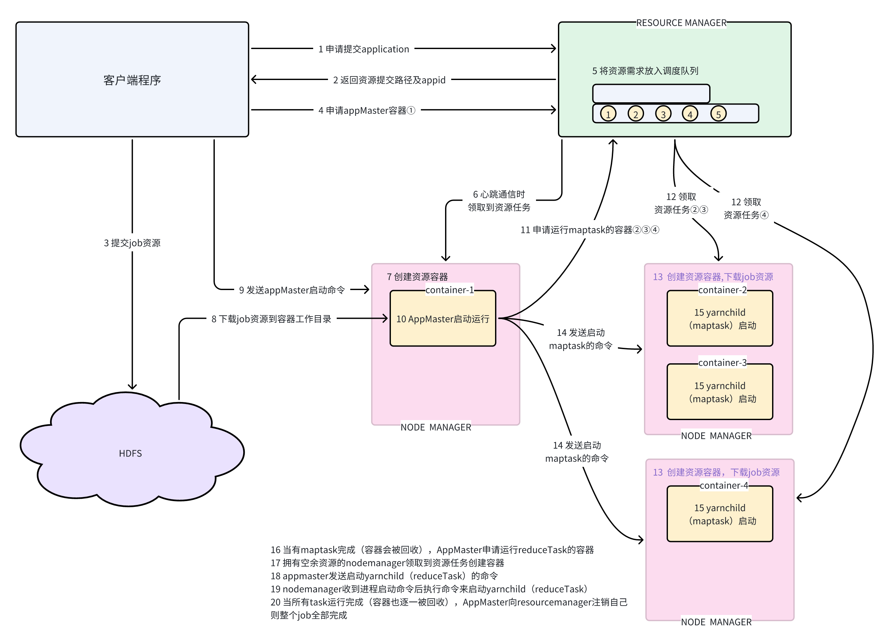
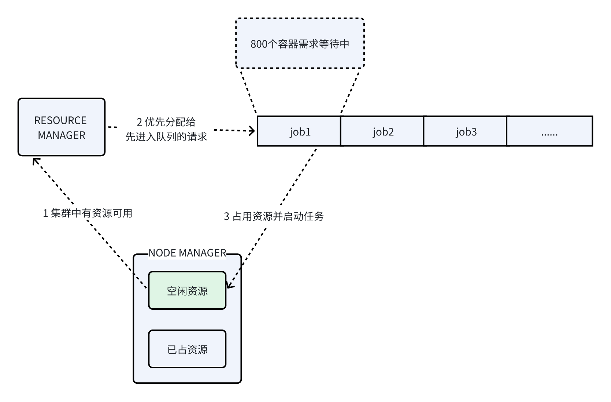
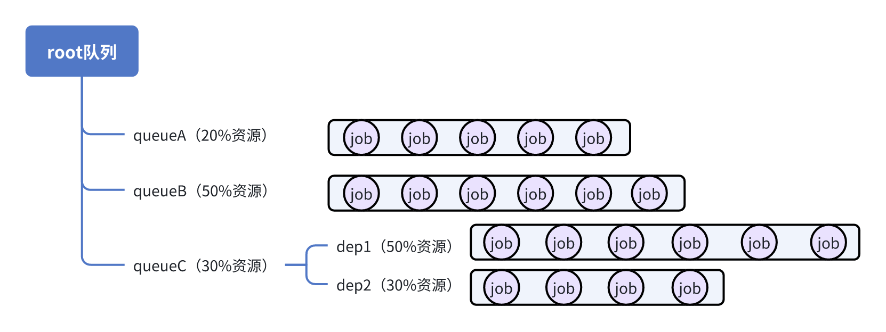

# 1 概念及架构

Yarn（Yet Another Resource Negotiator）是一个资源调度平台，负责为各种分布式运算程序提供运算资源

> 相当于一个分布式的操作系统平台，而 MapReduce等运算程序则相当于运行于操作系统之上的应用程序。

## 1.1 Yarn基础架构（重点）

Yarn主要由ResourceManager、NodeManager、ApplicationMaster和 Container 等组件构成。

**Resource Manager (RM)**

* 处理客户端请求

* 监控NodeManager

* 资源的分配与调度

**Node Manager (NM)**

* 管理单个节点上的资源

* 处理来自ResourceManager、ApplicationMaster、作业客户端等的请求

**container容器**

container是YARN中的资源抽象，它封装了某个节点上的多维度资源，如内存、CPU、磁盘等

YARN中限制容器资源的底层技术手段是：**&#x20;linux系统的cgroup&#x20;**

最新的YARN，还支持用docker作为资源容器；

**Application Master (AM)： 严格意义上来说，不属于yarn的架构组成部分**

* 为应用程序申请资源并分配给内部任务

* 任务的监控与容错

*

## 1.2  XX on yarn的常规工作流程（重点）

> mapreduce  on  yarn 的工作流程

1. 作业的客户端程序，向resourceManager发送请求，申请提交一个作业

2. resourceManager会返回一个applicationId和一个作业资源的提交路径

3. 客户端向指定的路径提交作业的jar包，配置文件等资源

4. 提交完后，客户端再次发送请求给resourceManager，申请容器来运行的作业的appMaster

5. resourceManager根据自己的调度策略，在适当时机，为作业分配“运算容器”

6. 客户端收到容器已分配通知，会向容器所在的NodeManager发送启动作业appMaster进程的命令上下文

7. 目标NodeManager收到启动请求，会执行收到的启动命令，就启动了作业的appMaster进程

8. appMaster进程启动后，就会按照自己作业框架的逻辑，再次去向resourceManager申请容器来运行其他进程

9. 如果作业的appMaster及其他进程全部完成，则会向resourceManager注销该作业

# 2 yarn的调度器（调度策略）

目前，Hadoop 作业调度器(调度策略）主要有三种：

* ~~FIFO（已被弃）~~

* 容量 (Capacity Scheduler）

* 公平（Fair Scheduler）

Hadoop 3.1.4 默认的资源调度器是 **Capacity Scheduler**

## 2.1 先进先出调度器（FIFO）

单队列，根据提交作业的先后顺序，先来先服务。

FIFO调度策略，太过简易，无法满足企业中多租户、多job、不同运行优先级、合理均分资源等需求

实际上用不到先进先出调度器；

## 2.2 容量调度器（Capacity Scheduler）

### 2.2.1 关键特性

1. **多租户支持**：

   * Capacity调度器允许在一个集群中支持多个租户，通过队列来隔离和管理不同租户的资源需求。

   * 每个队列可以根据需要配置不同的容量（资源百分比）。

   * 队列内部使用FIFO调度策&#x7565;**（不完全正确，容量调度器有资源的优先级抢占机制）**

2. **可配置的队列层次结构**：

   * 队列可以按层次结构组织成树状结构，支持父子队列。

   * 父队列的容量可以分配给子队列，从而进一步细化资源的分配。

3. **资源保障和限制**：

   * 可以为每个队列设置最小容量（Minimum Capacity）和最大容量（Maximum Capacity），确保每个队列有最低限度的资源保障，同时限制其使用的最大资源量。

4. **动态资源调整**：

   * Capacity调度器支持动态调整队列容量配置，可根据实际需求进行资源的重新分配，而不需要重启集群。

5. **公平性与抢占**：

   * Capacity调度器支持通过公平共享和抢占机制来确保资源的合理分配。

   * 某个队列没有使用完其分配的资源，其他队列可以暂时使用这些资源。

   * 某队列的资源需求超过了其分配的容量，且有更高优先级的任务需要资源，调度器可以抢占低优先级任务的资源。

6. **用户限制**：

   * 可以为每个队列配置每个用户的最大资源使用量，防止单用户独占队列资源。确保队列内资源分配公平性。

7. **应用程序优先级**：

   * Capacity调度器 允许用户 为应用程序设置优先级，以确定资源分配的先后次序。

   * 高优先级的应用程序会优先获得资源。

### 2.2.2 配置示例

**capacity-site.xml**

### 2.2.3 运行测试

参考配置文件

1. 修改集群中hadoop的配置文件` yarn-site.xml` ， 指定yarn的调度器为capacity scheduler

> 🤪 其实默认就是capacity scheduler，可以不用显式指定

* 编辑` capacity-scheduler.xml` 配置文件

* \[重启yarn集群让配置生效] 或者 \[使用命令来动态加载调度配置]

* 提交job

- 测试用的jar包 ： &#x20;

* 提交job的命令

❓️❓️ 要能自动解析这些提交job时传递的**动态参数(-D xx)**，需要改写job的客户端主类

### 2.2.4 测试总结

容量调度器可以把资源划分成层级队列

队列有明确的资源容量的限制（配置容量，最小容量，最大容量）

队列可以控制用户提交作业、管理作业等的权限

可以控制一个队列中最多运行的作业数（直接的数量参数配置，am的最大资源占比）

资源分配策略：

* FIFO： 分配资源时，首先按时间先后分后分配，然后还考虑作业的优先级（一旦有资源被释放出来则会优先分配给优先级高的作业）

* FIFO+抢占：分配资源时，整体上还是按先来先得，如果后面有高优先级的饥饿作业进来，则它会主动去抢优先级低的作业的资源来高优先级作业）

* FAIR：分配资源时，在多个等待资源的作业间均匀分配；如果资源分配完后，又来了新的饥饿作业，调度器会把释放出来的资源优先给**资源缺额**大的作业，最终趋于平衡

* FAIR+抢占：资源紧张的情况下来了新的饥饿作业，调度器会**主动去抢占别**的作业资源提供给这个缺额大的作业；

## 2.3 公平调度器（Fair Scheduler）

### 2.3.1 话术总结

**公平调度器和 容量调度器的区别**

**首先，两个调度器的设计理念不同；**

容量调度器设计出发点是适用多租户，资源限制隔离比较严格的场景；它具有明确的、细粒度的队列、用户、作业等资源隔离、限制参数；比如，容量调度器中，定义一个队列，是一定要指定它的容量占比的；

公平调度器设计出发点是所有作业公平、共享资源池的所有资源；它的资源隔离、限制等参数也有，但是不如容量调度器那么明确和细致；比如，公平调度器，定义一个队列，就没有具体的容量占比的配置；

然后，还有一些其他的细节不同；

比如，两种调度器支持的队列内调度策略不同；容量调度器支持FIFO和FAIR；而公平调度器支持FIFO,FAIR,DRF

***

**虽然，这两种调度器有设计理念的不同，但是这两种调度器有互相向对方趋同的趋势；**

比如，容量调度器也有fair调度策略，它就能在一个队列中实现公平分配；容量调度器虽然有队列容量限制，但也允许一个队列使用超出容量的资源（放大队列的最大容量占比，甚至放大到100%），当资源紧张时，多个队列之间也允许资源抢占（比如队列A一开始占用了集群所有资源，然后B队列中有作业提交，则B队列也可以抢回属于自己的资源容量；如果A/B的容量配置都是50%，那么最后抢完的结果就是两个队列各占50%，这不就平了吗？

反过来说，公平调度器虽然设计出发点是所有作业共享资源，但它也可以配置队列，也可以限制队列的最大资源，这样不就有了容量限制了吗？

> 官方文档

> 官方文档不错的翻译
>
> https://zhuanlan.zhihu.com/p/660667684

### 2.3.1 关键特性

### 2.3.2 配置示例

1. 在yarn-site.xml中指定fair scheduler

2. 编写fair scheduler的配置文件 `  fair-scheduler.xml   `

### 2.3.3 运行测试

1. 按上节修改集群的配置文件

2. 重启集群

3. 用 2.2.3 中的测试资源进行测试

# 3 Yarn常用操作命令

## 查询application信息

* 查询所有application

yarn application -list

* 根据Application状态过滤：

yarn application -list -appStates 状态

> 状态： ALL、NEW、NEW\_SAVING、SUBMITTED、ACCEPTED、RUNNING、FINISHED、FAILED、KILLED

举例：查询已结束的任务

yarn application -list -appStates FINISHED

* Kill掉Application

yarn application -kill application\_1615277921195\_0001

## yarn logs 查看日志

* 查询Application日志

yarn logs -applicationId application\_6666666666666

* 查询Container日志

yarn logs -applicationId application\_66666 -containerId container\_666666666666666\_666

## yarn applicationattempt 查看尝试运行的任务

* 列出Application尝试运行的列表，可以查到下面的ApplicationAttempt-Id

* 打印Application尝试运行的状态

## yarn container 查看容器

* 列出Container，只能查到正在运行的，结束的查不到

* 打印Container状态

## yarn node 查看节点状态

* 列出所有节点

* **yarn rmadmin 更新配置**

> 加载队列配置，如果我们更改队列配置，无需重启yarn，执行下面命令即可

## yarn queue 查看队列

* 打印队列(default)信息

# 4  附：Yarn 核心参数配置参考

# 5 附：提交mapreduce到yarn上运行的核心参数参考

**面试问题： 你平常提交作业的时候都传哪些参数？**

### 1. **指定配置文件**

* `-conf <config-file>`
  使用自定义的配置文件来覆盖默认的配置。例如，传递特定的 `mapred-site.xml` 或者 `core-site.xml`。

### 2. **设置队列**

* `-D mapreduce.job.queuename=<queue-name>`
  指定作业提交到的YARN队列。

### 3. **设置MapReduce参数**

* `-D mapreduce.map.memory.mb=<size>`：设置每个Map任务的内存大小。

* `-D mapreduce.reduce.memory.mb=<size>`：设置每个Reduce任务的内存大小。

* `-D mapreduce.job.reduces=<number>`：设置Reduce任务的数量。

* `-D mapreduce.map.java.opts='-Xmx<size>m'`：设置Map任务的JVM参数。

* `-D mapreduce.reduce.java.opts='-Xmx<size>m'`：设置Reduce任务的JVM参数。

### 4. **日志级别设置**

* `-D mapreduce.map.log.level=DEBUG` 或 `-D mapreduce.reduce.log.level=INFO`
  设置Map或Reduce任务的日志级别，方便调试或分析。

### 5. **指定文件系统**

* `-fs <hdfs-uri>`
  明确指定使用的文件系统URI，通常用于集群有多个文件系统时。

### 6. **重试策略**

* `-D mapreduce.map.maxattempts=<number>`：设置Map任务的最大尝试次数。

* `-D mapreduce.reduce.maxattempts=<number>`：设置Reduce任务的最大尝试次数。

### 7. **优先级设置**

* `-D mapreduce.job.priority=1`
  设置作业的优先级

### 8. **输出压缩**

* 启用输出的压缩，减少输出文件的大小。

* 指定压缩编码（如 GzipCodec）

### 9. **输入格式和输出格式**

* `-D mapreduce.inputformat.class=<input-format-class>`：指定输入格式。

* `-D mapreduce.outputformat.class=<output-format-class>`：指定输出格式。

### 10. **其他参数**

* `-libjars <jars>`：为作业添加额外的依赖jar包。

* `-files <files>`：将本地文件复制到各节点的工作目录中。

* `-archives <archives>`：将本地压缩包分发到各节点并解压。

