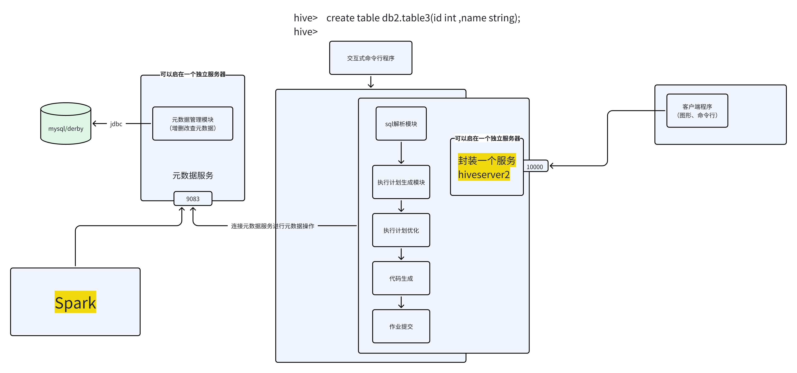
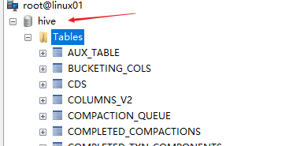
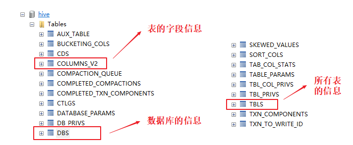
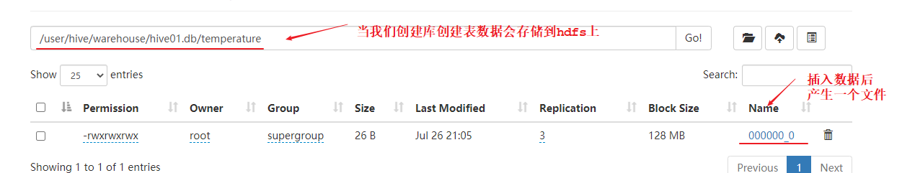
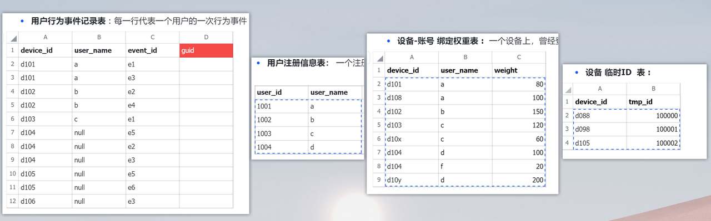
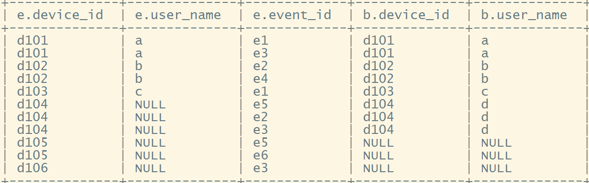
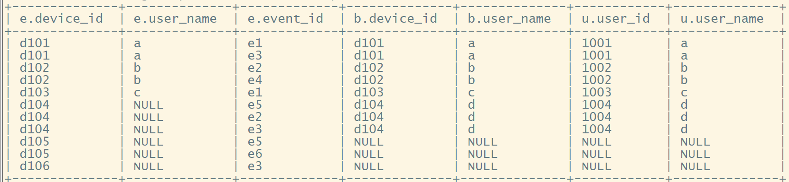
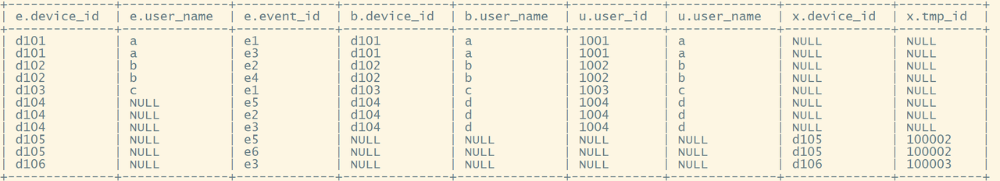

# 1 hive简介

hive是大数据开发中最重要的一个工具

hive是一个解析sql，转成分布式运算程序（mapreduce、spark、tez）的工具

hive在应用中主要是用于开发数据仓库

hive有点类似数据库，可以装数据，可以把数据映射成表，能够接收sql对数据进行查询；


但是，hive又不是个数据库：

hive自己没有自己的存储引擎：借助hdfs来存储的；而且文件格式没有特殊要求；

hive自己没有自己的查询引擎：借助分布式运算程序（比如mapreduce、spark、tez）；


从技术上说，hive就是一个sql解析、翻译工具


# 2 hive的核心架构





# 3 mysql安装

下载官方的 MySQL 安装包  http://repo.mysql.com

[mysql57-community-release-el7.rpm](files/mysql57-community-release-el7.rpm)

下载后，传到你的第一台linux机器上；


* 安装yum库配置

```java
rpm  -ivh  mysql57-community-release-el7.rpm
```

```java
ll /etc/yum.repos.d/    // 检查是否安装成功
```


* 替换yum的基础仓库源

进入目录：&#x20;**&#x20;/etc/yum.repos.d/**

把原来的  CentOS-Base.repo 改名为：   CentOS-Base.repo.bak

然后传入附件中的文件到这个目录

[CentOS-Base.repo](files/CentOS-Base.repo)

```java
-rw-r--r--. 1 root root 2523 Aug 15 12:41 CentOS-Base.repo
-rw-r--r--. 1 root root 1664 Apr  8  2020 CentOS-Base.repo.bak
```


* 开始安装 MySQL&#x20;

```java
yum install -y mysql-community-server
```


* 可能会出现 GPG 密钥过期

```java
rpm --import https://repo.mysql.com/RPM-GPG-KEY-mysql-2022
```

**之后，重新开始安装**


* **启动 MySQL&#x20;**

```java
 systemctl start mysqld
```


* **检查是否成功启动&#x20;**

```java
ps -ef | grep mysqld    // 检查进程是否启动成功

netstat -nltp | grep 3306  // 也可以用这个命令检查
```


* **获取初始密码**

```java
grep 'password' /var/log/mysqld.log
```


* 登录 MySQL&#x20;

```shell
## 使用初始密码登录
mysql -uroot -p  
输入上面获得的初始密码


## 登进来后，要重设密码：
mysql> alter user 'root'@'localhost' identified by 'ABC123.abc123';
Query OK, 0 rows affected (0.00 sec)

mysql> flush privileges;


## 为mysql的root用户授予远程登录权限及密码
# *.*  意思是： 授权到任何库的任何表
# 'root'@'%' 意思是：让root可以从任意ip地址登录
mysql> grant all privileges on *.* to 'root'@'%' identified by 'ABC123.abc123' with grant option;
mysql> flush privileges;
```


# 3 hive安装

### 3.1 Hive相关资源地址

1．Hive官网地址 http://hive.apache.org/

2．文档查看地址 https://cwiki.apache.org/confluence/display/Hive/GettingStarted

3．下载地址 http://archive.apache.org/dist/hive/

4．源码github地址 https://github.com/apache/hive


### 3.2 基础准备

必须要先保证服务器的基础环境正常，Hadoop集群健康可用。

**1.服务器的基础环境**

* 防火墙关闭

* 主机Host映射

* 免密登录

* JDK环境

* hadoop集群正常运行


### 3.3 上传解压

```shell
# 上传后进入到/opt/app 文件夹 进行解压
tar -zxvf apache-hive-3.1.2.tar.gz

# 解压后名称比较长 我们简单修改一下
mv apache-hive-3.1.2 hive-3.1.2

```


### 3.4 环境变量

配置系统环境变量 让Hive命令可以在任意位置运行

```shell
vi /etc/profile  
export  HIVE_HOME=/opt/apps/hive-3.1.2
export  PATH=$PATH:$HIVE_HOME/bin
```

\## 添加完毕后别忘记  `  source /etc/profile  `


### 3.5 配置hive

#### 🔀 hive-env.sh

```shell
# 把hive-env.sh.template改成正式名称

cd /opt/app/hive-3.1.2/conf
mv hive-env.sh.template hive-env.sh


# 修改配置内容
vi hive-env.sh 
 
#在最后加上
export HADOOP_HOME=/opt/apps/hadoop-3.1.1
export HIVE_CONF_DIR=/opt/apps/hive-3.1.2/conf
```

####


#### 🔀 hive-site.xml

```xml
<configuration>
<property>
<name>javax.jdo.option.ConnectionURL</name>
<value>jdbc:mysql://localhost:3306/hive?createDatabaseIfNotExist=true&amp;useSSL=false</value>
</property>

<property>
<name>javax.jdo.option.ConnectionDriverName</name>
<value>com.mysql.jdbc.Driver</value>
</property>

<property>
<name>javax.jdo.option.ConnectionUserName</name>
<value>root</value>
</property>

<property>
<name>javax.jdo.option.ConnectionPassword</name>
<value>ABC123.abc123</value>
</property>

<property>
<name>hive.server2.support.dynamic.service.discovery</name>
<value>false</value>
</property>

<property>  
    <name>hive.server2.enable.doAs</name>  
    <value>false</value>  
</property>


<property>
<name>hive.metastore.warehouse.dir</name>
<value>/user/hive/warehouse</value>
</property>

<property>
<name>hive.exec.scratchdir</name>
<value>/user/hive/tmp</value>
</property>

<property>
<name>hive.querylog.location</name>
<value>/user/hive/log</value>
</property>


<property> 
<name>hive.server2.thrift.bind.host</name> 
<value>0.0.0.0</value>
</property>

<property>
<name>hive.server2.webui.host</name>
<value>0.0.0.0</value>
</property>

<property>
<name>hive.server2.webui.port</name>
<value>10002</value>
</property>

<property> 
<name>hive.server2.long.polling.timeout</name> 
<value>1000</value>                               
</property>

<property>
<name>hive.server2.enable.doAs</name>
<value>true</value>
</property>

<property>
<name>datanucleus.autoCreateSchema </name>
<value>false</value>
</property>

<property>
<name>datanucleus.autoCreateTables</name>
<value>true</value>
</property>

<property>
<name>datanucleus.fixedDatastore </name>
<value>true</value>
</property>

<property>
<name>hive.execution.engine</name>
<value>mr</value>
</property>

<!-- hive的元数据服务 启动的地址和端口号 -->
<property>
<name>hive.metastore.uris</name>
<value>thrift://doitedu01:9083</value>
</property>

<property>
<name>hive.server2.thrift.min.worker.threads</name>
<value>1</value>
</property>

<!-- hiveserver2的绑定端口  -->
<property> 
<name>hive.server2.thrift.port</name> 
<value>10000</value>
</property>


<!-- hiveserver2的绑定地址  -->
<property>
<name>hive.server2.thrift.bind.host</name>
<value>doitedu01</value>
</property>

<!--配置hiveserver2用户名密码 -->
<!--
<property>
<name>hive.server2.thrift.client.user</name>
<value>root</value>
</property>

<property>
<name>hive.server2.thrift.client.password</name>
<value>root</value>
</property>

<property>
  <name>hive.metastore.wm.default.pool.size</name>
  <value>1</value>
</property>

<property>
<name>hive.session.id</name>
<value>doitedu-hive-0001</value>
</property>


<property>
<name>hive.zookeeper.quorum</name>
<value>doitedu:2181</value>
</property>

<property>
    <name>hive.exec.post.hooks</name>
    <value>org.apache.atlas.hive.hook.HiveHook</value>
</property>
-->

<property>
<name>hive.server2.active.passive.ha.enable</name>
<value>false</value>
</property>


</configuration>
```

####

#### 🔀 添加mysql驱动

> maven的中央仓库

https://mvnrepository.com/

```shell
我们需要上传一个mysql的jdbc驱动jar包放入到hive的lib下
```


#### 🔀 初始化元数据

```bash
schematool -initSchema -dbType mysql

# 最后出现 completed初始化成功 
# Initialization script completed
# schemaTool completed
```

在mysql数据库中发现生成一个新的hive数据库 里面默认有74张表 , 说明hive的元数据初始化成功!




# 4 hive的启动及使用方式

## 4.0 启动hive的元数据服务

```java
[root@doitedu01 ~]# hive --service metastore
```

元数据服务启动是否成功怎么检查：

```java
netstat -ntlp | grep 9083
```


## 4.1 本地交互程序方式

```java
hive
```


## 4.2 服务+客户端方式

### 1 启动hive服务

```java
[root@doitedu01 ~]# hive --service hiveserver2
```

启动后会监听一个端口：10000

```java
netstat -nltp | grep 10000
```


### 2 beeline客户端

```shell
[root@doitedu01 bin]# beeline -u jdbc:hive2://doitedu01:10000 -n hdfs
```

> 命令中的那个主机名： 是你的hiveserver2启动所在的机器


### 3 图形化客户端

#### 🔀  navicate/Dbeaver


#### 🔀  idea


## 4.3 非交互式操作

不进入到hive中 直接执hql语句或者hql文件 ,执行完毕后返回linux命令行

**使用 –e 参数来直接执行hql的语句**

```plain&#x20;text
hive -e "show databases;"
```

**使用 –f 参数通过指定文本文件来执行hql的语句**

```shell
vi a.sql
show databases;
执行sql文件
hive -f a.sql
执行sql文件 将执行结果写入到另一个文件中
hive -f a.sql > b.sql
```


# 5 Hive简单体验

## 5.1 建表插入数据

在Hive上可以直接写SQL语句,即使我们不会HQL也可以进行简单使用,比如建库,建表.

```sql
create database hive01;
use hive01;
create table `temperature`(
     `id`  int ,
     `city` varchar(255),
     `tempera` double,
     `date` varchar(255)
);
```

当我们这样创建一张表的时候,mysql会存储对应的元数据信息.



有了张表后我们尝试向里面插入数据

```sql
INSERT INTO temperature VALUES (2,'beijing',37,'2022-07-20');
```

通过执行的日志我们发现,这条语句会转换为MR程序运行,执行时间很长.如果使用mysql的话是毫秒级别就可以执行完,但是使用hive会发现要执行很长时间.(本地MR大概要几秒,如果提交到Yarn上要几十秒);

```xml
如果想配置yarn运行 
在hadoop中 配置mapred-site.xml 添加
  <property>
        <name>mapreduce.framework.name</name>
        <value>yarn</value>
</property>
```

```shell
在执行insert + values操作的时候  虽然最终执行成功，结果正确。但是在执行日志中会出现如下的错误信息。
FAILED: Execution Error, return code 1 from org.apache.hadoop.hive.ql.exec.StatsTask
此错误不影响程序的正常执行。

如果报这个错误 
可以设置两个参数 
set hive.txn.stats.enabled=false
set hive.stats.autogather=false
set hive.create.as.acid=false
```



通过这些操作我们可以得出几个结论:

* Hive SQL语法和标准SQL很类似,使得学习成本降低。

* Hive底层是通过MapReduce执行的数据插入动作,所以速度慢。

* 如果大数据这么一条一条插入的话是非常不现实的，成本极高。

* Hive应该具有自己**特有的数据插入表方式，结构化文件映射成为表**。


## 5.2 建表导入数据

1. 在HDFS上准备一个结构化的文件

2. 根据文件中数据结构创建一张hive表

3. 导入数据 \*\*\*

4. 查询表中的数据

创建文件上传到hdfs

```sql
vi  temperature.txt;

1,beijing,37,2022-07-20
2,shanghai,40,2022-07-20
3,beijing,36,2022-07-21
4,shanghai,41,2022-07-21

hdfs dfs -put temperature.txt /
```

建表

```sql
create table `temperature2`(
     `id`  int ,
     `city` varchar(255),
     `tempera` double,
     `date` varchar(255)
) row format delimited fields terminated by ',';  -- 指定行的分隔方式 ,
```

导入数据

```sql
load data inpath '/temperature.txt' into table  temperature2 ;
```

* 查询每日最高温度

```sql
select `date`,max(tempera) from temperature2 group by `date`;

结果
+-------------+-------+
|    date     |  _c1  |
+-------------+-------+
| 2022-07-20  | 40.0  |
| 2022-07-21  | 41.0  |
+-------------+-------+
```

通过这次体验我们发现,Hive底层的确是通过MapReduce执行引擎来处理数据的执行完一个MapReduce程序需要的时间不短.如果是小数据集，使用hive进行分析将得不偿失，延迟很高.如果是大数据集，使用hive进行分析，底层MapReduce分布式计算,才能体现效果.


# 6 sql加强小练习1

1. 准备数据文件，把这个数据放在/root/login.txt文件中；

> id,username,login\_date,device,gender,stay\_long

```plain&#x20;text
1,aaa,2024-08-01,android,male,5
1,aaa,2024-08-01,android,male,5
1,aaa,2024-08-01,android,male,5
2,bbb,2024-08-01,android,male,3
2,bbb,2024-08-01,android,male,3
3,ccc,2024-08-01,ios,male,2
4,ddd,2024-08-01,ios,female,6
1,aaa,2024-08-02,android,male,4
2,bbb,2024-08-02,android,male,2
3,ccc,2024-08-02,ios,male,2
5,eee,2024-08-02,ios,female,5
1,aaa,2024-08-03,android,male,5
1,aaa,2024-08-03,android,male,5
5,eee,2024-08-03,ios,female,5
1,aaa,2024-08-04,ios,male,6
3,ccc,2024-08-04,ios,male,6
2,bbb,2024-08-05,ios,male,6
1,aaa,2024-08-05,ios,male,2
1,aaa,2024-08-05,ios,male,2
2,bbb,2024-08-06,android,male,1
```


* 在hive中建表

```sql
hive> create table user_login(
    id  int,
    username string,
    login_date string,
    device string,
    gender string,
    stay_long int
)
row format delimited fields terminated by ','
stored as textfile;
```


* 把准备好的数据文件导入表

```sql
hive> load data local inpath '/root/login.txt' into table user_login;
```


* 查询练习

```sql
1. 查询 2024-08-30 日 的总登录用户数
select
    '2024-08-01' as login_date ,
    count(distinct id) as user_cnt
from user_login
where login_date = '2024-08-01'


2. 查询 本月各性别用户的总访问时长  
select
    gender,
    sum(stay_long) as stay_long 
from user_login
where month(login_date) = month(current_date)
group by gender 


3. 查询 本月各性别用户的平均访问时长
select
    gender,
    avg(stay_long) as avg_stay_long 
from user_login
where month(login_date) = month(current_date)
group by gender 


4. 查询 本月  各性别各设备类型 的 用户总访问时长、用户最大天访问时长、用户最小天访问时长、用户总平均天访问时长

select
    gender,
    device,
    sum(perday_long) as amt_long,
    max(perday_long) as max_perday_long,
    min(perday_long) as min_perday_long,    
    avg(perday_long) as avg_perday_long       
from 
    (
        select
            gender,
            device,id,
            login_date,
            sum(stay_long) as perday_long
        from user_login
        where month(login_date) = 8
        group by gender,device,id,login_date 
    ) tmp 
group by gender,device


5. 查询 2024-08月发生过连续3天及以上登录的用户
--------------通用解法1------------------
with tmp as (
    select
        id,login_date
    from user_login 
    group by id,login_date
) 

select
    id,
    max(lx_days) as max_lx_days
from (
    select
    id,
    count(1) as lx_days
    from (
        select
          id,
          login_date,
          date_sub(to_date(login_date),row_number() over(partition by id order by login_date)) as diff
        from tmp 
    )  tmp3 

    group by id,diff
    having count(1)>=3
) tmp4
group by id


--------------通用解法2 ------------------
with tmp as (
    select
        id,login_date
    from user_login 
    group by id,login_date
) 

select
  id
from (
    select
        id,
        login_date,
        lead(login_date,2) over(partition by id order by login_date)  as next_2_day

    from tmp 
) tmp2
where date_add(login_date,2)=next_2_day
group by id

------------
6. 查询各性别，本月访问总时长最长的前3名用户
《见附件》


------------
7. 查询本月，各性别，访问总次数最多的前3名用户


------------
8. 查询本月，每个用户访问时长最长的前3个日期


------------
9. 查询如下结果：
用户  月份   访问时长   累计时长
1    2024-01  30        30
1    2024-02  50        80

```


�&#xDD1D;**&#x20;练习题5，运算过程记录**

[解法2运算过程.sql](files/解法2运算过程.sql)

[解法1运算过程.sql](files/解法1运算过程.sql)


**🔝 练习题6，运算过程**

[习题6求解过程.sql](files/习题6求解过程.sql)


**🔝 练习题7，运算过程**

[习题7求解过程.sql](files/习题7求解过程.sql)


**🔝 练习题8，运算过程**

[习题8求解过程.sql](files/习题8求解过程.sql)


**🔝 练习题9，运算过程**

[习题9求解过程.sql](files/习题9求解过程.sql)


# 7 sql加强小练习2

## 7.1 连续登录问题变种

有如下数据，计算哪些用户有过连续3次及以上命中，以及有多少次，最大连续命中数

```java
a,1,1
a,2,1
a,3,0
a,4,1
a,5,0
b,1,0
b,2,1
b,3,1
b,4,1
b,5,0
c,1,0
c,2,1
c,3,1
c,4,1
c,5,1
c,6,0
c,7,1
c,8,1
c,9,1
```

[习题10求解过程.sql](files/习题10求解过程.sql)


## 7.1 序列分段问题

有如下数据： 用户id，时间戳，事件id，耗费时长

```java
1,1725260504000,event01,3
1,1725260505000,event02,4
1,1725260506000,event03,5
1,1725260507000,event03,5
1,1725260508000,event04,5
1,1725260510000,event04,5
1,1725260511000,event05,6
1,1725260512000,addcart,2
1,1725260514000,event04,3
1,1725260518000,event03,2
1,1725260520000,event02,4
1,1725260522000,event06,5
1,1725260523000,event08,3
1,1725260525000,addcart,4
1,1725260528000,event04,3
1,1725260530000,event03,2
1,1725260532000,event02,2
1,1725260534000,event04,2
1,1725260536000,event02,4
1,1725260542000,event06,3
1,1725260544000,event08,6
1,1725260548000,addcart,4
1,1725260556000,event02,3
1,1725260552000,event06,2
1,1725260554000,event08,3
```

计算需求 1：

* 每个用户，以 addcart 为分割点来分段，计算每段的总耗时

\[段落结束以addcart来算；最后一段按最后一个事件来算]

> 用户id,  addcart序号，    区段时长
>
> 1,             1                     30

[习题11求解过程.sql](files/习题11求解过程.sql)


* 每个用户，每次发生addcart事件之前，所做的其他行为事件次数，结果如下：

> &#x20;用户id，加购事件时间，加购事件序号，此前发生的其他事件次数
>
> 1,         1725260556000        1                  8
>
> 1,         1725260652000        2                  10


* 每个用户，每次发生addcart事件之前，所做的次数最多的前2种行为，结果如下：

> 用户id，加购事件时间，加购事件序号，其他事件id，事件次数，次数排名
>
> 1,         1725260556000    2                 event3          5              1&#x20;
>
> 1,         1725260656000    2                 event6          4              2


# 8 sql加强小练习3

## 8.1 数据说明

有如下5个表格

* **用户行为事件记录表&#x20;**: 每一行代表一个用户的一次行为事件


* **用户注册信息表：&#x20;**&#x4E00;个注册用户一条

* **设备-账号 绑定权重表 : &#x20;**&#x4E00;个设备上，曾经登录过的账号以及评价的权重


* **设备 临时ID  表 :&#x20;**

\`


## 8.2 需求说明


## 8.3 数据准备

```sql
-- 用户行为事件记录表

create table event_log(
    device_id string,
    user_name string,
    event_id  string
)
row format delimited fields terminated by ',';
-- 
d101,a,e1
d101,a,e3
d102,b,e2
d102,b,e4
d103,c,e1
d104,\N,e5
d104,\N,e2
d104,\N,e3
d105,\N,e5
d105,\N,e6
d106,\N,e3

-- 导入数据
load data local inpath '/root/log.txt' into table event_log;


```


```sql
1001,a
1002,b
1003,c
1004,d

-- 用户注册信息表
create table user_info(
    user_id int,
    user_name string
)
row format delimited fields terminated by ',';

-- 导入数据
load data local inpath '/root/user.txt' into table user_info;


```


```sql
d101,a,80
d108,a,100
d102,b,150
d103,c,120
d10x,c,60
d104,d,100
d104,f,20
d10y,d,200


-- 设备账号绑定表
create table device_bind(
    device_id string,
    user_name string,
    weight    int
)
row format delimited fields terminated by ',';

-- 导入数据
load data local inpath '/root/bind.txt' into table device_bind;

```


```sql
d088,100000
d098,100001
d105,100002


-- 临时设备id表
create table tmp_device(
    device_id string,
    tmp_id    int
)
row format delimited fields terminated by ',';

-- 导入数据
load data local inpath '/root/tmpid.txt' into table tmp_device;
```


## 8.4 解决




### 步骤1： 为新设备生成临时id

先找出今天的日志数据中（登录账号为null的），以前从没出现过的设备id，并为这些设备id生成临时id

方法：&#x20;

1. 从今天的日志数据中，抽取出所有的登录账号为null的设备id；

2. 从 绑定权重表 和  设备临时id表中，抽取出所有的设备id

3. 对比 1 和 2 中的id集合的 差集，就得到需要生成临时id的设备

4. 为这些id生成临时id，并更新掉原来的  “设备临时id”表

```sql
```

[新设备生成临时ID.sql](files/新设备生成临时ID.sql)


### **步骤2：关联user\_id并生成GUID**


**// 待同学们自己去完成&#x20;**

* **事件日志  关联   设备账号绑定权重 &#x20;**




* **继续关联 用户注册信息表**




* 继续关联  临时设备id表




* 最后取值

```sql
+--------------+--------------+-------------+---------+
| e.device_id  | e.user_name  | e.event_id  |  guid   |
+--------------+--------------+-------------+---------+
| d101         | a            | e1          | 1001    |
| d101         | a            | e3          | 1001    |
| d102         | b            | e2          | 1002    |
| d102         | b            | e4          | 1002    |
| d103         | c            | e1          | 1003    |
| d104         | NULL         | e5          | 1004    |
| d104         | NULL         | e2          | 1004    |
| d104         | NULL         | e3          | 1004    |
| d105         | NULL         | e5          | 100002  |
| d105         | NULL         | e6          | 100002  |
| d106         | NULL         | e3          | 100003  |
+--------------+--------------+-------------+---------+2
```


# **附加mapreduce面试题：**

有如下数据，用mapreduce编程，计算：本公司用户，今天每分钟的在线总人数；

```sql
id, 上线时间    下线时间
1,  02:30:35 ,  02:45:46 
1,  03:40:32 ,  04:05:20 
2,  02:25:32 ,  03:01:10 
```

