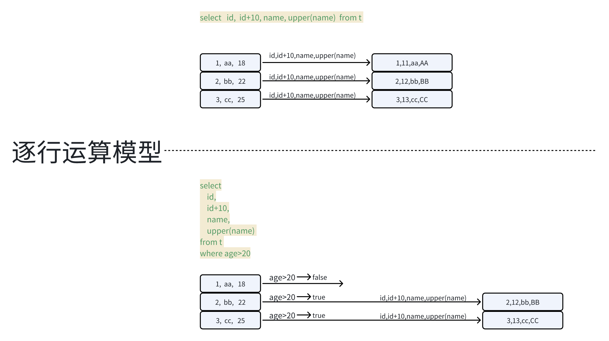
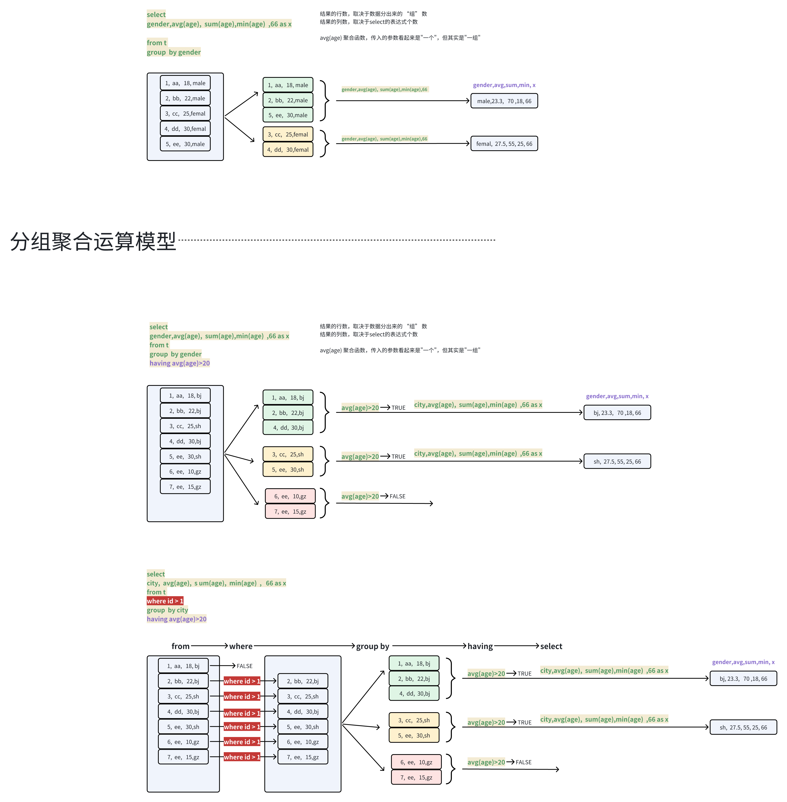
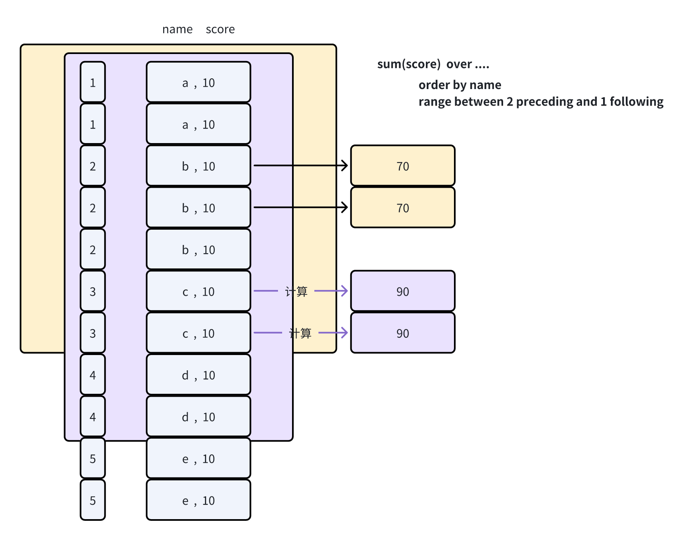
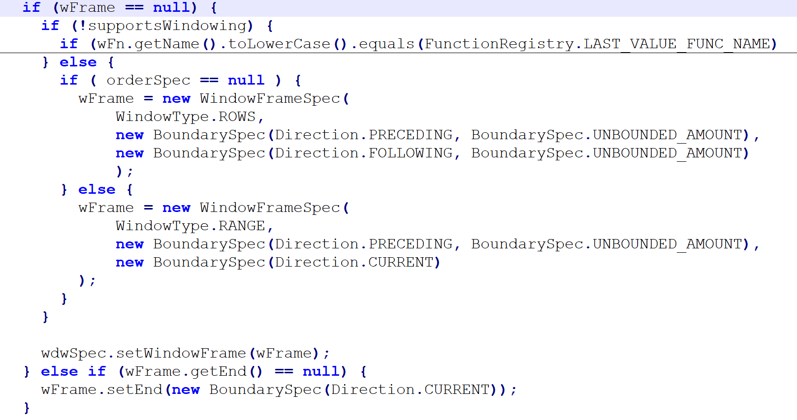
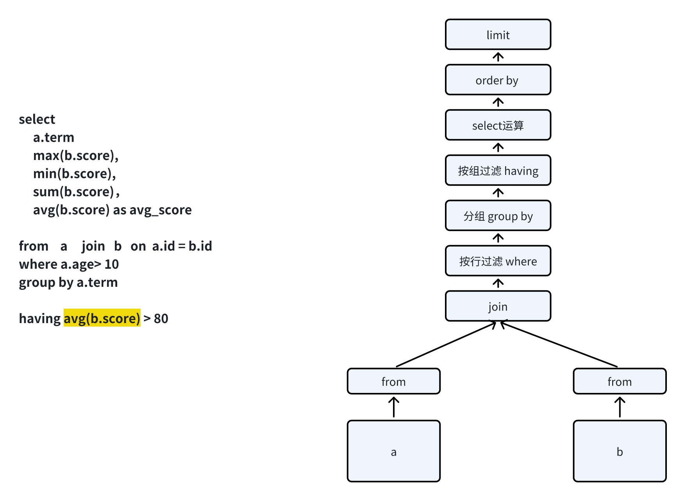
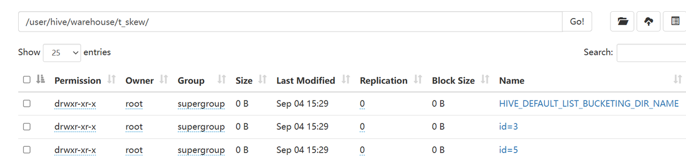
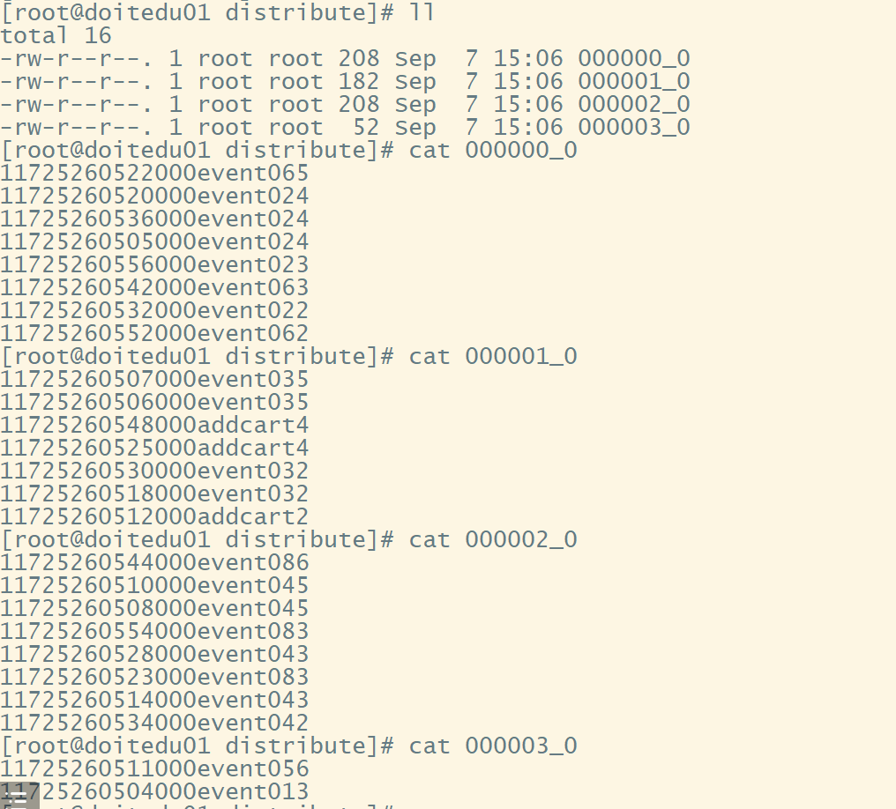

# 1 SQL速成加强

**sql， 是一门基于关系代数的面向集合的语言**


## 1.1 **sql的核心关键字**

### **🔝 select**&#x20;

运算表达式

```sql
select  id,name
select  id+10, name'Mr'
select  greatest(id,20),upper(name)
select  10,id,namge,age+20,'ok'
```

| id | name |
| -- | ---- |
| 1  | zs   |
| 2  | ls   |

```sql
select id,name,id,name,id+name,10,2000,upper(name),age


for(Person p: list){
    sout(p.id,p.name,p.id,p.name,p.id+p.name,10,2000,p.name.toUpperCase());
}

```


### 🔝 from

```sql
from 表

from (select  ....  from ...)

from ( 表1 join  表2  on 条件)
```


### 🔝 join

| id | name | age |
| -- | ---- | --- |
| 1  | aa   | 18  |
| 2  | bb   | 28  |
| 3  | cc   | 38  |
| 4  | dd   | 48  |

| uid | address | salary |
| --- | ------- | ------ |
| 1   | bj      | 1000   |
| 2   | bj      | 3000   |
| 2   | bj      | 2000   |
| 4   | sh      | 3000   |
| 5   | sh      | 4000   |


**t1 join t2 on t1.id=t2.uid  &#x20;**

```sql
1,aa,18   1,bj,1000
2,bb,28   2,bj,3000
2,bb,28   2,bj,2000
4,dd,48   4,sh,3000
```


**t1 left join t2 on t1.id=t2.uid**

```sql
1,aa,18   1,bj,1000
2,bb,28   2,bj,3000
2,bb,28   2,bj,2000
3,cc,38   \N,\N,\N
4,dd,48   4,sh,3000
```


**t1 right join t2 on t1.id=t2.uid**

```sql
1,aa,18   1,bj,1000
2,bb,28   2,bj,3000
2,bb,28   2,bj,2000
4,dd,48   4,sh,3000
\n,\n,\n  5,sh,4000
```


**t1 full join t2 on t1.id=t2.uid**

```sql
1,aa,18     1,bj,1000
2,bb,28     2,bj,3000
2,bb,28     2,bj,2000
3,cc,38     \n,\n,\n
4,dd,48     4,sh,3000
\n,\n,\n    5,sh,4000
```


### 🔝 where

where 后面的表达式，其实就是对from读到的数据进行过滤

```sql
where 布尔表达式

where 1=1
where 1>2
where id>age
where id>2
where id>1 and age>28
```


## 1.2 sql运算模式

### 1 逐行运算模式



> 逐行运算模式下，表达式可以是：
>
> 字段名
>
> 字段运算表达式：算术运算、布尔运算等
>
> 函数调用：标量函数（scalar函数）\[进一行，出一行]
>
> \-- 函数通常有：标量函数、 聚合函数\[进多行，出一行] 、 表生成函数\[进N行M列，出 X行Y列]


### 2 分组聚合模式



> 特点： 每一个组，结果只会有一行
>
> select中的表达式：   分组key，聚合函数，常量
>
> select
>
> id,
>
> upper(**max**(name))   -- 这里虽然upper是一个标量函数，但是它的输入是一个聚合函数的结果
>
> From t&#x20;
>
> Group by id ;


### 3 窗口模式

#### 🔝 窗口运算的基本特性


#### **🔝 窗口函数的语法结构**

```java
聚合函数(字段)  over(partition by 字段..   order by 字段...   窗口定义 )

partition by  ：分区定义； 不同分区的数据互不干扰，各自计算
order by ：排序定义；  各分区内各自排序 
```


#### **🔝 窗口定义语法&#x20;**

**- 按行指定窗口（window frame） ： &#x20;**&#xA;**\[rows between ... preceding and ... following]**
\* rows between 5 preceding and 3 following  :  窗口框住的当前计算行的前5行，到当前计算行的后5行
\* rows between unbounded **preceding&#x20;**&#x61;nd 5 **following** :从分区的最前框到当前计算行的后5行截止
\* rows betwwen unbounded preceding and unbounded following : 框住整个分区
\* rows between unbounded preceding an&#x64;**&#x20;current row**


**- 按排名指定窗口（window frame） ： &#x20;**&#xA;**\[range between ... preceding and ... following]**
\* range between 2 preceding and 1 following : 窗口框住的是分区中，当前计算行的前2名的所有数据和当前行所属排名的所有数据，和当前行排名的后1名的所有数据

&#x20;\[ 当前行所属名次的 前2名  到 后1名， 每个**名次对应的所有数据**都进入窗口 ]&#x20;





#### 🔝 各类定义缺失时的默认值

* **没有指定分区定义**

**partition by 0&#x20;**：  相当于整个表是一个分区&#x20;


* **没有指定窗口定义**

  * 有指定排序  ：   **range&#x20;**&#x62;etween  最前 到  当前

  * 无指定排序  ：   **rows&#x20;**&#x62;etween   最前  到  最后 &#x20;

  * 有指定排序且rows，按你的rows


**源码逻辑： WindowingSpec类的 effectiveWindowFrame()方法中**




### 4 壹个sql多个窗口

```sql
select
    id,
    mth,
    shop,
    amt,
    row_number() over(partition by shop order by amt desc) as rn ,
    sum(amt) over(partition by mth order by id,shop)  as accu
from ds7
```

其实，上面的语句，等价于

```sql
with tmp as (
select
    id,
    mth,
    shop,
    amt,
    row_number() over(partition by shop order by amt desc) as rn 
from ds7
)
select
    id,
    mth,
    shop,
    amt,
    rn ,
    sum(amt) over(partition by mth order by id,shop)  as accu
from tmp 
```


> 如果一个sql中，多个窗口中的partition by是同一个字段
>
> 则hive中有一个 **hive.optimize.correlation 优化机制，可以把多个窗口计算合并成一次shuffle**


## 1.3 sql的执行顺序




https://cwiki.apache.org/confluence/display/Hive/LanguageManual


# 2 DDL 数据定义

## 2.1 DDL操作概览

* **创建：** CREATE DATABASE/SCHEMA, TABLE, VIEW, FUNCTION, INDEX

* **删除：&#x20;**&#x44;ROP DATABASE/SCHEMA, TABLE, VIEW, INDEX

* **截断：** TRUNCATE TABLE

* **修改：&#x20;**&#x41;LTER DATABASE/SCHEMA, TABLE, VIEW

* **修复：&#x20;**&#x4D;SCK REPAIR TABLE (or ALTER TABLE RECOVER PARTITIONS)

* **展示：&#x20;**&#x53;HOW DATABASES/SCHEMAS, TABLES, TBLPROPERTIES, VIEWS, PARTITIONS, FUNCTIONS, INDEX\[ES], COLUMNS, CREATE TABLE

* **描述：&#x20;**&#x44;ESCRIBE DATABASE/SCHEMA, table\_name, view\_name, materialized\_view\_name


## 2.2 建表语法

```sql
CREATE [TEMPORARY] [EXTERNAL] TABLE [IF NOT EXISTS] [db_name.]table_name    -- (Note: TEMPORARY available in Hive 0.14.0 and later)
  [(col_name data_type [column_constraint_specification] [COMMENT col_comment], ... [constraint_specification])]
  [COMMENT table_comment]
  [PARTITIONED BY (col_name data_type [COMMENT col_comment], ...)]
  [CLUSTERED BY (col_name, col_name, ...) [SORTED BY (col_name [ASC|DESC], ...)] INTO num_buckets BUCKETS]
  [SKEWED BY (col_name, col_name, ...)                  -- (Note: Available in Hive 0.10.0 and later)]
     ON ((col_value, col_value, ...), (col_value, col_value, ...), ...)
     [STORED AS DIRECTORIES]
  [
   [ROW FORMAT row_format] 
   [STORED AS file_format]
     | STORED BY 'storage.handler.class.name' [WITH SERDEPROPERTIES (...)]  -- (Note: Available in Hive 0.6.0 and later)
  ]
  [LOCATION hdfs_path]
  [TBLPROPERTIES (property_name=property_value, ...)]   -- (Note: Available in Hive 0.6.0 and later)
  [AS select_statement];   -- (Note: Available in Hive 0.5.0 and later; not supported for external tables)
```


TEMPORARY： 临时表

> 只在当前会话中存在的表；会话结束，该表会被自动删除


EXTERNAL： 表示外部表

> 外部表是相对于 “内部表”的一个概念
>
> 内部表也有关键字：MANAGED（默认就是它）
>
> 外部表和内部表的最大区别：
>
> * drop 一个表的时候
>
>   * 外部表默认是不会被删除数据的；而只是从元数据中清除；
>
>   * 而内部表则元数据和数据存储都会被删除；
>
> * 还有一些基于ACID的机制的功能，只能针对内部表；


* 字段名和字段类型，注释

```sql
create external table db2.t_some(
    id   int   comment '用户ID',
    name string,   -- 用户姓名

)
COMMENT  '这是一个用户信息表'

```


## 2.3 分区表使用

* 在hive中，一个表，可以定义成分区表

* **分区对应表存储目录中的子目录**

* 分区表的意义何在： 查询时可以指定某个或某几个分区来查询；可以减少数据扫描的范围；

* 语法小细节：

  * 表定义时，分区字段名不能跟表结构中已存在的字段名重复（查询时一定会产生歧义，所以不允许）

  * 表定义时，分区可以指定多级


### **分区定义语法**

```sql
PARTITIONED BY (col_name data_type [COMMENT col_comment], ...)
```


### 分区表的定义和插入数据和查询数据

```sql
drop table if exists event_log;
create table event_log(
   device_id  string,
   user_name  string,
   event_time bigint,
   province   string
)
PARTITIONED BY (dt STRING)
;


drop table if exists event_log_2;
create table event_log_2(
   device_id  string,
   user_name  string,
   event_time bigint,
   province string
)
PARTITIONED BY (p STRING)
;

insert into table event_log_2 PARTITION(p='JX') values ('d01','u01','1235','江西省');
insert into table event_log_2 PARTITION(p='JX') values ('d02','u02','1444','江西省'),('d03','u03','1555','江西省');


insert into table event_log_2 PARTITION(p='山东省') values 
('d04','u04','1235','山东省'),
('d05','u05','1444','山东省'),
('d06','u06','1555','山东省')
;


drop table if exists event_log_3;
create table event_log_3(
   device_id  string,
   user_name  string,
   event_time bigint,
   province string
)
PARTITIONED BY (dt STRING, p STRING)
;


-- 往分区表中，插入数据，不管用何种方式，都是要指定目标分区
insert into table event_log_3 PARTITION(dt='20240903',p='JX') values ('d01','u02','1444','江西省'),('d02','u03','1555','江西省');
insert into table event_log_3 PARTITION(dt='20240903',p='SH') values ('d03','u02','1444','上海市'),('d04','u03','1555','上海市');
insert into table event_log_3 PARTITION(dt='20240904',p='SH') values ('d05','u02','1444','上海市'),('d06','u03','1555','上海市');

load data inpath '/some/data/*' into table event_log_3 PARTITION(dt='20240904',p='SH');

insert into table event_log_3 PARTITION(dt='20240904',p='SH')
select .... from ....


--  查询指定分区  : 3号的江西  和  4号的上海  
select
province,
count(distinct device_id) as cnt

from event_log_3 
where  (dt='20240903' and p='JX' ) OR (dt='20240904' and p='SH')
GROUP BY province
;


```


### 给表增加分区

* 往分区表中插入数据，指定分区，如果目标分区不存在，hive会自动新建分区；

* 还有专门的增加分区的语法 : ALTER TABLE  xxx  ADD PARTITION(x=y)&#x20;

```sql
-- 为表增加一个新的空分区
ALTER TABLE event_log ADD PARTITION(dt='20240905');   -- 默认位置： 表目录/dt=20240905/

-- 为表增加一个分区，并指定分区的存储目录
ALTER TABLE event_log ADD PARTITION(dt='20240906') LOCATION '/aaa/bbb';   -- 指定路径


select * from event_log where dt='20240906';  -- 空目录，无数据

-- 假设已存在目录 ，并且目录中已存在数据
hdfs dfs -mkdir /somedata/2024-09-07/
hdfs dfs -put some.txt /somedata/2024-09-07/
-- 然后为表新建分区，并指定分区存储路径为上面的文件夹，则该新分区直接就拥有了数据
ALTER TABLE event_log ADD PARTITION(dt='20240907') LOCATION '/somedata/2024-09-07';


-- 手动给一个表创建一个分区目录，hive是否自动识别这个分区？
hdfs dfs -mkdir /user/hive/warehouse/event_log/dt=20240908
-- 这样是不会识别，因为hive没有为此创建元数据记录
-- 需要手动用如下命令去驱使hive检查并增加分区的元数据才能识别
MSCK REPAIR TABLE event_log SYNC PARTITIONS;
-- 或
ALTER TABLE event_log ADD PARTITION(dt='20240908');
```


### 删除分区

```sql
-- 如果是外部表，默认情况下只清除该分区的元数据记录；不会删数据存储目录
-- 如果是内部表，则该分区的元数据记录和对应的数据存储目录，都会被删除
alter table event_log drop partition(dt='20240908');
```


### 分区信息

```sql
SHOW PARTITIONS event_log;

DESC FORMATTED event_log PARTITION(dt='20240906');
```


## 2.4 分桶表使用

```sql
[CLUSTERED BY (col_name, col_name, ...) [SORTED BY (col_name [ASC|DESC], ...)] INTO num_buckets BUCKETS]
```


**分桶表中，数据的分布是有规律的：**

* 首先，根据指定的clustered by字段进行hash散列，散列到多个文件（每个文件就是一个桶）

* 然后，根据指定的sorted by字段在每一个桶中排序

```sql
drop table if exists member_info;
create table member_info(
    uid int,
    name string,
    age int
)
PARTITIONED BY (dt string)
clustered by (uid) sorted by (age) into 3 BUCKETS
ROW FORMAT DELIMITED 
FIELDS TERMINATED BY ','
;
```


**向分桶表中插入数据**

> 不要手动load数据，因为这样可能没有正确匹配分桶表的数据分布规律
>
> 而是使用insert + select 来往分桶表中插入数据，这样会自动形成分桶表定义的散列有序文件


```sql
create table member_origin(
    uid int,
    name string,
    age int
)
ROW FORMAT DELIMITED
FIELDS TERMINATED BY ','
;

-----------------
insert into member_info PARTITION(dt='20240904')
select
uid,
name,
age
from member_origin;


insert into member_info PARTITION(dt='20240905')
select
uid,
name,
age
from member_origin;
```


## 2.5 倾斜表使用

```sql
  [SKEWED BY (col_name, col_name, ...)                  -- (Note: Available in Hive 0.10.0 and later)]
     ON ((col_value, col_value, ...), (col_value, col_value, ...), ...)
     [STORED AS DIRECTORIES]
```




```sql
-- 测试数据源表
create table t_skew_origin(
    id int ,
    name string,
    event_id string
)
ROW FORMAT DELIMITED
FIELDS TERMINATED BY ','
;


-- 倾斜表
drop table t_skew;
create table t_skew(
    id int ,
    name string,
    event_id string
)

skewed by (id) on (3,5)   
stored as directories     -- 如果不加这个，则不会把倾斜数据存入专门的子目录

ROW FORMAT DELIMITED
FIELDS TERMINATED BY ','
;


-- 往倾斜表中插入数据
insert into t_skew
select * from t_skew_origin
```

> 倾斜表如果带了  STORED AS DIRECTORIES  ，那么数据会分成多个子目录存放
>
> 倾斜值的一个或多个子目录
>
> 非倾斜值的子目录
>
>
>
> 注意： 在这种定义下，查询数据需要把如下参数设置为TRUE，才能查到数据
>
> set mapreduce.input.fileinputformat.input.dir.recursive=true;


如果一个表在定义时没有定义成倾斜，后续可以使用alter命令来修改倾斜定义

```sql
alter table some_table skew by (id)  on (3,5);
```


## 2.6 数据存储格式

表的数据格式的，具体有两层：

1. ROW FORMAT **行中的字段的解析方式**

> 用SERDE来指定
>
> row format serde '....'  &#x20;
>
> with serdeproperties('k'='v' , 'k2'='v2')


* STORED AS **存储文件格式 &#x20;**

> 用 INPUTFORMAT  和 OUTPUTFORMAT 来指定:  STORED AS  INPUTFORMAT '.......'    OUTPUTFORMAT '.......'
>
> 也可以用文件类型名来指定   STORED AS PARQUETFILE


* **完整定义示例**

```sql
create table xx(


)
ROW FORMAT   -- 指定行内字段解析方式
SERDE 'org.apache.hadoop.hive.serde2.lazy.LazySimpleSerDe'   
WITH SERDEPROPERTIES (                             
  'field.delim'=',',                               
  'serialization.format'=','
) 
                       
STORED AS    -- 指定文件格式
INPUTFORMAT                              
  'org.apache.hadoop.mapred.TextInputFormat'       
OUTPUTFORMAT                                       
  'org.apache.hadoop.hive.ql.io.HiveIgnoreKeyTextOutputFormat'  
```


* 用户友好写法

```sql
create table xx (


)
STORED AS ORC;
```


```sql
STORED AS TEXTFILE   + 需要显式指定SERDE 
STORED AS ORC 
STORED AS PARQUET
STORED AS SEQUENCEFILE
```


关于 TEXTFILE显式指定SERDE 的 示例：

* 存文本文件

* 文本文件中的内部数据格式&#x662F;**：json**

```sql
drop table if exists orders;
CREATE TABLE orders(

    order_id  int,
    amount double,
    order_date date
)
PARTITIONED BY (dt string)
row format serde 'org.apache.hadoop.hive.serde2.JsonSerDe'   -- 显式指定serde
STORED AS  TEXTFILE;   -- 隐式指定inputformat和outputformat

```


**文本文件，才需要显式指定 serde**

> 其他的列式存储文件（orc、parquet、rcfile）或二进制文件（SequenceFile），都有固定的serde，不需要显式指定；


文本文件的serde有

```sql
ROW FORMAT SERDE  'org.apache.hadoop.hive.serde2.RegexSerDe'
WITH SERDEPROPERTIES
( "input.regex" = "<regex>" )
STORED AS TEXTFILE;
```


```sql
ROW FORMAT SERDE  'org.apache.hive.hcatalog.data.JsonSerDe'
STORED AS TEXTFILE
```


```sql
CREATE TABLE my_table(a string, b string, ...)
ROW FORMAT SERDE 'org.apache.hadoop.hive.serde2.OpenCSVSerde'
WITH SERDEPROPERTIES (
   "separatorChar" = "\t",
   "quoteChar"     = "'",
   "escapeChar"    = "\\"
)  
```


**ROW FORMAT DELIMITED FIELDS TERMINATED BY ',' 对应的就是如下的定义：**

```sql
ROW FORMAT SERDE  'org.apache.hadoop.hive.serde2.lazy.LazySimpleSerDe'   
WITH SERDEPROPERTIES (                             
  'field.delim'=',',                               
  'serialization.format'=','
  ) 
```


## 2.7 表存储路径

```sql
  [LOCATION hdfs_path]
```

```sql
create table default.emps(
id int,
name string
);
-- 如果不指定location，hive也会补充一个默认的location：  /user/hive/warehouse/emps/


create table default.emps(
id int,
name string
)
LOCATION '/aa/bb' ;
-- 指定了location，那么表的存储路径就在指定的路径
```


## 2.8 表的属性（表参数）定义

* 语法

```sql
[TBLPROPERTIES (property_name=property_value, ...)]
```

* 示例1

```sql
create table default.emps(
id int,
name string
)
stored as orc

tblproperties(
   'sub_system' = 'content',   -- 自定义的属性，不影响hive的行为
   'orc.compress' = 'snappy'   -- 内部的属性，指定表的数据文件的压缩格式
);
```

* 示例2

```sql
create table default.employee_2(
id int,
name string
)
stored as orc
tblproperties(
   'sub_system' = 'content',   -- 自定义的属性，不影响hive的行为
   'orc.compress' = 'snappy',   -- 内部的属性，指定表的数据文件的压缩格式
   'auto.purge' = 'true',    -- true则删除表的数据直接清空；fasle是默认值，是放入回收站
   'EXTERNAL' = 'TRUE'
);


insert into employee_2 values (1,'aa'),(2,'bb'),(3,'cc');

```


***


# 3.**Hive 数据类型**

## &#x33;**.1  基本数据类型**

对于 Hive 的 String 类型相当于数据库的varchar 类型，该类型是一个可变的字符串，不过它不能声明其中最多能存储多少个字符，理论上它可以存储 2GB 的字符数。

## &#x33;**.2  集合数据类型**

Hive 有三种复杂数据类型 ARRAY、MAP 和 STRUCT。ARRAY 和 MAP 与 Java 中的 Array和 Map 类似，而 STRUCT 与 C 语言中的 Struct 类似，它封装了一个命名字段集合，复杂数据类型允许任意层次的嵌套。

## &#x33;**.3 类型转化**

Hive 的原子数据类型是可以进行隐式转换的，类似于 Java 的类型转换，例如某表达式使用 INT 类型，TINYINT 会自动转换为INT 类型，但是 Hive 不会进行反向转化，例如，某表达式使用 TINYINT 类型，INT 不会自动转换为 TINYINT 类型，它会返回错误，除非使用 CAST操作。

**隐式类型转换规则：**

1. 任何整数类型都可以隐式地转换为一个范围更广的类型，如 TINYINT 可以转换成INT，INT 可以转换成 BIGINT。

2. 所有整数类型、FLOAT 和 STRING 类型都可以隐式地转换成 DOUBLE。

3. TINYINT、SMALLINT、INT 都可以转换为 FLOAT。

4. BOOLEAN 类型不可以转换为任何其它的类型。

**可以使用** **CAST** **操作显示进行数据类型转换**

例如 CAST('1' AS INT)将把字符串'1' 转换成整数 1；如果强制类型转换失败，如执行 CAST('X' AS INT)，表达式返回空值 NULL


## 3.4 map类型使用

**类型定义：  &#x20;**

```sql
字段名  MAP<key类型,value类型>
```


**构造方法**

```sql
map(k1,v1,k2,v2,.....)
```


**使用示例**

```sql
create database db2;

drop table db2.complex_source;
create table db2.complex_source(
   id    int,
   name  string,
   gender string,
   scores string
)
row format delimited
fields terminated by ','
;


load data local inpath '/root/sc.txt' into table db2.complex_source;


1,zs,male,78:82:66:72
2,ls,male,88:86:68:97
3,ww,female,72:62:96:77
4,zl,female,78:82:36:57

-------------------------------------------


create table db2.complex_demo1(
    id  int,
    score_map map<string,float>
)
partitioned by (city string)
stored as orc
tblproperties(
    'orc.compress'='snappy'
);

with tmp as (
    SELECT
        id,
        split(scores,':') as arr   -- arr 是一个数组类型 ARRAY<STRING>
    FROM db2.complex_source 
)

insert into table db2.complex_demo1 PARTITION(city='SH')
SELECT
    id,
    map('语文',cast(arr[0] as float),'数学',cast(arr[1] as float),'物理',cast(arr[2] as float),'化学',cast(arr[3] as float)) as score_map
FROM tmp 


---map上的各种运算符和函数 ------------


select  id,score_map['语文'] as scfrom complex_demo1 ;
select id,score_map['英语'] as sc from complex_demo1 ;   -- 不存在就返回NULL

select id,map_keys(score_map) as sc from complex_demo1        -- 取map的所有key，返回数组
select id,map_valuess(score_map) as sc from complex_demo1 ;   -- 取map的所有value，返回数组
select id,size(score_map) as sc from complex_demo1 ;          -- 取map的size


----额外的一个跟map有关的函数--- 把字符串切割并封装成map
select str_to_map('a:1-c:2-d:3','-',':');
```


## 3.5 array类型使用

**构造函数**

```sql
array(元素,元素....)

select 1 as id, array(1,2,3,4) as arr;
```


**数组的运算符和函数**

```sql
-- 假设有一个字段scores 是数组类型
drop table if exists db2.complex_demo2;
create table db2.complex_demo2(
   id int,
   name string,
   scores array<decimal(2,0)>
)
stored as orc;

-- 插入测试数据 --
insert into complex_demo2 
select 1, 'zs', array(80.0,90.0,60.0)
union all
select 2, 'bb', array(20.0,90.0,60.0,88.0)
union all
select 1, 'cc', array(90.0,50.0,60.0);


-- 取第一次考试的成绩
select  id, scores[0]  as score_0 from  db2.complex_demo2;

-- 取各生的考试次数
select id, size(scores) as cnt  from  db2.complex_demo2;

-- 取各生是否有60.0分的成绩
select id, array_contains(scores,60.0) from  db2.complex_demo2;

-- 取包含80分成绩的学生信息
select 
*
from  db2.complex_demo2
where array_contains(scores,80.0)


-- 将各生的历次考试成绩排序
select id, sort_array(scores) from   db2.complex_demo2;

--- 2个跟数组有关的字符串函数 ----- 
select split('a:b:c',':') ;   -- 将字符串按分隔符，切成数组
select 1 as id,concat_ws('-',array('a','b','c'));  -- 将数组中的元素拼接成字符串

```


## 3.6 struct类型使用

```sql

---- 类型定义语法 -----------------------------------------
某字段   STRUCT<属性名:类型,  属性名:类型,  .....>


-------测试用表 -------------------------------------
drop table if exists db2.complex_demo3;
create table db2.complex_demo3(
    id  int,
    scores  STRUCT<course_name:string, course_score:float , course_teacher:string>
)
stored as orc ;


-- 利用 named_struct 构造函数 ，生成测试数据  ----------------------------------------------
insert into table db2.complex_demo3 
select  1 as id, named_struct('course_name','doris','course_score',cast(80 as float),'course_teacher','杰哥')
union all 
select  1 as id, named_struct('course_name','hadoop','course_score',cast(88 as float),'course_teacher','文哥')
union all 
select  2 as id, named_struct('course_name','hive','course_score',cast(98 as float),'course_teacher','文哥')
union all 
select  2 as id, named_struct('course_name','spark','course_score',cast(68 as float),'course_teacher','行哥')


-- 另外一个struct构造 ------------------------------------
select struct('doris',88,'行哥');  -- 得到的struct中的属性名为默认的  col1 ,col2 ,col3


-------- 从struct上获取数据
select  scores.col1, scores.col2  from complex_demo3;

```


# 3 常用函数

## 3.1 函数概览

* **数学函数 &#x20;**

* **字符串函数&#x20;**

* **日期时间函数**

* **集合函数**

* **聚合函数**

* 表生成函数

* 其他函数


## 3.2 必会函数

### 3.2.1 标量函数（UDF）

#### 1 数学函数

```java
abs(-100) => 100
rand()  => 0.3240970978
ceil(3.2)  => 4 
floor(3.8) => 3
greatest(3,10,6) => 10
least(3,10,6) => 3 
round(3.56,1)  =>  3.6
```

***

#### 2 集合函数

```java
array_contains(数组,'a')  ==> 如果数组中包含 a，则返回true，否则 false
map_keys(map字段） ==> 返回传入的map的所有key，数组
map_values(map字段）  ==> 返回传入的map的所有value，数组
size(map字段 或 数组字段）  ==> 返回集合的长度 
```

***

#### 3 时间函数

```java
from_unixtime(10位长整数,'yyyy-MM-dd HH:mm:ss')  ==> 把长整数“绝对时间” 转成日期时间字符串
from_utc_timestamp(1725518648000,'GMT+8');   // 可以把一个绝对时间根据指定的时区转成timestamp

// 注意时区的问题
unix_timestamp('2009-03-20', 'yyyy-MM-dd') = 1237532400
to_date('2024-09-05')  ==> 得到是一个date类型的日期
datediff('2024-09-01', '2024-09-06')   ==> 得到日期的差值（天数）
date_sub('2024-09-10',  2)   ==>  2024-09-08
date_add('2024-09-10',  2)   ==>  2024-09-12
current_date    ==>   返回当前的日期
date_format('2024-09-05','yyyy/MM/dd');  ==> 格式化一个时间成为一个字符串，可以传字符串时间、timestamp、date类型参数
```

***


#### 4 条件函数

if(条件，值1，  值2 ）   ==> 如果条件为true，则返回值1，否则返回值2

nvl(值1，值2)   ==> 值1 不为null则返回 值1，否则返回 值2

COALESCE(值1，值2, ......)  ==> 返回第一个不为null的值，都为null则返回null&#x20;

case when

```sql
case  age 
    when 18 then '风华正茂'
    when 28 then '龙马精神'
    when 38 then '陈年佳酿'
    when 48 then '沉香腊肉'
    else '风烛残年'
end


case  
    when age <=18 then '风华正茂'
    when age <=28 then '龙马精神'
    when age <=38 then '陈年佳酿'
    when age <=48 then '沉香腊肉'
    else '风烛残年'
end
```


***

#### 5 字符串函数

```java
split('a:b:c'  , ':' )   ==> 返回数组:  ['a'  ,   'b'  ,  'c'  ]
```


```java
substr('foobar', 4)    => 
select substr('foobar1234567', 4 , 5) ;   ==>    bar12   
```


```java
concat('foo', 'bar')    ==>  foobar
concat_ws('-', 'foo', 'bar','car')  => foo-bar-car
concat_ws('-',array('a' ,'b' ,'c' ) )  => a-b-c
```


```java
find_in_set('ab', 'xx,yy,ab,abc,666')   =>  3
instr( 'xxyyabxx,abc,666' , 'ab')    =>   5
```


```java
select lpad( 'abc',  6,      '*');   ==>   ***abc  
select rpad('abcde',  6,   '*');  ==>    abcde*  
```


```java
ltrim('           ab')   ==>  'ab'  
rtrim('     ab          ')   ==>  '     ab'  
trim('     ab       ')  ==>  'ab'
```


🔜  **正则抽取、匹配函数**

`select regexp_extract('abcxyyyz666uuuuu999', 'abc(.*)666(.*)', 1);   ==> xyyyz `

`select regexp_extract('sgsa18612348786sdlkg', '(\\d+)', 1);   ==>   18612348786`

```sql
简单解释：
String regex = "^((13[0-9])|(14[5,6,7,9])|(15[^4])|(16[5,6])|(17[0-9])|(18[0-9])|(19[1,8,9]))\\d{8}$";
"[1]"代表下一位为数字可以是几，
"[0-9]"代表可以为0-9中的一个，
"[5,7,9]"表示可以是5,7,9中的任意一位,
[^4]表示除4以外的任何一个,
\\d{8}"代表后面是可以是0～9的数字，有8位。
```


🔜  J**SON抽取函数**

`get_json_object(string json_string, string jsonPath)`

```sql
    info  string
{"name":"zs","age":18, "order":{"oid":"od0001"} , "arr":[3,18,36]}
    

select get_json_object(info, '$.name' )   ==>    zs  
select get_json_object(info, '$.order.oid' )   ==>    od0001
select get_json_object(info,  '$.arr')   =>   [3,18,36]

select get_json_object(info,  '$.arr[1]')  =>  18


```

***


### 3.2.2 聚合函数 UDAF&#x20;

🔜 `  sum/ count/ min / max / avg  `


🔜 `  collect_list / collect_set  `

```sql
-- 把一组数据中的col字段的值，收集成一个数组返回； 

collect_set(col)  -- 会对元素去重
collect_list(col)  -- 不去重
```

使用示例：

```sql

+------------+-------------+-------------------+-------------+
| orders.id  | orders.amt  | orders.user_name  |  orders.dt  |
+------------+-------------+-------------------+-------------+
| 1          | 38.8        | aaa               | 2024-09-04  |
| 1          | 46.6        | aaa               | 2024-09-04  |
| 2          | 22.8        | bbb               | 2024-09-04  |
| 2          | 10.8        | bbb               | 2024-09-04  |
+------------+-------------+-------------------+-------------+

select user_name , collect_list(amt)  from orders group by user_name;

+------------+--------------+
| user_name  |     _c1      |
+------------+--------------+
| aaa        | [38.8,46.6]  |
| bbb        | [22.8,10.8]  |
+------------+--------------+
```


### 3.2.2 表生成函数 UDTF&#x20;

**🔜 explode 炸裂数组**

```sql
+-------------------+---------------------+-----------------------+
| complex_demo2.id  | complex_demo2.name  | complex_demo2.scores  |
+-------------------+---------------------+-----------------------+
| 1                 | zs                  | [80,90,60]            |
| 2                 | bb                  | [20,90,60,88]         |
| 1                 | cc                  | [90,50,60]            |
+-------------------+---------------------+-----------------------+


select 
id,name, sc  
from complex_demo2 
lateral view 
explode(scores) tmp as sc;

+-----+-------+-----+
| id  | name  | sc  |
+-----+-------+-----+
| 1   | zs    | 80  |
| 1   | zs    | 90  |
| 1   | zs    | 60  |
| 2   | bb    | 20  |
| 2   | bb    | 90  |
| 2   | bb    | 60  |
| 2   | bb    | 88  |
| 1   | cc    | 90  |
| 1   | cc    | 50  |
| 1   | cc    | 60  |
+-----+-------+-----+
```


**🔜  explode 炸裂map**

```sql
+-------------------+--------------------------------------------+---------------------+
| complex_demo1.id  |          complex_demo1.score_map           | complex_demo1.city  |
+-------------------+--------------------------------------------+---------------------+
| 1                 | {"语文":78.0,"数学":82.0,"物理":66.0,"化学":72.0}  | SH                  |
| 2                 | {"语文":88.0,"数学":86.0,"物理":68.0,"化学":97.0}  | SH                  |
| 3                 | {"语文":72.0,"数学":62.0,"物理":96.0,"化学":77.0}  | SH                  |
| 4                 | {"语文":78.0,"数学":82.0,"物理":36.0,"化学":57.0}  | SH                  |
+-------------------+--------------------------------------------+---------------------+


select 
id,city,course_name,course_score  
from complex_demo1 
lateral view   
explode(score_map) tmp as course_name,course_score;


+-----+-------+--------------+---------------+
| id  | city  | course_name  | course_score  |
+-----+-------+--------------+---------------+
| 1   | SH    | 语文           | 78.0          |
| 1   | SH    | 数学           | 82.0          |
| 1   | SH    | 物理           | 66.0          |
| 1   | SH    | 化学           | 72.0          |
| 2   | SH    | 语文           | 88.0          |
| 2   | SH    | 数学           | 86.0          |
| 2   | SH    | 物理           | 68.0          |
| 2   | SH    | 化学           | 97.0          |
| 3   | SH    | 语文           | 72.0          |
| 3   | SH    | 数学           | 62.0          |
| 3   | SH    | 物理           | 96.0          |
| 3   | SH    | 化学           | 77.0          |
| 4   | SH    | 语文           | 78.0          |
| 4   | SH    | 数学           | 82.0          |
| 4   | SH    | 物理           | 36.0          |
| 4   | SH    | 化学           | 57.0          |
+-----+-------+--------------+---------------+
```


**🔜 explode 应用案例**

```sql
有如下表格

create table sentences(
   sentence  string
);


insert into table sentences values 
('spark flink java hadoop hive spark flink hbase'),
('java flink kafka hadoop hive paimon flink hbase'),
('spark flink java paimon hive spark flink hbase'),
('spark hudi java hadoop hive hudi flink hbase')


-- 统计单词个数
with tmp as (
select 
explode(split(sentence,' ')) as word
from sentences
)

select
word,
count(1)

from tmp 
group by word
;

```


## 3.3 自定义函数

* 1，要导入hive的依赖

```xml
<dependency>
    <groupId>org.apache.hive</groupId>
    <artifactId>hive-exec</artifactId>
    <version>3.1.2</version>
</dependency>
```


### 3.3.1 **标量函数的例子**

* 2，写一个java类，按照接口去实现即可

```java
public class UDFExample_1 extends UDF {
    public String evaluate(String str) {
        return str.toUpperCase();
    }ao
}
```


* 3，将代码打成jar包，并上传到beeline所运行的机器

* 4，在beeline的sql界面下，用如下命令添加jar包到类路径和job资源

```xml
0: jdbc:hive2://doitedu01:10000> add jar /root/hive_udf-1.0-SNAPSHOT.jar;
```

* 5，注册一个sql函数，映射java中的自定义UDF的类

```xml
0: jdbc:hive2://doitedu01:10000> create temporary function my_upper as 'top.doe.hive.udf.templates.old.UDFExample_1';
```

* 6, 可以使用注册好的函数

```xml
select user_id,my_upper(event_id) from user_events;
```


### 3.3.2 **标量函数的练习**


#### 1. **需求**

时间戳 1725524991000  ==>   2024-09-05 16:36:16.000

fun\_x(1725524991000, 10)  ==> 把传入的时间，对10分钟向下取整    ==> 2024-09-05 16:30:00.000
fun\_x(1725524991000, 5)    ==> 把传入的时间，对5分钟向下取整     ==> 2024-09-05 16:35:00.000
fun\_x(1725524991000, 15)  ==> 把传入的时间，对15分钟向下取整    ==> 2024-09-05 16:30:00.000
fun\_x(1725524991000, 30)  ==> 把传入的时间，对30分钟向下取整    ==> 2024-09-05 16:30:00.000


**输入参数1：** 长整数的时间戳（毫秒级） 13为 ==> 1725524991000   // 2024-09-05 16:32:16.000
**输入参数2：** 截断间隔x（单位分钟）
**返回结果：** 截断取整后的时间字符串


#### 2. **代码实现**

```java
package top.doe.hive.udf.templates.exec;

import org.apache.commons.lang3.time.DateFormatUtils;
import org.apache.hadoop.hive.ql.exec.UDF;

public class TimeFloor extends UDF {

    public String evaluate(Long timestamp, int unit) {
        // 1725524991000
        // 5
        int tmp = unit*60*1000;
        long floorTime = (timestamp / tmp) * tmp;

        return DateFormatUtils.format(floorTime, "yyyy-MM-dd HH:mm:ss");
    }

}
```


### 3.3.3 聚合函数的例子

```java
package top.doe.hive.udf.templates.exec;

import org.apache.hadoop.hive.ql.exec.UDAF;
import org.apache.hadoop.hive.ql.exec.UDAFEvaluator;

public class MyAvg extends UDAF {

    // 这是UDAF的计算逻辑封装类
    public static class AggEvaluator implements UDAFEvaluator {
        // 自定义的累加器
        Agg agg;

        // 构造方法中，一定要对累加器进行初始化：可以通过调用init()来进行
        public AggEvaluator() {
            super();
            init();
        }

        // 初始化，重点是初始化累加器
        @Override
        public void init() {
            agg = new Agg();
        }


        // 从原始输入数据获得数据后计算
        public boolean iterate(Double value) {
            if (value != null) {
                agg.sum += value;
                agg.cnt += 1;
            }
            return true;
        }


        // 每次局部聚合完成时调用，以输出局部聚合的结果
        // 这个结果会交给全局聚合阶段作为输入
        public Agg terminatePartial() {
            return agg;
        }


        // 全局聚合逻辑
        // 每一个输入数据，就是局部聚合阶段所输出的一个结果数据
        public boolean merge(Agg partialAgg) {
            if (partialAgg != null) {
                agg.sum += partialAgg.sum;
                agg.cnt += partialAgg.cnt;
            }

            return true;
        }


        // 全局聚合完成后，用于输出最终返回结果的逻辑
        public Double terminate() {
            return agg.sum/agg.cnt;
        }


        /**
         *  自定义的累加器类
         */
        public static class Agg {
            double sum;
            int cnt;
        }

    }
}
```


### 3.3.4 聚合函数的练习

#### 1. 需求说明

比如，有如下数据

```sql
uid,province,city,event_id
1,山东,济南,event2
1,山东,济南,event2
2,山东,济南,event2
3,山东,济南,event2
4,山东,济南,event2
5,山东,济南,event2
6,山东,青岛,event2
6,山东,青岛,event2
7,山东,青岛,event2
7,山东,青岛,event2
2,山东,青岛,event2
2,山东,青岛,event2
8,江苏,南京,event2
8,江苏,南京,event2
9,江苏,南京,event2
9,江苏,南京,event2
2,江苏,南京,event2
3,江苏,苏州,event2
3,江苏,苏州,event2
2,江苏,苏州,event2


-- 明细数据表
create table bmtest(
   id       int,
   province string,
   city     string,
   event    string   
)
row format delimited
fields terminated by ',';

load data local inpath '/root/bm.txt' into table bmtest;


-- 细粒度聚合表
create table bm_agg(
   province string,
   city     string,
   ids_bm   binary 
)
row format delimited
fields terminated by ',';


-- 注册函数
create temporary function int2bm as 'top.doe.hive.udf.templates.exec.IntGroup2BitmapUDAF';
create temporary function bmagg as 'top.doe.hive.udf.templates.exec.BitmapAggUDAF';
create temporary function bmprint as 'top.doe.hive.udf.templates.exec.BitmapElementsUDF';
create temporary function bmcount as 'top.doe.hive.udf.templates.exec.BitmapCountUDF';


-- 按省市  细粒度聚合  ----------
insert into table bm_agg 
select  province
        ,city
        ,int2bm(id) as ids_bm
from bmtest
group by province,city


-- 按省聚合
select
    province,
    -- bmagg(ids_bm) as ids_bm,
    bmprint(bmagg(ids_bm))  as ids,
    bmcount(bmagg(ids_bm)) as cnt
from bm_agg
group by province

```


需要计算，

1. 每个省每个市中，发生了event2的人数

```sql
select
    province,
    city,
    count(distinct uid) as ucnt 

from ttt
group by province,city

---------------------
山东,济南,5
山东,青岛,3
江苏,南京,3
江苏,苏州,2
```


* 每个省,发生了event2的人数

⛔️🔞 ☢️ 如果直接从 省市 粒度结果，求和，得到的结果是不正确的！！

```sql
--- 可以这么做
在聚合 省市粒度结果时，不要把具体的人数作为聚合结果，而是把 一个 bitmap 作为聚合结果
山东,  济南,  [0 1 1 1 1 1 0 0 0 0 0....]
山东,  青岛,  [0 0 1 0 0 0 1 1 0 0 0....]

select
    province,
    city,
    bitmap_agg(uid) as ub

from ttt
group province,city


-- 有了上面的结果，就可以基于上面的省市粒度的结果，直接聚合出省粒度的结果
山东,[01111111000....]


```


**最终，就是要开发一个自定义的UDAF （分组聚合）**

* 输入参数：uid  （整数）

* 返回结果： bitmap对象序列化成字节数组  （sql中对应的类型是 binary）

* 使用方法：

```sql
select
  province,
  city,
  bitmap_agg(uid) as bm
from ttt 
group by province,city
```


#### 2. 代码实现

```java


```


聚合函数2：&#x20;

输入：bitmap的序列化字节

输出：一组bitmap的聚合结果字节


### 3.3.5 hive中的UDAF的注意事项

在自定义的UDAF中，我们的数据输入输出类型，可以有

* 基本类型

* Writable类型

* 自定义类型（自定义类型中，不能持有 数组类型 的成员）

collect\_list  &#x20;

collect\_set


# 4 hive中的特别查询

## 4.1 sort by 排序

sort by 是在每个reduce内对数据排序：

* 每个reduce的输出结果是有序的

* 全局则不一定有序

```sql

-- 数据量太小时，hive自动估算出的reduce并行度为1，sort by则看不到效果了
set mapreduce.job.reduces = 3；

select  *
from student 
sort by score desc;

```


order  by 是全局有序，但是底层的mapreduce**只能有一个reduce并行度**


## 4.2 分桶查询

* distribute by ..... sort by ....

* cluster by ....

```java
hive (default)> set mapreduce.job.reduces=3;
hive (default)> insert overwrite local directory 
'/opt/module/data/distribute-result' 
select * from emp 
distribute by deptno 
sort by empno desc;
```

当 distribute by 和 sorts by 字段相同时，可以使用 cluster by 方式。

cluster by 除了具有 distribute by 的功能外还兼具 sort by 的功能。但是排序只能是升序

排序，不能指定排序规则为 ASC 或者 DESC。

```sql
-- 下面的语句形成的结果规律：
-- reduce数量假设为4 ，那么查询的结果文件将有4个
-- 每个文件中是deptno 对4 hash散列的结果
-- 在每个文件中，数据是按age有序的
hive (default)> set mapreduce.job.reduces=4;
hive (default)> insert overwrite local direcotry '/root/distribute/'
              > select * from emp distribute by deptno sort by age;
```




> **如果distribute by 和sort by的字段相同，且是升序排序，则可以简写成 cluster by**

```sql
-- 以下两种写法等价
hive (default)> select * from emp cluster by deptno;
hive (default)> select * from emp distribute by deptno sort by deptno asc;

```


## 4.3 抽样查询

### 桶抽样  --  以桶的方式

```java
SELECT *
FROM source TABLESAMPLE(BUCKET 3 OUT OF 32 ON rand()) s;

TABLESAMPLE(BUCKET 3 OUT OF 16 ON id)
TABLESAMPLE(BUCKET 3 OUT OF 64 ON id)
```

如果表的分桶数为32，则&#x20;

* BUCKET 3 OUT OF 16 ON id 抽取的是  32/16 = 2桶， 目标桶为 桶3和桶19

* BUCKET 3 OUT OF 64 ON id 抽取的是  32/64=1/2桶，目标桶为 桶3


### block抽样

```java
set hive.sample.seednumber=<INTEGER>;

SELECT *
FROM source TABLESAMPLE(0.1 PERCENT) s;

SELECT *
FROM source TABLESAMPLE(300M) s;
```

抽取随机的block数据；

* 如果指定的数据量小于文件blocksize，就会抽到整个block

* 如果指定的数据量超过文件blockszie，则会随机挑多个block返回；


### 行抽样

```java
SELECT * FROM source TABLESAMPLE(10 ROWS);
```

**此时，hive不会使用combineFileInputFormat，且会对每个split抽取指定行数**

**所以，具体抽取的行数，会根据表的split数量而变化**


### 抽样案例

抽样用来干嘛的？

在对全表进行某个统计代价太大时，可以先抽样，然后对抽样的数据进行统计；

```sql
with tmp as (
    select
      aid
    from events
    tablesample(1000 rows)
)


-- aid字段每个值的个数
-- aid字段每个值的占比
select
   aid,      -- aid的某个值
   cnt,      -- aid的某个值的总行数
   total,    -- 抽样数据总行数
   round(cnt/total,2) as ratio
from (
    select  
      count(1) as total
    from tmp 
) a 
join 
(
    select
        aid,
        count(1) as cnt
    from tmp
    group by aid 
) b 
order by cnt desc 
limit 10
```


# 附录： hive的IDEA本地调试

**依赖**

```sql
<dependency>
    <groupId>org.apache.hive</groupId>
    <artifactId>hive-cli</artifactId>
    <version>3.1.2</version>
    <exclusions>
        <exclusion>
            <groupId>org.apache.hadoop</groupId>
            <artifactId>hadoop-*</artifactId>
        </exclusion>
        <exclusion>
            <artifactId>hadoop-hdfs</artifactId>
            <groupId>org.apache.hadoop</groupId>
        </exclusion>
    </exclusions>
    <scope>provided</scope>
</dependency>

<dependency>
    <groupId>org.apache.hadoop</groupId>
    <artifactId>hadoop-client</artifactId>
    <version>3.1.0</version>
    <scope>provided</scope>
</dependency>
```

**测试代码**

```java
public class MyUDFIntegrationTest {
    private Driver driver;

    @Before
    public void setup() throws HiveException {
        HiveConf conf = new HiveConf();
        conf.set("fs.defaultFS","hdfs://doitedu01:8020/");
        conf.set("hive.metastore.uris","thrift://doitedu01:9083");

        SessionState.start(new SessionState(conf));
        driver = new Driver(conf);

        // 注册自定义函数
        FunctionRegistry.registerTemporaryUDF("bmagg", BitmapUDAF.class);

    }

    @Test
    public void testUDFInHive() throws HiveException {
        String query = "SELECT bmagg(id) FROM student";
        CommandProcessorResponse run = driver.run(query);

    }
}
```
