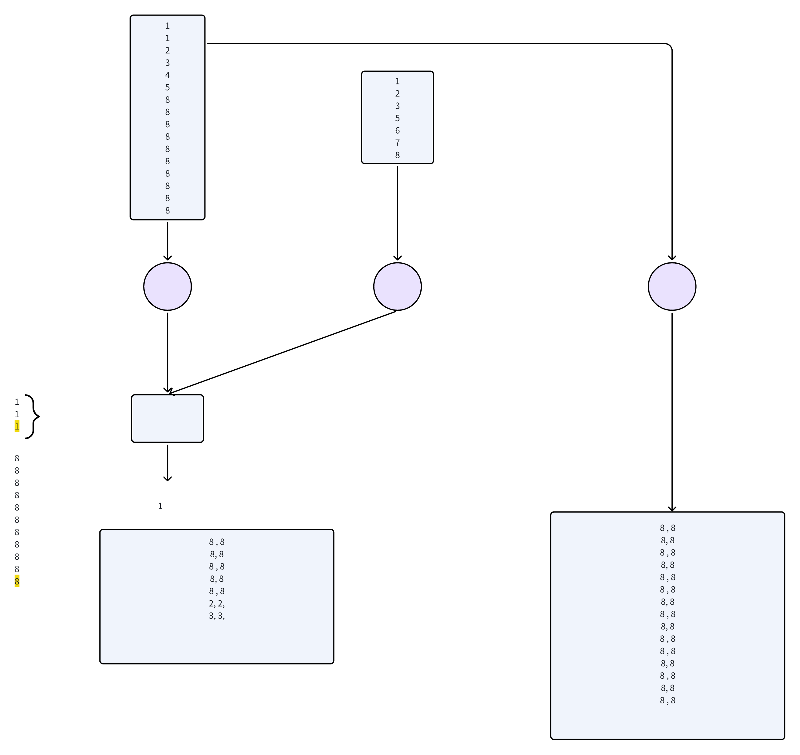

***

show conf 值名：查看配置项当前的值，如 show conf 'hive.execution.engine'。

# map任务的并行度和资源

## 并行度

map的并行度主要由InputFormat决定；

而hive中默认的InputFormat是**CombineHiveInputFormat；**

```sql
set hive.input.format=org.apache.hadoop.hive.ql.io.CombineHiveInputFormat;
```

CombineHiveInputFormat会对输入数据文件进行任务片计算，计算涉及如下3个mr参数

```sql
mapreduce.input.fileinputformat.split.minsize.per.node
mapreduce.input.fileinputformat.split.minsize.per.rack
mapreduce.input.fileinputformat.split.maxsize
```

1. 先在一个节点上，对文件按maxsize划分任务片

2. 节点内会剩余一些加起来也不够min.per.node的碎片，就去跟机架内的其他节点上类似碎片合

3. 机架内也会剩余最后一些加起来都不够min.per.rack的碎片，就去跟别的机架的类似碎片合


对切片影响最大的参数是maxsize；默认情况下，hive对maxsize设置的默认值为256000000（约256M）


## **map资源配置**

在hive中，可直接使用如下方式为每个SQL语句单独进行配置：

```sql
-- 一般用2G 就足够
set mapreduce.map.memory.mb=2048;   -- 默认是1024M

-- 如果资源非常富裕
set mapreduce.map.memory.mb=4096;


# cpu核数，其默认值为1;该值一般无需调整。
set mapreduce.map.cpu.vcores=1；
```


# reduce并行度和资源

## 并行度配置

* **`mapreduce.job.reduces=-1`**：设置Reducer的数量，默认值是-1，代表由系统根据需要自行决定Reducer的数量。

* **`hive.exec.reducers.bytes.per.reducer=256000000`**：设置每个Reducer所能处理的数据量，在Hive 0.14版本以前默认是1000000000（1GB）, Hive 0.14及之后的版本默认是256MB。输入到Reduce的数据量有1GB，那么将会拆分成4个Reducer任务。

* `hive.exec.reducers.max`=1009：设置一个作业运行的最大Reduce个；


自动计算reduce个数=min(hive.exec.reducers.max,总数据量大小/hive.exec.reducers.bytes.per.reducer)

* 或者通过mapred.reduce.tasks参数手动指定reduce个数

* 每个reduce都会生成一个文件；reduce的初始启动也会消耗资源：并不是越多越好；

* reduce如果按每hive.exec.reducers.bytes.per.reducer，这个大小取自map前的文件大小；如果map有过滤预聚合之类的，可以根据实际情况适当调大该参数或者指定mapred.reduce.tasks减少reduce个数；


## **reduce资源配置**

在hive中，可直接使用如下方式为每个SQL语句单独进行配置

```sql
set mapreduce.reduce.memory.mb=2048;   -- 默认值是1024M，太小
-- 资源充裕的情况下，4G
set mapreduce.reduce.memory.mb=4096M；


-- 该参数的含义是，单个Reduce Task申请的container容器cpu核数，其默认值为1。该值一般无需调整。
set mapreduce.reduce.cpu.vcores = 1
```


## 其他相关配置

* `hive.multigroupby.singlereducer`=true：表示如果一个SQL 语句中有多个分组聚合操作，且分组是使用相同的字段，那么这些分组聚合操作可以用一个作业的Reduce完成，而不是分解成多个作业，这可以减少作业重复读取和Shuffle的操作。


* `hive.mapred.reduce.tasks.speculative.execution=true`：表示是否开启Reduce 任务的**推测执行**。即系统在一个Reduce 任务中执行进度远低于其他任务的执行进度，会尝试在另外的机器上启动一个相同的Reduce任务。


* `hive.optimize.reducededuplication`：表示当数据需要按相同的键再次聚合时，则开启这个配置，可以减少重复的聚合操作。


* `hive.vectorized.execution.reduce.enabled`  和  `hive.vectorized.execution.reduce.groupby.enabled` 表示是否启用Reduce任务的向量化执行模式，默认是true；


* `mapreduce.job.running.map.limit=0`  和                          `mapreduce.job.running.reduce.limit=0`  限制一个job内同时运行的map或reduce任务数；默认值0表示不限制


# **表结构优化**

## 合理使用**分区**

where条件是在map端过滤，分区筛选在输入阶段过滤；

在hdfs上一个分区对应一个目录；

对常用字段使用分区字段，比如日期，筛选某天的数据速度显著提升；


## 合理使用**分桶**

分桶能够对原表或者分区所存储的数据进行重新组织，通过分桶的方式能够快速过滤掉大量不需要遍历的文件。

分桶是对文件过滤，一般使用hash模余：

```sql
记录所存储的桶 = mod(hash(分桶列的值),4)

-- hash表示Hash函数，获取分桶列的值对应的哈希值；
-- mod表示取余函数。
```


如果查询的过滤字段为分桶字段，能快速定位条件所在记录位置，而无须全表扫表，类似索引。

同时也能优化表关联

比如在两表JOIN中，相同桶的数据进行join可以节约时间。（不是一个桶的数据join不上）

使用桶的Map连接要保证连接的两张表的分桶数之间是倍数关系。

> 如果两个表的某字段分桶是10个，在两个表使用该字段关联join时，启用6个reduce


**相关参数**

```sql
-- 启用自动分桶 join 优化
SET hive.optimize.bucketmapjoin=true;

-- 启用自动排序桶表以进一步优化
SET hive.optimize.bucketmapjoin.sortedmerge=true;

```

> 开启参数后，可针对两个分桶匹配的表进行join操作，然后打印执行计划，
>
> 可看到`BucketMapJoin` 的相关信息，这意味着 Hive 启用了 `bucket join` 优化


## ~~   **索引  &#x20;**~~

Hive的索引在Hive 3.0版本中被废弃，可以使用两种方式进行替换：

* 物化视图（Materialized views）；通过使用物化视图，可以达到类似hive索引的效果，该特性在Hive 2.3.0版本中引入。

* 使用ORC/Parquet的文件存储格式，也能够实现类似索引选择性扫描，快速过滤不需要遍历的block，这是比分桶更为细粒度的过滤。


## **列筛选**

* ORC/Parquet中存储了文件定义的Schema

* ORC/Parquet可以通过Schema直接读取表所在的列，以达到列过滤的目的。


# **语句优化**

> 问： sql怎么优化
>
> 答： 这个不好说，得具体问题具体分析；要说大原则的话，无非那么几点：&#x20;
>
> &#x20;    不需要的字段不要select
>
> &#x20;    尽量减少嵌套查询
>
> &#x20;    尽量提前过滤
>
> &#x20;    不要全局count(ditinct)
>
> &#x20;    尽量不用order by
>
> &#x20;    ……
>
> 当然，我觉得你可以给我一个例子，我来思考看看能否优化；


## 消除不必要的子查询

```sql
select
    id,
    sum(salary) as amt
from (
    
    select
        *
    from t
    where id>10
    
) 
group by id
having id>10
```

这个sql的问题：

1. &#x20;select \* 就有问题：  我的最终结果其实只需要  id和salary

2. &#x20;里层输出的数据已经是 id>10的了，那外层就没有必要过滤了；既然如此，嵌套都不需要了

```sql
select
    id,
    sum(salary) as amt
from t 
where id>10
group by id
```


## 尽量谓词下推

尽可能把过滤条件往前推；


## 尽量锚定同一个关联条件

```sql
表a 
aid,.....,maid
1          m1
2          m2

表b
bid,.....,mbid
1         m1
2         m2

表c
cid,.....,mcid

表d
did,.....,mdid

==> 每个表中, id 和 mid 是一 一对应


----下面的sql是否有问题---------------------------------
explain
select
a.*,
b.*,
c.*
from a join b on a.aid  = b.bid
       join c on b.mbid = c.cid
       join d on c.mcid = d.did


----这个是优化后的写法----------------
select
a.*,
b.*,
c.*
from a join b on a.aid  = b.bid
       join c on a.aid =  c.cid
       join d on a.aid =  d.did


-- 可能要配合如下参数
set hive.merge.nway.joins=true;
```


## 合理选择关联的顺序

> 小数据量的表，放左边
>
> 这样，前面阶段产生的数据量会较小

```sql
-- 比如，有3个表，  a(最大）    b（第二）   c（第三）

-- 效率低的写法  
select   *
from a  join b  on  a.id = b.id  
        join c  on  b.id = c.id


-- 效率高的写法
select  *
from b  join c  on  b.id = c.id  
        join a  on  a.id = c.id


```

***


## 改写 count(distinct)

语句1：

```sql
select distinct age from user_info;

select count(distinct age) as dis_cnt from user_info;
```

全局count(distinct) 会把所有数据交给一个reduce处理，数据数据记录行多，跑批相对耗时长。

以上语句由一个MR处理完成。


语句2：

```sql
select count(1) as dis_cnt 
from 
(
  select age from user_info group by age
) t
```

语句2执行计划由两个MR构成；

如果key数据量比较大的情况下，两个MR处理相对会快些，比如大企业用户规模较大，查看近1年的用户活跃数（月表，用户id去重），如果使用count(distinct)，如果每个月活跃去重在1亿，一年意味着大概有12亿的数据交由1个reduce去重计数。这时候交由两个MR处理，多处一个MR的开销相比时效提升几乎可以忽略不计。


在Hive 3.0中即使倾斜，语句1将 **`hive.optimize.countdistinct`** 设置为true；写法也能达到语句2的效果。


## 避免表重复读

表过滤是指过滤掉同一个SQL 语句需要多次访问相同表的数据，将重复的访问操作过滤掉并压缩成只读取一次。

表过滤的常见操作就是使用 **multi-insert 语法&#x20;**&#x66FF;换多个查询语句求并集的句式。

```sql
set hive.exec.dynamic.partition=true;
set hive.exec.dynamic.partition.mode=nonstrict;

explain

insert into table insert_table partition(tp)

select s_age, min(s_birth) as birth, 'min' as label
from user_info
group by s_age

union all 

select s_age, max(s_birth) as birth, 'max' as label
from user_info
group by s_age
```


上面的sql，user\_info表会读两次

```sql
set hive.exec.dynamic.partition=true;
set hive.exec.dynamic.partition.mode=nonstrict;

explain

from user_info

insert into table student_stat partition(tp)
select s_age, min(s_birth) as birth, 'max' as label
group by s_age

insert into table  student_stat partition(tp)
select s_age, max(s_birth) as birth, 'min' as label
group by s_age;
```


## left semi join

类似与mysql的exists语句，只要找到了便打断不再往下找；而join会遍历试着匹配每一个能匹配上的key。

```sql
select id,t1.field1,t2.field2
from table_a t1 
left semi join table_b t2 
on t1.id = t2.id 
```

等同于

```sql
select id,t1.field1,t2.field2
from table_a t1 
where id in (
        select id from table_b
) 
```


**快速测试**

```sql
drop table if exists semi_1;
create table semi_1(id int, name string);
insert into table semi_1 values (1,'a'),(2,'b'),(2,'bb'),(3,'c');


drop table if exists semi_2;
create table semi_2(id int);
insert into table semi_2 values (1),(2),(2),(4);

------------------
select a.*
from semi_1  a
left semi join semi_2 b
on a.id= b.id

+-------+---------+
| a.id  | a.name  |
+-------+---------+
| 1     | a       |
| 2     | b       |
| 2     | bb      |
+-------+---------+

--- 等价于 ------
select
*
from semi_1 
where id in (select id from semi_2 )
limit 10;

```


## join倾斜(null倾斜）

此外我们也可以把倾斜键单独拉出来处理，比如下面一段sql

```sql
select t1.field1,t1.mobile_no,t2.field2 
from table_a t1
left join table_b t2 
on t1.mobile_no=t2.mobile_no
```


如果table\_a表的mobile手机号存在大量缺失(null)，那么我们可以把这部分单独拉出来处理，比如修改为：

```sql
select t1.fields,t1.mobile_no,t2.field2 
from 
(
    select * table_a  from where mobile_no is not null  -- 筛选非空
) t1
left join 
(
    select * from table_b where mobile_no is not null 
) t2
on t1.mobile_no=t2.mobile_no
   
union all 

select t1.fields,null as mobile,null as field2
from table_a    -- 因为null关联不上，此处省略join步骤
where mobile_no is null 
```


或者我们也可以这样：

```sql
select t1.field1,t1.mobile_no,t2.field2 
from table_a t1
left join table_b t2 
on nvl(t1.mobile_no,rand())=t2.mobile_no   -- 引入随机数打散null-key
-- 如果table_b的mobile_no有缺失的话，过滤掉，一般不加缺失过滤，执行计划也会加上该filter操作；
and t2.mobile_no is not null   
```

该方法虽然打散了null，不过mobile\_no为null部分仍然经历了shuffle和reduce过程


## groupby 倾斜 （两阶段聚合）

原sql为：

```sql
select key_name,sum(val) as sum_val
from table_name 
group by key_name
```


我们可以在第一个stage添加随机数key，改写为：

```sql
select key_name ,sum(sum_val) as sum_val
from 
(        -- 第一个mr，添加随机数列打散
        select  key_name
                ,ceiling(rand() * 99) as rnk    -- 添加随机数打散
                ,sum(val) as sum_val
        from table_name
        group by key_name,ceiling(rand() * 99)
) t 
group by key_name   -- 再次聚合，第二个mr
```

类似于添加groupby倾斜参数

***

# 自动优化机制

## map端join

* 普通的MapJoin：对使用的表类型无特殊限制，只需要配置相应的Hive配置。

* Skewed MapJoin：要求使用的表为倾斜表。

* Bucket MapJoin：要求使用的表为桶表。hash模余相同的值会被分发到同一个桶。

* Sorted Merge Bucket MapJoin：要求使用的表为桶排序表。


在Hive中使用common map join有几种方式；

**方式一，显式使用MapJoin的hint语法**

> 需要注意的是要关闭忽略hint的配置项，否则该方法不会生效，即set hive.ignore.mapjoin.hint=false;


```sql
-- hint 命令可能被禁用，这里开启
set hive.ignore.mapjoin.hint=false;

select   /*+ mapjoin(t2) */
         t2.product_type
        ,sum(t1.salses) as sum_sale
from sales_table t1 
join dim_product_info t2 
on t1.product_id = t2.product_id
group by t2.product_type
```


**方式二，让hive自动转化mapJoin**

使用Hive配置需要使用到以下配置：

* **`hive.auto.convert.join`**：在Hive 0.11版本以后，默认值为true，表示是否根据文件大小将普通的repartition连接将化为Map的连接。

* **~~`hive.smalltable.filesize /`~~` hive.mapjoin.smalltable.filesize`**：默认值为25000000（bytes）。两个配置表示的含义都是当小表的数据小于该配置指定的阀值时，将尝试使用普通repartition连接转化Map连接。该配置需要和hive.auto.convert.join配合使用。


## 倾斜表的分组聚合


优化的参数

```sql
hive.groupby.skewindata = false(默认值）

-- 如果你的groupby计算确实有倾斜，把它设置为true，即可开启自动两阶段聚合方案
```


```sql
select
    aid,
    sum(a8)
from events
group by aid


-- 会自动转成如下的等价逻辑

select
    aid,
    sum(amt) as amt
from (
    select
        aid,
        sum(a8) as amt
    from events
    group by aid,rand()
)
group by aid

```


## 倾斜表关联优化

```sql
set hive.optimize.skewjoin=true;

-- 负载均衡参数
set hive.skewjoin.key=100000;
select  t2.product_type
        ,t1.salses
from sales_table t1 
join dim_product_info t2 
on t1.product_id = t2.product_id
```


**创建倾斜表**：通过在创建表时指定数据倾斜键，将指定的数据键分割成单独的数据文件或者目录，这样可以加快数据过滤从而提高作业的运行速度。

```sql
--创建倾斜表student_list_bucket表
CREATE TABLE student_info_bucket (s_no STRING, s_score bigint)
SKEWED BY (s_score) ON (96,97)  --指定倾斜的键
STORED AS DIRECTORIES;  --以目录形式存储倾斜的数据
```

倾斜键的数据存储在专门的子目录中（比如上面的96和97）

而其他数据则存储在 HIVE\_DEFAULT\_LIST\_BUCKETING\_DIR\_NAME 目录中。


Hive中与SkewedJoin相关的配置如下：

* **`hive.optimize.skewjoin`**：默认值是false，表示是否优化有倾斜键的表连接。如果为true, Hive将为连接中的表的倾斜键创建单独的计划。


* **`hive.skewjoin.key`**：默认值为100000。如果在进行表连接时，相同键的行数多于该配置所指定的值，则认为该键是倾斜连接键，并会会拉起一个后续的处理倾斜键的map端join作业；


* **`hive.skewjoin.mapjoin.map.tasks`**：默认值为10000。倾斜连接键，在做MapJoin 的Map任务个数。需要与hive.skewjoin.mapjoin.min.split一起使用。

* **`hive.skewjoin.mapjoin.min.split`**：默认值为33554432，即32MB。指定每个split块最小值，该值用于控制倾斜连接的Map任务个数。




## 数据倾斜测试

### 数据准备

1\. 利用java程序生成id倾斜数据文件 events.txt
2\. 利用java程序生成id均匀文件  users.txt
3\. 创建文本数据表events ，并导入数据

```sql
create table events(
    aid bigint,
    a1 string,
    a2 string,
    a3 string,
    a4 string,
    a5 bigint,
    a6 bigint,
    a7 bigint,
    a8 bigint
)
row format delimited
fields terminated by ',';

load data local inpath '/root/events.txt' into table events;
```

4\. 创建文本数据表users ，并导入数据

```sql
create table users(
    bid bigint,
    b1 string,
    b2 string,
    b3 string,
    b4 string,
    b5 bigint,
    b6 bigint,
    b7 bigint,
    b8 bigint
)
row format delimited
fields terminated by ',';

load data local inpath '/root/users.txt' into table users;
```

5.创建关联结果表，用于接收join结果数据

```sql
create table joined(
    aid bigint,
    a1 string,
    a2 string,
    a3 string,
    a4 string,
    a5 bigint,
    a6 bigint,
    a7 bigint,
    a8 bigint,
    bid bigint,
    b1 string,
    b2 string,
    b3 string,
    b4 string,
    b5 bigint,
    b6 bigint,
    b7 bigint,
    b8 bigint
)
stored as orc;
```


6.创建skewed表，并导入数据

```sql
create table sk(
    aid bigint,
    a1 string,
    a2 string,
    a3 string,
    a4 string,
    a5 bigint,
    a6 bigint,
    a7 bigint,
    a8 bigint
)
skewed by (aid) on (333) stored as directories
stored as orc;

-- 插入数据
insert into table sk select * from events;
```


### join测试

1.不启用自动skewjoin，测试join执行情况

```sql
set hive.optimize.skewjoin=false;
set hive.auto.convert.join=false;
set hive.mapjoin.smalltable.filesize=25000000;
set hive.txn.stats.enabled=false;
set hive.stats.autogather=false;


truncate table joined;
-- explain
insert into table joined
select a.* ,b.* 
from events a join users b
on a.aid = b.bid;

```

2.不启用自动skewjoin，但使用skewed(orc)表

```sql
insert into table joined
select a.* ,b.* 
from sk a join users b
on a.aid = b.bid;
```


3.启用自动skewjoin，且使用skewed(orc)表

```sql
set hive.optimize.skewjoin=true;
set hive.auto.convert.join=true;
set hive.mapjoin.smalltable.filesize=25000000;
set hive.txn.stats.enabled=false;
set hive.stats.autogather=false;
set hive.skewjoin.key=2000;


truncate table joined;

explain
insert into table joined
select a.* ,b.* 
from sk a join users b
on a.aid = b.bid;


```

4.启用自动skewjoin，使用非skewed表

```sql
truncate table joined;

insert into table joined
select a.* ,b.* 
from events a join users b
on a.aid = b.bid;

```


***

## 桶表join优化

### Bucket map join

**大表和小表**

bucket map join是一种特殊的map端join，主要区别是其应用在分桶表上。

如果要开启分桶的map端join，需要开启一下配置：

```sql
SET hive.auto.convert.join=true; 
SET hive.optimize.bucketmapjoin=true; -- 默认false
```

在一个分桶的map端join中，所有参与join的表必须是分桶表，并且join的字段是分桶字段(通过CLUSTERED BY指定)，另外，对于大表的分桶数量必须是小表分桶数量的倍数。


### Sort merge bucket map (SMBM) join

**大表和小表！！！**

SMBM join是一种特殊的bucket map join；

使用SMBM join，参与join的表必须是排序的，有着相同的分桶字段，并且join字段与分桶字段相同。

小表加载在map task的内存缓存中且保持原有顺序；

在连接数据时，可以利用数据的有序性来提高速度；


配置如下：

```sql
SET hive.auto.convert.join=true; 
SET hive.auto.convert.sortmerge.join=true 
SET hive.optimize.bucketmapjoin=true; 
SET hive.optimize.bucketmapjoin.sortedmerge=true; 
SET hive.auto.convert.sortmerge.join.noconditionaltask=true; 
SET hive.auto.convert.sortmerge.join.bigtable.selection.policy= org.apache.hadoop.hive.ql.optimizer.TableSizeBasedBigTableSelectorForAutoSMJ; 
```


### Sort merge bucket (SMB) join

**大表和大表！！！**

SMBjoin应用于分桶表，如果两张参与join的表是排序的，并且分桶字段相同，这样可以使用sort-merge join；

其优势在于不用把小表完全加载至内存中，会读取两张分桶表对应的桶执行普通join(包括map与reduce)；

配置如下：

```sql
SET hive.input.format= org.apache.hadoop.hive.ql.io.BucketizedHiveInputFormat; 
SET hive.auto.convert.sortmerge.join=true; 

SET hive.auto.convert.sortmerge.join.noconditionaltask=true;
```


##

# 参数优化

## with语句

hive的with语句默认生成with语句一个视图，并不会把数据物化。

使用with语句代码看起来相对简洁；

如果sql中with的代码块有多次调用，会重复生成with执行计划，不一定会提高执行效率。


***

在高版本中，with语句可物化，参数为：**`hive.optimize.cte.materialize.threshold`**，参数默认是-1关闭。如果开启（大于0），比如n，当with…as语句被引用n次以上，会物化with生成的表，对应的with语句只执行一次。


**该sql中，tmp\_tb1 被调用了两次，该部分语句只会执行一次**

```sql
set hive.optimize.cte.materialize.threshol=2
with tmp_tb1 as (
        select user_id,register_date from tb where id!=333
),tmp_tb2 as (
        select user_id from tb2 where dt = '20220918' group by userid
)
select user_id,register_date from tmp_tb1 
union all
-- tmp_tb2剔除tmp_tb1的数据
select t2.user_id,'20220918' as register_date
from tmp_tb2 t2 left join tmp_tb1 t1 
on t2.user_id=t1.user_id 
where t1.user_id is null 
```


## 向量运算

hive开启向量计算，将一次处理一条数据变为一次处理1万条数据，以此提高程序的性能

hive.vectorized.execution.enabled：表示是否开启向量模式，默认值为 true;

开启：`set hive.vectorized.execution.enabled = true;`

只对列式存储格式（如 ORC、Parquet）才有效果；


## mapjoin

**`hive.auto.convert.join`**：是否开启MapJoin自动优化，hive 0.11版本以前默认关闭， 后版本默认开启。

**`hive.smalltable.filesize`** 或 **`hive.mapjoin.smalltable.filesize`**：默认值2500000（25MB）如果大小表在进行表连接时的小表数据量小于这个默认值，则自动开启MapJoin优化。在Hive 0.8.1以前使用hive.smalltable.filesize，之后的版本使用hive.mapjoin.smalltable.filesize参数。


**`hive.mapjoin.optimized.hashtable`**：默认值是true, Hive 0.14新增，表示使用一种内存优化的哈希表去做MapJoin。

**`hive.mapjoin.optimized.hashtable.wbsize`**：默认值是10485760（10MB），优化的哈希表使用的是一种链块的内存缓存，该值表示一个块的内存缓存大小。这种结构对于数据相对较大的表能够加快数据加载，但是对于数据量较小的表，将会分配多余的内存。


**`hive.vectorized.execution.mapjoin.native.enabled=true`**：是否使用原生的向量化执行模式执行MapJoin，它会比普通MapJoin速度快。默认值为False。


**`hive.auto.convert.join.noconditionaltask=true `&#x20;**&#x7528;于决定是否可以将多个MapJoin任务合并成一个任务。如果设置为true，那么当满足一定条件时，Hive会将多个MapJoin任务合并成一个任务。在开启该参数后，比如如下sql，假设table\_b和table\_c都是小表；

```sql
select b.field_a,c.field_a
        ,sum(a.val) as val
from table_a a 
join table_b b
on a.filed_b=b.field_b
join table_c c
on a.field_c = c.field_c
group by b.field_a,c.field_a
```

执行计划会先生成一个本地的stage，读取小表把小表推到map节点，然后map端join两个小表按b.field\_a,c.field\_a分区（如果有预聚合，map端会有显示），reduce再groupby聚合

**`hive.auto.convert.join.noconditionaltask.size=10000000 `**&#x8FD9;是另一个与合并MapJoin相关的参数，它表示在将多个MapJoin任务合并成一个任务时，所有小表的文件大小总和的最大值。

在执行计划里，如果map端的数据源来自于上一个reduce的输出，那执行计划里打印的都是reduce join，实际执行日志里，如果满足小表join则该stage没有reduce；因为上一个stage输出的数据量只有计算完才知道多少，在初始时是不确定的


此外，mapjoin小表大小取自于map时读取文件的大小（filter筛选前大小）


**mapjoin失效情况**

mapjoin 在 left或者right 连接，且小表为主表时会失效。

如下：小表 left join，大表开启了两个map，对于小表为2这一行，在上面这个map，由于没有2，大表为null，但在第二个map时，大表存在2这行有记录。这样就会出现一个问题，在大表某一个map不存在2这条记录时，大表的这个字段是为null还是2？

不可操作，所以该种情况mapjoin失效


## **map端预聚合**

Map端聚合通常指代实现Combiner类。

Combiner也是处理数据聚合，不同于Reduce是聚合集群的全局数据。

Combiner聚合是Map阶段处理后的数据，处理类似于spark里边的reduceByKey。

Map预聚合目标可以减少Shuffle数据量。如果数据经过聚合后不能明显减少，那就是浪费机器的I/O资源。


* hive.map.aggr：是否开启Map任务的聚合，默认值是true。

* hive.map.aggr.hash.min.reduction：是一个阈值，默认值是0.5。

* hive.groupby.mapaggr.checkinterval：默认值是100000。Hive在启用Combiner时会尝试取这个配置对应的数据量进行聚合，将聚合后的数据除以聚合前的数据，如果小于hive.map.aggr.hash.min.reduction会自动关闭。

* hive.map.aggr.hash.percentmemory：默认值是0.5。该值表示在进行Mapper端的聚合运行占用的最大内存。例如，分配给该节点的最大堆（xmx）为1024MB，那么聚合所能使用的最大Hash表内存是512MB，如果资源较为宽裕，可以适当调节这个参数。

* hive.map.aggr.hash.force.flush.memory.threshold：默认值是0.9。该值表示当在聚合时，所占用的Hash表内存超过0.9，将触发Hash表刷写磁盘的操作。例如Hash表内存是512MB，当Hash表的数据内存超过461MB时将触发Hash表写


## **文件压缩**

减少Shuffle数据量，开启压缩同时意味着有解压缩消耗，一般适用于大型作业。

开启文件作业的压缩只要将hive.exec.compress.intermediate参数设置为true

开启后，会对多个mr job之间的中间结果文件进行压缩


> 关于压缩
>
> 比如建目标表：   tblproperties('orc.compress'='snappy')
>
> 这个参数的含义，是在orc文件内部进行数据的压缩，而不是对整个文件进行压缩
>
> 所以，这种“snappy压缩后的”orc文件，依然可以并行划分任务片读取；
>
> &#x20;
>
> 如果要对输出文件进行整体压缩，那是mapreduce的output参数控制的
>
> mapreduce.output.fileoutputformat.compres=true
>
> mapreduce.output.fileoutputformat.compress.codec=org.apache.hadoop.io.compress.SnappyCodec


## 合并小文件

map执行前合并文件

```sql
set hive.input.format=org.apache.hadoop.hive.ql.io.CombineHiveInputFormat;
```

**alter table \<table\_name> concatenate  自动开启一个合并小文件的job**

自动合并任务，只支持 RCFile and ORCFile 文件格式的表；


## 作业并行

hive.optimize.countdistinct：默认值为true, Hive 3.0新增的配置项。

当开启该配置项时，去重并计数的作业会分成两个作业来处理这类SQL，以达到减缓SQL的数据倾斜作用。


**hive.exec.parallel：**&#x9ED8;认值是False，是否开启作业的并行。默认情况下，如果一个SQL被拆分成两个阶段，如stage1、stage2，假设这两个stage没有直接的依赖关系，还是会采用窜行的方式依次执行两个阶段。如果开启该配置，则会同时执行两个阶段。在资源较为充足的情况下开启该配置可以有效节省作业的运行时间。比如使用union all语句，union前后sql子句是没有依赖可以并行执行；join关联表如果是子查询，子查询可以并行执行

```sql
select 'label1' as label
        ,sum(val) as val
from tablename1
union all   -- 前后两段可以并行执行
select 'label2' as label
        ,sum(val) as val
from tablename2
```

set **hive.exec.parallel.thread.number**=16 设置并行度为16


## **相关性优化**

**hive.optimize.correlation**：默认值为 false，打开该配置可以减少重复的Shuffle操作。

比如sql，join已经按product\_type分区，groupby没必要重新Shuffle。


```sql
select t2.product_type,sum(t1.sale) as sale 
from dw_cus_sale_ptd t1 
join dim_product_info t2 
on t1.product_type = t2.product_type 
group by t2.product_type`
```


```sql
select
row_number() over(partition by shop order by amt desc) as rn,
sum(amt) over(partition by shop order by dt) as accu_amt
from sales

-- 如果一个sql中有多个 窗口计算，且每个窗口的分区定义字段相同，则也会这个优化机制优化成1个作业
```


## **本地执行**

文件数量大，使用分布式计算，多台机器并行计算可以显著减少计算时间。当hive数据量非常小，查询触发执行任务消耗的时间可能会比实际job的执行时间要多的多。这种情况，hive可以通过本地模式在单台机器上处理所有的任务。对于小数据集，执行时间可以明显减少。

相关参数：

**set hive.exec.mode.local=true**开启本地mr

**set hive.exec.mode.local.auto.inputbytes.max=5000000**设置local mr的最大数据数据量，当输入数据量小于这个值时采用local mr的方式，默认为134217728，即128M。

set hive.exec.mode.local.auto.input.files.max=12\`设置local mr的最大输入文件个数，当输入文件个数小于这个值时采用local mr的方式，默认为4。


## **Fetch抓取**

Fetch抓取：hive中某些情况可以不必使用mr计算，例如：select \* from table1。这种情况，hive可以简单读取文件输出到控制台。

在hive-default.xml.tempate文件中，hive.fetch.task.conversion 默认是more，老版本是minimal，这个属性修改为more后，全局查找，字段查找，limit查找不走mr计算。

比如：select id,name from table name limit 1000开启参数后，这条sql语句并不会走mr计算

在关系型数据库中使用select \* from table limit 10通常会全表扫描再limit。


***

# **其他相关**

查看SQL执行计划

**查看执行计划的基本信息，即 explain；**

查看执行计划的扩展信息，即explain extended；

查看SQL数据输入依赖的信息，即explain dependency；

查看SQL操作相关权限的信息，即explain authorization；

查看SQL的向量化描述信息，即explain vectorization。


**show：查看信息**

* show databases：获取hive的库名列表。

* show tables：获取当前库下的表名列表。

* show partitions表名：获取表的分区列表。

* show functions：获取当前可用函数列表。

* show views：获取当前库下的视图列表，Hive 2.2版本中新增。

* show tblproperties：获取某个表的表配置属性。

* show create table表名：获取某个表的完整建表语句。

* show column from表名：获取表的所有字段名。

* show locks：获取某个库、表或者某个表的分区的锁信息。

* show transactions：获取库内的事务信息。

* show compactions：获取已经被压缩或正在被压缩的表/分区的压缩信息。

* show conf ’值名’：查看配置项当前的值，如show conf ‘hive.execution.engine’。

* show table extended like表名：获取表的大部分信息，包括数据存储位置、输入/输出格式、列基本信息和表的配置信息等


**desc：描述库表信息**

* desc database库名，用于获取库的描述，包括库的存储位置及权限信息。

* **desc \[extended|formatted]表 / 分区**，用于获取表或者某个表的分区的详细信息，比show table extend更加具体。


**load：数据加载**

将本地/集群上的某个文件直接插入表/分区

```sql
LOAD DATA [LOCAL] INPATH 'filepath' [OVERWRITE] INTO TABLE tablename
[PARTITION (partcol1=val1, partcol2=val2 ...)]
```


**export命令**

将表或分区的数据连同元数据导出到指定的输出位置。

```sql
EXPORT TABLE tablename [PARTITION (part_column="value"[, ...])]
TO 'export_target_path' [ FOR replication('eventid') ]
```


有关窗口函数的执行计划

```sql
select field1
        ,field2
        ,row_number() over(partition by field2 order by field3 desc) as rnk1
        ,row_number() over(partition by field2 order by field4 desc) as rnk2
        ,row_number() over(partition by field2 order by field5 desc) as rnk5
from dw_cus_safe.dw_cus_user_login_info
```


该窗口函数没有其他特殊情况，比如小文件合并带来的mr增加，每个row\_number都是一个mr，三个stage顺序依赖；窗口函数执行过程中的key即是partition by的字段，这里是field2；


## 执行计划查看

```sql
explain
select  ... from 
```


## 分析表的统计信息

表的统计信息，对于hive进行各种基于成本的优化非常有意义；

所以，如果表缺失统计信息，可以用如下命令来分析表，补全这些统计信息

```sql
analyze  table   表名   ;
analyze  table   表名  PARTITION(dt='20240908'  ;
```


