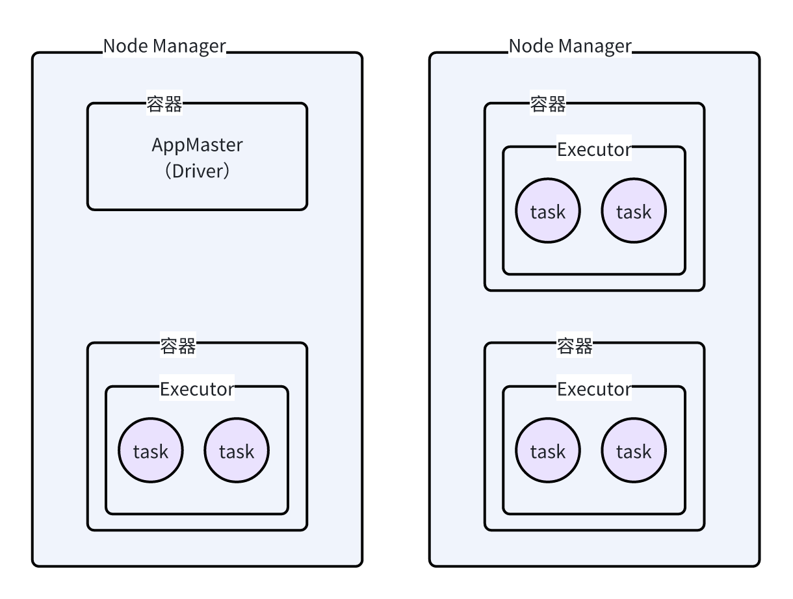
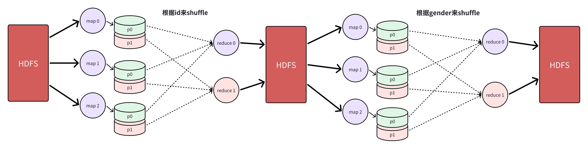
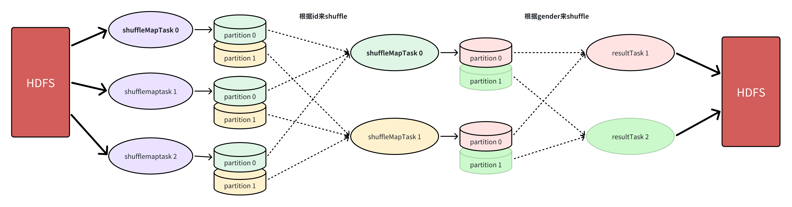
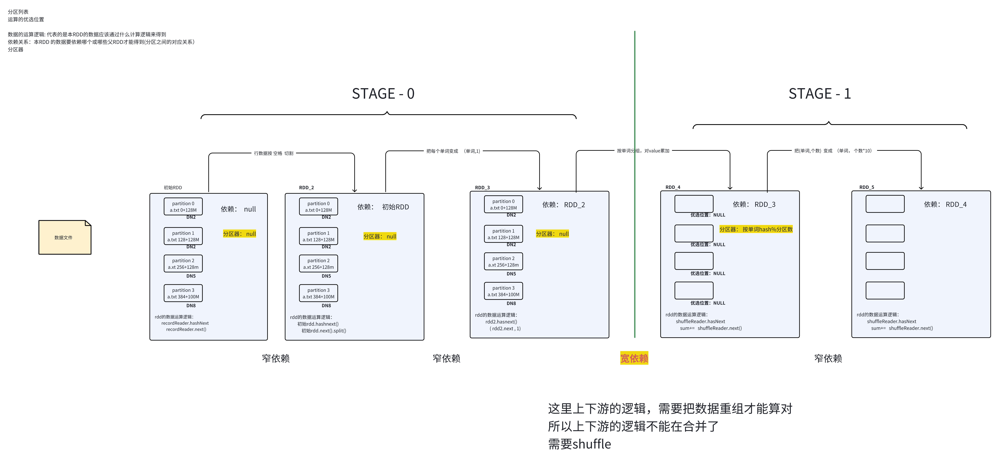
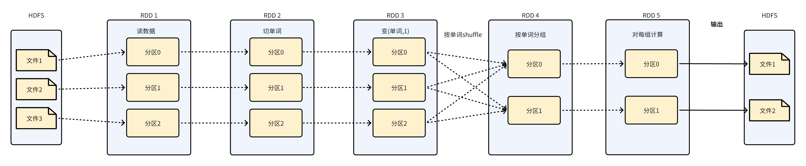
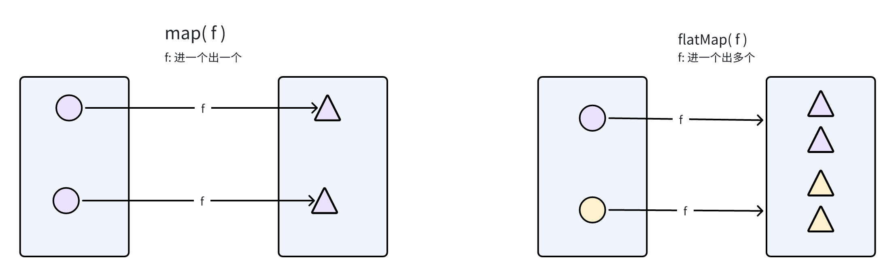
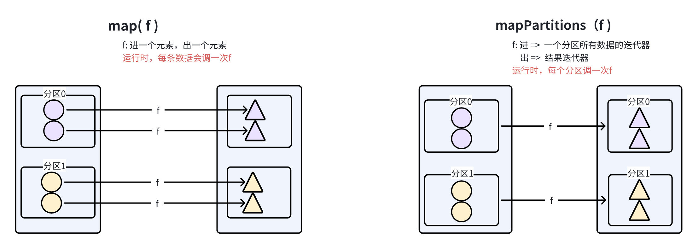
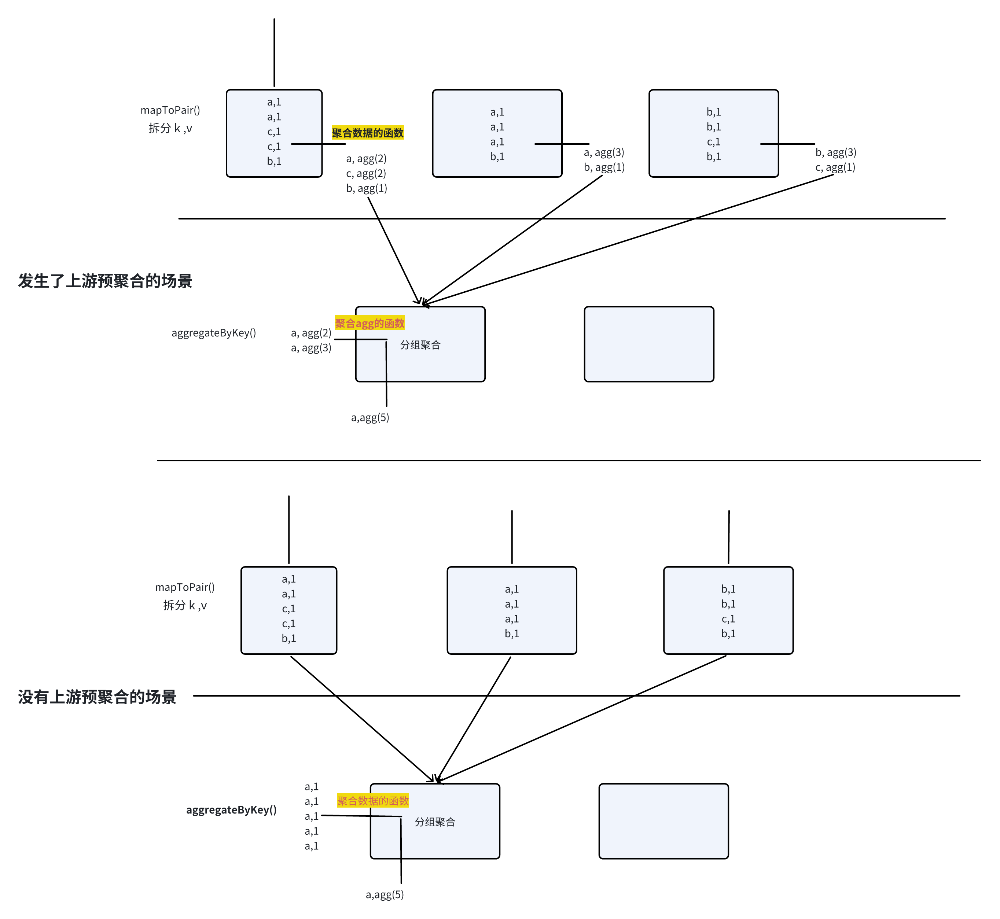

# 1 spark简介

spark是一个分布式运算引擎；

> 最早诞生于大漂亮加州大学伯克利分校，2010开源，后成为apache项目

spark支持读写各类常见的存储系统

spark有丰富的上层库：如spark-sql，spark-graphx，spark-streaming，spark-mllib 等

spark目前最主要的应用领域是批计算；

spark目前最常见的使用方式，是使用spark-sql &#x20;


# 2 spark分布式的宏观认识

## 2.1 **与MR的类似**

* 都是分布式的运算引擎；

* 在运行时，会有ApplicationMaster及Executor(ShuffleMapTask、ResultTask)等运行实例；

* 在数据处理的链条中，也会有上、下游数据shuffle的过程；




## 2.2 **与MR的最大不同**

如果一个数据处理作业需要多次shuffle，比如

```sql
select
    a.gender,
    sum(a.salary),
    avg(b.age)
from a join b on a.id = b.id
group by a.gender

-- 这个sql逻辑，用分布式运算来实现时，需要两次shuffle
第1次shuffle： 按id字段来shuffle
第2次shuffle： 按gender字段来shuffle
```

* **在mapreduce中，这个需求需要用两个job来实现**




* **而在spark中，这个需要只要一个job来实现**




# 3 spark核心抽象\[RDD]

## 3.1 rdd 核心概念

**rdd： 弹性分布式数据集；**

它就是一个对数据的抽象；所谓对数据的抽象，就是对数据的描述

虽然名为数据集，但并不是真正的“java中的集合”，rdd中并不存储数据！


**它描述的最重要信息有：**

* **分区列表** ： 本RDD所代表的数据集，有哪些分区

* **数据的计算方法（或产生方法）** ： 数据计算逻辑

* **依赖列表 ：&#x20;**&#x672C;RDD 依赖的 父RDD (分区之间的对应关系）

* **分区的优选计算位置**（preferred locations）

* 分区器 ： 父RDD该如何分区，来得到本RDD的各分区  （但分区器本身是记录在shuffle后的子rdd中）





## 3.2 api设计理念

基于spark编程，第一步就是把输入数据映射成一个RDD

然后，在RDD上添加计算逻辑得到下一个RDD，并可不断持续，从而得到一个计算逻辑的链条

最后，在最终的RDD上，触发作业的运行



> 可以把rdd类比sql中的视图view（或嵌套子查询）来理解：层层嵌套或层层递进

```scala
val rdd1 = sc.textFile("/wordcount/input")
val rdd2 = rdd1.flatMap("切词")
val rdd3 = rdd2.map(词->(词,1))
val rdd4 = rdd3.groupByKey()
val rdd5 = rdd4.mapValues(迭代组中所有的1进行累加)
rdd5.saveAsTextFile("/wordcount/output")
```

在rdd上调用的各种方法，术语称&#x4E3A;**：算子**

**算子分两类： &#x20;**

* transformation算子（转换算子） => **返回值还是RDD ，只是组装数据转换（计算）逻辑，不会触发作业执行**

* action算子（行动算子） ==> 返回值不是RDD，或没有返回值； 用于触发整个计算链条（也就是作业）的执行


# 4 转换算子示例

> 添加依赖

```xml
<dependencies>
    <dependency>
        <groupId>org.apache.spark</groupId>
        <artifactId>spark-core_2.12</artifactId>
        <version>3.1.2</version>
    </dependency>
</dependencies>
```


### 1. textFile  & wholeTextFiles

textFile: 将一个文本文件映射成一个rdd，得到的rdd中的元素的数据类型就是string，代表文件中的一行

wholeTextFiles： 将一个目录下的多个文件映射成一个rdd集合，得到的rdd中的元素是KV，K是文件名，V是文件中的一行数据


## 4.1 映射类算子


### 2. 🎀 map  & mapToPair

map算子的功能为做映射，即将原来的RDD中**对应的**每一个元素，应用外部传入的函数进行运算，返回一个新的RDD

```scala
 val rdd1: RDD[Int] = sc.parallelize(List(1,2,3,4,5,6,7,8,9,10), 2)
 val rdd2: RDD[Int] = rdd1.map(_ * 2)
```




### 3. 🎀 flatMap  & flatMapToPair

flatMap算子的功能为扁平化映射，即将原来RDD中对应的每一个元素应用外部的运算逻辑进行运算，然后再将返回的数据进行压平，类似先map，然后再flatten的操作，最后返回一个新的RDD

* **scala版本**

```scala
// scala版
val arr = Array(
  "spark hive flink",
  "hive hive flink",
  "hive spark flink",
  "hive spark flink"
)
val rdd1: RDD[String] = sc.makeRDD(arr, 2)
val rdd2: RDD[String] = rdd1.flatMap(_.split(" "))
```

* **java版本**

```java
// java版
JavaRDD<String> rdd1 = sc.parallelize(Arrays.asList("spark flink hive", "hive spark hadoop", "hadoop spark"));
JavaRDD<String[]> rdd2 = rdd1.map(s -> s.split(","));
```


### 4. 🎀 mapPartitions & mapPartitionsToPair

将数据以分区为的形式返回进行map操作，一个分区对应一个迭代器，该方法和map方法类似，只不过该方法的参数由RDD中的每一个元素变成了RDD中每一个分区的迭代器，如果在映射的过程中需要频繁创建额外的对象，使用mapPartitions要比map高效的过。

> map和mapPartitions的区别，mapPartitions一定会比map效率更高吗？
>
> 不一定：如果对RDD中的数据进行简单的映射操作，例如变大写，对数据进行简单的运算，map和mapPartitions的效果是一样的，但是如果是使用到了外部共享的对象或数据库连接，mapPartitions效率会更高一些。
>
> 原因：map出入的函数是一条一条的进行处理，如果使用数据库连接，会每来一条数据创建一个连接，导致性能过低，而mapPartitions传入的函数参数是迭代器，是以分区为单位进行操作，可以事先创建好一个连接，反复使用，操作一个分区中的多条数据。
>
> 特别提醒：如果使用mapPartitions方法不当，即将迭代器中的数据toList，就是将数据都放到内存中，可能会出现内存溢出的情况。



* **scala版本**

```scala
// scala版
val rdd1 = sc.parallelize(List(1, 2, 3, 4, 5), 2)
var r1: RDD[Int] = rdd1.mapPartitions(it => it.map(x => x * 10))
```

* **java版本**

```java
// java版
JavaRDD<Integer> rdd1 = sc.parallelize(Arrays.asList(1,2,3,6,8),4);
JavaRDD<Integer> integerJavaRDD = rdd1.mapPartitions(iter -> {
    return new Iterator<Integer>() {
        @Override
        public boolean hasNext() {
            return iter.hasNext();
        }

        @Override
        public Integer next() {
            return iter.next()*2;
        }
    };

}); 
```

###


### 5. mapPartitionsWithIndex

类似于mapPartitions, 不过函数要输入两个参数，第一个参数为分区的索引，第二个是对应分区的迭代器。函数的返回的是一个经过该函数转换的迭代器。

* **scala版本**

```scala
val rdd1 = sc.parallelize(List(1,2,3,4,5,6,7,8,9), 2)
val rdd2 = rdd1.mapPartitionsWithIndex((index, it) => {
  it.map(e => s"partition: $index, val: $e")
})
```

* **java版本**

```java
JavaRDD<Integer> rdd1 = sc.parallelize(Arrays.asList(1,2,3,6,8),4);

// 此处的index，指的是数据元素所属的partition id
JavaRDD<String> res = rdd1.mapPartitionsWithIndex((pidx, iter) -> new Iterator<String>() {

    @Override
    public boolean hasNext() {
        return iter.hasNext();
    }

    @Override
    public String next() {
        return iter.next() + "=>" + pidx;
    }
}, true);
```


### 6. 🎀 filter

filter的功能为过滤，即将原来RDD中对应的每一个元素，应用外部传入的过滤逻辑，然后返回一个新的的RDD


* **scala版本**

```scala
 val rdd1: RDD[Int] = sc.parallelize(List(1,2,3,4,5,6,7,8,9,10), 2)
 val rdd2: RDD[Int] = rdd1.filter(_ % 2 == 0)
 val rdd2: RDD[Int] = rdd1.filter(x => x % 2 == 0)
```

* **java版本**

```java
JavaRDD<String> rdd1 = sc.parallelize(Arrays.asList("spark flink hive", "hive spark hadoop", "hadoop spark"));
JavaRDD<String> rdd2 = rdd1.filter(s -> s.startsWith("a"));
```


***


### 7. keys

RDD中的数据为对偶元组类型，调用keys方法后返回一个新的的RDD，该RDD的对应的数据为原来对偶元组的全部key，该方法有隐式转换

* **scala版本**

```scala
val lst = List(
  ("spark", 1), ("hadoop", 1), ("hive", 1), ("spark", 1),
  ("spark", 1), ("flink", 1), ("hbase", 1), ("spark", 1),
  ("kafka", 1), ("kafka", 1), ("kafka", 1), ("kafka", 1),
  ("hadoop", 1), ("flink", 1), ("hive", 1), ("flink", 1)
)
//通过并行化的方式创建RDD，分区数量为4
val wordAndOne: RDD[(String, Int)] = sc.parallelize(lst, 4)
val keyRDD: RDD[String] = wordAndOne.keys
```

* **java版本**

```java
JavaRDD<Integer> rdd1 = sc.parallelize(Arrays.asList(1,2,3,6,8),4);

JavaPairRDD<Integer, Integer> pairRdd = rdd1.mapToPair(i -> Tuple2.apply(i, i * 2));
JavaRDD<Integer> res = pairRdd.keys();

System.out.println(res.collect());  // [1, 2, 3, 6, 8]
```


### 8. values

RDD中的数据为对偶元组类型，调用values方法后返回一个新的的RDD，该RDD的对应的数据为原来对偶元组的全部values


* **scala版本**

```scala
val lst = List(
  ("spark", 1), ("hadoop", 1), ("hive", 1), ("spark", 1),
  ("spark", 1), ("flink", 1), ("hbase", 1), ("spark", 1),
  ("kafka", 1), ("kafka", 1), ("kafka", 1), ("kafka", 1),
  ("hadoop", 1), ("flink", 1), ("hive", 1), ("flink", 1)
)
//通过并行化的方式创建RDD，分区数量为4
val wordAndOne: RDD[(String, Int)] = sc.parallelize(lst, 4)
val valueRDD: RDD[Int] = wordAndOne.values
```

* **java版本**

```java
JavaRDD<Integer> rdd1 = sc.parallelize(Arrays.asList(1,2,3,6,8),4);

JavaPairRDD<Integer, Integer> pairRdd = rdd1.mapToPair(i -> Tuple2.apply(i, i * 2));
JavaRDD<Integer> res = pairRdd.values();

System.out.println(res.collect());   // [2, 4, 6, 12, 16]
```


### 9. mapValues

RDD中的数据为对偶元组类型，将value应用传入的函数进行运算后再与key组合成元组返回一个新的RDD


* **scala版本**

```scala
val lst = List(("spark", 5), ("hive", 3), ("hbase", 4), ("flink", 8))
val rdd1: RDD[(String, Int)] = sc.parallelize(lst, 2)
//将每一个元素的次数乘以10再可跟key组合在一起
//val rdd2 = rdd1.map(t => (t._1, t._2 * 10))
val rdd2 = rdd1.mapValues(_ * 10)
```


* **java版本**

```java
JavaRDD<Integer> rdd1 = sc.parallelize(Arrays.asList(1,2,3,6,8),4);

JavaPairRDD<Integer, Integer> pairRdd = rdd1.mapToPair(i -> Tuple2.apply(i, i * 2));
// 返回此前的key和处理后的value
JavaPairRDD<Integer, Integer> res = pairRdd.mapValues(v -> Math.min(v, 6));

System.out.println(res.collect());  // [(1,2), (2,4), (3,6), (6,6), (8,6)]
```


### 10. flatMapValues

RDD中的数据为对偶元组类型，将value应用传入的函数进行flatMap打平后再与key组合成元组返回一个新的RDD

* **scala版本**

```scala
/** scala 版本 **/
val lst = List(("spark", "1,2,3"), ("hive", "4,5"), ("hbase", "6"), ("flink", "7,8"))
val rdd1: RDD[(String, String)] = sc.parallelize(lst, 2)
//将value打平，再将打平后的每一个元素与key组合("spark", "1,2,3") =>（"spark",1）,（"spark",2）,（"spark",3）
val rdd2: RDD[(String, Int)] = rdd1.flatMapValues(_.split(",").map(_.toInt))
//    val rdd2 = rdd1.flatMap(t => {
//      t._2.split(",").map(e => (t._1, e.toInt))
//    })
```

* **java版本**

```java
/** java 版本 **/
List<Tuple2<String, String>> list = Arrays.asList(
        Tuple2.apply("spark", "1,2,3"),
        Tuple2.apply("hive", "4,5"),
        Tuple2.apply("hbase", "6"),
        Tuple2.apply("flink", "7,8"));

JavaRDD<Tuple2<String, String>> rdd1 = sc.parallelize(list);
JavaPairRDD<String, String> pairRDD = rdd1.mapToPair(p -> p);

JavaPairRDD<String, Integer> res = pairRDD.flatMapValues(new FlatMapFunction<String, Integer>() {
    @Override
    public Iterator<Integer> call(String s) throws Exception {
        return Arrays.stream(s.split(",")).mapToInt(Integer::parseInt).iterator();
    }
});

// [(spark,1), (spark,2), (spark,3), (hive,4), (hive,5), (hbase,6), (flink,7), (flink,8)]
System.out.println(res.collect());
```


## 4.2 聚合类算子


### 11. 🎀 aggregateByKey



与reduceByKey类似，并且可以指定初始值，每个分区应用一次初始值，传入两个函数，分别是局部聚合的计算逻辑、全局聚合的逻辑。

* **scala版本**

```scala
/** scala 版本 **/
val lst: Seq[(String, Int)] = List(
  ("spark", 1), ("hadoop", 1), ("hive", 1), ("spark", 1),
  ("spark", 1), ("flink", 1), ("hbase", 1), ("spark", 1),
  ("kafka", 1), ("kafka", 1), ("kafka", 1), ("kafka", 1),
  ("hadoop", 1), ("flink", 1), ("hive", 1), ("flink", 1)
)
//通过并行化的方式创建RDD，分区数量为4
val wordAndOne: RDD[(String, Int)] = sc.parallelize(lst, 4)
//在第一个括号中传入初始化，第二个括号中传入两个函数，分别是局部聚合的逻辑和全局聚合的逻辑
val reduced: RDD[(String, Int)] = wordAndOne.aggregateByKey(0)(_ + _, _ + _)
```

* **java版本**

```java
/** java 版本 **/
List<Tuple2<String, Integer>> datas = Arrays.asList(
        Tuple2.apply("spark", 1), Tuple2.apply("hive", 1), Tuple2.apply("hive", 1), Tuple2.apply("spark", 1),
        Tuple2.apply("spark", 1), Tuple2.apply("hbase", 1), Tuple2.apply("hbase", 1), Tuple2.apply("spark", 1));
JavaPairRDD<String, Integer> pairRdd = sc.parallelizePairs(datas);

// 指定一个聚合的初始值(聚合值可以是任意类型）
pairRdd.aggregateByKey(
        new ArrayList<String>(),  // 零值的初始累加器
        (lst,v)->{lst.add(String.valueOf(v));return lst;},  // 聚合元素到累加器的函数
        (l1,l2)->{l1.addAll(l2);return l1;}  // 聚合累加器到累加器的函数
);
```


### 12. 🎀 reduceByKey

将数据按照相同的key进行聚合，特点是先在每个分区中进行局部分组聚合，然后将每个分区聚合的结果从上游拉取到下游再进行全局分组聚合

* **scala版本**

```scala
/** scala 版本 **/
val lst = List(
  ("spark", 1), ("hadoop", 1), ("hive", 1), ("spark", 1),
  ("spark", 1), ("flink", 1), ("hbase", 1), ("spark", 1),
  ("kafka", 1), ("kafka", 1), ("kafka", 1), ("kafka", 1),
  ("hadoop", 1), ("flink", 1), ("hive", 1), ("flink", 1)
)
//通过并行化的方式创建RDD，分区数量为4
val wordAndOne: RDD[(String, Int)] = sc.parallelize(lst, 4)
val reduced: RDD[(String, Int)] = wordAndOne.reduceByKey(_ + _)
```

* **java版本**

```java
/** java 版本 **/
List<Tuple2<String, Integer>> datas = Arrays.asList(
        Tuple2.apply("spark", 1), Tuple2.apply("hadoop", 1), Tuple2.apply("hive", 1), Tuple2.apply("spark", 1),
        Tuple2.apply("spark", 1), Tuple2.apply("flink", 1), Tuple2.apply("hbase", 1), Tuple2.apply("spark", 1));

JavaPairRDD<String, Integer> pairRdd = sc.parallelizePairs(datas);
JavaPairRDD<String, Integer> res = pairRdd.reduceByKey(Integer::sum);  //(v1,v2)->v1+v2
System.out.println(res.collect());
```

###

### 13. foldByKey

与reduceByKey类似，只不过是可以指定初始值，每个分区应用一次初始值，先在每个进行局部聚合，然后再全局聚合，局部聚合的逻辑与全局聚合的逻辑相同。

* **scala版本**

```scala
 /** scala 版本 **/
 val lst: Seq[(String, Int)] = List(
  ("spark", 1), ("hadoop", 1), ("hive", 1), ("spark", 1),
  ("spark", 1), ("flink", 1), ("hbase", 1), ("spark", 1),
  ("kafka", 1), ("kafka", 1), ("kafka", 1), ("kafka", 1),
  ("hadoop", 1), ("flink", 1), ("hive", 1), ("flink", 1)
)
//通过并行化的方式创建RDD，分区数量为4
val wordAndOne: RDD[(String, Int)] = sc.parallelize(lst, 4)

//与reduceByKey类似，只不过是可以指定初始值，每个分区应用一次初始值
val reduced: RDD[(String, Int)] = wordAndOne.foldByKey(0)(_ + _)
```

```java
/** java 版本 **/
List<Tuple2<String, Integer>> datas = Arrays.asList(
        Tuple2.apply("spark", 1), Tuple2.apply("hive", 1), Tuple2.apply("hive", 1), Tuple2.apply("spark", 1),
        Tuple2.apply("spark", 1), Tuple2.apply("hbase", 1), Tuple2.apply("hbase", 1), Tuple2.apply("spark", 1));
JavaPairRDD<String, Integer> pairRdd = sc.parallelizePairs(datas);

// 指定一个聚合的初始值
JavaPairRDD<String, Integer> res = pairRdd.foldByKey(10, Integer::sum);
// [(hive,22), (spark,44), (hbase,22)]
System.out.println(res.collect());
```


### 14. combineByKey

> combineByKey  与  aggregateBykey 和 reduceByKey的一个细节区别： &#x20;
>
> combineByKey  可以在调用时**指定是否做map端预聚合**
>
> 而另外两个是写死的，一定会做map端预聚合

* **scala版本**

```scala
/** scala 版本 **/
val lst = List(
  ("spark", 1), ("hadoop", 1), ("hive", 1), ("spark", 1),
  ("spark", 1), ("flink", 1), ("hbase", 1), ("spark", 1),
  ("kafka", 1), ("kafka", 1), ("kafka", 1), ("kafka", 1),
  ("hadoop", 1), ("flink", 1), ("hive", 1), ("flink", 1)
)
//通过并行化的方式创建RDD，分区数量为4
val wordAndOne: RDD[(String, Int)] = sc.parallelize(lst, 4)
//调用combineByKey传入三个函数
//val reduced = wordAndOne.combineByKey(x => x, (a: Int, b: Int) => a + b, (m: Int, n: Int) => m + n)
val f1 = (x: Int) => {
  val stage = TaskContext.get().stageId()
  val partition = TaskContext.getPartitionId()
  println(s"f1 function invoked in state: $stage, partition: $partition")
  x
}
//在每个分区内，将key相同的value进行局部聚合操作
val f2 = (a: Int, b: Int) => {
  val stage = TaskContext.get().stageId()
  val partition = TaskContext.getPartitionId()
  println(s"f2 function invoked in state: $stage, partition: $partition")
  a + b
}
//第三个函数是在下游完成的
val f3 = (m: Int, n: Int) => {
  val stage = TaskContext.get().stageId()
  val partition = TaskContext.getPartitionId()
  println(s"f3 function invoked in state: $stage, partition: $partition")
  m + n
}
val reduced = wordAndOne.combineByKey(f1, f2, f3)
```

* **java版本**

```java
/** java 版本 **/
List<Tuple2<String, Integer>> datas = Arrays.asList(
            Tuple2.apply("spark", 1), Tuple2.apply("hive", 1), Tuple2.apply("hive", 1), Tuple2.apply("spark", 1),
            Tuple2.apply("spark", 1), Tuple2.apply("hbase", 1), Tuple2.apply("hbase", 1), Tuple2.apply("spark", 1));
JavaPairRDD<String, Integer> pairRdd = sc.parallelizePairs(datas);


    // 以一个整数作为累加器
    JavaPairRDD<String, Integer> res = pairRdd.combineByKey(i -> 1, Integer::sum, Integer::sum);

    // 以一个自定义类型作为累加器
    JavaPairRDD<String, Agg> res = pairRdd.combineByKey(
            // 生成一个包含第一条数据的累加器（不是一个零值累加器）
            v -> {
                Agg agg = new Agg();
                agg.lst.add(v);
                return agg;
            },
            // 局部聚合（可能发生也可能不发生）
            (agg, v) -> {
                agg.lst.add(v);
                return agg;
            }
            // 全局聚合
            , (agg1, agg2) -> {
                agg1.lst.addAll(agg2.lst);
                return agg1;
            });

    System.out.println(res.collect());
}


public static class Agg implements Serializable {

    List<Integer> lst = new ArrayList<>();

    @Override
    public String toString() {
        return lst.toString();
    }
}
```


###

### 15. groupByKey  & groupBy

按照key进行分组(仅分组不聚合)

* **scala版本**

```scala
  /** scala 版本 **/
 val lst = List(
  ("spark", 1), ("hadoop", 1), ("hive", 1), ("spark", 1),
  ("spark", 1), ("flink", 1), ("hbase", 1), ("spark", 1),
  ("kafka", 1), ("kafka", 1), ("kafka", 1), ("kafka", 1),
  ("hadoop", 1), ("flink", 1), ("hive", 1), ("flink", 1)
)
//通过并行化的方式创建RDD，分区数量为4
val wordAndOne: RDD[(String, Int)] = sc.parallelize(lst, 4)
//按照key进行分组
val grouped: RDD[(String, Iterable[Int])] = wordAndOne.groupByKey()
```

```java
/** java 版本 **/
List<Tuple2<String, Integer>> datas = Arrays.asList(
        Tuple2.apply("spark", 1), Tuple2.apply("hive", 1), Tuple2.apply("hive", 1), Tuple2.apply("spark", 1),
        Tuple2.apply("spark", 1), Tuple2.apply("hbase", 1), Tuple2.apply("hbase", 1), Tuple2.apply("spark", 1));
JavaPairRDD<String, Integer> pairRdd = sc.parallelizePairs(datas);

// 返回的rdd是 <key,value迭代器>
JavaPairRDD<String, Iterable<Integer>> grouped = pairRdd.groupByKey();
```


### 16. distinct 去重

distinct是对RDD中的元素进行取重，底层使用的是reduceByKey实现的，先局部去重，然后再全局去重

* **scala版本**

```scala
val arr = Array(
  "spark", "hive", "spark", "flink",
  "spark", "hive", "hive", "flink",
  "flink", "flink", "flink", "spark"
)
val rdd1: RDD[String] = sc.parallelize(arr, 3)
//去重
val rdd2: RDD[String] = rdd1.distinct()
```

distinct的底层实现如下：

```scala
val rdd11: RDD[(String, Null)] = rdd1.map((_, null))
val rdd12: RDD[String] = rdd11.reduceByKey((a, _) => a).keys
```


* **java版本**

> 对自定义类型去重，需要重写hashcode

```java
    JavaSparkContext sc = new JavaSparkContext(conf);
    
    // 对基本类型去重
    JavaRDD<Integer> rdd1 = sc.parallelize(Arrays.asList(1, 3, 5, 1, 3, 3, 6));
    JavaRDD<Integer> distinct1 = rdd1.distinct();


    // 对自定义类型去重
    // 需要重写hashcode：让对象成员值相同的返回相同的hashcode
    List<Person> lst = Arrays.asList(
            new Person("aa", 18),
            new Person("bb", 28),
            new Person("cc", 38),
            new Person("aa", 18),
            new Person("bb", 28),
            new Person("dd", 38)
    );
    JavaRDD<Person> rdd = sc.parallelize(lst);
    JavaRDD<Person> distinct = rdd.distinct();

    distinct.foreach(e-> System.out.println(e));

}

@Getter
@Setter
@NoArgsConstructor
@AllArgsConstructor
@ToString
@Data  // 小辣椒生成的hashcode，是利用对象中成员变量值生成；如果成员变量值相同，则两对象的hashcode就相同
public static class Person implements Serializable {
    private String name;
    private int age;
}
```

> 去重的实现：
>
> 先把rdd\[K] => rdd\[K,v] => reduceBykey() => 返回key


### 17. sortBy  & sortByKey

* sortBy针对任意RDD，需要传入一个抽取key的function

* sortBykey针对KV RDD

按照指的的排序规则进行全局排序

* **scala版本 sortBy**

```scala
val lines: RDD[String] = sc.textFile("hdfs://node-1.51doit.cn:9000/words")
//切分压平
val words: RDD[String] = lines.flatMap(_.split(" "))
//将单词和1组合
val wordAndOne: RDD[(String, Int)] = words.map((_, 1))
//分组聚合
val reduced: RDD[(String, Int)] = wordAndOne.reduceByKey(_ + _)
//按照单词出现的次数，从高到低进行排序
val sorted: RDD[(String, Int)] = reduced.sortBy(_._2, false)
```

* **scala版本 sortByKey**

```scala
val lines: RDD[String] = sc.textFile("hdfs://node-1.51doit.cn:9000/words")
//切分压平
val words: RDD[String] = lines.flatMap(_.split(" "))
//将单词和1组合
val wordAndOne: RDD[(String, Int)] = words.map((_, 1))
//分组聚合
val reduced: RDD[(String, Int)] = wordAndOne.reduceByKey(_ + _)
//按照单词出现的次数，从高到低进行排序
//val sorted: RDD[(String, Int)] = reduced.sortBy(_._2, false)
//val keyed: RDD[(Int, (String, Int))] = reduced.keyBy(_._2).sortByKey()
val sorted = reduced.map(t => (t._2, t)).sortByKey(false)
```

> sortBy、sortByKey是Transformation，但是为什么会生成job？
>
> 因为sortBy、sortByKey需要实现全局排序，使用的是**RangePartitioner**，在构建RangePartitioner时，会对数据进行采样来生成rangePartitioner需要的分界点，所以会触发Action，根据采样的结果来构建RangePartitioner。
>
> RangePartitioner可以保证数据按照一定的范围全局有序，同时在shuffle的同时，有设置了setKeyOrdering指定了排序规则，这样就又可以保证数据在每个分区内有序了！


###

### 18. repartitionAndSortWithinPartitions

> 比起我们把数据分组之后，自己用迭代器获取到一组数据放入内存排序，效率更高
>
> **因为，这个算子的底层会把排序的逻辑，下推到shuffle的机制中去**


按照值的分区器进行分区，并且将数据按照指的的排序规则在**分区内排序**，底层使用的是ShuffledRDD，设置了指定的分区器和排序规则

```scala
val lst: Seq[(String, Int)] = List(
  ("spark", 3), ("hadoop", 1), ("hive",3), ("spark", 2),
  ("spark", 9), ("flink", 2), ("hbase", 1), ("spark", 4),
  ("kafka", 8), ("kafka", 5), ("kafka", 7), ("kafka", 1),
  ("hadoop", 5), ("flink", 4), ("hive", 6), ("flink", 3)
)
//通过并行化的方式创建RDD，分区数量为4
val wordAndOne: RDD[(String, Int)] = sc.parallelize(lst, 4)
val partitioner = new HashPartitioner(wordAndOne.partitions.length)
//按照指定的分区进行分区，并且将数据按照指定的排序规则在分区内排序
val partitioned = wordAndOne.repartitionAndSortWithinPartitions(partitioner)
```

repartitionAndSortWithinPartitions的底层实现：

```scala
new ShuffledRDD[K, V, V](self, partitioner).setKeyOrdering(ordering)
```


***


## 4.3 多RDD算子

### 19.  cogroup

协同分组，即将多个RDD中对应的数据，使用相同的分区器（HashPartitioner），将来自多个RDD中的key相同的数据通过网络传入到同一台机器的同一个分区中(与*groupByKey、groupBy区别是：groupByKey、groupBy只能对一个RDD进行分组*)

注意:调用cogroup方法，两个RDD中对应的数据都必须是对偶元组类型，并且key类型一定相同

&#x20;

```scala
//通过并行化的方式创建一个RDD
val rdd1 = sc.parallelize(List(("tom", 1), ("tom", 2), ("jerry", 3), ("kitty", 2), ("jerry", 4)), 3)
//通过并行化的方式再创建一个RDD
val rdd2 = sc.parallelize(List(("jerry", 2), ("tom", 1), ("shuke", 2), ("jerry", 4)), 2)
//将两个RDD都进行分组
val grouped: RDD[(String, (Iterable[Int], Iterable[Int]))] = rdd1.cogroup(rdd2)
```

&#x20;

&#x20;

### 20. join

两个RDD进行join，相当于SQL中的内关联join

两个RDD为什么要进行join？想要的数据来自于两个数据集，并且两个数据集的数据存在相同的条件，必须关联起来才能得到想要的全部数据

```scala
//通过并行化的方式创建一个RDD
val rdd1 = sc.parallelize(List(("tom", 1), ("tom", 2), ("jerry", 3), ("kitty", 2)), 2)
//通过并行化的方式再创建一个RDD
val rdd2 = sc.parallelize(List(("jerry", 2), ("tom", 1.0), ("shuke", 2), ("jerry", 4)), 3)
val rdd3: RDD[(String, (Int, Double))] = rdd1.join(rdd2)
```

&#x20;


### 21. leftOuterJoin

左外连接，相当于SQL中的左外关联

```scala
 //通过并行化的方式创建一个RDD
val rdd1 = sc.parallelize(List(("tom", 1), ("tom", 2), ("jerry", 3), ("kitty", 2)), 2)
//通过并行化的方式再创建一个RDD
val rdd2 = sc.parallelize(List(("jerry", 2), ("tom", 1), ("shuke", 2), ("jerry", 4)), 2)
val rdd3: RDD[(String, (Int, Option[Int]))] = rdd1.leftOuterJoin(rdd2)
```


### 22. rightOuterJoin

右外连接，相当于SQL中的右外关联

```scala
//通过并行化的方式创建一个RDD
val rdd1 = sc.parallelize(List(("tom", 1), ("tom", 2), ("jerry", 3), ("kitty", 2)), 2)
//通过并行化的方式再创建一个RDD
val rdd2 = sc.parallelize(List(("jerry", 2), ("tom", 1), ("shuke", 2), ("jerry", 4)), 2)
val rdd3: RDD[(String, (Option[Int], Int))] = rdd1.rightOuterJoin(rdd2)
```


### 23. fullOuterJoin

全连接，相当于SQL中的全关联


```scala
 //通过并行化的方式创建一个RDD
val rdd1 = sc.parallelize(List(("tom", 1), ("tom", 2), ("jerry", 3), ("kitty", 2)), 2)
//通过并行化的方式再创建一个RDD
val rdd2 = sc.parallelize(List(("jerry", 2), ("tom", 1), ("shuke", 2), ("jerry", 4)), 2)
val rdd3: RDD[(String, (Option[Int], Option[Int]))] = rdd1.fullOuterJoin(rdd2)
```


### 24. union&#x20;

将两个类型一样的RDD合并到一起，返回一个新的RDD，新的RDD的分区数量是原来两个RDD的分区数量之和，数据没有被打散重组，即没有shuffle

```scala
//两个RDD进行union，对应的数据类型必须一样
//Union不会去重
val rdd1 = sc.parallelize(List(1,2,3,4), 2)
val rdd2 = sc.parallelize(List(5, 6, 7, 8, 9,10), 3)
val rdd3 = rdd1.union(rdd2)
println(rdd3.partitions.length)
```

```java
List<Tuple2<String, String>> lst1 = Arrays.asList(
        Tuple2.apply("spark", "1,2,3"),
        Tuple2.apply("hive", "4,5")
        );
JavaRDD<Tuple2<String, String>> rdd1 = sc.parallelize(lst1);

List<Tuple2<String, String>> lst2 = Arrays.asList(
        Tuple2.apply("hbase", "6"),
        Tuple2.apply("flink", "7,8"));
JavaRDD<Tuple2<String, String>> rdd2 = sc.parallelize(lst2);

rdd1.union(rdd2).foreach(s->System.out.println(s));
```


### 25. intersection

求交集，底层使用的是cogroup实现的

**交集的结果是去重的**

```scala
val rdd1 = sc.parallelize(List(1,2,3,4,4,6), 2)
val rdd2 = sc.parallelize(List(3,4,5,6,7,8), 2)
//求交集
val rdd3: RDD[Int] = rdd1.intersection(rdd2)

//使用cogroup实现intersection的功能
val rdd11 = rdd1.map((_, null))
val rdd22 = rdd2.map((_, null))
val rdd33: RDD[(Int, (Iterable[Null], Iterable[Null]))] = rdd11.cogroup(rdd22)
val rdd44: RDD[Int] = rdd33.filter { case (_, (it1, it2)) => it1.nonEmpty && it2.nonEmpty }.keys
```


### 26. subtract

求两个RDD的差集，将第一个RDD中的数据，如果在第二个RDD中出现了，就从第一个RDD中移除

**差集的结果不会做去重**

```scala
val rdd1 = sc.parallelize(List("A", "B", "C", "D", "E"))
val rdd2 = sc.parallelize(List("A", "B"))

val rdd3: RDD[String] = rdd1.subtract(rdd2)
//返回 C D E
```


### 27. cartesian

笛卡尔积

```scala
val rdd1 = sc.parallelize(List("tom", "jerry"), 2)
val rdd2 = sc.parallelize(List("tom", "kitty", "shuke"), 3)
val rdd3 = rdd1.cartesian(rdd2)
```


## 分区算子

### 28. partitionBy

按照指定的分区器进行分区，底层使用的是ShuffledRDD

* **scala版本**

```scala
val lst: Seq[(String, Int)] = List(
  ("spark", 1), ("hadoop", 1), ("hive", 1), ("spark", 1),
  ("spark", 1), ("flink", 1), ("hbase", 1), ("spark", 1),
  ("kafka", 1), ("kafka", 1), ("kafka", 1), ("kafka", 1),
  ("hadoop", 1), ("flink", 1), ("hive", 1), ("flink", 1)
)
//通过并行化的方式创建RDD，分区数量为4
val wordAndOne: RDD[(String, Int)] = sc.parallelize(lst, 4)
val partitioner = new HashPartitioner(wordAndOne.partitions.length)
//按照指定的分区进行分区
val partitioned: RDD[(String, Int)] = wordAndOne.partitionBy(partitioner)
```

* **java版本**

> partitionBy只能在kvRdd上调用

```java
JavaPairRDD<String, Integer> kvRdd = rdd1.mapToPair(i -> Tuple2.apply(i + "", i));
JavaPairRDD<String, Integer> partitionByRdd = kvRdd.partitionBy(new HashPartitioner(2) {
    @Override
    public int getPartition(Object key) {
        String intStr = (String) key;
        int k = Integer.parseInt(intStr);

        if (k % 2 == 0) {
            return 1;
        } else {
            return 0;
        }
    }
});
```


### 29. repartition

repartition的功能是重新分区，一定会shuffle，**即将数据随机打散**。repartition的功能是改变分区数量（可以增大、减少、不变）可以将数据相对均匀的重新分区，可以改善数据倾斜的问题

```scala
val rdd1 = sc.parallelize(List(1,2,3,4,5,6,7,8,9,10), 3)
//repartition方法一定shuffle
//不论将分区数量变多、变少、或不变，都shuffle
val rdd2 = rdd1.repartition(3)
```


**reparation的底层调用的是coalesce，shuffle = true**

```scala
coalesce(numPartitions, shuffle = true)
```


### 30. coalesce

coalesce可以shuffle，也可以不shuffle；

取决于传入的参数shuffle是否为true；

> 如果把分区数变**多**，则shuffle必须为true才有效果；否则分区根本没变
>
> 如果把分区数变**少，**&#x90A3;么shuffle可以为true（数据将打散重组），也可以false（多个分区合并成一个分区）


* shuffle = true

```scala
val rdd1 = sc.parallelize(List(1,2,3,4,5,6,7,8,9,10), 3)
//shuffle = true
val rdd2 = rdd1.coalesce(3, true)
//与repartition(3)功能一样
```


* shuffle = false

```scala
val rdd1 = sc.parallelize(List(1,2,3,4,5,6,7,8,9,10), 4)
//shuffle = false
val rdd2 = rdd1.coalesce(2, false)
```


&#x20;

# 5 **Action算子示例**

Action算子会触发Job的生成，底层调用的是sparkContext.runJob方法，根据最后一个RDD，从后往前，切分Stage，生成Task


### 1. saveAsTextFile

将数据以文本的形式保存到文件系统中，一个分区对应一个结果文件，可以指定hdfs文件系统，也可以指定本地文件系统（本地文件系统要写file://协议），数据的写入是下Executor中Task写入的，是多个Task并行写入的。

```scala
val rdd1 = sc.parallelize(List(1,2,3,4,5), 2)
rdd1.saveAsTextFile("hdfs://node-1.51doit.cn:9000/out2")
```


### 2. saveAsNewApiHadoopFile


### 3. collect

每个分区对应的Task，将数据在Executor中，将数据数组的形式保存到内存中，然后将每个分区对应的数据以数组形式通过网络收集回Driver端，数据按照分区编号有序返回


```scala

val rdd1 = sc.parallelize(List(1,2,3,4,5,6,7,8,9,10), 4)
val rdd2 = rdd1.map(_ * 10)
//调用collect方法，是一个Action
val res: Array[Int] = rdd2.collect()
println(res.toBuffer)
```

collect底层实现：

```scala
def collect(): Array[T] = withScope {
  //this代表最后一个RDD，即触发Action的RDD
  //(iter: Iterator[T]) => iter.toArray 函数代表对最后一个进行的处理逻辑，即将每个分区对应的迭代器中的数据迭代处出来，放到内存中
  //最后将每个分区对应的数组通过网络传输到Driver端
  val results = sc.runJob(this, (iter: Iterator[T]) => iter.toArray)
  //在Driver端，将多个数组合并成一个数组
  Array.concat(results: _*)
}
```

> 使用collect方法的注意事项：
>
> 如果Driver的内存相对较小，并且每个分区对应的数据比较大，通过网络传输的数据，返回到Driver，当返回到Driver端的数据达到了一定大小，就不收集了，即将一部分无法收集的数据丢弃
>
>
>
> 如果需要将大量的数据收集到Driver端，那么可以在提交任务的时候指定Driver的内存大小 (--driver-memory 2g)


### 4. count

返回rdd元素的数量，先在每个分区内求数据的条数，然后再将每个分区返回的条数在Driver进行求和

```scala
val rdd1 = sc.parallelize(List(5,7 ,9,6,1 ,8,2, 4,3,10), 4)
//在每个分区内先计算每个分区对应的数据条数（使用的是边遍历，边计数）
//然后再将每个分区返回的条数，在Driver进行求和
val r: Long = rdd1.count()
```


### 5. aggregate

aggregate方式是Action，可以将多个分区的数据进行聚合运算，例如进行相加，比较大小等

> aggregate方法可以指定一个初始值，初始值在每个分区进行聚合时会应用一次，全局聚合时会在使用一次

```scala
val rdd1 = sc.parallelize(List(1,2,3,4,5,6,7,8,9,10), 4)

//f1是在Executor端执行的
val f1 = (a: Int, b: Int) => {
  println("f1 function invoked ~~~~")
  a + b
}

//f2实在Driver端执行的
val f2 = (m: Int, n: Int) => {
  println("f2 function invoked !!!!")
  m + n
}

//返回的结果为55
val r1: Int = rdd1.aggregate(0)(f1, f2)

//返回的结果为50055
val r2: Int = rdd1.aggregate(10000)(f1, f2)

```


```scala
val rdd1 = sc.parallelize(List("a", "b", "c", "d"), 2)
val r: String = rdd1.aggregate("&")(_ + _, _ + _)

//返回的回的有两种：应为task的分布式并行运行的，先返回的结果在前面
// &&cd&ab 或 &&ab&cd
```


### 6. reduce

将数据先在每个分区内进行局部聚合，然后将每个分区返回的结果在Driver端进行全局聚合

```scala
 
val rdd1 = sc.parallelize(List(1,2,3,4,5,6,7,8,9,10), 4)
val f1 = (a: Int, b: Int) => {
  println("f1 function invoked ~~~~")
  a + b
}
//f1这个函数即在Executor中执行，又在Driver端执行
//reduce方法局部聚合的逻辑和全局聚合的逻辑是一样的
//局部聚合是在每个分区内完成（Executor）
//全局聚合实在Driver完成的
val r = rdd1.reduce(f1)
```


### 7. sum

&#x20;*sum方法是Action，实现的逻辑只能是相加*

```scala
val rdd1 = sc.parallelize(List(1,2,3,4,5,6,7,8,9,10), 4)
//sum底层调用的是fold，该方法是一个柯里化方法，第一个括号传入的初始值是0.0
//第二个括号传入的函数(_ + _) ，局部聚合和全局聚合都是相加
val r = rdd1.sum()

//sum的底层实现
val r = rdd1.fold(0.0)(_ + _)
```

**java版本**

> 必须在明确的JavaDoubleRDD 或  JavaIntRDD上面才能调用

```java
JavaDoubleRDD javaDoubleRDD = orderRDD.mapToDouble(od -> od.amt);
Double sum = javaDoubleRDD.sum();
System.out.println(sum);
```


### 8. fold

fold跟reduce类似，只不过fold是一个柯里化方法，第一个参数可以指定一个初始值

```scala
val rdd1 = sc.parallelize(List(1,2,3,4,5,6,7,8,9,10), 4)
//fold与reduce方法类似，该方法是一个柯里化方法，第一个括号传入的初始值是0.0
//第二个括号传入的函数(_ + _) ，局部聚合和全局聚合都是相加
val r = rdd1.fold(0)(_ + _)
```


### 9. min、max

将整个RDD中全部对应的数据求最大值或最小值，底层的实现是：现在每个分区内求最大值或最小值，然后将每个分区返回的数据在Driver端再进行比较（min、max没有shuffle）

```scala
val rdd1 = sc.parallelize(List(5,7 ,9,6,1 ,8,2, 4,3,10), 4)
//没有shuffle
val r: Int = rdd1.max()
```


### 10. take

返回一个由数据集的前n个元素组成的数组，即从RDD的0号分区开始取数据，take可能触发一到多次Action（可能生成多个Job）因为首先从0号分区取数据，如果取够了，就直接返回，没有取够，再触发Action，从后面的分区继续取数据，直到取够指定的条数为止

```scala
val rdd1 = sc.parallelize(List(5,7 ,9,6,1 ,8,2, 4,3,10), 4)
//可能会触发一到多次Action
val res: Array[Int] = rdd1.take(2)
```

&#x20;

### 11. first

返回RDD中的第一个元素，类似于take(1)，first返回的不是数组

```scala
val rdd1 = sc.parallelize(List(5,7 ,9,6,1 ,8,2, 4,3,10), 4)
//返回RDD中对应的第一条数据
val r: Int = rdd1.first()
```


### 12. top

将RDD中数据按照降序或者指定的排序规则，返回前n个元素


```scala
val rdd1 = sc.parallelize(List(
  5, 7, 6, 4,
  9, 6, 1, 7,
  8, 2, 8, 5,
  4, 3, 10, 9
), 4)

val res1: Array[Int] = rdd1.top(2)
//指定排序规则，如果没有指定，使用默认的排序规则
implicit val ord = Ordering[Int].reverse
val res2: Array[Int] = rdd1.top(2)
val res3: Array[Int] = rdd1.top(2)(Ordering[Int].reverse)
```

**top底层调用的使用takeOrdered**

```scala
def top(num: Int)(implicit ord: Ordering[T]): Array[T] = withScope {
  takeOrdered(num)(ord.reverse)
}
```


### 13. takeOrdered

top底层调的是takeOrdered，takeOrdered更灵活，可以传指定排序规则。底层是先在每个分区内求topN，然后将每个分区返回的结果再在Diver端求topN

> 在每个分区内进行排序，使用的是有界优先队列，特点是数据添加到其中，就会按照指定的排序规则排序，并且允许数据重复，最多只存放最大或最小的N个元素


```scala
def takeOrdered(num: Int)(implicit ord: Ordering[T]): Array[T] = withScope {
  if (num == 0) {
    Array.empty
  } else {
    val mapRDDs = mapPartitions { items =>
      // Priority keeps the largest elements, so let's reverse the ordering.
      //使用有界优先队列
      val queue = new BoundedPriorityQueue[T](num)(ord.reverse)
      queue ++= collectionUtils.takeOrdered(items, num)(ord)
      Iterator.single(queue)
    }
    if (mapRDDs.partitions.length == 0) {
      Array.empty
    } else {
      mapRDDs.reduce { (queue1, queue2) =>
        queue1 ++= queue2 //将多个有界优先队列进行++= ，返回两个有界优先队列最大的N个
        queue1
      }.toArray.sorted(ord)
    }
  }
}
```

&#x20;&#x20;

### 14. foreach&#x20;

将数据一条一条的取出来进行处理，函数没有返回

```scala
val sc = SparkUtil.getContext("FlowCount", true)

val rdd1 = sc.parallelize(List(
  5, 7, 6, 4,
  9, 6, 1, 7,
  8, 2, 8, 5,
  4, 3, 10, 9
), 4)

rdd1.foreach(e => {
  println(e * 10) //函数是在Executor中执行
})
```

使用foreach将数据写入到MySQL中，不好 ，效率低

```scala
rdd1.foreach(e => {
  //但是不好，为什么？
  //每写一条数据用一个连接对象，效率太低了
  val connection = DriverManager.getConnection("jdbc:mysql://node-1.51doit.cn:3306/doit35?characterEncoding=utf-8", "root", "123456")
  val preparedStatement = connection.prepareStatement("Insert into tb_res values (?)")
  preparedStatement.setInt(1, e)
  preparedStatement.executeUpdate()
})
```


### 15. foreachPartition

和foreach类似，只不过是以分区位单位，一个分区对应一个迭代器，应用外部传的函数，函数没有返回值，通常使用该方法将数据写入到外部存储系统中，一个分区获取一个连接，效率更高

```scala
rdd1.foreachPartition(it => {
  //先创建好一个连接对象
  val connection = DriverManager.getConnection("jdbc:mysql://node-1.51doit.cn:3306/doit35?characterEncoding=utf-8", "root", "123456")
  val preparedStatement = connection.prepareStatement("Insert into tb_res values (?)")
  //一个分区中的多条数据用一个连接进行处理
  it.foreach(e => {
    preparedStatement.setInt(1, e)
    preparedStatement.executeUpdate()
  })
  //用完后关闭连接
  preparedStatement.close()
  connection.close()
})
```

**java版本示例&#x20;**

```java

public class _18_ForeachPartition {
    public static void main(String[] args) {

        SparkConf conf = new SparkConf();
        conf.setAppName("xxx");
        conf.setMaster("local");

        JavaSparkContext sc = new JavaSparkContext(conf);

        JavaRDD<String> strRdd = sc.textFile("spark_data/excersize_3/input/order.data");

        // 收集: 1，主要用于测试；
        // 2，有时候复杂的作业中，需要先用rdd去做一个运算，得到少量结果后收集到driver端
        // 然后这个收集到的数据集合，可以广播给下一个rdd运算作业使用
        // 要注意的点：
        List<String> collect = strRdd.collect();
        System.out.println(collect);

        long count = strRdd.count();
        System.out.println(count);

        // {"uid":1,"oid":"o_1","pid":1,"amt":78.8}
        // {"uid":1,"oid":"o_2","pid":2,"amt":68.8}
        JavaRDD<Order> orderRDD = strRdd.map(s -> JSON.parseObject(s, Order.class));

        JavaPairRDD<Integer, Order> kvRdd = orderRDD.keyBy(od -> od.pid);


        // 统计: 每种商品的 购买单数、总额、人数,写入 mysql
        JavaPairRDD<Integer, Agg> aggRdd = kvRdd.aggregateByKey(
                new Agg(),
                (agg, od) -> {
                    agg.order_count++;
                    agg.amt = agg.amt.add(BigDecimal.valueOf(od.amt));
                    agg.userBitmap.add(od.uid);


                    return agg;
                },
                (agg1, agg2) -> {
                    agg1.order_count += agg2.order_count;
                    agg1.userBitmap.or(agg2.userBitmap);
                    agg1.amt = agg1.amt.add(agg2.amt);
                    return agg1;
                }
        );

        // 利用 foreachPartition来输出
        aggRdd.foreachPartition(new VoidFunction<Iterator<Tuple2<Integer, Agg>>>() {
            @Override
            public void call(Iterator<Tuple2<Integer, Agg>> partitionIterator) throws Exception {

                Connection connection = DriverManager.getConnection("jdbc:mysql://doitedu01:3306/doit50", "root", "ABC123.abc123");
                PreparedStatement stmt = connection.prepareStatement("insert into order_tj values (?,?,?,?)");


                while (partitionIterator.hasNext()) {
                    Tuple2<Integer, Agg> kv = partitionIterator.next();
                    Integer pid = kv._1;
                    Agg agg = kv._2;

                    // 将agg中的信息，写入数据表
                    stmt.setInt(1, pid);
                    stmt.setInt(2, agg.order_count);
                    stmt.setInt(3, agg.userBitmap.getCardinality());
                    stmt.setBigDecimal(4, agg.amt);

                    stmt.execute();

                }

                stmt.close();
                connection.close();
            }
        });


    }


    @Data
    @NoArgsConstructor
    @AllArgsConstructor
    public static class Order implements Serializable {
        private int uid;
        private String oid;
        private int pid;
        private double amt;
    }

    @Data
    @NoArgsConstructor
    @AllArgsConstructor
    public static class Agg implements Serializable {
        private int order_count;
        private BigDecimal amt = BigDecimal.ZERO;
        RoaringBitmap userBitmap = RoaringBitmap.bitmapOf();
    }


}
```


# 6 **其他算子**

### 16. cache、persist

将数据缓存到内存（Executor的内存），第一次触发Action，才会将数据进行运算然后放入到内存，以后在触发Action，可以复用前面内存中缓存的数据，可以提升执行的效率

cache和persist的使用场景：一个application多次触发Action，为了复用前面RDD计算好的数据，避免反复读取HDFS（数据源）中的数据和重复计算，可以将数据缓存到内存或磁盘【executor所在的磁盘】，第一次触发action才放入到内存或磁盘，以后会缓存的RDD进行操作可以复用缓存的数据。

一个RDD多次触发Action缓存才有意义，如果将数据缓存到内存，内存不够，以分区位单位，只缓存部分分区的数据，cache底层调用persist，可以指定更加丰富的存储级别，支持多种StageLevel，可以将数据序列化,默认放入内存使用的是java对象存储，但是占用空间大，优点速度快，也可以使用其他的序列化方式

cache和persist方法，严格来说，不是Transformation，应为没有生成新的RDD，只是标记当前rdd要cache或persist


设置指定的序列化方式，然后放到内存中（spark默认使用java对象的形式，也可以指定为kyro序列化方式）

```scala
 conf.set("spark.serializer", "org.apache.spark.serializer.KryoSerializer")
```


cache() 本质上就是等价于：

```java
persist(StorageLevel.MEMORY_ONLY)
```

StorageLevel ： 指的是，缓存的存储级别

所有level如下：

```java
// 参数： 是否放磁盘，是否放内存，是否放堆外，是否反序列化，副本数
val NONE = new StorageLevel(false, false, false, false)
val DISK_ONLY = new StorageLevel(true, false, false, false)
val DISK_ONLY_2 = new StorageLevel(true, false, false, false, 2)
val DISK_ONLY_3 = new StorageLevel(true, false, false, false, 3)
val MEMORY_ONLY = new StorageLevel(false, true, false, true)
val MEMORY_ONLY_2 = new StorageLevel(false, true, false, true, 2)
val MEMORY_ONLY_SER = new StorageLevel(false, true, false, false)
val MEMORY_ONLY_SER_2 = new StorageLevel(false, true, false, false, 2)
val MEMORY_AND_DISK = new StorageLevel(true, true, false, true)
val MEMORY_AND_DISK_2 = new StorageLevel(true, true, false, true, 2)
val MEMORY_AND_DISK_SER = new StorageLevel(true, true, false, false)
val MEMORY_AND_DISK_SER_2 = new StorageLevel(true, true, false, false, 2)
val OFF_HEAP = new StorageLevel(true, true, true, false, 1)
```


&#x20;


### 17. checkpoint

checkpoint使用场景：适合复杂的计算【机器学习】，为了避免中间结果数据丢失重复计算，可以将宝贵的中间结果保存到hdfs中，保证中间结果安全。

在调用rdd的checkpint方法之前，一定要指定checkpoint的目录sc.setCheckPointDir，指的HDFS存储目录，为保证中间结果安全，将数据保存到HDFS中

第一次触发Action，才做checkpoint，会额外触发一个job，这个job的目的就是将结果保存到HDFS中

如果RDD做了checkpoint，这个RDD以前的依赖关系就不再使用了，触发多次Action，checkpoint才有意义，多用于迭代计算

checkpoint严格的说，不是Transformation，只是标记当前RDD要做checkpoint


# 7 编程练习

## 1. 用户活跃分析

有如下数据存于文件中，文件中的各字段分别为：

> id, name, login\_date, device\_type, gender, stay\_long

```java
1,aaa,2024-08-01,android,male,5
1,aaa,2024-08-01,android,male,5
1,aaa,2024-08-01,android,male,5
2,bbb,2024-08-01,android,male,3
2,bbb,2024-08-01,android,male,3
3,ccc,2024-08-01,ios,male,2
4,ddd,2024-08-01,ios,female,6
1,aaa,2024-08-02,android,male,4
2,bbb,2024-08-02,android,male,2
3,ccc,2024-08-02,ios,male,2
5,eee,2024-08-02,ios,female,5
1,aaa,2024-08-03,android,male,5
1,aaa,2024-08-03,android,male,5
5,eee,2024-08-03,ios,female,5
1,aaa,2024-08-04,ios,male,6
3,ccc,2024-08-04,ios,male,6
2,bbb,2024-08-05,ios,male,6
1,aaa,2024-08-05,ios,male,2
1,aaa,2024-08-05,ios,male,2
2,bbb,2024-08-06,android,male,1
```

使用spark编程，实现如下统计

* 2024-08月 的总登录用户数

* 各性别用户的总访问时长 &#x20;

* 各性别用户的平均访问时长

* 发生过连续3天及以上登录的用户


## 2. 漏斗模型计算

任一个业务目标（如下单、或支付、或注册、或参与抽奖等），往往有一条或多条到达的路径；如：

* 首页搜索  --> 浏览商品详情 --> 添加购物车 -->  下单

* 首页轮播图点击 --> 领券 --> 添加购物车 --> 下单

如下数据代表用户在app上的各种行为记录

```json
{"uid":1,"event_time":1725886211000,"event_id":"e03","properties":{"url":"/aaa/bbb"},"device_type":"andorid"}
{"uid":1,"event_time":1725886224000,"event_id":"e03","properties":{"url":"/aaa/bbb"},"device_type":"andorid"}
{"uid":1,"event_time":1725886232000,"event_id":"e05","properties":{"url":"/aaa/bbb"},"device_type":"andorid"}
{"uid":1,"event_time":1725886244000,"event_id":"e03","properties":{"url":"/aaa/bbb"},"device_type":"andorid"}
{"uid":1,"event_time":1725886248000,"event_id":"e06","properties":{"url":"/aaa/bbb"},"device_type":"andorid"}
{"uid":1,"event_time":1725886252000,"event_id":"e07","properties":{"url":"/aaa/bbb"},"device_type":"andorid"}
{"uid":1,"event_time":1725886263000,"event_id":"e03","properties":{"url":"/aaa/bbb"},"device_type":"andorid"}
{"uid":2,"event_time":1725886312000,"event_id":"e02","properties":{"url":"/aaa/bbb"},"device_type":"ios"}
{"uid":2,"event_time":1725886319000,"event_id":"e04","properties":{"url":"/aaa/bbb"},"device_type":"ios"}
{"uid":2,"event_time":1725886321000,"event_id":"e03","properties":{"url":"/aaa/bbb"},"device_type":"ios"}
{"uid":2,"event_time":1725886326000,"event_id":"e05","properties":{"url":"/aaa/bbb"},"device_type":"ios"}
{"uid":2,"event_time":1725886362000,"event_id":"e07","properties":{"url":"/aaa/bbb"},"device_type":"ios"}
{"uid":2,"event_time":1725886369000,"event_id":"e03","properties":{"url":"/aaa/bbb"},"device_type":"ios"}
{"uid":2,"event_time":1725886412000,"event_id":"e04","properties":{"url":"/aaa/bbb"},"device_type":"ios"}
{"uid":3,"event_time":1725886312000,"event_id":"e01","properties":{"url":"/aaa/bbb"},"device_type":"android"}
{"uid":3,"event_time":1725886319000,"event_id":"e02","properties":{"url":"/aaa/bbb"},"device_type":"android"}
{"uid":3,"event_time":1725886321000,"event_id":"e03","properties":{"url":"/aaa/bbb"},"device_type":"android"}
{"uid":3,"event_time":1725886326000,"event_id":"e04","properties":{"url":"/aaa/bbb"},"device_type":"android"}
{"uid":3,"event_time":1725886362000,"event_id":"e03","properties":{"url":"/aaa/bbb"},"device_type":"android"}
{"uid":3,"event_time":1725886369000,"event_id":"e05","properties":{"url":"/aaa/bbb"},"device_type":"android"}
{"uid":3,"event_time":1725886412000,"event_id":"e04","properties":{"url":"/aaa/bbb"},"device_type":"android"}
{"uid":4,"event_time":1725886312000,"event_id":"e02","properties":{"url":"/aaa/bbb"},"device_type":"ios"}
{"uid":4,"event_time":1725886319000,"event_id":"e04","properties":{"url":"/aaa/bbb"},"device_type":"ios"}
{"uid":4,"event_time":1725886321000,"event_id":"e03","properties":{"url":"/aaa/bbb"},"device_type":"ios"}
{"uid":4,"event_time":1725886326000,"event_id":"e05","properties":{"url":"/aaa/bbb"},"device_type":"ios"}
{"uid":4,"event_time":1725886362000,"event_id":"e07","properties":{"url":"/aaa/bbb"},"device_type":"ios"}
{"uid":4,"event_time":1725886369000,"event_id":"e03","properties":{"url":"/aaa/bbb"},"device_type":"ios"}
{"uid":4,"event_time":1725886412000,"event_id":"e04","properties":{"url":"/aaa/bbb"},"device_type":"ios"}
```

现定义了一条业务路径（漏斗模型）为：

e03 -> e05 -> e06  （即这条业务路径中的触达步骤为，先发生e3行为，后面发生e5行为，再后面发生e6行为）

使用spark实现如下统计：

* 各设备类型下，漏斗模型中**各步骤**的：触达人数，相对转化率，绝对转化率


