# 1. **Spark中的一些重要概念**

## 1.1 **Application（应用）**

使用SparkSubmit提交的一个计算应用，一个Application中可以触发多次Action，触发一次Action产生一个Job，一个Application中可以有一到多个Job

## 1.2 **Job**

Driver向Executor提交的作业，触发一次Acition形成一个完整的DAG，一个DAG对应一个Job，一个Job中有一到多个Stage，一个Stage中有一到多个Task

**不是绝对：有些Transformation也会触发job；有些action会触发多个job**

## 1.3 **DAG**

概念：**有向无环图**，是对多个RDD转换过程和依赖关系的描述，触发Action就会形成一个完整的DAG，一个DAG对应一个Job

## 1.4 **Stage**

概念：任务执行阶段，Stage执行是有先后顺序的，先执行前的，在执行后面的，一个Stage对应一个TaskSet，一个TaskSet中的Task的数量取决于Stage中最后一个RDD分区的数量


**由shuffle作为分界点断开的一段一段的逻辑，就是一个一个的stage**


## 1.5 **TaskSet**

保存同一种计算逻辑多个Task并行度的集合，一个TaskSet中的Task计算逻辑都一样，计算的分区不一样

&#x20;


## 1.6 **Task**

概念：Spark中任务最小的执行单元，Task分类两种，即ShuffleMapTask和ResultTask

Task其实就是类的实例，有属性（从哪里读取数据），有方法（如何计算），Task的数量决定并行度，同时也要考虑可用的cores &#x20;

**一个task通常有多个并行度；并行度取决于这个task所属的stage中的最后一个rdd的分区数；**


# 2. spark的计算执行原理**原理分析**

## 2.1 **WordCount程序有多个RDD**

该Job中，有多少个RDD，多少个Stage，多少个TaskSet，多个Task，Task的类型有哪些？

```scala
 object WordCount {

  def main(args: Array[String]): Unit = {
    val conf: SparkConf = new SparkConf()
    val sc: SparkContext = new SparkContext(conf)
    
    sc.textFile(args(0))
      .flatMap(_.split(" "))
      .map((_, 1))
      .reduceByKey(_+_)
      .saveAsTextFile(args(1))
    
    sc.stop()
  }
}
```

## 2.2 **RDD的数量分析**

* 读取hdfs中的目录有两个输入切片，最原始的HadoopRDD的分区为2，以后没有改变RDD的分区数量，RDD的分区数量都是2

* 在调用reduceByKey方法时，有shuffle产生，要划分Stage，所以有两个Stage

* 第一个Stage的并行度为2，所以有2个Task，并且为ShuffleMapTask。第二个Stage的并行度也为2，所以也有2个Task，并且为ResultTask，所以一共有4个Task

&#x20;

**上面的wordcount代码的手搓DAG**

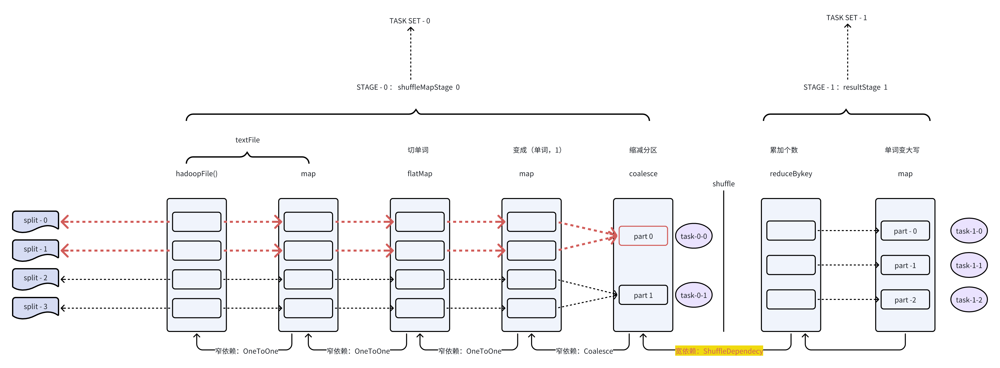


下面的的物理执行计划图，会生成Task，生成的Task如下

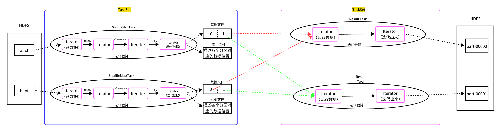

&#x20;

## 2.3 Stage和Task的类型

Stage有两种类型，分别是ShuffleMapStage和ResultStage，ShuffleMapStage生成的Task叫做ShuffleMapTask，ResultStage生成的Task叫做ResultTask


* ShuffleMapTask

  * 可以读取各种数据源的数据

  * 可以读取Shuffle的中间结果（Shuffle Read）

  * 应用分区器对数据分区，将数据溢写磁盘（ShuffleWrite），后面一定还会有其他的Stage


* ResultTask

  * 可以读取各种数据源的数据

  * 可以读取Shuffle的中间结果（Shuffle Read）

  * 是整个job中最后一个stage对应的Task，一定会产生job的最终结果数据（就是将产生的结果返回的Driver或写入到外部的存储系统）


> **不管是shuffleMapTask，还是resultTask，在运行时，都是由Executor进程来执行的**


多种情况：

&#x20;第一种：


&#x20;第二种

&#x20;第三种：


## 2.4 **Spark执行流程**


①创建SparkContext，然后创建RDD，调用Transformation（s）和Action编写具体的计算逻辑

②构建DAG，切分Stage，生成Task并放入到TaskSet，然后将TaskSet传递给TaskScheduler

③TaskScheduler将Task序列化，根据各个Executor的资源情况，将序列化后的Task发送给Executor

④Executor将接收到 的Task反序列化，使用实现Runnable接口的包装类包起来，然后丢入到线程池中&#x20;

前三步的准备工作是在Driver端完成的，第四步是在Executor中执行的


### 2.4.1 **创建SparkContext**

使用spark-submit脚本，会启动SparkSubmit进程，然后通过反射调用我们通过--class传入类的main方法，在main方法中，就行我们写的业务逻辑了，先创建SparkContext，向Master申请资源，然后Master跟Worker通信，启动Executor，然后所有的Executor向Driver反向注册

### 2.4.2 **创建RDD调用Transformation和Action构建DAG**

DAG(Directed Acyclic Graph)叫做有向无环图，是的一系列RDD转换关系的描述，原始的RDD通过一系列的转换就就形成了DAG，根据RDD之间的依赖关系的不同将DAG划分成不同的Stage，对于窄依赖，partition的转换处理在Stage中完成计算。对于宽依赖，由于有Shuffle的存在，只能在parent RDD处理完成后，才能开始接下来的计算，因此宽依赖是划分Stage的依据。


&#x20;

依赖关系划分为两种：窄依赖（Narrow Dependency）和 宽依赖（源码中为Shuffle Dependency）。

窄依赖指的是父 RDD 中的一个分区最多只会被子RDD 中的一个分区使用，意味着父RDD的一个分区内的数据是不能被分割的，子RDD的任务可以跟父RDD在同一个Executor一起执行，不需要经过 Shuffle 阶段去重组数据。

窄依赖包括两种：一对一依赖（OneToOneDependency）和范围依赖（RangeDependency）　

一对一依赖

&#x20;&#x20;

宽依赖指的是父 RDD 中的分区可能会被多个子 RDD 分区使用。因为父 RDD 中一个分区内的数据会被分割，发送给子 RDD 的多个分区，因此宽依赖也意味着父 RDD 与子 RDD 之间存在着 Shuffle 过程。

宽依赖只有一种：Shuffle依赖（ShuffleDependency）　

&#x20;&#x20;

### 2.4.3 **切分Stage，生成Task和TaskSet**

触发Action，会根据最后一个RDD，从后往前推，如果是窄依赖（没有shuffle），继续往前推，如果是宽依赖（有shuffle），那么会递归进去，然后再根据递归进去的最后一个RDD进行向前推，如果一个RDD再也没有父RDD（递归出口），那么递归出来划分Stag&#x65;**（DAGScheduler完成的以上工作）**


### 2.4.4 **将Task调度到Executor**

划分完Stage后，DAGScheduler将根据Stage的类型，生成Task，然后将同一个Stage的多个计算逻辑相同的Task放入到同一个TaskSet中，然后向DAGScheduler将TaskSet传递给**TaskScheduler**，TaskScheduler会根据Executor的的资源情况，然后将Task序列化发送给Executor


### 2.4.5 **在Executor中执行Task**

Executor接收到TaskScheduler发送过来的Task后，将其反序列化，然后使用一个实现了Runnable接口的包装类进行包装，最后将包装的Task丢入到线程池，一旦丢入到线程池，run方法会执行，run方法会调用Task对应的迭代器链进行迭代数据&#x20;


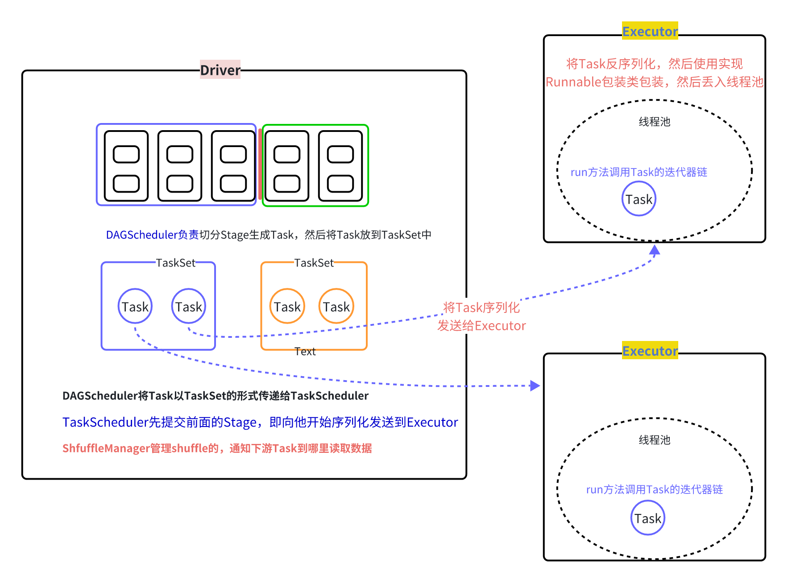

* Job：RDD每一个行动操作都会生成一个或者多个调度阶段 调度阶段（Stage）：每个Job都会根据依赖关系，以Shuffle过程作为划分，分为Shuffle Map Stage和Result Stage。每个Stage对应一个TaskSet，一个Task中包含多Task，TaskSet的数量与该阶段最后一个RDD的分区数相同。　

* Task：分发到Executor上的工作任务，是Spark的最小执行单元 ；

* DAGScheduler：DAGScheduler是将DAG根据宽依赖将切分Stage，负责划分调度阶段并Stage转成TaskSet提交给TaskScheduler　

* TaskScheduler：TaskScheduler是将Task序列化然后发送到Worker下的Exexcutor进程，在Executor中，将Task反序列化，然后使用实现Runable接口的包装类包装，最后丢入到Executor的线程池的中进行执行　


## 2.4 task的执行原理模拟

> **task最核心的原理就是在执行stage中的rdd逻辑**
>
> **它是如何执行这些rdd的逻辑呢？**
>
> **stage中的rdd都会包含一个迭代器，这个迭代器是在父RDD的迭代器基础上施加运算逻辑得到**
>
> **所以task就是去调用stage中的最后一个RDD的迭代器，进行数据迭代即可**


示例模拟：

```java
package top.doe.myrdd;

import java.io.*;
import java.util.Iterator;
import java.util.Spliterator;
import java.util.Spliterators;
import java.util.function.Function;
import java.util.function.Predicate;
import java.util.stream.Stream;
import java.util.stream.StreamSupport;

public class MyRDD {
    private Iterator<String> iter;
    private MyRDD preRdd;

    public MyRDD(MyRDD preRdd, Iterator<String> iter) {
        this.iter = iter;
        this.preRdd = preRdd;
    }


    public static MyRDD textFile(String path) throws Exception {

        Iterator<String> newIter = new Iterator<String>() {

            BufferedReader br = new BufferedReader(new FileReader(path));
            String line = br.readLine();
            boolean flag = false;

            @Override
            public boolean hasNext() {
                flag = true;
                return line != null;
            }

            @Override
            public String next() {

                if (flag) {

                    String rt = line;
                    try {
                        line = br.readLine();
                    } catch (IOException e) {
                        throw new RuntimeException(e);
                    }
                    return rt;
                } else {
                    throw new RuntimeException("你不按规矩来....");
                }
            }
        };

        return new MyRDD(null,newIter);

    }


    public MyRDD filter(Predicate<String> f) {

        Stream<String> stream = StreamSupport.stream(Spliterators.spliteratorUnknownSize(iter, Spliterator.ORDERED), false);
        Iterator<String> newIter = stream.filter(f).iterator();

        return new MyRDD(this, newIter);

    }


    public MyRDD map(Function<String, String> f) {

        Stream<String> stream = StreamSupport.stream(Spliterators.spliteratorUnknownSize(iter, Spliterator.ORDERED), false);
        Iterator<String> newIter = stream.map(f).iterator();

        return new MyRDD(this, newIter);

    }


    public void saveAsTextFile(String path) throws IOException {

        BufferedWriter bw = new BufferedWriter(new FileWriter(path + "/part-00000"));

        while(iter.hasNext()){
            String next = iter.next();
            bw.write(next);
            bw.newLine();
        }

        bw.close();
    }
}

```

```java
package top.doe.myrdd;

import java.util.Arrays;

public class MyApp {
    public static void main(String[] args) throws Exception {

        MyRDD rdd = MyRDD.textFile("./spark_data/myrdd/a.txt");

        MyRDD rdd2 = rdd.filter(s -> s.startsWith("a"));

        MyRDD rdd3 = rdd2.map(s -> Arrays.toString(s.split(" ")));

        rdd3.saveAsTextFile("./spark_data/myrdd/output");

    }
}
```


# 3. Spark On Yarn （面试必问）

## 3.1 **Hadoop YARN回顾**

### 3.1.1 **YARN 的基本设计思想**

将Hadoop 1.0中JobTracker拆分成两个独立的服务,一个全局的资源管理器ResourceManager(RM)和每个应用独有的ApplicationMaster(AM).其中RM负责整个系统的资源管理和分配,而AM负责单个的应用程序的管理

&#x20;

### 3.1.2 **YARN的基本组成**

* ResourceManager(RM)

全局的资源管理器,负责整个系统的资源管理和分配,由调度器(ResourceScheduler)和应用管理器(Application**S** Manger,ASM)组成:

1 调度器(ResourceScheduler)

调度器根据容量,队列等限制条件,将系统中的资源分配给各个正在运行的应用程序.调度器不参与任何应用程序的具体工作,仅根据应用程序的资源需求进行资源分配.调度器是个可拔插的组件,用户可根据自己的需要设计新的调度器.

&#x20;2 应用程序管理器(ASM)

应用程序管理器负责整个系统中所有应用程序,包括应用程序的提交,与调度器协商资源以启动ApplicationMaster(AM),监控AM运行状态并在失败时重启它

&#x20;

* ApplicationMaster(AM)

用户提交的每个应用程序均包含一个AM,主要功能包括:

1.与RM调度器协商以获取资源

2.将得到的资源进一步分配给内部的任务

3.与NodeManager(NM)通信,以启动\停止任务

4.监控所有任务运行状态,并在任务运行失败时重新为任务申请资源以重启任务

&#x20;

* NodeManager(NM)

NM是每个节点上的资源和任务管理器.一方面,它会定时的向RM汇报本节点上的资源使用情况和各个Container的运行状态;另一方面,它接收并处理来自AM的Container启动\停止等请求Container

### 3.1.3 **YARN的运行流程**

&#x20;


①用户向YARN提交应用程序,ResourceManager会返回一个applicationID，client将jar上传到HDFS

②RM(其中的调度器)为该应用程序分配第一个Container,(ASM)与对应的NM通信,要求它在这个Container中启动应用程序的AM

③AM首先向RM(其中的ASM)注册,这样用户可以直接通过RM查看应用程序的运行状况,然后AM会为各个任务申请资源,并监控任务的运行状态直至任务完成,运行结束.在任务未完成时,4-7步是会循环运行的

④AM采用轮询的方式通过RPC协议向RM(其中的调度器)申请和领取资源

⑤AM申请到资源后与对应NM通信,要求启动任务

⑥NM为任务设置好运行环境后,将任务启动命令写到一个脚本中,并通过运行该脚本启动任务.

⑦各个任务通过RPC协议向AM汇报自己的状态和进度,让AM随时掌握各个任务的运行状态,从而可以在任务失败时重新启动任务，在应用程序运行过程中,用户可随时通过RPC向AM查询应用程序的当前状况

⑧应用程序运行完成后,AM向RM注销并关闭自己


## 3.2 Spark On Yarn准备工作&#x20;


1. 需要在/etc/profile中配置HADOOP\_CONF\_DIR的目录

> 目的是为了让Spark找到core-site.xml、hdfs-site.xml和yarn-site.xml【让spark知道NameNode、ResourceManager】，不然会包**如下错误：**

```plain&#x20;text
Exception in thread "main" java.lang.Exception: When running with master 'yarn' either HADOOP_CONF_DIR or YARN_CONF_DIR must be set in the environment.
```

&#x20;

修改每一台集群的 /etc/profile （这是系统的环境变量配置文件）

```shell
export JAVA_HOME=/usr/local/jdk1.8.0_371
export HADOOP_HOME=/opt/apps/hadoop-3.3.5
export HADOOP_CONF_DIR=/opt/apps/hadoop-3.1.4/etc/hadoop
export HIVE_HOME=/opt/apps/hive-3.1.3
export PATH=$PATH:$JAVA_HOME/bin:$HADOOP_HOME/sbin:$HADOOP_HOME/bin:$HIVE_HOME/bin
```

&#x20;

* 关闭内存资源检测（如果你的虚拟机实际内存小，可以考虑关闭内存检测；生产环境不用关）

修改`yarn-site.xml`（这是yarn的主配置文件），添加下面的两个配置

```xml
<!-- 是否检查容器的物理内存量，如果任务超出分配值，则直接将其杀掉，默认是true-->
<property>
<name>yarn.nodemanager.pmem-check-enabled</name>
<value>false</value>
</property>

<!-- 是否检查容器的虚拟内存量，如果任务超出分配值，则直接将其杀掉，默认是true--> 
<property>
<name>yarn.nodemanager.vmem-check-enabled</name>
<value>false</value>
</property>
```

&#x20;

* 配置一个yarn的container可以使用多个vcores

> 因为capacity schedule使用的是DefaultResourceCalculator，那么DefaultResourceCalculator它在加载Container时其实仅仅只会考虑内存而不考虑vcores，默认vcore就是1。
>
> yarn 默认情况下，只根据内存调度资源，所以 spark on yarn 运行的时候，即使通过--executor-cores 指定 core 个数为 N，但是在 yarn 的资源管理页面上看到使用的 vcore 个数还是 1

&#x20;

修改 `capacity-scheduler.xml `（这是yarn的capacity调度器使用的配置文件）

```xml
<property>
    <name>yarn.scheduler.capacity.resource-calculator</name>
    <!--
      <value>org.apache.hadoop.yarn.util.resource.DefaultResourceCalculator</value>
    -->
    <value>org.apache.hadoop.yarn.util.resource.DominantResourceCalculator</value>
</property>
```

&#x20;

* 重新分发到yarn中的各个节点：&#x20;

```shell
for i in 2 3; do scp /etc/profile node-$i.51doit.cn:/etc/ ; done
for i in 2 3; do scp capacity-scheduler.xml yarn-site.xml node-$i.51doit.cn:$PWD ; done
```

然后，重启hdfs和yarn集群。注意：要保证yarn集群的各个节点的时间是同步的。否则会报错

&#x20;


## 3.3 运行模式概述

**spark on yarn有两种运行模式：**

* **client模式**

* **cluster模式**


**两种模式的核心区别是：**

* client模式：**&#x20;driver**在提交应用的客户端调用执行

* cluster模式：**driver**在yarn的appmaster上调用执行


**什么是Driver**

Driver本意是驱动的意思（类似叫法的有MySQL的连接驱动），在就是与集群中的服务建立连接，执行一些命令和请求的。

但是在Spark的Driver指定就是SparkContext和里面创建的一些对象；

可以总结为，SparkContext在哪里创建，Driver就在哪里。

> Driver中包含很多的对象实例，有&#x20;
>
> * SparkContext（编程环境），
>
> * DAGScheduler（拆分stage，生成taskset）、
>
> * TaskScheduler（调度task到executor上去执行）、
>
> * ShuffleManager（shuffle过程管理）、
>
> * BroadCastManager（广播数据管理）等；
>
> Driver是对这些对象及相关功能的统称


**Driver中最核心的几个功能如下：**

* 根据rdd的血缘和依赖关系，划分stage （这是DAGScheduler的功能）

* 根据stage生成相应的taskset（这也是DAGScheduler的功能）

* 然后这些taskset会交由`TaskScheduler`调度到各个 executor 上去运行


## 3.4 client 模式

> spark on yarn 对比 mapreduce on yarn的一个显著区别：
>
> 运行task的进程executor的资源及数量，在提交应用时就确定好了；
>
> 在应用完成之前，这些executor都不会退出，因而不需要反复地重新申请资源重新启动；

```shell
 bin/spark-submit \
 --master yarn \
 --deploy-mode client \
 --executor-memory 2g \
 --executor-cores 2 \
 --num-executors 3 \
 --driver-memory 1g \
 --driver-cores 1 \
 --class cn._51doit.spark.day01.WordCount \
 /root/spark-in-action.jar \
 hdfs://node-1.51doit.cn:9000/wc \
 hdfs://node-1.51doit.cn:9000/out01
```


> client模式下，运行时的进程如下：

* **SparkSubmit   &#x20;**--    提交应用的客户端

* **ExecutorLauncher &#x20;**-- client模式下的yarn上的AppMaster进程   (yarn容器中运行）

* **YarnCoarseGrainedExecutorBackend &#x20;**-- task的执行进程 ：简称为executor（yarn容器中运行）


> **client模式的运行流程（spark的application的on yarn 的生命周期 ）**

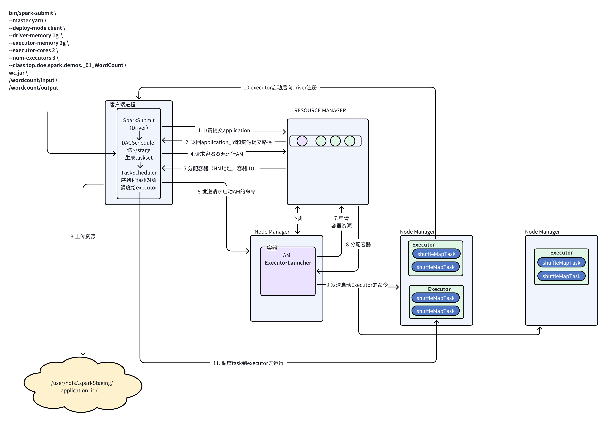


①客户端提交一个Application，在客户端启动一个Driver进程。

②Driver进程会向ResourceManager发送请求，启动ApplicationMaster的资源。

③ResourceManager收到请求，随机选择一台NodeManager,然后该NodeManager到HDFS下载jar包和配置，接着启动ApplicationMaster【ExecutorLuacher】。这里的NodeManager相当于Standalone中的Worker节点。

④ApplicationMaster启动后，会向ResourceManager请求一批container资源，用于启动Executor.

⑤ResourceManager会找到一批符合条件NodeManager返回给ApplicationMaster,用于启动Executor。

⑥ApplicationMaster会向NodeManager发送请求，NodeManager到HDFS下载jar包和配置，然后启动Executor。

⑦Executor启动后，会反向注册给Driver，Driver发送task到Executor,执行情况和结果返回给Driver端


## 3.5 cluster 模式

```shell
bin/spark-submit \
--master yarn \
--deploy-mode cluster \
--drvier-memory 1g \
--driver-cores 2 \
--executor-memory 1g \
--executor-cores 2 \
--num-executors 3 \
--class cn._51doit.spark.day01.WordCount \
/root/spark-in-action.jar \
hdfs://node-1.51doit.cn:9000/wc \
hdfs://node-1.51doit.cn:9000/out01
```

**运行时的进程**

* SparkSubmit  (负责请求application，提交程序的资源，并负责申请容器启动ApplicationMaster）

* **ApplicationMaster  （**&#x8D1F;责执行用户程序的main方法来构造初始化sparkContext（driver），申请容器运行executor，executor启动后，sparkContext会用DAGScheduler拆分stage，生成taskset，再利用taskSetManager调度task到executo&#x72;**）**

* YarnCoarseGrainedExecutorBackend （负责接收task，并执行task）

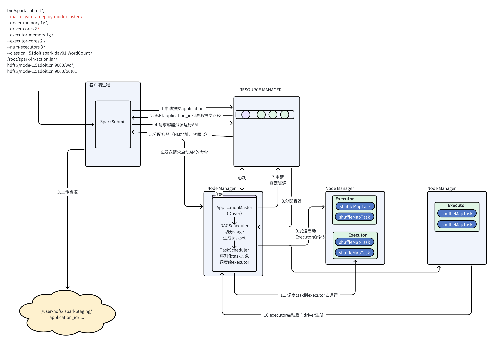


## 3.6 细节补充：资源分配&#x20;


* YARN中可以虚拟VCORE，虚拟cpu核数，以后部署在物理机上，建议配置YARN的VCORES的使用等于物理机的逻辑核数，即物理机的核数和VCORES是一一对应的，在YARN中为spark分配任务，spark的cores跟逻辑核数一一对应，另一个逻辑和对应一个VCORE，一个VCORES对应一个spark cores【官方建议spark的cores是逻辑核的2到3倍】

&#x20;

* yarn中的资源分配，针对的是容器， 容器默认最小的资源是1024mb,  容器接受的资源，必须是最小资源的整数倍。

&#x20;

* spark中分配的资源由两部分组成，**参数 + overhead**，

* 例如` --executor-memory 1g`，

overhead为 **max(1024 \* 0.1, 384)**，executor真正占用的资源应该是：1g + 384mb = 1408Mb


* 在yarn中，分配的资源最终都是分配给容器的1408 **向上取整**，

> 例如--executor-memory 2g 那么最终的容器内存为：**2048 + 开销384 => 2432MB =取整=> 3072MB**


&#x20;

# 4. **shuffle 过程详解 （面试必问）**

## 4.1 **spark shuffle 演进的历史**

Spark 0.8及以前 Hash Based Shuffle

Spark 0.8.1 为Hash Based Shuffle引入File Consolidation机制

Spark 0.9 引入ExternalAppendOnlyMap

Spark 1.1 引入Sort Based Shuffle，但默认仍为Hash Based Shuffle

Spark 1.2 默认的Shuffle方式改为Sort Based Shuffle

Spark 1.4 引入Tungsten-Sort Based Shuffle  （**钨丝计划**：在堆外针对序列化后的数据直接排序：仅排分区）

Spark 1.6 Tungsten-sort并入Sort Based Shuffle

Spark 2.0 Hash Based Shuffle退出历史舞台

## 4.2 **HashShuffleManager（已不再使用）**

* 优化前的

在shuffle write前，应用分区器，根据对应的分区规则，计算出数据partition编号，然后将数据写入bucket内存中，当数据达到一定大小或数据全部处理完后，将数据溢写持久化。之所以要持久化，一方面是要减少内存存储空间压力，另一方面也是为了容错降低数据恢复的代价。

&#x20;


&#x20;

&#x20;**上图有2个Executor，每个Executor有1个core**，**total-executor-cores为数为 2**，每个 task 的执行结果会被溢写到本地磁盘上。每个 task 包含 R 个缓冲区，R = reducer 个数（也就是下一个 stage 中 task 的个数），缓冲区被称为 bucket，其大小为spark.shuffle.file.buffer.kb ，默认是 32KB。

&#x20;

其实bucket表示缓冲区，即ShuffleMapTask 调用分区器的后数据要存放的地方。

&#x20;

ShuffleMapTask 的执行过程：先根据 pipeline 的计算逻辑对数据进行运算，然后根据分区器计算出每一个record的分区编号。每得到一个 record 就将其送到对应的 bucket 里，具体是哪个 bucket 由partitioner.getPartition(record.getKey()))决定。每个 bucket 里面的数据会满足溢写的条件会被溢写到本地磁盘上，形成一个 ShuffleBlockFile，或者简称 FileSegment。之后的 下游的task会根据分区会去 fetch 属于自己的 FileSegment，进入 shuffle read 阶段。

&#x20;

老版本的HashShuffleManager存在的问题：

1.产成的 FileSegment 过多。每个 ShuffleMapTask 产生 R（下游Task的数量）个 FileSegment，M 个 ShuffleMapTask 就会产生 M \* R 个文件。一般 Spark job 的 M 和 R 都很大，因**此磁盘上会存在大量的数据文件**。

2.缓冲区占用内存空间大。每个 ShuffleMapTask 需要开 R 个 bucket，M 个 ShuffleMapTask 就会产生 M \* R 个 bucket。虽然一个 ShuffleMapTask 结束后，对应的缓冲区可以被回收，但一个 worker node 上同时存在的 bucket 个数可以达到 cores\*R 个，占用的内存空间也就达到了cores \* R \* 32 KB。对于 8 核 1000 个 reducer 来说，占用内存就是 256MB。

&#x20;

* 优化后的（FileConsolidation）：


可以明显看出，**在一个core上连续执行的ShuffleMapTasks可以共用一个输出文件 ShuffleFile。**&#x5148;执行完的 ShuffleMapTask 形成ShuffleBlock i，后执行的 ShuffleMapTask可以将输出数据直接追加到ShuffleBlock i后面，形成ShuffleBlock’，每个ShuffleBlock被称为FileSegment。下一个stage的reducer只需要fetch整个 ShuffleFile就行了。这样每个Executor持有的**文件数降为  cores \* R。**

FileConsolidation 功能可以通过spark.shuffle.consolidateFiles=true来开启。

&#x20;

&#x20;

## 4.3 **Sort Shuffle Manager**

```java
override def registerShuffle[K, V, C](
    shuffleId: Int,
    dependency: ShuffleDependency[K, V, C]): ShuffleHandle = {
  
  // map端不需要聚合，且shuffle后的分区数 <= spark.shuffle.sort.bypassMergeThreshold(默认200）  
  if (SortShuffleWriter.shouldBypassMergeSort(conf, dependency)) {
    new BypassMergeSortShuffleHandle[K, V](
      shuffleId, dependency.asInstanceOf[ShuffleDependency[K, V, V]])
  } 
  // 1.序列化器是否支持relocation（kryoSerializer支持，JavaSerializer不支持）
  // 2.没有map端聚合
  // 3.shuffle的输出分区数 <= 2^24个（这种shuffle中有一个指针用来指示分区号，而这个指针是一个24bit的整数）
  else if (SortShuffleManager.canUseSerializedShuffle(dependency)) {
    new SerializedShuffleHandle[K, V](
      shuffleId, dependency.asInstanceOf[ShuffleDependency[K, V, V]])
  } 
  
  else {
    new BaseShuffleHandle(shuffleId, dependency)
  }
}
```

&#x20;


&#x20;

### 4.3.1 **Bypass MergeSort ShuffleWriter**

使用这种ShuffleWriter的条件是：

1. 没有map端的聚合操作

2. 分区数小于参数：spark.shuffle.sort.bypassMergeThreshold，默认是200

`BypassMergeSortShuffleWriter机制 `   适用于没有聚合，数据量不大的场景。


> **核心工作流程**

1. 给每个分区分配一个“分区段文件”，并分别对应一个文件输出流

2. 调用结果rdd的数据迭代器，获取数据（record）

3. 对每个 record 的 key 使用分区器找到对应分区，并写入对应的“分区段文件；

> 因为写入磁盘文件是通过 Java的 BufferedOutputStream 实现的，BufferedOutputStream 是 Java 的缓冲输出流，**首先会将数据缓冲在内存中，当内存缓冲填满之后再一次flush到磁盘文件中**，这样可以减少磁盘 IO 次数，提升性能

* **最后，当分区数据计算完成后，会把各分区段文件，进行合并**

&#x20;


> 关键源码： **BypassMergeSortShuffleWriter类:: write(records)**

```java
 public void write(Iterator<Product2<K, V>> records) throws IOException {
 // ...............
     // rdd的计算逻辑的迭代器链就是在这里触发执行的
     while (records.hasNext()) {
      final Product2<K, V> record = records.next();
      final K key = record._1();
      partitionWriters[partitioner.getPartition(key)].write(key, record._2());
    }

// ....

    // 上面的循环如果结束，就说明本task负责的分区已经计算完成
    // 会进行分区文件段 的 合并 （把分区段文件，按分区顺序，逐一往合并大文件中追加写入）
    partitionLengths = writePartitionedData(mapOutputWriter);
    
// ................    
```

&#x20;

***

&#x20;&#x20;

### 4.3.2 **Unsafe ShuffleWriter （钨丝计划中新增的）**

使用这种ShuffleWriter的条件是：

* Serializer 支持 relocation特性；支持 relocation 的 Serializer 是 KryoSerializer，Spark 默认使用 JavaSerializer，通过参数 spark.serializer 设置；

```java
// 代码中：
sparkConf.set("spark.serializer",KryoSerializer.class.getName());

// 提交程序
spark-submit 
--master yarn
--conf spark.serializer=org.apache.spark.serializer.KryoSerializer

```

* 没有指定map端聚合；

* partition 数量不能大于指定的阈值(2^24)，因为 partition number 使用24bit 表示的。即不能大于**PackedRecordPointer**.MAXIMUM\_PARTITION\_ID + 1

**UnsafeShuffleWriter 将 record 序列化后插入sorter，然后对已经序列化的 record 进行排序，并在排序完成后写入磁盘文件作为 spill file，再将多个 spill file 合并成一个输出文件。**


> 工作流程核心源码  **UnsafeShuffleWriter#write()**

```java
public void write(scala.collection.Iterator<Product2<K, V>> records) throws IOException {
    // 调用结果rdd的迭代器，进行迭代器链条的计算  
    while (records.hasNext()) {
      // 迭代到一条结果，就插入一个 ShuffleExeternalSorter
      insertRecordIntoSorter(records.next());
    }
    
    // 上面的循环结束，说明本task的负责的分区已经计算完毕
    // 做溢出文件的合并
    closeAndWriteOutput();
}
```

其中， insertRecordIntoSorter(records.next()) 是shuffle的核心逻辑所在：

* 求得record的key所属的分区号

* 把record的key和value序列化

* 判断是否inMemSorter中指针个数（已缓存的record数据的条数）是否大于溢出阈值（Interger.MAX\_VALUE)

  * 如果要溢出，则先对LongArray中的数据指针按照分区号进行排序

  * 然后根据排序好的指针，迭代内存页中的数据溢出

* 把序列化后的字节数组byte\[] ，拷贝到堆外内存空间，并获得地址

* 生成一个数据指针(是一个long,8字节）： 包含 数据所在的地址（40bit），数据所属的分区（24bit）

* 把数据指针插入一个inMemSorter（LongArray：堆外内存模拟的长整数数组）


**核心特点：**

* 数据会缓存，缓存在堆外内存；

* 有溢出逻辑，溢出前还会排序，但是仅对数据的指针按分区排序

* 最后，会对溢出文件进行合并

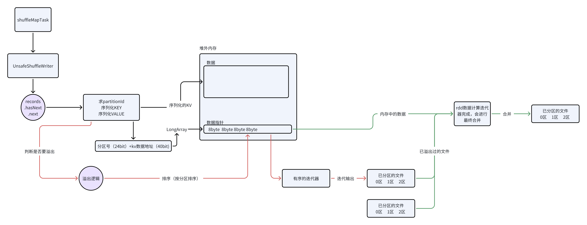


### 4.3.3 **Sort ShuffleWriter**

**核心源码 示例**

```java
//  SortShuffleWriter
override def write(records: Iterator[Product2[K, V]]): Unit = {
  sorter = if (dep.mapSideCombine) {
    new ExternalSorter[K, V, C](
      context, dep.aggregator, Some(dep.partitioner), dep.keyOrdering, dep.serializer)
  } else {
    new ExternalSorter[K, V, V](
      context, aggregator = None, Some(dep.partitioner), ordering = None, dep.serializer)
  }
  
  // 把迭代器传给下面的sorter.insertAll方法去迭代数据，写入缓存
  sorter.insertAll(records)

  // 上面的方法结束，则意味着分区迭代器 已经迭代完成
  // 下面就是做溢出文件的合并
  sorter.writePartitionedMapOutput(dep.shuffleId, mapId, mapOutputWriter)
  val partitionLengths = mapOutputWriter.commitAllPartitions().getPartitionLengths
}


// ExternalSorter
def insertAll(records: Iterator[Product2[K, V]]): Unit = {
  // TODO: stop combining if we find that the reduction factor isn't high
  val shouldCombine = aggregator.isDefined
  
  // 一、如果需要预聚合
  if (shouldCombine) {
    // Combine values in-memory first using our AppendOnlyMap
    val mergeValue = aggregator.get.mergeValue
    val createCombiner = aggregator.get.createCombiner
    var kv: Product2[K, V] = null
    // 创建初始agg
    val update = (hadValue: Boolean, oldValue: C) => {
      if (hadValue) mergeValue(oldValue, kv._2) else createCombiner(kv._2)
    }
    
    // 开始迭代数据
    while (records.hasNext) {
      addElementsRead()
      kv = records.next()
      // 往 PartitionedAppendOnlyMap 中放入或者更新值
      // 放入map中数据结构为：  (分区号+key)作为map中的组合key，value就是累加器
      map.changeValue((getPartition(kv._1), kv._1), update)
      
      // 判断是否需要溢出
      maybeSpillCollection(usingMap = true)
    }
  } 
  // 二、不需要预聚合
  else {
    // 迭代数据
    while (records.hasNext) {
      addElementsRead()
      val kv = records.next()
      // 拿到数据，插入一个 PartitionedPairBuffer
      buffer.insert(getPartition(kv._1), kv._1, kv._2.asInstanceOf[C])
      // 判断是否需要溢出
      maybeSpillCollection(usingMap = false)
    }
  }
}
```


**核心要点总结：**

* 数据会先**写入缓存**，只是缓存有两种

  * **PartitionedAppendOnlyMap&#x20;**（分区号+key，作为map的KEY；  agg作为value）

  * **PartitionedPairBuffer** (存入的每条数据，都带（分区号，key，value）

* 缓存数据结构都具备一个功能：当快要写满时（0.7），都能申请内存自动扩容；直到申请不到内存为止；

* 可以对结果rdd的结果数据做**预聚合**（缓存一定会用 PartitionedAppendOnlyMap ）

* 也可以不对结果rdd的数据做预聚合（缓存会用 PartitionedPairBuffer ）

* 也会有溢出逻辑，溢出文件本地磁盘文件

  * 溢写文件前，会调用 PartitionedAppendOnlyMap  或 PartitionedPairBuffer 上的方法**排序**（根据partition号和数据的key），得到排序后的迭代器；

  * 然后利用排序迭代器，迭代缓存中的数据，写入溢出文件；

* 最后会有**合并**，把多个溢出文件合成一个文件（加索引）


&#x20;


# 5. Shuffle的补充认知

什么是Shuffle，本意为洗牌，在数据处理领域里面，意为将数按照一定的规则打散。

问题：shuffle一定有网络传输吗？有网络传输的一定是Shuffle吗？


## 5.1 shuffle算子 一定会Shuffle吗

> **不一定！**
>
> **shuffle前后（上下游）的RDD 的分区器相同则不需要shuffle！**
>
> 何谓分区器相同（spark会调用分区器 **partitioner.equals(other)** ）：
>
>

例如：

```scala
//创建RDD，并没有立即读取数据，而是触发Action才会读取数据
val lines = sc.textFile("hdfs://node-1.51doit.cn:9000/words")

val wordAndOne = lines.flatMap(_.split(" ")).map((_, 1))
//先使用HashPartitioner进行partitionBy
val partitioner = new HashPartitioner(wordAndOne.partitions.length)
val partitioned = wordAndOne.partitionBy(partitioner)
//然后再调用reduceByKey
val reduced: RDD[(String, Int)] = partitioned.reduceByKey(_ + _)

reduced.saveAsTextFile("hdfs://node-1.51doit.cn:9000/out-36-82")
```


## 5.2 默认分区器


```java
// 在需要分区的算子中，传入了分区个数
// 则底层会创建一个 new HashPartitioner(numPartitions)
kvRdd1.reduceByKey((x,y)->x,4);

// 在需要分区的算子中，传入了分区器，则使用的就是传入的分区器
kvRdd1.reduceByKey(new HashPartitioner(5),(x,y)->x);

// 在需要分区的算子中,分区数或分区器都不传
// 它就会调用 Partitioner#defaultPartitioner()去计算得到一个默认分区器
kvRdd1.reduceByKey((x,y)->x);
```


Partitioner类中，有一个专门的方法去获取默认分区器（分区数）

```java

// 参数： rdd，正在调用算子的rdd
// 参数:  others: 这个算子所涉及的其他rdd
def defaultPartitioner(rdd: RDD[_], others: RDD[_]*): Partitioner = {
  val rdds = (Seq(rdd) ++ others)
  
  // 找出所有上游rdd中带分区器且分区数>0的rdd
  val hasPartitioner：Seq[RDD] = rdds.filter(_.partitioner.exists(_.numPartitions > 0))

  // 进一步找出分区数最大的那个有分区器的rdd
  val hasMaxPartitioner: Option[RDD[_]] = if (hasPartitioner.nonEmpty) {
    Some(hasPartitioner.maxBy(_.partitions.length))
  } else {
    None
  }

  // 计算一个默认分区数：
  //   1. 如果配置了 spark.default.parallelism，则用默认并行度 
  //   2. 否则，使用 上游rdd中的最大分区数
  val defaultNumPartitions = if (rdd.context.conf.contains("spark.default.parallelism")) {
    rdd.context.defaultParallelism
  } else {
    rdds.map(_.partitions.length).max
  }

  // If the existing max partitioner is an eligible one, or its partitions number is larger
  // than or equal to the default number of partitions, use the existing partitioner.
  // 如果上游有分区器，且（上游最大分区器合适  ，或 ， 上游最大分区器大于等于默认分区数 ），就选择上游这个最大分区器最为本算子使用的默认分区器
  // 上游的最大分区器是否合适：   上游最大分区数 / 最大分区器的分区数  < 10倍
  // 否则，就创建一个hashpartitioner（默认分区数） 作为本算使用的分区器
  if (hasMaxPartitioner.nonEmpty && (isEligiblePartitioner(hasMaxPartitioner.get, rdds) ||
      defaultNumPartitions <= hasMaxPartitioner.get.getNumPartitions)) {
    hasMaxPartitioner.get.partitioner.get
  } else {
    new HashPartitioner(defaultNumPartitions)
  }
}
```

> 尽量用上游最大分区器（合适才行：上游最大分区数 / 最大分区器的分区数  < 10倍；或者它大于配置的默认并行度）
>
> 如果上游没有分区器，则用默认并行度创建一个hashpatitioner
>
> 如果连默认并行度都没配，就用上游的最大分区数来创建一个HashPartitioner


## 5.3 shuffle数据的复用（自动机制，spark内部的自动优化）

spark在shuffle时，会应用分区器，当读取达到一定大小或整个分区的数据被处理完，会将数据溢写磁盘磁盘（数据文件和索引文件），溢写持磁盘的数据，会保存在Executor所在机器的本地磁盘（默认是保存在/temp目录，也可以配置到其他目录），只要application一直运行，shuffle的中间结果数据就会被保存。如果以后再次触发Action，使用到了以前shuffle的中间结果，那么就不会从源头重新计算而是，而是复用shuffle中间结果，所有说，shuffle是一种特殊的persist，以后再次触发Action，就会跳过前面的Stage，直接读取shuffle的数据，这样可以提高程序的执行效率。

***

正常情况：

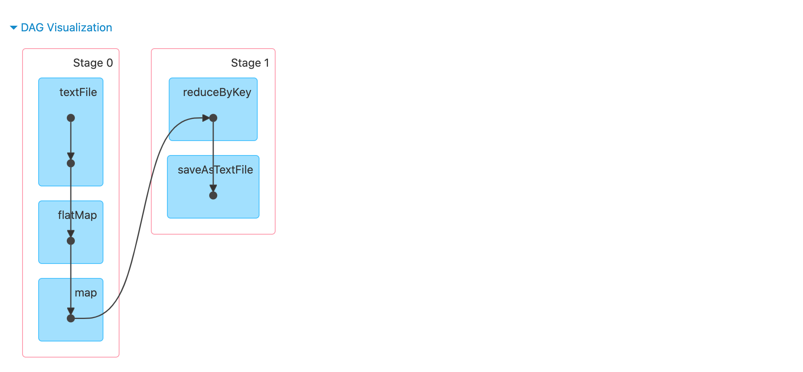

再次触发Action


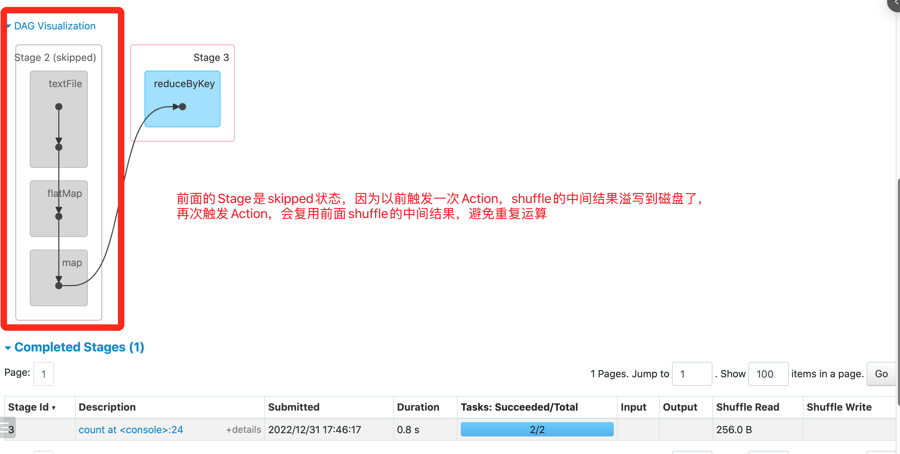


如果由于机器宕机或磁盘问题，部分shuffle的中间数据丢失，以后再次触发Action，使用到了shuffle中间结果数据，但是部数据无法访问，spark会根据RDD的依赖关系（RDD的血统）重新生成对应分区的Task，重新计算丢失的数据！

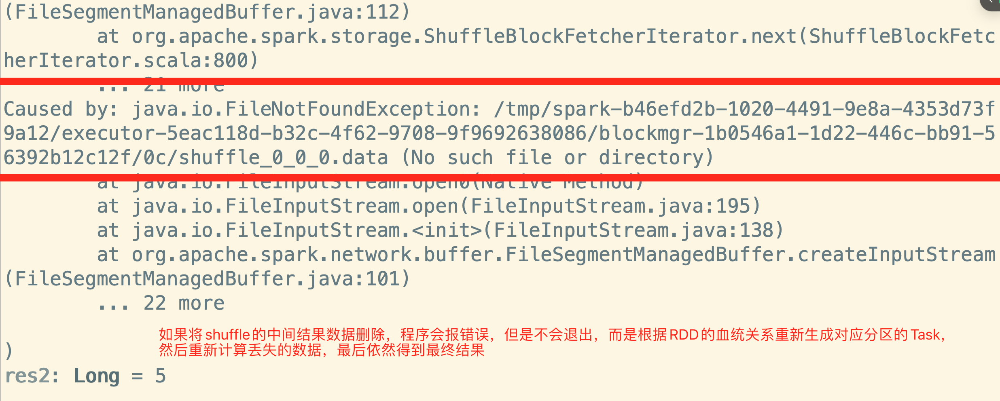


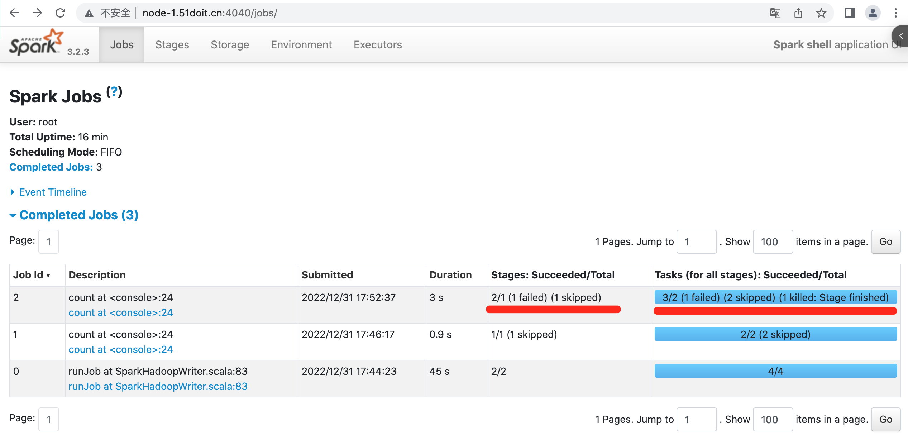

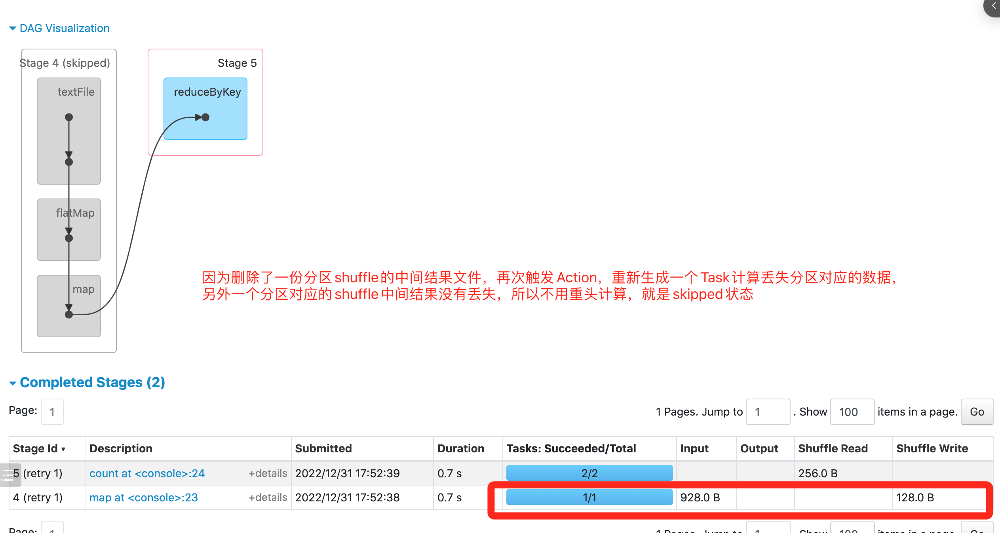


# 6. **Spark 内存管理机制（面试必问）**

## 6.1 **概述**

在执行Spark的应用程序时，Spark集群会启动Driver和Executor两种JVM进程，前者为主控进程，负责创建Spark上下文，提交Spark作业（Job），并将作业转化为计算任务（Task），在各个Executor进程间协调任务的调度，后者负责在工作节点上执行具体的计算任务，可以结果返回给Driver端或时间写入到外部的存储系统中，同时为需要持久化的RDD提供存储功能。由于Driver的内存管理相对来说较为简单，本章节要对Executor的内存管理进行分析，下文中的Spark内存均特指Executor的内存。


## 6.2 **堆内内存和堆外内存**

作为一个JVM进程，Executor的内存管理建立在JVM的内存管理之上，Spark对JVM的堆内（On-heap）空间进行了更为详细的分配，以充分利用内存。同时，Spark引入了堆外（Off-heap）内存，使之可以直接在工作节点的系统内存中开辟空间，进一步优化了内存的使用。&#x20;

&#x20;

&#x20;

## 6.3 **堆内内存**

堆内内存的大小，由Spark应用程序启动时的-–executor-memory或spark.executor.memory参数配置。Executor内运行的并发任务共享JVM堆内内存，这些任务在缓存RDD和广播（Broadcast）数据时占用的内存被规划为存储（Storage）内存，而这些任务在执行Shuffle时占用的内存被规划为执行（Execution）内存，剩余的部分不做特殊规划，那些Spark内部的对象实例，或者用户定义的Spark应用程序中的对象实例，均占用剩余的空间。不同的管理模式下，这三部分占用的空间大小各不相同（下面第2小节介绍）。

&#x20;

### 6.3.1 **堆内内存的申请与释放**

&#x20;Spark对堆内内存的管理是一种逻辑上的“规划式”的管理，因为对象实例占用内存的申请和释放都由JVM完成，Spark只能在申请后和释放前记录这些内存：&#x20;

&#x20;

* 申请内存

Spark在代码中new一个对象实例

JVM从堆内内存分配空间，创建对象并返回对象引用

Spark保存该对象的引用，记录该对象占用的内存

&#x20;

* 释放内存

Spark记录该对象释放的内存，删除该对象的引用

等待JVM的垃圾回收机制释放该对象占用的堆内内存

&#x20;

* 堆内内存优缺点分析

堆内内存采用JVM来进行管理。而JVM的对象可以以序列化的方式存储，序列化的过程是将对象转换为二进制字节流，本质上可以理解为将非连续空间的链式存储转化为连续空间或块存储，在访问时则需要进行序列化的逆过程——反序列化，将字节流转化为对象，序列化的方式可以节省存储空间，但增加了存储和读取时候的计算开销。

&#x20;

对于Spark中序列化的对象，由于是字节流的形式，其占用的内存大小可直接计算。

对于Spark中非序列化的对象，其占用的内存是通过周期性地采样近似估算而得，即并不是每次新增的数据项都会计算一次占用的内存大小。这种方法：

&#x20;

* 降低了时间开销但是有可能误差较大，导致某一时刻的实际内存有可能远远超出预期；此外，在被Spark标记为释放的对象实例，很有可能在实际上并没有被JVM回收，导致实际可用的内存小于Spark记录的可用内存。所以Spark并不能准确记录实际可用的堆内内存，从而也就无法完全避免内存溢出（OOM, Out of Memory）的异常。

* 虽然不能精准控制堆内内存的申请和释放，但Spark通过对存储内存和执行内存各自独立的规划管理，可以决定是否要在存储内存里缓存新的RDD，以及是否为新的任务分配执行内存，在一定程度上可以提升内存的利用率，减少异常的出现。&#x20;

&#x20;

### 6.3.2 **堆内内存分区~~(静态分配方式,弃)~~**

在静态内存管理机制下，存储内存、执行内存和其他内存三部分的大小在Spark应用程序运行期间是固定的，但用户可以在应用程序启动前进行配置，堆内内存的分配如图所示：

&#x20;


&#x20;

可以看到，可用的堆内内存的大小需要按照下面的方式计算：

可用的存储内存 = systemMaxMemory \* spark.storage.memoryFraction \* spark.storage.safetyFraction
可用的执行内存 = systemMaxMemory \* spark.shuffle.memoryFraction \* spark.shuffle.safetyFraction

其中systemMaxMemory取决于当前JVM堆内内存的大小，最后可用的执行内存或者存储内存要在此基础上与各自的memoryFraction参数和safetyFraction参数相乘得出。上述计算公式中的两个safetyFraction参数，其意义在于在逻辑上预留出1-safetyFraction这么一块保险区域，降低因实际内存超出当前预设范围而导致OOM的风险（上文提到，对于非序列化对象的内存采样估算会产生误差）。值得注意的是，这个预留的保险区域仅仅是一种逻辑上的规划，在具体使用时Spark并没有区别对待，和“其它内存”一样交给了JVM去管理。&#x20;

&#x20;

### 6.3.3 **堆内内存分区(统一方式,现)**

默认情况下，Spark 仅仅使用了堆内内存。Executor 端的堆内内存区域大致可以分为以下四大块：&#x20;

整个 Executor 端堆内内存如果用图来表示的话，可以概括如下：&#x20;

&#x20;spark的各种参数配置，都可以在源码的这个类中找到：

```shell
org.apache.spark.internal.config\package.scala
```


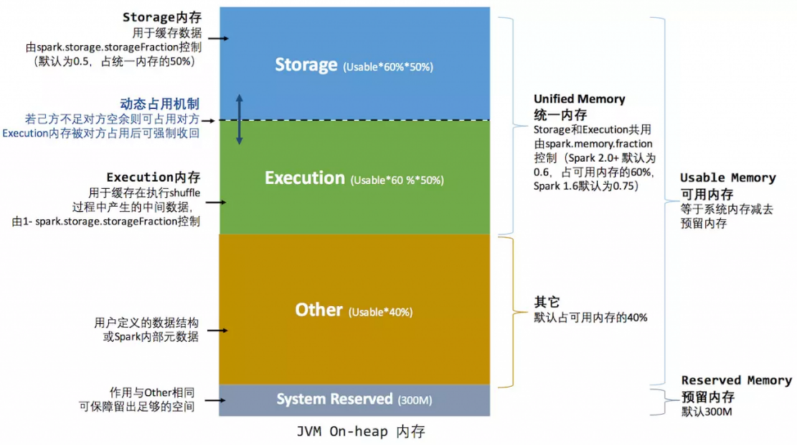

对上图进行以下说明：&#x20;

* systemMemory = Runtime.getRuntime.maxMemory，其实就是通过参数 spark.executor.memory 或 --executor-memory 配置的。

* reservedMemory 在 Spark 2.2.1 中是写死的，其值等于 300MB，这个值是不能修改的（如果在测试环境下，我们可以通过 spark.testing.reservedMemory 参数进行修改）；

* usableMemory = systemMemory – reservedMemory，这个就是 Spark 可用内存；

&#x20;

## 6.4 **堆外内存(Off-heap Memory)**

为了进一步优化内存的使用以及提高Shuffle时排序的效率，Spark引入了堆外（Off-heap）内存，使之可以直接在工作节点的系统内存中开辟空间，存储经过序列化的二进制数据。除了没有other空间，堆外内存与堆内内存的划分方式相同，所有运行中的并发任务共享存储内存和执行内存。

Spark 1.6 开始引入了Off-heap memory(详见SPARK-11389)。这种模式不在 JVM 内申请内存，而是调用 Java 的 unsafe 相关 API 进行诸如 C 语言里面的 malloc() 直接向操作系统申请内存。由于这种方式不经过 JVM 内存管理，所以可以避免频繁的 GC，这种内存申请的缺点是必须自己编写内存申请和释放的逻辑。

### 6.4.1 **堆外内存的优缺点**

利用JDK Unsafe API，Spark可以直接操作系统堆外内存，减少了不必要的内存开销，以及频繁的GC扫描和回收，提升了处理性能。

堆外内存可以被精确地申请和释放，而且序列化的数据占用的空间可以被精确计算，所以相比堆内内存来说降低了管理的难度，也降低了误差。

### 6.4.2 **堆外内存分区~~(静态方式,弃)~~**

堆外的空间分配较为简单，存储内存、执行内存的大小同样是固定的&#x20;

&#x20;

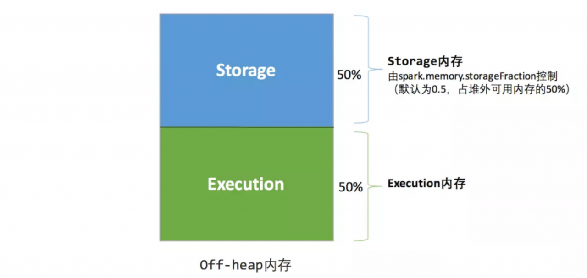

可用的执行内存和存储内存占用的空间大小直接由参数spark.memory.storageFraction决定，由于堆外内存占用的空间可以被精确计算，所以无需再设定保险区域。

静态内存管理机制实现起来较为简单，但如果用户不熟悉Spark的存储机制，或没有根据具体的数据规模和计算任务或做相应的配置，很容易造成“一半海水，一半火焰”的局面，即存储内存和执行内存中的一方剩余大量的空间，而另一方却早早被占满，不得不淘汰或移出旧的内容以存储新的内容。由于新的内存管理机制的出现，这种方式目前已经很少有开发者使用，出于兼容旧版本的应用程序的目的，Spark仍然保留了它的实现。

### 6.4.3 **堆外内存分区(统一方式,现)**

相比堆内内存，堆外内存只区分 Execution 内存和 Storage 内存，其内存分布如下图所示：&#x20;

> &#x20;默认情况下，spark是不启用堆外内存的；
>
> 如果要启用，需要配置如下两个参数：
>
> spark.memory.offHeap.enabled = true
>
> spark.memory.offHeap.size = 1073741824

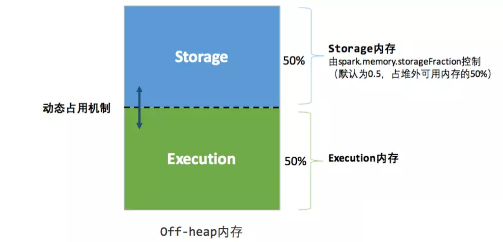

关于动态占用机制，由于统一内存管理方式中堆内堆外内存的管理均基于此机制，所以单独提出来讲解。参见文本第三节。

## 6.5 **动态占用机制–Execution与Storage**

上面两张图中的 Execution 内存和 Storage 内存之间存在一条虚线，这是为什么呢？&#x20;

在 Spark 1.5 之前，Execution 内存和 Storage 内存分配是静态的，换句话说就是如果 Execution 内存不足，即使 Storage 内存有很大空闲程序也是无法利用到的；反之亦然。这就导致我们很难进行内存的调优工作，我们必须非常清楚地了解 Execution 和 Storage 两块区域的内存分布。

&#x20;

而目前 Execution 内存和 Storage 内存可以互相共享的。也就是说，如果 Execution 内存不足，而 Storage 内存有空闲，那么 Execution 可以从 Storage 中申请空间；反之亦然。

所以上图中的虚线代表 Execution 内存和 Storage 内存是可以随着运作动态调整的，这样可以有效地利用内存资源。Execution 内存和 Storage 内存之间的动态调整可以概括如下：

&#x20;

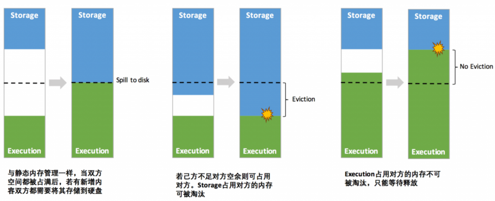

## 6.6 **动态调整策略**

具体的实现逻辑如下：&#x20;

* 程序提交的时候我们都会设定基本的 Execution 内存和 Storage 内存区域（通过 spark.memory.storageFraction 参数设置）；

* 在程序运行时，双方的空间都不足时，则存储到硬盘；将内存中的块存储到磁盘的策略是按照 LRU 规则(Least Recently Used)进行的。若己方空间不足而对方空余时，可借用对方的空间;（存储空间不足是指不足以放下一个完整的 Block）

* Execution 内存的空间被对方占用后，可让对方将占用的部分转存到硬盘，然后”归还”借用的空间

* Storage 内存的空间被对方占用后，目前的实现是无法让对方”归还”，因为需要考虑 Shuffle 过程中的很多因素，实现起来较为复杂；而且 Shuffle 过程产生的文件在后面一定会被使用到，而 Cache 在内存的数据不一定在后面使用。

注意，上面说的借用对方的内存需要借用方和被借用方的内存类型都一样，都是堆内内存或者都是堆外内存，不存在堆内内存不够去借用堆外内存的空间。&#x20;

&#x20;

统一内存分配机制的优点是：提高了内存的利用率，可以更加灵活、可靠的分配和管理内存，增强了spark程序的健壮性

&#x20;

```bash
spark-submit \
  --master yarn \
  --conf spark.executor.memory=2g \
  --conf spark.memory.offHeap.enabled=true \
  --conf spark.memory.offHeap.size=2g \
  --conf spark.yarn.executor.memoryOverhead=512m \  # 指定内存开销
  your_application.jar
```


# 7. StandAlone 集群（了解

spark自带的StandAlone集群有两种运行方式，分别是client模式和cluster模式，默认使用的是client模式。两种运行模式的本质区别是，Driver运行在哪里了（Driver就是SparkContext中包含的一系列对象）


## 7.1 安装

* 上传spark的安装包，解压

* 修改配置文件

  1. 在conf下，把spark-env.sh.template重命名为 spark-env.sh

  2. 修改spark-env.sh

  ```java
  # 添加master的绑定地址
  export SPARK_MASTER_HOST=doitedu01
  export JAVA_HOME=/opt/app/jdk1.8.0_191
  ```

  * 修改wokers

  ```shell
  # 重命名
  mv workers.template workers

  # 修改内容
  doitedu01
  doitedu02
  doitedu03
  ```

* 复制安装包到各节点

* 启动standalone集群

```shell
sbin/start-all.sh
```

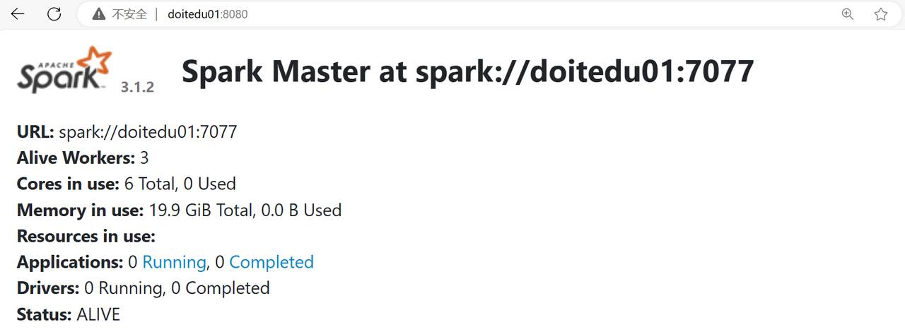


## 7.2 client模式

Driver运行在用来提交任务的SparkSubmit进程中，在Spark的stand alone集群中，提交spark任务时，可以使用cluster模式即--deploy-mode client （默认的）

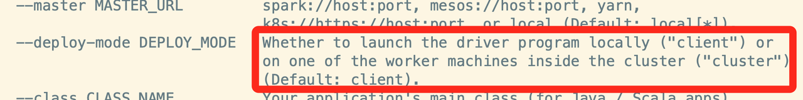


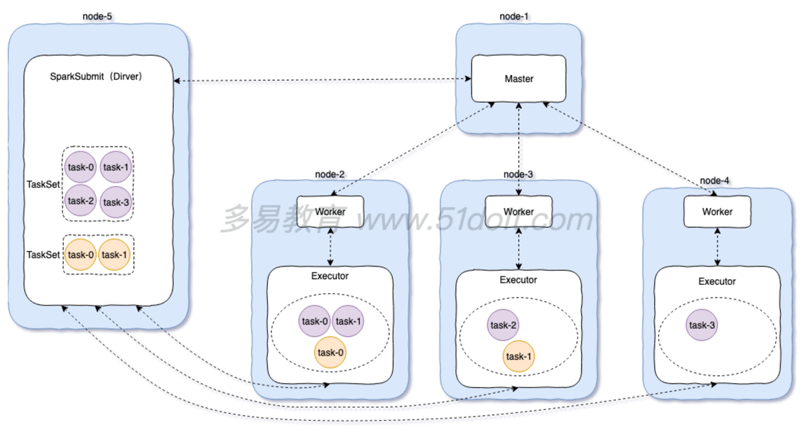

注意：spark-shell只能以client模式运行，不能以cluster模式运行，因为提交任务的命令行客户端和SparkContext必须在同一个进程中。


## 7.3 client模式提交应用

```shell
spark-submit  \
--master spark://doitedu01:7077   \
--class  top.doe.spark.demos._01_WordCount   \
--name   wordcount  \
--driver-memory  1g  \
--executor-memory 2g  \
--executor-cores  1 \
--total-executor-cores  3 \
wc.jar  /wordcount/input  /wordcount/output3

```


## 7.4 cluster模式

Driver运行在Worker启动的一个进程中，这个进程叫DriverWapper，在Spark的stand alone集群中，提交spark任务时，可以使用cluster模式即--deploy-mode cluster

特点：Driver运行在集群中，不在SparkSubmit进程中，需要将jar包上传到hdfs中


```shell
spark-submit --master spark://node-1.51doit.cn:7077 --class cn._51doit.spark.day01.WordCount --deploy-mode cluster hdfs://node-1.51doit.cn:9000/jars/spark10-1.0-SNAPSHOT.jar hdfs://node-1.51doit.cn:9000/wc hdfs://node-1.51doit.cn:9000/out002
```

&#x20;


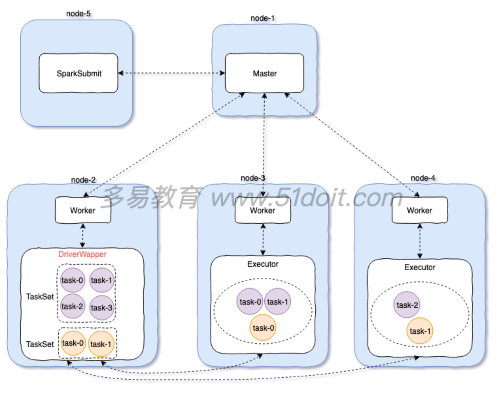

cluster模式的特点：可以给Driver更灵活的指定一些参数，可以给Driver指定内存大小，cores的数量

如果一些运算要在Driver进行计算，或者将数据收集到Driver端，这样就必须指定Driver的内存和cores更大一些


```shell
# 指定Driver的内存，默认是1g
--driver-memory MEM         Memory for driver (e.g. 1000M, 2G) (Default: 1024M).
# 指定Driver的cores，默认是1
--driver-cores NUM          Number of cores used by the driver, only in cluster mode (Default: 1).
```


# 8. 广播变量（有用，map端join）

## 8.1 **广播变量的使用场景**

在很多计算场景，经常会遇到两个RDD进行JOIN，如果一个RDD对应的数据比较大，一个RDD对应的数据比较小，如果使用JOIN，那么会shuffle，导致效率变低。广播变量就是将相对较小的数据，先收集到Driver，然后再通过网络广播到属于该Application对应的每个Executor中，以后处理大量数据对应的RDD关联数据，就不用shuffle了，而是直接在内存中关联已经广播好的数据，即通实现mapside join，&#x20;

可以将Driver端的数据广播到属于该application的Executor，然后通过Driver广播变量返回的引用，获取实现广播到Executor的数据

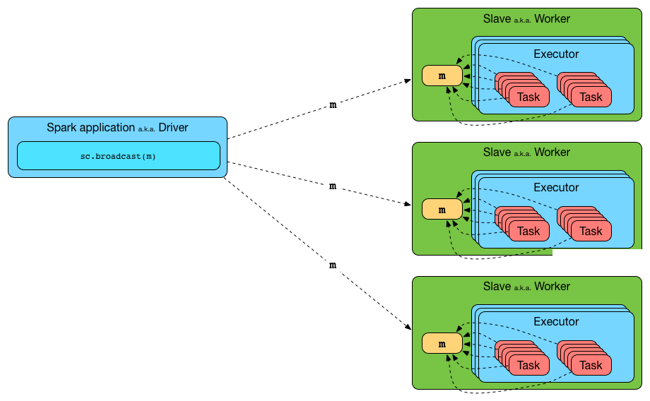

广播变量的特点：广播出去的数据就无法在改变了，在每个Executor中是只读的操作，在每个Executor中，多个Task使用一份广播变量&#x20;


## 8.2 **广播变量的实现原理**

广播变量是通过BT的方式广播的（TorrentBroadcast），多个Executor可以相互传递数据，可以提高效率

sc.broadcast这个方法是阻塞的（同步的）


# 9. Task线程安全问题（刁难型面试问题）

## 9.1 现象和原理

在一个Executor可以同时运行多个Task，如果多个Task使用同一个共享的单例对象（object），如果对共享的数据同时进行读写操作，会导致线程不安全的问题，


为了避免这个问题，可以加锁，但效率变低了，因为在一个Executor中同一个时间点只能有一个Task使用共享的数据，这样就变成了串行了，效率低！


## 9.2 案例

定义一个工具类object，格式化日期，因为SimpleDateFormat线程不安全，会出现异常


```scala
val conf = new SparkConf()
  .setAppName("WordCount")
  .setMaster("local[*]") //本地模式，开多个线程
//1.创建SparkContext
val sc = new SparkContext(conf)

val lines = sc.textFile("data/date.txt")

val timeRDD: RDD[Long] = lines.map(e => {
  //将字符串转成long类型时间戳
  //使用自定义的object工具类
  val time: Long = DateUtilObj.parse(e)
  time
})

val res = timeRDD.collect()
println(res.toBuffer)
```

```scala
object DateUtilObj {

  //多个Task使用了一个共享的SimpleDateFormat，SimpleDateFormat是线程不安全

  val sdf = new SimpleDateFormat("yyyy-MM-dd HH:mm:ss")

  //线程安全的
  //val sdf: FastDateFormat = FastDateFormat.getInstance("yyyy-MM-dd HH:mm:ss")

  def parse(str: String): Long = {
    //2022-05-23 11:39:30
    sdf.parse(str).getTime
  }

}
```

上面的程序会出现错误，因为多个Task同时使用一个单例对象格式化日期，报错，如果加锁，程序会变慢，改进后的代码：

```scala
val conf = new SparkConf()
  .setAppName("WordCount")
  .setMaster("local[*]") //本地模式，开多个线程
//1.创建SparkContext
val sc = new SparkContext(conf)

val lines = sc.textFile("data/date.txt")

val timeRDD = lines.mapPartitions(it => {
  //一个Task使用自己单独的DateUtilClass实例，缺点是浪费内存资源
  val dateUtil = new DateUtilClass
  it.map(e => {
    dateUtil.parse(e)
  })
})

val res = timeRDD.collect()
println(res.toBuffer)
```

```scala
class DateUtilClass {

  val sdf = new SimpleDateFormat("yyyy-MM-dd HH:mm:ss")

  def parse(str: String): Long = {
    //2022-05-23 11:39:30
    sdf.parse(str).getTime
  }
}
```

改进后，一个Task使用一个DateUtilClass实例，不会出现线程安全的问题。


# 10. 序列化问题

## 10.1 序列化问题的场景

spark任务在执行过程中，由于编写的程序不当，任务在执行时，会出序列化问题，通常有以下两种情况，

* 封装数据的Bean没有实现序列化接口（Task已经生成了），在ShuffleWirte之前要将数据溢写磁盘，会抛出异常

* 函数闭包问题，即函数的内部，使用到了外部没有实现序列化的引用（Task没有生成）

## 10.2 数据Bean未实现序列化接口

spark在运算过程中，由于很多场景必须要shuffle，即向数据溢写磁盘并且在网络间进行传输，但是由于封装数据的Bean没有实现序列化接口，就会导致出现序列化的错误！

```scala

object C02_CustomSort {

  def main(args: Array[String]): Unit = {

    val sc = SparkUtil.getContext(this.getClass.getSimpleName, true)
    //使用并行化的方式创建RDD
    val lines = sc.parallelize(
      List(
        "laoduan,38,99.99",
        "nianhang,33,99.99",
        "laozhao,18,9999.99"
      )
    )
    val tfBoy: RDD[Boy] = lines.map(line => {
      val fields = line.split(",")
      val name = fields(0)
      val age = fields(1).toInt
      val fv = fields(2).toDouble
      new Boy(name, age, fv) //将数据封装到一个普通的class中
    })

    implicit val ord = new Ordering[Boy] {
      override def compare(x: Boy, y: Boy): Int = {
        if (x.fv == y.fv) {
          x.age - y.age
        } else {
          java.lang.Double.compare(y.fv, x.fv)
        }
      }
    }
    //sortBy会产生shuffle，如果Boy没有实现序列化接口，Shuffle时会报错
    val sorted: RDD[Boy] = tfBoy.sortBy(bean => bean)

    val res = sorted.collect()

    println(res.toBuffer)
  }
}

//如果以后定义bean，建议使用case class
class Boy(val name: String, var age: Int, var fv: Double)  //extends Serializable 
{
  
  override def toString = s"Boy($name, $age, $fv)"
}
```

## 10.3 函数闭包问题


&#x20;在一个算子的函数（有名函数实现类，匿名实现类，lambda表达式）中，如果引用了外面的对象，那么这个对象就会被匿名实现或lambda捕获成为一个自己的成员变量；

那么，在序列化task时，肯定要序列化函数，进而要序列化函数中的成员；所以，外面的那个被捕获的对象必须可序列化；


## 10.4 对于序列化的细节理解

> 到底什么情况下需要把用户使用的对象实现序列化：
>
> * 对象要被shuffle出去
>
> * 对象要被序列化缓存
>
> * 对象要从driver发到executor（task）端
>
>   * 广播方式
>
>   * 闭包引用


```java

JavaRDD<String> rdd2 = rdd.map(s->{

    // 这个person是在task运行时的内部创建且使用，不需要网络发给其他task，那么就不需要被序列化
    Person person = JSON.parseObject(s,Person.class);
    person.setName(person.getName().toUpper()+" MR");

    return JSON.toJsonString(person);
});
```


```java
Person person  = new Person();

JavaRDD<String> rdd2 = rdd.map(s->{

    // 使用person对象
    // 这里就要求person可序列化；
    // 因为这里是person从driver代码中闭包捕获的，它成为了本函数的成员变量
    String res = s+person.getName()

    return res;
});
```


```java
rdd1 = sc.textFile();
JavaRDD<Person> rdd2 = rdd1.map(s->{

    // 
    Person person = JSON.parseObject(s,Person.class);
    person.setName(person.getName().toUpper()+" MR");

    return person
});

rdd2.saveAsTextFile();

```


# 11. 累加器

累加器是Spark中用来做计数功能的，在程序运行过程当中，可以做一些额外的数据指标统计


需求：在处理数据的同时，统计一下指标数据，具体的需求为：

* 将RDD中对应的每个元素乘以10，同时在统计原始数据中的偶数的个数


## 11.1 不使用累加器的方案

需要多次触发Action，效率低，数据会被重复计算

```scala
/**
 * 不使用累加器，而是触发两次Action
 */
object C12_AccumulatorDemo1 {

  def main(args: Array[String]): Unit = {

    val conf = new SparkConf()
      .setAppName("WordCount")
      .setMaster("local[*]") //本地模式，开多个线程
    //1.创建SparkContext
    val sc = new SparkContext(conf)

    val rdd1 = sc.parallelize(List(1,2,3,4,5,6,7,8,9), 2)
    //对数据进行转换操作（将每个元素乘以10），同时还要统计每个分区的偶数的数量
    val rdd2 = rdd1.map(_ * 10)
    //第一次触发Action
    rdd2.saveAsTextFile("out/111")

    //附加的指标统计
    val rdd3 = rdd1.filter(_ % 2 == 0)
    //第二个触发Action
    val c = rdd3.count()
    println(c)
  }@
}
```


## 11.2 使用累加器的方法

触发一次Action，并且将附带的统计指标计算出来，可以使用Accumulator进行处理，Accumulator的本质是一个实现序列化接口class，每个Task都有自己的累加器，避免累加的数据发送冲突

```scala
object C14_AccumulatorDemo3 {

  def main(args: Array[String]): Unit = {

    val conf = new SparkConf()
      .setAppName("WordCount")
      .setMaster("local[*]") //本地模式，开多个线程
    //1.创建SparkContext
    val sc = new SparkContext(conf)

    val rdd1 = sc.parallelize(List(1,2,3,4,5,6,7,8,9), 2)
    //在Driver定义一个特殊的变量，即累加器
    //Accumulator可以将每个分区的计数结果，通过网络传输到Driver，然后进行全局求和
    val accumulator: LongAccumulator = sc.longAccumulator("even-acc")
    
    
    val rdd2 = rdd1.map(e => {
      if (e % 2 == 0) {
        accumulator.add(1)  
      }
      e * 10
    })

    //就触发一次Action
    rdd2.saveAsTextFile("out/113")

    //每个Task中累计的数据会返回到Driver吗？
    println(accumulator.count) 
  }
}
```


# 12. **Spark思考题**

* 1.SparkContext哪一端生成的？

Driver端即SparkContext（Driver是一个统称，里面还DAGScheduler、TaskScheduler、ShuffleManager、BroadcastManager等）

&#x20;

* 2.DAG是在哪一端被构建的？

Drvier端

&#x20;  &#x20;

* 3.RDD是在哪一端创建的？

Driver端，RDD不装真正要计算的数据，而是记录了数据的描述信息（以后从哪里读数据，怎么计算）

&#x20;

* 6.调用RDD的算子（Transformation和Action）是在哪一端调用的

Driver端

&#x20;      &#x20;

* 7.RDD在调用Transformation和Action时需要传入一个函数，函数是在哪一端声明【定义】和传入的?

Driver端

&#x20;

* 6.RDD在调用Transformation和Action时需要传入函数，请问传入的函数是在哪一端执行了函数的业务逻辑？

一般情况下函数都是在Executor中的Task指定的


特殊情况：aggrgate(0)(f1, f2) //f1是在Executor中执行的，f2是在Driver端执行的 &#x20;


* 9.Task是在哪一端生成的呢？

Driver端,Task分为ShuffleMapTask和ResultTask

&#x20;

* 10.DAG是在哪一端构建好的并被切分成一到多个Stage的

Driver

&#x20;

* 11.DAG是哪个类完成的切分Stage的功能？

DAGScheduler

&#x20;       &#x20;

* 12.DAGScheduler将切分好Stage，然后生成的Task以什么样的形式给TaskScheduler

TaskSet

&#x20;

* 13.分区器这个类是在哪一端实例化的？

Driver端

&#x20;

* 14.分区器中的getParitition方法在哪一端调用的呢？

Executror中的Task

&#x20;

* 15.广播变量是在哪一端调用的方法进行广播的？&#x20;

Driver端

&#x20;

* 16.要广播的数据应该在哪一端先创建好再广播呢？&#x20;

Driver端

&#x20;

* 17.广播变量以后能修改吗？

不能修改

&#x20;

* 18.广播变量广播到Executor后，一个Executor进程中有几份广播变量的数据

一份全部广播的数据


19.广播变量如何释放

调用广播变量返回到Driver端的引用的unpersist()方法进行释放
