# 1. Spark SQL概述

sparksql是一个基于spark core开发的上层库

它的主要功能是解析sql，生成spark core作业代码去执行数据处理


# 2. sparksql的编程套路

sparksql中有api，可以把RDD\[T]封装成 Dataset\[ T ]

Dataset在RDD之上，附加了元数据\[ schema信息（表结构：字段名，字段的sql类型）]

这样，sparksql就可以在dataset之上，把数据映射成 “表”

然后，就可以基于“表”写sql来处理了；


# 3. 编程示例

引如spark-sql的依赖

```java
<dependency>
    <groupId>org.apache.spark</groupId>
    <artifactId>spark-sql_2.12</artifactId>
    <version>3.1.2</version>
</dependency>
```


入门程序

```java


```


# 4. 数据源读写

> **各类数据源的使用文档**

https://archive.apache.org/dist/spark/docs/3.1.2/


## 4.1 csv

```java

/**  加载csv  **/
Dataset<Row> ds = spark.read().format("csv")
        .option("sep", ",")
        .option("header", "true")
        .option("inferSchema", "true")
        .option("quote", "$")   // 什么符号看成引号
        .option("nullValue", "\\N")
        .load("sql_data/datasource/a.csv");
        

Dataset<Row> ds2 = spark.read()
        .option("sep", ",")
        .csv("sql_data/datasource/a.csv");      
        
        
        
/**  保存为csv  **/          
ds.createOrReplaceTempView("tmp");
Dataset<Row> res = spark.sql("select * from tmp where name is not null");
//res.write().format("csv").save("");
res.write().option("header","true")
.mode(SaveMode.OVERRITE)
.partitionBy("dt")  
.csv("sql_data/output/");
```


## 4.2 json

```java
spark.read().option("","").json("路径")
dataSet.write().option("","").json("路径")

```

## 4.3 parquet


```sql
spark.read().option("","").parquet("路径")
dataSet.write().option("","").parquet("路径")
```


## 4.4 jdbc

```java

Properties props = new Properties();
props.set("user","root");
props.set("password","ABC123.abc123");


spark.read().option("","").jdbc("url",props,"db.table")
dataSet.write().option("","").jdbc("url",props,"db.table")
```


## 4.5 hive

1. 读写hive数据源，需要先添加依赖

```xml
<dependency>
    <groupId>org.apache.spark</groupId>
    <artifactId>spark-hive_2.12</artifactId>
    <version>3.1.2</version>
</dependency>
```


* 要在项目的resource目录中，添加hive-site.xml配置文件

```xml
<configuration>

    <property>
        <name>hive.metastore.uris</name>
        <value>thrift://doitedu01:9083</value>
    </property>

</configuration>
```


* 在代码中，要给sparkSession开启hive支持

```java
SparkSession spark = SparkSession.builder()
        .master("local")
        .appName("datasource")
        .config(conf)
        .config("spark.sql.shuffle.partitions",2)
        .enableHiveSupport()  // 开启hive支持
        .getOrCreate();
```


* 然后，就可以愉快地读写hive表数据了

```java

// 读hive表
spark.read().table("hive库.hive表");


// 将计算结果写入hive表
dataSet.write().table("hive库.hive表")
dataSet.saveAsTable("hive库.hive表")
```


# 5. rdd-api与sql的混编（互转）


## 5.1 rdd 转 dataset（dataframe）

> Dataset\<Row> 就是 Dataframe

```java
// 方式1，把 rdd[T] 转成 dataframe ： 就是dataset[row]
Dataset<Row> df = spark.createDataFrame(beanRdd, OrderBean.class);
df.createOrReplaceTempView("tmp1");

// 方式2，把 rdd[T] 转成 dataset[T] 
// 需要传 Encoder
Dataset<OrderBean> ds = spark.createDataset(beanRdd.rdd(), Encoders.bean(OrderBean.class));
ds.createOrReplaceTempView("tmp2");
```


## 5.2 dataset转rdd

```java
JavaRDD<Row> rdd =  dataset.javaRDD();
```


> 在java中发起http请求

```java
// 构造http的请求客户端
CloseableHttpClient client = HttpClients.createDefault();

// 构造请求
HttpGet httpGet = new HttpGet("http://localhost:8080/api/get_event?event_id=" + event_id);

// 发起请求
CloseableHttpResponse response = client.execute(httpGet);

// 解析响应
String json = EntityUtils.toString(response.getEntity());
```


# 6. 自定义函数

## 6.1 自定义UDF (scalar标量函数)

```java
package top.doe.spark_sql;

import lombok.AllArgsConstructor;
import lombok.Data;
import lombok.NoArgsConstructor;
import org.apache.spark.sql.Dataset;
import org.apache.spark.sql.Row;
import org.apache.spark.sql.SparkSession;
import org.apache.spark.sql.api.java.UDF4;
import org.apache.spark.sql.types.DataTypes;

import java.util.Arrays;
import java.util.Collections;
import java.util.List;

/**
 * @Author: 深似海
 * @Site: <a href="www.51doit.com">多易教育</a>
 * @QQ: 657270652
 * @Date: 2024/9/25
 * @Desc: 学大数据，上多易教育
 * 自定义标量函数的示意:
 * 求多个字段中 最大值/最小值
 **/
public class _04_UDF_Demo {
    public static void main(String[] args) {

        SparkSession spark = SparkSession.builder()
                .master("local")
                .appName("niube")
                .getOrCreate();

        Dataset<Row> ds = spark.createDataFrame(Arrays.asList(
                new Info(1, 40, 20, 80, 50),
                new Info(2, 25, 20, 80, 100),
                new Info(3, 50, 40, 80, 50),
                new Info(4, 30, 20, 90, 50)
        ), Info.class);

        ds.createOrReplaceTempView("score");


        // 需要一个接收4参数的标量函数，就实现 UDF4接口
        UDF4<Double, Double, Double, Double, Double> udf4 =
                new UDF4<Double, Double, Double, Double, Double>() {

                    @Override
                    public Double call(Double d1, Double d2, Double d3, Double d4) throws Exception {

                        List<Double> lst = Arrays.asList(d1, d2, d3, d4);
                        Collections.sort(lst);

                        Double min = lst.get(0);
                        Double max = lst.get(lst.size() - 1);

                        return Math.round((max/min)*10)/10.0;
                    }
                };


        // 把函数对象注册到session中
        spark.udf().register("max_min_ratio",udf4, DataTypes.DoubleType);
        spark.sql("select id,max_min_ratio(lan_score,math_score,chm_score,phy_score) from score").show();

    }

    @Data
    @AllArgsConstructor
    @NoArgsConstructor
    public static class Info {
        private int id;
        private double lan_score;
        private double math_score;
        private double chm_score;
        private double phy_score;
    }

}
```


## 6.2 自定义UDAF  弱类型（聚合函数）

```java
package top.doe.spark_sql;

import org.apache.spark.sql.Dataset;
import org.apache.spark.sql.Row;
import org.apache.spark.sql.SparkSession;
import org.apache.spark.sql.expressions.MutableAggregationBuffer;
import org.apache.spark.sql.expressions.UserDefinedAggregateFunction;
import org.apache.spark.sql.types.DataType;
import org.apache.spark.sql.types.DataTypes;
import org.apache.spark.sql.types.StructField;
import org.apache.spark.sql.types.StructType;

import java.util.Arrays;
import java.util.Collections;
import java.util.List;

public class _05_UDAF_Function {

    public static void main(String[] args) {
        SparkSession spark = SparkSession.builder()
                .master("local")
                .appName("niube")
                .getOrCreate();

        //-------------JSON------------------------------------------------------
        Dataset<Row> ds3 = spark.read().format("json")
                //.option("mode", "PERMISSIVE")  // 尽量解析
                .option("mode", "DROPMALFORMED")  // 丢弃不合法的数据
                .option("columnNameOfCorruptRecord", "error")
                .option("prefersDecimal", "true")  // 把double值优先解析成decimal
                .load("sql_data/datasource/order.data");
        ds3.show();
        ds3.createOrReplaceTempView("t_order");

        /*
            +-----+----+---+---+
            |  amt| oid|pid|uid|
            +-----+----+---+---+
            | 78.8| o_1|  1|  1|
            | 68.8| o_2|  2|  1|
            |160.0| o_3|  1|  1|
            |120.8| o_4|  2|  2|
            |780.8| o_5|  2|  2|
            | 78.8|o_10|  2|  4|
            | 68.8| o_6|  3|  2|
            | 78.8| o_7|  3|  3|
            | 78.8| o_9|  2|  4|
            | 78.8| o_8|  2|  3|
            +-----+----+---+---+
         */

        // 注册自定义函数导sql的会话中
        spark.udf().register("my_avg",new MyAvg());
        spark.sql("select uid,my_avg(amt) as amt from t_order group by uid").show();

    }

    // 弱类型的自定义函数，输入和中间累加器，都是用的row，那么都需要用StructType去描述结构
    public static class MyAvg extends UserDefinedAggregateFunction {


        // 描述函数 所要接收的 字段结构
        @Override
        public StructType inputSchema() {

            // 描述了一个输入字段的类型
            StructField field1 = DataTypes.createStructField("d1", DataTypes.DoubleType, true);

            // 将输入字段描述变成一个list
            List<StructField> structFields = Collections.singletonList(field1);

            // 再利用字段list创建了一个structType
            return DataTypes.createStructType(structFields);
        }

        // 描述函数聚合过程中使用的中间累加器结构
        @Override
        public StructType bufferSchema() {

            // 中间缓存器有两个字段： 输入数据的个数，输入数据的和

            StructField cntField = DataTypes.createStructField("cnt", DataTypes.IntegerType, true);
            StructField sumField = DataTypes.createStructField("sum", DataTypes.DoubleType, true);

            return DataTypes.createStructType(Arrays.asList(cntField, sumField));
        }

        // 函数的最终返回值数据类型
        @Override
        public DataType dataType() {
            return DataTypes.DoubleType;
        }

        // 确定性： 如果输入一组相同的数据，是否能得到相同的结果
        // 底层一些优化逻辑会看这个确定性来决定是否执行一些计算逻辑的优化措施
        @Override
        public boolean deterministic() {
            return true;
        }


        // 初始化中间累加器
        @Override
        public void initialize(MutableAggregationBuffer buffer) {

            // 初始化buffer（累加器）中的第0个字段：cnt
            buffer.update(0, 0);

            // 初始化buffer（累加器）中的第1个字段：sum
            buffer.update(1, 0.0);


        }


        // 聚合数据的逻辑
        @Override
        public void update(MutableAggregationBuffer buffer, Row input) {

            // cnt更新为：原来的值+1
            buffer.update(0, buffer.getInt(0) + 1);

            // sum更新为：原来的值 + 输入数据的值
            buffer.update(1, buffer.getDouble(1) + input.getDouble(0));


        }

        // 聚合两个累加器的逻辑
        @Override
        public void merge(MutableAggregationBuffer buffer1, Row buffer2) {

            // cnt更新为： buffer1的cnt + buffer2的cnt
            buffer1.update(0,buffer1.getInt(0) + buffer2.getInt(0));

            // sum更新为： buffer1的sum + buffer2的sum
            buffer1.update(1,buffer1.getDouble(1) + buffer2.getDouble(1));

        }


        // 返回最终聚合值
        @Override
        public Double evaluate(Row buffer) {
            return Math.round(10*buffer.getDouble(1) / buffer.getInt(0))/10.0;
        }
    }

}
```


## 6.3 自定义UDAF  强类型（聚合函数）

```java
package top.doe.spark_sql;

import lombok.AllArgsConstructor;
import lombok.Data;
import lombok.NoArgsConstructor;
import org.apache.spark.sql.*;
import org.apache.spark.sql.expressions.Aggregator;
import org.apache.spark.sql.functions;

public class _05_UDAF_Aggregator {
    public static void main(String[] args) {
        SparkSession spark = SparkSession.builder()
                .master("local")
                .appName("niube")
                .getOrCreate();

        Dataset<Row> ds3 = spark.read().json("sql_data/datasource/order.data");
        ds3.createOrReplaceTempView("t_order");

        // 注册函数（强类型的函数）
        // 注册略麻烦，需要先用 org.apache.spark.sql.functions.udaf() 把它转成userDefinedFunction类型
        spark.udf().register("my_avg",functions.udaf(new MyAvg(),Encoders.DOUBLE()));

        spark.sql("select uid,my_avg(amt) as amt from t_order group by uid").show();

    }


    /**
     * ---------------------------------------------------------------------------
     */


    // 强类型的
    public static class MyAvg extends Aggregator<Double, Agg, Double> {

        // 初始化累加器
        @Override
        public Agg zero() {
            return new Agg();
        }


        // 聚合数据的逻辑
        @Override
        public Agg reduce(Agg agg, Double a) {
            agg.sum += a;
            agg.count++;

            return agg;
        }


        // 聚合两个累加器
        @Override
        public Agg merge(Agg b1, Agg b2) {

            b1.count += b2.count;
            b1.sum += b2.sum;

            return b1;
        }


        // 返回最终结果
        @Override
        public Double finish(Agg agg) {
            return Math.round(10 * agg.sum / agg.count) / 10.0;
        }


        // buffer类型对应的编码器
        @Override
        public Encoder<Agg> bufferEncoder() {
            return Encoders.bean(Agg.class);
        }


        // 最终输出结果类型的编码器
        @Override
        public Encoder<Double> outputEncoder() {
            return Encoders.DOUBLE();
        }
    }


    // 必须完全符合javaBean的规范 （有参，无参，getter，setter）
    @Data
    @NoArgsConstructor
    @AllArgsConstructor
    public static class Agg {
        private int count;
        private double sum;
    }
}
```


# 7. 执行计划查看 (面试用）

## 7.1 sql最终变成的代码结构

```java
sc.textfile()
.mapPartitionsWithIndex(iter-> f (iter)) // f就是这个stage对应的物理计划子树的运算逻辑所动态生成的java代码
.exchange
.mapPatitionsWithIndex(iter -> f(iter) ) 
.exchange
.mapOPartitionsWithIndex(iter -> f(iter) )
```


## 7.2 执行计划的技术本质

* 用一个树结构来表达sql逻辑的运行步骤安排

* 树就是有父子关系的“节点”；

* 节点本质就是一个java类（对象），对象中持有着“执行本步骤”所需要的信息


一个sql被sparksql解析后，生成的执行计划有多个层级：

* 抽象语法树（纯粹表达语法结构）

* 逻辑计划树（节点类型变了，更能体现计划步骤了）（ base class  ： LogicalPlan ）

* 物理计划树（结构跟逻辑计划基本保持不变，节点类型更具体，节点中安排了执行代码模板） （SparkPlan)


## 7.3 如何查看执行计划

* *ds.explain("simple")      // 只打印物理计划*

* *ds.explain("extended")  // 逻辑计划、优化后的逻辑计划、物理计划*

* *ds.explain("formatted")  // 格式化打印物理计划*

* *ds.explain("codegen")  // 打印物理和某些stage中的动态生成的代码*

* *ds.explain("cost")  // 打印逻辑计划和它的成本统计信息*


> sql.sql("explain select .. from t");


### 7.3.1 执行计划查看举例：

> spark.sql("select \* from (select \* from t\_order) tmp where amt>100").explain("extended");

```java
== Parsed Logical Plan ==
'Project [*]
+- 'Filter ('amt > 100)
   +- 'SubqueryAlias tmp
      +- 'Project [*]
         +- 'UnresolvedRelation [t_order], [], false

== Analyzed Logical Plan ==
amt: double, oid: string, pid: bigint, uid: bigint
Project [amt#7, oid#8, pid#9L, uid#10L]
+- Filter (amt#7 > cast(100 as double))
   +- SubqueryAlias tmp
      +- Project [amt#7, oid#8, pid#9L, uid#10L]
         +- SubqueryAlias t_order
            +- Relation[amt#7,oid#8,pid#9L,uid#10L] json

== Optimized Logical Plan ==
Filter (isnotnull(amt#7) AND (amt#7 > 100.0))
+- Relation[amt#7,oid#8,pid#9L,uid#10L] json

== Physical Plan ==
*(1) Filter (isnotnull(amt#7) AND (amt#7 > 100.0))
+- FileScan json [amt#7,oid#8,pid#9L,uid#10L] Batched: false, DataFilters: [isnotnull(amt#7), (amt#7 > 100.0)], Format: JSON, Location: InMemoryFileIndex[file:/D:/devworks/doit50_hadoop/sql_data/datasource/order.data], PartitionFilters: [], PushedFilters: [IsNotNull(amt), GreaterThan(amt,100.0)], ReadSchema: struct<amt:double,oid:string,pid:bigint,uid:bigint>

```


### 7.3.2 执行计划查看举例2

**sql**

```sql
SELECT   gender 
        ,count(1) as order_cnt
        ,sum(amt) as amt_sum
FROM (
    SELECT o.*,u.*
    from t_order o join t_user u on o.uid = u.id
    where amt>100
) tmp
GROUP BY gender 
```


**计划**

```java
== Parsed Logical Plan ==
'Aggregate ['gender], ['gender, 'count(1) AS order_cnt#53, 'sum('amt) AS amt_sum#54]
+- 'SubqueryAlias tmp
   +- 'Project [ArrayBuffer(o).*, ArrayBuffer(u).*]
      +- 'Filter ('amt > 100)
         +- 'Join Inner, ('o.uid = 'u.id)
            :- 'SubqueryAlias o
            :  +- 'UnresolvedRelation [t_order], [], false
            +- 'SubqueryAlias u
               +- 'UnresolvedRelation [t_user], [], false

== Analyzed Logical Plan ==
gender: string, order_cnt: bigint, amt_sum: double
Aggregate [gender#33], [gender#33, count(1) AS order_cnt#53L, sum(amt#7) AS amt_sum#54]
+- SubqueryAlias tmp
   +- Project [amt#7, oid#8, pid#9L, uid#10L, id#31, name#32, gender#33]
      +- Filter (amt#7 > cast(100 as double))
         +- Join Inner, (uid#10L = cast(id#31 as bigint))
            :- SubqueryAlias o
            :  +- SubqueryAlias t_order
            :     +- Relation[amt#7,oid#8,pid#9L,uid#10L] json
            +- SubqueryAlias u
               +- SubqueryAlias t_user
                  +- Relation[id#31,name#32,gender#33] csv

== Optimized Logical Plan ==
Aggregate [gender#33], [gender#33, count(1) AS order_cnt#53L, sum(amt#7) AS amt_sum#54]
+- Project [amt#7, gender#33]
   +- Join Inner, (uid#10L = cast(id#31 as bigint))
      :- Project [amt#7, uid#10L]
      :  +- Filter ((isnotnull(amt#7) AND (amt#7 > 100.0)) AND isnotnull(uid#10L))
      :     +- Relation[amt#7,oid#8,pid#9L,uid#10L] json
      +- Project [id#31, gender#33]
         +- Filter isnotnull(id#31)
            +- Relation[id#31,name#32,gender#33] csv

== Physical Plan ==
*(3) HashAggregate(keys=[gender#33], functions=[count(1), sum(amt#7)], output=[gender#33, order_cnt#53L, amt_sum#54])
+- Exchange hashpartitioning(gender#33, 200), ENSURE_REQUIREMENTS, [id=#92]
   +- *(2) HashAggregate(keys=[gender#33], functions=[partial_count(1), partial_sum(amt#7)], output=[gender#33, count#62L, sum#63])
      +- *(2) Project [amt#7, gender#33]
         +- *(2) BroadcastHashJoin [uid#10L], [cast(id#31 as bigint)], Inner, BuildRight, false
            :- *(2) Filter ((isnotnull(amt#7) AND (amt#7 > 100.0)) AND isnotnull(uid#10L))
            :  +- FileScan json [amt#7,uid#10L] Batched: false, DataFilters: [isnotnull(amt#7), (amt#7 > 100.0), isnotnull(uid#10L)], Format: JSON, Location: InMemoryFileIndex[file:/D:/devworks/doit50_hadoop/sql_data/datasource/order.data], PartitionFilters: [], PushedFilters: [IsNotNull(amt), GreaterThan(amt,100.0), IsNotNull(uid)], ReadSchema: struct<amt:double,uid:bigint>
            +- BroadcastExchange HashedRelationBroadcastMode(List(cast(input[0, int, false] as bigint)),false), [id=#86]
               +- *(1) Filter isnotnull(id#31)
                  +- FileScan csv [id#31,gender#33] Batched: false, DataFilters: [isnotnull(id#31)], Format: CSV, Location: InMemoryFileIndex[file:/D:/devworks/doit50_hadoop/sql_data/datasource/user.csv], PartitionFilters: [], PushedFilters: [IsNotNull(id)], ReadSchema: struct<id:int,gender:string>

```


# 8. sparksql执行整体原理（面试用）

> 一条sql是如何在spark上运行起来的

```sql
select  
       a.gender
       ,sum(b.salary)
       ,avg(b.salary)
from a  join b   on a.id = b.id
where    upper(a.name)  like 'MR%'
group by a.gender
```


## 8.1 整体步骤

* 首先，会做**语法解析**，形成（抽象）语法树（AST） -->**&#x20;sqlParser**

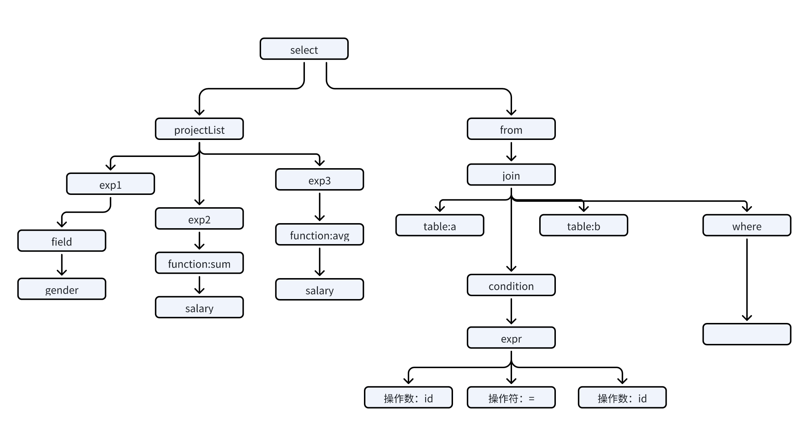


* 然后，**把AST转成逻辑执行计划（关系代数树），然后绑定元数据（analyzer），然后基于规则进行优化（optimizer）**

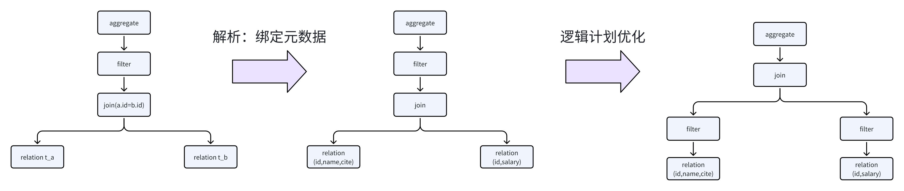

* 最后，把优化后的逻辑计划转成**物理执行计划&#x20;**

> 物理计划中的树节点带 “代码生成” 功能

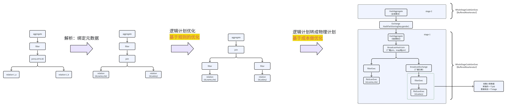


* **生成RDD代码**

在一个job中，每个stage都会生成核心的运算逻辑代码

（接收一个分区迭代器，安排运算逻辑，返回迭代器）


**WholeStageCodeGenExec 物理节点**

```sql
// 调用子树的子节点，递归迭代拼装逻辑代码
val (ctx, cleanedSource) = doCodeGen()

// 取它的子节点rdd，而子节点的inputRdd又是取子节点
// 最后在源头的子节点才会返回RDD（读数据源的物理节点）
val rdds = child.asInstanceOf[CodegenSupport].inputRDDs()
assert(rdds.size <= 2, "Up to two input RDDs can be supported")
if (rdds.length == 1) {
  // 调用这个rdd的mapPartitionsWithIndex算子，传入一个分区迭代器
  // 里面返回一个迭代器
  // 而里面返回的迭代器，
  //      : hasNext()调用的是动态生成的 BufferedRowIterator实现类 的hasNext()
  //      : next() 调用的是动态生成的 BufferedRowIterator实现类 的next()
  rdds.head.mapPartitionsWithIndex { (index, iter) =>
    val (clazz, _) = CodeGenerator.compile(cleanedSource)   // 编译代码
    val buffer = clazz.generate(references).asInstanceOf[BufferedRowIterator]   // 反射实例
    buffer.init(index, Array(iter))
    
    // 返回迭代器
    new Iterator[InternalRow] {
      override def hasNext: Boolean = {
        val v = buffer.hasNext
        if (!v) durationMs += buffer.durationMs()
        v
      }
      override def next: InternalRow = buffer.next()
    }  
  }
} else {
```


## 8.2 优化举例

谓词下推:

```sql
select * from  (select  * from t) o  where id>10;
=>

select * from t where id>10;
```


常量折叠：&#x20;

```sql
 select   10+8+age,  20+30*2 as x, name   from    t;  
 ==>
 select  18+age ,80 ,name from t;

```


列裁剪

```sql
select id,name from  (select  * from t) o  where id>10;

==>
select id,name from t where id>10
```


**correlation**

```sql

------下面的sql，由于两个窗口计算的分区字段相同，会被优化成一个  hash exchange （shuffle）
SELECT  uid,oid,pid,amt
        ,row_number() over(partition by uid order by oid) as rn
        ,sum(amt) over(partition by uid order by amt desc)  as accu
from t_order


------下面的sql，由于两个窗口计算的分区字段不同，没法优化成一个  hash exchange （shuffle）
SELECT  uid,oid,pid,amt
        ,row_number() over(partition by uid order by oid) as rn
        ,sum(amt) over(partition by pid  order by amt desc)  as accu
from t_order

```


# 9. 为什么spark比mr快

* **最重要一个：**

  * spark的一个job可以包含多次shuffle，每次shuffle后的计算结果不需要落地到HDFS

  * mr的一个job只包含一次shuffle，如果一个sql逻辑需要多次shuffle，则会变成很多个job，每个job都会把结果落到HDFS，下一个job再读HDFS


* **rdd的缓存机制**

  * 同一个rdd要被后续的多个job重复使用，则这个rdd的结果数据可以缓存在executor的 storage内存中，可以重复利用；

  * 而mr要做到类似效果，需要把某个中间job的结果先写入HDFS，其他job再从HDFS读这一份数据


* **spark的shuffle机制相对mr效率更高**

  * 以sortShuffleWriter最正统的shuffle来说，它内部的缓存可以不断扩容，充分利用内存，减少溢出（通常没有溢出）；

  * 而MR的shuffle缓存大小是参数配置固定的（默认100M），溢出次数更多，后续的合并操作也更重；


* **executor是常驻（在application生命周期中）**

  * driver可以把dag中的各个stage中的各个taskset中的tasks，发送到executor执行时，不需要反复重启executor

  * 而mr中，只要运行一个task（maptask、reducetask），就需要向yarn申请容器的，启动yarnchild


***

***


# 10. 往下是备用内容------------------------

## 10.1 Spark SQL定义

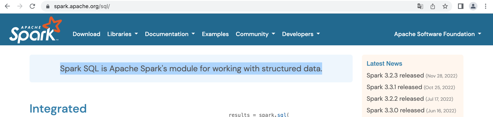

Spark SQL是基于spark core提供的一个用来**处理结构化数据的**模块（库） ;

比如我们有结构化数据 , csv , orc ,parquet , json,对数据进行分析统计 , 可以编写sql语句简化开发过程 !


## 10.2 Spark SQL的特性

**1.易整合**

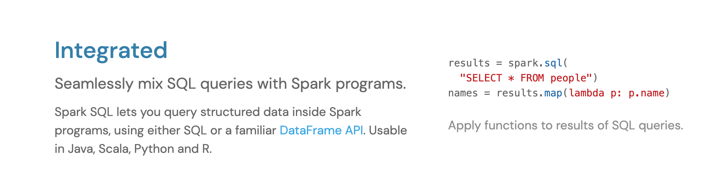

Spark SQL使得在spark编程中可以如丝般顺滑地混搭SQL和算子api编程（想想都激动不是！）

sparksql可以处理结构化数据 , 可以将DF转换成RDD , 也可以将RDD转换成DF处理

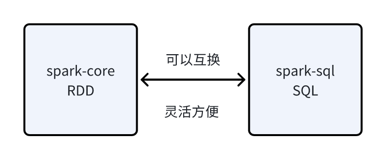


**2.统一的数据访问方式**

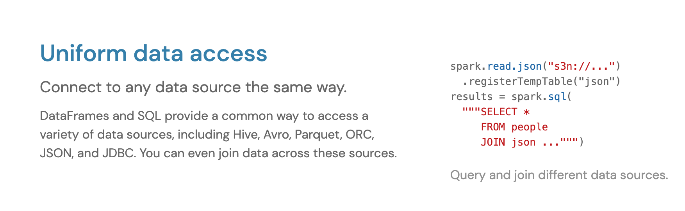

Spark SQL为各类不同数据源提供统一的访问方式，可以跨各类数据源进行愉快的join；所支持的数据源包括但不限于： Hive / Avro / CSV / Parquet / ORC / JSON / JDBC等；（简直太美好了！）


**3.兼容Hive**

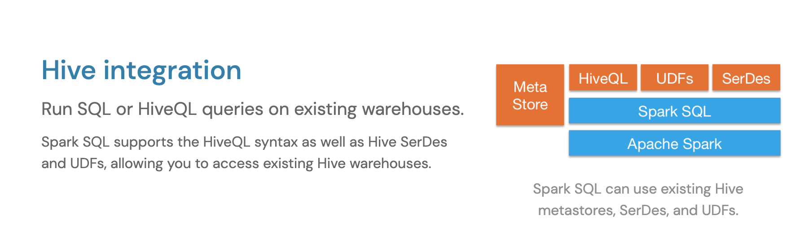

Spark SQL支持HiveQL语法及Hive的SerDes、UDFs，并允许你访问已经存在的Hive数仓数据；（难以置信的贴心！）


**4.标准的数据连接**

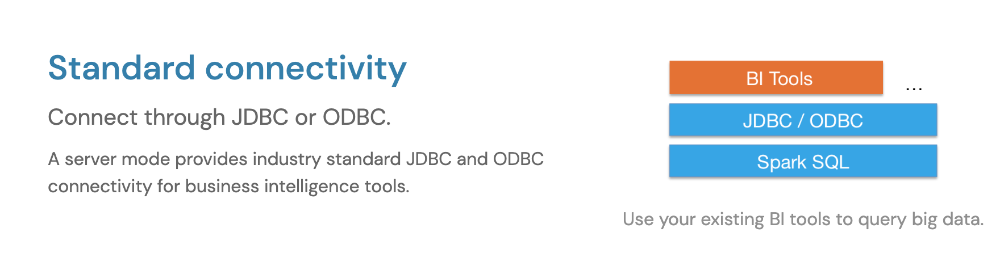

Spark SQL的server模式可为各类BI工具提供行业标准的JDBC/ODBC连接，从而可以为支持标准JDBC/ODBC连接的各类工具提供无缝对接；（开发封装平台很有用哦！）

**&#x20;**

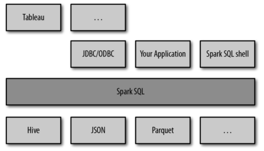

**&#x20;**&#x20;

SparkSQL可以看做一个转换层，向下对接各种不同的结构化数据源，向上提供不同的数据访问方式。

## &#x20;1.3.  Spark-sql编程抽象


它提供了一个编程抽象叫做**DataFrame**/Dataset，它可以理解为一个基于RDD数据模型的更高级数据模型，带有结构化元信息（schema），DataFrame其实就是Dataset\[Row]，Spark SQL可以将针对DataFrame/Dataset的各类SQL运算，翻译成RDD的各类算子执行计划，从而大大简化数据运算编程（请联想Hive）&#x20;

DataFrame =  RDD + 结构(schema)


# 11. SparkSQL快速体验

## 11.1  入门

IDEA中SparkSQL程序的开发方式和SparkCore类似。

添加Maven依赖：

```xml
<dependency>
    <groupId>org.apache.spark</groupId>
    <artifactId>spark-sql_2.12</artifactId>
    <version>3.2.3</version>
</dependency>
```

程序如下：

读取csv数据 , 返回DF对象 , 使用sql分析数据

* 创建session环境&#x20;

* read.csv文件  返回DF对象

* 将DF创建视图

* 使用sql处理数据 &#x20;

* 展示数据   释放资源

```scala
package com.doe.sqls

import org.apache.spark.sql.{DataFrame, SparkSession}

/**
 * @Date: 2023/11/27
 * @Author: Hang.Nian.YY
 * @WX: 17710299606
 * @Tips: 学大数据 ,到多易教育
 * @DOC: https://blog.csdn.net/qq_37933018?spm=1000.2115.3001.5343
 * @Description:
 */
object D02Demo {
  def main(args: Array[String]): Unit = {
    /**
     * 使用sparksql处理结构化数据
     */

    // 1  获取编程环境   SparkSession
    val session: SparkSession = SparkSession.builder()
      .master("local[*]")
      .appName("test02")
      .getOrCreate()

    // 2 加载结构化数据   RDD +  数据结构  =  DataFrame
    val frame: DataFrame = session.read.option("header" , "true").csv("data/user")


    /**
     * 3 创建视图  使用sql分析数据
     */
    frame.createTempView("tb_user")
    session.sql(
      """
        |select
        |id ,
        |name
        |from
        |tb_user
        |
        |""".stripMargin).show()
/*    frame.printSchema()  //打印结构
    frame.show()   // 打印结构*/


  }

}
```


## 11.2 命令行使用示例

示例需求：查询大于30岁的用户

1. 启动Spark shell

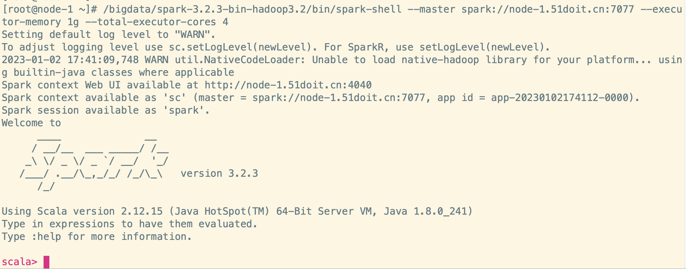

* 创建如下JSON文件，注意JSON的格式，然后上次到HDFS中

```json
{"name":"Michael"}
{"name":"Andy", "age":30}
{"name":"Justin", "age":19}
{"name":"brown", "age":39}
{"name":"jassie", "age":34}
```

**&#x20;**

3. 愉快地开始使用：

如果读取本地文件系统，文件的schema为file://

```plain&#x20;text
scala> val df = spark.read.json("hdfs://node-1.51doit.cn:9000/json/user.json")
df: org.apache.spark.sql.DataFrame = [age: bigint, name: string]                

scala> df.printSchema
root
 |-- age: long (nullable = true)
 |-- name: string (nullable = true)


scala> df.filter($"age" > 21).show
+---+------+
|age|  name|
+---+------+
| 30|  Andy|
| 39| brown|
| 34|jassie|
+---+------+


scala> df.createTempView("v_user")

scala> spark.sql("select * from v_user where age > 21").show
+---+------+
|age|  name|
+---+------+
| 30|  Andy|
| 39| brown|
| 34|jassie|
+---+------+

```

**&#x20;**

## 11.3 新的编程入口SparkSession

在老的版本中，SparkSQL提供两种SQL查询起始点，一个叫SQLContext，用于Spark自己提供的SQL查询，一个叫HiveContext，用于连接Hive的查询，SparkSession是Spark最新的SQL查询起始点，实质上是SQLContext和SparkContext的组合，所以在SQLContext和HiveContext上可用的API在SparkSession上同样是可以使用的。SparkSession内部封装了sparkContext，所以计算实际上是由sparkContext完成的。


```scala
import org.apache.spark.sql.SparkSession
​
val spark = SparkSession
  .builder()
  .appName("Spark SQL basic example")
  .config("spark.some.config.option", "some-value")
  .getOrCreate()
​
// 提供隐式转换支持，如 RDDs to DataFrames
import spark.implicits._
```

**&#x20;**

SparkSession.builder 用于创建一个SparkSession。

import spark.implicits.\_的引入是用于将DataFrames隐式转换成RDD，使df能够使用RDD中的方法。

如果需要Hive支持，则需要以下创建语句：


```scala
import org.apache.spark.sql.SparkSession
​
val spark = SparkSession
  .builder( )
  .appName("Spark SQL basic example")
  .config("spark.some.config.option", "some-value")
  .enableHiveSupport( ) //开启对hive的支持
  .getOrCreate( )
​
// For implicit conversions like converting RDDs to DataFrames
import spark.implicits._
```

# 12. DataFrame编程详解

## 12.1 创建DataFrame

在Spark SQL中SparkSession是创建DataFrames和执行SQL的入口

创建DataFrames有三种方式：


> **核心要义：创建DataFrame，需要创建 “RDD  +  元信息schema定义” + 执行计划**
>
> *rdd来自于数据*
>
> *schema则可以由开发人员定义，或者由框架从数据中推断*


### 12.1.1 使用RDD创建DataFrame

1. 将RDD关联case class创建DataFrame

```scala
object DataFrameDemo1 {

  def main(args: Array[String]): Unit = {

    val conf = new SparkConf()
      .setAppName(this.getClass.getSimpleName)
      .setMaster("local[*]")
    //1.SparkSession，是对SparkContext的增强
    val session: SparkSession = SparkSession.builder()
      .config(conf)
      .getOrCreate()

    //2.创建DataFrame
    //2.1先创建RDD
    val lines: RDD[String] = session.sparkContext.textFile("data/user.txt")
    //2.2对数据进行整理并关联Schema
    val tfBoy: RDD[Boy] = lines.map(line => {
      val fields = line.split(",")
      val name = fields(0)
      val age = fields(1).toInt
      val fv = fields(2).toDouble
      Boy(name, age, fv) //字段名称，字段的类型
    })

    //2.3将RDD关联schema，将RDD转成DataFrame
    //导入隐式转换
    import session.implicits._
    val df: DataFrame = tfBoy.toDF
    //打印DataFrame的Schema信息
    df.printSchema()
    //3.将DataFrame注册成视图（虚拟的表）
    df.createTempView("v_users")
    //4.写sql（Transformation）
    val df2: DataFrame = session.sql("select * from v_users order by fv desc, age asc")
    //5.触发Action
    df2.show()
    //6.释放资源
    session.stop()
  }
}

case class Boy(name: String, age: Int, fv: Double)
```

* 将RDD关联普通class创建DataFrame

```scala
object C02_DataFrameDemo2 {

  def main(args: Array[String]): Unit = {

    //1.创建SparkSession
    val spark = SparkSession.builder()
      .appName("DataFrameDemo2")
      .master("local[*]")
      .getOrCreate()

    //2.创建RDD
    val lines: RDD[String] = spark.sparkContext.textFile("data/user.txt")
    //2将数据封装到普通的class中
    val boyRDD: RDD[Boy2] = lines.map(line => {
      val fields = line.split(",")
      val name = fields(0)
      val age = fields(1).toInt
      val fv = fields(2).toDouble
      new Boy2(name, age, fv) //字段名称，字段的类型
    })
    //3.将RDD和Schema进行关联
    val df = spark.createDataFrame(boyRDD, classOf[Boy2])
    //df.printSchema()
    //4.使用DSL风格的API
    import spark.implicits._
    df.show()
    spark.stop()
  }
}

//参数前面必须有var或val
//必须添加给字段添加对应的getter方法，在scala中，可以@BeanProperty注解
class Boy2(
            @BeanProperty
            val name: String,
            @BeanProperty
            val age: Int,
            @BeanProperty
            val fv: Double) {

}
```

> 普通的scala class 必须在成员变量加上@BeanProperty属性，因为sparksql需要通过反射调用getter获取schema信息


* 将RDD关联java class创建DataFrame

```scala
object SQLDemo4 {

  def main(args: Array[String]): Unit = {

    val spark: SparkSession = SparkSession.builder()
      .appName(this.getClass.getSimpleName)
      .master("local[*]")
      .getOrCreate()

    val lines = spark.sparkContext.textFile("data/boy.txt")
    //将RDD关联的数据封装到Java的class中，但是依然是RDD
    val jboyRDD: RDD[JBoy] = lines.map(line => {
      val fields = line.split(",")
      new JBoy(fields(0), fields(1).toInt, fields(2).toDouble)
    })
    //强制将关联了schema信息的RDD转成DataFrame
    val df: DataFrame = spark.createDataFrame(jboyRDD, classOf[JBoy])
    //注册视图
    df.createTempView("v_boy")
    //写sql
    val df2: DataFrame = spark.sql("select name, age, fv from v_boy order by fv desc, age asc")
    df2.show()
    spark.stop()
  }
}
```

```java
public class JBoy {

    private String name;

    private Integer age;

    private Double fv;

    public String getName() {
        return name;
    }

    public Integer getAge() {
        return age;
    }

    public Double getFv() {
        return fv;
    }

    public JBoy(String name, Integer age, Double fv) {
        this.name = name;
        this.age = age;
        this.fv = fv;
    }
}
```


* 将RDD关联Schema创建DataFrame

```scala
object SQLDemo4 {

  def main(args: Array[String]): Unit = {

    val spark: SparkSession = SparkSession.builder()
      .appName(this.getClass.getSimpleName)
      .master("local[*]")
      .getOrCreate()

    val lines = spark.sparkContext.textFile("data/boy.txt")
    //将RDD关联了Schema，但是依然是RDD
    val rowRDD: RDD[Row] = lines.map(line => {
      val fields = line.split(",")
      Row(fields(0), fields(1).toInt, fields(2).toDouble)
    })
    
    val schema = StructType.apply(
      List(
        StructField("name", StringType),
        StructField("age", IntegerType),
        StructField("fv", DoubleType),
      )
    )
    val df: DataFrame = spark.createDataFrame(rowRDD, schema)
    //打印schema信息
    //df.printSchema()
    //注册视图
    df.createTempView("v_boy")
    //写sql
    val df2: DataFrame = spark.sql("select name, age, fv from v_boy order by fv desc, age asc")
    df2.show()
    spark.stop()
  }
}
```

### 12.1.2 从结构化文件创建DataFrame

#### (1)从csv文件（不带header）进行创建

csv文件内容：

```plain&#x20;text
1,张飞,21,北京,80.0
2,关羽,23,北京,82.0
3,赵云,20,上海,88.6
4,刘备,26,上海,83.0
5,曹操,30,深圳,90.0
```

代码示例：

```scala
val df = spark.read.csv("data_ware/demodata/stu.csv")
df.printSchema()
df.show()
```

结果如下：

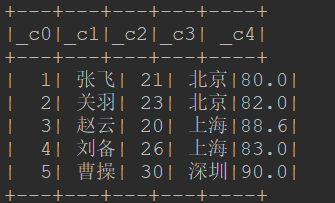


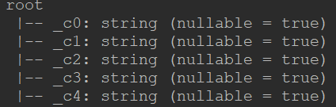

可以看出，框架对读取进来的csv数据，自动生成的schema中，

字段名为：\_c0,\_c1,.....

字段类型全为String

不一定是符合我们需求的


#### (2)从csv文件（不带header）自定义Schema进行创建

// 创建DataFrame时，传入自定义的schema

// schema在api中用StructType这个类来描述，字段用StructField来描述

```scala
val schema = new StructType()
  .add("id", DataTypes.IntegerType)
  .add("name", DataTypes.StringType)
  .add("age", DataTypes.IntegerType)
  .add("city", DataTypes.StringType)
  .add("score", DataTypes.DoubleType)
​
val df = spark.read.schema(schema).csv("data_ware/demodata/stu.csv")
df.printSchema()
df.show()
```

***

Schema信息：

```plain&#x20;text
root
 |-- id: integer (nullable = true)
 |-- name: string (nullable = true)
 |-- age: integer (nullable = true)
 |-- city: string (nullable = true)
 |-- score: double (nullable = true)
```

输出数据信息：

```sql
+---+------+---+------+-----+
| id|name  |age|city  |score|
+---+------+---+------+-----+
|  1|  张飞| 21|  北京| 80.0|
|  2|  关羽| 23|  北京| 82.0|
|  3|  赵云| 20|  上海| 88.6|
|  4|  刘备| 26|  上海| 83.0|
|  5|  曹操| 30|  深圳| 90.0|
+---+------+---+------+-----+
```

#### (3)从csv文件（带header）进行创建

csv文件内容：

```plain&#x20;text
id,name,age,city,score
1,张飞,21,北京,80.0
2,关羽,23,北京,82.0
3,赵云,20,上海,88.6
4,刘备,26,上海,83.0
5,曹操,30,深圳,90.0
```

注意：此文件的第一行是字段描述信息，需要特别处理，否则会被当做rdd中的一行数据


代码示例：关键点设置一个header=true的参数

```scala
val df = spark.read
  .option("header",true) //读取表头信息
  .csv("data_ware/demodata/stu.csv")
df.printSchema()
df.show()
```

结果如下：

root

```plain&#x20;text
 |-- id: string (nullable = true)
 |-- name: string (nullable = true)
 |-- age: string (nullable = true)
 |-- city: string (nullable = true)
 |-- score: string (nullable = true)
​
+---+----+---+----+-----+
| id|name|age|city|score|
+---+----+---+----+-----+
|  1|  张飞| 21|  北京| 80.0|
|  2|  关羽| 23|  北京| 82.0|
|  3|  赵云| 20|  上海| 88.6|
|  4|  刘备| 26|  上海| 83.0|
|  5|  曹操| 30|  深圳| 90.0|
+---+----+---+----+-----+

```

问题：虽然字段名正确指定，但是字段类型还是无法确定，默认情况下全视作String对待，当然，可以开启一个参数  inferSchema=true 来让框架对csv中的数据字段进行合理的类型推断

```scala
val df = spark.read
  .option("header",true)
  .option("inferSchema",true) //推断字段类型
  .csv("data_ware/demodata/stu.csv")
df.printSchema()
df.show()
```

如果推断的结果不如人意，当然可以指定自定义schema

让框架自动推断schema，效率低不建议！


#### (4)从JSON文件进行创建

准备json数据文件

```json
{"name":"Michael"}
{"name":"Andy", "age":30}
{"name":"Justin", "age":19}
```

代码示例

```json
val df = spark.read.json("data_ware/demodata/people.json")
df.printSchema()
df.show()
```


#### (5)从Parquet文件进行创建

Parquet文件是一种列式存储文件格式，文件自带schema描述信息

准备测试数据

任意拿一个dataframe，调用write.parquet()方法即可将df保存为一个parquet文件

代码示例：

```scala
val df = spark.read.parquet("data/parquet/")
```

#### (6)从orc文件进行创建

代码示例

```scala
val df = spark.read.orc("data/orcfiles/")
```


### 3.2.3外部存储服务创建DF

#### （1）从JDBC连接数据库服务器进行创建

实验准备

在一个mysql服务器中，创建一个数据库demo，创建一个表student，如下：

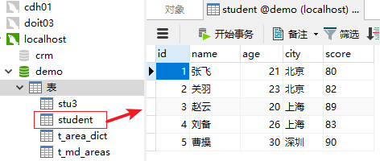


注：要使用jdbc连接读取数据库的数据，需要引入jdbc的驱动jar包依赖

```xml
<dependency>
    <groupId>mysql</groupId>
    <artifactId>mysql-connector-java</artifactId>
    <version>8.0.30</version>
</dependency>
```

代码示例

```scala
val props = new Properties()
props.setProperty("user","root")
props.setProperty("password","root")
val df = spark.read.jdbc("jdbc:mysql://localhost:3306/demo","student",props)
df.show()
```

结果如下：

```plain&#x20;text
+---+------+---+------+-----+
| id|name  |age|city  |score|
+---+------+---+------+-----+
|  1|  张飞| 21|  北京| 80.0|
|  2|  关羽| 23|  北京| 82.0|
|  3|  赵云| 20|  上海| 88.6|
|  4|  刘备| 26|  上海| 83.0|
|  5|  曹操| 30|  深圳| 90.0|
+---+------+---+------+-----+
```

***

SparkSql添加了spark-hive的依赖，并在sparkSession构造时开启enableHiveSupport后，就整合了hive的功能（通俗说，就是sparksql具备了hive的功能）；

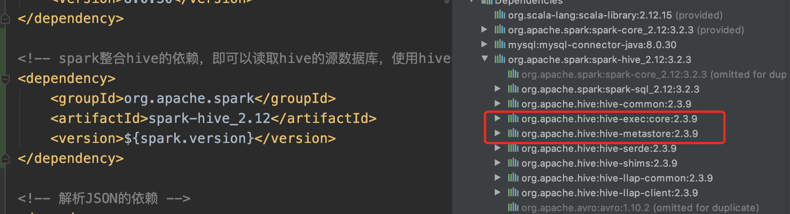


既然具备了hive的功能，那么就可以执行一切hive中能执行的动作：

只不过，此时看见的表是spark中集成的hive的本地元数据库中的表！


如果想让spark中集成的hive，看见你外部集群中的hive的表，只要修改配置：把spark端的hive的元数据服务地址，指向外部集群中hive的元数据服务地址；

有两种指定办法：

* 在spark端加入hive-site.xml ，里面配置 目标元数据库 mysql的连接信息

这会使得spark中集成的hive直接访问mysql元数据库

* 在spark端加入hive-site.xml ，里面配置 目标hive的元数据服务器地址

这会使得spark中集成的hive通过外部独立的hive元数据服务来访问元数据库


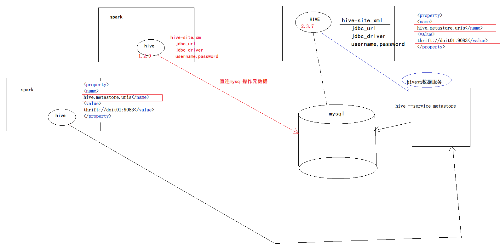


#### （2）从Hive创建DataFrame

Sparksql通过spark-hive整合包，来集成hive的功能

Sparksql加载“外部独立hive”的数据，本质上是不需要“外部独立hive”参与的，因为“外部独立hive”的表数据就在hdfs中，元数据信息在mysql中

不管数据还是元数据，sparksql都可以直接去获取！


步骤：

1. 要在工程中添加spark-hive的依赖jar以及mysql的jdbc驱动jar

```xml
<dependency>
    <groupId>mysql</groupId>
    <artifactId>mysql-connector-java</artifactId>
    <version>8.0.30</version>
</dependency>

<!-- spark整合hive的依赖，即可以读取hive的源数据库，使用hive特点的sql -->
<dependency>
    <groupId>org.apache.spark</groupId>
    <artifactId>spark-hive_2.12</artifactId>
    <version>3.2.3</version>
</dependency>
```


2. 要在工程中添加hive-site.xml/core-site.xml配置文件

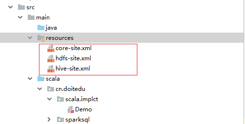

在hive-site.xml中配置hive元数据服务地址信息

```xml
<configuration>
    <property>
        <name>hive.metastore.uris</name>
        <value>thrift://doe01:9083</value>
    </property>
</configuration>
```

3. 创建sparksession时需要调用.enableHiveSupport( )方法

```scala
val spark = SparkSession
  .builder()
  .appName(this.getClass.getSimpleName)
  .master("local[*]")
  // 启用hive支持,需要调用enableHiveSupport，还需要添加一个依赖 spark-hive
  // 默认sparksql内置了自己的hive
  // 如果程序能从classpath中加载到hive-site配置文件，那么它访问的hive元数据库就不是本地内置的了，而是配置中所指定的元数据库了
  // 如果程序能从classpath中加载到core-site配置文件，那么它访问的文件系统也不再是本地文件系统了，而是配置中所指定的hdfs文件系统了
  .enableHiveSupport()
  .getOrCreate()
```

***


4. 加载hive中的表

```scala
val df = spark.sql("select * from t1")
```

注意点：如果自己也用dataframe注册了一个同名的视图，那么这个视图名会替换掉hive的表


#### （3）从Hbase创建DataFrame

其实，sparksql可以连接任意外部数据源（只要有对应的“连接器”即可）

Sparksql对hbase是有第三方连接器（华为）的，但是久不维护！


建议用hive作为连接器（hive可以访问hbase，而sparksql可以集成hive）

在hbase中建表 &#x20;


```shell
create 'doitedu_stu','f'
```


插入数据到hbase表

```shell
put 'doitedu_stu','001','f:name','zhangsan'
put 'doitedu_stu','001','f:name','张三'
put 'doitedu_stu','001','f:age','26'
put 'doitedu_stu','001','f:gender','m'
put 'doitedu_stu','001','f:salary','28000'
put 'doitedu_stu','002','f:name','lisi'
put 'doitedu_stu','002','f:age','22'
put 'doitedu_stu','002','f:gender','m'
put 'doitedu_stu','002','f:salary','26000'
put 'doitedu_stu','003','f:name','wangwu'
put 'doitedu_stu','003','f:age','21'
put 'doitedu_stu','003','f:gender','f'
put 'doitedu_stu','003','f:salary','24000'
put 'doitedu_stu','004','f:name','zhaoliu'
put 'doitedu_stu','004','f:age','22'
put 'doitedu_stu','004','f:gender','f'
put 'doitedu_stu','004','f:salary','25000'
```

***

创建hive外部表映射hbase中的表

```sql
CREATE EXTERNAL TABLE doitedu_stu
( 
  id        string ,
  name      string ,
  age       int    ,
  gender    string ,
  salary    double  
)  
STORED BY 'org.apache.hadoop.hive.hbase.HBaseStorageHandler' 
WITH SERDEPROPERTIES ( 'hbase.columns.mapping'=':key,f:name,f:age,f:gender,f:salary') 
TBLPROPERTIES ( 'hbase.table.name'='default:doitedu_stu')
;
```


工程中放置hbase-site.xml配置文件

```xml
<configuration>
    <property>
        <name>hbase.rootdir</name>
        <value>hdfs://doit01:8020/hbase</value>
    </property>
​
    <property>
        <name>hbase.cluster.distributed</name>
        <value>true</value>
    </property>
​
    <property>
        <name>hbase.zookeeper.quorum</name>
        <value>doit01:2181,doit02:2181,doit03:2181</value>
    </property>
​
    <property>
        <name>hbase.unsafe.stream.capability.enforce</name>
        <value>false</value>
    </property>
</configuration>
```

​

工程中添加hive-hbase-handler连接器依赖

```xml
<dependency>
    <groupId>org.apache.hive</groupId>
    <artifactId>hive-hbase-handler</artifactId>
    <version>2.3.7</version>
    <exclusions>
        <exclusion>
            <groupId>org.apache.hadoop</groupId>
            <artifactId>hadoop-common</artifactId>
        </exclusion>
    </exclusions>
</dependency>
```

​

以读取hive表的方式直接读取即可

```scala
spark.sql("select * from doitedu_stu")
```

&#x20;   &#x20;

## 12.2 输出DF的各种方式

### 12.2.1 展现在控制台

```scala
df.show()
df.show(10)        //输出10行  
df.show(10,false)  // 不要截断列
```

***

### 12.2.2 保存为文件


```scala
object Demo17_SaveDF {
​
  def main(args: Array[String]): Unit = {
​
    val spark = SparkUtil.getSpark()
​
    val df = spark.read.option("header",true).csv("data/stu2.csv")
​
    val res = df.where("id>3").select("id","name")
​
    // 展示结果
    res.show(10,false)
}
```

​

&#x20;保存结果为文件： parquet,json,csv,orc,textfile

&#x20;文本文件是自由格式，框架无法判断该输出什么样的形式

```scala
res.write.parquet("out/parquetfile/")
​
res.write.csv("out/csvfile")
​
res.write.orc("out/orcfile")
​
res.write.json("out/jsonfile")
```

​

&#x20;要将df输出为普通文本文件，则需要将df变成一个列

```scala
res.selectExpr("concat_ws('\001',id,name)")
  .write.text("out/textfile")

```


### 12.2.3 保存到RDBMS

将dataframe写入mysql的表

```scala
// 将dataframe通过jdbc写入mysql
val props = new Properties()
props.setProperty("user","root")
props.setProperty("password","root")

// 可以通过SaveMode来控制写入模式：SaveMode.Append/Ignore/Overwrite/ErrorIfExists(默认)
res.write.mode(SaveMode.Append).jdbc("jdbc:mysql://localhost:3306/demo?characterEncoding=utf8","res",props)
```


### 12.2.4 写入hive

开启spark的hive支持

```scala
val spark = SparkSession
  .builder()
  .appName("")
  .master("local[*]")
  .enableHiveSupport()
  .getOrCreate()
```


放入配置文件

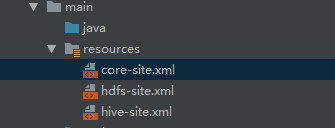


写代码：

```scala
// 将dataframe写入hive,saveAsTable就是保存为hive的表
// 前提，spark要开启hiveSupport支持，spark-hive的依赖，hive的配置文件
res.write.saveAsTable("res")
```


### 12.2.5 DF输出时的分区操作

Hive中对表数据的存储，可以将数据分为多个子目录！

比如：

```shell
create table tx(id int,name string) partitioned by (city string);
load data inpath ‘/data/1.dat’ into table tx partition(city=”beijing”)
load data inpath ‘/data/2.dat’ into table tx partition(city=”shanghai”)
```

Hive的表tx的目录结构如下：

```plain&#x20;text
/user/hive/warehouse/tx/
                    city=beijing/1.dat
                    city=shanghai/2.dat
```

查询的时候，分区标识字段，可以看做表的一个字段来用

```sql
Select * from  tx   where city=’shanghai’
```


那么，sparksql既然是跟hive兼容的，必然也有对分区存储支持的机制！

1. 能识别解析分区

有如下数据结构形式：

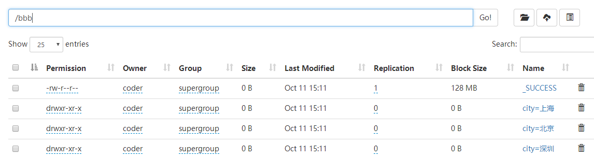


```scala
/**
  * sparksql对分区机制的支持
  * 识别已存在分区结构  /aaa/city=a;  /aaa/city=b;
  * 会将所有子目录都理解为数据内容，会将子目录中的city理解为一个字段
  */
spark.read.csv("/aaa").show()
```


2. 能将数据按分区机制输出

```scala
/**
  * sparksql对分区机制的支持
  * 将dataframe存储为分区结构
  */
val dfp = spark.read.option("header",true).csv("data/stu2.csv")
dfp.write.partitionBy("city").csv("/bbb")
​
​
/**
  * 将数据分区写入hive
  * 注意：写入hive的默认文件格式是parquet
  */
dfp.write.partitionBy("sex").saveAsTable("res_p")
```


输入结构如下：

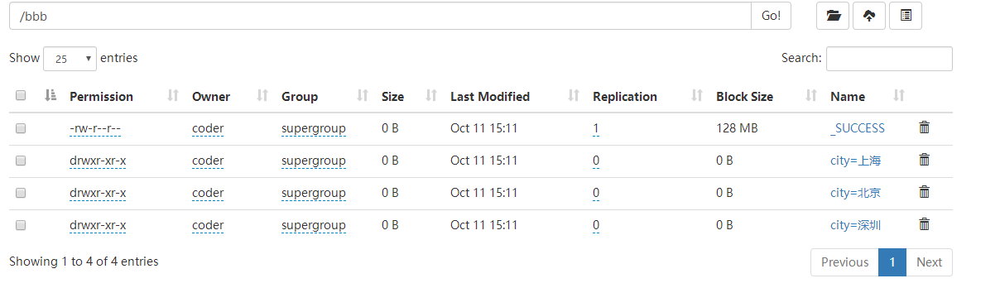

***

## 12.3 DF数据运算操作

### 12.3.1 纯SQL操作

核心要义：将DataFrame 注册为一个临时视图view，然后就可以针对view直接执行各种sql

临时视图有两种：session级别视图，global级别视图；

session级别视图是Session范围内有效的，Session退出后，表就失效了；

全局视图则在application级别有效；

注意使用全局表时需要全路径访问：global\_temp.people

```scala
// application全局有效
df.createGlobalTempView("stu")
spark.sql(
  """
    |select * from global_temp.stu a order by a.score desc
  """.stripMargin)
    .show()
​
```


```scala
// session有效
df.createTempView("s")
spark.sql(
  """
    |select * from s order by score
  """.stripMargin)
  .show()
```

​

```scala
val spark2 = spark.newSession()
// 全局有效的view可以在session2中访问
spark2.sql("select id,name from global_temp.stu").show()
// session有效的view不能在session2中访问
spark2.sql("select id,name from s").show()
```

以上只是对语法的简单示例，可以扩展到任意复杂的sql

挑战一下 ?

求出每个城市中，分数最高的学生信息；

Go go go !


### 12.3.2 DSL风格API(TableApi)语法

DSL风格API，就是用编程api的方式，来实现sql语法

DSL：特定领域语言

dataset的tableApi有一个特点：运算后返回值必回到dataframe

因为select后，得到的结果，无法预判返回值的具体类型，只能用通用的Row封装


数据准备

```scala
val df = spark.read
  .option("header", true)
  .option("inferSchema", true)
  .csv("data_ware/demodata/stu.csv")
```

​

***

#### （1）基本select及表达式

```scala
/**
  * 逐行运算
  */
// 使用字符串表达"列"
df.select("id","name").show()
​
// 如果要用字符串形式表达sql表达式，应该使用selectExpr方法
df.selectExpr("id+1","upper(name)").show
// select方法中使用字符串sql表达式，会被视作一个列名从而出错
// df.select("id+1","upper(name)").show()
​
import spark.implicits._
// 使用$符号创建Column对象来表达"列"
df.select($"id",$"name").show()
​
// 使用单边单引号创建Column对象来表达"列"
df.select('id,'name).show()
​
// 使用col函数来创建Column对象来表达"列"
import org.apache.spark.sql.functions._
df.select(col("id"),col("name")).show()
​
// 使用Dataframe的apply方法创建Column对象来表达列
df.select(df("id"),df("name")).show()
​
// 对Column对象直接调用Column的方法，或调用能生成Column对象的functions来实现sql中的运算表达式
df.select('id.plus(2).leq("4").as("id2"),upper('name)).show()
df.select('id+2 <= 4 as "id2",upper('name)).show()
```

***

#### （3）字段重命名

```scala
/**
  * 字段重命名
  */
// 对column对象调用as方法
df.select('id as "id2",$"name".as("n2"),col("age") as "age2").show()
​
// 在selectExpr中直接写sql的重命名语法
df.selectExpr("cast(id as string) as id2","name","city").show()
​
// 对dataframe调用withColumnRenamed方法对指定字段重命名
df.select("id","name","age").withColumnRenamed("id","id2").show()
​
// 对dataframe调用toDF对整个字段名全部重设
df.toDF("id2","name","age","city2","score").show()
```


#### （2）条件过滤

```scala
/**
  * 逐行过滤
  */
df.where("id>4 and score>95")
df.where('id > 4 and 'score > 95).select("id","name","age").show()
```


#### （4）分组聚合


```scala
/**
  * 分组聚合
  */
df.groupBy("city").count().show()
df.groupBy("city").min("score").show()
df.groupBy("city").max("score").show()
df.groupBy("city").sum("score").show()
df.groupBy("city").avg("score").show()
​
df.groupBy("city").agg(("score","max"),("score","sum")).show()
df.groupBy("city").agg("score"->"max","score"->"sum").show()
```


***


```scala
/**
  * 子查询
  * 相当于:
  * select
  * *
  * from 
  * (
  *   select
  *   city,sum(score) as score
  *   from stu
  *   group by city
  * ) o
  * where score>165
  */
df.groupBy("city")
  .agg(sum("score") as "score")
  .where("score > 165")
  .select("city", "score")
  .show()
```


#### 12.3.2.1 Join关联查询

```scala
package cn.doitedu.sparksql
​
import org.apache.spark.sql.{DataFrame, SparkSession}
​
/**
  *  用 DSL风格api来对dataframe进行运算
 */
object Demo14_DML_DSLapi {
  def main(args: Array[String]): Unit = {
​
    val spark = SparkUtil.getSpark()
    import spark.implicits._
​
    val df = spark.read.option("header",true).csv("data/stu2.csv")
    val df2 = spark.read.option("header",true).csv("data/stu22.csv")
​
    /**
      * SQL中都有哪些运算？
      *    1. 查询字段（id)
      *    2. 查询表达式（算术运算，函数  age+10, upper(name)）
      *    3. 过滤
      *    4. 分组聚合
      *    5. 子查询
      *    6. 关联查询
      *    7. union查询
      *    8. 窗口分析
      *    9. 排序
      */
​
    //selectOp(spark,df)
    //whereOp(spark,df)
    //groupbyOp(spark,df)
    joinOp(spark,df,df2)
​
    spark.close()
  }
  
    /**
    * 关联查询
    * @param spark
    * @param df1
    */
  def joinOp(spark:SparkSession,df1:DataFrame,df2:DataFrame): Unit ={
​
    // 笛卡尔积
    //df1.crossJoin(df2).show()
​
    // 给join传入一个连接条件； 这种方式，要求，你的join条件字段在两个表中都存在且同名
    df1.join(df2,"id").show()
​
    // 传入多个join条件列，要求两表中这多个条件列都存在且同名
    df1.join(df2,Seq("id","sex")).show()
​
​
    // 传入一个自定义的连接条件表达式
    df1.join(df2,df1("id") + 1 === df2("id")).show()
​
​
    // 还可以传入join方式类型： inner(默认)， left ,right, full ,left_semi, left_anti
    df1.join(df2,df1("id")+1 === df2("id"),"left").show()
    df1.join(df2,Seq("id"), "right").show()
​
​
    /**
      * 总结:
      * join方式：   joinType: String
      * join条件：
      * 可以直接传join列名：usingColumn/usingColumns : Seq(String) 注意：右表的join列数据不会出现结果中
      *  可以传join自定义表达式： Column.+(1) === Column     df1("id")+1 === df2("id")
      */
  }
}
```

​

#### 12.3.2.2 Union操作

```scala
Sparksql中的union，其实是union all  要求结构一致
df1.union(df2).show()
```


#### 12.3.2.3 窗口分析函数调用

测试数据：

```plain&#x20;text
id,name,age,sex,city,score
1,张飞,21,M,北京,80
2,关羽,23,M,北京,82
7,周瑜,24,M,北京,85
3,赵云,20,F,上海,88
4,刘备,26,M,上海,83
8,孙权,26,M,上海,78
5,曹操,30,F,深圳,90.8
6,孔明,35,F,深圳,77.8
9,吕布,28,M,深圳,98
```


求每个城市中成绩最高的两个人的信息，如果用sql写：

```sql
select 
id,name,age,sex,city,score
from 
  (
     select
       id,name,age,sex,city,score,
       row_number()  over(partition by city order by score desc) as rn
     from t
  ) o
where rn<=2
```


DSL风格的API实现：

```scala
package cn.doitedu.sparksql
​
import org.apache.spark.sql.expressions.Window
​
/**
 *   用dsl风格api实现sql中的窗口分析函数
 */
object Demo15_DML_DSLAPI_WINDOW {
​
  def main(args: Array[String]): Unit = {
​
    val spark = SparkUtil.getSpark()
​
    val df = spark.read.option("header",true).csv("data/stu2.csv")
​
    import spark.implicits._
    import org.apache.spark.sql.functions._
​
​
    val window = Window.partitionBy('city).orderBy('score.desc)
​
    df.select('id,'name,'age,'sex,'city,'score,row_number().over(window) as "rn")
      .where('rn <= 2)
      .drop("rn") // 最后结果中不需要rn列，可以drop掉这个列
      .select('id,'name,'age,'sex,'city,'score)  // 或者用select指定你所需要的列
      .show()

    spark.close()
  }
}
```

***

***

Dataset提供与RDD类似的编程算子，即map/flatMap/reduceByKey等等，不过本方式使用略少：


直接在Dataset上调用类似RDD风格算子的代码示例如下：

&#x20; &#x20;

```scala
 /**
     * 四、 dataset/dataframe 调 RDD算子
     *
     * dataset调rdd算子，返回的还是dataset[U], 不过需要对应的 Encoder[U]
     *
     */
    val ds4: Dataset[(Int, String, Int)] = ds2.map(p => (p.id, p.name, p.age + 10))   // 元组有隐式Encoder自动传入
    val ds5: Dataset[JavaPerson] = ds2.map(p => new JavaPerson(p.id,p.name,p.age*2))(Encoders.bean(classOf[JavaPerson])) // Java类没有自动隐式Encoder，需要手动传
​
    val ds6: Dataset[Map[String, String]] = ds2.map(per => Map("name" -> per.name, "id" -> (per.id+""), "age" -> (per.age+"")))
    ds6.printSchema()
    /**
     * root
         |-- value: map (nullable = true)
         |    |-- key: string
         |    |-- value: string (valueContainsNull = true)
     */
    // 从ds6中查询每个人的姓名
    ds6.selectExpr("value['name']")
​
​
    // dataframe上调RDD算子，就等价于 dataset[Row]上调rdd算子
    val ds7: Dataset[(Int, String, Int)] = frame.map(row=>{
      val id: Int = row.getInt(0)
      val name: String = row.getAs[String]("name")
      val age: Int = row.getAs[Int]("age")
      (id,name,age)
    })
    
    // 利用模式匹配从row中抽取字段数据
    val ds8: Dataset[Per] = frame.map({
      case Row(id:Int,name:String,age:Int) => Per(id,name,age*10)
    })
```


## 3.5 RDD代码和SQL代码混合编程

一般的需求 ,使用sql语言可以表达的逻辑,完全使用纯sql完成即可!

某些复杂的需求使用纯sql不好实现, 比如递归算法, 比如请求网络API需求 , 使用API代码更强大

所以说我在完成复杂需求的时候有 :    DataFrame(RDD) <---> SQL  互转的需求


* SQL编程:  DataFrame就可以进行sql编程  创建视图  纯SQL&#x20;

* 使用RDD编程 :  视图/DataFrame , 使用sql不好实现 ,  转换成RDD进行编程

&#x20;       \--------   RDD和DF之间的互转 -------

```sql
type  DataFrame =  Dataset[Row]
  Dataset[T]
DataFrame就是DataSet的一种特殊数据形式 当Dataset中的泛型数据是Row的时候 就是 DataFrame 
RDD[User] --->DataSet[User] 直接
RDD[User]  --> DataSet[User]  --> DataSet[Row]---> DataFrame
```

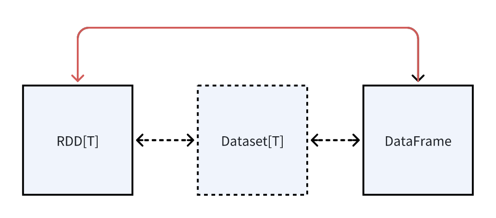

### 3.5.1 DataSet和Dataframe的区别

狭义上，Dataset中装的是用户自定义的类型  T

那么在抽取数据时，比较方便 stu.id 且类型会得到编译时检查


狭义上，dataframe中装的是Row（框架内置的一个通用类型）

那么在抽取数据时，不太方便，得通过脚标，或者字段名，而且还得强转

```scala
val x:Any =  row.get(1)
val x:Double = row.getDouble(1)
val x:Double = row.getAs[Double](“salary”)
```


```scala
/**
  * dataset存在的意义？
  * 意义要从它的特点说起：
  * ds的特点是，可以存储各种自定义类型，自定义类型中，各字段是有类型约束（所以ds是强类型约束的）
  * df只能存储row类型，而row类型中的字段是没有“类型约束“，全是any（所以df是弱类型约束的）
  */
ds.map(bean => {
  // val id:String = bean.id  // 提取数据时不会产生类型匹配错误，编译时就会检查
​
})
​
​
val _df: Dataset[Row] = ds.toDF()
_df.map(row => {
  val name: Int = row.getInt(1) // 明明类型不匹配，但是编译时无法检查，运行时才会抛异常
})
```


### 3.5.3 DataFrame/dataset转成RDD后取数

要义：有些运算场景下，通过SQL语法实现计算逻辑比较困难，可以将DataFrame转成RDD算子来操作，而DataFrame中的数据是以RDD\[Row]类型封装的，因此，要对DataFrame进行RDD算子操作，只需要掌握如何从Row中解构出数据即可


示例数据stu.csv

```plain&#x20;text
id,name,age,city,score
1,张飞,21,北京,80.0
2,关羽,23,北京,82.0
3,赵云,20,上海,88.6
4,刘备,26,上海,83.0
5,曹操,30,深圳,90.0
```

***


#### （1）从Row中取数方式1：索引号

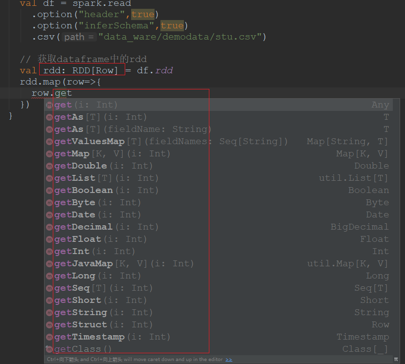

示例代码

```scala
val rdd: RDD[Row] = df.rdd
rdd.map(row=>{
  val id = row.get(0).asInstanceOf[Int]
  val name = row.getString(1)
  (id,name)
}).take(10).foreach(println)
```

***

#### （2）从Row中取数方式2：字段名

```scala
rdd.map(row=>{
  val id = row.getAs[Int]("id")
  val name = row.getAs[String]("name")
  val age = row.getAs[Int]("age")
  val city = row.getAs[String]("city")
  val score = row.getAs[Double]("score")
  (id,name,age,city,score)
}).take(10).foreach(println)
```

***

#### （3）从Row中取数方式3：模式匹配

```scala
rdd.map({
  case Row(id: Int, name: String, age: Int, city: String, score: Double)
  => {
    // do anything
    (id,name,age,city,score)
  }
}).take(10).foreach(println)
```

#### （4）完整示例

```scala
package cn.doitedu.sparksql
​
import org.apache.spark.rdd.RDD
import org.apache.spark.sql.{Dataset, Row}
import org.apache.spark.sql.types.{DoubleType, IntegerType, StringType, StructField, StructType}
​
/**
  *   有些场景下，逻辑不太方便用sql去实现，可能需要将dataframe退化成RDD来计算
  *   示例需求：  求每种性别的成绩总和
 */
object Demo16_DML_RDD {
  def main(args: Array[String]): Unit = {
​
    val spark = SparkUtil.getSpark()
    // val schema = new StructType(Array(StructField("id",IntegerType),StructField("name",StringType)))
​
    // val schema = new StructType((StructField("id",IntegerType):: StructField("name",StringType) :: Nil).toArray)
​
    val schema = new StructType()
      .add("id",IntegerType)
      .add("name",StringType)
      .add("age",IntegerType)
      .add("sex",StringType)
      .add("city",StringType)
      .add("score",DoubleType)
​
    val df = spark.read.schema(schema).option("header",true).csv("data/stu2.csv")
​
    // 可以直接在dataframe上用map等rdd算子
    // 框架会把算子返回的结果RDD 再转回dataset，需要一个能对RDD[T]进行解析的Encoder[T]才行
    // 好在大部分T类型都可以有隐式的Encoder来支持
    import spark.implicits._
    val ds2: Dataset[(Int, String)] = df.map(row=>{
      val id = row.getAs[Int]("id")
      val name = row.getAs[String]("name")
      (id,name)
    })
​

    // dataframe中取出rdd后，就是一个RDD[Row]
    val rd: RDD[Row] = df.rdd
    // 从Row中取数据，就可以变成任意你想要的类型
    val rdd2: RDD[(Int, String, Int, String, String, Double)] = rd.map(row=>{
​
      // dataframe是一种弱类型结构（在编译时无法检查类型，因为数据被装在了一个array[any]中）
      // val id = row.getDouble(1) // 如果类型取错，编译时是无法检查的，运行时才会报错
​
      // 可以根据字段的脚标去取
      val id: Int = row.getInt(0)
      val name: String = row.getString(1)
      val age: Int = row.getAs[Int](2)
​
      // 可以根据字段名称去取
      val sex: String = row.getAs[String]("sex")
      val city: String = row.getAs[String]("city")
      val score: Double = row.getAs[Double]("score")
​
      (id,name,age,sex,city,score)
    })
​
​
    /**
      * 用模式匹配从Row中抽取数据
      * 效果跟上面的方法是一样的，但是更简洁！
      */
    val rdd22 = rd.map({
      case Row(id:Int,name:String,age:Int,sex:String,city:String,score:Double)=>{
        (id,name,age,sex,city,score)
      }
    })
​
    // 后续就跟dataframe没关系了，跟以前的rdd是一样的了
    val res: RDD[(String, Double)] = rdd22.groupBy(tp=>tp._4).mapValues(iter=>{
      iter.map(_._6).sum
    })
​
    res.foreach(println)
​
    spark.close()
  }
}
```

***


### 3.5.4由RDD创建DataFrame

**准备测试用的数据和RDD**

后续示例都起源于如下RDD

数据文件：doit\_stu.txt

```plain&#x20;text
1,张飞,21,北京,80.0
2,关羽,23,北京,82.0
3,赵云,20,上海,88.6
4,刘备,26,上海,83.0
5,曹操,30,深圳,90.0
```

创建RDD：

```scala
val rdd:RDD[String] = spark.sparkContext.textFile("data_ware/demodata/stu.txt")
```

#### （1）从RDD\[Case class类]创建DataFrame

注：定义一个case class来封装数据，如下，Stu是一个case class类

```scala
val rdd:RDD[String] = spark.sparkContext.textFile("data_ware/demodata/stu.txt")
```

示例代码：

```scala
val rddStu: RDD[Stu]  = rdd
  // 切分字段
  .map(_.split(","))
  // 将每一行数据变形成一个多元组tuple
  .map(arr => Stu(arr(0).toInt, arr(1), arr(2).toInt, arr(3), arr(4).toDouble))
// 创建DataFrame
val df = spark.createDataFrame(rddStu)
df.show()
```

结果如下：

```plain&#x20;text
+---+-------+---+-----+-----+
| id|name   |age|city |score|
+---+-------+---+-----+-----+
|  1|  张飞| 21|  北京| 80.0|
|  2|  关羽| 23|  北京| 82.0|
|  3|  赵云| 20|  上海| 88.6|
|  4|  刘备| 26|  上海| 83.0|
|  5|  曹操| 30|  深圳| 90.0|
+---+------+---+------+-----+
```

**可以发现，框架成功地从case class的类定义中推断出了数据的schema：字段类型和字段名称**

**Schema获取手段：反射**


当然，还有更简洁的方式，利用框架提供的隐式转换

```scala
// 更简洁办法
import spark.implicits._
val df = rddStu.toDF
```


#### （2）从RDD\[Tuple]创建DataFrame

```scala
val rddTuple: RDD[(Int, String, Int, String, Double)] = rdd
  // 切分字段
  .map(_.split(","))
  // 将每一行数据变形成一个多元组tuple
  .map(arr => (arr(0).toInt, arr(1), arr(2).toInt, arr(3), arr(4).toDouble))
​
//创建DataFrame
val df = spark.createDataFrame(rddTuple)
df.printSchema() // 打印schema信息
df.show() 
```

***

结果如下：

```plain&#x20;text
root
 |-- _1: integer (nullable = false)
 |-- _2: string (nullable = true)
 |-- _3: integer (nullable = false)
 |-- _4: string (nullable = true)
 |-- _5: double (nullable = false)
 
 
 +---+-----+---+---+-----+
| _1| _2  | _3| _4|  _5 |
+---+-----+---+---+-----+
|  1| 张飞| 21| 北京|80.0|
|  2| 关羽| 23| 北京|82.0|
|  3| 赵云| 20| 上海|88.6|
|  4| 刘备| 26| 上海|83.0|
|  5| 曹操| 30| 深圳|90.0|
+---+---+---+---+----+
```


从结果中可以发现一个问题：框架从tuple元组结构中，对schema的推断，也是成功的，只是字段名是tuple中的数据访问索引。


当然，还有更简洁的方式，利用框架提供的隐式转换可以直接调用toDF创建，并指定字段名

```scala
// 更简洁办法
import spark.implicits._
val df2 = rddTuple.toDF("id","name","age","city","score")
```


#### （3）从RDD\[JavaBean]创建DataFrame

注：此处所说的Bean，指的是用java定义的bean

```java
public class Stu2 {
    private int id;
    private String name;
    private int age;
    private String city;
    private double score;
​
    public Stu2(int id, String name, int age, String city, double score) {
        this.id = id;
        this.name = name;
        this.age = age;
        this.city = city;
        this.score = score;
    }
​
    public int getId() {
        return id;
    }
​
    public void setId(int id) {}
```


示例代码：

```scala
val rddBean: RDD[Stu2] = rdd
  // 切分字段
  .map(_.split(","))
  // 将每一行数据变形成一个JavaBean
  .map(arr => new Stu2(arr(0).toInt,arr(1),arr(2).toInt,arr(3),arr(4).toDouble))
val df = spark.createDataFrame(rddBean,classOf[Stu2])
df.show()
```

结果如下：

```plain&#x20;text
+---+-----+---+-----+----+
|age|city | id|name |score|
+---+-----+---+-----+----+
|  1| 张飞| 21| 北京|80.0|
|  2| 关羽| 23| 北京|82.0|
|  3| 赵云| 20| 上海|88.6|
|  4| 刘备| 26| 上海|83.0|
|  5| 曹操| 30| 深圳|90.0|
+---+-----+---+-----+----+
```

注：RDD\[JavaBean]在spark.implicits.\_中没有toDF的支持

#### （4）从RDD\[普通Scala类]中创建DataFrame

注：此处的普通类指的是scala中定义的非case class的类

框架在底层将其视作java定义的标准bean类型来处理

而scala中定义的普通bean类，不具备字段的java标准getters和setters，因而会处理失败

可以如下处理来解决

普通scala bean类定义：

```scala
class Stu3(
            @BeanProperty
            val id: Int,
            @BeanProperty
            val name: String,
            @BeanProperty
            val age: Int,
            @BeanProperty
            val city: String,
            @BeanProperty
            val score: Double)
```

示例代码：

```scala
val rddStu3: RDD[Stu3] = rdd
  // 切分字段
  .map(_.split(","))
  // 将每一行数据变形成一个普通Scala对象
  .map(arr => new Stu3(arr(0).toInt, arr(1), arr(2).toInt, arr(3), arr(4).toDouble))
val df = spark.createDataFrame(rddStu3, classOf[Stu3])
df.show()
```

#### （5）从RDD\[Row]中创建DataFrame

注：DataFrame中的数据，本质上还是封装在RDD中，而RDD\[ T ]总有一个T类型，DataFrame内部的RDD中的元素类型T即为框架所定义的Row类型；

```scala
val rddRow = rdd
  // 切分字段
  .map(_.split(","))
  // 将每一行数据变形成一个Row对象
  .map(arr => Row(arr(0).toInt, arr(1), arr(2).toInt, arr(3), arr(4).toDouble))
​
val schema = new StructType()
  .add("id", DataTypes.IntegerType)
  .add("name", DataTypes.StringType)
  .add("age", DataTypes.IntegerType)
  .add("city", DataTypes.StringType)
  .add("score", DataTypes.DoubleType)
​
val df = spark.createDataFrame(rddRow,schema)
df.show()
```

#### （6）从RDD\[set/seq/map]中创建DataFrame

版本2.2.0，新增了对SET/SEQ的编解码支持

版本2.3.0，新增了对Map的编解码支持

```scala
object Demo7_CreateDF_SetSeqMap {
​
  def main(args: Array[String]): Unit = {
​
    val spark = SparkSession.builder().appName("").master("local[*]").getOrCreate()
​
    val seq1 = Seq(1,2,3,4)
    val seq2 = Seq(11,22,33,44)
​
    val rdd: RDD[Seq[Int]] = spark.sparkContext.parallelize(List(seq1,seq2))
​
    import spark.implicits._
    val df = rdd.toDF()
​
    df.printSchema()
    df.show()
​
​
    df.selectExpr("value[0]","size(value)").show()
​
​
    /**
      * set类型数据rdd的编解码
      */
    val set1 = Set("a","b")
    val set2 = Set("c","d","e")
    val rdd2: RDD[Set[String]] = spark.sparkContext.parallelize(List(set1,set2))
​
    val df2 = rdd2.toDF("members")
    df2.printSchema()
    df2.show()
​
​
    /**
      * map类型数据rdd的编解码
      */
​
    val map1 = Map("father"->"mayun","mother"->"tangyan")
    val map2 = Map("father"->"huateng","mother"->"yifei","brother"->"sicong")
    val rdd3: RDD[Map[String, String]] = spark.sparkContext.parallelize(List(map1,map2))
​
    val df3 = rdd3.toDF("jiaren")
    df3.printSchema()
    df3.show()
​
    df3.selectExpr("jiaren['mother']","size(jiaren)","map_keys(jiaren)","map_values(jiaren)")
        .show(10,false)
​
​
    spark.close()
  }
}
```

***

set/seq 结构出来的字段类型为 ： array

Map 数据类型解构出来的字段类型为：map

### 3.5.5 由RDD创建DataSet


#### （1）从RDD\[Case class类]创建Dataset

```scala
val rdd: RDD[Person] = spark.sparkContext.parallelize(Seq(
  Person(1, "zs"),
  Person(2, "ls")
))
​
import spark.implicits._
​
// case class 类型的rdd，转dataset
val ds: Dataset[Person] = spark.createDataset(rdd)
val ds2: Dataset[Person] = rdd.toDS()
ds.printSchema()
ds.show()
```


```scala
/**
  * 创建一个javaBean 的RDD
  * 隐式转换中没有支持好对javabean的encoder机制
  * 需要自己传入一个encoder
  * 可以构造一个简单的encoder，具备序列化功能，但是不具备字段解构的功能
  * 但是，至少能够把一个RDD[javabean] 变成一个 dataset[javabean]
  * 后续可以通过rdd的map算子将数据从对象中提取出来，组装成tuple元组，然后toDF即可进入sql空间
  */
val rdd2: RDD[JavaStu] = spark.sparkContext.parallelize(Seq(
  new JavaStu(1,"a",18,"上海",99.9),
  new JavaStu(2,"b",28,"北京",99.9),
  new JavaStu(3,"c",38,"西安",99.9)
))
​
​
val encoder = Encoders.kryo(classOf[JavaStu])
val ds2: Dataset[JavaStu] = spark.createDataset(rdd2)(encoder)
​
val df2: Dataset[Row] = ds2.map(stu => {
  (stu.getId, stu.getName, stu.getAge)
}).toDF("id", "name", "age")
ds2.printSchema()
ds2.show()
df2.show()
```

#### 12.3.2.4 从RDD\[其他类]创建Dataset

```scala
/**
  * 将一个RDD[Map] 变成  Dataset[Map]
  * 2.3.0版才支持
  *
 */
​
val rdd3: RDD[Map[String, String]] = spark.sparkContext.parallelize(Seq(
  Map("id"->"1","name"->"zs1"),
  Map("id"->"2","name"->"zs2"),
  Map("id"->"3","name"->"zs3")
))
​
val ds3: Dataset[Map[String, String]] = rdd3.toDS()
ds3.printSchema()
ds3.show()
```

## 3.6 RDD/DS/DF互转

RDD、DataFrame、Dataset三者有许多共性，有各自适用的场景常常需要在三者之间转换


*DataFrame/Dataset转RDD：*

```scala
val rdd1:RDD[Row]=testDF.rdd
val rdd2:RDD[T]=testDS.rdd
```

RDD转DataFrame：

```scala
import spark.implicits._
val testDF = rdd.map {line=>
      (line._1,line._2)
    }.toDF("col1","col2")
```

一般用元组把一行的数据写在一起，然后在toDF中指定字段名

*RDD转Dataset：*

```scala
import spark.implicits._
case class Person(col1:String,col2:Int)extends Serializable //定义字段名和类型
val testDS:Dataset[Person] = rdd.map {line=>
      Person(line._1,line._2)
    }.toDS
```


可以注意到，定义每一行的类型（case class）时，已经给出了字段名和类型，后面只要往case class里面添加值即可

*Dataset转DataFrame：*

这个也很简单，因为只是把case class封装成Row

```scala
import spark.implicits._
val testDF:Dataset[Row] = testDS.toDF
```

***


DataFrame转Dataset：

```scala
import spark.implicits._
case class Coltest(col1:String,col2:Int)extends Serializable //定义字段名和类型
val testDS = testDF.as[Coltest]
```

这种方法就是在给出每一列的类型后，使用as方法，转成Dataset，这在数据类型是DataFrame又需要针对各个字段处理时极为方便。

在使用一些特殊的操作时，一定要加上 import spark.implicits.\_ 不然toDF、toDS无法使用


# 13. 用户自定义函数

通过spark.udf功能用户可以自定义函数。


## 4.0. geohash案例

GEOHASH算法略

添加依赖

```xml
<dependency>
    <groupId>ch.hsr</groupId>
    <artifactId>geohash</artifactId>
    <version>1.4.0</version>
</dependency>
```


代码示例

```scala
package com.doe.day03

import ch.hsr.geohash.GeoHash
import org.apache.spark.sql.SparkSession
import org.apache.spark.sql.types.{DataTypes, StructType}

/**
 * @Date: 2023/11/30
 * @Author: Hang.Nian.YY
 * @WX: 17710299606
 * @Tips: 学大数据 ,到多易教育
 * @DOC: https://blog.csdn.net/qq_37933018?spm=1000.2115.3001.5343
 * @Description:
 *
 *
 * 地理位置数据
 *
 * 广西壮族自治区 河池市  凤山县  24.560064974995992 107.01971572194900  wxcgfd
 * 广西壮族自治区 河池市  巴马瑶族自治县  24.15759554873569  107.20766596976145
 * 陕西省 渭南市  蒲城县  34.96769665054483  109.62824611949353
 * 河南省 开封市  顺河回族区  34.81777146999021  114.42852744048099
 * 河南省 周口市  太康县  34.09709624887362  114.85570075513604
 * 河南省 三门峡市 湖滨区  34.77177767294712  111.28129514586448
 * 辽宁省 阜新市  彰武县  42.52375443552578  122.47417316389497
 * 吉林省 吉林市  磐石市  43.0574561133298 126.17462779101467
 * 广东省 湛江市  雷州市  20.796584309563634 110.01263612715134
 * 甘肃省 白银市  白银区  36.501821828710106 104.20564932849953
 *
 * 登录日志数据
 * uid01,login,2023-11-30,24.560064974995992,107.01971572194807
 * uid02,login,2023-11-30,34.96769665054483,109.62824611949353
 * uid03,login,2023-11-30,36.501821828710106,104.20564932849953
 */
object C03_UDF {
  def main(args: Array[String]): Unit = {
    val session = SparkSession
      .builder()
      .master("local[*]")
      .appName(this.getClass.getSimpleName)
      .getOrCreate()

    import  session.implicits._
    import  org.apache.spark.sql.functions._

    val schema = new StructType()
      .add("uid", DataTypes.StringType)
      .add("login", DataTypes.StringType)
      .add("dt", DataTypes.StringType)
      .add("lat", DataTypes.DoubleType)
      .add("lng", DataTypes.DoubleType)


    val frame = session.read
      .schema(schema)
      .csv("data/login/")

    frame.createTempView("tb_log")

    /**
     *自定义函数  UDF  逐行计算函数
     *  1 定义一个scala函数
     *  2  注册到spark-sql中
     */
    val f  =  (lat:Double, lng:Double)=>{
      GeoHash.withCharacterPrecision(lat , lng  ,6).toBase32
    }
    // 注册
    session.udf.register("my_geo" , f)


    session.sql(
      """
        |select
        |uid,
        |login ,
        |dt ,
        |lat ,
        |lng ,
        |my_geo(lat , lng) as  str
        |from
        |tb_log
        |""".stripMargin).show()

  }

}
```

## 4.1用户自定义UDF函数

```shell
scala> val df = spark.read.json("examples/src/main/resources/people.json")
df: org.apache.spark.sql.DataFrame = [age: bigint, name: string]
​
scala> df.show()
+----+-------+
| age|   name|
+----+-------+
|null|Michael|
|  30|   Andy|
|  19| Justin|
+----+-------+
​
​
scala> spark.udf.register("addName", (x:String)=> "Name:"+x)
res5: org.apache.spark.sql.expressions.UserDefinedFunction = UserDefinedFunction(<function1>,StringType,Some(List(StringType)))
​
scala> df.createOrReplaceTempView("people")
​
scala> spark.sql("Select addName(name), age from people").show()
+-----------------+----+
|UDF:addName(name)| age|
+-----------------+----+
|     Name:Michael|null|
|        Name:Andy|  30|
|      Name:Justin|  19|
+-----------------+----+
```


**UDF案例2**

**需求，有如下数据**

```plain&#x20;text
id,name,age,height,weight,yanzhi,score
1,a,18,172,120,98,68.8
2,b,28,175,120,97,68.8
3,c,30,180,130,94,88.8
4,d,18,168,110,98,68.8
5,e,26,165,120,98,68.8
6,f,27,182,135,95,89.8
7,g,19,171,122,99,68.8
```

比较1和2这两个人的相似程度 , 确定参与比较的属性  ,将一个人的所有的属性值组成一个数组!


**需要计算每一个人和其他人之间的余弦相似度（特征向量之间的余弦相似度）**


**代码实现：**

```scala
package cn.doitedu.sparksql.udf
​
import cn.doitedu.sparksql.dataframe.SparkUtil
import org.apache.spark.sql.Row
import org.apache.spark.sql.expressions.UserDefinedFunction
​
import scala.collection.mutable
​
​
/**
  * UDF 案例2 ： 用一个自定义函数实现两个向量之间的余弦相似度计算
  */
​
case class Human(id: Int, name: String, features: Array[Double])
​
object CosinSimilarity {
​
  def main(args: Array[String]): Unit = {
​
​
    val spark = SparkUtil.getSpark()
    import spark.implicits._
    import spark.sql
    // 加载用户特征数据
    val df = spark.read.option("inferSchema", true).option("header", true).csv("data/features.csv")
    df.show()
​

​
    // id,name,age,height,weight,yanzhi,score
    // 将用户特征数据组成一个向量(数组)
    // 方式1：
    df.rdd.map(row => {
      val id = row.getAs[Int]("id")
      val name = row.getAs[String]("name")
      val age = row.getAs[Double]("age")
      val height = row.getAs[Double]("height")
      val weight = row.getAs[Double]("weight")
      val yanzhi = row.getAs[Double]("yanzhi")
      val score = row.getAs[Double]("score")
​
      (id, name, Array(age, height, weight, yanzhi, score))
    }).toDF("id", "name", "features")
​
    // 方式2：
    df.rdd.map({
      case Row(id: Int, name: String, age: Double, height: Double, weight: Double, yanzhi: Double, score: Double)
      => (id, name, Array(age, height, weight, yanzhi, score))
    })
      .toDF("id", "name", "features")
​
​
    // 方式3: 直接利用sql中的函数array来生成一个数组
    df.selectExpr("id", "name", "array(age,height,weight,yanzhi,score) as features")
    import org.apache.spark.sql.functions._
    df.select('id, 'name, array('age, 'height, 'weight, 'yanzhi, 'score) as "features")
​
    // 方式4：返回case class
    val features = df.rdd.map({
      case Row(id: Int, name: String, age: Double, height: Double, weight: Double, yanzhi: Double, score: Double)
      => Human(id, name, Array(age, height, weight, yanzhi, score))
    })
      .toDF()
​
    // 将表自己和自己join，得到每个人和其他所有人的连接行
    val joined = features.join(features.toDF("bid","bname","bfeatures"),'id < 'bid)
    joined.show(100,false)
​
    // 定义一个计算余弦相似度的函数
    // val cosinSim = (f1:Array[Double],f2:Array[Double])=>{ /* 余弦相似度 */ }
    // 开根号的api：  Math.pow(4.0,0.5)
    val cosinSim = (f1:mutable.WrappedArray[Double], f2:mutable.WrappedArray[Double])=>{
​
      val fenmu1 = Math.pow(f1.map(Math.pow(_,2)).sum,0.5)
      val fenmu2 = Math.pow(f2.map(Math.pow(_,2)).sum,0.5)
​
      val fenzi = f1.zip(f2).map(tp=>tp._1*tp._2).sum
​
      fenzi/(fenmu1*fenmu2)
    }
​
    // 注册到sql引擎：  spark.udf.register("cosin_sim",consinSim)
    spark.udf.register("cos_sim",cosinSim)
    joined.createTempView("temp")
​
    // 然后在这个表上计算两人之间的余弦相似度
    sql("select id,bid,cos_sim(features,bfeatures) as cos_similary from temp").show()
​
    // 可以自定义函数简单包装一下，就成为一个能生成column结果的dsl风格函数了
    val cossim2: UserDefinedFunction = udf(cosinSim)
    joined.select('id,'bid,cossim2('features,'bfeatures) as "cos_sim").show()
​
    spark.close()
  }
}
```

## 4.2用户自定义聚合函数UDAF

接收多行数据(分组聚合) 返回一个结果!

弱类型的DataFrame和强类型的Dataset都提供了相关的聚合函数， 如 count()，countDistinct()，avg()，max()，min()  sum()  collect\_list &#x20;

除此之外，用户可以设定自己的自定义UDAF聚合函数。

Spark-sql底层执行是spark-core , 分布式计算 , 各个分布式计算实例计算,聚合最终结果!


UDAF的编程模板：

```scala
/**
 * @date: 2019/10/12
 * @site: www.doitedu.cn
 * @author: hunter.d 涛哥
 * @qq: 657270652
 * @description:
  *    用户自定义UDAF入门示例：求薪资的平均值
 */
object MyAvgUDAF extends UserDefinedAggregateFunction{
​
  // 函数输入的字段schema（字段名-字段类型）
  override def inputSchema: StructType = ???
​
  // 聚合过程中，用于存储局部聚合结果的schema
  // 比如求平均薪资，中间缓存(局部数据薪资总和,局部数据人数总和)
  override def bufferSchema: StructType = ???
​
  // 函数的最终返回结果数据类型
  override def dataType: DataType = ???
​
  // 你这个函数是否是稳定一致的？（对一组相同的输入，永远返回相同的结果），只要是确定的，就写true
  override def deterministic: Boolean = true
​
  // 对局部聚合缓存的初始化方法
  override def initialize(buffer: MutableAggregationBuffer): Unit = ???
​
  // 聚合逻辑所在方法，框架会不断地传入一个新的输入row，来更新你的聚合缓存数据
  override def update(buffer: MutableAggregationBuffer, input: Row): Unit = ???
​
  // 全局聚合：将多个局部缓存中的数据，聚合成一个缓存
  // 比如：薪资和薪资累加，人数和人数累加
  override def merge(buffer1: MutableAggregationBuffer, buffer2: Row): Unit = ???
​
  // 最终输出
  // 比如：从全局缓存中取薪资总和/人数总和
  override def evaluate(buffer: Row): Any = ???
}
```

核心要义：

聚合是分步骤进行： 先局部聚合，再全局聚合

局部聚合（update）的结果是保存在一个局部buffer中的

全局聚合(merge)就是将多个局部buffer再聚合成一个buffer

最后通过evaluate将全局聚合的buffer中的数据做一个运算得出你要的结果


如下图所示：

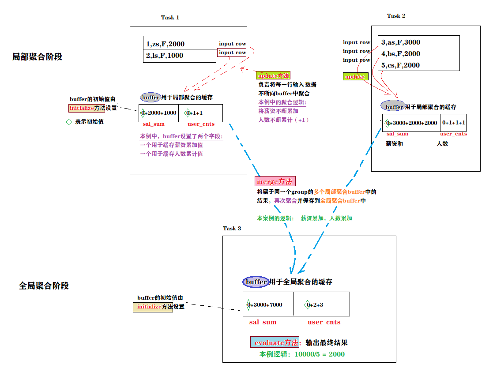


### 4.2.1弱类型用户自定义聚合函数UDAF

#### （1）需求说明

示例数据：

+---+----------------+------+---------+------+----------+

\| id|    name        | sales|discount |state |  saleDate|

+---+----------------+------+---------+------+----------+

\|  1|       Widget Co|1000.0|      0.0|    AZ|2014-01-01|

\|  2|   Acme Widgets |2000.0|    500.0|    CA|2014-02-01|

\|  3|        Widgetry|1000.0|    200.0|    CA|2015-01-11|

\|  4|   Widgets R Us |2000.0|      0.0|    CA|2015-02-19|

\|  5|Ye Olde Widgete |3000.0|      0.0|    MA|2015-02-28|

+---+---------------+------+--------+-----+-------------+

***

需求：计算x年份的同比上一年份的总销售增长率；比如2015 vs 2014的同比增长


显然，没有任何一个内置聚合函数可以完成上述需求；

可以多写一些sql逻辑来实现，但如果能自定义一个聚合函数，当然更方便高效！

Select yearOnyear(saleDate,sales)  from t


#### （2）自定义UDAF实现销售额同比计算

通过继承UserDefinedAggregateFunction来实现用户自定义聚合函数。

自定义UDAF的代码骨架如下：

class UdfMy extends UserDefinedAggregateFunction{

&#x20; override def inputSchema: StructType = ???

​

&#x20; override def bufferSchema: StructType = ???

​

&#x20; override def dataType: DataType = ???

​

&#x20; override def deterministic: Boolean = ???

​

&#x20; override def initialize(buffer: MutableAggregationBuffer): Unit = ???

​

&#x20; override def update(buffer: MutableAggregationBuffer, input: Row): Unit = ???

​

&#x20; override def merge(buffer1: MutableAggregationBuffer, buffer2: Row): Unit = ???

​

&#x20; override def evaluate(buffer: Row): Any = ???

}

***


完整实现代码如下：

/\*\*

&#x20; \* 工具类

&#x20; \* @param startDate

&#x20; \* @param endDate

&#x20; \*/

case class DateRange(startDate: Timestamp, endDate: Timestamp) {

&#x20; def contain(targetDate: Date): Boolean = {

&#x20;   targetDate.before(endDate) && targetDate.after(startDate)

&#x20; }

​

}

​

/\*\*

&#x20;\* @date: 2019/10/10

&#x20;\* @site: www.doitedu.cn

&#x20;\* @author: hunter.d 涛哥

&#x20;\* @qq: 657270652

&#x20;\* @description: 自定义UDAF实现年份销售额同比增长计算

&#x20;\*/

class YearOnYearBasis(current: DateRange) extends  UserDefinedAggregateFunction{

​

&#x20; // 聚合函数输入参数的数据类型

&#x20; override def inputSchema: StructType = {

&#x20;   StructType(StructField("metric", DoubleType) :: StructField("timeCategory", DateType) :: Nil)

&#x20; }

​

&#x20; // 聚合缓冲区中值得数据类型

&#x20; override def bufferSchema: StructType = {

&#x20;   StructType(StructField("sumOfCurrent", DoubleType) :: StructField("sumOfPrevious", DoubleType) :: Nil)

&#x20; }

​

&#x20; // 返回值的数据类型

&#x20; override def dataType: DataType = DoubleType

​

&#x20; // 对于相同的输入是否一直返回相同的输出。

&#x20; override def deterministic: Boolean = true

​

&#x20; // 初始化

&#x20; override def initialize(buffer: MutableAggregationBuffer): Unit = {

&#x20;   buffer.update(0, 0.0)

&#x20;   buffer.update(1, 0.0)

&#x20; }

​

&#x20; // 相同Execute间的数据合并。

&#x20; override def update(buffer: MutableAggregationBuffer, input: Row): Unit =  {

&#x20;   if (current.contain(input.getAs\[Date]\(1))) {

&#x20;     buffer(0) = buffer.getAs\[Double]\(0) + input.getAs\[Double]\(0)

&#x20;   }

&#x20;   val previous = DateRange(subtractOneYear(current.startDate), subtractOneYear(current.endDate))

&#x20;   if (previous.contain(input.getAs\[Date]\(1))) {

&#x20;     buffer(1) = buffer.getAs\[Double]\(0) + input.getAs\[Double]\(0)

&#x20;   }

&#x20; }

​

&#x20; // 不同Execute间的数据合并

&#x20; override def merge(buffer1: MutableAggregationBuffer, buffer2: Row): Unit = {

&#x20;   buffer1(0) = buffer1.getAs\[Double]\(0) + buffer2.getAs\[Double]\(0)

&#x20;   buffer1(1) = buffer1.getAs\[Double]\(1) + buffer2.getAs\[Double]\(1)

&#x20; }

​

&#x20; // 计算最终结果

&#x20; override def evaluate(buffer: Row): Any = {

&#x20;   if (buffer.getDouble(1) == 0.0)

&#x20;     0.0

&#x20;   else

&#x20;     (buffer.getDouble(0) - buffer.getDouble(1)) / buffer.getDouble(1) \* 100

&#x20; }

​

​

&#x20; def subtractOneYear(d:Timestamp):Timestamp={

&#x20;   Timestamp.valueOf(d.toLocalDateTime.minusYears(1))

&#x20; }

}

***


#### （3）补充示例：自定义UDAF实现平均薪资计算

下面展示一个求平均工资的自定义聚合函数。

```scala
package cn.doitedu.sparksql.udf
​
import org.apache.spark.sql.Row
import org.apache.spark.sql.expressions.{MutableAggregationBuffer, UserDefinedAggregateFunction}
import org.apache.spark.sql.types.{DataType, DataTypes, StructField, StructType}
​
/**
  * @description:
  * 用户自定义UDAF入门示例：求薪资的平均值
  */
object MyAvgUDAF extends UserDefinedAggregateFunction {
​
  // 函数输入的字段schema（字段名-字段类型）
  override def inputSchema: StructType = StructType(Seq(StructField("salary", DataTypes.DoubleType)))
​
  // 聚合过程中，用于存储局部聚合结果的schema
  // 比如求平均薪资，中间缓存(局部数据薪资总和,局部数据人数总和)
  override def bufferSchema: StructType = StructType(Seq(
    StructField("sum", DataTypes.DoubleType),
    StructField("cnts", DataTypes.LongType)
​
  ))
​
  // 函数的最终返回结果数据类型
  override def dataType: DataType = DataTypes.DoubleType
​
  // 你这个函数是否是稳定一致的？（对一组相同的输入，永远返回相同的结果），只要是确定的，就写true
  override def deterministic: Boolean = true
​
  // 对局部聚合缓存的初始化方法
  override def initialize(buffer: MutableAggregationBuffer): Unit = {
    buffer.update(0, 0.0)
    buffer.update(1, 0L)
  }
​
  // 聚合逻辑所在方法，框架会不断地传入一个新的输入row，来更新你的聚合缓存数据
  override def update(buffer: MutableAggregationBuffer, input: Row): Unit = {
​
    // 从输入中获取那个人的薪资，加到buffer的第一个字段上
    buffer.update(0, buffer.getDouble(0) + input.getDouble(0))
​
    // 给buffer的第2个字段加1
    buffer.update(1, buffer.getLong(1) + 1)
​
  }
​
  // 全局聚合：将多个局部缓存中的数据，聚合成一个缓存
  // 比如：薪资和薪资累加，人数和人数累加
  override def merge(buffer1: MutableAggregationBuffer, buffer2: Row): Unit = {
​
    // 把两个buffer的字段1（薪资和）累加到一起，并更新回buffer1
    buffer1.update(0, buffer1.getDouble(0) + buffer2.getDouble(0))
​
    // 更新人数
    buffer1.update(1, buffer1.getLong(1) + buffer2.getLong(1))
​
  }
​
  // 最终输出
  // 比如：从全局缓存中取薪资总和/人数总和
  override def evaluate(buffer: Row): Any = {
​
    if (buffer.getLong(1) != 0)
      buffer.getDouble(0) / buffer.getLong(1)
    else
      0.0
​
  }
}
```

***


### 4.2.2强类型用户自定义聚合函数

通过继承Aggregator来实现强类型自定义聚合函数，同样是求平均工资

```scala
import org.apache.spark.sql.expressions.Aggregator
import org.apache.spark.sql.Encoder
import org.apache.spark.sql.Encoders
import org.apache.spark.sql.SparkSession

// 既然是强类型，可能有case类
case class Employee(name: String, salary: Long)
case class Average(var sum: Long, var count: Long)
​
object MyAverage extends Aggregator[Employee, Average, Double] {
    // 定义一个数据结构，保存工资总数和工资总个数，初始都为0
    def zero: Average = Average(0L, 0L)
    // Combine two values to produce a new value. For performance, the function may modify `buffer`
    // and return it instead of constructing a new object
    def reduce(buffer: Average, employee: Employee): Average = {
    buffer.sum += employee.salary
    buffer.count += 1
    buffer
    }
    // 聚合不同execute的结果
    def merge(b1: Average, b2: Average): Average = {
    b1.sum += b2.sum
    b1.count += b2.count
    b1
    }
    // 计算输出
    def finish(reduction: Average): Double = reduction.sum.toDouble / reduction.count
    // 设定之间值类型的编码器，要转换成case类
    // Encoders.product是进行scala元组和case类转换的编码器 
    def bufferEncoder: Encoder[Average] = Encoders.product
    // 设定最终输出值的编码器
    def outputEncoder: Encoder[Double] = Encoders.scalaDouble
    }
    import spark.implicits._
​    
    val ds = spark.read.json("examples/src/main/resources/employees.json").as[Employee]
    ds.show()
    // +-------+------+
    // |   name|salary|
    // +-------+------+
    // |Michael|  3000|
    // |   Andy|  4500|
    // | Justin|  3500|
    // |  Berta|  4000|
    // +-------+------+
​    
    // Convert the function to a `TypedColumn` and give it a name
    val averageSalary = MyAverage.toColumn.name("average_salary")
    val result = ds.select(averageSalary)
    result.show()
    // +--------------+
    // |average_salary|
    // +--------------+
    // |        3750.0|
    // +--------------+
}
```


# 14. Spark SQL 的运行原理

正常的 SQL 执行先会经过 SQL Parser 解析 SQL，然后经过 Catalyst 优化器处理，最后到 Spark 执行。而 Catalyst 的过程又分为很多个过程，其中包括：

* &#x20;SQL Parser: 解析 SQL语法  生成抽象语法树  (AST)  解析校验语法

* Analysis：主要利用 Catalog 信息将 Unresolved Logical Plan 解析成 Analyzed logical plan；绑定元数据

* Logical Optimizations：利用一些 Rule （规则）将 Analyzed logical plan 解析成 Optimized Logical Plan；优化

* Physical Planning：前面的 logical plan 不能被 Spark 执行，而这个过程是把 logical plan 转换成多个 physical plans，然后利用代码模型（cost model）选择最佳的 physical plan； 代码转换

* Code Generation：这个过程会把 SQL逻辑生成Java字节码。代码生成

* 分布式调度执行

所以整个 SQL 的执行过程可以使用下图表示：

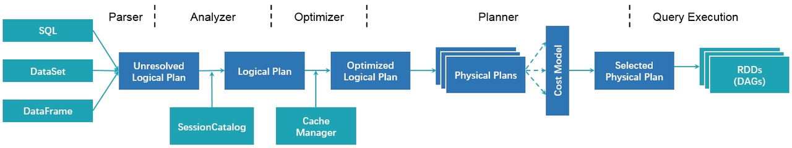

其中蓝色部分就是 Catalyst 优化器处理的部分，也是本章主要讲解的内容。


## 5.1 元数据管理SessionCatalog

SessionCatalog 主要用于各种函数资源信息和元数据信息（数据库、数据表、数据视图、数据分区与函数等）的统一管理。(比如 我们将DF创建一个视图, 视图的信息保存在Catalog中 , 加载hive的表,理解成表的信息请求元数据服务获取 ,理解成HiveCatalog , 元数据存储在hive中)

创建临时表或者视图，其实是往SessionCatalog注册(内存中)；

Analyzer在进行逻辑计划元数据绑定时，也是从catalog中获取元数据；

## 5.2 SQL解析成逻辑执行计划

当调用SparkSession的sql或者SQLContext的sql方法，就会使用SparkSqlParser进行SQL解析。

Spark 2.0.0开始引入了第三方语法解析器工具 ANTLR，对 SQL 进行词法分析并构建语法树。

（Antlr 是一款强大的语法生成器工具，可用于读取、处理、执行和翻译结构化的文本或二进制文件，是当前 Java 语言中使用最为广泛的语法生成器工具，我们常见的大数据 SQL 解析都用到了这个工具，包括 Hive、Cassandra、Phoenix、Pig 以及 presto 等）目前最新版本的 Spark 使用的是 ANTLR4）


它分为2个步骤来生成Unresolved LogicalPlan：


```scala
​/**
 * The AstBuilder converts an ANTLR4 ParseTree into a catalyst Expression, LogicalPlan or
 * TableIdentifier.
 */
class AstBuilder(conf: SQLConf) extends SqlBaseBaseVisitor[AnyRef] with Logging {
  import ParserUtils._
​
  def this() = this(new SQLConf())
​
  protected def typedVisit[T](ctx: ParseTree): T = {
  
  ...
  }
}
```

***

具体来说，Spark 基于presto的语法文件定义了Spark SQL语法文件SqlBase.g4

（路径 spark-2.4.3\sql\catalyst\src\main\antlr4\org\apache\spark\sql\catalyst\parser\SqlBase.g4）

这个文件定义了 Spark SQL 支持的 SQL 语法。

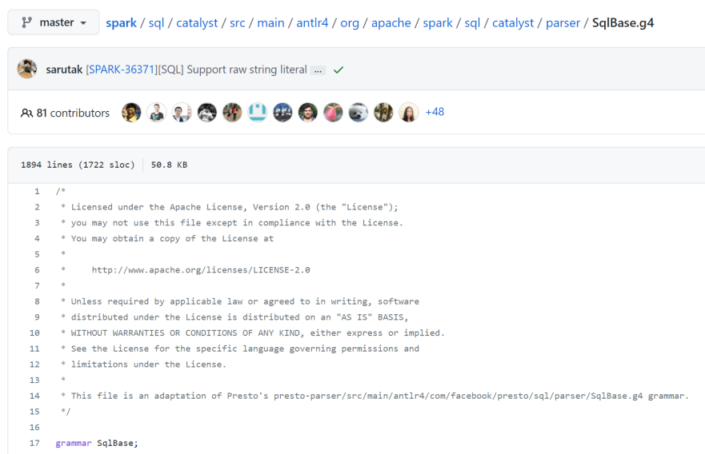

如果我们需要自定义新的语法，需要在这个文件定义好相关语法。然后使用 ANTLR4 对 SqlBase.g4 文件自动解析生成几个 Java 类，其中就包含重要的词法分析器 SqlBaseLexer.java 和语法分析器SqlBaseParser.java。运行上面的 SQL 会使用 SqlBaseLexer 来解析关键词以及各种标识符等；然后使用 SqlBaseParser 来构建语法树。


下面以一条简单的 SQL 为例进行分析

```sql
SELECT sum(v)
    FROM (
      SELECT
        t1.id,
    1 + 2 + t1.value AS v
    FROM t1 JOIN t2
      WHERE
    t1.id = t2.id AND
    t1.cid = 1 AND
    t1.did = t1.cid + 1 AND
      t2.id > 5) o
```

***

整个过程就类似于下图。

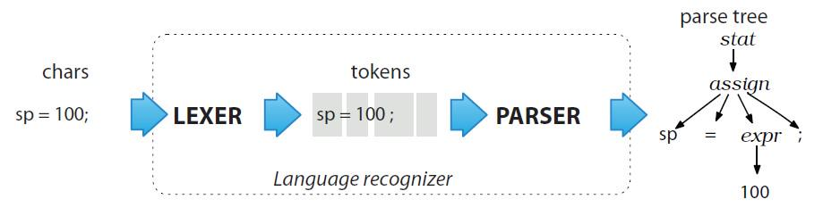


生成语法树之后，使用 AstBuilder 将语法树转换成 LogicalPlan，这个 LogicalPlan 也被称为 Unresolved LogicalPlan。解析后的逻辑计划如下：

```plain&#x20;text
== Parsed Logical Plan ==
'Project [unresolvedalias('sum('v), None)]
+- 'SubqueryAlias `doitedu_stu`
   +- 'Project ['t1.id, ((1 + 2) + 't1.value) AS v#16]
      +- 'Filter ((('t1.id = 't2.id) && ('t1.cid = 1)) && (('t1.did = ('t1.cid + 1)) && ('t2.id > 5)))
         +- 'Join Inner
            :- 'UnresolvedRelation `t1`
            +- 'UnresolvedRelation `t2`
```

***


图片表示如下：

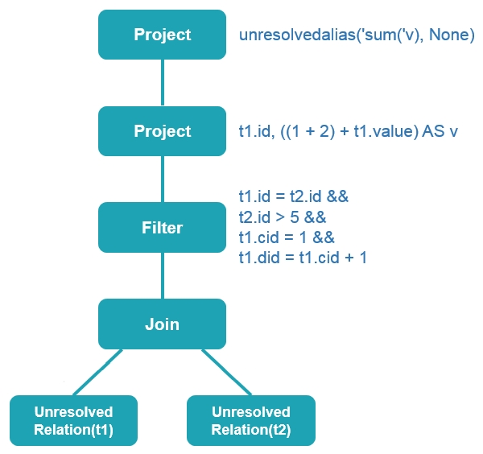

Unresolved LogicalPlan 是从下往上看的，t1 和 t2 两张表被生成了 UnresolvedRelation，过滤的条件、选择的列以及聚合字段都知道了。

Unresolved LogicalPlan 仅仅是一种数据结构，不包含任何数据信息，比如不知道数据源、数据类型，不同的列来自于哪张表等。

## 5.3 Analyzer绑定逻辑计划

Analyzer 阶段会使用事先定义好的 Rule 以及 SessionCatalog 等信息对 Unresolved LogicalPlan 进行元数据绑定。

```scala
/**
 * Provides a logical query plan analyzer, which translates [[UnresolvedAttribute]]s and
 * [[UnresolvedRelation]]s into fully typed objects using information in a [[SessionCatalog]].
 */
class Analyzer(
    catalog: SessionCatalog,
    conf: SQLConf,
    maxIterations: Int)
  extends RuleExecutor[LogicalPlan] with CheckAnalysis {


class SparkSqlParser(conf: SQLConf) extends AbstractSqlParser(conf) {
  val astBuilder = new SparkSqlAstBuilder(conf)


   override def parsePlan(sqlText: String): LogicalPlan = parse(sqlText) { parser =>
    astBuilder.visitSingleStatement(parser.singleStatement()) match {
      case plan: LogicalPlan => plan
      case _ =>
        val position = Origin(None, None)
        throw new ParseException(Option(sqlText), "Unsupported SQL statement", position, position)
    }
  }

Rule 是定义在 Analyzer 里面的，具体如下：
lazy val batches: Seq[Batch] = Seq(
    Batch("Hints", fixedPoint,
      new ResolveHints.ResolveBroadcastHints(conf),
      ResolveHints.ResolveCoalesceHints,
      ResolveHints.RemoveAllHints),
    Batch("Simple Sanity Check", Once,
      LookupFunctions),
    Batch("Substitution", fixedPoint,
      CTESubstitution,
      WindowsSubstitution,
      EliminateUnions,
      new SubstituteUnresolvedOrdinals(conf)),
    Batch("Resolution", fixedPoint,
      ResolveTableValuedFunctions ::                    //解析表的函数
      ResolveRelations ::                               //解析表或视图
      ResolveReferences ::                              //解析列
      ResolveCreateNamedStruct ::
      ResolveDeserializer ::                            //解析反序列化操作类
      ResolveNewInstance ::
      ResolveUpCast ::                                  //解析类型转换
      ResolveGroupingAnalytics ::
      ResolvePivot ::
      ResolveOrdinalInOrderByAndGroupBy ::
      ResolveAggAliasInGroupBy ::
      ResolveMissingReferences ::
      ExtractGenerator ::
      ResolveGenerate ::
      ResolveFunctions ::                               //解析函数
      ResolveAliases ::                                 //解析表别名
      ResolveSubquery ::                                //解析子查询
      ResolveSubqueryColumnAliases ::
      ResolveWindowOrder ::
      ResolveWindowFrame ::
      ResolveNaturalAndUsingJoin ::
      ResolveOutputRelation ::
      ExtractWindowExpressions ::
      GlobalAggregates ::
      ResolveAggregateFunctions ::
      TimeWindowing ::
      ResolveInlineTables(conf) ::
      ResolveHigherOrderFunctions(catalog) ::
      ResolveLambdaVariables(conf) ::
      ResolveTimeZone(conf) ::
      ResolveRandomSeed ::
      TypeCoercion.typeCoercionRules(conf) ++
      extendedResolutionRules : _*),
    Batch("Post-Hoc Resolution", Once, postHocResolutionRules: _*),
    Batch("View", Once,
      AliasViewChild(conf)),
    Batch("Nondeterministic", Once,
      PullOutNondeterministic),
    Batch("UDF", Once,
      HandleNullInputsForUDF),
    Batch("FixNullability", Once,
      FixNullability),
    Batch("Subquery", Once,
      UpdateOuterReferences),
    Batch("Cleanup", fixedPoint,
      CleanupAliases)
)
```


从上面代码可以看出，多个性质类似的 Rule 组成一个 Batch；而多个 Batch 构成一个 batches。这些 batches 会由 RuleExecutor 执行，先按一个一个 Batch 顺序执行，然后对 Batch 里面的每个 Rule 顺序执行。每个 Batch 会执行一次（Once）或多次（FixedPoint，由spark.sql.optimizer.maxIterations 参数决定），执行过程如下：

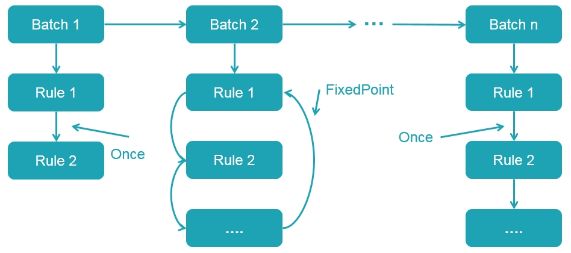


## 5.4 Optimizer优化逻辑计划

优化器也是会定义一套Rules，利用这些Rule对逻辑计划和Exepression进行迭代处理，从而使得树的节点进行合并和优化

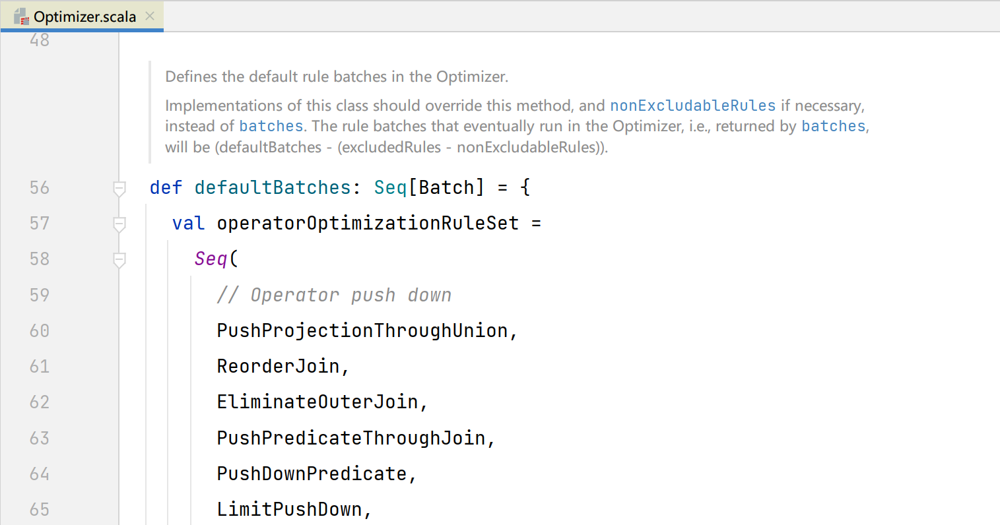

**&#x20;**

在前文的绑定逻辑计划阶段对 Unresolved LogicalPlan 进行相关 transform 操作得到了 Analyzed Logical Plan，这个 Analyzed Logical Plan 是可以直接转换成 Physical Plan 然后在spark中执行。但是如果直接这么弄的话，得到的 Physical Plan 很可能不是最优的，因为在实际应用中，很多低效的写法会带来执行效率的问题，需要进一步对Analyzed Logical Plan 进行处理，得到更优的逻辑算子树。于是，针对SQL 逻辑算子树的优化器 Optimizer 应运而生。


这个阶段的优化器主要是基于规则的（Rule-based Optimizer，简称 RBO），而绝大部分的规则都是启发式规则，也就是基于直观或经验而得出的规则，比如列裁剪（过滤掉查询不需要使用到的列）、谓词下推（将过滤尽可能地下沉到数据源端）、常量累加（比如 1 + 2 这种事先计算好） 以及常量替换（比如 SELECT \* FROM table WHERE i = 5 AND j = i + 3 可以转换成 SELECT \* FROM table WHERE i = 5 AND j = 8）等等。


与绑定逻辑计划阶段类似，这个阶段所有的规则也是实现 Rule 抽象类，多个规则组成一个 Batch，多个 Batch 组成一个 batches，同样也是在 RuleExecutor 中进行执行。


**核心源码骨架如下列截图所示：     &#x20;**

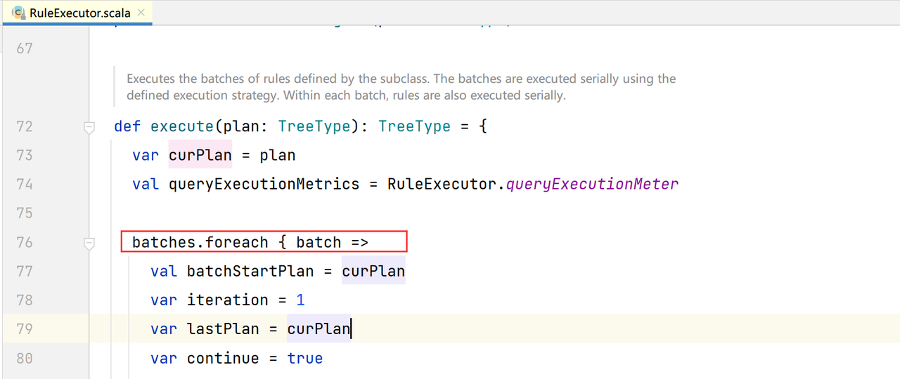

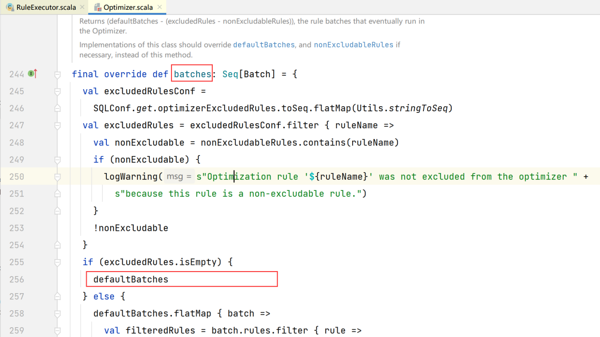

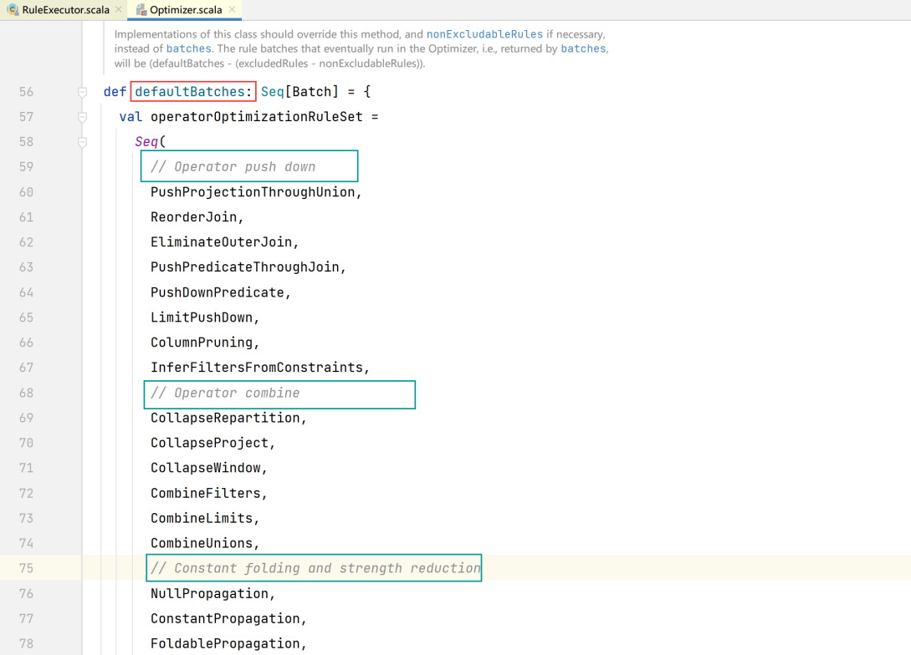

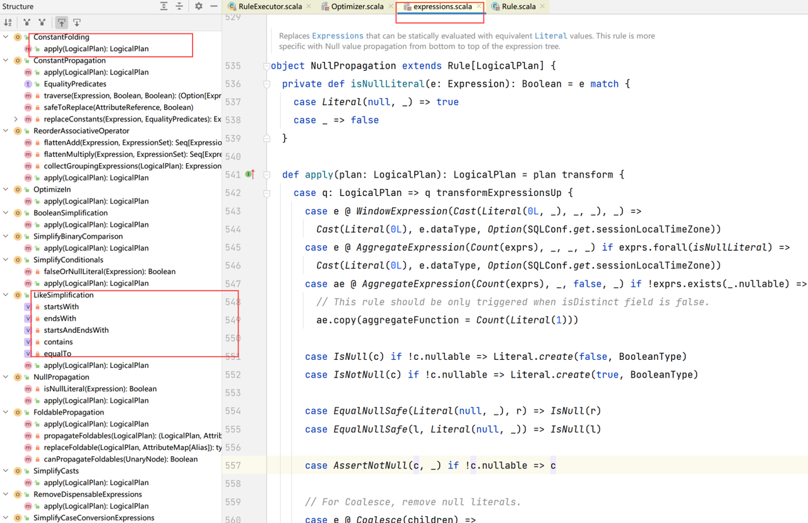

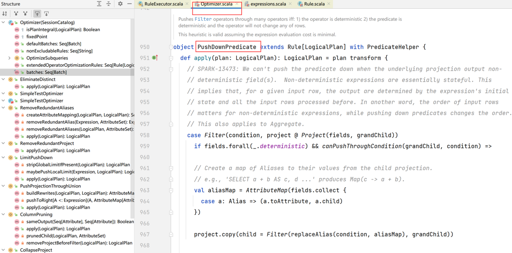

那么针对前文的 SQL 语句，这个过程都会执行哪些优化呢？下文举例说明。

### 5.4.1谓词下推

谓词下推在 Spark SQL 是由 PushDownPredicate 实现的，这个过程主要**将过滤条件尽可能地下推到底层，最好是数据源**。上面介绍的 SQL，使用谓词下推优化得到的逻辑计划如下：

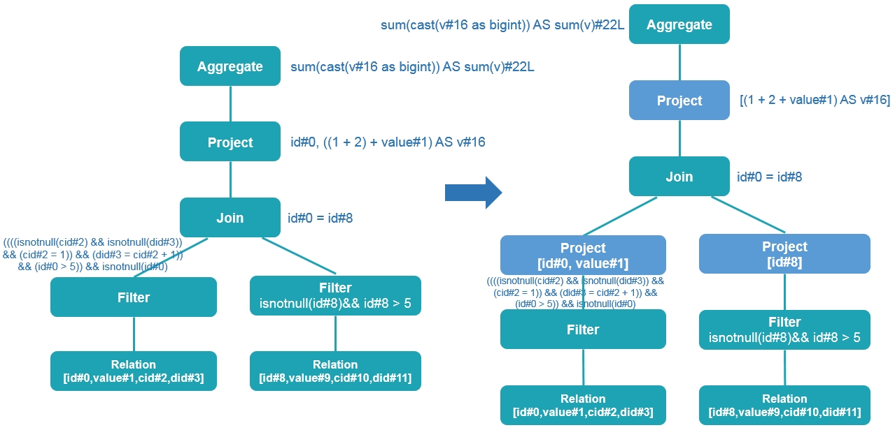

从上图可以看出，谓词下推将 Filter 算子直接下推到 Join 之前了（注意，上图是从下往上看的）。也就是在扫描 t1 表的时候会先使用 ((((isnotnull(cid#2) && isnotnull(did#3)) && (cid#2 = 1)) && (did#3 = 2)) && (id#0 > 50000)) && isnotnull(id#0) 过滤条件过滤出满足条件的数据；同时在扫描 t2 表的时候会先使用 isnotnull(id#8) && (id#8 > 50000) 过滤条件过滤出满足条件的数据。经过这样的操作，可以大大减少 Join 算子处理的数据量，从而加快计算速度。

### 5.4.2列裁剪

列裁剪在 Spark SQL 是由 ColumnPruning 实现的。因为我们查询的表可能有很多个字段，但是每次查询我们很大可能不需要扫描出所有的字段，这个时候利用列裁剪可以把那些查询不需要的字段过滤掉，使得扫描的数据量减少。所以针对我们上面介绍的 SQL，使用列裁剪优化得到的逻辑计划如下：

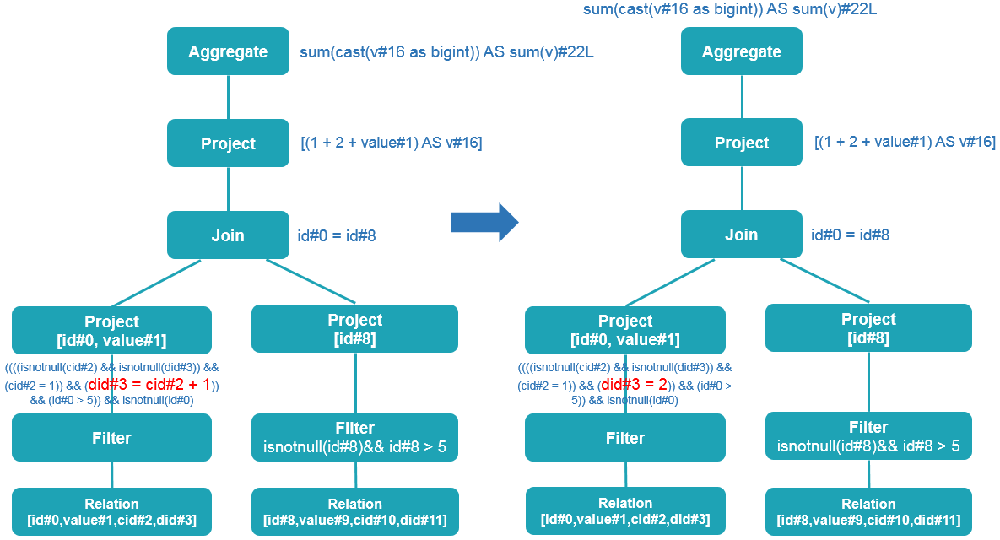

从上图可以看出，经过列裁剪后，t1 表只需要查询 id 和 value 两个字段；t2 表只需要查询 id 字段。这样减少了数据的传输，而且如果底层的文件格式为列存（比如 Parquet），可以大大提高数据的扫描速度的。


### 5.4.3常量替换

常量替换在 Spark SQL 是由 ConstantPropagation 实现的。也就是将变量替换成常量，比如 SELECT \* FROM table WHERE i = 5 AND j = i + 3 可以转换成 SELECT \* FROM table WHERE i = 5 AND j = 8。这个看起来好像没什么的，但是如果扫描的行数非常多可以减少很多的计算时间的开销的。经过这个优化，得到的逻辑计划如下：

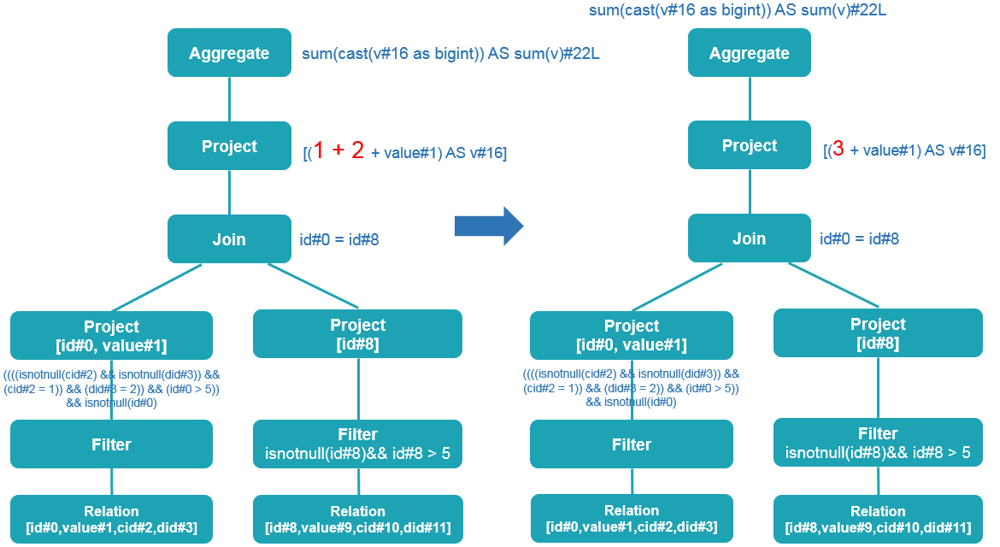

我们的查询中有 t1.cid = 1 AND t1.did = t1.cid + 1 查询语句，从里面可以看出 t1.cid 其实已经是确定的值了，所以我们完全可以使用它计算出 t1.did。

### 5.4.4常量累加

常量累加在 Spark SQL 是由 ConstantFolding 实现的。这个和常量替换类似，也是在这个阶段把一些常量表达式事先计算好。这个看起来改动的不大，但是在数据量非常大的时候可以减少大量的计算，减少 CPU 等资源的使用。经过这个优化，得到的逻辑计划如下：

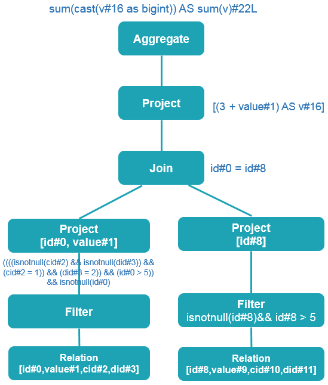

经过上面四个步骤的优化之后，得到的优化之后的逻辑计划为：

```plain&#x20;text
== Optimized Logical Plan ==
Aggregate [sum(cast(v#16 as bigint)) AS sum(v)#22L]
+- Project [(3 + value#1) AS v#16]
   +- Join Inner, (id#0 = id#8)
      :- Project [id#0, value#1]
      :  +- Filter (((((isnotnull(cid#2) && isnotnull(did#3)) && (cid#2 = 1)) && (did#3 = 2)) && (id#0 > 5)) && isnotnull(id#0))
      :     +- Relation[id#0,value#1,cid#2,did#3] csv
      +- Project [id#8]
         +- Filter (isnotnull(id#8) && (id#8 > 5))
            +- Relation[id#8,value#9,cid#10,did#11] csv
```


对应的图如下：


到这里，优化逻辑计划阶段就算完成了。另外，Spark 内置提供了多达70个优化 Rule，详情请参见

https://github.com/apache/spark/blob/master/sql/catalyst/src/main/scala/org/apache/spark/sql/catalyst/optimizer/Optimizer.scala#L59


## 5.5 使用SparkPlanner生成物理计划

SparkSpanner使用Planning Strategies，对优化后的逻辑计划进行转换，生成可以执行的物理计划SparkPlan.

```scala
/**
 * 将逻辑计划转成物理计划的抽象类.
 * 各实现类通过各种GenericStrategy来生成各种可行的待选物理计划.
 * TODO: 目前为止，永远只生成一个物理计划
 *       后续迭代中会对“多计划”予以实现
 */
abstract class QueryPlanner[PhysicalPlan <: TreeNode[PhysicalPlan]] {
  /** A list of execution strategies that can be used by the planner */
  def strategies: Seq[GenericStrategy[PhysicalPlan]]
​
  def plan(plan: LogicalPlan): Iterator[PhysicalPlan] = {
    // 显然，此处还有大量工作需要做...
​
    // 收集所有可选的物理计划.
    val candidates = strategies.iterator.flatMap(_(plan))

abstract class SparkStrategies extends QueryPlanner[SparkPlan] {
  self: SparkPlanner =>
​
  /**
   * Plans special cases of limit operators.
   */
  object SpecialLimits extends Strategy {
      
   
class SparkPlanner(
    val sparkContext: SparkContext,
    val conf: SQLConf,
    val experimentalMethods: ExperimentalMethods)
  extends SparkStrategies {      
```

逻辑计划翻译成物理计划时，使用的是策略（Strategy）；

前面介绍的逻辑计划绑定和优化经过 Transformations 动作之后，树的类型并没有改变，

Logical Plan转化成物理计划后，树的类型改变了，由 Logical Plan 转换成 Physical Plan 了。

一个逻辑计划（Logical Plan）经过一系列的策略处理之后，得到多个物理计划（Physical Plans），物理计划在 Spark 是由 SparkPlan 实现的。

多个物理计划经过代价模型（Cost Model）得到选择后的物理计划（ Selected Physical Plan），整个过程如下所示：

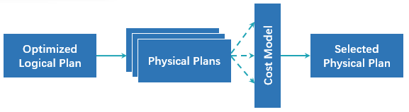

Cost Model 对应的就是基于代价的优化（Cost-based Optimizations，CBO），核心思想是计算每个物理计划的代价，然后得到最优的物理计划。

目前，这一部分并没有实现，直接返回多个物理计划列表的第一个作为最优的物理计划，如下：

```scala
lazy val sparkPlan: SparkPlan = {
    SparkSession.setActiveSession(sparkSession)
    // TODO: We use next(), i.e. take the first plan returned by the planner, here for now,
    //       but we will implement to choose the best plan.
    planner.plan(ReturnAnswer(optimizedPlan)).next()
}
```

如果可以条件，则最后得到的物理计划如下：

```plain&#x20;text
== Physical Plan ==
*(3) HashAggregate(keys=[], functions=[sum(cast(v#16 as bigint))], output=[sum(v)#22L])
+- Exchange SinglePartition
   +- *(2) HashAggregate(keys=[], functions=[partial_sum(cast(v#16 as bigint))], output=[sum#24L])
      +- *(2) Project [(3 + value#1) AS v#16]
         +- *(2) BroadcastHashJoin [id#0], [id#8], Inner, BuildRight
            :- *(2) Project [id#0, value#1]
            :  +- *(2) Filter (((((isnotnull(cid#2) && isnotnull(did#3)) && (cid#2 = 1)) && (did#3 = 2)) && (id#0 > 5)) && isnotnull(id#0))
            :     +- *(2) FileScan csv [id#0,value#1,cid#2,did#3] Batched: false, Format: CSV, Location: InMemoryFileIndex[file:/iteblog/t1.csv], PartitionFilters: [], PushedFilters: [IsNotNull(cid), IsNotNull(did), EqualTo(cid,1), EqualTo(did,2), GreaterThan(id,5), IsNotNull(id)], ReadSchema: struct<id:int,value:int,cid:int,did:int>
            +- BroadcastExchange HashedRelationBroadcastMode(List(cast(input[0, int, true] as bigint)))
               +- *(1) Project [id#8]
                  +- *(1) Filter (isnotnull(id#8) && (id#8 > 5))
                     +- *(1) FileScan csv [id#8] Batched: false, Format: CSV, Location: InMemoryFileIndex[file:/iteblog/t2.csv], PartitionFilters: [], PushedFilters: [IsNotNull(id), GreaterThan(id,5)], ReadSchema: struct<id:int>
```

***

从上面的结果可以看出，物理计划阶段已经知道数据源是从 csv 文件里面读取了，也知道文件的路径，数据类型等。而且在读取文件的时候，直接将过滤条件（PushedFilters）加进去了。


同时，这个 Join 变成了 BroadcastHashJoin，也就是将 t2 表的数据 Broadcast 到 t1 表所在的节点。图表示如下：

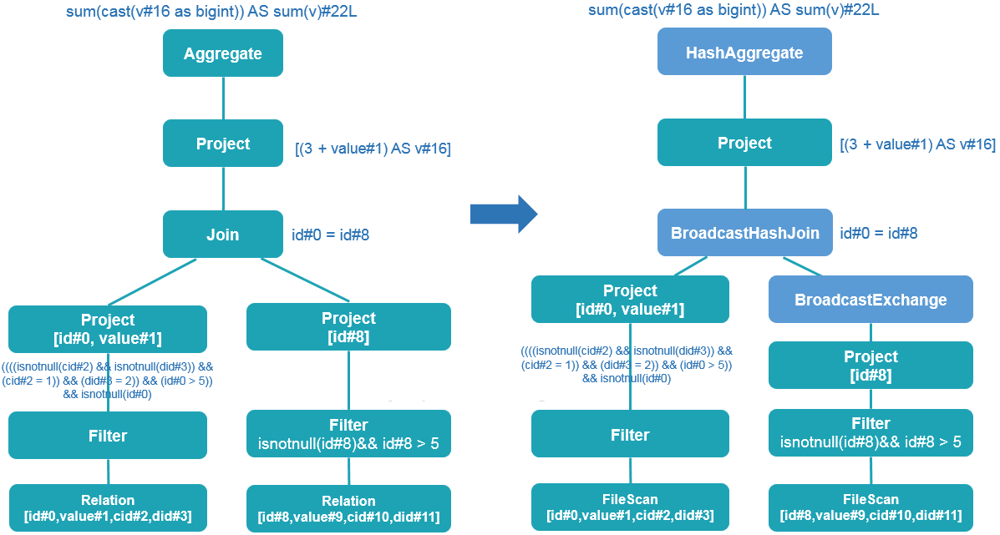

到这里， Physical Plan 就完全生成了。


## 5.6 从物理执行计划获取inputRdd执行

从物理计划上，获取inputRdd

从物理计划上，生成全阶段代码，并编译反射出迭代器newBiIterator的Clazz

&#x20;\[真名：BufferedRowIterator]

然后将inputRDD做一个transformation得到最终要执行的rdd

```scala
inputRdd.mapPartitionsWithIndex((index,iter)=>{
   new newBiIterator(){
     hasNext(){
         iter.hasNext
}
     next(){
         processNext(iter.next())
}
}
})

然后，对最后返回的rdd，执行你所需要的行动算子
rdd.collect().foreach(println)
```

