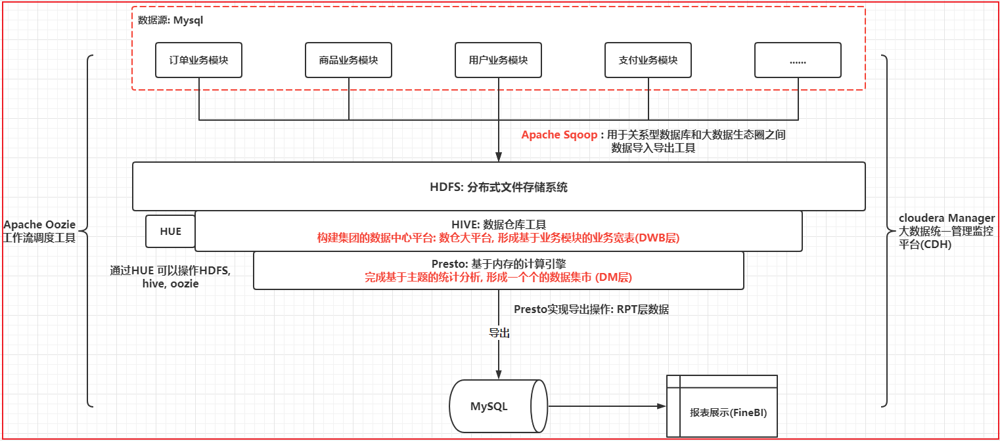
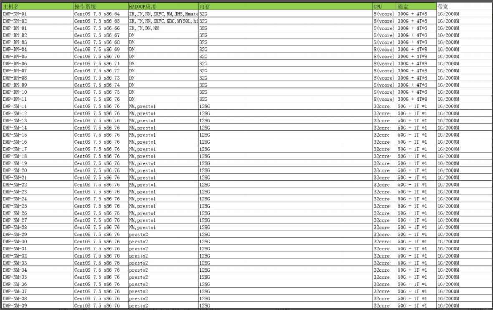

# day01_新零售串讲


## 1- 项目背景

行业:  新零售行业

何为新零售:  线上 + 线下 + 物流  一种新型销售模型

```properties
在新零售出现早期模型:  

1- 百货商店
2- 超级市场(超市): 只有线下, 没有线上 集中在大型商场中
3- 连锁商店: 比较小, 主要集中在各个小区门口, 比如说 北京华联超市

----------以上都是线下店铺 --------------
4- 电子商务(网店) : 纯线上销售模型
5- 新零售:   线上 + 线下 + 物流
```

​		对于一些属于新零售行业的公司来说, 迫切希望能够让自己的公司发展壮大, 需要了解自己公司的情况, 此时需要对公司原有的数据进行分析, 从而得出相应结论, 从而支持公司未来发展决策


当前 亿品新零售项目属于永辉公司离线数仓分析项目


## 2- 项目架构



```properties
请描述一下, 新零售项目架构呢?  
	基于cloudera manager构建的CDH版本大数据分析平台, 在此平台之上, 我们搭建有 HDFS, YARN, zookeeper,sqoop, oozie, hive, hue等相关的大数据组件, 同时为了提升HIVE分析的效率, 引入presto主要负责后续分析计算操作, 使用FineBI实现报表展示操作, 整个分析工作采用ooize完成整个工作流调度方案

数据流转的流程: 
	整个项目的数据源都是集中在MySQL中的, 通过sqoop将业务端的数据导入到HDFS中, 使用HIVE构建相关的表, 建立起数仓体系, 在数仓体系中, 通过分层方式, 逐步完成整个数仓平台构建, 基于presto完成后续统计分析, 将分析的结果导出到MySQL, 最后使用finebi完成报表展示操作, 整个平台基于cloudera manager进行监控管理, 基于ooozie完成工作流调度
	

基于这个内容, 通过自己的方式, 讲出来即可 (建议写写话术)
```


## 3- 项目的基本情况

* 1- 整个项目划分阶段: 

```properties
阶段一: 
	目标: 
		1- 完成基础大数据平台构建: 初期只有10台机子
		2- 完成调度平台的构建工作
		3- 完成基础数据导入操作(数据迁移):  MySQL -->  hadoop
		4- 完成销售主题整个建模分析的操作
		5- 实现业务方最为基础销售需求指标实现
	人员配置:  6人
		项目经理(技术经理): 1个
		大数据开发工程师: 3个人
		数据分析师(类似于大数据产品经理): 2名
		
	时间:
		3个月

阶段二: 
	目标:
		1- 完成集群扩容工作:  10 +  32台机子 = 42台
		2- 完成内存计算平台构建(presto集群)
		3- 完成整个数据源的数据抽取迁移工作
		4- 完成销售主题, 用户, 商品, 促销... 模块建设工作
		5- 满足公司80%以上的数据需求和报表需求
		6- 支持财务的成本和利润的合算
	人员配置: 8人
		项目经理(技术经理): 1个
		大数据开发工程师: 4个人
		数据分析师(类似于大数据产品经理): 3名
		
	时间:
		4个月
```

* 2- 数据量

  * 全量数据:  历史存储4年的数据,  整个数据平台的数据为35TB左右 , 冗余存储量为 105TB
  * 增量:  每日增量 25GB左右

  ```properties
  以永辉为例:  
  	全国有1200家连锁超市, 每家超市, 平均在平日的订单量大约 1000~1500单  在临周末或者周末 每天订单量大概 2000 ~ 3000单 甚至可达到 5000单左右
  ```

* 3- 集群规模

  * 整个项目集群规模为 42台机器

  

  ```properties
  注意点: 
  	在表中, datanode 和 nodemanager分来的, 实际上应该是叠加在一起
  ```

  

## 4- 项目分层

新零售项目的分层描述:

```properties
ODS: 源数据层(贴源层,临时数据存储层)
	作用: 对接数据源, 用于将数据源的数据完整的导入到ODS层中, 一般ODS层的数据和数据源的数据保存相同粒度(一致), 类似于一种数据迁移的操作,一般在ODS层建表的时候, 会习惯性加一个以日期作为分区操作, 用于标记何时将数据导入到HDFS中, 便于后续的增量处理
	
	项目中: 
		共计有23张表需要导入到ODS层, 其中有二张表为全量覆盖同步方式, 有三张表为仅新增同步方式,18张表为新增及更新同步方式
		
	明确: 每种同步方式如何构建表, 以及如何同步
		比如: 
			全量覆盖方式同步: 
				建表的时候, 不需要构建分区表, 每次导入数据都是将业务库中所有的数据全部导入到对应表
				
				适用于: 不存在变更数据或者说不需要维护历史变更行为,  数据量相对较少
                比如说: 地域表 和 日期表
           
          	仅新增同步方式: 
          		建表的时候, 需要构建分区表, 分区字段为同步数据周期的时间字段, 比如说以天为周期导入数据, 分区字段以天为标准
          		每次增量导入数据的时候, 只需要将上一天的增量导入对应ODS层表对应分区下
          	
          	新增及更新同步方式: 
          		建表的时候, 需要构建分区表, 分区字段为同步数据周期的时间字段, 比如说以天为周期导入数据, 分区字段以天为标准
          		每次正能量导入数据的时候, 需要将上一天的新增数据和更新的数据导入到对应分区下, 后续需要使用拉链表的方式来维护
          	

DW层: 
	DWD层: 明细层
		作用: 和 ODS层保持相同的粒度, 不会对数据进行聚合操作, 主要进行 清洗  转换 相关的工作, 保证数据质量, 利于后续分析
		
		项目中: 
			主要是进行拉链表的实现 (重要)  -- 下一次串讲中 讲解 拉链表实操
			清洗操作和转换操作相对来说不多(原因: 数据都是被处理脱敏后的数据, 都是测试数据, 本身数据内容不是特别完整)
		
	DWB层: 基础数据层
		作用: 进行维度退化的操作, 根据业务模块. 形成业务宽表 
		
		此层主要就是多表连接工作, 涉及到多表JOIN优化(map join, bucket map join 和 SMB JOIN 以及索引优化) -- 在后续串讲中, 讲解 各种JOIN优化方案
		
	DWS层:  业务数据层
		作用:  用于进行提前聚合操作,  形成基础主题统计宽表指标结果数据
		
		项目中: 此层形成多个日统计宽表
			销售主题日统计宽表
			商品主题日统计宽表
			用户主题日统计宽表
		重要点:  
			处理方案: grouping sets   grouping()  一条SQL实现不同分组方案 ---串讲 讲解如何使用groupting sets(计划将销售主题统计整体讲解一次)
			优化处理: 
				数据倾斜处理
				基于ORC格式特殊优化
	DM层: 数据集市层
		作用:  基于主题, 形成数据集市, 对指标进行细化统计过程
		
		项目中: 
			销售主题 日统计, 月统计, 年统计 宽表数据
			商品主题 日统计, 总数量 以及最近30天
			用户主题 日统计, 总数量 以及最近30天

RPT层(DA,APPP,ADS...): 数据应用层(数据展示层)
	作用: 存储分析的结果数据, 用于对接相关的应用 , 比如说 BI图表
	
	项目中: 
		基于最终项目图表需求, 形成图表需求相关结果表, 并将结果表导出到MySQL
	
	项目图表结果:
		https://yp-bigscreen-dev.itheima.net/
```


