# day03_新零售串讲课程笔记

* 今日内容:
  * 1- 拉链表的整个实施操作
  * 2- DWB层相关内容: 
  * 3- DWS层相关内容

## 1- ods层:

ODS层作用:

```properties
	对接数据源, 一般和数据源保持相同粒度, 简单来说, 数据源中有那些表, 那么在ODS层就需要构建那些表, 表中字段与数据源的字段保持一致
	在ODS层建表的时候, 我们会习惯性加上一个日期分区字段, 用于标记在何时将数据导入到ODS层

数据源: Mysql
ODS层: 位于HIVE中

思考: 如何将Mysql中数据导入到HIVE中呢?  Sqoop
```

从数据源将数据同步到ODS层的时候, 一般有四种同步方式:

* 1- 全量覆盖同步方式

```properties
适用于: 
	表数据变更的频次不多, 不需要记录其历史变化, 而且整个表数据量相对来说较少, 可以采用全量覆盖同步

操作方式:
	每次同步的时候, 都需要将原有的数仓中数据全部删除 然后重新导入业务库的数据即可
	建表的时候, 不需要构建分区表

比如说:  地区表,  时间表
```

* 2- 仅新增同步方式

```properties
适用于: 
	业务数据只会有新增的操作, 不会有变更的操作, 数据量比较多

操作方式:
	在数仓建表的时候, 需要构建分区表, 分区字段和同步数据的周期是一致的, 比如说: 每天都需要同步新增的数据, 就以天作为分区字段即可, 如果月新增, 就以月作为分区
	每次进行同步数据的时候, 将对应周期下的新增数据放置到对应分区日期目录下
```

* 3- 新增及更新同步方式

```properties
适用于:
	业务端数据既有更新的操作, 又有新增的操作, 而且数据量比较大

操作方式: 
	在数仓建表的时候, 需要构建分区表, 分区字段和同步数据的周期是一致的, 比如说: 每天都需要同步新增和更新的数据, 就以天作为分区字段即可, 如果月新增, 就以月作为分区
	每次进行同步的时候, 将对应周期下的新增和更新的数据放置到对应日期分区下即可
```

* 4- 全量同步方式(了解)

```properties
适用于: 
	业务库的数据量不是很大, 但是也存在更新和新增. 而且不需要保留太多的历史版本

操作方式:
	在数仓中建表的时候, 需要构建分区表, 分区字段和同步数据的周期是一致的
	每次导入都是导入截止当前时间的全量数据, 定期将历史数据删除即可
```


----

### 1.1 构建ODS层表

* 全量覆盖表:  日期表

```properties
-- 日期表:   t_date
drop table yp_ods.t_date; 
CREATE TABLE yp_ods.t_date ( 
    dim_date_id string COMMENT '日期', 
    date_code string COMMENT '日期编码', 
    lunar_calendar string COMMENT '农历', 
    year_code string COMMENT '年code', 
    year_name string COMMENT '年名称', 
    month_code string COMMENT '月份编码', 
    month_name string COMMENT '月份名称', 
    quanter_code string COMMENT '季度编码', 
    quanter_name string COMMENT '季度名称', 
    year_month string COMMENT '年月', 
    year_week_code string COMMENT '一年中第几周', 
    year_week_name string COMMENT '一年中第几周名称', 
    year_week_code_cn string COMMENT '一年中第几周（中国）', 
    year_week_name_cn string COMMENT '一年中第几周名称（中国',
    week_day_code string COMMENT '周几code', 
    week_day_name string COMMENT '周几名称', 
    day_week string COMMENT '周', 
    day_week_cn string COMMENT '周(中国)',
    day_week_num string COMMENT '一周第几天', 
    day_week_num_cn string COMMENT '一周第几天（中国）', 
    day_month_num string COMMENT '一月第几天', 
    day_year_num string COMMENT '一年第几天', 
    date_id_wow string COMMENT '与本周环比的上周日期', 
    date_id_mom string COMMENT '与本月环比的上月日期', 
    date_id_wyw string COMMENT '与本周同比的上年日期', 
    date_id_mym string COMMENT '与本月同比的上年日期', 
    first_date_id_month string COMMENT '本月第一天日期', 
    last_date_id_month string COMMENT '本月最后一天日期',
    half_year_code string COMMENT '半年code', 
    half_year_name string COMMENT '半年名称', 
    season_code string COMMENT '季节编码', 
    season_name string COMMENT '季节名称', 
    is_weekend string COMMENT '是否周末（周六和周日）', 
    official_holiday_code string COMMENT '法定节假日编码', 
    official_holiday_name string COMMENT '法定节假日', 
    festival_code string COMMENT '节日编码', 
    festival_name string COMMENT '节日', 
    custom_festival_code string COMMENT '自定义节日编码', 
    custom_festival_name string COMMENT '自定义节日', 
    update_time string COMMENT '更新时间' 
)
COMMENT '时间维度表' 
row format delimited fields terminated by '\t' 
stored as orc tblproperties ('orc.compress' = 'ZLIB');
```

* 仅新增同步表: 订单评价表

```properties
-- 订单评价表 : t_goods_evaluation
DROP TABLE if exists yp_ods.t_goods_evaluation;
CREATE TABLE yp_ods.t_goods_evaluation ( 
	`id` string, 
	`user_id` string COMMENT '评论人id', 
	`store_id` string COMMENT '店铺id', 
	`order_id` string COMMENT '订单id', 
	`geval_scores` INT COMMENT '综合评分', 
	`geval_scores_speed` INT COMMENT '送货速度评分0-5分(配送评分)', 
	`geval_scores_service` INT COMMENT '服务评分0-5分', 
	`geval_isanony` TINYINT COMMENT '0-匿名评价，1-非匿名', 
	`create_user` string, 
	`create_time` string, 
	`update_user` string, 
	`update_time` string, 
	`is_valid` TINYINT COMMENT '0 ：失效，1 ：开启'
)
comment '商品评价表' 
partitioned by (dt string) 
row format delimited fields terminated by '\t' stored as orc tblproperties ('orc.compress'='ZLIB');
```

* 新增及更新同步表: 店铺表

```properties
DROP TABLE if exists yp_ods.t_store; 
CREATE TABLE yp_ods.t_store ( 
	`id` string COMMENT '主键', 
	`user_id` string, 
	`store_avatar` string COMMENT '店铺头像', 
	`address_info` string COMMENT '店铺详细地址', 
	`name` string COMMENT '店铺名称', 
	`store_phone` string COMMENT '联系电话', 
	`province_id` INT COMMENT '店铺所在省份ID', 
	`city_id` INT COMMENT '店铺所在城市ID', 
	`area_id` INT COMMENT '店铺所在县ID', 
	`mb_title_img` string COMMENT '手机店铺 页头背景图',
	`store_description` string COMMENT '店铺描述', 
	`notice` string COMMENT '店铺公告', 
	`is_pay_bond` TINYINT COMMENT '是否有交过保证金 1：是0：否', 
	`trade_area_id` string COMMENT '归属商圈ID', 
	`delivery_method` TINYINT COMMENT '配送方式 1 ：自提 ；3 ：自提加配送均可; 2 : 商家配送', 
	`origin_price` DECIMAL, 
	`free_price` DECIMAL, 
	`store_type` INT COMMENT '店铺类型 22天街网店 23实体店 24直营店铺 33会员专区店', 
	`store_label` string COMMENT '店铺logo', 
	`search_key` string COMMENT '店铺搜索关键字', 
	`end_time` string COMMENT '营业结束时间', 
	`start_time` string COMMENT '营业开始时间', 
	`operating_status` TINYINT COMMENT '营业状态 0 ：未营业 ；1 ：正在营业', 
	`create_user` string, 
	`create_time` string, 
	`update_user` string, 
	`update_time` string, 
	`is_valid` TINYINT COMMENT '0关闭，1开启，3店铺申请中', 
	`state` string COMMENT '可使用的支付类型:MONEY金钱支付;CASHCOUPON现金券支付', 
	`idCard` string COMMENT '身份证', 
	`deposit_amount` DECIMAL(11,2) COMMENT '商圈认购费用总额', 
	`delivery_config_id` string COMMENT '配送配置表关联ID', 
	`aip_user_id` string COMMENT '通联支付标识ID', 
	`search_name` string COMMENT '模糊搜索名称字段:名称_+真实名称', 
	`automatic_order` TINYINT COMMENT '是否开启自动接单功能 1：是 0 ：否', 
	`is_primary` TINYINT COMMENT '是否是总店 1: 是 2: 不是',
	`parent_store_id` string COMMENT '父级店铺的id，只有当is_primary类型为2时有效'
)
comment '店铺表' 
partitioned by (dt string) 
row format delimited fields terminated by '\t' 
stored as orc tblproperties ('orc.compress'='ZLIB');
```


### 1.2 全量导入数据到ODS层

​		通过 sqoop完成数据导入到HIVE中

````
sqoop导入HIVE的时候, 有二种导入方式:  
方式一: sqoop原生方案 : 仅支持textFile存储格式
方式二: sqoop hcatalog方式 : 支持多种存储格式
````

执行导入操作:

* 1- 全量覆盖方式导入:  日期表

```shell
sqoop import \
--connect jdbc:mysql://192.168.88.80:3306/yipin \
--username root \
--password 123456 \
--query "SELECT  * FROM t_date where 1=1 and \$CONDITIONS" \
--hcatalog-database yp_ods \
--hcatalog-table t_date \
-m 1
```

* 2-仅新增同步导入:  订单评价表

```sql
sqoop import \
--connect jdbc:mysql://192.168.88.80:3306/yipin \
--username root \
--password 123456 \
--query "SELECT  *,'2022-05-03' as dt FROM t_goods_evaluation where create_time <='2022-05-03 23:59:59'  and \$CONDITIONS" \
--hcatalog-database yp_ods \
--hcatalog-table t_goods_evaluation \
-m 1


注意: 这里写 1 =1 相当于将当天的数据全部导入了, 实际上仅需要导入截止今天以前的所有数据
	今天的数据, 是在第二天导入的
	
说明: 当前执行日期为 2022-05-05 , 实际导入 2022-05-04以前的数据, 目前为了后续演示增量过程,假设今天为2022-05-04, 导入2022-05-03以前的所有的数据即可
```

* 3- 新增及更新同步导入:  店铺表

```shell
sqoop import \
--connect jdbc:mysql://192.168.88.80:3306/yipin \
--username root \
--password 123456 \
--query "SELECT  *,'2022-05-03' as dt FROM t_store where create_time <='2022-05-03 23:59:59' OR update_time <='2022-05-03 23:59:59' and \$CONDITIONS" \
--hcatalog-database yp_ods \
--hcatalog-table t_store \
-m 1

说明: 当前执行日期为 2022-05-05 , 实际导入 2022-05-04以前的数据, 目前为了后续演示增量过程,假设今天为2022-05-04, 导入2022-05-03以前的所有的数据即可
```

### 1.3 在mysql端模拟一份增量数据

```sql
-- 日期表(全量覆盖的方式):
--    新增一条数据
INSERT INTO yipin.`t_date` VALUES ('20320101','2032-01-01','20311201','2031','2031年','01','01月','1','Q1','203201','52','203152','01','203201','3','星期三','01','01','4','3','01','001','20311225','20311201','10000000','20310101','20320101','20320131','1','上半年','S04','冬季','否','H01','元旦','F01','元旦','','','2021-12-20 14:20:57.401');
   
-- 订单评价表(仅新增同步):
INSERT INTO yipin.`t_goods_evaluation` VALUES ('22222222','430eff5a55d911e998ec7cd30ad32e2e','7b09b44e5b6d11e998ec7cd30ad32e2e','dd190411306814f41f',10,10,10,1,'430eff5a55d911e998ec7cd30ad32e2e','2022-05-04 09:42:02',NULL,NULL,1);
	
-- 店铺表(新增及更新同步):
UPDATE  yipin.`t_store` SET NAME='博学谷教育平台' , update_time = '2022-05-04 05:50:55' WHERE id = '0afb5daf777d11e998ec7cd30ad32e2e';
	
INSERT INTO yipin.`t_store` VALUES ('11020','02554155777c11e998ec7cd30ad32e2e',NULL,NULL,'酷丁鱼幼儿教育',NULL,NULL,NULL,NULL,NULL,NULL,NULL,NULL,'0af148be777d11e998ec7cd30ad32e2e',NULL,NULL,NULL,24,NULL,NULL,'22:00','08:00',0,'02554155777c11e998ec7cd30ad32e2e','2022-05-04 05:50:55',NULL,NULL,3,'MONEY',NULL,NULL,'0afaf8ad777d11e998ec7cd30ad32e2e',NULL,'名称_**亿隆电子科技开发有限公司',0,1,NULL);

```


### 1.4 完成增量数据同步操作

* 思考:  如果从业务库中获取到需要增量的数据呢? 

  * 全量覆盖的表操作: 日期表

  ```sql
  -- 日期表(全量覆盖): 如果更新的频次以天基准, 对于全量覆盖的表来说, 每天都是将之前的所有的数据全部都删除, 然后重新将全量的数据导入到目标表即可
  
  -- 思考: 是否可以使用sqoop直接进行全量的覆盖呢? 表存储格式为ORC  , 导入数据需要使用hcatalog方式, 而这种方式仅支持追加, 不支持覆盖写入
  
  -- 如何解决呢? 先将表清空了, 然后执行导入操作
  -- 对于HIVE的表, 默认是无法直接对数据进行处理, 也就是无法修改数据,或者删除数据, 所以想 delete  update 都是无法执行的, 一般建议将表先删除, 然后重新建表即可(不建议使用truncate)
  
  -- 第一步: 先将表删除, 然后重新建表
  drop table if exists yp_ods.t_date; 
  CREATE TABLE if not exists yp_ods.t_date ( 
      dim_date_id string COMMENT '日期', 
      date_code string COMMENT '日期编码', 
      lunar_calendar string COMMENT '农历', 
      year_code string COMMENT '年code', 
      year_name string COMMENT '年名称', 
      month_code string COMMENT '月份编码', 
      month_name string COMMENT '月份名称', 
      quanter_code string COMMENT '季度编码', 
      quanter_name string COMMENT '季度名称', 
      year_month string COMMENT '年月', 
      year_week_code string COMMENT '一年中第几周', 
      year_week_name string COMMENT '一年中第几周名称', 
      year_week_code_cn string COMMENT '一年中第几周（中国）', 
      year_week_name_cn string COMMENT '一年中第几周名称（中国',
      week_day_code string COMMENT '周几code', 
      week_day_name string COMMENT '周几名称', 
      day_week string COMMENT '周', 
      day_week_cn string COMMENT '周(中国)',
      day_week_num string COMMENT '一周第几天', 
      day_week_num_cn string COMMENT '一周第几天（中国）', 
      day_month_num string COMMENT '一月第几天', 
      day_year_num string COMMENT '一年第几天', 
      date_id_wow string COMMENT '与本周环比的上周日期', 
      date_id_mom string COMMENT '与本月环比的上月日期', 
      date_id_wyw string COMMENT '与本周同比的上年日期', 
      date_id_mym string COMMENT '与本月同比的上年日期', 
      first_date_id_month string COMMENT '本月第一天日期', 
      last_date_id_month string COMMENT '本月最后一天日期',
      half_year_code string COMMENT '半年code', 
      half_year_name string COMMENT '半年名称', 
      season_code string COMMENT '季节编码', 
      season_name string COMMENT '季节名称', 
      is_weekend string COMMENT '是否周末（周六和周日）', 
      official_holiday_code string COMMENT '法定节假日编码', 
      official_holiday_name string COMMENT '法定节假日', 
      festival_code string COMMENT '节日编码', 
      festival_name string COMMENT '节日', 
      custom_festival_code string COMMENT '自定义节日编码', 
      custom_festival_name string COMMENT '自定义节日', 
      update_time string COMMENT '更新时间' 
  )
  COMMENT '时间维度表' 
  row format delimited fields terminated by '\t' 
  stored as orc tblproperties ('orc.compress' = 'ZLIB');
  
  -- 第二步: 执行 sqoop命令 进行全量数据导入操作:
  sqoop import \
  --connect jdbc:mysql://192.168.88.80:3306/yipin \
  --username root \
  --password 123456 \
  --query "SELECT  * FROM t_date where 1=1 and \$CONDITIONS" \
  --hcatalog-database yp_ods \
  --hcatalog-table t_date \
  -m 1
  ```

  * 仅新增同步方式:

  ```sql
  -- 订单评价表(仅新增同步): 表只有新增的操作, 没有更新的操作. 对于这种同步方式的表, 我们只需要每天将其新增的数据导入到对应日期分区下即可
  
  -- 思考: 如何获取到上一天的新增数据呢?
  SELECT *, '2022-05-04' as dt  FROM  t_goods_evaluation WHERE create_time BETWEEN '2022-05-04 00:00:00' AND '2022-05-04 23:59:59';
  
  -- 基于 sqoop完成导入:
  sqoop import \
  --connect jdbc:mysql://192.168.88.80:3306/yipin \
  --username root \
  --password 123456 \
  --query "SELECT *, '2022-05-04' as dt  FROM  t_goods_evaluation WHERE create_time BETWEEN '2022-05-04 00:00:00' AND '2022-05-04 23:59:59'  and \$CONDITIONS" \
  --hcatalog-database yp_ods \
  --hcatalog-table t_goods_evaluation \
  -m 1
  ```

  * 新增及更新同步方式:

  ```sql
  -- 店铺表(新增及更新同步):  表既有更新又有新增 对于这种同步方式表, 我们需要将其上一天的新增和更新的数据放置到对应分区下即可
  
  SELECT  *,'2022-05-03' as dt FROM t_store where create_time BETWEEN '2022-05-04 00:00:00' AND '2022-05-04 23:59:59' OR update_time BETWEEN '2022-05-04 00:00:00' and '2022-05-04 23:59:59'
  
  -- sqoop导入操作
  sqoop import \
  --connect jdbc:mysql://192.168.88.80:3306/yipin \
  --username root \
  --password 123456 \
  --query "SELECT  *,'2022-05-04' as dt FROM t_store where create_time BETWEEN '2022-05-04 00:00:00' AND '2022-05-04 23:59:59' OR update_time BETWEEN '2022-05-04 00:00:00' and '2022-05-04 23:59:59' and \$CONDITIONS" \
  --hcatalog-database yp_ods \
  --hcatalog-table t_store \
  -m 1
  ```

  > 目前, 书写的这些sqoop的脚本, 是比较死板的, 希望能够自动获取上一天的日期, 进行导入处理
  >
  > 如何解决呢?  希望能够自动获取上一天的日期, 而且希望支持根据指定的日期导入相关的数据
  >
  > ​        此时需要编写 SHELL脚本, 通过shell脚本来实现这个逻辑

  ```shell
  #!/bin/bash
  
  # 1- ENV PATH
  HIVE_HOME=/usr/bin/hive
  
  # 2- Tran
  if [ $# == 1 ]
  then
     dateStr=$1
  else
     dateStr=`date -d '-1 day' +'%Y-%m-%d'`
  fi
  
  echo ${dateStr}
  
  # 3- HIVE DELETE TABLE AND  CREATE
  echo '----------HIVE EXE START-----------------'
  
  ${HIVE_HOME} -S -e "
  
  drop table if exists yp_ods.t_date; 
  CREATE TABLE if not exists yp_ods.t_date ( 
      dim_date_id string COMMENT '日期', 
      date_code string COMMENT '日期编码', 
      lunar_calendar string COMMENT '农历', 
      year_code string COMMENT '年code', 
      year_name string COMMENT '年名称', 
      month_code string COMMENT '月份编码', 
      month_name string COMMENT '月份名称', 
      quanter_code string COMMENT '季度编码', 
      quanter_name string COMMENT '季度名称', 
      year_month string COMMENT '年月', 
      year_week_code string COMMENT '一年中第几周', 
      year_week_name string COMMENT '一年中第几周名称', 
      year_week_code_cn string COMMENT '一年中第几周（中国）', 
      year_week_name_cn string COMMENT '一年中第几周名称（中国',
      week_day_code string COMMENT '周几code', 
      week_day_name string COMMENT '周几名称', 
      day_week string COMMENT '周', 
      day_week_cn string COMMENT '周(中国)',
      day_week_num string COMMENT '一周第几天', 
      day_week_num_cn string COMMENT '一周第几天（中国）', 
      day_month_num string COMMENT '一月第几天', 
      day_year_num string COMMENT '一年第几天', 
      date_id_wow string COMMENT '与本周环比的上周日期', 
      date_id_mom string COMMENT '与本月环比的上月日期', 
      date_id_wyw string COMMENT '与本周同比的上年日期', 
      date_id_mym string COMMENT '与本月同比的上年日期', 
      first_date_id_month string COMMENT '本月第一天日期', 
      last_date_id_month string COMMENT '本月最后一天日期',
      half_year_code string COMMENT '半年code', 
      half_year_name string COMMENT '半年名称', 
      season_code string COMMENT '季节编码', 
      season_name string COMMENT '季节名称', 
      is_weekend string COMMENT '是否周末（周六和周日）', 
      official_holiday_code string COMMENT '法定节假日编码', 
      official_holiday_name string COMMENT '法定节假日', 
      festival_code string COMMENT '节日编码', 
      festival_name string COMMENT '节日', 
      custom_festival_code string COMMENT '自定义节日编码', 
      custom_festival_name string COMMENT '自定义节日', 
      update_time string COMMENT '更新时间' 
  )
  COMMENT '时间维度表' 
  row format delimited fields terminated by '\t' 
  stored as orc tblproperties ('orc.compress' = 'ZLIB');
  "
  
  echo '----------HIVE EXE END  SUCCESS-----------------'
  
  
  # 4- SQOOP IMPORT
  
  SQOOP_HOME=/usr/bin/sqoop
  
  
  echo '----------SQOOP IMPORT START-----------------'
  
  # PUBLIC PATH
  URL='jdbc:mysql://192.168.88.80:3306/yipin'
  USERNAME='root'
  PASSWORD='123456'
  
  
  ${SQOOP_HOME} import \
  --connect ${URL} \
  --username ${USERNAME} \
  --password ${PASSWORD} \
  --query "SELECT  * FROM t_date where 1=1 and \$CONDITIONS" \
  --hcatalog-database yp_ods \
  --hcatalog-table t_date \
  -m 1
  
  wait
  
  ${SQOOP_HOME} import \
  --connect ${URL} \
  --username ${USERNAME} \
  --password ${PASSWORD} \
  --query "SELECT *, '${dateStr}' as dt  FROM  t_goods_evaluation WHERE create_time BETWEEN '${dateStr} 00:00:00' AND '${dateStr} 23:59:59'  and \$CONDITIONS" \
  --hcatalog-database yp_ods \
  --hcatalog-table t_goods_evaluation \
  -m 1
  
  
  wait
  
  ${SQOOP_HOME} import \
  --connect ${URL} \
  --username ${USERNAME} \
  --password ${PASSWORD} \
  --query "SELECT  *,'${dateStr}' as dt FROM t_store where create_time BETWEEN '${dateStr} 00:00:00' AND '${dateStr} 23:59:59' OR update_time BETWEEN '${dateStr} 00:00:00' and '${dateStr} 23:59:59' and \$CONDITIONS" \
  --hcatalog-database yp_ods \
  --hcatalog-table t_store \
  -m 1
  
  
  
  echo '----------SQOOP IMPORT END SUCCESS----------------'
  ```

执行脚本, 观察是否可以执行成功呢? 

```properties
select  * from yp_ods.t_date where dim_date_id = '20320101';
select  * from yp_ods.t_store where  dt = '2022-05-04';

可以查看对应分区下, 相关的数据是否有没有生成
```

后续可以将这个脚本配置在oozie中, 进行定时运行即可


说明:

```properties
删除分区的命令: 
	alter table 表名 drop partition(分区字段=值);
```


## 2- DWD层

DWD层作用: 

```
	DWD层 和 ODS层 保持相同粒度, 从ODS层将数据抽取出来,  对数据进行清洗 转换 以及拉链等相关工作
```


### 2.1 构建DWD层表

* 1- 构建全量覆盖表: 日期表

```properties
-- 日期表:   t_date
drop table yp_dwd.dim_date; 
CREATE TABLE yp_dwd.dim_date ( 
    dim_date_id string COMMENT '日期', 
    date_code string COMMENT '日期编码', 
    lunar_calendar string COMMENT '农历', 
    year_code string COMMENT '年code', 
    year_name string COMMENT '年名称', 
    month_code string COMMENT '月份编码', 
    month_name string COMMENT '月份名称', 
    quanter_code string COMMENT '季度编码', 
    quanter_name string COMMENT '季度名称', 
    year_month string COMMENT '年月', 
    year_week_code string COMMENT '一年中第几周', 
    year_week_name string COMMENT '一年中第几周名称', 
    year_week_code_cn string COMMENT '一年中第几周（中国）', 
    year_week_name_cn string COMMENT '一年中第几周名称（中国',
    week_day_code string COMMENT '周几code', 
    week_day_name string COMMENT '周几名称', 
    day_week string COMMENT '周', 
    day_week_cn string COMMENT '周(中国)',
    day_week_num string COMMENT '一周第几天', 
    day_week_num_cn string COMMENT '一周第几天（中国）', 
    day_month_num string COMMENT '一月第几天', 
    day_year_num string COMMENT '一年第几天', 
    date_id_wow string COMMENT '与本周环比的上周日期', 
    date_id_mom string COMMENT '与本月环比的上月日期', 
    date_id_wyw string COMMENT '与本周同比的上年日期', 
    date_id_mym string COMMENT '与本月同比的上年日期', 
    first_date_id_month string COMMENT '本月第一天日期', 
    last_date_id_month string COMMENT '本月最后一天日期',
    half_year_code string COMMENT '半年code', 
    half_year_name string COMMENT '半年名称', 
    season_code string COMMENT '季节编码', 
    season_name string COMMENT '季节名称', 
    is_weekend string COMMENT '是否周末（周六和周日）', 
    official_holiday_code string COMMENT '法定节假日编码', 
    official_holiday_name string COMMENT '法定节假日', 
    festival_code string COMMENT '节日编码', 
    festival_name string COMMENT '节日', 
    custom_festival_code string COMMENT '自定义节日编码', 
    custom_festival_name string COMMENT '自定义节日', 
    update_time string COMMENT '更新时间' 
)
COMMENT '时间维度表' 
row format delimited fields terminated by '\t' 
stored as orc tblproperties ('orc.compress' = 'SNAPPY');
```

* 2- 仅新增同步的表:  订单评价表

```sql
-- 订单评价表 : t_goods_evaluation
DROP TABLE if exists yp_dwd.fact_goods_evaluation;
CREATE TABLE yp_dwd.fact_goods_evaluation ( 
	`id` string, 
	`user_id` string COMMENT '评论人id', 
	`store_id` string COMMENT '店铺id', 
	`order_id` string COMMENT '订单id', 
	`geval_scores` INT COMMENT '综合评分', 
	`geval_scores_speed` INT COMMENT '送货速度评分0-5分(配送评分)', 
	`geval_scores_service` INT COMMENT '服务评分0-5分', 
	`geval_isanony` TINYINT COMMENT '0-匿名评价，1-非匿名', 
	`create_user` string, 
	`create_time` string, 
	`update_user` string, 
	`update_time` string, 
	`is_valid` TINYINT COMMENT '0 ：失效，1 ：开启'
)
comment '商品评价表' 
partitioned by (dt string) 
row format delimited fields terminated by '\t' stored as orc tblproperties ('orc.compress'='SNAPPY');
```

* 3- 新增及更新的表: 需要构建为拉链表(用于后续维护历史变化)

```sql
DROP TABLE if exists yp_dwd.dim_store; 
CREATE TABLE yp_dwd.dim_store ( 
	`id` string COMMENT '主键', 
	`user_id` string, 
	`store_avatar` string COMMENT '店铺头像', 
	`address_info` string COMMENT '店铺详细地址', 
	`name` string COMMENT '店铺名称', 
	`store_phone` string COMMENT '联系电话', 
	`province_id` INT COMMENT '店铺所在省份ID', 
	`city_id` INT COMMENT '店铺所在城市ID', 
	`area_id` INT COMMENT '店铺所在县ID', 
	`mb_title_img` string COMMENT '手机店铺 页头背景图',
	`store_description` string COMMENT '店铺描述', 
	`notice` string COMMENT '店铺公告', 
	`is_pay_bond` TINYINT COMMENT '是否有交过保证金 1：是0：否', 
	`trade_area_id` string COMMENT '归属商圈ID', 
	`delivery_method` TINYINT COMMENT '配送方式 1 ：自提 ；3 ：自提加配送均可; 2 : 商家配送', 
	`origin_price` DECIMAL, 
	`free_price` DECIMAL, 
	`store_type` INT COMMENT '店铺类型 22天街网店 23实体店 24直营店铺 33会员专区店', 
	`store_label` string COMMENT '店铺logo', 
	`search_key` string COMMENT '店铺搜索关键字', 
	`end_time` string COMMENT '营业结束时间', 
	`start_time` string COMMENT '营业开始时间', 
	`operating_status` TINYINT COMMENT '营业状态 0 ：未营业 ；1 ：正在营业', 
	`create_user` string, 
	`create_time` string, 
	`update_user` string, 
	`update_time` string, 
	`is_valid` TINYINT COMMENT '0关闭，1开启，3店铺申请中', 
	`state` string COMMENT '可使用的支付类型:MONEY金钱支付;CASHCOUPON现金券支付', 
	`idCard` string COMMENT '身份证', 
	`deposit_amount` DECIMAL(11,2) COMMENT '商圈认购费用总额', 
	`delivery_config_id` string COMMENT '配送配置表关联ID', 
	`aip_user_id` string COMMENT '通联支付标识ID', 
	`search_name` string COMMENT '模糊搜索名称字段:名称_+真实名称', 
	`automatic_order` TINYINT COMMENT '是否开启自动接单功能 1：是 0 ：否', 
	`is_primary` TINYINT COMMENT '是否是总店 1: 是 2: 不是',
	`parent_store_id` string COMMENT '父级店铺的id，只有当is_primary类型为2时有效',
    `end_date` string COMMENT '结束日期'
)
comment '店铺表' 
partitioned by (start_date string) 
row format delimited fields terminated by '\t' 
stored as orc tblproperties ('orc.compress'='SNAPPY');
```

### 2.2 全量导入数据到DWD层

* 1- 全量覆盖同步方式的表: 日期表

```sql
-- HIVE压缩配置
set hive.exec.compress.intermediate=true; 
set hive.exec.compress.output=true;
--写入时压缩生效 
set hive.exec.orc.compression.strategy=COMPRESSION;

insert overwrite table yp_dwd.dim_date
select * from yp_ods.t_date;
```

* 2- 仅新增同步表: 订单评价表

```sql
-- 动态分区的设置
SET hive.exec.dynamic.partition=true; 
SET hive.exec.dynamic.partition.mode=nonstrict; 
set hive.exec.max.dynamic.partitions.pernode=10000; 
set hive.exec.max.dynamic.partitions=100000; 
set hive.exec.max.created.files=150000;
-- HIVE压缩配置
set hive.exec.compress.intermediate=true; 
set hive.exec.compress.output=true;
--写入时压缩生效 
set hive.exec.orc.compression.strategy=COMPRESSION;


insert overwrite table yp_dwd.fact_goods_evaluation partition(dt)
select   *  from yp_ods.t_goods_evaluation; 
```

* 3- 新增及更新同步表: 店铺表

```sql
-- 动态分区的设置
SET hive.exec.dynamic.partition=true; 
SET hive.exec.dynamic.partition.mode=nonstrict; 
set hive.exec.max.dynamic.partitions.pernode=10000; 
set hive.exec.max.dynamic.partitions=100000; 
set hive.exec.max.created.files=150000;
-- HIVE压缩配置
set hive.exec.compress.intermediate=true; 
set hive.exec.compress.output=true;
-- 写入时压缩生效 
set hive.exec.orc.compression.strategy=COMPRESSION;


insert overwrite table yp_dwd.dim_store partition(start_date)
select     
id,
user_id,
store_avatar,
address_info,
name,
store_phone,
province_id,
city_id,
area_id ,
mb_title_img,
store_description,
notice,
is_pay_bond,
trade_area_id,
delivery_method,
origin_price,
free_price ,
store_type,
store_label,
search_key,
end_time,
start_time,
operating_status ,
create_user,
create_time,
update_user,
update_time,
is_valid,
state,
idcard ,
deposit_amount,
delivery_config_id,
aip_user_id,
search_name,
automatic_order ,
is_primary,
parent_store_id ,
'9999-99-99' as  end_date,
dt  as start_date

from yp_ods.t_store; 
```


### 2.3 增量导入数据到DWD层

* 1- 全量覆盖的同步表: 日期表

```sql
-- HIVE压缩配置
set hive.exec.compress.intermediate=true; 
set hive.exec.compress.output=true;
--写入时压缩生效 
set hive.exec.orc.compression.strategy=COMPRESSION;

insert overwrite table yp_dwd.dim_date
select * from yp_ods.t_date;
```

* 2-  仅新增同步的表: 订单评价表

```sql
-- 动态分区的设置
SET hive.exec.dynamic.partition=true; 
SET hive.exec.dynamic.partition.mode=nonstrict; 
set hive.exec.max.dynamic.partitions.pernode=10000; 
set hive.exec.max.dynamic.partitions=100000; 
set hive.exec.max.created.files=150000;
-- HIVE压缩配置
set hive.exec.compress.intermediate=true; 
set hive.exec.compress.output=true;
--写入时压缩生效 
set hive.exec.orc.compression.strategy=COMPRESSION;


insert overwrite table yp_dwd.fact_goods_evaluation partition(dt)
select   *  from yp_ods.t_goods_evaluation where dt = '2022-05-04';


注意: 当覆盖写入到一个分区表的时候, 只会覆盖掉对应分区的数据, 其他分区是不受影响的
```


变更为脚本: 

```shell
#!/bin/bash

# 1- HIVE ENV PATH
HIVE_HOME=/usr/bin/hive

# 2- TRAN
if [ $# == 1 ]
then
   dateStr=$1
else
   dateStr=`date -d '-1 day' +'%Y-%m-%d'`
fi

echo ${dateStr}
# 3- EXE HIVE SQL

echo '----------EXE HIVE SQL START----------------'

${HIVE_HOME} -S -e "

SET hive.exec.dynamic.partition=true; 
SET hive.exec.dynamic.partition.mode=nonstrict; 
set hive.exec.max.dynamic.partitions.pernode=10000; 
set hive.exec.max.dynamic.partitions=100000; 
set hive.exec.max.created.files=150000;
set hive.exec.compress.intermediate=true; 
set hive.exec.compress.output=true;
set hive.exec.orc.compression.strategy=COMPRESSION;

insert overwrite table yp_dwd.dim_date
select * from yp_ods.t_date;

insert overwrite table yp_dwd.fact_goods_evaluation partition(dt)
select  * from yp_ods.t_goods_evaluation where dt = '${dateStr}';

"
echo '----------EXE HIVE SQL END  SUCCESS----------------'

```


后续将脚本配置在OOZIE中, 进行定时调度即可


### 2.4 拉链表实现流程分析

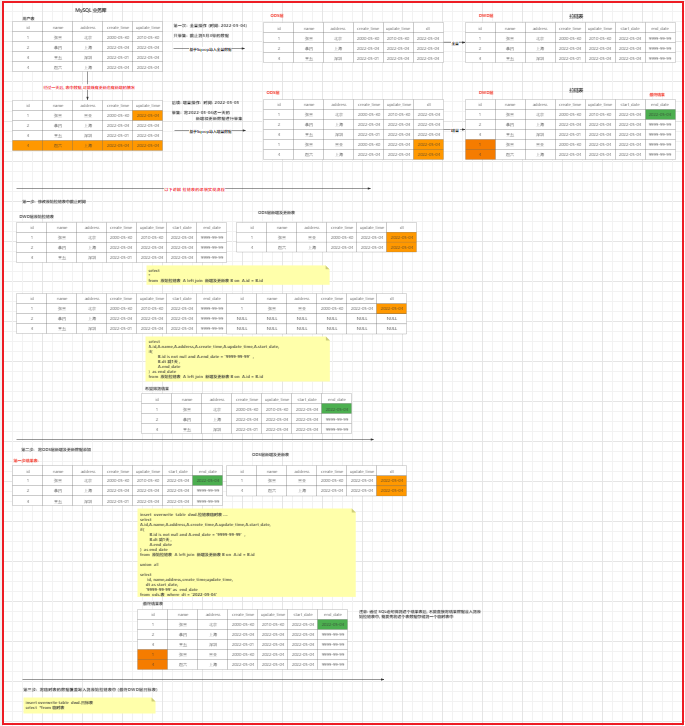

高清的图片, 查看今日的图片目录即可


### 2.5 拉链表实现操作(更新及新增表的增量操作)

店铺表:  拉链表的实现操作:

* 1- 创建店铺表的拉链临时表 (此表和目标表是完全一致的, 便于或许放置拉链后的结果数据)

```sql
DROP TABLE if exists yp_dwd.dim_store_scd2_temp; 
CREATE TABLE yp_dwd.dim_store_scd2_temp ( 
	`id` string COMMENT '主键', 
	`user_id` string, 
	`store_avatar` string COMMENT '店铺头像', 
	`address_info` string COMMENT '店铺详细地址', 
	`name` string COMMENT '店铺名称', 
	`store_phone` string COMMENT '联系电话', 
	`province_id` INT COMMENT '店铺所在省份ID', 
	`city_id` INT COMMENT '店铺所在城市ID', 
	`area_id` INT COMMENT '店铺所在县ID', 
	`mb_title_img` string COMMENT '手机店铺 页头背景图',
	`store_description` string COMMENT '店铺描述', 
	`notice` string COMMENT '店铺公告', 
	`is_pay_bond` TINYINT COMMENT '是否有交过保证金 1：是0：否', 
	`trade_area_id` string COMMENT '归属商圈ID', 
	`delivery_method` TINYINT COMMENT '配送方式 1 ：自提 ；3 ：自提加配送均可; 2 : 商家配送', 
	`origin_price` DECIMAL, 
	`free_price` DECIMAL, 
	`store_type` INT COMMENT '店铺类型 22天街网店 23实体店 24直营店铺 33会员专区店', 
	`store_label` string COMMENT '店铺logo', 
	`search_key` string COMMENT '店铺搜索关键字', 
	`end_time` string COMMENT '营业结束时间', 
	`start_time` string COMMENT '营业开始时间', 
	`operating_status` TINYINT COMMENT '营业状态 0 ：未营业 ；1 ：正在营业', 
	`create_user` string, 
	`create_time` string, 
	`update_user` string, 
	`update_time` string, 
	`is_valid` TINYINT COMMENT '0关闭，1开启，3店铺申请中', 
	`state` string COMMENT '可使用的支付类型:MONEY金钱支付;CASHCOUPON现金券支付', 
	`idCard` string COMMENT '身份证', 
	`deposit_amount` DECIMAL(11,2) COMMENT '商圈认购费用总额', 
	`delivery_config_id` string COMMENT '配送配置表关联ID', 
	`aip_user_id` string COMMENT '通联支付标识ID', 
	`search_name` string COMMENT '模糊搜索名称字段:名称_+真实名称', 
	`automatic_order` TINYINT COMMENT '是否开启自动接单功能 1：是 0 ：否', 
	`is_primary` TINYINT COMMENT '是否是总店 1: 是 2: 不是',
	`parent_store_id` string COMMENT '父级店铺的id，只有当is_primary类型为2时有效',
    `end_date` string COMMENT '结束日期'
)
comment '店铺表' 
partitioned by (start_date string) 
row format delimited fields terminated by '\t' 
stored as orc tblproperties ('orc.compress'='SNAPPY');
```

* 2- 完成拉链表的核心操作(前二步) 将结果灌入到临时表

```sql
set hive.exec.dynamic.partition.mode=nonstrict;
insert overwrite table yp_dwd.dim_store_scd2_temp partition(start_date)
select
A.id, 
A.user_id, 
A.store_avatar, 
A.address_info, 
A.name, 
A.store_phone, 
A.province_id, 
A.city_id, 
A.area_id, 
A.mb_title_img, 
A.store_description, 
A.notice, 
A.is_pay_bond, 
A.trade_area_id, 
A.delivery_method, 
A.origin_price, 
A.free_price, 
A.store_type, 
A.store_label, 
A.search_key, 
A.end_time, 
A.start_time, 
A.operating_status, 
A.create_user, 
A.create_time, 
A.update_user, 
A.update_time, 
A.is_valid, 
A.state, 
A.idcard, 
A.deposit_amount, 
A.delivery_config_id, 
A.aip_user_id, 
A.search_name, 
A.automatic_order, 
A.is_primary, 
A.parent_store_id, 
if(
    B.id is not null  and  A.end_date = '9999-99-99',
    date_add(B.dt, -1),
    A.end_date
)  as end_date, 
A.start_date 
from  yp_dwd.dim_store A  left join (select * from yp_ods.t_store where dt = '2022-05-04') B  on A.id = B.id

union all

select  
id, 
user_id, 
store_avatar, 
address_info, 
name, 
store_phone, 
province_id, 
city_id, 
area_id, 
mb_title_img, 
store_description, 
notice, 
is_pay_bond, 
trade_area_id, 
delivery_method, 
origin_price, 
free_price, 
store_type, 
store_label, 
search_key, 
end_time, 
start_time, 
operating_status, 
create_user, 
create_time, 
update_user, 
update_time, 
is_valid, 
state, 
idcard, 
deposit_amount, 
delivery_config_id, 
aip_user_id, 
search_name, 
automatic_order, 
is_primary, 
parent_store_id, 
'9999-99-99' as  end_date,
dt as start_date
from yp_ods.t_store where dt = '2022-05-04';

```

* 3- 将最终结果灌入到目标表

```sql
INSERT OVERWRITE TABLE yp_dwd.dim_store PARTITION(start_date)
select  * from yp_dwd.dim_store_scd2_temp;
```

* 4- 将临时表删除(用完清理掉)

```
drop table yp_dwd.dim_store_scd2_temp;
```


额外说明:

```
	请注意, 当前整个拉链表实施是针对历史所有数据进行拉链操作, 每一次处理,都是对历史所有的数据进行处理, 在实际工作中, 一般不会对历史所有的数据进行处理, 一般仅需要处理最近一个月, 或者最近一个季度, 或者最近一周的拉链数据, 只需要对小部分范围进行拉链维护即可
	如果在工作中, 只需要在我们当前基础上对历史拉链表中,获取一定范围内的数据即可
```


## 3- DWB层

DWB层作用:   进行维度退化操作, 形成业务宽表

​		将一个业务下相关的表汇聚称为一个表过程, 这样后续在进行统计分析的时候, 只需要关联少量的表即可完成


将多个表汇聚为一个表, 必然需要进行多表JOIN操作

### 3.1 JOIN优化

思考: 在执行Join的SQL的时候, hive会将 SQL翻译为MR, 翻译后的MR默认是如何进行Join的呢? reduce端Join操作

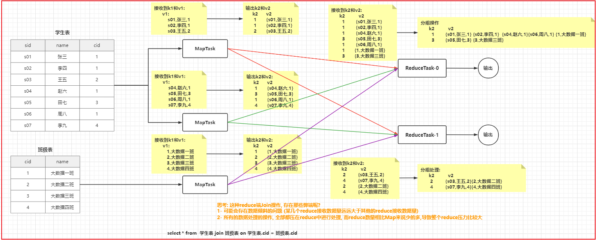

```properties
思考: 这种reduce端Join操作, 存在那些弊端呢?  
	1- 可能会存在数据倾斜的问题 (某几个reduce接收数据量远远大于其他的reduce接收数据量)
	2- 所有的数据处理的操作, 全部都压在reduce中进行处理, 而reduce数量相比Map来说少的多,导致整个reduce压力比较大
```


思考: 如何提升Join的效率呢?  思路: 能否不让reduce做这个聚合处理的事情, 能否将这项工作尝试交给MapTask呢?


#### 3.1.1 Map Join

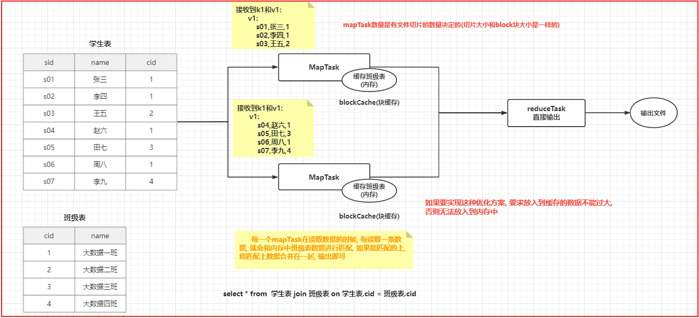

```properties
Map Join: 每一个mapTask在读取数据的时候, 每读取一条数据, 就会和内存中班级表数据进行匹配, 如果能匹配的上, 将匹配上数据合并在一起, 输出即可

好处: 将原有reduce join 问题全部都可以解决

弊端: 
    1- 比较消耗内存
    2- 要求整个 Join 中, 必须的都有一个小表, 否则无法放入到内存中

仅适用于: 小表 join 大表 | 大表 join 小表   
    在老版本(1.x以下)中, 需要将小表放置在前面, 大表放置在后面, 在新版本中, 无所谓
    建议, 如果明确知道那些表示小表, 可以优先将这些表, 放置在最前面

如何使用呢? 
      set hive.auto.convert.join=true; -- 开启 map join的支持  默认值为True
      set hive.auto.convert.join.noconditionaltask.size=20971520; -- 设置 小表数据量的最大阈值: 默认值为 20971520(20M)

如果不满足条件, HIVE会自动使用 reduce join 操作
```


#### 3.1.2 Bucket Map Join

- 中型表  和 大表  join: 

- - 方案一:   如果中型表能对数据进行提前过滤, 尽量提前过滤, 过滤后, 有可能满足了Map Join 条件 (并不一定可用)
  - 方案二: Bucket Map Join

```sql
使用条件: 
    1- Join两个表必须是分桶表
    2- 开启 Bucket Map Join 支持:  set hive.optimize.bucketmapjoin = true;
    3- 一个表的分桶数量是另一个表的分桶数量的整倍数
    4- 分桶列 必须 是 join的ON条件的列
    5- 必须建立在Map Join场景中
```

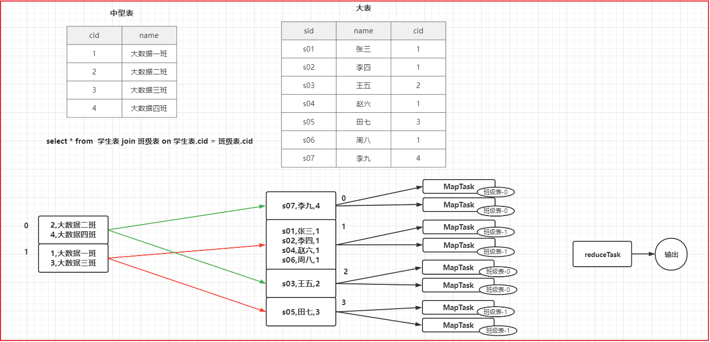

#### 3.1.3 SMB Join

- 大表 和 大表 join

- - 解决方案:  SMB Join ( sort merge bucket map join)

```sql
使用条件: 
    1- 两个表必须都是分桶表
    2- 开启 SMB Join 支持:  
        set hive.auto.convert.sortmerge.join=true;
        set hive.optimize.bucketmapjoin.sortedmerge = true;
        set hive.auto.convert.sortmerge.join.noconditionaltask=true;
   3- 两个表的分桶的数量是一致的
   4- 分桶列 必须是 join的 on条件的列, 同时必须保证按照分桶列进行排序操作
       -- 开启强制排序
       set hive.enforce.sorting=true;
       -- 在建分桶表使用: 必须使用sorted by()
  
   5-  应用在Bucket Map Join 场景中
       -- 开启 bucket map join
       set hive.optimize.bucketmapjoin = true;
   
   6- 必须开启HIVE自动尝试使用SMB 方案: 
       set hive.optimize.bucketmapjoin.sortedmerge = true;
       
 
最终汇总出来整体配置: 
    set hive.auto.convert.join=true;
    set hive.auto.convert.join.noconditionaltask.size=20971520; 
    set hive.optimize.bucketmapjoin = true;
    set hive.auto.convert.sortmerge.join=true;
    set hive.optimize.bucketmapjoin.sortedmerge = true;
    set hive.auto.convert.sortmerge.join.noconditionaltask=true;
    set hive.enforce.sorting=true;
    set hive.optimize.bucketmapjoin.sortedmerge = true;
  
建表:
  create table test_smb_2(mid string,age_id string) CLUSTERED BY(mid) SORTED BY(mid) INTO 500 BUCKETS;
  
 
至于分多少个桶: 取决于表的数据大小 和 小表阈值 之间相差了多少倍
```


### 3.2 订单明细宽表

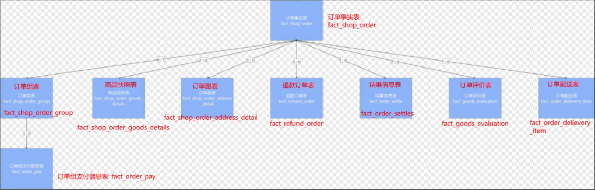

```sql
insert overwrite table bj59_yp_dwb_jiale.dwb_order_detail partition(dt)
select
    -- 订单事实表
    o.id  as order_id,
    o.order_num, 
    o.buyer_id, 
    o.store_id, 
    o.order_from, 
    o.order_state, 
    o.create_date, 
    o.finnshed_time, 
    o.is_settlement, 
    o.is_delete, 
    o.evaluation_state, 
    o.way, 
    o.is_stock_up, 
    -- 订单副表
    ad.order_amount,
    ad.discount_amount,
    ad.goods_amount,
    ad.is_delivery,
    ad.buyer_notes,
    ad.pay_time,
    ad.receive_time, 
    ad.delivery_begin_time,
    ad.arrive_store_time,
    ad.arrive_time,
    ad.create_user,
    ad.create_time,
    ad.update_user,
    ad.update_time,
    ad.is_valid,
    
    -- 订单组表:
    g.group_id,
    g.is_pay,
    
    -- 订单组支付表
    p.order_pay_amount as group_pay_amount,
    
    -- 退款表
    r.id as  refund_id,
    r.apply_date,
    r.refund_reason,
    r.refund_amount,
    r.refund_state,
    
    -- 结算表
    s.id as  settle_id,
    s.settlement_amount,
    s.dispatcher_user_id,
    s.dispatcher_money,
    s.circle_master_user_id,
    s.circle_master_money, 
    s.plat_fee,
    s.store_money,
    s.status,
    s.settle_time,
    
    -- 订单评价表
    e.id as evaluation_id,
    e.user_id as evaluation_user_id,
    e.geval_scores,
    e.geval_scores_speed,
    e.geval_scores_service,
    e.geval_isanony,
    e.create_time as evaluation_time,
    
    -- 订单配送表
    i.id as delievery_id,
    i.dispatcher_order_state,
    i.delivery_fee,
    i.distance,
    i.dispatcher_code, 
    i.receiver_name,
    i.receiver_phone,
    i.sender_name, 
    i.sender_phone, 
    i.create_time as delievery_create_time,
    
    -- 商品快照
    d.id as order_goods_id,
    d.goods_id,
    d.buy_num,
    d.goods_price,
    d.total_price,
    d.goods_name,
    d.goods_specification,
    d.goods_type,
    d.goods_brokerage,
    d.is_refund as is_goods_refund,
    
    substr(o.create_date,1,10) as  dt
from  (select * from bj59_yp_dwd_jiale.fact_shop_order where end_date = '9999-99-99') o 
    left join bj59_yp_dwd_jiale.fact_shop_order_group g on o.id = g.order_id and g.end_date = '9999-99-99'
    left join bj59_yp_dwd_jiale.fact_order_pay p  on g.group_id = p.group_id
    left join bj59_yp_dwd_jiale.fact_shop_order_goods_details d on o.id = d.order_id and d.end_date = '9999-99-99'
    left join bj59_yp_dwd_jiale.fact_shop_order_address_detail ad on o.id = ad.id and ad.end_date  = '9999-99-99'
    left join bj59_yp_dwd_jiale.fact_order_settle s on o.id = s.order_id and s.end_date  = '9999-99-99'
    left join bj59_yp_dwd_jiale.fact_refund_order r on o.id = r.order_id and r.end_date  = '9999-99-99'
    left join bj59_yp_dwd_jiale.fact_goods_evaluation e on o.id = e.order_id and e.is_valid = 1
    left join bj59_yp_dwd_jiale.fact_order_delievery_item i on o.id = i.shop_order_id and i.dispatcher_order_type = 1 and i.is_valid = 1 and i.end_date = '9999-99-99';
```


### 3.3 店铺明细宽表

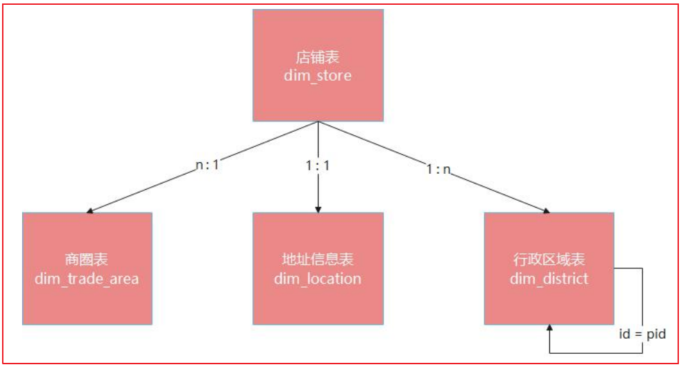

```sql
insert overwrite table bj59_yp_dwb_jiale.dwb_shop_detail partition(dt)
select
    
  -- 店铺 
  s.id , 
  s.address_info,
  s.name as store_name,
  s.is_pay_bond,
  s.trade_area_id,
  s.delivery_method,
  s.store_type ,
  s.is_primary,
  s.parent_store_id,
  -- 商圈 
  a.name as trade_area_name,
  -- 区域-店铺 
  d3.id as province_id,
  d2.id as city_id ,
  d1.id as area_id ,
  d3.name as province_name,
  d2.name as city_name,
  d1.name as area_name,
  
  substr(s.create_time,1,10)
from  (select * from bj59_yp_dwd_jiale.dim_store where end_date = '9999-99-99') s  
    left join  bj59_yp_dwd_jiale.dim_trade_area a  on s.trade_area_id  = a.id  and a.end_date = '9999-99-99'
    left join  bj59_yp_dwd_jiale.dim_location l  on s.id = l.correlation_id and l.type = 2 and  l.end_date = '9999-99-99'
    left join  bj59_yp_dwd_jiale.dim_district d1 on l.adcode = d1.id
    left join  bj59_yp_dwd_jiale.dim_district d2 on  d1.pid = d2.id
    left join  bj59_yp_dwd_jiale.dim_district d3 on  d2.pid = d3.id;
```

### 3.4 商品明细宽表(重点: 商品分类表处理)

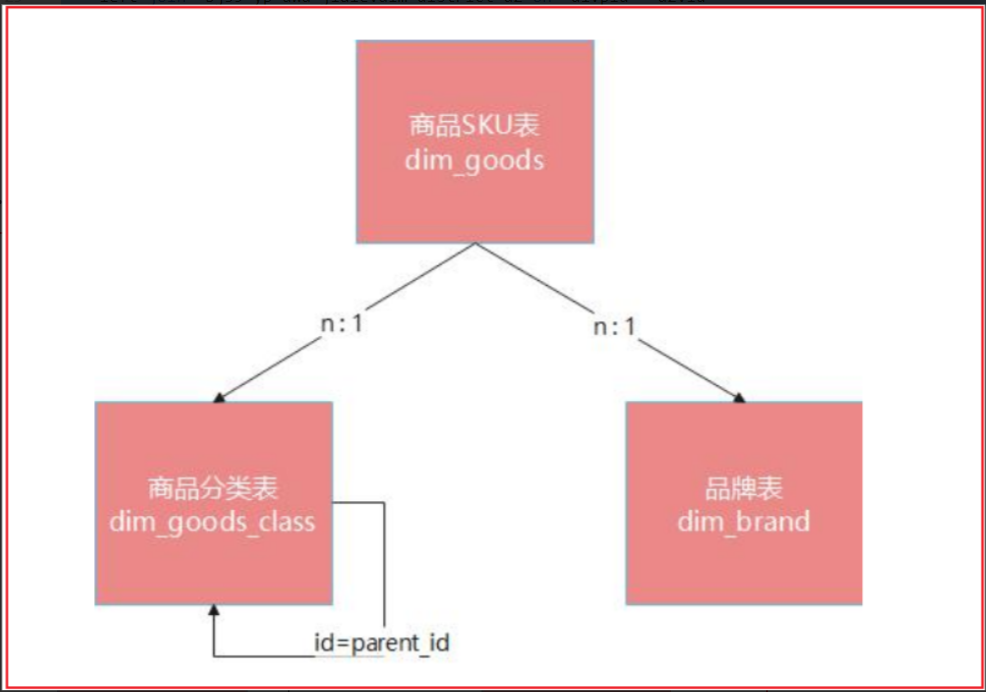

```sql
insert overwrite table bj59_yp_dwb_jiale.dwb_goods_detail partition (dt)
select
  -- 商品表
  g.id ,
  g.store_id ,
  g.class_id ,
  g.store_class_id ,
  g.brand_id ,
  g.goods_name ,
  g.goods_specification ,
  g.search_name ,
  g.goods_sort ,
  g.goods_market_price ,
  g.goods_price,
  g.goods_promotion_price,
  g.goods_storage ,
  g.goods_limit_num ,
  g.goods_unit ,
  g.goods_state ,
  g.goods_verify ,
  g.activity_type ,
  g.discount ,
  g.seckill_begin_time ,
  g.seckill_end_time ,
  g.seckill_total_pay_num, 
  g.seckill_total_num  ,
  g.seckill_price,
  g.top_it ,
  g.create_user ,
  g.create_time,
  g.update_user,
  g.update_time,
  g.is_valid ,
  -- 商品小类 
  case
     when c1.level = 3 then c1.id 
     else null end as min_class_id ,

  case
     when c1.level = 3 then c1.name 
     else null end as min_class_name ,
  -- 商品中类 
  case
     when c1.level = 2 then c1.id 
     when c2.level = 2 then c2.id
     else null end as mid_class_id ,

  case
     when c1.level = 2 then c1.name 
     when c2.level = 2 then c2.name 
     else null end as mid_class_name ,
  -- 商品大类
  case
     when c1.level = 1 then c1.id 
     when c2.level = 1 then c2.id
     when c3.level = 1 then c3.id
     else null end as max_class_id ,

  case
     when c1.level = 1 then c1.name 
     when c2.level = 1 then c2.name 
     when c3.level = 1 then c3.name
     else null end as max_class_name ,

  -- 品牌 
  b.brand_name ,
  
  substr(g.create_time,1,10) as dt

from (select * from bj59_yp_dwd_jiale.dim_goods where  end_date = '9999-99-99') g 
    left join  bj59_yp_dwd_jiale.dim_brand b on  g.brand_id = b.id and b.end_date = '9999-99-99'
    left join bj59_yp_dwd_jiale.dim_goods_class c1 on g.store_class_id = c1.id and c1.end_date ='9999-99-99'
    left join bj59_yp_dwd_jiale.dim_goods_class c2 on c1.parent_id = c2.id and  c2.end_date = '9999-99-99'
    left join bj59_yp_dwd_jiale.dim_goods_class c3 on c2.parent_id = c3.id and  c3.end_date = '9999-99-99';
    
```


## 4- DWS层

DWS层作用:   用于进行细化统计操作, 进行最细粒度统计处理, 主要目的为了后续DM层进行上卷统计的时候, 效率更高效

```
比如说:
	如果整个统计需要, 需要按照年 月  日 来统计, 在DWS层, 首先按照日进行统计操作即可, 在DM中, 基于日统计结果, 统计月 和 年
```


### 4.1 销售主题的日统计宽表

​		可分析的主要指标有：销售收入、平台收入、配送成交额、小程序成交额、安卓APP成交额、苹果APP成交额、PC商城成交额、订单量、参评单量、差评单量、配送单量、退款单量、小程序订单量、安卓APP订单量、苹果APP订单量、PC商城订单量。

​		维度有：日期、城市、商圈、店铺、品牌、大类、中类、小类。

```properties
维度组合: 
    日期: 日
    日期 + 城市
    日期 + 城市 + 商圈
    日期 + 城市 + 商圈 + 店铺
    
    日期 + 品牌 (不计算平台收入和配送收入)
    日期 + 大类 (不计算平台收入和配送收入)
    日期 + 大类 + 中类 (不计算平台收入和配送收入)
    日期 + 大类 + 中类 + 小类 (不计算平台收入和配送收入)

子母订单:  
	母订单: 订单组 , 指的用户在下单的时候,可以合并下单, 一个订单其实是包含了多个店铺的商品
	子订单: 系统角度, 接收到这个订单组以后, 需要将这个订单组拆分开, 基于店铺, 分为多个子订单, 一个子订单对应一个店铺


第一大类维度:  
    日期: 日
    日期 + 城市
    日期 + 城市 + 商圈
    日期 + 城市 + 商圈 + 店铺
  特点: 和订单都是这种一对一, 或者一对多关系
  	在一天下, 可以有多个子订单, 一个订单只能属于某一天
  	一个订单(子订单) 只会对应一个店铺, 一个店铺只会对应一个地址(城市), 一个地址只会对应一个商圈
 
第二大类维度: 
	日期 + 品牌
    日期 + 大类
    日期 + 大类 + 中类
    日期 + 大类 + 中类 + 小类
  特点:  和订单都是多对多关系
	一个子订单中可以购买一个店铺下多个产品, 而多个产品可以对应多个品牌, 一个品牌下可以有多个商品, 同样也可以对应多个订单
	一个子订单中可以购买一个店铺下多个产品,每个产品分类可能也都不一样, 一个订单会对应多个分类, 而每一个分类又可以对应多个订单
 

16 * 8 = 128 个需求指标结
```

​		分析, 当前需求统计的这些维度 和 指标, 需要涉及到那些表, 以及涉及到那些字段呢?

```properties
维度字段: 
    日期: dwb_order_detail.dt
    城市: dwb_shop_detail: city_id 和 city_name
    商圈: dwb_shop_detail: trade_area_id 和 trade_area_name
    店铺: dwb_shop_detail: id 和 store_name
    品牌: dwb_goods_detail: brand_id 和 brand_name
    大类: dwb_goods_detail: max_class_id 和 max_class_name
    中类: dwb_goods_detail: mid_class_id 和 mid_class_name
    小类: dwb_goods_detail: min_class_id 和 min_class_name
    
指标字段:  
    订单量相关指标: dwb_order_detail.order_id
    订单销售收入(销售收入, 小程序, 安卓, 苹果, pc端):dwb_order_detail.order_amount
    平台收入: dwb_order_detail.plat_fee
    配送费: wb_order_detail.delivery_fee
    
 涉及表: 
     订单明细宽表(当前主题的事实表): dwb_order_detail  (事实表)
     店铺明细宽表: dwb_shop_detail  (维度表)
     商品明细宽表: dwb_goods_detail (维度表)
 
关联条件: 
    订单表 和 店铺表:  
        订单明细宽表.store_id =  店铺明细宽表.id
    订单表 和 商品表: 
        订单明细宽表.goods_id = 商品明细宽表.id

思考: 当前这个是三种数仓模型那一种呢?  星型模型

是否需要过滤一些操作呢? 
    1-  保证必须是支付状态: is_pay =  1 
    2-  保证订单状态:  order_state 不能是 1(已下单, 没有付款) 和 7 (已取消)
```


```sql
-- 第一步: 对数据进行去重操作, 通过row_number实现
insert into  hive.yp_dws.dws_sale_daycount
with t1 as (
	select 
		-- 维度字段:
		o.dt,   -- 日期维度
		s.province_id ,
		s.province_name ,
		s.city_id ,
		s.city_name , -- 城市维度
		s.trade_area_id ,
		s.trade_area_name , -- 商圈维度
		o.store_id ,
		s.store_name , -- 店铺维度
		g.brand_id ,
		g.brand_name, -- 品牌维度
		g.max_class_id ,
		g.max_class_name , -- 大类
		g.mid_class_id ,
		g.mid_class_name ,  -- 中类
		g.min_class_id ,
		g.min_class_name ,  -- 小类
		
		-- 指标字段
		o.order_id , -- 订单id 计算订单量相关指标
		o.order_amount,  -- 订单销售收入
		o.total_price , -- 商品销售收入
		o.plat_fee , -- 平台分润
		o.delivery_fee , -- 配送费用
		
		-- 用于判断的字段
		o.order_from ,  -- 渠道(小程序, 安卓, 苹果, pc)
		o.evaluation_id , -- 评价表 id  , 判断是否有参评
		o.delievery_id , -- 配送表id, 判断是否有配送
		o.geval_scores , -- 综合评分: 10分制
		o.refund_id , -- 退款表id,判断是否有退款
		
		-- 进行去重操作:
		-- 计算 日期, 日期+城市, 日期+城市+商圈 , 日期+城市+商圈+店铺
		row_number() over(partition by o.order_id) as order_rn,
		-- 计算 日期 + 品牌 : 第一个去重计算 订单量  第二个去重 计算 销售额
		row_number() over(partition by o.order_id,g.brand_id) as brand_rn,
		row_number() over(partition by o.order_id,o.goods_id ,g.brand_id) as brand_goods_rn,
		-- 计算 日期 + 大类
		row_number() over(partition by o.order_id,g.max_class_id) as max_class_rn,
		row_number() over(partition by o.order_id,o.goods_id ,g.max_class_id) as max_class_goods_rn,
		-- 计算 日期 + 大类 + 中类
		row_number() over(partition by o.order_id,g.max_class_id,g.mid_class_id) as mid_class_rn,
		row_number() over(partition by o.order_id,o.goods_id ,g.max_class_id,g.mid_class_id) as mid_class_goods_rn,
		-- 计算 日期 + 大类 + 中类 + 小类
		row_number() over(partition by o.order_id,g.max_class_id,g.mid_class_id,g.min_class_id) as min_class_rn,
		row_number() over(partition by o.order_id,o.goods_id ,g.max_class_id,g.mid_class_id,g.min_class_id) as min_class_goods_rn
	from hive.bj59_yp_dwb_jiale.dwb_order_detail  o
		left join  hive.bj59_yp_dwb_jiale.dwb_shop_detail  s on o.store_id  = s.id
		left join  hive.bj59_yp_dwb_jiale.dwb_goods_detail g on  o.goods_id  = g.id
	where o.is_pay = 1 and  o.order_state not in(1,7)
)
select 
	-- 维度字段
	province_id, 
  	province_name , 
  	city_id  , 
  	city_name , 
  	trade_area_id  ,
  	trade_area_name  , 
  	store_id , 
  	store_name , 
  	brand_id , 
  	brand_name ,
  	max_class_id ,
  	max_class_name,
  	mid_class_id , 
 	mid_class_name, 
  	min_class_id ,
  	min_class_name, 
  	
  	-- group_type字段的值, 需要根据不同的维度分组, 标上不同的值
  	case 
  		when grouping(store_id) = 0 then 'store'
  		when grouping(trade_area_id) = 0 then 'trade_area'
  		when grouping(city_id) = 0 then 'city'
  		when grouping(brand_id) = 0 then 'brand'
  		when grouping(min_class_id) = 0 then 'min_class'
  		when grouping(mid_class_id) = 0 then 'mid_class'
  		when grouping(max_class_id) = 0 then 'max_class'
  		when grouping(dt) = 0 then 'all'
  		else 'other' 
  	end  as  group_type,
  	
  	-- 销售收入:
  	case 	
  		when grouping(store_id) = 0 then sum( if(order_rn = 1 and store_id is not null,coalesce(order_amount,0),0) )
  		when grouping(trade_area_id) = 0 then sum( if(order_rn = 1 and trade_area_id is not null,coalesce(order_amount,0),0) )
  		when grouping(city_id) = 0 then sum( if(order_rn = 1 and city_id is not null,coalesce(order_amount,0),0) )
  		when grouping(brand_id) = 0 then sum( if( brand_goods_rn = 1 and brand_id is not null,coalesce(total_price,0),0) )
  		when grouping(min_class_id) = 0 then sum( if( min_class_goods_rn = 1 and min_class_id is not null,coalesce(total_price,0),0) )
  		when grouping(mid_class_id) = 0 then sum( if( mid_class_goods_rn = 1 and mid_class_id is not null,coalesce(total_price,0),0) )
  		when grouping(max_class_id) = 0 then sum( if( max_class_goods_rn = 1 and max_class_id is not null,coalesce(total_price,0),0) )
  		when grouping(dt) = 0 then sum( if(order_rn = 1 and dt is not null,coalesce(order_amount,0),0) )
  		else NULL 
  	end  as sale_amt,
  	
  	-- 平台收入:
  	case 	
  		when grouping(store_id) = 0 then sum( if(order_rn = 1 and store_id is not null,coalesce(plat_fee,0),0) )
  		when grouping(trade_area_id) = 0 then sum( if(order_rn = 1 and trade_area_id is not null,coalesce(plat_fee,0),0) )
  		when grouping(city_id) = 0 then sum( if(order_rn = 1 and city_id is not null,coalesce(plat_fee,0),0) )
  		when grouping(brand_id) = 0 then  null 
  		when grouping(min_class_id) = 0 then null
  		when grouping(mid_class_id) = 0 then null
  		when grouping(max_class_id) = 0 then null
  		when grouping(dt) = 0 then sum( if(order_rn = 1 and dt is not null,coalesce(plat_fee,0),0) )
  		else NULL 
  	end  as plat_amt,
  	
  	-- 配送成交额
  	case 	
  		when grouping(store_id) = 0 then sum( if(order_rn = 1 and store_id is not null,coalesce(delivery_fee,0),0) )
  		when grouping(trade_area_id) = 0 then sum( if(order_rn = 1 and trade_area_id is not null,coalesce(delivery_fee,0),0) )
  		when grouping(city_id) = 0 then sum( if(order_rn = 1 and city_id is not null,coalesce(delivery_fee,0),0) )
  		when grouping(brand_id) = 0 then  null 
  		when grouping(min_class_id) = 0 then null
  		when grouping(mid_class_id) = 0 then null
  		when grouping(max_class_id) = 0 then null
  		when grouping(dt) = 0 then sum( if(order_rn = 1 and dt is not null,coalesce(delivery_fee,0),0) )
  		else NULL 
  	end  as deliver_sale_amt,
  		
  	-- 小程序成交额:
  	case 	
  		when grouping(store_id) = 0 
  			then sum( 
	  					if(
	  						order_rn = 1 and store_id is not null and order_from = 'miniapp',
	  						coalesce(order_amount,0),
	  						0
	  					) 
  					)
  		when grouping(trade_area_id) = 0 
  			then sum( 
  						if(
  							order_rn = 1 and trade_area_id is not null and order_from = 'miniapp',
  							coalesce(order_amount,0),
  							0
  						) 
  					)
  		when grouping(city_id) = 0 
  			then sum( 
  					if(
  						order_rn = 1 and city_id is not null and order_from = 'miniapp',
  						coalesce(order_amount,0),
  						0
  					) 
  				)
  		when grouping(brand_id) = 0 
  			then sum( 
  					if( 
  						brand_goods_rn = 1 and brand_id is not null and order_from = 'miniapp',
  						coalesce(total_price,0),
  						0
  					) 
  				)
  		when grouping(min_class_id) = 0 
  			then sum( 
  					if( 
  						min_class_goods_rn = 1 and min_class_id is not null and order_from = 'miniapp',
  						coalesce(total_price,0),
  						0
  					) 
  				)
  		when grouping(mid_class_id) = 0 
  			then sum( 
  					if( 
  						mid_class_goods_rn = 1 and mid_class_id is not null and order_from = 'miniapp',
  						coalesce(total_price,0),
  						0
  					) 
  				)
  		when grouping(max_class_id) = 0 
  			then sum( 
  					if( 
  						max_class_goods_rn = 1 and max_class_id is not null and order_from = 'miniapp',
  						coalesce(total_price,0),
  						0
  					) 
  				)
  		when grouping(dt) = 0 
  			then sum( 
  					if(
  						order_rn = 1 and dt is not null and order_from = 'miniapp',
  						coalesce(order_amount,0),
  						0
  					) 
  				)
  		else NULL 
  	end  as mini_app_sale_amt,

  	-- 安卓成交额
  	case 	
  		when grouping(store_id) = 0 
  			then sum( 
	  					if(
	  						order_rn = 1 and store_id is not null and order_from = 'android',
	  						coalesce(order_amount,0),
	  						0
	  					) 
  					)
  		when grouping(trade_area_id) = 0 
  			then sum( 
  						if(
  							order_rn = 1 and trade_area_id is not null and order_from = 'android',
  							coalesce(order_amount,0),
  							0
  						) 
  					)
  		when grouping(city_id) = 0 
  			then sum( 
  					if(
  						order_rn = 1 and city_id is not null and order_from = 'android',
  						coalesce(order_amount,0),
  						0
  					) 
  				)
  		when grouping(brand_id) = 0 
  			then sum( 
  					if( 
  						brand_goods_rn = 1 and brand_id is not null and order_from = 'android',
  						coalesce(total_price,0),
  						0
  					) 
  				)
  		when grouping(min_class_id) = 0 
  			then sum( 
  					if( 
  						min_class_goods_rn = 1 and min_class_id is not null and order_from = 'android',
  						coalesce(total_price,0),
  						0
  					) 
  				)
  		when grouping(mid_class_id) = 0 
  			then sum( 
  					if( 
  						mid_class_goods_rn = 1 and mid_class_id is not null and order_from = 'android',
  						coalesce(total_price,0),
  						0
  					) 
  				)
  		when grouping(max_class_id) = 0 
  			then sum( 
  					if( 
  						max_class_goods_rn = 1 and max_class_id is not null and order_from = 'android',
  						coalesce(total_price,0),
  						0
  					) 
  				)
  		when grouping(dt) = 0 
  			then sum( 
  					if(
  						order_rn = 1 and dt is not null and order_from = 'android',
  						coalesce(order_amount,0),
  						0
  					) 
  				)
  		else NULL 
  	end  as android_sale_amt,
  	
  	-- 苹果成交额
  	case 	
  		when grouping(store_id) = 0 
  			then sum( 
	  					if(
	  						order_rn = 1 and store_id is not null and order_from = 'ios',
	  						coalesce(order_amount,0),
	  						0
	  					) 
  					)
  		when grouping(trade_area_id) = 0 
  			then sum( 
  						if(
  							order_rn = 1 and trade_area_id is not null and order_from = 'ios',
  							coalesce(order_amount,0),
  							0
  						) 
  					)
  		when grouping(city_id) = 0 
  			then sum( 
  					if(
  						order_rn = 1 and city_id is not null and order_from = 'ios',
  						coalesce(order_amount,0),
  						0
  					) 
  				)
  		when grouping(brand_id) = 0 
  			then sum( 
  					if( 
  						brand_goods_rn = 1 and brand_id is not null and order_from = 'ios',
  						coalesce(total_price,0),
  						0
  					) 
  				)
  		when grouping(min_class_id) = 0 
  			then sum( 
  					if( 
  						min_class_goods_rn = 1 and min_class_id is not null and order_from = 'ios',
  						coalesce(total_price,0),
  						0
  					) 
  				)
  		when grouping(mid_class_id) = 0 
  			then sum( 
  					if( 
  						mid_class_goods_rn = 1 and mid_class_id is not null and order_from = 'ios',
  						coalesce(total_price,0),
  						0
  					) 
  				)
  		when grouping(max_class_id) = 0 
  			then sum( 
  					if( 
  						max_class_goods_rn = 1 and max_class_id is not null and order_from = 'ios',
  						coalesce(total_price,0),
  						0
  					) 
  				)
  		when grouping(dt) = 0 
  			then sum( 
  					if(
  						order_rn = 1 and dt is not null and order_from = 'ios',
  						coalesce(order_amount,0),
  						0
  					) 
  				)
  		else NULL 
  	end  as ios_sale_amt,
  	
  	-- PC成交额
  	case 	
  		when grouping(store_id) = 0 
  			then sum( 
	  					if(
	  						order_rn = 1 and store_id is not null and order_from = 'pcweb',
	  						coalesce(order_amount,0),
	  						0
	  					) 
  					)
  		when grouping(trade_area_id) = 0 
  			then sum( 
  						if(
  							order_rn = 1 and trade_area_id is not null and order_from = 'pcweb',
  							coalesce(order_amount,0),
  							0
  						) 
  					)
  		when grouping(city_id) = 0 
  			then sum( 
  					if(
  						order_rn = 1 and city_id is not null and order_from = 'pcweb',
  						coalesce(order_amount,0),
  						0
  					) 
  				)
  		when grouping(brand_id) = 0 
  			then sum( 
  					if( 
  						brand_goods_rn = 1 and brand_id is not null and order_from = 'pcweb',
  						coalesce(total_price,0),
  						0
  					) 
  				)
  		when grouping(min_class_id) = 0 
  			then sum( 
  					if( 
  						min_class_goods_rn = 1 and min_class_id is not null and order_from = 'pcweb',
  						coalesce(total_price,0),
  						0
  					) 
  				)
  		when grouping(mid_class_id) = 0 
  			then sum( 
  					if( 
  						mid_class_goods_rn = 1 and mid_class_id is not null and order_from = 'pcweb',
  						coalesce(total_price,0),
  						0
  					) 
  				)
  		when grouping(max_class_id) = 0 
  			then sum( 
  					if( 
  						max_class_goods_rn = 1 and max_class_id is not null and order_from = 'pcweb',
  						coalesce(total_price,0),
  						0
  					) 
  				)
  		when grouping(dt) = 0 
  			then sum( 
  					if(
  						order_rn = 1 and dt is not null and order_from = 'pcweb',
  						coalesce(order_amount,0),
  						0
  					) 
  				)
  		else NULL 
  	end  as pcweb_sale_amt,
	
  	--- 订单量相关指标:
  	-- 成交单量:
  	case 
  		when grouping(store_id) = 0 
  			then count(
  					if(
  						order_rn = 1 and store_id is not null,
  						order_id,
  						NULL
  					)
  				)
  		when grouping(trade_area_id) = 0 
  			then count(
  					if(
  						order_rn = 1 and trade_area_id is not null,
  						order_id,
  						NULL
  					)
  				)
  		when grouping(city_id) = 0 
  			then count(
  					if(
  						order_rn = 1 and city_id is not null,
  						order_id,
  						NULL
  					)
  				)
  		when grouping(brand_id) = 0 
  			then count(
  					if(
  						brand_rn = 1 and brand_id is not null,
  						order_id,
  						NULL
  					)
  				)
  		when grouping(min_class_id) = 0 
  			then count(
  					if(
  						min_class_rn = 1 and min_class_id is not null,
  						order_id,
  						NULL
  					)
  				)
  		when grouping(mid_class_id) = 0 
  			then count(
  					if(
  						mid_class_rn = 1 and mid_class_id is not null,
  						order_id,
  						NULL
  					)
  				)
  		when grouping(max_class_id) = 0 
  			then count(
  					if(
  						max_class_rn = 1 and max_class_id is not null,
  						order_id,
  						NULL
  					)
  				)
  		when grouping(dt) = 0 
  			then count(
  					if(
  						order_rn = 1 and dt is not null,
  						order_id,
  						NULL
  					)
  				)
  		else NULL
  	end  as  order_cnt,
  	
  	-- 参评单量:
  	case 
  		when grouping(store_id) = 0 
  			then count(
  					if(
  						order_rn = 1 and store_id is not null and evaluation_id is not null,
  						order_id,
  						NULL
  					)
  				)
  		when grouping(trade_area_id) = 0 
  			then count(
  					if(
  						order_rn = 1 and trade_area_id is not null  and evaluation_id is not null,
  						order_id,
  						NULL
  					)
  				)
  		when grouping(city_id) = 0 
  			then count(
  					if(
  						order_rn = 1 and city_id is not null  and evaluation_id is not null,
  						order_id,
  						NULL
  					)
  				)
  		when grouping(brand_id) = 0 
  			then count(
  					if(
  						brand_rn = 1 and brand_id is not null  and evaluation_id is not null,
  						order_id,
  						NULL
  					)
  				)
  		when grouping(min_class_id) = 0 
  			then count(
  					if(
  						min_class_rn = 1 and min_class_id is not null  and evaluation_id is not null,
  						order_id,
  						NULL
  					)
  				)
  		when grouping(mid_class_id) = 0 
  			then count(
  					if(
  						mid_class_rn = 1 and mid_class_id is not null   and evaluation_id is not null ,
  						order_id,
  						NULL
  					)
  				)
  		when grouping(max_class_id) = 0 
  			then count(
  					if(
  						max_class_rn = 1 and max_class_id is not null   and evaluation_id is not null,
  						order_id,
  						NULL
  					)
  				)
  		when grouping(dt) = 0 
  			then count(
  					if(
  						order_rn = 1 and dt is not null   and evaluation_id is not null,
  						order_id,
  						NULL
  					)
  				)
  		else NULL
  	end  as  eva_order_cnt,
  	
  	-- 差评单量:
  	case 
  		when grouping(store_id) = 0 
  			then count(
  					if(
  						order_rn = 1 and store_id is not null and evaluation_id is not null and geval_scores < 6,
  						order_id,
  						NULL
  					)
  				)
  		when grouping(trade_area_id) = 0 
  			then count(
  					if(
  						order_rn = 1 and trade_area_id is not null  and evaluation_id is not null  and geval_scores < 6,
  						order_id,
  						NULL
  					)
  				)
  		when grouping(city_id) = 0 
  			then count(
  					if(
  						order_rn = 1 and city_id is not null  and evaluation_id is not null  and geval_scores < 6,
  						order_id,
  						NULL
  					)
  				)
  		when grouping(brand_id) = 0 
  			then count(
  					if(
  						brand_rn = 1 and brand_id is not null  and evaluation_id is not null  and geval_scores < 6,
  						order_id,
  						NULL
  					)
  				)
  		when grouping(min_class_id) = 0 
  			then count(
  					if(
  						min_class_rn = 1 and min_class_id is not null  and evaluation_id is not null  and geval_scores < 6,
  						order_id,
  						NULL
  					)
  				)
  		when grouping(mid_class_id) = 0 
  			then count(
  					if(
  						mid_class_rn = 1 and mid_class_id is not null   and evaluation_id is not null   and geval_scores < 6,
  						order_id,
  						NULL
  					)
  				)
  		when grouping(max_class_id) = 0 
  			then count(
  					if(
  						max_class_rn = 1 and max_class_id is not null   and evaluation_id is not null  and geval_scores < 6,
  						order_id,
  						NULL
  					)
  				)
  		when grouping(dt) = 0 
  			then count(
  					if(
  						order_rn = 1 and dt is not null   and evaluation_id is not null and geval_scores < 6,
  						order_id,
  						NULL
  					)
  				)
  		else NULL
  	end  as  bad_eva_order_cnt,
  	
  	-- 配送成交单量
  	case 
  		when grouping(store_id) = 0 
  			then count(
  					if(
  						order_rn = 1 and store_id is not null and delievery_id is not null,
  						order_id,
  						NULL
  					)
  				)
  		when grouping(trade_area_id) = 0 
  			then count(
  					if(
  						order_rn = 1 and trade_area_id is not null and delievery_id is not null,
  						order_id,
  						NULL
  					)
  				)
  		when grouping(city_id) = 0 
  			then count(
  					if(
  						order_rn = 1 and city_id is not null and delievery_id is not null,
  						order_id,
  						NULL
  					)
  				)
  		when grouping(brand_id) = 0 
  			then count(
  					if(
  						brand_rn = 1 and brand_id is not null and delievery_id is not null,
  						order_id,
  						NULL
  					)
  				)
  		when grouping(min_class_id) = 0 
  			then count(
  					if(
  						min_class_rn = 1 and min_class_id is not null and delievery_id is not null,
  						order_id,
  						NULL
  					)
  				)
  		when grouping(mid_class_id) = 0 
  			then count(
  					if(
  						mid_class_rn = 1 and mid_class_id is not null  and delievery_id is not null,
  						order_id,
  						NULL
  					)
  				)
  		when grouping(max_class_id) = 0 
  			then count(
  					if(
  						max_class_rn = 1 and max_class_id is not null  and delievery_id is not null,
  						order_id,
  						NULL
  					)
  				)
  		when grouping(dt) = 0 
  			then count(
  					if(
  						order_rn = 1 and dt is not null   and delievery_id is not null,
  						order_id,
  						NULL
  					)
  				)
  		else NULL
  	end  as  deliver_order_cnt,
  	
  	-- 退款成交单量
  	case 
  		when grouping(store_id) = 0 
  			then count(
  					if(
  						order_rn = 1 and store_id is not null and refund_id is not null,
  						order_id,
  						NULL
  					)
  				)
  		when grouping(trade_area_id) = 0 
  			then count(
  					if(
  						order_rn = 1 and trade_area_id is not null and refund_id is not null,
  						order_id,
  						NULL
  					)
  				)
  		when grouping(city_id) = 0 
  			then count(
  					if(
  						order_rn = 1 and city_id is not null and refund_id is not null,
  						order_id,
  						NULL
  					)
  				)
  		when grouping(brand_id) = 0 
  			then count(
  					if(
  						brand_rn = 1 and brand_id is not null and refund_id is not null,
  						order_id,
  						NULL
  					)
  				)
  		when grouping(min_class_id) = 0 
  			then count(
  					if(
  						min_class_rn = 1 and min_class_id is not null and refund_id is not null,
  						order_id,
  						NULL
  					)
  				)
  		when grouping(mid_class_id) = 0 
  			then count(
  					if(
  						mid_class_rn = 1 and mid_class_id is not null  and refund_id is not null,
  						order_id,
  						NULL
  					)
  				)
  		when grouping(max_class_id) = 0 
  			then count(
  					if(
  						max_class_rn = 1 and max_class_id is not null  and refund_id is not null,
  						order_id,
  						NULL
  					)
  				)
  		when grouping(dt) = 0 
  			then count(
  					if(
  						order_rn = 1 and dt is not null   and refund_id is not null,
  						order_id,
  						NULL
  					)
  				)
  		else NULL
  	end  as  refund_order_cnt,
  	
  	-- 小程序成交量
  	case 
  		when grouping(store_id) = 0 
  			then count(
  					if(
  						order_rn = 1 and store_id is not null and order_from = 'miniapp',
  						order_id,
  						NULL
  					)
  				)
  		when grouping(trade_area_id) = 0 
  			then count(
  					if(
  						order_rn = 1 and trade_area_id is not null and order_from = 'miniapp',
  						order_id,
  						NULL
  					)
  				)
  		when grouping(city_id) = 0 
  			then count(
  					if(
  						order_rn = 1 and city_id is not null and order_from = 'miniapp',
  						order_id,
  						NULL
  					)
  				)
  		when grouping(brand_id) = 0 
  			then count(
  					if(
  						brand_rn = 1 and brand_id is not null and order_from = 'miniapp',
  						order_id,
  						NULL
  					)
  				)
  		when grouping(min_class_id) = 0 
  			then count(
  					if(
  						min_class_rn = 1 and min_class_id is not null and order_from = 'miniapp',
  						order_id,
  						NULL
  					)
  				)
  		when grouping(mid_class_id) = 0 
  			then count(
  					if(
  						mid_class_rn = 1 and mid_class_id is not null  and order_from = 'miniapp',
  						order_id,
  						NULL
  					)
  				)
  		when grouping(max_class_id) = 0 
  			then count(
  					if(
  						max_class_rn = 1 and max_class_id is not null  and order_from = 'miniapp',
  						order_id,
  						NULL
  					)
  				)
  		when grouping(dt) = 0 
  			then count(
  					if(
  						order_rn = 1 and dt is not null   and order_from = 'miniapp',
  						order_id,
  						NULL
  					)
  				)
  		else NULL
  	end  as  miniapp_order_cnt,
  	
  	-- 安卓成交量
  	case 
  		when grouping(store_id) = 0 
  			then count(
  					if(
  						order_rn = 1 and store_id is not null and order_from = 'android',
  						order_id,
  						NULL
  					)
  				)
  		when grouping(trade_area_id) = 0 
  			then count(
  					if(
  						order_rn = 1 and trade_area_id is not null and order_from = 'android',
  						order_id,
  						NULL
  					)
  				)
  		when grouping(city_id) = 0 
  			then count(
  					if(
  						order_rn = 1 and city_id is not null and order_from = 'android',
  						order_id,
  						NULL
  					)
  				)
  		when grouping(brand_id) = 0 
  			then count(
  					if(
  						brand_rn = 1 and brand_id is not null and order_from = 'android',
  						order_id,
  						NULL
  					)
  				)
  		when grouping(min_class_id) = 0 
  			then count(
  					if(
  						min_class_rn = 1 and min_class_id is not null and order_from = 'android',
  						order_id,
  						NULL
  					)
  				)
  		when grouping(mid_class_id) = 0 
  			then count(
  					if(
  						mid_class_rn = 1 and mid_class_id is not null  and order_from = 'android',
  						order_id,
  						NULL
  					)
  				)
  		when grouping(max_class_id) = 0 
  			then count(
  					if(
  						max_class_rn = 1 and max_class_id is not null  and order_from = 'android',
  						order_id,
  						NULL
  					)
  				)
  		when grouping(dt) = 0 
  			then count(
  					if(
  						order_rn = 1 and dt is not null   and order_from = 'android',
  						order_id,
  						NULL
  					)
  				)
  		else NULL
  	end  as  android_order_cnt,
  	
  	-- 苹果成交量
  	case 
  		when grouping(store_id) = 0 
  			then count(
  					if(
  						order_rn = 1 and store_id is not null and order_from = 'ios',
  						order_id,
  						NULL
  					)
  				)
  		when grouping(trade_area_id) = 0 
  			then count(
  					if(
  						order_rn = 1 and trade_area_id is not null and order_from = 'ios',
  						order_id,
  						NULL
  					)
  				)
  		when grouping(city_id) = 0 
  			then count(
  					if(
  						order_rn = 1 and city_id is not null and order_from = 'ios',
  						order_id,
  						NULL
  					)
  				)
  		when grouping(brand_id) = 0 
  			then count(
  					if(
  						brand_rn = 1 and brand_id is not null and order_from = 'ios',
  						order_id,
  						NULL
  					)
  				)
  		when grouping(min_class_id) = 0 
  			then count(
  					if(
  						min_class_rn = 1 and min_class_id is not null and order_from = 'ios',
  						order_id,
  						NULL
  					)
  				)
  		when grouping(mid_class_id) = 0 
  			then count(
  					if(
  						mid_class_rn = 1 and mid_class_id is not null  and order_from = 'ios',
  						order_id,
  						NULL
  					)
  				)
  		when grouping(max_class_id) = 0 
  			then count(
  					if(
  						max_class_rn = 1 and max_class_id is not null  and order_from = 'ios',
  						order_id,
  						NULL
  					)
  				)
  		when grouping(dt) = 0 
  			then count(
  					if(
  						order_rn = 1 and dt is not null   and order_from = 'ios',
  						order_id,
  						NULL
  					)
  				)
  		else NULL
  	end  as  ios_order_cnt,
  	
  	-- pc成交量
  	case 
  		when grouping(store_id) = 0 
  			then count(
  					if(
  						order_rn = 1 and store_id is not null and order_from = 'pcweb',
  						order_id,
  						NULL
  					)
  				)
  		when grouping(trade_area_id) = 0 
  			then count(
  					if(
  						order_rn = 1 and trade_area_id is not null and order_from = 'pcweb',
  						order_id,
  						NULL
  					)
  				)
  		when grouping(city_id) = 0 
  			then count(
  					if(
  						order_rn = 1 and city_id is not null and order_from = 'pcweb',
  						order_id,
  						NULL
  					)
  				)
  		when grouping(brand_id) = 0 
  			then count(
  					if(
  						brand_rn = 1 and brand_id is not null and order_from = 'pcweb',
  						order_id,
  						NULL
  					)
  				)
  		when grouping(min_class_id) = 0 
  			then count(
  					if(
  						min_class_rn = 1 and min_class_id is not null and order_from = 'pcweb',
  						order_id,
  						NULL
  					)
  				)
  		when grouping(mid_class_id) = 0 
  			then count(
  					if(
  						mid_class_rn = 1 and mid_class_id is not null  and order_from = 'pcweb',
  						order_id,
  						NULL
  					)
  				)
  		when grouping(max_class_id) = 0 
  			then count(
  					if(
  						max_class_rn = 1 and max_class_id is not null  and order_from = 'pcweb',
  						order_id,
  						NULL
  					)
  				)
  		when grouping(dt) = 0 
  			then count(
  					if(
  						order_rn = 1 and dt is not null   and order_from = 'pcweb',
  						order_id,
  						NULL
  					)
  				)
  		else NULL
  	end  as  pcweb_order_cnt,
  	
  	dt
  	
from  t1 
group by  grouping sets(
	dt,
	(dt,province_id,province_name,city_id,city_name),
	(dt,province_id,province_name,city_id,city_name,trade_area_id,trade_area_name),
	(dt,province_id,province_name,city_id,city_name,trade_area_id,trade_area_name,store_id,store_name),
	(dt,brand_id,brand_name),
	(dt,max_class_id,max_class_name),
	(dt,max_class_id,max_class_name,mid_class_id,mid_class_name),
	(dt,max_class_id,max_class_name,mid_class_id,mid_class_name,min_class_id,min_class_name)
)

```


### 4.2 数据倾斜

何为数据倾斜呢?

```properties
    在hive中, 执行一条SQL语句, 最终会被翻译为MR , MR中mapTask和reduceTask都可能存在多个, 数据倾斜主要指的整个MR中reduce阶段有多个, 每个reduce拿到的数据量并不均衡, 导致某一个或者某几个reduce拿到了比其他reduce更多的数据, 导致处理数据压力, 都集中在某几个reduce上, 形成数据倾斜问题, 导致执行时间变长, 影响执行效率
```

那么倾斜主要发送在执行SQL什么阶段呢?   执行JOIN操作  以及 执行 group by的时候


#### 4.2.1 Join 倾斜

在前序讲解reduce 端 JOIN的时候, 描述过reduce 端Join的问题, 其中就包含reduce端Join存在数据倾斜的问题

* 解决方案一:

```properties
    可以通过  Map Join  Bucket Map Join   以及  SMB Join 解决
    
    注意:  
        通过 Map Join,Bucket Map Join,SMB Join 来解决数据倾斜, 但是 这种操作是存在使用条件的, 如果无法满足这些条件,  无法使用 这种处理方案
```

* 解决方案二:

```properties
思路:  将那些产生倾斜的key和对应v2的数据, 从当前这个MR中移出去, 单独找一个MR来处理即可, 处理后, 和之前的MR进行汇总结果即可

关键问题:  如何找到那些存在倾斜的key呢?  特点: 这个key数据有很多

运行期处理方案:
    思路: 在执行MR的时候, 会动态统计每一个 k2的值出现重复的次数, 当这个重复的次数达到一定的阈值后, 认为当前这个k2的数据存在数据倾斜, 自动将其剔除, 交由给一个单独的MR来处理即可,两个MR处理完成后, 将结果基于union all 合并在一起即可
    
    实操:  
        set hive.optimize.skewjoin=true;  -- 开启运行期处理倾斜参数
        set hive.skewjoin.key=100000;   -- 阈值,  此参数在实际生产环境中, 需要调整在一个合理的值(否则极易导致大量的key都是倾斜的)
            判断依据: 总数量大量1000w, 然后共有 1000个班级, 平均下来每个班级数量大概在 1w条, 设置阈值:  大于 3w条 ~5w条范围 (超过3~5倍才认为倾斜)
        
    
    适用于: 并不清楚那个key容易产生倾斜, 此时交由系统来动态检测

编译期处理方案: 
    思路:  在创建这个表的时候, 我们就可以预知到后续插入到这个表中数据, 那些key的值会产生倾斜, 在建表的时候, 将其提前配置设置好即可, 在后续运行的时候, 程序会自动将设置的key的数据单独找一个MR来进行处理即可, 处理完成后, 再和原有结果进行union all 合并操作
    
    实操:  
        set hive.optimize.skewjoin.compiletime=true;  -- 开启编译期处理倾斜参数
        
        CREATE TABLE list_bucket_single (key STRING, value STRING) 
        -- 倾斜的字段和需要拆分的key值 
        SKEWED BY (join字段) ON (1,5,6) 
        -- 为倾斜值创建子目录单独存放 
        [STORED AS DIRECTORIES];

    适用于:  提前知道那些key存在倾斜
    
在实际生产环境中, 应该使用那种方式呢?   两种方式都会使用的
    一般来说, 会将两个都开启, 编译期的明确在编译期将其设置好, 编译期不清楚, 通过运行期动态捕获即可

```

union all 优化方案

```properties
    说明:  不管是运行期 还是编译期的join倾斜解决, 最终都会运行多个MR, 将多个MR结果通过union all 进行汇总, union all也是需要单独一个MR来处理
    
    解决方案: 
        让每一个MR在运行完成后, 直接将结果输出到目的地即可, 默认 是各个MR将结果输出临时目录, 通过 union all 合并到最终目的地
         
        开启此参数即可: 
        set hive.optimize.union.remove=true;
        
```

#### 4.2.2 group by 数据倾斜

- 为什么在group by 的时候, 可能会出现倾斜的问题呢?

```properties
假设目前有这么一个表:  

sid       sname    cid
s01       张三     c01
s02       李四     c02
s03       王五     c01
s04       赵六     c03
s05       田七     c02
s06       周八     c01
s07       李九     c01
s08       老王     c04

需求: 请计算每个班级有多少个人
select  cid,count(1) as total  from  stu  group by  cid;

翻译后MR是如何处理SQL呢?

MAP 阶段: 假设Map阶段跑了二个MapTask

mapTask1:
    k2          v2
    c01        {s01       张三     c01}
    c02        {s02       李四     c02}
    c01        {s03       王五     c01}
    c03        {s04       赵六     c03}
mapTask2:
    k2          v2
    c02        {s05       田七     c02}
    c01        {s06       周八     c01}
    c01        {s07       李九     c01}
    c04        {s08       老王     c04}


reduce阶段: 假设reduceTask有二个


reduceTask1: 接收 c01 和 c02的数据
  接收数据
     k2        v2
    c01        {s01       张三     c01}
    c02        {s02       李四     c02}
    c01        {s03       王五     c01}
    c02        {s05       田七     c02}
    c01        {s06       周八     c01}
    c01        {s07       李九     c01}
  
  分组后:
    c01      [{s01   张三  c01},{s03  王五 c01},{s06    周八    c01},{s07   李九   c01}]
    c02      [{s02   李四   c02},{s05   田七   c02}]
   
  结果数据: 
    c01     4
    c02     2
  
reduceTask2: 接收 c03 和 c04的数据
  接收数据
     k2        v2
    c03        {s04       赵六     c03}
    c04        {s08       老王     c04}
   
  分组后:
    c03        [{s04       赵六     c03}]
    c04        [{s08       老王     c04}]
    
  结果数据:
    c03     1
    c04     1

在以上整个计算流程中, 发现 其中一个reduce接收到的数据量比另一个reduce接收的数据量要多的多, 认为出现了数据倾斜的问题, 所以group by 也有可能产生数据倾斜
```

思考: 如何解决group by的数据倾斜呢?

- 解决方案一:  基于MR的 combiner(规约, 提前聚合) 减少数据达到reduce数量, 从而减轻倾斜问题

```properties
假设目前有这么一个表:  

sid       sname    cid
s01       张三     c01
s02       李四     c02
s03       王五     c01
s04       赵六     c03
s05       田七     c02
s06       周八     c01
s07       李九     c01
s08       老王     c04

需求: 请计算每个班级有多少个人
select  cid,count(1) as total  from  stu  group by  cid;

翻译后MR是如何处理SQL呢?

MAP 阶段: 假设Map阶段跑了二个MapTask

mapTask1:
    k2          v2
    c01        {s01       张三     c01}
    c02        {s02       李四     c02}
    c01        {s03       王五     c01}
    c03        {s04       赵六     c03}
规约(提前聚合)操作: 处理逻辑与reduce处理逻辑一直
  分组: 
     c01    [{s01       张三     c01},{s03       王五     c01}]  
     c02    [{s02       李四     c02}]
     c03    [{s04       赵六     c03}]
  
  聚合得出结果:
      c01     2
      c02     1
      c03     1
   
mapTask2:
    k2          v2
    c02        {s05       田七     c02}
    c01        {s06       周八     c01}
    c01        {s07       李九     c01}
    c04        {s08       老王     c04}

规约(提前聚合)操作: 处理逻辑与reduce处理逻辑一直
  分组: 
     c01    [{s06       周八     c01},{s07       李九     c01}]  
     c02    [{s05       田七     c02}]
     c04    [{s08       老王     c04}]
  
 聚合得出结果:
      c01     2
      c02     1
      c04     1


reduce阶段: 假设reduceTask有二个


reduceTask1: 接收 c01 和 c02的数据
  接收数据
     k2        v2
     c01       2
     c02       1
     c01       2
     c02       1
     
  分组后:
    c01      [2,2]
    c02      [1,1]
   
  结果数据: 
    c01     4
    c02     2
  
reduceTask2: 接收 c03 和 c04的数据
  接收数据
     k2        v2
     c03       1
     c04       1
      
   
  分组后:
    c03        [1]
    c04        [1]
    
  结果数据:
    c03     1
    c04     1
    
  
 通过规约来解决数据倾斜, 处理完成后, 发现 两个reduce中从原来相差 3倍, 变更为相差 2倍, 减轻了数据倾斜问题
 
 
 如何配置呢? 
     只需要在HIVE中开启combiner提前聚合配置参数即可:  
         set hive.map.aggr=true;
```

- 方案二:  负载均衡的解决方案(需要运行两个MR来处理)  (大combiner方案)

```sql
假设目前有这么一个表:  

sid       sname    cid
s01       张三     c01
s02       李四     c02
s03       王五     c01
s04       赵六     c03
s05       田七     c02
s06       周八     c01
s07       李九     c01
s08       老王     c04

需求: 请计算每个班级有多少个人
select  cid,count(1) as total  from  stu  group by  cid;

翻译后MR是如何处理SQL呢?

第一个MR的操作: 对数据进行打散

Map 阶段:  假设运行了两个MapTask

mapTask1:
    k2          v2
    c01        {s01       张三     c01}
    c02        {s02       李四     c02}
    c01        {s03       王五     c01}
    c03        {s04       赵六     c03}
mapTask2:
    k2          v2
    c02        {s05       田七     c02}
    c01        {s06       周八     c01}
    c01        {s07       李九     c01}
    c04        {s08       老王     c04}
    

mapTask执行完成后, 在进行分发数据到达reduce, 默认情况下将相同k2的数据发往同一个reduce, 目前采用为随机分发, 保证每一个reduce拿到相等数量的数据信息(负载过程, 让每一个reduce接收到相同数量的数据)


reduce阶段: 假设有两个reduceTask

reduceTask1:
    接收到数据:  
        c01        {s01       张三     c01}
        c02        {s02       李四     c02}
        c01        {s03       王五     c01}
        c01        {s06       周八     c01}
    分组操作: 
        c01    [{s01       张三     c01},{s03       王五     c01},{s06       周八     c01}]
        c02    [{s02       李四     c02}]
        
    输出结果: 
        c01     3
        c02     1


reduceTask2:
    接收到数据:
        c03        {s04       赵六     c03}
        c02        {s05       田七     c02}
        c01        {s07       李九     c01}
        c04        {s08       老王     c04}
    
    分组操作: 
        c03        [{s04       赵六     c03}]
        c02        [{s05       田七     c02}]
        c01        [{s07       李九     c01}]
        c04        [{s08       老王     c04}]
     
    输出结果:
        c01     1
        c02     1
        c03     1
        c04     1

第一个MR执行完成了, 每个reduce都接收到四条数据, 自然也就不存在数据倾斜的问题了

第二个MR进行处理:  严格按照相同k2发往同一个reduce

Map 阶段:  假设有二个mapTask


mapTask1:  
    k2      v2
    c01     3
    c01     1
    c02     1

mapTask2:
    k2      v2
    c02     1
    c03     1
    c04     1
    
reduce阶段:   假设有两个reduce


reduceTask1: 接收 c01 和 c02 数据
  接收数据:  
     k2     v2
     c01     3
     c01     1
     c02     1
     c02     1
  结果:
     c01    4
     c02    2
  
reduceTask2: 接收 c03 和c04
  接收数据:  
     k2     v2
     c03     1
     c04     1
     
  结果:
     c03     1
     c04     1


通过负载均衡方式来解决数据倾斜, 同样也可以减轻数据倾斜的压力


细细发现, 方案一 和 方案二, 是有类似之处的, 方案一, 让每一个mapTask内部进行提前聚合, 然后到达reduce进行汇总合并得出结构, 方案二: 让第一个MR进行打散并对数据进行聚合计算 得出局部结果, 然后让第二个MR进行最终聚合计算操作, 得出最终结果


说明: 方案二, 比方案一, 更能彻底解决数据倾斜问题, 因为其处理数据范围更大, 整个整个数据集来处理, 而方案一, 只是每个MapTask处理, 仅仅局部处理

如何使用方案二: 
    只需要开启负载均衡的HIVE参数配置即可:
        set hive.groupby.skewindata=true;

这两种方式:  建议在生产中, 优先使用第一种, 如果第一种无法解决, 尝试使用第二种解决


注意事项:   使用第二种负载均衡的解决group by 的数据倾斜, 一定要注意, SQL语句中不能出现多次  distinct操作, 否则 HIVE会直接报错的
    错误信息: 
        Error in semantic analysis: DISTINCT on different columns not supported with skew in data.
    比如说: 
        SELECT ip, count(DISTINCT uid), count(DISTINCT uname) FROMlog GROUP BY ip   此操作就直接报错了,只能使用方案一解决数据倾斜
```

倾斜的参数配置开启条件, 一定是出现了数据倾斜的问题, 如果没有出现 不需要开启的

- 方式一:  通过Yarn查看(运行过程中) 或者 jobhistory查看(已经结束的程序)  (此操作, 只能在本地演示查看, 云端环境没有开启yarn端口, 无法查看的)

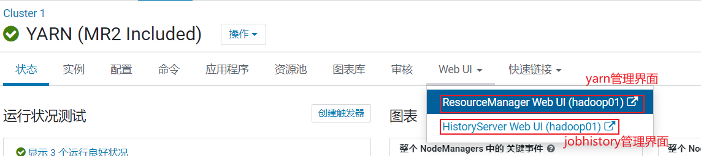

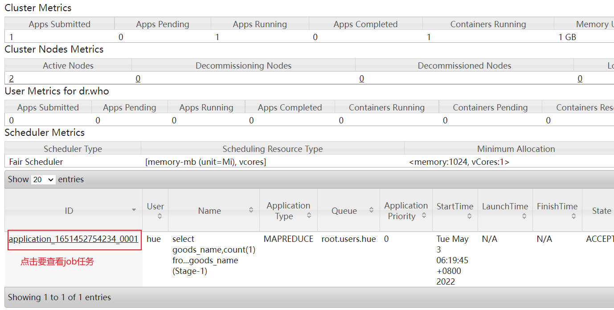

运行的时候点击: 

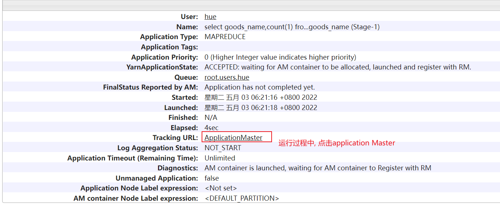

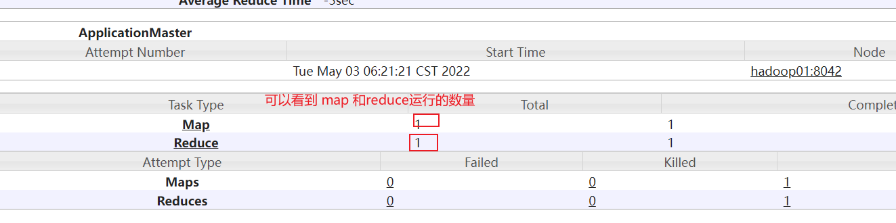

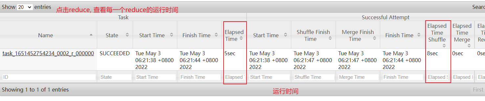

```properties
目前, 我们这里可能只有一个reduce, 但是实际上生产环境中, 此位置可能会有多个reduceTask, 我们需要观察每个reduceTask执行时间, 如果发现其中一个或者几个reduce执行时间, 远远大于其他的reduceTask执行时间, 那么说明存在数据倾斜的问题
```

如果程序以及运行完成了, 想查看刚刚运行的各个reduceTask时间:  使用jobHistory

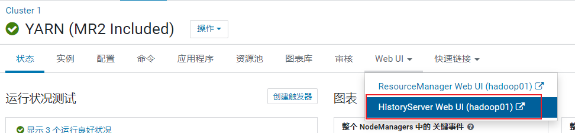

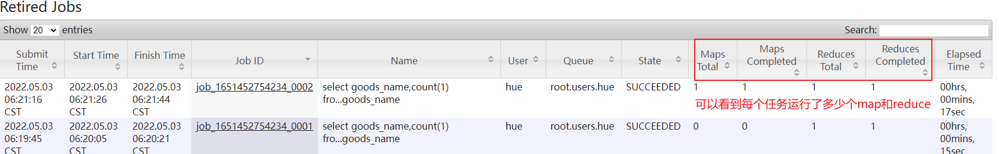

点击对应需要查看的任务: 

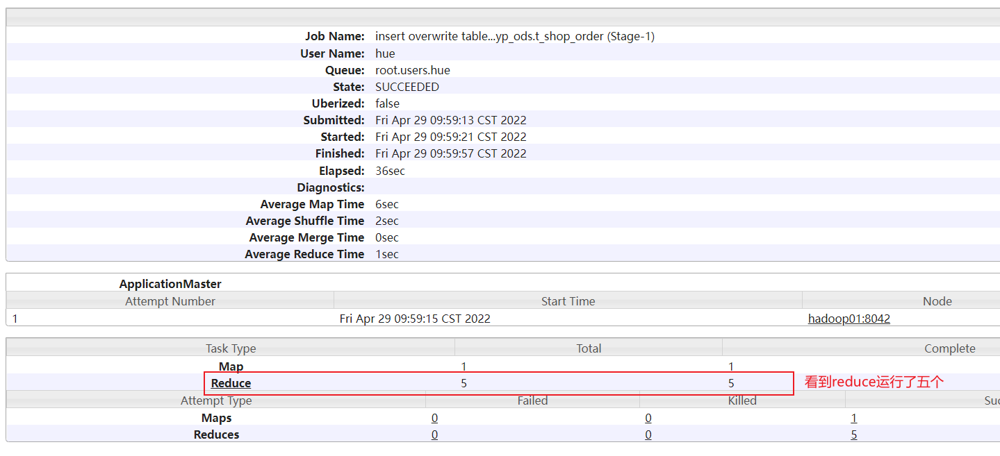

点击reduce进入:

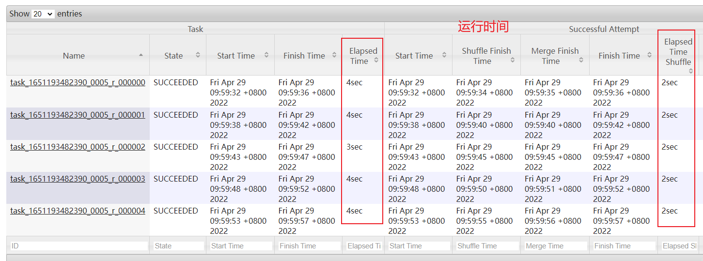


- 方案二:  通过 HUE方式也可以查看 (可以在云平台中查看)


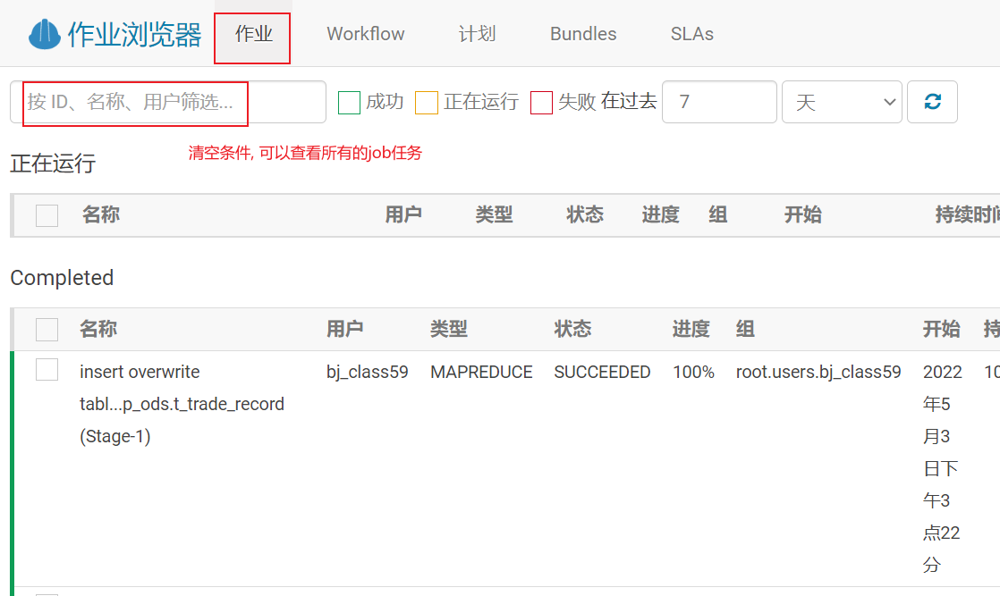

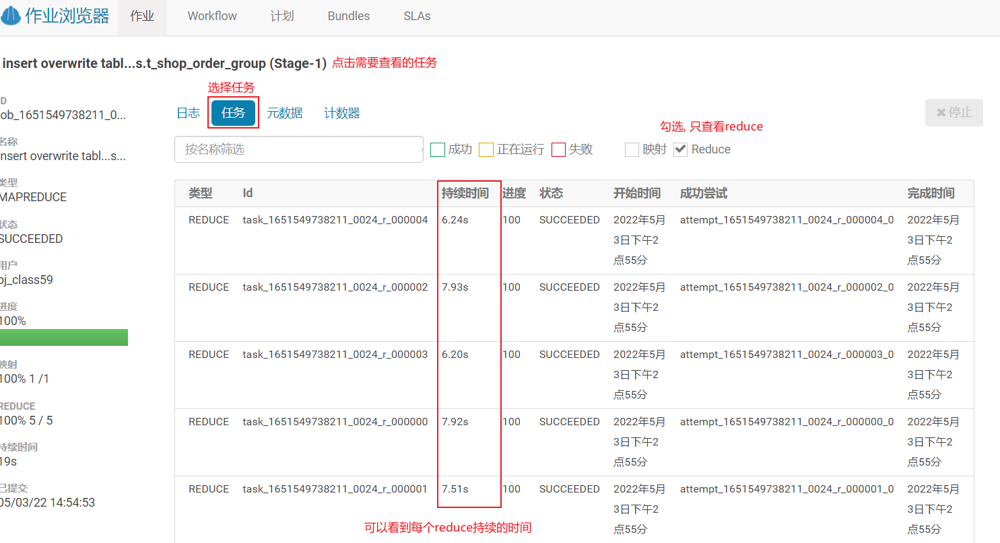


### 4.3  HIVE的索引

为什么说, 索引可以加快查询效率?  思路说明

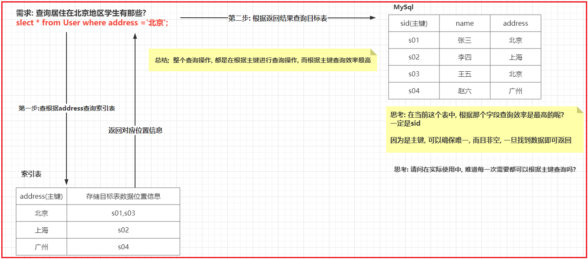

* 1. hive的原始索引(废弃)

```properties
	hive的原始索引可以针对某个列 或者某几个列构建索引信息, 构建后提升指定列的查询效率, 存在弊端: hive原始索引不会自动更新, 每次表中数据发生变化后, 都是需要手动重建索引操作, 比较耗费资源, 整体提升性能效果一般
	所有在hive3.x版本已经直接将这种索引废弃掉, 无法使用了, 及时在生产中使用是hive1.x或者hive2.x版本的 不建议优先使用原始索引
```

* 2. hive的row group index (行组索引)

```properties
	条件:
		1) 要求表的存储类型必须为ORC存储格式
		2) 在创建表的时候, 必须开启 row group index 索引支持
			’orc.create.index’=’true’
		3) 在插入数据的时候, 必须保证需要进行索引列, 按序插入操作
		4) 主要针对的数值类型的
	思路:
		插入数据到ORC表后, 会自动进行划分为多个script片段, 每个片段内部, 会保存着每个字段的最小 最大值, 这样当执行查询  >  <  = 的条件筛选操作的时候, 根据最大最小值锁定相关script, 从而减少数据扫描量, 提升效率
		
	操作:
		CREATE TABLE lxw1234_orc2 (...) stored AS ORC
        TBLPROPERTIES
        (
            'orc.compress'='SNAPPY',
        --     开启行组索引
            'orc.create.index'='true'
        )
     	插入数据: 
        insert into table lxw1234_orc2
        SELECT CAST(siteid AS INT) AS id,
        pcid
        FROM lxw1234_text
        --     插入的数据保持排序
        DISTRIBUTE BY id sort BY id;
        
     使用:
     	select * from lxw1234_orc2 where siteid >100 ;  --自动应用行组索引了

```

* 3. bloom filter index (布隆过滤索引, 开发过滤索引)

```properties
	思路:
		在开启布隆过滤索引后, 可以针对某个列,或者某几个列来建立索引, 构建索引后, 会在将这一列的数据的值存储在对应script片段的索引信息中, 这样当进行=值查询数据的时候, 首先会到每一个script片段判断是否有这个值, 如果没有, 直接跳过这个script, 从而减少数据扫描量, 提升效率
		
	条件:
		1) 要求表的存储类型必须为ORC存储格式
		2) 在建表的时候, 必须设置为那些列构建布隆索引
		3) 仅能适用于 等值过滤查询操作
	
	操作: 
		CREATE TABLE lxw1234_orc2 stored AS ORC
        TBLPROPERTIES
        (
            'orc.compress'='SNAPPY',
            'orc.create.index'='true',  --行组索引
        --     pcid字段开启BloomFilter索引
            "orc.bloom.filter.columns"="pcid,name,..."
        )
        
     使用:
     	select * from 表  where name = '张三' and age >10  就会使用布隆索引+ 行组索引
```


在什么时候可以使用呢?

```properties
1- 对于行组索引, 我们建议只要数据存储格式为ORC 建议将这种索引全部开启,至于导入数据的时候, 如果能保证有序, 那最好,如果保证不了也无所谓, 大不了这个索引效率不是特别好

2- 对于布隆索引, 建议将后续会大量用于等值连接的操作字段, 建立成布隆索引, 比如说 join的字段. end_date字段
```


### 4.4 Presto中特殊优化

```properties
1) 在进行group by 操作的时候,如果分组字段比较多,  将分组字段中, 通过distinct去重后, 值比较多的字段放置在前面, 比较少往后放置
好处: 可以被分为更多的组, 让更多的worker参与计算操作

比如说: 
select  from 表 group by  uid,sex; 
说明: 一个表中 uid的值有很多的不同, 但是 sex一般只有二个值, 此时将UID放置在最前面, 这样好处是presto在进行任务分配的时候, 可以让更多的worker参与进行计算操作

2) 在进行JOIN操作的时候, 要将大表放置join前面. 小表放置在Join后面

3) 尽量使用正则替换掉SQL中like查询操作

4) presto对于ORC的存储格式, 以及内置类似于索引优化措施了, 专门用特殊处理, 不需要单独设置

5) presto支持挂载缓冲器, 通过缓冲器也可以在一定程度上提升presto的效率 (了解)
```

