# day01_hbase课程笔记

今日内容:

* 

## 1. hbase的基本介绍

* 为什么产生HBase

```properties
	思考: HDFS主要适用于什么场景呢? 具有高的吞吐量 适合于批量数据的处理操作
	
	思考: 如果想在HDFS上, 直接读取HDFS上某一个文件中某一行数据, 请问是否可以办到呢?  
		  或者说, 我们想直接修改HDFS上某一个文件中某一行数据,请问是否可以办到呢?
		 
	HDFS并不支持对文件中数据进行随机的读写操作, 仅支持追加的方式来写入数据
	
	
	假设, 现在有一个场景: 数据量比较大, 需要对数据进行存储, 而且后续需要对数据进行随机读写的操作, 请问如何做呢? 
		此时HDFS并不合适了, 此时需要有一款软件能够帮助存储海量的数据, 并且支持高效的随机读写的特性, 此时HBase就是在这样的背景下产生了
```

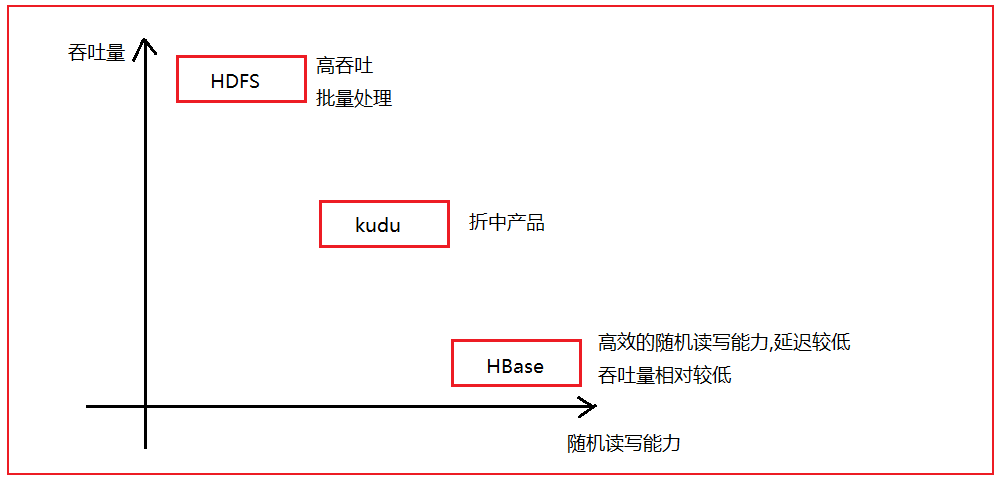

​	HBase是采用java语言编写的一款 apache 开源的基于HDFS的nosql型数据库,不支持 SQL, 不支持事务, 不支持Join操作,没有表关系

​	既然是基于HDFS的, 那么也就意味HBase的数据**最终**是存在HDFS上, 在启动HBase集群之前, 必须要先启动HDFS

​	HBase仅支持三种数据读取方案: 

```properties
1- 基于 rowkey(行键|主键)读取 
2- 基于 rowkey的range范围读取
3- 扫描全表数据
```

​	不支持事务, 仅支持单行事务

​	主要存储结构化数据以及半结构化的数据

​	HBase中数据存储都是以字节的形式来存储的

​	hbase易于扩展的


HBase的表具有三大特征:

* 1- 大: 在一个表中可以存储上十亿行的数据, 可以拥有上百万个列
* 2- 面向列: 是基于**列族**进行管理操作, 基于列族进行列式存储方案
* 3- 稀疏性: 在HBase中, 对于NULL值的数据, 不占用任何的磁盘空间的, 对效率也没有任何的影响, 所以表可以设计的非常稀疏

HBase的应用场景:

* 1- 数据量比较庞大的
* 2- 数据需要具备随机读写特性
* 3- 数据具有稀疏性特性

当以后工作中, 如果发现数据具备了以上二个及以上的特性的时候, 就可以尝试使用HBase来解决了


## 2. hbase和其他软件的区别

### 2.1 hbase和RDBMS的区别

HBase:  具有表, 存在rowkey, 分布式存储, 不支持SQL,不支持Join, 没有表关系, 不支持事务(仅支持单行事务)

MySQL(RDBMS):  具有表, 存在主键, 单机存储,支持SQL,支持Join, 存在表关系, 支持事务

### 2.2 hbase 和 HDFS的区别

HBase:  基于hadoop, 和 HDFS是一种强依赖关系, HBase的吞吐量不是特别高, 支持高效的随机读写特性

HDFS:  具有高的吞吐量, 适合于批量数据处理, 主要应用离线OLAP, 不支持随机读写


​		HBase是基于HDFS, 但是HDFS并不支持随机读写特性, 但是HBase却支持高效的随机读写特性, 两者貌似出现了一定的矛盾关系, 也就意味着HBase中必然做了一些特殊的处理工作

### 2.3 hbase和hive的区别

HBase: 基于HADOOP 是一个存储数据的nosql型数据库, 延迟性比较低, 适合于接入在线业务(实时业务)

HIVE:  基于HADOOP 是一个数据仓库的工具, 延迟性较高, 适用于离线的数据处理分析操作


​		HBase和hive都是基于hadoop的不同的软件, 两者之间可以共同使用, 可以使用hive集成HBase, 这样hive就可以读取hbase中数据, 从而实现统计分析操作

## 3.  hbase的安装操作

在安装过程中, 如果启动失败了, 一般出现的错误的位置:

* 1) 在hbase-env.sh中没有将注释打开
* 2) 在hbase-site.xml中 没有修改 zookeeper的存储的路径
* 3) 没有将jar包(htrace-core-3.1.0-incubating.jar)拷贝到hbase的lib的目录下
* 4) zookeeper或者 hadoop没有启动良好

如果以上四个都没有问题,停止hbase(kill -9),  将元数据删除, 重启hbase即可:

```properties
如何删除元数据: 主要删除两个位置
1) zookeeper:  
	进入zookeeper的bin目录中:
	./zkCli.sh 回车
	执行:  rmr /hbase
2) hdfs中:
	在Linux的shell窗口下执行:  hdfs dfs -rm -r /hbase
```


如何启动hbase:

```properties
1) 启动zookeeper: 三个节点都要执行
	进入zookeeper的bin目录:
	执行: ./zkServer.sh start
	查看状态: 
		jps  (每次启动zookeeper 都可以查看)
		./zkServer.sh  status  (此操作, 三个节点执行完成后测试)  必须看到两个follower 一个 leader存在
2) 启动hadoop集群:  
	在node1的任意路径下执行  start-all.sh
	检查:
		通过jps:  
			node1:  namenode,datanode. resourceManager  nodemanager
			node2:  datanode nodemanager seconderyNamenode
			node2:  datanode nodemanager
		通过浏览器查看:
			node1:50070   主要看安全模式是否退出, 以及激活datanode是否为3
			node1:8088    主要是激活节点是为3
3) 启动hbase:
	在node1的任意路径下执行: start-hbase.sh
	
	检查:
		通过jps查看:
			node1:  HMaster 和 HregionServer
			node2: HregionServer
			node3: HregionServer
		注意: 可能等待一会, 有可能宕机, 此时通过日志查看: log目录下 
			看日志命令: tail -200f  日志文件
		
	访问:
		node1:16010  此时可能会看到 500  错误描述为 master init... 等待一会  重新访问即可, 如果长久一直这样, 重启试试 如果重启不行, 尝试按照之前易错点进行排查即可
```


## 4. hbase的表模型

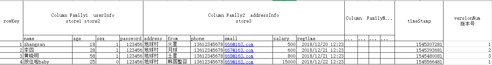

* rowkey : 行键  , 理解为mysql中主键 , 只不过叫法不同而已

```properties
1) 在hbase中, rowkey的长度最长为64KB,但是在实际使用中, 一般长度在 0~100个字节, 常常的范围集中在 10~30区间
2) 在hbase中, 表中数据都是按照rowkey来进行排序, 不关心插入的顺序. 排序规则为 字典序的升序排列
		请将以下内容, 按照字典序的升序排序:  
			1 2 10 245 3 58 11 41 269 3478 154 
		排序结果为:
			1 10 11 154 2 245 269 3 3478 41 58 
		字典序规则: 
			先看第一位, 如果一致看第二位, 以此类推, 没有第二位的要比有第二位要小,其他位置也是一样的
3) 查询数据的方式, 主要有三种:
	基于rowkey的查询
	基于rowkey范围查询
	扫描全表数据
4) rowkey也是具备唯一性和非空性
```

* column family: 列族(列簇)

```properties
1) 在一个表中, 是可以有多个列族的, 但是一般建议列族越少越好, 能用一个解决, 坚决不使用多个
2) 在hbase中, 都是基于列族的管理和存储的 (是一个列式的存储方案)
3) 一个列族下, 可以有多个列名 . 可以达到上百万个
4) 在创建表的时候, 必须制定表名 和 列族名
```

* column  qualifier: 列名(列限定符号)

```properties
1) 一个列名必然是属于某一个列族的, 在一个列族下是可以有多个列名的
2) 列名不需要在创建表的时候指定, 在插入数据的时候, 动态指定即可
```

* timeStamp : 时间戳

```properties
   每一个单元格背后都是具有时间戳的概念的, 默认情况下, 时间戳为插入数据的时间, 当然也可以自定义
```

* versions: 版本号

```properties
1) 在hbase中, 对于每一个单元格, 都是可以记录其历史变更行为的, 通过设置version版本数量, 表示需要记录多少个历史版本, 默认值为 1

2) 当设置版本数量为多个的时候, 默认展示的离当前时间最近的版本的数据
```

* cell : 单元格

```properties
	如何确定一个唯一的单元格呢?  rowkey +  列族 + 列名 + 值
```


## 5. hbase的相关操作_shell命令

### 5.1 hbase的基本shell操作

* 1) 如何进入hbase的shell客户端

```properties
在三个节点任意一个节点的任意一个目录下, 执行:
hbase  shell
```

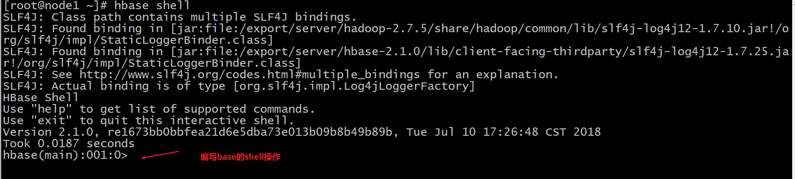

* 2) 查看整个集群的状态信息

```properties
status
```

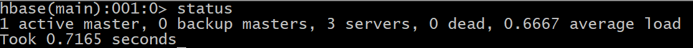

* 3) 如何查看帮助文档信息

```properties
查看整个帮助文档
help 

查看某一个具体的命令如何使用
help '命令名称'
```

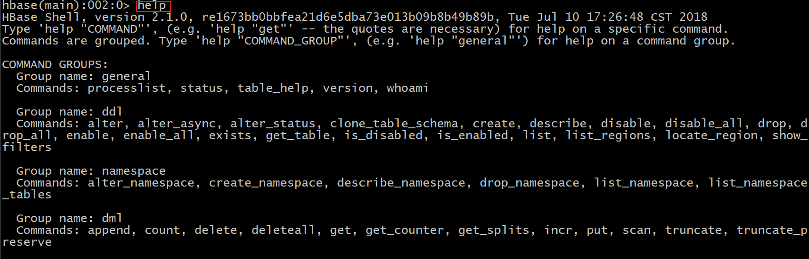

* 4) 如何查看当前hbase中有那些表呢?

```properties
list
```

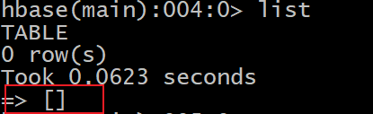

* 5) 如何创建一张表

```properties
格式:
	create '表名','列族1','列族2' ....
	或者
	create '表名',{NAME=>'列族1'},{NAME=>'列族2'} ....
```

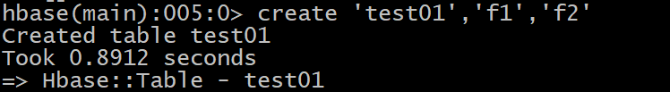

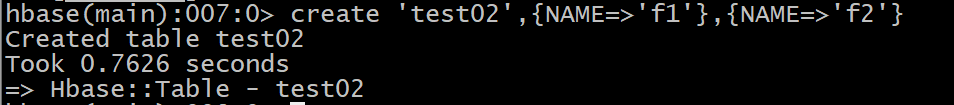

* 6) 如何向表中插入数据

```properties
格式: 
	put '表名','rowkey名称','列族名:列名','值'
```

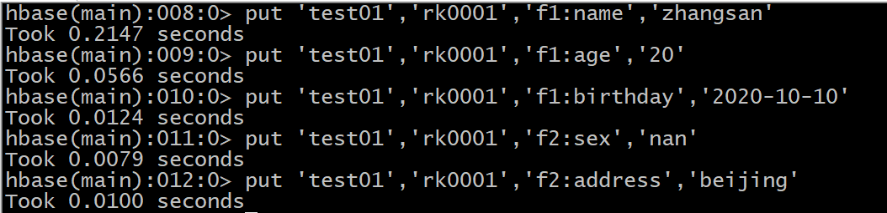

* 7) 如何从表中获取某一条数据呢?  基于rowkey查询

```properties
格式:
	get '表名','rowkey名称', ['列族' | '列族:列名' ....]
	
说明:
	[] 表示是可选
```

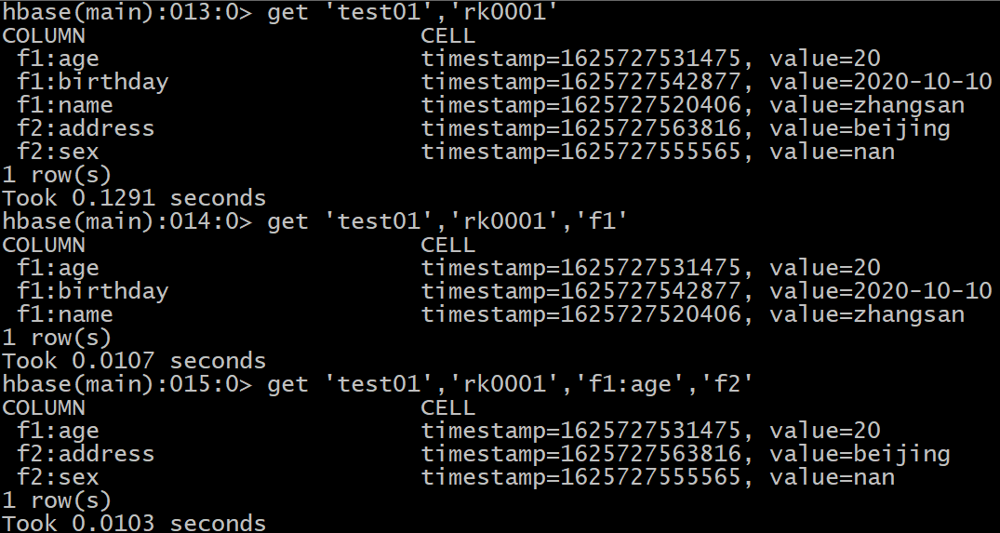

* 8) 如何修改数据呢?   修改数据的操作 与 添加数据的操作是一致的, 只需要保证rowkey一样 就是修改数据

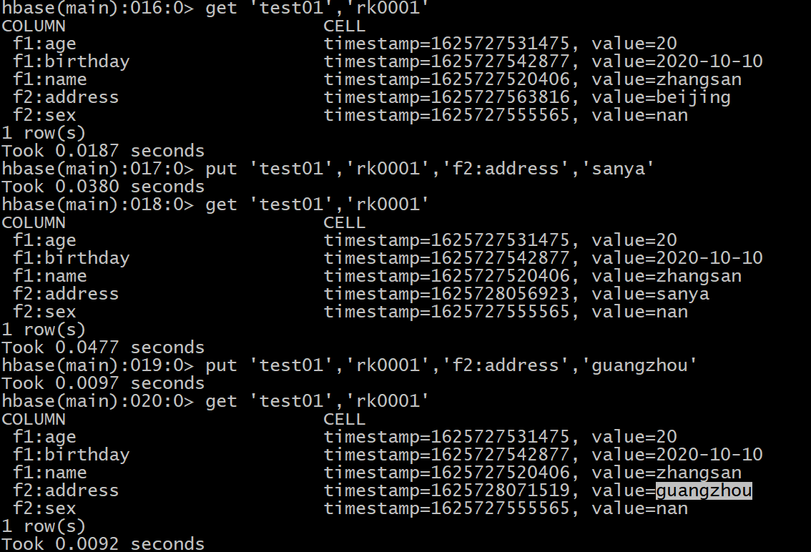

* 9) 如何删除数据的操作: 

```properties
格式: 
	delete '表名','rowkey名称','列族:列名'
		
	deleteall '表名','rowkey名称','列族:列名'
	
    truncate '表名' 清空表
说明:
	1) delete操作, 仅支持删除某一个列下的数据, 仅会删除当前这个版本, 恢复上一个版本
	2) deleteall操作, 在删除某一个列数据的时候, 直接将其所有的历史版本全部都删除
	3) deleteall操作, 在不指定列族和列名, 仅指定rowkey的时候, 删除整行

说明:
	deleteall操作在hbase2.x以上的版本提供的

注意:
	truncate操作 一般不使用, 因为此操作在重新建表的时候, 会与原来的表不一致. 比如一些设置参数信息,执行truncate全部都还原了
```

* 10) 如何删除表

```properties
格式:
	drop '表名'

注意: 在删除hbase表之前, 必须要先禁用表

禁用表:  disable  '表名'
启动表: enable '表名'
判断表是否启用: is_enabled '表名'
判断表是否禁用: is_disabled '表名'
```

* 11) 如何查看表的结构

```properties
格式:
	describe  '表名'
```

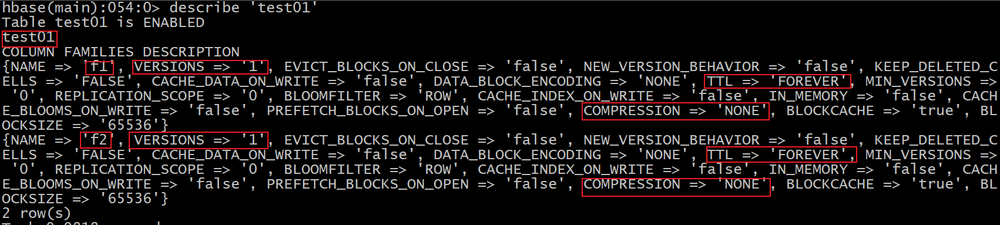

* 12) 如何查看表中有多少条数据:

```properties
count '表名'
```

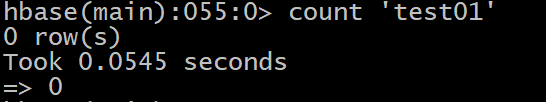

* 13) 如何通过扫描的方式查询数据, 以及根据范围查询数据

```properties
准备工作:  插入一部分数据
put 'test01','rk0001','f1:name','zhangsan'
put 'test01','rk0001','f1:age','20'
put 'test01','rk0001','f1:birthday','2020-10-10'
put 'test01','rk0001','f2:sex','nan'
put 'test01','rk0001','f2:address','beijing'

put 'test01','rk0002','f1:name','lisi'
put 'test01','rk0002','f1:age','25'
put 'test01','rk0002','f1:birthday','2005-10-10'
put 'test01','rk0002','f2:sex','nv'
put 'test01','rk0002','f2:address','shanghai'

put 'test01','rk0003','f1:name','王五'
put 'test01','rk0003','f1:age','28'
put 'test01','rk0003','f1:birthday','1993-10-25'
put 'test01','rk0003','f2:sex','nan'
put 'test01','rk0003','f2:address','tianjin'

put 'test01','0001','f1:name','zhaoliu'
put 'test01','0001','f1:age','25'
put 'test01','0001','f1:birthday','1995-05-05'
put 'test01','0001','f2:sex','nan'
put 'test01','0001','f2:address','guangzhou'

格式:
	scan '表名' , {COLUMNS=>['列族' | '列族:列名' ....], STARTROW=>'起始rowkey值' ,ENDROW=>'结束rowkey值', FORMATTER=>'toString',LIMIT=>N}

注意
	此处 []  是格式要求, 必须存在了
	范围检索是包头不包尾
```

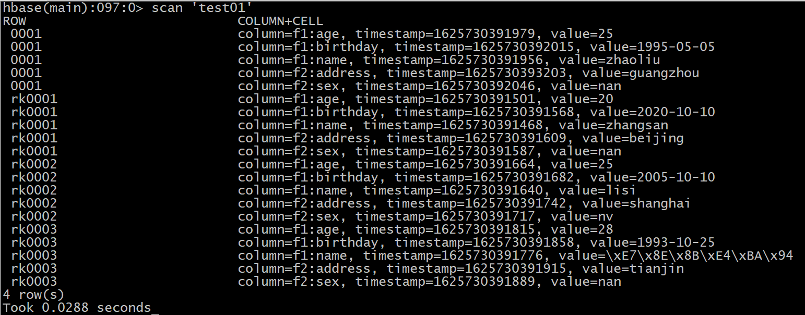

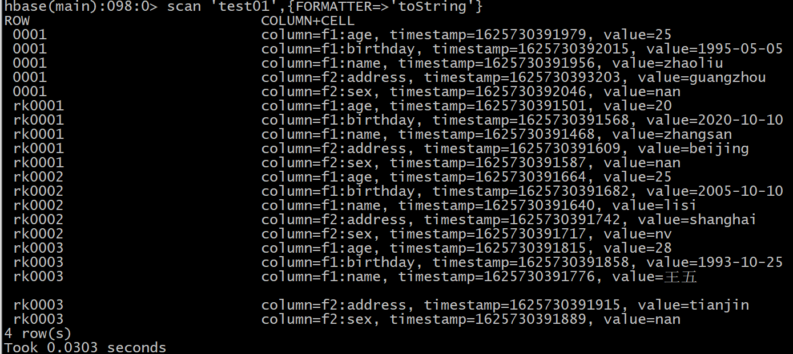

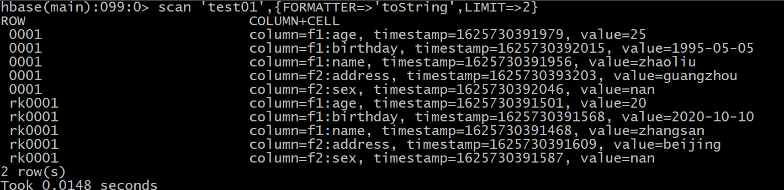

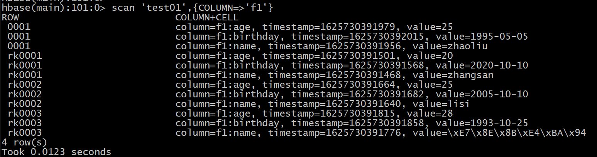

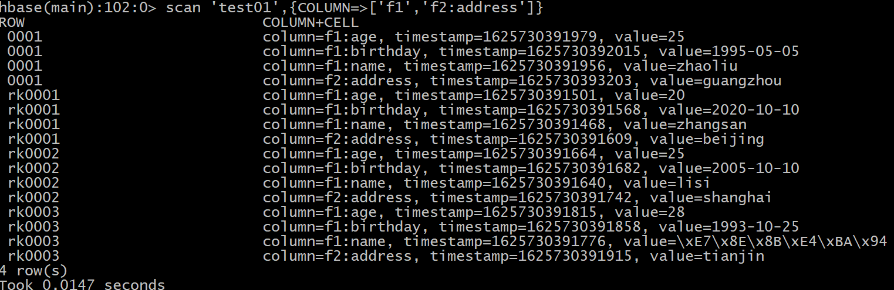

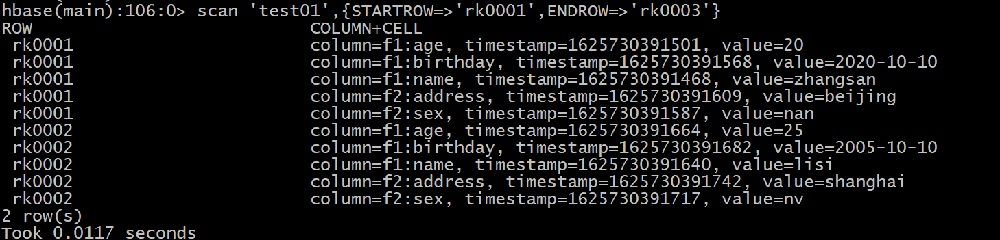

### 5.2 hbase的高级shell命令(了解)

* whoami: 查看当前登录用户

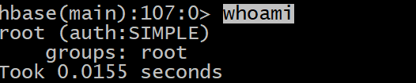

* exists: 查看表是否存在

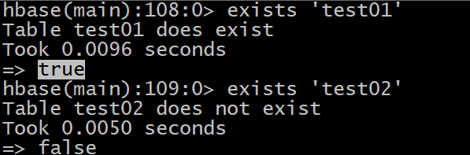

* alter: 用来执行修改表的操作

```properties
增加列族:
	alter '表名' ,NAME=>'新的列族'
删除列族: 
	alter '表名','delete'=>'旧的列族'
```

* hbase的filter过滤器相关的操作 :
  * 作用:补充hbase的查询方式

```properties
格式:
	scan '表名',{FILTER=>"过滤器(比较运算符,'比较器表达式')"}

在hbase中常用的过滤器: 
	rowkey过滤器:  
		RowFilter:  实现根据某一个rowkey过滤数据
		PrefixFilter: rowkey前缀过滤器
	列族过滤器: 
		FamilyFilter: 列族过滤器
	列名过滤器:
		QualifierFilter : 列名过滤器,  显示对应列的数据
	列值过滤器: 
		ValueFilter: 列值过滤器, 找到符合条件的列值
		SingleColumnValueFilter: 在指定列族和列名下, 查询符合对应列值数据 的整行数据
		SingleColumnValueExcludeFilter : 在指定列族和列名下, 查询符合对应列值数据 的整行数据 结果不包含过滤字段
	其他过滤器:
		PageFilter : 用于分页过滤器

比较运算符:  >  <  >= <= != =

比较器: 
	BinaryComparator: 用于进行完整的匹配操作
	BinaryPrefixComparator : 匹配指定的前缀数据
	NullComparator : 空值匹配操作
	SubstringComparator: 模糊匹配

比较器表达式: 
	BinaryComparator         binary:值
	BinaryPrefixComparator   binaryprefix:值
	NullComparator           null
	SubstringComparator      substring:值

参考地址:
	http://hbase.apache.org/2.2/devapidocs/index.html  
	从这个地址下, 找到对应过滤器, 查看其构造, 根据构造编写filter过滤器即可

案例: 
	需求一: 找到在列名中包含 字母 e 列名有哪些
	scan 'test01',{FILTER=>"QualifierFilter(=,'substring:e')"}
	需求二: 查看rowkey以rk开头的数据
	scan 'test01',{FILTER=>"PrefixFilter('rk')"}
	scan 'test01',{FILTER=>"RowFilter(=,'binaryprefix:rk')"}
	需求三: 查询 年龄大于等于25岁的数据
	scan 'test01',{FILTER=>"SingleColumnValueFilter('f1','age',>=,'binary:25')"}
	scan 'test01',{FILTER=>"SingleColumnValueExcludeFilter('f1','age',>=,'binary:25')"}
	
```

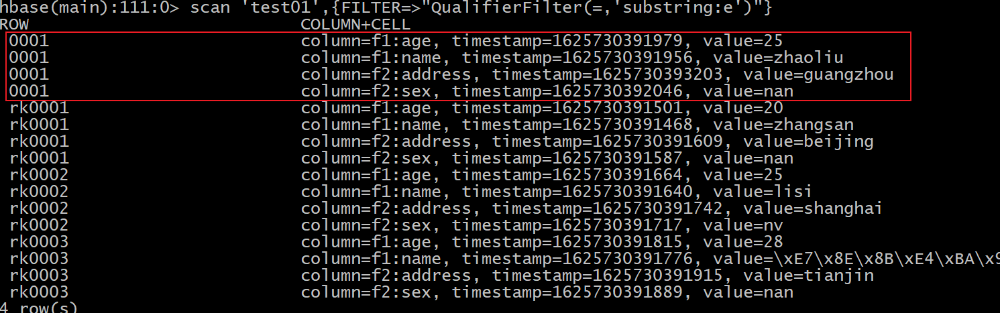

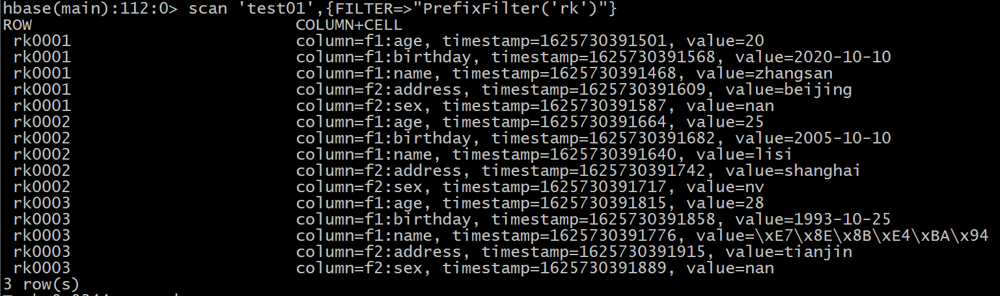

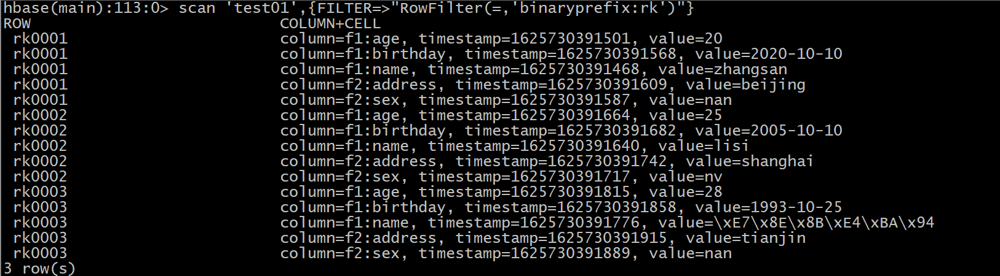

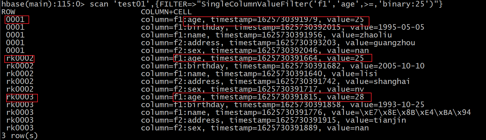

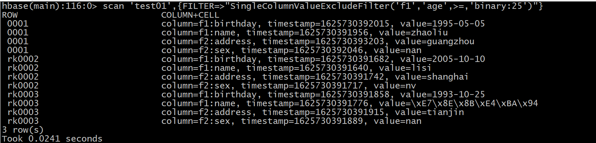


## 6 hbase的javaAPI的操作

* 1) 在IDEA上创建一个maven项目,并导入相关的依赖

```xml
    <repositories><!--代码库-->
        <repository>
            <id>aliyun</id>
            <url>http://maven.aliyun.com/nexus/content/groups/public/</url>
            <releases><enabled>true</enabled></releases>
            <snapshots>
                <enabled>false</enabled>
                <updatePolicy>never</updatePolicy>
            </snapshots>
        </repository>
    </repositories>

    <dependencies>
        <dependency>
            <groupId>org.apache.hbase</groupId>
            <artifactId>hbase-client</artifactId>
            <version>2.1.0</version>
        </dependency>
        <dependency>
            <groupId>commons-io</groupId>
            <artifactId>commons-io</artifactId>
            <version>2.6</version></dependency>
        <dependency>
            <groupId>junit</groupId>
            <artifactId>junit</artifactId>
            <version>4.12</version>
        </dependency>
        <dependency>
            <groupId>org.testng</groupId>
            <artifactId>testng</artifactId>
            <version>6.14.3</version>
        </dependency>
    </dependencies>

    <build>
        <plugins>
            <plugin>
                <groupId>org.apache.maven.plugins</groupId>
                <artifactId>maven-compiler-plugin</artifactId>
                <version>3.1</version>
                <configuration>
                    <target>1.8</target>
                    <source>1.8</source>
                </configuration>
            </plugin>
        </plugins>
    </build>
```

* 2) 导入一个日志文件: log4j.properties

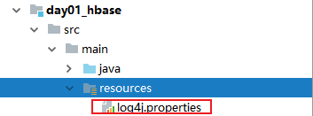

* 3) 创建包结构: com.itheima.hbase


需求说明:

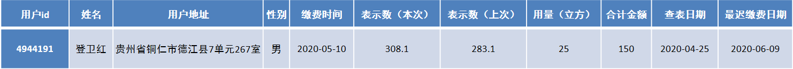

​	将水表缴费信息数据 存储在hbase中

### 6.1 创建表

* HBASE的java API使用步骤:

```properties
1) 通过HBase的连接工厂类构建连接对象
2) 根据连接对象, 获取相关的管理对象:  admin(执行对表进行操作)  table(执行对表数据的操作)
3) 执行相关的操作
4) 处理结果集 (只有查询才有结果集)
5) 释放资源
```

* 代码实现

```SQL
// 需求一: 创建表
    @Test
    public void test01() throws Exception{
        // 1) 通过HBase的连接工厂类构建连接对象
        // Configuration conf = new Configuration();
        Configuration conf = HBaseConfiguration.create();
        conf.set("hbase.zookeeper.quorum","node1:2181,node2:2181,node3:2181");
        Connection hbaseConn = ConnectionFactory.createConnection(conf);// 默认空参的方法连接是本地的HBase

        // 2) 根据连接对象, 获取相关的管理对象:  admin(执行对表进行操作)  table(执行对表数据的操作)
        Admin admin = hbaseConn.getAdmin();
        // 3) 执行相关的操作
        // 3.1) 判断表是否存在呢?
        // 返回true 表示存在  返回false 表示不存在
        boolean flag = admin.tableExists(TableName.valueOf("WATER_BILL"));

        if( ! flag ){
            // 说明表不存在, 需要构建表
            //3.2 创建表
            //3.2.1 创建表的构建器对象
            TableDescriptorBuilder tableDescriptorBuilder = TableDescriptorBuilder.newBuilder(TableName.valueOf("WATER_BILL"));

            //3.2.2 在构建器对象中, 设置表的列族信息
            ColumnFamilyDescriptor familyDescriptor = ColumnFamilyDescriptorBuilder.newBuilder("C1".getBytes()).build();
            tableDescriptorBuilder.setColumnFamily(familyDescriptor);

            // 3.2.3 得到表结构对象
            TableDescriptor tableDescriptor = tableDescriptorBuilder.build();

            admin.createTable(tableDescriptor);
        }

        // 4) 处理结果集 (只有查询才有结果集)
        // 5) 释放资源
        admin.close();
        hbaseConn.close();


    }
```


### 6.2 添加数据

```java
// 需求2: 向表添加数据
    @Test
    public void test02() throws Exception{
        // 1- 根据hbase的连接工厂对象创建hbase的连接对象
        Configuration conf = HBaseConfiguration.create();
        conf.set("hbase.zookeeper.quorum","node1:2181,node2:2181,node3:2181");
        Connection hbaseConn = ConnectionFactory.createConnection(conf);
        // 2- 根据连接对象, 获取相关的管理对象: admin  table
        Table table = hbaseConn.getTable(TableName.valueOf("WATER_BILL"));
        // 3- 执行相关的操作: 添加数据

        Put put = new Put("4944191".getBytes());
        put.addColumn("C1".getBytes(),"NAME".getBytes(),"登卫红".getBytes());
        put.addColumn("C1".getBytes(),"ADDRESS".getBytes(),"贵州省铜仁市德江县7单元267室".getBytes());
        put.addColumn("C1".getBytes(),"SEX".getBytes(),"男".getBytes());

        table.put(put);
        // 4- 处理结果集(只有查询存在)

        // 5- 释放资源
        table.close();
        hbaseConn.close();
    }
```


### 6.3 抽取一些公共的方法

```java
    @Before
    public void before() throws Exception{

        // 1- 根据hbase的连接工厂对象创建hbase的连接对象
        Configuration conf = HBaseConfiguration.create();
        conf.set("hbase.zookeeper.quorum","node1:2181,node2:2181,node3:2181");
        hbaseConn = ConnectionFactory.createConnection(conf);
        // 2- 根据连接对象, 获取相关的管理对象: admin  table
        admin = hbaseConn.getAdmin();
        table = hbaseConn.getTable(TableName.valueOf("WATER_BILL"));

    }


    @After
    public  void after() throws Exception{

        // 5- 释放资源
        admin.close();
        table.close();
        hbaseConn.close();

    }
```


### 6.4 查询某一条数据

```java
    // 需求四: 查询某一条数据:  rowkey为 4944191
    @Test
    public void test03() throws Exception{
        // 3- 执行相关的操作
        Get get = new Get("4944191".getBytes());

        Result result = table.get(get);  // 一个 result对象表示一行数据
        //4- 处理结果集
        // 4.1  将一行中每一个单元格获取
        List<Cell> cells = result.listCells();

        // 4.2 遍历每一个单元格: 一个单元格里面主要包含(rowkey信息, 列族信息, 列名信息, 列值信息)
        for (Cell cell : cells) {
            byte[] rowKeyBytes = CellUtil.cloneRow(cell);
            byte[] familyBytes = CellUtil.cloneFamily(cell);
            byte[] columnNameBtyes = CellUtil.cloneQualifier(cell);
            byte[] valueBytes = CellUtil.cloneValue(cell);

            String rowKey = Bytes.toString(rowKeyBytes);
            String family = Bytes.toString(familyBytes);
            String columnName = Bytes.toString(columnNameBtyes);
            String value = Bytes.toString(valueBytes);

            System.out.println("rowkey为:"+rowKey +", 列族为:"+family +"; 列名为:"+columnName+"; 列值为:"+value);

        }

    }
```


### 6.5 删除数据

```java
 // 需求五: 删除数据的操作:  rowkey为 4944191 的数据删除
    @Test
    public void  test05() throws Exception{

        //3. 执行相关的操作
        Delete delete = new Delete("4944191".getBytes());
        // delete.addColumn("C1".getBytes(),"NAME".getBytes());

        table.delete(delete);

        //4. 处理结果集


    }
```


### 6.6 删除表

```java
// 需求六: 删除表操作
    @Test
    public void  test06() throws Exception{
        //3. 执行相关的操作

        //3.1: 如果表没有被禁用, 先禁用表
        if( admin.isTableEnabled(TableName.valueOf("WATER_BILL")) ){
            admin.disableTable(TableName.valueOf("WATER_BILL"));
        }
        //3.2: 执行删除
        admin.deleteTable(TableName.valueOf("WATER_BILL"));

        //4. 处理结果集

    }
```

### 6.7 导入数据的操作

* 如何导入数据:

```properties
hbase org.apache.hadoop.hbase.mapreduce.Import 表名 HDFS数据文件路径
```

* 执行相关的操作:

```properties
1) 需要先将资料中10w抄表数据上传到HDFS中: 

hdfs dfs -mkdir -p /hbase/water_bill/input
将数据上传到此目录下
hdfs dfs -put part-m-00000_10w  /hbase/water_bill/input

2) 执行导入操作:
hbase org.apache.hadoop.hbase.mapreduce.Import WATER_BILL /hbase/water_bill/input/part-m-00000_10w
```


* 如何导出数据(不需要执行)

```properties
hbase org.apache.hadoop.hbase.mapreduce.Export 表名 导出HDFS的路径
```


### 6.8 基于scan的扫描查询

需求: 查询2020年 6月份所有用户的用水量:  

日期字段: RECORD_DATE

用水量: NUM_USAGE

用户: NAME


SQL:

```sql
select NAME,NUM_USAGE    from  WATER_BILL where RECORD_DATE between '2020-06-01'  and '2020-06-30';
```

代码实现:

```JAVA
    /*
        需求: 查询2020年 6月份所有用户的用水量:
        日期字段: RECORD_DATE
        用水量: NUM_USAGE
        用户: NAME
     */
    // SQL: select NAME,NUM_USAGE    from  WATER_BILL where RECORD_DATE between '2020-06-01'  and '2020-06-30';

    @Test
    @SuppressWarnings("ALL")
    public void test07() throws Exception{

        //3. 执行相关的操作:
        Scan scan = new Scan();

        //3.1: 设置过滤条件
        SingleColumnValueFilter filter1 = new SingleColumnValueFilter(
                "C1".getBytes(),
                "RECORD_DATE".getBytes(),
                CompareOperator.GREATER_OR_EQUAL,
                new BinaryComparator("2020-06-01".getBytes())
        );

        SingleColumnValueFilter filter2 = new SingleColumnValueFilter(
                "C1".getBytes(),
                "RECORD_DATE".getBytes(),
                CompareOperator.LESS_OR_EQUAL,
                new BinaryComparator("2020-06-30".getBytes())
        );

        //3.1.2 构建 filter集合, 将镀铬filter合并在一起
        FilterList filterList = new FilterList();
        filterList.addFilter(filter1);
        filterList.addFilter(filter2);

        scan.setFilter(filterList);

        // 设置输出行数:
        scan.setLimit(10);

        // 在查询的时候, 限定返回那些列的数据
        scan.addColumn("C1".getBytes(),"NAME".getBytes());
        scan.addColumn("C1".getBytes(),"NUM_USAGE".getBytes());
        scan.addColumn("C1".getBytes(),"RECORD_DATE".getBytes());

        ResultScanner results = table.getScanner(scan); // 获取到多行数据


        //4- 处理结果集
        //4.1: 获取每一行的数据
        for (Result result : results) {
            // 4.2  将一行中每一个单元格获取
            List<Cell> cells = result.listCells();

            // 4.3 遍历每一个单元格: 一个单元格里面主要包含(rowkey信息, 列族信息, 列名信息, 列值信息)
            for (Cell cell : cells) {
                byte[] columnNameBtyes = CellUtil.cloneQualifier(cell);
                String columnName = Bytes.toString(columnNameBtyes);

                //if("NAME".equals(columnName) || "NUM_USAGE".equals(columnName)  || "RECORD_DATE".equals(columnName)){
                    byte[] rowKeyBytes = CellUtil.cloneRow(cell);
                    byte[] familyBytes = CellUtil.cloneFamily(cell);
                    byte[] valueBytes = CellUtil.cloneValue(cell);

                    String rowKey = Bytes.toString(rowKeyBytes);
                    String family = Bytes.toString(familyBytes);

                    Object value ;
                    if("NUM_USAGE".equals(columnName)){
                        value = Bytes.toDouble(valueBytes);
                    }else{
                        value = Bytes.toString(valueBytes);
                    }


                    System.out.println("rowkey为:"+rowKey +", 列族为:"+family +"; 列名为:"+columnName+"; 列值为:"+value);
                //}


            }
            System.out.println("---------------------------------------");
        }

    }
```


