# day03_HBase课程笔记

今日说明:

* 1- HBase的高可用 (参考笔记, 配置成功即可)
* 2- HBase的集群架构 (理解,最好能够自己讲的出来)
* 3- HBase的读写数据流程  (理解,最好能够自己讲的出来)
* 4- HBase的核心原理  (理解,最好能够自己讲的出来)
* 5- HBase的bulkLoad批量加载数据操作 (掌握 需要操作)


## 1. HBase的高可用

​		目前搭建好的hbase集群中， 主节点只有一个， 在node1， 那么如果node1节点出现宕机后， 整个集群的主节点就是丢失， 那么如何解决呢？  

​		解决方案， 采用hbase的高可用， 而所谓的高可用指的让hbase的主节点高可用， 可以启动多个主节点， 让其中一个主节点称为 active状态， 其他的主节点成为standby （备份） 节点， 当active节点出现宕机后， 备份节点顶上来成为主节点即可


如何实施呢？

* 1） 在node1的hbase的conf目录下 ，创建一个 backup-masters 文件， 在此文件中加入需要将那些节点作为备份节点地址即可

```properties
cd /export/server/hbase-2.1.0/conf/
vim backup-masters

输入 i

添加以下内容：
node2.itcast.cn
node3.itcast.cn
```

* 2)  将backup-masters 发送给node2和node3

```properties
cd /export/server/hbase-2.1.0/conf/

scp -r backup-masters node2:$PWD
scp -r backup-masters node3:$PWD
```

* 3) 重启hbase的集群

```properties
关闭hbase集群：  stop-hbase.sh
启动hbase集群:  start-hbase.sh

如何单独启动hbase的各个节点
	启动主节点： hbase-daemon.sh start master
	启动从节点： hbase-daemon.sh start regionserver 
```


## 2. HBase的集群架构

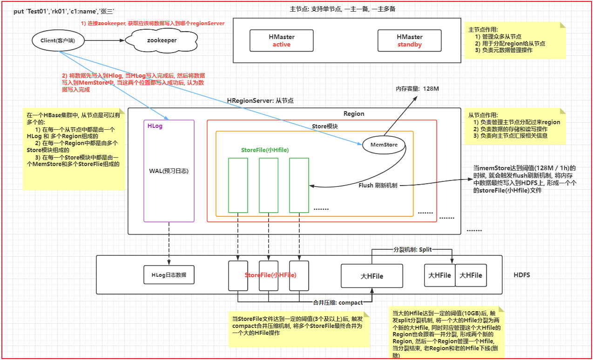

```properties
1) 明确主节点和从节点的作用是什么
2) 从节点内部结构是什么
3) 大致数据流转过程
```

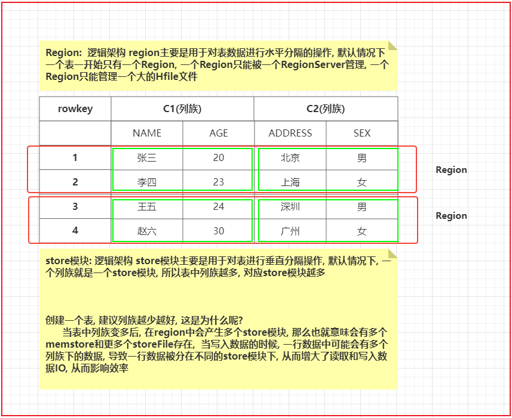

```
理解Region 以及 store 模块
```


## 3. HBase的读写流程

### 3.1 读取数据流程

```properties
HBase数据读取流程:

1) 客户端发起读取数据的请求, 首先会先连接zookeeper
2) 从zookeeper中获取一个 hbase:meta表 被那个RegionServer所管理着
		hbase:meta: hbase的元数据表, 在这个表中存储了自定义的表相关元数据, 包含: 表名, 表有那些列族, 表有几个Region构成的, 每个Region被那个RegionServer管理
		meta表只有一个Region, 而这个Region必然会被某一个RegionServer所管理, 至于被那个RegionServer所管理了呢? zookeeper清楚
		
3) 连接meta表对应RegionServer, 从meta表获取当前要读取的这个表对应的Region是那些, 并且这些Region对应的RegionServer是谁
		当表有多个Region的时候: 
			如果执行的Get操作获取某一条数据, 只会返回一个RegionServer的地址
			如果执行的Scan操作, 会将所有的Region对应RegionServer地址全部返回

4) 连接要读取表对应的RegionServer, 从RegionServer上开始获取数据即可: 
	读取顺序: 
		MemStore ---> blockCache(缓存) ---> StoreFlie(小HFile) --->大HFile
	
	当从后续的文件中读取到数据后, 会将这一部分存储到缓存中
	
	如果执行Scan操作, blockCache基本没有太大意义
	

整个读取过程, Master是否有参与呢? Master是不参与数据读取操作
```


### 3.2 写入数据流程

```properties
HBase数据写入流程: 
客户端流程:
1) 由客户端发起写入数据的请求, 首先会先连接zookeeper
2) 从zookeeper中获取 hbase:meta表 被那个regionServer所管理
3) 连接meta表对应的RegionServer地址, 从meta表获取当前要写入的表对应region被那个RegionServer所管理(一般只会返回一个RegionServer地址, 除非一次性写入多条数据)
4) 连接对应要写入RegionServer的地址, 开始写入数据, 将数据首先会写入到HLog中,然后将数据写入到对应Region的对应Store模块的MemStore中(有可能会写入到MemStore), 当这两个地方都写入完成后, 客户端认为数据写入完成了

服务端写入过程:  异步操作(可能客户端执行N多次写入后, 服务端才开始对之前的数据进行操作)

5) 随着客户端不断的写入操作, memstore中数据会越来越多, 当内存中数据达到阈值(128M / 1h)后, 就会触发flush刷新机制, 将数据<最终>刷新到HDFS上形成StoreFile(小Hfile)文件.

6) 随着不断的刷新, 在HDFS上StoreFile文件会越来越多, 当StoreFlie文件数量达到阈值(3个及以上)后, 就会触发compact合并压缩机制, 将多个StoreFlie文件<最终>合并为一个大的HFile文件

7) 随着不断的合并, 大的HFile也会越来越大, 当大HFile达到一定的阈值(<最终>10GB)后, 就会触发Split分裂机制, 将大HFile进行一分为二,形成两个新的大HFile, 同时管理这个大HFile的Region也会形成两个新的Region, 形成的两个新的Region和两个新的大HFile 进行一对一的管理即可, 原来的Region和原来的大的HFile就会下线删除掉
```


## 4. HBase的核心原理及其相关的工作机制

### 4.1 HBase的Flush刷新机制(溢写合并)

```properties
flush刷新机制: 
	指的客户端不断的向memstore写入数据, 当memstore达到阈值后, 就会触发flush刷新机制, 将数据从内存中刷新到HDFS上, 形成一个storeFile文件操作
	
	阈值: 达到 128M / 1h
	
	注意: 
		达到128M 触发region级别的刷新机制
		达到1h(小时), 触发regionServer级别的刷新机制
	
内部执行刷新的时候, 整个刷新流程:  
	1) 当memstore中内存数据达到阈值后, 首先会将当前这个内存空间关闭, 然后重新开启一个新的内存空间, 继续写入
	2) 将这个达到阈值的内存空间的数据(这份数据一般称为一个segment片段数据)会放置到一个pipeline(内存管道), 这个管道是一个只读管道, 等待刷新到HDFS中
	3)  在刷新到HDFS的时候, 也会对数据排序
		hbase 2.x及以上版本中: 
			hbase会尽可能让这个管道内数据晚的刷新到HDFS上, 当内存不足(0.85~0.9)的时候, 此时就会触发flush的刷新机制, 将管道内的数据进行合并刷新操作(内存合并), 在HDFS上形成一个storeFile文件
		
		hbase 2.x以下的版本中:
			一直有一个flush的刷新线程在监听这个pipeline管道, 一旦发现这个管道内有了数据, 立即将数据刷新到HDFS中, 形成一个storeFile文件, 每一个segment片段就是一个storeFile文件
			
		
	好处: 可以尽可能让更多的数据在内存中, 以提升查询的效率, 同时对数据也有合并操作, 可以减少storeFile文件数量, 会延缓后续合并 和分裂的次数
	

但是: 虽然说HBase2.x以上版本支持了内存合并操作, 实际上并没有开启, 所以在默认情况下, 与1.x版本执行逻辑是一样的
```

* 阈值的配置修改内容: hbase-site.xml

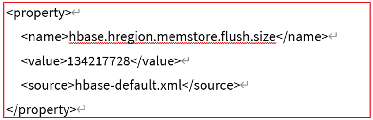

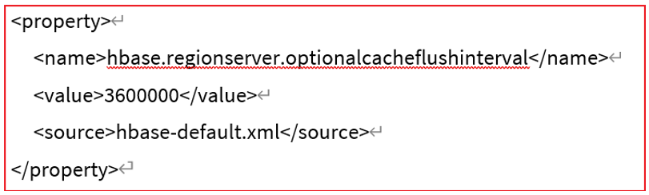

* 如何配置内存合并操作:

  * 1- 全局配置: hbase-site.xml.    让所有的hbase的表具有这种内存合并操作:  默认为None 表示不开启

  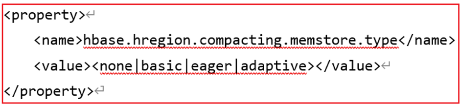

  * 2- 针对某个表设置内存合并策略

  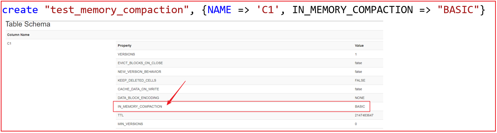


关于三种合并策略说明:

```properties
第一种策略: 基础型 (大部分情况下, 主要采用基础型)
	仅做简单合并操作, 对过期数据不做任何的处理, 合并效率比较高
	适合于: 写入数据较多的情况

第二种策略: 饥渴型
	在合并内存中数据的时候, 对过期版本数据进行过滤操作, 保证合并的数据中不存在过期版本数据, 合并效率较低
	适用于: 数据在较短时间内就会过期, 而且数据还必须存储情况

第三种策略: 适应性
	在进行内存合并的时候, 会校验内存数据是否存在过去版本情况, 如果这种情况比较多的时候, 会自动选择饥渴型方案, 否则采用基础型


过期数据是如何出现的呢?  
	1- 对数据执行修改操作, 修改前的数据其实就是过期数据了
	2- 对数据执行删除操作, 删除的数据其实标记为过期数据
	3- 对数据设置有效时间, 到达时间后, 数据也会认为是过期了

在hbase中, 不管是执行添加, 修改 还是删除, 本质都是向hbase添加数据的过程
```


### 4.2 HBase的storeFile合并机制

```properties
compact合并压缩机制: 
	指的memstore不断的进行刷新操作, 在HDFS上的storeFile会越来越多, 当storeFile达到阈值后, 就会触发compact合并压缩的机制, 将多个storeFile合并为一个大的HFile
	
	minor: 先将那些较小的storeFile合并为一个较大的HFile过程 
		阈值: 达到3个及以上
		在此阶段, 类似于内存合并中基础型方案,仅仅是将多个storeFile合并为一个较大的HFile, 对过期版本数据不做任何的处理, 仅仅在合并的时候对数据进行排序(基于rowkey)操作,采用边读边追加到HDFS上方式
		合并效率比较高
	
	
	major: 将较大的HFile 和之前的大HFile 再次进行合并, 形成一个更大的HFile
		阈值: 7天
		
		在触发major合并后, 在合并的过程, 类似于内存合并中饥渴型方案, 将过期版本的数据全部清除掉, 整个合并操作也是采用边读边追加写入到HDFS的方式
		此操作在合并的时候, 会影响当前regionServer的读写操作, 而且此操作对IO影响比较大
		
		一般此操作采用手动触发(一般在刚刚启动HBase集群的时候) (只要Hbase重启, Hbase会自检, 检测是否需要进行major操作)
	
	
说明:
	在合并的时候, 是否需要进行压缩, 取决于构建表的时候, 是否配置压缩, 默认不压缩的
```

minor阈值设置: hbase-site.xml

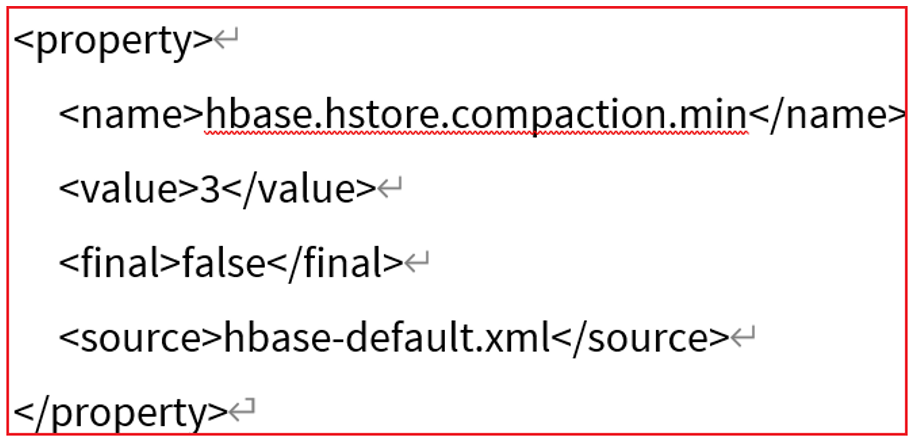

major阈值设置: hbase-site.xml

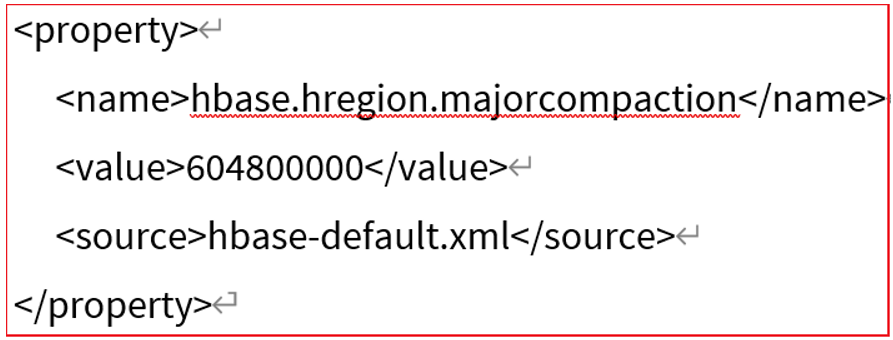


### 4.3 HBase的split机制(region分裂)

```properties
split 分裂机制: 
	指的当我们不断的进行合并操作, 大的HFile会越来越大, 当HFile达到一定阈值后, 就会触发Split分裂机制, 将大HFile进行一分为二, 形成两个新的大HFile, 同时对应Region也会一分为二, 形成两个新的Region, 然后一个region去管理其中一个大HFile, 一旦分裂结束后, 原有老的region和大HFile就会下线,对应老的HFile也会被删除掉
	
	分裂的时候, 看这个大HFile中最小的rowkey是那个, 最大的rowkey是那个, 选中一个中间值, 分开即可
	
	注意:  
		新分裂出现的两个Region, 在最开始的时候, 是被同一个RegionServer所管理,后期是否会被其他的RegionServer所管理, 此操作会交给Master, Master会进行负载管理
		
	
	阈值: 最终10GB
```

* 阈值的配置:

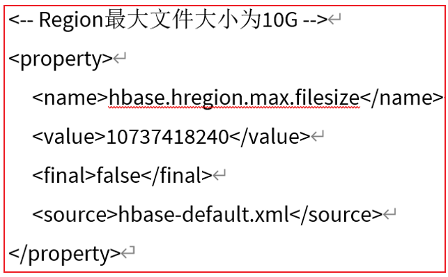

```properties
思考:  分裂操作, 有什么作用? 
	一旦分裂后, 一个表可以有多个Region, 而多个Region可以被多个regionServer所管理, 相当于在进行数据读写操作的时候, 能够让更多的RegionServer参与进行, 共同完成数据的读写操作, 提升读写并发能力, 提升读写效率
	
但是, 如果region只有达到10GB才能进行分裂, 那么 从 0~10GB这个过程, 只能有一个region来工作, 意味着只能有一个regionServer参与这个表数据读写操作, 在这个过程中, 如果出现了大量的并发请求操作, 可能就会导致这个regionServer出现宕机风险

希望这个表可以尽快的被分裂为多个region, 让更多的regionServer参与进来

解决方案: 
	1) 在构建表的时候, 可以让表一开始就拥有多个region: region的预分区操作  (手动分裂) -- 设计表讲解
	2) 让表尽可能早的进行分裂: 自动分裂
	

在HBase中, 为了能够让其尽早分裂, 专门提供了计算公式, hbase会基于这个公式,计算合适触发分裂操作:

计算公式: 
	min(R^2 * "hbase.hregion.memstore.flush.size", "hbase.hregion.max.filesize")
	
	R表示 表的region的数量
	hbase.hregion.memstore.flush.size:  128M
	hbase.hregion.max.filesize:  10GB

假设: 当前有一个表只有一个region, 请问此表在什么时候就会触发第一次分裂呢? 
	min(1^2 * 128M , 10GB) =  128M 
	
假设: 当前有一个表有5个region, 请问此表在什么时候就会触发分裂呢? 
	min(5^2 * 128M , 10GB) = 3.125GB

假设: 当前有一个表有9个region, 请问此表在什么时候就会触发分裂呢?  后续都是按照10GB进行分裂
	min(9^2 * 128M , 10GB) = 10GB

每一次分裂, 都是将region中数据找到rowkey的中间值, 进行一份为二的操作

请思考: 分裂后的多个region, 每个region是否还可以接着进行数据写入操作呢? 可以的

```


### 4.4 regionServer的上下线流程

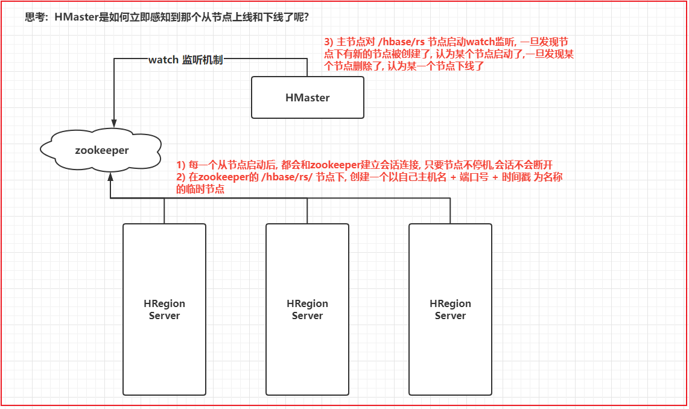

### 4.5 Master的上下线流程

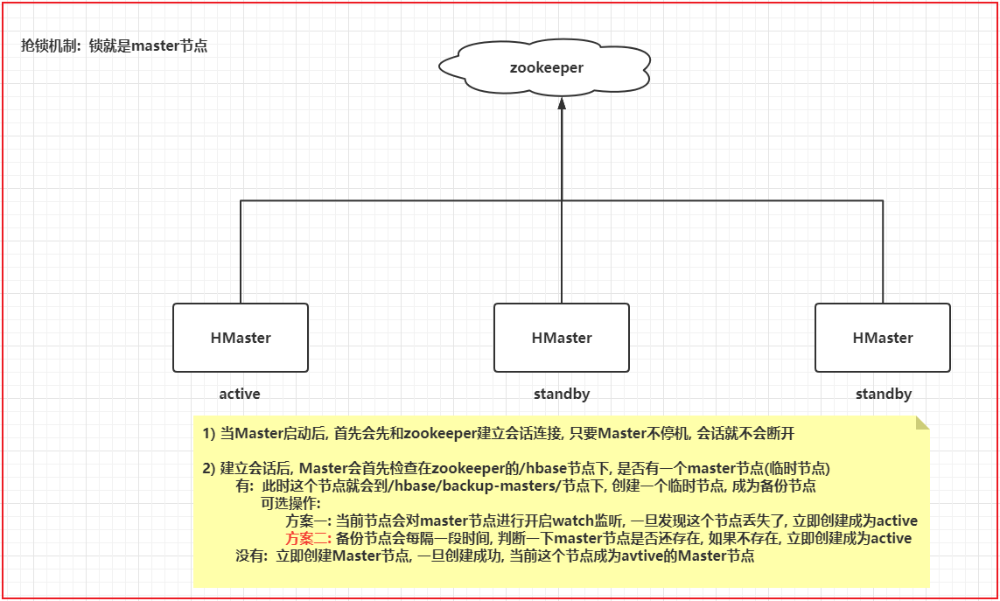

### 4.6 Master如何分配Region流程

```
分配Region流程: 

1) 当Master启动后, 首先会从zookeeper上获取当前有那些从节点启动了(卡其对zookeeper中/hbase/rs目录监听)

2) 连接这些从节点, 让其报告当前管理了那些region, master进行记录即可(内存)

3) Master在连接Meta表, 从meta表获取一共有那些表, 每个表有那些region, 与从节点汇报上来的region进行比对,  找打还有那些没有分配的region, 以及判断regionServer管理的region是否是均衡

4) 将没有分配的region分配给相对管理较少的regionServer上, 同时还需要保证一个表上的多个region被均匀分配给不同的regionServer上, 保证负载均衡

负载均衡:
	1) 需要保证每个regionServer管理的region数量大致相等
	2) 保证每个表中多个region可能被均匀的分布在不同regionServer上 (优先的)
```


注意: Master不参与数据的IO读写操作, 即使Master宕机, 也不会影响读写操作, 短暂让Master下线并不会影响整个HBase集群

```
如果Master下线了, 主要会影响对元数据的操作功能: 创建表, 修改表, 删除表, 负载均衡, region分配...

但是分裂工作是可以正常进行的
```


## 5. HBase的BulkLoad批量加载数据操作

```properties
假设现在有一大批数据需要向HBase中某个表进行写入操作, 如何处理呢? 

解决方案:
	读取数据, 一条一条的将数据通过JAVA API写入到HBase对应表中即可, 整个写入操作: 首先将数据写入到memstore,然后达到阈值后, 在刷新到HDFS上, 形成一个storeFile, 接着storeFile进行合并形成大的HFile, 此流程不断的进行
	
在以上的流程中, 有什么问题?
1) 写入效率比较差
2) 写入时间比较长,会长时间占用大量的网络带宽, 从而导致其他节点无法进行相关操作
3) 整个操作, HBase需要调用大量的IO来处理, 占用HBase资源过高


那么如何解决上述的问题呢? 思路是什么?
	是否可以尝试将数据先转换为HFile文件格式数据,然后将这份数据直接放置到对应表的数据目录下, 让HBase直接加载即可
	
如何实施呢? BulkLoad
	第一步: 将数据根据要写入HBase的表的特点, 转换为HFile文件格式数据: MR (只有Map 没有reduce)
	
	第二步: 将这个数据直接加载HBase对应数据目录下: hbase提供特定加载方式
	

bulkload应用场景: 需要一次性写入大量数据到HBase情况
```


### 5.1 需求说明

​		将位于HDFS上的银行转账数据, 通过Bulk Load方式加载到Hbase中

​		数据结构: 

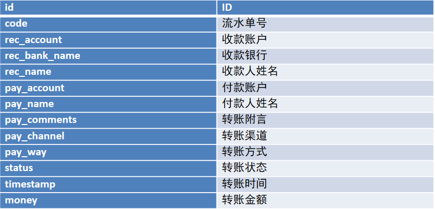


### 5.2 准备工作

* 1) 创建maven项目 . 并导入相关的依赖

```xml
    <repositories><!--代码库-->
        <repository>
            <id>aliyun</id>
            <url>http://maven.aliyun.com/nexus/content/groups/public/</url>
            <releases><enabled>true</enabled></releases>
            <snapshots>
                <enabled>false</enabled>
                <updatePolicy>never</updatePolicy>
            </snapshots>
        </repository>
    </repositories>

    <dependencies>
        <dependency>
            <groupId>org.apache.hbase</groupId>
            <artifactId>hbase-client</artifactId>
            <version>2.1.0</version>
        </dependency>
        <dependency>
            <groupId>commons-io</groupId>
            <artifactId>commons-io</artifactId>
            <version>2.6</version>
        </dependency>

        <dependency>
            <groupId>org.apache.hbase</groupId>
            <artifactId>hbase-mapreduce</artifactId>
            <version>2.1.0</version>
        </dependency>

        <dependency>
            <groupId>org.apache.hadoop</groupId>
            <artifactId>hadoop-mapreduce-client-jobclient</artifactId>
            <version>2.7.5</version>
        </dependency>

        <dependency>
            <groupId>org.apache.hadoop</groupId>
            <artifactId>hadoop-common</artifactId>
            <version>2.7.5</version>
        </dependency>

        <dependency>
            <groupId>org.apache.hadoop</groupId>
            <artifactId>hadoop-mapreduce-client-core</artifactId>
            <version>2.7.5</version>
        </dependency>

        <dependency>
            <groupId>org.apache.hadoop</groupId>
            <artifactId>hadoop-auth</artifactId>
            <version>2.7.5</version>
        </dependency>

        <dependency>
            <groupId>org.apache.hadoop</groupId>
            <artifactId>hadoop-hdfs</artifactId>
            <version>2.7.5</version>
        </dependency>

    </dependencies>

    <build>
        <plugins>
            <plugin>
                <groupId>org.apache.maven.plugins</groupId>
                <artifactId>maven-compiler-plugin</artifactId>
                <version>3.1</version>
                <configuration>
                    <target>1.8</target>
                    <source>1.8</source>
                </configuration>
            </plugin>
        </plugins>
    </build>
```

* 2) 加入 log4j.properties到项目的resources目录下

* 3) 创建包结构: com.itheima.hbase.bulkload

* 4) 将资料中 bank_record.csv 文件上传到HDFS中

```properties
4.1) 将这个文件上传到任意一台服务器中:  node2
4.2) 在HDFS上创建一个目录:
	hdfs dfs -mkdir -p /hbase/bulkload/input
4.3) 执行上传操作
	hdfs dfs -put bank_record.csv /hbase/bulkload/input
```

* 5) 在hbase上创建目标表:

```
create 'TRANSFER_RECORD','C1'
```


### 5.3 将CSV数据转换为HFile文件格式数据

```java
package com.itheima.hbase;

import org.apache.hadoop.conf.Configuration;
import org.apache.hadoop.hbase.*;
import org.apache.hadoop.hbase.client.*;
import org.apache.hadoop.hbase.filter.BinaryComparator;
import org.apache.hadoop.hbase.filter.FilterList;
import org.apache.hadoop.hbase.filter.SingleColumnValueFilter;
import org.apache.hadoop.hbase.util.Bytes;
import org.junit.After;
import org.junit.Before;
import org.junit.Test;

import java.util.List;

// hbase的测试类
public class HBaseTest {

    // 需求一: 创建表
    @Test
    public void test01() throws Exception{
        // 1) 通过HBase的连接工厂类构建连接对象
        // Configuration conf = new Configuration();
        Configuration conf = HBaseConfiguration.create();
        conf.set("hbase.zookeeper.quorum","node1:2181,node2:2181,node3:2181");
        Connection hbaseConn = ConnectionFactory.createConnection(conf);// 默认空参的方法连接是本地的HBase

        // 2) 根据连接对象, 获取相关的管理对象:  admin(执行对表进行操作)  table(执行对表数据的操作)
        Admin admin = hbaseConn.getAdmin();
        // 3) 执行相关的操作
        // 3.1) 判断表是否存在呢?
        // 返回true 表示存在  返回false 表示不存在
        boolean flag = admin.tableExists(TableName.valueOf("WATER_BILL"));

        if( ! flag ){
            // 说明表不存在, 需要构建表
            //3.2 创建表
            //3.2.1 创建表的构建器对象
            TableDescriptorBuilder tableDescriptorBuilder = TableDescriptorBuilder.newBuilder(TableName.valueOf("WATER_BILL"));

            //3.2.2 在构建器对象中, 设置表的列族信息
            ColumnFamilyDescriptor familyDescriptor = ColumnFamilyDescriptorBuilder.newBuilder("C1".getBytes()).build();
            tableDescriptorBuilder.setColumnFamily(familyDescriptor);

            // 3.2.3 得到表结构对象
            TableDescriptor tableDescriptor = tableDescriptorBuilder.build();

            admin.createTable(tableDescriptor);
        }

        // 4) 处理结果集 (只有查询才有结果集)
        // 5) 释放资源
        admin.close();
        hbaseConn.close();


    }

    // 需求2: 向表添加数据
    @Test
    public void test02() throws Exception{
        // 1- 根据hbase的连接工厂对象创建hbase的连接对象
        Configuration conf = HBaseConfiguration.create();
        conf.set("hbase.zookeeper.quorum","node1:2181,node2:2181,node3:2181");
        Connection hbaseConn = ConnectionFactory.createConnection(conf);
        // 2- 根据连接对象, 获取相关的管理对象: admin  table
        Table table = hbaseConn.getTable(TableName.valueOf("WATER_BILL"));
        // 3- 执行相关的操作: 添加数据

        Put put = new Put("4944191".getBytes());
        put.addColumn("C1".getBytes(),"NAME".getBytes(),"登卫红".getBytes());
        put.addColumn("C1".getBytes(),"ADDRESS".getBytes(),"贵州省铜仁市德江县7单元267室".getBytes());
        put.addColumn("C1".getBytes(),"SEX".getBytes(),"男".getBytes());

        table.put(put);
        // 4- 处理结果集(只有查询存在)

        // 5- 释放资源
        table.close();
        hbaseConn.close();
    }

    private Connection hbaseConn;
    private Admin admin;
    private Table table;

    @Before
    public void before() throws Exception{

        // 1- 根据hbase的连接工厂对象创建hbase的连接对象
        Configuration conf = HBaseConfiguration.create();
        conf.set("hbase.zookeeper.quorum","node1:2181,node2:2181,node3:2181");
        hbaseConn = ConnectionFactory.createConnection(conf);
        // 2- 根据连接对象, 获取相关的管理对象: admin  table
        admin = hbaseConn.getAdmin();
        table = hbaseConn.getTable(TableName.valueOf("WATER_BILL"));

    }

    // 需求四: 查询某一条数据:  rowkey为 4944191
    @Test
    public void test03() throws Exception{
        // 3- 执行相关的操作
        Get get = new Get("4944191".getBytes());

        Result result = table.get(get);  // 一个 result对象表示一行数据
        //4- 处理结果集
        // 4.1  将一行中每一个单元格获取
        List<Cell> cells = result.listCells();

        // 4.2 遍历每一个单元格: 一个单元格里面主要包含(rowkey信息, 列族信息, 列名信息, 列值信息)
        for (Cell cell : cells) {
            byte[] rowKeyBytes = CellUtil.cloneRow(cell);
            byte[] familyBytes = CellUtil.cloneFamily(cell);
            byte[] columnNameBtyes = CellUtil.cloneQualifier(cell);
            byte[] valueBytes = CellUtil.cloneValue(cell);

            String rowKey = Bytes.toString(rowKeyBytes);
            String family = Bytes.toString(familyBytes);
            String columnName = Bytes.toString(columnNameBtyes);
            String value = Bytes.toString(valueBytes);

            System.out.println("rowkey为:"+rowKey +", 列族为:"+family +"; 列名为:"+columnName+"; 列值为:"+value);

        }

    }

    // 需求五: 删除数据的操作:  rowkey为 4944191 的数据删除
    @Test
    public void  test05() throws Exception{

        //3. 执行相关的操作
        Delete delete = new Delete("4944191".getBytes());
        // delete.addColumn("C1".getBytes(),"NAME".getBytes());

        table.delete(delete);

        //4. 处理结果集


    }

    // 需求六: 删除表操作
    @Test
    public void  test06() throws Exception{
        //3. 执行相关的操作

        //3.1: 如果表没有被禁用, 先禁用表
        if( admin.isTableEnabled(TableName.valueOf("WATER_BILL")) ){
            admin.disableTable(TableName.valueOf("WATER_BILL"));
        }
        //3.2: 执行删除
        admin.deleteTable(TableName.valueOf("WATER_BILL"));

        //4. 处理结果集

    }

    /*
        需求: 查询2020年 6月份所有用户的用水量:
        日期字段: RECORD_DATE
        用水量: NUM_USAGE
        用户: NAME
     */
    // SQL: select NAME,NUM_USAGE    from  WATER_BILL where RECORD_DATE between '2020-06-01'  and '2020-06-30';

    @Test
    @SuppressWarnings("ALL")
    public void test07() throws Exception{

        //3. 执行相关的操作:
        Scan scan = new Scan();

        //3.1: 设置过滤条件
        SingleColumnValueFilter filter1 = new SingleColumnValueFilter(
                "C1".getBytes(),
                "RECORD_DATE".getBytes(),
                CompareOperator.GREATER_OR_EQUAL,
                new BinaryComparator("2020-06-01".getBytes())
        );

        SingleColumnValueFilter filter2 = new SingleColumnValueFilter(
                "C1".getBytes(),
                "RECORD_DATE".getBytes(),
                CompareOperator.LESS_OR_EQUAL,
                new BinaryComparator("2020-06-30".getBytes())
        );

        //3.1.2 构建 filter集合, 将镀铬filter合并在一起
        FilterList filterList = new FilterList();
        filterList.addFilter(filter1);
        filterList.addFilter(filter2);

        scan.setFilter(filterList);

        // 设置输出行数:
        scan.setLimit(10);

        // 在查询的时候, 限定返回那些列的数据
        scan.addColumn("C1".getBytes(),"NAME".getBytes());
        scan.addColumn("C1".getBytes(),"NUM_USAGE".getBytes());
        scan.addColumn("C1".getBytes(),"RECORD_DATE".getBytes());

        ResultScanner results = table.getScanner(scan); // 获取到多行数据


        //4- 处理结果集
        //4.1: 获取每一行的数据
        for (Result result : results) {
            // 4.2  将一行中每一个单元格获取
            List<Cell> cells = result.listCells();

            // 4.3 遍历每一个单元格: 一个单元格里面主要包含(rowkey信息, 列族信息, 列名信息, 列值信息)
            for (Cell cell : cells) {
                byte[] columnNameBtyes = CellUtil.cloneQualifier(cell);
                String columnName = Bytes.toString(columnNameBtyes);

                //if("NAME".equals(columnName) || "NUM_USAGE".equals(columnName)  || "RECORD_DATE".equals(columnName)){
                    byte[] rowKeyBytes = CellUtil.cloneRow(cell);
                    byte[] familyBytes = CellUtil.cloneFamily(cell);
                    byte[] valueBytes = CellUtil.cloneValue(cell);

                    String rowKey = Bytes.toString(rowKeyBytes);
                    String family = Bytes.toString(familyBytes);

                    Object value ;
                    if("NUM_USAGE".equals(columnName)){
                        value = Bytes.toDouble(valueBytes);
                    }else{
                        value = Bytes.toString(valueBytes);
                    }


                    System.out.println("rowkey为:"+rowKey +", 列族为:"+family +"; 列名为:"+columnName+"; 列值为:"+value);
                //}


            }
            System.out.println("---------------------------------------");
        }

    }

        @After
    public  void after() throws Exception{

        // 5- 释放资源
        admin.close();
        table.close();
        hbaseConn.close();

    }

}

```

```java
package com.itheima.bulkload;

import org.apache.hadoop.conf.Configuration;
import org.apache.hadoop.fs.Path;
import org.apache.hadoop.hbase.HBaseConfiguration;
import org.apache.hadoop.hbase.TableName;
import org.apache.hadoop.hbase.client.Connection;
import org.apache.hadoop.hbase.client.ConnectionFactory;
import org.apache.hadoop.hbase.client.Put;
import org.apache.hadoop.hbase.client.Table;
import org.apache.hadoop.hbase.io.ImmutableBytesWritable;
import org.apache.hadoop.hbase.mapreduce.HFileOutputFormat2;
import org.apache.hadoop.mapreduce.Job;
import org.apache.hadoop.mapreduce.lib.input.TextInputFormat;

public class BulkLoadDriver {

    public static void main(String[] args) throws Exception {

        //1. 创建一个 Job任务
        Configuration conf = HBaseConfiguration.create();
        conf.set("hbase.zookeeper.quorum","node1:2181,node2:2181,node3:2181");
        Job job = Job.getInstance(conf, "BulkLoad");


        //2. 设置 八大步骤(天龙八步):
        //2.1: 设置输入类和 输入路径
        job.setInputFormatClass(TextInputFormat.class);
        TextInputFormat.addInputPath(job,new Path("hdfs://node1:8020/hbase/bulkload/input/bank_record.csv"));

        //2.2: 设置Mapper类型:  以及 k2和v2的类型
        job.setMapperClass(BulkLoadMapperTask.class);
        job.setMapOutputKeyClass(ImmutableBytesWritable.class);
        job.setMapOutputValueClass(Put.class);

        // 2.3 : 设置shuffle: 分区 排序 规约 分组  全部采用默认  不用设置

        //2.7: 设置reduce类, 以及输出k3和v3类型:
        job.setNumReduceTasks(0);

        job.setOutputKeyClass(ImmutableBytesWritable.class);
        job.setOutputValueClass(Put.class);


        //2.8: 设置输出类, 以及输出路径: 输出的文件类型为 HFile


        job.setOutputFormatClass(HFileOutputFormat2.class);

        // 既然是HFile 必须要告知给Hfile这个数据是属于那个表, 以及这个表的region信息数据
        Connection hbaseConn = ConnectionFactory.createConnection(conf);
        Table table = hbaseConn.getTable(TableName.valueOf("TRANSFER_RECORD"));

        HFileOutputFormat2.configureIncrementalLoad(job,table,hbaseConn.getRegionLocator(TableName.valueOf("TRANSFER_RECORD")));

        HFileOutputFormat2.setOutputPath(job,new Path("hdfs://node1:8020/hbase/bulkload/output"));

        
        //3. 提交执行
        boolean flag = job.waitForCompletion(true);
        
        System.exit(flag ? 0 : 1);

    }

}

```


### 5.4 将HFile文件格式数据加载HBase中

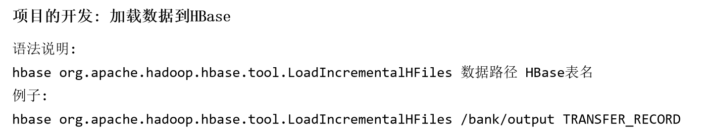

```
hbase org.apache.hadoop.hbase.tool.LoadIncrementalHFiles hdfs://node1.itcast.cn:8020/hbase/bulkload/output TRANSFER_RECORD
```

