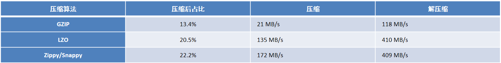

# day04_hbase课程笔记

今日内容:

* 1- hbase和hive的集成操作 (参考笔记搞定)
* 2- hbase的表结构设计 (理解掌握部分)
* 3- hbase的协处理器(了解)

## 1. HBase和Hive的集成操作

整合目的:  让hive支持可以从hbase中读取数据 

相当于让hive换一个读取位置而已, 其他都没有变化

### 1.1 HBase和hive的对比说明

* hbase: 基于hadoop  nosql数据库     存储数据  延迟低  接入在线业务(实时业务)
* hive:  基于hadoop    数据仓库工具    分析数据  延迟高  接入离线分析操作


注意:  hbase和hive是可以同时使用的, 可以使用hive读取hbase上数据, 从而实现离线分析操作


### 1.2 HBase和HIVE集成

首先需要先做集成的准备工作:

* 1) 将hive提供的一个和hbase集成的通信包放置到hbase的lib目录下

```properties
cd /export/server/hive-2.1.0/lib
cp hive-hbase-handler-2.1.0.jar /export/server/hbase-2.1.0/lib/
```

* 2) 将这个jar分发给另外两个hbase

```properties
cd /export/server/hbase-2.1.0/lib
scp -r hive-hbase-handler-2.1.0.jar node1:$PWD
scp -r hive-hbase-handler-2.1.0.jar node2:$PWD
```

* 3) 修改hive的hive-site.xml

```properties
cd /export/server/hive-2.1.0/conf
vim hive-site.xml 

输入 i   进入 插入模式

插入以下内容:
   <property>
        <name>hive.zookeeper.quorum</name>
        <value>node1,node2,node3</value>
   </property>

   <property>
        <name>hbase.zookeeper.quorum</name>
        <value>node1,node2,node3</value>
   </property>

   <property>
        <name>hive.server2.enable.doAs</name>
        <value>false</value>
   </property>
```

* 4) 修改hive中 hive-env.sh配置文件, 添加hbase的home路径

```properties
cd /export/server/hive-2.1.0/conf
vim hive-env.sh

输入i 进入插入模式

添加以下内容: 
export HBASE_HOME=/export/server/hbase-2.1.0/
```

* 5) 重启 hbase 和 hive


如何进行集成操作

* 1) 在hbase中创建一张表, 并添加相关的数据

```properties
create 'hive_hbase_score','C1'

put 'hive_hbase_score','rk001','C1:name','张三'
put 'hive_hbase_score','rk001','C1:age','20'
put 'hive_hbase_score','rk001','C1:score','80.5'

put 'hive_hbase_score','rk002','C1:name','李四'
put 'hive_hbase_score','rk002','C1:age','15'
put 'hive_hbase_score','rk002','C1:score','95.2'

put 'hive_hbase_score','rk003','C1:name','王五'
put 'hive_hbase_score','rk003','C1:age','18'
put 'hive_hbase_score','rk003','C1:score','89'

put 'hive_hbase_score','rk004','C1:name','赵六'
put 'hive_hbase_score','rk004','C1:age','20'
put 'hive_hbase_score','rk004','C1:score','50'


```

* 2) 在hive创建外部表与hbase进行集成操作

```sql
格式: 
create  external table 表名 (
    字段1 类型,
    字段2 类型,
    字段3 类型
    ......

) stored by 'org.apache.hadoop.hive.hbase.HBaseStorageHandler' with serdeproperties ("hbase.columns.mapping"=":key,列族:列名,列族:列名....") tblproperties("hbase.table.name"="hbase表名");

注意: 
	1) 在构建hive表的时候, 理论上 hive的表名和字段名是可以任意的, 但是建议与要映射hbase表保持一致
	2) hbase.columns.mapping  设置 hbase中列与 hive中列进行一一映射匹配, 第一个匹配第一个, 第二个匹配第二个,以此类推
	3) hbase.table.name 设置当前hive表映射hbase的那个表
	4) hbase.columns.mapping  和 hbase.table.name中内容是区分大小写的
	

示例:
create database day03_hivetohbase;
use day03_hivetohbase;
create  external table hive_hbase_score (
id string,
name string,
age string,
score string
) stored by 'org.apache.hadoop.hive.hbase.HBaseStorageHandler' with serdeproperties("hbase.columns.mapping"=":key,C1:name,C1:age,C1:score") tblproperties("hbase.table.name"="hive_hbase_score");
```

## 2. HBase的表结构设计

### 2.1 hbase的名称空间(命名空间)

​		hbase的名称空间 类似于hive中数据库或者mysql中数据库, 只不过叫法不同而已

思考: 为什么hive或者mysql中需要有数据库呢, 直接放置表有什么不好吗

```properties
1) 方便管理维护工作
2) 更好进行业务划分
3) 方便权限化管理
```

hbase的名称空间, 同样也是具有类似的功能的, 一般建议在生产环境下, 一个项目或者一个业务模块构建一个名称空间


默认情况下, hbase提供了两个名称空间: 

* default: 默认名称空间, 在创建hbase表的时候, 如果没有指定名称空间, 默认将表构建在default空间下
* hbase: hbase的系统名称空间, 主要是用于存储hbase的管理表, 比如 meta表就是存储在hbase名称空间下, 此空间一般我们不使用


如何使用名称空间呢?

```properties
1) 如何查看当前有那些名称空间呢? 
	如何查看所有的名称空间: list_namespace
	如何查看某一个名称空间: describe_namespace '名称空间名称'
2) 如何创建一个名称空间:
	create_namespace '名称空间名字'

3) 如何向某一个名称空间下创建表:
	create '名称空间:表名' ,'列族1'...

4) 如何删除名称空间:
	drop_namespace '名称空间名字' 
	

注意
	1) 一旦将表创建在某一个名称空间下, 在以后使用到这个表, 必须带上名称空间,只有default空间是可以省略
	2) 在删除一个名称空间的时候, 一定要保证当前这个空间下没有任何的表
	
```


### 2.2 hbase表的列族的设计

​		一句话: 列族建议越少越好, 能用一个来解决, 坚决不使用多个


在什么情况下我们可能需要构建多个列族呢? 一般建议 2~5个左右

````properties
情况一: 当表中列非常多的时候, 但是查询使用的时候, 仅仅使用其中某几个, 此时可以将常用字段放置在一个列族中, 其他不经常使用放置在另一个列族中

情况二: 一个表中数据, 可能需要对接多个不同业务,但是不同业务使用这个表的字段也是不同的, 可以针对不同业务使用字段, 将其放置到不同的列族中


场景: 后续使用数据的时候, 将一些常用的数据放置一起
````


### 2.3 hbase的表的压缩方案的选择

思考: 压缩主要解决什么问题?

```properties
能够在有限的空间下, 存储更多的数据
```

在使用压缩的时候, 压缩的方案其实有非常的多,比较出名: snappy GZ(GZIP) , LZO 



如何选择压缩方案呢?看性价比 (解压缩速率 和 压缩比)

* 当数据量比较大的时候,  写入请求 远远大于读取请求, 建议优先保障最大压缩比,建议使用GZ(GZIP)
* 当数据量比较大的时候,   读取请求 大于写入请求, 或者读写都比较高的时候, 建议使用 LZO / snappy


如何设置压缩方案呢?

```properties
格式: 
	1) 在创建表:  create '表名',{NAME=>'列族',COMPRESSION=>'压缩算法'}
	2) 在修改表:  alter '表名',{NAME=>'列族',COMPRESSION=>'压缩算法'}
```

注意:

* 1) 设置压缩后, 压缩只能在将数据落在hdfs上才能生效, 在memStore内存中无法压缩的
* 2) 目前hbase的版本, 只能使用GZ压缩方案, 无法使用LZO 和 snappy, 因为缺失LZO压缩包, 以及没有对HBase进行重新编译, 导致snappy无法使用

### 2.4 hbase表的预分区 

​		默认情况下一个表只有一个region, 一个region只能被一个regionServer所管理, 当这个表出现大量的并发读写操作的时候, 请问会有造成什么影响

```properties
	导致所有的请求全部打向到一个regionServer上, 从而导致这个regionServer的读写效率下降, 甚至可能出现宕机风险
```

如何解决问题? 思路

```properties
	是否可以让并发请求落在不同的regionServer上呢, 从而实现分担请求, 降低单个节点并发量, 那么此时需要表能够拥有多个region, 让多个region放置到不同regionServer上, 从来实现
```

解决措施: hbase的预分区 

目标: 让hbase的表在建表的时候, 就可以拥有多个region


如何实现region的预分区呢?

* 1) 手动预分区方案:

```properties
格式:
	create '表名','列族',SPLITS=>['','']
	在 [] 中设置范围即可
例如:  
	create 'test05_split','C1',SPLITS=>['10','20','30','40','a','z'] 
```

* 2) hash预分区方案:

```properties
格式:
	create '表名','列族',{NUMREGIONS=>N,SPLITALGO=>'HexStringSplit'}

示例:
	create 'test06_split','C1',{NUMREGIONS=>7,SPLITALGO=>'HexStringSplit'}
```


在实际生产中, 一般使用哪种分区方案呢? 两种都有

```properties
情况一: 当接下来插入的数据rowkey非常的熟悉情况下, 明确知道每个范围有多少条数据, 此时建议使用手动预分区

情况二: 当表中数据是未知的, 无法确定未来数据的rowkey的范围信息, 此时建议使用hash方案, 在后续插入数据的时候, 将rowkey的前缀设计为hash的前缀即可
```

一般来说, 构建region的数量为当前regionServer数量的2倍

思考: 请问使用region预分区, 是否可以解决并发分担不到不同regionServer上的问题呢?

```properties
并不能完全避免掉, 因为当插入数据都是某一个范围下的数据, 会导致所有请求依然打向到同一个region中, 即使有多个region, 也没用, 问题依然存在, 

如何解决呢? 需要对rowkey进行设计, 保证生产出来的rowkey能够均匀落在不同的region中 
```


### 2.5  hbase的中rowkey的设计原则

* 官方推荐设计方案:

```properties
1) 避免rowkey的数据使用固定的前缀: 比如以手机号作为前缀, 或者时间戳作为前缀
2) rowkey在设计的时候, 尽量短一些, 不建议过长, 同时列族 列名在设计也要短一些
	默认: hbase支持rowkey最长为64kb, 但是一般建议在0~100字节范围内, 通常在 10~30左右
3) 使用数值类型的字节作为rowkey要比使用string类型字节更加节省空间
4) 保证rowkey的唯一性
```

* 业务规定

```properties
1) rowkey设计需要满足一些固定的查询需求
2) 保证相关性的数据, 放置在一个region中
```


数据热点的解决方案

```properties
数据热点: 大部分数据都集中性落在某一个region中, 此时认为出现了数据热点

解决方案: 让rowkey前缀在不断的变化中  
	方案一: 反转策略   手机号反转 或者 时间戳反转
		好处: 解决热点问题
		弊端: 导致相关性数据被放置到了不同region中
	方案二: hash方案  (此种方案较多)  配合hash的预分区
		好处: 保证相关性数据被放置在一起, 同时大概率可以解决热点
		弊端: 如果某一个相关性数据比其他的都多的多, 依然会出现热点
	方案三: 加盐策略  直白加随机数
		好处: 解决热点问题
		弊端: 导致相关性数据被放置到了不同region中		
```


### 2.6 hbase的版本确界和TTL

#### 2.6.1 什么是数据版本确界

hbase的数据版本(version) 出现主要是为了解决什么问题呢? 

```properties
 解决: 历史版本数据是否需要存储的问题    版本默认为1, 表示只保留最新的版本数据即可, 版本设置越大, 表示需要记录的历史变化越多
```

* 上界(最大值):  最多能够保留多少个有效的历史版本数据   默认为 1

* 下界(最小值): 至少需要保留多少个历史版本的数据, 即使数据已经过期了  默认为 0

#### 2.6.2 什么是数据的TTL

TTL(Time to Live) : 存活时间

在hbase中, 可以对数据设置过期时间, 当达到过期时间后, 数据会自动被过期掉, 然后相等于删除掉了

默认的过期时间为 永久有效

#### 2.6.3 代码演示数据版本确界和TTL

```java

```


## 3. HBase的协处理器(了解)

* 思考: 求出表中年龄的最大值 , 表是hbase的表

  ```properties
  处理方案:
  	1) 通过scan 扫描全表数据
  	2) 遍历全表数据, 一个个进行比对操作, 找到最大值
  	
  目前这种处理方式效率比较低, 同时对客户端的压力比较大
  
  如何解决这种问题?
  	是否可以将这种求最大值的代码从客户端迁移到服务端, 让每个regionServer求出的每个region内部的最大值, 将这个最大值的结果返回客户端 客户端基于这个结果再次求出最终的最大值即可 (分而治之)
  	
  
  在hbase中为了能实时类似于这种操作, 专门提供协处理器
  ```

* observer: 类似于数据库中触发器, 或者可以理解为监听器, 可以通过observer对hbase中各种操作进行监听, 一旦发现触发了某种事件, 执行相应逻辑代码

  * 作用: 
    * 操作日志的记录
    * 权限的控制
    * ......

* endpoint: 类似于数据库中存储过程, 或者可以理解为将一段代码封装称为一个功能方法 , 将这个方法, 放置到服务端, 让各个regionServer执行操作, 将执行的结果返回给客户端, 客户端进行进一步的处理操作

  * 作用: 

    * 聚集计算: 求最大值  求最小值 求和  ....

      

