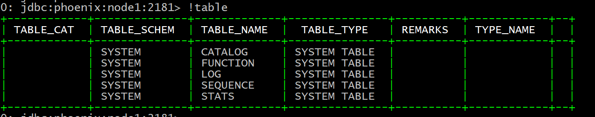
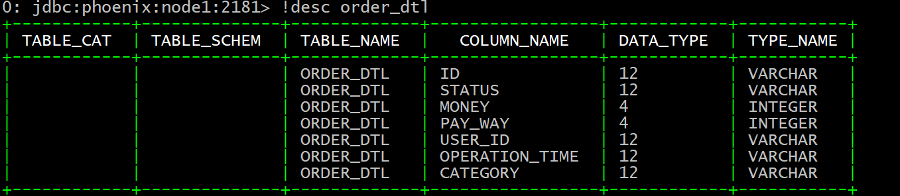
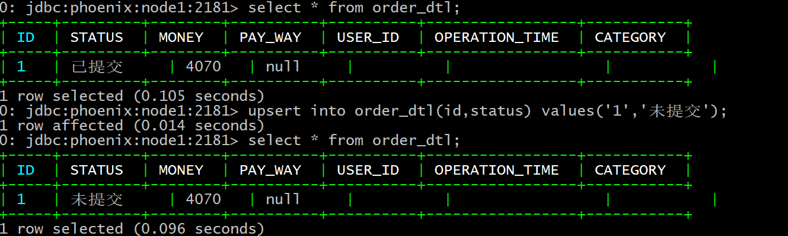
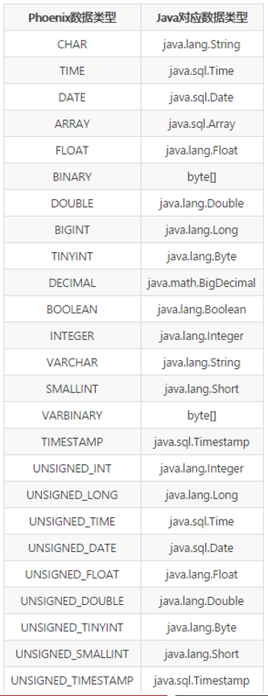
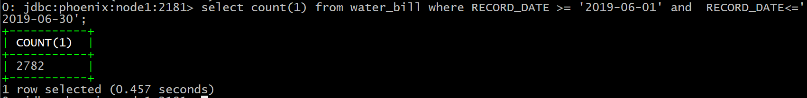

# day05_hbase与Phoenix课程笔记

今日内容:

* 1- HBase中版本确界和TTL (掌握)
* 2- HBase的协处理器 (了解)
* 3- Phoenix基本介绍 (了解)
* 4- Phoenix相关的安装(参考笔记安装成功)
* 5- Phoenix的基本使用 (掌握)
* 6- Phoenix的预分区操作 (掌握)
* 7- Phoenix的视图  (掌握)

## 1 hbase的版本确界和TTL

### 1.1 什么是数据版本确界

hbase的数据版本(version) 出现主要是为了解决什么问题呢? 

```properties
 解决: 历史版本数据是否需要存储的问题    版本默认为1, 表示只保留最新的版本数据即可, 版本设置越大, 表示需要记录的历史变化越多
```

* 上界(最大值):  最多能够保留多少个有效的历史版本数据   默认为 1

* 下界(最小值): 至少需要保留多少个历史版本的数据, 即使数据已经过期了  默认为 0

### 1.2 什么是数据的TTL

TTL(Time to Live) : 存活时间

在hbase中, 可以对数据设置过期时间, 当达到过期时间后, 数据会自动被过期掉, 然后相等于删除掉了

默认的过期时间为 永久有效

### 1.3 代码演示数据版本确界和TTL

```java
package com.itheima.hbase;

import org.apache.hadoop.conf.Configuration;
import org.apache.hadoop.hbase.Cell;
import org.apache.hadoop.hbase.CellUtil;
import org.apache.hadoop.hbase.HBaseConfiguration;
import org.apache.hadoop.hbase.TableName;
import org.apache.hadoop.hbase.client.*;
import org.apache.hadoop.hbase.util.Bytes;

import java.util.List;

// 演示 HBase的 版本确界 以及 TTL
public class HBaseVersionTTL {

    public static void main(String[] args) throws Exception {

        // 1. 根据hbase的连接工厂 创建 hbase的连接对象
        Configuration conf = HBaseConfiguration.create();
        conf.set("hbase.zookeeper.quorum","node1:2181,node2:2181,node3:2181");
        Connection hbaseConn = ConnectionFactory.createConnection(conf);

        //2. 根据连接对象获取相关的管理对象:  table  和 admin
        Admin admin = hbaseConn.getAdmin();
        //2.1:  先构建一个表, 设置版本信息 以及 TTL相关信息

        boolean flag = admin.tableExists(TableName.valueOf("TimeAndTTL"));
        if(! flag){
            // 说明 表不存在
            TableDescriptorBuilder tableDescBuilder = TableDescriptorBuilder.newBuilder(TableName.valueOf("TimeAndTTL"));

            // 设置列族信息
            ColumnFamilyDescriptorBuilder familyDescBuilder = ColumnFamilyDescriptorBuilder.newBuilder("C1".getBytes());
            // 对列族进行相关的设置: 版本  和  TTL
            familyDescBuilder.setMaxVersions(5);
            familyDescBuilder.setMinVersions(3);

            // ttl
            familyDescBuilder.setTimeToLive(180);

            tableDescBuilder.setColumnFamily(familyDescBuilder.build());

            admin.createTable(tableDescBuilder.build());
        }
        //2.2: 插入数据操作
        Table table = hbaseConn.getTable(TableName.valueOf("TimeAndTTL"));
        //3. 执行相关的操作
        // 3.1 执行插入数据:  插入一条  修改 5次  共计六个版本
        for(int i = 10 ; i<=10 ; i++){
            Put put = new Put("rk001".getBytes());

            put.addColumn("C1".getBytes(),"name".getBytes(),("张三"+i).getBytes());

            table.put(put);
        }

        //3.2: 获取数据(获取多个版本的数据)
        Get get = new Get("rk001".getBytes());
        // 指定get 操作 获取多个版本的数据,默认是只获取最新版本
        get.readAllVersions(); // 获取所有的版本的数据
        Result result = table.get(get);

        //4. 处理结果集
        List<Cell> cells = result.listCells();

        for (Cell cell : cells) {
            byte[] valueBytes = CellUtil.cloneValue(cell);

            System.out.println(Bytes.toString(valueBytes));

        }


        //5. 释放资源
        table.close();
        admin.close();
        hbaseConn.close();

    }

}

```


结论:

```properties
	当在代码中既设置了版本的确界 也设置了 TTL后, 当所有的版本数据都过期了, 至少也会保留 minVersion个版本的数据,以保证在查询的时候, 我们数据是有返回的
	但是一旦有新的版本数据加入后, 过期的数据, 无法在显示了
```


## 2. HBase的协处理器(了解)

* 思考: 求出表中年龄的最大值 , 表是hbase的表

  ```properties
  处理方案:
  	1) 通过scan 扫描全表数据
  	2) 遍历全表数据, 一个个进行比对操作, 找到最大值
  	
  目前这种处理方式效率比较低, 同时对客户端的压力比较大
  
  如何解决这种问题?
  	是否可以将这种求最大值的代码从客户端迁移到服务端, 让每个regionServer求出的每个region内部的最大值, 将这个最大值的结果返回客户端 客户端基于这个结果再次求出最终的最大值即可 (分而治之)
  	
  
  在hbase中为了能实现类似于这种操作, 专门提供协处理器
  ```

* observer: 类似于数据库中触发器, 或者可以理解为监听器, 可以通过observer对hbase中各种操作进行监听, 一旦发现触发了某种事件, 执行相应逻辑代码

  * 作用: 
    * 操作日志的记录
    * 权限的控制
    * ......

* endpoint: 类似于数据库中存储过程, 或者可以理解为将一段代码封装称为一个功能方法 , 将这个方法, 放置到服务端, 让各个regionServer执行操作, 将执行的结果返回给客户端, 客户端进行进一步的处理操作

  * 作用: 

    * 聚集计算: 求最大值  求最小值 求和  ....

      

## 3. apache Phoenix的基本介绍

​		Phoenix隶属于apache软件基金会, 开源免费, 是apache的顶级开源项目. Phoenix是基于hbase, Phoenix的出现主要的目的是为了提供一种全新的方式(SQL)来操作hbase, 同时对hbase进行了大量的优化操作, 能够让操作起来效率更加高效

​		一般来说使用Phoenix主要是进行OLTP操作, 结合业务使用, 执行一些基本即席查询(自定义查询)操作


## 4. apache Phoenix的安装

容易犯错的点:

```properties
1) Phoenix的jar包没有拷贝到hbase的lib目录中, 或者说没有將Phoenix的jar包分发到各个hbase的lib目录
2) 没有将hbase-site.xml放置到Phoenix的bin目录下 :  注意 Phoenix的bin目录本身就有一个hbase-site.xml
	一定要打开文件, 看一下内容

3) 在重启hbase的时候, 如果第一次没有启动成功, 建议直接 kill 掉, 然后重启, 如果重启依然失败的, 建议查看关于Phoenix的配置, 看看那个位置配置错误了. 细心一点, 多查一查(不要相信自己)
```


## 5. Apache Phoenix的基本入门操作

* 1) 如何在Phoenix查看所有的表

```properties
格式:
	!table
```



* 2) 如何在Phoenix创建表

```sql
格式:
create table [if not exists] 名称空间.表名 (
	rowkey名称  数据类型  primary key,
	列族名.列名  数据类型,
	列族名.列名  数据类型,
	.....
);
注意事项:
	1) 建表的时候, 第一个字段必须为rowkey, 必须添加primary key 字段名称随意
	2) 如果不加名称空间, 默认创建default空间下


示例: 创建order_dtl表:
create table  order_dtl (
id  varchar  primary key,
c1.status  varchar,
c1.money  integer,
c1.pay_way integer,
c1.user_id varchar,
c1.operation_time varchar,
c1.category varchar
);

说明: 
	通过desc查看表结构, 发现Phoenix会自动将小写字母转换为大写 (包括: 表名, 列族, 列名)

思考: 如果就想使用小写呢?  将需要使用小写内容, 使用双引号包裹即可 
create table  "order_dtl" (
id  varchar  primary key,
"c1".status  varchar,
c1."money"  integer,
"c1"."pay_way" integer,
c1.user_id varchar,
c1.operation_time varchar,
"c1".category varchar
);

注意:
	一旦使用了小写, 在后续只要使用到了这个小写的数据, 必须使用双引号,建议使用大写
```

* 3) 查看表的结构信息:

```sql
格式:
	!desc 表名

```



* 4) 如何插入数据

```sql
格式: 
	upsert into 表名(字段1,字段2,字段3...) values(值1,值2,值3...);

示例: 
	upsert into order_dtl(id,status,money) values('1','已提交',4070);
	upsert into order_dtl(id,status) values('1','未提交');
```



* 5) 如何删除数据:  与标准的SQL是一致的

* 6) 查询操作: 与标准的SQL是一致的  (单表操作都是支持的)

  * 注意: 不支持join操作

* 6) 如何删除表: 与标准的SQL是一致的

* 7) 分页操作:

```sql
插入一些执行分页的数据:
UPSERT INTO "ORDER_DTL" VALUES('000002','已提交',4070,1,'4944191','2020-04-25 12:09:16','手机;');
UPSERT INTO "ORDER_DTL" VALUES('000003','已完成',4350,1,'1625615','2020-04-25 12:09:37','家用电器;;电脑;');
UPSERT INTO "ORDER_DTL" VALUES('000004','已提交',6370,3,'3919700','2020-04-25 12:09:39','男装;男鞋;');
UPSERT INTO "ORDER_DTL" VALUES('000005','已付款',6370,3,'3919700','2020-04-25 12:09:44','男装;男鞋;');
UPSERT INTO "ORDER_DTL" VALUES('000006','已提交',9380,1,'2993700','2020-04-25 12:09:41','维修;手机;');
UPSERT INTO "ORDER_DTL" VALUES('000007','已付款',9380,1,'2993700','2020-04-25 12:09:46','维修;手机;');
UPSERT INTO "ORDER_DTL" VALUES('000008','已完成',6400,2,'5037058','2020-04-25 12:10:13','数码;女装;');
UPSERT INTO "ORDER_DTL" VALUES('000009','已付款',280,1,'3018827','2020-04-25 12:09:53','男鞋;汽车;');
UPSERT INTO "ORDER_DTL" VALUES('000010','已完成',5600,1,'6489579','2020-04-25 12:08:55','食品;家用电器;');
UPSERT INTO "ORDER_DTL" VALUES('000011','已付款',5600,1,'6489579','2020-04-25 12:09:00','食品;家用电器;');
UPSERT INTO "ORDER_DTL" VALUES('000012','已提交',8340,2,'2948003','2020-04-25 12:09:26','男装;男鞋;');
UPSERT INTO "ORDER_DTL" VALUES('000013','已付款',8340,2,'2948003','2020-04-25 12:09:30','男装;男鞋;');
UPSERT INTO "ORDER_DTL" VALUES('000014','已提交',7060,2,'2092774','2020-04-25 12:09:38','酒店;旅游;');
UPSERT INTO "ORDER_DTL" VALUES('000015','已提交',640,3,'7152356','2020-04-25 12:09:49','维修;手机;');
UPSERT INTO "ORDER_DTL" VALUES('000016','已付款',9410,3,'7152356','2020-04-25 12:10:01','维修;手机;');
UPSERT INTO "ORDER_DTL" VALUES('000017','已提交',9390,3,'8237476','2020-04-25 12:10:08','男鞋;汽车;');
UPSERT INTO "ORDER_DTL" VALUES('000018','已提交',7490,2,'7813118','2020-04-25 12:09:05','机票;文娱;');
UPSERT INTO "ORDER_DTL" VALUES('000019','已付款',7490,2,'7813118','2020-04-25 12:09:06','机票;文娱;');
UPSERT INTO "ORDER_DTL" VALUES('000020','已付款',5360,2,'5301038','2020-04-25 12:08:50','维修;手机;');
UPSERT INTO "ORDER_DTL" VALUES('000021','已提交',5360,2,'5301038','2020-04-25 12:08:53','维修;手机;');
UPSERT INTO "ORDER_DTL" VALUES('000022','已取消',5360,2,'5301038','2020-04-25 12:08:58','维修;手机;');
UPSERT INTO "ORDER_DTL" VALUES('000023','已付款',6490,0,'3141181','2020-04-25 12:09:22','食品;家用电器;');
UPSERT INTO "ORDER_DTL" VALUES('000024','已付款',3820,1,'9054826','2020-04-25 12:10:04','家用电器;;电脑;');
UPSERT INTO "ORDER_DTL" VALUES('000025','已提交',4650,2,'5837271','2020-04-25 12:08:52','机票;文娱;');
UPSERT INTO "ORDER_DTL" VALUES('000026','已付款',4650,2,'5837271','2020-04-25 12:08:57','机票;文娱;');


分页查询的格式:
	格式: select * from 表 limit 每页查询多少条 offset 从第几条开始查询 ;
	
	select * from order_dtl limit 5 offset 0;
	select * from order_dtl limit 5 offset 5;
```


## 6. 基于Phoenix实现hbase的预分区操作

* 1) 使用手动预分区方案 : 与hbase的手动预分区是一致的

```properties
格式: 
create table [if not exists] 名称空间.表名 (
	rowkey名称  数据类型  primary key,
	列族名.列名  数据类型,
	列族名.列名  数据类型,
	.....
) 
COMPRESSION='GZ'
SPLIT ON (定义分区内容);

示例: 
create table  order_dtl_01 (
id  varchar  primary key,
c1.status  varchar,
c1.money  integer,
c1.pay_way integer,
c1.user_id varchar,
c1.operation_time varchar,
c1.category varchar
)
COMPRESSION='GZ'
SPLIT ON ('10','20','30','40','a','z');

```

* 2) hash的预分区方案

```properties
格式:
create table [if not exists] 名称空间.表名 (
	rowkey名称  数据类型  primary key,
	列族名.列名  数据类型,
	列族名.列名  数据类型,
	.....
) 
COMPRESSION='GZ',SALT_BUCKETS=N;


示例: 
create table  order_dtl_02 (
id  varchar  primary key,
c1.status  varchar,
c1.money  integer,
c1.pay_way integer,
c1.user_id varchar,
c1.operation_time varchar,
c1.category varchar
)
COMPRESSION='GZ',SALT_BUCKETS=7;

注意:
	当使用第二种方式进行预分区操作时候,在插入数据时候, Phoenix会自动给rowkey进行加盐操作, 来确保数据不会发生热点问题
	但是通过Phoenix查询数据,作为Phoenix使用者无法感知到这个事情, 对用户是无感的
	
```

## 7. apache  Phoenix的视图

​	视图作用:   将hbase中非Phoenix构建的表,  能够使用Phoenix进行相关的操作

​	注意: 使用视图只能进行查询操作, 无法对数据进行处理


如何使用视图操作:

```sql
-- 格式: 
create view hbase表名(视图名) (
	rowkey字段 类型 primary key,
	列族.列名  类型,
	列族.列名  类型,
	....
)

删除视图格式:
	drop view 视图名;
注意:
	1) 视图名称 一定要和映射的hbase表名是一致的
	2) 视图中列族和列名也要和hbase对应映射表中列族和列名要保持一致
	3) 类型也要保持一致
```

案例: 将hbase中WATER_BILL表在Phoenix进行映射

```sql
create view WATER_BILL (
id varchar primary key,
C1.ADDRESS VARCHAR,
C1.LATEST_DATE VARCHAR,
C1.NAME  VARCHAR,
C1.NUM_CURRENT UNSIGNED_DOUBLE,
C1.NUM_PREVIOUS UNSIGNED_DOUBLE,
C1.NUM_USAGE UNSIGNED_DOUBLE,
C1.PAY_DATE VARCHAR,
C1.RECORD_DATE VARCHAR,
C1.SEX VARCHAR,
C1.TOTAL_MONEY UNSIGNED_DOUBLE
);
```



查询需求: 查询2019年 6月份用水量共有多少条记录

```sql
select count(1) from water_bill where RECORD_DATE >= '2019-06-01' and  RECORD_DATE<='2019-06-30'
```



经过多次查询, 每次查询时间大约为 0.45s


