# day06_Phoenix与Kafka

今日内容:

* 1- Phoenix的视图 (掌握)
* 2- Phoenix的二级索引 (掌握)
* 3- 消息队列的基本介绍 (理解)
* 4- kafka的基本介绍 (了解)
* 5- kafka的架构 (理解)
* 6- kafka的安装 (参考课件能够安装成功)
* 7- kafka的使用 (掌握)

## 1. Phoenix的视图

​	视图作用:   将hbase中非Phoenix构建的表,  能够使用Phoenix进行相关的操作

​	注意: 使用视图只能进行查询操作, 无法对数据进行处理


如何使用视图操作:

```sql
-- 格式: 
create view hbase表名(视图名) (
	rowkey字段 类型 primary key,
	列族.列名  类型,
	列族.列名  类型,
	....
)

删除视图格式:
	drop view 视图名;
注意:
	1) 视图名称 一定要和映射的hbase表名是一致的
	2) 视图中列族和列名也要和hbase对应映射表中列族和列名要保持一致
	3) 类型也要保持一致
```

案例: 将hbase中WATER_BILL表在Phoenix进行映射

```sql
create view WATER_BILL (
id varchar primary key,
C1.ADDRESS VARCHAR,
C1.LATEST_DATE VARCHAR,
C1.NAME  VARCHAR,
C1.NUM_CURRENT UNSIGNED_DOUBLE,
C1.NUM_PREVIOUS UNSIGNED_DOUBLE,
C1.NUM_USAGE UNSIGNED_DOUBLE,
C1.PAY_DATE VARCHAR,
C1.RECORD_DATE VARCHAR,
C1.SEX VARCHAR,
C1.TOTAL_MONEY UNSIGNED_DOUBLE
);
```


查询需求: 查询2019年 6月份用水量共有多少条记录

```sql
select count(1) from water_bill where RECORD_DATE >= '2019-06-01' and  RECORD_DATE<='2019-06-30';
```


经过多次查询, 每次查询时间大约为 0.45s

## 2. Phoenix的二级索引

索引有什么用呢? 提升查询的效率


默认情况, hbase只有对rowkey是存在索引的, 其他的列没有索引, 而Phoenix的出现可以帮助实现对其他列的索引操作

对于Phoenix为了能够提升对hbase的查询操作, 专门提供一些索引操作:

* 1) 全局索引
* 2) 本地索引
* 3) 覆盖索引
* 4) 函数索引


### 2.1 Phoenix索引的分类

全局索引:

```properties
	全局索引可以对Phoenix中表任意的字段构建索引操作, 构建索引后, 会单独的形成一张索引表, 索引表和目标表的region数量会保持一致, 当执行对目标表数据变更操作的时候, 同时也需要对索引表进行相应的修改操作, 此时对写入效率是有影响的,全局索引一般和覆盖索引组合效率效率会更高

适用性:  写少读多场景

注意:
	当执行SQL时候, 如果SQL中出现了非索引的列, 全局索引默认情况下无法生效

如何构建全局索引: 
	create index 索引名称 on 表名(列名, 列名2...)
```

本地索引

```properties
	本地索引可以给Phoenix中任意字段构建索引, 索引数据和目标表数据放置在一起的, 不需要单独有一个索引表, 由于都在一个表中, 自然对写入的影响比较小, 在执行查询的时候, Phoenix会自动选择是否需要使用本地索引, 即使SQL中存在一些非索引的列, 依然是可用的

适用范围: 写多读少情况

注意:
	在Phoenix中创建表的时候选择的hash预分区方式来构建, 请注意无法使用本地索引(支持不是特别好)

如何构建本地索引: 
	create local index 索引名称 on 表名(列名1, 列名2...)
```

覆盖索引

```properties
	覆盖索引无法单独使用, 必须结合全局索引或者本地索引共同使用, 大部分一般都是结合全局索引, 主要目的将一些不参与查询, 但是参与展示字段构建为覆盖索引, 放置在索引表中, 当查询对应数据的时候, 直接从覆盖索引将相关字段获取到, 避免再次去查询目标表

如何构建覆盖索引:
	create [local] index 索引名称 on 表名(列名1, 列名2...) include(覆盖索引字段...)
```

函数索引

```properties
	函数索引, 主要指的是可以针对某一个函数的结果构建索引, 将函数的结果存储起来, 当后续使用到这个函数的时候, 直接使用其结果即可
	

创建函数索引:
	create [local] index 索引名称 on 表名(函数(xxxx), 列名1...)
```


### 2.2 案例一: 创建全局索引+覆盖索引

需求: 查询已付款的订单ID和支持金额

```sql
SQL: 
	explain select  id,money, status  from  order_dtl_01 where status = '已付款';
```

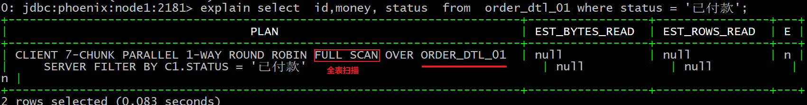

通过索引进行优化操作

```sql
create index index_order_dtl_01 on order_dtl_01(status) include(id,money);

说明:
	在Phoenix的5.1.2版本中, 在构建全局索引的时候, 新产生的这个索引的表region数量只有1个, 在上一个及老的版本中, 默认索引表的region数量和目标表的region数量是一致的
	
```

测试,SQL是否会走索引呢?

```sql
explain select  id,money, status  from  order_dtl_01 where status = '已付款';
```

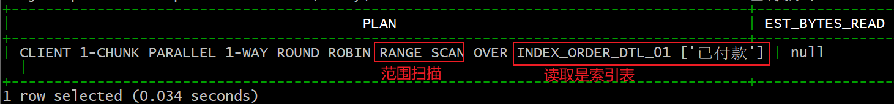

测试: 假设SQL中出现了非索引的列     无法走全局索引

```sql
explain select  id,money, status ,pay_way from  order_dtl_01 where status = '已付款';
```

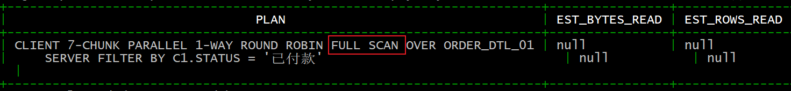

如果必须使用索引呢, 哪怕有非索引列  : 可以采用强制使用索引方案

```SQL
explain select  /*+INDEX(ORDER_DTL_01 INDEX_ORDER_DTL_01) */ id,money, status ,pay_way from  order_dtl_01 where status = '已付款';
```

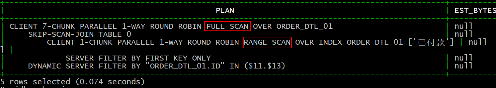


说明: 构建全局索引, 对目标表中不会有任何的影响


删除索引:

```
drop index INDEX_ORDER_DTL_01 on ORDER_DTL_01;
```


### 2.3 案例二:  本地索引

需求: 可能会根据 订单ID  订单状态, 支付金额, 支付方式, 用户ID 查询数据

构建索引操作

```sql
create local index local_index_order_dtl_02 on order_dtl_02(id,status,money,pay_way,user_id);

说明:
	构建本地索引后, 并不会在hbase上单独形成一张索引表
```

测试:   查询的字段 和 展示的字段都是有索引的

```sql
explain select  id,money, status ,pay_way from  order_dtl_02 where status = '已付款'; 走索引
```

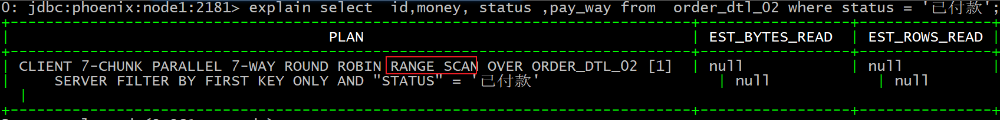

测试: 查询字段是索引字段, 展示字段存在非索引的字段

```sql
explain select  id,money, status ,pay_way,category from  order_dtl_02 where status = '已付款'; --走索引
```

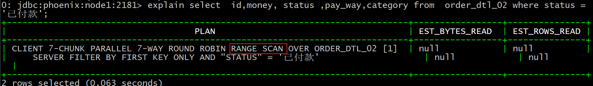

测试: 查询字段有非索引的字段, 展示字段无所谓

```sql
explain select  id,money, status ,pay_way,category from  order_dtl_02 where status = '已付款' and category = '维修;手机;';   -- 不走索引
```

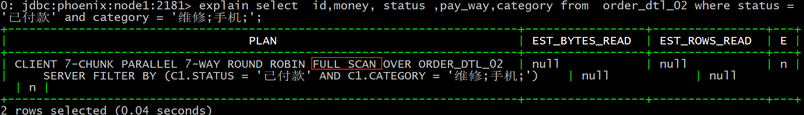

测试: 查询所有的字段

```
explain select  * from  order_dtl_02 where status = '已付款' ;  -- 不走索引

说明: 
	当表是按照加盐方式进行预分区操作表, 此时在使用本地索引的时候,执行全字段查询是无法走索引的 (兼容性不好)
```

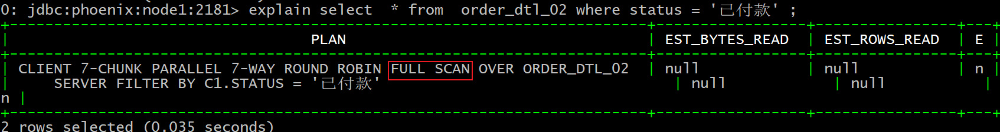

```properties
注意: 
	正常逻辑: 
		在使用本地索引的时候 正常来说, 如果SQL中出现了非索引的列, 其实是可以走本地索引的, 但是如果使用 Phoenix的hash预分区的方案, 那么本地索引支持粒度是不好, 但是如果使用Phoenix的手动预分区的方案, 不受此影响
		
	但是目前使用5.1.2 Phoenix的版本, 发现不管是手动预分区 还是hash预分区, 在使用本地索引的时候, 出现非索引列, 都显示为full scan 操作 , 应该是在最新版本中做了一些处理
	
	为了防止无法走索引: 
		这里建议 可以将本地索引和 覆盖索引组合使用, 避免这个问题
```


建议: 如果Phoenix表采用hash加盐预分区方案, 不建议使用本地索引


注意: 一旦使用了本地索引, 无法在原生hbase的API进行操作, 只能使用Phoenix进行操作


删除索引

```sql
drop index  local_index_order_dtl_02 on order_dtl_02 ;
```


### 2.4 案例三: 实现WATER_BILL查询操作

查询需求: 查询2019年 6月份用水量共有多少条记录

```sql
select count(1) from water_bill where RECORD_DATE >= '2019-06-01' and  RECORD_DATE<='2019-06-30'
```


经过多次查询, 每次查询时间大约为 0.45s


添加索引:

```
create local index local_index_water_bill on water_bill(RECORD_DATE);
```

再次查询操作

```sql
select count(1) from water_bill where RECORD_DATE >= '2019-06-01' and  RECORD_DATE<='2019-06-30'
```

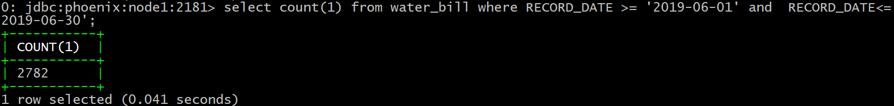

提升了差不多 10倍

## 3. 消息队列的基本介绍

### 3.1 消息队列产生的背景

什么是消息队列:

```properties
消息(message): 数据(流动现象)
队列(queue): 容器, 只不过这个容器具有先进先出的特性(FIFO)

消息队列: 指的数据存储在一个先进先出的容器中, 从容器的一侧传递到另一侧的过程
```

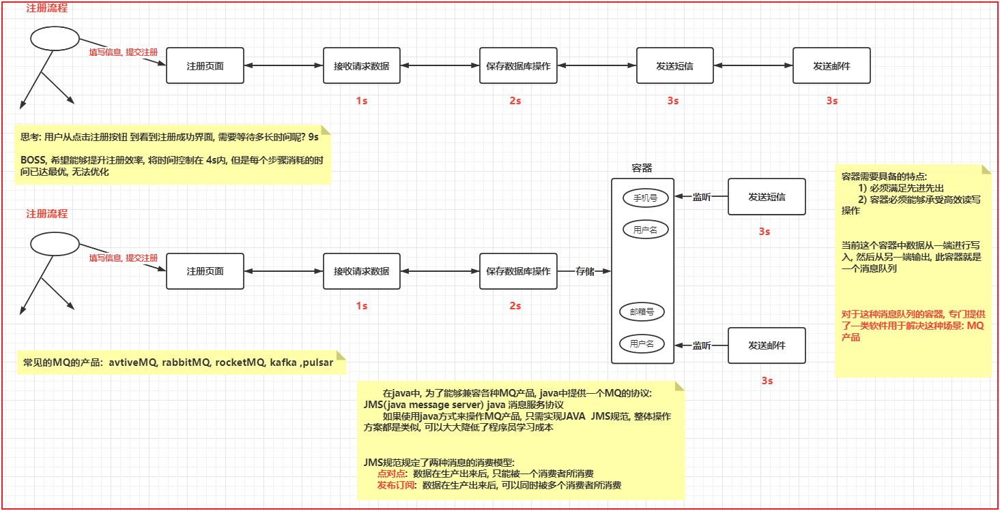


### 3.2 常见的消息队列的产品

```properties
常见的消息队列(MQ)的产品:     
	1) activeMQ: 出现时间比较早的一款消息队列的产品, 在前几年广泛被java程序员在业务环境中使用,此款目前整个社区活跃度在不断下降, 使用人群也在不断下降      
	2) RabbitMQ: 目前使用较多一款消息队列的产品 在业务环境中使用广泛, 社区活跃度比较高     
	3) RocketMQ:  是阿里提供一款消息队列的产品, 效率最高, 仅支持javaAPI,  目前仅在阿里系范围使用    
	4) kafka : 是大数据领域下一款消息队列的产品, 对JMS规范仅仅实现一部分, 并不是完整的实现
```

### 3.3 消息队列的作用有什么

* 1) 应用解耦合操作
* 2) 同步转异步
* 3) 限流削峰
* 4) 消息驱动系统


### 3.4 消息队列的两种消费模型

```properties
JMS: java message server  java 消息服务协议        
	如果消息队列的产品需要使用java连接, java建议实现JMS规范, 这样会大大降低了程序员学习成本
	JMS规范规定了两种消息模型:     
		点对点:  数据在生产出来后, 只能被一个消费者所消费     
		发布订阅: 数据在生产出来后, 可以同时被多个消费者所消费
```


## 4. kafka的基本介绍

​		kafka是apache旗下一款开源的顶级的消息队列的系统,  最早是来源于领英, 后期将其贡献给apache, 采用语言是scala.基于zookeeper, 启动kafka集群需要先启动zookeeper集群, 同时在zookeeper记录kafka相关的元数据

​		kafka本质上就是消息队列的中间件产品 ,kafka中消息数据是直接存储在磁盘上

kafka的特点:

* 1) 可靠性
* 2) 可扩展性
* 3) 耐用性
* 4) 高性能


目前使用kafka的版本为: 2.4.1

## 5. kafka的架构

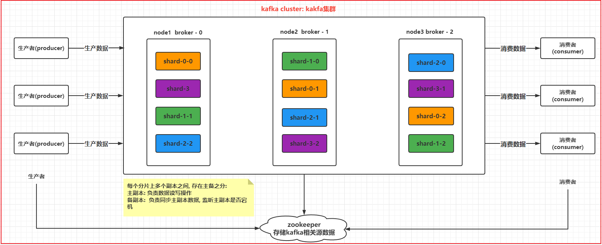

```properties
kafka cluster: kafka的集群
broker:  kafka的节点
producer:  生产者
consumer:  消费者
topic: 主题(话题)  理解为是一个逻辑容器(虚拟容器)
	shard:  分片 , 分片的数量不受节点数量限制
	replicas: 副本, 每个分片的副本数量最多和节点的数量是相等的(包含本身)
zookeeper: 对kafka集群进行管理, 保存kafka的元数据信息
```


## 6. kafka的安装操作

安装过程中, 可能遇到问题:

```
1) 忘记修改 broker id 
2) 忘记修改监听的地址, 或者是前面的注释没有打开
```

如何启动kafka: 在启动kafka之前, 一定要确保zookeeper是启动良好的

```properties
单节点: 每个节点都需要执行
cd /export/server/kafka_2.12-2.4.1/bin
前台启动: 
	./kafka-server-start.sh ../config/server.properties
后台启动: 
	nohup  ./kafka-server-start.sh ../config/server.properties 2>&1 &

注意: 第一次启动, 建议先前台启动, 观察是否可以正常启动, 如果OK, ctrl +C 退出, 然后挂载到后台


一次性全部启动:  node1
cd /export/onekey
启动: ./start-kafka.sh 

```

如何停止:

```properties
单节点: 每个节点都需要执行
cd /export/server/kafka_2.12-2.4.1/bin
操作:
	jps  然后通过 kill -9 
	或者:
	./kafka-server-stop.sh

一次性全部停止:  node1
cd /export/onekey
启动: ./stop-kafka.sh 
```


注意: 如果使用一次性脚本, 需要将资料中一次性脚本上传到  /export/onekey 目录下, 然后赋权限即可使用

## 7. kafka的shell命令的操作

​		kafka本质上就是一款消息队列的中间件, 负责将数据从一端传递到另一端工作, 学习kafka的使用, 无非就是学习如何将消息数据传递给kafka, 以及如何从kafka中获取消息过程


* 1) 创建topic

```properties
./kafka-topics.sh  --create --zookeeper node1:2181,node2:2181,node3:2181 --topic test01 --partitions 3  --replication-factor 2
```

* 2) 查看当前有那些topic

```properties
./kafka-topics.sh --list --zookeeper node1:2181,node2:2181,node3:2181
```

* 3) 如何查看某一个topic的详细信息

```properties
./kafka-topics.sh  --describe --zookeeper node1:2181,node2:2181,node3:2181 --topic test01
```

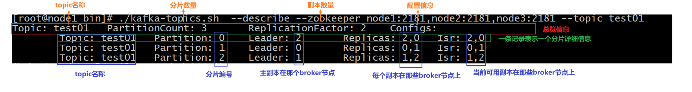

* 4) 如何修改topic

```properties
./kafka-topics.sh  --alter --zookeeper node1:2181,node2:2181,node3:2181 --topic test01 --partitions 5

只能调大分片的数量, 无法调小以及无法调整副本数量
```

* 5) 如何删除topic

```properties
./kafka-topics.sh --delete --zookeeper node1:2181,node2:2181,node3:2181 --topic test01

注意事项:
	默认情况下, kafka在删除topic的时候, 仅仅是标记删除, 不会直接将topic物理删除, 主要原因是topic中记录大量消息数据, 如果直接删除, 导致数据的丢失
	特殊点: 如果topic本身就没有任何数据, 此时删除也是物理删除

	如果想执行删除, 就是直接进行物理删除, 不进行标记删除, 如何做呢?  需要修改 server.properties文件
		delete.topic.enable  调整为 true
```

* 6)  模拟一个生产者. 用于生产数据到topic中

```properties
./kafka-console-producer.sh  --broker-list node1:9092,node2:9092,node3:9092 --topic test01
```

* 7) 模拟一个消费者, 用于接收消息

```properties
./kafka-console-consumer.sh --bootstrap-server node1:9092,node2:9092,node3:9092 --topic test01

--from-beginning  :  从头获取所有的消息
```

## 8.  kakfa的基准测试

​		基准测试: 一般在集群构建完成后, 或者是整个集群中加入了新的节点或者减少了一些节点后, 此时需要测试整个集群吞吐量, 查看其吞吐量是否可以满足业务要求


如何实施基准测试:

* 1) 创建一些topic: 每个topic具有不同分片和副本的数量, 后续进行综合性测试

```properties
./kafka-topics.sh --create --zookeeper node1:2181,node2:2181,node3:2181 --topic test02 --partitions 3  --replication-factor 1
```

* 2) 测试写入的效率

```properties
./kafka-producer-perf-test.sh --topic test02 --num-records 5000000 --throughput -1 --record-size 1000 --producer-props bootstrap.servers=node1:9092,node2:9092,node3:9092 ack=1

属性说明:
	--topic 指定要将数据写入到那个topic中
	--num-records : 总写入消息量
	--throughput : 是否需要限流  -1表示不限制
	--record-size : 每条数据的大小(字节)
	--producer-props : 设置生产者的配置信息
		bootstrap.servers : 集群地址
		ack : 消息确认方案

```

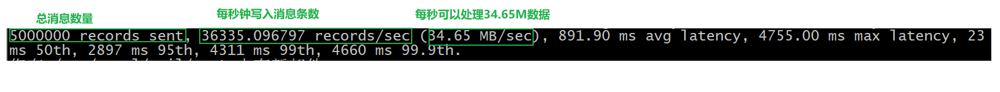

* 3) 测试读取效率

```properties
./kafka-consumer-perf-test.sh --broker-list node1:9092,node2:9092,node3:9092 --topic test02 --fetch-size 1048576 --messages 5000000

属性说明:	
	--fetch-size : 每次拉取的数据大小
```

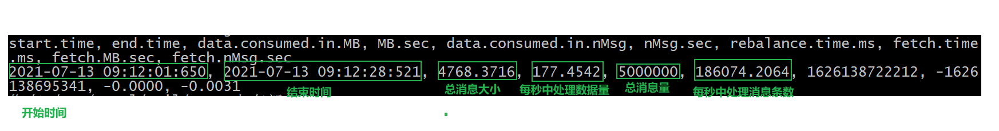


```properties
结论:  假设broker节点数量是无限多
	1) 当一个topic的分片的数量越多, 这个吞吐量越大
	2) 副本越多, 效率影响越大(效率越低)
```

## 9- kafka的JAVA API使用

* 1- 创建一个maven的项目, 并导入相关的依赖

```xml
    <repositories><!--代码库-->
        <repository>
            <id>aliyun</id>
            <url>http://maven.aliyun.com/nexus/content/groups/public/</url>
            <releases><enabled>true</enabled></releases>
            <snapshots>
                <enabled>false</enabled>
                <updatePolicy>never</updatePolicy>
            </snapshots>
        </repository>
    </repositories>

    <dependencies>

        <dependency>
            <groupId>org.apache.kafka</groupId>
            <artifactId>kafka-clients</artifactId>
            <version>2.4.1</version>
        </dependency>

        <dependency>
            <groupId>commons-io</groupId>
            <artifactId>commons-io</artifactId>
            <version>2.6</version></dependency>
        <dependency>
            <groupId>junit</groupId>
            <artifactId>junit</artifactId>
            <version>4.12</version>
        </dependency>
        <dependency>
            <groupId>org.testng</groupId>
            <artifactId>testng</artifactId>
            <version>6.14.3</version>
        </dependency>
    </dependencies>

    <build>
        <plugins>
            <plugin>
                <groupId>org.apache.maven.plugins</groupId>
                <artifactId>maven-compiler-plugin</artifactId>
                <version>3.1</version>
                <configuration>
                    <target>1.8</target>
                    <source>1.8</source>
                </configuration>
            </plugin>
        </plugins>
    </build>
```

* 2- 导入一个日志配置文件: log4j.properties

* 3- 创建包结构


### 9.1 使用 java API 完成生产者代码

```properties
package com.itheima.kafka.producer;

import org.apache.kafka.clients.producer.KafkaProducer;
import org.apache.kafka.clients.producer.Producer;
import org.apache.kafka.clients.producer.ProducerRecord;

import java.util.Properties;

// 此类 是kafka 生产者测试类
public class KafkaProducerTest {

    public static void main(String[] args) {
        // 1- 创建  生产者对象
        // 1.1 设置生产者相关的配置
        Properties props = new Properties();
        props.put("bootstrap.servers", "node1:9092,node2:9092,node3:9092");  // 指定kafka的地址
        props.put("acks", "all"); // 指定消息确认方案
        props.put("key.serializer", "org.apache.kafka.common.serialization.StringSerializer");// key序列化类
        props.put("value.serializer", "org.apache.kafka.common.serialization.StringSerializer"); // value序列化类

        //1.2: 构建生产者
        Producer<String, String> producer = new KafkaProducer<>(props);

        //2. 发送数据
        for (int i = 0; i < 10; i++) {
            //2.1 构建 数据的承载对象
            ProducerRecord<String, String> producerRecord = new ProducerRecord<>("test01",Integer.toString(i));

            producer.send(producerRecord);
        }

        //3. 释放资源
        producer.close();


    }
}

```

### 9.2 使用 java API 完成消费者代码

```properties
package com.itheima.kafka.consumer;

import org.apache.kafka.clients.consumer.ConsumerRecord;
import org.apache.kafka.clients.consumer.ConsumerRecords;
import org.apache.kafka.clients.consumer.KafkaConsumer;

import java.time.Duration;
import java.util.Arrays;
import java.util.Properties;

// 模拟消费者代码
public class KafkaConsumerTest {

    public static void main(String[] args) {
        // 1. 创建 kafka的消费者对象
        //1.1: 设置消费者的配置信息
        Properties props = new Properties();
        props.setProperty("bootstrap.servers", "node1:9092,node2:9092,node3:9092"); // 指定 kafka地址
        props.setProperty("group.id", "test"); // 指定消费组 id
        props.setProperty("enable.auto.commit", "true"); // 是否开启自动提交数据的偏移量
        props.setProperty("auto.commit.interval.ms", "1000"); // 自动提交的间隔时间
        props.setProperty("key.deserializer", "org.apache.kafka.common.serialization.StringDeserializer"); // 设置key反序列类
        props.setProperty("value.deserializer", "org.apache.kafka.common.serialization.StringDeserializer");// 设置value反序列化类

        //1.2: 创建kafka消费者对象
        KafkaConsumer<String, String> consumer = new KafkaConsumer<>(props);

        //2.设置消费者监听那些Topic
        consumer.subscribe(Arrays.asList("test01"));

        //3. 消费数据:  一直在消费, 只要有数据,立马进行处理操作
        while (true) {
            //3.1: 获取消息数据, 参数表示等待(超时)的时间
            ConsumerRecords<String, String> records = consumer.poll(Duration.ofMillis(100));
            for (ConsumerRecord<String, String> record : records) {
                long offset = record.offset(); // 偏移量信息
                String key = record.key(); // 获取key
                String value = record.value(); // 获取value
                int partition = record.partition();// 从哪个分区读取的数据

                System.out.println("偏移量:"+ offset +"; key值:"+key +";value值:"+ value +"; 分区:"+partition);
            }
        }


    }
}
```

## 10- kafka的核心原理

### 10.1 kafka的分片和副本

分片和副本 都是属于Topic:

* 分片主要解决什么问题的?

```properties
	topic可以理解为是一个大的容器(逻辑), 分片相当于将topic划分为多个小容器, 将这些小容器分布在不同的broker上, 进行分布式存储, 分片的数量不受节点数量限制

作用:
	1- 提升吞吐量, 前提 kafka节点充足下
	2- 解决单台节点存储有限的问题, 可以通过分片实现分布式存储
	3- 提高并发能力
```

* 副本主要解决什么问题的?

```properties
对topic中每一个分片构建多个副本, 从而保证数据不能丢失, 副本的数量最多与节点数量是相等, 一般来说副本为 1~3个
作用:
	提升数据可靠性, 防止数据丢失
```


### 10.2 kafka是如何保证数据不丢失

#### 10.2.1 生产者如何保证数据不丢失

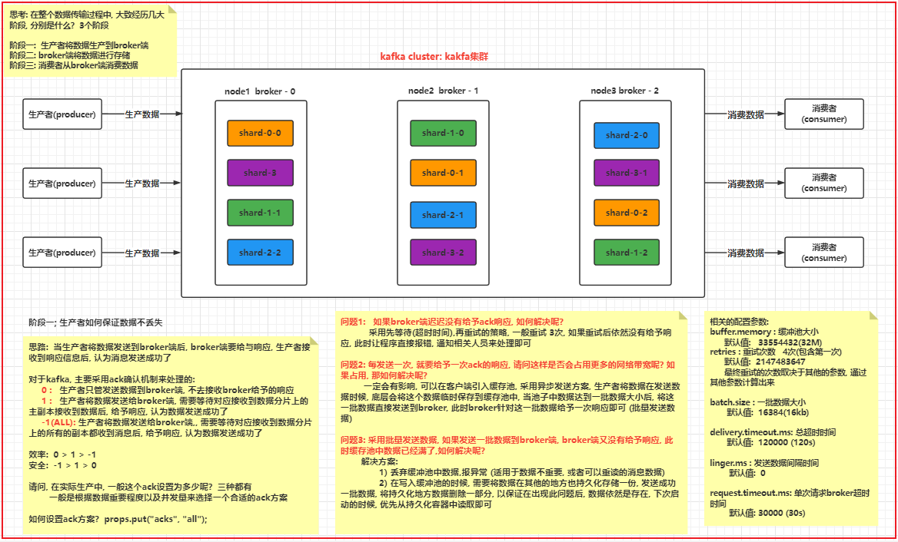


