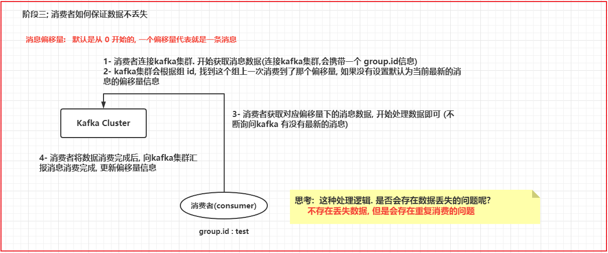
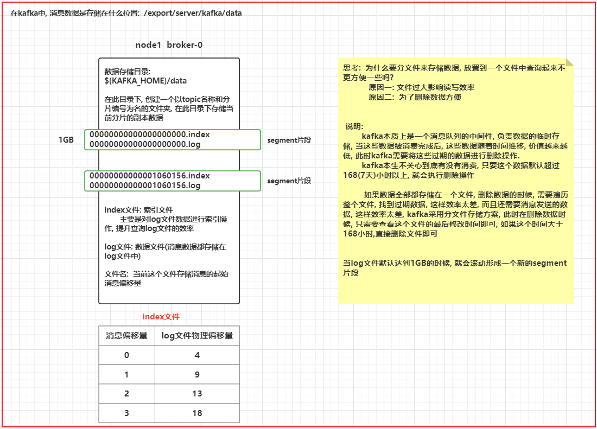
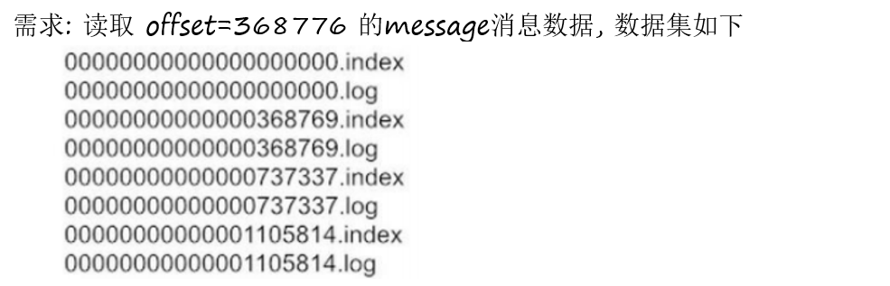

# day07_kafka课件笔记

今日内容:

* 1- 如何完成同步发送和异步发送数据(知道)
* 2- broker和消费端是如何保证数据不丢失 (理解)
* 3- kafka的消息存储和查询机制 (理解)
* 4- kafka的生产者数据分发机制 (理解)
* 5- kafka的消费者负载均衡机制 (理解)
* 6- kafka的监控界面的使用 (大致了解)
* 7-kafka的数据积压的问题 (知道如何发现数据积压)
* 8- kafka的配额限速的操作 (简单记录)

## 1- kafka的核心原理

### 1.1 kafka的分片和副本

分片和副本 都是属于Topic:

* 分片主要解决什么问题的?

```properties
	topic可以理解为是一个大的容器(逻辑), 分片相当于将topic划分为多个小容器, 将这些小容器分布在不同的broker上, 进行分布式存储, 分片的数量不受节点数量限制

作用:
	1- 提升吞吐量, 前提 kafka节点充足下
	2- 解决单台节点存储有限的问题, 可以通过分片实现分布式存储
	3- 提高并发能力
```

* 副本主要解决什么问题的?

```properties
对topic中每一个分片构建多个副本, 从而保证数据不能丢失, 副本的数量最多与节点数量是相等, 一般来说副本为 1~3个
作用:
	提升数据可靠性, 防止数据丢失
```


### 1.2 kafka是如何保证数据不丢失

#### 1.2.1 生产者如何保证数据不丢失


* 同步的发送方式

```properties
package com.itheima.kafka.producer;

import org.apache.kafka.clients.producer.KafkaProducer;
import org.apache.kafka.clients.producer.Producer;
import org.apache.kafka.clients.producer.ProducerRecord;

import java.util.Properties;
import java.util.concurrent.ExecutionException;

// 演示 kafka的生产者同步的发送数据方式
public class KafkaProducerSyncTest {
    @SuppressWarnings("ALL")
    public static void main(String[] args) {

        // 1- 创建  生产者对象
        // 1.1 设置生产者相关的配置
        Properties props = new Properties();
        props.put("bootstrap.servers", "node1:9092,node2:9092,node3:9092");  // 指定kafka的地址
        props.put("acks", "all"); // 指定消息确认方案
        props.put("key.serializer", "org.apache.kafka.common.serialization.StringSerializer");// key序列化类
        props.put("value.serializer", "org.apache.kafka.common.serialization.StringSerializer"); // value序列化类

        //1.2: 构建生产者
        Producer<String, String> producer = new KafkaProducer<>(props);

        //2. 发送数据
        for (int i = 0; i < 10; i++) {
            //2.1 构建 数据的承载对象
            ProducerRecord<String, String> producerRecord = new ProducerRecord<>("test01",Integer.toString(i));

            try {
                // 使用get  其实就是同步方式, 会当发送后, 会一直等待响应, 如果长时间没有响应, 就会重试, 如果依然没有, 直接报错
                // get支持自定义超时的时间
                producer.send(producerRecord).get();
                //如果没有抛出异常, 说明数据发送成功了
            } catch (Exception e) {
                e.printStackTrace();
                // 如果抛出异常, 说明数据发送失败(已经重试后的失败)
                // 此处代码 编写发送失败后, 处理业务逻辑代码

            }
        }

        //3. 释放资源
        producer.close();

    }
}

```

* 异步的有返回值的处理方案

```properties
package com.itheima.kafka.producer;

import org.apache.kafka.clients.producer.*;

import java.util.Properties;

// 演示 kafka的生产者异步的发送数据方式
public class KafkaProducerAsyncTest {
    @SuppressWarnings("ALL")
    public static void main(String[] args) {

        // 1- 创建  生产者对象
        // 1.1 设置生产者相关的配置
        Properties props = new Properties();
        props.put("bootstrap.servers", "node1:9092,node2:9092,node3:9092");  // 指定kafka的地址
        props.put("acks", "all"); // 指定消息确认方案
        props.put("key.serializer", "org.apache.kafka.common.serialization.StringSerializer");// key序列化类
        props.put("value.serializer", "org.apache.kafka.common.serialization.StringSerializer"); // value序列化类

        //1.2: 构建生产者
        Producer<String, String> producer = new KafkaProducer<>(props);

        //2. 发送数据
        for (int i = 0; i < 10; i++) {
            //2.1 构建 数据的承载对象
            ProducerRecord<String, String> producerRecord = new ProducerRecord<>("test01",Integer.toString(i));

      
            producer.send(producerRecord, new Callback() {
                @Override
                public void onCompletion(RecordMetadata metadata, Exception exception) {
                        // 此方法为回调函数的方式, 当进行异步发送的时候, 不管最终是成功了还是失败了, 都会回调此函数
                    
                    if(exception != null){
                        // 说明有异常, 发送失败了
                        // 在此处, 编写发送失败的处理业务逻辑代码
                    }
                    // 否则就没有异常, 正常发送
                }
            });
         
        }

        //3. 释放资源
        producer.close();

    }
}

```

#### 1.2.2 broker端如何保证数据不丢失

broker主要将消息数据存储下来, 那么如何保证数据不丢失呢?

```properties
多副本机制  +  生产者的ack为 -1
```


#### 1.2.3 消费端如何保证数据不丢失



```properties
思考: 消费偏移量数据是存储在哪里呢? 
	在kafka的老版本(kafka 0.8x下)是存储在zookeeper中, 在新版本中消费者消息偏移量信息是存储在broker端, 通过一个topic来存储的: __consumer_offset
	此topic具有50个分区, 1个副本
```


提交偏移量的方式, 主要有两种方式, 一种自动提交偏移量 和  手动提交偏移量

```properties
package com.itheima.kafka.consumer;

import org.apache.kafka.clients.consumer.ConsumerRecord;
import org.apache.kafka.clients.consumer.ConsumerRecords;
import org.apache.kafka.clients.consumer.KafkaConsumer;

import java.time.Duration;
import java.util.Arrays;
import java.util.Properties;

// 模拟消费者代码 _ 手动提交偏移量
public class KafkaConsumerTest02 {
    @SuppressWarnings("ALL")
    public static void main(String[] args) {
        // 1. 创建 kafka的消费者对象
        //1.1: 设置消费者的配置信息
        Properties props = new Properties();
        props.setProperty("bootstrap.servers", "node1:9092,node2:9092,node3:9092"); // 指定 kafka地址
        props.setProperty("group.id", "test"); // 指定消费组 id
        props.setProperty("enable.auto.commit", "false"); // 是否开启自动提交数据的偏移量
        props.setProperty("key.deserializer", "org.apache.kafka.common.serialization.StringDeserializer"); // 设置key反序列类
        props.setProperty("value.deserializer", "org.apache.kafka.common.serialization.StringDeserializer");// 设置value反序列化类

        //1.2: 创建kafka消费者对象
        KafkaConsumer<String, String> consumer = new KafkaConsumer<>(props);

        //2.设置消费者监听那些Topic
        consumer.subscribe(Arrays.asList("test01"));

        //3. 消费数据:  一直在消费, 只要有数据,立马进行处理操作
        while (true) {
            //3.1: 获取消息数据, 参数表示等待(超时)的时间
            ConsumerRecords<String, String> records = consumer.poll(Duration.ofMillis(100));
            for (ConsumerRecord<String, String> record : records) {
                long offset = record.offset(); // 偏移量信息
                String key = record.key(); // 获取key
                String value = record.value(); // 获取value
                int partition = record.partition();// 从哪个分区读取的数据

                System.out.println("偏移量:"+ offset +"; key值:"+key +";value值:"+ value +"; 分区:"+partition);
                
                // 当消息消费完成后, 提交偏移量信息 : 一定不要丢失提交偏移量的代码. 否则 会造成大量的重复消费问题
                consumer.commitSync(); // 同步提交
                consumer.commitAsync(); // 异步提交
            }
        }


    }
}

```


### 1.3. kafka的消息存储和查询机制

#### 1.3.1 kafka的消息存储



如何修改默认的过期时间呢?

```properties
# server.properties的103行位置:  默认值为 168小时
log.retention.hours=168

# 设置一个log文件的大小, 默认为: 1073741824 (1GB)
log.segment.bytes=1073741824
```

#### 1.3.2 kafka的数据查询机制



查询数据过程:

```properties
1) 先确定这条消息在那个segment片段中
2) 到对应片段中找index文件, 根据offset查询消息数据在log文件的那个物理偏移量位置
3) 根据从index查询到的偏移量信息, 到 log文件顺序查询(磁盘查询方式)到对应范围下数据即可
```


磁盘的读写分为两种读写方式: 顺序读写  和 随机读写

```properties
顺序读写效率远远高于随机读写
```


### 1.4 kafka中生产者的数据分发策略

​			kafka生产者数据分发策略:   指的生产者在生产数据到达broker指定topic中, 最终这条数据被topic中哪一个分片接收到了, 这就是生产者分发机制

```properties
思考: 常见的分发策略
1) hash策略
2) 轮询策略
3) 指定分区策略
4) 确定每个分区范围分发

那么kafka支持那些分发策略呢? 
1) 粘性分区策略(老版本(2.4以前): 轮询)
2) hash取模策略
3) 指定分区策略
4) 自定义分区


如何设置分发策略呢?  与 ProducerRecord 和 DefaultPartitioner关系很大

1) 粘性分区策略(老版本(2.4以前): 轮询)
	# 当生成数据时候, 使用这个只需要传递value发送方案, 底层走的 粘性分区策略(老版本(2.4以前): 轮询)
 	public ProducerRecord(String topic, V value) {
        this(topic, null, null, null, value, null);
    }
	# 为什么这么说呢? 原因是 DefaultPartitioner
	public int partition(String topic, Object key, byte[] keyBytes, Object value, byte[] valueBytes, Cluster cluster) {
		# 当 key为null的时候, 执行  stickyPartitionCache (粘性分区)
        if (keyBytes == null) {
            return stickyPartitionCache.partition(topic, cluster);
        } 
        List<PartitionInfo> partitions = cluster.partitionsForTopic(topic);
        int numPartitions = partitions.size();
        // hash the keyBytes to choose a partition
        return Utils.toPositive(Utils.murmur2(keyBytes)) % numPartitions;
    }

2) hash取模策略
	# 当发送数据的时候, 如果传递 k 和 v , 默认使用 hash取模分区方案, 根据key进行hash取模
	public ProducerRecord(String topic, K key, V value) {
        this(topic, null, null, key, value, null);
    }
    # 为什么这么说呢? 原因是 DefaultPartitioner
    public int partition(String topic, Object key, byte[] keyBytes, Object value, byte[] valueBytes, Cluster cluster) {
		# 当 key为null的时候, 执行  stickyPartitionCache (粘性分区)
        if (keyBytes == null) {
            return stickyPartitionCache.partition(topic, cluster);
        } 
        # 当key不为null的时候, 获取topic的所有分区, 然后根据key进行hash取模
        List<PartitionInfo> partitions = cluster.partitionsForTopic(topic);
        int numPartitions = partitions.size();
        // hash the keyBytes to choose a partition
        return Utils.toPositive(Utils.murmur2(keyBytes)) % numPartitions;
    }

3) 指定分区策略
	# 当发送数据的时候, 需要明确指出给那个partition发送数据 : ProducerRecord构造
	# 分片是从0开始的, 如果是三个分片: 0 1  2
	public ProducerRecord(String topic, Integer partition, K key, V value) {
        this(topic, partition, null, key, value, null);
    }
    
    此时这种分发策略 与 defaultPartitions 没有关系了

4) 自定义分区策略: (抄. 官方源码DefaultPartitioner)
	4.1) 创建一个类, 实现Partitioner 接口
	4.2) 重写接口中的partition方法, 返回值表示分区的编号
	4.3) 按照业务逻辑实现方法中分区方案
	4.4) 告知给kafka, 使用新的分区方案
		参数:	partitioner.class :
				默认值: org.apache.kafka.clients.producer.internals.DefaultPartitioner
		通过生产者的properties对象, 重新设置一下partitioner.class 参数即可
```


小作业:  课后分别测试一下每种分发策略, 尤其观察粘性分区策略

```properties
测试的时候, 需要开启多个消费者, 让每个消费者监听不同分片上的数据即可
./kafka-console-consumer.sh --bootstrap-server node1:9092,node2:9092,node3:9092 --topic xxx --partition 分区编号
```


### 1.5 kafka的负载均衡机制


