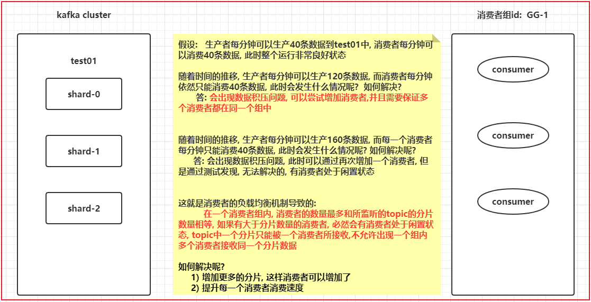

# day08_kafka与综合案例

今日内容:

* 1- 演示分区以及讲解粘性分区 (理解)
* 2- kafka的消费者负载均衡机制  (理解)
* 3- kafka的监控安装操作 (参考课件安装成功即可)
* 4- kafka的数据积压问题 (如何发现积压)
* 5- kafka的配额限速 (知道干嘛用的, 记录好)
* 综合案例
  * 案例基本介绍 (了解)
  * 数据源介绍 (知道)
  * 数据采集: flume的安装 (参考课件安装成功即可)


## 1- kafka的生产者的分发机制(演示及粘性分区说明)

​			kafka生产者数据分发策略:   指的生产者在生产数据到达broker指定topic中, 最终这条数据被topic中哪一个分片接收到了, 这就是生产者分发机制

```properties
思考: 常见的分发策略
1) hash策略
2) 轮询策略
3) 指定分区策略
4) 确定每个分区范围分发

那么kafka支持那些分发策略呢? 
1) 粘性分区策略(老版本(2.4以前): 轮询)
2) hash取模策略
3) 指定分区策略
4) 自定义分区


如何设置分发策略呢?  与 ProducerRecord 和 DefaultPartitioner关系很大

1) 粘性分区策略(老版本(2.4以前): 轮询)
	# 当生成数据时候, 使用这个只需要传递value发送方案, 底层走的 粘性分区策略(老版本(2.4以前): 轮询)
 	public ProducerRecord(String topic, V value) {
        this(topic, null, null, null, value, null);
    }
	# 为什么这么说呢? 原因是 DefaultPartitioner
	public int partition(String topic, Object key, byte[] keyBytes, Object value, byte[] valueBytes, Cluster cluster) {
		# 当 key为null的时候, 执行  stickyPartitionCache (粘性分区)
        if (keyBytes == null) {
            return stickyPartitionCache.partition(topic, cluster);
        } 
        List<PartitionInfo> partitions = cluster.partitionsForTopic(topic);
        int numPartitions = partitions.size();
        // hash the keyBytes to choose a partition
        return Utils.toPositive(Utils.murmur2(keyBytes)) % numPartitions;
    }

2) hash取模策略
	# 当发送数据的时候, 如果传递 k 和 v , 默认使用 hash取模分区方案, 根据key进行hash取模
	public ProducerRecord(String topic, K key, V value) {
        this(topic, null, null, key, value, null);
    }
    # 为什么这么说呢? 原因是 DefaultPartitioner
    public int partition(String topic, Object key, byte[] keyBytes, Object value, byte[] valueBytes, Cluster cluster) {
		# 当 key为null的时候, 执行  stickyPartitionCache (粘性分区)
        if (keyBytes == null) {
            return stickyPartitionCache.partition(topic, cluster);
        } 
        # 当key不为null的时候, 获取topic的所有分区, 然后根据key进行hash取模
        List<PartitionInfo> partitions = cluster.partitionsForTopic(topic);
        int numPartitions = partitions.size();
        // hash the keyBytes to choose a partition
        return Utils.toPositive(Utils.murmur2(keyBytes)) % numPartitions;
    }

3) 指定分区策略
	# 当发送数据的时候, 需要明确指出给那个partition发送数据 : ProducerRecord构造
	# 分片是从0开始的, 如果是三个分片: 0 1  2
	public ProducerRecord(String topic, Integer partition, K key, V value) {
        this(topic, partition, null, key, value, null);
    }
    
    此时这种分发策略 与 defaultPartitions 没有关系了

4) 自定义分区策略: (抄. 官方源码DefaultPartitioner)
	4.1) 创建一个类, 实现Partitioner 接口
	4.2) 重写接口中的partition方法, 返回值表示分区的编号
	4.3) 按照业务逻辑实现方法中分区方案
	4.4) 告知给kafka, 使用新的分区方案
		参数:	partitioner.class :
				默认值: org.apache.kafka.clients.producer.internals.DefaultPartitioner
		通过生产者的properties对象, 重新设置一下partitioner.class 参数即可
```


小作业:  课后分别测试一下每种分发策略, 尤其观察粘性分区策略

```properties
测试的时候, 需要开启多个消费者, 让每个消费者监听不同分片上的数据即可
./kafka-console-consumer.sh --bootstrap-server node1:9092,node2:9092,node3:9092 --topic xxx --partition 分区编号
```


什么是粘性分区策略:

```properties
	当生产者开始发送数据, 如果只传递了value的数据, 此时kafka会采用粘性分区策略, 首先会先随机的选择一个分区, 然后尽可能的黏上这个分区, 将这一批数据全部写入到这一个分区中, 当下次请求再来的时候, 重新在随机选择一个分区(如果间隔时间比较短, 大概率会黏住上一个分区), 再黏住这个分区, 将数据写入到这个分区下, 这种分区方案称为粘性分区策略

粘性分区是kafka2.4.x及以上版本支持的一种全新的分区策略 在2.4以下的版本中, 采用的轮询方案

老版本轮询:
	当生产者准备好一批数据后, 将这一批数据写入到某一个topic中, 如果采用轮询方案, 需要将这一批数据分为多个小批次, 分别对应不同的分片,将各个小批次的数据发送给对应的分片下即可, 而这种操作需要额外在一批数据上再次进行分批处理, 导致生产效率下降, 所以说在新版本中, 将其替换为粘性分区
```


## 2- kafka的消费者负载均衡机制




```properties
思考: 如果使用kafka模拟点对点 和 发布订阅 方式

点对点:   一个消费只能被一个消费者所接收
	让所有监听这个topic的消费者都属于同一个消费者组内即可

发布订阅:  一个消息可以被多个消费者所接收
	让所有监听这个topic的消费者都属于不同的消费者组内即可
```


## 3- 综合案例基本介绍


```properties
即席查询需求: 
	需求根据发件人账号 和 收件人账户 以及 聊天的时间 查询相关的聊天信息

思考: 聊天数据 具有什么特点呢? 
1) 数据体量很大
2) 写入并发量很大, 远远大于读取并发量
3) 数据具备随机读写


数据应该往哪里存储呢? HBase + Phoenix(即席查询) + hive
```


## 4- 综合案例数据源介绍


模拟数据源:

* 1- 将资料中: 资料\生产数据工具 下的 Excel文件 和 jar包 全部上传到 node1
  * 目录位置: /export/data/momo_init

```properties
mkdir -p /export/data/momo_init

cd /export/data/momo_init

rz 上传文件
```


* 2- 执行 jar包
  * 格式:

```properties
java -jar xxx.jar  读取初始数据路径    输出目的地路径   最大随机产生数据间隔时间

注意:  
	输出目的地路径地址必须存在
	输出目录路径后面最后带上一个  /
	
相关的操作: 
	mkdir -p  /export/data/momo_data
	
	cd  /export/data/momo_init
	

说明: 生成数据 jar包特点
	1) 数据不断的向指定的输出目录下进行生产
	2) 不断的向一个文件中进行数据追加操作
	3) 每一条数据中字段与字段之间的分隔符号为 \001
```


