# day10_综合案例课程笔记

今日内容:

* 1- 案例架构说明
* 2- 综合案例数据采集操作
* 3- 数据存储操作
* 4- 与Phoenix和hive集成
* 5- 流式计算
* 6- flink的相关内容

## 1- 综合案例基本介绍

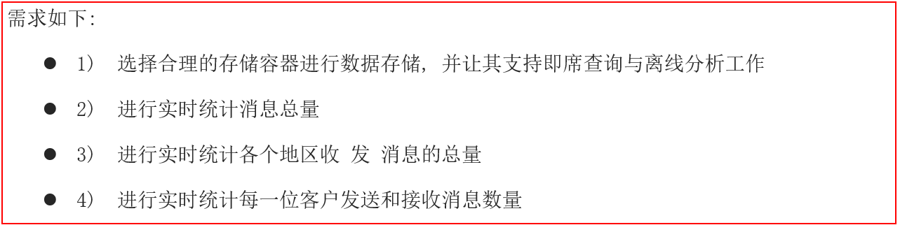

```properties
即席查询需求: 
	需求根据发件人账号 和 收件人账户 以及 聊天的时间 查询相关的聊天信息

思考: 聊天数据 具有什么特点呢? 
1) 数据体量很大
2) 写入并发量很大, 远远大于读取并发量
3) 数据具备随机读写


数据应该往哪里存储呢? HBase + Phoenix(即席查询) + hive
```


## 2- 综合案例数据源介绍

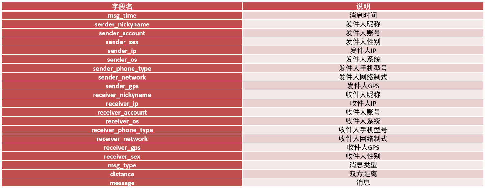


模拟数据源:

* 1- 将资料中: 资料\生产数据工具 下的 Excel文件 和 jar包 全部上传到 node1
  * 目录位置: /export/data/momo_init

```properties
mkdir -p /export/data/momo_init

cd /export/data/momo_init

rz 上传文件
```

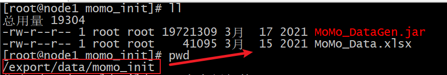

* 2- 执行 jar包
  * 格式:

```properties
java -jar xxx.jar  读取初始数据路径    输出目的地路径   最大随机产生数据间隔时间

注意:  
	输出目的地路径地址必须存在
	输出目录路径后面最后带上一个  /
	
相关的操作: 
	mkdir -p  /export/data/momo_data
	
	cd  /export/data/momo_init
	

说明: 生成数据 jar包特点
	1) 数据不断的向指定的输出目录下进行生产
	2) 不断的向一个文件中进行数据追加操作
	3) 每一条数据中字段与字段之间的分隔符号为 \001
```


## 3- 陌陌案例架构说明

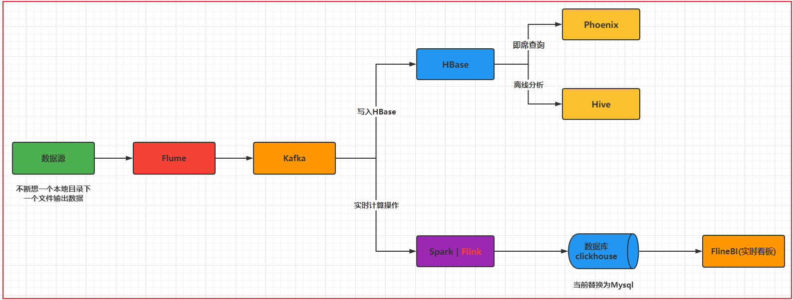

## 4- 陌陌案例数据采集操作

### 4.1 Flume基本介绍

​		flume是apache旗下一款开源免费, 专门用于进行数据采集的工具, 最早期来源于cloudera公司, 后期贡献给apache, 成为apache顶级项目 , flume采用java编写

​		flume为了能够满足大部分采集场景, 提供各种针对不同的采集数据源和目的地组件, 以满足更多数据采集场景

​		flume在早期版本中称为flume OG(1.x以前) 在新版本中称为 **flume NG**(1.x以后)

​		运行一个flume的实例, 就是启动了一个agent实例对象, 一个agent一般有三个部分组成:  

````properties
1) source 组件: 用于读取数据源中数据, flume为了支持从不同的数据源中读取数据, 提供多种source组件
2) channel 组件: 用于连接source和sink组件, 起到数据缓存作用
		支持多种channel组件,  一般channel选择内存channel组件
3) sink 组件: 下沉组件 ,  主要是用于将数据下沉到指定的目的地 为了支持不同的下沉地, flume提供多种sink组件
````

​		数据在从source 到channel 在到sink, 都是通过event对象来进行数据传输的, 一条数据就是一个event对象, 在event对象中, 除了可以放置本身数据以外, 还支持放置一些其他描述信息数据, 默认只放置数据本身

​		flume一般是安装在数据采集的节点


常用的组件:

* source组件:

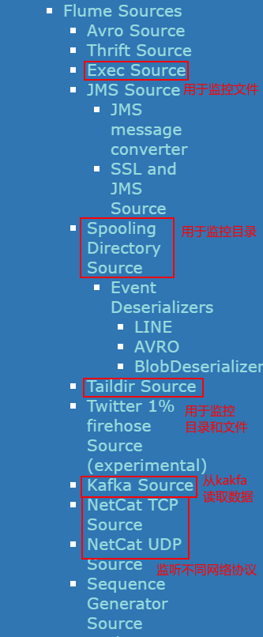

* channel:

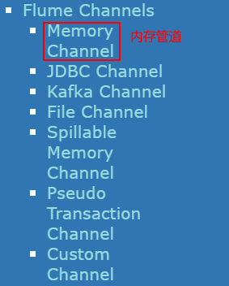

* sink:

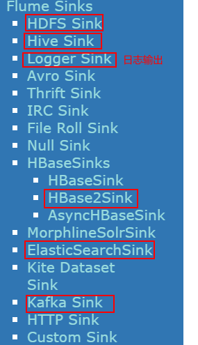

### 4.2 Flume安装

* 1) 下载flume的安装包(资料已经提供)
* 2) 将flume上传到需要采集数据的节点下: node1

```shell
cd /export/software
rz 上传

tar -zxf apache-flume-1.9.0-bin.tar.gz  -C /export/server/

设置软连接:
cd /export/server/
ln -s apache-flume-1.9.0-bin flume
```

* 3) 修改配置文件:

```shell
cd /export/server/flume/conf
cp flume-env.sh.template  flume-env.sh
vim flume-env.sh
修改: 
	export JAVA_HOME=/export/server/jdk1.8.0_241/
```


### 4.3 Flume的入门操作

​	需求:  请通过flume来监听node1的44444 端口号, 要求从端口号将监听的数据打印到控制台即可

#### 4.3.1 入门案例流程分析

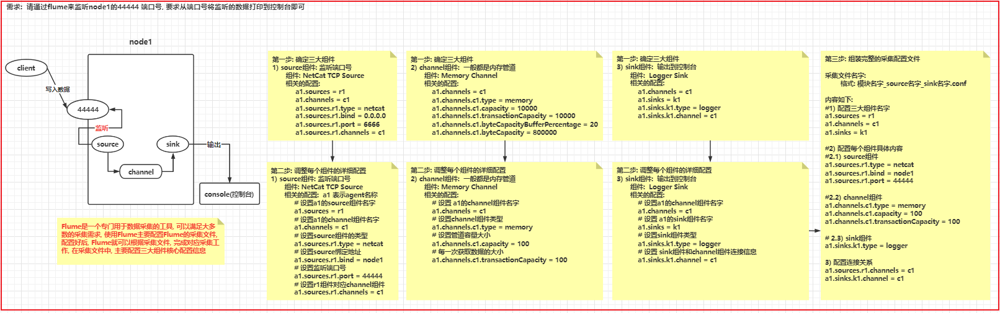

高清图片,查看图片目录即可

* 第一步: 确定三大组件

```properties
1) source组件: 监听端口号       
	组件: NetCat TCP Source       
	相关的配置:              
		a1.sources = r1            
		a1.channels = c1
        a1.sources.r1.type = netcat
        a1.sources.r1.bind = 0.0.0.0
        a1.sources.r1.port = 6666
        a1.sources.r1.channels = c1

2) channel组件:  一般都是内存管道       
	组件: Memory Channel       
	相关的配置:
    	a1.channels = c1
        a1.channels.c1.type = memory
        a1.channels.c1.capacity = 10000
        a1.channels.c1.transactionCapacity = 10000
        a1.channels.c1.byteCapacityBufferPercentage = 20
        a1.channels.c1.byteCapacity = 800000
        
3) sink组件:  输出到控制台       
	组件:  Logger Sink       
	相关的配置:             
		a1.channels = c1           
		a1.sinks = k1          
		a1.sinks.k1.type = logger           
		a1.sinks.k1.channel = c1
```

* 2- 调整每个组件相关配置, 调整为需求所要求的

```properties
1) source组件: 监听端口号       
	组件: NetCat TCP Source       
	相关的配置:  a1 表示agent名称            
	# 设置a1的source组件名字
    a1.sources = r1
    # 设置a1的channel组件名字
    a1.channels = c1
    # 设置source组件的类型
    a1.sources.r1.type = netcat
    # 设置source绑定地址
    a1.sources.r1.bind = node1
    # 设置监听端口号
    a1.sources.r1.port = 44444
    # 设置r1组件对应channel组件
    a1.sources.r1.channels = c1
    
2) channel组件:  一般都是内存管道       
	组件: Memory Channel       
	相关的配置:             
		# 设置 a1的channel组件名字           
		a1.channels = c1           
		# 设置channel组件类型           
		a1.channels.c1.type = memory           
		# 设置管道容量大小           
		a1.channels.c1.capacity = 100           
		# 每一次获取数据的大小           
		a1.channels.c1.transactionCapacity = 100

3) sink组件:  输出到控制台       
	组件:  Logger Sink       
	相关的配置:             
		# 设置a1的channel组件名字           
		a1.channels = c1           
		# 设置 a1的sink组件名字           
		a1.sinks = k1           
		# 设置sink组件类型          
        a1.sinks.k1.type = logger           
        # 设置 sink组件和channel组件连接信息           
        a1.sinks.k1.channel = c1
```

* 3- 组装配置文件, 形成最终配置

```properties
格式: 模块名字_source名字_sink名字.conf

内容如下:
	#1) 配置三大组件名字
	a1.sources = r1
	a1.channels = c1
	a1.sinks = k1
	
	#2) 配置每个组件具体内容
	#2.1) source组件
	a1.sources.r1.type = netcat
	a1.sources.r1.bind = node1
	a1.sources.r1.port = 44444
	
	#2.2) channel组件
	a1.channels.c1.type = memory
	a1.channels.c1.capacity = 100
	a1.channels.c1.transactionCapacity = 100
	
	# 2.3) sink组件
	a1.sinks.k1.type = logger
	
	3) 配置连接关系
	a1.sources.r1.channels = c1
	a1.sinks.k1.channel = c1
```

#### 4.3.2 入门案例实现

* 1- 配置flume的采集文件

```properties
cd /export/server/flume/conf

vim init_netcatSource_loggerSink.conf

输入 i  进入插入模式

添加配置内容:
a1.sources = r1
a1.channels = c1
a1.sinks = k1

a1.sources.r1.type = netcat
a1.sources.r1.bind = node1
a1.sources.r1.port = 44444

a1.channels.c1.type = memory
a1.channels.c1.capacity = 100
a1.channels.c1.transactionCapacity = 100

a1.sinks.k1.type = logger

a1.sources.r1.channels = c1
a1.sinks.k1.channel = c1
```

* 2- 启动flume, 进行数据采集的操作, netcat在监听的时候, 如果发现没有这个端口号, 会直接打开此端口并监听

```properties
cd /export/server/flume/bin

./flume-ng agent -n a1 -c ../conf/ -f ../conf/init_netcatSource_loggerSink.conf -Dflume.root.logger=INFO,console

说明:
	-n 指定agent名字(此名字与配置文件中保持一致)
	-c 指定flume的配置文件目录
	-f 指定flume的采集文件位置
	-D 指定相关配置参数 : flume.root.logger=INFO,console
```

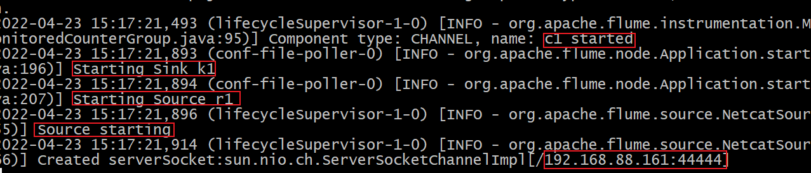

* 3- 通过任意一个节点, 向 node1的 44444端口号发送数据即可

```
格式: 
	telnet [host] [port]

相关的操作: 
	telnet node1 44444

可能报出错误:
	-bash: telnet: 未找到命令

解决方案: 
	yum  -y install telnet
```

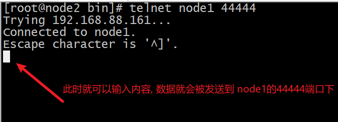


发送数据

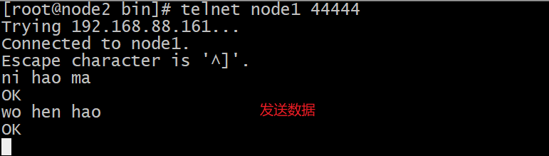

观察flume是否有采集

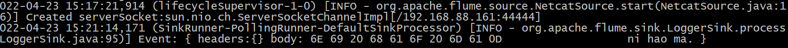

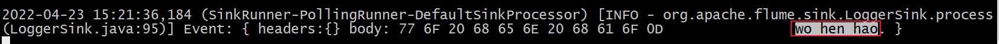

### 4.4 基于Flume实现陌陌消息数据采集

​		需求: 采集 node1中 /export/data/momo_data/MOMO_DATA.dat 文件中数据, 一旦这个文件中有了新的数据, 立马能够采集到, 同时要求未来能够扩展采集目录的操作, 最终采集到数据下沉到KAFKA中

#### 4.4.1 流程分析

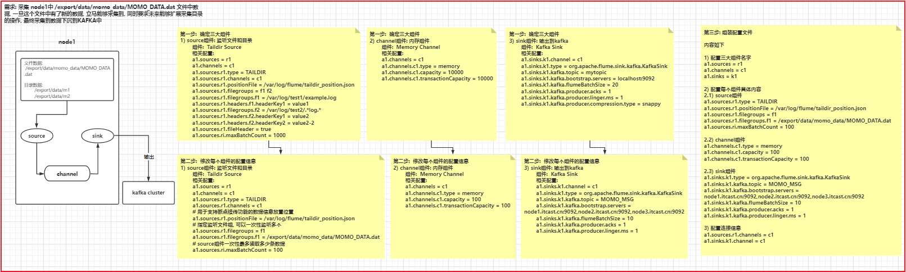

高清图片, 大家查看图片目录即可

放置第三步结果内容:

```properties
第三步: 组装配置文件内容如下
1) 配置三大组件名字
a1.sources = r1
a1.channels = c1
a1.sinks = k1
2) 配置每个组件具体内容
2.1) source组件
a1.sources.r1.type = TAILDIR
a1.sources.r1.positionFile = /var/log/flume/taildir_position.json
a1.sources.r1.filegroups = f1
a1.sources.r1.filegroups.f1 = /export/data/momo_data/MOMO_DATA.dat
a1.sources.ri.maxBatchCount = 100
2.2) channel组件
a1.channels.c1.type = memory
a1.channels.c1.capacity = 100
a1.channels.c1.transactionCapacity = 100
2.3) sink组件
a1.sinks.k1.type = org.apache.flume.sink.kafka.KafkaSink
a1.sinks.k1.kafka.topic = MOMO_MSG
a1.sinks.k1.kafka.bootstrap.servers = node1.itcast.cn:9092,node2.itcast.cn:9092,node3.itcast.cn:9092
a1.sinks.k1.kafka.flumeBatchSize = 10
a1.sinks.k1.kafka.producer.acks = 1
a1.sinks.k1.kafka.producer.linger.ms = 1
3) 配置连接信息
a1.sources.r1.channels = c1
a1.sinks.k1.channel = c1
```

#### 4.4.2 采集实现操作

* 1- 在flume的conf目录下, 配置采集文件

```properties
cd /export/server/flume/conf/

vim momo_tailDirSource_kafkaSink.conf

输入 i 进入插入模式

添加以下内容:
a1.sources = r1
a1.channels = c1
a1.sinks = k1

a1.sources.r1.type = TAILDIR
a1.sources.r1.positionFile = /var/log/flume/taildir_position.json
a1.sources.r1.filegroups = f1
a1.sources.r1.filegroups.f1 = /export/data/momo_data/MOMO_DATA.dat
a1.sources.ri.maxBatchCount = 100

a1.channels.c1.type = memory
a1.channels.c1.capacity = 100
a1.channels.c1.transactionCapacity = 100

a1.sinks.k1.type = org.apache.flume.sink.kafka.KafkaSink
a1.sinks.k1.kafka.topic = MOMO_MSG
a1.sinks.k1.kafka.bootstrap.servers = node1.itcast.cn:9092,node2.itcast.cn:9092,node3.itcast.cn:9092
a1.sinks.k1.kafka.flumeBatchSize = 10
a1.sinks.k1.kafka.producer.acks = 1
a1.sinks.k1.kafka.producer.linger.ms = 1

a1.sources.r1.channels = c1
a1.sinks.k1.channel = c1
```

* 2- 启动 kafka集群(先启动zookeeper, 然后启动kafka集群)

* 3- 在kafka中创建topic: MOMO_MSG

```properties
./kafka-topics.sh  --create --zookeeper node1:2181,node2:2181,node3:2181 --topic MOMO_MSG --partitions 3 --replication-factor 2
```

* 4- 启动一个用于监听 MOMO_MSG的消费者,便于后续测试 (NODE3启动,那个都可以)

```properties
./kafka-console-consumer.sh  --bootstrap-server node1:9092,node2:9092,node3:9092 --topic MOMO_MSG
```

* 5- 启动Flume, 准备进行数据采集操作

```properties
cd /export/server/flume/bin

./flume-ng agent -n a1 -c ../conf/ -f ../conf/momo_tailDirSource_kafkaSink.conf -Dflume.root.logger=INFO,console
```

* 6- 启动 用于生产陌陌数据的jar包, 观察消费者是否可以接收到消息, 如果可以, 说明 采集成功了

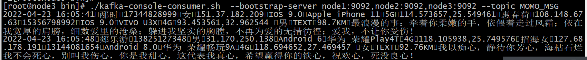

## 5- 综合案例_接收数据,写入HBase

### 5.1 准备工作

* 1- 启动HBase集群(先启动zookeeper 和 hadoop)
* 2- 进入HBase的shell客户端, 创建表

```properties
create_namespace 'MOMO_CHAT'

create 'MOMO_CHAT:MOMO_MSG',{NAME=>'C1',COMPRESSION=>'GZ'}, {NUMREGIONS=>6,SPLITALGO=>'HexStringSplit'}

思考:  创建一张hbase的表, 需要考虑那些问题呢? 
1) 名称空间: 建议一个模块或者一个项目构建一个名称空间
2) 列族: 建议越少越好
3) 压缩方案:  GZ
4) 预分区: 建议一般是从节点的倍数(2~3倍), 当然如果从节点比较多, 建议在 几十个左右
		目前搞 6 个
		选择那种预分区方式呢? hash
5) 数据过期的考虑:  版本  和 TTL
	数据版本: 默认1个版本即可
	TTL: 默认 永不过期
```


### 5.2 RowKey设计

回顾: 

```properties
官方推荐要求:
	1- 避免使用固定的前缀作为rowkey, 比如 手机号 时间戳
	2- rowkey在设计的时候, 尽量短一些, 一般 0~100区间, 大部分范围  10~30范围
	3- 使用数值类型的要求string更加节省空间
	4- 保证rowkey 唯一

业务要求:
	1 - 保证相关性的数据放置在一个region中
	2- 尽量满足一些固定的查询需求
```

如何设计:

```properties
固定查询需求:
	需求根据发件人账号 和 收件人账户 以及 聊天的时间 查询相关的聊天信息

什么是相关性的数据? 
	发件人和收件人的消息数据放置在一起
	
rowkey设计:	
	MD5HASH(发件人账户_收件人账户)_发件人账户_收件人账户_时间戳
```


### 5.3 构建一个消费者完成数据写入

* 1) 创建一个maven项目, 并导入相关的依赖

```xml
    <repositories><!--代码库-->
        <repository>
            <id>aliyun</id>
            <url>http://maven.aliyun.com/nexus/content/groups/public/</url>
            <releases><enabled>true</enabled></releases>
            <snapshots>
                <enabled>false</enabled>
                <updatePolicy>never</updatePolicy>
            </snapshots>
        </repository>
    </repositories>


    <dependencies>

        <dependency>
            <groupId>org.apache.flink</groupId>
            <artifactId>flink-java</artifactId>
            <version>1.10.0</version>
        </dependency>
        <dependency>
            <groupId>org.apache.flink</groupId>
            <artifactId>flink-streaming-java_2.11</artifactId>
            <version>1.10.0</version>
        </dependency>
        <dependency>
            <groupId>org.apache.flink</groupId>
            <artifactId>flink-runtime-web_2.11</artifactId>
            <version>1.10.0</version>
        </dependency>
        <!-- flink操作hdfs，所需要导入该包-->
        <dependency>
            <groupId>org.apache.flink</groupId>
            <artifactId>flink-shaded-hadoop-2-uber</artifactId>
            <version>2.7.5-10.0</version>
        </dependency>
        <dependency>
            <groupId>org.apache.flink</groupId>
            <artifactId>flink-connector-kafka_2.11</artifactId>
            <version>1.10.0</version>
        </dependency>

        <dependency>
            <groupId>org.apache.flink</groupId>
            <artifactId>flink-jdbc_2.11</artifactId>
            <version>1.10.0</version>
        </dependency>
        <dependency>
            <groupId>org.apache.bahir</groupId>
            <artifactId>flink-connector-redis_2.11</artifactId>
            <version>1.0</version>
        </dependency>
        <!--Hbase 客户端-->
        <dependency>
            <groupId>org.apache.hbase</groupId>
            <artifactId>hbase-client</artifactId>
            <version>2.1.0</version>
        </dependency>
        <!--kafka 客户端-->
        <dependency>
            <groupId>org.apache.kafka</groupId>
            <artifactId>kafka-clients</artifactId>
            <version>2.4.1</version>
        </dependency>
        <dependency>
            <groupId>org.apache.httpcomponents</groupId>
            <artifactId>httpclient</artifactId>
            <version>4.5.4</version>
        </dependency>

        <dependency>
            <groupId>com.alibaba</groupId>
            <artifactId>fastjson</artifactId>
            <version>1.2.62</version>
        </dependency>

        <dependency>
            <groupId>mysql</groupId>
            <artifactId>mysql-connector-java</artifactId>
            <version>5.1.38</version>
        </dependency>
    </dependencies>


    <build>
        <plugins>
            <plugin>
                <groupId>org.apache.maven.plugins</groupId>
                <artifactId>maven-compiler-plugin</artifactId>
                <version>3.1</version>
                <configuration>
                    <target>1.8</target>
                    <source>1.8</source>
                </configuration>
            </plugin>
        </plugins>
    </build>
```

* 2) 导入log4j.properties
* 3) 创建包结构,   com.itheima.momo
* 4) 编写代码:  

```java
package com.itheima.momo;

import org.apache.hadoop.conf.Configuration;
import org.apache.hadoop.hbase.HBaseConfiguration;
import org.apache.hadoop.hbase.TableName;
import org.apache.hadoop.hbase.client.Connection;
import org.apache.hadoop.hbase.client.ConnectionFactory;
import org.apache.hadoop.hbase.client.Put;
import org.apache.hadoop.hbase.client.Table;
import org.apache.hadoop.hbase.util.MD5Hash;
import org.apache.kafka.clients.consumer.ConsumerRecord;
import org.apache.kafka.clients.consumer.ConsumerRecords;
import org.apache.kafka.clients.consumer.KafkaConsumer;

import java.text.SimpleDateFormat;
import java.time.Duration;
import java.util.Arrays;
import java.util.Date;
import java.util.Properties;

// 读取kafka中消息数据, 将数据写入到HBase
public class MOMO_KAFKA_HBase {
    @SuppressWarnings("all")
    public static void main(String[] args) throws Exception {
        //1. 从kafka中 接收到 消息数据
        Properties props = new Properties();
        props.setProperty("bootstrap.servers", "node1:9092,node2:9092,node3:9092");
        props.setProperty("group.id", "momo_g1");
        props.setProperty("enable.auto.commit", "true");
        props.setProperty("auto.commit.interval.ms", "1000");
        props.setProperty("key.deserializer", "org.apache.kafka.common.serialization.StringDeserializer");
        props.setProperty("value.deserializer", "org.apache.kafka.common.serialization.StringDeserializer");

        //1.1: 创建kafka消费者对象
        KafkaConsumer<String, String> consumer = new KafkaConsumer<>(props);

        //1.2.设置消费者监听那些Topic
        consumer.subscribe(Arrays.asList("MOMO_MSG"));


        // 2.1: 根据hbase的连接工厂 创建 连接对象
        Configuration conf = HBaseConfiguration.create();
        Connection hbaseConn = ConnectionFactory.createConnection(conf);
        // 2.2: 根据连接对象, 创建管理对象: admin 和 table
        Table table = hbaseConn.getTable(TableName.valueOf("MOMO_CHAT:MOMO_MSG"));

        //1.3. 消费数据:  一直在消费, 只要有数据,立马进行处理操作
        while (true) {
            //1.3.1: 获取消息数据, 参数表示等待(超时)的时间
            ConsumerRecords<String, String> records = consumer.poll(Duration.ofMillis(100));
            for (ConsumerRecord<String, String> record : records) {
                String msg = record.value(); // 获取value

                System.out.println(msg);

                // 2: 将消息数据写入到HBase

                // 2.3: 执行相关的操作
                byte[] rowkey = getRowKey(msg);
                Put put = new Put(rowkey);

                // 对消息数据进行切割:
                String[] fields = msg.split("\001");

                put.addColumn("C1".getBytes(),"msg_time".getBytes(),fields[0].getBytes());
                put.addColumn("C1".getBytes(),"sender_nickyname".getBytes(),fields[1].getBytes());
                put.addColumn("C1".getBytes(),"sender_account".getBytes(),fields[2].getBytes());
                put.addColumn("C1".getBytes(),"sender_sex".getBytes(),fields[3].getBytes());
                put.addColumn("C1".getBytes(),"sender_ip".getBytes(),fields[4].getBytes());
                put.addColumn("C1".getBytes(),"sender_os".getBytes(),fields[5].getBytes());
                put.addColumn("C1".getBytes(),"sender_phone_type".getBytes(),fields[6].getBytes());
                put.addColumn("C1".getBytes(),"sender_network".getBytes(),fields[7].getBytes());
                put.addColumn("C1".getBytes(),"sender_gps".getBytes(),fields[8].getBytes());
                put.addColumn("C1".getBytes(),"receiver_nickyname".getBytes(),fields[9].getBytes());
                put.addColumn("C1".getBytes(),"receiver_ip".getBytes(),fields[10].getBytes());
                put.addColumn("C1".getBytes(),"receiver_account".getBytes(),fields[11].getBytes());
                put.addColumn("C1".getBytes(),"receiver_os".getBytes(),fields[12].getBytes());
                put.addColumn("C1".getBytes(),"receiver_phone_type".getBytes(),fields[13].getBytes());
                put.addColumn("C1".getBytes(),"receiver_network".getBytes(),fields[14].getBytes());
                put.addColumn("C1".getBytes(),"receiver_gps".getBytes(),fields[15].getBytes());
                put.addColumn("C1".getBytes(),"receiver_sex".getBytes(),fields[16].getBytes());
                put.addColumn("C1".getBytes(),"msg_type".getBytes(),fields[17].getBytes());
                put.addColumn("C1".getBytes(),"distance".getBytes(),fields[18].getBytes());
                put.addColumn("C1".getBytes(),"message".getBytes(),fields[19].getBytes());

                table.put(put);


            }
        }


    }
    // MD5HASH(发件人账户_收件人账户)_发件人账户_收件人账户_时间戳
    private static SimpleDateFormat format = new SimpleDateFormat("yyyy-MM-dd HH:mm:ss");
    private static byte[] getRowKey(String msg ) throws Exception {
        //1. 对消息进行切割处理
        String[] fields = msg.split("\001");

        //2. 获取 发件人账户, 收件人账户, 时间
        String msg_time = fields[0];
        String sender_account = fields[2];
        String receiver_account = fields[11];

        //3. 将时间转换为时间戳
        Date msg_date = format.parse(msg_time);
        long timestamp = msg_date.getTime();
        
        //4- 生成MD5HASH值 前8位
        String md5Hash = MD5Hash.getMD5AsHex((sender_account + "_" + receiver_account).getBytes()).substring(0,8);
 
        //5- 拼接返回
        return (md5Hash +"_"+sender_account+"_"+receiver_account +"_"+timestamp).getBytes();
    }

}
```


### 5.4 测试操作

启动HBase写入程序, 启动flume的采集, 启动生成数据的jar包, 观察hbase表中是否有数据

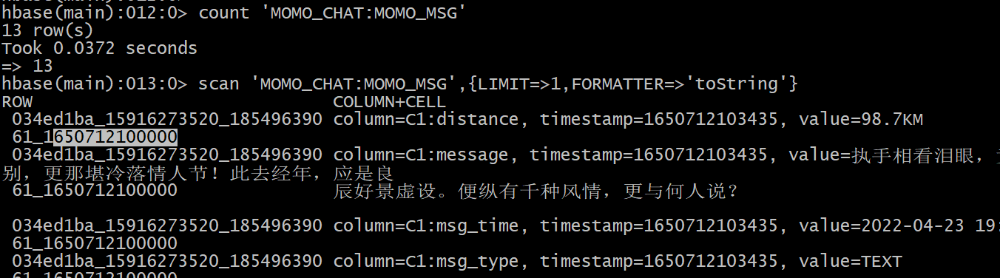


## 6- Phoenix集成完成即席查询

* 1) 启动Phoenix
* 2) 整合操作

```sql
create view MOMO_CHAT.MOMO_MSG (
id varchar primary key,
C1."msg_time" varchar,
C1."sender_nickyname" varchar,
C1."sender_account" varchar,
C1."sender_sex" varchar,
C1."sender_ip" varchar,
C1."sender_os" varchar,
C1."sender_phone_type" varchar,
C1."sender_network" varchar,
C1."sender_gps" varchar,
C1."receiver_nickyname" varchar,
C1."receiver_ip" varchar,
C1."receiver_account" varchar,
C1."receiver_os" varchar,
C1."receiver_phone_type" varchar,
C1."receiver_network" varchar,
C1."receiver_gps" varchar,
C1."receiver_sex" varchar,
C1."msg_type" varchar,
C1."distance" varchar,
C1."message" varchar
);
```


## 7- Hive集成完成离线分析

* 1) 启动hive操作:  metastore 和 hiveserve2  
* 2) 启动后, 使用beeline连接, 进行集成操作

```sql
create database momo_chat; 
use momo_chat;

create  external table momo_chat.momo_msg (
id string,
msg_time  string,
sender_nickyname  string,
sender_account  string,
sender_sex  string,
sender_ip  string,
sender_os  string,
sender_phone_type  string,
sender_network  string,
sender_gps  string,
receiver_nickyname  string,
receiver_ip  string,
receiver_account  string,
receiver_os  string,
receiver_phone_type  string,
receiver_network  string,
receiver_gps  string,
receiver_sex  string,
msg_type  string,
distance  string,
message  string
) stored by 'org.apache.hadoop.hive.hbase.HBaseStorageHandler' with serdeproperties ("hbase.columns.mapping"=":key,
C1:msg_time,
C1:sender_nickyname,
C1:sender_account,
C1:sender_sex,
C1:sender_ip,
C1:sender_os,
C1:sender_phone_type,
C1:sender_network,
C1:sender_gps,
C1:receiver_nickyname,
C1:receiver_ip,
C1:receiver_account,
C1:receiver_os,
C1:receiver_phone_type,
C1:receiver_network,
C1:receiver_gps,
C1:receiver_sex,
C1:msg_type,
C1:distance,
C1:message") tblproperties("hbase.table.name"="MOMO_CHAT:MOMO_MSG");

```


## 8- 什么是流式计算

流式计算:   指的数据源源不断的来, 需要进行源源不断的计算, 计算完成后, 也需要源源不断将数据统计结果输出目的地

实时计算和离线计算的区别:

* 1) 数据时效性不同

  * 实时计算:   对实时性要求比较高, 低延迟
  * 离线计算:  非实时, 高延迟

* 2) 数据特征不同

  * 实时计算:  数据一般都是动态,  没有边界
  * 离线计算:  数据一般都是静态的

* 3) 应用场景不同:

  * 实时计算: 要求实时性 或者 时效性 比较高场景, 比如说 实时推荐, 告警系统...
  * 离线计算: 要求实时性 或者 时效性 不高的场景

* 4) 运行方式不同:

  * 实时计算: 24小时 不间断运行, 持续运行操作
  * 离线计算:  一般定时完成,某一时刻一次性处理完成

## 9- Flink相关内容

### 9.1 Flink基本介绍

​		flink 是一个数据流计算引擎框架, 通过flink可以进行离线 或者 实时计算操作, 包括通过flink也可以进行机器算法以及图计算操作都是支持的, 为了简化使用操作, flink提供多种类别API:

* dataset API :  支持批量数据的处理工作 (离线计算, 批处理)
* datastream API: 支持 数据流操作(实时计算, 流处理)
* table  API : 对结构化数据进行处理, 将数据映射为一张表, 支持通过SQL方式进行数据分析操作

​	

​		除此以外, flink还支持, 图计算 以及机器学习一些库

### 9.2 Flink入门案例

#### 9.2.1 需求说明

​		需求: 通过flink监听node1的4444端口号, 从端口号中获取相关的单词数据, 进行词频统计(wordCount)

#### 9.2.2 案例流程

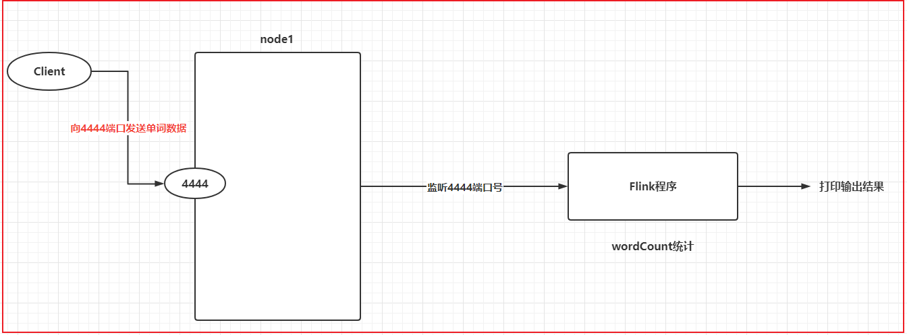

#### 9.2.3 项目准备工作

* 1- 在 MOMO_project 项目中. 构建包结构: com.itheima.flink.init
* 2- 创建一个类, 编写代码

#### 9.2.4 代码实现

实现步骤:

```properties
1) 创建Flink的流式计算核心环境类对象
2) 添加Source数据源, 用于读取数据
3) 添加相关的转换操作, 对数据进行分析处理
4) 添加Sink组件, 将计算的结果进行输出操作
5) 启动Flink程序
```

代码实现:

```java
package com.itheima.flink.init;

import org.apache.flink.api.common.functions.FlatMapFunction;
import org.apache.flink.api.common.functions.MapFunction;
import org.apache.flink.api.java.tuple.Tuple2;
import org.apache.flink.streaming.api.datastream.DataStreamSource;
import org.apache.flink.streaming.api.datastream.SingleOutputStreamOperator;
import org.apache.flink.streaming.api.environment.StreamExecutionEnvironment;
import org.apache.flink.util.Collector;


// 演示Flink的入门案例  -- 词频统计
public class FlinkWordCount {

    public static void main(String[] args) throws Exception {
        // 1) 创建Flink的流式计算核心环境类对象
        StreamExecutionEnvironment env = StreamExecutionEnvironment.getExecutionEnvironment();
        // 2) 添加Source数据源, 用于读取数据
        DataStreamSource<String> source = env.socketTextStream("node1", 4444);
        // 3) 添加相关的转换操作, 对数据进行分析处理
        // 后续端口来的数据, 可能是一行数据, 包含多个单词, 单词之间会用空格分开
        // 第一次监听到:  word hadoop hello word   --->  word,hadoop,hello,word
        //3.1: 将数据进行切割, 得到一个个单词, 并将单词附上 单词,1 操作
        SingleOutputStreamOperator<Tuple2<String,Long>> streamOperator = source.flatMap(new FlatMapFunction<String, Tuple2<String,Long>>() {

            @Override
            public void flatMap(String line, Collector<Tuple2<String,Long>> collector) throws Exception {

                //1. 对数据执行切割操作
                String[] words = line.split(" ");

                //2. 遍历数据
                for (String word : words) {
                    collector.collect(new Tuple2<>(word,1L));
                }

            }
        });

       // 3.2: 根据 单词进行分组, 将每个组内的数值累加在一起即可
        SingleOutputStreamOperator<Tuple2<String, Long>> operator = streamOperator.keyBy(0).sum(1);


        // 4) 添加Sink组件, 将计算的结果进行输出操作
        operator.print();
        // 5) 启动Flink程序
        env.execute("wordCount");
        
    }

}

```

#### 9.2.5 程序测试

* 1- 在node1中开启4444端口号, 并准备向端口号中写入数据

```properties
在 node1执行: 
	nc -lk 4444
	
如果报出: -bash: nc: 未找到命令  执行 yum -y install nc
```


## 10- 基于Flink完成综合案例实时统计

### 10.1  需求说明

* 1- 实时统计消息总条数
* 2- 实时统计各个地区发送的消息总量
* 3- 实时统计各个地区接收的消息总量
* 4- 实时统计各个用户发送的消息量
* 5- 实时统计各个用户接收的消息量

### 10.2 案例流程

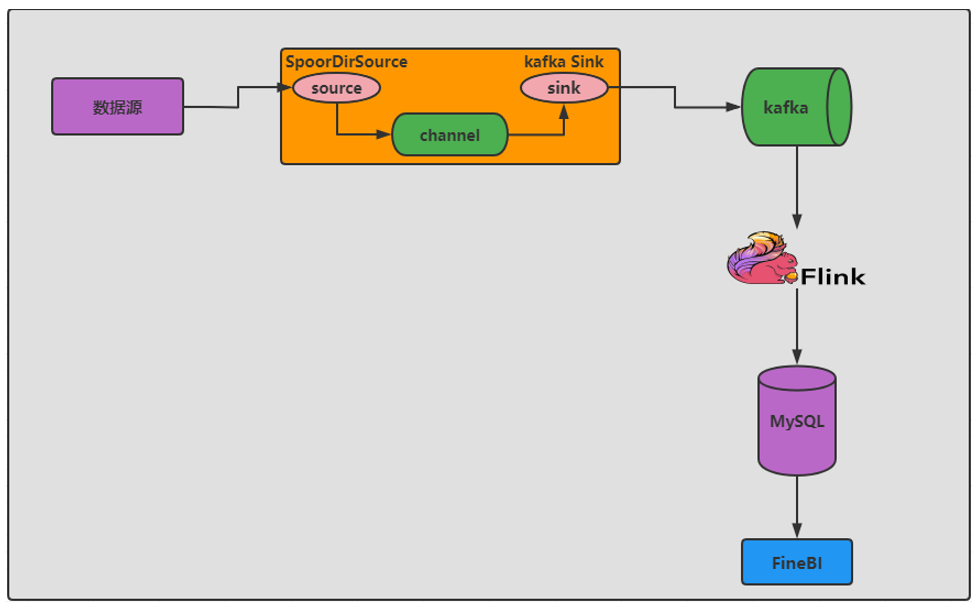

核心逻辑:  通过Flink接收kafka中消息数据, 将数据进行流式(实时)统计分析, 将实时统计结果输出到MySQL中


### 10.3 项目的准备工作

* 1- 在MOMO_project 中创建以下包结构:
  * com.itheima.momo.utils
  * com.itheima.momo.pojo
  * com.itheima.momo.flink
* 2- 导入一个用于根据经纬度计算属于那个省份工具类:  HttpClientUtils.java

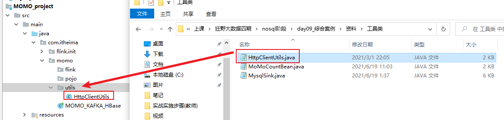

* 3- 导入相关的POJO类

  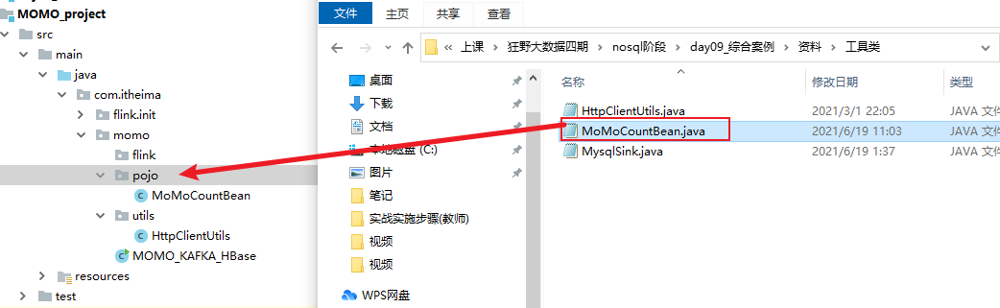

* 4- 导入Flink的sink类

​	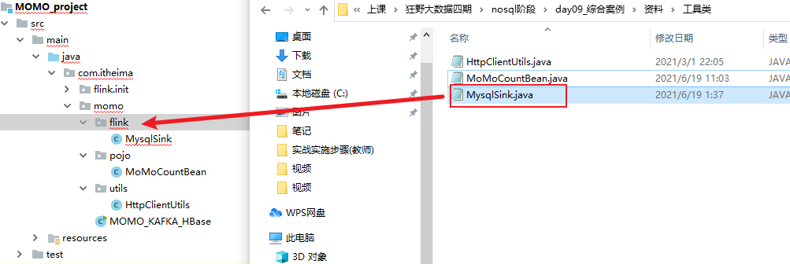


* 5- 在mysql中, 创建目标表 (node1)

```properties
CREATE DATABASE `momo` CHARACTER SET utf8mb4;

USE `momo`;

CREATE TABLE `momo_count` (
  `id` int(11) NOT NULL AUTO_INCREMENT,
  `momo_totalcount` bigint(20) DEFAULT '0' COMMENT '总消息量',
  `momo_province` varchar(20) DEFAULT '-1' COMMENT '省份',
  `momo_username` varchar(20) DEFAULT '-1' COMMENT '用户名',
  `momo_msgcount` bigint(20) DEFAULT '0' COMMENT '消息量',
  `momo_grouptype` varchar(20) DEFAULT '-1' COMMENT '统计类型:1 总消息量 2 各省份发送量 3 各省份接收量 4 各用户发送量 5各用户接收量',
  PRIMARY KEY (`id`)
) ENGINE=InnoDB DEFAULT CHARSET=utf8mb4;
```


### 10.4 如何获取百度AK码

* 1- 登录<<百度地图开发平台>> :  https://lbsyun.baidu.com/ , 登录过程省略
* 2- 进入控制台:


* 3- 点击应用管理.点击我的应用

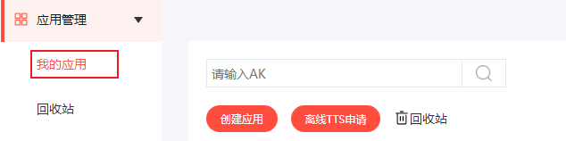

* 4- 创建应用

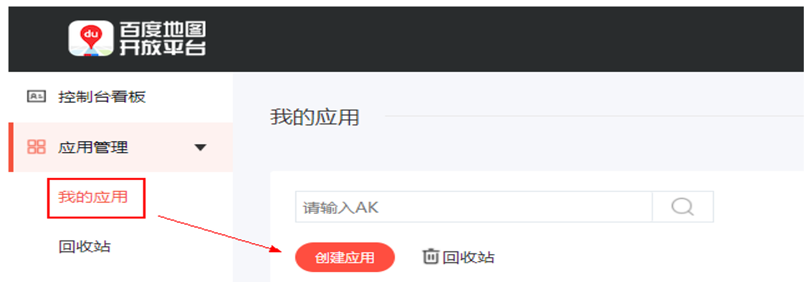

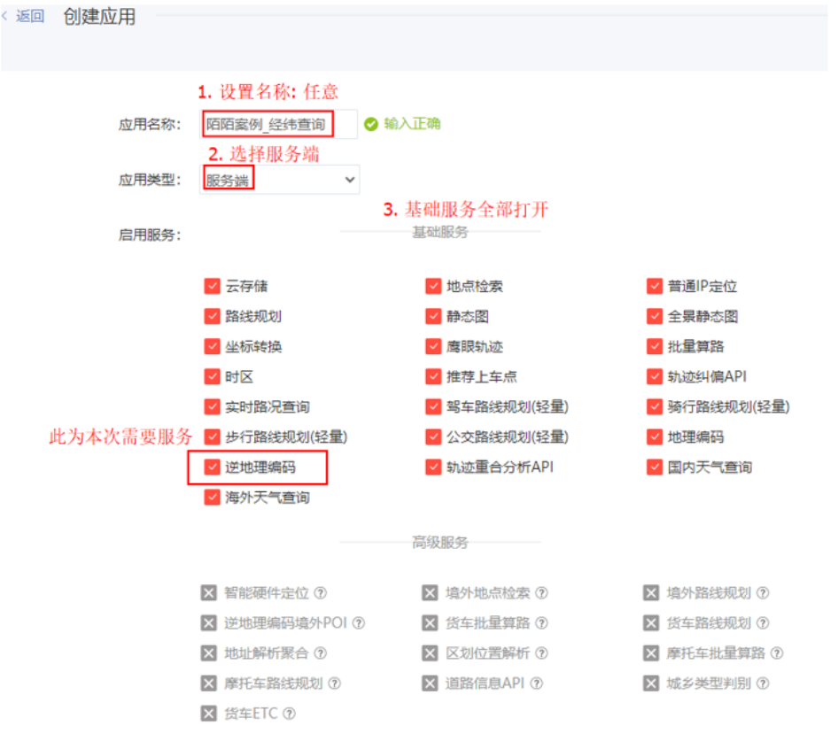

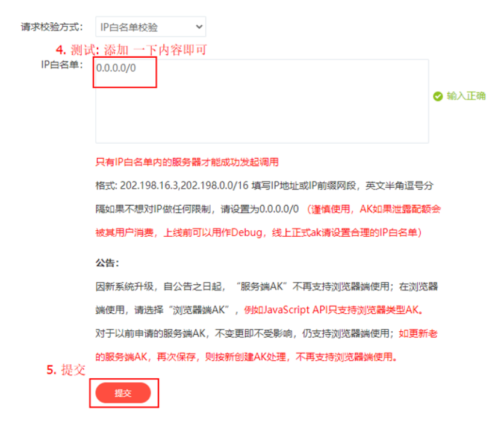


* 5- 直接在我的应用中就可以看到ak码了

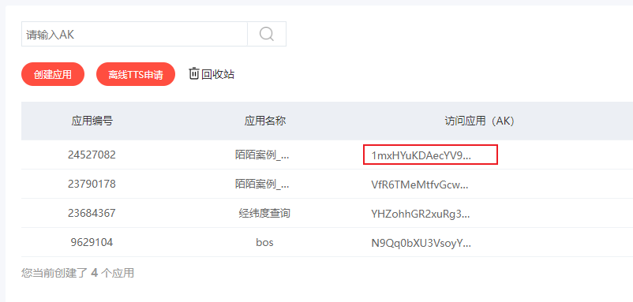


### 10.5 代码实现

* 需求一: 整体代码实现

```java
package com.itheima.momo.flink;

import com.itheima.momo.pojo.MoMoCountBean;
import org.apache.flink.api.common.functions.FilterFunction;
import org.apache.flink.api.common.functions.MapFunction;
import org.apache.flink.api.common.serialization.SimpleStringSchema;
import org.apache.flink.api.java.tuple.Tuple1;
import org.apache.flink.streaming.api.datastream.DataStreamSource;
import org.apache.flink.streaming.api.datastream.SingleOutputStreamOperator;
import org.apache.flink.streaming.api.environment.StreamExecutionEnvironment;
import org.apache.flink.streaming.connectors.kafka.FlinkKafkaConsumer;

import java.util.Properties;

// MOMO 案例  实时统计类
public class MOMOFlink {

    public static void main(String[] args) throws Exception {

        //1.  创建Flink的核心处理环境类对象
        StreamExecutionEnvironment env = StreamExecutionEnvironment.getExecutionEnvironment();


        //2. 设置Source组件, 用于接收kafka中消息数据
        Properties props = new Properties();
        props.setProperty("bootstrap.servers", "node1:9092,node2:9092,node3:9092");
        props.setProperty("group.id", "momo_g2");
        props.setProperty("enable.auto.commit", "true");
        props.setProperty("auto.commit.interval.ms", "1000");

        FlinkKafkaConsumer<String> kafkaConsumer = new FlinkKafkaConsumer<>("MOMO_MSG", new SimpleStringSchema(), props);
        DataStreamSource<String> source = env.addSource(kafkaConsumer);


        //3. 设置转换组件, 对消息数据, 进行实时处理操作
        // 需求1: 实时统计消息总条数
        // 3.1: 设置过滤条件, 将不符合的数据过滤掉
        // 清洗要求:  数据不能为null 也不能为 空 同时 要求字段的数量必须为20
        SingleOutputStreamOperator<String> filterOperator = source.filter(new FilterFunction<String>() {
            // 如果此方法返回 true 表示保留数据, 如果返回false表示不保留
            @Override
            public boolean filter(String msg) throws Exception {
                if (msg != null && !"".equals(msg.trim()) && msg.split("\001").length == 20) {
                    return true;
                }
                return false;
            }
        });

        //3.2 转换操作:  将每一条数据转换为 1 ,进行累加求和计算
        SingleOutputStreamOperator<Tuple1<Long>> mapOperator = filterOperator.map(new MapFunction<String, Tuple1<Long>>() {
            @Override
            public Tuple1<Long> map(String msg) throws Exception {
                return new Tuple1<>(1L);
            }
        });
        // 累加求和
        SingleOutputStreamOperator<Tuple1<Long>> sumOperator = mapOperator.keyBy(0).sum(0);

        //3.3: 将 Tuple1<Long>  转换为  MoMoCountBean 对象
        SingleOutputStreamOperator<MoMoCountBean> operator = sumOperator.map(new MapFunction<Tuple1<Long>, MoMoCountBean>() {
            @Override
            public MoMoCountBean map(Tuple1<Long> totalMsgT) throws Exception {
                Long totalMsg = totalMsgT.f0;

                MoMoCountBean moMoCountBean = new MoMoCountBean();
                moMoCountBean.setMoMoTotalCount(totalMsg);
                return moMoCountBean;
            }
        });


        //4. 设置sink组件, 对数据进行输出操作:  将其保存到 MySQL中
        sumOperator.print();

        MysqlSink mysqlSink = new MysqlSink("1");
        operator.addSink(mysqlSink);

        //5. 提交运行
        env.execute("MOMO_FLINK");


    }

}

```


整个flink的完整的代码实现:

```java
package com.itheima.momo.flink;

import com.itheima.momo.pojo.MoMoCountBean;
import com.itheima.momo.utils.HttpClientUtils;
import org.apache.flink.api.common.functions.FilterFunction;
import org.apache.flink.api.common.functions.MapFunction;
import org.apache.flink.api.common.serialization.SimpleStringSchema;
import org.apache.flink.api.java.tuple.Tuple1;
import org.apache.flink.api.java.tuple.Tuple2;
import org.apache.flink.streaming.api.datastream.DataStreamSource;
import org.apache.flink.streaming.api.datastream.SingleOutputStreamOperator;
import org.apache.flink.streaming.api.environment.StreamExecutionEnvironment;
import org.apache.flink.streaming.connectors.kafka.FlinkKafkaConsumer;

import java.util.Properties;

// MOMO 案例  实时统计类
public class MOMOFlink {

    public static void main(String[] args) throws Exception {

        //1.  创建Flink的核心处理环境类对象
        StreamExecutionEnvironment env = StreamExecutionEnvironment.getExecutionEnvironment();


        //2. 设置Source组件, 用于接收kafka中消息数据
        Properties props = new Properties();
        props.setProperty("bootstrap.servers", "node1:9092,node2:9092,node3:9092");
        props.setProperty("group.id", "momo_g2");
        props.setProperty("enable.auto.commit", "true");
        props.setProperty("auto.commit.interval.ms", "1000");

        FlinkKafkaConsumer<String> kafkaConsumer = new FlinkKafkaConsumer<>("MOMO_MSG", new SimpleStringSchema(), props);
        DataStreamSource<String> source = env.addSource(kafkaConsumer);


        //3. 设置转换组件, 对消息数据, 进行实时处理操作
        // 需求1: 实时统计消息总条数  抽取方法的快捷键:  alt + shift + M
        totalMsgCount(source);

        // 需求二: 实时统计各个地区发送的消息总量
        totalMsgSenderProvince(source);

        // 需求三: 实时统计各个地区接收的消息总量
        totalMsgReceiverProvince(source);

        // 需求四: 实时统计各个用户发送的消息总量
        totalMsgSenderUser(source);

        // 需求五: 实时统计各个用户接收的消息总量
        totalMsgReceiverUser(source);

        //5. 提交运行
        env.execute("MOMO_FLINK");


    }
    // 需求五
    private static void totalMsgReceiverUser(DataStreamSource<String> source) {
        // 3.1: 设置过滤条件, 将不符合的数据过滤掉
        // 清洗要求:  数据不能为null 也不能为 空 同时 要求字段的数量必须为20
        SingleOutputStreamOperator<String> filterOperator = source.filter(new FilterFunction<String>() {
            // 如果此方法返回 true 表示保留数据, 如果返回false表示不保留
            @Override
            public boolean filter(String msg) throws Exception {
                if (msg != null && !"".equals(msg.trim()) && msg.split("\001").length == 20) {
                    return true;
                }
                return false;
            }
        });

        // 3.2:  对数据的进行转换操作: 将消息中收件人的姓名获取出来,将收件人姓名作为 key, value放置为 1
        SingleOutputStreamOperator<Tuple2<String, Long>> mapOperator = filterOperator.map(new MapFunction<String, Tuple2<String, Long>>() {
            @Override
            public Tuple2<String, Long> map(String msg) throws Exception {
                String[] fields = msg.split("\001");

                return new Tuple2<>(fields[9], 1L);
            }
        });

        //3.3 分组统计即可
        SingleOutputStreamOperator<Tuple2<String, Long>> sumOperator = mapOperator.keyBy(0).sum(1);

        //3.4 将 Tuple2<String, Long> 转换为  MoMoCountBean对象
        SingleOutputStreamOperator<MoMoCountBean> operator = sumOperator.map(new MapFunction<Tuple2<String, Long>, MoMoCountBean>() {
            @Override
            public MoMoCountBean map(Tuple2<String, Long> sfAndCount) throws Exception {
                String username = sfAndCount.f0;
                Long msgCount = sfAndCount.f1;

                MoMoCountBean moMoCountBean = new MoMoCountBean();
                moMoCountBean.setMoMoUsername(username);
                moMoCountBean.setMoMo_MsgCount(msgCount);

                return moMoCountBean;
            }
        });

        //4. 添加Sink组件, 将数据保存到MySQL中
        operator.addSink(new MysqlSink("5"));
    }


    // 需求四
    private static void totalMsgSenderUser(DataStreamSource<String> source) {
        // 3.1: 设置过滤条件, 将不符合的数据过滤掉
        // 清洗要求:  数据不能为null 也不能为 空 同时 要求字段的数量必须为20
        SingleOutputStreamOperator<String> filterOperator = source.filter(new FilterFunction<String>() {
            // 如果此方法返回 true 表示保留数据, 如果返回false表示不保留
            @Override
            public boolean filter(String msg) throws Exception {
                if (msg != null && !"".equals(msg.trim()) && msg.split("\001").length == 20) {
                    return true;
                }
                return false;
            }
        });

        // 3.2:  对数据的进行转换操作: 将消息中发件人的姓名获取出来,将发件人姓名作为 key, value放置为 1
        SingleOutputStreamOperator<Tuple2<String, Long>> mapOperator = filterOperator.map(new MapFunction<String, Tuple2<String, Long>>() {
            @Override
            public Tuple2<String, Long> map(String msg) throws Exception {
                String[] fields = msg.split("\001");

                return new Tuple2<>(fields[1], 1L);
            }
        });

        //3.3 分组统计即可
        SingleOutputStreamOperator<Tuple2<String, Long>> sumOperator = mapOperator.keyBy(0).sum(1);

        //3.4 将 Tuple2<String, Long> 转换为  MoMoCountBean对象
        SingleOutputStreamOperator<MoMoCountBean> operator = sumOperator.map(new MapFunction<Tuple2<String, Long>, MoMoCountBean>() {
            @Override
            public MoMoCountBean map(Tuple2<String, Long> sfAndCount) throws Exception {
                String username = sfAndCount.f0;
                Long msgCount = sfAndCount.f1;

                MoMoCountBean moMoCountBean = new MoMoCountBean();
                moMoCountBean.setMoMoUsername(username);
                moMoCountBean.setMoMo_MsgCount(msgCount);

                return moMoCountBean;
            }
        });

        //4. 添加Sink组件, 将数据保存到MySQL中
        operator.addSink(new MysqlSink("4"));
    }

    // 需求三
    private static void totalMsgReceiverProvince(DataStreamSource<String> source) {
        // 3.1: 设置过滤条件, 将不符合的数据过滤掉
        // 清洗要求:  数据不能为null 也不能为 空 同时 要求字段的数量必须为20
        SingleOutputStreamOperator<String> filterOperator = source.filter(new FilterFunction<String>() {
            // 如果此方法返回 true 表示保留数据, 如果返回false表示不保留
            @Override
            public boolean filter(String msg) throws Exception {
                if (msg != null && !"".equals(msg.trim()) && msg.split("\001").length == 20) {
                    return true;
                }
                return false;
            }
        });

        // 3.2:  对数据的进行转换操作: 将消息中收件人的GPS地址, 根据工具类转换为省份, 将身份作为 key, value放置为 1
        SingleOutputStreamOperator<Tuple2<String, Long>> mapOperator = filterOperator.map(new MapFunction<String, Tuple2<String, Long>>() {
            @Override
            public Tuple2<String, Long> map(String msg) throws Exception {
                // 3.2.1 对数据执行切割操作
                String[] fields = msg.split("\001");

                //3.2.2 获取发件人的经度 和 维度
                String[] latAndLng = fields[15].split(",");
                String lng = latAndLng[0].trim();
                String lat = latAndLng[1].trim();

                //3.2.3 根据经纬度查询身份信息
                String sf = HttpClientUtils.findByLatAndLng(lat, lng);


                return new Tuple2<>(sf, 1L);
            }
        });

        //3.3 分组统计即可
        SingleOutputStreamOperator<Tuple2<String, Long>> sumOperator = mapOperator.keyBy(0).sum(1);

        //3.4 将 Tuple2<String, Long> 转换为  MoMoCountBean对象
        SingleOutputStreamOperator<MoMoCountBean> operator = sumOperator.map(new MapFunction<Tuple2<String, Long>, MoMoCountBean>() {
            @Override
            public MoMoCountBean map(Tuple2<String, Long> sfAndCount) throws Exception {
                String sf = sfAndCount.f0;
                Long msgCount = sfAndCount.f1;

                MoMoCountBean moMoCountBean = new MoMoCountBean();
                moMoCountBean.setMoMoProvince(sf);
                moMoCountBean.setMoMo_MsgCount(msgCount);

                return moMoCountBean;
            }
        });

        //4. 添加Sink组件, 将数据保存到MySQL中
        operator.addSink(new MysqlSink("3"));
    }

    // 需求二
    private static void totalMsgSenderProvince(DataStreamSource<String> source) {
        // 3.1: 设置过滤条件, 将不符合的数据过滤掉
        // 清洗要求:  数据不能为null 也不能为 空 同时 要求字段的数量必须为20
        SingleOutputStreamOperator<String> filterOperator = source.filter(new FilterFunction<String>() {
            // 如果此方法返回 true 表示保留数据, 如果返回false表示不保留
            @Override
            public boolean filter(String msg) throws Exception {
                if (msg != null && !"".equals(msg.trim()) && msg.split("\001").length == 20) {
                    return true;
                }
                return false;
            }
        });

        // 3.2:  对数据的进行转换操作: 将消息中发件人的GPS地址, 根据工具类转换为省份, 将身份作为 key, value放置为 1
        SingleOutputStreamOperator<Tuple2<String, Long>> mapOperator = filterOperator.map(new MapFunction<String, Tuple2<String, Long>>() {
            @Override
            public Tuple2<String, Long> map(String msg) throws Exception {
                // 3.2.1 对数据执行切割操作
                String[] fields = msg.split("\001");

                //3.2.2 获取发件人的经度 和 维度
                String[] latAndLng = fields[8].split(",");
                String lng = latAndLng[0].trim();
                String lat = latAndLng[1].trim();

                //3.2.3 根据经纬度查询身份信息
                String sf = HttpClientUtils.findByLatAndLng(lat, lng);


                return new Tuple2<>(sf, 1L);
            }
        });

        //3.3 分组统计即可
        SingleOutputStreamOperator<Tuple2<String, Long>> sumOperator = mapOperator.keyBy(0).sum(1);

        //3.4 将 Tuple2<String, Long> 转换为  MoMoCountBean对象
        SingleOutputStreamOperator<MoMoCountBean> operator = sumOperator.map(new MapFunction<Tuple2<String, Long>, MoMoCountBean>() {
            @Override
            public MoMoCountBean map(Tuple2<String, Long> sfAndCount) throws Exception {
                String sf = sfAndCount.f0;
                Long msgCount = sfAndCount.f1;

                MoMoCountBean moMoCountBean = new MoMoCountBean();
                moMoCountBean.setMoMoProvince(sf);
                moMoCountBean.setMoMo_MsgCount(msgCount);

                return moMoCountBean;
            }
        });

        //4. 添加Sink组件, 将数据保存到MySQL中
        operator.addSink(new MysqlSink("2"));
    }

    // 需求一
    private static void totalMsgCount(DataStreamSource<String> source) {
        // 3.1: 设置过滤条件, 将不符合的数据过滤掉
        // 清洗要求:  数据不能为null 也不能为 空 同时 要求字段的数量必须为20
        SingleOutputStreamOperator<String> filterOperator = source.filter(new FilterFunction<String>() {
            // 如果此方法返回 true 表示保留数据, 如果返回false表示不保留
            @Override
            public boolean filter(String msg) throws Exception {
                if (msg != null && !"".equals(msg.trim()) && msg.split("\001").length == 20) {
                    return true;
                }
                return false;
            }
        });

        //3.2 转换操作:  将每一条数据转换为 1 ,进行累加求和计算
        SingleOutputStreamOperator<Tuple1<Long>> mapOperator = filterOperator.map(new MapFunction<String, Tuple1<Long>>() {
            @Override
            public Tuple1<Long> map(String msg) throws Exception {
                return new Tuple1<>(1L);
            }
        });
        // 累加求和
        SingleOutputStreamOperator<Tuple1<Long>> sumOperator = mapOperator.keyBy(0).sum(0);

        //3.3: 将 Tuple1<Long>  转换为  MoMoCountBean 对象
        SingleOutputStreamOperator<MoMoCountBean> operator = sumOperator.map(new MapFunction<Tuple1<Long>, MoMoCountBean>() {
            @Override
            public MoMoCountBean map(Tuple1<Long> totalMsgT) throws Exception {
                Long totalMsg = totalMsgT.f0;

                MoMoCountBean moMoCountBean = new MoMoCountBean();
                moMoCountBean.setMoMoTotalCount(totalMsg);
                return moMoCountBean;
            }
        });


        //4. 设置sink组件, 对数据进行输出操作:  将其保存到 MySQL中
        MysqlSink mysqlSink = new MysqlSink("1");
        operator.addSink(mysqlSink);
    }

}

```


### 10.6 测试

* 1- 启动 kafka集群(先启动zookeeper, 然后启动kafka)
* 2- 启动flink程序
* 3- 启动flume的采集程序
* 4- 启动陌陌生成数据的jar包
* 5- 观察mysql. 是否有统计结果数据生产


## 11. 基于fineBi进行实时看板展示

### 11.1 安装fineBI并集成实时功能

​	参考 视频即可

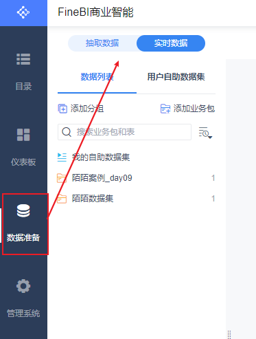

### 11.2 在fineBI配置数据源

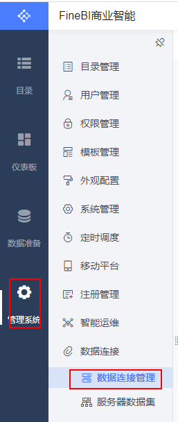

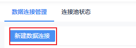

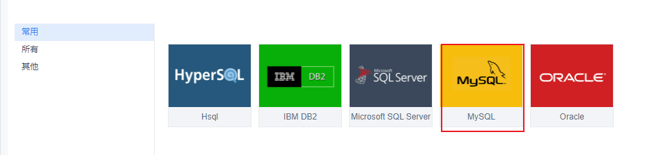

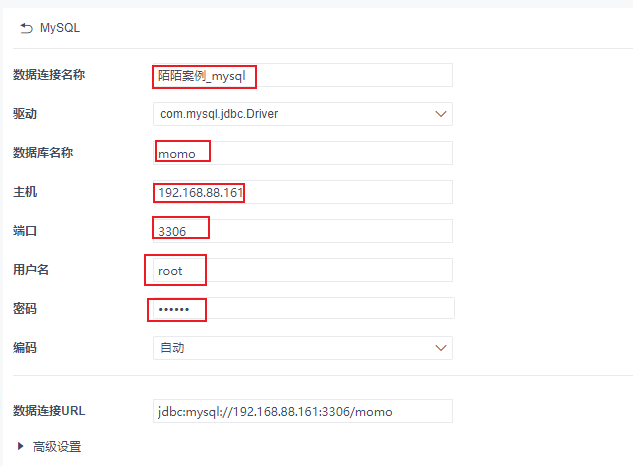

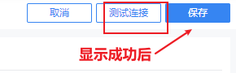

### 11.3 配置数据集

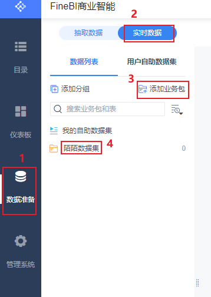

点击陌陌数据集

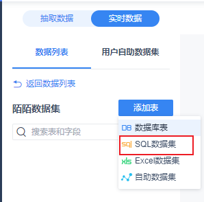

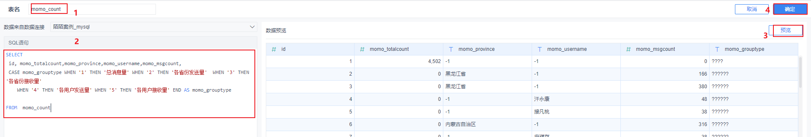

```sql
SELECT 
  id,momo_totalcount,momo_province,momo_username,momo_msgcount,
  CASE momo_grouptype WHEN  '1' THEN '总消息量'
	WHEN '2' THEN '各地区发送量'
	WHEN '3' THEN '各地区接收量'
	WHEN '4' THEN '各用户发送量'
	WHEN '5' THEN '各用户接收量'
	ELSE '未知' END  AS momo_grouptype
		
FROM momo_count
```

发现 出现了乱码 解决方案: 

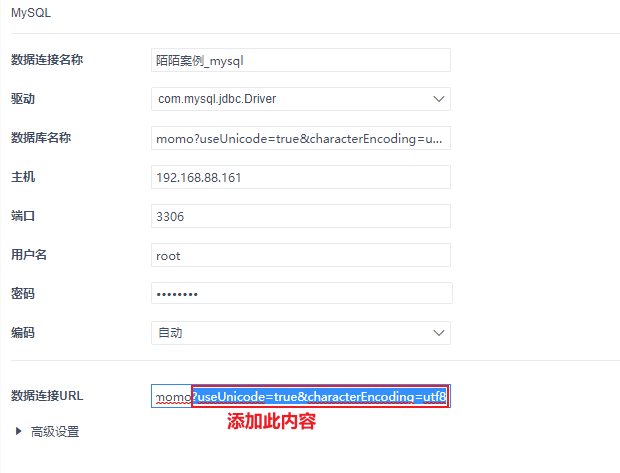

```properties
?useUnicode=true&characterEncoding=utf8
```

此时再看数据集, 中文就回来了

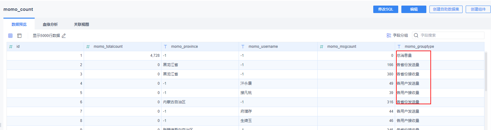

### 11.4 创建仪表盘

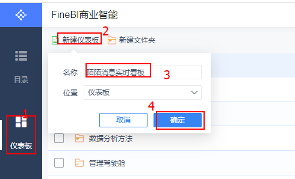

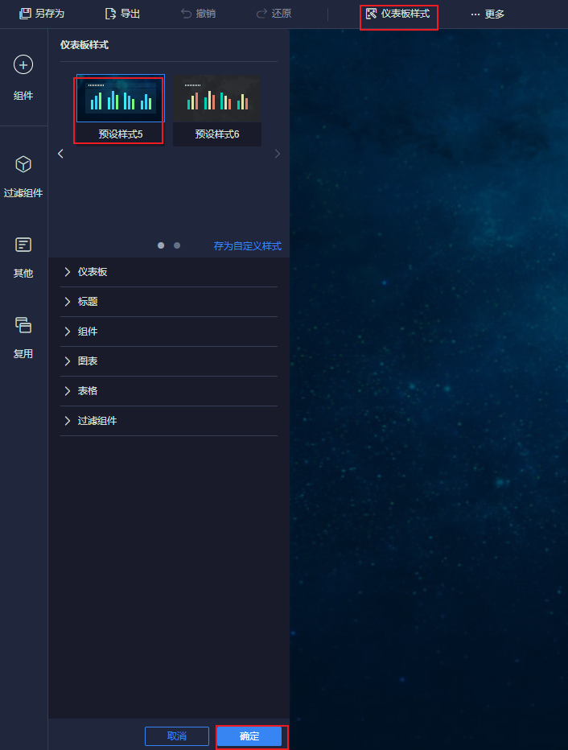

### 11.5 设置标题

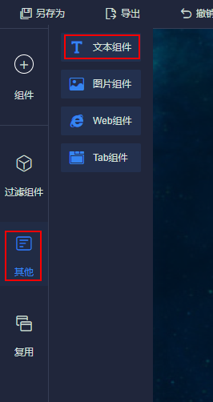


### 11.6 发送消息前10位用户(柱形图)

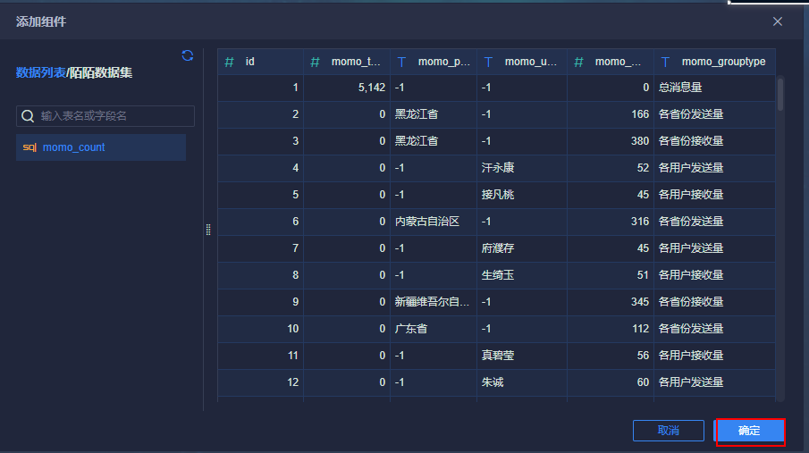

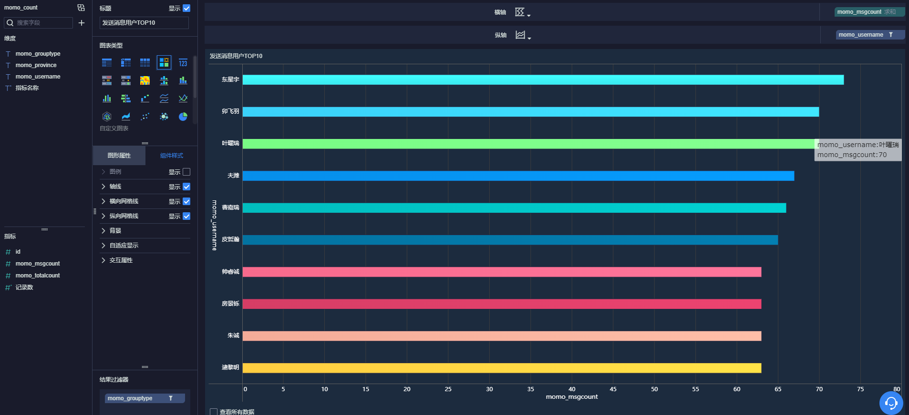

### 11.7 各地区接收消息TOP10(饼图)


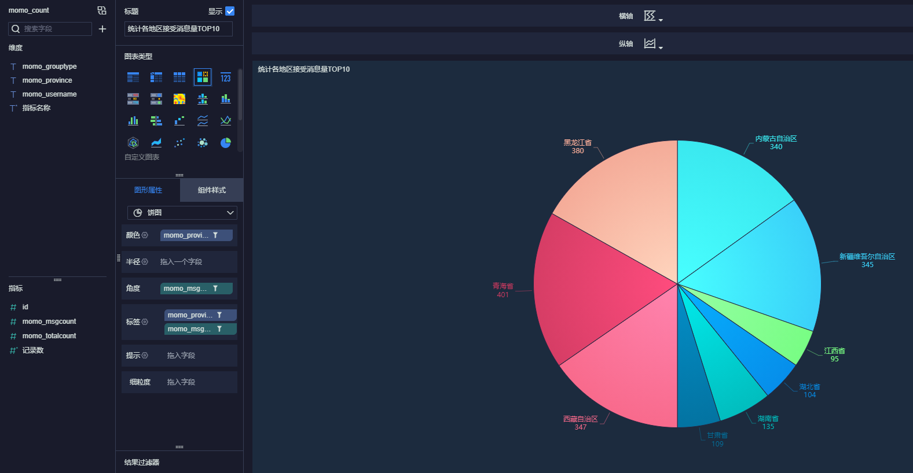

### 11.8 各省份的消息量(地图)


### 11.9 接收消息前10位用户(柱形图,线图)


### 11.10 各地区发送消息TOP10(饼图)


### 11.11 仪表盘的定时刷新设置

​	https://help.fanruan.com/finebi/doc-view-363.html

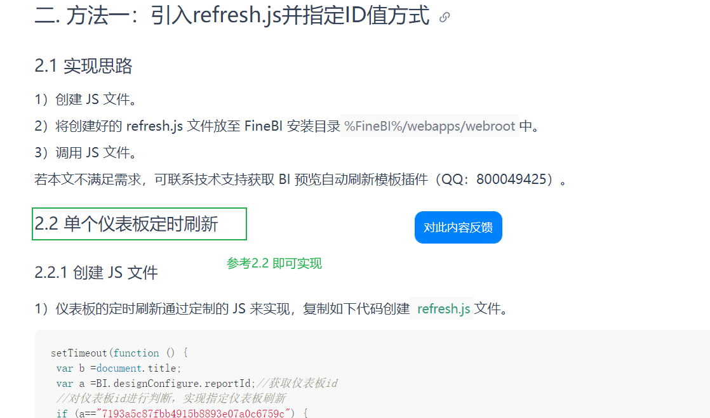

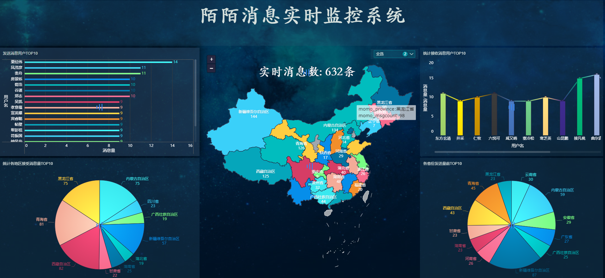

## 12. 整体测试

* 1) 清空hbase中所有的数据

```properties
disable 'MOMO_CHAT:MOMO_MSG'
drop 'MOMO_CHAT:MOMO_MSG'

create 'MOMO_CHAT:MOMO_MSG' , {NAME=>'C1',COMPRESSION=>'GZ'},{NUMREGIONS=>6, SPLITALGO=>'HexStringSplit'}
```

* 2) 删除 视图 以及hive对集成表, 重新创建

```sql
Phoenix:
	drop view momo_chat.momo_msg;
	重建:
create view MOMO_CHAT.MOMO_MSG (
  id varchar primary key,
  C1."msg_time"   varchar,
  C1."sender_nickyname"   varchar,
  C1."sender_account"   varchar,
  C1."sender_sex"   varchar,
  C1."sender_ip"   varchar,
  C1."sender_os"   varchar,
  C1."sender_phone_type"   varchar,
  C1."sender_network"   varchar,
  C1."sender_gps"   varchar,
  C1."receiver_nickyname"   varchar,
  C1."receiver_ip"   varchar,
  C1."receiver_account"   varchar,
  C1."receiver_os"   varchar,
  C1."receiver_phone_type"   varchar,
  C1."receiver_network"   varchar,
  C1."receiver_gps"   varchar,
  C1."receiver_sex"   varchar,
  C1."msg_type"   varchar,
  C1."distance"   varchar,
  C1."message"   varchar
);


hive: 
	删除表:  drop table momo_chat.momo_msg;
	重新建表:
create external table momo_chat.momo_msg(
     id   string,
     msg_time   string,
     sender_nickyname   string,
     sender_account   string,
     sender_sex   string,
     sender_ip   string,
     sender_os   string,
     sender_phone_type   string,
     sender_network   string,
     sender_gps   string,
     receiver_nickyname   string,
     receiver_ip   string,
     receiver_account   string,
     receiver_os   string,
     receiver_phone_type   string,
     receiver_network   string,
     receiver_gps   string,
     receiver_sex   string,
     msg_type   string,
     distance   string,
     message   string
) stored by 'org.apache.hadoop.hive.hbase.HBaseStorageHandler' with serdeproperties('hbase.columns.mapping'=':key,C1:msg_time,
C1:sender_nickyname,
C1:sender_account,
C1:sender_sex,
C1:sender_ip,
C1:sender_os,
C1:sender_phone_type,
C1:sender_network,
C1:sender_gps,
C1:receiver_nickyname,
C1:receiver_ip,
C1:receiver_account,
C1:receiver_os,
C1:receiver_phone_type,
C1:receiver_network,
C1:receiver_gps,
C1:receiver_sex,
C1:msg_type,
C1:distance,
C1:message') tblproperties('hbase.table.name'='MOMO_CHAT:MOMO_MSG');
```

* 2) 删除flume中断点续传文件

```shell
cd /export/data/flume
rm -rf taildir_position.json
```

* 3) 删除 生产数据的jar包 所生成的数据

```shell
cd /export/data/momo_data
rm -rf MOMO_DATA.dat 
```

* 4) 删除mysql中输出的结果数据
* 5) 三个节点重启

```
reboot
```

* 6- 代码中 消费组 重新更换一个新的, 以免因为历史消费问题, 导致重复消费


-----

测试操作:

* 1)  先启动zookeeper:
* 2) 接着启动 hadoop集群
* 3) 然后启动 kafka  hbase  
* 4) 最后启动:  hive  Phoenix
* 5) 启动fineBI, 点开实时看板图表
* 6) 启动写入hbase的程序
* 7) 启动flink实时统计程序
* 8) 启动flume程序
* 9) 启动一个监听 kafka对应topic的消费者
* 10) 启动生产数据jar包
* 11) 检测: 在Phoenix查询是否有数据生成, 以及在hive中查询数据是否存在, 同时观察 消费者是否消费到数据
* 12) 观察图表是否正常展示

