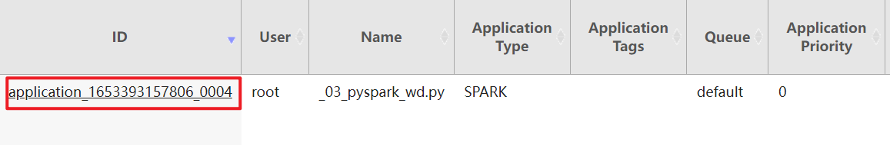
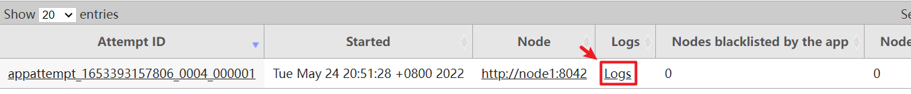
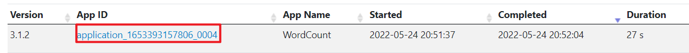
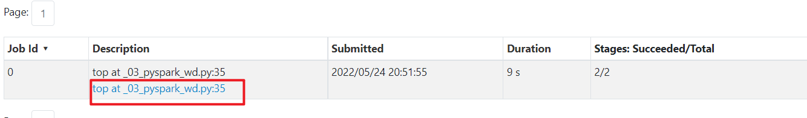
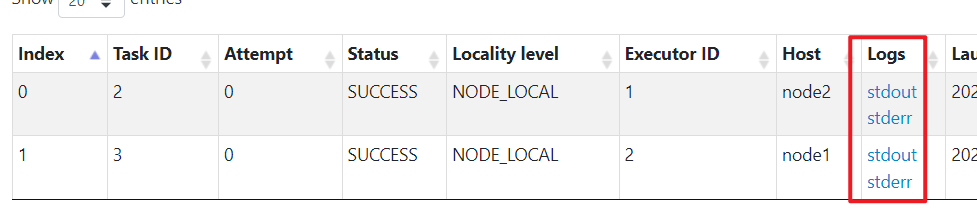
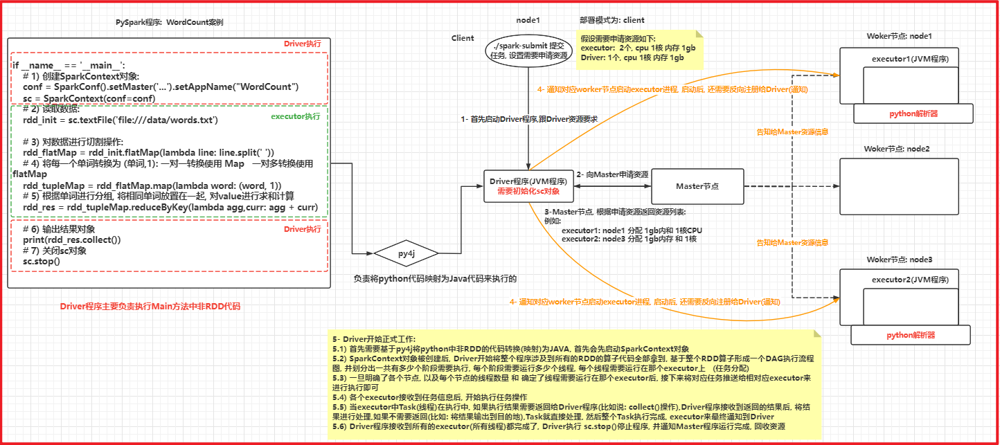

# day02 PySpark课程笔记

今日内容:

* 1- Spark on Yarn整个测试 (会使用)
* 2- Spark两种部署模式 (理解,并且会使用)
* 3-Spark程序与pyspark交互流程 (重要原理)
* 4- Spark-submit命令的相关的参数说明(知道, 并记录在笔记中)

## 1. Spark On Yarn环境搭建

### 1.1 Spark On Yarn的本质

​		本质:  将Spark程序运行在yarn集群中, 由yarn完成任务调度工作

### 1.2 配置Spark On Yarn

​		关于整个配置, 大家直接参考<<spark环境部署文档>>  一定要参考今天的最新的安装部署文档

### 1.3 提交应用测试

* 将编写的WordCount的代码提交到yarn平台运行
  * 注意: 需要将代码中 --master参数删除 或者 修改为 yarn

```properties
cd /export/server/spark/bin
./spark-submit \
--master yarn \
--conf "spark.pyspark.driver.python=/root/anaconda3/bin/python3" \
--conf "spark.pyspark.python=/root/anaconda3/bin/python3" \
/export/data/workspace/ky04_pyspark_parent/_01_pyspark_base/src/_03_pyspark_wd.py
```

* 提交之前spark中用于计算圆周率的py脚本

```properties
cd /export/server/spark/bin
./spark-submit \
--master yarn \
--conf "spark.pyspark.driver.python=/root/anaconda3/bin/python3" \
--conf "spark.pyspark.python=/root/anaconda3/bin/python3" \
/export/server/spark/examples/src/main/python/pi.py \
100
```

说明:

```properties
	Spark程序在运行的时候, 主要有二大进程来执行: Driver程序 和Executor程序
	
	Driver程序: 类似于MR中applicationMaster
		主要负责: 任务的资源的申请, 任务分配, 与任务相关的工作 基本都是有Driver进行负责的
	Executor程序: 执行器(理解为是一个线程池) Spark最终执行的线程都是运行在executor上
```


### 1.4 两种部署方式说明

​		在提交Spark程序到Spark集群或者Yarn集群, 有二种部署方案: client(客户端),cluster模式(集群模式)

```properties
两种模式本质区别: Driver程序具体应该运行在哪里位置
	client模式(默认): Driver程序是允许允许在客户端(在哪个节点提交任务, Driver程序就运行在哪个节点)
		好处: 直接在客户端看到程序运行的结果,方便测试
		弊端: 由于Driver在客户端中本地运行, executor是运行在集群中, executor在执行完成后, 需要将结果返回给Driver而Driver在本地客户端, 这样就会导致大量的数据会经过网络传输给Driver客户端, 造成大量的IO, 影响效率
		一般此种模式仅用于测试环境, 生产中一般不使用

	cluster模式: Driver程序运行在集群中,  比如说: 提交到yarn上, Driver程序会运行在某一个nodemanager上
		好处: Driber程序运行在集群中, 和executor都在同一个集群,在进行数据传输的操作的时候,可以直接基于内网来传输,折腾传输的速率机高很多, 从而提升效率, 此种方案在生产中比较常用
		弊端:  无法直接看到执行结果, 需要通过日志查看

```

如何配置不同的部署方式呢?

```properties
PI脚本为例. 提交到Yarn的时候, 采用不同的部署模式:
cd /export/server/spark/bin
./spark-submit \
--master yarn \
 --deploy-mode cluster|client \ 
--conf "spark.pyspark.driver.python=/root/anaconda3/bin/python3" \
--conf "spark.pyspark.python=/root/anaconda3/bin/python3" \
/export/server/spark/examples/src/main/python/pi.py \
100

演示: 
WordCount案例: client模式
./spark-submit \
--master yarn \
 --deploy-mode cluster \
--conf "spark.pyspark.driver.python=/root/anaconda3/bin/python3" \
--conf "spark.pyspark.python=/root/anaconda3/bin/python3" \
/export/data/workspace/ky04_pyspark_parent/_01_pyspark_base/src/_03_pyspark_wd.py
```


如何查看Spark日志:

```properties
必须要启动Yarn的history日志服务  以及 Spark的日志服务, 否则无法查看

查看日志的信息, 主要有二个渠道: 
	1) 基于8088 YARN集群, 查看对应任务的执行日志
	2) 基于Spar提供18080查看Spark任务的相关日志信息
```

* 8088界面:





* 18080界面: 








## 2. Spark程序与PySpark交互流程



```properties
pyspark程序提交到spark集群: 部署方式为client

1- 首先启动Driver程序,跟Driver资源要求
2- 向Master申请资源
3-Master节点, 根据申请资源返回资源列表:
	例如:         
		executor1: node1 分配 1gb内和 1核CPU        
		executor2: node3 分配 1gb内存 和 1核
4- 通知对应worker节点启动executor进程, 启动后, 还需要反向注册给Driver(通知)
5- Driver开始正式工作: 
	5.1) 首先需要基于py4j将python中非RDD的代码转换(映射)为JAVA, 首先会先启动SparkContext对象
	5.2) SparkContext对象被创建后, Driver开始将整个程序涉及到所有的RDD的算子代码全部拿到, 基于整个RDD算子形成一个DAG执行流程图, 并划分出一共有多少个阶段需要执行, 每个阶段需要运行多少个线程, 每个线程需要运行在那个executor上   (任务分配)
	5.3) 一旦明确了各个节点, 以及每个节点的线程数量 和 确定了线程需要运行在那个executor后, 接下来将对应任务推送给相对应executor来进行执行即可
	5.4) 各个executor接收到任务信息后, 开始执行任务操作
	5.5) 当executor中Task(线程)在执行中, 如果执行结果需要返回给Driver程序(比如说: collect()操作),Driver程序接收到返回的结果后, 将结果进行处理,如果不需要返回(比如: 将结果输出到目的地),Task就直接处理, 然后整个Task执行完成, executor来最终通知到Driver
	5.6) Driver程序接收到所有的executor(所有线程)都完成了, Driver执行 sc.stop()停止程序, 并通知Master程序运行完成, 回收资源
```


## 3. Spark-Submit相关的参数说明

​	spark-submit 这个命令 是我们spark提供的一个专门用于提交spark程序的客户端, 可以将spark程序提交到各种资源调度平台上: 比如说 **local(本地)**, spark集群,**yarn集群**, 云上调度平台(k8s ...)

​		spark-submit在提交的过程中, 设置非常多参数, 调整任务相关信息

* 基本参数设置


* Driver的资源配置参数


* executor的资源配置参数


