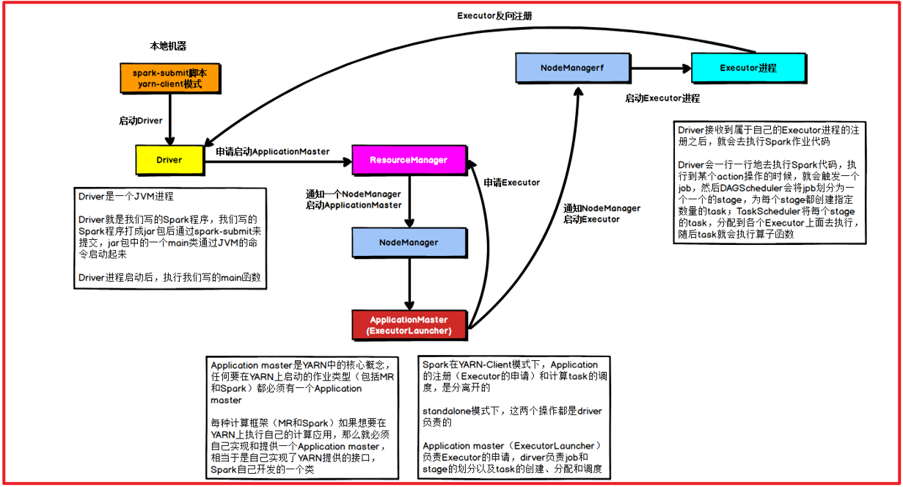
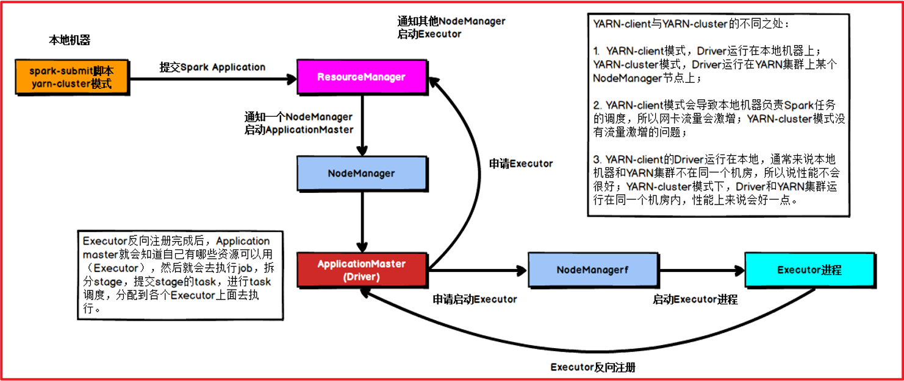
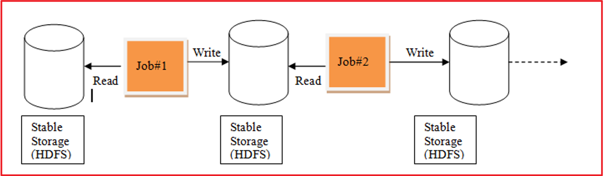
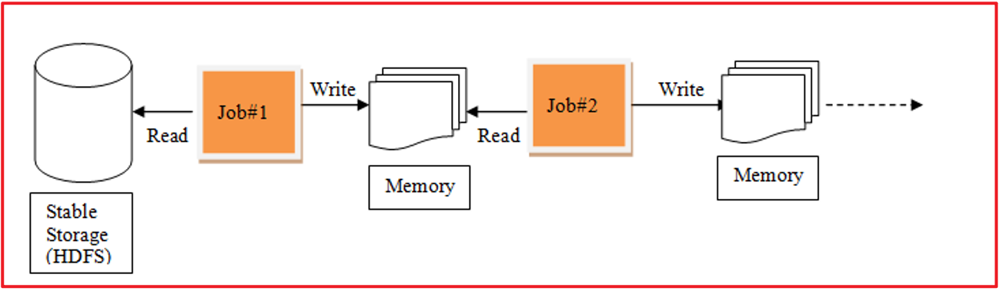

# day03 PySpark课程笔记

今日内容:

* 1- Spark和PySpark交互流程:  cluster部署模式 以及 ON Yarn client和cluster模式
* 2- Spark-submit命令相关的参数
* 3- Spark Core 核心内容 : RDD
  * RDD的基本介绍
  * RDD的基本使用操作

## 1. Spark程序与PySpark交互流程


```properties
pyspark程序提交到spark集群: 部署方式为client

1- 首先启动Driver程序,根据Driver资源要求
2- 向Master申请资源
3-Master节点, 根据申请资源返回资源列表:
	例如:         
		executor1: node1 分配 1gb内和 1核CPU        
		executor2: node3 分配 1gb内存 和 1核
4- 通知对应worker节点启动executor进程, 启动后, 还需要反向注册给Driver(通知)
5- Driver开始正式工作: 
	5.1) 首先需要基于py4j将python中非RDD的代码转换(映射)为JAVA, 首先会先启动SparkContext对象
	5.2) SparkContext对象被创建后, Driver开始将整个程序涉及到所有的RDD的算子代码全部拿到, 基于整个RDD算子形成一个DAG执行流程图, 并划分出一共有多少个阶段需要执行, 每个阶段需要运行多少个线程, 每个线程需要运行在那个executor上   (任务分配)
	5.3) 一旦明确了各个节点, 以及每个节点的线程数量 和 确定了线程需要运行在那个executor后, 接下来将对应任务推送给相对应executor来进行执行即可
	5.4) 各个executor接收到任务信息后, 开始执行任务操作
	5.5) 当executor中Task(线程)在执行中, 如果执行结果需要返回给Driver程序(比如说: collect()操作),Driver程序接收到返回的结果后, 将结果进行处理,如果不需要返回(比如: 将结果输出到目的地),Task就直接处理, 然后整个Task执行完成, executor来最终通知到Driver
	5.6) Driver程序接收到所有的executor(所有线程)都完成了, Driver执行 sc.stop()停止程序, 并通知Master程序运行完成, 回收资源
```

pySpark程序提交Spark集群:  部署方式cluster

```properties
1- 客户端将Spark程序提交到Master节点上
2- Master节点接收到任务后, 首先会根据提交任务信息中, 根据Driver资源信息, 随机找一个worker节点启动Driver程序
3- Driver程序启动后, 会和Master程序建立心跳机制, 接着向Master申请启动executor的资源
4- Master程序接收资源申请信息后, 会根据资源信息从各个节点分配出相关的资源, 通过资源列表返回给Driver
	例如:         
		executor1: node1 分配 1gb内和 1核CPU        
		executor2: node3 分配 1gb内存 和 1核
5- Driver接收到资源信息后, 通知相对于worker节点启动executor程序, 启动后. 还需要反向注册回给Driver

6- Driver开始正式工作: 
	6.1) 首先需要基于py4j将python中非RDD的代码转换(映射)为JAVA, 首先会先启动SparkContext对象
	6.2) SparkContext对象被创建后, Driver开始将整个程序涉及到所有的RDD的算子代码全部拿到, 基于整个RDD算子形成一个DAG执行流程图, 并划分出一共有多少个阶段需要执行, 每个阶段需要运行多少个线程, 每个线程需要运行在那个executor上   (任务分配)
	6.3) 一旦明确了各个节点, 以及每个节点的线程数量 和 确定了线程需要运行在那个executor后, 接下来将对应任务推送给相对应executor来进行执行即可
	6.4) 各个executor接收到任务信息后, 开始执行任务操作
	6.5) 当executor中Task(线程)在执行中, 如果执行结果需要返回给Driver程序(比如说: collect()操作),Driver程序接收到返回的结果后, 将结果进行处理,如果不需要返回(比如: 将结果输出到目的地),Task就直接处理, 然后整个Task执行完成, executor来最终通知到Driver
	6.6) Driver程序接收到所有的executor(所有线程)都完成了, Driver执行 sc.stop()停止程序, 并通知Master程序运行完成, 回收资源
```

pySpark程序提交到Yarn集群: 部署方式为client



```properties
pyspark程序提交到Yarn集群: 部署方式为client

1- 首先启动Driver程序,根据Driver资源要求
2- 生成一个任务, 将这个任务提交到yarn的主节点(RM)
	任务: 用于在Yarn上申请资源, 启动executor

3- 当Yarn主节点(RM)接收到任务请求后, 首先会先随机在某一个nodemanager节点上启动AppMaster. 当AppMaster启动完成后, 会和Yarn主节点建立心跳机制, 告知Yarn的主节点以及启动成功了

4- appMaster接下来就要进行资源的申请工作, 将需要申请的资源通过心跳包的形式传递给RM, RM收到资源信息后, 就会调用调度器来进行资源的分配工作. 分配好等着AppMaster来拉取资源列表即可

5- appMaster不断的基于心跳询问Yarn主节点是否已经准备好资源信息, 一旦发现准备好, 立即获取, 然后根据资源信息要求在对应的nodemanager启动executor程序

6- 当各个节点将executor启动完成后, 通知个appMaster 同时还要反向注册给Driver程序, Driver程序一旦接收到executor已经启动的状态, 就开始进行任务的处理

7- Driver开始正式工作: 
	7.1) 首先需要基于py4j将python中非RDD的代码转换(映射)为JAVA, 首先会先启动SparkContext对象
	7.2) SparkContext对象被创建后, Driver开始将整个程序涉及到所有的RDD的算子代码全部拿到, 基于整个RDD算子形成一个DAG执行流程图, 并划分出一共有多少个阶段需要执行, 每个阶段需要运行多少个线程, 每个线程需要运行在那个executor上   (任务分配)
	7.3) 一旦明确了各个阶段, 以及每个阶段的线程数量 和 确定了线程需要运行在那个executor后, 接下来将对应任务推送给相对应executor来进行执行即可
	7.4) 各个executor接收到任务信息后, 开始执行任务操作
	7.5) 当executor中Task(线程)在执行中, 如果执行结果需要返回给Driver程序(比如说: collect()操作),Driver程序接收到返回的结果后, 将结果进行处理,如果不需要返回(比如: 将结果输出到目的地),Task就直接处理, 然后整个Task执行完成, executor来最终通知到Driver 同时也会通知给appMaster. 以及执行完成, appMaster收到执行完成的信息后, 通知RM, 进行资源回收, 整个Yarn中执行流程全部结束了
	7.6) Driver程序接收到所有的executor(所有线程)都完成了, 同时也收到RM的反馈任务运行状态后,  Driver执行 sc.stop()停止程序
	
	
    其实在整个过程中, Driver功能没有发生本质的区别, 只是将Driver进行资源申请启动executor工作交给了Yarn环境,由AppMaster来负责处理
```


pySpark程序提交到Yarn集群: 部署方式为cluster



```properties
	在集群模式下, 整个Driver程序和appMaster程序合二为一
```


## 2. Spark-Submit相关的参数说明

​	spark-submit 这个命令 是我们spark提供的一个专门用于提交spark程序的客户端, 可以将spark程序提交到各种资源调度平台上: 比如说 **local(本地)**, spark集群,**yarn集群**, 云上调度平台(k8s ...)

​		spark-submit在提交的过程中, 设置非常多参数, 调整任务相关信息

* 基本参数设置


* Driver的资源配置参数


* executor的资源配置参数


## 3. RDD的基本介绍

### 3.1 什么是RDD

RDD: 弹性的分布式数据集

RDD出现目的: 主要是用于支持更加高效迭代计算操作

----

背景:

```properties
在早期的计算模型: 单机模型
	比如: pandas  MySQL
	依赖于单个节点性能
	适用于: 少量数据集统计计算分析处理
	整个计算过程都是在一个进程中, 不断的进行各种迭代计算操作

当数据量大了以后, 单机这种操作无法支撑, 此时可以采用分布式计算模型
	核心: 让更多的节点参与计算, 将计算任务进行划分, 将各个部分交给各个节点进行运行, 运行完成后, 将结果进行汇总
	
	比如: MR Spark  Flink  Storm(几乎很少有人在使用了).....
	
	MapReduce计算模型: 
		在计算过程中, 每一个MR都是由两部分组成:  MapTask  和 ReduceTask
		在计算过程中, 需要将数据从磁盘中读取到内存中, 从内存落入到磁盘, 再从磁盘读取, 在落入内存 ..... 整个计算的IO是非常大的(MR是一个IO密集型框架) 整个执行效率比较低
		
		由于只有mapTask和reduceTask, map进行分布式处理, reduce进行汇总统计 如果需要进行多次分布式计算多次的聚合统计操作(迭代计算),对于MR来说, 必须要使用多个MR程序进行串行执行, 每一个MR都需要重新的申请资源,回收资源,大量时间都浪费在这个资源处理上, 而且中间的结果只能保存到磁盘中, 整个迭代计算效率比较差
		
		发现, MR存在这样一些问题, 此时想办法解决:
			1- 是否可以让中间的结果存储在内存中,这样即可提升效率
			2- 是否可以在一个程序中支持完成多次不断的迭代计算
		
		这种解决方案的思路, 最终由Spark来具体提供了, Spark的RDD的产生就是为了解决这样的问题的
```

MR的迭代过程:



Spark的迭代过程:



### 3.2 RDD的五大特性(明确知道)

五大特性:

```properties
1) (必须的) RDD支持被分区: 每一个分区对应的就是一个Task线程
2) (必须的) 每一个RDD都是存在计算函数的:  计算函数是针对RDD中每个分区来处理
3) (必须的) RDD之间存在依赖关系
4) (可选的) 对于 kv类型的RDD数据在进行分区的时候, 默认是基于Hash分区的
5) (可选的) 移动数据不如移动计算(将计算程序运行在离数据越近越好)
```


### 3.3 RDD的五大特点(明确知道)

五大特点:

```properties
1- 可分区的: RDD的分区是一种抽象的分区, 仅仅定义了分区的规则信息
2- RDD只读的: 一个RDD对象中数据是不可变的
3- RDD之间存在依赖关系: 依赖关系也被称为血缘关系, 依赖关系越长, 整个血缘关系越长
	整个血缘关系越长, 重新计算的代价越高
	依赖中可以分为: 宽依赖和窄依赖
4- 缓存: 当需要对一个RDD 的结果进行重复使用的时候, 可以将这个RDD的计算结果缓存起来, 减少后续重新计算的资源和时间损耗
5- checkpoint(检查点): 
	当依赖链条比较长的时候, 如果其中一个函数计算失败了, 重新计算, 而重新计算一次整个代价比较高的(需要对整个血缘过程进行回溯, 重新核算)
	可以使用检查点对整个依赖链条进行打断操作,对应的断点位置上记录当前计算结果, 这样后续继续失败了, 只需要从断点位置恢复数据即可,这样就不需要整体回溯, 从而提升效率
	保存一定是要能够永久性的保存(HDFS)
```


## 4 如何构建RDD

构建RDD对象的方式主要有二种

```
通过调用parallelism 并行方式(本地模拟数据)来构建RDD对象
通过加载外部文件数据集的方式来构建RDD: textFile()
```


### 4.1 通过并行的方式来构建RDD

代码演示:

```properties
# 演示 如何构建RDD 方式一
from pyspark import SparkContext, SparkConf
import os

# 锁定远程的环境版本(固定内容, 用于锁定python及spark环境版本)
os.environ['SPARK_HOME'] = '/export/server/spark'
os.environ['PYSPARK_PYTHON'] = '/root/anaconda3/bin/python3'
os.environ['PYSPARK_DRIVER_PYTHON'] = '/root/anaconda3/bin/python3'

if __name__ == '__main__':
    print('构建RDD方式一:')

    # 1- 创建SparkContext对象
    conf = SparkConf().setMaster('local[10]').setAppName('create_rdd')
    sc = SparkContext(conf=conf)

    # 2- 读取数据  使用方式一 测试
    rdd_init = sc.parallelize(['张三','李四','王五','赵六','田七','周八','李九'],3)

    print(rdd_init.collect())
    # 查看当前这个RDD一共有几个分区
    print(rdd_init.getNumPartitions()) # 2
    # 想查看一下每个分区有那些数据
    # ['张三', '李四', '王五'], ['赵六', '田七', '周八', '李九']
    print(rdd_init.glom().collect())
```

说明:

```properties
1) 默认情况下, 分区数量取决于 setMaster参数设置, 而local[*] 星号取决于linuxCPU的核心数
2) 支持手动设置数据的分区数量
		sc.parallelize(初始化数据, 分区数量)
3) 如何获取分区的数量: rdd.getNumPartitions()
4) 如何获取每个分区的数据: rdd.glom()
```

