# day04 pyspark课程笔记

今日内容:

* 1- 如何构建RDD_方式二
* 2- RDD算子相关的操作
* 3- 综合案例
* 4- RDD的持久化
* 5- RDD的共享变量


## 1 如何构建RDD

构建RDD对象的方式主要有二种

```
通过调用parallelism 并行方式(本地模拟数据)来构建RDD对象
通过加载外部文件数据集的方式来构建RDD: textFile()
```


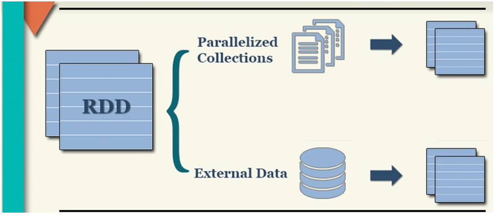

### 1.1 通过并行的方式来构建RDD

代码演示:

```properties
# 演示 如何构建RDD 方式一
from pyspark import SparkContext, SparkConf
import os

# 锁定远程的环境版本(固定内容, 用于锁定python及spark环境版本)
os.environ['SPARK_HOME'] = '/export/server/spark'
os.environ['PYSPARK_PYTHON'] = '/root/anaconda3/bin/python3'
os.environ['PYSPARK_DRIVER_PYTHON'] = '/root/anaconda3/bin/python3'

if __name__ == '__main__':
    print('构建RDD方式一:')

    # 1- 创建SparkContext对象
    conf = SparkConf().setMaster('local[10]').setAppName('create_rdd')
    sc = SparkContext(conf=conf)

    # 2- 读取数据  使用方式一 测试
    rdd_init = sc.parallelize(['张三','李四','王五','赵六','田七','周八','李九'],3)

    print(rdd_init.collect())
    # 查看当前这个RDD一共有几个分区
    print(rdd_init.getNumPartitions()) # 2
    # 想查看一下每个分区有那些数据
    # ['张三', '李四', '王五'], ['赵六', '田七', '周八', '李九']
    print(rdd_init.glom().collect())
```

说明:

```properties
1) 默认情况下, 分区数量取决于 setMaster参数设置, 而local[*] 星号取决于linuxCPU的核心数
2) 支持手动设置数据的分区数量
		sc.parallelize(初始化数据, 分区数量)
3) 如何获取分区的数量: rdd.getNumPartitions()
4) 如何获取每个分区的数据: rdd.glom()
```

### 1.2 通过读取外部数据方式构建RDD

代码演示:


可能报出如下的错误:

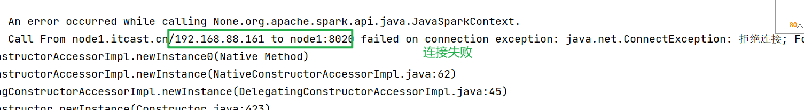

```properties
大概率原因 一般就是没有启动HDFS| Hadoop5# 演示 创建RDD方式二
from pyspark import SparkContext, SparkConf
import os

# 锁定远程的环境版本(固定内容, 用于锁定python及spark环境版本)
os.environ['SPARK_HOME'] = '/export/server/spark'
os.environ['PYSPARK_PYTHON'] = '/root/anaconda3/bin/python3'
os.environ['PYSPARK_DRIVER_PYTHON'] = '/root/anaconda3/bin/python3'

if __name__ == '__main__':
    print("演示构建RDD的方式二")

    # 1- 创建SparkContext对象
    conf = SparkConf().setMaster('local[*]').setAppName('create_rdd')
    sc = SparkContext(conf = conf)

    # 2- 读取外部文件数据: textFile
    # 参数1: 表示的是加载数据的路径地址, 支持文件或者目录  格式:  协议 +  路径
    #      本地文件:  file:///   由于连接远程环境, 所以此处本地指的元旦环境中本地路径
    #      HDFS:  hdfs://node1:8020/
    rdd_init = sc.textFile('hdfs://node1:8020/pyspark_data/words.txt',15)

    # 答应其分区的数量 以及分区的内容
    print(rdd_init.getNumPartitions())
    print(rdd_init.glom().collect())

目前发现TextFile在读取数据的时候, 这个分区的凡事有所不同
```

思考点: 如果目前有大量的小文件, 按照目前有多少的文件, 就会启动多少个分区(线 程),由于 分区数量增大, 对应线程的线程也会增加, 从而导致最后输出到目录中文件数量也变得多了 最终会导致浪费资源以及影响效率

​		那么如何解决呢?  wholeTextFile()

```properties
# 演示 创建RDD方式三
from pyspark import SparkContext, SparkConf
import os

# 锁定远程的环境版本(固定内容, 用于锁定python及spark环境版本)
os.environ['SPARK_HOME'] = '/export/server/spark'
os.environ['PYSPARK_PYTHON'] = '/root/anaconda3/bin/python3'
os.environ['PYSPARK_DRIVER_PYTHON'] = '/root/anaconda3/bin/python3'

if __name__ == '__main__':
    print("演示构建RDD的方式二")

    # 1- 创建SparkContext对象
    conf = SparkConf().setMaster('local[*]').setAppName('create_rdd')
    sc = SparkContext(conf = conf)

    # 2- 读取外部文件数据: textFile
    # 原则: 尽可能减少分区的数量, 同时保证效率, 如果处理后不满意, 可以通过手动方式来设置最小的分区数量
    rdd_init = sc.wholeTextFiles('file:///export/data/workspace/ky04_pyspark_parent/_02_pyspark_core/data',1)

    print(rdd_init.getNumPartitions())
    print(rdd_init.glom().collect())


    rdd2 = sc.textFile('file:///export/data/workspace/ky04_pyspark_parent/_02_pyspark_core/data')

    print(rdd2.getNumPartitions())
    print(rdd2.glom().collect())
    

注意: 
	wholeTextFiles:  返回的结果中, 为一个二元元组, 其中key为文件的路径, 而value为文件中数据
```


如何确认RDD的分区数量:

```properties
1) 当采用并行的方式来构建RDD的时候, RDD分区直接取决于设置的分区数, 如果没有设置, 取决于--master('') 设置分区数量

2) 当采用textFile来构建RDD的时候:  
		2.1 第一步: 两个值取最小值    
				minPartition = min(default.parallelism ,2)  
				得到一个最小分区数 
				
				说明:  default.parallelism 参数的值确认:  默认取决于CPU的核心数 
					如果是集群模式  默认为 2
					如果是local模式: 取决于 local[N]  当N等于 *的时候, 其N值为CPU核心数
	   2.2 第二步:  两个值取最大值
       		rdd分区数 = max(文件的切片的数量| block块数据, minPartition)
       	
      注意: 当读取外部文件的方式的时候, 只能在API中设置最小的分区数, 无法直接指定要几个分区
```


## 2. RDD算子相关的操作

​		在spark中, 将支持传递函数的或者说具有一些特殊功能的方法或者函数称为算子,或者说可以通过RDD调度的相关函数, 基本都是算子

### 2.1 RDD算子分类

​		在整个RDD中主要有二类算子: 一类为transformation算子(转换算子)  和  action算子(动作算子)

```properties
转换算子: transformation
	1) 所有的转换算子执行完成后都会返回一个新的RDD对象
	2) 转换算子的特性是lazy(惰性) ,只有遇到action动作算子才会执行
	3) 不负责数据的存储, 仅仅是定义了计算的规则

动作算子: action
	1) 立即执行(内部一个action就会生成一个DAG执行流程图, 执行任务): 一个Spark程序中, 有多少个action算子, 那么也就代表着运行多少个任务
	2) action算子不会返回新的RDD对象: 要不就没有返回值(比如执行保存数据操作),要不就返回其他的具体内容(比如说: collect)
```

转换算子:

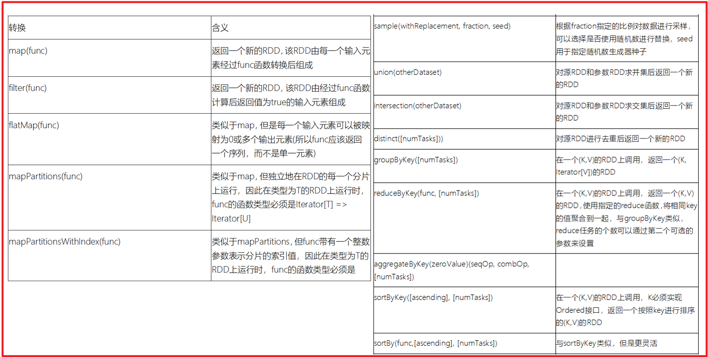

action算子:

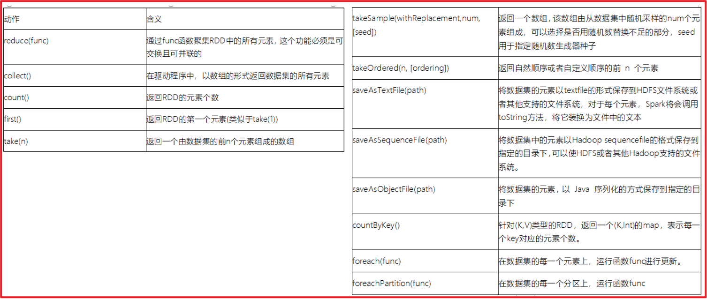


关于Spark提供的所有的RDD算子的位置: https://spark.apache.org/docs/3.1.2/api/python/reference/pyspark.html#rdd-apis


以下算子的讲解, 重点掌握如何使用, 每个算子有什么用, 至于实际应用, 本质就是根据作用选择对应算子来处理


### 2.2 RDD的Transformation算子操作

* 第一类: 值类型的算子(只对value数据进行处理)

  * map算子(F) 算子
    * 指的: 根据用户传入的自定义函数, 将数据进行一对一的转换操作

  ```properties
  需求:  初始化一个 1~10 数据, 让每个数据都 +1 操作
  rdd_init = sc.parallelize([1,2,3,4,5,6,7,8,9,10])
  rdd_init.map(lambda num:num+1).collect()
  
  结果: 
  [2, 3, 4, 5, 6, 7, 8, 9, 10, 11]
  
  说明: 使用lambda方式, 使用python匿名函数, 除了可以使用匿名函数以外, 也可以先定义函数, 然后使用
  
  def f1(x):
      return x + 1
  
  rdd_init.map(f1).collect()  
  
  结果: 
  [2, 3, 4, 5, 6, 7, 8, 9, 10, 11]
  ```

  * groupBy(F)算子: 
    * 作用: 根据用户传入的自定义函数, 对数据进行分组操作

  ```properties
  需求:  初始化一个 1~10 数据, 将奇数和偶数区分开, 分为两组数据
  rdd_init = sc.parallelize([1,2,3,4,5,6,7,8,9,10])
  rdd_g = rdd_init.groupBy(lambda num: 'o' if(num % 2 == 0) else 'j')
  rdd_g.collect()
  结果: 
  [
  	('j', <pyspark.resultiterable.ResultIterable object at 0x7fc9978842b0>), 
  	('o', <pyspark.resultiterable.ResultIterable object at 0x7fc997890970>)]
  
  发现: 返回的结果中, key为组名字, value为这个组的数据, 此数据目前是一个迭代器(Iterable)
  
  如果处理迭代器中数据:  
  	mapValues() 算子: 用于对value数据进行转换处理
  
  操作:
  rdd_g.mapValues(list).collect()
  
  结果:
  	[('j', [1, 3, 5, 7, 9]), ('o', [2, 4, 6, 8, 10])]
  ```

  * filter(F) 算子
    * 作用:  用于对数据进行过滤操作, 将需要的数据保留下来, 不需要的数据剔除掉
    * 传入函数, 函数表示一个判断条件, 必须返回boolean类型值, 如果为True 表示保留, 为False 表示剔除

  ```properties
  需求: 初始化一个 1~10 数据, 将大于5的数据, 过滤掉
  rdd_init = sc.parallelize([1,2,3,4,5,6,7,8,9,10])
  rdd_init.filter(lambda num: num <= 5).collect()
  
  结果为:
  	[1, 2, 3, 4, 5]
  ```

  * flatMap算子: 扁平化处理
    * 作用: 对数据先执行map操作, 然后执行flat扁平化

  ```properties
  需求: 初始化相关的数据, 对数据执行切割操作, 得到一个更大的列表
  rdd_init = sc.parallelize(['张三 李四 王五','赵六 田七 周八 李九'])
  
  演示 Map算子: 
  rdd_init.map(lambda el:el.split(' ')).collect()
  	[
  		['张三', '李四', '王五'], 
  		['赵六', '田七', '周八', '李九']
  	]
  
  演示flatMap算子:
  rdd_init.flatMap(lambda el:el.split()).collect() 
  
  结果: 
  	['张三', '李四', '王五', '赵六', '田七', '周八', '李九']
  ```

* 第二类: 双值类型的算子

  * union(并集) 和 intersection(交集)

  ```properties
  需求:  创建两个数据集, 分别计算其并集和交集
  rdd_a = sc.parallelize([1,2,3,4,5])
  rdd_b = sc.parallelize([4,5,6,9,10])
  
  -- 求并集:
  rdd_a.union(rdd_b).collect()
  
  结果:
  	[1, 2, 3, 4, 5, 4, 5, 6, 9, 10]
  
  rdd_a.union(rdd_b).distinct().collect()
  [4, 1, 5, 9, 2, 6, 10, 3]
  
  -- 求交集:
  rdd_a.intersection(rdd_b).collect()
  
  结果:
  	[4, 5]
  ```

* 第三类: kv类型的算子

  * groupByKey算子:
    * 作用: 根据key进行分组操作, 分组后, 每组都是一个迭代器

  ```properties
  需求:  创建一个数据集, 按照 key 进行分组操作
  rdd_init = sc.parallelize([('c01','张三'),('c02','李四'),('c01','王五'),('c03','赵六'),('c02','田七'),('c01','周八')])
  
  rdd_init.groupByKey().mapValues(list).collect()
  [('c01', ['张三', '王五', '周八']), ('c02', ['李四', '田七']), ('c03', ['赵六'])]
  ```

  * reduceByKey(F)算子:
    * 作用: 根据key进行分组 , 根据用户传入的自定义函数进行聚合统计计算

  ```properties
  需求: 创建一个数据集, 请按照key进行分组操作, 统计每组有多少个?
  rdd_init = sc.parallelize([('c01','张三'),('c02','李四'),('c01','王五'),('c03','赵六'),('c02','田七'),('c01','周八')])
  
  rdd_init.map(lambda tup: (tup[0],1)).reduceByKey(lambda agg,curr: agg + curr).collect()
  
  结果:
  	[('c01', 3), ('c02', 2), ('c03', 1)]
  
  ```

  * sortByKey() 算子:
    * 作用:  根据key进行排序操作, 默认升序, 可以通过 asc参数设置为False, 进行倒序排序

  ```properties
  需求:   根据key进行排序, 完成 升序和倒序的排序操作
  rdd_init = sc.parallelize([(3,'c01'), (1,'c02'), (2,'c03')])
  
  rdd_init.sortByKey().collect()
  结果: 
  [(1, 'c02'), (2, 'c03'), (3, 'c01')]
  
  rdd_init.sortByKey(False).collect()
  结果:
  [(3, 'c01'), (2, 'c03'), (1, 'c02')]
  ```

  * countByValue 算子(了解)
    * 作用: 根据value进行分组, 并统计出相同value有多少个, 可以直接返回结果

  ```properties
  需求:  对以下数据集进行分组操作, 求每个数据有多少个
  rdd1 = sc.parallelize([1,3,1,2,3,1,1,1,3,4,1,4,7,9])
  rdd1.countByValue()
  结果为:
  defaultdict(<class 'int'>, {1: 6, 3: 3, 2: 1, 4: 2, 7: 1, 9: 1})
  ```

  * countBykey 算子(了解)
    * 作用: 根据key进行分组, 并统计每个key下有多少个元素

  ```properties
  rdd_init = sc.parallelize([('c01','张三'),('c02','李四'),('c01','王五'),('c03','赵六'),('c02','田七'),('c01','周八')])
  rdd_init.countByKey()
  结果:  
  defaultdict(<class 'int'>, {'c01': 3, 'c02': 2, 'c03': 1})
  ```

  

### 2.3 RDD的action算子

* collect 算子:
  * 作用: 用于将各个分区的数据收集在一起进行返回, 得到一个列表数据

* reduce算子:
  * 作用: 用于对数据进行聚合统计操作, 根据自定义函数

```properties
需求: 对以下结果, 进行求和统计
rdd = sc.parallelize([1,2,3,4,5,6,7,8,9,10])

rdd.reduce(lambda agg,curr:agg+curr)
结果:
55

```

* first算子:
  * 作用: 用于获取第一个数据

```properties
需求: 对以下结果, 获取第一个
rdd = sc.parallelize([1,2,3,4,5,6,7,8,9,10])
rdd.first()
结果
1
```

* take算子:
  * 作用: 返回前N个数据

```properties
需求: 对以下结果, 获取前5个
rdd = sc.parallelize([1,2,3,4,5,6,7,8,9,10])
rdd.take(5)
结果
[1, 2, 3, 4, 5]
```

* top算子:
  * 作用: 获取前N个数据, 会自动对数据进行从大到小排序, 同时支持自定义排序数据

```properties
需求:  对以下数据进行排序, 取TOP3
rdd = sc.parallelize([4,1,2,3,6,7,4,2])
rdd.top(3)
[7, 6, 4]

需求: 对以下数据进行排序, 取TOP3
rdd = sc.parallelize([('c01',3), ('c02',2), ('c03',10), ('c04',1)])
rdd.top(3)
结果:  默认是根据key进行倒序排序
[('c04', 1), ('c03', 10), ('c02', 2)]

希望其能够按照value进行排序操作
rdd.top(3,lambda tuple: tuple[1])
结果:
[('c03', 10), ('c01', 3), ('c02', 2)]

rdd = sc.parallelize([(3,'c01'), (2,'c02'), (10,'c03'), (1,'c04')])
rdd.top(3)
结果: 
[(10, 'c03'), (3, 'c01'), (2, 'c02')]

```

* count算子;
  * 作用: 获取有多少个元素

```properties
需求: 获取一下数据集中, 一共有多少个
rdd = sc.parallelize([1,2,3,4,5,6,7,8,9,10])
rdd.count()

结果:
	10

除了count算子以外, 还有 sum() max() min() mean()
>>> rdd.sum()
55

>>> rdd.max()
10
>>> rdd.min()
1
>>> rdd.mean()
5.5
```

* takeSample: 
  * 用于对数据进行采样(随机获取一些数据)

```properties
需求: 对以下的数据进行采样操作
rdd = sc.parallelize([1,2,3,4,5])

参数说明:
参数1: 是否有放回(是否允许重复采样)
参数2: 采样的数量(当参数1为False的时候, 采样数据最多和数据集的数据是相同的)
参数3: 种子值 (一旦确定了,每次采样结果也是一样的)

rdd.takeSample(True,10,2)
结果:
[1, 3, 1, 2, 1, 1, 5, 3, 3, 3]
```

* foreach算子:
  * 用于对数据进行遍历操作

```properties
需求: 将一下数据进行遍历打印操作
rdd = sc.parallelize([1,2,3,4,5])
list = rdd.collect()
for i in list:
    print(i)
结果: 
1
2
3
4
5

采用foreach
rdd.foreach(lambda x:print(x))
1
2
3
4
5
```

* saveAsTextFile算子
  * 作用:用于将数据写出到某一个目录下, 支持本地文件也支持HDFS等

```properties
rdd1 = sc.parallelize([1,2,3,4,5,6,7,8,9,10],5)              
rdd1.saveAsTextFile('hdfs://node1:8020/pyspark_data/output1')

结果会产生五个文件, 原因 一个分区就会有一个结果
```


### 2.4 RDD的重要算子

* 基本函数:

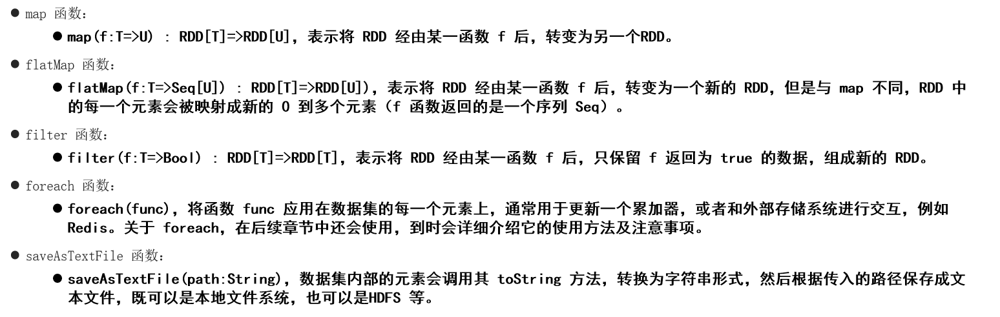

* 分区操作函数:

```properties
分区计算函数: 指的是对每个分区执行对应函数操作
普通计算函数: 指的是对每个分区中每个数据执行对应计算函数操作


分区计算函数有什么好处呢? 
	当我们在自定义函数中, 需要连接第三方的软件, 进行相关的操作, 比如说连接mysql数据库, 这个时候需要在自定义函数中, 构建与mysql的连接, 处理后, 将连接释放掉
	如果使用普通计算函数(有多少条数据, 执行多少次), 连接和释放的次数大幅提升, 而分区计算函数, 有多少个分区, 执行多少次即可, 相当于会少很多很多
	次数变少了, 减少了创建连接和释放连接的所消耗的时间, 从而提升效率


注意:
	分区计算函数, 传入到自定义函数中是一个列表, 包含了整个分区所有的数据, 而普通的计算函数传入的是一个个数据
	
说明:
	在工作中, 如果在使用一个算子的时候, 发现这个算子同时带有一个partition的算子, 建议优先使用带有partition的分区算子
```


那么有那些分区计算函数呢?   mapPartitions()  和 foreachPartition()

```properties
需求一: 通过 foreach 和 foreachPartition() 分别对数据进行打印输出操作
rdd_init = sc.parallelize(["张三","李四","王五","赵六","田七"],3)

rdd_init.glom().collect()
[['张三'], ['李四', '王五'], ['赵六', '田七']]


def f1(name):
	# 假设: 在此处连接mysql数据库
	
	# 将数据保存到mysql中
	print(name)
	
	# 将连接释放掉
	

rdd_init.foreach(f1)
赵六
田七
张三
李四
王五

rdd_init.foreachPartition(lambda name:print(name))   
<itertools.chain object at 0x7f15c8d76910>
<itertools.chain object at 0x7f15c8d76910>
<itertools.chain object at 0x7f15c8d76910>

此处代表的是三个分区的数量


def f2(iter):
	# 假设: 在此处连接mysql数据库
	for name in iter:
		# 将数据保存到mysql中
		print(name)
	
	# 将连接释放掉

rdd_init.foreachPartition(f2)                    
张三
赵六
田七
李四
王五


需求二: 使用 map算子 和 mapPartitions 算子完成对数据进行 +1 操作
rdd_init = sc.parallelize(range(10),3)

rdd_init.glom().collect()
[[0, 1, 2], [3, 4, 5], [6, 7, 8, 9]]


map算子:

def f1(num):
	return num +1

rdd_init.map(f1).collect()
结果: 
[1, 2, 3, 4, 5, 6, 7, 8, 9, 10]


[[0, 1, 2], [3, 4, 5], [6, 7, 8, 9]]

mapPartitions() 算子:

def f2(iter):
	for num in iter:
		yield num + 1
	

rdd_init.mapPartitions(f2).collect()
结果: 
[1, 2, 3, 4, 5, 6, 7, 8, 9, 10]


-------
rdd_init = sc.parallelize(range(10),3)
rdd_init.glom().collect()
结果: 
[[0, 1, 2], [3, 4, 5], [6, 7, 8, 9]]
# 完整的写法
def fn1(iter):
    arr = []
    for num in iter:
        arr.append(num + 1)
    return arr

# 简单写法: yield将每一次遍历的结果进行收集, 当遍历完成后, 将整个结果返回
def fn2(iter):
    for num in iter:
        yield num + 1

rdd_init.mapPartitions(fn1)
```


* 重分区函数

```properties
重分区函数作用: 
	用于对RDD的分区数量进行重新划分, 可以通过重分区函数对分区数量进行增加 或者 减少

分区多了, 线程变多了, 对应并行的线程也会变多了, 提高并行度


什么时候, 需要增加分区呢?
	当我们原有分区中,每个分区的数据量非常大的时候, 这个时候我们可以尝试将分区数量变得多一些, 提高线程数量, 提升并行度, 让更多的线程参与处理


什么时候, 需要减少分区数量呢?
	当每个分区的数据量比较少的时候, 或者说对每个分区中数据进行了大量的过滤, 导致分区中数据急剧减少了, 此时需要减少分区
	当需要将数据输出到某个目标点的时候, 为了防止输出多个文件, 可以减少分区的数量
```

repartition() 算子:  用于增加分区 和 减少分区

```properties
此算子会触发shuffle的操作


需求: 将以下的数据 从2个分区 扩展5个分区
rdd_init = sc.parallelize(range(10),2)

rdd_init.glom().collect()
结果:
[[0, 1, 2, 3, 4], [5, 6, 7, 8, 9]]

增加分区:
rdd_re = rdd_init.repartition(5)
rdd_re.getNumPartitions()
结果为: 
5

减少分区: 
rdd_re2 = rdd_re.repartition(3)
rdd_re2.getNumPartitions()
结果为: 
3


发现: 在增加分区或者减少分区后, 发现增加出来的分区都是 空的, 减少分区的时候, 将多个分区直接合并在一起
	虽然效果不是特别好, 但是可以实现操作
	
注意: 不管增加  还是减少 都是存在shuffle的
```

coalesce函数: 可以用于减少分区

```properties
rdd_init = sc.parallelize(range(10),3)

rdd_init.glom().collect()
结果: 
[[0, 1, 2], [3, 4, 5], [6, 7, 8, 9]]

减少分区: 
rdd_init.coalesce(2).glom().collect()
结果:
[[0, 1, 2], [3, 4, 5, 6, 7, 8, 9]]

增加分区: 
rdd_init.coalesce(5).glom().collect()
结果: 发现还是3个分区, 无法增加分区
[[0, 1, 2], [3, 4, 5], [6, 7, 8, 9]]

通过给 coalesce的参数2设置为True , 发现可以增加分区了
rdd_init.coalesce(5,True).glom().collect()
[[], [0, 1, 2], [6, 7, 8, 9], [3, 4, 5], []]

说明:
	参数2: 表示是是否可以进行shuffle操作, 默认是False , 在Flase情况下, 只能减少分区, 不能增加分区
	
	reparation() == coalesce(N,True)  
		可以认为  reparation()其实是  coalesce(N,True)   简写
```

partitionBy(N) 算子: 调整分区的函数, 也会触发shuffle操作

```properties
spark专门提供对kv类型的数据进行分区调整的函数

 rdd_init = sc.parallelize([(1,1),(2,2),(3,3),(4,4),(5,5),(6,6),(7,7),(8,8),(9,9),(10,10)])
>>> rdd_init.glom().collect()
[[(1, 1), (2, 2), (3, 3), (4, 4), (5, 5)], [(6, 6), (7, 7), (8, 8), (9, 9), (10, 10)]]
# 基于partitionBy重新分区(默认为hash分区)
rdd_init.partitionBy(2).glom().collect()
[[(2, 2), (4, 4), (6, 6), (8, 8), (10, 10)], [(1, 1), (3, 3), (5, 5), (7, 7), (9, 9)]]
# 如果不满意, 可以手动分区: 参数2: 设置一个分区的规则函数  分区编号从 0开始
rdd_init.partitionBy(2,lambda num: 0 if(num > 3) else 1 ).glom().collect()
[[(4, 4), (5, 5), (6, 6), (7, 7), (8, 8), (9, 9), (10, 10)], [(1, 1), (2, 2), (3, 3)]]


说明: partitionBy在分区的时候, 会根据key进行hash分区操作
```

* 聚合函数:

```properties
第一类: 单列值聚合函数: 
	reduce() fold()  aggregate()  其中 aggregate是 reduce算子和fold算子底层实现
	
rdd_init = sc.parallelize([1,2,3,4,5,6,7,8,9,10])
需求: 将 1~10数据累加在一起
# reduce(F)算子 
rdd_init.glom().collect()
[[1, 2, 3], [4, 5, 6], [7, 8, 9, 10]]

rdd_init.reduce(lambda agg,curr: agg + curr)
55

计算逻辑: 先对每个分区进行计算求和, 然后将每个分区的结果合并在一起

#fold(初始值, F)算子 
rdd_init.fold(0,lambda agg,curr:agg+curr)
55

说明: 
	fold的初始值为 0  的时候, 其实就是 reduce的操作, reduce可以是一种初始值为0的简写
rdd_init.fold(10,lambda agg,curr:agg+curr) 
结果:
95

原因:  数据集共有三个分区, 首先 先计算每个分区的聚合结果, 计算累加3回, 然后每个分区结果还要再次进行全局汇总, 此时还要累加一次, 最终累加了4次

# aggregate(初始值, F1,F2)算子

初始值是用于给agg赋值的

参数2: 是用于执行对每个分区内数据操作

参数3: 用于执行参数2计算完的每个分区结果进行汇总


def f1(agg,curr):
	return agg + curr

def f2(agg,curr):
	return agg + curr


rdd_init.aggregate(10,f1,f2)                       
95


说明:
	在进行单列值聚合统计的时候, 优先使用reduce 和fold 如果满足不了尝试使用aggregate 试一试
```


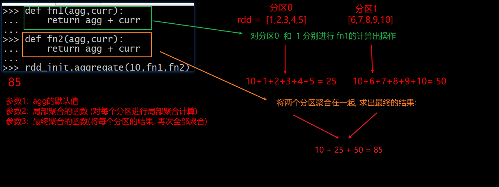

```properties
当参数2和参数3的函数是一致的时候, 可以使用 fold来进行简写操作  当agg的默认值为 0的时候, 可以使用reduce来进行简写
```


```properties

第二类: kv类型聚合操作: 
	reduceBykey(), foldByKey(), aggregateByKey()
	
	使用上都是一样的, 只不过针对kv类型的时候, 在聚合的基础上 增加了分组操作
	
	先分组, 在对每个组内的value进行聚合操作
	
	groupByKey() 只要分组没有聚合操作
	
	
面试题: 
	请问: groupByKey() + reduce() 和  reduceBykey() 都可能完成分组聚合统计, 请问两则之间那个效率更高呢? 
	效率是快的是 reduceBykey, 它是在每个分区内, 之间进行分组聚合统计, 然后汇总会再次进行分组聚合统计
	
	groupByKey() + reduce(): 先将所有的数据进行分组, 分好组后, 在进行聚合统计
	
	groupByKey() + reduce() 中间传输的数据量要大于 reduceBykey(), 所以效率低
```


reduceBykey:  存在类似于MR中combiner的操作

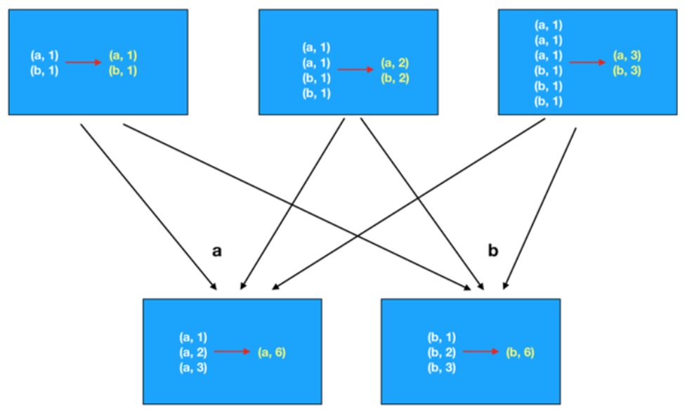


groupByKey() + reduce():

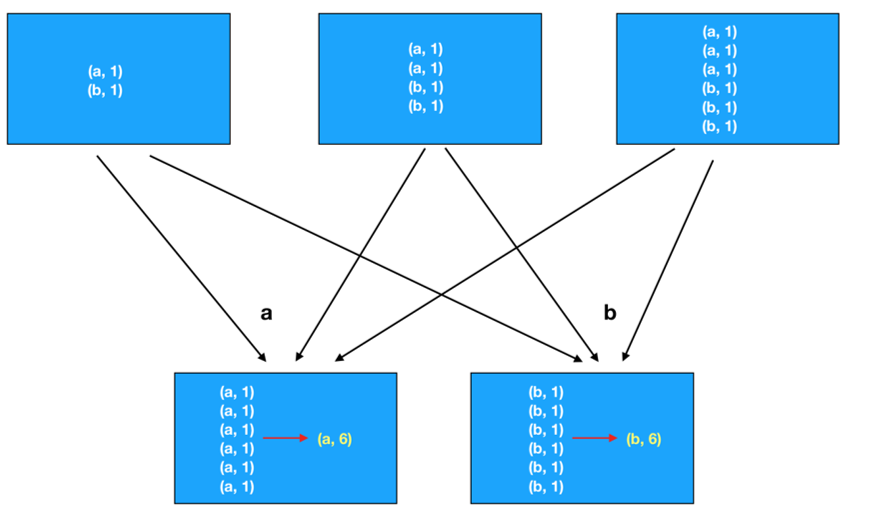


* 关联操作

```properties
相关的API:
	join: 内连接
	leftOuterJoin:  左关联
	rightOuterJoin: 右关联
	fullOuterJoin:  全外关联(满外关联)
	

需求: 构建两个数据集, 分别演示各个join操作:

rdd1 = sc.parallelize([('c01','张三'),('c02','李四'),('c03','王五'),('c01','赵六'),('c01','田七'),('c03','周八'),('c05','李九')])

rdd2 = sc.parallelize([('c01','老张'),('c02','老李'),('c03','老王'),('c04','老田')])

#join结果:
rdd1.join(rdd2).collect()
结果:
[
	('c01', ('张三', '老张')), 
	('c01', ('赵六', '老张')), 
	('c01', ('田七', '老张')), 
	('c02', ('李四', '老李')), 
	('c03', ('王五', '老王')), 
	('c03', ('周八', '老王'))
]

# leftOuterJoin结果
rdd1.leftOuterJoin(rdd2).collect() 
结果:
[
	('c05', ('李九', None)), 
	('c01', ('张三', '老张')), 
	('c01', ('赵六', '老张')),
    ('c01', ('田七', '老张')), 
    ('c02', ('李四', '老李')), 
    ('c03', ('王五', '老王')), 
    ('c03', ('周八', '老王'))
]

# rightOuterJoin 右关联
rdd1.rightOuterJoin(rdd2).collect() 
结果:
[
	('c04', (None, '老田')), 
	('c01', ('张三', '老张')), 
	('c01', ('赵六', '老张')), 
	('c01', ('田七', '老张')), 
	('c02', ('李四', '老李')), 
	('c03', ('王五', '老王')), 
	('c03', ('周八', '老王'))
]

# fullOuterJoin:  全外关联(满外关联)
rdd1.fullOuterJoin(rdd2).collect() 
结果:
[
	('c05', ('李九', None)), 
	('c04', (None, '老田')), 
	('c01', ('张三', '老张')), 
	('c01', ('赵六', '老张')), 
	('c01', ('田七', '老张')), 
	('c02', ('李四', '老李')), 
	('c03', ('王五', '老王')), 
	('c03', ('周八', '老王'))
]
```


## 3. 综合案例

### 3.0 如何配置python的模板

* 模板内容:

```properties
from pyspark import SparkContext, SparkConf
import os

# 锁定远端python版本:
os.environ['SPARK_HOME'] = '/export/server/spark'
os.environ['PYSPARK_PYTHON'] = '/root/anaconda3/bin/python3'
os.environ['PYSPARK_DRIVER_PYTHON'] = '/root/anaconda3/bin/python3'

if __name__ == '__main__':
    print("pySpark模板")

```

如何配置呢? 

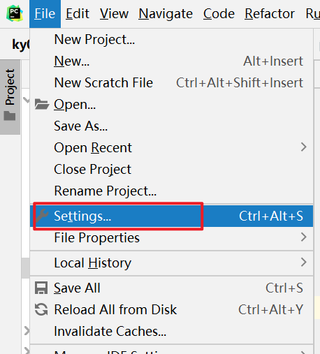

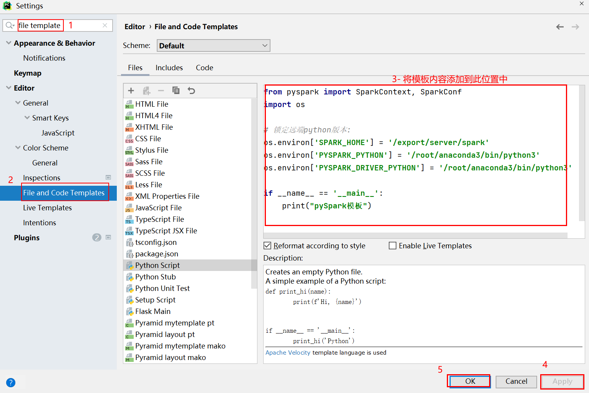


### 3.1 搜索案例

数据集介绍:

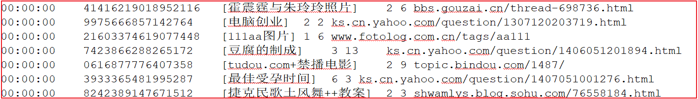

```properties
访问时间    用户id           []里面是用户输入搜索内容   url结果排名 用户点击页面排序  用户点击URL


字段与字段之间的分隔符号为 \t和空格 (制表符号)

需求一:  统计每个关键词出现了多少次

需求二:  统计每个用户每个搜索词点击的次数

需求三:  统计每个小时点击次数
```

* 第一步: 需要将数据读取到Spark环境中, 对数据进行切割处理, 将切割后的一列列数据放置到tuple(元组)中, 方便后续获取某些列的数据, 同时需要对数据进行过滤: 将空行数据以及切割后长度不等于6的数据过滤掉

```properties
from pyspark import SparkContext, SparkConf
import os

# 锁定远端python版本:
os.environ['SPARK_HOME'] = '/export/server/spark'
os.environ['PYSPARK_PYTHON'] = '/root/anaconda3/bin/python3'
os.environ['PYSPARK_DRIVER_PYTHON'] = '/root/anaconda3/bin/python3'

if __name__ == '__main__':
    print("pySpark模板")

    # 1- 创建 sparkContext对象
    conf = SparkConf().setMaster('local[*]').setAppName('sougou')
    sc = SparkContext(conf=conf)

    # 2- 读取外部文件的数据
    rdd_init = sc.textFile('file:///export/data/workspace/ky04_pyspark_parent/_02_pyspark_core/data/SogouQ.sample')

    # 3- 对数据进行过滤, 需要保证数据不能为空, 并且数据的字段长度必须为 6个
    rdd_filter = rdd_init.filter(lambda line: line.strip() != '' and len(line.split()) == 6)

    # 4- 将每一行的数据封装到一个元组中
    rdd_line_tup = rdd_filter.map(lambda line : (
        line.split()[0],
        line.split()[1],
        line.split()[2][1:-1],
        line.split()[3],
        line.split()[4],
        line.split()[5]
    ))


```

* 需求一: 统计每个关键词出现了多少次

````properties
说明: 
	关键词是包含在用户输入的搜索词中, 用户输入的搜索词中可能包含了多个关键词, 如果想要进行关键词的统计操作, 必须要对用户输入的搜索词的数据, 进行拆分(分词), 从而找出关键词数据
	
比如说: 电脑创业  -->  电脑 和 创业

如何实施呢?   对于中文分词如何处理
	python中:  主要使用jieba分词库 
	java中: IK分词器


如何使用jieba分词库

第一步: 需要在python环境中安装jieba库 (local模式,仅需要在node1安装即可, 如果集群模式, 需要三个节点都安装)
	pip install -i https://pypi.tuna.tsinghua.edu.cn/simple  jieba 

第二步: 在代码中引入jieba库, 进行使用即可
from pyspark import SparkContext, SparkConf
import os
import jieba

# 锁定远端python版本:
os.environ['SPARK_HOME'] = '/export/server/spark'
os.environ['PYSPARK_PYTHON'] = '/root/anaconda3/bin/python3'
os.environ['PYSPARK_DRIVER_PYTHON'] = '/root/anaconda3/bin/python3'
# 测试jieba分词库
if __name__ == '__main__':
    print("测试jieba分词库")

    print(list(jieba.cut('我毕业于清华大学')))  # 默认分词模式  ['我', '毕业', '于', '清华大学']
    print(list(jieba.cut('我毕业于清华大学', cut_all=True)))  # 全模式(最细粒度分词) ['我', '毕业', '于清华', '清华', '清华大学', '华大', '大学']
    print(list(jieba.cut_for_search('我毕业于清华大学'))) # 搜索引擎模式 ['我', '毕业', '于', '清华', '华大', '大学', '清华大学']
````

代码实现

````properties
def xuqiu_1():
    # 5.1 需求一: 统计每个关键词出现了多少次
    # 5.1.1 从数据集中获取相关的搜索词
    rdd_search_words = rdd_line_tup.map(lambda line_tup: line_tup[2])
    # 5.1.2 对搜索词进行分词, 将其拆分为一个个的关键词
    rdd_keywords = rdd_search_words.flatMap(lambda search_words: jieba.cut(search_words))
    # 5.1.3 将关键词转换为 (关键词,1) 然后根据key进行分组统计取出前10个数据
    rdd_res = rdd_keywords.map(lambda keyword: (keyword, 1)).reduceByKey(lambda agg, curr: agg + curr)
    # 获取前10个
    print(rdd_res.top(10, lambda res_tup: res_tup[1]))
````

* 需求二:  统计每个用户每个搜索词点击的次数

```properties
def xuqiu_2():
    # SQL:  select 用户, 搜索词,count(1)  from 表 group by 用户, 搜索词;
    # 5.2.1 从 rdd_line_tup中获取 用户和搜索词的数据, 后续需要对其进行分组
    rdd_search_words_and_user = rdd_line_tup.map(lambda line_tup: (line_tup[1], line_tup[2]))
    print(rdd_search_words_and_user.take(10))
    # 5.2.2 根据用户和搜索词进行分组统计个数:  将用户和搜索词作为key  1作为value即可
    rdd_res = rdd_search_words_and_user.map(lambda user_search: (user_search, 1)).reduceByKey(
        lambda agg, curr: agg + curr)
    # 5.2.3 获取前10个
    rdd_sort = rdd_res.sortBy(lambda res_tup: res_tup[1], ascending=False)
    # 打印即可
    print(rdd_sort.take(10))
```

* 需求三:  统计每个小时点击次数 (留为作业)


### 3.2 点击流日志分析

点击流日志数据结构说明:

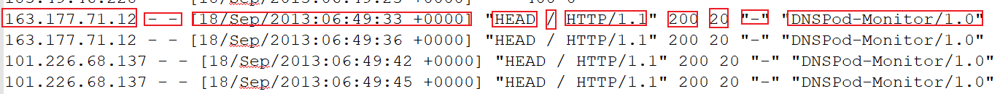

```properties
1- ip地址: 
2- 用户标识cookie信息(- - 标识没有)
3- 访问时间(时间,时区)
4- 请求方式(get / post /Head ....)
5- 请求的URL路径
6- 请求的协议
7- 请求状态码: 200 成功
8- 响应的字节长度
9- 来源的URL( - 标识直接访问, 不是从某个页面跳转来的)
10- 访问的浏览器标识
```


* 需求一: 统计pv(访问次数) 和 uv(用户数量)

* 需求二: 统计每个访问的URL的次数, 找到前10个

```properties
from pyspark import SparkContext, SparkConf
import os

# 锁定远端python版本:
os.environ['SPARK_HOME'] = '/export/server/spark'
os.environ['PYSPARK_PYTHON'] = '/root/anaconda3/bin/python3'
os.environ['PYSPARK_DRIVER_PYTHON'] = '/root/anaconda3/bin/python3'

if __name__ == '__main__':
    print("演示点击流日志分析案例")

    # 1- 创建 sparkContext对象
    conf = SparkConf().setMaster('local[*]').setAppName('sougou')
    sc = SparkContext(conf=conf)

    # 2- 读取外部文件的数据
    rdd_init = sc.textFile('file:///export/data/workspace/ky04_pyspark_parent/_02_pyspark_core/data/access.log')

    # 3- 对数据执行过滤操作
    rdd_filter = rdd_init.filter(lambda line: line.strip() != '' and len(line.split()) >= 12)

    # 4- 完成相关的需求统计: pv 和 uv
    # pv 访问记录数
    print(rdd_filter.count())
    # uv 独立访客数
    print(rdd_filter.map(lambda line: line.split()[0]).distinct().count())

    # 5- 需求二: 统计每个访问的URL的次数, 找到前10个  链式编程方案
    print(rdd_filter.map(lambda line: (line.split()[6], 1)).reduceByKey(lambda agg, curr: agg + curr).sortBy(
        lambda res_tup: res_tup[1],ascending=False).take(10))
```


**以上两个案例, 需要大家尽量独立完成, 如果第一次无法完成, 可以尝试参考, 然后在自己写一遍....**

## 4. RDD的持久化

### 4.1 RDD的缓存

```properties
缓存: 
	一般是当一个RDD的计算非常的耗时|昂贵(计算规则比较复杂), 并且这个RDD需要被重复的(多方)使用,可以尝试将其计算完的结果缓存起来, 便于后续的使用, 从而提升效率
	通过缓存也可以提升RDD的容错能力, 当后续计算失败后, 尽量不让RDD进行回溯所有依赖链条 从而减少重新计算时间

注意:
	缓存是一种临时保存, 缓存数据可以保存到内存(executor内存空间) 也可以保存到磁盘上, 甚至可以保存到堆外内存(executor以外系统内容)
	由于临时存储, 可能会存在丢失, 所以缓存操作, 并不会将RDD之间的依赖关系给截断掉(丢失掉),因为当缓存失效后, 可以全部重新计算
	缓存的API都是lazy的, 如果需要触发缓存操作, 必须后续跟一个action算子, 一般建议是count
```

如何使用缓存呢?

```properties
设置缓存的API:
	rdd.cache() : 执行缓存操作, 仅能将数据缓存到内存中
	rdd.persist(缓存级别(位置)) : 执行缓存操作, 默认是缓存到内存中, 当然也可以自定义缓存的位置

手动清理缓存的API: 
	rdd.unpersist() 

默认是, 当程序执行完成后, 退出后, 缓存自动被删除了

常用缓存的级别:  
	MEMORY_ONLY: 仅缓存到内存中, 适合于缓存数据量比较少的情况
	MEMORY_ONLY_SER:仅缓存到内存中, 适合于缓存数据量比较少的情况, 在缓存的时候, 会对数据进行序列化操作, 目的最大化节省内存占用空间
	
	MEMORY_AND_DISK:
	MEMORY_AND_DISK_2:  优先将数据缓存到内存中, 当内存不足的时候, 会将数据缓存到磁盘上(本地磁盘上), 带2的表示缓存2份
	
	MEMORY_AND_DISK_SER:
	MEMORY_AND_DISK_SER_2: 优先将数据缓存到内存中, 当内存不足的时候, 会将数据缓存到磁盘上(本地磁盘上), 带2的表示缓存2份 ,  会对数据进行序列化操作, 目的最大化节省内存占用空间
	
	序列化:  在Spark运行过程中, RDD对应数据一般都是一个对象,序列化的目的将对象转换为二进制字节来存储, 转换后, 可以更加节省一些空间, 但是弊端会导致CPU占用率提升, 当CPU性能比较OK的时候, 建议使用带有SER, 否则不使用
	
	空间比较充足, 建议选择带有_2 保存多份, 可靠性更高一些
```

演示缓存的使用操作:

```properties
from pyspark import SparkContext, SparkConf,StorageLevel
import os
import time
import jieba

# 锁定远端python版本:
os.environ['SPARK_HOME'] = '/export/server/spark'
os.environ['PYSPARK_PYTHON'] = '/root/anaconda3/bin/python3'
os.environ['PYSPARK_DRIVER_PYTHON'] = '/root/anaconda3/bin/python3'


def xuqiu_1():
    # 5.1 需求一: 统计每个关键词出现了多少次
    # 5.1.1 从数据集中获取相关的搜索词
    rdd_search_words = rdd_line_tup.map(lambda line_tup: line_tup[2])
    # 5.1.2 对搜索词进行分词, 将其拆分为一个个的关键词
    rdd_keywords = rdd_search_words.flatMap(lambda search_words: jieba.cut(search_words))
    # 5.1.3 将关键词转换为 (关键词,1) 然后根据key进行分组统计取出前10个数据
    rdd_res = rdd_keywords.map(lambda keyword: (keyword, 1)).reduceByKey(lambda agg, curr: agg + curr)
    # 获取前10个
    print(rdd_res.top(10, lambda res_tup: res_tup[1]))


def xuqiu_2():
    # SQL:  select 用户, 搜索词,count(1)  from 表 group by 用户, 搜索词;
    # 5.2.1 从 rdd_line_tup中获取 用户和搜索词的数据, 后续需要对其进行分组
    rdd_search_words_and_user = rdd_line_tup.map(lambda line_tup: (line_tup[1], line_tup[2]))
    print(rdd_search_words_and_user.take(10))
    # 5.2.2 根据用户和搜索词进行分组统计个数:  将用户和搜索词作为key  1作为value即可
    rdd_res = rdd_search_words_and_user.map(lambda user_search: (user_search, 1)).reduceByKey(
        lambda agg, curr: agg + curr)
    # 5.2.3 获取前10个
    rdd_sort = rdd_res.sortBy(lambda res_tup: res_tup[1], ascending=False)
    # 打印即可
    print(rdd_sort.take(10))


if __name__ == '__main__':
    print("pySpark模板")

    # 1- 创建 sparkContext对象
    conf = SparkConf().setMaster('local[*]').setAppName('sougou')
    sc = SparkContext(conf=conf)

    # 2- 读取外部文件的数据
    rdd_init = sc.textFile('file:///export/data/workspace/ky04_pyspark_parent/_02_pyspark_core/data/SogouQ.sample')

    # 3- 对数据进行过滤, 需要保证数据不能为空, 并且数据的字段长度必须为 6个
    rdd_filter = rdd_init.filter(lambda line: line.strip() != '' and len(line.split()) == 6)

    # 4- 将每一行的数据封装到一个元组中
    rdd_line_tup = rdd_filter.map(lambda line : (
        line.split()[0],
        line.split()[1],
        line.split()[2][1:-1],
        line.split()[3],
        line.split()[4],
        line.split()[5]
    ))

    # -----------缓存的代码 START----------------------
    # 设置缓存 : count操作是为了触发缓存执行
    rdd_line_tup.persist(storageLevel=StorageLevel.MEMORY_AND_DISK).count()
    # -----------缓存的代码 END----------------------
    # 5- 完成各项需求实现
    #快速抽取方法:
    #   快捷键 ctrl + alt + m  或者  手动打开提取方法的窗口 refactor --> extract/introduce --> method
    xuqiu_1()

    # -------清理缓存-------
    rdd_line_tup.unpersist().count()

    #5.2 需求二:  统计每个用户每个搜索词点击的次数
    xuqiu_2()


    time.sleep(1000)
```

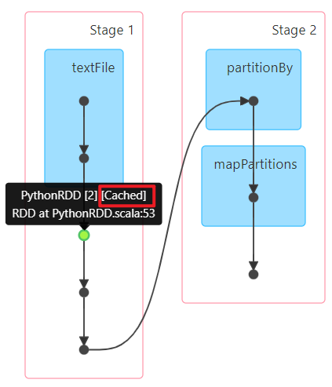


