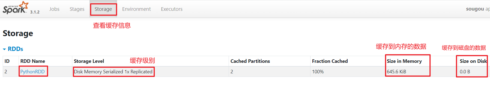
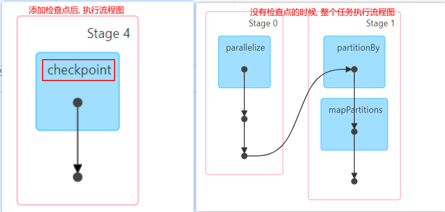
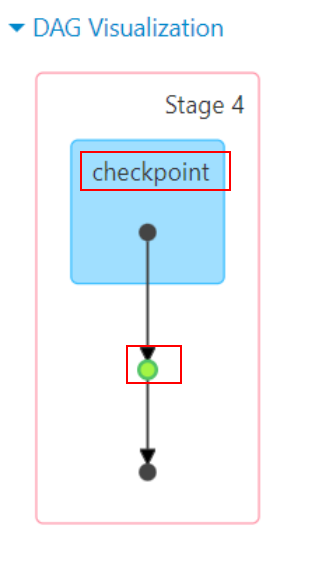
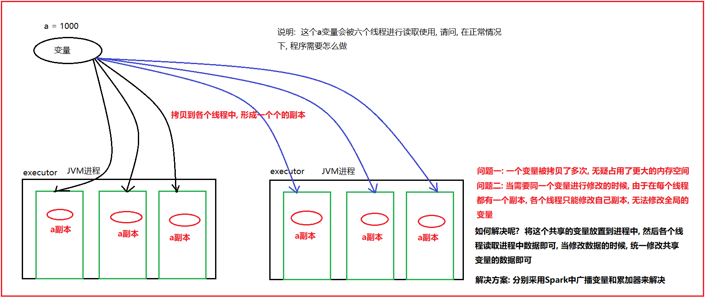
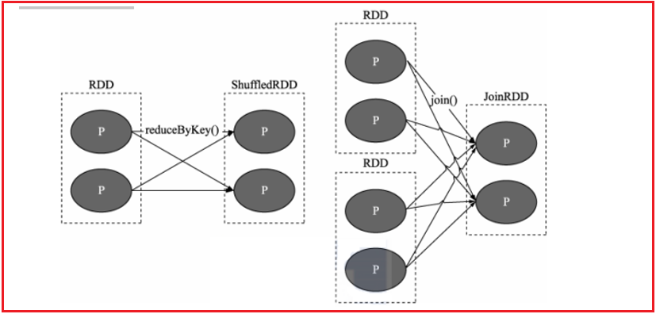
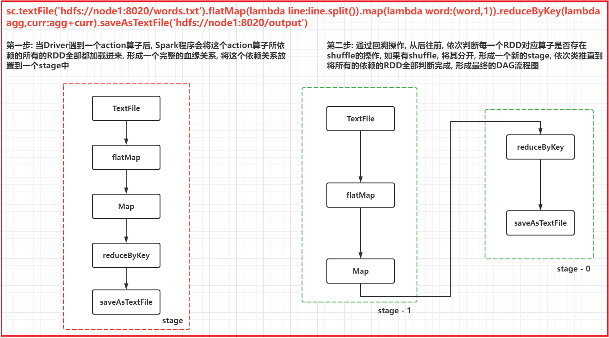

# day05_pyspark课程笔记

今日内容:

* 1- RDD的持久化: RDD的checkpoint检查点
* 2- RDD的共享变量: 广播变量 和 累加器
* 3- RDD的内核调度

## 1. RDD的持久化

### 1.1 RDD的缓存

```properties
缓存: 
	一般是当一个RDD的计算非常的耗时|昂贵(计算规则比较复杂), 并且这个RDD需要被重复的(多方)使用,可以尝试将其计算完的结果缓存起来, 便于后续的使用, 从而提升效率
	通过缓存也可以提升RDD的容错能力, 当后续计算失败后, 尽量不让RDD进行回溯所有依赖链条 从而减少重新计算时间

注意:
	缓存是一种临时保存, 缓存数据可以保存到内存(executor内存空间) 也可以保存到磁盘上, 甚至可以保存到堆外内存(executor以外系统内容)
	由于临时存储, 可能会存在丢失, 所以缓存操作, 并不会将RDD之间的依赖关系给截断掉(丢失掉),因为当缓存失效后, 可以全部重新计算
	缓存的API都是lazy的, 如果需要触发缓存操作, 必须后续跟一个action算子, 一般建议是count
```

如何使用缓存呢?

```properties
设置缓存的API:
	rdd.cache() : 执行缓存操作, 仅能将数据缓存到内存中
	rdd.persist(缓存级别(位置)) : 执行缓存操作, 默认是缓存到内存中, 当然也可以自定义缓存的位置

手动清理缓存的API: 
	rdd.unpersist() 

默认是, 当程序执行完成后, 退出后, 缓存自动被删除了

常用缓存的级别:  
	MEMORY_ONLY: 仅缓存到内存中, 适合于缓存数据量比较少的情况
	MEMORY_ONLY_SER:仅缓存到内存中, 适合于缓存数据量比较少的情况, 在缓存的时候, 会对数据进行序列化操作, 目的最大化节省内存占用空间
	
	MEMORY_AND_DISK:
	MEMORY_AND_DISK_2:  优先将数据缓存到内存中, 当内存不足的时候, 会将数据缓存到磁盘上(本地磁盘上), 带2的表示缓存2份
	
	MEMORY_AND_DISK_SER:
	MEMORY_AND_DISK_SER_2: 优先将数据缓存到内存中, 当内存不足的时候, 会将数据缓存到磁盘上(本地磁盘上), 带2的表示缓存2份 ,  会对数据进行序列化操作, 目的最大化节省内存占用空间
	
	序列化:  在Spark运行过程中, RDD对应数据一般都是一个对象,序列化的目的将对象转换为二进制字节来存储, 转换后, 可以更加节省一些空间, 但是弊端会导致CPU占用率提升, 当CPU性能比较OK的时候, 建议使用带有SER, 否则不使用
	
	空间比较充足, 建议选择带有_2 保存多份, 可靠性更高一些
```

演示缓存的使用操作:

```properties
from pyspark import SparkContext, SparkConf,StorageLevel
import os
import time
import jieba

# 锁定远端python版本:
os.environ['SPARK_HOME'] = '/export/server/spark'
os.environ['PYSPARK_PYTHON'] = '/root/anaconda3/bin/python3'
os.environ['PYSPARK_DRIVER_PYTHON'] = '/root/anaconda3/bin/python3'


def xuqiu_1():
    # 5.1 需求一: 统计每个关键词出现了多少次
    # 5.1.1 从数据集中获取相关的搜索词
    rdd_search_words = rdd_line_tup.map(lambda line_tup: line_tup[2])
    # 5.1.2 对搜索词进行分词, 将其拆分为一个个的关键词
    rdd_keywords = rdd_search_words.flatMap(lambda search_words: jieba.cut(search_words))
    # 5.1.3 将关键词转换为 (关键词,1) 然后根据key进行分组统计取出前10个数据
    rdd_res = rdd_keywords.map(lambda keyword: (keyword, 1)).reduceByKey(lambda agg, curr: agg + curr)
    # 获取前10个
    print(rdd_res.top(10, lambda res_tup: res_tup[1]))


def xuqiu_2():
    # SQL:  select 用户, 搜索词,count(1)  from 表 group by 用户, 搜索词;
    # 5.2.1 从 rdd_line_tup中获取 用户和搜索词的数据, 后续需要对其进行分组
    rdd_search_words_and_user = rdd_line_tup.map(lambda line_tup: (line_tup[1], line_tup[2]))
    print(rdd_search_words_and_user.take(10))
    # 5.2.2 根据用户和搜索词进行分组统计个数:  将用户和搜索词作为key  1作为value即可
    rdd_res = rdd_search_words_and_user.map(lambda user_search: (user_search, 1)).reduceByKey(
        lambda agg, curr: agg + curr)
    # 5.2.3 获取前10个
    rdd_sort = rdd_res.sortBy(lambda res_tup: res_tup[1], ascending=False)
    # 打印即可
    print(rdd_sort.take(10))


if __name__ == '__main__':
    print("pySpark模板")

    # 1- 创建 sparkContext对象
    conf = SparkConf().setMaster('local[*]').setAppName('sougou')
    sc = SparkContext(conf=conf)

    # 2- 读取外部文件的数据
    rdd_init = sc.textFile('file:///export/data/workspace/ky04_pyspark_parent/_02_pyspark_core/data/SogouQ.sample')

    # 3- 对数据进行过滤, 需要保证数据不能为空, 并且数据的字段长度必须为 6个
    rdd_filter = rdd_init.filter(lambda line: line.strip() != '' and len(line.split()) == 6)

    # 4- 将每一行的数据封装到一个元组中
    rdd_line_tup = rdd_filter.map(lambda line : (
        line.split()[0],
        line.split()[1],
        line.split()[2][1:-1],
        line.split()[3],
        line.split()[4],
        line.split()[5]
    ))

    # -----------缓存的代码 START----------------------
    # 设置缓存 : count操作是为了触发缓存执行
    rdd_line_tup.persist(storageLevel=StorageLevel.MEMORY_AND_DISK).count()
    # -----------缓存的代码 END----------------------
    # 5- 完成各项需求实现
    #快速抽取方法:
    #   快捷键 ctrl + alt + m  或者  手动打开提取方法的窗口 refactor --> extract/introduce --> method
    xuqiu_1()

    # -------清理缓存-------
    rdd_line_tup.unpersist().count()

    #5.2 需求二:  统计每个用户每个搜索词点击的次数
    xuqiu_2()


    time.sleep(1000)
```





### 1.2 RDD的checkpoint检查点

```properties
	checkpoint比较类似于缓存操作, 只不过缓存是将数据保存到内存或磁盘中, 而checkpoint是将数据保存到磁盘或者HDFS(主要)上
	checkpoint提供了更加安全可靠的持久化的方案, 确保缓存的数据不会发生丢失, 一旦构建了checkpoint操作后, 会将RDD之间的依赖关系(血缘关系)进行切断,后续如果计算出现了问题, 可以直接从检查点上恢复数据
	
	所以可以将checkpoint看做是一种阶段快照的工作
	
	主要作用: 容错 也可以在一定程序上提升性能(不如缓存)
		在后续计算失败的时候, 从检查点直接恢复数据, 不需要在重新计算了
		
	使用API: 
		1- 第一步: 设置检查点的保存数据的位置
			sc.setCheckpointDir('路径(HDFS)')
		2- 开启检查点:  
			rdd.checkpoint()
			rdd.count()
```

代码演示:

```properties
from pyspark import SparkContext, SparkConf
from pyspark.sql import SparkSession
import time
import os

# 锁定远端python版本:
os.environ['SPARK_HOME'] = '/export/server/spark'
os.environ['PYSPARK_PYTHON'] = '/root/anaconda3/bin/python3'
os.environ['PYSPARK_DRIVER_PYTHON'] = '/root/anaconda3/bin/python3'

if __name__ == '__main__':
    print("演示:checkpoint的基本使用")

    # 1- 创建SparkContext对象
    conf = SparkConf().setMaster('local[*]').setAppName('checkpoint')
    sc = SparkContext(conf=conf)

    # 第一步: 设置检查点的位置
    # 此处设置的检查点的路径, 如果提交到集群运行, 必须为HDFS路径, 如果是local模式 可以使用本地路径
    # 默认 为 HDFS
    sc.setCheckpointDir('/checkpoint')

    # 2- 读取数据:
    rdd_init = sc.parallelize([1, 2, 3, 4, 5, 6, 7, 8, 9, 10])

    # 3- 对数据进行处理:以下操作无实际应用价值, 仅仅是为了演示checkpoint的方式

    rdd_map_1 = rdd_init.map(lambda num : num +1)
    rdd_map_2 = rdd_map_1.map(lambda num: num + 1)
    rdd_map_3 = rdd_map_2.map(lambda num: ('c01',num))
    rdd_res = rdd_map_3.reduceByKey(lambda agg,curr: agg + curr)

    # 开启检查点:
    rdd_res.checkpoint()
    rdd_res.count()

    # 4- 触发执行
    print(rdd_res.collect())

    time.sleep(1000)
```





面试题: spark提供了两种持久化的方案, 一种为缓存操作, 一种为checkpoint方案, 请问有什么区别呢?

```properties
1) 存储位置上
	缓存: 存储在内存中, 本地磁盘 或者 堆外内存中(executor以外的系统内存)
	checkpoint: 将数据保存到HDFS上, 进行持久化的存储

2) 生命周期
	缓存: 当我们手动调度unpersist 或者 程序停止后, 缓存数据都会被清除掉
	checkpoint: 即使程序停止后, 保存到HDFS上数据也不会自动清理, 需要手动清除的

3) 依赖关系
	缓存:  不会截断依赖关系, 因为缓存所保存的位置是不可靠, 可能存在缓存丢失的问题, 需要进行回溯计算
	checkpoint: 会截断依赖关系, 因为将数据保存到HDFS上, 进行了更加安全可靠的存储, 不会丢失, 不需要回溯计算
```


在实际使用, 应该使用那种持久化方案呢?  一般可以将两种方案全部混合在一起, 一起作用于整个应用中

```properties
注意:   先触发缓存, 然后触发checkpoint (底层最终效果: 让程序优先到缓存中获取数据,当缓存不存在的时候, 让其从checkpoint中获取即可)


核心代码: 
	# -----------缓存的代码 START----------------------
    # 设置缓存 : count操作是为了触发缓存执行
    rdd_line_tup.persist(storageLevel=StorageLevel.MEMORY_AND_DISK)
    # -----------缓存的代码 END----------------------
    # 设置检查点
    rdd_line_tup.checkpoint()
    # 触发检查点和缓存的执行
    rdd_line_tup.count()
    


代码演示:
from pyspark import SparkContext, SparkConf,StorageLevel
import os
import time
import jieba

# 锁定远端python版本:
os.environ['SPARK_HOME'] = '/export/server/spark'
os.environ['PYSPARK_PYTHON'] = '/root/anaconda3/bin/python3'
os.environ['PYSPARK_DRIVER_PYTHON'] = '/root/anaconda3/bin/python3'


def xuqiu_1():
    # 5.1 需求一: 统计每个关键词出现了多少次
    # 5.1.1 从数据集中获取相关的搜索词
    rdd_search_words = rdd_line_tup.map(lambda line_tup: line_tup[2])
    # 5.1.2 对搜索词进行分词, 将其拆分为一个个的关键词
    rdd_keywords = rdd_search_words.flatMap(lambda search_words: jieba.cut(search_words))
    # 5.1.3 将关键词转换为 (关键词,1) 然后根据key进行分组统计取出前10个数据
    rdd_res = rdd_keywords.map(lambda keyword: (keyword, 1)).reduceByKey(lambda agg, curr: agg + curr)
    # 获取前10个
    print(rdd_res.top(10, lambda res_tup: res_tup[1]))


def xuqiu_2():
    # SQL:  select 用户, 搜索词,count(1)  from 表 group by 用户, 搜索词;
    # 5.2.1 从 rdd_line_tup中获取 用户和搜索词的数据, 后续需要对其进行分组
    rdd_search_words_and_user = rdd_line_tup.map(lambda line_tup: (line_tup[1], line_tup[2]))
    print(rdd_search_words_and_user.take(10))
    # 5.2.2 根据用户和搜索词进行分组统计个数:  将用户和搜索词作为key  1作为value即可
    rdd_res = rdd_search_words_and_user.map(lambda user_search: (user_search, 1)).reduceByKey(
        lambda agg, curr: agg + curr)
    # 5.2.3 获取前10个
    rdd_sort = rdd_res.sortBy(lambda res_tup: res_tup[1], ascending=False)
    # 打印即可
    print(rdd_sort.take(10))


if __name__ == '__main__':
    print("pySpark模板")

    # 1- 创建 sparkContext对象
    conf = SparkConf().setMaster('local[*]').setAppName('sougou')
    sc = SparkContext(conf=conf)

    # 设置checkpoint的保存的位置
    sc.setCheckpointDir('/checkpoint')

    # 2- 读取外部文件的数据
    rdd_init = sc.textFile('file:///export/data/workspace/ky04_pyspark_parent/_02_pyspark_core/data/SogouQ.sample')

    # 3- 对数据进行过滤, 需要保证数据不能为空, 并且数据的字段长度必须为 6个
    rdd_filter = rdd_init.filter(lambda line: line.strip() != '' and len(line.split()) == 6)

    # 4- 将每一行的数据封装到一个元组中
    rdd_line_tup = rdd_filter.map(lambda line : (
        line.split()[0],
        line.split()[1],
        line.split()[2][1:-1],
        line.split()[3],
        line.split()[4],
        line.split()[5]
    ))


    # -----------缓存的代码 START----------------------
    # 设置缓存 : count操作是为了触发缓存执行
    rdd_line_tup.persist(storageLevel=StorageLevel.MEMORY_AND_DISK)
    # -----------缓存的代码 END----------------------
    # 设置检查点
    rdd_line_tup.checkpoint()
    # 触发检查点和缓存的执行
    rdd_line_tup.count()
    
    # 5- 完成各项需求实现
    #快速抽取方法:
    #   快捷键 ctrl + alt + m  或者  手动打开提取方法的窗口 refactor --> extract/introduce --> method
    xuqiu_1()


    #5.2 需求二:  统计每个用户每个搜索词点击的次数
    xuqiu_2()


    time.sleep(1000)
```





## 2. RDD的共享变量



### 2.1 广播变量

```properties
广播变量:  
	在Driver端定义一个共享的变量 如果不使用广播变量, 各个线程在运行的时候, 都需要将这个变量拷贝到各个线程中, 对网络传输, 内存的使用都是一种浪费
	
	如果使用广播变量, 会将变量在每个executor上放置一份, 各个线程直接读取executor上的变量即可, 不需要拉取到task中, 减少副本的数量 对网络 和 内存 都降低了, 从而提升性能
	
广播变量是只读, 各个task只能读取数据, 不能修改


相关的API : 
	设置广播变量:  广播变量对象 = sc.broadcast('值')
	获取广播变量:  广播变量对象.value
```

代码演示:

```properties
from pyspark import SparkContext, SparkConf
from pyspark.sql import SparkSession
import os

# 锁定远端python版本:
os.environ['SPARK_HOME'] = '/export/server/spark'
os.environ['PYSPARK_PYTHON'] = '/root/anaconda3/bin/python3'
os.environ['PYSPARK_DRIVER_PYTHON'] = '/root/anaconda3/bin/python3'

if __name__ == '__main__':
    print("演示RDD的广播变量")

    # 1- 创建SparkContext对象
    conf = SparkConf().setMaster('local[*]').setAppName('checkpoint')
    sc = SparkContext(conf=conf)

    # 需求, 在原有数据上添加一个指定的数值
    # a = 100
    # 设置广播变量:
    broad = sc.broadcast(100)

    # 2- 读取数据:
    rdd_init = sc.parallelize([1, 2, 3, 4, 5, 6, 7, 8, 9, 10])

    # 3- 对数据进行处理擦走
    def fn1(num):
        # 使用广播变量
        return num + broad.value


    rdd_map = rdd_init.map(fn1)

    # 执行打印结果
    print(rdd_map.collect())
```


### 2.2 累加器

```properties
Spark提供累加器, 可以用于实现全局累加计算的操作, 比如全局计算共操作了多少个数据, 可以使用累加器实现

累加器是在Driver中设置初始值, 在Task中进行累加操作, 最终在Driver进行获取最终结果

Task只能累加, 不能读取数据

相关API: 
	1- 在Driver中设置累加器初始值
		累加器对象 = sc.accumulator(初始值)
	
	2- 在Task(RDD中): 执行 累加器对象.add(累加值)
	
	3- 在Driver中获取值:  累加器对象.value
	
```

代码演示:

```properties
from pyspark import SparkContext, SparkConf
from pyspark.sql import SparkSession
import os

# 锁定远端python版本:
os.environ['SPARK_HOME'] = '/export/server/spark'
os.environ['PYSPARK_PYTHON'] = '/root/anaconda3/bin/python3'
os.environ['PYSPARK_DRIVER_PYTHON'] = '/root/anaconda3/bin/python3'

if __name__ == '__main__':
    print("演示RDD的累加器")

    # 1- 创建SparkContext对象
    conf = SparkConf().setMaster('local[*]').setAppName('checkpoint')
    sc = SparkContext(conf=conf)

    # 需求, 在对数据进行 +1的操作时候, 同时帮我统计出, 一共有多少个元素进行 +1操作
    # a = 0
    # 设置累加器的初始值
    acc = sc.accumulator(0)

    # 2- 读取数据:
    rdd_init = sc.parallelize([1, 2, 3, 4, 5, 6, 7, 8, 9, 10])

    # 3- 对数据进行处理擦走
    def fn1(num):
        acc.add(1)
        # 使用广播变量
        return num + 1


    rdd_map = rdd_init.map(fn1)

    # 执行打印结果
    print(rdd_map.collect())

    print(f'获取a的值为:{acc.value}')
```


小问题说明:

```properties
	累加器小问题:  如果后续多次调度action孙子, 会导致累加器重复累加的操作
	
	主要原因: 
		每一次调用action算子, 都会触发一个job任务的执行, 每一个join都要重新计算整个操作, 导致了累加器重复累加操作
	
	解决方案: 
		在调用累加器后的RDD上, 对这个RDD设置缓存或者checkpoint 或者两个都设置, 即可解决问题
```


## 3. RDD的内核调度

```properties
RDD的内核调度主要任务: 
	1- 确定需要构建多少分区(线程)
	2- 如何构建DAG执行流程图
	3- 如何划分stage阶段
	4- Driver底层如何进行调度操作

目标: 
	用最小的资源, 高效的完成整个计算任务
```


### 3.1 RDD的依赖

​		RDD依赖: 指的一个RDD的形成可能有一个或者多个RDD来得出的, 此时这个RDD和之前的RDD之间产生依赖的关系

​		在Spark中, RDD之间的依赖关系, 主要有二种依赖关系:

* 窄依赖:

```properties
	目的: 为了实现并行计算操作
	指的: 一个RDD上的一个分区的数据, 只能完整的交付给下一个RDD的一个分区(完全继承), 不能分割
```


* 宽依赖:

```properties
	目的: 为了后续进行划分stage的依据
	指的: 上一个RDD的某一个分区的数据被下一个RDD的多个分区进行接收, 中间必然存在shuffle操作(是否存在shuffle是判定宽窄依赖的重要依据)
	
	注意: 一旦有了shuffle操作, 后续RDD的执行必须等待前序的shuffle执行完成后, 才能执行
```




说明:

```properties
	在spark中, 每一个算子是否会执行shuffle的操作, 其实spark在设计算子的时候, 就已经规划好了, 比如说 map算子就不会触发shuffle, reduceByKey算子就一定会触发shuffle
	
	如果想知道这个算子会不会触发shuffle操作, 可以通过运行的时候, 查看4040 webUI界面 在界面中DAG执行流程图中, 如果这个图被分为了多个stage阶段, 那么就说明这个算子会触发shuffle 或者 也可以查看这个算子的说明信息, 一般在说明信息中也会标记为是否有shuffle的
	
	在实际使用中, 不需要纠结哪一个算子存在shuffle, 以需求为目标, 虽然shuffle的存在 会影响一定的效率 但是以完成任务为标准, 该用那个算子, 就使用那个算子即可, 不要过分纠结
```


### 3.2 DAG与Stage

DAG:

```properties
	有向无环图, 主要描述一段执行任务, 从开始一直往下走, 不允许出现回调的操作
```

-----

在spark应用程序, 程序中有一个action算子, 就会触发一个job任务, 所以说一个spark应用程序中可以有多个JOB的任务


对于每一个JOB任务, 都会产生一个DAG执行流程图, 那么这个流程图是如何形成的呢?

```properties
第一步: 当Driver遇到一个action算子后, Spark程序会将这个action算子所依赖的所有的RDD全部都加载进来, 形成一个完整的血缘关系, 将这个依赖关系放置到一个stage中

第二步: 通过回溯操作, 从后往前, 依次判断每一个RDD对应算子是否存在shuffle的操作, 如果有shuffle, 将其分开, 形成一个新的stage, 依次类推直到将所有的依赖的RDD全部判断完成, 形成最终的DAG流程图
```




细化描述DAG流程图内部:


### 3.3 RDD的shuffle


### 3.4 JOB调度流程


### 3.5 Spark的并行度


### 3.6 了解CombinerByKey

