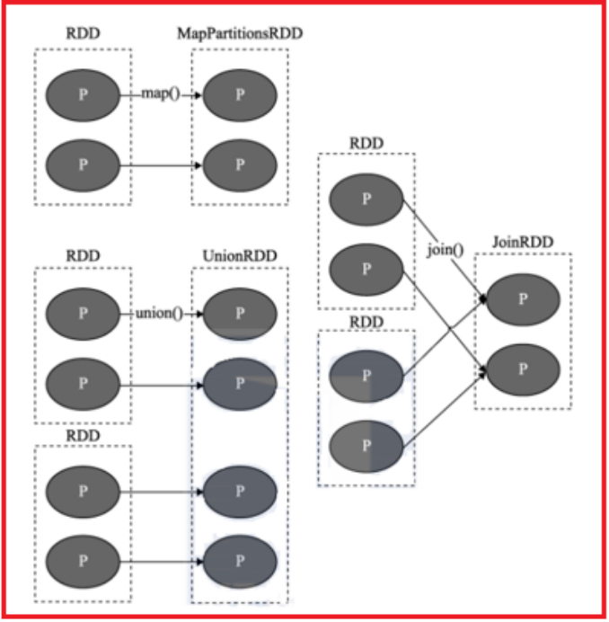
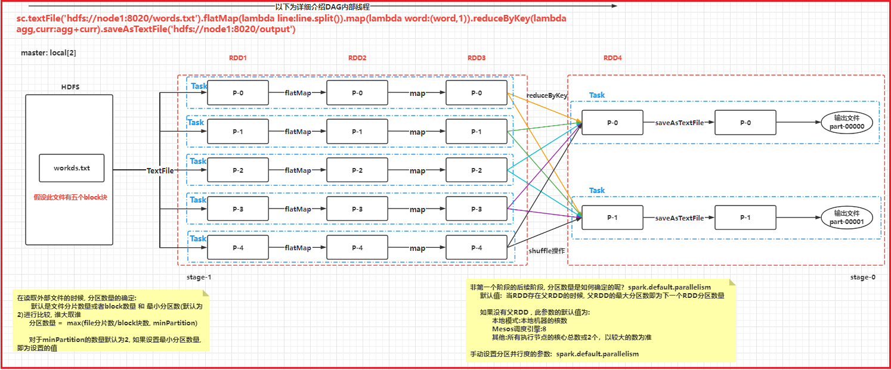
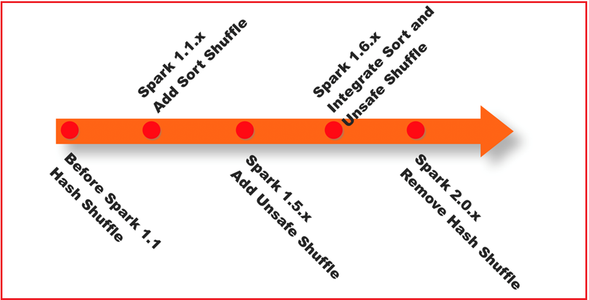
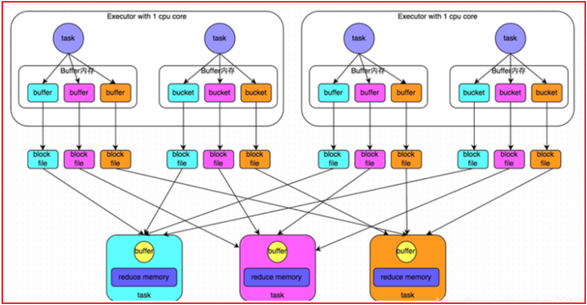
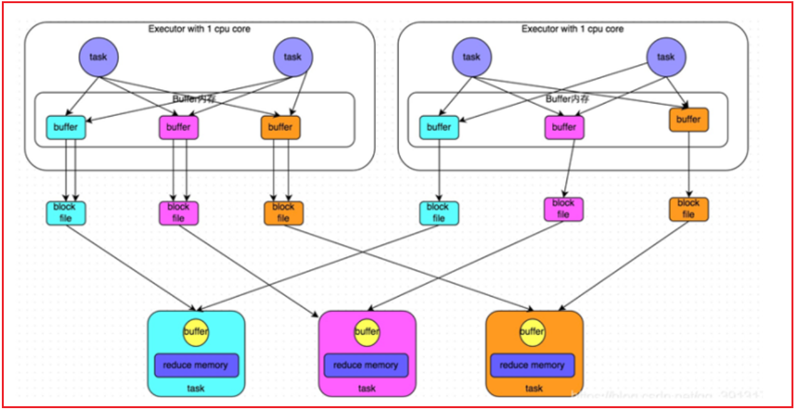
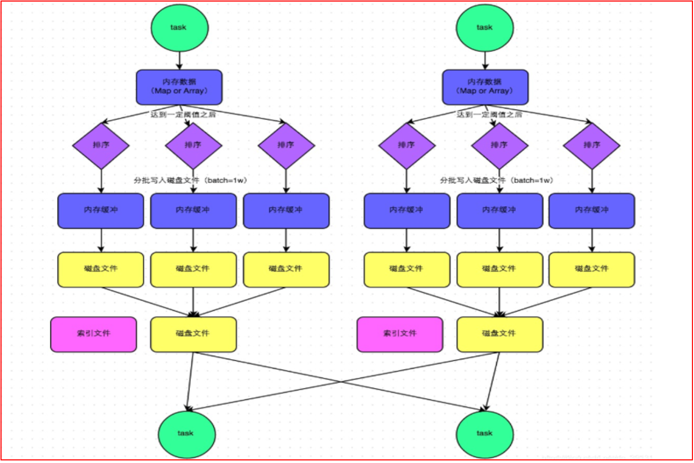
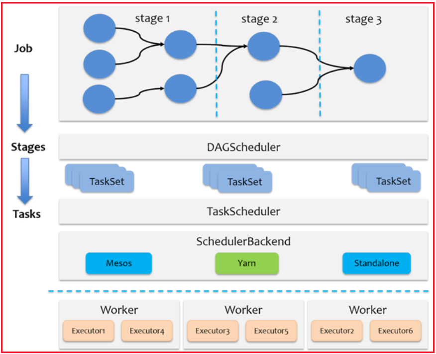
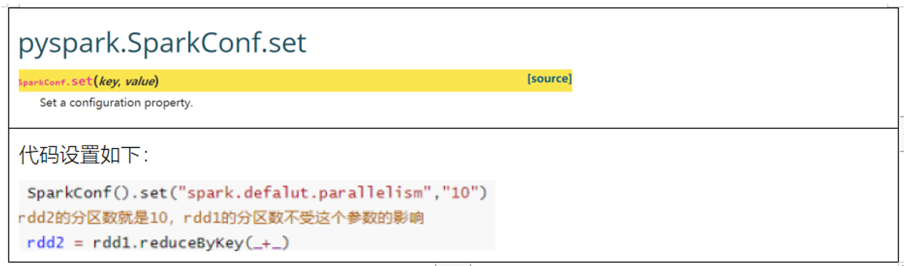
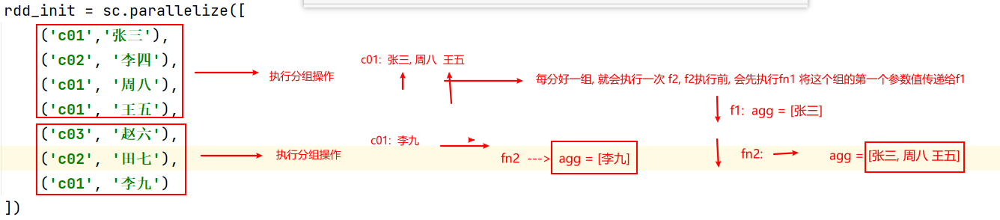

# day06_pyspark课程笔记

今日内容:

* 1- RDD的DAG内部详解 (理解)
* 2- RDD的shuffle  (理解)
* 3- RDD的JOB调度流程  (理解)
* 4- Spark的并行度  (理解)
* 5- combinerByKey基本使用 (了解)
* 6- Spark SQL的基本介绍 (了解)
* 7- Spark SQL的入门案例 (掌握)

## 1. RDD的内核调度

```properties
RDD的内核调度主要任务: 
	1- 确定需要构建多少分区(线程)
	2- 如何构建DAG执行流程图
	3- 如何划分stage阶段
	4- Driver底层如何进行调度操作

目标: 
	用最小的资源, 高效的完成整个计算任务
```


### 1.1 RDD的依赖

​		RDD依赖: 指的一个RDD的形成可能有一个或者多个RDD来得出的, 此时这个RDD和之前的RDD之间产生依赖的关系

​		在Spark中, RDD之间的依赖关系, 主要有二种依赖关系:

* 窄依赖:

```properties
	目的: 为了实现并行计算操作
	指的: 一个RDD上的一个分区的数据, 只能完整的交付给下一个RDD的一个分区(完全继承), 不能分割
```



* 宽依赖:

```properties
	目的: 为了后续进行划分stage的依据
	指的: 上一个RDD的某一个分区的数据被下一个RDD的多个分区进行接收, 中间必然存在shuffle操作(是否存在shuffle是判定宽窄依赖的重要依据)
	
	注意: 一旦有了shuffle操作, 后续RDD的执行必须等待前序的shuffle执行完成后, 才能执行
```


说明:

```properties
	在spark中, 每一个算子是否会执行shuffle的操作, 其实spark在设计算子的时候, 就已经规划好了, 比如说 map算子就不会触发shuffle, reduceByKey算子就一定会触发shuffle
	
	如果想知道这个算子会不会触发shuffle操作, 可以通过运行的时候, 查看4040 webUI界面 在界面中DAG执行流程图中, 如果这个图被分为了多个stage阶段, 那么就说明这个算子会触发shuffle 或者 也可以查看这个算子的说明信息, 一般在说明信息中也会标记为是否有shuffle的
	
	在实际使用中, 不需要纠结哪一个算子存在shuffle, 以需求为目标, 虽然shuffle的存在 会影响一定的效率 但是以完成任务为标准, 该用那个算子, 就使用那个算子即可, 不要过分纠结
```


### 1.2 DAG与Stage

DAG:

```properties
	有向无环图, 主要描述一段执行任务, 从开始一直往下走, 不允许出现回调的操作
```

-----

在spark应用程序, 程序中有一个action算子, 就会触发一个job任务, 所以说一个spark应用程序中可以有多个JOB的任务


对于每一个JOB任务, 都会产生一个DAG执行流程图, 那么这个流程图是如何形成的呢?

```properties
第一步: 当Driver遇到一个action算子后, Spark程序会将这个action算子所依赖的所有的RDD全部都加载进来, 形成一个完整的血缘关系, 将这个依赖关系放置到一个stage中

第二步: 通过回溯操作, 从后往前, 依次判断每一个RDD对应算子是否存在shuffle的操作, 如果有shuffle, 将其分开, 形成一个新的stage, 依次类推直到将所有的依赖的RDD全部判断完成, 形成最终的DAG流程图
```


细化描述DAG流程图内部:




### 1.3 RDD的shuffle

spark shuffle经历阶段:

```properties
1- 在1.1版本以前, shuffle主要采用Hash Shuffle方案. 完成数据分发操作
2- 在1.1版本的时候, 引入Sort shuffle方案, 本质对Hash Shuffle优化操作, 增加合并, 排序
3- 在1.5版本的时候, 引入钨丝计划, 提升CPU以及内存的效率(优化操作)
4- 在1.6版本的时候, 将钨丝计划集成到Sort Shuffle中
5- 在2.0版本的时候, Spark将Hash shuffle方案删除掉, 将整个Hash方案整合到了Sort Shuffle中  最终只有Sort Shuffle
```




* 未优化前的Hash Shuffle方案:



```properties
	早期版本中, 上一个stage中每一个Task都会输出与下一个stage相同分区数量的文件, 每一个文件对应下一个stage中一个分区的数据
	
弊端: 
	一旦数据量比较大的时候, 上一个stage中Task线程比较多的时候,就会导致产生大量的小文件, 对磁盘对后续的读取数据操作, 都是非常的不方便的,增大IO 影响效率. 频繁打开文件和关闭文件也是性能角度
```

* 优化后的Hash Shuffle操作:



```properties
	经过优化后的Hash Shuffle, 增加了合并的操作, 原来是每个Task都会输出等量文件对应下游分区, 优化后, 形成一个文件组, 将一个执行器划分为一个组, 一个组只会形成与下游分区等量的文件数, 这样就可以大大降低了分区文件的数量, 降低磁盘IO, 减少文件打开的次数, 提升效率
```


* Sort Shuffle流程方案:



```properties
	整个完整的shuffle流程, 基本跟MR是非常大的相似的
	
	都是先将数据写入到内存中, 然后当内存中数据达到一定的阈值后, 开始进行溢写操作, 在溢写的时候, 对数据进行排序操作, 将排序好的数据写入到磁盘上(分批次), 形成一个个的小文件, 最后将多个小文件进行合并, 形成一个大的文件, 同时为了提升后续读取文件的效率. ,每一个大的文件, 都配置了一个索引文件, 方便后续进行读取数据操作
```


说明: SortShuffle在执行的过程中, 主要有二种执行机制:

```properties
1- 普通机制
	先将数据写入到内存中, 然后当内存中数据达到一定的阈值后, 开始进行溢写操作, 在溢写的时候, 对数据进行排序操作, 将排序好的数据写入到磁盘上(分批次), 形成一个个的小文件, 最后将多个小文件进行合并,合并的时候依然内部会进行排序操作,  形成一个大的文件, 同时为了提升后续读取文件的效率. ,每一个大的文件, 都配置了一个索引文件, 方便后续进行读取数据操作

如果要使用bypass模式, 必须满足以下两个条件: 
	1- 上游的Task分区的数量不能超过200个
	2- 上游不能进行提前聚合操作

2- byPass机制
	在普通的模式上, 去除了排序操作, 直接将内存中数据写入到磁盘上
	
	因为ByPass缺少了排序操作, 整个模式执行效率要优于普通模式. 前提数据量不能太大了, 太大了, 对后续进行聚合统计操作会有一定影响

	排序的主要目的是为了支持后续能够更好的更有效率的进行分组聚合统计操作
```


### 1.4 JOB调度流程

* Driver内部的调度方案

```properties
整个JOB调度流程, 都是发生在Driver中:DAGSchedule 和 TaskSchedule 和 ExecutorBackend

1- 当遇到action算子, 触发任务的执行, 此时就会产生一个Job任务, Driver程序首先会创建SparkContext对象, 在构建好这个对象的同时, 在底层也会同时创建两个新的对象:  DAGSchedule 和 TaskSchedule

2- DAGSchedule主要负责对整个任务形成DAG执行流程图, 并且进行stage的划分操作, 并确定每一个stage中需要运行多少个线程(分区),最后将每一个stage中Task放置到一个TaskSet列表中, 统一提交给TaskSchedule

3- TaskSchedule接收DAGSchedule提交过来的TaskSet线程信息后, 将这些线程提交给对应的executor来运行(尽量保证均衡分配)

4- Driver程序负责后续的任务的监听, 以及数据返回等相关的操作....

```




### 1.5 Spark的并行度

Spark的并行度影响的因素:

* 资源因素: 指的executor的数量和占用CPU以及内存的大小
* 数据因素: 指的Task的数据量或者分区的数量

```properties
目的: 希望在合适的资源上, 运行合适的数据

说明: 
	当资源比较大的时候, 而数据量比较少的时候, 导致资源浪费, 但是不会影响执行效率
	当资源比较小的时候, 但是数据量比较大的时候, 由于资源不足, 本应该并行执行的操作, 也被迫变成了串行执行操作, 导致运行的效率降低了
	
	
实际运行中, 给出推荐的方案: 
	每一个CPU核数上, 运行2~3倍的线程任务执行, 不推荐一个CPU运行一个线程操作, 一个CPU一般挂载3~5GB内存
```



```properties
说明:
	此值设置会在shuffle后生效, 设置的值越大, shuffle后分区的数量越多, 对应并行度越高, 但是也会导致最终结果文件数量变多
```


### 1.6 了解CombinerByKey

​		combinerByKey是aggregateByKey底层实现, foldByKey底层实现是aggregateByKey, reduceByKey的底层实现是foldByKey

​		reduceByKey --> foldByKey --> aggregateBykey --> combinerByKey

```properties

格式:
	combinerByKey(f1,f2,f3)
	
	f1: 进行初始化设置操作
	f2: 对每个分区执行聚合操作
	f3: 对各个分区的聚合后结果进行再次汇总操作


注意:
	参数2 和 参数3 相当于aggregateByKey中参数2和参数3
```

案例:

```properties
from pyspark import SparkContext, SparkConf
from pyspark.sql import SparkSession
import os

# 锁定远端python版本:
os.environ['SPARK_HOME'] = '/export/server/spark'
os.environ['PYSPARK_PYTHON'] = '/root/anaconda3/bin/python3'
os.environ['PYSPARK_DRIVER_PYTHON'] = '/root/anaconda3/bin/python3'

if __name__ == '__main__':
    print("演示combinerByKey使用操作")

    # 1-创建SparkContext对象
    conf = SparkConf().setMaster('local[*]').setAppName('combinerByKey_Test')
    sc = SparkContext(conf=conf)

    # 2- 模拟一份数据集
    rdd_init = sc.parallelize([
        ('c01','张三'),
        ('c02', '李四'),
        ('c01', '周八'),
        ('c01', '王五'),
        ('c03', '赵六'),
        ('c02', '田七'),
        ('c01', '李九')
    ])

    # 3- 处理数据:
    # 需要: 请根据key进行分组, 将value汇总在一起得出以下的结果:  请使用combinerByKey实现
    #      [ (c01,['张三','王五','周八','李九']) , (c02:['李四','田七']) ,(c03: ['赵六']) ]

    def f1(v):
        # 默认:  传入的v值为每组中第一个元素
        return [v]

    def f2(agg,curr):
        # agg = [张三,周八, 王五]  curr =
        agg.append(curr)
        return agg

    def f3(agg,curr):
        # agg = [张三, 周八, 王五,李九]  curr = []
        agg.extend(curr)
        return agg

    rdd_res = rdd_init.combineByKey(f1,f2,f3)

    print(rdd_res.collect())
```

草图: 需要大家结合回放理解

