# day08_PySpark课程笔记

今日内容:

* 1- 综合案例:  WordCount词频统计 和 电影分析案例
* 2- 相关的清洗的API


## 1- SparkSql的基本概念

### 1.1 了解什么是Spark SQL

​		Spark SQL 是 Spark的一个模块, 此模块主要用于处理结构化的数据

```properties
思考: 什么是结构化数据? 
	指的: 一份数据, 每行都有固定的长度, 每列的数据类型的都是一致的, 我们可以将这样的数据称为结构话的数据
	
1 张三 男 20
2 李四 女 18
3 王五 男 20
4 赵六 女 15


请问上面这个数据是否是结构化的数据呢?  是的
```

​		Spark SQL 主要是处理结构化的数据, 而Spark Core 可以处理任意数据类型

​		Spark SQL中 核心的数据结构为  dataFrame:  数据(RDD) + 元数据(schema)


为什么学习SparkSQL:

```properties
1- SQL比较简单, 会SQL的人一定比会大数据的人多: SQL更加通用
2- Spark SQL可以兼容 HIVE , 可以让Spark SQL 和 hive集成, 从而将执行引擎替换为Spark
3- Spark SQL 不仅仅可以写SQL, 还可以写代码, SQL和代码是可以共存, 也可以单独使用, 更加灵活
4- Spark SQL可以处理大规模的数据, 底层是基于Spark RDD
```


Spark SQL的特点:

```properties
1- 融合性:  Spark SQL中既可以编写SQL 也可以编写代码 也可以混合使用
2- 统一的数据访问: 使用Spark SQL 可以和各种数据源进行集成, 比如 HIVE, MySQL, Oracle ....., 集成后, 可以使用一套Spark SQL的API来操作不同的数据源的数据
3- HIVE兼容: Spark SQL 可以和 HIVE进行集成, 集成后将HIVE执行引擎从MR替换为 Spark, 提升效率 集成核心是共享metastore
4- 标准化的连接: Spark SQL 也是支持 JDBC/ODBC的连接方式,可以让各种连接数据库的工具来连接使用
```


### 1.2 Spark SQL的发展史

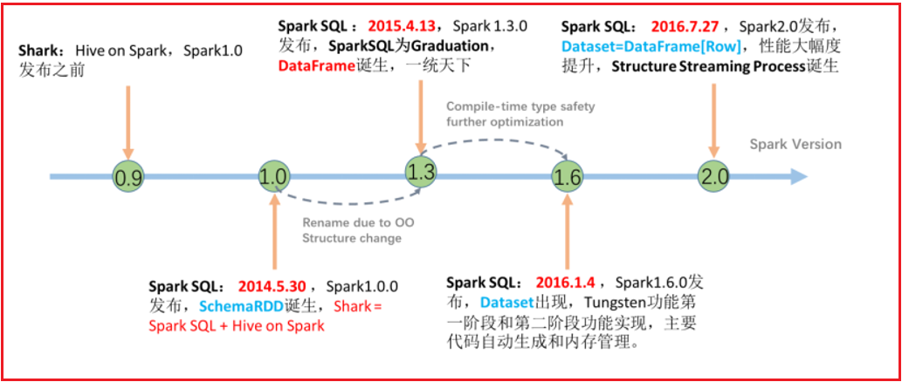

​		从 2.0版本后, Spark SQL 将Spark SQL两个核心对象: dataSet 和 dataFrame 合二为一了, 统一称为叫做 dataSet, 但是为了能够支持向python这样没有泛型的语言, 在客户端依然保留dataFrame, 但是当dataFrame到达Spark后, 依然会被转换为dataSet[ROW]

### 1.3 Spark SQL与hive异同

相同点:

```properties
1- Spark SQL 和 HIVE 都可以通过 SQL 完成数据统计分析操作
2- 都可以处理大规模的数据
3- 都是处理结构化的数据
4- SPARK SQL 和  HIVE SQL 最终都可以提交到YARN平台来使用
```

区别:

```properties
1- Spark SQL 是基于内存的迭代计算,  HIVE是基于磁盘的迭代计算
2- HIVE仅能使用SQL来处理数据, 而 Spark SQL 不仅可以使用SQL 还可以使用 DSL代码
3- HIVE提供了专门用于元数据管理的服务: metastore   而 Spark SQL 没有元数据管理的服务, 自己来进行维护
4- HIVE底层是基于MR来运行的,  而 Spark SQL底层是基于RDD
```


### 1.4 Spark SQL的数据结构对比

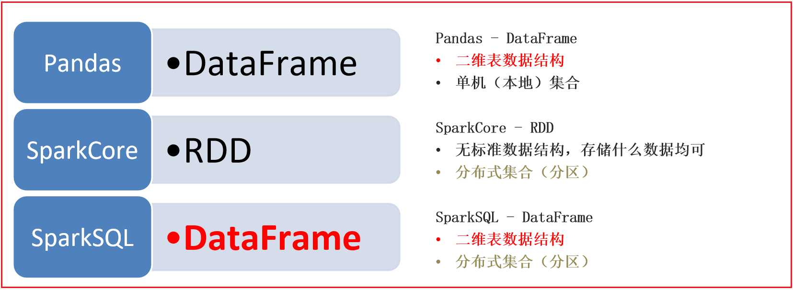

```properties
pandas的 dataFrame:  表示的是一个二维的表,仅能处理结构化的数据, 单机处理操作,仅适合于处理小数据集分析

Spark Core的RDD:  不局限于数据结构, 分布式的处理引擎, 可以处理大规模的数据

Spark SQL的dataFrame: 表示的一个二维的表, 仅能处理结构化的数据, 可以分布式的处理, 可以处理大规模的数据


在实际中: 
	一般如果遇到的数据集以  kb  MB 或者几个GB , 此时可以使用pandas即可完成统计分析处理, 比如财务的相关数据分析
	如果数据集以 几十GB 或者 TB 甚至 PB级别以上的数据集, 必须使用大规模处理数据的引擎
```

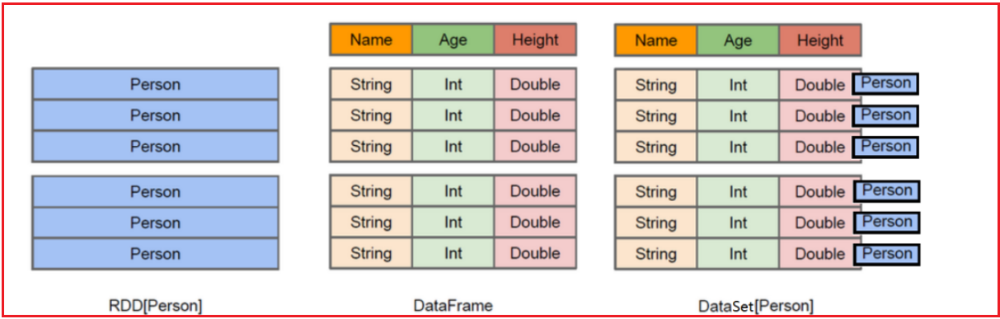

```properties
RDD表示的具体数据对象, 一个RDD就代表一个数据集

dataFrame: 是将RDD中对象中各个属性拆解出来, 形成一列列的数据, 变更为一个二维的表

dataSet: 是在dataFrame的基础上, 加入了泛型的支持, 将每一行的数据, 使用一个泛型来表示


从Spark SQL  2.0开始, 整个Spark SQL只有一种数据结构: dataSet
	但是由于Spark SQL需要支持多种语言的开发的工作 有一些语言并不支持泛型, 所以Spark SQL为了能够让这些语言对接Spark SQL, 所以在客户端依然保留了dataFrame的接口, 让其他无泛型的语言使用dataFrame接口来对接即可, 底层会将其转换为dataSet

```


## 2. Spark SQL的入门案例

### 2.1 Spark SQL的统一入口

​		从Spark SQL开始, 需要将核心对象, 从SparkContext切换为Spark Session对象

```properties
Spark Session对象是Spark2.0后推出一个全新的对象, 此对象将会作为Spark整个编码入口对象, 此对象不仅仅可以操作Spark SQL还可以获取到SparkContext对象, 用于操作Spark Core代码
```

如何构建Spark Session对象呢?

```properties
from pyspark import SparkContext, SparkConf
from pyspark.sql import SparkSession
import os

# 锁定远端python版本:
os.environ['SPARK_HOME'] = '/export/server/spark'
os.environ['PYSPARK_PYTHON'] = '/root/anaconda3/bin/python3'
os.environ['PYSPARK_DRIVER_PYTHON'] = '/root/anaconda3/bin/python3'

if __name__ == '__main__':
    print("演示Spark SQL 入门案例")

    # 1- 创建Spark Session对象
    spark = SparkSession.builder.master('local[*]').appName("_01_init").getOrCreate()
    
    # 如何获取SparkContext对象
    sc = spark.sparkContext
     
```


### 2.2 Spark SQL的入门案例

* 1- 在_03_pyspark_sql项目中的data目录下创建一个stu.csv 文本文件

```properties
文件内容如下:

id,name,age
1,张三,20
2,李四,18
3,王五,22
4,赵六,25
```

* 2- 代码实现:  需求 请将年龄大于20岁的数据获取出来

```python
from pyspark import SparkContext, SparkConf
from pyspark.sql import SparkSession
import os

# 锁定远端python版本:
os.environ['SPARK_HOME'] = '/export/server/spark'
os.environ['PYSPARK_PYTHON'] = '/root/anaconda3/bin/python3'
os.environ['PYSPARK_DRIVER_PYTHON'] = '/root/anaconda3/bin/python3'

if __name__ == '__main__':
    print("演示Spark SQL 入门案例")

    # 1- 创建Spark Session对象
    spark = SparkSession.builder.master('local[*]').appName("_01_init").getOrCreate()

    # 如何获取SparkContext对象
    sc = spark.sparkContext

    # 2- 读取结构化数据:
    # sep: 通过csv格式方式读取数据,字段之间的分隔符号, 默认为 逗号
    # header: 表示是否存在表头信息, 默认为False
    # inferSchema: 是否自动推测数据类型呢, 默认为False 导致所有的类型都是String
    df_init = spark.read.csv(
        path='file:///export/data/workspace/ky04_pyspark_parent/_03_pyspark_sql/data/stu.csv',
        sep=' ',
        header=True,
        inferSchema=True
    )

    # 3- 处理数据
    # 代码形式(DSL方案)
    df = df_init.where('age > 20')

    # SQL方案
    df_init.createTempView('t1')
    df = spark.sql("""
        select
            *
        from t1 where age > 20
    """)

    df.printSchema()
    df.show()
    
    
    # 4 关闭spark对象
    spark.stop()
```


## 3. DataFrame详解

### 3.1 DataFrame基本介绍

​		dataFrame表示的是一个二维的表, 既然是一个表, 那么应该有 字段名字, 字段的类型, 数据

```properties
dataFrame中, 主要由 structType 和 structField 和 ROW来组成的

其中: 
	StructType: 其实dataFrame中表示schema元数据信息的核心对象
	
	StructField: 表示字段的对象, 一个StructType中可以有多个StructField,类似于一个表中可以有多个列
		涵盖三个部分的内容:  字段名称, 字段的类型, 字段数据是否可以为空
	
	ROW: 行, 表示的行数据, 每一行的数据就是一个ROW对象
	
	column: 一列数据 包含列信息和列数据
```

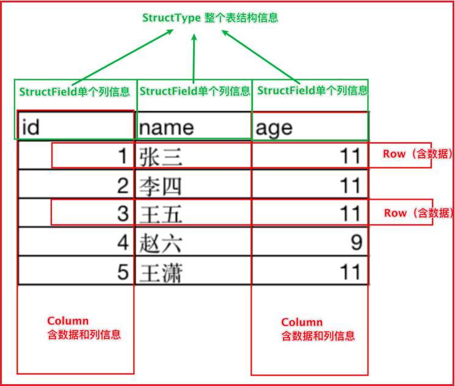


* 如何构建一个schema元数据信息: 

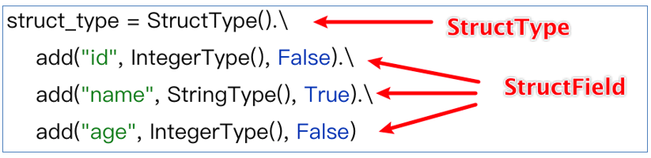


### 3.2 DataFrame的构建方式

* 方式一:  通过Spark Core RDD对象 转换为 dataFrame对象

```python
from pyspark import SparkContext, SparkConf
from pyspark.sql import SparkSession
from pyspark.sql.types import *
import os

# 锁定远端python版本:
os.environ['SPARK_HOME'] = '/export/server/spark'
os.environ['PYSPARK_PYTHON'] = '/root/anaconda3/bin/python3'
os.environ['PYSPARK_DRIVER_PYTHON'] = '/root/anaconda3/bin/python3'

if __name__ == '__main__':
    print("DF构建方式一: 通过 RDD 转换为 DF")

    # 1- 创建Spark Session对象
    spark = SparkSession.builder.master('local[*]').appName('rdd_to_df').getOrCreate()

    # 获取 SparkContext
    sc = spark.sparkContext

    # 2- 通过SparkContext对象, 获取一个RDD对象
    rdd_init = sc.parallelize([('张三', 20), ('李四', 22), ('王五', 18), ('赵六', 26), ('田七', 35)])

    # 3- 通过RDD处理数据: 过滤小于20岁的数据
    rdd_filter = rdd_init.filter(lambda data: data[1] >= 20)

    # 4- 如何将 RDD转换为 dataFrame对象呢?
    # 4.1 方案一: createDataFrame
    # 注意: 不要丢失括号
    schema = StructType().add('name',StringType(),False).add('age',IntegerType(),True)
    df1 = spark.createDataFrame(rdd_filter,schema=schema)
    # 或者:  以下的写法, 数据类型是自动推断的
    df1 = spark.createDataFrame(rdd_filter, schema=['name','age'])

    df1.printSchema()
    df1.show()

    # 4.2 方案二:
    df2 = rdd_filter.toDF(schema=schema)
    # 或者:  以下的写法, 数据类型是自动推断的
    df2 = rdd_filter.toDF(schema=['name','age'])

    df2.printSchema()
    df2.show()
```

​			rdd转换为DF操作, 在后续有时候可能读取的数据为半结构化的数据, 或者存在结构不完整的数据, 首先通过spark core来读取数据, 通过rdd的算子来对数据进行转换处理操作. 将处理后的干净的结构化的数据转换为DF, 进行通过 SQL来处理


* 方式二: 将pandas的DF对象, 转换为 spark的dataFrame对象

```properties
import pandas as pd
from pyspark import SparkContext, SparkConf
from pyspark.sql import SparkSession
import os

# 锁定远端python版本:
os.environ['SPARK_HOME'] = '/export/server/spark'
os.environ['PYSPARK_PYTHON'] = '/root/anaconda3/bin/python3'
os.environ['PYSPARK_DRIVER_PYTHON'] = '/root/anaconda3/bin/python3'

if __name__ == '__main__':
    print("构建dataFrame方式二: 通过Pandas DF 转换为 Spark SQL 的DF对象")

    # 1- 创建SparkSession对象
    spark = SparkSession.builder.master('local[*]').appName('pandas df to spark df').getOrCreate()

    # 2- 构建 pandas 的 DF对象
    pd_df = pd.DataFrame({'id':[1,2,3],'name':['张三','李四','王五'],'address':['北京','上海','广州']})

    # 3- 如何将pandas的 DF 转换为 spark SQL的DF对象呢?
    spark_df = spark.createDataFrame(pd_df)

    spark_df.printSchema()
    spark_df.show()
```


* 方式三: 通过spark模拟数据构建一个DF对象

````properties
from pyspark import SparkContext, SparkConf
from pyspark.sql import SparkSession
import os

# 锁定远端python版本:
os.environ['SPARK_HOME'] = '/export/server/spark'
os.environ['PYSPARK_PYTHON'] = '/root/anaconda3/bin/python3'
os.environ['PYSPARK_DRIVER_PYTHON'] = '/root/anaconda3/bin/python3'

if __name__ == '__main__':
    print("构建spark df对象方式三: 通过spark本地模拟数据方式直接构建")

    # 1- 创建SparkSession对象
    spark = SparkSession.builder.master('local[*]').appName('pandas df to spark df').getOrCreate()

    # 2- 通过Spark构建DF
    df_init = spark.createDataFrame(
        data=[(1,'张三',20,'北京'),(2,'李四',22,'上海'),(3,'王五',25,'广州'),(4,'赵六',28,'深圳')],
        schema='id int,name string,age int,address string'
    )

    df_init.printSchema()
    df_init.show()
````


----

方式四:   通过读取外部数据源的方式, 直接得到一个DF对象

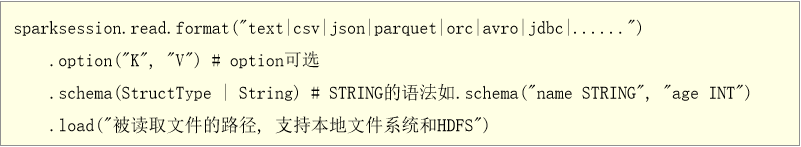

* 演示: 通过 text 读取方式来读取数据
  * 注意: 通过 text方式来读取文件, 仅支持一列数据, 其中文件中每一行数据, 反应在表中一行一列的数据
  * 默认列名为 value 如果想修改列名, 可以定义schema信息

```properties
from pyspark import SparkContext, SparkConf
from pyspark.sql import SparkSession
import os

# 锁定远端python版本:
os.environ['SPARK_HOME'] = '/export/server/spark'
os.environ['PYSPARK_PYTHON'] = '/root/anaconda3/bin/python3'
os.environ['PYSPARK_DRIVER_PYTHON'] = '/root/anaconda3/bin/python3'

if __name__ == '__main__':
    print("如何构建DF对象 方式四: 通过 读取外部文件方式  TEXT")
    # 1- 创建SparkSession对象
    spark = SparkSession.builder.master('local[*]').appName('pandas df to spark df').getOrCreate()

    # 2- 通过 Spark 读取外部数据:
    df_init = spark.read\
        .format('text')\
        .schema('line string')\
        .load('file:///export/data/workspace/ky04_pyspark_parent/_03_pyspark_sql/data/stu.csv')

    # 3- 获取结果
    df_init.printSchema()
    df_init.show()

```

* 演示CSV:

```properties
from pyspark import SparkContext, SparkConf
from pyspark.sql import SparkSession
import os

# 锁定远端python版本:
os.environ['SPARK_HOME'] = '/export/server/spark'
os.environ['PYSPARK_PYTHON'] = '/root/anaconda3/bin/python3'
os.environ['PYSPARK_DRIVER_PYTHON'] = '/root/anaconda3/bin/python3'

if __name__ == '__main__':
    print("演示Spark SQL 入门案例")

    # 1- 创建Spark Session对象
    spark = SparkSession.builder.master('local[*]').appName("_01_init").getOrCreate()

    # 如何获取SparkContext对象
    sc = spark.sparkContext

    # 2- 读取结构化数据:
    # sep: 通过csv格式方式读取数据,字段之间的分隔符号, 默认为 逗号
    # header: 表示是否存在表头信息, 默认为False
    # inferSchema: 是否自动推测数据类型呢, 默认为False 导致所有的类型都是String
    df_init = spark.read\
        .format('csv')\
        .option('sep',' ')\
        .option('header',True)\
        .option('inferschema',True)\
        .load('file:///export/data/workspace/ky04_pyspark_parent/_03_pyspark_sql/data/stu.csv')

    df_init.printSchema()
    df_init.show()
    
    
    # 4 关闭spark对象
    spark.stop()
```

* 演示: JSON

```properties
from pyspark import SparkContext, SparkConf
from pyspark.sql import SparkSession
import os

# 锁定远端python版本:
os.environ['SPARK_HOME'] = '/export/server/spark'
os.environ['PYSPARK_PYTHON'] = '/root/anaconda3/bin/python3'
os.environ['PYSPARK_DRIVER_PYTHON'] = '/root/anaconda3/bin/python3'

if __name__ == '__main__':
    print("如何构建DF对象 方式四: 通过 读取外部文件方式  JSON")
    # 1- 创建SparkSession对象
    spark = SparkSession.builder.master('local[*]').appName('pandas df to spark df').getOrCreate()

    # 2- 通过 Spark 读取外部数据:
    df_init = spark.read \
        .format('json') \
        .load('file:///export/data/workspace/ky04_pyspark_parent/_03_pyspark_sql/data/people.json')


    # 3- 打印数据
    df_init.printSchema()
    df_init.show()
```


对于 spark SQL来说, 支持的读取方式还有很多, 比如说 ORC  parquet JDBC ....


注意: 所有的读取方式都有简单的写法

```properties
	spark.read.text()
	spark.read.json()
	spark.read.orc()
	spark.read.csv()

例如: 
	df_init = spark.read.csv(
        path='file:///export/data/workspace/ky04_pyspark_parent/_03_pyspark_sql/data/stu.csv',
        sep=' ',
        header=True,
        inferSchema=True
    )
```


### 3.3 DataFrame的相关API

​		在DF中, 主要支持两种编码的方式: DSL 和 SQL

```properties
DSL: 特定领域语言
	在当前指的就是DF的相关API, 而且DF所提供的这些API基本都是SQL的关键词
	
SQL:  
	直接通过SQL的方式操作DF中数据
	

注意: 
	在生产环境中, 大多数使用的也是SQL的方式, 因为比较简单 大家都比较熟悉  而DSL编写格式琢磨不透,支持好多种不同的格式, 花样比较多, 导致很多程序员不愿意使用
	但是官方建议多使用DSL操作,  觉得DSL比较好处理, 不需要再次解析, 而SQL, 需要解释(解析)
```

DSL相关的API:

* show(参数1, 参数2):

  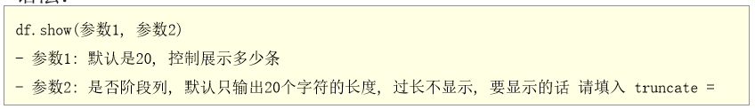

  * 一般都是直接show() 不需要做什么设置

* printSchema(): 打印DF的表结构信息(字段信息, 数据类型, 是否允许为空) , 类似于 desc 表

* select() : 此API主要是用于设置 select之后和from之前的内容的语句

  * 作用: 用于选择DF中指定列, 以及在select后编写聚合函数操作...

```properties
注意: 
	在使用DSL的API的时候, 有些API需要传递相关参数信息, 而这个参数信息一般支持三种传递方式: 
		第一种: 直接传递字符串
			比如: df.select('id','name')
		
		第二种:  传递 column对象
			比如: df.select(df['id'],df['name'])
		
		第三种:  传递列表, 在列表中可以放置字符串 或者也可以放置column
			比如:  
				df.select(['id','name'])
				df.select([df['id'],df['name']])
	
	这些传递方式, 有些API支持其中一种方式, 有些API支持两种, 有些三种都支持, 如何判断支持那些方式呢? 
		传递的时候, 需要点进去, 查看一下支持传递的方案
```

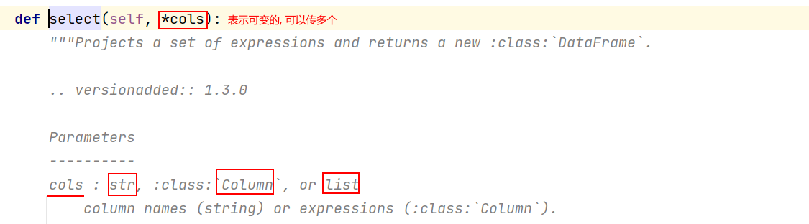

* filter() 和 where() :  对DF的数据进行过滤操作
* groupBy() 用于为指定的列进行分组操作, 分组后可以调度一些聚合函数, 完成聚合统计
  * 注意: 分组必聚合


如果在DSL中使用SQL的函数, 必须导入一个函数包: pyspark.sql.functions

```properties
import pyspark.sql.functions as F
```

----

SQL的风格: 

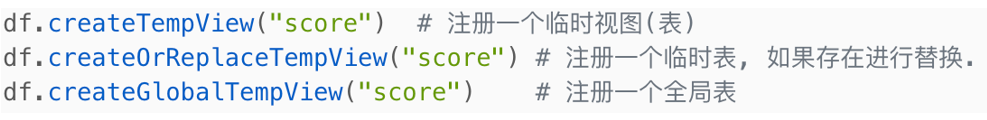

```properties
注意:
	如果要使用SQL的风格, 必须要先将我们的DF注册为一个表才可以使用
	
	临时视图, 仅能在当前的sparkSession会话中使用, 如果需要跨越多个会话, 需要注册为一个全局表, 在使用全局表的时候必须加上:  global_temp.表名
	

此操作, 在后续 可以直接通过SQL的方式构建临时的视图 和永久的视图: 
	create   view 视图 ... 
```

​		操作的API:  spark.sql('编写SQL语句')


---

相关的清洗API:

* 去重API:  dropDuplicates()

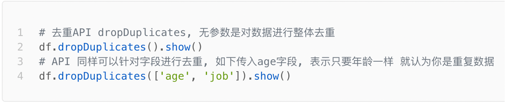

* 去除NULL值:  dropna()

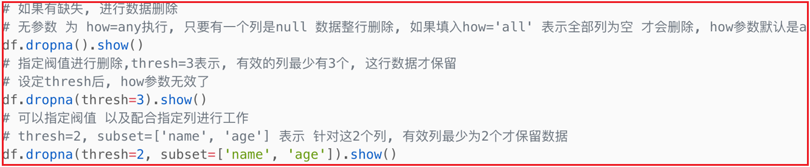

* 替换缺失值:  fillna()

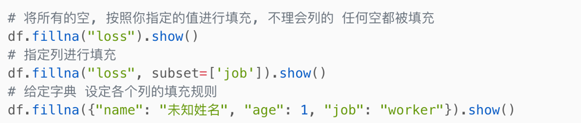


代码演示

````properties
from pyspark import SparkContext, SparkConf
from pyspark.sql import SparkSession
import os

# 锁定远端python版本:
os.environ['SPARK_HOME'] = '/export/server/spark'
os.environ['PYSPARK_PYTHON'] = '/root/anaconda3/bin/python3'
os.environ['PYSPARK_DRIVER_PYTHON'] = '/root/anaconda3/bin/python3'

if __name__ == '__main__':
    print("清洗API演示")

    # 1- 创建SparkSession对象
    spark = SparkSession.builder.appName('wd_01').master('local[*]').getOrCreate()

    # 2- 读取外部数据
    df_init = spark.read.csv(
        path='file:///export/data/workspace/ky04_pyspark_parent/_03_pyspark_sql/data/teacher.csv',
        header=True,
        inferSchema=True
    )

    df_init.show()

    # 处理数据
    # 去重API
    df_init.dropDuplicates().show()
    df_init.dropDuplicates(['age']).show()

    # 去除缺失值
    df_init.dropna().show()
    # 至少需要保证有两列是有效的
    df_init.dropna(thresh=2).show()
    # 必须保证在name和id列中 有1列不能为空
    df_init.dropna(thresh=1,subset=['name','id'])

    # 替换缺失值
    df_init.fillna(100).show()
    # 将age列替换即可
    df_init.fillna(100,subset=['age']).show()

    df_init.fillna({'id':0,'name':'未知名字','age':18}).show()
````


### 3.4 综合案例

#### 3.4.1 词频统计分析案例

* 方式一: 通过RDD转换DF 完成WordCount案例

```properties
from pyspark import SparkContext, SparkConf
from pyspark.sql import SparkSession
import pyspark.sql.functions as F
import os

# 锁定远端python版本:
os.environ['SPARK_HOME'] = '/export/server/spark'
os.environ['PYSPARK_PYTHON'] = '/root/anaconda3/bin/python3'
os.environ['PYSPARK_DRIVER_PYTHON'] = '/root/anaconda3/bin/python3'

if __name__ == '__main__':
    print("DF综合案例: WordCount 方式一 通过RDD转换为DF 完成")

    # 1- 创建SparkSession对象
    spark = SparkSession.builder.appName('wd_01').master('local[*]').getOrCreate()

    # 2- 获取SparkContext对象
    sc = spark.sparkContext

    # 3- 通过sparkContext对象读取文件数据, 转换为RDD
    rdd_init = sc.textFile('file:///export/data/workspace/ky04_pyspark_parent/_03_pyspark_sql/data/word.txt')

    # 4- 通过RDD转换数据
    rdd_map = rdd_init.flatMap(lambda line: line.split(' ')).map(lambda word: (word,))

    # 5- 将RDD转换为dataFrame对象
    df = rdd_map.toDF(schema='words string')

    # 6- 通过 spark SQL 完成计算操作
    df.createTempView('t1')
    # SQL
    spark.sql("""
        select 
            words,
            count(1) as cnt
        from t1 group by words
    """).show()

    # DSL
    df.groupby('words').count().withColumnRenamed('count','cnt').show()
    df.groupby(df['words']).agg(
        F.count('words').alias('cnt')
    ).show()
    
    # 7 关闭spark对象
    spark.stop()
```

* 方式二:  直接通过Spark Session对象读取数据, 进行处理

```properties
from pyspark import SparkContext, SparkConf
from pyspark.sql import SparkSession
import pyspark.sql.functions as F
import os

# 锁定远端python版本:
os.environ['SPARK_HOME'] = '/export/server/spark'
os.environ['PYSPARK_PYTHON'] = '/root/anaconda3/bin/python3'
os.environ['PYSPARK_DRIVER_PYTHON'] = '/root/anaconda3/bin/python3'

if __name__ == '__main__':
    print("DF综合案例: WordCount 方式一 通过RDD转换为DF 完成")

    # 1- 创建SparkSession对象
    spark = SparkSession.builder.appName('wd_01').master('local[*]').getOrCreate()

    # 2- 通过Spark对象读取数据
    df_init = spark.read.text(
        paths='file:///export/data/workspace/ky04_pyspark_parent/_03_pyspark_sql/data/word.txt'
    )

    # 3- 处理数据
    df_init.createTempView('t1')
    # SQL
    df_words = spark.sql("""
        select
            explode(split(value, ' ')) as words
        from t1
    """)

    df_words.createTempView('t2')

    spark.sql("""
        select
            words,
            count(1) as cnt
        from t2 group by words
    """).show()

    # 是否可以合并在一起:
    spark.sql("""
        
    select
            words,
            count(1) as cnt
        from ( select
            explode(split(value, ' ')) as words
        from t1) as t2 group by words
    
    """).show()

    # 是否有更加简单的方式呢?
    spark.sql("""
        select
            words,
            count(1) as cnt
        from  t1  lateral view explode(split(value, ' ')) t2 as words
        group by words
    """).show()

    # DSL写法
    df_init.select(
        F.explode(F.split('value', ' ')).alias('words')
    ).groupby('words').agg(
        F.count('words').alias('cnt')
    ).show()
    # 或者:
    # withColumn 表示产生一个新的列, 如果这个列以及存在, 直接覆盖
    df_init.withColumn('words', F.explode(F.split('value', ' '))).groupby('words').agg(
        F.count('words').alias('cnt')
    ).show()

    # 7 关闭spark对象
    spark.stop()

```

* 方式三:  DSL + SQL混用方式

```properties
from pyspark import SparkContext, SparkConf
from pyspark.sql import SparkSession
import pyspark.sql.functions as F
import os

# 锁定远端python版本:
os.environ['SPARK_HOME'] = '/export/server/spark'
os.environ['PYSPARK_PYTHON'] = '/root/anaconda3/bin/python3'
os.environ['PYSPARK_DRIVER_PYTHON'] = '/root/anaconda3/bin/python3'

if __name__ == '__main__':
    print("DF综合案例: WordCount 方式一 通过RDD转换为DF 完成")

    # 1- 创建SparkSession对象
    spark = SparkSession.builder.appName('wd_01').master('local[*]').getOrCreate()

    # 2- 通过Spark对象读取数据
    df_init = spark.read.text(
        paths='file:///export/data/workspace/ky04_pyspark_parent/_03_pyspark_sql/data/word.txt'
    )

    # 3- 处理数据 DSL + SQL
    df_init.createTempView('t1')
    # SQL
    df_words = spark.sql("""
        select
            explode(split(value, ' ')) as words
        from t1
    """)

    # 接入DSL
    df_words.groupby('words').count().show()


    # 7 关闭spark对象
    spark.stop()

```


#### 3.4.2 电影分析案例

数据集的介绍:

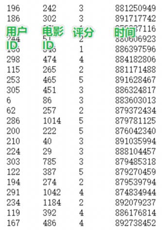

```properties
数据说明 :  userid , movieid,score,datestr

字段的分隔符号为:  \t
```

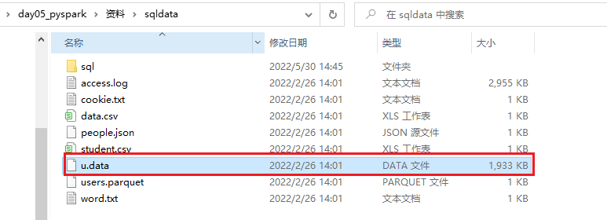

需求如下:


代码实现:

* 1- 将数据集导入到 data目录下

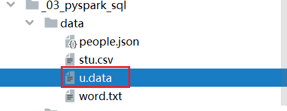

* 2- 编写代码, 完成相关需求:  
  * 需求一:  查询用户平均分

```properties
from pyspark import SparkContext, SparkConf
from pyspark.sql import SparkSession
import pyspark.sql.functions as F
import os

# 锁定远端python版本:
os.environ['SPARK_HOME'] = '/export/server/spark'
os.environ['PYSPARK_PYTHON'] = '/root/anaconda3/bin/python3'
os.environ['PYSPARK_DRIVER_PYTHON'] = '/root/anaconda3/bin/python3'


def xuqiu_1():
    # SQL
    spark.sql("""
        select 
            userid,
            round(avg(score),2) as score_avg
        from t1 
        group by userid
    """).show()
    # DSL
    df_init.groupby('userid').agg(
        F.round(F.avg('score'), 2).alias('score_avg')
    ).show()


if __name__ == '__main__':
    print("DF综合案例: 演示电影评分案例")

    # 1- 创建SparkSession对象
    spark = SparkSession.builder.appName('wd_01').master('local[*]').getOrCreate()

    # 2- 读取外部数据集
    df_init = spark.read.csv(
        path='file:///export/data/workspace/ky04_pyspark_parent/_03_pyspark_sql/data/u.data',
        sep= '\t',
        schema='userid string, movieid string,score int,datestr string'
    )

    df_init.createTempView('t1')
    # 3- 处理数据:
    #3.1 需求一: 查询用户平均分
    # 快速抽取方法: 选择需要抽取的内容  --> ctrl + alt + M
    # 或者通过按钮点击: 选择需要抽取的内容 --> Refactor --> extract/Intraduce --> Method
    xuqiu_1()

```

* 需求二: 查询电影平均分
* 需求三: 查询大于平均分的电影的数据

* 需求四:  查询高分电影中(电影平均分 > 3)  找到打分次数最多的用户, 并求出此人在整个评分表共打出平均分为多少

```properties
def xuqiu_4():
    # SQL
    # 3.2.1 查询高分电影: 电影评分 > 3
    df_m_top = spark.sql("""
        select
            movieid,   
            round(avg(score),2) as m_avg
        from t1
        group by movieid having m_avg > 3
    """)
    df_m_top.createTempView('t2_m_top')
    # 3.2.2 查询在这些高分电影中, 每个用户的打分次数 找到最多的
    df_u_top = spark.sql("""
        select 
            t1.userid
        from t2_m_top join t1  on  t2_m_top.movieid = t1.movieid
        group by t1.userid order by count(1) desc limit 1
    """)
    # 3.2.3 查询此用户在整个的数据集中, 打的整体平均分是多少
    spark.sql("""
        select
            userid,
            round(avg(score),2) as s_avg
        from t1 where userid = (select 
                                        t1.userid
                                    from t2_m_top join t1  on  t2_m_top.movieid = t1.movieid
                                    group by t1.userid order by count(1) desc limit 1
                                )
        group by userid
    
    """).show()
    # DSL
    # 3.2.1 查询高分电影: 电影评分 > 3
    df_m_top = df_init.groupby(df_init['movieid']).agg(
        F.round(F.avg('score'), 2).alias('m_avg')
    ).where('m_avg > 3')
    # 3.2.2 查询此用户在整个的数据集中, 打的整体平均分是多少
    df_u_top = df_m_top.join(df_init, 'movieid').groupby('userid').agg(
        F.count('userid').alias('s_cnt')
    ).orderBy('s_cnt', ascending=False).select('userid').limit(1)
    # 3.2.3 查询此用户在整个的数据集中, 打的整体平均分是多少
    df_init.where(df_init['userid'] == df_u_top.first()['userid']).groupby('userid').agg(
        F.round(F.avg('score'), 2).alias('s_avg')
    ).show()

```

* 需求五: 查询每个用户的平均打分, 最低打分, 最高打分

```
select
	avg(score),
	min(score),
	max(score)
from 表
group by userid;

```

* 需求6: 查询被评分超过100次 的电影的平均分排名的TOP10

```sql
def xuqiu_6():
    # SQL
    # 3.3.1 查询出每部电影的被评分的次数, 找出大于100次的
    df_100_m = spark.sql("""
        select
            movieid,
            count(1) as m_cnt
        from t1
        group by movieid having m_cnt > 100
    """)
    df_100_m.createTempView('t2_100_m')
    # 3.3.2 在这些电影中 每部电影的平均分为多少, 找出前TOP10
    spark.sql("""
        select 
            t2_100_m.movieid,
            round(avg(score),2) as m_avg
        from t2_100_m join t1 on t2_100_m.movieid = t1.movieid
        group by  t2_100_m.movieid order by m_avg desc limit 10
    """).show()
    # DSL:
    df_100_m = df_init.groupby('movieid').count().where('count > 100')
    df_100_m.join(df_init, 'movieid').groupby('movieid').agg(
        F.round(F.avg('score'), 2).alias('m_avg')
    ).orderBy(F.desc('m_avg')).limit(10).show()

```


### 3.5 Spark SQL的shuffle分区设置

​		在默认情况下, Spark SQL程序在运行的时候, 需要将SQL翻译为RDD, 将RDD提交到集群中运行, 生成DAG, 划分为stage, 确定线程, 从而进行运行操作

​		在执行过程中, 中间可能会产生shuffle操作, 默认情况下, spark SQL的shuffle的分区数量为200个, 但是有时候由于数据量比较少, 完全不需要这么多分区, 或者有时候可能需要比默认值的分区数量更多, 一般需要手动调整这个spark SQL的shuffle的分区数量


如何调整分区的数量呢?

```properties
	方式一: 在配置文件中修改shuffle分区数量 (全局修改)   一般不推荐
		修改: spark-defaults.conf配置文件:  
			添加:  spark.sql.shuffle.partitions  N
			
	
	方式二: 在提交Spark任务到集群的时候, 通过spark-submit方式中的 --conf 来设置shuffle的分区数量   -- 推荐(上线)
			./spark-submit --conf "spark.sql.shuffle.partitions=N"
		
	方式三: 在代码中, 直接在sparkSession对象中进行设置. 设置后, 只对当前会话有效  --推荐 (测试)  优先级最高
			sparkSession.conf.set('spark.sql.shuffle.partitions',N)
			
	
	在正式上线的, 一般需要内部设置调试参数, 删除, 更改为外部设置方案, 以免外部设置无法生效
				
```

### 

