# day10_pyspark课程笔记

今日内容:

* 1- 基于pandas实现UDF函数
* 2- Spark On hive 集成方式
* 3- Spark SQL分布式执行引擎
* 4- Spark SQL的运行机制
* 5- 综合案例

## 1. 基于Pandas实现UDF函数

### 1.1 Apache Arrow框架的基本介绍

​		apache arrow 是apache旗下的一款顶级的项目, 是一个跨平台的在内存中以列式存储的数据层, 它设计的目的是作为一个跨平台的数据层, 来加快大数据分析项目的运行效率

​		pandas与pyspark SQL 进行交互的时候, 建立在apache arrow上, 带来低开销 高性能的UDF函数

​		arrow 并不会自动使用, 需要对配置以及代码做一定小的更改才可以使用并兼容


如何安装?

```properties
	pip install pyspark[sql]
	
	说明: 三个节点要求要安装, 如果使用除base虚拟环境以外的环境, 需要先切换到对应虚拟环境下
	
	注意: 
		如果安装比较慢, 可以添加一下 清华镜像源
			pip install -i https://pypi.tuna.tsinghua.edu.cn/simple pyspark[sql]
			
		不管是否使用我的虚拟机, 都建议跑一次, 看一下是否存在
```

如何使用呢?

````properties
	 spark.conf.set("spark.sql.execution.arrow.pyspark.enabled", "true")
````

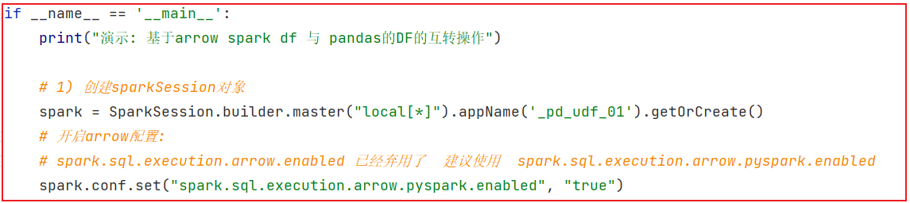

### 1.2 如何基于Arrow完成pandas DF 与 spark DF互转

说明:

```properties
	pandas DF 到 spark DF: 
		spark_df = spark.createDataFrame(pd_df)
	
	spark df 到 panda df: 
		pd_df = spark_df.toPandas()
```

代码演示:

```properties
from pyspark import SparkContext, SparkConf
from pyspark.sql import SparkSession
import os

# 锁定远端python版本:
os.environ['SPARK_HOME'] = '/export/server/spark'
os.environ['PYSPARK_PYTHON'] = '/root/anaconda3/bin/python3'
os.environ['PYSPARK_DRIVER_PYTHON'] = '/root/anaconda3/bin/python3'

if __name__ == '__main__':
    print("Pandas的DF与Spark SQL DF的互转操作: ")

    # 1- 创建SparkSession对象
    spark = SparkSession.builder.appName('write_01').master('local[*]').getOrCreate()

    # 开启 Arrow框架使用
    spark.conf.set('spark.sql.execution.arrow.pyspark.enabled',True)

    # 2- 初始化一份数据
    spark_df = spark.createDataFrame(
        data=[('c01','张三',20),('c02','李四',22),('c03','王五',25)],
        schema='id string,name string,age int'
    )

    # 3- 处理数据
    # Spark DF 转换为 Pandas的DF
    pd_df = spark_df.toPandas()
    print(type(pd_df))
    print(pd_df)

    # Pandas DF 转换为 spark_df
    spark_df = spark.createDataFrame(pd_df)
    print(type(spark_df))
    spark_df.show()
```


### 1.3 基于Pandas实现UDF函数:

​		pandas UDF 是用户自定义函数, 有spark来执行, 使用arrow传输数据, pandas函数处理数据(py函数),arrow支持向量化(充分的利用计算机的并行能力)操作, pandas UDF是使用 pandas_udf() 作为装饰器进行函数注册. 将pandas 函数转换为spark的函数来进行使用, 而且 pandas_udf()通过类似于注解方式进行使用, 当然也支持API方案: F.pandas_udf()	

​		当使用pandas的UDF后可以模拟出  UDF函数 和 UDAF函数


---

* 基于pandas实现UDF函数:  series TO series
  * 说明: 自定义的python的函数, 传入的数据类型为series类型, 函数的返回值类型也是series类型
  * 需求:  定义两列数据 A,B列, 对 A 和B类中每一行数据进行乘积 得到一个新的列C列, , 通过自定义UDF函数来解决

```properties
import pandas as pd
from pyspark import SparkContext, SparkConf
from pyspark.sql import SparkSession
import pyspark.sql.functions as F
from pyspark.sql.types import *
import os

# 锁定远端python版本:
os.environ['SPARK_HOME'] = '/export/server/spark'
os.environ['PYSPARK_PYTHON'] = '/root/anaconda3/bin/python3'
os.environ['PYSPARK_DRIVER_PYTHON'] = '/root/anaconda3/bin/python3'

if __name__ == '__main__':
    print("Pandas的DF与Spark SQL DF的互转操作: ")

    # 1- 创建SparkSession对象
    spark = SparkSession.builder.appName('write_01').master('local[*]').getOrCreate()

    # 开启 Arrow框架使用
    spark.conf.set('spark.sql.execution.arrow.pyspark.enabled',True)

    # 2- 初始化一份数据
    df_init = spark.createDataFrame(
        data=[(1,3),(2,3),(3,5),(1,7),(5,4),(8,3)],
        schema='A int,B int'
    )

    # 3- 处理数据 : series TO series
    # 需求:  定义两列数据 A,B列, 对 A 和B类中每一行数据进行乘积 得到一个新的列C列, , 通过自定义UDF函数来解决
    # 3.1 定义一个python的函数: 传入类型和返回的类型都是series
    @F.pandas_udf(returnType=IntegerType())
    def cj_fn(A:pd.Series,B:pd.Series) -> pd.Series :
        return A * B

    # 3.2: 注册: 将pandas的函数, 转换为Spark SQL函数
    #cj_fn = F.pandas_udf(cj_fn,IntegerType())

    spark.udf.register('cj_fn',cj_fn)
    # 3.3:  使用 函数
    # DSL
    df_init.select('A','B',cj_fn('A','B').alias('cj')).show()
    # SQL
    df_init.createTempView('t1')
    spark.sql("""
        select
            A,B,cj_fn(A,B) AS cj
        from t1
    """).show()
```

* 基于pandas UDF 实现 UDAF函数:  series TO 标量(普通的数据类型 -- python提供的一些数据类型 str int double  float ....)
  * 说明: 自定义的python的函数传入的数据类型为series类型, 函数的返回值的类型为标量类型
  * 需求说明:  假设有一份两列的数据, 一列为班级id, 一列为班级的人员的身高, 请计算每个班级平均人员身高, 要求采用自定义函数

```properties
import pandas as pd
from pyspark import SparkContext, SparkConf
from pyspark.sql import SparkSession
from pyspark.sql import Window as win
import pyspark.sql.functions as F
from pyspark.sql.types import *
import os

# 锁定远端python版本:
os.environ['SPARK_HOME'] = '/export/server/spark'
os.environ['PYSPARK_PYTHON'] = '/root/anaconda3/bin/python3'
os.environ['PYSPARK_DRIVER_PYTHON'] = '/root/anaconda3/bin/python3'

if __name__ == '__main__':
    print("Pandas的DF与Spark SQL DF的互转操作: ")

    # 1- 创建SparkSession对象
    spark = SparkSession.builder.appName('write_01').master('local[*]').getOrCreate()

    # 开启 Arrow框架使用
    spark.conf.set('spark.sql.execution.arrow.pyspark.enabled',True)

    # 2- 初始化一份数据
    df_init = spark.createDataFrame(
        data=[('c01',165),('c02',170),('c01',182),('c01',180),('c02',175),('c01',160)],
        schema='cid string,sg int'
    )
    df_init.createTempView('t1')
    # 3- 处理数据 : series TO series
    # 需求:假设有一份两列的数据, 一列为班级id, 一列为班级的人员的身高, 请计算每个班级平均人员身高, 要求采用自定义函数
    # 3.1 自定义一个Python的函数: UDAF  传入series 输出 标量
    @F.pandas_udf(returnType='float')
    def sg_avg_fn(sg:pd.Series) -> float:
        # mean: 求平均值
        return sg.mean()

    #3.2 将自定义函数注册为spark SQL的函数:
    #sg_avg_fn = F.pandas_udf(sg_avg_fn,returnType=FloatType())

    spark.udf.register('sg_avg_fn',sg_avg_fn)

    # 3.3 使用函数完成计算
    # SQL
    spark.sql("""
        select
            cid,
            sg_avg_fn(sg) as avg_sg
        from t1 group by cid
    """).show()

    # DSL
    df_init.groupby('cid').agg(
        sg_avg_fn('sg').alias('avg_sg')
    ).show()

    # 自定义的UDAF函数 也可以和窗口函数结合使用
    # SQL
    spark.sql("""
            select
                cid,
                sg,
                sg_avg_fn(sg) over(partition by cid order by sg desc) as avg_sg
            from t1 
    """).show()

    # DSL
    df_init.select(
        'cid',
        'sg',
        sg_avg_fn('sg').over(win.partitionBy('cid').orderBy(F.desc('sg'))).alias('avg_sg')
    ).show()
```


### 1.4 基于pandas UDF函数案例

数据说明:

```properties
_c0,对手,胜负,主客场,命中,投篮数,投篮命中率,3分命中率,篮板,助攻,得分
0,勇士,胜,客,10,23,0.435,0.444,6,11,27
1,国王,胜,客,8,21,0.381,0.286,3,9,28
2,小牛,胜,主,10,19,0.526,0.462,3,7,29
3,火箭,负,客,8,19,0.526,0.462,7,9,20
4,快船,胜,主,8,21,0.526,0.462,7,9,28
5,热火,负,客,8,19,0.435,0.444,6,11,18
6,骑士,负,客,8,21,0.435,0.444,6,11,28
7,灰熊,负,主,10,20,0.435,0.444,6,11,27
8,活塞,胜,主,8,19,0.526,0.462,7,9,16
9,76人,胜,主,10,21,0.526,0.462,7,9,28
```

需求说明: 要求每一个都要使用 自定义函数方式

```properties
1- 助攻这列 +10 操作:   udf

2- 篮板 + 助攻 的次数:  udf
 
3- 统计 胜负的平均分:   udaf
```

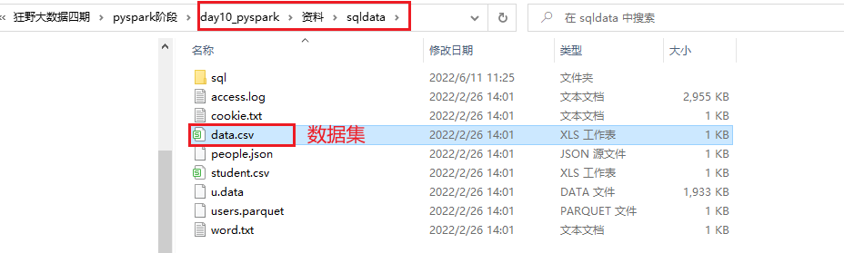

代码实现:

```properties
import pandas as pd
from pyspark import SparkContext, SparkConf
from pyspark.sql import SparkSession
from pyspark.sql import Window as win
import pyspark.sql.functions as F
from pyspark.sql.types import *
import os

# 锁定远端python版本:
os.environ['SPARK_HOME'] = '/export/server/spark'
os.environ['PYSPARK_PYTHON'] = '/root/anaconda3/bin/python3'
os.environ['PYSPARK_DRIVER_PYTHON'] = '/root/anaconda3/bin/python3'

if __name__ == '__main__':
    print("Pandas的DF与Spark SQL DF的互转操作: ")

    # 1- 创建SparkSession对象
    spark = SparkSession.builder.appName('write_01').master('local[*]').getOrCreate()

    # 开启 Arrow框架使用
    spark.conf.set('spark.sql.execution.arrow.pyspark.enabled', True)

    # 2- 读取外部数据源的数据
    df_init = spark.read.csv(
        path='file:///export/data/workspace/ky04_pyspark_parent/_03_pyspark_sql/data/data.csv',
        sep=',',
        inferSchema=True,
        header=True
    )

    df_init.createTempView('t1')

    # 3- 处理数据 :
    # 1 - 助攻这列 + 10 操作: udf
    @F.pandas_udf(returnType='int')
    def zg_fn(zg: pd.Series) -> pd.Series:
        return zg + 10

    # DSL
    df_init.select(
        '*',
        zg_fn('助攻').alias('助攻+10')
    ).show()

    # 2 - 篮板 + 助攻 的次数: udf
    @F.pandas_udf(returnType='int')
    def lb_zg_fn(lb: pd.Series, zg: pd.Series) -> pd.Series:
        return lb + zg

    # DSL
    df_init.select(
        '*',
        lb_zg_fn('篮板','助攻').alias('篮板+助攻')
    ).show()

    # 3 - 统计 胜负的平均分: udaf
    @F.pandas_udf(returnType='float')
    def sf_avg_fn(df: pd.Series) -> float:
        return df.mean()

    df_init.groupby('胜负').agg(
        sf_avg_fn('得分').alias('胜负平均分')
    ).show()

```

## 2. Spark On Hive

### 2.1 集成原理说明

原生HIVE的处理过程:

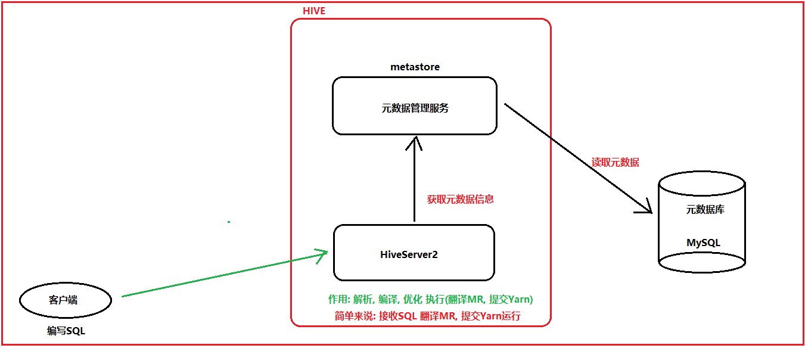

```properties
说明:
	HIVESERVER2 本质上就是将SQL翻译为MR, 然后将MR提交到yarn运行
	
思考:  
	Spark On Hive的目的:  将客户端提交的SQL语句从原来翻译MR 变更为 翻译为Spark的RDD程序(Spark程序), 然后交给Yarn执行
	

那么也就意味着, 一旦Spark 和 HIVE集成在一起, 这个HIVE的原有的HiveServer2这个服务就没有任何的价值了, 所以说Spark On HIVE 本质:   
      让Spark去集成hive的metastore的元数据服务即可, 集成后, 可以让spark的执行引擎, 结合元数据信息, 将SQL翻译为Spark的应用程序, 基于Spark执行运行, 从而提升效率
     
    
核心目的: 
	集合HIVE的元数据服务, 由Spark进行执行, 避免每一次都需要自己来构建元数据信息, 导致信息数据不一致, 不统一的问题, 一旦有了元数据服务后, 表的元数据信息就可以固定, 不管是谁在使用spark SQL, 不需要定义schema信息, 直接读取数据, 进行分析即可
	
	
最终目标: 让原有使用HIVE的从业者, 不需要改变任何的方案, 即可在内部无痕转换为spark方案
```


### 2.2 配置操作

大前提:  要保证之前hive的配置没有问题

```properties
建议:
	在on hive配置前, 尝试先单独启动hive 看看能不能启动成功, 并连接

启动hive的命令:
cd /export/server/hive/bin
启动metastore: 
	nohup ./hive --service metastore &
启动hiveserver2:
	nohup ./hive --service hiveserver2 &
	
基于beeline连接: 
	./beeline 进入客户端
	输入: !connect jdbc:hive2://node1:10000
	输入用户名: root
	输入密码: 密码可以不用输入

注意:
	启动hive的时候, 要保证 hadoop肯定是启动良好了
	

测试完成后, 将HIVE通过 kill 方式将其杀掉即可
```


配置操作:

```properties
1) 确保 hive的conf目录下的hive-site.xml中配置了metastore服务地址
	<property>
        <name>hive.metastore.uris</name>
        <value>thrift://node1:9083</value>
    </property>

2) 需要将hive的conf目录下的hive-site.xml 拷贝到 spark的 conf 目录下
	如果spark没有配置集群版本, 只需要拷贝node1即可 
	如果配置spark集群, 需要将文件拷贝每一个spark节点上


3) 启动 hive的metastore服务:  
	cd /export/server/hive/bin
	nohup ./hive --service metastore &
	
	启动后, 一定要看到有runjar的出现
	
4) 启动 hadoop集群, 以及spark集群(如果采用local模式, 此集群不需要启动)

5) 使用spark的bin目录下: spark-sql 脚本 或者 pyspark 脚本打开一个客户端, 进行测试即可


测试小技巧:
	同时也可以将hive的hiveserver2服务启动后, 然后通过hive的beeline连接hive, 然后通过hive创建一个库, 在 spark-sql 脚本 或者 pyspark 脚本 通过 show databases 查看, 如果能看到, 说明集成成功了...


测试完成后, 可以将hive的hiveserver2 直接杀掉即可, 因为后续不需要这个服务:

首先查看hiveserver2服务的进程id是多少: 
	ps -ef | grep hiveserver2  或者 jps -m
	查看后,直接通过 kill -9  杀死对应服务即可
```


### 2.3 如何在代码中集成HIVE

```properties
import pandas as pd
from pyspark import SparkContext, SparkConf
from pyspark.sql import SparkSession
from pyspark.sql import Window as win
import pyspark.sql.functions as F
from pyspark.sql.types import *
import os

# 锁定远端python版本:
os.environ['SPARK_HOME'] = '/export/server/spark'
os.environ['PYSPARK_PYTHON'] = '/root/anaconda3/bin/python3'
os.environ['PYSPARK_DRIVER_PYTHON'] = '/root/anaconda3/bin/python3'

if __name__ == '__main__':
    print("Pandas的DF与Spark SQL DF的互转操作: ")

    # 1- 创建SparkSession对象
    # enableHiveSupport: 启动Spark和HIVE的集成 (支持)
    # 默认 spark在创建库和表的时候, 默认加载数据的目录在本地磁盘上, 而不是HDFS
    spark = SparkSession\
        .builder\
        .appName('write_01')\
        .master('local[*]')\
        .config('spark.sql.shuffle.partitions','4')\
        .config('hive.metastore.uris','thrift://node1:9083') \
        .config('spark.sql.warehouse.dir', 'hdfs://node1:8020/user/hive/warehouse') \
        .enableHiveSupport()\
        .getOrCreate()


    # 测试一下
    spark.sql("show databases").show()
```


## 3. Spark SQL分布式执行引擎

​		目前, 我们已经完成了spark集成hive的操作, 但是目前集成后, 如果需要连接hive, 此时需要启动一个spark的客户端(pyspark,spark-sql, 或者代码形式)才可以, 这个客户端底层, 相当于启动服务项, 用于连接hive服务, 进行处理操作,  一旦退出了这个客户端, 相当于这个服务也不存在了, 同样也就无法使用了

​		此操作非常类似于在hive部署的时候, 有一个本地模式部署(在启动hive客户端的时候, 内部自动启动了一个hive的hiveserver2服务项)

```properties
大白话: 
	目前后台没有一个长期挂载的spark的服务(spark hiveserver2 服务), 导致每次启动spark客户端,都行在内部构建一个服务项, 这种方式 ,仅仅适合于测试, 不适合后续开发
```


如何启动spark的分布式执行引擎呢?  这个引擎可以理解为 spark的hiveserver2服务

```properties
cd /export/server/spark

./sbin/start-thriftserver.sh \
--hiveconf hive.server2.thrift.port=10000 \
--hiveconf hive.server2.thrift.bind.host=node1 \
--hiveconf spark.sql.warehouse.dir=hdfs://node1:8020/user/hive/warehouse \
--master local[*]
```

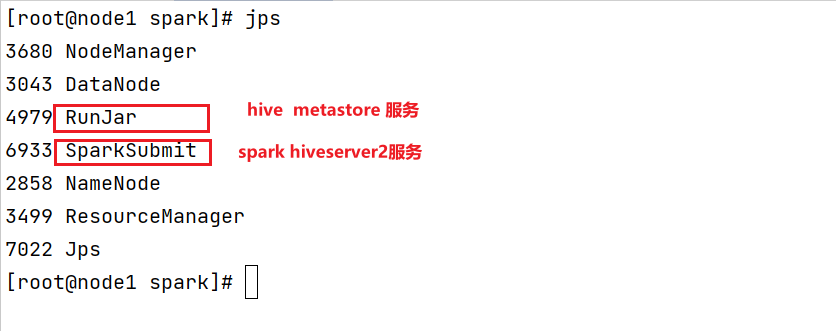

启动后: 可以通过 beeline的方式, 连接这个服务, 直接编写SQL即可:

```properties
cd /export/server/spark/bin
./beeline

输入:
!connect jdbc:hive2://node1:10000
```

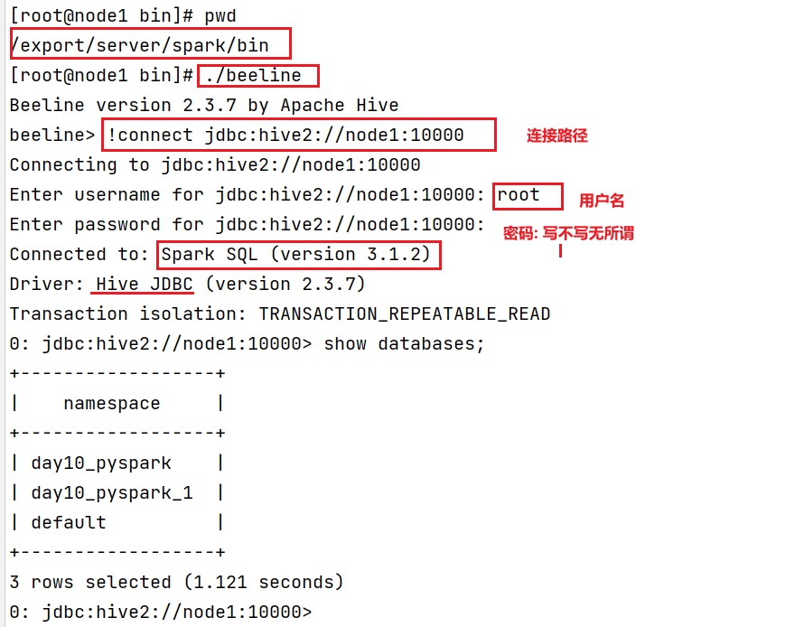

相当于模拟了一个HIVE的客户端, 但是底层运行是spark SQL 将其转换为RDD来运行的


方式二:  如何通过 datagrip 或者 pycharm 连接 spark进行操作:


注意事项:   在使用download下载驱动的时候, 可能下载比较慢, 此时可以通过手动方式, 设置一个驱动:


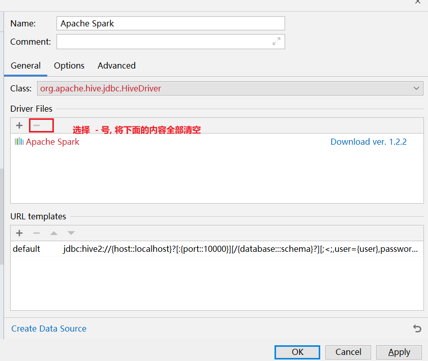

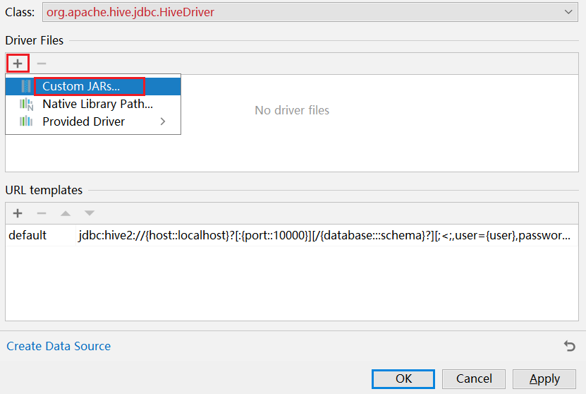

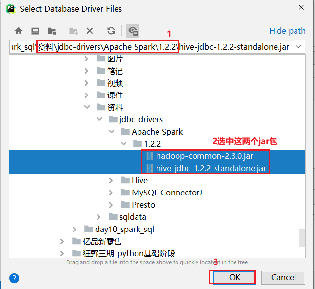


## 4. Spark SQL的运行机制

回顾: Spark RDD的执行流程

```properties
整个Spark应用分为以下几个内容: SparkContext  DAGSchedule TaskSchedule ScheduleBackend(资源中心)

1) 整个Spark应用进行执行启动, 当遇到action算子后 启动一个JOB的任务, 一旦启动Job任务, 也就是将Driver启动. Driver启动后, 首先会先创建SparkContext对象, 同时这个对象一旦创建成功, 其底层同时也会创建好 DAGSchedule TaskSchedule

2) Driver就会将任务交给DAGSchedule, 由DAGSchedule进行DAG流程图的生成, 以及划分stage, 同时标注好, 每个stage阶段中运行多少个Task线程, 将每个阶段的Task线程封装到一个TaskSet列表中, 最后将这些列表提交到TaskSchedule

3) TaskSchedule接收到TaskSet后, 依次运行每一个TaskSet中Task线程, 将每一个线程分配给executor来执行, 在分配的进行尽量保证负载

4- 后续Driver程序不但监控这些线程执行状态, 当所有的Task执行完成后, 整个程序退出了....
```

​		Spark SQL底层, 也是要将SQL翻译为RDD来运行的, 所以时候, Spark SQL执行流程中, 依然是包含以上的流程的, 只不过就是在上述的流程中, 添加了一个 spark SQL --> RDD的 翻译的过程(此过程与HIVE翻译为MR的过程基本上是类似的)

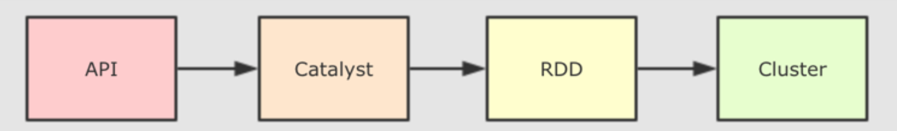

catalyst优化器内部具体流程步骤:

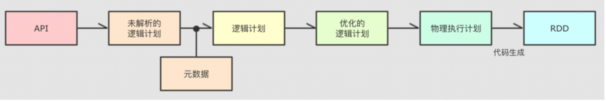

```properties
执行流程: 大白话
	1) 编写DSL的API或者SQL, 将这些内容提交到Spark SQL来运行
	2) Spark SQL在执行的时候, 会将其交给Spark SQL的优化器(catalyst), 后续整个翻译过程有 优化器来处理
		2.1) 基于SQL, 先生成一个未解析的逻辑计划(仅仅是对SQL语法, 以及根据SQL的执行顺序形成一个执行语法树,描述SQL的执行顺序)
		2.2) 然后根据元数据对未解析的逻辑计算添加相关的元数据信息(一共用到那些字段, 每个字段的类型, 数据从那里读取, 存储的格式是什么.....), 形成逻辑计划
		2.3) 接着对逻辑计算进行优化操作, 根据spark SQL提供的默认优化策略(高达 一二百种), 对逻辑计算进行优化操作, 比如说 谓词下推, 列值裁剪 .... ,形成一个优化后的逻辑计划
		2.4) 将优化后的逻辑计算转换为物理计划, 在转换的过程中, 由于优化策略不同, 会导致产生出多个物理计算, 此时通过成本模型(代价函数), 选择出一个最优的物理执行计划
		2.5) 将物理执行计划, 使用代码生成器, 将物理计算转换为RDD程序, 提交到集群运行, 后续就是RDD运行流程了...
```

专业的话术

```properties
1- sparkSQL底层解析是有RBO(规则优化) 和 CBO(成本优化)优化完成的
2- RBO是基于规则优化, 对于SQL或DSL的语句通过执行引擎得到未执行逻辑计划, 在根据元数据得到逻辑计划, 之后加入列值裁剪或谓词下推等优化手段形成优化的逻辑计划
3- CBO是基于优化的逻辑计划得到多个物理执行计划, 根据代价函数选择出最优的物理执行计划
4- 通过codegenaration代码生成器完成RDD的代码构建
5- 底层依赖于DAGScheduler 和TaskScheduler 完成任务计算执行
```


如何查看SQL的物理执行计划呢? 

* 方式一: 通过 访问WEB UI (thrift server的web界面 4040)查看 SQL目录下 detail(详细内容): 

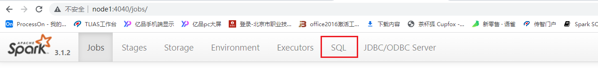

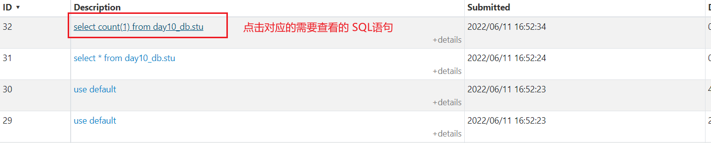

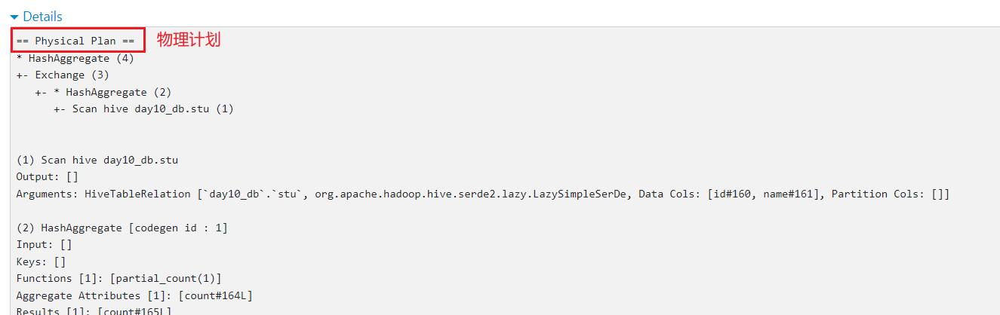


* 方式二: 通过 SQL方式查看

```properties
格式: 
	explain SQL
```

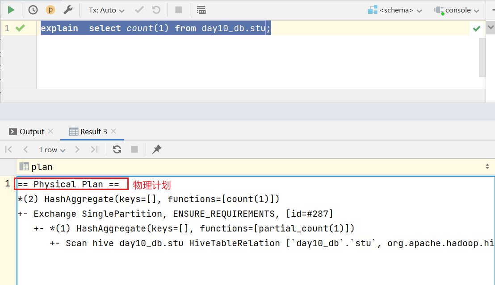


## 5. 综合案例

### 5.1 新零售综合案例

数据结构介绍:  

```properties
InvoiceNo  string  订单编号(退货订单以C 开头)
StockCode  string  产品代码
Description string  产品描述
Quantity integer  购买数量(负数表示退货)
InvoiceDate string   订单日期和时间   12/1/2010 8:26
UnitPrice  double  商品单价
CustomerID  integer  客户编号
Country string  国家名字

字段与字段之间的分隔符号为 逗号
```

E_Commerce_Data.csv

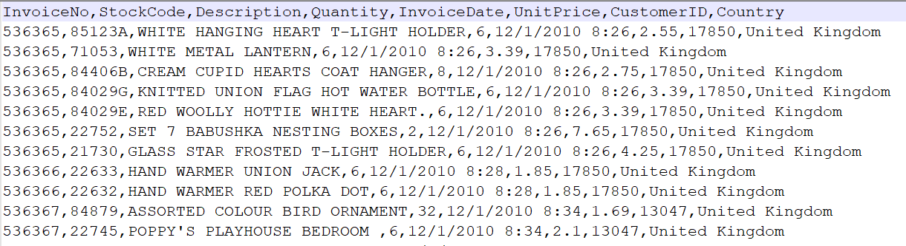

拿到数据之后, 首先需要对数据进行过滤清洗操作:  清洗目的是为了得到一个更加规整的数据

```properties
清洗需求:
	需求一: 将客户id(CustomerID) 为 0的数据过滤掉 
	需求二: 将商品描述(Description) 为空的数据过滤掉
	需求三: 将日期格式进行转换处理:
		原有数据信息: 12/1/2010 8:26
		转换为: 2010-01-12 08:26
```

相关的需求(DSL和SQL):

```properties
(1) 客户数最多的10个国家
(2) 销量最高的10个国家
(3) 各个国家的总销售额分布情况
(4) 销量最高的10个商品
(5) 商品描述的热门关键词Top300
(6) 退货订单数最多的10个国家
(7) 月销售额随时间的变化趋势
(8) 日销量随时间的变化趋势
(9) 各国的购买订单量和退货订单量的关系
(10) 商品的平均单价与销量的关系
```

#### 5.1.1 完成数据清洗过滤的操作

```properties
from pyspark import SparkContext, SparkConf
from pyspark.sql import SparkSession
import pyspark.sql.functions as F
import os

# 锁定远端python版本:
os.environ['SPARK_HOME'] = '/export/server/spark'
os.environ['PYSPARK_PYTHON'] = '/root/anaconda3/bin/python3'
os.environ['PYSPARK_DRIVER_PYTHON'] = '/root/anaconda3/bin/python3'

if __name__ == '__main__':
    print("新零售的综合案例: 数据清洗转换的操作")
    """
        需求:
            将客户id(CustomerID) 为 0的数据过滤掉 
            将商品描述(Description) 为空的数据过滤掉
	        将日期格式进行转换处理:
		        原有数据信息: 12/1/2010 8:26
		        转换为: 2010-12-01 08:26
		
		将清洗后的数据, 保存到 HDFS上 /xls/output
    """

    # 1- 创建SparkSession对象
    spark = SparkSession\
        .builder\
        .master('local[*]')\
        .appName('xls_clear')\
        .config('spark.sql.shuffle.partitions','4')\
        .getOrCreate()

    # 2- 读取外部的数据集:
    df_init = spark.read.csv(
        path='file:///export/data/workspace/ky04_pyspark_parent/_04_xls_project/data/E_Commerce_Data.csv',
        header=True,
        inferSchema=True,
        sep=','
    )

    # 3- 对数据执行处理操作
    df_clear = df_init.where("CustomerID != 0 and Description != '' and Description is not null")
    df_tran = df_clear.withColumn('InvoiceDate',F.from_unixtime(F.unix_timestamp('InvoiceDate','M/d/yyyy H:mm'),'yyyy-MM-dd HH:mm'))

    # 4- 将清洗转后的结果写出到HDFS中
    df_tran.write.csv(
        path='hdfs://node1:8020/xls/output',
        mode='overwrite',
        header=True,
        sep='|'
    )

    # 5- 关闭 spark session对象
    spark.stop()

```


#### 5.1.2 需求统计分析操作

准备工作

```properties
from pyspark import SparkContext, SparkConf
from pyspark.sql import SparkSession
import pyspark.sql.functions as F
import os

# 锁定远端python版本:
os.environ['SPARK_HOME'] = '/export/server/spark'
os.environ['PYSPARK_PYTHON'] = '/root/anaconda3/bin/python3'
os.environ['PYSPARK_DRIVER_PYTHON'] = '/root/anaconda3/bin/python3'


if __name__ == '__main__':
    print("新零售案例实现: 需求分析")

    # 1- 创建SparkSession对象
    spark = SparkSession \
        .builder \
        .master('local[*]') \
        .appName('xls_clear') \
        .config('spark.sql.shuffle.partitions', '4') \
        .getOrCreate()

    # 2- 读取外部的数据
    df_init = spark.read.csv(
        path='hdfs://node1:8020/xls/output',
        header=True,
        sep='|',
        inferSchema=True
    )
    df_init.show()
    df_init.createTempView('t1')
    # 3- 数据处理:
   
```


* (1) 客户数最多的10个国家
  * 大白话: 统计每个国家有多少个不同的客户, 按照客户数倒序排序取出前10位

```properties
def xuqiu_1():
    # SQL
    spark.sql("""
        select
            Country,
            count(distinct CustomerID) as c_cnt
        from t1
        group by Country order by c_cnt desc limit 10
    """).show()
    # DSL
    df_init.groupby('Country').agg(
        F.countDistinct('CustomerID').alias('c_cnt')
    ).orderBy('c_cnt', ascending=False).limit(10).show()

```

* (2) 销量最高的10个国家
  * 大白话:  统计每个国家销售的数量有多少, 按照销售数量倒序排序取出前10位
* (3) 各个国家的总销售额分布情况
  * 大白话:  统计每个国家的销售额
* (4) 销量最高的10个商品
  * 大白话:  统计各个商品的销售的数量, 按照销售数量进行倒序取出前10位
* (5) 商品描述的热门关键词Top20
  * 大白话: 统计每个热门关键词的数量, 按照数量进行倒序, 取出前20

```properties
def xuqiu_5():
    # SQL
    spark.sql("""
        select 
            words,
            count(1) as w_cnt
        from t1 lateral view  explode(split(Description,' ')) t2 as words 
        group by words order by w_cnt desc limit 20
    """).show()
    # DSL
    df_init.withColumn('words', F.explode(F.split('Description', ' '))).groupby('words').agg(
        F.count('words').alias('w_cnt')
    ).orderBy('w_cnt', ascending=False).limit(20).show()

```

* (6) 退货订单数最多的10个国家
  * 统计每个国家退货的订单的数量有什么, 按照订单数量进行倒序排序 取出前10位
    * 退货: 订单ID以 C开头的订单

```properties
def xuqiu_6():
    # SQL
    spark.sql("""
        select
            Country,
            count(distinct  InvoiceNo) as o_cnt
        from  t1 where InvoiceNo like 'C%'
        group by Country order by o_cnt desc limit 10
    """).show()
    # DSL
    df_init.where("InvoiceNo like 'C%'").groupby('Country').agg(
        # 在执行的时候, 部分人员的电脑会显示此API无法使用,原因: 虚拟机中没有将pyspark 3.2.0 库删除, 重新安装pyspark3.1.2库
        F.countDistinct('InvoiceNo').alias('o_cnt')
    ).orderBy('o_cnt', ascending=False).limit(10).show()
```

* (7) 月销售额随时间的变化趋势
  * 大白话: 统计每个月的销售额
* (8) 日销量随时间的变化趋势
  * 大白话: 统计每天的的销售数量
* (9) 各国的购买订单量和退货订单量的关系
  * 大白话: 统计每个国家的购买的订单总数量以及退货的订单数量

```properties
def xuqiu_9():
    # SQL
    spark.sql("""
        select
            Country,
            count(distinct  InvoiceNo) as o_total,
            count( distinct if( InvoiceNo like 'C%',InvoiceNo,NULL)) as c_total
        from t1
        group by  Country   
    """).show()
    # DSL
    df_init.groupby('Country').agg(
        F.countDistinct('InvoiceNo').alias('o_total'),
        # F.expr 主要用于填写一些相关的表达式, 比如说 if  case when
        F.countDistinct(F.expr("if(InvoiceNo like 'C%' ,InvoiceNo,NULL)")).alias('c_total')
    ).show()
```

* (10) 商品的平均单价与销量的关系
  * 大白话: 统计每个商品的 平均单价, 以及每个商品的销售数量

```properties
select   
	商品,
	avg(商品单价),
	sum(商品数量)
from  t1 group by 商品;
```


完整的代码:

```properties
from pyspark import SparkContext, SparkConf
from pyspark.sql import SparkSession
import pyspark.sql.functions as F
import os

# 锁定远端python版本:
os.environ['SPARK_HOME'] = '/export/server/spark'
os.environ['PYSPARK_PYTHON'] = '/root/anaconda3/bin/python3'
os.environ['PYSPARK_DRIVER_PYTHON'] = '/root/anaconda3/bin/python3'


def xuqiu_1():
    # SQL
    spark.sql("""
        select
            Country,
            count(distinct CustomerID) as c_cnt
        from t1
        group by Country order by c_cnt desc limit 10
    """).show()
    # DSL
    df_init.groupby('Country').agg(
        F.countDistinct('CustomerID').alias('c_cnt')
    ).orderBy('c_cnt', ascending=False).limit(10).show()


def xuqiu_5():
    # SQL
    spark.sql("""
        select 
            words,
            count(1) as w_cnt
        from t1 lateral view  explode(split(Description,' ')) t2 as words 
        group by words order by w_cnt desc limit 20
    """).show()
    # DSL
    df_init.withColumn('words', F.explode(F.split('Description', ' '))).groupby('words').agg(
        F.count('words').alias('w_cnt')
    ).orderBy('w_cnt', ascending=False).limit(20).show()


def xuqiu_6():
    # SQL
    spark.sql("""
        select
            Country,
            count(distinct  InvoiceNo) as o_cnt
        from  t1 where InvoiceNo like 'C%'
        group by Country order by o_cnt desc limit 10
    """).show()
    # DSL
    df_init.where("InvoiceNo like 'C%'").groupby('Country').agg(
        # 在执行的时候, 部分人员的电脑会显示此API无法使用,原因: 虚拟机中没有将pyspark 3.2.0 库删除, 重新安装pyspark3.1.2库
        F.countDistinct('InvoiceNo').alias('o_cnt')
    ).orderBy('o_cnt', ascending=False).limit(10).show()


def xuqiu_9():
    # SQL
    spark.sql("""
        select
            Country,
            count(distinct  InvoiceNo) as o_total,
            count( distinct if( InvoiceNo like 'C%',InvoiceNo,NULL)) as c_total
        from t1
        group by  Country   
    """).show()
    # DSL
    df_init.groupby('Country').agg(
        F.countDistinct('InvoiceNo').alias('o_total'),
        # F.expr 主要用于填写一些相关的表达式, 比如说 if  case when
        F.countDistinct(F.expr("if(InvoiceNo like 'C%' ,InvoiceNo,NULL)")).alias('c_total')
    ).show()


if __name__ == '__main__':
    print("新零售案例实现: 需求分析")

    # 1- 创建SparkSession对象
    spark = SparkSession \
        .builder \
        .master('local[*]') \
        .appName('xls_clear') \
        .config('spark.sql.shuffle.partitions', '4') \
        .getOrCreate()

    # 2- 读取外部的数据
    df_init = spark.read.csv(
        path='hdfs://node1:8020/xls/output',
        header=True,
        sep='|',
        inferSchema=True
    )
    df_init.show()
    df_init.createTempView('t1')
    # 3- 数据处理:
    # 3.1 : 需求一 : 统计每个国家有多少个不同的客户, 按照客户数倒序排序取出前10位
    #xuqiu_1()

    # 3.5: 需求 统计每个热门关键词的数量, 按照数量进行倒序, 取出前20
    #xuqiu_5()

    #3.6 需求: 统计每个国家退货的订单的数量有什么, 按照订单数量进行倒序排序 取出前10位  退货: 订单ID以 C开头的订单
    #xuqiu_6()

    # 3.9 : 统计每个国家的购买的订单总数量以及退货的订单数量
    #xuqiu_9()
```


### 5.2 在线教育案例

数据结构基本介绍:

```properties
student_id  string  学生id
recommendations string   推荐题目(题目与题目之间用逗号分隔)
textbook_id  string  教材id
grade_id  string   年级id
subject_id string  学科id
chapter_id strig   章节id
question_id string  题目id
score  integer  点击次数
answer_time  string  注册时间
ts  timestamp   时间戳


字段与字段之间的分隔符号为 \t
```

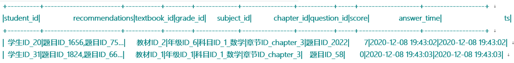

需求:

```properties
需求一: 找到TOP50热点题对应科目. 然后统计这些科目中, 分别包含几道热点题目

需求二:  找到Top20热点题对应的饿推荐题目. 然后找到推荐题目对应的科目, 并统计每个科目分别包含推荐题目的条数
```

数据存储在 资料中: eduxxx.csv


* 1- 创建一个项目并导入数据

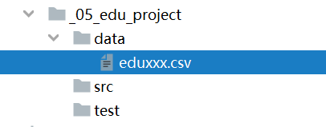

* 2- 编写代码, 完成相关的需求:

```properties
from pyspark import SparkContext, SparkConf
from pyspark.sql import SparkSession
import pyspark.sql.functions as F
import os

# 锁定远端python版本:
os.environ['SPARK_HOME'] = '/export/server/spark'
os.environ['PYSPARK_PYTHON'] = '/root/anaconda3/bin/python3'
os.environ['PYSPARK_DRIVER_PYTHON'] = '/root/anaconda3/bin/python3'

if __name__ == '__main__':
    print("教育项目的综合案例: 需求分析")

    # 1- 创建SparkSession对象
    spark = SparkSession \
        .builder \
        .master('local[*]') \
        .appName('xls_clear') \
        .config('spark.sql.shuffle.partitions', '4') \
        .getOrCreate()

    # 2- 读取外部文件的数据
    df_init = spark.read.csv(
        path='file:///export/data/workspace/ky04_pyspark_parent/_05_edu_project/data/eduxxx.csv',
        sep='\t',
        header=True,
        inferSchema=True
    )
    df_init.createTempView('t1')

    df_init.printSchema()
    df_init.show()

    # 3- 数据处理:
    # 需求一:  找到TOP50热点题对应科目. 然后统计这些科目中, 分别包含几道热点题目
    # SQL
    # 统计每个题目的点击次数, 按照总次数进行倒序, 取出前50道
    df_top50 = spark.sql("""
        select
            question_id,
            sum(score) as q_cnt
        from t1
        group by  question_id order by q_cnt desc limit 50
    """)
    df_top50.createTempView('t2_top50')
    # 根据题目的id, 找到对应题目的科目, 然后根据科目分组, 统计每个科目下有多少道
    spark.sql("""
        select
            t1.subject_id,
            count( distinct t1.question_id ) as top_cnt
        from  t2_top50 join t1 on t2_top50.question_id = t1.question_id
        group by t1.subject_id
    """).show()

    # DSL:
    df_top50 = df_init.groupby('question_id').agg(
        F.sum('score').alias('q_cnt')
    ).orderBy('q_cnt',ascending=False).limit(50)

    df_top50.join(df_init,'question_id','inner').groupby('subject_id').agg(
        F.countDistinct('question_id').alias('top_cnt')
    ).show()
```


