# day03_保险项目课程笔记

今日内容:

* ODS层相关的操作: 
  * 1- 构建ODS层库和表
  * 2- 基于Sqoop完成数据采集操作
  * 3- DS的调度操作
* 了解寿险定价规则

## 0. 完成基础数据集的导入操作(生产中基本不存在)

指的: 将数据源的数据导入到MySQL中

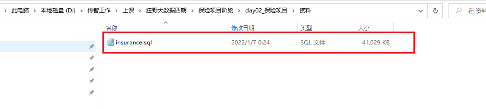

* 1- 将insurance.sql 复制到项目的 _01_mysql_data 目录中


* 2- 执行 SQL脚本

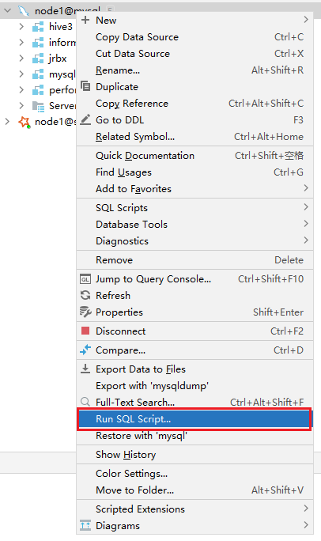

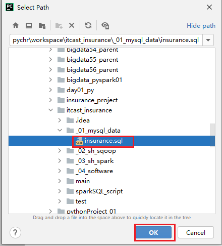


成果:

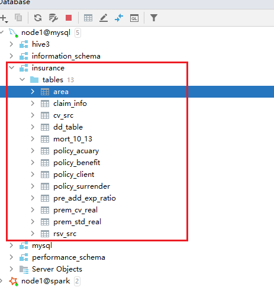

表说明:

| area              | 全国行政地区表                         |
| ----------------- | -------------------------------------- |
| claim_info        | 理赔信息表                             |
| mort_10_13        | 中国人身保险业经验生命表（2010－2013） |
| dd_table          | 行业25种重疾发生率                     |
| pre_add_exp_ratio | 预定附加费用率                         |
| prem_std_real     | 标准保费真实参照表                     |
| prem_cv_real      | 保单价值准备金毛保险费，真实参照表     |
| policy_client     | 客户信息表                             |
| policy_benefit    | 客户投保详情表                         |
| policy_surrender  | 退保记录表                             |


将mysql的数据导出到文件中操作(无需执行):

```properties
mysqldump -uroot -p  --databases insurance  >/opt/insurance/1_data_mysql/insurance.sql
```


## 1. 构建ODS层库和表

* ODS层: 数据源层(贴源层)

```properties
	作用: 对接数据源, 一般会和数据源保持相同的粒度, 数据源中有那些表, 那么我们的ODS层就需要构建有那些表, 与之一一对应

在HIVE中建表的时候, 需要思考那些点呢?  
	1- 表选择为内部表还是外部表呢? 
		判断标准:  这个表未来存储的数据, 我们是否有绝对的控制权
		
		目前项目中:  
			通过Spark SQL连接 HIVE 构建表,  由于是自己建表, 自己导入, 所以选择是内部表
	
	2- 表是否需要使用分区表还是分桶表:
		分区表: 在HIVE数仓体系中, 对数据量比较大的表,或者每天都有新增数据的表, 构架一般都是分区表
		
		
		分桶表:当需要对表数据进行采样操作的时候, 或者说每一天中数据量依然是非常庞大的, 为了能够进一步提升查询的性能, 可以选择构建
	
	
		对于当前项目: 除了投保信息表数据量比较庞大以外, 需要构建分区表, 其他的表(理赔信息, 地址信息....)数据量不是特别大, 可以不用构建分桶表, 这些表数据, 基本不会发生变更, 而且即使有变更, 那么代表这之前的结果无效, 不需要维护, 每次都是直接覆盖
		在学习环境中, 为了方便一些, 后续全部构建普通表
	

	3- 表需要使用那种存储格式 以及压缩方案
		ODS层: 一般来说都是textFile 或者ORC中
			说明: 如果后续构建表, 架子啊数据直接就是在HDFS上的普通文件, 此时一般使用TEXTFILE
			
			其他层次: 一般选择都是为ORC
		
		目前在项目中:  各个层次都为 textFile, 这样ODS层可以更加方便的进行数据采样
		
		压缩方案: 一般都是选择snappy  对于ODS层来说, 可以选择zlib压缩方案
	
```

建表操作:

* 1- 在项目的sparkSql-script目录中, 创建一个 _01_insurance_create_ods.sql 文件

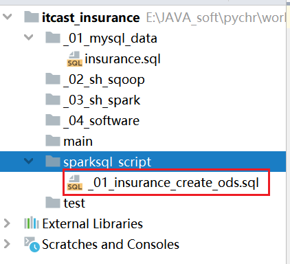

* 2- 在文件中书写建库和建表的语句

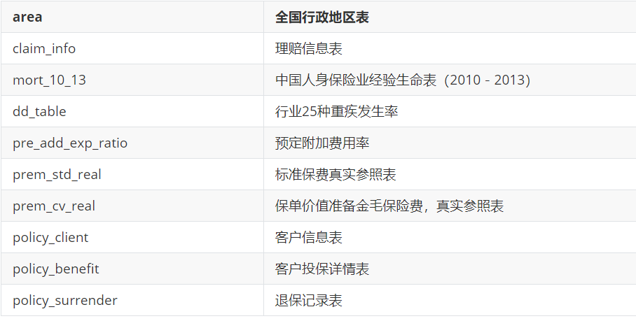

```sql
-- 构建库
drop database  if exists insurance_ods cascade ;
create database if not exists insurance_ods
    location 'hdfs://node1:8020/user/hive/warehouse/insurance_ods.db';

-- 构建表:
drop  table if exists insurance_ods.mort_10_13;
create table if not exists  insurance_ods.mort_10_13(
    age  smallint comment '年龄',
    cl1 decimal(10, 8) comment '非养老类业务一表，男（CL1）',
    cl2 decimal(10, 8) comment '非养老类业务一表，女（CL2）',
    cl3 decimal(10, 8) comment '非养老类业务二表，男（CL3）',
    cl4 decimal(10, 8) comment '非养老类业务二表，女（CL4）',
    cl5  decimal(10, 8) comment '养老类业务表，男（CL5）',
    cl6  decimal(10, 8) comment '养老类业务表，女（CL6）'
) comment '中国人身保险业经验生命表（2010－2013）'
row format delimited fields terminated by '\t';

drop table if exists insurance_ods.dd_table;
create table if not exists  insurance_ods.dd_table(
    age      smallint comment '年龄',
    male     decimal(10, 8) comment '男性的重疾发生率',
    female   decimal(10, 8) comment '女性的重疾发生率',
    k_male   decimal(10, 8) comment '男性的K值',
    k_female decimal(10, 8) comment '女性的K值'
) comment '行业25种重疾发生率'
    row format delimited fields terminated by '\t';


--ASSUMPTION 预定附加费用率 pre_add_exp_ratio
drop table if exists  insurance_ods.pre_add_exp_ratio;
create table if not exists  insurance_ods.pre_add_exp_ratio  (
                                    PPP smallint comment '缴费期',
                                    r1 decimal(10,8) comment '如果保单年度=1',
                                    r2 decimal(10,8) comment '如果保单年度=2',
                                    r3 decimal(10,8) comment '如果保单年度=3',
                                    r4 decimal(10,8) comment '如果保单年度=4',
                                    r5 decimal(10,8) comment '如果保单年度=5',
                                    r6_ decimal(10,8) comment '如果保单年度>=6',
                                    r_avg decimal(10,8) comment 'Avg',
                                    r_max decimal(10,8) comment '上限'
) comment '预定附加费用率'
 row format delimited fields terminated by '\t';


drop table if exists insurance_ods.prem_std_real;
create table if not exists  insurance_ods.prem_std_real
(
    age_buy smallint comment '年投保龄',
    sex     string comment '性别',
    ppp     smallint comment '缴费期',
    bpp     string comment '保障期',
    prem    decimal(14, 6) comment '每期交的保费',
    nbev    decimal(10,8) comment '新业务价值率（NBEV，New Business Embed Value）'
)comment '标准保费真实参照表' row format delimited fields terminated by '\t';


drop table if exists insurance_ods.prem_cv_real;
create table if not exists  insurance_ods.prem_cv_real
(
    age_buy smallint comment '年投保龄',
    sex     string comment '性别',
    ppp     smallint comment '缴费期间',
    prem_cv      decimal(15, 7) comment '保单价值准备金毛保险费(Premuim)'
)comment '保单价值准备金毛保险费，真实参照表'
    row format delimited fields terminated by '\t';


drop table if exists insurance_ods.area;
create table if not exists  insurance_ods.area
(
    id        smallint comment '编号',
    province  string comment '省份',
    city      string comment '城市',
    direction String comment '大区域'
) comment '中国省市区域表' row format delimited fields terminated by '\t';


drop table if exists insurance_ods.policy_client;
CREATE TABLE if not exists  insurance_ods.policy_client(
                              user_id STRING COMMENT '用户号',
                              name STRING COMMENT '姓名',
                              id_card STRING COMMENT '身份证号',
                              phone STRING COMMENT '手机号',
                              sex STRING COMMENT '性别',
                              birthday STRING COMMENT '出生日期',
                              province STRING COMMENT '省份',
                              city STRING COMMENT '城市',
                              direction STRING COMMENT '区域',
                              income INT COMMENT '收入'
)
    comment '客户信息表' row format delimited fields terminated by '\t';
drop table if exists insurance_ods.policy_benefit;
CREATE TABLE if not exists  insurance_ods.policy_benefit(  pol_no STRING COMMENT '保单号',
                              user_id STRING COMMENT '用户号',
                              ppp STRING COMMENT '缴费期',
                              age_buy BIGINT COMMENT '投保年龄',
                              buy_datetime STRING COMMENT '购买日期',
                              insur_name STRING COMMENT '保险名称',
                              insur_code STRING COMMENT '保险代码',
                              pol_flag smallint COMMENT '保单状态，1有效，0失效',
                              elapse_date STRING COMMENT '保单失效时间')
    comment '客户投保详情表' row format delimited fields terminated by '\t';

drop table if exists insurance_ods.claim_info;
create table if not exists  insurance_ods.claim_info
(
    pol_no string comment '保单号',
    user_id string comment '用户号',
    buy_datetime string comment '购买日期',
    insur_code string comment '保险代码',
    claim_date string comment '理赔日期',
    claim_item string comment '理赔责任',
    claim_mnt decimal(35,6) comment '理赔金额'
)  comment '理赔信息表'
    row format delimited fields terminated by '\t';

drop table if exists insurance_ods.policy_surrender;
create table  if not exists  insurance_ods.policy_surrender
(
    pol_no string comment '保单号',
    user_id string comment '用户号',
    buy_datetime string comment '投保日期',
    keep_days smallint comment '退保前的保单持有天数',
    elapse_date string comment '保单失效日期'
) comment '退保记录表'
    row format delimited fields terminated by '\t';
```

注意事项:

```properties
问题说明: 
	当基于Spark SQL在HIVE中构建表后, 发现表在HDFS上并不存在, 通过查看表的结构信息(desc formatted insurance_ods.area) 发现表的location加载地址为linux的本地路径, 这显然是不符合要求
	
原因: 
	在Spark SQL 和 HIVE集成的时候, 应该要指定一个HIVE的默认加载数据的位置参数, 但是并没有配置,导致使用spark默认值(本地路径)

解决方案: 
	方案一: 在启动Spark的thriftServer服务的时候, 添加HIVE默认加载数据位置的参数
		spark.sql.warehouse.dir=hdfs://node1:8020/user/hive/warehouse
	方案二:  在建库的时候, 需要手动指定location的地址, 这样后续建表的时候, 对应表就会放置到库目录下
	

注意:
	如果在建表的时候, 在建表语句上添加location的参数, 此表默认构建都是外部表
```


## 2. 基于sqoop完成数据采集操作

目前数据主要是存储在 PG, MySQL, Oracle中, 需要将这些数据源的数据导入到HIVE的ODS层中


简单说:  将关系型数据库的数据 导入 HIVE中, 操作技术:  Apache Sqoop

### 2.1 sqoop基本介绍

​		sqoop是apache旗下的一款用于关系型数据库和大数据生态圈之间的数据导入导出的工具, 可以从关系型数据库将数据导入到大数据生态圈中, 也可以从大数据生态圈将数据导出到关系型数据库

### 2.2 sqoop的安装操作

* 1- 需要将sqoop安装包 上传到当前项目环境的 _04_software

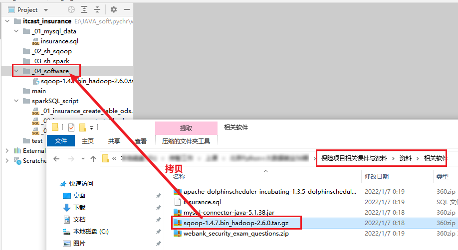

* 2- 将安装包上传到 node1的 /export/software下:

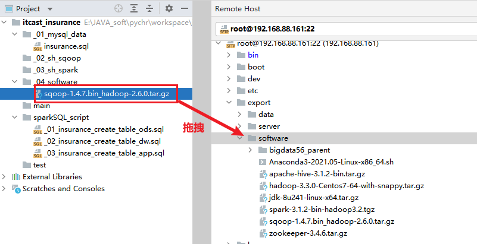

* 3- 解压 sqoop到 /export/server下

```properties
cd /export/software/
tar -zxf sqoop-1.4.7.bin_hadoop-2.6.0.tar.gz -C /export/server/
```

* 4- 创建软连接

```properties
cd /export/server
ln -s sqoop-1.4.7.bin__hadoop-2.6.0/ sqoop
```

* 5- 上传sqoop相关的额外依赖包:

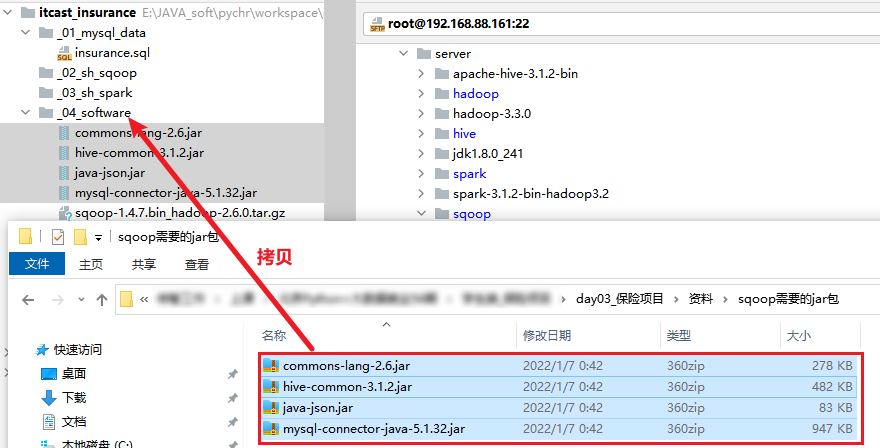

* 6- 将sqoop的依赖包上传到 sqoop的lib目录下

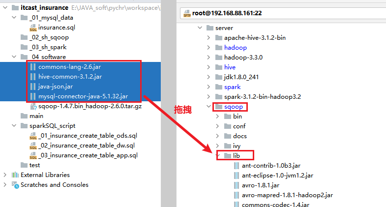

* 7- 修改sqoop的配置文件

```properties
cd /export/server/sqoop/conf
cp sqoop-env-template.sh  sqoop-env.sh

vim sqoop-env.sh

# 添加或者修改一下三行内容, 如果是修改, 一定不要忘记将前面的 # 删除了
export HADOOP_COMMON_HOME=/export/server/hadoop/
export HADOOP_MAPRED_HOME=/export/server/hadoop/
export HIVE_HOME=/export/server/hive/
```

* 8- 配置sqoop的环境变量:

```properties
vim /etc/profile

添加以下内容:

#SQOOP_HOME
export SQOOP_HOME=/export/server/sqoop
export PATH=$PATH:$SQOOP_HOME/bin


最后:
	source /etc/profile
```

* 9- 测试sqoop是否安装成功:

```shell
sqoop list-databases \
--connect jdbc:mysql://node1:3306/ \
--username root --password 123456
```

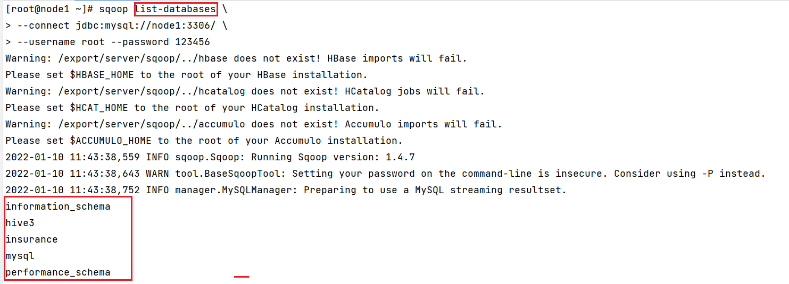

### 2.3 sqoop的基本使用

* 1- 如何查看 sqoop的帮助文档:

```
sqoop help
```

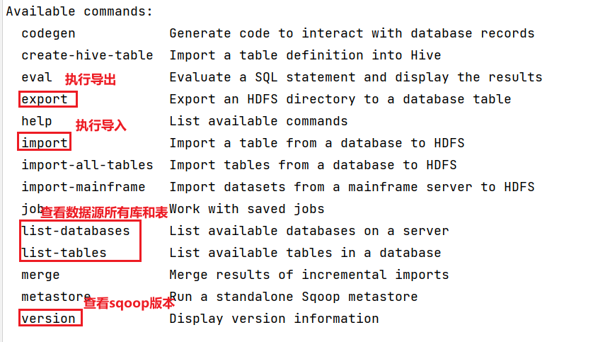

* 2-  需求: 查看某个库(insurance)下面所有的表

```properties
首先: 先确定执行此操作, 必须指定什么信息才可以
接着: 使用 help 查看对应参数信息, 从参数信息中找到对应参数信息
sqoop list-tables --help

最后编写sqoop命令:
sqoop list-tables \
--connect jdbc:mysql://node1:3306/insurance \
--username root \
--password 123456 
```

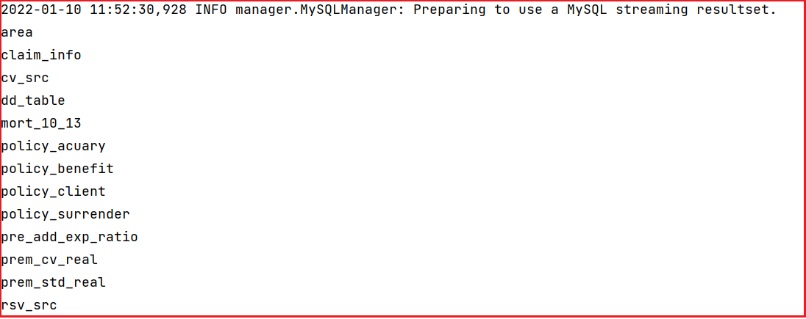


sqoop的相关参数说明:

* 1） 公用参数：数据库连接

| 参数       | 说明                   |
| ---------- | ---------------------- |
| --connect  | 连接关系型数据库的URL  |
| --help     | 打印帮助信息           |
| --driver   | JDBC的driver class     |
| --password | 连接数据库的密码       |
| --username | 连接数据库的用户名     |
| --verbose  | 在控制台打印出详细信息 |

* 2） 公用参数：import

| 参数                              | 说明                                                         |
| --------------------------------- | ------------------------------------------------------------ |
| --enclosed-by <char>              | 给字段值前加上指定的字符                                     |
| --escaped-by <char>               | 对字段中的双引号加转义符                                     |
| **--fields-terminated-by <char>** | 设定每个字段是以什么符号作为结束，默认为逗号                 |
| --lines-terminated-by <char>      | 设定每行记录之间的分隔符，默认是\n                           |
| --mysql-delimiters                | Mysql默认的分隔符设置，字段之间以逗号分隔，行之间以\n分隔，默认转义符是\，字段值以单引号包裹。 |
| --optionally-enclosed-by <char>   | 给带有双引号或单引号的字段值前后加上指定字符。               |
| **-m**                            | 指定并行处理的MapReduce任务数量。 -m不为1时，需要用split-by指定分片字段进行并行导入，尽量指定int型。 |
| -**-split-by id**                 | 如果指定-split by, 必须使用$CONDITIONS关键字, 双引号的查询语句还要加\ |
| **--query或--e** <statement>      | 将查询结果的数据导入，使用时必须伴随参--target-dir，--hcatalog-table，如果查询中有where条件，则条件后必须加上CONDITIONS关键字。 如果使用双引号包含sql，则CONDITIONS前要加上\以完成转义：\$CONDITIONS |
| **--table**                       | 指定关系数据库的表名                                         |

* 3-公用参数：

| 参数                                  | 说明                                       |
| ------------------------------------- | ------------------------------------------ |
| --input-enclosed-by <char>            | 对字段值前后加上指定字符                   |
| --input-escaped-by <char>             | 对含有转移符的字段做转义处理               |
| --input-fields-terminated-by <char>   | 字段之间的分隔符                           |
| --input-lines-terminated-by <char>    | 行之间的分隔符                             |
| --input-optionally-enclosed-by <char> | 给带有双引号或单引号的字段前后加上指定字符 |

* 4-公用参数：hive

| 参数                            | 说明                                                      |
| ------------------------------- | --------------------------------------------------------- |
| --hive-delims-replacement <arg> | 用自定义的字符串替换掉数据中的\r\n和\013 \010等字符       |
| --hive-drop-import-delims       | 在导入数据到hive时，去掉数据中的\r\n\013\010这样的字符    |
| --map-column-hive <arg>         | 生成hive表时，可以更改生成字段的数据类型                  |
| --hive-partition-key            | 创建分区，后面直接跟分区名，分区字段的默认类型为string    |
| --hive-partition-value <v>      | 导入数据时，指定某个分区的值                              |
| --hive-home <dir>               | hive的安装目录，可以通过该参数覆盖之前默认配置的目录      |
| --hive-import                   | 将数据从关系数据库中导入到hive表中                        |
| **--hive-overwrite**            | 覆盖掉在hive表中已经存在的数据                            |
| --create-hive-table             | 默认是false，即，如果目标表已经存在了，那么创建任务失败。 |
| **--hive-table**                | 后面接要创建的hive表,默认使用MySQL的表名                  |
| **--hive-database**             | 指定hive的数据库                                          |
|                                 |                                                           |

### 2.4  基于sqoop完成数据采集操作

目前在ODS层共计有10个表, 那么也就意味着, 需要基于sqoop完成10个表数据导入操作

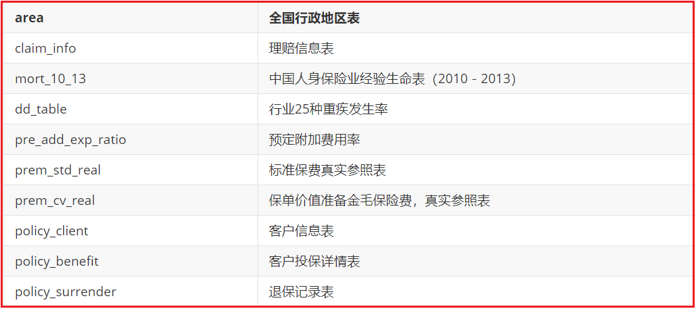

以area为例, 实现数据导入到ODS层操作: 

```shell
sqoop import \
--connect  jdbc:mysql://node1:3306/insurance \
--username root \
--password 123456 \
--table area \
--hive-import \
--hive-overwrite \
--hive-database insurance_ods \
--hive-table area \
--fields-terminated-by '\t' \
-m 1

说明: 
	--hive-import:  标记当前导入操作 为HIVE的导入
	--hive-overwrite: 表示每次导入都是采用覆盖的方式
	--fields-terminated-by: 表示的字段与字段之间的分隔符号 (在导入到HIVE, 不写也行)
	-m: 需要启动多少个mapTask来采集数据, 数值越大, 表示采集效率越高, 但是消耗的资源也高, 同时目标结果文件也会越多, 当-m的值 >1的时候, 必须添加一个参数: --split-by 
	
	--split-by 字段: 表示按照那个字段进行分隔数据,保证每个mapTask都能读取到一部分的数据 ,这个字段一般为主键, 而且默认仅支持数值类型, 如果需要支持字符串类型, 必须添加一个配置信息:  
		"-Dorg.apache.sqoop.splitter.allow_text_splitter=true"  此设置放置import的后面即可
```

增量导入, 如何做呢? 

```properties
	对于当前环境, 都是采用全量覆盖的同步的方式, 而且采用原生方式导入到HIVE的sqoop方案, 本身就支持覆盖导入, 所以后续的增量导入, 整个导入命令基本上不用做任何调整
	如果后续有仅新增同步|新增及更新的时候, 可以将--table 替换为 --query, 通过SQL筛选出上一天的数据导入到ODS对应表中即可
```


编写shell脚本, 基于shell方式来运行:

* 1- 在项目的_02_sh_sqoop目录中, 创建一个脚本:  _01_insurance_collect\_表名.sh

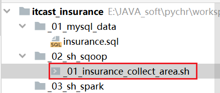

* 2- 将sqoop命令放置到脚本中即可

```shell
#!/bin/bash
/export/server/sqoop/bin/sqoop import \
--connect  jdbc:mysql://node1:3306/insurance \
--username root \
--password 123456 \
--table area \
--hive-import \
--hive-overwrite \
--hive-database insurance_ods \
--hive-table area \
--fields-terminated-by '\t' \
-m 1
```

* 3- 执行shell脚本(测试):

```properties
cd /export/data/workspace/itcast_insurance/_02_sh_sqoop/
sh _01_insurance_collect_area.sh
```


说明:

```properties
可能出现的错误: 
	在执行shell脚本的时候, 可能会报错一个找不到符号的错误, 或者显示shell语法错误问题, 但是检查整个内容, 写的完全没有任何问题

原因: 
	由于shell脚本是在windows中编写的, 而运行是在linux中运行的, windows中一些特殊格式字符和linux的字符编码是不一样的
	
	比如说: 
		回车换行符: 
			windows 回车符号为 \r\n
			linux 回车符号 \n
	
	因为符号的不同, 可能导致脚本出现一些异常情况, 导致无法运行

解决方案: 
	只需要将shell脚本中关于windows的一些特殊符号, 全部转换为linux的特殊符号即可
	
如何做呢? 
	下载一个专门用于转换的插件:  yum -y install dos2unix
	
	下载后, 对shell脚本执行:  dos2unix 脚本文件
```

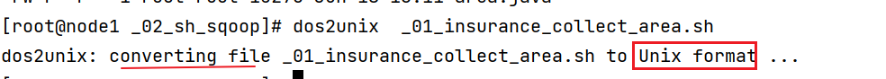


剩余九个脚本, 需要大家可以尝试完成了


可能还有一个小错误: 

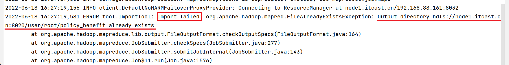

```properties
错误内容:
	对应输出目录以存在

原因: 
	通过原生方式导入到HIVE, 整个sqoop在导入的时候, 是分为三步: 
		第一步: 先将数据导入到HDFS的 /user/root/表名/ 目录下
		第二步: 从这个目录将对应表的数据移动到 hive表所加载数据的目录下
		第三步: 将原有目录删除即可
	
	如果第一步成功了, 但是后续的步骤失败了, 或者第一步在输出的时候失败了, 都会导致对应输出目录已存在, 下次在导入的时候无法导入了

解决方案: 
	将对应输出目录进行删除即可
```


## 3. DolphinSchedule任务调度

### 3.1 DS基本介绍

​		Apache DolphinScheduler是一个分布式、去中心化、易扩展的可视化DAG工作流任务调度系统

官网地址: https://dolphinscheduler.apache.org/zh-cn/

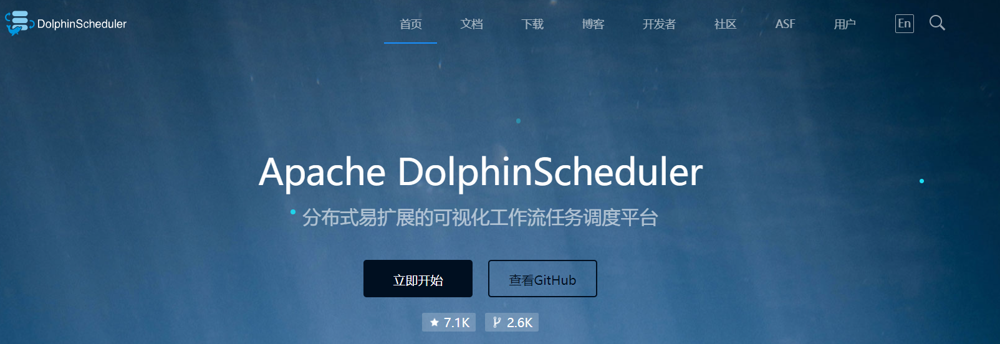

### 3.2 安装DS

* 1- 将提供的DS的安装包拷贝到项目环境的_04_software 目录下


* 2- 将安装包拖拽到node1的 /export/software下


* 3- 进行解压操作, 并配置软连接

```properties
cd /export/software
tar -zxf apache-dolphinscheduler-incubating-1.3.5-dolphinscheduler-bin.tar.gz -C /export/server/

cd /export/server/
ln -s apache-dolphinscheduler-incubating-1.3.5-dolphinscheduler-bin/ dolphinscheduler
```

* 4- 添加mysql的驱动包到 DS的lib目录下


* 5- 修改DS的初始数据源的配置文件

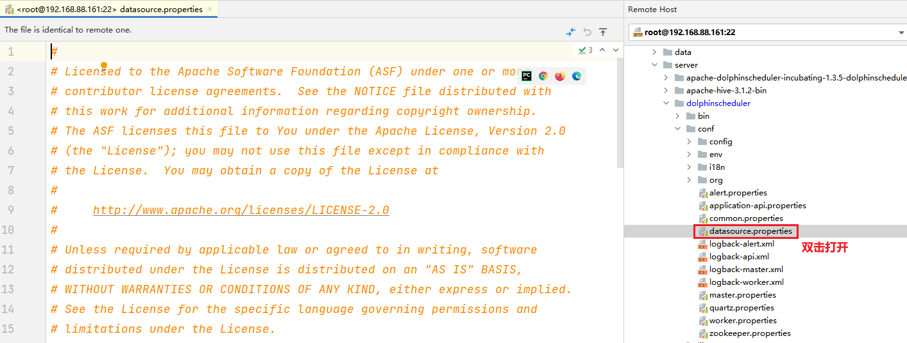

```properties
修改以下内容:(看好中文说明. 文档中只显示需要调整的内容, 如果文档中没有写的, 保持原样不动)
# 此部分添加 # 注释
# postgresql
#spring.datasource.driver-class-name=org.postgresql.Driver
#spring.datasource.url=jdbc:postgresql://localhost:5432/dolphinscheduler
#spring.datasource.username=test
#spring.datasource.password=test

# 新增的内容
# mysql
spring.datasource.driver-class-name=com.mysql.jdbc.Driver
spring.datasource.url=jdbc:mysql://192.168.88.161:3306/dolphinscheduler?characterEncoding=UTF-8&allowMultiQueries=true
spring.datasource.username=root
spring.datasource.password=123456


说明: 
	请注意, 在复制的时候能不能不把中文复制进去?  不能
```

处理后内容:

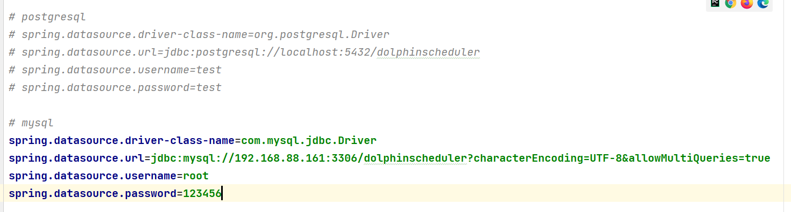

然后上传保存


* 6- 进入mysql的客户端, 执行以下代码:

```properties
CREATE DATABASE dolphinscheduler DEFAULT CHARACTER SET utf8 DEFAULT COLLATE utf8_general_ci;
```

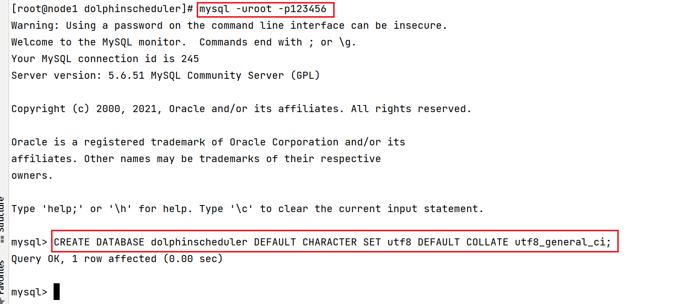

* 7- 初始化元数据表:

```
cd /export/server/dolphinscheduler
sh script/create-dolphinscheduler.sh
```

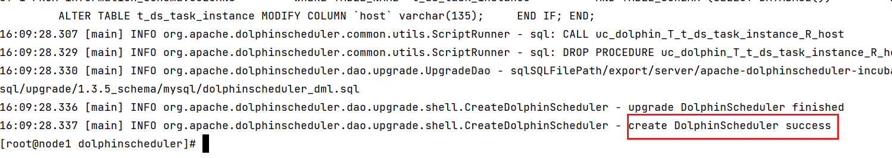

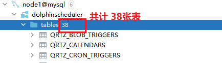

* 8- 修改 conf/env/dolphinscheduler_env.sh 环境变量


````properties
# 建议: 将文件中原有所有export删除, 然后将以下内容拷贝进去(特别注意对应路径是否正确)
export HADOOP_HOME=/export/server/hadoop
export HADOOP_CONF_DIR=/export/server/hadoop/etc/hadoop
export SPARK_HOME1=/export/server/spark
#export SPARK_HOME2=/opt/soft/spark2
export PYTHON_HOME=/root/anaconda3/bin/python
export JAVA_HOME=/export/server/jdk1.8.0_241
export HIVE_HOME=/export/server/hive
#export FLINK_HOME=/opt/soft/flink
#export DATAX_HOME=/opt/soft/datax/bin/datax.py
export SQOOP_HOME=/export/server/sqoop

export PATH=$HADOOP_HOME/bin:$HADOOP_CONF_DIR:$PYTHON_HOME:$SPARK_HOME1/bin:$JAVA_HOME/bin:$HIVE_HOME/bin:$SQOOP_HOME/bin:$PATH
````


* 9- 修改 conf/config/install_config.conf (安装配置文件)
  * 说明: 目前DS还没有安装, 仅仅是在配置DS的安装配置文件


```properties
说明: 将配置文件对应配置信息, 改为以下的内容, 与以下内容一定一定要保持一致, 以下不存在的配置, 保持原样不动

dbhost="192.168.88.161:3306"
username="root"
password="123456"
zkQuorum="192.168.88.161:2181,192.168.88.162:2181,192.168.88.163:2181"
installPath="/export/server/dolphinscheduler_install"
deployUser="root"
#mailServerHost="smtp.exmail.qq.com"
#mailServerPort="25"
#mailSender="xxxxxxxxxx"
#mailUser="xxxxxxxxxx"
#mailPassword="xxxxxxxxxx"
#starttlsEnable="true"
#sslEnable="false"
#sslTrust="smtp.exmail.qq.com"
resourceStorageType="HDFS"
defaultFS="hdfs://192.168.88.161:8020"
#yarnHaIps="192.168.xx.xx,192.168.xx.xx"
singleYarnIp="192.168.88.161"
#hdfsRootUser="hdfs"
ips="192.168.88.161,192.168.88.162,192.168.88.163"
masters="192.168.88.161,192.168.88.162"
workers="192.168.88.161,192.168.88.162,192.168.88.163"
alertServer="192.168.88.163"
apiServers="192.168.88.161"
```


-----

* 10 - 启动 zookeeper集群:

```properties
注意: 三个节点都要执行
cd /export/server/zookeeper/bin/
./zkServer.sh start


三个节点启动后(三个都启动完成后), 需要查看zk的状态:
./zkServer.sh status

必须看到: 两个follower 和 一个 leader
```

* 11- 触发安装并启动

```properties
cd /export/server/dolphinscheduler
sh install.sh


注意:
	此操作, 会进行DS的安装操作, 安装完成后, 自动将DS进行启动  
	此操作, 仅需要第一次执行一次即可, 后续启动DS会有专门的命令的
```

安装后, 需要查看各个节点:

node1:

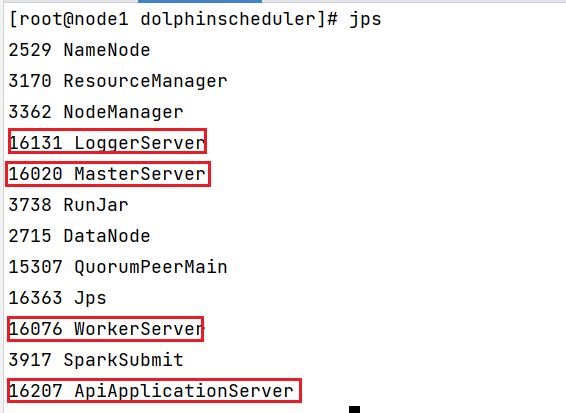

node2:


node3:

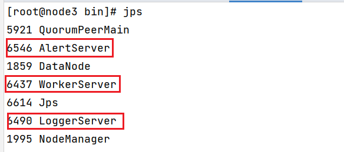


----

**后续的启动**, 是专门有命令来处理的:

```shell
cd /export/server/dolphinscheduler_install

一键停止集群所有服务
sh ./bin/stop-all.sh
一键开启集群所有服务
sh ./bin/start-all.sh

单独停止和启动命令:
sh ./bin/dolphinscheduler-daemon.sh start master-server
sh ./bin/dolphinscheduler-daemon.sh stop master-server

sh ./bin/dolphinscheduler-daemon.sh start worker-server
sh ./bin/dolphinscheduler-daemon.sh stop worker-server

sh ./bin/dolphinscheduler-daemon.sh start api-server
sh ./bin/dolphinscheduler-daemon.sh stop api-server

sh ./bin/dolphinscheduler-daemon.sh start logger-server
sh ./bin/dolphinscheduler-daemon.sh stop logger-server

sh ./bin/dolphinscheduler-daemon.sh start alert-server
sh ./bin/dolphinscheduler-daemon.sh stop alert-server
```


访问DS: http://192.168.88.161:12345/dolphinscheduler

用户名: admin

密码: dolphinscheduler123


### 3.3 DS架构说明

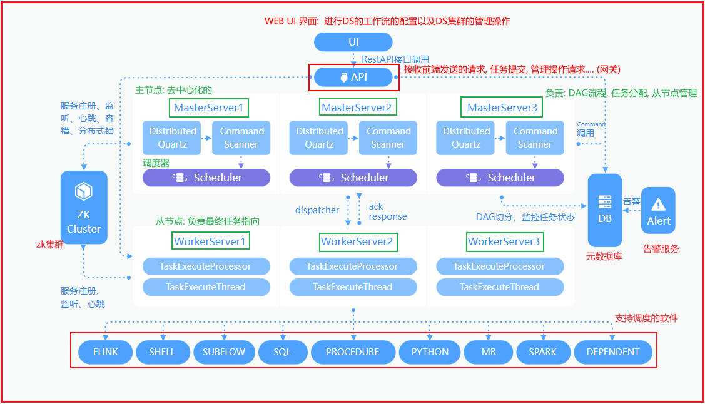

````properties
	通过UI进行工作流的配置操作, 配置完成后, 将其提交执行, 此时执行请求会被API服务接收到, 接收到后, 随机选择一台Master来完成任务的处理(DAG, 任务分配, 资源处理...)(底层最终是有对应schedule具体完成),完成分配后, 将对应执行的任务交给对应worker(从节点)来执行, worker对应有一个logger服务进行日志的记录, 在执行过程中, 通过logger实时查看执行日志, 当执行完成后, 通知Master, Master进行状态变更,同时告警服务实时监控状态, 一旦发现状态出现异常, 会立即根据所匹配的告警方案, 通知给相关的人员
````


### 3.4 DS的基本使用

#### 3.4.1 队列


#### 3.4.2 租户


#### 3.4.3 登录用户

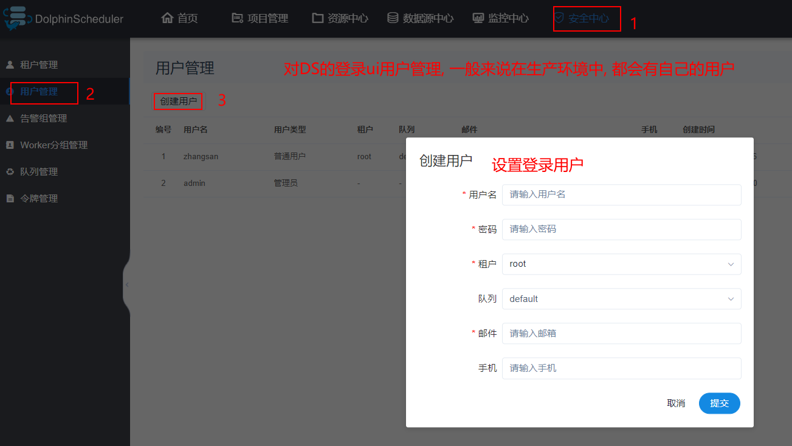

#### 3.4.4 告警组

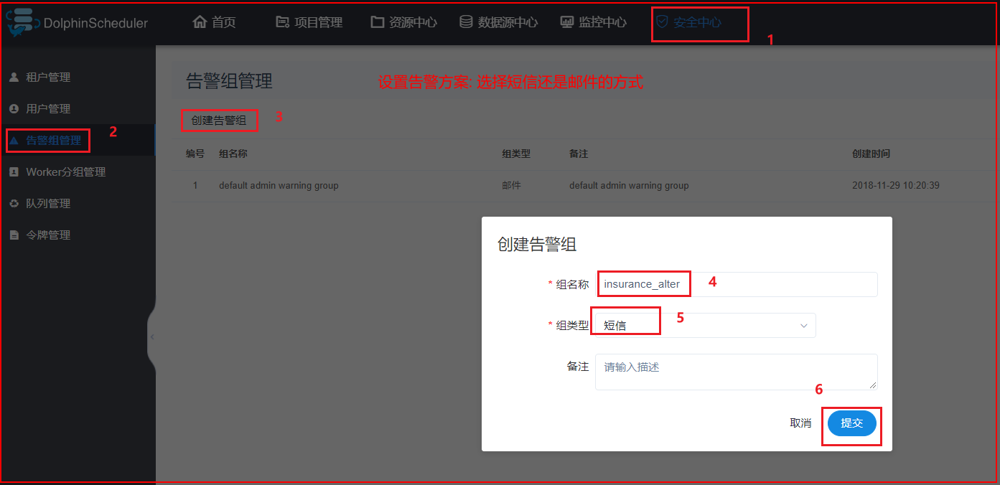

#### 3.4.5 worker分组说明

说明:

```properties
	worker分组主要是用于后续在进行工作流执行的时候, 可以指定worker分组, 这样Master在进行任务分配的时候, 会从worker分组中选择一些worker节点来完成任务的执行, 在实际生产中, 此分组可能会有多个, 根据任务大小来选择对应分组来干活.
```

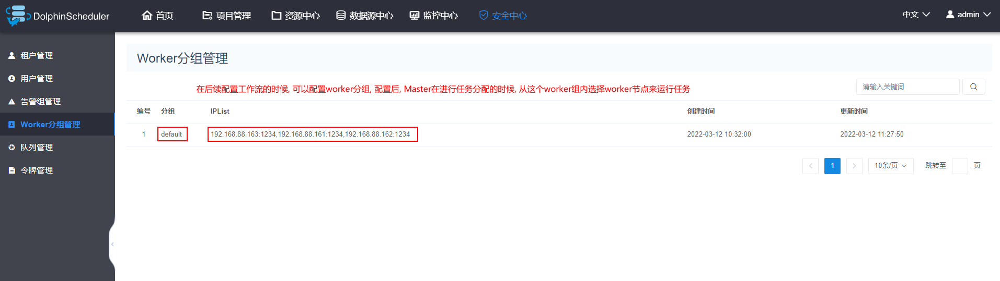

#### 3.4.6 创建项目编写工作流


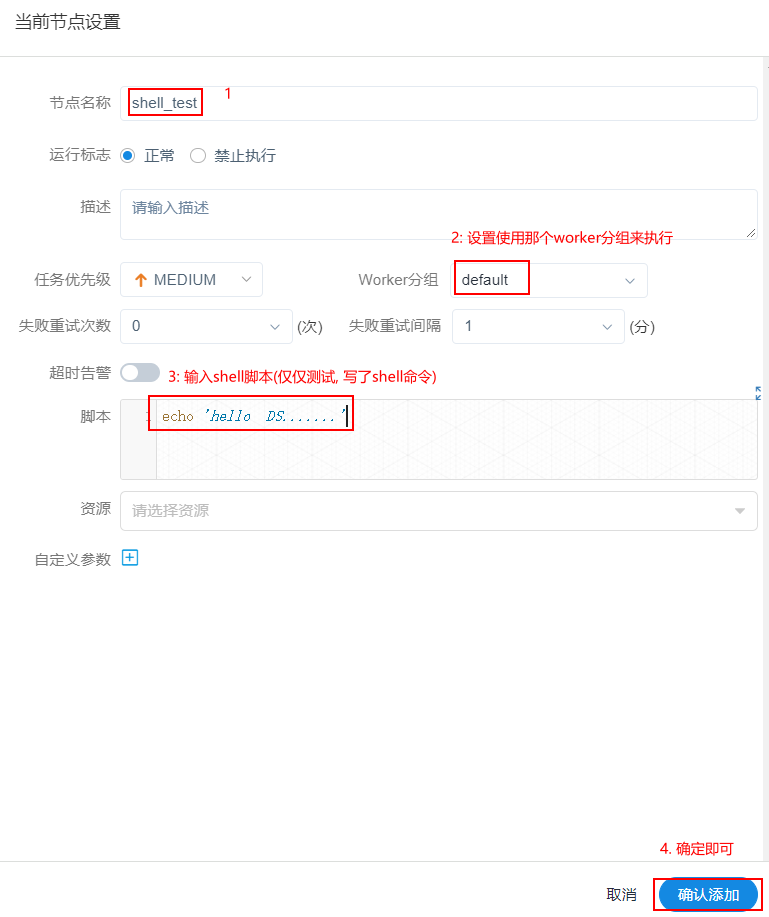

以此可以再次创建一个shell的工作流节点, 创建后可以配置串行执行:

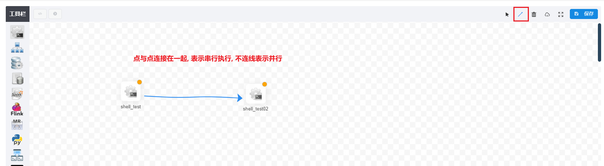


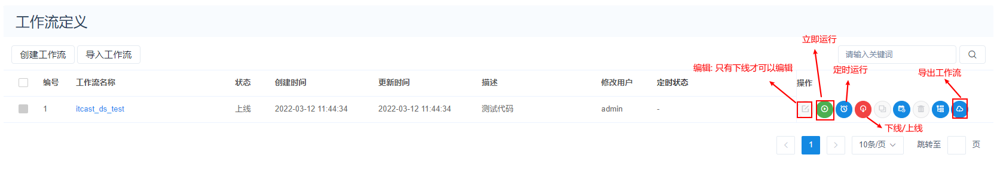


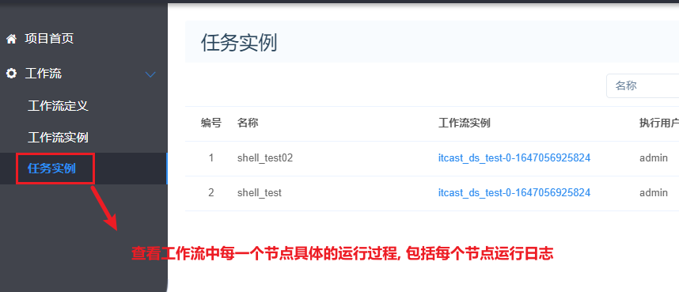


### 3.5 基于DS完成定时数据采集

​		目前共有10个shell脚本需要配置运行操作, 要求将这10个shell脚本按照编号, 依次来运行操作


#### 3.5.1 准备工作

​		目前DS是一个集群, 而且worker组包含三个节点, 当shell脚本在执行的时候, 有可能 node1  node2 或者 node3都有可能分配到任务来运行

```properties
	shell脚本中放置是sqoop的脚本, 也就说要想运行shell脚本, 必须保证对应节点上, 必须得有sqoop, 否则无法运行的
	
	同时 既然要在 node2 和 node3上运行shell脚本, 意味着 shell脚本需要在node2和node3也要放置一份 否则无法加载到这个shell脚本 当然也可以将其放置到HDFS中, 运行的时候, 从HDFS中通过 get命令下载到本地运行
```

* 1- 将node1安装好的SQOOP发送给 node2 和 node3即可

```properties
node1执行:
	cd /export/server
	
	scp -r sqoop-1.4.7.bin__hadoop-2.6.0/ node2:$PWD
	scp -r sqoop-1.4.7.bin__hadoop-2.6.0/ node3:$PWD


node2 和 node3 分别执行: 创建软连接
	ln -s sqoop-1.4.7.bin__hadoop-2.6.0/ sqoop
```

* 2- 在node1节点上创建一个目录:  /export/data/insurance_shell, 将sqoop脚本负责到这个目录下

```properties
mkdir -p /export/data/insurance_shell
# 注意: 前面的路径地址有可能与大家不一致, 特别注意字母大小写(关注细节, 不要认为一定一致)
cp /export/data/workspace/itcast_insurance/_02_sh_sqoop/*.sh /export/data/insurance_shell/
```

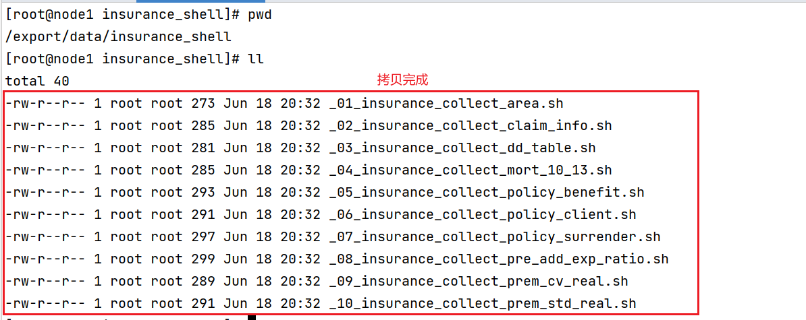

* 3- 将这个insurance_shell目录发送给 node2和node3下, 保证三个节点都在同一目录下

```properties
node1执行: 
	cd /export/data
	scp -r insurance_shell/ node2:$PWD
	scp -r insurance_shell/ node3:$PWD
```

* 4- 在 node2 和 node3 安装 dos2unix

```
yum -y install dos2unix
```


#### 3.5.2 配置工作流

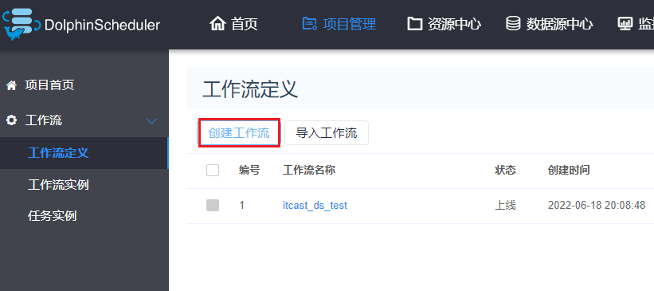

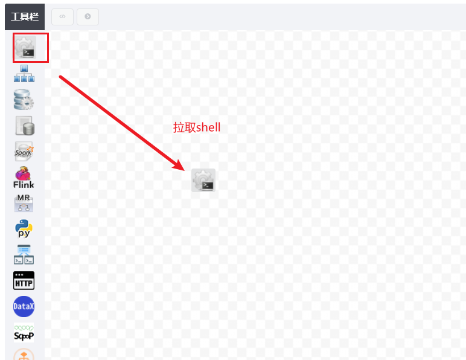

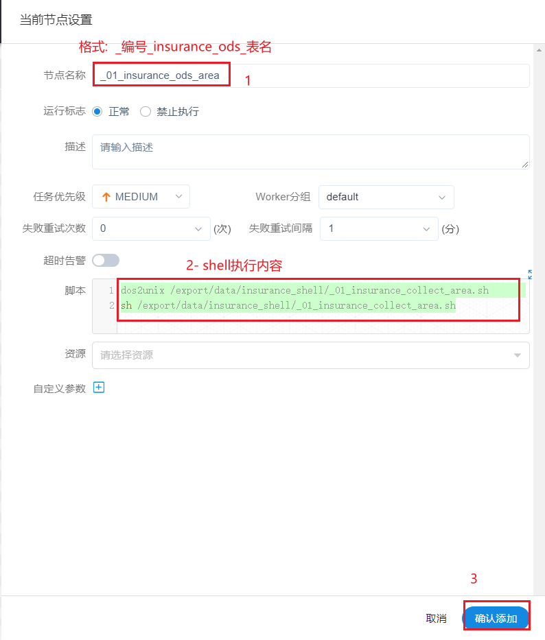

复制配置好的节点: 共计复制出10个, 并将其连好线

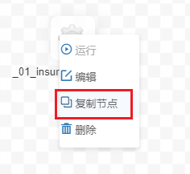

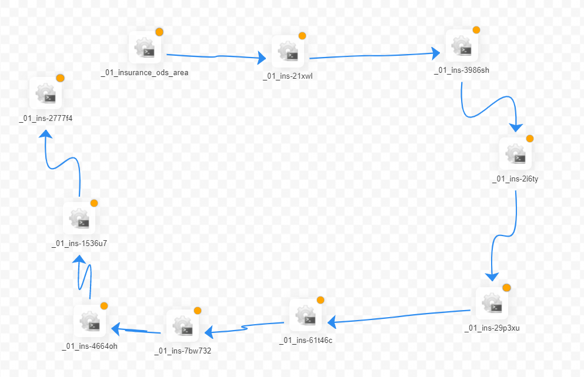


分别修改每一个节点即可

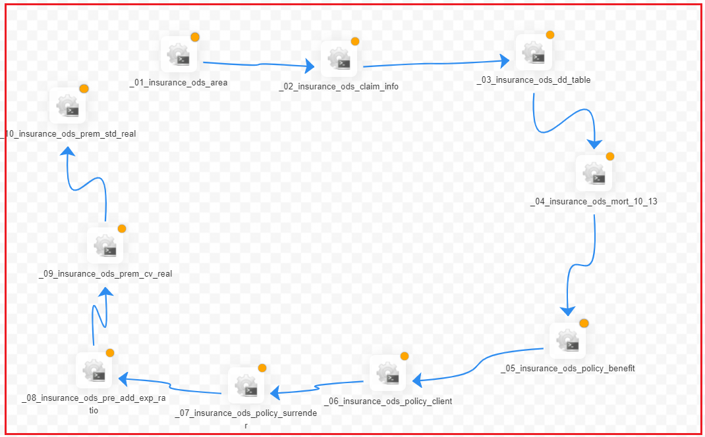


保存工作流:

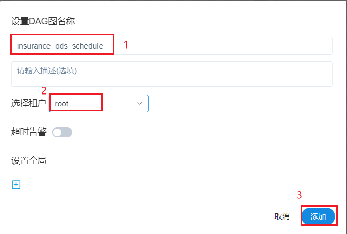

工作流上线, 立即执行/定时执行 即可

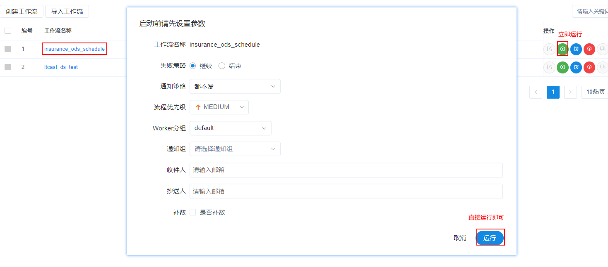

定时运行:

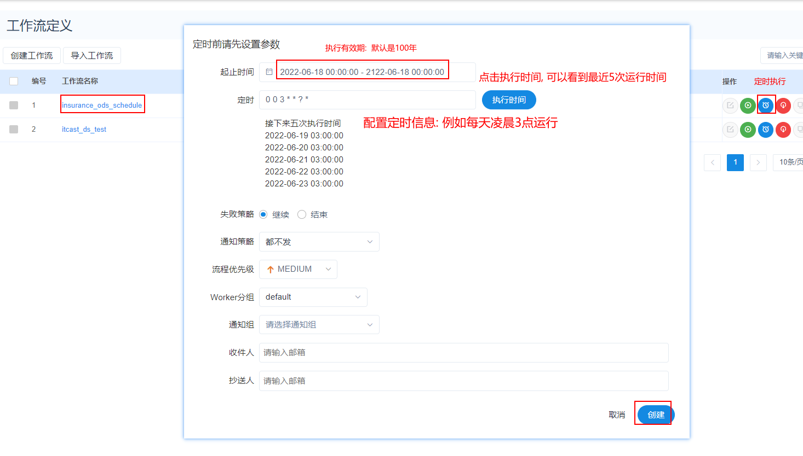

​		注意: 如果在运行过程中,只能偶尔的跑成功一二个, 或者一个都跑不成功, 报错都是资源错误, 建议单独运行每一个shell即可, 不要基于DS运行了. 知道如何配置即可

## 4. 了解寿险定价规则

### 4.1 定价精算控制循环流程

​		整个保险产品, 在定价的时候, 并不是一次性成型的, 精算师需要将各种情况全部的考虑进入, 然后核算出一个保费的结果, 然后根据保费结果进行利润测算, 如果没有达到利润目标, 需要重新核算, 直到达到利润目标, 并且还要在市场上有一定的竞争力


### 4.2 寿险定价原则

* 1- 充足性原则:  费率(保费)充足 , 指保险费率足够用于保单所承诺的赔付或给付、退保金、费用、税金、红利等各项支出，同时保险公司还要获取合理的利润。

* 2- 合理性原则: 费率合理，指保险费率不能过高。

  ​	 如果保险费率过高，会损害被保险人的利益，保险人会获得太多的非正常经营性利润。

* 3- 公平性原则: 对出险概率高、赔付成本高的被保险人收取更多的保险费，反之亦然。

### 4.3 寿险定价假设

* 死亡率: 一般来说，死亡率随着年龄而提高，同一年龄上男性的死亡率高于女性 ，一般女性的死亡率为设置为男性死亡率的50%~80%。

* 失效率:  失效，指各种原因导致的保单不再有效、自愿退保、中途中止等情况
  * 保单年度。对均衡保费保单，最初几年，失效率随着保单年度的增加而迅速降低，5~10年后，失效率降低的速度变得非常缓慢，基本呈现平衡状态。
  * 投保年龄。十几到二十几岁的投保保单失效率较高，30岁以上的被保险人随年龄增加，保单率会降低。

* 利率:  利率假设可以看做是保单持有人未来的收益率。寿险公司假设的利率能否实现，要看其未来投资收益。
* 费用:  保单从出售到全部赔付、满期、退保或失效，要经历核保、出单、保单维持、理赔等环节，每一环节都需要消耗成本，这些成本源于保险人从投保人那里收取的保费和公司累积资产的投资收益。

### 4.4 传统的定价方法的介绍

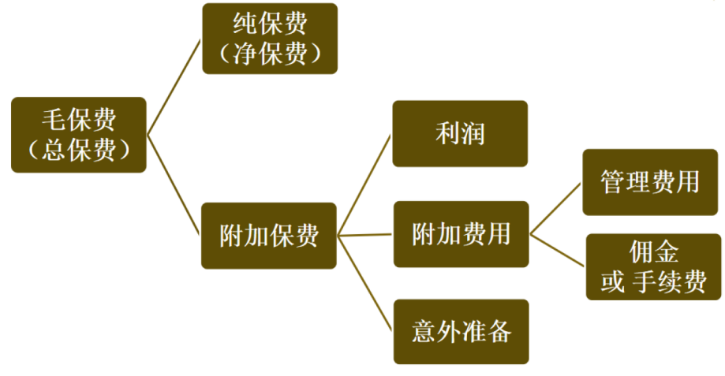

