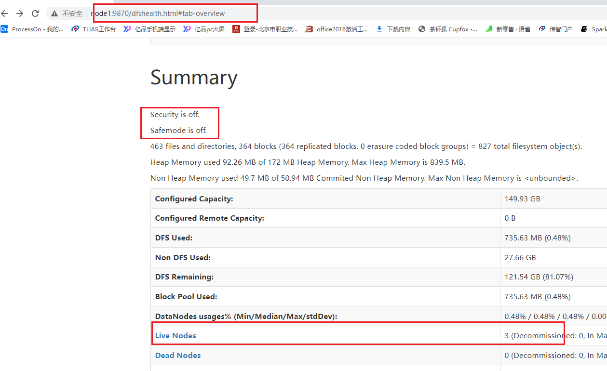
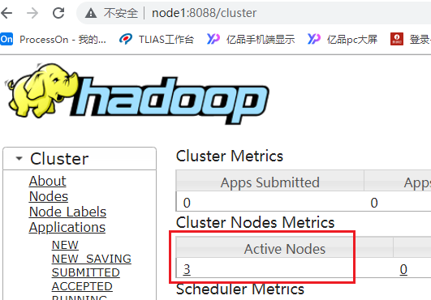

# day04_保险项目课程笔记

今日内容: 

* 1- 在Spark 如何生成多行序列
* 2- 如何快速生成一张表数据
* 3- 回顾窗口函数
* 4- 如何进行横向迭代计算操作
* 5- 如何进行纵向迭代计算操作


## 0- 如何启动项目环境

* 1- 启动Hadoop集群:

```properties
在node1节点上执行:
	start-all.sh

如何校验Hadoop集群启动成功了?  

步骤一: 通过 jps 查看各个节点是否启动hadoop的相关的进程
node1:
	NodeManager
	DataNode
	NameNode
	ResourceManager

node2: 
	DataNode
	NodeManager
	SecondaryNameNode

node3: 
	DataNode
	NodeManager

步骤二: 需要打开9870 和  8088界面, 分别查看HDFS集群 和 Yarn启动是否启动
```





* 2- 启动 hive的metastore服务:

```properties
node1执行: 
	cd /export/server/hive/bin
	nohup ./hive --service metastore &

校验: 等待一分钟后, 通过 jps -m 查看 是否存在metastore的 runJar进程
```

* 3- 启动Spark的thriftServer服务:

```properties
node1执行: 
cd /export/server/spark/sbin/

./start-thriftserver.sh \
--hiveconf hive.server2.thrift.port=10000 \
--hiveconf hive.server2.thrift.bind.host=node1.itcast.cn \
--master local[2]

校验:  通过 jps查看 有一个sparkSubmit进程启动了  同时通过pycharm的database(datagrip) 连接spark
```


可选项: spark的日志服务器 和 yarn的日志服务器


## 1- 如何生成多行的序列

spark sql 提供的所有的函数的文档:  https://spark.apache.org/docs/3.1.2/api/sql/index.html


需求: 请生成一列数据, 内存为 1 , 2 , 3 , 4 ,5  

```properties
 -- 需求: 请生成一列数据, 内存为 1 , 2 , 3 , 4 ,5
 select  explode(split('1,2,3,4,5', ',')) as line;

-- 需求二:  请生成一列数据, 要求为  1~100

select explode(sequence(1,100));

说明:
	explode爆炸函数的参数只支持array 或者 map, 主要用于将一列的数据, 炸裂为多行数据, 用于进行列转行操作
	sequence(start, stop, step) :  生成一个从开始到结束(包头包尾)的元素数组, 根据step步长进行递增或递减
	参数1: 起始值
	参数2: 结束值
	参数3: 步长
```


## 2- 如何快速生成一张表数据

```properties
-- 需求: 生成一个两行两列的数据, 第一行放置 男  M  第二行放置 女 F
-- 用于快速生成表数据的函数: stack(N,数据内容....)
-- 其中 N 表示需要生成多少行数据
-- 数据内容: 用于设置每一行数据放置的内容, 函数内部会自动将数据平均分为N份, 放置到每一行中, 如果有分配不均的, 默认为NULL
SELECT stack(2,'男','M','女','F');

-- 例如: 生成 二行一列的数据, 分别 放置 M  F
SELECT  stack(2,'M','F') AS SEX;

-- 思考: 如何将生成好的数据结果保存起来,作为一个表使用? 你能想出多少种方案呢?
-- 方式一:  可以通过子查询的方式, 将SQL作为另一个SQL的结果来使用
select
    *
from (SELECT  stack(2,'M','F') AS SEX) as t1;

-- 方式二: with as 的方式  (这是一种子查询的变种)
with t2 as (
    SELECT  stack(2,'M','F') AS SEX
)
select * from t2;

-- 方式三: 通过构建表的形式
create table if not exists t3 as
SELECT  stack(2,'M','F') AS SEX;

select * from  t3;

-- 方式四: 通过构建视图的方式
-- 永久视图:
create or replace view  t4 as
SELECT  stack(2,'M','F') AS SEX;

select * from t4;

-- 临时视图:
create or replace temporary view  t5 as
SELECT  stack(2,'M','F') AS SEX;

select * from t5;


视图和表的区别: 
	从使用角度: 完成可以将视图看做是表即可
	
	本质区别:  视图是不保存数据, 仅仅保存计算的SQL, 而表保存的是数据
	
	视图只有在使用的时候, 视图会重新按照SQL进行计算, 而表直接读取数据
	
	
	建议:  如果是中间临时保存, 能用视图, 建议优先选择视图的方式 (尤其在进行不断迭代计算操作)

-- 方式五:  基于缓存表的方式来构建, 将数据放置到缓存中  仅在当前会话可用
cache table t6 as
SELECT  stack(2,'M','F') AS SEX;

默认缓存级别: 内存 + 磁盘  1副本

如何设置其他的隔离级别呢?  
缓存表的使用语法:
	CACHE [ LAZY ] TABLE table_identifier
    	[ OPTIONS ( 'storageLevel' [ = ] value ) ] [ [ AS ] query ]
    
    作用: 
    	可以将一个表数据直接放置到内存中: 
        	cache [ LAZY ] table 对应需要缓存的表  [ OPTIONS ( 'storageLevel' [ = ] value ) ]
        
        可以将一个SQL的查询的结果, 直接缓存起来:
        	cache [ LAZY ] table t6 as [ OPTIONS ( 'storageLevel' [ = ] value ) ]
				SELECT  stack(2,'M','F') AS SEX;
支持的缓存级别:
    DISK_ONLY
    DISK_ONLY_2
    DISK_ONLY_3
    MEMORY_ONLY
    MEMORY_ONLY_2
    MEMORY_ONLY_SER
    MEMORY_ONLY_SER_2
    MEMORY_AND_DISK (默认)
    MEMORY_AND_DISK_2
    MEMORY_AND_DISK_SER
    MEMORY_AND_DISK_SER_2
    OFF_HEAP
```


## 3- 回顾窗口函数

```sql
-- 回顾窗口函数:
/*
    格式:
        分析函数 over(partition by xxx order by xxx [desc|asc] [rows between xx and xx] )

    分析函数:
        1- row_number() rank() dense_rank() ntile()

        2- 与聚合函数配合使用: sum() avg() count() max() min()

        3- lag() lead() first_value() last_value()
 */

-- 1- 初始化数据集:
create or replace temporary  view  t1 (cid,name,score,dateStr) as
    values ('c01','张三',90,'2020-01-02'),
           ('c01','李四',90,'2020-01-02'),
           ('c01','王五',100,'2020-01-05'),
           ('c01','赵六',86,'2020-02-06'),
           ('c01','田七',79,'2020-03-01'),
           ('c02','周八',92,'2020-01-02'),
           ('c02','李九',78,'2020-01-05'),
           ('c02','老张',82,'2020-01-01');
-- 1- row_number() rank() dense_rank() ntile()
select
    cid, name, score, dateStr,
    row_number() over (partition by cid order by dateStr ) as rn1,
    rank() over (partition by cid order by dateStr ) as rn2,
    dense_rank() over (partition by cid order by dateStr ) as rn3,
    ntile(3) over (partition by cid order by dateStr ) as rn4
from  t1;

/*
    row_number() rank() dense_rank() ntile()

    共同点: 都是给每个窗口进行打标记的操作, 都是从1开始打标记

    区别:
        row_number : 不关心数据重复(排序字段)问题 , 从1开始打标记, 逐行递增
        rank: 关系数据重复的问题, 相同数据打上相同的标记, 但是会占用后续的序号, 逐行递增
            例如:  1 ,2,2,4,5
        dense_rank: 关系数据重复的问题, 相同数据打上相同的标记, 不会占用后续的序号, 逐行递增
            例如:  1,2,2,3,4
        ntile(N): 用于对每个窗口内数据划分为等份的N份, 每一份会打上相同标记

    应用场景:
        row_number() rank() dense_rank()  主要的应用方向为求 分组TOPN的问题
            例如: 求每组内成绩最高的前三名学生

        ntile(N) : 主要的应用方向为 求几分之几的问题
            例如: 计算咱们班级男生 女生各身高前二分之一的人员有那些

*/

-- 2- 与聚合函数配合使用: sum() avg() count() max() min()
select
    cid, name, score, dateStr,
    sum(score) over(partition by cid  order by dateStr ) rn1,
    sum(score) over(partition by cid  order by dateStr rows between unbounded preceding and current row ) rn2,
    sum(score) over(partition by cid  order by dateStr rows between current row and unbounded following ) rn3,
    sum(score) over(partition by cid  order by dateStr rows between  2 preceding and 2 following) rn4,
    sum(score) over(partition by cid  order by dateStr rows between  unbounded preceding and unbounded following) rn5,
    sum(score) over(partition by cid) rb6
from  t1;
/*
    与聚合函数配合使用: sum() avg() count() max() min()

    默认情况下: 可以进行逐级聚合求值(例如: 求和), 如果遇到排序的字段有重复值, 会将重复值直接合并在一起计算

    如果只想让其逐级计算呢?   引入 rows between 锁定窗口范围
        范围格式:
                N preceding    : 向前 N 行
                N following    : 向后 N 行

                N取值:   可以是unbounded 也可以使用具体的数据
        关键词:
            unbounded: 边界的意思

    如果窗口中没有设置order by, 聚合操作会直接对整个窗口所有数据进行全部聚合, 相当于 将整个窗户全部打开(从窗口开始边界到结束边界)

    应用场景:  主要是用于进行逐级计算操作, 或者 级联计算的操作
        例如: 求今年累计的总金额, 要求看到截止每个月的结果
 */

-- 3- lag() lead() first_value() last_value()
select
    cid, name, score, dateStr,
    lag(score,1,0) over (partition by cid order by dateStr) as rn1,
    lag(score,2) over (partition by cid order by dateStr) as rn2,
    lead(score,1,0) over (partition by cid order by  dateStr) as rn3,
    first_value(score) over (partition by cid order by  dateStr) as rn4,
    last_value(score) over (partition by cid order by dateStr rows between  unbounded preceding and unbounded following) as rn5
from  t1;
/*
    lag(字段, N,defaultValue):  将当前行和之前第N行放置到同一行中, 如果没有, 设置为默认值. 如果没有默认值, 即为null
    lead(字段, N,defaultValue):  将当前行和之后第N行放置到同一行中, 如果没有, 设置为默认值. 如果没有默认值, 即为null

    first_value(字段):  将当前行 和 窗口的第一行放置同一行中
    last_value(字段):   将当前行和窗口的最后一行放置同一行中, 但是不能添加order by, 否则就会将当前行和当前行放置在一起
        如果既想排序, 又想和最后一行进行比较, 需要使用 rows between 来锁定范围
                rows between  unbounded preceding and unbounded following

    注意:
        lag 和 lead 必须使用order by 否则直接报错了

    应用场景:
        用于将当前行和之前或者之后的行进行比较操作

        例如: 在计算每月和上个月(或者和第一个月)的转换率(形成漏斗模型)
*/


```


