# day06_保险项目课程笔记

今日内容:

* 1- 完成保费参数因子计算操作
* 2- 完成保费计算操作

## 1- 计算保费参数因子

### 1.1 需求说明

* 需求一:  根据性别, 投保年龄, 缴费期以及保单年度来统计其中23个保费参数因子指标
  * 此需求最终结果, 共计有19338条数据

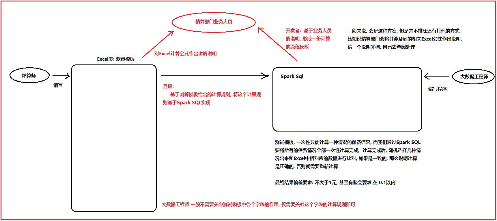

计算逻辑: 

* 1- 形成维度表(10个维度字段)的数据: 19338条

```properties
	除了性别, 投保年龄, 缴费期 以及保单年度需要生成后, 可以认为 通过这四个, 就可以确定唯一的一条数据
	
	其他的维度字段, 要不就是固定的值, 要不就可以使用其他的字段计算而出的
	
	后期关注点:  性别  投保年龄  缴费期  保单年度
		性别: 男 女
		缴费期: 10 15 20 30
		投保年龄:   18~60岁
		保单年度: 投保第一年, 就是第一个保单年度, 第二年就是第二个保单年度, 依次类推, 直到计算到106岁截止
			比如: 
				以 18岁投保, 保证终身(106岁), 意味着共计会有 106-18 = 88 个保单年度
```

* 2- 统计23个指标, 基于横向迭代计算操作

```properties
	对于指标计算来说, 需要解析每个指标字段的计算规则
	
	以其中一个指标为例,, 讲解其整个解析过程: 死亡率
		计算规则:  =IF(J13<=105,VLOOKUP(J13,MORT_10_13,IF(Sex="M",2,3)),0)*MortRatio_Prem_0*(I13<=BPP)
		
		说明: 
			A * MortRatio_Prem_0 * C
			
			MortRatio_Prem_0 :IF(Sex="M",1,1)  = 1
			       |
			       |
			A *  1 * C
			
			解析C: (I13<=BPP) 保单年度 <= 保障期间
				发现保单年度 一定是小于等于 保障期间, 也就说这个条件一定也是成立的,  True --> 1
				   |
				   |
			A * 1 * 1
			
			解析 A: IF(J13<=105,VLOOKUP(J13,MORT_10_13,IF(Sex="M",2,3)),0)
				当用户年龄小于等于105岁的时候: 
					执行: VLOOKUP(J13,MORT_10_13,IF(Sex="M",2,3))
						根据用户年龄 与 生命表进行匹配, 匹配后, 如果是男性返回生命表第二列数据, 否则返回生命表第三列数据
				否则: 0
				
	
	当前我们是带着大家分析了其中一个指标的计算流程方案, 实际生产中, 剩下的22个指标, 我们都需要大家一个个进行分析, 找到那些指标需要先计算, 那些指标需要后计算, 那些指标可以一起计算, 最终形成一份计算流程图表
	
	对于当前学习环境, 不需要大家直接对接Excel进行分析了, 因为这个工作实在有点太费时间了, 本次直接将所有的指标计算流程, 全部提供给大家,  我们可以直接根据计算流程图完成统计计算操作即可, 但是建议大家在计算的过程中, 可以根据计算流程图, 和Excel对应计算规则, 来理解Excel相关规则信息(反推)
```

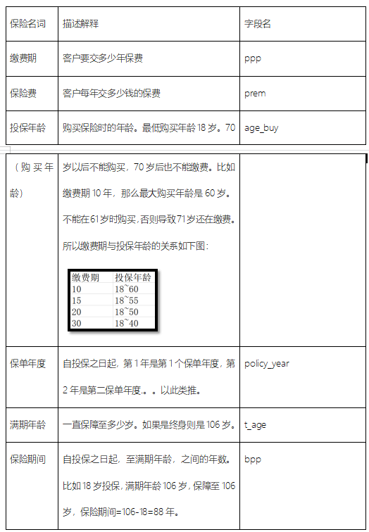


### 1.2 建库建表操作

* 1- 在项目中, 创建一个 SQL的脚本:
  * 文件名: _02_insurance_create_dw.sql

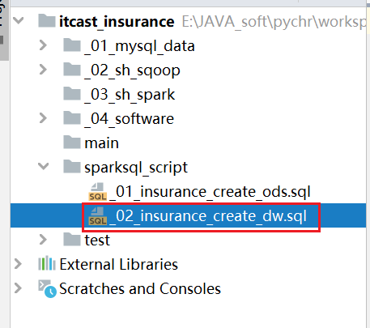

* 2- 在SQL脚本中, 放置建表语句

```sql
-- 此脚本用于构建DW层的库和表
-- 构建DW层的库
drop database if exists  insurance_dw cascade ;
create database if not exists insurance_dw
    location 'hdfs://node1:8020/user/hive/warehouse/insurance_dw.db';

--  1- 构建保费参数因子结果表:
create table insurance_dw.prem_src (
    age_buy       smallint comment '投保年龄',
    nursing_age   smallint comment '长期护理保险金给付期满年龄',
    sex           string comment '性别',
    t_age         smallint comment '满期年龄(Terminate Age)',
    ppp           smallint comment '交费期间(Premuim Payment Period PPP)',
    bpp           smallint comment '保险期间(BPP)',
    interest_rate decimal(6, 4)  comment '预定利息率(Interest Rate PREM&RSV)',
    sa            decimal(12, 2) comment '基本保险金额(Baisc Sum Assured)',
    policy_year   smallint comment '保单年度',
    age           smallint comment '保单年度对应的年龄',
    qx            decimal(17, 12) comment '死亡率',
    kx            decimal(17, 12) comment '残疾死亡占死亡的比例',
    qx_d          decimal(17, 12) comment '扣除残疾的死亡率',
    qx_ci         decimal(17, 12) comment '残疾率',
    dx_d          decimal(17, 12) comment '',
    dx_ci         decimal(17, 12) comment '',
    lx            decimal(17, 12) comment '有效保单数',
    lx_d          decimal(17, 12) comment '健康人数',
    cx            decimal(17, 12) comment '当期发生该事件的概率，如下指的是死亡发生概率',
    cx_           decimal(17, 12) comment '对Cx做调整，不精确的话，可以不做',
    ci_cx         decimal(17, 12) comment '当期发生重疾的概率',
    ci_cx_        decimal(17, 12) comment '当期发生重疾的概率，调整',
    dx            decimal(17, 12) comment '有效保单生存因子',
    dx_d_         decimal(17, 12) comment '健康人数生存因子',
    ppp_          smallint comment '是否在缴费期间，1-是，0-否',
    bpp_          smallint comment '是否在保险期间，1-是，0-否',
    expense       decimal(17, 12) comment '附加费用率',
    db1           decimal(17, 12) comment '残疾给付',
    db2_factor    decimal(17, 12) comment '长期护理保险金给付因子',
    db2           decimal(17, 12) comment '长期护理保险金',
    db3           decimal(17, 12) comment '养老关爱金',
    db4           decimal(5, 2) comment '身故给付保险金',
    db5           decimal(17, 12) comment '豁免保费因子'
) comment '保费因子表（到每个保单年度）'
row format delimited fields terminated by '\t';
```

* 3-  执行 SQL脚本, 创建库和表操作

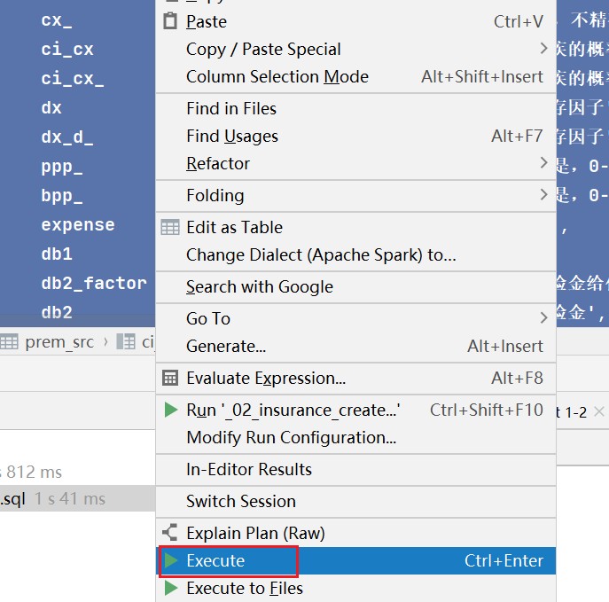


### 1.3 准备构建起始维度数据

* 1- 在项目中创建一个计算保费的SQL脚本文件
  * 文件名: _04_insurance_dw_prem_std.sql

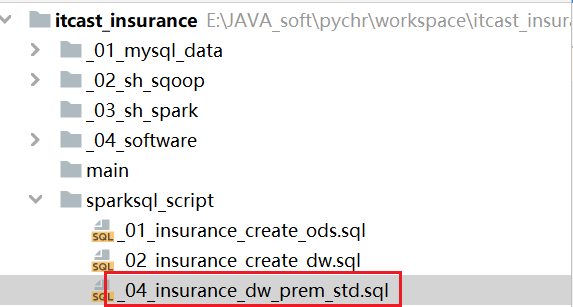

* 2- 在脚本中, 编写SQL: 

```sql
-- 此脚本用于计算保费参数因子以及最终保费核定计算脚本

-- 0 先 生成维度信息数据(19338种情况)
-- 性别: M F
create or  replace view insurance_dw.prem_src0_sex as
SELECT stack(2,'M','F') as sex;

-- 缴费期: 10  15  20  30
create or  replace view insurance_dw.prem_src0_ppp as
select stack(4,10,15,20,30) as ppp;

-- 投保年龄: 18 ~ 60
create or  replace view insurance_dw.prem_src0_age_buy as
select explode(sequence(18,60)) as age_buy;

-- 保单年度: 1 ~ 88
create or  replace view insurance_dw.prem_src0_policy_year as
select explode(sequence(1,88)) as policy_year;


-- 构建一个input的常量表数据, 将整个固定值数据放置在一个表中, 便于后续使用
create or replace  view  insurance_dw.input as
select 0.035  interest_rate,    --预定利息率(Interest Rate PREM&RSV)
       0.055  interest_rate_cv,--现金价值预定利息率（Interest Rate CV）
       0.0004 acci_qx,--意外身故死亡发生率(Accident_qx)
       0.115  rdr,--风险贴现率（Risk Discount Rate)
       10000  sa,--基本保险金额(Baisc Sum Assured)
       1      average_size,--平均规模(Average Size)
       1      MortRatio_Prem_0,--Mort Ratio(PREM)
       1      MortRatio_RSV_0,--Mort Ratio(RSV)
       1      MortRatio_CV_0,--Mort Ratio(CV)
       1      CI_RATIO,--CI Ratio
       6      B_time1_B,--生存金给付时间(1)—begain
       59     B_time1_T,--生存金给付时间(1)-terminate
       0.1    B_ratio_1,--生存金给付比例(1)
       60     B_time2_B,--生存金给付时间(2)-begain
       106    B_time2_T,--生存金给付时间(2)-terminate
       0.1    B_ratio_2,--生存金给付比例(2)
       70     MB_TIME,--祝寿金给付时间
       0.2    MB_Ration,--祝寿金给付比例
       0.7    RB_Per,--可分配盈余分配给客户的比例
       0.7    TB_Per,--未分配盈余分配给客户的比例
       1      Disability_Ratio,--残疾给付保险金保额倍数
       0.1    Nursing_Ratio,--长期护理保险金保额倍数
       75     Nursing_Age--长期护理保险金给付期满年龄
;

-- 此常量表, 后续有可能会多次的使用, 那么如何解决呢? 将常量表数据放置到缓存中, 便于后续使用
cache table insurance_dw.input;


-- 将四个维度所有情况组合在一起, 形成最终的 19338条数据
-- 不写 on 表示一定会有笛卡尔积的情况, 对于HIVE来说, 如果 SQL有笛卡尔积, HIVE可能会拒绝执行
-- 但是我们却必须要产生这个笛卡尔积的结果, 如何解决呢?  想办法骗过优化器, 告知其有on条件:  添加 on 1 = 1
create or  replace  view  insurance_dw.prem_src0 as
select
    t3.age_buy,
    input.Nursing_Age,
    t1.sex,
    input.B_time2_T as t_age,
    t2.ppp,
    input.B_time2_T - t3.age_buy as bpp,
    input.interest_rate,
    input.sa,
    t4.policy_year,
    t3.age_buy + t4.policy_year -1 as age
from insurance_dw.prem_src0_sex t1
    join insurance_dw.prem_src0_ppp t2 on 1 = 1
    join insurance_dw.prem_src0_age_buy t3 on t3.age_buy >= 18 and t3.age_buy <= 70 - t2.ppp
    join insurance_dw.prem_src0_policy_year t4 on t4.policy_year >= 1 and t4.policy_year <= 106 - t3.age_buy
    join insurance_dw.input  on 1 = 1;

```


后续计算剩余的23个指标字段即可, 通过横向迭代计算方式来处理

```properties
正常流程:
	1- 首先需要分析这23个指标, 那些指标需要先计算, 那些指标需要后计算, 那些指标可以同时进行计算
			分析Excel整个规则流程的过程
	
	2- 分析后, 需要生成一份计算流程方案(可以图, 可以是文档, 可以是任务类型, 只要你能看得懂)
	3- 根据流程方案, 完成 SQL的编写操作
	4- 每计算一个指标, 都应该到测算模板去校验, 看一下当前计算是否是正常的
```


### 1.4 完成步骤一计算

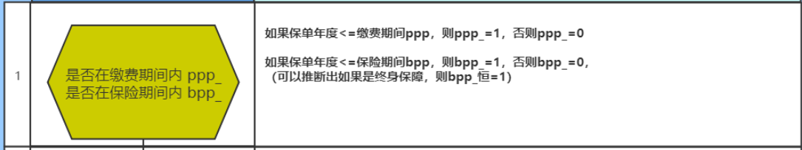

```properties
-- 步骤一: 计算 PPP_ 和 BPP_
create or replace  view  insurance_dw.prem_src1 as
select
    *,
    if(policy_year <= ppp , 1, 0) as ppp_,
    if(policy_year <= bpp , 1, 0) as bpp_
from insurance_dw.prem_src0;

-- 校验步骤一: 需要多次校验, 校验在不同情况下, 对应指标的值是否和Excel中测算模板是否一致
select * from  insurance_dw.prem_src1 where age_buy = 28 and sex = 'M' and ppp = 15;
```


### 1.5 完成步骤二计算

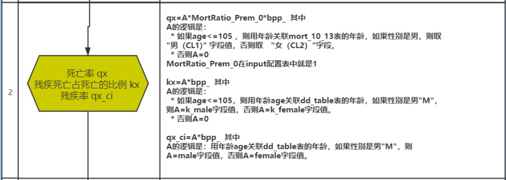

在SQL脚本的最上面. 添加一行禁止精度丢失的参数,以及设置shuffle的分区数量:  添加后一定记得执行一下(仅在当前会话有效)

```properties
-- 开启禁止精度丢失(精度保护)
set spark.sql.decimalOperations.allowPrecisionLoss=false;
-- 开启 shuffle分区数量为 4个 (默认为: 200)
set spark.sql.shuffle.partitions=4;
```

需求二实现:

```sql
-- 步骤二:  计算 qx  kx  qx_ci
create or replace view  insurance_dw.prem_src2 as
select
    t1.*,
    if(
        t1.age <= 105 ,
        if( t1.sex = 'M', t2.cl1,t2.cl2),
        0
    ) * input.MortRatio_Prem_0 * t1.bpp_ as qx,

    if(
        t1.age <= 105,
        if(t1.sex = 'M',t3.k_male,t3.k_female),
        0
    ) * t1.bpp_ as kx,

    if(
        t1.sex = 'M',
        t3.male,
        t3.female
    ) * t1.bpp_ as  qx_ci
from insurance_dw.prem_src1 t1
    join insurance_dw.input on 1=1
    join insurance_ods.mort_10_13 t2 on  t1.age = t2.age
    join insurance_ods.dd_table t3 on t1.age = t3.age;

-- 校验步骤二:
select * from  insurance_dw.prem_src2 where age_buy = 28 and sex = 'M' and ppp = 15;

```


### 1.6 完成步骤三计算

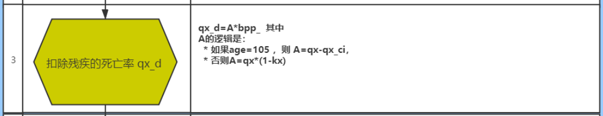

```sql
-- 步骤三: 计算 qx_d
create or replace  view  insurance_dw.prem_src3 as
select
    *,
    cast(
        if(
            age = 105 ,
            qx - qx_ci,
            qx * (1-kx)
        ) * bpp_
    as decimal(17,12))as qx_d
from insurance_dw.prem_src2 ;

-- 校验步骤三:
select * from  insurance_dw.prem_src3 where age_buy = 28 and sex = 'M' and ppp = 15;
```


### 1.7 通过Spark SQL代码读取SQL脚本

* 1- 在 main目录下, 创建了 _insurance_FIAA_main.py 脚本文件
* 2- 编写代码: 通过代码读取SQL文件进行执行操作

```python
from pyspark import SparkContext, SparkConf
from pyspark.sql import SparkSession
import os

# 锁定远端操作环境, 避免存在多个版本环境的问题
os.environ['SPARK_HOME'] = '/export/server/spark'
os.environ["PYSPARK_PYTHON"] = "/root/anaconda3/bin/python"
os.environ["PYSPARK_DRIVER_PYTHON"] = "/root/anaconda3/bin/python"


# 工具函数(方法) :
# 大致功能: 读取SQL脚本, 将脚本中 空行 以及注释全部过滤掉, 将其中SQL执行即可
def executeSQLFile(filename):
    # 注意: 路径地址是否与你的路径地址一致
    with open(r'../sparksql_script/' + filename, 'r') as f:
        # 读取所有行的数据, 将其封装到一个列表中
        read_data = f.readlines()
        # 将数组的一行一行拼接成一个长文本，就是SQL文件的内容
        read_data = ''.join(read_data)
        # 将文本内容按分号切割得到数组，每个元素预计是一个完整语句
        arr = read_data.split(";")
        # 对每个SQL,如果是空字符串或空文本，则剔除掉
        # 注意，你可能认为空字符串''也算是空白字符，但其实空字符串‘’不是空白字符 ，即''.isspace()返回的是False
        arr2 = list(filter(lambda x: not x.isspace() and not x == "", arr))
        # 对每个SQL语句进行迭代
        for sql in arr2:
            # 先打印完整的SQL语句。
            print(sql, ";")
            # 由于SQL语句不一定有意义，比如全是--注释;，他也以分号结束，但是没有意义不用执行。
            # 对每个SQL语句，他由多行组成，sql.splitlines()数组中是每行，挑选出不是空白字符的，也不是空字符串''的，也不是--注释的。
            # 即保留有效的语句。
            filtered = filter(lambda x: (not x.lstrip().startswith("--")) and (not x.isspace()) and (not x.strip() == ''),
                              sql.splitlines())
            # 下面数组的元素是SQL语句有效的行
            filtered = list(filtered)

            # 有效的行数>0，才执行
            if len(filtered) > 0:
                df = spark.sql(sql)
                # 如果有效的SQL语句是select开头的，则打印数据。
                if filtered[0].lstrip().startswith("select"):
                    df.show(100)


if __name__ == '__main__':
    print("此python实现整个精算系统相关的指标内容:(保费参数因子, 保费, 现金价值, 准备金)")

    # 1) 创建 sparkSession对象, 此对象支持连接hive

    spark = SparkSession \
        .builder \
        .master("local[*]") \
        .appName("insurance_main") \
        .config("spark.sql.shuffle.partitions", 4) \
        .config("spark.sql.warehouse.dir", "hdfs://node1:8020/user/hive/warehouse") \
        .config("hive.metastore.uris", "thrift://node1:9083") \
        .enableHiveSupport() \
        .getOrCreate()

    # 2) 编写SQL执行:
    executeSQLFile('_04_insurance_dw_prem_std.sql')
```

### 1.8 完成步骤四计算

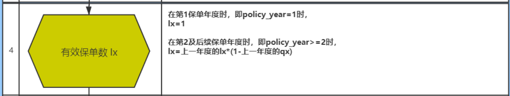

完成当保单年度为1的时候

```sql
-- 步骤四:  计算 lx
-- 步骤4_1: 完成当保单年度为 1的时候
create or replace  view insurance_dw.prem_src4_1 as
select
    *,
    if(policy_year = 1, 1, NULL) AS lx
from insurance_dw.prem_src3;

-- 校验步骤4_1
select * from  insurance_dw.prem_src4_1 where age_buy = 28 and sex = 'M' and ppp = 15;
```

在代码中定义UDAF函数, 完成对未知数据的纵向迭代计算操作: 

注意: 此函数, 一定要放置在 执行SQL脚本的上面, 否则当执行SQL的时候, 可能函数还没有被注册

```sql
# 自定义UDAF函数, 实现计算 lx
    @F.pandas_udf(returnType='decimal(17,12)')
    def udaf_lx(qx:pd.Series,lx:pd.Series) -> decimal:
        # 因为返回的类型为decimal类型, 所以这里初始值一定也是一个decimal类型
        # 如何构建呢?
        tmp_qx = decimal.Decimal(0) # 0.000711 --> 0.000751
        tmp_lx = decimal.Decimal(0) # 1 --> 0.999289

        for i in range(0,len(qx)):
            if i == 0:
                tmp_qx = decimal.Decimal(qx[i])
                tmp_lx = decimal.Decimal(lx[i])
            else:
                # 计算lx  计算后 保证小数位为12位 , 与返回类型中设置小数位保持一致
                tmp_lx = (tmp_lx * (1 - tmp_qx)).quantize(decimal.Decimal('0.000000000000'))
                tmp_qx = decimal.Decimal(qx[i])
        return tmp_lx


    # 将函数注册到SQL中使用:
    spark.udf.register('udaf_lx',udaf_lx)
```

完成当保单年度不为1的时候, 计算lx

```properties
-- 步骤4_2: 完成当保单年度不为1的时候
-- 建表原因: 1- 方便后续测试(因为表是直接存储的数据) 2- 临时函数不支持构建永久视图
drop table if exists insurance_dw.prem_src4_2;
create table if not exists insurance_dw.prem_src4_2 as
select
    age_buy,
    Nursing_Age,
    sex,
    t_age,
    ppp,
    bpp,
    interest_rate,
    sa,
    policy_year,
    age,
    ppp_,
    bpp_,
    qx,
    kx,
    qx_ci,
    qx_d,
    udaf_lx(qx,lx) over(partition by sex,age_buy,ppp order by policy_year) as lx
from insurance_dw.prem_src4_1;

-- 校验步骤4_2:
select * from insurance_dw.prem_src4_2 where age_buy = 28 and sex = 'M' and ppp = 15;
```


注意:

```properties
	在执行自定义函数的SQL的时候, 必须通过代码来执行, 不能直接在SQL脚本中运行, 因为这两个是两个完全不同会话, 自定义函数, 只能当前会话中使用
```


### 1.9 完成步骤五计算

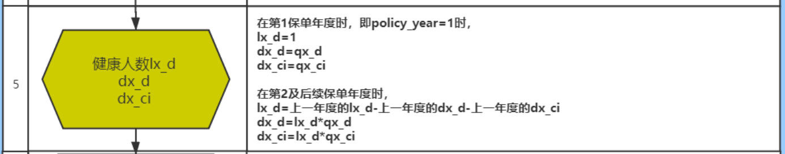

先计算当保单年度为1的时候, lx_d的处理操作

```properties
-- 步骤五: 计算 lx_d  dx_d  dx_ci
-- 步骤5_1
create  or  replace view  insurance_dw.prem_src5_1 as
select
    *,
    if(policy_year = 1, 1, NULL) AS lx_d
from insurance_dw.prem_src4_2;

-- 校验步骤5_1
select * from insurance_dw.prem_src5_1 where age_buy = 28 and sex = 'M' and ppp = 15;


```

自定义UDAF函数, 一次性将3col全部计算完成, 将其封装到一个字符串中, 通过逗号分隔每一个计算结果

```properties
# 自定义UDAF函数, 完成计算  lx_d dx_d  dx_ci
    @F.pandas_udf(returnType='string')
    def udaf_3col(qx_d:pd.Series,qx_ci:pd.Series,lx_d:pd.Series) -> str:
        tmp_lx_d = decimal.Decimal(0) # 1
        tmp_dx_d = decimal.Decimal(0) # 0.0005215185
        tmp_dx_ci = decimal.Decimal(0) # 0.000838

        for i in range(0,len(qx_d)):
            if i == 0:
                tmp_lx_d = decimal.Decimal(lx_d[i])
                tmp_dx_d = decimal.Decimal(qx_d[i])
                tmp_dx_ci = decimal.Decimal(qx_ci[i])
            else:
                tmp_lx_d = (tmp_lx_d - tmp_dx_d - tmp_dx_ci).quantize(decimal.Decimal('0.000000000000'))
                tmp_dx_d = (tmp_lx_d * qx_d[i]).quantize(decimal.Decimal('0.000000000000'))
                tmp_dx_ci = (tmp_lx_d * qx_ci[i]).quantize(decimal.Decimal('0.000000000000'))

        return f'{tmp_lx_d},{tmp_dx_d},{tmp_dx_ci}'
        
      
    spark.udf.register('udaf_3col', udaf_3col)
```

编写SQL, 调用自定义函数, 返回3col结果计算, 将结果保存到一个中间表中

```sql
-- 步骤5_2
create table if not exists insurance_dw.prem_src5_2 as
select
    age_buy,
    Nursing_Age,
    sex,
    t_age,
    ppp,
    bpp,
    interest_rate,
    sa,
    policy_year,
    age,
    ppp_,
    bpp_,
    qx,
    kx,
    qx_ci,
    qx_d,
    lx,
    udaf_3col(qx_d,qx_ci,lx_d) over(partition by sex,age_buy,ppp order by policy_year) as lx_d_dx_d_dx_ci
from insurance_dw.prem_src5_1;

-- 校验5_2
select * from insurance_dw.prem_src5_2 where age_buy = 28 and sex = 'M' and ppp = 15;

```

接下来, 拆解 3col 将其变更为3个字段即可: 通过 split 以及 cast转换类型

```sql
-- 步骤 5_3 将3列数据拆解开, 变成一个个的指标
create or replace view insurance_dw.prem_src5_3 as
select
    age_buy,
    Nursing_Age,
    sex,
    t_age,
    ppp,
    bpp,
    interest_rate,
    sa,
    policy_year,
    age,
    ppp_,
    bpp_,
    qx,
    kx,
    qx_ci,
    qx_d,
    lx,
    cast(split(lx_d_dx_d_dx_ci,',')[0] as decimal(17,12)) as lx_d,
    cast(split(lx_d_dx_d_dx_ci,',')[1] as decimal(17,12)) as dx_d,
    cast(split(lx_d_dx_d_dx_ci,',')[2] as decimal(17,12)) as dx_ci
from insurance_dw.prem_src5_2;


-- 校验5_3
select * from insurance_dw.prem_src5_3 where age_buy = 28 and sex = 'M' and ppp = 15;


```


### 1.10 完成步骤六计算

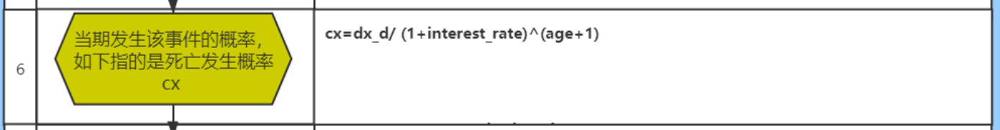

```sql
-- 步骤六: cx
-- pow: 进行幂次方计算操作
create or replace view insurance_dw.prem_src6 as
select
    *,
    cast(dx_d / pow((1 + interest_rate), (age + 1)) as decimal(17,12) ) as cx
from insurance_dw.prem_src5_3;

-- 校验步骤六:
select *  from insurance_dw.prem_src6 where age_buy = 28 and sex = 'M' and ppp = 15;
```


### 1.11 完成步骤七计算

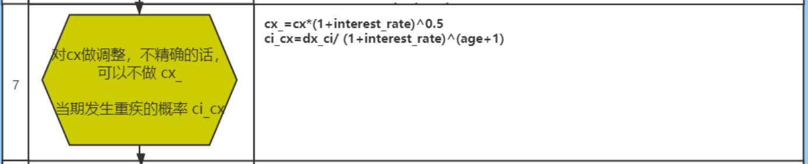

```sql
-- 步骤七:   cx_  ci_cx
create or replace view insurance_dw.prem_src7 as
select
    *,
    cast( cx * pow((1+interest_rate),0.5) as decimal(17,12)) as cx_,
    cast( dx_ci / pow((1+interest_rate),(age+1)) as decimal(17,12)) as ci_cx
from insurance_dw.prem_src6 ;

-- 校验步骤七:
select  * from insurance_dw.prem_src7 where age_buy = 28 and sex = 'M' and ppp = 15;
```


### 1.12 完成步骤八计算

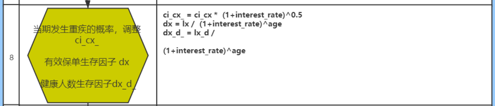

```sql
-- 步骤八: 计算 ci_cx_  dx  dx_d_
create or replace  view  insurance_dw.prem_src8 as
select
    *,
    cast(ci_cx * pow((1+interest_rate),0.5) as decimal(17,12)) as ci_cx_,
    cast(lx / pow((1 + interest_rate),age) as decimal(17,12)) as dx,
    cast(lx_d / pow((1+interest_rate),age) as decimal(17,12)) as dx_d_
from insurance_dw.prem_src7 ;

-- 校验步骤八:
select * from insurance_dw.prem_src8 where age_buy = 28 and sex = 'M' and ppp = 15;
```


### 1.13 完成步骤九计算

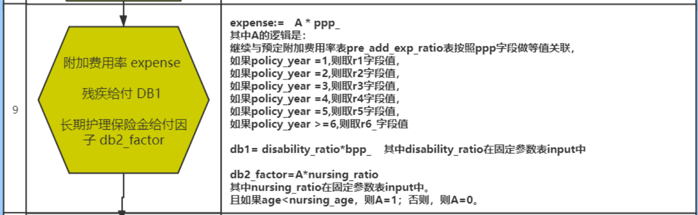

```sql
-- 步骤九:  计算 expense  DB1   db2_factor
create  or replace  view insurance_dw.prem_src9 as
select
    t1.* ,
    cast(
        case
            when t1.policy_year = 1 then t2.r1
            when t1.policy_year = 2 then t2.r2
            when t1.policy_year = 3 then t2.r3
            when t1.policy_year = 4 then t2.r4
            when t1.policy_year = 5 then t2.r5
            else t2.r6_
        end  * t1.ppp_
    as decimal(17,12)) as expense,

    cast( input.Disability_Ratio * t1.bpp_ as decimal(17,12)) as db1,

    cast(
        if(
            t1.age < t1.Nursing_Age,
            1,
            0
        ) * input.Nursing_Ratio
    as decimal(17,12)) as db2_factor
from insurance_dw.prem_src8 t1
    join insurance_ods.pre_add_exp_ratio t2 on t1.ppp = t2.PPP
    join insurance_dw.input on 1 = 1;

-- 校验步骤9
select * from insurance_dw.prem_src9 where age_buy = 28 and sex = 'M' and ppp = 20;

```


注意事项:

```properties
由于业务库pre_add_exp_ratio 中 r4字段数据有问题, 导致后续导入后 进行计算的时候, 出现了问题, 此时解决方案如何做呢?
	

处理方案: 
	需要由业务人员修改业务库, 然后对其重新擦剂, 然后重新处理即可
```

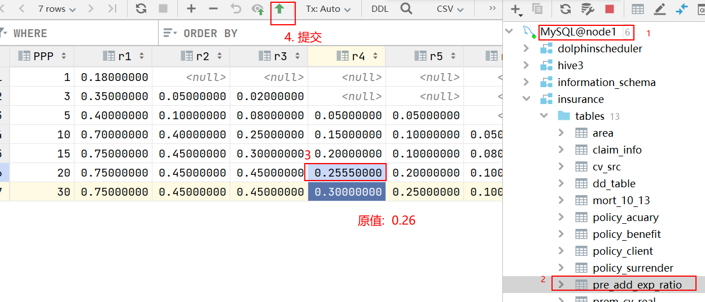


### 1.14 完成步骤十计算

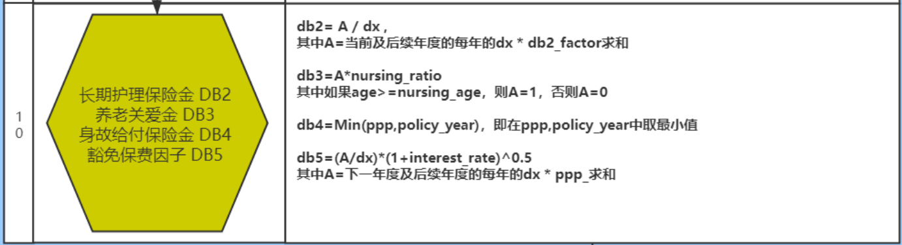

```sql
-- 步骤10: DB2  DB3  DB4 DB5
-- least()  可以多列中返回最小值
-- greatest() 以多列中返回最大值
create or replace  view insurance_dw.prem_src10 as
select
    t1.*,
    cast(
        sum(t1.dx * t1.db2_factor) over(partition by t1.sex,t1.age_buy,t1.ppp order by t1.policy_year rows between current row  and unbounded following)
            /
        t1.dx
    as decimal(17,12)) as db2,

    cast(
        if(
            t1.age >= t1.Nursing_Age,
            1,
            0
        ) * input.Nursing_Ratio
    as decimal(17,12)) as db3,

    least(t1.ppp,t1.policy_year) as db4,

    cast(
        (
            ifnull(sum(t1.dx * t1.ppp_) over(partition by t1.sex,t1.age_buy,t1.ppp order by t1.policy_year rows between 1 following and unbounded following),0)
             /
            t1.dx
        ) * pow((1+t1.interest_rate),0.5)
    as decimal(17,12)) as db5
from insurance_dw.prem_src9 t1
        join insurance_dw.input;


-- 校验步骤10:

select * from insurance_dw.prem_src10 where age_buy = 28 and sex = 'M' and ppp = 20;
```


### 1.15 将结果数据保存至结果表

```sql
-- 将保费参数因子数据灌入到DW层目标表中:
-- 后续查询语句的字段顺序 一定要和目标表字段的顺序保持一致
insert overwrite  table insurance_dw.prem_src
select
    age_buy,
    nursing_age,
    sex,
    t_age,
    ppp,
    bpp,
    interest_rate,
    sa,
    policy_year,
    age,
    qx,
    kx,
    qx_d,
    qx_ci,
    dx_d,
    dx_ci,
    lx,
    lx_d,
    cx,
    cx_,
    ci_cx,
    ci_cx_,
    dx,
    dx_d_,
    ppp_,
    bpp_,
    expense,
    db1,
    db2_factor,
    db2,
    db3,
    db4,
    db5
from insurance_dw.prem_src10;

-- 校验保费参数因子表数据
-- 19338
select count(1) from insurance_dw.prem_src;

select * from insurance_dw.prem_src where sex = 'F' and ppp = '10' and age_buy = '34';
```


对于上述的计算操作. 使用了那些优化方案:

```properties
1- 对于公共, 经常使用的表, 设置为了缓存操作
2- 将复杂问题简单化, 将一个完整的计算流程,拆解为一个个的模块 简化操作, 先拆解为 计算流程图, 然后基于图完成整个迭代计算
3- 对于复杂的纵向迭代计算, 采用pandas UDF来自定义spark的UDAF函数的方案来进行处理
```


## 2. 保费计算操作

​	保费: 与保单年度没有太直接关系, 每年的保费都是一样的

​	如何确定某一个用户保费:  投保年龄 性别 缴费期


​	需求二: 计算所有性别, 所有的投保年龄, 以及所有的缴费期, 在每一种情况下保费信息 (共计条数: 274条)

### 2.1 构建保费结果表

* 1- 在DW层创建用于保存最终保费的结果表

```sql
create table insurance_dw.prem_std (
    age_buy smallint comment '投保年龄',
    sex     string comment '性别',
    ppp     smallint comment '缴费期',
    bpp     string comment '保障期',
    prem    decimal(14, 6) comment '每期交的保费'
) comment '标准保费结果表'
row format delimited fields terminated by '\t';
```

注意: 建表语句需要放置在 _02_insurance_create_dw.sql 脚本文件中


### 2.2 步骤十一计算

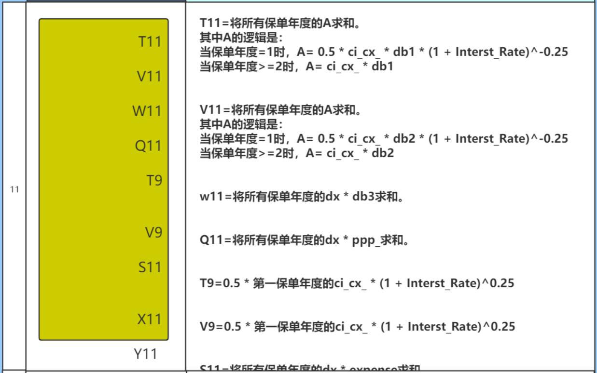

```sql
-- 步骤十一:
create or replace view insurance_dw.prem_std11 as
select
    age_buy,
    sex,
    ppp,
    cast (
        sum(
            if(
                policy_year = 1,
                0.5 * ci_cx_ * db1 * pow((1+interest_rate),-0.25),
                ci_cx_ * db1
            )
        )
    as decimal(17,12)) as  t11,

    cast(
        sum(
            if(
                policy_year = 1,
                0.5 * ci_cx_ * db2 * pow((1+interest_rate),-0.25),
                ci_cx_ * db2
            )
        )
    as decimal(17,12)) AS  v11,

    cast(sum(dx * db3) as decimal(17,12)) as  w11,
    cast(sum(dx * ppp_) as decimal(17,12)) as q11,

    cast(
        sum(
            if(
                policy_year = 1,
                0.5 * ci_cx_ * pow((1+interest_rate),0.25),
                0
            )
        )
    as decimal(17,12)) as t9,

    cast(
        sum(
            if(
                policy_year = 1,
                0.5 * ci_cx_ * pow((1+interest_rate),0.25),
                0
            )
        )
    as decimal(17,12))  as v9,

    cast(sum(dx * expense) as decimal(17,12)) as s11,
    cast(sum(cx_ * db4) as decimal(17,12)) as x11,
    cast(sum(ci_cx_ * db5) as decimal(17,12)) as y11
from insurance_dw.prem_src10
group by sex,ppp,age_buy;

-- 校验步骤11:
select * from insurance_dw.prem_std11 where sex = 'F' and ppp = '10' and age_buy = '34';

```


### 2.3 步骤十二计算

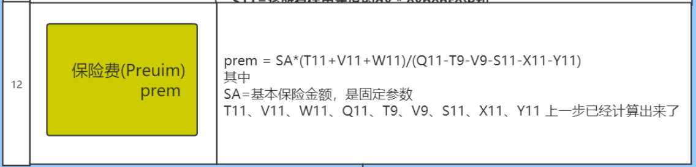

```sql
-- 步骤十二:
create or replace  view  insurance_dw.prem_std12 as
select
    t1.age_buy,
    t1.sex,
    t1.ppp,
    cast(
        input.sa *(t1.t11 + t1.v11 + t1.w11) / (t1.q11 - t1.t9 -t1.v9 - t1.s11 - t1.x11 - t1.y11)
    as decimal(17,0))as prem
from insurance_dw.prem_std11 t1 join insurance_dw.input;

-- 校验步骤12:
select * from insurance_dw.prem_std12 where sex = 'F' and ppp = '20' and age_buy = '18';

```


### 2.4 将保费结果数据保存至目标表

```sql
-- 将保费结果灌入到目标表中
insert overwrite table insurance_dw.prem_std
select
    age_buy,
    sex,
    ppp,
    106 - age_buy as bpp,
    prem
from insurance_dw.prem_std12;

-- 校验:
select  * from insurance_dw.prem_std where sex ='M' and ppp = '20' and age_buy=27;
```


## 3- 保险现金价值和准备金

### 3.1 什么是现金价值

* 1- 保单是一种带有储蓄性质的
* 2- 保险人为履行合同责任通常提存责任准备金，当被保险人中途退保或者解约的时候, 保险公司需要退还用户一部分保费(这部分保费其实就是现金价值)
* 3- 可以根据保单现金价值, 进行保单贷款, 一般是可以贷到保单现金价值的70%

### 3.2 什么是准备金

​		保险准备金(reserve)是指保险人为保证其如约履行保险**赔偿**或**给付**义务，根据政府有关法律规定或业务特定需要，从保费收入或盈余中提取的与其所承担的保险责任相对应的一定数量的基金

​		准备金用来作为未来赔付的保证。准备金是衡量保险公司偿付能力的重要指标，偿付能力越强，保险公司信用评级越高。


​		从保险公司角度来说, 不管是现金价值, 还是保险准备金, 都是准备金, 都是不能动的钱,都可以认为是保险公司负债


