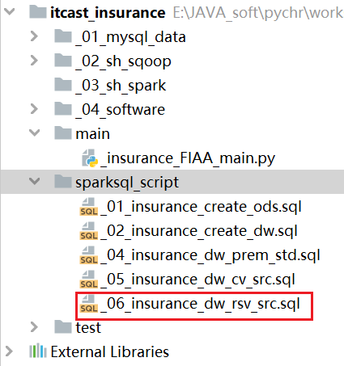

# day08_保险项目课程笔记

* 1- 现金价值相关的计算
* 2- 保险准备金的相关计算操作

## 1. 现金价值相关计算

需求三:  根据投保年龄, 性别, 缴费期 以及保单年度来计算现金价值(共计: 19338),涉及的指标共计有37个指标

```properties
需求分析: 
	1- 通过测试模板. 可以看到, 整个现金价值结果表共计有47个字段(10个维度字段 + 37个指标字段)
	2- 其中10个维度字段, 除了利率维度以外, 其他的维度与保费参数因子表维度信息完全一致, 后期可以直接从保费参数因子表中提取即可
	3- 在现金价值表中, 当保单年度为0的时候, 是有意义, 所以需要在现金价值结果表, 将保单年度为0的数据也要生成, 此数据共计274条, 所以最终结果表数据量: 19338 + 274 = 19612条
	4- 剩余的37个指标字段中, 有一部分字段是可以直接从保费参数因子表中直接读取: 15个字段  
			qx,qx,qx_d,qx_ci,dx_d,dx_ci,lx,lx_d
			ppp_,bpp_, expense, db1,db2_factor
			db3,db4
		
	   需要我们手动计算的:  22个字段
	   		cx ,cx_,ci_cx,ci_cx_,dx,dx_d_
	   		db2,db5
	   		np_,pvnp,pvdb1,pvdb3,pvdb3,pvdb4,pcdb5
	   		pvr,rt,np,sur_ben,cv_1a,cv_1b,cv_2
	   

操作步骤:  
	1- 首先在DW层构建现金价值结果表
	2- 读取保费参数因子表 从当中将不需要生成的维度数据以及不需要在重新计算的指标字段数据全部都提取出来
	3- 基于提取后的结果信息基础上, 在此基础上进行横向迭代计算, 计算出剩余的相关的指标
	4- 将整个计算结果保存到现金价值结果表
```


### 1.1 构建现金价值结果表

```sql
-- 保费现金价值结果表:
drop table if exists insurance_dw.cv_src ;
create table if not exists insurance_dw.cv_src(
    age_buy       smallint comment '投保年龄',
    nursing_age   smallint comment '长期护理保险金给付期满年龄',
    sex           string comment '性别',
    t_age         smallint comment '满期年龄(Terminate Age)',
    ppp           smallint comment '交费期间(Premuim Payment Period PPP)',
    bpp           smallint comment '保险期间(BPP)',
    interest_rate_cv decimal(6, 4) comment '现金价值预定利息率（Interest Rate CV）',
    sa            decimal(12, 2) comment '基本保险金额(Baisc Sum Assured)',
    policy_year   smallint comment '保单年度',
    age           smallint comment '保单年度对应的年龄',
    qx            decimal(8, 7) comment '死亡率',
    kx            decimal(8, 7) comment '残疾死亡占死亡的比例',
    qx_d          decimal(8, 7) comment '扣除残疾的死亡率',
    qx_ci         decimal(8, 7) comment '残疾率',
    dx_d          decimal(8, 7) comment '',
    dx_ci         decimal(8, 7) comment '',
    lx            decimal(8, 7) comment '有效保单数',
    lx_d          decimal(8, 7) comment '健康人数',
    cx            decimal(8, 7) comment '当期发生该事件的概率，如下指的是死亡发生概率',
    cx_           decimal(8, 7) comment '对Cx做调整，不精确的话，可以不做',
    ci_cx         decimal(8, 7) comment '当期发生重疾的概率',
    ci_cx_        decimal(8, 7) comment '当期发生重疾的概率，调整',
    dx            decimal(8, 7) comment '有效保单生存因子',
    dx_d_         decimal(8, 7) comment '健康人数生存因子',
    ppp_          smallint comment '是否在缴费期间，1-是，0-否',
    bpp_          smallint comment '是否在保险期间，1-是，0-否',
    expense       decimal(8, 7) comment '附加费用率',
    db1           decimal(12, 2) comment '残疾给付',
    db2_factor    decimal(8, 7) comment '长期护理保险金给付因子',
    db2           decimal(12, 2) comment '长期护理保险金',
    db3           decimal(12, 2) comment '养老关爱金',
    db4           decimal(12, 2) comment '身故给付保险金',
    db5           decimal(12, 2) comment '豁免保费因子',
    np_         DECIMAL(12, 2) comment '净保费',
    pvnp        DECIMAL(17, 7) comment '净保费现值',
    pvdb1       DECIMAL(17, 7) comment '',
    pvdb2       DECIMAL(17, 7) comment '',
    pvdb3       DECIMAL(17, 7) comment '',
    pvdb4       DECIMAL(17, 7) comment '',
    pvdb5       DECIMAL(17, 7) comment '',
    pvr         DECIMAL(17, 7) comment '保单价值准备金',
    rt          DECIMAL(6, 3) comment '',
    np          DECIMAL(17, 7) comment '修匀净保费',
    sur_ben     DECIMAL(17, 7) comment '生存金',
    cv_1a       DECIMAL(17, 7) comment '现金价值年末（生存给付前）',
    cv_1b       DECIMAL(17, 7) comment '现金价值年末（生存给付后）',
    cv_2        DECIMAL(17, 7) comment '现金价值年中'
)comment '现金价值表（到每个保单年度）'
row format delimited fields terminated by ',';
```

注意: 建表操作, 需要放置在 _02_insurance_create_dw.sql 脚本文件中

### 1.2 步骤13~16

完整的SQL语句:

```sql
-- 此脚本用于计算保单的现金价值
-- 开启禁止精度丢失(精度保护)
set spark.sql.decimalOperations.allowPrecisionLoss=false;
-- 开启 shuffle分区数量为 4个 (默认为: 200)
set spark.sql.shuffle.partitions=4;

-- 步骤13: 首先从保费参数因子表将不需要生成维度和不需要计算的指标字段提取出来 并计算 cx
create or replace  view  insurance_dw.cv_src16 as
with cv_src13  as(
    select
        t1.sa,
        t1.bpp,
        t1.sex,
        input.interest_rate_cv,
        t1.age_buy,
        t1.nursing_age,
        t1.t_age,
        t1.ppp,
        t1.policy_year,
        t1.age,
        t1.qx,
        t1.kx,
        t1.qx_d,
        t1.qx_ci,
        t1.dx_d,
        t1.dx_ci,
        t1.lx,
        t1.lx_d,
        t1.ppp_,
        t1.bpp_,
        t1.expense,
        t1.db1,
        t1.db2_factor,
        t1.db3,
        t1.db4,
        cast(
            t1.dx_d / pow((1+input.interest_rate_cv),(t1.age +1))
        as decimal(17,12))  as cx
    from insurance_dw.prem_src10 t1
        join insurance_dw.input
    union all
    select distinct
        t1.sa,
        t1.bpp,
        t1.sex,
        input.interest_rate_cv,
        t1.age_buy,
        t1.nursing_age,
        t1.t_age,
        t1.ppp,
        0 as policy_year,
        null as age,
        null as qx,
        null as kx,
        null as qx_d,
        null as qx_ci,
        null as dx_d,
        null as dx_ci,
        null as lx,
        null as lx_d,
        null as ppp_,
        null as bpp_,
        null as expense,
        null as db1,
        null as db2_factor,
        null as db3,
        null as db4,
        null as cx
    from insurance_dw.prem_src10 t1
        join insurance_dw.input
),
cv_src14 as (
    select
        *,
        cast(cx * pow((1 + interest_rate_cv),0.5) as decimal(17,12)) as cx_,
        cast(
            dx_ci / pow((1 + interest_rate_cv),(age + 1))
        as decimal(17,12)) as  ci_cx
    from cv_src13
),
cv_src15 as (
    select
        *,
        cast(
            ci_cx * pow((1+interest_rate_cv),0.5)
        as decimal(17,12)) as  ci_cx_,

        cast(
            lx / pow((1+interest_rate_cv),age)
        as decimal(17,12)) as  dx,

        cast(
            lx_d / pow((1+interest_rate_cv),age)
        as decimal(17,12)) as  dx_d_
    from cv_src14
)
select
    *,
    cast(
        sum(dx * db2_factor) over (partition by sex,ppp,age_buy order by policy_year rows between current row  and unbounded following)
            /
        dx
    as decimal(17,12)) as  db2,

    cast(
        (
            ifnull(sum(dx * ppp_) over (partition by sex,ppp,age_buy order by policy_year rows between 1 following  and unbounded following),0)
                /
            dx
        ) * pow((1+interest_rate_cv),0.5)
    as decimal(17,12)) as  db5
from  cv_src15;

-- 校验:步骤 13 ~ 16
select
    *
from insurance_dw.cv_src16 where sex = 'F' and age_buy=20 and ppp=20 order by policy_year;


```

### 1.3 步骤 17~18

```properties
-- 步骤 17
create or replace  view insurance_dw.cv_src18 as
with cv_src17  as (
    select
        age_buy,
        sex,
        ppp,
        cast (
            sum(
                if(
                    policy_year = 1,
                    0.5 * ci_cx_ * db1 * pow((1+interest_rate_cv),-0.25),
                    ci_cx_ * db1
                )
            )
        as decimal(17,12)) as  t11,

        cast(
            sum(
                if(
                    policy_year = 1,
                    0.5 * ci_cx_ * db2 * pow((1+interest_rate_cv),-0.25),
                    ci_cx_ * db2
                )
            )
        as decimal(17,12)) AS  v11,

        cast(sum(dx * db3) as decimal(17,12)) as  w11,
        cast(sum(dx * ppp_) as decimal(17,12)) as q11,

        cast(
            sum(
                if(
                    policy_year = 1,
                    0.5 * ci_cx_ * pow((1+interest_rate_cv),0.25),
                    0
                )
            )
        as decimal(17,12)) as t9,

        cast(
            sum(
                if(
                    policy_year = 1,
                    0.5 * ci_cx_ * pow((1+interest_rate_cv),0.25),
                    0
                )
            )
        as decimal(17,12))  as v9,

        cast(sum(dx * expense) as decimal(17,12)) as s11,
        cast(sum(cx_ * db4) as decimal(17,12)) as x11,
        cast(sum(ci_cx_ * db5) as decimal(17,12)) as y11

    from insurance_dw.cv_src16
    group by  ppp,sex,age_buy
)
select
    t1.age_buy,
    t1.sex,
    t1.ppp,
    (input.sa * (t1.t11 + t1.v11 + t1.w11) + t2.prem * (t1.t9 + t1.v9 +t1.x11 + t1.y11))
            /
    (t1.q11 - t1.s11)  as prem_cv
from cv_src17 t1
    join insurance_dw.input  on 1 =1
    join insurance_dw.prem_std12 t2 on t1.age_buy =  t2.age_buy and t1.sex = t2.sex and t1.ppp = t2.ppp


-- 校验: 步骤 17~18
select
    *
from insurance_dw.cv_src18 where sex = 'M' and age_buy=24 and ppp=20 ;
```


总结:

```properties
1- 当我们在计算的过程中, 发现计算后结果与实际结果偏差比较大,  一般不是由于精度偏差导致的
	解决方案: 
		1.1 判断当前这个对应指标计算的逻辑是否正常(不要过于相信自己, 仔细检查小的点, 比如字段问题, 括号这些问题
		1.2 如果当前步骤可以确定是正确的, 判断当前这个逻辑中是否用到了其他的指标字段, 判断是否是其他指标出现计算错误而导致的
				这个错误, 需要不断的往深处去找 直到找到计算错误的初始点, 然后解决掉

2- 当发现精度偏差不是特别大的时候, 此时可以优先尝试重新开启一下精度保护, 重新全部执行测算一次

3- 如果发现依然无法解决问题, 此时尝试将所有的保留小数位扩大, 以保证更好的精度

4- 如果精度是符合范围内, 可以暂时不关心, 继续往下核算即可, 除非偏差越来越大
```


### 1.4 构建准备金毛保费结果表

* 1- 建表操作:  _02_insurance_create_dw.sql

```sql
-- 保单价值准备金毛保险费表
drop table if exists insurance_dw.prem_cv;
create table if not exists insurance_dw.prem_cv (
    age_buy smallint comment '年投保龄',
    sex     string comment '性别',
    ppp     smallint comment '缴费期间',
    prem_cv      decimal(15, 7) comment '保单价值准备金毛保险费(Preuim)'
)comment '保单价值准备金毛保险费表'
row format delimited fields terminated by '\t';
```

* 2- 将结果数据灌入到目标表

```sql
-- 将 保费价值准备金毛保费数据导入到结果表中
insert overwrite  table insurance_dw.prem_cv
select
    age_buy,
    sex,
    ppp,
    prem_cv
from insurance_dw.cv_src18;

-- 校验毛保费结果表:
select
    *
from insurance_dw.prem_cv where sex = 'M' and age_buy=24 and ppp=20 ;
```


### 1.5 步骤19~23

代码如下:

```sql
-- 步骤19
create or replace view insurance_dw.cv_src23 as
with cv_src19 as (
    select
        t1.*,
        cast(
            (t1.ppp_ - t1.expense) * t2.prem_cv
        as decimal(17,12)) as  np_,

        cast(
            t2.prem_cv
                *
            cast(sum(t1.dx * (t1.ppp_ - t1.expense)) over(partition by t1.sex,t1.ppp,t1.age_buy order by policy_year rows between current row  and unbounded following) as decimal(17,12) )
                /
            t1.dx
        as decimal(17,12))as pvnp   ,

        cast(
            if(
                t1.policy_year = 1,
                (
                    t1.sa
                        *
                    ifnull(sum(t1.ci_cx_ * t1.db1) over(partition by t1.sex,t1.ppp,t1.age_buy order by t1.policy_year rows between 1 following and unbounded following),0)
                        +
                    0.5 *(
                            t3.prem * t1.ci_Cx_ * pow((1+t1.interest_rate_cv),0.25)
                                +
                            t1.sa * t1.db1 * ci_cx_ * pow((1+t1.interest_rate_cv),-0.25)
                        )
                ) / t1.dx,
                sa
                    *
                sum(t1.ci_cx_ * t1.db1) over(partition by t1.sex,t1.ppp,t1.age_buy order by policy_year rows between current row  and unbounded following)
                    /
                t1.dx
            )
        as decimal(17,12)) as pvdb1,

        cast(
            if(
                t1.policy_year = 1,
                (
                    t1.sa
                        *
                    ifnull(sum(t1.ci_cx_ * t1.db2) over(partition by t1.sex,t1.ppp,t1.age_buy order by t1.policy_year rows between 1 following and unbounded following),0)
                        +
                    0.5 *(
                            t3.prem * t1.ci_Cx_ * pow((1+t1.interest_rate_cv),0.25)
                                +
                            t1.sa * t1.db2 * ci_cx_ * pow((1+t1.interest_rate_cv),-0.25)
                        )
                ) / t1.dx,
                sa
                    *
                sum(t1.ci_cx_ * t1.db2) over(partition by t1.sex,t1.ppp,t1.age_buy order by policy_year rows between current row  and unbounded following)
                    /
                t1.dx
            )
        as decimal(17,12)) as pvdb2,

        cast(
            t1.sa
                *
            sum(t1.dx * t1.db3) over(partition by  t1.ppp,t1.sex,t1.age_buy order by t1.policy_year rows between  current row  and unbounded  following)
                /
            t1.dx
        as decimal(17,12)) as pvdb3,

        cast(
            t3.prem
                *
            sum(t1.cx_ * t1.db4) over(partition by  t1.ppp,t1.sex,t1.age_buy order by t1.policy_year rows between  current row  and unbounded  following)
                /
            t1.dx
        as decimal(17,12)) as pvdb4,

        cast(
            t3.prem
                *
            sum(t1.ci_cx_ * t1.db5) over(partition by  t1.ppp,t1.sex,t1.age_buy order by t1.policy_year rows between  current row  and unbounded  following)
                /
            t1.dx
        as decimal(17,12)) as pvdb5


    from insurance_dw.cv_src16 t1
        join insurance_dw.cv_src18 t2  on t1.ppp = t2.ppp and t1.age_buy = t2.age_buy and t1.sex = t2.sex
        join insurance_dw.prem_std12 t3 on t1.ppp = t3.ppp and t1.age_buy = t3.age_buy and t1.sex = t3.sex
),
-- 步骤20: 计算 pvr  和 rt
cv_src20 as (
    select
        *,
        if(
            policy_year = 0,
            null,
            lead(pvdb1 + pvdb2 +pvdb3 +pvdb4 +pvdb5 -pvnp) over (partition by sex,ppp,age_buy order by policy_year)
        ) as  pvr,
        -- ppp 等于1: 意味着缴费期为 1年
        --  在保险中, 有一个名称: 趸交 (指的 一次性将未来几年的全部都缴纳, 缴费期只有一年)
        if(
            ppp = 1,
            1,
            if(
                policy_year >= least(20,ppp),
                1,
                0.8 + policy_year * 0.8 / least(20,ppp)
            )
        ) as  rt
    from cv_src19
),
cv_src21 as (
    select
        *,
        cast(
            np_ * lag(rt) over (partition by sex,ppp,age_buy order by policy_year)
        as decimal(17,12))as  np,

        db3 * sa as sur_ben,

        cast(
            rt * greatest(
                    pvr - lead(db3 * sa) over(partition by sex,ppp,age_buy order by policy_year) ,
                    0
                )
        as decimal(17,12)) as cv_1b

    from cv_src20
),
cv_src22 as(
    select
        *,
        cast(
            cv_1b
                +
            lead(sur_ben) over(partition by sex,ppp,age_buy order by policy_year)
        as decimal(17,12)) as cv_1a
    from cv_src21
)
select
    *,
    cast(
        (
            np
                +
            lag(cv_1b) over (partition by sex,ppp,age_buy order by policy_year)
                +
            cv_1a
        ) / 2
    as decimal(17,12)) as cv_2
from cv_src22;

```


问题1:

```
	当计算的pvnp的时候, 发现结果并没有出现 但是仔细检查计算逻辑后, 也是没有任何问题的,  最终发现如果将精度保护设置为True后, 即可解决问题
	
	原因: 
		对于decimal的数据类型, 最大的长度为 38位, 但是当小数位超过了这个位数后, 自动进行四舍五入操作, 但是如何开启了精度保护, 意外着不允许自动进行四舍五入, 此时就会返回NULL值
	
	什么时刻下, 会导致就是decimal类型长度变大呢?
		比较引起类型转换的问题: int类型/long/非decimal  与 decimal集宁计算的时候, decimal类型小数位一旦除不尽的时候, 就会都保留上, 最多仅保38位 如果开启了精度保护, 导致无法进行自动四舍五入, 最终返回为NULL值
		
	如何解决呢? 
		1- 保证计算的每个部分都是decimal类型
		2_ 保证计算的每个部分上, 都通过cast来进行类型的转换操作
		3- 关闭精度保护策略
```


### 1.6 将现金价值结果表导入到目标表

```sql
-- 将现金价值结果数据, 灌入到结果表中
insert overwrite table insurance_dw.cv_src
select
    age_buy,
    nursing_age,
    sex,
    t_age,
    ppp,
    bpp,
    interest_rate_cv,
    sa,
    policy_year,
    age,
    qx,
    kx,
    qx_d,
    qx_ci,
    dx_d,
    dx_ci,
    lx,
    lx_d,
    cx,
    cx_,
    ci_cx,
    ci_cx_,
    dx,
    dx_d_,
    ppp_,
    bpp_,
    expense,
    db1,
    db2_factor,
    db2,
    db3,
    db4,
    db5,
    np_,
    pvnp,
    pvdb1,
    pvdb2,
    pvdb3,
    pvdb4,
    pvdb5,
    pvr,
    rt,
    np,
    sur_ben,
    cv_1a,
    cv_1b,
    cv_2
from insurance_dw.cv_src23;

-- 校验结果表: 19338 + 274 = 19612
select count(1) from insurance_dw.cv_src;

select * from insurance_dw.cv_src where sex = 'M' and age_buy=24 and ppp=20;
```


## 2. 保险准备金的计算操作

​		保险准备金(reserve)是指保险人为保证其如约履行保险**赔偿**或**给付**义务，根据政府有关法律规定或业务特定需要，从保费收入或盈余中提取的与其所承担的保险责任相对应的一定数量的基金

​		准备金用来作为未来赔付的保证。准备金是衡量保险公司偿付能力的重要指标，偿付能力越强，保险公司信用评级越高。

​		

### 2.1 构建目标表

​		需求说明:  根据投保年龄, 性别 缴费期 保单年度 来计算保险准备金相关指标(数据量: 19338   指标: 33个)

```properties
	1- 保险准备金对于保险公司来说, 每一个用户每一个投保年度对应准备金都是不一样的
	2- 对于保险准备金计算, 需要结合投保年龄, 性别, 缴费期来计算每一个投保年度的准备金信息, 共计条数: 19338种
	3- 保险准备金10个维度信息 与 保费参数因子表的维度是完全一致的, 后续直接对接保费参数因子, 获取维度数据即可
	4- 整个保险准备金中共有33个指标需要计算:
		其中有部分字段可以直接从保费参数因子表获取:  17个
			qx  kx  qx_d  qx_ci  dx_d dx_ci  lx lx_d,
			cx  cx_  ci_cx  ci_cx_ dx  dx_d  ppp_ bpp_
			db2_factor  
		
		需要计算:  16个字段
			DB1, DB2,DB3, DB4,DB5, np_, pvnp,pvdb1,pvdb2,pvdb3,pvdb4,pvdb5
			rsv1,rsv2,rsv1_re,rsv2_re
	5- 额外增加了三个字段:  prem_srv  alpha  beta (中间结果字段)
    
操作步骤: 
	1- 创建准备金的结果表: 10个维度 + 33个指标
	2- 从保费因子结果表, 获取相关的维度 以及相关不需要计算的指标
	3- 基于这个结果, 计算后续的相关的指标
	4- 没计算完成一个, 需要对其进行校验操作
```

* 1- 在DW层构建目标表:  字段数量 为 43个(10维度 + 33个指标)
  * 建表语句, 一定放置在建表的SQL语句中文本中

```sql
-- 保单准备金的结果表:
drop table if exists insurance_dw.rsv_src;
create table if not exists insurance_dw.rsv_src (
    age_buy       smallint comment '投保年龄',
    nursing_age   smallint comment '长期护理保险金给付期满年龄',
    sex           string comment '性别',
    t_age         smallint comment '满期年龄(Terminate Age)',
    ppp           smallint comment '交费期间(Premuim Payment Period PPP)',
    bpp           smallint comment '保险期间(BPP)',
    interest_rate decimal(6, 4)  comment '预定利息率(Interest Rate PREM&RSV)',
    sa            decimal(12, 2) comment '基本保险金额(Baisc Sum Assured)',
    policy_year   smallint comment '保单年度',
    age           smallint comment '保单年度对应的年龄',
    qx            decimal(8,7) comment '死亡率',
    kx            decimal(8,7) comment '残疾死亡占死亡的比例',
    qx_d          decimal(8,7) comment '扣除残疾的死亡率',
    qx_ci         decimal(8,7) comment '残疾率',
    dx_d          decimal(8,7) comment '',
    dx_ci         decimal(8,7) comment '',
    lx            decimal(8,7) comment '有效保单数',
    lx_d          decimal(8,7) comment '健康人数',
    cx            decimal(8,7) comment '当期发生该事件的概率，如下指的是死亡发生概率',
    cx_           decimal(8,7) comment '对Cx做调整，不精确的话，可以不做',
    ci_cx         decimal(8,7) comment '当期发生重疾的概率',
    ci_cx_        decimal(8,7) comment '当期发生重疾的概率，调整',
    dx            decimal(8,7) comment '有效保单生存因子',
    dx_d_         decimal(8,7) comment '健康人数生存因子',
    ppp_          smallint comment '是否在缴费期间，1-是，0-否',
    bpp_          smallint comment '是否在保险期间，1-是，0-否',
    db1           decimal(12, 2) comment '残疾给付',
    db2_factor    decimal(8, 7) comment '长期护理保险金给付因子',
    db2           decimal(12, 2) comment '长期护理保险金',
    db3           decimal(12, 2) comment '养老关爱金',
    db4           decimal(12, 2) comment '身故给付保险金',
    db5           decimal(12, 2) comment '豁免保费因子',
    np_           decimal(12, 2) comment '修正纯保费',
    pvnp          decimal(17, 7) comment '修正纯保费现值',
    pvdb1         decimal(17, 7) comment '',
    pvdb2         decimal(17, 7) comment '',
    pvdb3         decimal(17, 7) comment '',
    pvdb4         decimal(17, 7) comment '',
    pvdb5         decimal(17, 7) comment '',
    prem_rsv      decimal(17, 7) comment '保险费(Preuim)',
    alpha         decimal(17, 7) comment '修正纯保费首年',
    beta          decimal(17, 7) comment '修正纯保费续年',
    rsv1          decimal(17, 7) comment '准备金年末',
    rsv2          decimal(17, 7) comment '准备金年初（未加当年初纯保费）',
    rsv1_re       decimal(17, 7) comment '修正责任准备金年末',
    rsv2_re       decimal(17, 7) comment '修正责任准备金年初(未加当年初纯保费）'
)comment '准备金表（到每个保单年度）'
row format delimited fields terminated by ',';
```


### 2.2 完成保险准备金计算

* 1- 创建一个新的SQL脚本文件:  _06_insurance_dw_rsv_src.sql



* 2- 编写SQL 完成计算操作:

```sql
-- 此脚本用于计算保险准备金
-- 开启禁止精度丢失(精度保护)
set spark.sql.decimalOperations.allowPrecisionLoss=false;
-- 开启 shuffle分区数量为 4个 (默认为: 200)
set spark.sql.shuffle.partitions=4;

create or replace  view insurance_dw.rsv_src33 as
with rsv_src24 as (
    select
        t1.age_buy,
        t1.Nursing_Age,
        t1.sex,
        t1.t_age,
        t1.ppp,
        t1.bpp,
        t1.interest_rate,
        t1.sa,
        t1.policy_year,
        t1.age,
        t1.qx,
        t1.kx,
        t1.qx_d,
        t1.qx_ci,
        t1.dx_d,
        t1.dx_ci,
        t1.lx,
        t1.lx_d,
        t1.cx,
        t1.cx_,
        t1.ci_cx,
        t1.ci_cx_,
        t1.dx,
        t1.dx_d_,
        t1.ppp_,
        t1.bpp_,
        t1.db2_factor,
        cast(
            if(
                t1.policy_year = 1,
                0.5
                    *
                (t1.sa * t1.db1 * pow((1+t1.interest_rate),-0.25) + t2.prem * pow((1+t1.interest_rate),0.25)) ,
                t1.sa * t1.db1
            )
        as decimal(17,12))as db1,

        cast(
            if(
                t1.policy_year = 1,
                0.5
                    *
                (t1.sa * t1.db2 * pow((1+t1.interest_rate),-0.25) + t2.prem * pow((1+t1.interest_rate),0.25)) ,
                t1.sa * t1.db2
            )
        as decimal(17,12))as db2,

        cast(t1.sa * t1.db3  as decimal(17,12)) as db3,
        cast(t2.prem * t1.db4 as decimal(17,12)) as db4,
        cast(t2.prem * t1.db5 as decimal(17,12)) as db5,

        t2.prem

    from insurance_dw.prem_src10 t1
        join insurance_dw.prem_std12 t2 on t1.sex = t2.sex and t1.ppp = t2.ppp and t1.age_buy = t2.age_buy
),
rsv_src25 as (
    select
        *,
        cast(
            sum(ci_cx_ * db1) over (partition by ppp,sex,age_buy order by policy_year rows between current row  and unbounded following)
                /
            dx
        as decimal(17,12)) as pvdb1,

        cast(
            sum(ci_cx_ * db2) over (partition by ppp,sex,age_buy order by policy_year rows between current row  and unbounded following)
                /
            dx
        as decimal(17,12)) as pvdb2,

        cast(
            sum(dx * db3) over (partition by ppp,sex,age_buy order by policy_year rows between current row  and unbounded following)
                 /
            dx
        as decimal(17,12)) as pvdb3,

        cast(
            sum(cx_ * db4) over (partition by ppp,sex,age_buy order by policy_year rows between current row  and unbounded following)
                 /
            dx
        as decimal(17,12)) as pvdb4,

        cast(
            sum(ci_cx_ * db5) over (partition by ppp,sex,age_buy order by policy_year rows between current row  and unbounded following)
                 /
            dx
        as decimal(17,12)) as pvdb5
    from rsv_src24
),
rsv_src26 as (
    select
        sex,
        ppp,
        age_buy,
        cast(
            sum(
                if(
                    policy_year = 1,
                    pvdb1 + pvdb2 + pvdb3 + pvdb4 + pvdb5,
                    0
                )
            )
                /
            sum(dx * ppp_)
                *
            sum(
                if(
                    policy_year = 1,
                    dx,
                    0
                )
            )
        as decimal(17,12))as prem_rsv
    from rsv_src25
    group by sex,ppp,age_buy
),
rsv_src27 as (
    select
        t1.sex,
        t1.ppp,
        t1.age_buy,
        t2.prem_rsv,
        cast(
            if(
                t1.ppp =  1,
                t2.prem_rsv,
                sum(
                    if(
                        t1.policy_year = 1,
                        ((t1.db1 + t1.db2 + t1.db5) * t1.ci_cx_ + t1.db3 * t1.dx + t1.cx_ * t1.db4 ) / dx,
                        0
                    )
                )
            )
        as decimal(17,12)) as alpha

    from rsv_src25 t1 join  rsv_src26 t2 on t1.sex = t2.sex and t1.ppp = t2.ppp and t1.age_buy = t2.age_buy
    group by t1.sex,t1.ppp,t1.age_buy,t2.prem_rsv
),
rsv_src28 as (
    select
        t1.sex,
        t1.ppp,
        t1.age_buy,
        t2.prem_rsv,
        t2.alpha,
        cast(
            if(
                t1.ppp = 1,
                0,
                t2.prem_rsv
                    +
                cast(
                    (t2.prem_rsv - t2.alpha)
                        /
                    sum(
                        if(
                            policy_year >=2,
                            t1.dx * t1.ppp_ ,
                            0
                        )
                    )
                 as decimal(17,12))
                    *
                sum(
                    if(
                        t1.policy_year = 1,
                        t1.dx,
                        0
                    )
                )

            )
        as decimal(17,12)) as beta
    from rsv_src25 t1 join rsv_src27 t2 on t1.sex = t2.sex and t1.ppp = t2.ppp and t1.age_buy = t2.age_buy
    group by  t1.sex,t1.ppp,t1.age_buy,t2.prem_rsv,t2.alpha
),
rsv_src29 as (
    select
        t1.*,
        t2.prem_rsv,
        t2.alpha,
        t2.beta,
        cast(
            if(
                policy_year =1,
                t2.alpha,
                least(t1.prem,t2.beta)
            ) * t1.ppp_
        as decimal(17,12))as np_
    from rsv_src25 t1 join rsv_src28 t2  on t1.sex = t2.sex and t1.ppp = t2.ppp and t1.age_buy = t2.age_buy
),
rsv_src30 as (
    select
        *,
        cast(
            sum(dx * np_) over(partition by sex,ppp,age_buy order by policy_year rows between  current row and unbounded following)
                /
            dx
        as decimal(17,12)) as pvnp
    from rsv_src29
),
rsv_src31 as (
    select
        *,
        lead(pvdb1 +pvdb2 +pvdb3 +pvdb4 + pvdb5 - pvnp) over(partition by sex,ppp,age_buy order by policy_year) as rsv1
    from rsv_src30
),
rsv_src32 as (
    select
        *,
        lag(rsv1) over(partition by sex,ppp,age_buy order by policy_year) - db3 as rsv2
    from rsv_src31
)

select
    t1.*,
    greatest(
        t1.rsv1,
        t2.cv_1a
    ) as rsv1_re,

    greatest(
        t1.rsv2,
        lag(t2.cv_1b) over(partition by t1.sex,t1.ppp,t1.age_buy order by t1.policy_year)
    ) as rsv2_re
from  rsv_src32 t1 join insurance_dw.cv_src23 t2
    on t1.ppp = t2.ppp and t1.sex = t2.sex and t1.age_buy = t2.age_buy and t1.policy_year = t2.policy_year;


-- 校验步骤33
select
    *
from insurance_dw.rsv_src33 where sex = 'F' and age_buy=22 and ppp=30;
```


### 2.3 将保险准备金结果保存至目标表

```sql
-- 此脚本用于计算保险准备金
-- 开启禁止精度丢失(精度保护)
set spark.sql.decimalOperations.allowPrecisionLoss=false;
-- 开启 shuffle分区数量为 4个 (默认为: 200)
set spark.sql.shuffle.partitions=4;

with rsv_src24 as (
    select
        t1.age_buy,
        t1.Nursing_Age,
        t1.sex,
        t1.t_age,
        t1.ppp,
        t1.bpp,
        t1.interest_rate,
        t1.sa,
        t1.policy_year,
        t1.age,
        t1.qx,
        t1.kx,
        t1.qx_d,
        t1.qx_ci,
        t1.dx_d,
        t1.dx_ci,
        t1.lx,
        t1.lx_d,
        t1.cx,
        t1.cx_,
        t1.ci_cx,
        t1.ci_cx_,
        t1.dx,
        t1.dx_d_,
        t1.ppp_,
        t1.bpp_,
        t1.db2_factor,
        cast(
            if(
                t1.policy_year = 1,
                0.5
                    *
                (t1.sa * t1.db1 * pow((1+t1.interest_rate),-0.25) + t2.prem * pow((1+t1.interest_rate),0.25)) ,
                t1.sa * t1.db1
            )
        as decimal(17,12))as db1,

        cast(
            if(
                t1.policy_year = 1,
                0.5
                    *
                (t1.sa * t1.db2 * pow((1+t1.interest_rate),-0.25) + t2.prem * pow((1+t1.interest_rate),0.25)) ,
                t1.sa * t1.db2
            )
        as decimal(17,12))as db2,

        cast(t1.sa * t1.db3  as decimal(17,12)) as db3,
        cast(t2.prem * t1.db4 as decimal(17,12)) as db4,
        cast(t2.prem * t1.db5 as decimal(17,12)) as db5,

        t2.prem

    from insurance_dw.prem_src10 t1
        join insurance_dw.prem_std12 t2 on t1.sex = t2.sex and t1.ppp = t2.ppp and t1.age_buy = t2.age_buy
),
rsv_src25 as (
    select
        *,
        cast(
            sum(ci_cx_ * db1) over (partition by ppp,sex,age_buy order by policy_year rows between current row  and unbounded following)
                /
            dx
        as decimal(17,12)) as pvdb1,

        cast(
            sum(ci_cx_ * db2) over (partition by ppp,sex,age_buy order by policy_year rows between current row  and unbounded following)
                /
            dx
        as decimal(17,12)) as pvdb2,

        cast(
            sum(dx * db3) over (partition by ppp,sex,age_buy order by policy_year rows between current row  and unbounded following)
                 /
            dx
        as decimal(17,12)) as pvdb3,

        cast(
            sum(cx_ * db4) over (partition by ppp,sex,age_buy order by policy_year rows between current row  and unbounded following)
                 /
            dx
        as decimal(17,12)) as pvdb4,

        cast(
            sum(ci_cx_ * db5) over (partition by ppp,sex,age_buy order by policy_year rows between current row  and unbounded following)
                 /
            dx
        as decimal(17,12)) as pvdb5
    from rsv_src24
),
rsv_src26 as (
    select
        sex,
        ppp,
        age_buy,
        cast(
            sum(
                if(
                    policy_year = 1,
                    pvdb1 + pvdb2 + pvdb3 + pvdb4 + pvdb5,
                    0
                )
            )
                /
            sum(dx * ppp_)
                *
            sum(
                if(
                    policy_year = 1,
                    dx,
                    0
                )
            )
        as decimal(17,12))as prem_rsv
    from rsv_src25
    group by sex,ppp,age_buy
),
rsv_src27 as (
    select
        t1.sex,
        t1.ppp,
        t1.age_buy,
        t2.prem_rsv,
        cast(
            if(
                t1.ppp =  1,
                t2.prem_rsv,
                sum(
                    if(
                        t1.policy_year = 1,
                        ((t1.db1 + t1.db2 + t1.db5) * t1.ci_cx_ + t1.db3 * t1.dx + t1.cx_ * t1.db4 ) / dx,
                        0
                    )
                )
            )
        as decimal(17,12)) as alpha

    from rsv_src25 t1 join  rsv_src26 t2 on t1.sex = t2.sex and t1.ppp = t2.ppp and t1.age_buy = t2.age_buy
    group by t1.sex,t1.ppp,t1.age_buy,t2.prem_rsv
),
rsv_src28 as (
    select
        t1.sex,
        t1.ppp,
        t1.age_buy,
        t2.prem_rsv,
        t2.alpha,
        cast(
            if(
                t1.ppp = 1,
                0,
                t2.prem_rsv
                    +
                cast(
                    (t2.prem_rsv - t2.alpha)
                        /
                    sum(
                        if(
                            policy_year >=2,
                            t1.dx * t1.ppp_ ,
                            0
                        )
                    )
                 as decimal(17,12))
                    *
                sum(
                    if(
                        t1.policy_year = 1,
                        t1.dx,
                        0
                    )
                )

            )
        as decimal(17,12)) as beta
    from rsv_src25 t1 join rsv_src27 t2 on t1.sex = t2.sex and t1.ppp = t2.ppp and t1.age_buy = t2.age_buy
    group by  t1.sex,t1.ppp,t1.age_buy,t2.prem_rsv,t2.alpha
),
rsv_src29 as (
    select
        t1.*,
        t2.prem_rsv,
        t2.alpha,
        t2.beta,
        cast(
            if(
                policy_year =1,
                t2.alpha,
                least(t1.prem,t2.beta)
            ) * t1.ppp_
        as decimal(17,12))as np_
    from rsv_src25 t1 join rsv_src28 t2  on t1.sex = t2.sex and t1.ppp = t2.ppp and t1.age_buy = t2.age_buy
),
rsv_src30 as (
    select
        *,
        cast(
            sum(dx * np_) over(partition by sex,ppp,age_buy order by policy_year rows between  current row and unbounded following)
                /
            dx
        as decimal(17,12)) as pvnp
    from rsv_src29
),
rsv_src31 as (
    select
        *,
        lead(pvdb1 +pvdb2 +pvdb3 +pvdb4 + pvdb5 - pvnp) over(partition by sex,ppp,age_buy order by policy_year) as rsv1
    from rsv_src30
),
rsv_src32 as (
    select
        *,
        lag(rsv1) over(partition by sex,ppp,age_buy order by policy_year) - db3 as rsv2
    from rsv_src31
),
rsv_src33 as (
    select
        t1.*,
        greatest(
            t1.rsv1,
            t2.cv_1a
        ) as rsv1_re,

        greatest(
            t1.rsv2,
            lag(t2.cv_1b) over(partition by t1.sex,t1.ppp,t1.age_buy order by t1.policy_year)
        ) as rsv2_re
    from  rsv_src32 t1 join insurance_dw.cv_src23 t2
        on t1.ppp = t2.ppp and t1.sex = t2.sex and t1.age_buy = t2.age_buy and t1.policy_year = t2.policy_year
)
insert overwrite  table insurance_dw.rsv_src
select
    age_buy,
    nursing_age,
    sex,
    t_age,
    ppp,
    bpp,
    interest_rate,
    sa,
    policy_year,
    age,
    qx,
    kx,
    qx_d,
    qx_ci,
    dx_d,
    dx_ci,
    lx,
    lx_d,
    cx,
    cx_,
    ci_cx,
    ci_cx_,
    dx,
    dx_d_,
    ppp_,
    bpp_,
    db1,
    db2_factor,
    db2,
    db3,
    db4,
    db5,
    np_,
    pvnp,
    pvdb1,
    pvdb2,
    pvdb3,
    pvdb4,
    pvdb5,
    prem_rsv,
    alpha,
    beta,
    rsv1,
    rsv2,
    rsv1_re,
    rsv2_re
from rsv_src33;

-- 校验步骤33
select count(1) from insurance_dw.rsv_src;
select
    *
from insurance_dw.rsv_src where sex = 'F' and age_buy=22 and ppp=30;

```


### 2.4 另一种方式实现26~28步骤

```sql
rsv_src26 as(
    select
        *,
        cast(
            sum(
                if(
                    policy_year = 1,
                    pvdb1 +pvdb2 + pvdb3 + pvdb4 +pvdb5,
                    0
                )
            ) over(partition by sex,ppp,age_buy)
                /
            sum(dx * ppp_) over(partition by sex,ppp,age_buy )
                *
            sum(
                if(
                    policy_year = 1,
                    dx,
                    0
                )
            ) over(partition by sex,ppp,age_buy)
        as decimal(17,12)) as prem_rsv
    from rsv_src25
),
rsv_src27 as (
    select
        *,
        cast(
            if(
                ppp = 1,
                prem_rsv,

                sum(
                    if(
                        policy_year = 1,
                        ((db1 + db2 +db5) * ci_cx_ + db3 * dx + cx_ * db4) / dx,
                        0
                    )
                ) over (partition by sex,ppp,age_buy)
            )
        as decimal(17,12))as alpha
    from rsv_src26
),
rsv_src28 as (
    select
        *,
        cast(
            if(
                ppp = 1,
                0,
                prem_rsv
                    +
                cast(
                    (prem_rsv - alpha)
                        /
                    sum(
                        if(
                            policy_year >= 2,
                            dx * ppp_,
                            0
                        )
                    ) over(partition by sex,ppp,age_buy )
                as decimal(17,12))
                    *
                sum(
                    if(
                        policy_year = 1,
                        dx,
                        0
                    )
                )  over(partition by sex,ppp,age_buy )
            )
        as decimal(17,12))as beta
    from rsv_src27
)
```

* 方式二的完整的SQL:

```sql
-- 此脚本用于计算保险准备金
-- 开启禁止精度丢失(精度保护)
set spark.sql.decimalOperations.allowPrecisionLoss=false;
-- 开启 shuffle分区数量为 4个 (默认为: 200)
set spark.sql.shuffle.partitions=4;


with rsv_src24 as (
    select
        t1.age_buy,
        t1.Nursing_Age,
        t1.sex,
        t1.t_age,
        t1.ppp,
        t1.bpp,
        t1.interest_rate,
        t1.sa,
        t1.policy_year,
        t1.age,
        t1.qx,
        t1.kx,
        t1.qx_d,
        t1.qx_ci,
        t1.dx_d,
        t1.dx_ci,
        t1.lx,
        t1.lx_d,
        t1.cx,
        t1.cx_,
        t1.ci_cx,
        t1.ci_cx_,
        t1.dx,
        t1.dx_d_,
        t1.ppp_,
        t1.bpp_,
        t1.db2_factor,
        cast(
            if(
                t1.policy_year = 1,
                0.5
                    *
                (t1.sa * t1.db1 * pow((1+t1.interest_rate),-0.25) + t2.prem * pow((1+t1.interest_rate),0.25)) ,
                t1.sa * t1.db1
            )
        as decimal(17,12))as db1,

        cast(
            if(
                t1.policy_year = 1,
                0.5
                    *
                (t1.sa * t1.db2 * pow((1+t1.interest_rate),-0.25) + t2.prem * pow((1+t1.interest_rate),0.25)) ,
                t1.sa * t1.db2
            )
        as decimal(17,12))as db2,

        cast(t1.sa * t1.db3  as decimal(17,12)) as db3,
        cast(t2.prem * t1.db4 as decimal(17,12)) as db4,
        cast(t2.prem * t1.db5 as decimal(17,12)) as db5,

        t2.prem

    from insurance_dw.prem_src10 t1
        join insurance_dw.prem_std12 t2 on t1.sex = t2.sex and t1.ppp = t2.ppp and t1.age_buy = t2.age_buy
),
rsv_src25 as (
    select
        *,
        cast(
            sum(ci_cx_ * db1) over (partition by ppp,sex,age_buy order by policy_year rows between current row  and unbounded following)
                /
            dx
        as decimal(17,12)) as pvdb1,

        cast(
            sum(ci_cx_ * db2) over (partition by ppp,sex,age_buy order by policy_year rows between current row  and unbounded following)
                /
            dx
        as decimal(17,12)) as pvdb2,

        cast(
            sum(dx * db3) over (partition by ppp,sex,age_buy order by policy_year rows between current row  and unbounded following)
                 /
            dx
        as decimal(17,12)) as pvdb3,

        cast(
            sum(cx_ * db4) over (partition by ppp,sex,age_buy order by policy_year rows between current row  and unbounded following)
                 /
            dx
        as decimal(17,12)) as pvdb4,

        cast(
            sum(ci_cx_ * db5) over (partition by ppp,sex,age_buy order by policy_year rows between current row  and unbounded following)
                 /
            dx
        as decimal(17,12)) as pvdb5
    from rsv_src24
),
rsv_src26 as(
    select
        *,
        cast(
            sum(
                if(
                    policy_year = 1,
                    pvdb1 +pvdb2 + pvdb3 + pvdb4 +pvdb5,
                    0
                )
            ) over(partition by sex,ppp,age_buy)
                /
            sum(dx * ppp_) over(partition by sex,ppp,age_buy )
                *
            sum(
                if(
                    policy_year = 1,
                    dx,
                    0
                )
            ) over(partition by sex,ppp,age_buy)
        as decimal(17,12)) as prem_rsv
    from rsv_src25
),
rsv_src27 as (
    select
        *,
        cast(
            if(
                ppp = 1,
                prem_rsv,

                sum(
                    if(
                        policy_year = 1,
                        ((db1 + db2 +db5) * ci_cx_ + db3 * dx + cx_ * db4) / dx,
                        0
                    )
                ) over (partition by sex,ppp,age_buy)
            )
        as decimal(17,12))as alpha
    from rsv_src26
),
rsv_src28 as (
    select
        *,
        cast(
            if(
                ppp = 1,
                0,
                prem_rsv
                    +
                cast(
                    (prem_rsv - alpha)
                        /
                    sum(
                        if(
                            policy_year >= 2,
                            dx * ppp_,
                            0
                        )
                    ) over(partition by sex,ppp,age_buy )
                as decimal(17,12))
                    *
                sum(
                    if(
                        policy_year = 1,
                        dx,
                        0
                    )
                )  over(partition by sex,ppp,age_buy )
            )
        as decimal(17,12))as beta
    from rsv_src27
),
rsv_src29 as (
    select
        *,
        cast(
            if(
                policy_year =1,
                alpha,
                least(prem,beta)
            ) * ppp_
        as decimal(17,12))as np_
    from rsv_src28
),
rsv_src30 as (
    select
        *,
        cast(
            sum(dx * np_) over(partition by sex,ppp,age_buy order by policy_year rows between  current row and unbounded following)
                /
            dx
        as decimal(17,12)) as pvnp
    from rsv_src29
),
rsv_src31 as (
    select
        *,
        lead(pvdb1 +pvdb2 +pvdb3 +pvdb4 + pvdb5 - pvnp) over(partition by sex,ppp,age_buy order by policy_year) as rsv1
    from rsv_src30
),
rsv_src32 as (
    select
        *,
        lag(rsv1) over(partition by sex,ppp,age_buy order by policy_year) - db3 as rsv2
    from rsv_src31
),
rsv_src33 as (
    select
        t1.*,
        greatest(
            t1.rsv1,
            t2.cv_1a
        ) as rsv1_re,

        greatest(
            t1.rsv2,
            lag(t2.cv_1b) over(partition by t1.sex,t1.ppp,t1.age_buy order by t1.policy_year)
        ) as rsv2_re
    from  rsv_src32 t1 join insurance_dw.cv_src23 t2
        on t1.ppp = t2.ppp and t1.sex = t2.sex and t1.age_buy = t2.age_buy and t1.policy_year = t2.policy_year
)
insert overwrite  table insurance_dw.rsv_src
select
    age_buy,
    nursing_age,
    sex,
    t_age,
    ppp,
    bpp,
    interest_rate,
    sa,
    policy_year,
    age,
    qx,
    kx,
    qx_d,
    qx_ci,
    dx_d,
    dx_ci,
    lx,
    lx_d,
    cx,
    cx_,
    ci_cx,
    ci_cx_,
    dx,
    dx_d_,
    ppp_,
    bpp_,
    db1,
    db2_factor,
    db2,
    db3,
    db4,
    db5,
    np_,
    pvnp,
    pvdb1,
    pvdb2,
    pvdb3,
    pvdb4,
    pvdb5,
    prem_rsv,
    alpha,
    beta,
    rsv1,
    rsv2,
    rsv1_re,
    rsv2_re
from rsv_src33;
```


结论:

```properties
	通过 窗口函数, 替换 group by 方式, 发现整体效率提升大概在 30%左右, 主要原因 采用窗口函数后, 后续的计算可以不断的进行迭代操作即可, 不需要在进行多次的JOIN  而使用group by . 后续还需要关联group by 之前的数据做迭代, 导致进行多次Join 从而影响效率
```

